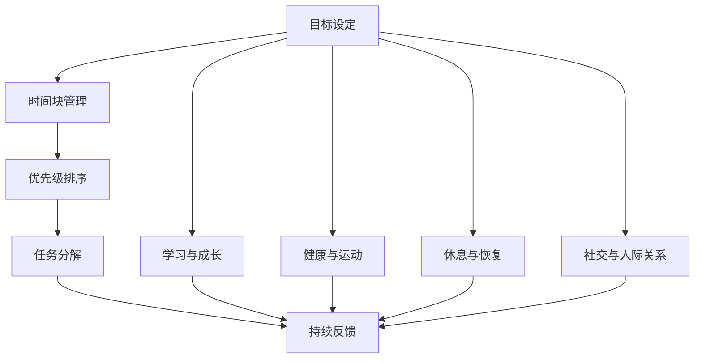

                 

### P9工作法简介

P9工作法是一种高效的个人时间管理和工作效率提升的方法，它通过一套严格的时间管理和任务分配机制，帮助个人更好地规划工作和生活，实现个人目标的高效达成。P9这个名字来源于其独特的结构，即由9个主要部分组成，每个部分都有其特定的功能和目标。

P9工作法的起源可以追溯到20世纪末，由几位资深的时间管理和效率专家共同研发。这些专家结合了多种时间管理和生产力方法，创造出了P9工作法。这种方法不仅适用于职场人士，也可以帮助学生、创业者甚至是家庭主妇等各个群体更有效地管理时间和资源。

P9工作法的核心理念在于通过科学的时间划分和任务分配，实现工作与生活的平衡。其核心组成部分包括：

1. **目标设定**：明确个人短期和长期目标，确保每个阶段的工作都有明确的方向和目标。
2. **时间块管理**：将时间划分为多个时间块，每个时间块专注于一个特定的任务，减少任务切换的成本。
3. **优先级排序**：根据重要性和紧急性对任务进行排序，确保最重要的任务优先处理。
4. **任务分解**：将复杂任务分解为小步骤，便于管理和完成。
5. **持续反馈**：通过定期回顾和调整，不断优化个人工作和生活计划。

P9工作法之所以受到广泛关注和认可，主要因为以下几个方面的优势：

- **提高工作效率**：通过科学的时间管理和任务分配，可以大幅提高工作效率，减少无效时间的浪费。
- **实现工作与生活的平衡**：通过合理规划工作时间和休息时间，帮助个人实现工作与生活的平衡，提高生活质量。
- **增强自律性**：P9工作法要求个人严格遵循时间表和计划，有助于培养自律习惯，提升个人管理能力。
- **持续成长**：通过不断回顾和调整，个人可以不断优化自己的工作和生活计划，实现持续的个人成长。

然而，P9工作法也存在一定的局限性。对于一些习惯性拖延者或者缺乏自律能力的人来说，P9工作法可能难以立即见效。此外，实施P9工作法需要个人有较高的自我管理能力和时间敏感度。

总之，P9工作法是一种实用的个人时间管理和工作效率提升的方法，它不仅帮助个人更好地管理时间和资源，还可以提升工作效率，实现工作与生活的平衡，从而实现个人目标的高效达成。

### P9工作法的关键概念和组成部分

P9工作法包含九个关键组成部分，每一个部分都对应着不同的功能和目标，共同构建了一个完整的工作和生活方式管理体系。以下是对每个组成部分的详细解释：

1. **目标设定**（Goal Setting）：
   - **核心概念**：明确个人短期和长期目标，是P9工作法的起点。通过设定目标，个人可以明确自己的方向和努力的方向。
   - **联系**：目标设定与整个P9工作法相联系，它是后续所有工作和计划的基础。
   - **重要性**：明确目标有助于提升个人动力和自律性，是实现高效工作和生活的重要前提。

2. **时间块管理**（Time Blocking）：
   - **核心概念**：将时间划分为多个时间块，每个时间块专注于一个特定的任务，从而减少任务切换的成本，提高专注度。
   - **联系**：时间块管理是任务分配和优先级排序的前提，有助于实现高效工作。
   - **重要性**：合理的时间块管理可以大幅提高工作效率，避免分散注意力。

3. **优先级排序**（Priority Sorting）：
   - **核心概念**：根据重要性和紧急性对任务进行排序，确保最重要的任务优先处理。
   - **联系**：优先级排序直接影响任务分配和时间块管理的有效性。
   - **重要性**：优先级排序有助于确保个人将时间和精力投入到最重要的任务上，提升工作效率。

4. **任务分解**（Task Delegation）：
   - **核心概念**：将复杂任务分解为小步骤，便于管理和完成。
   - **联系**：任务分解是任务执行的关键，有助于提升任务的完成质量和效率。
   - **重要性**：通过任务分解，个人可以更好地掌控任务进度，降低任务难度。

5. **持续反馈**（Continuous Feedback）：
   - **核心概念**：通过定期回顾和调整，不断优化个人工作和生活计划。
   - **联系**：持续反馈是P9工作法的核心机制，确保个人能够及时调整和优化自己的工作策略。
   - **重要性**：持续反馈有助于个人不断学习和改进，实现持续的个人成长。

6. **学习与成长**（Learning and Growth）：
   - **核心概念**：不断学习和提升自己的技能和知识，以适应不断变化的工作环境。
   - **联系**：学习与成长是P9工作法的重要组成部分，有助于提升个人竞争力。
   - **重要性**：在快速变化的时代，持续学习和成长是保持个人市场价值的关键。

7. **健康与运动**（Health and Exercise）：
   - **核心概念**：保持良好的身体健康和适度的运动，提升工作效率和生活质量。
   - **联系**：健康与运动是P9工作法的重要组成部分，有助于保持良好的工作状态。
   - **重要性**：健康是工作效能的保障，良好的身体状况有助于提高工作效率。

8. **休息与恢复**（Rest and Recovery）：
   - **核心概念**：合理安排休息时间，确保身体和心理的恢复。
   - **联系**：休息与恢复是P9工作法中不可或缺的一部分，有助于提高工作效率和避免过度疲劳。
   - **重要性**：充足的休息和恢复时间是保持长期高效工作的重要保障。

9. **社交与人际关系**（Social and Relationships）：
   - **核心概念**：建立和维护良好的社交网络，提升个人影响力。
   - **联系**：社交与人际关系是P9工作法中的重要组成部分，有助于拓展职业机会和个人成长。
   - **重要性**：良好的人际关系是职业发展和个人成长的助力。

### 核心概念之间的关联图

为了更直观地展示P9工作法中各个核心概念之间的关联，我们使用Mermaid流程图来绘制如下：

通过这个关联图，我们可以清晰地看到P9工作法中各个组成部分是如何相互联系、相互促进的。每个核心概念不仅独立存在，同时也与其他部分相互影响，共同构建了一个完整的工作和生活方式管理体系。

### P9工作法的主要优点

P9工作法凭借其系统化和结构化的特性，在提升个人效率和实现工作与生活的平衡方面展现出显著的优势。以下是对P9工作法主要优点的详细解析：

1. **提高工作效率**：
   - **时间块管理**：通过将时间划分为多个时间块，每个时间块专注于一个特定的任务，P9工作法有效减少了任务切换的成本，提高了专注度和工作效率。
   - **优先级排序**：根据重要性和紧急性对任务进行排序，确保个人能够将有限的时间和精力投入到最重要的任务上，从而提升整体工作效率。

2. **实现工作与生活的平衡**：
   - **休息与恢复**：合理安排休息时间，确保身体和心理的恢复，避免过度疲劳，有助于提升长期工作效率和生活质量。
   - **社交与人际关系**：通过建立和维护良好的社交网络，个人不仅能拓展职业机会，还能在紧张的工作之余获得情感支持和放松。

3. **增强自律性**：
   - **持续反馈**：定期回顾和调整工作计划，有助于个人不断学习和改进，培养自律习惯，提升自我管理能力。
   - **目标设定**：明确个人短期和长期目标，有助于提升个人动力和自我约束，确保工作计划的执行。

4. **促进个人成长**：
   - **学习与成长**：通过不断学习和提升自己的技能和知识，个人能够适应快速变化的工作环境，保持市场竞争力。
   - **健康与运动**：保持良好的身体健康和适度的运动，不仅有助于提升工作效率，还能促进个人身心健康，实现全面发展。

5. **灵活性和适应性**：
   - P9工作法不仅适用于职场人士，还可以帮助学生在学习和生活管理中提升效率，帮助家庭主妇更好地安排家务和育儿时间，展现了其广泛的适应性和灵活性。

通过以上优点的详细解析，我们可以看到P9工作法是如何通过系统化的方法和工具，帮助个人实现高效工作、提升生活质量和促进个人成长的。这些优点不仅适用于个人，也可以在团队和组织层面产生积极的影响，从而推动整体效能的提升。

### P9工作法的主要缺点

尽管P9工作法在提升个人效率和实现工作与生活平衡方面具有显著的优势，但其在实际应用中仍然存在一些缺点和挑战，以下将对其进行详细分析：

1. **实施难度**：
   - **高自律要求**：P9工作法要求个人具备较高的自律能力，严格遵循时间表和计划。对于习惯性拖延者或缺乏自律能力的个人来说，初期实施P9工作法可能会感到困难，需要付出额外的努力来克服。
   - **调整适应期**：从传统的自由工作模式切换到P9工作法，个人需要一段时间来适应新的时间和任务管理方式。在这个过程中，可能会出现一些不适应和挫折感，需要耐心和毅力来逐步调整和适应。

2. **依赖外部工具**：
   - **工具依赖性**：P9工作法依赖于各种时间管理和任务管理工具，如日程表、任务列表等。对于不习惯使用这些工具的个人来说，可能需要花费额外的时间和精力来学习和掌握这些工具的使用，从而增加了实施的难度。
   - **工具选择**：市面上存在众多时间管理和任务管理工具，个人在选择时可能感到困惑，需要花费时间和精力去试验和选择最适合自己需求的工具。

3. **时间管理复杂度**：
   - **任务切换成本**：虽然时间块管理有助于提高专注度和效率，但频繁的任务切换也可能带来额外的成本，尤其是在任务切换需要大量准备工作的情况下，可能会降低整体工作效率。
   - **任务优先级调整**：在实际工作中，任务的重要性和紧急性是动态变化的，个人需要不断调整任务的优先级。这种动态调整可能增加时间管理的复杂度，对个人时间和精力管理能力提出了更高的要求。

4. **缺乏灵活性**：
   - **固定时间块**：P9工作法中每个时间块都有固定的任务，这可能在某些情况下限制了灵活性，特别是在需要处理突发任务或突发事件时，个人可能难以立即适应。
   - **紧急任务处理**：在紧急情况下，可能需要立即中断当前的任务和时间块，这可能导致时间块管理失效，降低工作效率。

总之，虽然P9工作法在提高个人工作效率和实现工作与生活平衡方面具有显著的优势，但其实施过程中仍面临一些挑战和难点。个人在应用P9工作法时需要认识到这些缺点，并采取相应的策略和措施来克服这些困难，以确保P9工作法能够真正发挥其应有的效果。

### P9工作法的实际应用案例

为了更好地理解P9工作法在实际生活中的应用效果，我们可以通过几个典型的案例来进行分析。这些案例涵盖了不同职业背景和个人需求的用户，展示了P9工作法在不同情境下的实际效果。

#### 案例一：职场专业人士

李明是一名软件工程师，他在公司负责一个重要的项目。自从开始应用P9工作法后，他发现自己的工作效率有了显著提升。以下是李明如何应用P9工作法的具体例子：

1. **目标设定**：李明确立了一个短期目标，即在一个月内完成项目的核心功能开发。这个目标帮助他保持专注和动力。
   
2. **时间块管理**：他将每天的工作时间分为四个时间块，每个时间块专注于不同的任务。例如，上午专注于代码编写，下午专注于测试和调试。
   
3. **优先级排序**：根据任务的重要性和紧急性，李明将任务分为A、B、C三个等级，并优先处理A级任务。
   
4. **任务分解**：他将复杂的开发任务分解为多个小步骤，例如，将一个复杂的算法分解为几个简单的模块进行独立开发和测试。

通过P9工作法的应用，李明不仅按时完成了项目任务，还发现自己在工作中更加专注和高效。他的同事和领导也注意到他的进步，并开始对P9工作法产生了兴趣。

#### 案例二：学生

张婷是一名大学生，她在学习过程中感到时间压力很大，经常感到无法合理分配学习时间。自从开始应用P9工作法后，她的学习效率得到了显著提升。

1. **目标设定**：张婷明确了自己的学习目标，包括每学期的成绩要求和课外活动参与目标。
   
2. **时间块管理**：她将每天的学习时间分为四个时间块，每个时间块专注于一门课程的学习。例如，上午的时间块用于数学课的学习，下午的时间块用于英语课的学习。

3. **优先级排序**：根据每门课程的重要性和考试时间，张婷将学习任务分为A、B、C三个等级，并优先处理A级任务。

4. **任务分解**：她将每门课程的考试内容分解为多个知识点，并制定详细的学习计划。

通过P9工作法的应用，张婷不仅提高了学习效率，还学会了如何合理安排学习时间。她发现自己能够更好地掌握知识，并且在考试中表现更加出色。

#### 案例三：家庭主妇

李梅是一名家庭主妇，她负责家庭日常事务和孩子的教育。为了更好地管理时间和提高家庭生活质量，她开始应用P9工作法。

1. **目标设定**：李梅明确了自己的家庭目标，包括家庭清洁、孩子教育和家庭活动安排等。

2. **时间块管理**：她将每天的时间分为多个时间块，每个时间块专注于不同的家庭任务。例如，上午的时间块用于家务劳动，下午的时间块用于辅导孩子的学习。

3. **优先级排序**：根据家庭任务的重要性和紧急性，李梅将任务分为A、B、C三个等级，并优先处理A级任务。

4. **任务分解**：她将复杂的家务任务分解为多个小步骤，例如，将打扫客厅分解为扫地、擦窗户和整理家具等。

通过P9工作法的应用，李梅不仅提高了家庭事务的管理效率，还减少了家庭冲突，提高了家庭生活质量。她发现，自己能够更好地平衡家庭和工作，更有时间和精力享受生活。

这些实际应用案例表明，P9工作法在提升个人工作效率和实现工作与生活平衡方面具有广泛的适用性。无论是职场人士、学生还是家庭主妇，都可以通过P9工作法找到适合自己的时间管理方法，从而实现个人目标的高效达成。

### 实施P9工作法的具体步骤和最佳实践

实施P9工作法需要明确的步骤和最佳实践，以确保个人能够顺利过渡并最大化其效果。以下详细介绍了实施P9工作法的具体步骤、常见问题及解决方案、以及一些最佳实践建议。

#### 第一步：目标设定

**关键步骤**：
1. **明确短期和长期目标**：首先，个人需要明确自己在短期（如一个月、一个季度）和长期（如一年、五年）内的目标。这些目标可以是职业上的、学习上的、健康上的或者个人生活上的。
2. **具体化目标**：将目标具体化，使其具有可操作性和可衡量性。例如，“提高编程技能”可以具体化为“掌握Python编程语言并完成两个编程项目”。

**常见问题及解决方案**：
- **问题**：目标设定过于模糊或不切实际。
- **解决方案**：确保目标具体、明确和可实现。可以使用SMART原则（具体、可衡量、可达成、相关、时限性）来设定目标。

**最佳实践**：
- **定期回顾和调整**：每月或每季度回顾目标进展，并根据实际情况调整目标。

#### 第二步：时间块管理

**关键步骤**：
1. **划分时间块**：将每天的时间划分为多个时间块，每个时间块专注于一个特定的任务或活动。例如，可以将一天分为早晨、上午、下午、傍晚和晚上等时间块。
2. **任务分配**：根据任务的重要性和紧急性，将任务分配到不同的时间块。优先处理重要且紧急的任务。

**常见问题及解决方案**：
- **问题**：任务切换频繁导致效率降低。
- **解决方案**：尽量减少任务切换，确保每个时间块专注于单一任务。可以使用番茄工作法（25分钟专注工作，5分钟休息）来提高专注度。

**最佳实践**：
- **预留机动时间**：在时间块安排中预留一定的机动时间，用于处理突发任务。

#### 第三步：优先级排序

**关键步骤**：
1. **任务排序**：根据任务的重要性和紧急性对任务进行排序，将最关键的任务放在首位。
2. **动态调整**：在实际工作中，根据任务的进展和变化动态调整任务的优先级。

**常见问题及解决方案**：
- **问题**：无法区分任务的优先级。
- **解决方案**：使用紧急-重要矩阵（也称为“艾森豪威尔矩阵”）来区分任务，将任务分为“紧急且重要”、“紧急但不重要”、“不紧急但重要”、“不紧急且不重要”四个类别。

**最佳实践**：
- **定期回顾**：每周或每月定期回顾任务优先级，并根据实际情况进行调整。

#### 第四步：任务分解

**关键步骤**：
1. **分解任务**：将复杂的任务分解为小步骤，使其更加具体和可操作。
2. **制定计划**：为每个小步骤制定详细的执行计划，明确完成时间和所需资源。

**常见问题及解决方案**：
- **问题**：任务分解过于粗糙或过于详细。
- **解决方案**：任务分解需要适中，既要具体到每个小步骤，又要保持整体的可操作性。

**最佳实践**：
- **使用任务清单**：制作任务清单，明确每个小步骤的任务和完成时间。

#### 第五步：持续反馈

**关键步骤**：
1. **定期回顾**：定期回顾工作进展和效果，识别成功和不足之处。
2. **调整计划**：根据回顾结果调整工作计划和策略。

**常见问题及解决方案**：
- **问题**：缺乏持续反馈机制。
- **解决方案**：设置定期回顾时间，确保能够及时调整和优化工作计划。

**最佳实践**：
- **使用反馈工具**：可以使用工作日志、周报等工具记录和回顾工作进展。

#### 第六步：学习与成长

**关键步骤**：
1. **设定学习目标**：根据工作需求和个人兴趣设定学习目标。
2. **制定学习计划**：为每个学习目标制定详细的执行计划，包括学习内容、时间和方式。

**常见问题及解决方案**：
- **问题**：缺乏持续学习的动力和计划。
- **解决方案**：制定明确的学习目标和计划，并设置奖励机制以保持学习动力。

**最佳实践**：
- **定期评估**：定期评估学习效果，并根据评估结果调整学习计划。

#### 第七步：健康与运动

**关键步骤**：
1. **设定健康目标**：设定健康目标，如减肥、健身或改善饮食习惯。
2. **制定健康计划**：为每个健康目标制定详细的执行计划，包括饮食、锻炼和休息。

**常见问题及解决方案**：
- **问题**：缺乏健康管理的意识和行动。
- **解决方案**：明确健康目标，并制定具体的健康计划。

**最佳实践**：
- **健康监测**：使用健康监测设备（如手环、APP）记录健康数据，以便更好地管理和调整健康计划。

#### 第八步：休息与恢复

**关键步骤**：
1. **设定休息时间**：合理安排工作与休息时间，确保充足的休息和恢复。
2. **进行放松活动**：进行适当的放松活动，如冥想、瑜伽或阅读。

**常见问题及解决方案**：
- **问题**：工作繁忙导致缺乏休息时间。
- **解决方案**：预留充足的休息时间，并确保在休息时间进行有效的放松和恢复。

**最佳实践**：
- **定期体检**：定期进行体检，确保身体处于最佳状态。

#### 第九步：社交与人际关系

**关键步骤**：
1. **设定社交目标**：设定社交目标，如拓展职业网络、建立深厚的友谊或参与社区活动。
2. **制定社交计划**：为每个社交目标制定详细的执行计划，包括社交活动、时间和方式。

**常见问题及解决方案**：
- **问题**：缺乏社交动力或社交技巧。
- **解决方案**：明确社交目标，并制定具体的社交计划，同时提高自己的社交技巧。

**最佳实践**：
- **定期社交活动**：定期参加社交活动，如聚会、讲座或俱乐部活动。

通过以上具体步骤和最佳实践，个人可以更有效地实施P9工作法，从而提升工作效率、实现工作与生活的平衡，并实现个人目标的高效达成。

### 个人品牌建设的重要性

在当今竞争激烈的社会环境中，个人品牌建设已经成为个人职业发展和成功的关键因素。所谓个人品牌，指的是个人在公众心目中形成的独特形象和认知，它包括个人的专业知识、技能、价值观、人格特质和社会声誉等。个人品牌不仅仅是一个简单的标识，而是一个综合性的概念，它能够在职业竞争中为个人带来诸多优势。

首先，个人品牌建设有助于提升个人职业竞争力。在一个高度信息化的社会中，职场人士面临的信息量庞大，如何脱颖而出成为关键。一个强有力的个人品牌可以帮助个人在众多候选人中脱颖而出，增强雇主或客户的信任感和吸引力。例如，一个在行业中具有良好声誉的工程师，往往比其他不具备这种声誉的工程师更容易获得高薪职位或重要项目的机会。

其次，个人品牌建设有助于扩大个人职业机会。一个强大的个人品牌可以带来更多的职业机会，包括更好的工作、更多的项目合作和更高的社会地位。例如，一个在社交媒体上拥有大量粉丝和良好评价的营销专家，不仅能够在职场中获得更多的关注，还可能受邀参加行业会议、讲座和研讨会，进一步拓展职业网络。

此外，个人品牌建设也有助于实现个人价值最大化。一个清晰且具有吸引力的个人品牌可以帮助个人更好地展示自己的能力和价值，从而获得更高的薪资和福利待遇。例如，一个在技术领域拥有高知名度的程序员，可以通过提供高质量的技术咨询或培训服务，获得额外的收入来源。

然而，个人品牌建设并非一蹴而就，它需要时间和持续的努力。首先，个人需要明确自己的品牌定位，这包括了解自己的优势和特长，确定自己在行业中的独特价值。例如，一个技术专家可能专注于某一项特定技术领域，而一个项目经理可能更擅长团队管理和项目协调。

接下来，个人需要通过多种渠道展示和传播自己的品牌。这包括但不限于社交媒体、专业博客、在线课程、演讲和行业会议等。通过这些渠道，个人可以展示自己的专业知识和经验，建立自己的专业形象。例如，一个技术专家可以通过撰写技术博客、发布技术视频或开设在线课程，来展示自己的技术能力和专业知识。

此外，个人品牌建设还需要持续不断地学习和成长。个人需要紧跟行业的发展趋势，不断提升自己的技能和知识，以保持自己在行业中的竞争力。例如，一个专注于人工智能领域的专家，需要不断学习最新的AI技术和应用，以保持在行业中的领先地位。

最后，个人品牌建设也需要良好的社交关系。个人需要通过积极参与行业活动和社交网络，建立和维护广泛的职业网络。这些关系不仅可以帮助个人获取职业机会，还可以提供专业的建议和指导，促进个人的职业发展。

总之，个人品牌建设对于个人的职业发展和成功至关重要。它不仅能够提升个人在职场中的竞争力，还能带来更多的职业机会和收入来源。通过明确品牌定位、展示专业知识和经验、持续学习和成长，以及建立和维护良好的社交关系，个人可以有效地打造一个强大且具有吸引力的个人品牌，从而在激烈的职场竞争中脱颖而出。

### 个人品牌建设的核心要素

个人品牌建设是一个系统性的过程，它涉及多个核心要素。以下将详细探讨这些要素，包括独特的卖点（USP）、专业形象、社交媒体策略和内容创作。

#### 独特的卖点（USP）

独特的卖点（Unique Selling Proposition，简称USP）是个人品牌建设中的核心要素之一。USP指的是个人所拥有的独特优势或特点，这些优势能够使其在竞争激烈的职场中脱颖而出。为了确定自己的USP，个人需要深入思考以下几个问题：

1. **专业特长**：个人在某个领域或技能上的独特优势是什么？例如，一个数据分析师可能擅长使用高级数据挖掘技术来发现市场趋势。
2. **工作成就**：个人在职业生涯中取得了哪些显著成就？这些成就可以是某个重要项目的成功交付、一个创新解决方案的提出，或是一个重要专利的获得。
3. **价值观和信念**：个人在职业生涯中坚守的价值观和信念是什么？这些价值观和信念可以体现个人的品格和职业道德。

确定USP后，个人需要将其清晰地传达给目标受众。这可以通过个人简介、演讲和社交媒体等渠道实现。例如，一个在软件开发领域有深厚背景的专家，可以在社交媒体上分享自己的编程心得和技术见解，从而展示其在这一领域的专业能力。

#### 专业形象

专业形象是个人品牌建设中的另一个重要要素。专业形象不仅仅是指外表，还包括个人言行举止、沟通技巧和职业态度。一个良好的专业形象可以增强个人在职场中的可信度和影响力。以下是打造良好专业形象的几个要点：

1. **着装规范**：根据不同的职业场景，选择合适的着装风格。例如，在正式场合中，穿着正装可以展示个人的专业性和认真态度。
2. **言行举止**：保持得体的言行举止，避免使用不适当的语言或行为。与同事、客户和行业内的其他专业人士保持良好的沟通和互动。
3. **沟通技巧**：提升沟通技巧，包括倾听、表达和反馈。清晰的沟通可以帮助个人更有效地传达信息，减少误解和冲突。
4. **职业态度**：展现出积极、专业的职业态度，对待工作和同事认真负责。这种态度可以赢得他人的尊重和信任。

#### 社交媒体策略

社交媒体是现代个人品牌建设的重要工具。一个有效的社交媒体策略可以帮助个人扩大影响力、展示专业知识和建立广泛的职业网络。以下是一些关键点：

1. **选择合适的平台**：根据个人目标和受众，选择适合的社交媒体平台。例如，LinkedIn适合职业人士展示专业形象，Twitter适合实时分享行业动态和观点，而微信公众号适合深度内容创作和知识传播。
2. **内容创作**：定期发布高质量的内容，包括行业见解、专业文章、技术博客、项目案例等。这些内容需要具备价值性和独特性，能够吸引目标受众的关注。
3. **互动与参与**：积极与受众互动，回复评论、参与讨论和分享他人的内容。这种互动可以帮助个人建立良好的社交关系，提高品牌认知度。
4. **一致性**：保持社交媒体账号的一致性和专业性，确保所有发布的内容都符合个人的品牌形象和价值观。

#### 内容创作

内容创作是个人品牌建设的重要组成部分。高质量的内容不仅能够展示个人的专业知识和经验，还可以帮助个人在行业内建立权威地位。以下是内容创作的一些建议：

1. **确定主题**：根据自己的专业领域和目标受众，确定内容创作的主题。主题需要具备吸引力和价值性，能够吸引目标受众的兴趣。
2. **保持原创性**：避免抄袭和复制他人的内容，确保自己的内容原创且具有独特性。原创内容更能体现个人的专业性和思考深度。
3. **形式多样**：使用多种形式进行内容创作，如博客文章、视频、PPT、图表和数据可视化等。不同形式的内容可以吸引不同类型的受众，提高内容的传播效果。
4. **持续更新**：定期更新内容，保持个人品牌的活跃度和新鲜感。持续更新的内容可以帮助个人在社交媒体上保持高频率的曝光，增强品牌认知度。

通过以上核心要素的规划和实施，个人可以有效地打造一个强大且具有吸引力的个人品牌，从而在职场中脱颖而出，实现职业目标的高效达成。

### 个人品牌建设过程中的步骤和策略

个人品牌建设是一个持续且系统性的过程，需要明确的目标、合理的规划和有效的执行。以下详细介绍了个人品牌建设过程中的主要步骤和策略。

#### 第一步：定位品牌

**关键策略**：
1. **确定目标受众**：明确个人品牌的目标受众是谁，这些受众可能是潜在雇主、客户、行业内的专业人士或者学生。
2. **分析自身优势**：深入了解自身的专业特长、技能、成就和价值观，确定个人品牌的独特卖点（USP）。
3. **目标设定**：根据目标受众和自身优势，设定清晰的品牌定位和目标，例如成为一名知名的数据科学家、技术领域的意见领袖或职场专家。

**实施方法**：
- **SWOT分析**：通过SWOT（优势、劣势、机会、威胁）分析，全面了解自身的优劣势以及外部环境中的机会和威胁，从而为品牌定位提供依据。
- **市场调研**：通过调查问卷、访谈和观察，了解目标受众的需求和偏好，确保品牌定位能够满足市场需求。

#### 第二步：建立专业形象

**关键策略**：
1. **制定形象策略**：根据品牌定位，制定符合个人风格和职业需求的形象策略，包括着装、语言、行为等。
2. **专业培训**：提升专业技能和沟通技巧，确保在职业场合中展现出专业的形象。
3. **建立个人网站或博客**：创建一个专业的个人网站或博客，展示个人品牌的专业形象和内容。

**实施方法**：
- **形象设计**：委托专业设计师设计个人形象，包括名片、社交媒体头像和网站布局等。
- **持续学习**：定期参加培训课程、研讨会和行业会议，不断提升个人技能和知识。

#### 第三步：制定社交媒体策略

**关键策略**：
1. **选择合适平台**：根据品牌定位和目标受众，选择适合的社交媒体平台，如LinkedIn、Twitter、微信公众号等。
2. **内容创作**：制定内容创作计划，包括主题、形式、频率和发布时间等。
3. **互动与参与**：积极参与社交媒体互动，回复评论、参与讨论和分享他人内容，建立广泛的社交网络。

**实施方法**：
- **平台分析**：分析不同社交媒体平台的特点和受众，选择最适合自己品牌推广的平台。
- **内容计划**：制定详细的内容计划，确保内容的质量和一致性，例如每周发布一篇技术博客或一次行业分析。

#### 第四步：内容创作和传播

**关键策略**：
1. **原创内容**：创作高质量、有价值的原创内容，展示个人专业知识和见解。
2. **多样化形式**：使用多种形式进行内容创作，如文章、视频、PPT、图表等，以吸引不同类型的受众。
3. **渠道整合**：整合不同渠道进行内容传播，如个人博客、社交媒体、电子邮件通讯等。

**实施方法**：
- **内容创作**：根据专业领域和目标受众，创作具有深度和广度的原创内容，确保内容的原创性和独特性。
- **多平台发布**：将内容发布到多个平台，如个人博客、LinkedIn、微信公众号等，以扩大传播范围。
- **SEO优化**：对内容进行SEO（搜索引擎优化）处理，提高内容在搜索引擎中的排名，增加曝光度。

#### 第五步：持续学习和改进

**关键策略**：
1. **跟踪反馈**：定期跟踪个人品牌的反馈和表现，了解目标受众的反馈和需求。
2. **数据驱动**：使用数据分析工具，如Google Analytics、社交媒体分析工具等，分析品牌表现和用户行为。
3. **持续改进**：根据反馈和数据分析结果，不断调整品牌策略和内容创作计划。

**实施方法**：
- **定期回顾**：每月或每季度进行品牌回顾，评估品牌表现和效果，识别问题和改进机会。
- **数据监测**：使用数据分析工具，监控内容的表现和用户互动，及时调整内容策略。

通过以上步骤和策略，个人可以系统地建设自己的品牌，提高在职场中的影响力和竞争力，实现职业目标的高效达成。

### 个人品牌建设中的常见挑战及解决方案

在个人品牌建设的过程中，个人可能会遇到各种挑战，这些挑战既包括内部的自我管理问题，也包括外部的环境因素。以下将探讨个人品牌建设中的几个常见挑战，并提出相应的解决方案。

#### 挑战一：缺乏持续动力

**原因分析**：缺乏持续动力可能是由于个人对品牌建设的重要性和必要性认识不足，或者对品牌建设的过程感到枯燥乏味。

**解决方案**：
- **明确目标和意义**：重新审视个人品牌建设的目标和意义，确保个人明确品牌建设对职业发展和个人成长的价值。
- **设定短期目标**：将长期目标分解为短期目标，每个短期目标的实现都会带来一定的成就感和动力。
- **奖励机制**：为自己设定奖励机制，例如每完成一个阶段性的目标，就给自己一些小奖励，如购买一本心仪的书、看一场电影等。

#### 挑战二：内容创作困难

**原因分析**：内容创作困难可能是由于个人缺乏写作技巧、对专业领域的深度不够，或者对内容创作缺乏系统性的规划。

**解决方案**：
- **学习写作技巧**：参加写作培训课程或阅读相关书籍，提升写作能力和技巧。
- **深度研究专业领域**：通过阅读专业书籍、参加行业会议和研讨会，加深对专业领域的理解和掌握。
- **系统性规划**：制定详细的内容创作计划，包括主题、形式、发布时间和频率等，确保内容创作有序进行。

#### 挑战三：社交媒体管理复杂

**原因分析**：社交媒体管理复杂可能是由于平台过多、内容创作和发布缺乏系统性和持续性，或者时间管理不当。

**解决方案**：
- **选择合适平台**：根据个人品牌定位和目标受众，选择最适合的几个社交媒体平台，集中精力管理这些平台。
- **内容模板**：制定内容模板，简化内容创作和发布流程，提高效率。
- **时间管理**：合理安排时间，确保有足够的时间用于社交媒体管理和内容创作。

#### 挑战四：反馈和调整困难

**原因分析**：反馈和调整困难可能是由于个人对反馈的理解和接受存在障碍，或者缺乏有效的反馈机制和调整策略。

**解决方案**：
- **积极接受反馈**：保持开放心态，积极接受来自不同角度的反馈，将其视为个人成长的机会。
- **建立反馈机制**：定期收集和分析用户反馈，使用问卷调查、社交媒体互动、邮件回复等方式获取反馈。
- **动态调整策略**：根据反馈结果，动态调整个人品牌建设策略，确保内容创作和传播策略与目标受众的需求和偏好相符。

#### 挑战五：时间管理困难

**原因分析**：时间管理困难可能是由于工作繁忙、个人事务繁多，或者时间管理方法不当。

**解决方案**：
- **优化工作流程**：优化工作流程，减少不必要的环节和任务，提高工作效率。
- **合理安排时间**：制定详细的时间管理计划，将时间分配给不同的任务和活动，确保有足够的时间进行个人品牌建设。
- **借助工具**：使用时间管理工具，如日程表、任务列表和项目管理软件，帮助规划和管理时间。

通过以上解决方案，个人可以更好地应对个人品牌建设过程中的各种挑战，持续提升个人品牌的影响力，实现职业目标的高效达成。

### 实现P9工作法与个人品牌建设结合的具体策略

P9工作法与个人品牌建设结合，可以发挥出更大的效能，帮助个人在职业生涯中取得成功。以下是一些具体的策略，旨在实现二者的有机结合。

#### 第一，目标设定与品牌定位的一致性

**策略**：在设定P9工作法中的目标时，确保这些目标与个人品牌定位一致。例如，如果个人的品牌定位是成为一名知名的数据科学家，那么P9工作法中的目标可以包括完成特定项目、发表学术论文或获得行业认证等。

**实现方法**：
- **定期回顾**：每季度或每月回顾个人目标，确保这些目标与个人品牌建设方向一致。
- **动态调整**：根据实际情况调整目标，确保目标始终与个人品牌定位保持一致。

#### 第二，时间块管理与内容创作

**策略**：将P9工作法中的时间块管理用于内容创作和品牌传播。通过合理划分时间块，确保每个时间块都有具体的任务，例如写作、研究和社交媒体管理。

**实现方法**：
- **内容创作时间块**：每天或每周设定专门的时间块用于内容创作，确保有足够的时间投入到高质量的写作和研究中。
- **社交媒体管理时间块**：分配一定的时间块用于管理社交媒体账号，发布内容、回复评论和参与讨论。

#### 第三，优先级排序与品牌活动

**策略**：根据P9工作法中的优先级排序，安排个人品牌建设中的关键活动。例如，优先处理那些能够提升品牌知名度、拓展职业网络或增加客户信任度的重要任务。

**实现方法**：
- **制定任务清单**：将个人品牌建设任务列出清单，并根据重要性和紧急性进行排序。
- **动态调整**：定期回顾任务清单，并根据实际情况调整优先级，确保关键任务得到优先处理。

#### 第四，任务分解与资源利用

**策略**：使用P9工作法中的任务分解技巧，将复杂的品牌建设任务分解为小步骤，便于管理和完成。同时，合理利用各种资源，如书籍、网络课程和行业会议等。

**实现方法**：
- **任务分解**：将每个品牌建设任务分解为具体的行动步骤，确保每个步骤都有明确的执行计划。
- **资源整合**：利用在线资源、行业会议和专家咨询等，获取必要的知识和支持，提升个人品牌建设的效果。

#### 第五，持续反馈与品牌监测

**策略**：通过P9工作法中的持续反馈机制，监测个人品牌建设的进展和效果，及时调整策略。

**实现方法**：
- **定期回顾**：每月或每季度进行品牌建设回顾，分析内容传播效果、用户反馈和品牌知名度变化。
- **数据驱动**：使用数据分析工具，如社交媒体分析工具、网站流量分析等，监测品牌建设的数据指标，制定数据驱动的策略调整。

#### 第六，学习与成长与品牌更新

**策略**：持续学习和成长，不断更新个人品牌内容，以适应行业发展和个人成长。

**实现方法**：
- **定期学习**：参加在线课程、行业研讨会和培训，不断提升专业知识和技能。
- **内容更新**：定期更新个人网站、博客和社交媒体内容，保持品牌的活力和吸引力。

#### 第七，健康与运动与品牌形象

**策略**：通过保持健康的生活方式，提升个人形象，增强品牌吸引力。

**实现方法**：
- **健康计划**：制定详细的健康和运动计划，确保身体健康和精力充沛。
- **品牌展示**：在社交媒体和个人网站上展示健康和运动成果，如参加马拉松比赛或健身成就，提升品牌形象。

通过这些具体策略，个人可以更好地将P9工作法与个人品牌建设相结合，实现个人目标和职业发展的高效达成。

### P9工作法与个人品牌建设结合的综合效果

P9工作法与个人品牌建设的结合，能够在多个方面产生积极的效果，从而帮助个人在职业生涯中取得成功。以下将详细分析这种结合的综合效果。

首先，P9工作法为个人品牌建设提供了一个高效的时间管理和任务执行框架。通过科学的目标设定、时间块管理、优先级排序和任务分解，个人可以更有效地利用时间，专注于关键任务，提升工作效率。这种高效的工作方式不仅有助于个人完成工作任务，还能为个人品牌建设提供充足的时间和精力。例如，个人可以利用P9工作法中的时间块管理，专门分配时间进行内容创作、品牌传播和社交互动，从而确保这些关键活动的顺利进行。

其次，个人品牌建设通过持续的内容创作和社交媒体管理，为个人提供了展示专业知识和经验的平台。在P9工作法的框架下，个人可以将品牌建设任务分解为具体的行动步骤，并通过持续反馈和调整，不断优化自己的品牌策略。这种动态调整机制有助于个人在快速变化的职场环境中保持竞争力。例如，一个数据分析师可以利用P9工作法中的学习与成长部分，不断更新自己的技能和知识，并通过社交媒体分享最新的行业动态和研究成果，提升个人品牌的专业性和权威性。

此外，P9工作法与个人品牌建设的结合还有助于提升个人的自律性和自我管理能力。通过严格执行时间表和计划，个人可以培养出良好的自律习惯，从而在长期内保持高效的工作状态。这种自律性和自我管理能力不仅有助于个人完成工作任务，还能为个人品牌建设提供坚实的支持。例如，一个创业者可以利用P9工作法来管理日常事务和项目进度，确保关键任务按时完成，从而提升品牌的市场认可度。

再者，P9工作法与个人品牌建设结合还能在社交与人际关系方面产生积极的效果。通过有效的品牌建设和社交媒体管理，个人可以建立广泛的职业网络，拓展人脉资源。在P9工作法的指导下，个人可以合理安排时间参与社交活动，维护和拓展人际关系。例如，一个技术专家可以通过参加行业会议、讲座和研讨会，结识行业内的专业人士，从而提升个人品牌的影响力和知名度。

最后，P9工作法与个人品牌建设结合还能促进个人的持续学习和成长。通过不断学习和提升专业技能，个人可以保持自己在行业中的竞争力，并为个人品牌建设提供源源不断的创新和灵感。例如，一个设计师可以通过参加在线课程和阅读专业书籍，学习最新的设计趋势和技术，从而为个人品牌注入新的活力。

总之，P9工作法与个人品牌建设的结合，不仅能够帮助个人在职业生涯中提升工作效率和实现工作与生活的平衡，还能在多个方面增强个人的品牌影响力和竞争力。通过科学的时间管理和任务执行，持续的内容创作和社交媒体管理，以及自律性和自我管理能力的培养，个人可以更好地展示自己的专业知识和价值，实现个人职业目标的高效达成。

### 案例研究：P9工作法与个人品牌建设的成功实践

为了更深入地理解P9工作法与个人品牌建设的结合如何在实际中发挥效果，我们来看一个具体的成功案例。这位案例主人公是一位名叫李华的技术专家，他在应用P9工作法和个人品牌建设策略后，取得了显著的职业成就。

#### 李华的职业背景

李华是一名技术专家，专注于云计算和大数据领域。他在一家知名科技公司工作，担任高级数据工程师。李华在技术领域拥有深厚的背景和丰富的经验，但他发现，随着行业的快速发展，仅仅依靠技术实力已经不足以在职场中脱颖而出。为了进一步提升自己的竞争力，李华决定将P9工作法与个人品牌建设结合起来，为自己的职业生涯注入新的动力。

#### 实践P9工作法

1. **目标设定**：李华首先明确了短期和长期目标。短期目标是提升自己在云计算和大数据领域的专业水平，并发表一篇具有影响力的学术论文；长期目标是成为行业内公认的技术专家，拓展自己的职业网络。

2. **时间块管理**：为了高效地管理时间，李华将每天的工作和闲暇时间划分为多个时间块。每天上午专注于技术研究和开发，下午用于撰写技术博客和学术论文。每周还会安排固定时间用于学习新技术和参加在线课程。

3. **优先级排序**：李华根据任务的重要性和紧急性，对每天的任务进行排序。例如，优先处理需要提交的学术论文和关键项目，确保这些高优先级任务能够按时完成。

4. **任务分解**：为了确保每个任务都能高效完成，李华将复杂的技术研究和论文撰写任务分解为小步骤。例如，将一篇论文分解为文献综述、数据收集、数据分析、结果撰写和论文修改等阶段。

5. **持续反馈**：李华定期回顾自己的工作进展，根据反馈结果调整工作计划和策略。他会定期与导师和同事交流，获取他们的意见和建议，不断优化自己的工作方式。

#### 个人品牌建设

1. **专业形象**：李华注重自己的专业形象，通过穿着得体的正装、清晰的表达和专业的言行举止，展示出自己在技术领域的权威性。

2. **社交媒体策略**：李华选择了LinkedIn和Twitter等社交媒体平台，定期发布技术博客和行业动态。他确保每篇文章都具备高质量和独特性，吸引了大量同行业的专业人士关注。

3. **内容创作**：李华通过撰写技术博客、发表学术论文和录制技术视频，展示自己的专业知识和实践经验。他的博客文章和视频内容涵盖了云计算、大数据和人工智能等热门话题，受到了读者的广泛好评。

4. **互动与参与**：李华积极参与行业讨论和会议，与同行交流心得和经验。他不仅分享自己的见解，还积极回应他人的问题和意见，建立了广泛的职业网络。

#### 成果与反思

通过实践P9工作法和个人品牌建设，李华取得了显著的成果。他在短时间内发表了一篇具有影响力的学术论文，并在技术社区中获得了广泛的认可。他的社交媒体账号也吸引了大量粉丝，成为行业内的知名技术专家。

李华的成功实践证明，P9工作法与个人品牌建设策略的结合，不仅能够帮助个人提升工作效率和专业水平，还能在职业生涯中取得显著的成就。以下是李华的经验和反思：

- **明确目标**：目标设定是P9工作法和品牌建设的基础。明确的目标可以帮助个人保持专注和动力。
- **科学的时间管理**：合理的时间块管理和优先级排序，确保个人能够高效地完成关键任务，提升工作效率。
- **高质量的内容创作**：高质量的内容是个人品牌建设的关键。持续创作有价值、有独特性的内容，能够提升个人在行业中的影响力和认可度。
- **积极参与社交活动**：积极参与行业讨论和会议，拓展职业网络，有助于个人在职场中建立良好的声誉和人际关系。

总之，李华的成功案例展示了P9工作法与个人品牌建设策略如何在实际中发挥作用，帮助个人实现职业目标的高效达成。

### 总结与未来展望

P9工作法和个人品牌建设是现代职业人士实现高效工作和职业发展的关键工具。通过系统化的时间管理和任务执行策略，P9工作法帮助个人优化时间利用，提高工作效率，实现工作与生活的平衡。而个人品牌建设则通过持续的内容创作和社交媒体管理，提升个人在职场中的影响力和竞争力。

在实际应用中，P9工作法和个人品牌建设相结合，可以产生显著的协同效应。这种结合不仅有助于个人在职业领域中脱颖而出，还能为个人提供更广阔的职业机会和更高的收入潜力。

未来，随着人工智能和大数据技术的不断发展，P9工作法和个人品牌建设将会更加智能化和个性化。通过数据分析和技术工具的辅助，个人可以更精准地制定和调整工作计划，提高品牌建设的效率和效果。

为了进一步优化P9工作法和个人品牌建设，以下是一些建议：

1. **持续学习与提升**：紧跟行业趋势，不断提升专业技能和知识，以保持竞争力。
2. **智能化工具应用**：利用人工智能技术，如自动化日程安排和智能任务管理工具，提高工作效率。
3. **内容创新与多样化**：在内容创作中，尝试多种形式，如视频、图表和数据可视化，以吸引更多受众。
4. **互动与反馈机制**：建立有效的互动和反馈机制，与受众保持紧密联系，及时调整品牌建设策略。

总之，P9工作法和个人品牌建设是现代职业人士实现成功的关键。通过科学的方法和持续的努力，个人可以在职场中实现高效工作和职业发展，为自己创造更加光明的前景。

