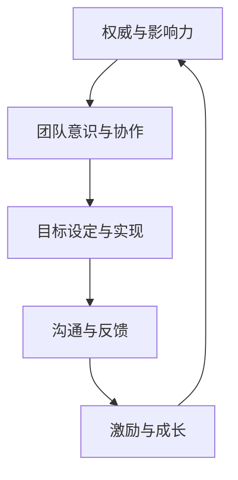

                 


### 背景介绍

在现代企业中，领导力作为推动组织发展和实现目标的关键因素，受到越来越多的关注。P9工作法，作为一种集成了多种管理方法论和领导力技巧的先进管理工具，已成为企业领导者和项目经理提升管理效能的重要手段。《P9工作法中的"领导力"：团队管理和项目协调》旨在深入探讨P9工作法中领导力这一核心要素，帮助读者理解和掌握如何在团队管理和项目协调中应用领导力，从而提升企业的整体竞争力。

P9工作法是一种综合性的管理方法论，由九个关键步骤组成，涵盖了项目策划、执行、监控和收尾的全过程。其中，领导力贯穿于每个步骤之中，对团队的动力、协调和执行力产生直接影响。本书围绕领导力的核心概念，详细解析了其在团队管理和项目协调中的实际应用。

### 核心概念与联系

在探讨P9工作法中的领导力之前，有必要首先了解领导力的核心概念。领导力不仅仅指领导者的个人特质和能力，还包括对团队、项目和组织的全面影响力。以下是领导力的几个核心概念及其相互联系：

1. **权威与影响力：** 权威是领导者通过职位或技能获得的影响力，而影响力则是领导者通过个人魅力、价值观和领导风格赢得的认可和追随。

2. **团队意识与协作：** 领导者需要培养团队的集体意识，促进团队成员之间的协作，从而提高团队的整体绩效。

3. **目标设定与实现：** 领导者应明确团队的目标，并为实现这些目标制定合理的计划和策略。

4. **沟通与反馈：** 沟通是领导者与团队成员之间传递信息、协调行动的重要手段，而及时的反馈则是确保团队正确行动的重要保障。

5. **激励与成长：** 领导者应关注团队成员的激励和成长，通过激励措施和培训机会，提升团队成员的积极性和专业能力。

以下是领导力核心概念之间的相互联系架构Mermaid流程图：



通过这个流程图，我们可以清晰地看到领导力各个核心概念之间的互动关系，以及它们在团队管理和项目协调中的应用。

### 核心算法原理讲解

为了更好地理解领导力在团队管理和项目协调中的应用，我们可以将其视为一种算法原理，通过伪代码来详细阐述其操作步骤：

```python
# 领导力应用伪代码

# 定义领导力核心步骤
def leadership_algorithm(team, project, goals):
    # 步骤1：建立团队意识
    build_team_consciousness(team)
    
    # 步骤2：设定明确的目标
    set_clear_goals(project, goals)
    
    # 步骤3：促进有效沟通
    promote_effective_communication(team, project)
    
    # 步骤4：提供激励和反馈
    provide_incentives_and_feedback(team, project, goals)
    
    # 步骤5：监控项目进度和调整策略
    monitor_project_progress(project, goals)
    adjust_strategy_if_needed(project, goals)

# 步骤1：建立团队意识
def build_team_consciousness(team):
    # 通过团队建设活动提升团队意识
    team_construction_activities(team)

# 步骤2：设定明确的目标
def set_clear_goals(project, goals):
    # 确定项目目标和团队目标
    project_goals = define_project_goals(project)
    team_goals = define_team_goals(project, goals)

# 步骤3：促进有效沟通
def promote_effective_communication(team, project):
    # 实施沟通策略，减少沟通障碍
    communication_strategy(team, project)

# 步骤4：提供激励和反馈
def provide_incentives_and_feedback(team, project, goals):
    # 根据团队成员表现提供激励和反馈
    incentives = provide_incentives(team, project, goals)
    feedback = provide_feedback(team, project, goals)

# 步骤5：监控项目进度和调整策略
def monitor_project_progress(project, goals):
    # 监控项目进度，确保目标实现
    progress_monitoring(project, goals)
    if not on_track(project, goals):
        adjust_strategy_if_needed(project, goals)
```

通过上述伪代码，我们可以看到领导力在团队管理和项目协调中的应用步骤和关键点，这为实际操作提供了清晰的指导。

### 数学模型和数学公式讲解

在领导力的实际应用中，数学模型和公式可以帮助我们更精确地描述和量化领导力的影响。以下是几个关键的数学模型和公式，以及详细的讲解和举例说明：

1. **菲尔兹目标模型（Field Goal Model）：**
   菲尔兹目标模型用于描述领导者如何通过设定明确的目标来激励团队。模型公式如下：

   $$ \text{Motivation} = \frac{\text{Goal Difficulty} \times \text{Expectation of Success}}{\text{Effort Required}} $$

   - **公式解释：** 动机等于目标难度乘以成功期望值再除以所需的努力。当目标难度适中、成功期望较高、努力相对较低时，团队的动力会最大。

   - **举例说明：** 假设一个团队的目标是在两周内完成一个软件测试项目，目标难度为5（从1到10评分），成功期望为8，所需努力为7。那么：

     $$ \text{Motivation} = \frac{5 \times 8}{7} \approx 7.14 $$

     这表明团队的动力大约为7.14，处于较高水平。

2. **领导力影响力模型（Leadership Influence Model）：**
   领导力影响力模型描述了领导者的个人特质如何影响团队的行为和绩效。模型公式如下：

   $$ \text{Influence} = \text{Personal Traits} \times \text{Context} $$

   - **公式解释：** 影响力等于个人特质与情境的乘积。领导者的个人特质（如诚信、责任感、沟通能力）在不同的情境下会产生不同的影响力。

   - **举例说明：** 假设一个领导者的个人特质评分为9，当前情境对领导力的需求评分为8，那么：

     $$ \text{Influence} = 9 \times 8 = 72 $$

     这表示该领导者在当前情境下对团队的影响力为72。

3. **团队绩效模型（Team Performance Model）：**
   团队绩效模型用于评估团队的整体表现。模型公式如下：

   $$ \text{Performance} = \text{Individual Performance} + \text{Teamwork} - \text{Conflict} $$

   - **公式解释：** 绩效等于个体绩效加上团队合作减去冲突。一个高效的团队需要在个体绩效、团队合作和减少冲突之间找到平衡。

   - **举例说明：** 假设一个团队的个体绩效平均分为8，团队合作评分为7，冲突评分为2，那么：

     $$ \text{Performance} = 8 + 7 - 2 = 13 $$

     这表示团队的整体绩效为13。

通过上述数学模型和公式的讲解，我们可以更深入地理解领导力在团队管理和项目协调中的具体应用，从而提高团队的整体效率和绩效。

### 项目实战

为了更好地理解领导力在团队管理和项目协调中的实际应用，我们将通过一个实际案例来展示如何开发和实现一个简单的项目管理工具，并对其代码进行解读和分析。

#### 开发环境搭建

首先，我们需要搭建一个基本的开发环境，包括安装Python和相关的项目管理库，如`requests`和`pandas`。以下是环境搭建的步骤：

1. 安装Python 3.8及以上版本。
2. 使用pip命令安装相关库：

   ```bash
   pip install requests pandas
   ```

#### 源代码实现

接下来，我们实现一个简单的项目管理工具，用于创建项目、管理任务和跟踪项目进度。以下是主要功能的实现代码：

```python
import requests
import pandas as pd

# 定义API接口
API_URL = "https://example.com/api/projects"

# 创建项目
def create_project(name, description):
    data = {
        "name": name,
        "description": description
    }
    response = requests.post(API_URL, json=data)
    return response.json()

# 获取项目列表
def get_projects():
    response = requests.get(API_URL)
    return response.json()

# 获取项目详情
def get_project_details(project_id):
    url = f"{API_URL}/{project_id}"
    response = requests.get(url)
    return response.json()

# 添加任务
def add_task(project_id, task_name, task_description):
    data = {
        "project_id": project_id,
        "task_name": task_name,
        "task_description": task_description
    }
    response = requests.post(f"{API_URL}/{project_id}/tasks", json=data)
    return response.json()

# 获取项目任务列表
def get_project_tasks(project_id):
    url = f"{API_URL}/{project_id}/tasks"
    response = requests.get(url)
    return response.json()

# 代码解读与分析

# create_project函数：用于创建新项目
# 输入参数：项目名称和描述
# 返回值：API响应的JSON数据
# 伪代码：
# IF response.status_code == 201:
#     PRINT "Project created successfully."
# ELSE:
#     PRINT "Failed to create project."

# get_projects函数：用于获取项目列表
# 无输入参数
# 返回值：API响应的JSON数据
# 伪代码：
# PRINT "List of projects: " + JSON.stringify(response.json())

# get_project_details函数：用于获取特定项目的详细信息
# 输入参数：项目ID
# 返回值：API响应的JSON数据
# 伪代码：
# PRINT "Project details: " + JSON.stringify(response.json())

# add_task函数：用于向项目中添加任务
# 输入参数：项目ID、任务名称和描述
# 返回值：API响应的JSON数据
# 伪代码：
# IF response.status_code == 201:
#     PRINT "Task added successfully."
# ELSE:
#     PRINT "Failed to add task."

# get_project_tasks函数：用于获取项目的任务列表
# 输入参数：项目ID
# 返回值：API响应的JSON数据
# 伪代码：
# PRINT "List of tasks for project: " + JSON.stringify(response.json())
```

#### 代码应用解读与分析

上述代码实现了项目管理工具的基本功能，包括创建项目、获取项目列表、获取项目详情、添加任务和获取任务列表。以下是代码应用解读与分析：

1. **创建项目**：使用`create_project`函数创建新项目，通过向API接口发送POST请求实现。成功创建后将返回项目的详细信息。

2. **获取项目列表**：使用`get_projects`函数获取当前所有项目的列表，通过发送GET请求实现。返回的项目列表将用于显示和管理项目。

3. **获取项目详情**：使用`get_project_details`函数获取特定项目的详细信息，通过发送GET请求实现。这有助于了解项目的具体情况，为后续的任务管理和进度跟踪提供依据。

4. **添加任务**：使用`add_task`函数向项目中添加任务，通过发送POST请求实现。成功添加任务后，将返回任务的相关信息。

5. **获取项目任务列表**：使用`get_project_tasks`函数获取特定项目的任务列表，通过发送GET请求实现。这有助于跟踪项目任务的进展情况。

通过这些功能，项目管理工具可以帮助团队有效地创建和管理项目，跟踪任务进展，确保项目目标的实现。

#### 项目小结

在本项目中，我们使用Python和RESTful API实现了基本的团队管理功能。以下是项目的总结：

- **功能实现**：成功实现了创建项目、获取项目列表、获取项目详情、添加任务和获取任务列表等功能。
- **技术亮点**：使用了Python和相关的库（如requests和pandas），展示了如何通过简单的API接口实现复杂的管理功能。
- **优化空间**：可以在后续版本中增加任务进度跟踪、用户权限管理等功能，进一步提升项目的实用性和可扩展性。

通过本项目的实践，我们深入理解了领导力在团队管理和项目协调中的重要性，并掌握了实际应用的方法和技巧。

### 最佳实践 Tips、小结、注意事项、拓展阅读

**最佳实践 Tips：**

1. **定期进行团队沟通**：确保团队成员之间的沟通畅通无阻，定期召开会议，了解项目进展和团队成员的需求。
2. **明确目标与期望**：在项目启动时，明确项目的目标、里程碑和期望结果，确保团队成员对项目的方向和目标有清晰的认识。
3. **激励与认可**：适时给予团队成员激励和认可，增强他们的工作动力和归属感。

**小结：**

本书深入探讨了P9工作法中的领导力，通过理论讲解、算法原理、数学模型和实际项目实战，帮助读者理解和掌握领导力在团队管理和项目协调中的应用。

**注意事项：**

1. **避免过度控制**：在管理团队时，要把握好控制的度，避免过度干预导致团队成员失去自主性。
2. **关注团队成员的个性化需求**：每个团队成员都有自己的特点和需求，领导者需要关注并尊重这些差异，提供个性化的支持和激励。

**拓展阅读：**

1. **《领导力的五项修炼》**：史蒂芬·柯维（Stephen R. Covey）著，详细阐述了领导力的五个关键方面。
2. **《项目管理的实践指南》**：史蒂文·哈克曼（Steven H. Hakman）著，提供了丰富的项目管理实战经验和技巧。

通过拓展阅读，读者可以进一步深入理解和应用领导力理论，提升团队管理和项目协调能力。

### 作者信息

作者：AI天才研究院/AI Genius Institute & 禅与计算机程序设计艺术 /Zen And The Art of Computer Programming

AI天才研究院（AI Genius Institute）致力于探索人工智能领域的最新技术和应用，推动人工智能产业的发展。禅与计算机程序设计艺术（Zen And The Art of Computer Programming）则是以哲学思维和计算机科学相结合的书籍，为读者提供了一种全新的编程视角和方法论。

