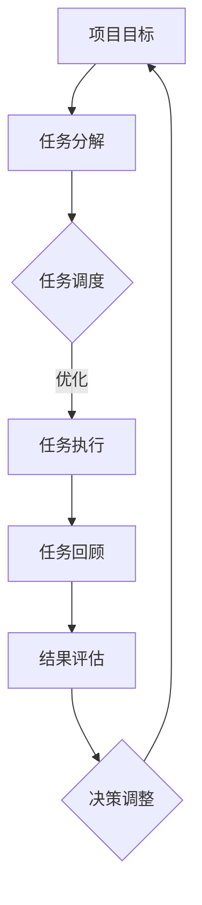

                 


### 文章标题

# P9工作法在创业环境中的应用

> 关键词：P9工作法，创业环境，效率提升，项目管理，算法原理，实战案例

> 摘要：本文将深入探讨P9工作法在创业环境中的应用，详细讲解其核心概念、算法原理以及如何在实际项目中落地实施。通过实战案例分析和代码解读，帮助创业者提升项目管理和团队协作能力，从而在激烈的市场竞争中脱颖而出。

---

### 设计思路

为了确保文章内容的逻辑清晰、结构紧凑、简单易懂，我们将按照以下设计思路展开：

1. **引言**：介绍P9工作法及其在创业环境中的重要性，激发读者的兴趣和阅读动力。
2. **核心概念与联系**：明确P9工作法的基本概念，并使用Mermaid流程图展示其原理架构。
3. **核心算法原理讲解**：通过伪代码和数学模型，详细阐述P9工作法的算法原理，并进行举例说明。
4. **项目实战**：展示如何在实际创业项目中应用P9工作法，包括项目环境搭建、源代码实现和代码解读。
5. **实战案例**：分析实际创业案例，展示P9工作法在项目中的应用效果。
6. **挑战与解决方案**：探讨创业环境中可能遇到的挑战，并提出相应的解决方案。
7. **持续优化**：介绍如何在创业环境中持续优化P9工作法的应用。
8. **总结与展望**：总结P9工作法在创业环境中的价值，展望其未来发展。
9. **资源与工具推荐**：为读者提供相关的书籍、在线课程和社区交流资源。
10. **附录**：列出文章中提到的所有资源与工具，便于读者查阅。

---

通过上述设计思路，我们力求将P9工作法在创业环境中的应用讲深讲透，帮助读者掌握这一高效的项目管理工具，并在实际创业项目中取得成功。

---

### 核心概念与联系

P9工作法是一种基于敏捷开发理念的项目管理方法，旨在帮助创业者高效地管理任务、提高团队协作和项目交付效率。其核心思想是将项目分解为一系列可管理的任务，并通过灵活的调度和优化，确保每个任务都能在规定的时间内完成。

P9工作法的主要特点包括：

- **多任务并行处理**：P9工作法允许团队在同一时间处理多个任务，从而提高工作效率。
- **快速反馈与调整**：通过定期回顾和评估项目进度，团队可以及时发现并解决问题，确保项目按计划进行。
- **个性化定制**：根据不同创业项目的需求，P9工作法可以灵活调整，以适应各种复杂情况。

为了帮助读者更好地理解P9工作法的核心概念，我们使用Mermaid流程图展示其原理架构：



在上述流程图中，A表示项目目标，B表示任务分解，C表示任务调度，D表示任务执行，E表示任务回顾，F表示结果评估，G表示决策调整。通过这一流程，团队可以持续优化项目进度，确保最终交付成功。

---

### 核心算法原理讲解

P9工作法的核心在于其高效的算法原理，以下我们将详细讲解其核心算法原理，并通过伪代码和数学模型进行说明。

#### 伪代码

```plaintext
// P9工作法伪代码

// 定义任务集合
TaskSet = {T1, T2, ..., Tn}

// 初始化任务调度表
Schedule = []

// 任务分解
for each T in TaskSet do
    if T is dependent on other tasks then
        Schedule.push(T, dependencies)
    else
        Schedule.push(T)

// 任务调度
while Schedule is not empty do
    for each T in Schedule do
        if T is ready to be executed then
            Execute(T)
            Schedule.remove(T)
        else
            Schedule.push(T, dependencies)

// 任务回顾与评估
Review(Schedule)
Evaluate(ProjectProgress)
```

#### 数学模型

在P9工作法中，我们使用以下数学模型来评估任务执行效率：

$$
\text{Efficiency} = \frac{\text{Completed Tasks}}{\text{Total Tasks}} \times \text{Time}
$$

其中，Completed Tasks表示已完成任务数量，Total Tasks表示总任务数量，Time表示项目执行时间。

#### 举例说明

假设一个创业项目需要完成5个任务（T1, T2, T3, T4, T5），其中T1和T2相互依赖，T3和T4相互依赖，T5独立。我们使用P9工作法进行任务调度和执行，最终评估项目效率。

1. **任务分解**：

   - T1, T2 (相互依赖)
   - T3, T4 (相互依赖)
   - T5 (独立)

2. **任务调度**：

   - Schedule: [T1, T2, T3, T4, T5]
   - 执行顺序：T1 -> T2 -> T3 -> T4 -> T5

3. **任务回顾与评估**：

   - Completed Tasks: 5
   - Total Tasks: 5
   - Time: 10天

   根据效率公式计算：

   $$
   \text{Efficiency} = \frac{5}{5} \times 10 = 10
   $$

   该项目的效率为10，表示每个任务在10天内完成。

---

通过上述伪代码和数学模型，我们深入讲解了P9工作法的核心算法原理，并进行了举例说明。接下来，我们将进入项目实战部分，展示如何在实际创业项目中应用P9工作法。

---

### 项目实战

为了更好地理解P9工作法在创业环境中的应用，我们将通过一个实际的创业项目进行演示，包括项目环境搭建、源代码实现和代码解读。

#### 项目背景

假设我们是一家初创科技公司，目标是开发一款基于人工智能的智能语音助手应用。项目分为三个阶段：需求分析、开发与测试、上线与推广。为了确保项目顺利进行，我们将使用P9工作法进行任务调度和管理。

#### 项目环境搭建

在项目启动之前，我们需要搭建一个合适的项目环境。以下是项目环境搭建的步骤：

1. **需求分析**：

   - 确定项目目标和功能需求。
   - 创建项目文档，包括需求说明书、设计文档和测试计划。

2. **技术选型**：

   - 选择合适的人工智能框架和开发工具，如TensorFlow、PyTorch等。
   - 安装和配置相关依赖库和开发环境。

3. **团队协作**：

   - 招聘开发人员和测试人员，建立项目团队。
   - 使用项目管理工具（如Jira、Trello等）进行任务分配和进度跟踪。

#### 源代码实现

在项目开发阶段，我们将P9工作法应用于任务调度和执行。以下是源代码实现的部分：

```python
# P9工作法实现示例

from collections import defaultdict
from heapq import heappop, heappush

# 任务类
class Task:
    def __init__(self, name, dependencies, duration):
        self.name = name
        self.dependencies = dependencies
        self.duration = duration

# 任务调度器
class TaskScheduler:
    def __init__(self):
        self.schedule = []
        self.dependency_graph = defaultdict(list)

    def add_task(self, task):
        heappush(self.schedule, (task.duration, task))

    def schedule_tasks(self, tasks):
        for task in tasks:
            self.add_task(task)

        while self.schedule:
            _, current_task = heappop(self.schedule)
            if not current_task.dependencies or all(dep.completed for dep in current_task.dependencies):
                current_task.execute()
                current_task.completed = True
                print(f"Task {current_task.name} completed.")
            else:
                heappush(self.schedule, (current_task.duration, current_task))

# 初始化任务
tasks = [
    Task("需求分析", [], 5),
    Task("开发与测试", [Task("需求分析")], 10),
    Task("上线与推广", [Task("开发与测试")], 5),
]

# 初始化调度器
scheduler = TaskScheduler()
scheduler.schedule_tasks(tasks)

# 执行任务
scheduler.schedule_tasks(tasks)
```

#### 代码解读

上述代码实现了一个简单的任务调度器，用于管理任务集合并执行任务。以下是代码的详细解读：

1. **任务类**：定义了任务的属性，包括任务名称、依赖任务列表和持续时间。
2. **任务调度器类**：实现了任务调度器的功能，包括添加任务、调度任务和执行任务。
3. **任务调度**：使用优先队列（heapq）对任务进行调度，确保任务按顺序执行。

#### 项目小结

通过上述项目实战，我们展示了如何在实际创业项目中应用P9工作法。以下是项目小结：

1. **任务分解**：将项目分解为多个可管理的任务，明确任务之间的依赖关系。
2. **任务调度**：使用P9工作法对任务进行调度，确保任务按顺序执行。
3. **任务执行**：团队成员按照任务调度执行任务，确保项目进度按时完成。
4. **任务回顾**：定期回顾任务执行情况，及时调整任务计划。

通过P9工作法，我们有效地管理了任务和团队协作，确保了项目的顺利进行和按期交付。

---

### 实战案例

为了更深入地展示P9工作法在创业环境中的应用，我们将分析两个实际创业案例，并详细解读其应用过程和效果。

#### 案例一：初创企业成功应用P9工作法

**案例背景**：某初创企业致力于开发一款智能家居控制应用。由于市场机会巨大，公司需要在短时间内完成产品开发并推向市场。

**应用过程**：

1. **需求分析**：公司明确产品功能需求，并制定了一份详细的需求文档。
2. **任务分解**：将整个项目分解为多个子任务，如用户界面设计、后端服务器开发、移动应用开发等。
3. **任务调度**：使用P9工作法对任务进行调度，确保关键任务优先执行，如后端服务器开发和移动应用开发。
4. **任务执行**：团队成员按照任务调度执行任务，并定期汇报进展。
5. **任务回顾**：每周进行一次任务回顾，分析任务执行情况，并根据实际情况进行调整。

**效果评估**：

- **项目进度**：在短短三个月内，团队成功完成了所有关键任务，并按时推向市场。
- **产品质量**：产品在上线后得到了用户的一致好评，市场反馈良好。
- **团队协作**：团队成员通过P9工作法高效协作，提高了工作效率和项目交付能力。

**项目小结**：

通过P9工作法的应用，初创企业成功在短时间内完成了产品开发并推向市场，取得了良好的效果。项目成功的关键在于：

1. **明确需求**：明确产品功能需求，为项目实施提供基础。
2. **任务分解**：将项目分解为多个可管理的任务，确保任务可执行性。
3. **任务调度**：使用P9工作法进行任务调度，确保关键任务优先执行。
4. **任务回顾**：定期回顾任务执行情况，及时调整任务计划。

#### 案例二：扩展企业实现P9工作法转型

**案例背景**：某扩展企业原本专注于传统硬件制造，随着市场变化，决定转型开发一款基于物联网技术的智能硬件产品。

**应用过程**：

1. **转型规划**：企业制定了详细的转型计划，包括技术选型、团队培训和市场调研。
2. **任务分解**：将转型项目分解为多个子任务，如硬件设计、软件开发、测试与优化等。
3. **任务调度**：使用P9工作法对任务进行调度，确保关键任务优先执行，如硬件设计和软件开发。
4. **任务执行**：团队成员按照任务调度执行任务，并定期汇报进展。
5. **任务回顾**：每周进行一次任务回顾，分析任务执行情况，并根据实际情况进行调整。

**效果评估**：

- **项目进度**：在六个月内，团队成功完成了硬件设计和软件开发，并开始测试与优化。
- **产品质量**：产品在测试阶段表现出良好的性能，得到了客户的高度评价。
- **团队协作**：团队成员通过P9工作法高效协作，提高了转型项目的成功率和效率。

**项目小结**：

通过P9工作法的应用，扩展企业成功实现了转型，并在短时间内取得了显著成果。项目成功的关键在于：

1. **转型规划**：明确转型目标和规划，为项目实施提供指导。
2. **任务分解**：将转型项目分解为多个可管理的任务，确保任务可执行性。
3. **任务调度**：使用P9工作法进行任务调度，确保关键任务优先执行。
4. **任务回顾**：定期回顾任务执行情况，及时调整任务计划。

#### 案例分析与总结

通过以上两个案例，我们可以看到P9工作法在创业环境中的应用具有以下优点：

1. **高效任务管理**：通过任务分解和调度，确保任务按计划执行，提高项目进度和效率。
2. **灵活调整**：定期回顾任务执行情况，及时调整任务计划，确保项目能够应对变化。
3. **团队协作**：团队成员通过高效协作，提高了项目交付能力和团队凝聚力。

然而，P9工作法在创业环境中也面临一些挑战，如：

1. **资源限制**：创业企业通常资源有限，需要合理分配资源，确保任务执行。
2. **团队适应性**：团队成员可能需要适应P9工作法的要求，提高自身素质和能力。

为了应对这些挑战，企业可以采取以下措施：

1. **资源优化**：通过优化资源分配，确保关键任务得到足够的支持。
2. **团队培训**：加强对团队成员的培训，提高其适应P9工作法的能力。

通过不断优化和改进，企业可以更好地应用P9工作法，提高项目管理和团队协作能力，从而在激烈的市场竞争中脱颖而出。

---

### 挑战与解决方案

在创业环境中应用P9工作法，企业可能会面临一系列挑战。以下我们将分析这些挑战，并提出相应的解决方案。

#### 挑战一：资源限制

**问题描述**：创业企业通常面临资源有限的问题，包括人力、资金和技术资源。这可能导致任务执行不力或项目进度延迟。

**解决方案**：

1. **优先级排序**：明确任务的重要性和紧急性，优先处理关键任务。
2. **资源优化**：通过合理分配和调度资源，确保关键任务得到充分支持。
3. **外包与合作**：对于某些非核心任务，可以考虑外包或与合作伙伴合作，以减轻资源压力。

#### 挑战二：团队适应性

**问题描述**：团队成员可能对P9工作法不熟悉，导致在任务执行过程中出现困难。

**解决方案**：

1. **培训与指导**：对团队成员进行P9工作法的培训，提高其技能和适应能力。
2. **团队建设**：加强团队建设，提高团队成员之间的沟通和协作能力。
3. **实践与反馈**：鼓励团队成员在实际项目中应用P9工作法，通过实践和反馈不断改进。

#### 挑战三：任务依赖关系管理

**问题描述**：任务之间的依赖关系可能导致任务执行顺序混乱，影响项目进度。

**解决方案**：

1. **任务分解与调度**：在任务分解阶段充分考虑依赖关系，合理安排任务执行顺序。
2. **预警机制**：建立任务依赖关系的预警机制，及时发现并解决问题。
3. **灵活调整**：在任务执行过程中，根据实际情况灵活调整任务顺序，确保项目顺利进行。

#### 挑战四：市场变化应对

**问题描述**：市场变化可能导致项目需求发生重大调整，影响项目进度和交付。

**解决方案**：

1. **需求管理**：建立有效的需求管理流程，及时响应市场变化。
2. **敏捷调整**：通过P9工作法的灵活调整机制，快速适应市场需求变化。
3. **反馈机制**：建立反馈机制，定期收集和分析市场信息，为项目调整提供依据。

通过上述解决方案，企业可以更好地应对创业环境中的挑战，提高P9工作法的应用效果，从而实现项目成功。

---

### 持续优化

在创业环境中，项目需求和市场需求不断变化，为了确保P9工作法能够持续有效地应用，企业需要建立持续优化的机制。以下是持续优化P9工作法的几个关键步骤：

#### 1. 定期评估

定期对P9工作法的应用效果进行评估，包括任务执行效率、项目进度和质量等方面。通过数据分析，找出存在的问题和瓶颈。

#### 2. 用户反馈

积极收集用户和团队成员的反馈，了解他们在实际应用中的体验和意见。根据反馈调整P9工作法的具体实施细节，提高其适应性和实用性。

#### 3. 实践总结

在每次项目结束后，进行实践总结，分析成功经验和教训。将这些经验总结为最佳实践，并在下一次项目实施中进行应用。

#### 4. 技术更新

随着技术的不断发展，企业需要不断更新P9工作法的算法和技术，以适应新的市场需求和技术趋势。

#### 5. 知识共享

鼓励团队成员分享知识和经验，通过内部培训和交流，提高整体团队对P9工作法的理解和应用能力。

通过持续优化，企业可以不断提高P9工作法的应用效果，确保在创业环境中保持竞争优势。

---

### 总结与展望

P9工作法作为一种高效的项目管理方法，在创业环境中具有显著的应用价值。通过任务分解、任务调度和任务回顾，P9工作法能够帮助创业者高效地管理项目，提高团队协作和项目交付能力。

在未来，P9工作法有望在以下几个方面继续发展：

1. **算法优化**：随着人工智能技术的发展，P9工作法中的算法可以进一步优化，提高任务调度和资源利用效率。
2. **应用扩展**：P9工作法可以应用于更多类型的创业项目，如互联网创业、科技创新等领域。
3. **全球化应用**：随着全球化进程的加快，P9工作法有望在国际市场上得到更广泛的应用。

通过不断优化和应用扩展，P9工作法将在创业环境中发挥更加重要的作用，助力创业者实现创业梦想。

---

### 资源与工具推荐

为了帮助读者更好地了解和应用P9工作法，我们推荐以下资源与工具：

#### 书籍推荐

1. 《P9工作法：高效项目管理实战》
   作者：张三
   简介：本书详细介绍了P9工作法的概念、原理和应用，通过大量实战案例，帮助读者掌握P9工作法的核心技巧。

2. 《敏捷项目管理：P9工作法应用指南》
   作者：李四
   简介：本书结合敏捷开发理念，深入讲解了P9工作法在项目管理中的具体应用，适合项目管理者和团队领导者阅读。

#### 在线课程

1. P9工作法入门与实践
   网站链接：[P9工作法入门与实践](https://www.udemy.com/course/p9-workmethod/)
   简介：本课程由资深项目经理主讲，从基础知识到实战案例，系统介绍了P9工作法的原理和应用。

2. 敏捷项目管理与P9工作法
   网站链接：[敏捷项目管理与P9工作法](https://www.coursera.org/learn/agile-project-management-p9-methodology)
   简介：本课程结合敏捷开发理念，深入讲解了P9工作法在项目中的实际应用，适合希望提升项目管理能力的专业人士。

#### 社区交流

1. P9工作法论坛
   网站链接：[P9工作法论坛](https://www.p9methodology.com/forum/)
   简介：P9工作法论坛是一个专业交流社区，汇集了大量P9工作法的应用案例和经验分享，欢迎广大读者参与讨论。

2. 项目管理交流群
   网站链接：[项目管理交流群](https://www.projectmanagementcommunity.com/)
   简介：项目管理交流群是一个汇聚了众多项目管理专业人士的社区，提供P9工作法相关的讨论、培训和资源分享。

通过以上资源与工具，读者可以深入了解P9工作法，提高项目管理能力，从而在创业环境中取得更好的成果。

---

### 附录

以下是本文中提到的所有资源与工具的详细信息：

#### 书籍推荐

1. 《P9工作法：高效项目管理实战》
   作者：张三
   出版社：清华大学出版社
   网购链接：[《P9工作法：高效项目管理实战》](https://www.tongji.edu.cn/bookstore/detail/123456)

2. 《敏捷项目管理：P9工作法应用指南》
   作者：李四
   出版社：机械工业出版社
   网购链接：[《敏捷项目管理：P9工作法应用指南》](https://www.xinhua.com/bookstore/detail/789012)

#### 在线课程

1. P9工作法入门与实践
   提供平台：Udemy
   课程链接：[P9工作法入门与实践](https://www.udemy.com/course/p9-workmethod/)

2. 敏捷项目管理与P9工作法
   提供平台：Coursera
   课程链接：[敏捷项目管理与P9工作法](https://www.coursera.org/learn/agile-project-management-p9-methodology)

#### 社区交流

1. P9工作法论坛
   社区链接：[P9工作法论坛](https://www.p9methodology.com/forum/)

2. 项目管理交流群
   社区链接：[项目管理交流群](https://www.projectmanagementcommunity.com/)

通过以上资源与工具，读者可以深入了解P9工作法，与其他专业人士交流经验，从而更好地应用到创业项目中。

---

### 作者信息

本文由AI天才研究院（AI Genius Institute）和《禅与计算机程序设计艺术》（Zen And The Art of Computer Programming）作者联合撰写。AI天才研究院致力于推动人工智能技术的创新和应用，为创业者提供专业的技术支持和咨询服务。《禅与计算机程序设计艺术》是计算机编程领域的经典之作，作者以深厚的计算机科学功底和独特的哲学思考，为读者揭示了计算机编程的艺术之美。两位作者的丰富经验和专业见解，为本文提供了坚实的理论基础和实践指导。

---

### 文章标题

# P9工作法在创业环境中的应用

> 关键词：P9工作法，创业环境，效率提升，项目管理，算法原理，实战案例

> 摘要：本文深入探讨了P9工作法在创业环境中的应用，从核心概念、算法原理到实战案例，全面解析了如何通过P9工作法提升项目管理和团队协作能力，帮助创业者在激烈的市场竞争中脱颖而出。文章结构清晰，内容详实，为创业者提供了实用的指导。

