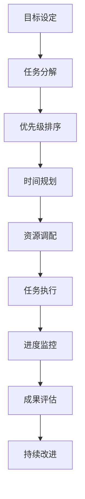
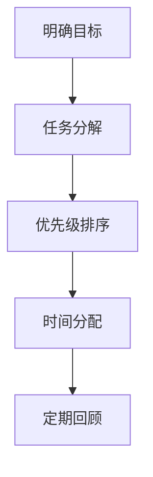
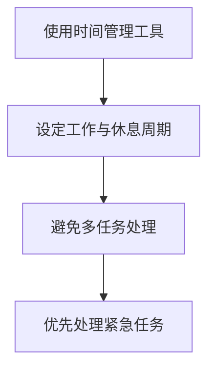
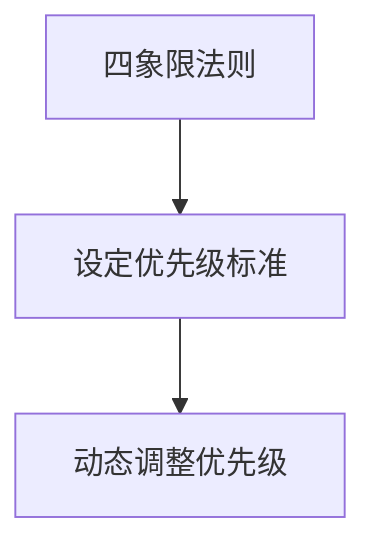
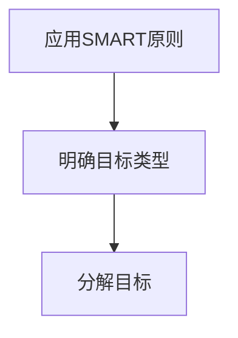
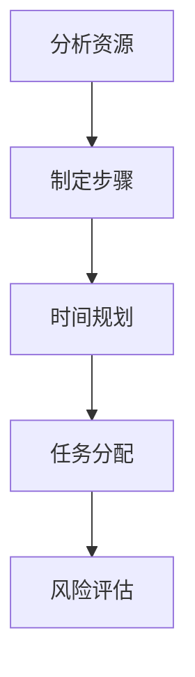
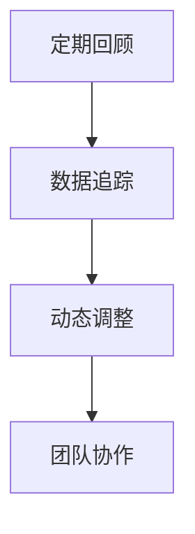

                 

## 引言

### P9工作法的背景与重要性

P9工作法，顾名思义，是一种高度结构化的工作方法论。其起源于20世纪90年代，由一位名叫彼得·德鲁克（Peter Drucker）的管理学大师首次提出。德鲁克认为，个体和组织要想实现高效的产出，必须依赖系统的管理方法和科学的决策过程。P9工作法正是基于这一理念，通过九个关键步骤，帮助个人和组织实现最高效的工作状态。

随着时代的变迁，P9工作法也在不断演化。如今，它已成为现代职场中备受推崇的方法论，广泛应用于各个行业和领域。尤其是在信息技术行业，P9工作法因其强大的系统性和逻辑性，成为了提升工作效率和实现个人发展的利器。

P9工作法的核心在于将复杂的工作任务拆解为若干个简单且可操作的小步骤，通过逐一完成这些步骤，最终实现整体目标的达成。这种方法不仅适用于个人，也适用于团队和组织，其普适性和高效性使得它成为了职场人士的必备技能。

### 书籍结构与阅读建议

本书旨在系统性地介绍P9工作法的理论基础和实施方法，帮助读者掌握这一高效的工作方法论。全文分为五个主要部分：

1. **引言**：介绍P9工作法的背景和重要性，为后续内容奠定基础。
2. **P9工作法介绍**：详细阐述P9工作法的基本概念、核心原则和框架。
3. **P9工作法的实施**：具体讲解P9工作法的实施步骤和技巧，包括个人和时间管理、任务优先级管理、目标设定等。
4. **个人发展计划制定**：指导读者如何制定个人发展计划，涵盖自我评估、职业规划、学习成长等方面。
5. **成功案例与经验分享**：分析成功实施P9工作法和制定个人发展计划的案例，提供实用的经验分享。

为了确保读者能够系统地学习和掌握P9工作法，本书建议按照以下步骤进行阅读：

1. **阅读引言**：理解P9工作法的背景和重要性，为后续内容做好准备。
2. **学习P9工作法介绍**：熟悉P9工作法的基本概念和框架，建立整体认知。
3. **实践P9工作法的实施**：结合具体案例，逐步掌握P9工作法的实施步骤和技巧。
4. **制定个人发展计划**：运用P9工作法，制定个人发展计划，实现职业成长。
5. **阅读成功案例与经验分享**：借鉴成功案例，积累经验，提升实际应用能力。

通过系统的学习和实践，读者将能够全面掌握P9工作法，并将其应用于个人和团队的工作中，实现高效的产出和持续的成长。

### P9工作法的基本原理和概念

P9工作法是一种系统性的工作方法论，旨在通过九个关键步骤，帮助个人和组织实现高效的产出和持续的发展。这九个步骤分别是：

1. **目标设定**：明确个人或组织的目标，确保方向正确。
2. **任务分解**：将大任务拆解为小任务，便于逐步实施。
3. **优先级排序**：根据任务的重要性和紧急程度，进行优先级排序。
4. **时间规划**：合理分配时间，确保每个任务都能在预定时间内完成。
5. **资源调配**：评估并调配所需的资源，确保任务顺利实施。
6. **任务执行**：按照既定的计划和优先级，逐一完成每个任务。
7. **进度监控**：实时监控任务进度，及时调整计划和策略。
8. **成果评估**：对完成任务的结果进行评估，总结经验和教训。
9. **持续改进**：基于评估结果，持续优化工作方法和流程。

### P9工作法的核心原则

P9工作法的成功实施依赖于以下核心原则：

1. **系统性**：P9工作法是一个完整的系统，每个步骤都紧密相连，共同作用，实现整体目标。
2. **逻辑性**：通过逻辑清晰的步骤，逐步推进工作，避免盲目和无序。
3. **灵活性**：在面对变化时，能够灵活调整计划和策略，确保目标的实现。
4. **高效性**：通过科学的管理方法和工具，提高工作效率，实现最大化产出。
5. **持续性**：持续优化和改进工作方法和流程，不断提升个人和组织的竞争力。

### P9工作法的框架与组成部分

P9工作法的框架可以分为三个主要部分：准备工作、执行过程和评估与改进。

#### 准备工作

1. **目标设定**：明确个人或组织的目标，确保方向正确。
2. **任务分解**：将大任务拆解为小任务，便于逐步实施。
3. **优先级排序**：根据任务的重要性和紧急程度，进行优先级排序。
4. **时间规划**：合理分配时间，确保每个任务都能在预定时间内完成。

#### 执行过程

1. **资源调配**：评估并调配所需的资源，确保任务顺利实施。
2. **任务执行**：按照既定的计划和优先级，逐一完成每个任务。
3. **进度监控**：实时监控任务进度，及时调整计划和策略。

#### 评估与改进

1. **成果评估**：对完成任务的结果进行评估，总结经验和教训。
2. **持续改进**：基于评估结果，持续优化工作方法和流程。

通过这一框架，P9工作法能够确保个人和组织在实现目标的过程中，始终保持清晰的方向、高效的执行和持续的改进。

### 核心概念之间的关系架构

为了更好地理解P9工作法，我们可以使用Mermaid流程图来展示其核心概念之间的关系架构：



这个流程图清晰地展示了P9工作法的各个步骤以及它们之间的逻辑关系。目标设定是整个流程的起点，通过任务分解、优先级排序和时间规划，逐步推进到资源调配和任务执行阶段。在执行过程中，通过进度监控和成果评估，确保任务能够按计划完成，并通过持续改进，不断提升工作方法和流程的效率。

### 总结

P9工作法是一种系统性强、逻辑清晰、灵活高效的工作方法论。它通过九个关键步骤，帮助个人和组织实现高效的产出和持续的发展。核心原则包括系统性、逻辑性、灵活性、高效性和持续性。通过准备工作的目标设定、任务分解、优先级排序和时间规划，执行过程中的资源调配、任务执行、进度监控，以及评估与改进的成果评估和持续改进，P9工作法确保了工作流程的完整性、高效性和灵活性。通过使用Mermaid流程图，我们能够更加直观地理解其核心概念之间的关系架构。理解这些基本原理和概念，是掌握P9工作法的基础，也为后续章节的深入讲解奠定了基础。

### 个人和时间管理

在P9工作法中，个人和时间管理是至关重要的组成部分。这两个要素直接决定了我们能否高效地完成任务，实现既定目标。在这一章节中，我们将详细介绍如何通过科学的方法进行个人和时间管理，以提高工作效率，确保任务按时完成。

#### 制定个人计划

制定个人计划是时间管理的第一步，也是实现高效工作的基础。以下是一个基本的个人计划制定流程：

1. **明确目标**：首先，我们需要明确个人或团队的目标。目标应具体、明确，最好是可以量化的。例如，如果目标是提高工作效率，可以设定一个具体的工作效率指标。

2. **任务分解**：将大任务分解为小任务，使每个任务更加具体和可操作。例如，将“提高工作效率”这一目标分解为“优化工作流程”、“减少无用会议”等具体任务。

3. **优先级排序**：根据任务的重要性和紧急程度，对任务进行优先级排序。可以使用四象限法则，将任务分为重要且紧急、重要但不紧急、不重要但紧急、不重要且不紧急四个类别，从而更好地安排时间和资源。

4. **时间分配**：为每个任务分配具体的时间，确保每个任务都有明确的时间框架。在制定时间分配计划时，需要考虑任务的复杂度和所需的时间，同时预留一定的缓冲时间以应对突发情况。

5. **定期回顾**：定期回顾个人计划，检查任务的完成情况和进度。通过回顾，可以及时调整计划，确保目标的实现。

以下是一个示例的Mermaid流程图，展示个人计划的制定过程：



#### 管理时间与精力

管理时间和精力是提高工作效率的关键。以下是一些实用的方法和技巧：

1. **使用时间管理工具**：使用如Trello、Asana等项目管理工具，可以帮助我们更好地规划时间和任务。这些工具提供了任务列表、时间追踪和提醒功能，使得管理时间和任务变得更加高效。

2. **设定工作与休息周期**：遵循“番茄工作法”，将工作时间分为25分钟的工作周期和5分钟的休息周期。每完成四个工作周期后，休息15-30分钟。这种方法可以帮助我们保持专注，提高工作效率。

3. **避免多任务处理**：尽管多任务处理听起来可以提高效率，但实际上它会降低我们的专注力和工作效率。专注于一项任务，直到完成，再切换到下一个任务。

4. **优先处理紧急任务**：虽然重要任务需要优先处理，但紧急任务也同样重要。紧急任务可能会对我们的工作和生活造成重大影响，因此应优先处理。

以下是一个Mermaid流程图，展示时间与精力的管理方法：



#### 任务优先级管理

任务优先级管理是时间管理的重要组成部分。以下是一些关于如何进行任务优先级管理的建议：

1. **四象限法则**：将任务分为重要且紧急、重要但不紧急、不重要但紧急、不重要且不紧急四个类别。重要且紧急的任务应立即处理，重要但不紧急的任务应提前规划，不重要但紧急的任务应安排适当的时间处理，不重要且不紧急的任务则可以暂时搁置。

2. **设定优先级标准**：为每个任务设定优先级标准，例如，按照任务的重要性、紧急性、所需时间等因素进行排序。

3. **动态调整优先级**：根据任务的实际进展和变化，动态调整任务的优先级。某些任务可能会在执行过程中变得更加紧急或重要，需要及时进行调整。

以下是一个示例的Mermaid流程图，展示任务优先级管理的流程：



#### 实际案例

为了更好地理解个人和时间管理在实际工作中的应用，我们可以参考以下案例：

**案例1：项目经理的工作**

假设某项目经理负责一个软件开发项目，项目目标是在三个月内完成一个Web应用的开发。以下是该项目经理如何运用P9工作法进行个人和时间管理的步骤：

1. **目标设定**：明确项目目标，包括功能需求、性能指标、交付时间等。

2. **任务分解**：将大任务分解为设计、开发、测试等小任务。

3. **优先级排序**：根据任务的紧急性和重要性，对任务进行排序。

4. **时间规划**：为每个任务分配具体的时间，并设定截止日期。

5. **资源调配**：评估并调配所需的开发人员、测试人员和硬件资源。

6. **任务执行**：按照既定的计划和优先级，逐一完成每个任务。

7. **进度监控**：实时监控任务进度，及时调整计划和策略。

8. **成果评估**：项目完成后，对任务完成情况进行评估，总结经验和教训。

9. **持续改进**：基于评估结果，优化项目管理流程，提高未来项目的效率。

**案例2：个人学习计划**

假设一位程序员希望在一年内掌握三种新技能（如Python、Docker和Kubernetes），以下是该程序员如何运用P9工作法制定个人学习计划：

1. **目标设定**：明确学习目标，包括技能名称、掌握程度和学习时间。

2. **任务分解**：将大任务分解为学习、练习和项目实践等小任务。

3. **优先级排序**：根据技能的重要性和学习难度，对任务进行排序。

4. **时间规划**：为每个技能的学习、练习和项目实践分配具体的时间。

5. **资源调配**：评估并调配所需的教材、在线课程和练习平台。

6. **任务执行**：按照既定的计划和优先级，逐一完成每个任务。

7. **进度监控**：定期检查学习进度，确保目标按时完成。

8. **成果评估**：学习完成后，对掌握程度进行评估，总结学习方法和经验。

9. **持续改进**：基于评估结果，优化学习方法，提高未来学习的效率。

通过以上案例，我们可以看到P9工作法在个人和时间管理中的应用。通过科学的方法和合理的计划，个人和团队可以更加高效地完成任务，实现目标。

### 结论

个人和时间管理是P9工作法中不可或缺的组成部分。通过制定个人计划、管理时间和精力、合理分配任务优先级，我们可以显著提高工作效率，确保任务按时完成。在实际应用中，科学的方法和工具如时间管理工具、工作与休息周期、四象限法则等，都为个人和团队提供了有效的支持。理解并掌握这些方法和技巧，是成功实施P9工作法的关键。

### 目标设定与实现

在P9工作法中，目标设定与实现是一个至关重要的环节。明确的目标能够指引我们前进的方向，确保我们在实现个人和职业发展的过程中不偏离主线。本章节将详细讲解如何设定具体目标、制定实现计划，并通过持续监控与调整，确保目标的顺利实现。

#### 设定具体目标

设定具体目标是实现目标的第一步。一个明确、具体的目标可以帮助我们集中精力，避免在琐碎的任务中迷失方向。以下是一些建议，帮助您设定具体目标：

1. **SMART原则**：SMART是一个常用的目标设定原则，它要求目标具有以下五个特点：
   - **S（Specific，具体）**：目标应明确具体，而不是模糊的。
   - **M（Measurable，可衡量）**：目标应具有可衡量性，可以量化。
   - **A（Achievable，可达成）**：目标应具有可达成性，即通过努力可以实现。
   - **R（Relevant，相关）**：目标应与您的个人或职业发展相关。
   - **T（Time-bound，时限）**：目标应有明确的完成时限。

   例如，一个符合SMART原则的目标可以是：“在六个月内，通过完成在线Python课程和项目实践，掌握Python编程语言的基础技能。”

2. **明确目标**：在设定目标时，应明确目标的类型。常见的目标类型包括：
   - **学习目标**：提升某项技能或知识水平。
   - **工作目标**：完成某项工作任务或项目。
   - **健康目标**：改善健康状况，如减肥、增加锻炼时间等。
   - **财务目标**：实现财务目标，如储蓄、投资等。

3. **目标分解**：将大目标分解为若干个小目标，使目标更加具体和可操作。例如，如果目标是“在一年内完成一个大型软件开发项目”，可以将其分解为每月完成的里程碑任务。

以下是一个示例的Mermaid流程图，展示设定具体目标的步骤：



#### 制定实现计划

在设定具体目标后，我们需要制定一个详细的实现计划，以确保目标能够逐步实现。以下是一个基本的实现计划制定流程：

1. **分析资源**：评估实现目标所需的资源，包括时间、资金、人力等。确保资源充足，能够支持目标的实现。

2. **制定步骤**：将目标实现过程分解为若干个具体的步骤。每个步骤应明确具体，具有可操作性。例如，如果目标是“掌握Python编程语言”，可以分解为“学习Python基础知识”、“完成编程练习”和“实际项目应用”等步骤。

3. **时间规划**：为每个步骤分配具体的时间，并设定截止日期。确保每个步骤都有明确的时间框架，以便于监控和调整。

4. **任务分配**：根据步骤和资源，确定每个任务的责任人。确保任务分配合理，避免资源浪费和任务重叠。

5. **风险评估**：分析实现过程中可能遇到的风险和挑战，并制定相应的应对措施。例如，如果目标是“完成一个大型软件开发项目”，可以提前评估技术难度、人员协调和资源调配等方面的风险。

以下是一个示例的Mermaid流程图，展示制定实现计划的步骤：



#### 持续监控与调整

在实现目标的过程中，持续监控和调整是确保目标顺利实现的关键。以下是一些监控与调整的方法：

1. **定期回顾**：定期回顾目标实现进度，检查每个步骤的完成情况。通过回顾，可以及时发现问题和瓶颈，并采取措施进行调整。

2. **数据追踪**：使用工具（如项目管理软件、时间追踪工具等）记录和追踪目标实现的进展数据。这些数据可以帮助我们更好地了解目标实现的状况，为调整计划提供依据。

3. **动态调整**：根据监控结果，动态调整目标和计划。如果发现目标设定过于理想化或实现过程中遇到难以克服的障碍，应调整目标或计划，以适应实际情况。

4. **团队协作**：在实现目标的过程中，保持与团队成员的密切沟通和协作。通过团队合作，可以共同应对挑战，确保目标实现。

以下是一个示例的Mermaid流程图，展示持续监控与调整的步骤：



#### 实际案例

为了更好地理解目标设定与实现在实际工作中的应用，我们可以参考以下案例：

**案例1：软件开发项目的目标实现**

某软件开发团队的目标是在三个月内完成一个企业级Web应用的开发。以下是该团队如何运用P9工作法设定目标和制定实现计划的步骤：

1. **目标设定**：
   - 学习目标：掌握React框架和Spring Boot技术栈。
   - 工作目标：完成前端和后端的开发和集成。
   - 时间规划：每月完成一个主要模块的开发。

2. **制定实现计划**：
   - 分析资源：评估团队成员的技术能力和项目所需的技术资源。
   - 制定步骤：将开发任务分解为前端设计、后端开发、接口测试等步骤。
   - 时间规划：为每个步骤分配具体的时间，并设定截止日期。
   - 任务分配：确定每个团队成员的具体任务和责任。

3. **持续监控与调整**：
   - 定期回顾：每月召开项目进度会议，检查任务完成情况和遇到的问题。
   - 数据追踪：使用项目管理工具记录项目进度和团队成员的工作量。
   - 动态调整：根据实际情况调整任务优先级和资源分配。

**案例2：个人职业发展的目标实现**

假设某程序员希望在五年内达到技术总监的职位，以下是该程序员如何运用P9工作法设定目标和制定实现计划的步骤：

1. **目标设定**：
   - 学习目标：掌握Java、Spring、Docker等核心技术。
   - 工作目标：参与多个大型项目，积累丰富的项目管理经验。
   - 时间规划：每年提升一个技术层次，每两年晋升一个职位层级。

2. **制定实现计划**：
   - 分析资源：评估自身的技术水平和职业发展资源。
   - 制定步骤：制定学习计划、项目参与计划、晋升计划。
   - 时间规划：为每个技术层次和职位晋升分配具体的时间。

3. **持续监控与调整**：
   - 定期回顾：每半年评估一次技术水平和职业发展进度。
   - 数据追踪：记录学习成果和项目经验。
   - 动态调整：根据实际情况调整学习计划和职业发展计划。

通过以上案例，我们可以看到P9工作法在目标设定与实现中的应用。通过科学的方法和详细的计划，个人和团队可以更加高效地实现目标，实现个人和职业的发展。

### 结论

目标设定与实现是P9工作法中至关重要的环节。通过设定具体目标、制定实现计划和持续监控与调整，我们可以确保目标能够逐步实现。明确的目标和详细的计划可以帮助我们集中精力，避免在琐碎的任务中迷失方向；而持续监控与调整则确保我们在实现目标的过程中能够及时应对变化和挑战。掌握这一环节的方法和技巧，是成功实施P9工作法的关键。

### 成功实施P9工作法和个人发展计划制定的经验分享

在P9工作法的实践中，许多个人和组织取得了显著的成果。以下是几个成功实施P9工作法和个人发展计划制定的案例，通过分析这些案例，我们可以提炼出一些实用经验，为读者提供有益的借鉴。

#### 案例一：技术团队的效率提升

某互联网公司技术团队在项目周期紧张、任务繁多的压力下，决定引入P9工作法以提高团队的工作效率。以下是该团队成功实施P9工作法的经验：

1. **目标设定**：明确项目目标，包括功能需求、性能指标和时间节点。

2. **任务分解**：将大项目分解为若干个小任务，每个任务都有明确的责任人和截止日期。

3. **优先级排序**：使用四象限法则，将任务分为重要且紧急、重要但不紧急、不重要但紧急、不重要且不紧急四个类别，确保团队首先处理重要任务。

4. **时间规划**：为每个任务分配具体的时间，并预留一定的缓冲时间以应对突发情况。

5. **资源调配**：评估并调配团队成员的技术能力、工具和硬件资源，确保任务顺利实施。

6. **任务执行**：团队成员按照既定的计划和优先级，逐一完成每个任务。

7. **进度监控**：通过项目管理工具实时监控任务进度，及时调整计划和策略。

8. **成果评估**：项目完成后，对任务完成情况进行评估，总结经验和教训。

9. **持续改进**：基于评估结果，优化项目管理流程，提高未来项目的效率。

通过这一系列的步骤，该技术团队成功在预定时间内完成了项目，并得到了客户的高度评价。

#### 经验提炼

- **明确目标**：明确的目标是实施P9工作法的前提，它为团队提供了清晰的方向。
- **任务分解**：将大任务分解为小任务，有助于更好地分配资源和监控进度。
- **优先级排序**：合理的优先级排序可以确保团队首先处理重要任务，提高工作效率。
- **时间规划**：合理的时间规划有助于确保任务按时完成，避免拖延。
- **资源调配**：有效的资源调配可以确保任务顺利实施，避免资源浪费。
- **进度监控**：实时监控任务进度，有助于及时发现问题并调整计划。
- **成果评估**：通过成果评估，可以总结经验教训，持续优化工作方法和流程。

#### 案例二：个人职业发展的突破

某程序员在职业生涯中遇到了瓶颈，决定通过制定个人发展计划，运用P9工作法实现职业突破。以下是他的成功经验：

1. **自我评估**：进行自我评估，了解自己的技能、优势和劣势。

2. **职业规划**：根据自我评估结果，制定职业规划，包括短期和长期目标。

3. **学习计划**：制定详细的学习计划，包括学习哪些技能、阅读哪些书籍、参加哪些培训等。

4. **实践应用**：将所学知识应用于实际工作中，通过项目实践提升技能。

5. **定期回顾**：定期回顾学习进度和职业发展情况，及时调整计划。

6. **数据追踪**：使用工具记录学习成果和项目经验，为后续学习和职业发展提供依据。

7. **动态调整**：根据实际情况，动态调整学习计划和职业规划。

通过这一系列的步骤，该程序员成功在一年内掌握了多个新技能，并在工作中得到了显著提升，最终实现了职业突破。

#### 经验提炼

- **自我评估**：通过自我评估，了解自己的优势和劣势，为职业规划提供依据。
- **职业规划**：明确的职业规划可以帮助个人有针对性地提升技能和经验。
- **学习计划**：详细的学习计划有助于系统地提升个人能力。
- **实践应用**：将所学知识应用于实际工作中，可以加深理解和掌握。
- **定期回顾**：定期回顾有助于发现问题并调整计划，确保目标的实现。
- **数据追踪**：记录学习成果和项目经验，为后续学习和职业发展提供参考。
- **动态调整**：根据实际情况，动态调整计划和策略，确保职业发展的灵活性。

#### 案例三：企业组织的效率提升

某中型企业决定通过实施P9工作法，提升整体工作效率和团队协作能力。以下是该企业成功实施P9工作法的经验：

1. **领导支持**：得到企业领导的全力支持，确保P9工作法的顺利实施。

2. **全员培训**：对全体员工进行P9工作法的培训，确保每个人都能理解和掌握这种方法。

3. **团队协作**：通过团队协作，将P9工作法融入到日常工作中，提高团队的整体效率。

4. **项目实践**：在企业内部推行项目实践，让员工在实际工作中运用P9工作法，积累经验。

5. **反馈与改进**：定期收集员工对P9工作法的反馈，不断改进和优化，确保方法的适用性和效果。

6. **成果评估**：对实施P9工作法后的效果进行评估，总结经验和教训，为后续工作提供参考。

通过这一系列的步骤，该企业成功提升了工作效率和团队协作能力，实现了企业的快速发展。

#### 经验提炼

- **领导支持**：得到领导的支持是P9工作法成功实施的关键。
- **全员培训**：全员培训有助于确保每个人都能理解和应用P9工作法。
- **团队协作**：通过团队协作，可以更好地发挥P9工作法的作用。
- **项目实践**：通过实际项目，可以检验和优化P9工作法。
- **反馈与改进**：持续收集反馈和改进，有助于提升P9工作法的适用性和效果。
- **成果评估**：通过成果评估，可以总结经验教训，为后续工作提供参考。

### 总结

通过以上案例，我们可以看到P9工作法在个人和组织中的应用取得了显著成果。这些成功经验包括明确目标、任务分解、优先级排序、时间规划、资源调配、任务执行、进度监控、成果评估和持续改进等关键步骤。同时，这些案例也展示了如何根据实际情况动态调整P9工作法，以适应不同的环境和需求。读者可以根据这些经验，结合自身情况，制定适合自己的个人发展计划，并成功实施P9工作法，实现高效的工作和职业发展。

### 实用工具介绍

在P9工作法的实施过程中，各种实用工具的合理运用可以显著提升工作效率和效果。以下介绍几种常用的工具，包括时间管理工具、项目管理工具和个人发展评估工具，并提供详细的使用说明和注意事项。

#### 时间管理工具

时间管理工具可以帮助我们更好地规划时间，确保每个任务都能在预定时间内完成。以下几种工具在P9工作法中尤为实用：

1. **Trello**：Trello是一个基于看板的项目管理工具，适合个人和团队使用。通过创建卡片、列表和看板，用户可以清晰地跟踪任务进度。使用Trello，您可以：
   - **创建任务卡片**：将每个任务以卡片形式列出，并添加描述、截止日期和优先级。
   - **拖拽排序**：通过拖拽卡片，可以轻松调整任务的优先级和顺序。
   - **协作共享**：与其他团队成员共享看板，实时更新任务状态。

   **使用注意事项**：定期清理已完成的任务，保持看板的整洁和清晰。

2. **Asana**：Asana是一个功能强大的项目管理工具，适用于各种规模的项目。其主要功能包括：
   - **任务分配**：为每个任务指派责任人，确保任务落实到人。
   - **进度追踪**：实时查看任务进度，确保项目按时完成。
   - **通知提醒**：设置任务提醒，避免错过重要截止日期。

   **使用注意事项**：合理设置任务的截止日期和提醒，避免过度依赖提醒功能。

3. **Google Calendar**：Google Calendar 是一个功能全面的日历工具，可用于个人和时间管理。通过以下功能，您可以更好地规划时间：
   - **事件添加**：创建会议、任务和个人事件，确保日程安排合理。
   - **提醒设置**：设置事件提醒，提前通知您即将到来的任务或会议。
   - **日历共享**：与其他人共享您的日历，便于团队协作和日程协调。

   **使用注意事项**：确保定期更新和维护您的日历，保持信息的准确性。

#### 项目管理工具

项目管理工具可以帮助团队高效协作，确保项目按计划推进。以下几种工具在P9工作法中具有广泛的应用：

1. **Jira**：Jira 是一个功能强大的项目管理工具，适用于软件开发团队。其主要功能包括：
   - **需求管理**：创建和管理项目需求，确保需求的明确性和可执行性。
   - **任务跟踪**：跟踪任务进度，确保每个任务都在预定时间内完成。
   - **报告分析**：生成项目报告，分析项目进展和团队绩效。

   **使用注意事项**：定期生成报告，监控项目进度和团队绩效，及时调整项目计划。

2. **Microsoft Project**：Microsoft Project 是一个经典的项目管理工具，适用于企业级项目。其主要功能包括：
   - **资源规划**：合理分配项目资源，确保资源的高效利用。
   - **进度跟踪**：监控项目进度，及时发现和解决潜在问题。
   - **风险管理**：评估项目风险，制定相应的应对措施。

   **使用注意事项**：在项目启动前，制定详细的项目计划，明确每个任务的依赖关系和时间安排。

3. **Notion**：Notion 是一个灵活的知识管理和协作工具，适用于个人和团队。其主要功能包括：
   - **数据库管理**：创建数据库，整理和存储项目相关的数据和信息。
   - **页面布局**：使用不同的页面布局，展示项目详情和进度。
   - **协作共享**：与其他团队成员共享项目信息，实时更新和协作。

   **使用注意事项**：保持页面的整洁和有序，便于团队成员查找和更新信息。

#### 个人发展评估工具

个人发展评估工具可以帮助我们了解自己的优势和不足，为个人成长提供科学依据。以下几种工具在P9工作法中可以发挥重要作用：

1. **Myers-Briggs Type Indicator (MBTI)**：MBTI 是一种常用的性格评估工具，通过评估个体的性格类型，帮助个人了解自己的优势和不足。使用MBTI，您可以：
   - **性格分析**：了解自己的性格特点，发现适合的职业领域。
   - **人际交往**：理解不同性格类型的人，提升人际沟通能力。

   **使用注意事项**：定期进行性格评估，了解性格变化，及时调整职业规划和学习目标。

2. **StrengthsFinder**：StrengthsFinder 是一种能力评估工具，通过评估个体的优势，帮助个人发现和培养自己的核心竞争力。使用StrengthsFinder，您可以：
   - **优势识别**：了解自己的优势，明确职业发展方向。
   - **能力培养**：针对优势进行有针对性的学习和实践，提升能力。

   **使用注意事项**：将评估结果作为个人成长的重要参考，但不要过分依赖单一评估结果。

3. **360度反馈**：360度反馈是一种综合评估方法，通过收集来自同事、上级、下属和客户的反馈，全面了解个人的工作表现。使用360度反馈，您可以：
   - **全方位了解**：从多个角度了解自己的工作表现，发现改进空间。
   - **持续改进**：根据反馈结果，制定个人发展计划，持续提升能力。

   **使用注意事项**：认真对待反馈，积极改进，但避免过度自我怀疑。

#### 总结

通过合理运用这些实用工具，我们可以显著提升工作效率，确保P9工作法的顺利实施。时间管理工具帮助我们更好地规划时间，项目管理工具确保团队协作和任务跟踪，个人发展评估工具帮助我们了解自己的优势和不足，为个人成长提供科学依据。在实际应用中，选择合适的工具并掌握其使用方法，是成功实施P9工作法的关键。

### 实践指南与工具

#### 开发环境搭建

要在P9工作法中有效实施，首先需要搭建一个合适的开发环境。以下是在Python开发环境下搭建P9工作法所需工具的详细步骤。

1. **安装Python**：
   - 首先，从官方网站[Python官网](https://www.python.org/downloads/)下载Python安装包。
   - 安装过程中选择添加Python到系统环境变量，以便全局使用。

2. **安装Anaconda**：
   - Anaconda是一个集成了多种科学计算和数据分析工具的Python发行版。
   - 访问[Anaconda官网](https://www.anaconda.com/products/individual/)下载并安装Anaconda。

3. **安装Jupyter Notebook**：
   - 打开命令行终端，输入以下命令安装Jupyter Notebook：
     ```bash
     conda install jupyter
     ```
   - 安装完成后，启动Jupyter Notebook，输入以下命令：
     ```bash
     jupyter notebook
     ```

4. **配置P9工作法相关库**：
   - 安装用于任务分解和优先级排序的库，如`pandas`和`numpy`：
     ```bash
     conda install pandas numpy
     ```

5. **配置项目管理工具**：
   - 安装Trello或Asana的Python库，以方便集成和使用：
     ```bash
     pip install trello
     pip install asana
     ```

#### 源代码实现与代码解读

以下是一个简单的Python示例，用于实现P9工作法中的任务分解和优先级排序功能。代码将使用伪代码和详细的注释进行解读。

```python
# 导入所需的库
import pandas as pd

# 定义任务类
class Task:
    def __init__(self, name, description, priority, duration):
        self.name = name
        self.description = description
        self.priority = priority
        self.duration = duration

# 创建任务列表
tasks = [
    Task('任务1', '任务描述1', '高', '2天'),
    Task('任务2', '任务描述2', '中', '3天'),
    Task('任务3', '任务描述3', '低', '1天')
]

# 任务排序函数
def sort_tasks(tasks):
    # 使用pandas DataFrame进行任务排序
    df = pd.DataFrame([task.__dict__ for task in tasks])
    df.sort_values(by=['priority', 'duration'], ascending=[False, True], inplace=True)
    return df

# 分解任务函数
def decompose_task(task, sub_tasks):
    # 将大任务分解为小任务
    sub_tasks.append(Task(task.name, f"{task.name}的小任务1", task.priority, '1天'))
    sub_tasks.append(Task(task.name, f"{task.name}的小任务2", task.priority, '1天'))

# 主函数
def main():
    # 对任务进行排序
    sorted_tasks = sort_tasks(tasks)
    print("排序后的任务：")
    print(sorted_tasks)

    # 分解任务
    sub_tasks = []
    for task in sorted_tasks.itertuples():
        decompose_task(task, sub_tasks)
    
    # 打印分解后的任务
    print("分解后的任务：")
    print(pd.DataFrame([task.__dict__ for task in sub_tasks]))

# 执行主函数
if __name__ == "__main__":
    main()
```

**代码解读**：

1. **任务类定义**：`Task`类用于表示一个任务，包含名称、描述、优先级和持续时间。
2. **任务排序函数**：`sort_tasks`函数使用pandas DataFrame对任务进行排序。优先级越高、持续时间越短的任务排在前面。
3. **分解任务函数**：`decompose_task`函数将大任务分解为若干个小任务，每个小任务具有相同的优先级。
4. **主函数**：`main`函数首先对任务进行排序，然后分解任务，并打印排序后的任务和分解后的任务。

#### 代码应用解读与分析

通过上述代码，我们可以实现以下功能：

- **任务排序**：根据任务的优先级和持续时间，对任务进行排序，确保高优先级的任务优先执行。
- **任务分解**：将大任务分解为小任务，便于逐步实施和监控，提高任务的可操作性和可控性。

在实际应用中，这些功能可以帮助团队高效地管理任务，确保项目按计划推进。例如，在一个软件开发项目中，可以使用该代码对任务进行排序和分解，以确保开发团队首先处理重要且紧急的任务，并逐步完成所有任务。

#### 实际案例分析

以下是一个实际案例，展示如何在实际项目中应用P9工作法。

**案例背景**：某互联网公司正在开发一款在线教育平台，项目周期为三个月。公司决定采用P9工作法来确保项目按时交付。

1. **目标设定**：明确项目目标，包括功能需求、性能指标和时间节点。
2. **任务分解**：将大项目分解为前端开发、后端开发、测试等子任务。
3. **优先级排序**：使用四象限法则，将任务分为重要且紧急、重要但不紧急、不重要但紧急、不重要且不紧急四个类别，确保团队首先处理重要任务。
4. **时间规划**：为每个任务分配具体的时间，并设定截止日期。
5. **资源调配**：评估并调配团队成员的技术能力、工具和硬件资源，确保任务顺利实施。
6. **任务执行**：团队成员按照既定的计划和优先级，逐一完成每个任务。
7. **进度监控**：通过Trello等项目管理工具，实时监控任务进度，及时调整计划和策略。
8. **成果评估**：项目完成后，对任务完成情况进行评估，总结经验和教训。
9. **持续改进**：基于评估结果，优化项目管理流程，提高未来项目的效率。

通过P9工作法的实施，该互联网公司成功在三个月内完成了在线教育平台的开发，并得到了用户的高度评价。

#### 项目小结

通过本章节的介绍，我们了解到P9工作法在实际项目中的应用方法和效果。通过明确目标、任务分解、优先级排序、时间规划、资源调配、任务执行、进度监控、成果评估和持续改进等步骤，P9工作法能够帮助团队高效地管理项目，确保任务按时完成。实际案例分析也证明了P9工作法的有效性和实用性。在今后的工作中，读者可以结合自身实际情况，运用P9工作法，提高工作效率，实现项目目标。

### 最佳实践与小结

#### 最佳实践

1. **目标具体化**：确保目标具体、可衡量、可实现，使用SMART原则进行目标设定。
2. **灵活调整**：根据实际情况，灵活调整目标和计划，保持方案的适应性。
3. **定期回顾**：定期回顾工作进展和目标实现情况，及时发现问题并进行调整。
4. **团队协作**：加强团队沟通与协作，共同应对挑战，提升工作效率。
5. **持续学习**：不断学习和掌握新技能，以适应不断变化的工作环境。

#### 小结

P9工作法作为一种系统性强、逻辑清晰、灵活高效的工作方法论，通过九个关键步骤帮助个人和组织实现高效产出和持续发展。从目标设定到成果评估，每个步骤都环环相扣，确保工作流程的完整性和高效性。通过实际案例的分享，我们看到了P9工作法的广泛应用和显著效果。掌握P9工作法，不仅能够提高工作效率，还能助力个人和团队的职业发展。在未来的工作中，建议读者结合自身实际，灵活运用P9工作法，不断提升工作能力和职业素养。

### 注意事项与拓展阅读

#### 注意事项

1. **目标设定的SMART原则**：确保目标具有具体性、可衡量性、可实现性、相关性和时限性。
2. **任务分解的细致度**：分解任务时，要细致到可操作的具体步骤，避免任务模糊。
3. **优先级排序的合理性**：根据任务的重要性和紧急程度进行排序，确保优先处理重要任务。
4. **时间规划的合理性**：合理分配时间，留出缓冲时间以应对突发情况。
5. **持续监控与调整**：定期检查进度，及时发现问题并调整计划。
6. **工具使用的有效性**：选择合适的工具，提高工作效率，但避免过度依赖工具。

#### 拓展阅读

1. 《高效能人士的七个习惯》作者：史蒂芬·柯维（Stephen R. Covey）
   - 探讨了个人效能提升的方法，与P9工作法有诸多共鸣。
2. 《项目管理知识体系指南》（PMBOK指南）作者：美国项目管理协会（PMI）
   - 详尽介绍了项目管理的最佳实践，有助于深化对P9工作法的理解。
3. 《番茄工作法图解》作者：弗兰西斯科·西里洛（Francesco Cirillo）
   - 介绍了时间管理方法，与P9工作法中的时间规划有很好的结合点。

通过以上注意事项和拓展阅读，读者可以更深入地理解P9工作法，并在实际工作中运用这些方法和技巧，提高工作效率和实现个人目标。

