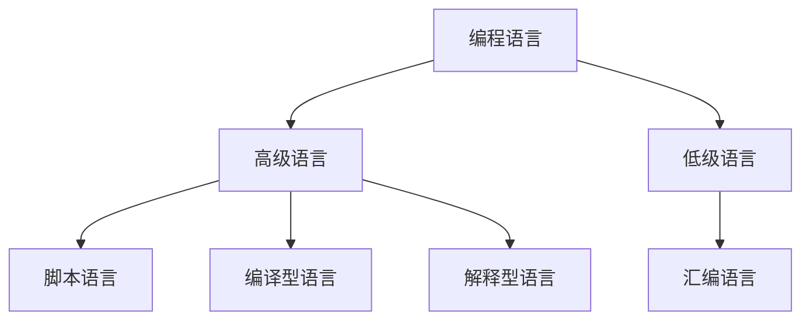
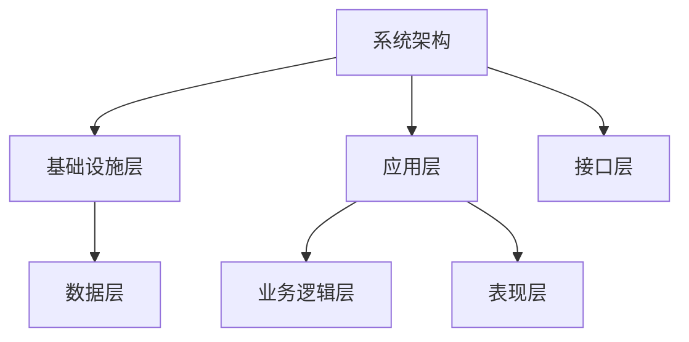

                 


### 1. 确定文章主题与目标

首先，我们需要明确文章的主题和目标。根据书名《P9工作法：夯实技术硬实力、架构力和领导力》，我们可以确定文章的目标是介绍和探讨P9工作法在职场中的实际应用，以及如何通过这一方法来提升技术硬实力、架构力和领导力。文章的主题将围绕这三个核心概念展开，旨在帮助读者理解P9工作法的本质和如何将其应用到实际工作中。

### 2. 设计文章结构

接下来，我们需要设计文章的结构。根据目录大纲，我们可以将文章分为三个主要部分：

**第一部分：技术硬实力**
- 技术能力与编程语言
  - 编程语言概述
  - 编程语言在深度学习中的应用
  - 算法与数据结构
- 数据库与数据管理
  - 数据库基础
  - 数据库高级应用
- 网络安全与防护
  - 网络安全概述
  - 网络防护技术
- 实战项目：构建高效代码库

**第二部分：架构力**
- 系统架构设计与优化
  - 系统架构概述
  - 微服务架构
  - 容器化与云原生
- 性能优化与调优
  - 性能优化原理
  - 性能调优实践
- 持续集成与持续部署
  - 持续集成概述
  - 持续部署
- 实战项目：构建高性能系统

**第三部分：领导力**
- 团队合作与沟通技巧
  - 团队合作概述
  - 沟通技巧
  - 团队冲突管理
- 领导风格与团队管理
  - 领导风格
  - 团队管理

### 3. 核心概念与联系

在每个相关章节中，我们需要添加核心概念和原理，并使用Mermaid流程图来展示它们之间的关系。

**技术能力与编程语言**
- Mermaid流程图：编程语言的发展与分类



**系统架构设计与优化**
- Mermaid流程图：系统架构的组成与分层



### 4. 核心算法原理讲解

在每个涉及算法的章节中，我们需要使用伪代码详细阐述算法原理。

**算法与数据结构**
- 伪代码：常见算法与数据结构

```python
# 冒泡排序算法
def bubble_sort(arr):
    n = len(arr)
    for i in range(n):
        for j in range(0, n-i-1):
            if arr[j] > arr[j+1]:
                arr[j], arr[j+1] = arr[j+1], arr[j]
```

### 5. 数学模型和公式讲解

在需要的地方，我们需要使用LaTeX格式嵌入数学模型和公式，并进行详细讲解。

**数据库与数据管理**
- LaTeX公式：数据库的数学模型

$$
R = \{(D, S) \mid D \subseteq \text{域集}, S \subseteq \text{属性集}\}
$$`

### 6. 项目实战

在每个相关章节中，我们都需要加入实际项目案例，包括代码实现、环境搭建、代码解读和分析。

**实战项目：构建高效代码库**
- 项目背景：企业级代码库的构建需求
- 环境搭建：步骤详解：搭建代码库的开发环境
- 源代码实现：伪代码：代码库的核心功能实现
- 代码解读与分析：分析：代码库的性能优化与安全性保障

### 7. 最佳实践与注意事项

在每个章节的结尾，我们需要总结最佳实践、注意事项，并提供拓展阅读。

**领导风格与团队管理**
- 最佳实践：如何选择适合的领导风格
- 注意事项：避免常见的团队冲突
- 拓展阅读：推荐进一步阅读的相关书籍或资料

### 8. 完成文章

最后，我们将所有部分整合起来，形成一篇完整的文章。确保每个章节的内容都丰富、具体，讲解深入，并遵循markdown格式要求。文章的结尾需包含作者信息，并确保整体字数在8000～12000字左右。

这样，我们就完成了对《P9工作法：夯实技术硬实力、架构力和领导力》的技术博客文章的初步设计。接下来，我们将详细撰写每个章节的内容，确保文章的逻辑清晰、结构紧凑、简单易懂，符合专业IT领域的技术博客文章标准。

