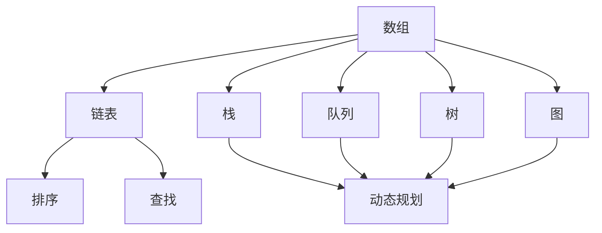
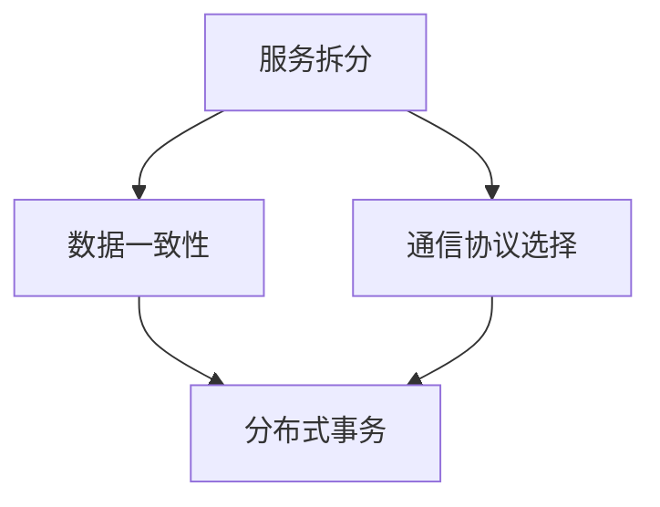

                 

### 文章标题：P9工作法：夯实技术硬实力、架构力和领导力

#### 关键词：P9工作法，技术硬实力，架构力，领导力，职业发展

#### 摘要：
本文将深入探讨P9工作法的核心，即如何通过夯实技术硬实力、提升架构力以及增强领导力，为职业发展打下坚实基础。文章将分为三大部分，首先介绍技术硬实力的定义及其在职业发展中的重要性，接着解析架构力的基本概念及其设计原则，最后探讨领导力的本质及团队管理和项目管理的最佳实践。

## 第一部分：技术硬实力

### 第1章：技术硬实力概述

#### 1.1 技术硬实力的定义

技术硬实力是指个人在某一技术领域的专业能力和技能，包括但不限于编程能力、算法与数据结构、系统设计与实现、技术栈知识等。它是职业发展的基础，决定了个人在技术领域的竞争力和创新能力。

#### 1.2 技术栈与编程能力

技术栈是个人在某一领域所掌握的各种技术的集合。一个全面的技术栈不仅包括编程语言，还包括框架、库、工具和设计模式等。编程能力是技术硬实力的核心，它体现在代码的质量、效率和可维护性上。

#### 1.3 算法与数据结构

算法是解决问题的方法步骤，数据结构是存储和组织数据的方式。掌握常见的算法和数据结构，如排序、查找、树、图、动态规划等，是提升技术硬实力的关键。

### 第2章：核心技术讲解

#### 2.1 数据结构与算法

数据结构包括数组、链表、栈、队列、树、图等。算法包括排序、查找、动态规划等。我们将通过伪代码详细讲解这些数据结构和算法的原理和实现。

#### 2.2 编程语言与框架

编程语言的选择取决于项目需求和个人的熟悉度。常见的编程语言有Python、Java、C++等。框架的选择同样重要，如Django、Spring、Node.js等，它们可以大大提高开发效率。

#### 2.3 实践项目案例分析

通过实际项目案例分析，我们可以看到技术硬实力在项目中的具体应用，如如何利用算法优化数据库查询，如何使用框架快速搭建系统等。

## 第二部分：架构力

### 第3章：架构力概述

#### 3.1 架构力的定义

架构力是指个人在系统设计和架构设计方面的能力和经验，它决定了系统的可扩展性、稳定性和性能。一个优秀的架构师不仅要有深厚的技术背景，还要具备系统思维和前瞻性。

#### 3.2 分布式系统

分布式系统是由多个节点组成的系统，各节点通过通信协议协同工作。它具有高可用性、高性能和可扩展性。我们将介绍分布式系统的基本概念和设计原则。

#### 3.3 微服务架构

微服务架构是将应用程序分解为多个独立的、小型服务，每个服务都有自己的业务逻辑和数据存储。它具有高可维护性、高可扩展性和高灵活性。

### 第4章：核心算法原理

#### 4.1 分布式算法

分布式算法是在分布式系统中用于处理数据一致性和容错性的算法。常见的分布式算法包括Raft、Paxos、一致性哈希等。

#### 4.2 数据库设计与优化

数据库设计是系统架构的核心部分。我们将讨论关系数据库和NoSQL数据库的设计原则，以及如何优化数据库性能。

#### 4.3 微服务架构优化

微服务架构的优化涉及服务拆分、数据一致性和通信协议的选择等。我们将通过伪代码和实际案例来讲解这些优化策略。

### 第5章：项目实战

#### 5.1 分布式计算框架实现

我们将搭建一个简单的分布式计算框架，包括任务分发、任务执行和结果收集等模块，并通过伪代码和实际案例展示其实现过程。

#### 5.2 微服务架构设计

我们将设计一个基于微服务架构的电商系统，包括商品管理、订单管理和用户管理等模块，并讨论如何实现服务拆分和数据一致性。

#### 5.3 实际案例解析

我们将通过一个实际案例，分析一个大型分布式系统的架构设计和优化过程，包括如何解决性能瓶颈和系统稳定性问题。

## 第三部分：领导力

### 第6章：领导力概述

#### 6.1 领导力的定义

领导力是指个人在团队管理和项目领导方面的能力，包括沟通、激励、决策和团队协作等。一个优秀的领导者不仅要有专业能力，还要有领导力。

#### 6.2 团队管理与沟通

团队管理包括团队组建、角色分配、任务分工和团队协作等。沟通是团队管理的关键，有效的沟通可以减少误解和冲突，提高团队效率。

#### 6.3 项目管理与优化

项目管理包括项目规划、进度控制、风险管理、成本控制等。通过优化项目管理流程，可以提高项目成功率。

### 第7章：数学模型与公式

#### 7.1 概率论

概率论是研究随机现象的数学分支。在项目管理中，概率论可以用于风险评估和决策分析。

#### 7.2 统计学

统计学是处理数据的科学，可以用于数据分析、模型构建和预测等。

#### 7.3 优化算法

优化算法是解决优化问题的一类算法，可以用于资源分配、路径规划等。

### 第8章：领导力实战

#### 8.1 团队领导力提升

通过实际案例，我们将探讨如何提升团队领导力，包括领导风格、激励方法和团队文化建设等。

#### 8.2 项目管理实战

我们将通过一个实际项目，展示如何进行项目规划、进度控制和风险管理，以及如何应对项目中的各种挑战。

#### 8.3 领导力提升案例

我们将分享一些成功领导的案例，分析他们如何通过领导力提升团队绩效和项目成功。

## 总结与展望

本文系统地介绍了P9工作法，从技术硬实力、架构力和领导力三个方面，为职业发展提供了全面的指导。通过夯实技术硬实力，我们可以提高技术竞争力；通过提升架构力，我们可以设计和实现高效系统；通过增强领导力，我们可以带领团队实现目标。

未来，随着技术的发展和变革，P9工作法将继续演进，为更多职业人士提供实用的方法和技巧。让我们一起夯实技术硬实力、提升架构力和领导力，成为新时代的卓越职业人士。

## 附录：资源与工具推荐

### 1. 技术资源

- **技术博客和论坛**：如GitHub、Stack Overflow、Reddit等，是获取技术信息和解决问题的宝贵资源。
- **在线课程和书籍**：如Coursera、edX、Udemy等平台提供了丰富的技术课程和书籍，适合不同层次的学习者。

### 2. 领导力资源

- **领导力书籍**：如《原则》、《高效能人士的七个习惯》等，提供了关于领导力和个人成长的深刻见解。
- **领导力培训**：参加领导力培训课程，如哈佛大学MBA课程、国际领导力学院等，可以系统地提升领导力。

### 3. 工具推荐

- **版本控制工具**：如Git、SVN，是团队协作和版本管理的关键工具。
- **开发工具**：如Visual Studio、Eclipse、IntelliJ IDEA等，可以提高开发效率和代码质量。
- **项目管理工具**：如JIRA、Trello、Asana等，可以帮助团队更好地管理项目和任务。

### 作者信息

作者：AI天才研究院/AI Genius Institute & 禅与计算机程序设计艺术 /Zen And The Art of Computer Programming

本文由AI天才研究院和《禅与计算机程序设计艺术》作者联合撰写，旨在为技术人士提供实用的职业发展指南。希望本文能对您有所帮助，让我们一起在技术道路上不断前行。

