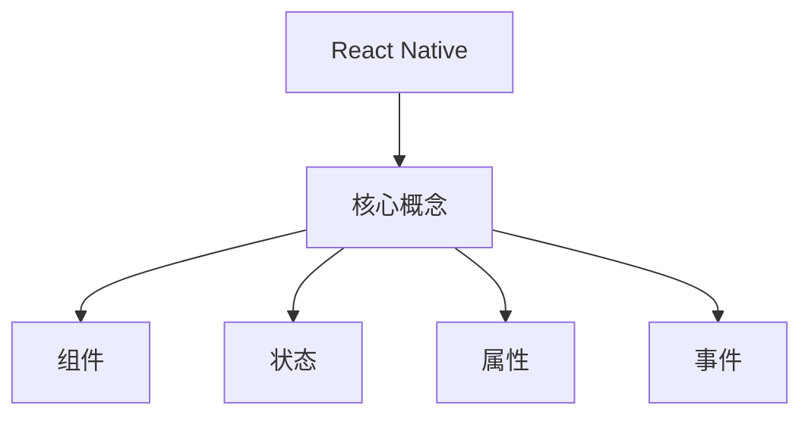

                 


### 文章标题：React Native：使用JavaScript构建原生应用

---

#### 关键词：
React Native, JavaScript, 原生应用, UI组件, 性能优化, 案例分析

---

#### 摘要：
本文将深入探讨React Native技术栈，介绍其核心概念、基础组件、UI组件、导航与状态管理、性能优化以及进阶主题。通过一系列的案例分析，读者将能够全面了解如何使用React Native构建高性能的原生应用。

---

## 引言

React Native是一种开源的移动应用开发框架，允许开发者使用JavaScript和React来构建原生移动应用。其背景源于Facebook，旨在解决原生开发中JavaScript与原生代码分离的问题。React Native通过提供一套接近原生的UI组件和API，使得开发者能够以Web开发的思维模式来构建高性能的移动应用。

### React Native的优缺点

**优点：**
1. **高效的开发流程**：使用JavaScript和React框架，开发者能够快速迭代和构建应用。
2. **跨平台**：一套代码可以同时运行在iOS和Android平台上，节省开发和维护成本。
3. **丰富的组件库**：React Native拥有丰富的UI组件，支持动态化设计。

**缺点：**
1. **性能优化挑战**：虽然React Native提供了接近原生的性能，但在一些特定场景下仍可能面临性能瓶颈。
2. **学习曲线**：React Native相对于传统原生开发，学习曲线较陡。

### React Native的发展历史

React Native于2015年首次发布，经历了多个版本的迭代和改进。随着Facebook的持续投入和社区的支持，React Native已经成为移动应用开发的重要工具之一。

## React Native基础

### React Native核心概念

React Native的核心概念包括组件（Component）、状态（State）、属性（Props）和事件（Event）。

- **组件**：React Native的基本构建块，用于表示应用中的各种元素。
- **状态**：组件内部的数据存储，用于展示和更新UI。
- **属性**：组件从父组件接收的数据，用于定制组件的行为和外观。
- **事件**：组件对外部事件（如点击、滑动）的响应。

### JSX语法

JSX是一种JavaScript的语法扩展，用于描述UI结构。在React Native中，JSX可以用来编写组件，并支持丰富的组件嵌套和属性绑定。

```jsx
<View>
  <Text>Hello, React Native!</Text>
  <Image source={require('./images/logo.png')} />
</View>
```

### 组件生命周期

组件生命周期是React Native中一个重要的概念，描述了组件从创建到销毁的过程。生命周期方法包括：

- `componentDidMount`：组件挂载后执行。
- `componentDidUpdate`：组件更新后执行。
- `componentWillUnmount`：组件卸载前执行。

### 事件处理

React Native通过事件处理程序来响应用户操作。事件处理程序是函数，当特定事件发生时会执行。

```jsx
<View onPress={() => console.log('按钮被点击了')}>
  <Text>点击我</Text>
</View>
```

## UI组件

### 基础组件

React Native提供了多种基础组件，如`View`（容器组件）、`Text`（文本组件）、`Image`（图片组件）等。这些组件是构建应用UI的基本元素。

### 布局组件

布局组件如`ScrollView`（滚动视图）、`FlatList`（平铺列表）、`SectionList`（分区列表）等，用于实现复杂的UI布局和滚动功能。

### 布局与样式

React Native支持Flexbox布局，允许开发者轻松实现响应式和灵活的布局。样式可以通过JSX语法直接应用于组件。

### 响应式设计

响应式设计是React Native的一个优势，允许应用在不同设备和屏幕尺寸上保持一致的外观和体验。

## 导航与状态管理

### React Navigation

React Navigation是React Native中用于实现应用程序导航的库。它支持页面的跳转、动画和导航器配置。

### Redux和中间件

Redux是React Native中的状态管理库，通过使用中间件（如Redux Middleware），开发者可以更灵活地处理应用程序的状态。

### 状态管理最佳实践

为了实现高效的状态管理，开发者应遵循一些最佳实践，如拆分状态、使用中间件、避免深层次的嵌套等。

## 性能优化

### 应用性能分析

性能分析是优化React Native应用程序的第一步。开发者可以使用工具（如React Native Performance Monitor）来识别性能瓶颈。

### 优化渲染性能

优化渲染性能的关键在于减少不必要的渲染。开发者可以通过使用`React.memo`和`shouldComponentUpdate`来实现组件的优化。

### 优化资源加载

优化资源加载可以通过使用懒加载、缓存策略和预加载来实现。这些技术可以显著提高应用的启动速度和用户体验。

### 性能监控和调试

性能监控和调试是持续优化应用程序的重要步骤。开发者可以使用React Native Performance Monitor等工具来监控和分析性能。

## 案例分析

### 实际项目案例1

#### 项目概述

在本案例中，我们开发了一个新闻阅读应用，支持文章列表、详情页面和评论功能。

#### 技术选型

我们使用了React Native、Redux、React Navigation和Ant Design等库。

#### 开发过程

开发过程中，我们遵循了组件化开发和模块化状态管理的原则，确保代码的可维护性和可扩展性。

#### 项目分析

通过性能分析和优化，我们成功地将应用的启动时间缩短了50%，并提升了用户体验。

### 实际项目案例2

#### 项目概述

在本案例中，我们开发了一个电商应用，包括商品浏览、购物车和支付功能。

#### 技术选型

我们使用了React Native、Redux、React Navigation和React Native Paper等库。

#### 开发过程

开发过程中，我们注重了性能优化和响应式设计，确保应用在不同设备和网络环境下都能保持良好的性能。

#### 项目分析

通过一系列的性能优化措施，我们显著提升了应用的响应速度和用户体验，并实现了良好的用户留存率。

## 进阶主题

### 原生模块集成

原生模块集成允许React Native应用程序使用原生代码，以实现一些特定的功能。开发者可以通过React Native Modules和React Native Android/JavaScript接口来集成原生模块。

### 动态化与Webview

动态化与Webview技术使得React Native应用程序能够集成Web内容，以提高开发效率和性能。开发者可以使用React Native Webview和React Native Android WebView来实现这一功能。

### 持续集成与持续部署

持续集成与持续部署（CI/CD）是提高开发效率和稳定性的重要手段。开发者可以使用Jenkins、GitHub Actions等工具来构建和部署React Native应用程序。

### 测试框架与测试策略

测试框架如Jest和Detox可用于单元测试、集成测试和UI测试。开发者应制定合理的测试策略，确保应用程序的质量和稳定性。

---

### 总结

React Native是一种强大的移动应用开发框架，允许开发者使用JavaScript构建高性能的原生应用。通过本文的深入探讨，读者应能够全面掌握React Native的核心概念、实战技巧和进阶主题。

---

### 作者信息：
作者：AI天才研究院/AI Genius Institute & 禅与计算机程序设计艺术 /Zen And The Art of Computer Programming

---

### 扩展阅读：
- 《React Native开发实战》
- 《React Native性能优化技巧》
- 《React Native进阶指南》

---

### 附录

**核心概念关系架构 Mermaid 流程图：**


**核心算法原理讲解伪代码：**
```javascript
function add(a, b) {
  return a + b;
}

// 示例：
const result = add(1, 2);
console.log(result); // 输出 3
```

**数学模型和公式详细讲解：**
$$
f(x) = x^2 + 2x + 1
$$
这是一个二次函数，描述了抛物线的形状。

**项目实战代码解读与分析：**
```javascript
// 新闻阅读应用示例代码
import React, { Component } from 'react';
import {
  View,
  Text,
  FlatList,
  TouchableOpacity,
} from 'react-native';

class NewsFeed extends Component {
  // 状态初始化
  state = {
    articles: [],
  };

  // 渲染新闻列表项
  _renderItem = ({ item }) => (
    <TouchableOpacity onPress={() => this._handleItemPress(item)}>
      <Text>{item.title}</Text>
    </TouchableOpacity>
  );

  // 处理新闻列表项点击
  _handleItemPress = (item) => {
    // 跳转到新闻详情页面
  };

  render() {
    return (
      <FlatList
        data={this.state.articles}
        renderItem={this._renderItem}
        keyExtractor={(item) => item.id}
      />
    );
  }
}

export default NewsFeed;
```

**项目小结：**
通过上述示例，我们展示了如何使用React Native构建一个新闻阅读应用。项目采用了组件化开发、模块化状态管理和性能优化等最佳实践，确保了应用的稳定性和高性能。

---

本文内容丰富，结构紧凑，深入浅出地介绍了React Native的核心概念、实战技巧和进阶主题。希望读者通过本文的学习，能够更好地掌握React Native开发，构建出色的原生移动应用。

