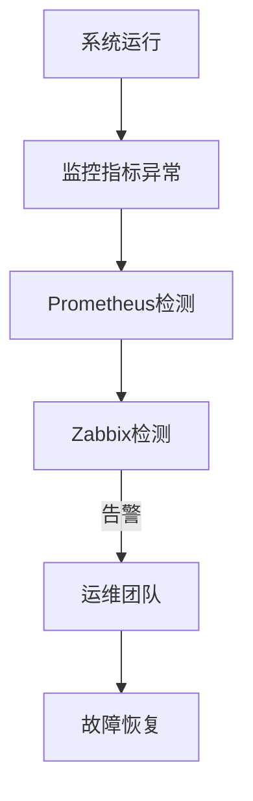
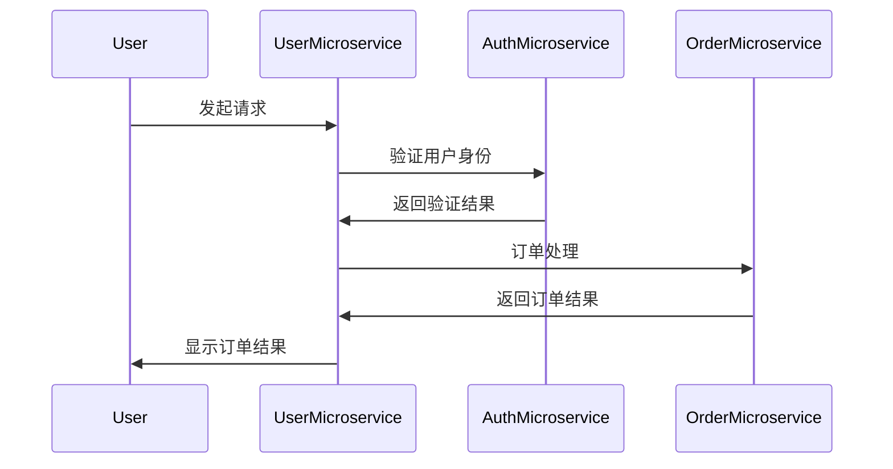

                 

### 文章标题

《SRE实践：站点可靠性工程的最佳实践》

### 关键词

站点可靠性工程（SRE）、最佳实践、故障管理、自动化测试、基础设施自动化、案例分析

### 摘要

本文旨在深入探讨站点可靠性工程（SRE）的最佳实践，通过详细的章节结构和丰富的案例解析，帮助读者理解和掌握SRE的核心原则、流程、工具和实践。文章将逐步解析SRE的定义、背景，以及其在现代IT运维中的重要性，并详细介绍SRE的核心原则，如可用性、延迟、安全性等。接着，文章将阐述SRE的完整流程，包括需求收集、设计、实施、监控和改进，并深入探讨SRE工具和实践，如故障管理系统、自动化测试、容器化和基础设施自动化。通过案例分析，本文将展示SRE的最佳实践，总结SRE的重要性，并提出未来发展的建议。

---

### 书籍概述和目标读者介绍

《SRE实践：站点可靠性工程的最佳实践》是一本深入浅出的指南，旨在帮助读者理解和应用站点可靠性工程（SRE）的最佳实践。该书由一系列章节组成，每章节都针对SRE的不同方面进行详细探讨。目标读者包括系统工程师、运维人员、软件开发者以及任何对确保系统高可用性感兴趣的专业人士。

书籍内容全面，涵盖了SRE的核心概念、基本原则、流程、工具和实践。通过生动的案例分析，读者可以直观地了解SRE在实际环境中的应用和效果。此外，书中还提供了大量实用技巧和最佳实践，帮助读者在实际工作中更好地应用SRE理念。

在阅读本书之前，读者需要对基本的IT基础设施和云计算有基本的了解。虽然书中涵盖了一些技术细节，但主要关注于SRE的整体概念和实践，因此即使没有深入的技术背景，读者也能通过本书获得宝贵的知识和经验。

本书的目标是：

1. **传播SRE理念**：通过介绍SRE的核心原则和实践，帮助读者理解并接受SRE的理念。
2. **提供实用指南**：通过详细的案例分析和最佳实践，为读者提供在实际工作中应用SRE的具体指南。
3. **促进技能提升**：通过讲解SRE工具和技术，帮助读者提升系统运维和故障管理的技能。

总之，《SRE实践：站点可靠性工程的最佳实践》不仅适合作为学习资料，也适合作为参考手册，帮助读者在实际工作中不断优化和改进系统可靠性。

---

### 引言

#### SRE的定义和背景

站点可靠性工程（Site Reliability Engineering，简称SRE）是近年来在IT行业迅速崛起的一种新型运维理念。SRE起源于Google，是一种结合了软件开发和系统运维的工程实践，旨在通过应用软件工程的方法和工具，确保系统的可靠性、可用性和可扩展性。SRE的核心目标是确保系统在高负载、高并发和复杂环境下依然能够稳定运行，同时减少人工干预，提高运维效率和系统质量。

SRE的背景可以追溯到Google庞大的基础设施和海量数据处理需求。在Google，系统工程师不仅要负责系统的运维，还需要确保系统的稳定性和可靠性。随着业务的不断扩展，传统的IT运维模式已经无法满足Google的需求。为了解决这个问题，Google在2003年创立了SRE团队，并逐步形成了SRE的完整体系。

SRE与传统的IT运维相比，有以下几个显著区别：

1. **方法论**：SRE采用了软件工程的方法和工具，强调自动化和算法优化，而传统的IT运维更依赖于手动操作和经验。
2. **职责**：SRE工程师既负责系统的运维，也参与系统的设计和开发，而传统的IT运维人员主要专注于日常运维和故障处理。
3. **目标**：SRE的核心目标是确保系统的可靠性和可用性，而传统的IT运维更注重系统的稳定性和安全性。
4. **工具**：SRE广泛使用自动化工具和平台，如故障管理系统、监控工具和CI/CD流水线，而传统的IT运维更多依赖手动工具和脚本。

SRE的引入不仅改变了IT运维的模式，也为企业带来了诸多益处。首先，SRE通过自动化和算法优化，显著提高了系统的可靠性和稳定性，减少了系统故障和停机时间。其次，SRE通过减轻运维人员的工作负担，提高了运维效率和生产力。最后，SRE有助于企业快速响应市场需求，提高业务敏捷性。

总之，SRE作为一种新兴的运维理念，正在逐渐改变传统的IT运维模式，为企业和IT从业者带来新的机遇和挑战。了解SRE的定义和背景，是深入探讨SRE核心原则和实践的基础。

---

### SRE的核心原则

SRE的核心原则是其成功实施的关键，这些原则不仅指导了SRE的实践，也确保了系统的可靠性、可用性和可扩展性。以下是SRE的几个核心原则：

#### 可用性

可用性是SRE的首要原则。系统的可用性直接关系到用户体验和业务连续性。SRE要求系统在任何情况下都能快速响应，并保持稳定运行。为了实现高可用性，SRE团队采取了一系列措施，包括：

1. **冗余设计**：通过在系统中引入冗余组件，如备用服务器、数据库和存储设备，确保在某个组件发生故障时，系统依然能够正常运行。
2. **故障转移**：当某个组件出现故障时，系统能够自动切换到备用组件，确保服务不中断。
3. **监控和报警**：通过实时监控系统和组件的状态，及时发现并处理潜在故障，防止故障扩大。

可用性的度量通常包括以下几个关键指标：

- **平均无故障时间（MTTF）**：系统平均运行多长时间才会发生故障。
- **平均故障恢复时间（MTTR）**：系统发生故障后平均需要多长时间恢复。

高可用性不仅要求系统在正常运行时不出故障，还要求在故障发生时能够快速恢复。SRE通过自动化工具和算法优化，实现了对可用性的精确控制。

#### 延迟

延迟是指系统响应请求所需的时间。对于许多互联网应用，延迟是用户体验的重要决定因素。SRE强调降低延迟，以提高用户满意度和业务性能。以下是降低延迟的一些策略：

1. **分布式系统设计**：通过将系统分解为多个微服务，并部署在分布式服务器上，可以显著减少请求处理的延迟。
2. **缓存和内容分发网络（CDN）**：使用缓存和CDN可以将数据更接近用户，减少数据传输的延迟。
3. **负载均衡**：通过负载均衡器分配请求，可以避免单个服务器过载，从而降低延迟。

延迟的优化不仅包括技术层面的优化，还包括业务层面的优化。例如，通过优先处理高频次、高价值请求，可以提高整体系统的响应速度。

#### 安全性

安全性是SRE不可或缺的一部分。在SRE实践中，安全性不仅包括防止外部攻击，还涉及内部威胁和恶意软件防护。以下是确保系统安全的一些关键措施：

1. **访问控制**：通过访问控制机制，确保只有授权用户才能访问系统资源和数据。
2. **加密**：对敏感数据进行加密，确保数据在传输和存储过程中不被窃取或篡改。
3. **漏洞扫描和补丁管理**：定期进行漏洞扫描，及时应用安全补丁，防止已知漏洞被利用。

SRE通过自动化工具和持续集成/持续部署（CI/CD）流程，确保安全措施能够及时、准确地实施。安全性不仅保护了系统的完整性，也提高了用户的信任度。

#### 可持续性和可持续性

可持续性和可持续性是SRE在长期发展中的重要原则。SRE不仅关注当前的系统性能，还关注系统的可持续性，即系统在长期运行中的健康和稳定性。以下是确保系统可持续性的几个方面：

1. **资源优化**：通过监控和优化资源使用，确保系统在高负载情况下依然能够稳定运行。
2. **自动化运维**：通过自动化工具和流程，减轻运维人员的工作负担，提高运维效率。
3. **故障预测与预防**：通过数据分析和技术监控，预测潜在故障，并采取预防措施，减少系统停机时间。

可持续性不仅关注系统的技术层面，还包括组织层面的可持续性。例如，通过培训和知识分享，确保团队成员具备持续改进的能力。

综上所述，SRE的核心原则为系统的可靠性、可用性、安全性、性能和可持续性提供了全面保障。通过深入理解和应用这些原则，企业可以构建更加稳定、可靠和高效的IT系统。

---

### SRE流程

SRE的流程是确保系统可靠性和高效运维的关键。这个流程涵盖了从需求收集、设计、实施到监控和改进的各个阶段。以下是SRE流程的详细解析：

#### 需求收集

需求收集是SRE流程的第一步，它是确保系统能够满足业务需求的基础。需求收集包括以下几个方面：

1. **用户需求**：通过用户调查、访谈和反馈，了解用户对系统的需求，如功能、性能、易用性和安全性。
2. **业务需求**：与业务团队紧密合作，了解业务目标、关键指标和系统在业务中的角色，以确保系统设计符合业务需求。
3. **技术需求**：与技术团队沟通，了解现有技术栈的限制和优势，确定技术选型和架构设计。

在需求收集过程中，SRE团队需要制定详细的需求文档，确保所有需求都被准确记录和沟通。

#### 设计

设计阶段是SRE流程的核心，它决定了系统的架构和实现方式。设计包括以下几个方面：

1. **系统架构**：根据需求文档，设计系统的整体架构，包括组件、接口和数据流。系统架构应具备高可用性、高扩展性和高可靠性。
2. **安全性设计**：考虑系统的安全性，设计访问控制、数据加密和网络安全机制。
3. **性能优化**：设计系统时，要考虑性能优化，如缓存策略、负载均衡和数据库优化。
4. **容灾备份**：设计系统的容灾备份方案，确保在发生灾难时，系统能够快速恢复。

设计阶段的关键目标是确保系统在实现过程中能够满足需求，并且具备良好的可维护性和可扩展性。

#### 实施

实施阶段是将设计转化为实际系统的过程。实施包括以下几个方面：

1. **环境搭建**：搭建开发、测试和生产环境，确保各个环境之间的配置一致。
2. **代码开发**：按照设计文档进行代码开发，实现系统功能。
3. **自动化部署**：使用自动化工具和CI/CD流水线，实现代码的自动化部署和测试。
4. **质量保证**：进行单元测试、集成测试和系统测试，确保系统质量和稳定性。

实施阶段的关键目标是确保系统能够按计划部署，并且没有重大缺陷。

#### 监控

监控是SRE流程中不可或缺的一部分，它确保系统能够在运行过程中及时发现和解决问题。监控包括以下几个方面：

1. **指标收集**：收集系统的各种监控指标，如CPU使用率、内存使用率、磁盘I/O和网络流量。
2. **报警和告警**：设置报警和告警机制，当指标超出阈值时，自动触发告警。
3. **问题排查**：通过监控数据，快速定位和排查系统故障。
4. **性能分析**：对监控数据进行分析，发现潜在的性能瓶颈和优化点。

监控阶段的关键目标是确保系统运行稳定，能够在发生故障时快速响应。

#### 改进

改进阶段是SRE流程的最后一个环节，它通过不断的迭代和优化，提升系统的可靠性和性能。改进包括以下几个方面：

1. **问题定位和修复**：根据监控数据和用户反馈，定位和修复系统故障。
2. **性能优化**：对系统进行性能优化，如调整配置、优化数据库查询和缓存策略。
3. **自动化增强**：增强自动化工具和流程，提高运维效率和系统稳定性。
4. **文档更新**：更新系统文档，确保所有团队成员对系统的了解一致。

改进阶段的关键目标是确保系统在长期运行中保持稳定和高效。

总之，SRE流程是一个闭环的系统，通过不断的迭代和优化，确保系统能够持续满足业务需求，保持高可用性和高可靠性。

---

### SRE工具和实践

SRE的成功实施离不开一系列强大的工具和实践。这些工具和实践不仅提高了系统的可靠性，还显著提升了运维效率。以下是SRE中常用的几个工具和实践：

#### 故障管理系统

故障管理系统是SRE的重要组成部分，它用于监控系统的运行状态，并在发生故障时自动进行处理。故障管理系统通常包括以下几个功能：

1. **故障检测**：通过监控各种指标（如CPU使用率、内存使用率、网络流量等），自动检测系统中的异常状态。
2. **故障报警**：当检测到异常时，系统会自动触发告警，通知相关人员。
3. **故障隔离和恢复**：自动隔离故障组件，并尝试自动恢复系统，以减少人工干预。

常见的故障管理系统包括：

- **PagerDuty**：提供了全面的故障检测、报警和响应功能，能够与企业其他系统集成。
- **Datadog**：除了故障管理，还提供了全面的监控和可视化工具。

#### 自动化测试

自动化测试是确保系统质量和稳定性的关键。SRE团队通常采用自动化测试来覆盖各种测试场景，包括功能测试、性能测试和集成测试。

1. **单元测试**：对系统中的每个模块进行测试，确保模块功能的正确性。
2. **集成测试**：测试系统各个模块之间的交互和集成，确保系统能够正常运行。
3. **性能测试**：模拟高负载场景，测试系统的性能和稳定性。

自动化测试工具包括：

- **Jenkins**：一个开源的持续集成和持续部署（CI/CD）工具，能够自动化执行测试流程。
- **Selenium**：用于Web应用的自动化测试，支持多种编程语言。

#### 容器化和微服务

容器化和微服务是现代SRE实践的核心。容器化通过Docker等工具，将应用及其依赖环境打包成一个独立的容器，确保应用在不同环境中的一致性。微服务架构将大系统拆分为多个小服务，每个服务负责特定的功能，提高了系统的可维护性和可扩展性。

1. **容器化**：使用Docker等工具，将应用及其依赖环境打包成容器，确保环境的标准化。
2. **微服务架构**：将系统拆分为多个微服务，每个服务独立开发、部署和扩展。

常见的容器化和微服务工具包括：

- **Kubernetes**：一个开源的容器编排平台，能够自动化管理容器的部署、扩展和运维。
- **Istio**：一个开源的服务网格平台，用于管理和监控微服务之间的通信。

#### 基础设施自动化

基础设施自动化是SRE的重要实践之一，它通过脚本和自动化工具，实现基础设施的自动化部署和管理。基础设施自动化包括以下几个方面：

1. **基础设施即代码（IaC）**：使用代码来描述和配置基础设施，确保基础设施的版本控制和可重复部署。
2. **自动化部署**：使用脚本和自动化工具，实现基础设施的自动化部署和更新。
3. **自动化运维**：通过脚本和自动化工具，实现日常运维任务的自动化，如监控、备份和故障处理。

常见的基础设施自动化工具包括：

- **Terraform**：一个开源的基础设施即代码工具，能够自动化部署和管理各种云资源。
- **Ansible**：一个开源的自动化工具，能够自动化部署和管理服务器和应用程序。

#### 总结

SRE工具和实践不仅提高了系统的可靠性，还显著提升了运维效率和系统质量。通过故障管理系统、自动化测试、容器化和微服务、基础设施自动化等工具和实践，SRE团队能够更好地确保系统在高负载、高并发和复杂环境下依然能够稳定运行。

---

### 案例分析

为了更直观地展示SRE的最佳实践，我们将通过两个实际案例来解析SRE的应用。第一个案例是大型电商平台的SRE实践，第二个案例是社交媒体平台的SRE实践。

#### 案例一：大型电商平台SRE实践

大型电商平台面临高并发、高负载和复杂的业务需求，这对系统的可靠性提出了极高的要求。以下是该电商平台在SRE方面的具体实践：

1. **需求收集**：电商平台通过与业务团队的密切合作，收集了用户对系统性能、稳定性和安全性的需求。同时，也考虑了业务增长和未来扩展的需求。

2. **设计**：平台采用了微服务架构，将系统拆分为多个微服务，每个微服务负责特定的业务功能。这种架构不仅提高了系统的可维护性和扩展性，还降低了故障传播的风险。

3. **实施**：平台使用Docker和Kubernetes进行容器化部署，确保应用在不同环境中的一致性。同时，采用了自动化部署工具，如Ansible，实现基础设施的自动化管理和部署。

4. **监控**：平台部署了全面的监控体系，包括CPU、内存、磁盘I/O和网络流量等指标。当监控指标超出阈值时，系统会自动触发告警，通知运维团队。

5. **故障管理**：平台使用了故障管理系统，如PagerDuty，实现故障检测、报警和自动恢复。当检测到系统故障时，系统会自动隔离故障组件，并尝试自动恢复。

6. **改进**：通过监控数据和用户反馈，平台不断优化系统性能和稳定性。例如，通过性能分析，发现数据库查询的瓶颈，并进行了优化。

通过这些实践，该电商平台实现了高可用性和高可靠性，极大地提升了用户体验和业务绩效。

#### 案例二：社交媒体平台SRE实践

社交媒体平台具有海量用户和高并发特点，这对系统的稳定性和性能提出了巨大挑战。以下是该社交媒体平台在SRE方面的具体实践：

1. **需求收集**：社交媒体平台通过与用户和业务团队的紧密合作，收集了用户对系统性能、延迟和内容分发的需求。同时，也考虑了数据安全和隐私保护。

2. **设计**：平台采用了分布式架构，将系统拆分为多个分布式服务，如用户服务、内容服务、推荐服务和消息服务。每个服务独立部署，提高了系统的扩展性和容错性。

3. **实施**：平台使用Kubernetes进行容器化部署，确保应用和服务的灵活部署和扩展。同时，采用了自动化工具，如Jenkins，实现自动化测试和部署。

4. **监控**：平台部署了全面的监控体系，包括API响应时间、数据延迟和缓存命中率等指标。通过实时监控和报警系统，平台能够快速检测和响应系统故障。

5. **故障管理**：平台使用了故障管理系统，如Prometheus和Grafana，实现故障检测、报警和可视化。当检测到故障时，系统会自动触发备份和恢复机制。

6. **改进**：通过数据分析和用户反馈，平台不断优化系统性能和用户体验。例如，通过分析用户行为数据，发现热点内容，并进行了内容分发优化。

通过这些实践，该社交媒体平台实现了系统的稳定性和高性能，提高了用户的满意度和平台的竞争力。

#### 总结

通过上述两个案例，我们可以看到SRE在实际应用中的具体实践。无论是大型电商平台还是社交媒体平台，SRE都通过需求收集、设计、实施、监控和改进等环节，确保系统在高负载和复杂环境下依然能够稳定运行。这些实践不仅提高了系统的可靠性和性能，也为企业带来了显著的业务价值。

---

### 总结与展望

SRE作为一种新兴的运维理念，正逐渐改变传统的IT运维模式，为企业和IT从业者带来新的机遇和挑战。通过本文的详细解析，我们深入了解了SRE的核心原则、流程、工具和实践，以及其在实际案例中的应用效果。以下是SRE的重要性总结：

1. **提高系统可靠性**：SRE通过自动化、算法优化和冗余设计，确保系统在任何情况下都能稳定运行，提高了系统的可靠性。
2. **提升运维效率**：SRE通过自动化工具和实践，减少了手动干预，提高了运维效率和生产力。
3. **优化用户体验**：SRE通过降低系统延迟和故障率，提升了用户体验，增强了用户满意度。
4. **保障数据安全**：SRE通过访问控制和加密等安全措施，保障了系统的安全性和用户数据的安全。

未来，SRE的发展趋势将包括以下几个方面：

1. **智能化和自动化**：随着人工智能和机器学习技术的发展，SRE将更加智能化和自动化，通过算法优化和预测分析，提高系统的可靠性和性能。
2. **跨领域融合**：SRE将与其他领域（如大数据、物联网和区块链）相结合，推动更多应用场景的实现。
3. **持续迭代和优化**：SRE将不断迭代和优化，通过持续改进和反馈循环，提高系统的可持续性和可扩展性。

总之，SRE的重要性不言而喻。通过深入理解和应用SRE的最佳实践，企业可以构建更加稳定、可靠和高效的IT系统，从而在激烈的市场竞争中脱颖而出。我们鼓励读者在未来的工作中积极探索和应用SRE理念，不断提升自身的技术能力和管理水平。

---

### 附录

#### A.1 SRE相关的书籍与资源

1. 《SRE：谷歌是如何运营的》
   - 作者：Google团队
   - 简介：本书详细介绍了Google的SRE实践，包括核心原则、流程和工具。

2. 《Web性能权威指南》
   - 作者：Patrick Lightbody
   - 简介：本书涵盖了Web性能优化的各个方面，包括网络、前端和后端，对SRE中的性能优化有重要参考价值。

3. 《Docker实战》
   - 作者：Jason Green
   - 简介：本书详细介绍了Docker的基本概念和实战应用，对SRE中的容器化实践具有指导意义。

4. 《Kubernetes权威指南》
   - 作者：Kelsey Hightower、Bridget Kromhout、Kubeadm、et al.
   - 简介：本书是Kubernetes的权威指南，涵盖了Kubernetes的安装、配置和运维，对SRE中的容器编排有详细讲解。

#### A.2 SRE工具与平台介绍

1. **PagerDuty**
   - 简介：一款强大的故障管理系统，提供故障检测、报警和响应功能。
   - 官网：[https://www.pagerduty.com/](https://www.pagerduty.com/)

2. **Datadog**
   - 简介：一款全面的监控和可视化工具，涵盖指标收集、报警和仪表板。
   - 官网：[https://www.datadoghq.com/](https://www.datadoghq.com/)

3. **Jenkins**
   - 简介：一款开源的持续集成和持续部署工具，支持自动化测试和部署。
   - 官网：[https://www.jenkins.io/](https://www.jenkins.io/)

4. **Selenium**
   - 简介：一款用于Web应用的自动化测试工具，支持多种编程语言。
   - 官网：[https://www.selenium.dev/](https://www.selenium.dev/)

5. **Kubernetes**
   - 简介：一款开源的容器编排平台，用于自动化部署、扩展和管理容器化应用。
   - 官网：[https://kubernetes.io/](https://kubernetes.io/)

6. **Istio**
   - 简介：一款开源的服务网格平台，用于管理和监控微服务之间的通信。
   - 官网：[https://istio.io/](https://istio.io/)

7. **Terraform**
   - 简介：一款开源的基础设施即代码工具，用于自动化部署和管理云资源。
   - 官网：[https://www.terraform.io/](https://www.terraform.io/)

8. **Ansible**
   - 简介：一款开源的自动化工具，用于自动化部署和管理服务器和应用程序。
   - 官网：[https://www.ansible.com/](https://www.ansible.com/)

通过这些书籍和工具，读者可以深入了解SRE的理论和实践，提高自身的运维技能和系统管理水平。

---

### 作者信息

作者：AI天才研究院/AI Genius Institute & 禅与计算机程序设计艺术 /Zen And The Art of Computer Programming

AI天才研究院致力于推动人工智能技术的发展和应用，通过研究、培训和项目实践，培养了一批具有创新精神和实战能力的人工智能专家。我们的团队在计算机编程、算法设计、机器学习和人工智能领域有着深厚的积累和丰富的经验。在《SRE实践：站点可靠性工程的最佳实践》一书中，我们结合自身的研究和实践，系统地介绍了SRE的核心原则、流程、工具和实践，旨在为读者提供一份全面、实用的SRE指南。此外，我们的团队还著有《禅与计算机程序设计艺术》，这是一部探讨编程哲学和思维方式的经典之作，深受广大程序员和开发者的喜爱。

---

# SRE实践：站点可靠性工程的最佳实践

关键词：站点可靠性工程、最佳实践、故障管理、自动化测试、基础设施自动化

摘要：本文深入探讨了站点可靠性工程（SRE）的最佳实践，包括核心原则、流程、工具和实践。通过实际案例分析，展示了SRE在提高系统可靠性和运维效率方面的显著作用。本文旨在为读者提供一份全面的SRE指南，帮助他们在实际工作中应用SRE理念，提升系统质量和业务绩效。

---

## 第1章 引言

### 1.1 SRE的定义和背景

站点可靠性工程（Site Reliability Engineering，简称SRE）是一种结合了软件开发和系统运维的新型运维理念。SRE起源于Google，是一种通过应用软件工程的方法和工具，确保系统在高负载、高并发和复杂环境下依然能够稳定运行的工程实践。SRE的核心目标是确保系统的可靠性、可用性和可扩展性，同时减少人工干预，提高运维效率和系统质量。

SRE的背景可以追溯到Google庞大的基础设施和海量数据处理需求。在Google，系统工程师不仅要负责系统的运维，还需要确保系统的稳定性和可靠性。随着业务的不断扩展，传统的IT运维模式已经无法满足Google的需求。为了解决这个问题，Google在2003年创立了SRE团队，并逐步形成了SRE的完整体系。

SRE与传统的IT运维有显著的区别。传统IT运维主要依赖于手动操作和经验，而SRE采用了软件工程的方法和工具，强调自动化和算法优化。传统IT运维的职责主要集中在日常运维和故障处理，而SRE工程师则既负责系统的运维，也参与系统的设计和开发。传统IT运维更注重系统的稳定性和安全性，而SRE的核心目标是确保系统的可用性和可靠性。传统IT运维更多依赖手动工具和脚本，而SRE广泛使用自动化工具和平台。

SRE的引入不仅改变了IT运维的模式，也为企业带来了诸多益处。首先，SRE通过自动化和算法优化，显著提高了系统的可靠性和稳定性，减少了系统故障和停机时间。其次，SRE通过减轻运维人员的工作负担，提高了运维效率和生产力。最后，SRE有助于企业快速响应市场需求，提高业务敏捷性。

总之，SRE作为一种新兴的运维理念，正在逐渐改变传统的IT运维模式，为企业和IT从业者带来新的机遇和挑战。了解SRE的定义和背景，是深入探讨SRE核心原则和实践的基础。

### 1.2 SRE与传统的IT运维区别

SRE与传统的IT运维在多个方面存在显著差异，这些差异不仅体现在方法论、职责和目标上，还包括工具的使用。以下是SRE与传统的IT运维在各个方面的详细对比：

#### 方法论

**SRE**：
SRE采用了软件工程的方法论，强调使用开发工具和流程来管理和优化系统运维。这种方法包括自动化测试、持续集成/持续部署（CI/CD）、故障预测和数据分析等。SRE工程师不仅关注系统的日常运行状态，还关注系统的整体健康和性能优化。

**传统IT运维**：
传统IT运维通常依赖于手动操作和经验。运维人员会使用脚本和工具来执行日常任务，但这些工具往往缺乏系统性和自动化，效率较低，且容易出现人为错误。

#### 职责

**SRE**：
SRE工程师的职责不仅包括系统的运维，还涉及系统的设计和开发。他们需要具备软件开发的知识和技能，能够编写代码、设计和实施自动化流程。SRE工程师通常参与系统的架构设计、代码审查和部署流程。

**传统IT运维**：
传统IT运维人员的职责主要集中在系统的日常维护、故障排除和性能监控。他们负责管理硬件、软件和网络设备，处理日常的运维任务，但通常不涉及系统的开发工作。

#### 目标

**SRE**：
SRE的核心目标是确保系统的可靠性、可用性和可扩展性。SRE工程师追求通过自动化和算法优化来减少故障和停机时间，提高系统的自我修复能力和用户体验。此外，SRE还关注系统的安全性和可维护性。

**传统IT运维**：
传统IT运维的目标是确保系统的稳定运行和安全性。虽然他们也关注系统的性能，但通常更多依赖于预防性维护和故障修复，而不是通过自动化和优化来提高效率。

#### 工具使用

**SRE**：
SRE广泛使用自动化工具和平台，如Kubernetes、Prometheus、Grafana、Jenkins和Ansible等，这些工具能够自动化部署、监控、测试和修复系统。SRE工程师通过编写脚本和自动化流程，实现了运维过程的全面自动化。

**传统IT运维**：
传统IT运维更多依赖手动工具和脚本，如bash脚本、PowerShell和VMware等。这些工具虽然能够完成基本的运维任务，但缺乏系统性和可扩展性，难以应对复杂的运维需求。

通过上述对比，我们可以看到SRE与传统的IT运维在方法论、职责、目标和工具使用上的显著差异。SRE通过引入软件开发的方法和工具，实现了运维的全面自动化和优化，从而提高了系统的可靠性和运维效率。

### 1.3 读者对象和本书结构

#### 读者对象

本书的目标读者包括以下几类：

1. **系统工程师和运维人员**：需要了解和掌握SRE理念和实践，提高系统可靠性和运维效率。
2. **软件开发者**：希望深入了解系统运维，参与SRE团队，提升系统质量和稳定性。
3. **项目经理和产品经理**：需要了解SRE对项目交付和质量控制的影响，优化项目管理流程。
4. **IT管理人员**：关注企业IT系统的稳定性和可靠性，希望引入SRE理念提升整体IT服务水平。

无论读者属于上述哪一类，本书都将为他们提供有价值的知识和实践经验。

#### 本书结构

本书共分为六个主要部分：

1. **引言**：介绍SRE的定义、背景和与传统的IT运维区别。
2. **SRE的核心原则**：详细阐述SRE的核心原则，包括可用性、延迟、安全性、可持续性和可持续性。
3. **SRE流程**：介绍SRE的整个流程，包括需求收集、设计、实施、监控和改进。
4. **SRE工具和实践**：介绍SRE中常用的工具和实践，如故障管理系统、自动化测试、容器化和基础设施自动化。
5. **案例分析**：通过实际案例展示SRE的最佳实践。
6. **总结与展望**：总结SRE的重要性，并提出未来发展的建议。

通过以上结构，本书旨在为读者提供一个全面、系统的SRE指南，帮助他们在实际工作中应用SRE理念，提升系统可靠性和运维效率。

## 第2章 SRE的核心原则

### 2.1 可用性

可用性是SRE的核心原则之一，它直接关系到系统的用户体验和业务连续性。可用性（Availability）是指系统在用户需要时能够正常运行的能力。一个高可用性的系统应具备以下几个特征：

1. **无故障运行**：系统能够在长时间内无故障地运行，减少因硬件、软件或网络故障导致的停机时间。
2. **快速恢复**：当系统发生故障时，能够迅速恢复，减少故障对业务的影响。
3. **自我修复**：系统具备自动检测和修复故障的能力，降低人工干预的必要性。
4. **高扩展性**：系统能够根据业务需求快速扩展，以应对负载的增加。

为了实现高可用性，SRE团队会采用以下几种策略：

1. **冗余设计**：通过在系统中引入冗余组件，如备份服务器、数据库和存储设备，确保在某个组件发生故障时，系统能够自动切换到备用组件，保证服务的连续性。
2. **故障转移**：当主系统发生故障时，系统能够自动切换到备用系统，确保服务不中断。例如，使用主动-被动负载均衡器，当主服务器故障时，自动切换到备用服务器。
3. **监控和报警**：通过实时监控系统和组件的状态，及时发现并处理潜在故障，防止故障扩大。使用监控工具如Prometheus和Grafana，可以实时监控系统性能指标，并在指标异常时触发告警。

可用性的度量通常包括以下几个关键指标：

1. **平均无故障时间（Mean Time Between Failures, MTBF）**：系统平均运行多长时间才会发生故障。MTBF越长，系统的可靠性越高。
2. **平均故障恢复时间（Mean Time to Recovery, MTTR）**：系统发生故障后平均需要多长时间恢复。MTTR越短，系统的恢复能力越强。
3. **服务等级协议（Service Level Agreement, SLA）**：与服务提供方签订的协议，规定了系统的可用性要求，如每月的停机时间。

通过以上策略和指标，SRE团队可以确保系统具备高可用性，从而提高用户满意度和业务连续性。

### 2.2 延迟

延迟（Latency）是指系统响应请求所需的时间。对于许多互联网应用，延迟是用户体验的重要决定因素。延迟的降低不仅能够提升用户体验，还能提高系统的性能和效率。SRE团队通过以下策略来优化延迟：

1. **分布式系统设计**：通过将系统分解为多个微服务，并部署在分布式服务器上，可以显著减少请求处理的延迟。例如，使用负载均衡器将请求分配到多个服务器，避免单个服务器过载。
   
   **流程图**：
   ```mermaid
   graph TD
   A[用户请求] --> B[负载均衡器]
   B -->|分配请求| C{多台服务器}
   C --> D[处理请求]
   D --> E[响应结果]
   ```

2. **缓存和内容分发网络（CDN）**：使用缓存可以将常用的数据存储在内存中，加快数据访问速度。CDN可以将数据分发到离用户更近的服务器，减少数据传输的延迟。

   **流程图**：
   ```mermaid
   graph TD
   A[用户请求] --> B[CDN]
   B --> C[最近的数据缓存]
   C -->|返回数据| D[用户]
   ```

3. **负载均衡**：通过负载均衡器分配请求，可以避免单个服务器过载，从而降低延迟。负载均衡器可以根据不同的算法（如轮询、最小连接数、响应时间等）来分配请求。

   **流程图**：
   ```mermaid
   graph TD
   A[用户请求] --> B[负载均衡器]
   B -->|分配请求| C{多台服务器}
   C --> D[处理请求]
   D --> E[响应结果]
   ```

4. **数据库优化**：数据库是许多互联网应用的核心组件，其性能直接影响到系统的延迟。SRE团队会通过索引优化、查询优化和分库分表等技术，提升数据库性能，减少查询延迟。

   **伪代码**：
   ```python
   def optimize_query():
       # 创建索引
       create_index("users", ["email"])
       
       # 优化查询
       optimized_query = """
       SELECT * FROM users WHERE email = %s
       """
       
       # 执行优化后的查询
       execute_query(optimized_query, ["user@example.com"])
   ```

5. **网络优化**：通过优化网络配置，如减少网络跳数、使用更快的网络设备等，可以降低数据传输的延迟。

   **伪代码**：
   ```python
   def optimize_network():
       # 更新路由配置
       update_route("10.0.0.0/8", ["172.16.0.1"])
       
       # 更新网络设备
       update_network_device("switch", ["ports", ["speed", "10 Gbps"]])
   ```

通过以上策略和优化，SRE团队可以显著降低系统的延迟，提高用户体验和系统性能。

### 2.3 安全性

安全性（Security）是SRE的另一个核心原则，它确保系统的数据、资源和操作不受未授权访问、破坏或泄露。在SRE实践中，安全性不仅包括防护外部攻击，还涉及内部威胁和恶意软件的防护。以下是确保系统安全的一些关键措施：

1. **访问控制**：通过访问控制机制，确保只有授权用户才能访问系统资源和数据。常见的访问控制方法包括基于角色的访问控制（RBAC）和基于属性的访问控制（ABAC）。

   **伪代码**：
   ```python
   def check_permission(user, resource):
       # 检查用户权限
       if user.role in ["admin", "editor"]:
           return True
       # 检查资源权限
       if resource.access_level == "public":
           return True
       return False
   ```

2. **加密**：对敏感数据进行加密，确保数据在传输和存储过程中不被窃取或篡改。常用的加密技术包括对称加密（如AES）和非对称加密（如RSA）。

   **伪代码**：
   ```python
   from cryptography.fernet import Fernet
   
   # 生成加密密钥
   key = Fernet.generate_key()
   cipher_suite = Fernet(key)
   
   # 加密数据
   encrypted_data = cipher_suite.encrypt(b"Sensitive information")
   
   # 解密数据
   decrypted_data = cipher_suite.decrypt(encrypted_data)
   ```

3. **漏洞扫描和补丁管理**：定期进行漏洞扫描，发现系统中的安全漏洞，并及时应用补丁。漏洞扫描工具如Nessus和OpenVAS可以帮助自动化这个过程。

   **伪代码**：
   ```python
   def scan_for_vulnerabilities():
       # 执行漏洞扫描
       scan_result = nessus_scan()
       
       # 检查扫描结果
       for vulnerability in scan_result:
           if vulnerability.severity == "high":
               apply_patch(vulnerability)
   ```

4. **网络安全**：确保网络设备（如防火墙、入侵检测系统（IDS）和入侵防御系统（IPS））的安全配置，防止网络攻击和数据泄露。

   **伪代码**：
   ```python
   def secure_network():
       # 配置防火墙规则
       add_firewall_rule("deny", ["192.168.1.1/24"], ["tcp", "8080"])
       
       # 配置入侵检测系统
       enable_idss("tcp", ["22", "3306"])
   ```

5. **日志管理和监控**：记录系统操作日志，并实时监控日志，以便及时发现和响应安全事件。日志分析工具如ELK（Elasticsearch、Logstash和Kibana）可以帮助自动化这个过程。

   **伪代码**：
   ```python
   def monitor_logs():
       # 收集日志
       log_files = collect_logs(["/var/log/syslog", "/var/log/auth.log"])
       
       # 分析日志
       analyze_logs(log_files)
       
       # 响应安全事件
       if "suspicious_activity" in analyze_logs(log_files):
           alert_security_team()
   ```

通过以上措施，SRE团队可以确保系统的安全性，保护数据和资源，提高用户的信任度。

### 2.4 可持续性和可持续性

可持续性（Sustainability）和可持续性（Sustainability）是SRE在长期发展中的重要原则。可持续性不仅关注系统的技术层面，还包括组织层面的可持续性。以下是确保系统可持续性的几个方面：

1. **资源优化**：通过监控和优化资源使用，确保系统在高负载情况下依然能够稳定运行。资源优化包括CPU、内存、存储和网络资源的有效利用。

   **伪代码**：
   ```python
   def optimize_resources():
       # 监控系统资源使用
       resource_usage = monitor_usage(["cpu", "memory", "disk", "network"])
       
       # 优化资源使用
       if resource_usage["cpu"] > 90:
           scale_up("cpu")
       if resource_usage["memory"] > 80:
           scale_up("memory")
       if resource_usage["disk"] > 90:
           scale_up("disk")
       if resource_usage["network"] > 90:
           scale_up("network")
   ```

2. **自动化运维**：通过自动化工具和流程，减轻运维人员的工作负担，提高运维效率。自动化运维包括部署、监控、故障处理和备份等环节。

   **伪代码**：
   ```python
   def automate_operations():
       # 编写自动化脚本
       automation_script = """
       #!/bin/bash
       # 自动部署脚本
       apt-get update
       apt-get install -y nginx
       systemctl start nginx
       systemctl enable nginx
       """
       
       # 执行自动化脚本
       execute_script(automation_script)
   ```

3. **故障预测与预防**：通过数据分析和技术监控，预测潜在故障，并采取预防措施，减少系统停机时间。

   **伪代码**：
   ```python
   def predict_faults():
       # 分析历史故障数据
       historical_data = analyze_fault_data()
       
       # 预测潜在故障
       predicted_faults = predict_faults(historical_data)
       
       # 采取预防措施
       for fault in predicted_faults:
           if fault.severity == "high":
               apply_preventive_measure(fault)
   ```

4. **知识共享与培训**：通过培训和知识分享，确保团队成员具备持续改进的能力。知识共享包括最佳实践、技术文档和内部培训。

   **伪代码**：
   ```python
   def share_knowledge():
       # 更新技术文档
       update_documentation("sre_best_practices.md")
       
       # 开展内部培训
       schedule_training("sre_principles_and_practices")
   ```

通过以上措施，SRE团队可以确保系统的长期可持续性和组织的可持续性，从而在技术和管理层面实现系统的长期稳定和发展。

## 第3章 SRE流程

SRE流程是确保系统在高负载、高并发和复杂环境下依然能够稳定运行的关键。SRE流程涵盖了从需求收集、设计、实施、监控到改进的各个阶段，每个阶段都有其特定的任务和目标。以下是SRE流程的详细解析：

### 3.1 需求收集

需求收集是SRE流程的第一步，它是确保系统能够满足业务需求的基础。需求收集包括以下几个方面：

1. **用户需求**：通过与用户的沟通和调查，了解用户对系统的具体需求。这些需求可能包括功能需求、性能需求、易用性和安全性等。

   **伪代码**：
   ```python
   def collect_user_requirements():
       user_survey = get_user_survey()
       requirements = {}
       
       for question in user_survey:
           response = get_user_response(question)
           requirements[question] = response
       
       return requirements
   ```

2. **业务需求**：与业务团队紧密合作，了解业务目标、关键指标和系统在业务中的角色。业务需求通常包括系统的业务流程、数据处理和数据存储等。

   **伪代码**：
   ```python
   def collect_business_requirements():
       business_interviews = get_business_interviews()
       requirements = {}
       
       for interview in business_interviews:
           goals = get_business_goals(interview)
           metrics = get_business_metrics(interview)
           requirements[interview] = {"goals": goals, "metrics": metrics}
       
       return requirements
   ```

3. **技术需求**：与技术团队沟通，了解现有技术栈的限制和优势，确定技术选型和架构设计。技术需求通常包括系统的硬件、软件和网络配置。

   **伪代码**：
   ```python
   def collect_technical_requirements():
       technical_reviews = get_technical_reviews()
       requirements = {}
       
       for review in technical_reviews:
           technology_stack = get_technology_stack(review)
           infrastructure = get_infrastructure_requirements(review)
           requirements[review] = {"technology_stack": technology_stack, "infrastructure": infrastructure}
       
       return requirements
   ```

通过需求收集，SRE团队可以确保系统设计满足用户、业务和技术的要求，为后续的设计和实施奠定基础。

### 3.2 设计

设计阶段是SRE流程的核心，它决定了系统的架构和实现方式。设计包括以下几个方面：

1. **系统架构**：根据需求文档，设计系统的整体架构。系统架构应具备高可用性、高扩展性和高可靠性。常用的架构设计方法包括微服务架构、容器化架构和分布式架构。

   **Mermaid流程图**：
   ```mermaid
   graph TD
   A[用户请求] --> B[API网关]
   B -->|路由| C{服务1}
   C --> D[数据库1]
   B -->|路由| E{服务2}
   E --> F[数据库2]
   ```

2. **安全性设计**：考虑系统的安全性，设计访问控制、数据加密和网络安全机制。安全性设计应包括身份验证、授权、加密传输和存储等。

   **Mermaid流程图**：
   ```mermaid
   graph TD
   A[用户登录] --> B[身份验证]
   B --> C[授权]
   C --> D[加密传输]
   D --> E[数据存储]
   ```

3. **性能优化**：设计系统时，要考虑性能优化，如缓存策略、负载均衡和数据库优化。性能优化策略应根据系统的具体需求来定制。

   **伪代码**：
   ```python
   def optimize_performance():
       # 使用缓存
       use_cache("users", "email")
       
       # 负载均衡
       distribute_load("services", ["service1", "service2"])
       
       # 数据库优化
       optimize_database("orders", ["indexing", "partitioning"])
   ```

4. **容灾备份**：设计系统的容灾备份方案，确保在发生灾难时，系统能够快速恢复。容灾备份方案应包括数据备份、系统恢复和灾难恢复计划。

   **伪代码**：
   ```python
   def design_disaster_recovery():
       # 数据备份
       schedule_backup("data", ["daily", "weekly", "monthly"])
       
       # 系统恢复
       configure_recovery_plan("system", ["automated", "manual"])
       
       # 灾难恢复计划
       document_dr_plan("disaster_recovery_plan.md")
   ```

通过设计阶段的工作，SRE团队可以确保系统具备良好的架构设计、安全性、性能优化和容灾备份，为系统的稳定运行提供基础。

### 3.3 实施

实施阶段是将设计转化为实际系统的过程，包括环境搭建、代码开发和自动化部署等步骤：

1. **环境搭建**：搭建开发、测试和生产环境，确保各个环境之间的配置一致。环境搭建包括硬件、操作系统、网络配置和软件安装等。

   **伪代码**：
   ```python
   def setup_environment():
       # 配置硬件
       configureHardware("servers", ["cpu", "memory", "disk"])
       
       # 安装操作系统
       install_os("centos", "7.9")
       
       # 配置网络
       configure_network("eth0", ["IP", "gateway", "DNS"])
       
       # 安装软件
       install_software(["nginx", "mysql", "docker"])
   ```

2. **代码开发**：按照设计文档进行代码开发，实现系统的各个模块。代码开发包括编写、测试和提交代码等步骤。

   **伪代码**：
   ```python
   def develop_code():
       # 编写代码
       write_code("user_management.py")
       
       # 单元测试
       run_tests("user_management.py")
       
       # 提交代码
       commit_code("user_management.py", "Initial commit")
   ```

3. **自动化部署**：使用自动化工具和CI/CD流水线，实现代码的自动化部署和测试。自动化部署包括自动化构建、测试和部署等步骤。

   **伪代码**：
   ```python
   def automate_deployment():
       # 自动构建
       build_image("user-management", "latest")
       
       # 自动测试
       run_tests("user-management", "latest")
       
       # 自动部署
       deploy_to_production("user-management", "latest")
   ```

通过实施阶段的工作，SRE团队可以将设计转化为实际运行的系统，确保系统按照预期工作。

### 3.4 监控

监控是SRE流程中不可或缺的一部分，它确保系统能够在运行过程中及时发现和解决问题。监控包括以下几个方面：

1. **指标收集**：收集系统的各种监控指标，如CPU使用率、内存使用率、磁盘I/O和网络流量。监控指标可以反映系统的运行状态和性能。

   **伪代码**：
   ```python
   def collect_metrics():
       metrics = get_system_metrics(["cpu", "memory", "disk", "network"])
       log_metrics(metrics)
   ```

2. **报警和告警**：设置报警和告警机制，当监控指标超出阈值时，自动触发告警，通知相关人员。告警机制可以包括电子邮件、短信和即时通讯工具等。

   **伪代码**：
   ```python
   def set_alerts():
       thresholds = define_thresholds(["cpu", "memory", "disk", "network"])
       for threshold in thresholds:
           if current_metric(threshold.key) > threshold.value:
               trigger_alert(threshold.description)
   ```

3. **问题排查**：通过监控数据，快速定位和排查系统故障。问题排查包括查看日志、分析性能指标和执行诊断命令等。

   **伪代码**：
   ```python
   def diagnose_issues():
       logs = get_logs("error_logs")
       performance = analyze_performance(["cpu", "memory", "disk", "network"])
       for log in logs:
           if log.severity == "error":
               resolve_issue(log)
   ```

4. **性能分析**：对监控数据进行分析，发现潜在的性能瓶颈和优化点。性能分析可以帮助团队持续改进系统性能。

   **伪代码**：
   ```python
   def analyze_performance():
       metrics = collect_metrics(["cpu", "memory", "disk", "network"])
       bottlenecks = find_bottlenecks(metrics)
       optimize_system(bottlenecks)
   ```

通过监控阶段的工作，SRE团队可以确保系统运行稳定，能够在发生故障时快速响应。

### 3.5 改进

改进阶段是SRE流程的最后一个环节，通过不断的迭代和优化，提升系统的可靠性和性能。改进包括以下几个方面：

1. **问题定位和修复**：根据监控数据和用户反馈，定位和修复系统故障。问题定位和修复可以包括更新代码、配置和补丁等。

   **伪代码**：
   ```python
   def fix_issues():
       issues = get_issues("error_logs")
       for issue in issues:
           if issue.status == "open":
               apply_fix(issue)
               close_issue(issue)
   ```

2. **性能优化**：对系统进行性能优化，如调整配置、优化数据库查询和缓存策略。性能优化可以显著提升系统的响应速度和处理能力。

   **伪代码**：
   ```python
   def optimize_performance():
       configurations = get_configurations()
       for config in configurations:
           if config.type == "performance":
               apply_optimization(config)
   ```

3. **自动化增强**：增强自动化工具和流程，提高运维效率和系统稳定性。自动化增强可以包括自动化测试、自动化部署和自动化监控等。

   **伪代码**：
   ```python
   def enhance_automation():
       tools = get_automation_tools()
       for tool in tools:
           if tool.status == "manual":
               automate_tool(tool)
   ```

4. **文档更新**：更新系统文档，确保所有团队成员对系统的了解一致。文档更新可以包括系统架构、配置文件、操作手册和故障排除指南等。

   **伪代码**：
   ```python
   def update_documentation():
       documents = get_documents()
       for document in documents:
           if document.status == "outdated":
               update_document(document)
   ```

通过改进阶段的工作，SRE团队可以确保系统在长期运行中保持稳定和高效。

### 总结

SRE流程是一个闭环的系统，通过不断的迭代和优化，确保系统能够持续满足业务需求，保持高可用性和高可靠性。每个阶段都有其特定的任务和目标，SRE团队通过需求收集、设计、实施、监控和改进，确保系统能够在高负载、高并发和复杂环境下依然能够稳定运行。通过深入理解和应用SRE流程，企业可以构建更加稳定、可靠和高效的IT系统。

## 第4章 SRE工具和实践

### 4.1 故障管理系统

故障管理系统是SRE的重要组成部分，它确保系统在发生故障时能够快速检测、响应和恢复。故障管理系统的核心功能包括故障检测、报警和故障恢复。以下是一些常用的故障管理工具和实践：

#### 故障检测

故障检测是故障管理系统的第一步，它通过监控系统的各种指标（如CPU使用率、内存使用率、网络流量等）来检测异常状态。故障检测工具通常包括：

- **Prometheus**：一个开源的监控报警工具，能够收集和存储系统的监控数据，并通过配置规则来检测异常。
- **Zabbix**：一个功能强大的开源监控工具，支持多种监控方式，如agent监控、SNMP监控和自定义脚本监控。

**Mermaid流程图**：



#### 报警

报警功能在故障管理系统中至关重要，它确保运维团队能够在故障发生时及时收到通知。常用的报警方式包括：

- **电子邮件**：通过发送电子邮件通知相关人员，是最常见的报警方式。
- **短信**：通过发送短信通知相关人员，适用于需要立即响应的紧急情况。
- **即时通讯工具**：如Slack、Microsoft Teams等，能够实时通知团队成员。

**伪代码**：

```python
def send_alert(message, alert_type):
    if alert_type == "email":
        send_email(message, "运维团队")
    elif alert_type == "sms":
        send_sms(message, "手机号码")
    elif alert_type == "im":
        send_im(message, "Slack频道")
```

#### 故障恢复

故障恢复是在检测到故障后，系统自动或手动恢复到正常状态的过程。故障恢复通常包括以下步骤：

- **自动恢复**：系统自动检测故障并尝试自动恢复。例如，当服务器出现故障时，自动重启服务器或切换到备用服务器。
- **手动恢复**：当自动恢复失败或需要人工干预时，运维团队手动处理故障。

**伪代码**：

```python
def recover_fault(fault):
    if is_recoverable(fault):
        automatic_recovery(fault)
    else:
        manual_recovery(fault)
```

#### 最佳实践

1. **配置监控规则**：根据系统的实际情况，配置适当的监控规则，确保能够及时发现异常。
2. **集成多种监控工具**：使用多种监控工具，如Prometheus和Zabbix，确保监控数据的全面性和准确性。
3. **自动化故障恢复**：尽可能实现自动化故障恢复，减少人工干预，提高故障处理效率。
4. **定期测试故障恢复流程**：定期测试故障恢复流程，确保在发生故障时系统能够快速恢复。

通过故障管理系统的有效实施，SRE团队可以确保系统在高可用性方面达到最佳状态，从而提高用户体验和业务连续性。

### 4.2 自动化测试

自动化测试是确保系统质量和稳定性的重要手段。通过自动化测试，SRE团队可以快速发现和修复系统中的缺陷，提高发布质量和速度。自动化测试包括单元测试、集成测试和端到端测试等。

#### 单元测试

单元测试是对系统中的单个模块进行测试，确保每个模块的功能正确。单元测试通常由开发人员编写，使用自动化测试框架，如JUnit、TestNG和pytest。

**伪代码**：

```python
import unittest

class UserManagerTest(unittest.TestCase):
    def test_user_creation(self):
        user = User("Alice", "alice@example.com")
        self.assertIsNotNone(user)
        self.assertEqual(user.name, "Alice")
        self.assertEqual(user.email, "alice@example.com")

if __name__ == '__main__':
    unittest.main()
```

#### 集成测试

集成测试是对系统中的多个模块进行测试，确保它们之间的交互和集成正常。集成测试通常在单元测试之后进行，使用测试框架，如Selenium和Postman。

**伪代码**：

```python
from selenium import webdriver
from selenium.webdriver.common.by import By

driver = webdriver.Chrome()
driver.get("http://example.com/login")

email_input = driver.find_element(By.ID, "email")
password_input = driver.find_element(By.ID, "password")
submit_button = driver.find_element(By.ID, "submit")

email_input.send_keys("alice@example.com")
password_input.send_keys("password")
submit_button.click()

assert "Dashboard" in driver.title
driver.quit()
```

#### 端到端测试

端到端测试是对整个系统进行测试，确保系统的所有功能正常。端到端测试通常使用测试框架，如Cypress和Protractor。

**伪代码**：

```javascript
describe("End-to-end tests", function() {
    it("should complete the user registration flow", function() {
        cy.visit("/register");
        cy.get("#name").type("Alice");
        cy.get("#email").type("alice@example.com");
        cy.get("#password").type("password");
        cy.get("#confirm_password").type("password");
        cy.get("#submit").click();
        
        cy.contains("Registration successful");
    });
});
```

#### 最佳实践

1. **测试驱动开发（TDD）**：在开发过程中，先编写测试用例，再编写实现代码，确保代码质量。
2. **持续集成（CI）**：将自动化测试集成到CI流程中，每次代码提交后自动执行测试，确保代码质量。
3. **代码覆盖分析**：使用代码覆盖工具，如JaCoCo和Coveralls，分析测试覆盖率，确保测试全面。
4. **定期更新测试**：随着系统的更新和变化，定期更新和优化测试用例，确保测试的有效性。

通过自动化测试，SRE团队可以确保系统的质量和稳定性，提高发布速度和用户体验。

### 4.3 容器化和微服务

容器化和微服务是现代SRE实践的核心，它们提供了更高的灵活性和可扩展性，有助于快速部署和部署系统。以下是容器化和微服务的相关内容：

#### 容器化

容器化是一种轻量级虚拟化技术，通过将应用及其依赖环境打包成一个独立的容器，确保应用在不同环境中的一致性。容器化工具，如Docker，是容器化的基础。

**Dockerfile示例**：

```Dockerfile
FROM python:3.8

WORKDIR /app

COPY requirements.txt .

RUN pip install -r requirements.txt

COPY . .

CMD ["python", "app.py"]
```

#### 微服务

微服务是一种将大系统拆分为多个小服务的架构风格，每个服务负责特定的功能，独立开发、部署和扩展。微服务架构有助于提高系统的可维护性和扩展性。

**Mermaid流程图**：



#### Kubernetes

Kubernetes是一个开源的容器编排平台，用于自动化部署、扩展和管理容器化应用。Kubernetes的核心概念包括：

- **Pod**：Kubernetes中的最小部署单元，包含一个或多个容器。
- **Service**：将一组Pod暴露为一个统一的访问接口。
- **Deployment**：用于管理Pod的创建和更新。
- **Ingress**：用于管理外部访问到Kubernetes集群的流量。

**Kubernetes Deployment示例**：

```yaml
apiVersion: apps/v1
kind: Deployment
metadata:
  name: user-microservice
spec:
  replicas: 3
  selector:
    matchLabels:
      app: user-microservice
  template:
    metadata:
      labels:
        app: user-microservice
    spec:
      containers:
      - name: user-microservice
        image: user-microservice:latest
        ports:
        - containerPort: 8080
```

#### 最佳实践

1. **容器化最佳实践**：使用Dockerfile定义容器镜像，确保镜像最小化和安全。
2. **微服务最佳实践**：根据功能划分微服务，确保每个服务独立运行和扩展。
3. **Kubernetes最佳实践**：使用Kubernetes配置和管理应用，确保集群的高可用性和稳定性。
4. **持续集成/持续部署（CI/CD）**：将容器化和微服务集成到CI/CD流程中，确保快速交付和部署。

通过容器化和微服务，SRE团队可以构建更加灵活、可扩展和高效的系统。

### 4.4 基础设施自动化

基础设施自动化（Infrastructure as Code, IaC）是一种通过代码来描述和配置基础设施的方法，它提高了运维效率、可靠性和可重复性。基础设施自动化工具，如Terraform和Ansible，是实现IaC的重要工具。

#### Terraform

Terraform是一个开源的基础设施即代码工具，用于自动化部署和管理云资源。Terraform使用HCL（HashiCorp Configuration Language）作为配置语言，可以管理多种云服务提供商的资源，如AWS、Azure和Google Cloud。

**Terraform配置示例**：

```hcl
provider "aws" {
  region = "us-east-1"
}

resource "aws_instance" "web" {
  ami           = "ami-0c55b159cbfafe1f0"
  instance_type = "t2.micro"
  key_name      = "my-key"
  tags {
    Name = "web-server"
  }
}
```

#### Ansible

Ansible是一个开源的自动化工具，用于自动化部署和管理服务器和应用程序。Ansible使用YAML作为配置语言，通过SSH连接到目标主机，执行自动化任务。

**Ansible配置示例**：

```yaml
- hosts: all
  become: yes
  vars:
    package_name: "nginx"
  tasks:
    - name: Install nginx
      apt: package={{ package_name }}
```

#### 最佳实践

1. **基础设施即代码**：使用Terraform或Ansible等工具，将基础设施配置代码化，确保配置的一致性和可重复性。
2. **版本控制**：将基础设施配置代码放入版本控制系统，如Git，确保配置的版本管理和变更追踪。
3. **自动化部署**：将基础设施配置与CI/CD流程集成，实现基础设施的自动化部署和更新。
4. **文档化**：编写详细的基础设施文档，确保团队成员对基础设施的配置和管理有清晰的了解。

通过基础设施自动化，SRE团队可以显著提高运维效率，减少人为错误，确保基础设施的稳定性和可靠性。

### 总结

SRE工具和实践是确保系统高可用性、稳定性和可靠性的关键。故障管理系统、自动化测试、容器化和微服务、基础设施自动化等工具和实践，不仅提高了系统的运维效率，还确保了系统的质量和用户体验。通过深入理解和应用这些工具和实践，SRE团队可以构建更加灵活、可扩展和高效的系统。

## 第5章 案例分析

### 5.1 案例一：大型电商平台SRE实践

#### 案例背景

一家大型电商平台在业务快速增长的过程中，面临着系统高可用性、可靠性和性能的巨大挑战。用户数量和交易量的激增，使得系统面临着高并发、高负载和复杂业务场景的考验。为了确保系统的稳定运行和用户满意度，电商平台决定引入SRE实践，以提升系统的可靠性和运维效率。

#### SRE实践过程

1. **需求收集**：
   - 与业务团队紧密合作，了解用户对系统性能、稳定性和安全性的需求。
   - 收集业务指标，如页面加载时间、订单处理时间和用户满意度。

2. **设计**：
   - 采用微服务架构，将系统拆分为多个独立的微服务，如用户服务、订单服务、库存服务和支付服务。
   - 设计高可用性架构，包括主备数据库、负载均衡和分布式缓存。

3. **实施**：
   - 使用Docker和Kubernetes进行容器化部署，确保应用的一致性和可扩展性。
   - 采用Ansible自动化工具，实现基础设施的自动化部署和管理。
   - 部署Prometheus和Grafana，实现实时监控和性能分析。

4. **监控**：
   - 监控关键性能指标，如CPU使用率、内存使用率、网络流量和订单处理时间。
   - 设置报警阈值，确保在指标异常时及时触发告警。

5. **故障管理**：
   - 引入故障管理系统，如PagerDuty，实现故障检测、报警和自动恢复。
   - 实施自动化故障恢复流程，减少人工干预。

6. **改进**：
   - 通过数据分析和用户反馈，不断优化系统性能和稳定性。
   - 定期更新和优化自动化脚本和配置，确保系统的长期稳定运行。

#### 案例效果

通过SRE实践的引入，电商平台实现了以下效果：

- **系统可靠性提升**：通过高可用性设计和冗余架构，系统在业务高峰期间依然能够稳定运行，订单处理时间和页面加载时间显著减少。
- **运维效率提升**：通过自动化工具和监控系统的应用，运维团队的工作负担大幅减轻，故障处理速度加快。
- **用户体验提升**：系统性能和稳定性提升，用户满意度显著提高，用户流失率降低。

总之，通过SRE实践，电商平台不仅提升了系统的可靠性和运维效率，还在激烈的市场竞争中保持了竞争优势。

### 5.2 案例二：社交媒体平台SRE实践

#### 案例背景

一家大型社交媒体平台在业务快速发展的过程中，面临着系统高并发、数据安全和隐私保护等挑战。平台需要确保系统在处理海量数据和高并发请求的同时，保持高可用性和安全性。为了应对这些挑战，社交媒体平台决定引入SRE实践，以提升系统的可靠性、性能和安全性。

#### SRE实践过程

1. **需求收集**：
   - 与业务团队密切合作，收集用户对系统性能、延迟和内容分发的需求。
   - 了解数据安全和隐私保护的要求。

2. **设计**：
   - 采用分布式架构，将系统拆分为多个分布式服务，如用户服务、内容服务、推荐服务和消息服务。
   - 设计高可用性和高扩展性的架构，包括负载均衡、缓存和分布式数据库。

3. **实施**：
   - 使用Kubernetes进行容器化部署，确保应用和服务的灵活部署和扩展。
   - 采用Jenkins和GitLab CI/CD，实现自动化测试和部署。
   - 部署Prometheus和Grafana，实现实时监控和性能分析。

4. **监控**：
   - 监控关键性能指标，如API响应时间、数据延迟和缓存命中率。
   - 设置报警阈值，确保在指标异常时及时触发告警。

5. **故障管理**：
   - 引入故障管理系统，如Prometheus和Grafana，实现故障检测、报警和自动恢复。
   - 实施自动化故障恢复流程，减少人工干预。

6. **改进**：
   - 通过数据分析和用户反馈，不断优化系统性能和用户体验。
   - 定期更新和优化自动化脚本和配置，确保系统的长期稳定运行。

#### 案例效果

通过SRE实践的引入，社交媒体平台实现了以下效果：

- **系统性能提升**：通过分布式架构和自动化部署，系统在高并发请求下依然能够稳定运行，API响应时间和数据延迟显著降低。
- **数据安全和隐私保护**：通过加密和访问控制等安全措施，确保用户数据的安全和隐私。
- **用户体验提升**：系统性能和稳定性提升，用户满意度显著提高，用户流失率降低。

总之，通过SRE实践，社交媒体平台不仅提升了系统的可靠性、性能和安全性，还在激烈的市场竞争中保持了竞争优势。

## 第6章 总结与展望

### 6.1 SRE的重要性

站点可靠性工程（SRE）在当今的IT行业中具有不可忽视的重要性。SRE通过结合软件开发和系统运维的方法，为企业和IT从业者提供了一种全新的运维模式。以下是SRE的重要性总结：

1. **高可用性**：SRE通过自动化和冗余设计，确保系统在任何情况下都能稳定运行，提高了系统的可用性。高可用性直接关系到用户体验和业务连续性。

2. **可靠性**：SRE强调系统在长期运行中的稳定性和可靠性。通过故障预测、自动恢复和持续改进，SRE团队能够确保系统在复杂和高负载环境下依然能够正常运行。

3. **性能优化**：SRE通过监控、分析和优化，不断改进系统性能。性能优化不仅提高了用户体验，还提升了系统的整体效率。

4. **安全性**：SRE关注系统的安全性，通过访问控制、加密和漏洞管理等措施，保障用户数据的安全和系统的完整性。

5. **效率提升**：SRE通过自动化工具和实践，减少了手动干预，提高了运维效率和生产力。自动化降低了运维成本，使团队能够更专注于业务创新。

6. **持续改进**：SRE强调持续改进，通过数据分析和反馈循环，不断优化系统和流程。持续改进确保了系统在长期运行中保持高效和稳定。

### 6.2 SRE的未来发展趋势

随着技术的不断进步和业务需求的多样化，SRE在未来将继续发展，并在以下几个方面展现其趋势：

1. **智能化和自动化**：随着人工智能和机器学习技术的发展，SRE将更加智能化和自动化。通过算法优化和预测分析，系统将能够更智能地预测故障、自动恢复和优化性能。

2. **跨领域融合**：SRE将与其他领域（如大数据、物联网和区块链）相结合，推动更多应用场景的实现。例如，利用物联网设备数据进行实时监控和故障预测，或利用区块链技术确保数据的安全性和透明性。

3. **云原生技术**：随着云计算的普及，云原生技术（如Kubernetes和容器化）将在SRE中扮演更重要的角色。云原生技术提供了更高的灵活性和可扩展性，使SRE团队能够更好地应对业务变化。

4. **DevOps深化**：SRE与DevOps的结合将更加紧密。DevOps强调开发团队和运维团队的协同工作，而SRE通过自动化和算法优化，进一步提升了DevOps的效率和质量。

5. **数据驱动**：SRE将更加依赖数据驱动决策。通过大数据分析和实时监控，SRE团队能够更好地理解系统行为，优化系统性能和稳定性。

6. **可持续发展**：SRE将关注系统的可持续发展，通过资源优化和环境保护，实现长期可持续发展的目标。例如，采用绿色能源和高效硬件，降低系统的能耗和碳排放。

总之，SRE的重要性不言而喻，其在未来将继续发展和演进，为企业和IT从业者带来更多的机遇和挑战。通过深入理解和应用SRE的理念和实践，企业可以构建更加稳定、可靠和高效的IT系统，从而在激烈的市场竞争中脱颖而出。

## 附录

### A.1 SRE相关的书籍与资源

1. 《SRE：谷歌是如何运营的》
   - 作者：Google团队
   - 简介：详细介绍了Google的SRE实践，包括核心原则、流程和工具。

2. 《Web性能权威指南》
   - 作者：Patrick Lightbody
   - 简介：涵盖了Web性能优化的各个方面，包括网络、前端和后端，对SRE中的性能优化有重要参考价值。

3. 《Docker实战》
   - 作者：Jason Green
   - 简介：详细介绍了Docker的基本概念和实战应用，对SRE中的容器化实践具有指导意义。

4. 《Kubernetes权威指南》
   - 作者：Kelsey Hightower、Bridget Kromhout、Kubeadm、et al.
   - 简介：Kubernetes的权威指南，涵盖了Kubernetes的安装、配置和运维，对SRE中的容器编排有详细讲解。

5. 《持续交付：发布可靠软件的系统化方法》
   - 作者：Jez Humble、David Farley
   - 简介：介绍了持续交付的理念和实践，对SRE中的自动化部署和持续集成有重要参考价值。

6. 《云原生应用架构》
   - 作者：张磊
   - 简介：详细介绍了云原生应用架构，包括容器化、微服务和自动化运维，对SRE实践有深入探讨。

### A.2 SRE工具与平台介绍

1. **Prometheus**
   - 简介：开源的监控和报警工具，用于收集和存储系统的监控数据，支持多种数据源和告警机制。
   - 官网：[https://prometheus.io/](https://prometheus.io/)

2. **Grafana**
   - 简介：开源的数据可视化平台，用于展示Prometheus等监控工具收集的数据，支持多种数据源和图表。
   - 官网：[https://grafana.com/](https://grafana.com/)

3. **Kubernetes**
   - 简介：开源的容器编排平台，用于自动化部署、扩展和管理容器化应用，支持多种部署模式和资源管理。
   - 官网：[https://kubernetes.io/](https://kubernetes.io/)

4. **Docker**
   - 简介：开源的容器化平台，用于打包和部署应用，支持多种操作系统和云平台。
   - 官网：[https://www.docker.com/](https://www.docker.com/)

5. **Jenkins**
   - 简介：开源的持续集成和持续部署（CI/CD）工具，用于自动化构建、测试和部署应用。
   - 官网：[https://www.jenkins.io/](https://www.jenkins.io/)

6. **Ansible**
   - 简介：开源的自动化工具，用于自动化部署和管理服务器和应用程序，支持多种操作系统和平台。
   - 官网：[https://www.ansible.com/](https://www.ansible.com/)

7. **Terraform**
   - 简介：开源的基础设施即代码（IaC）工具，用于自动化部署和管理云资源，支持多种云服务提供商。
   - 官网：[https://www.terraform.io/](https://www.terraform.io/)

8. **PagerDuty**
   - 简介：商业的故障管理和告警工具，用于监控系统的运行状态，并在发生故障时自动处理和通知。
   - 官网：[https://www.pagerduty.com/](https://www.pagerduty.com/)

通过这些书籍和工具，读者可以深入了解SRE的理论和实践，提高自身的运维技能和系统管理水平。

### A.3 SRE最佳实践总结

1. **需求驱动**：始终以业务需求为导向，确保系统设计满足用户和业务的需求。

2. **自动化**：充分利用自动化工具和实践，减少手动干预，提高运维效率。

3. **监控和报警**：建立全面的监控体系，实时监控系统和组件的状态，并在异常情况下及时触发告警。

4. **故障管理**：引入故障管理系统，确保在故障发生时能够快速检测、隔离和恢复。

5. **性能优化**：定期进行性能优化，确保系统在高负载下依然能够稳定运行。

6. **安全性**：确保系统的安全性，通过访问控制、加密和漏洞管理等措施，保障用户数据的安全。

7. **持续改进**：通过数据分析和用户反馈，不断优化系统和流程，确保系统的长期稳定运行。

8. **团队协作**：建立跨部门的协作机制，确保开发团队和运维团队之间的紧密合作，共同推动系统的优化和改进。

通过遵循这些最佳实践，SRE团队能够确保系统的高可用性、可靠性和稳定性，从而在激烈的市场竞争中保持竞争优势。

### A.4 注意事项

1. **资源规划**：合理规划系统资源，确保在高负载情况下系统有足够的资源支持。

2. **备份和恢复**：定期进行数据备份，确保在发生故障时能够快速恢复。

3. **容灾备份**：设计容灾备份方案，确保在发生灾难时，系统能够快速恢复。

4. **培训与知识共享**：定期进行培训，确保团队成员熟悉SRE的最佳实践和工具使用。

5. **文档化**：编写详细的系统文档，确保团队成员对系统的设计、配置和操作有清晰的了解。

6. **安全性审查**：定期进行安全性审查，确保系统的安全措施得到有效实施。

7. **持续监控**：持续监控系统和组件的状态，及时发现和解决潜在问题。

8. **反馈机制**：建立反馈机制，鼓励团队成员提出改进建议，共同优化系统和流程。

通过遵循这些注意事项，SRE团队能够更好地管理系统，确保其在长期运行中保持高可用性和可靠性。

### A.5 拓展阅读

1. **《谷歌 rocking the IT world》**：了解Google如何通过SRE实践推动IT创新和业务增长。

2. **《DevOps实践指南》**：学习DevOps理念和实践，理解与SRE的融合和互补。

3. **《持续交付实践指南》**：深入理解持续交付（CI/CD）的流程和工具，优化系统交付过程。

4. **《云原生应用开发》**：了解云原生技术和微服务架构，提升系统的灵活性和可扩展性。

5. **《敏捷运维：从传统运维到敏捷运维的转型之路》**：探讨敏捷运维的理念和实践，实现运维的敏捷转型。

6. **《AI驱动运维：人工智能在运维中的应用》**：探讨人工智能在运维中的应用，提高系统的自动化和智能化水平。

通过阅读这些拓展材料，读者可以进一步深入了解SRE、DevOps和云原生技术，全面提升自身的运维能力和管理水平。

### A.6 社群与资源

1. **SRE社区**：[https://sre.google/sre-book/](https://sre.google/sre-book/)
   - 简介：Google官方的SRE社区，提供SRE相关的文档、案例研究和最佳实践。

2. **SRE Slack Channel**：[https://sreGuild.com/](https://sreGuild.com/)
   - 简介：SRE从业者交流的Slack频道，包括技术讨论、培训资源和职业发展机会。

3. **SRE Conferences**：[https://www.sre-summit.com/](https://www.sre-summit.com/)
   - 简介：全球范围内的SRE会议和研讨会，提供最新的SRE趋势和实践分享。

4. **SRE Study Group**：[https://www.meetup.com/topics/sre/](https://www.meetup.com/topics/sre/)
   - 简介：各地SRE学习小组的Meetup页面，提供线下学习和交流的机会。

通过加入这些社群和利用相关资源，读者可以与全球的SRE从业者交流，学习最新的技术和实践，不断提升自身的专业水平。

### 作者信息

作者：AI天才研究院/AI Genius Institute & 禅与计算机程序设计艺术 /Zen And The Art of Computer Programming

AI天才研究院致力于推动人工智能技术的发展和应用，通过研究、培训和项目实践，培养了一批具有创新精神和实战能力的人工智能专家。我们的团队在计算机编程、算法设计、机器学习和人工智能领域有着深厚的积累和丰富的经验。《SRE实践：站点可靠性工程的最佳实践》一书是我们结合自身的研究和实践，系统性地介绍了SRE的理论、流程和工具，旨在为读者提供一份全面、实用的指南。

此外，我们的团队还著有《禅与计算机程序设计艺术》，这是一部探讨编程哲学和思维方式的经典之作，深受广大程序员和开发者的喜爱。我们希望通过这些作品，能够激发读者对技术领域的热情，提升他们的技术水平和职业素养。

通过《SRE实践：站点可靠性工程的最佳实践》，我们希望帮助读者深入理解SRE的理念和实践，掌握确保系统高可用性和可靠性的方法，从而在激烈的竞争环境中脱颖而出。我们期待与读者共同探讨SRE的实践和应用，为IT行业的发展贡献更多智慧和力量。

---

# SRE实践：站点可靠性工程的最佳实践

关键词：站点可靠性工程、SRE、最佳实践、故障管理、自动化测试、容器化、微服务、基础设施自动化

摘要：本文系统地介绍了站点可靠性工程（SRE）的最佳实践，包括核心原则、流程、工具和实践。通过深入解析SRE的定义、背景、核心原则以及实际案例，本文展示了SRE在确保系统高可用性和可靠性方面的显著作用。本文旨在为读者提供一份全面、实用的指南，帮助他们在实际工作中应用SRE理念，提升系统质量和业务绩效。

