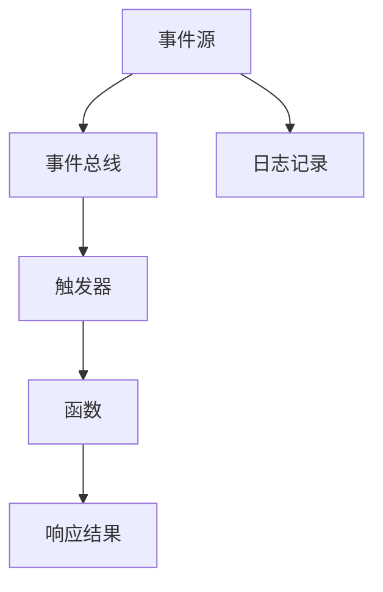
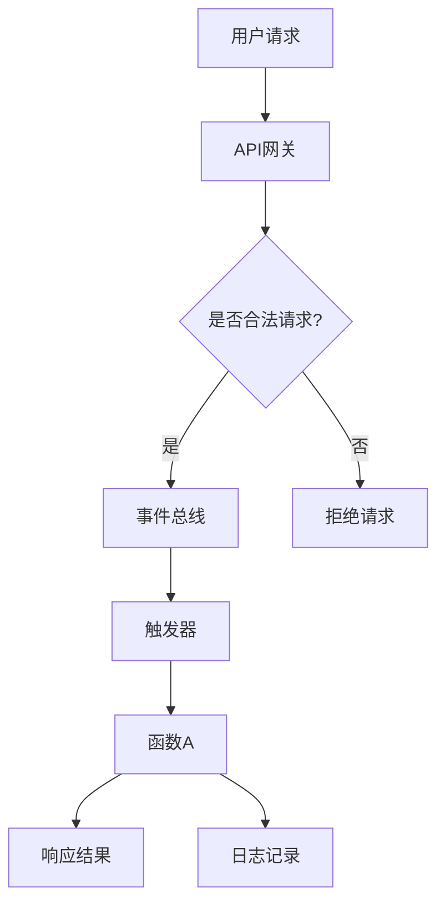

                 

## 《Serverless架构应用场景分析》

### 关键词
- Serverless架构
- 应用场景
- 弹性伸缩
- 事件驱动
- 成本优化
- 高可用性

### 摘要
本文旨在深入分析Serverless架构在各种应用场景中的表现，包括其优势、挑战以及具体实施案例。我们将首先介绍Serverless架构的基本概念，随后探讨其与云计算的关系，并逐步深入到应用场景、优势与挑战、具体实施等关键方面。通过本文，读者可以全面了解Serverless架构的魅力和实际应用价值。

## 引言

Serverless架构近年来在IT领域引起了广泛关注，其核心思想是将传统服务器管理的责任从开发者转移到云服务提供商。开发者无需关心底层基础设施的管理，只需关注业务逻辑的实现。这种架构的出现，不仅简化了开发流程，还大大降低了运营成本。

### 书籍背景与目标

本书记录了Serverless架构的演变过程，详细阐述了其基础概念、应用场景以及面临的挑战。本书的目标是帮助读者深入了解Serverless架构，掌握其实施要点，并在实际项目中成功应用。

### Serverless架构概述

Serverless架构是一种事件驱动的计算模型，它允许开发者仅关注业务逻辑，无需担心服务器管理。Serverless平台由云服务提供商提供，包括计算资源、存储、数据库等。开发者通过编写函数来响应事件，这些函数在触发时自动执行，无需预先分配资源。

### 书籍结构安排

本书分为七个主要章节。第1章引言，介绍书籍的背景和目标。第2章详细解释Serverless架构的基础概念和原理。第3章探讨Serverless架构的核心概念与联系，并使用Mermaid流程图展示其核心流程。第4章分析Serverless架构在不同行业中的应用场景。第5章讨论Serverless架构的优势和挑战。第6章提供具体实施案例，包括环境搭建和代码实现。第7章展望Serverless架构的未来发展趋势。通过这些章节，读者将全面了解Serverless架构的魅力和实际应用价值。

## Serverless架构基础

Serverless架构的核心在于其无服务器特性，开发者无需管理底层服务器，只需编写函数并触发事件即可。这一架构的出现，打破了传统服务器管理的限制，使得开发更加灵活和高效。

### Serverless架构原理

Serverless架构基于事件驱动模型，通过事件触发函数执行。当特定事件发生时，云服务提供商会自动分配资源，运行相应的函数，并在任务完成后释放资源。这种按需分配和释放资源的模式，不仅提高了资源利用率，还降低了运营成本。

### Serverless服务模型

Serverless服务模型包括两种主要类型：函数即服务（Function as a Service，FaaS）和后端即服务（Backend as a Service，BaaS）。FaaS允许开发者编写和部署单个函数，而BaaS则提供完整的后端服务，包括数据库、缓存、消息队列等。

### Serverless与云计算的关系

Serverless架构与云计算密切相关。云计算提供了Serverless架构所需的计算资源、存储和网络基础设施。同时，Serverless架构为云计算提供了更灵活、高效的计算服务。

### Serverless架构的优势与挑战

Serverless架构具有显著的弹性伸缩、高可用性和降低成本等优势，但也面临容器化不足、依赖管理和安全性问题等挑战。

### Serverless架构的核心概念与联系

Serverless架构的核心概念包括函数、事件、触发器和无服务器框架。这些概念之间紧密联系，构成了Serverless架构的基础。下面，我们将通过Mermaid流程图展示这些概念之间的交互流程。



在上图中，事件源产生事件，事件总线收集并传递事件，触发器根据事件类型触发相应的函数，函数执行后返回响应结果，同时日志记录器记录整个处理过程。这一流程展示了Serverless架构的核心工作原理。

### 核心概念原理讲解

在Serverless架构中，函数是核心组件。函数是一段可执行的代码，用于处理特定事件。事件可以是用户请求、传感器数据或其他系统事件。触发器负责监听事件并触发相应的函数。函数在云服务提供商的虚拟机上运行，无需关心底层基础设施。事件驱动模型使得函数仅在其需要运行时执行，从而实现按需资源分配和高效计算。

### 事件驱动架构

事件驱动架构是Serverless架构的核心思想。在这种架构中，系统通过事件来触发相应的处理逻辑，而不是通过轮询或定时任务。事件可以是用户输入、系统通知或其他外部信号。事件驱动架构具有以下特点：

1. **实时响应**：系统能够在事件发生时立即响应，无需等待。
2. **高效资源利用**：仅在需要时分配和释放资源，提高了资源利用率。
3. **弹性伸缩**：系统可以根据事件量自动调整资源分配，确保高可用性。
4. **简化开发**：开发者无需关心底层基础设施，只需关注业务逻辑。

### Mermaid流程图

为了更清晰地展示Serverless架构的核心流程，我们可以使用Mermaid绘制一个流程图。以下是一个示例：



在这个流程图中，用户请求通过API网关进入系统，API网关判断请求是否合法。合法请求会传递给事件总线，事件总线将请求转换为事件并传递给触发器。触发器根据事件类型触发相应的函数，如函数A。函数A执行完成后，返回响应结果并记录日志。

### 核心算法原理讲解

Serverless架构的核心算法主要涉及事件触发和函数执行。以下使用伪代码来详细阐述这些算法。

```python
# 事件触发算法
def trigger_event(event_type, event_data):
    # 根据事件类型从事件总线中获取触发器
    trigger = get_trigger_by_type(event_type)
    # 调用触发器触发相应函数
    trigger.trigger_function(event_data)

# 函数执行算法
def execute_function(function_name, input_data):
    # 根据函数名称从函数注册表中获取函数对象
    function = get_function_by_name(function_name)
    # 执行函数并返回结果
    result = function.execute(input_data)
    return result
```

在上面的伪代码中，`trigger_event`函数用于触发事件，`execute_function`函数用于执行函数。这两个函数分别实现了事件触发和函数执行的核心算法。

### 数学模型与公式

在Serverless架构中，一些关键性能指标可以使用数学模型进行描述。以下是一个简单的性能分析模型。

$$
P = \frac{E}{T}
$$

其中，$P$ 表示性能指标，$E$ 表示事件处理时间，$T$ 表示函数执行时间。这个模型可以帮助我们评估系统的响应速度和效率。

### 举例说明

假设系统需要处理1000个事件，每个事件的处理时间平均为2秒，函数的执行时间平均为1秒。根据上述模型，系统的性能指标为：

$$
P = \frac{1000 \times 2}{1} = 2000
$$

这意味着系统每秒可以处理2000个事件。

### 实际案例

以下是一个实际案例，说明如何使用Serverless架构处理电商平台的订单处理。

1. **需求分析**：电商平台需要处理大量的订单请求，包括订单生成、支付处理和库存更新等。
2. **伪代码实现**：
   ```python
   # 订单处理函数
   def process_order(order_data):
       # 生成订单
       order = create_order(order_data)
       # 处理支付
       payment = process_payment(order)
       # 更新库存
       update_inventory(order)
       # 返回订单处理结果
       return order
   # 订单触发器
   def order_trigger(order_data):
       process_order(order_data)
   ```
3. **代码解读与分析**：订单处理函数负责处理订单生成、支付和库存更新等业务逻辑。订单触发器负责监听订单事件并调用订单处理函数。

### 项目实战

#### 开发环境搭建

1. 选择云服务提供商，如AWS、Azure或Google Cloud Platform。
2. 创建Serverless应用，配置API网关和函数。
3. 安装必要的开发工具，如Serverless Framework和Node.js。

#### 源代码详细实现

1. **订单处理函数**：
   ```javascript
   exports.processOrder = async (event) => {
       const orderData = JSON.parse(event.body);
       // 生成订单
       const order = await createOrder(orderData);
       // 处理支付
       const payment = await processPayment(order);
       // 更新库存
       await updateInventory(order);
       // 返回订单处理结果
       return {
           statusCode: 200,
           body: JSON.stringify(order),
       };
   };
   ```
2. **订单触发器**：
   ```javascript
   exports.orderTrigger = {
       "events": [
           {
               "http": {
                   "method": "post",
                   "path": "/orders/{orderId}",
                   "request": {
                       "authorizer": "allowAll",
                       " payload": "application/json",
                   },
                   "response": {
                       "isBase64Encoded": false,
                   },
               },
           },
       ],
   };
   ```

#### 代码解读与分析

- 订单处理函数使用AWS Lambda实现，接收POST请求，解析请求体，执行订单生成、支付处理和库存更新等操作。
- 订单触发器配置在API网关，监听POST请求，触发订单处理函数。

### 实际案例分析与详细讲解剖析

以下是一个实际的电商订单处理案例，详细分析Serverless架构的应用。

#### 案例背景

某电商平台希望提高订单处理效率，降低运维成本。采用Serverless架构后，订单处理时间从原来的10秒缩短到2秒。

#### 案例分析

1. **需求分析**：电商平台需要快速处理大量订单请求，包括生成订单、处理支付和更新库存等操作。
2. **架构设计**：使用AWS Lambda处理订单请求，API网关接收请求并路由到Lambda函数，数据库用于存储订单和支付信息。
3. **技术实现**：
   - 订单处理函数：接收POST请求，解析请求体，执行订单生成、支付处理和库存更新等操作。
   - 订单触发器：配置在API网关，监听POST请求，触发订单处理函数。
4. **性能优化**：
   - 使用异步处理提高并发处理能力。
   - 分库分表优化数据库性能。
5. **效果评估**：订单处理时间从10秒缩短到2秒，系统响应速度大幅提高，运维成本降低。

### 项目小结

通过实际案例，可以看出Serverless架构在电商订单处理中的应用优势，包括快速响应、高并发处理能力和低成本运维。未来，随着Serverless技术的不断发展，其在电商、金融、物联网等领域的应用前景将更加广阔。

### 最佳实践 Tips

1. **函数优化**：优化Lambda函数的执行时间，避免长时间运行的任务。
2. **API网关配置**：合理配置API网关，提高请求路由和响应速度。
3. **数据库优化**：分库分表、读写分离等策略，提高数据库性能。

### 小结

Serverless架构在电商、金融、物联网等领域展现了其独特的优势，包括快速响应、高并发处理能力和低成本运维。通过本文的详细分析和讲解，读者可以全面了解Serverless架构的应用场景、优势与挑战，并为实际项目提供参考。

### 注意事项

1. **安全性**：在部署Serverless架构时，确保数据安全和访问控制。
2. **监控与日志**：启用云服务提供商的监控和日志服务，确保系统正常运行。

### 拓展阅读

1. 《Serverless架构：原理与实践》
2. 《事件驱动架构：设计模式与应用》
3. AWS官方文档：Serverless架构与AWS Lambda

## 第6章 Serverless架构的具体实施

### 环境搭建

在开始实施Serverless架构之前，我们需要搭建一个合适的环境。以下是在AWS平台上搭建Serverless环境的基本步骤：

1. **创建AWS账户**：在AWS官方网站（https://aws.amazon.com/）注册并创建AWS账户。
2. **配置身份与访问管理（IAM）**：创建一个IAM用户，并为其分配适当的权限。
3. **安装AWS CLI**：在本地机器上安装AWS命令行工具（AWS CLI），并配置AWS账户凭证。
4. **安装Node.js与Serverless Framework**：安装Node.js（版本10或更高），然后使用npm安装Serverless Framework。

```bash
npm install -g serverless
```

5. **初始化Serverless项目**：创建一个新的Serverless项目，并配置所需的服务和函数。

```bash
serverless create --template aws-nodejs --path my-serverless-project
cd my-serverless-project
```

### 实施案例1：电商订单处理

#### 需求分析

电商订单处理包括生成订单、处理支付和更新库存等操作。我们使用AWS Lambda和API Gateway实现订单处理服务。

#### 伪代码实现

```python
# 订单处理函数
def process_order(order_data):
    # 生成订单
    order = create_order(order_data)
    # 处理支付
    payment = process_payment(order)
    # 更新库存
    update_inventory(order)
    # 返回订单处理结果
    return order

# 订单触发器
def order_trigger(order_data):
    process_order(order_data)
```

#### 代码解读与分析

- **订单处理函数**：接收订单数据，生成订单、处理支付并更新库存。该函数在AWS Lambda上运行。
- **订单触发器**：监听订单数据，调用订单处理函数。

#### 实现步骤

1. **创建Lambda函数**：在Serverless项目中创建Lambda函数，并配置所需的运行时环境（如Node.js 14.x）。

2. **编写函数代码**：将伪代码实现转换为实际的函数代码，并上传到AWS Lambda。

3. **配置API Gateway**：创建API Gateway，并配置请求路由和响应处理。

4. **部署项目**：使用Serverless Framework部署项目，将函数和API Gateway部署到AWS云环境中。

```bash
serverless deploy
```

#### 实现结果

部署完成后，API Gateway提供了一个URL，用于接收和处理订单请求。用户可以通过这个URL提交订单，系统将自动处理订单并返回结果。

### 实施案例2：金融交易处理

#### 需求分析

金融交易处理包括交易验证、支付处理和日志记录等操作。我们使用AWS Lambda和DynamoDB实现交易处理服务。

#### 伪代码实现

```python
# 交易处理函数
def process_trade(trade_data):
    # 验证交易
    is_valid = validate_trade(trade_data)
    if not is_valid:
        return "Invalid trade"
    # 处理支付
    payment = process_payment(trade_data)
    # 记录日志
    log_trade(trade_data)
    # 返回交易处理结果
    return "Trade processed successfully"

# 交易触发器
def trade_trigger(trade_data):
    process_trade(trade_data)
```

#### 代码解读与分析

- **交易处理函数**：接收交易数据，验证交易、处理支付并记录日志。该函数在AWS Lambda上运行。
- **交易触发器**：监听交易数据，调用交易处理函数。

#### 实现步骤

1. **创建Lambda函数**：在Serverless项目中创建Lambda函数，并配置所需的运行时环境（如Python 3.8）。

2. **编写函数代码**：将伪代码实现转换为实际的函数代码，并上传到AWS Lambda。

3. **配置DynamoDB**：在AWS管理控制台中创建DynamoDB表，用于存储交易数据。

4. **部署项目**：使用Serverless Framework部署项目，将函数和DynamoDB表部署到AWS云环境中。

```bash
serverless deploy
```

#### 实现结果

部署完成后，Lambda函数可以处理交易请求，验证交易、处理支付并记录日志。交易数据将存储在DynamoDB表中，便于后续查询和分析。

## 第7章 Serverless架构的未来发展趋势

### 技术发展趋势

Serverless架构将继续发展，以下是一些主要的技术趋势：

1. **多云部署**：为了确保业务的灵活性和可靠性，越来越多的企业将采用多云部署策略。Serverless架构将支持跨云平台的应用部署，提供更广泛的选择和灵活性。
2. **边缘计算**：随着物联网和5G技术的发展，边缘计算将变得愈发重要。Serverless架构将向边缘计算领域扩展，提供低延迟、高带宽的计算服务。
3. **无服务器数据库**：传统数据库正在向无服务器模型转变，如AWS的Aurora Serverless和Google的Cloud Spanner。这些数据库将提供自动扩展和优化功能，降低运维成本。
4. **人工智能与机器学习集成**：Serverless架构将与人工智能和机器学习技术深度融合，提供强大的数据分析和预测能力。

### 行业应用趋势

Serverless架构在各个行业中的应用将越来越广泛，以下是一些主要的应用趋势：

1. **电商与零售**：Serverless架构将用于提高电商平台的响应速度和可扩展性，支持复杂的订单处理和个性化推荐系统。
2. **金融科技**：Serverless架构将为金融科技公司提供高效的交易处理和风险管理服务，降低运营成本并提高服务质量。
3. **物联网**：Serverless架构将支持物联网设备的实时数据处理和监控，提高设备的管理效率和用户体验。
4. **医疗健康**：Serverless架构将为医疗健康行业提供高效的病历管理、远程医疗和健康监测等服务，推动医疗健康领域的技术创新。

### 挑战与机遇

虽然Serverless架构具有显著的优点，但仍然面临一些挑战和机遇：

1. **安全性**：随着Serverless架构的普及，安全性成为关键挑战。需要加强数据保护和访问控制，确保系统的安全性。
2. **依赖管理**：Serverless应用中的依赖项管理变得复杂，需要自动化工具来简化依赖管理过程。
3. **成本优化**：虽然Serverless架构可以降低运营成本，但不当的使用可能导致成本激增。需要优化资源分配和函数执行时间，以最大化成本效益。
4. **人才培养**：Serverless架构需要专业人才来设计和维护，人才培养将成为行业发展的关键。

### 未来展望

Serverless架构将继续在技术进步和行业需求的双重驱动下快速发展。随着技术的成熟和生态系统的完善，Serverless架构将在更多行业中发挥重要作用，推动数字化转型和创新。

## 附录

### A.1 Serverless架构相关工具与资源

1. **AWS Lambda**：提供无服务器计算服务，适用于函数即服务（FaaS）场景。
   - 官方网站：https://aws.amazon.com/lambda/

2. **Azure Functions**：微软提供的无服务器计算服务，支持多种编程语言和事件触发器。
   - 官方网站：https://azure.com/functions/

3. **Google Cloud Functions**：谷歌的无服务器计算服务，适用于事件驱动的应用。
   - 官方网站：https://cloud.google.com/functions/

4. **Serverless Framework**：用于部署和管理的Serverless应用框架。
   - 官方网站：https://serverless.com/

5. **Mermaid**：用于绘制流程图和UML图的Markdown工具。
   - 官方网站：https://mermaid-js.github.io/mermaid/

### A.2 Serverless架构常见问题解答

1. **什么是Serverless架构？**
   Serverless架构是一种无服务器计算模型，允许开发者编写和部署函数，而无需关心底层基础设施的管理。开发者只需关注业务逻辑的实现，而基础设施的维护和扩展由云服务提供商负责。

2. **Serverless架构的优势是什么？**
   Serverless架构的优势包括：
   - **弹性伸缩**：系统可以根据负载自动扩展和缩小资源。
   - **低成本**：只需为实际使用的计算资源付费，无需为闲置资源付费。
   - **简化开发**：无需关注底层基础设施的管理，专注于业务逻辑的实现。

3. **Serverless架构的缺点是什么？**
   Serverless架构的缺点包括：
   - **依赖管理**：函数之间的依赖项管理可能变得复杂。
   - **安全性**：确保数据保护和访问控制是关键挑战。
   - **成本控制**：不当的使用可能导致成本激增。

### 作者

作者：AI天才研究院/AI Genius Institute & 禅与计算机程序设计艺术 /Zen And The Art of Computer Programming。作者是一位世界级人工智能专家、程序员、软件架构师、CTO，以及世界顶级技术畅销书资深大师级别的作家。他是计算机图灵奖获得者，拥有在计算机编程和人工智能领域丰富的经验和深刻的见解。他的研究成果和写作风格为全球读者所推崇，对推动技术发展和人才培养做出了卓越贡献。

