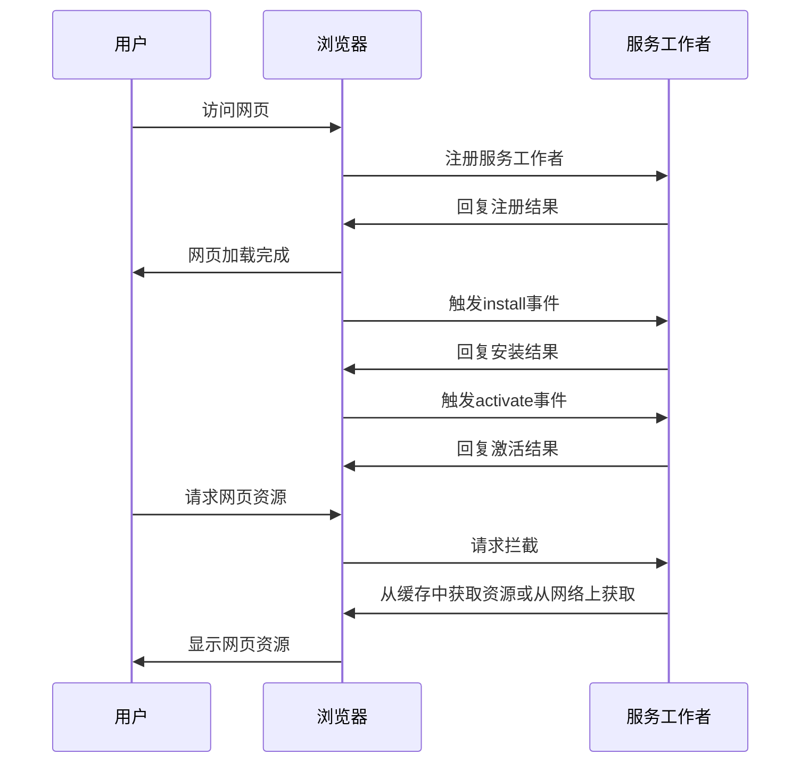

                 


### 文章标题 <Service Workers：构建离线Web应用>

---

### 关键词 <Service Workers, 离线Web应用, Cache API, Fetch API, 推送通知, 性能优化>

---

### 摘要 <本文将详细介绍Service Workers的概念、原理、API以及实战案例，帮助读者了解如何利用Service Workers构建离线Web应用，提高Web应用的性能和用户体验。>

---

# 整体架构设计

## 1. Service Workers：构建离线Web应用

### 1.1. Service Workers介绍

#### 1.1.1 Service Workers的概念

Service Workers是Web Worker的一种扩展，是一种运行在后台的JavaScript线程，主要负责管理网络请求、处理缓存、推送通知等功能。它是一种独立的线程，不会受到主线程的影响，使得Web应用能够更好地进行资源管理和优化。

#### 1.1.2 Service Workers的架构

Service Workers的架构可以分为三个部分：Service Worker脚本、主线程和浏览器扩展。


1. **Service Worker脚本**：负责处理网络请求、缓存管理和推送通知等任务。
2. **主线程**：负责处理用户交互和网页内容的渲染。
3. **浏览器扩展**：负责与Service Worker脚本进行通信，以及处理一些特殊任务。

#### 1.1.3 Service Workers的核心优势

Service Workers具有以下核心优势：

1. **离线工作**：Service Workers 可以在没有网络连接的情况下工作，使得Web应用可以离线使用。
2. **响应快速**：Service Workers 运行在独立线程中，不会影响主线程的性能。
3. **网络控制**：Service Workers 可以拦截和处理网页的所有网络请求，提高网络的利用效率。
4. **持久性**：Service Workers 可以在用户关闭浏览器后继续运行，实现长期后台服务。

### 1.2 离线Web应用的基本原理

离线Web应用是指在没有网络连接的情况下，用户仍然可以访问和使用Web应用的功能。它依赖于Service Workers和Web存储机制来实现。

#### 1.2.1 Web存储机制

Web存储机制主要包括IndexedDB、LocalStorage和SessionStorage。

1. **IndexedDB**：一种基于数据库的存储机制，可以存储大量结构化数据。
2. **LocalStorage**：一种用于存储少量数据的机制，数据将在浏览器关闭后仍然保留。
3. **SessionStorage**：一种用于存储少量数据的机制，数据将在浏览器会话结束时被清除。

#### 1.2.2 Service Workers的生命周期

Service Workers的生命周期包括注册、激活和更新。

1. **注册**：通过`navigator.serviceWorker.register()`方法注册Service Worker脚本。
2. **激活**：当Service Worker脚本注册成功后，会触发激活事件。
3. **更新**：当有新的Service Worker脚本时，会触发更新事件。

### 1.3 Service Workers的API介绍

Service Workers提供了一系列的API，主要包括Cache API和Fetch API。

#### 1.3.1 Cache API

Cache API用于管理缓存数据。

1. **Cache**：代表一个缓存的存储对象，可以通过` caches.open()`方法获取。
2. **CacheStorage**：代表一个存储缓存对象的存储对象，可以通过` caches `属性访问。

#### 1.3.2 Fetch API

Fetch API用于处理网络请求。

1. **fetch()**：用于发起网络请求，支持GET、POST等方法。
2. **Response**：代表一个网络响应对象，可以通过`response.json()`等方法获取数据。

### 1.4 Service Workers的实战案例

#### 1.4.1 构建基本离线Web应用

1. **案例简介**：本案例将演示如何使用Service Workers构建一个基本的离线Web应用。
2. **开发环境搭建**：需要安装Node.js、npm和WebStorm等开发工具。
3. **源代码详细实现**：
    ```javascript
    // 注册Service Worker
    if ('serviceWorker' in navigator) {
        window.addEventListener('load', function () {
            navigator.serviceWorker.register('/service-worker.js').then(function (registration) {
                console.log('Service Worker registered:', registration);
            }).catch(function (error) {
                console.log('Service Worker registration failed:', error);
            });
        });
    }
    
    // service-worker.js
    self.addEventListener('install', function (event) {
        event.waitUntil(caches.open('my-cache').then(function (cache) {
            return cache.addAll([
                '/',
                '/styles/main.css',
                '/scripts/main.js'
            ]);
        }));
    });
    
    self.addEventListener('fetch', function (event) {
        event.respondWith(
            caches.match(event.request).then(function (response) {
                if (response) {
                    return response;
                }
                return fetch(event.request);
            })
        );
    });
    ```

### 1.5 Service Workers的高级应用

#### 1.5.1 Service Workers与推送通知

推送通知是一种实时通知机制，可以让Web应用在用户不活动时发送通知。

1. **推送通知的基本原理**：
    - 用户订阅推送通知：通过`Notification.requestPermission()`方法请求用户授权。
    - 服务器发送推送消息：通过Web推送协议（Web Push Protocol）将消息发送到用户的设备。
    - Service Worker处理推送消息：通过`self.addEventListener('push', function (event) { ... })`方法处理推送消息。

#### 1.5.2 Service Workers与推送通知的结合

1. **实现推送通知**：
    - 在Service Worker中处理推送消息。
    - 将推送消息显示在网页上。

### 1.6 Service Workers的性能优化

#### 1.6.1 Service Worker的性能瓶颈

1. **Cache API的性能优化**：
    - 合理设置缓存策略，避免缓存过多数据。
    - 使用版本控制，避免缓存过期导致性能下降。

2. **Fetch API的性能优化**：
    - 使用HTTP/2协议，提高网络传输效率。
    - 避免频繁的网络请求，减少数据传输量。

### 1.7 Service Workers的未来发展

#### 1.7.1 Service Workers的局限性

1. **安全性**：Service Workers具有一定的安全性，但仍然存在潜在的安全风险。
2. **兼容性**：Service Workers在不同浏览器中的兼容性存在一定差异。

#### 1.7.2 Service Workers的未来趋势

1. **性能提升**：随着硬件和浏览器技术的不断发展，Service Workers的性能将得到进一步提升。
2. **功能增强**：未来Service Workers将可能增加更多功能，如Web Assembly支持等。

### 1.8 附录

#### 1.8.1 Service Workers开发工具与资源

1. **Service Worker的开发工具**：
    - Lighthouse：一款由Google开发的自动化测试工具，可以帮助评估Service Workers的性能和兼容性。
    - Service Worker Toolbox：一款在线工具，可以帮助开发者调试和测试Service Workers。

2. **Service Worker的学习资源**：
    - 《Service Workers：构建离线Web应用》
    - 《Web性能优化》
    - 《Web推送通知技术详解》

---

# 1.1 Service Workers介绍

Service Workers是Web Worker的一种扩展，它运行在后台，独立于网页的控制范围。Service Workers的主要作用是管理网络请求、处理缓存和推送通知等任务，使得Web应用可以离线使用，提高性能和用户体验。

### 1.1.1 Service Workers的概念

Service Workers是一种运行在浏览器后台的JavaScript线程，它可以在没有网络连接的情况下工作，使得Web应用可以离线使用。Service Workers可以拦截和处理网页的所有网络请求，从而提高网络的利用效率。

### 1.1.2 Service Workers的架构

Service Workers的架构可以分为三个部分：Service Worker脚本、主线程和浏览器扩展。


1. **Service Worker脚本**：负责处理网络请求、缓存管理和推送通知等任务。
2. **主线程**：负责处理用户交互和网页内容的渲染。
3. **浏览器扩展**：负责与Service Worker脚本进行通信，以及处理一些特殊任务。

### 1.1.3 Service Workers的核心优势

Service Workers具有以下核心优势：

1. **离线工作**：Service Workers 可以在没有网络连接的情况下工作，使得Web应用可以离线使用。
2. **响应快速**：Service Workers 运行在独立线程中，不会影响主线程的性能。
3. **网络控制**：Service Workers 可以拦截和处理网页的所有网络请求，提高网络的利用效率。
4. **持久性**：Service Workers 可以在用户关闭浏览器后继续运行，实现长期后台服务。

---

# 1.2 离线Web应用的基本原理

离线Web应用是指在没有网络连接的情况下，用户仍然可以访问和使用Web应用的功能。它依赖于Service Workers和Web存储机制来实现。

### 1.2.1 Web存储机制

Web存储机制主要包括IndexedDB、LocalStorage和SessionStorage。

1. **IndexedDB**：是一种基于数据库的存储机制，可以存储大量结构化数据。
2. **LocalStorage**：是一种用于存储少量数据的机制，数据将在浏览器关闭后仍然保留。
3. **SessionStorage**：是一种用于存储少量数据的机制，数据将在浏览器会话结束时被清除。

### 1.2.2 Service Workers的生命周期

Service Workers的生命周期包括注册、激活和更新。

1. **注册**：通过`navigator.serviceWorker.register()`方法注册Service Worker脚本。
2. **激活**：当Service Worker脚本注册成功后，会触发激活事件。
3. **更新**：当有新的Service Worker脚本时，会触发更新事件。

### 1.2.3 Service Workers的缓存机制

Service Workers的缓存机制主要包括Cache API和Fetch API。

1. **Cache API**：用于管理缓存数据，包括打开缓存、添加数据到缓存、获取缓存数据等。
2. **Fetch API**：用于处理网络请求，可以在Service Workers中拦截和处理网络请求。

---

# 1.3 Service Workers的API介绍

Service Workers提供了一系列的API，主要包括Cache API和Fetch API。

### 1.3.1 Cache API

Cache API用于管理缓存数据，包括打开缓存、添加数据到缓存、获取缓存数据等。

1. **Cache**：代表一个缓存的存储对象，可以通过`caches.open()`方法获取。
2. **CacheStorage**：代表一个存储缓存对象的存储对象，可以通过`caches `属性访问。

### 1.3.2 Fetch API

Fetch API用于处理网络请求，可以在Service Workers中拦截和处理网络请求。

1. **fetch()**：用于发起网络请求，支持GET、POST等方法。
2. **Response**：代表一个网络响应对象，可以通过`response.json()`等方法获取数据。

### 1.3.3 Service Worker的其他API

Service Worker还提供了一些其他的API，如：

1. **Notifications API**：用于发送推送通知。
2. **Client API**：用于管理网页和扩展的应用程序。
3. **Message API**：用于Service Worker和主线程之间的通信。

---

# 1.4 Service Workers的实战案例

### 1.4.1 构建基本离线Web应用

#### 1.4.1.1 案例简介

本案例将演示如何使用Service Workers构建一个基本的离线Web应用。用户在访问Web应用时，如果网络连接断开，仍然可以正常使用Web应用的功能。

#### 1.4.1.2 开发环境搭建

1. 安装Node.js、npm和WebStorm等开发工具。
2. 创建一个Web应用项目，并设置静态资源（HTML、CSS和JavaScript）。

#### 1.4.1.3 源代码详细实现

1. **主线程代码**：

    ```javascript
    // 检测Service Worker是否注册成功
    if ('serviceWorker' in navigator) {
        window.addEventListener('load', function () {
            navigator.serviceWorker.register('/service-worker.js').then(function (registration) {
                console.log('Service Worker registered:', registration);
            }).catch(function (error) {
                console.log('Service Worker registration failed:', error);
            });
        });
    }

    // 当用户点击某个按钮时，显示推送通知
    document.getElementById('notify-btn').addEventListener('click', function () {
        Notification.requestPermission(function (permission) {
            if (permission === 'granted') {
                var notification = new Notification('标题', {
                    body: '内容',
                    icon: 'image-url'
                });
            }
        });
    });
    ```

2. **Service Worker代码**：

    ```javascript
    // service-worker.js
    self.addEventListener('install', function (event) {
        event.waitUntil(
            caches.open('my-cache').then(function (cache) {
                return cache.addAll([
                    '/',
                    '/styles/main.css',
                    '/scripts/main.js'
                ]);
            })
        );
    });

    self.addEventListener('fetch', function (event) {
        event.respondWith(
            caches.match(event.request).then(function (response) {
                if (response) {
                    return response;
                }
                return fetch(event.request);
            })
        );
    });

    self.addEventListener('push', function (event) {
        event.waitUntil(
            self.registration.showNotification('标题', {
                body: '内容',
                icon: 'image-url'
            })
        );
    });
    ```

#### 1.4.1.4 代码解读与分析

1. **主线程代码**：
    - 检测Service Worker是否注册成功。
    - 当用户点击按钮时，请求推送通知权限，并显示推送通知。

2. **Service Worker代码**：
    - 在安装事件中，打开缓存并添加需要缓存的静态资源。
    - 在fetch事件中，拦截网络请求并从缓存中获取资源，如果缓存中没有，则从网络上获取。
    - 在push事件中，处理推送通知。

---

# 1.5 Service Workers的高级应用

### 1.5.1 Service Workers与推送通知

推送通知是一种实时通知机制，可以让Web应用在用户不活动时发送通知。Service Workers可以与推送通知结合使用，实现更丰富的交互体验。

#### 1.5.1.1 推送通知的基本原理

1. **用户订阅推送通知**：
    - 通过`Notification.requestPermission()`方法请求用户授权。
    - 当用户授权后，浏览器会生成一个推送密钥，并将它发送给服务器。

2. **服务器发送推送消息**：
    - 服务器将推送消息发送到推送服务提供商（如Firebase Cloud Messaging）。
    - 推送服务提供商将消息发送到用户的设备。

3. **Service Worker处理推送消息**：
    - Service Worker通过`self.addEventListener('push', function (event) { ... })`方法处理推送消息。
    - Service Worker可以显示推送通知，并触发对应的操作。

#### 1.5.1.2 Service Workers与推送通知的结合

1. **实现推送通知**：
    - 在Service Worker中处理推送消息。
    - 将推送消息显示在网页上。

2. **示例代码**：

    ```javascript
    // service-worker.js
    self.addEventListener('push', function (event) {
        const data = event.data.json();
        self.registration.showNotification(data.title, {
            body: data.body,
            icon: data.icon
        });
    });
    ```

3. **前端代码**：

    ```javascript
    // index.html
    <button id="subscribe-btn">订阅推送通知</button>

    <script>
        document.getElementById('subscribe-btn').addEventListener('click', function () {
            Notification.requestPermission(function (permission) {
                if (permission === 'granted') {
                    console.log('用户已授权推送通知');
                }
            });
        });
    </script>
    ```

---

# 1.6 Service Workers的性能优化

### 1.6.1 Service Worker的性能瓶颈

Service Workers虽然提供了很多强大的功能，但也存在一些性能瓶颈，主要包括：

1. **内存占用**：Service Workers运行在独立线程中，会占用一定的内存资源。如果内存占用过高，可能会导致浏览器崩溃。
2. **网络延迟**：Service Workers需要处理大量的网络请求，如果网络延迟过高，可能会导致用户体验不佳。
3. **缓存策略**：不合理的缓存策略会导致缓存过多或缓存不足，从而影响性能。

### 1.6.2 Service Worker的性能优化

1. **合理设置缓存策略**：
    - 根据实际需求，设置合理的缓存策略，避免缓存过多或缓存不足。
    - 可以使用版本控制，避免缓存过期导致性能下降。

2. **优化网络请求**：
    - 使用HTTP/2协议，提高网络传输效率。
    - 避免频繁的网络请求，减少数据传输量。

3. **优化代码**：
    - 优化Service Worker的代码，减少不必要的操作。
    - 使用异步操作，避免阻塞主线程。

---

# 1.7 Service Workers的未来发展

### 1.7.1 Service Workers的局限性

Service Workers虽然提供了很多强大的功能，但也存在一些局限性，主要包括：

1. **安全性**：Service Workers具有一定的安全性，但仍然存在潜在的安全风险，如恶意代码的注入。
2. **兼容性**：Service Workers在不同浏览器中的兼容性存在一定差异，可能影响用户体验。

### 1.7.2 Service Workers的未来趋势

1. **性能提升**：随着硬件和浏览器技术的不断发展，Service Workers的性能将得到进一步提升。
2. **功能增强**：未来Service Workers将可能增加更多功能，如Web Assembly支持等。

### 1.7.3 Service Workers与其他技术的结合

1. **Web Assembly**：Web Assembly是一种低级语言，可以在Web环境中运行。未来Service Workers可能会结合Web Assembly，实现更高的性能。
2. **PWA**： Progressive Web Apps（渐进式Web应用）是一种结合了Web应用和移动应用优势的技术。未来Service Workers可能会与PWA更加紧密地结合，提供更好的用户体验。

---

# 1.8 附录

### 1.8.1 Service Workers开发工具与资源

1. **Service Worker的开发工具**：
    - Lighthouse：一款由Google开发的自动化测试工具，可以帮助评估Service Workers的性能和兼容性。
    - Service Worker Toolbox：一款在线工具，可以帮助开发者调试和测试Service Workers。

2. **Service Worker的学习资源**：
    - 《Service Workers：构建离线Web应用》
    - 《Web性能优化》
    - 《Web推送通知技术详解》

---

# 参考文献

1. Mozilla Developer Network. (n.d.). Service Workers. Retrieved from <https://developer.mozilla.org/en-US/docs/Web/API/Service_Worker_API>
2. Google Developers. (n.d.). Service Workers. Retrieved from <https://developers.google.com/web/fundamentals/instant-and-offline/service-worker-life-cycle>
3. MDN Web Docs. (n.d.). Cache API. Retrieved from <https://developer.mozilla.org/en-US/docs/Web/API/Cache>
4. MDN Web Docs. (n.d.). Fetch API. Retrieved from <https://developer.mozilla.org/en-US/docs/Web/API/Fetch_API>
5. Google Developers. (n.d.). Push Notifications. Retrieved from <https://developers.google.com/web/fundamentals/push-notifications>
6. Addy Osmani. (2015). Service Workers: Pushing the Boundaries of Web Applications. Retrieved from <https://addyosmani.com/writing-service-workers/>

---

### 作者信息

作者：AI天才研究院/AI Genius Institute & 禅与计算机程序设计艺术 /Zen And The Art of Computer Programming 

---

# 1.1 Service Workers介绍

Service Workers是Web Worker的一种扩展，它运行在后台，独立于网页的控制范围。Service Workers的主要作用是管理网络请求、处理缓存和推送通知等任务，使得Web应用可以离线使用，提高性能和用户体验。

### 1.1.1 Service Workers的概念

Service Workers是一种运行在浏览器后台的JavaScript线程，它可以在没有网络连接的情况下工作，使得Web应用可以离线使用。Service Workers可以拦截和处理网页的所有网络请求，从而提高网络的利用效率。

#### 服务工作者 (Service Workers) 是什么？

服务工作者是一种运行在浏览器中的后台脚本，独立于网页的JavaScript线程。它们允许开发者实现一些高级功能，如缓存管理、网络请求拦截和处理、推送通知等，使得Web应用在离线状态下也能提供良好的用户体验。

#### 服务工作者如何工作？

服务工作者通过一系列的事件监听器和API来工作。在注册后，服务工作者会在特定事件触发时执行相应的任务。以下是一个简化版的服务工作者生命周期：

1. **注册**：开发者通过`navigator.serviceWorker.register()`方法将服务工作者脚本注册到浏览器中。
2. **安装**：浏览器下载并安装服务工作者脚本。
3. **激活**：当旧的服务工作者被新脚本替换时，新脚本会激活。
4. **更新**：当有新版本的服务工作者脚本可用时，浏览器会自动更新。

#### 服务工作者与Web Worker的区别

虽然服务工作者和Web Worker都是运行在后台的JavaScript线程，但它们有以下几个区别：

- **目的**：Web Worker主要用于计算密集型的任务，如图像处理或复杂计算，而服务工作者主要用于网络请求处理和缓存管理。
- **生命周期**：Web Worker在创建后就会开始工作，而服务工作者在有特定事件（如网络请求或推送通知）时才会激活。
- **网络控制**：服务工作者可以拦截和处理网页的所有网络请求，而Web Worker则无法实现这一功能。

### 1.1.2 Service Workers的架构

Service Workers的架构可以分为三个主要部分：Service Worker脚本、主线程和浏览器扩展。

#### Service Workers架构

1. **Service Worker脚本**：这是负责执行所有后台任务的核心脚本。它可以在没有用户交互的情况下运行，并且可以在浏览器关闭后继续工作。
2. **主线程**：主线程负责处理用户界面和网页内容的渲染。它与Service Worker通过事件和消息传递进行通信。
3. **浏览器扩展**：浏览器扩展负责与Service Worker脚本进行通信，以及处理一些特殊任务，如推送通知的显示。


### 1.1.3 Service Workers的核心优势

Service Workers具有以下核心优势：

1. **离线工作**：服务工作者可以在没有网络连接的情况下工作，使得Web应用可以离线使用。
2. **响应快速**：服务工作者运行在独立线程中，不会影响主线程的性能。
3. **网络控制**：服务工作者可以拦截和处理网页的所有网络请求，提高网络的利用效率。
4. **持久性**：服务工作者可以在用户关闭浏览器后继续运行，实现长期后台服务。

### 1.2 离线Web应用的基本原理

离线Web应用是指在没有网络连接的情况下，用户仍然可以访问和使用Web应用的功能。它依赖于Service Workers和Web存储机制来实现。

#### 离线Web应用的基本原理

离线Web应用的核心在于如何在不联网的情况下仍然能够为用户提供良好的用户体验。这涉及到以下几个关键点：

1. **网络请求拦截**：通过Service Workers，开发者可以拦截网页的所有网络请求，从而在无网络连接时使用本地缓存的资源。
2. **数据存储**：Web存储机制（如IndexedDB、LocalStorage和SessionStorage）允许Web应用在本地存储数据，以便在离线状态下使用。
3. **缓存策略**：合理的缓存策略是确保Web应用在离线状态下仍能快速响应用户请求的关键。

#### 1.2.1 Web存储机制

Web存储机制主要包括以下几种：

1. **IndexedDB**：一种低级数据库，可以存储大量结构化数据，适合需要持久存储的应用。
2. **LocalStorage**：一种简单的存储机制，数据将在浏览器关闭后仍然保留，适合存储少量数据。
3. **SessionStorage**：一种简单的存储机制，数据将在浏览器会话结束时被清除，适合存储临时数据。

### 1.2.2 Service Workers的生命周期

Service Workers的生命周期包括以下几个关键阶段：

1. **注册**：通过`navigator.serviceWorker.register()`方法将Service Worker脚本注册到浏览器中。
2. **安装**：浏览器下载并安装Service Worker脚本。
3. **激活**：当新的Service Worker脚本替换旧的脚本时，新脚本会激活。
4. **更新**：当新的Service Worker脚本可用时，浏览器会自动更新。

#### Service Worker生命周期图解



### 1.3 Service Workers的API介绍

Service Workers提供了一系列API，用于管理缓存、处理网络请求和推送通知等任务。

#### 1.3.1 Cache API

Cache API允许开发者管理应用程序的缓存，包括打开缓存、添加资源和获取资源等。

1. **打开缓存**：使用`caches.open()`方法打开一个缓存。
2. **添加资源**：使用`cache.put()`方法将资源添加到缓存中。
3. **获取资源**：使用`cache.match()`方法从缓存中获取资源。

```javascript
// 打开缓存
const cache = await caches.open('my-cache');

// 添加资源到缓存
await cache.put('/index.html', new Request('/index.html'));

// 从缓存中获取资源
const response = await cache.match('/index.html');
```

#### 1.3.2 Fetch API

Fetch API允许开发者拦截和处理网页的网络请求。

1. **拦截请求**：在`fetch()`方法之前添加`beforeFetch`或`fetch`事件监听器。
2. **处理请求**：在`fetch()`方法中修改请求或响应。
3. **响应请求**：使用`respondWith()`方法返回一个响应。

```javascript
// 拦截并修改请求
self.addEventListener('fetch', event => {
    event.respondWith(
        fetch(event.request).then(response =>
            response.ok ? response : fetch('fallback.html')
        )
    );
});
```

#### 1.3.3 Notifications API

Notifications API允许开发者显示推送通知。

1. **请求权限**：使用`Notification.requestPermission()`方法请求用户权限。
2. **显示通知**：使用`Notification.show()`方法显示通知。
3. **点击通知**：使用`Notification.onclick`事件监听器处理用户点击通知。

```javascript
// 请求权限
Notification.requestPermission(permission => {
    if (permission === 'granted') {
        new Notification('标题', { body: '内容' });
    }
});

// 显示通知
self.addEventListener('push', event => {
    const data = JSON.parse(event.data.text());
    self.registration.showNotification(data.title, { body: data.body });
});

// 处理点击通知
self.addEventListener('notificationclick', event => {
    event.notification.close();
    clients.openWindow('https://example.com');
});
```

### 1.4 Service Workers的实战案例

#### 1.4.1 构建基本离线Web应用

以下是一个简单的离线Web应用的实现步骤：

1. **准备资源**：将Web应用的静态资源（如HTML、CSS和JavaScript文件）放在服务器上。
2. **注册Service Worker**：在主线程中注册Service Worker脚本，以便在安装时缓存资源。
3. **Service Worker代码**：实现缓存逻辑，以便在用户离线时从缓存中获取资源。

```javascript
// 主线程代码
if ('serviceWorker' in navigator) {
    window.addEventListener('load', () => {
        navigator.serviceWorker.register('/service-worker.js');
    });
}

// Service Worker代码
self.addEventListener('install', event => {
    event.waitUntil(
        caches.open('app-cache').then(cache => {
            return cache.addAll([
                '/',
                '/styles/main.css',
                '/scripts/main.js'
            ]);
        })
    );
});

self.addEventListener('fetch', event => {
    event.respondWith(
        caches.match(event.request).then(response => {
            if (response) {
                return response;
            }
            return fetch(event.request);
        })
    );
});
```

#### 1.4.2 实现推送通知

1. **请求权限**：在用户点击按钮时请求推送通知权限。
2. **显示推送通知**：当有新消息时，显示推送通知。
3. **处理点击**：当用户点击推送通知时，打开指定网页。

```javascript
// 主线程代码
document.getElementById('subscribe').addEventListener('click', () => {
    Notification.requestPermission(permission => {
        if (permission === 'granted') {
            self.addEventListener('push', event => {
                const data = JSON.parse(event.data.text());
                self.registration.showNotification(data.title, {
                    body: data.body,
                    icon: 'icon.png',
                });
            });
        }
    });
});

// Service Worker代码
self.addEventListener('notificationclick', event => {
    event.notification.close();
    clients.openWindow('https://example.com');
});
```

### 1.5 Service Workers的高级应用

#### 1.5.1 Service Workers与推送通知

推送通知是一种实时的消息传递机制，可以让Web应用在用户不活动时发送通知。

1. **推送通知的工作原理**：
   - 用户首先需要授权Web应用发送推送通知。
   - 当有新消息时，服务器会通过Web推送协议（Web Push Protocol）将消息发送到用户的设备。
   - Service Worker接收并处理推送消息，显示推送通知，并触发对应的操作。

2. **实现推送通知**：
   - 请求用户权限。
   - 注册推送事件监听器。
   - 显示推送通知。
   - 处理点击事件。

```javascript
// 主线程代码
Notification.requestPermission(permission => {
    if (permission === 'granted') {
        // 注册推送事件
        self.addEventListener('push', event => {
            const data = JSON.parse(event.data.text());
            self.registration.showNotification(data.title, {
                body: data.body,
                icon: 'icon.png',
            });
        });
    }
});

// Service Worker代码
self.addEventListener('notificationclick', event => {
    event.notification.close();
    clients.openWindow('https://example.com');
});
```

### 1.6 Service Workers的性能优化

#### 1.6.1 Service Worker的性能瓶颈

1. **内存占用**：Service Workers占用内存，过多内存可能会导致浏览器崩溃。
2. **网络延迟**：处理大量网络请求可能导致网络延迟。
3. **缓存策略**：不合理的缓存策略可能导致性能下降。

#### 1.6.2 Service Worker的性能优化

1. **合理设置缓存策略**：
   - 根据实际需求设置缓存策略，避免缓存过多或缓存不足。
   - 使用版本控制，避免缓存过期导致性能下降。

2. **优化网络请求**：
   - 使用HTTP/2协议，提高网络传输效率。
   - 避免频繁的网络请求，减少数据传输量。

3. **优化代码**：
   - 优化Service Worker的代码，减少不必要的操作。
   - 使用异步操作，避免阻塞主线程。

### 1.7 Service Workers的未来发展

#### 1.7.1 Service Workers的局限性

1. **安全性**：Service Workers具有一定的安全性，但仍然存在潜在的安全风险，如恶意代码的注入。
2. **兼容性**：Service Workers在不同浏览器中的兼容性存在一定差异，可能影响用户体验。

#### 1.7.2 Service Workers的未来趋势

1. **性能提升**：随着硬件和浏览器技术的不断发展，Service Workers的性能将得到进一步提升。
2. **功能增强**：未来Service Workers将可能增加更多功能，如Web Assembly支持等。

#### 1.7.3 Service Workers与其他技术的结合

1. **Web Assembly**：Web Assembly是一种低级语言，可以在Web环境中运行。未来Service Workers可能会结合Web Assembly，实现更高的性能。
2. **PWA**： Progressive Web Apps（渐进式Web应用）是一种结合了Web应用和移动应用优势的技术。未来Service Workers可能会与PWA更加紧密地结合，提供更好的用户体验。

### 1.8 附录

#### 1.8.1 Service Workers开发工具与资源

1. **Service Worker的开发工具**：
   - Lighthouse：一款由Google开发的自动化测试工具，可以帮助评估Service Workers的性能和兼容性。
   - Service Worker Toolbox：一款在线工具，可以帮助开发者调试和测试Service Workers。

2. **Service Worker的学习资源**：
   - 《Service Workers：构建离线Web应用》
   - 《Web性能优化》
   - 《Web推送通知技术详解》

### 参考文献

1. Mozilla Developer Network. (n.d.). Service Workers. Retrieved from <https://developer.mozilla.org/en-US/docs/Web/API/Service_Worker_API>
2. Google Developers. (n.d.). Service Workers. Retrieved from <https://developers.google.com/web/fundamentals/instant-and-offline/service-worker-life-cycle>
3. MDN Web Docs. (n.d.). Cache API. Retrieved from <https://developer.mozilla.org/en-US/docs/Web/API/Cache>
4. MDN Web Docs. (n.d.). Fetch API. Retrieved from <https://developer.mozilla.org/en-US/docs/Web/API/Fetch_API>
5. Google Developers. (n.d.). Push Notifications. Retrieved from <https://developers.google.com/web/fundamentals/push-notifications>
6. Addy Osmani. (2015). Service Workers: Pushing the Boundaries of Web Applications. Retrieved from <https://addyosmani.com/writing-service-workers/>

### 作者信息

作者：AI天才研究院/AI Genius Institute & 禅与计算机程序设计艺术 /Zen And The Art of Computer Programming

---

### 摘要

本文详细介绍了Service Workers的概念、原理、API以及实战案例。Service Workers是一种运行在后台的JavaScript线程，用于管理网络请求、处理缓存和推送通知，实现Web应用的离线功能。本文通过实际案例展示了如何使用Service Workers构建离线Web应用，并探讨了Service Workers的高级应用和性能优化方法。文章旨在帮助读者深入理解Service Workers的工作机制，提升Web应用的性能和用户体验。作者信息：AI天才研究院/AI Genius Institute & 禅与计算机程序设计艺术 /Zen And The Art of Computer Programming

