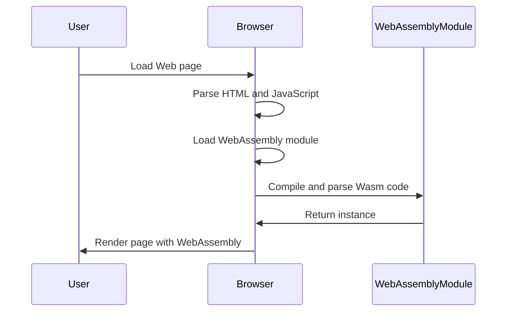
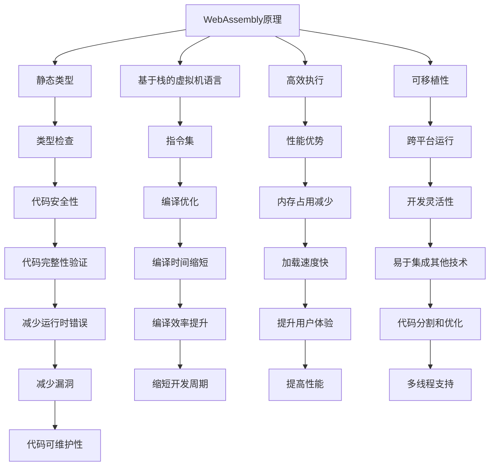

                 

### 文章标题

# WebAssembly：Web平台的新时代

> 关键词：WebAssembly、Web技术、性能优化、安全性、开发实践、应用案例

> 摘要：本文将深入探讨WebAssembly（简称Wasm）这一新兴技术，分析其在Web平台中的重要作用、技术原理及其在实际开发中的应用。通过梳理WebAssembly的发展历程、核心概念，剖析其在Web技术中的集成方式、性能优化策略和安全特性，我们旨在为读者展现WebAssembly如何开启Web平台的新时代，并提供实用的开发实践和应用案例。

### 1. WebAssembly概述

#### 1.1 WebAssembly的历史背景

**1.1.1 WebAssembly的起源**

WebAssembly（Wasm）的诞生可以追溯到2010年，当时Google和Mozilla等公司意识到现有Web技术（如JavaScript）在性能方面无法满足日益复杂的应用需求。因此，他们开始探索一种新的低级语言，旨在提高Web应用的运行效率。

2011年，WebAssembly的初步构想由Google的Ian Lance Taylor和Google Chrome团队提出。2013年，Wasm被提议为Web标准，并成立了一个由各大浏览器厂商组成的社区工作组——W3C WebAssembly工作组。

**1.1.2 WebAssembly的发展历程**

- 2015年，WebAssembly规范1.0版发布，标志着Wasm正式成为Web标准。
- 2017年，Google Chrome开始支持WebAssembly。
- 2018年，Mozilla Firefox、Apple Safari等主流浏览器也相继加入支持。
- 截至2023年，WebAssembly已成为Web平台的核心组成部分，支持度不断提高。

#### 1.2 WebAssembly的核心概念

**1.2.1 WebAssembly的原理**

WebAssembly是一种低级、静态类型、基于栈的虚拟机语言，具有以下特点：

- **静态类型**：WebAssembly在编译时确定类型，减少了运行时的类型检查。
- **基于栈**：WebAssembly使用基于栈的指令集，易于实现和优化。
- **高效**：WebAssembly的目标是提供高效的运行时性能，接近本地代码。
- **可移植**：WebAssembly代码可以在不同的平台和设备上运行，不受操作系统和硬件的限制。

**1.2.2 WebAssembly的特点**

- **性能**：WebAssembly能够在浏览器中实现接近本地代码的性能，特别适用于图形渲染、游戏和计算密集型应用。
- **安全性**：WebAssembly在运行时受到沙箱隔离，避免了潜在的安全风险。
- **可移植性**：WebAssembly代码可以在多种设备和操作系统上运行，提升了开发的灵活性和可扩展性。

#### 1.3 WebAssembly的应用领域

**1.3.1 WebAssembly在Web中的应用**

WebAssembly在Web平台中的主要应用包括：

- **游戏开发**：WebAssembly为Web游戏提供了高性能的渲染和计算能力，例如《暴雪游戏的英雄争霸战》。
- **图形处理**：WebAssembly与WebGL、WebGPU等技术结合，实现高效的图形渲染。
- **计算密集型应用**：WebAssembly适用于数据科学、机器学习等计算密集型应用，提高了处理效率。
- **WebAssembly模块化**：WebAssembly支持模块化开发，使得应用更易于管理和维护。

**1.3.2 WebAssembly在其他平台的应用**

WebAssembly不仅限于Web平台，还可以在其他环境中应用：

- **Node.js**：WebAssembly可以在Node.js环境中运行，扩展了Node.js的执行能力。
- **桌面应用**：WebAssembly可以编译为本地可执行文件，用于桌面应用开发。
- **物联网（IoT）**：WebAssembly适用于资源受限的IoT设备，提高了设备性能和能效。

#### 1.4 WebAssembly的优势

**1.4.1 性能优势**

WebAssembly在性能方面具有显著优势，主要表现在：

- **启动速度**：WebAssembly的加载和初始化速度比JavaScript更快。
- **执行效率**：WebAssembly的执行效率接近本地代码，特别是在计算密集型任务中。
- **内存占用**：WebAssembly代码体积较小，内存占用较低。

**1.4.2 安全性优势**

WebAssembly在安全性方面具有以下特点：

- **沙箱隔离**：WebAssembly运行在沙箱环境中，避免了潜在的安全漏洞。
- **类型检查**：WebAssembly在编译时进行类型检查，减少了运行时的错误和漏洞。
- **代码完整性**：WebAssembly代码在编译过程中进行验证，确保代码的完整性和正确性。

#### 1.5 WebAssembly的未来展望

**1.5.1 WebAssembly的发展趋势**

WebAssembly的发展趋势主要体现在以下几个方面：

- **性能优化**：持续优化WebAssembly的运行效率和性能。
- **语言支持**：扩展WebAssembly对其他编程语言的支持，提高开发效率。
- **跨平台应用**：WebAssembly将在更多平台上得到应用，包括桌面、移动设备和物联网。

**1.5.2 WebAssembly面临的挑战**

WebAssembly在发展过程中也面临一些挑战：

- **工具链完善**：完善WebAssembly的编译工具链，提高开发体验。
- **学习曲线**：对于开发者而言，掌握WebAssembly需要一定的学习成本。
- **兼容性**：确保WebAssembly在不同浏览器和平台上的兼容性。

### 2. WebAssembly技术原理

#### 2.1 WebAssembly与Web技术集成

WebAssembly在Web平台中的集成主要涉及以下几个方面：

**2.1.1 WebAssembly在浏览器中的工作流程**

WebAssembly在浏览器中的工作流程可以分为以下几个步骤：

1. **编译**：将高级编程语言（如C++、Rust）编写的代码编译成WebAssembly字节码。
2. **加载**：浏览器通过JavaScript加载WebAssembly字节码。
3. **解析**：浏览器解析WebAssembly字节码，建立模块对象。
4. **实例化**：通过JavaScript实例化WebAssembly模块，创建模块实例。
5. **执行**：浏览器执行WebAssembly模块中的代码，实现功能。

**2.1.2 WebAssembly与JavaScript的交互**

WebAssembly与JavaScript的交互主要通过以下方式进行：

1. **导入和导出**：WebAssembly模块可以通过导入和导出来与JavaScript交互。导入用于访问JavaScript的全局变量、函数和对象，导出用于将WebAssembly模块的函数和对象暴露给JavaScript。
2. **互操作接口**：WebAssembly提供了互操作接口，允许JavaScript与WebAssembly模块之间的数据交换和调用。

**2.1.3 WebAssembly在Web技术中的集成方式**

WebAssembly可以通过以下方式与Web技术集成：

1. **与JavaScript混合编程**：WebAssembly可以与JavaScript混合编程，充分利用两者的优势。
2. **与WebGL、WebGPU集成**：WebAssembly可以与WebGL、WebGPU等技术结合，实现高效的图形渲染。
3. **与Node.js集成**：WebAssembly可以编译为本地代码，在Node.js环境中运行。

#### 2.2 WebAssembly的性能优化

WebAssembly的性能优化是开发者关注的重点，以下是几个关键性能优化策略：

**2.2.1 编译优化**

编译优化是提高WebAssembly性能的重要手段，主要包括：

1. **代码压缩**：通过压缩WebAssembly字节码，减少内存占用。
2. **代码冗余删除**：删除代码中的冗余部分，提高代码执行效率。
3. **数据缓存**：利用数据缓存技术，减少数据访问时间。

**2.2.2 内存管理优化**

内存管理优化是WebAssembly性能优化的重要方面，主要包括：

1. **内存分配策略**：合理选择内存分配策略，减少内存碎片。
2. **内存复用**：复用内存对象，减少内存分配和回收次数。
3. **垃圾回收**：优化垃圾回收算法，减少垃圾回收带来的性能开销。

**2.2.3 代码分割**

代码分割是将WebAssembly代码分割为多个模块，按需加载，以减少初始加载时间和内存占用。

**2.2.4 并行执行**

WebAssembly支持并行执行，通过合理利用多核处理器，提高代码执行效率。

#### 2.3 WebAssembly的安全性

WebAssembly的安全性是确保Web应用安全运行的关键，以下从以下几个方面介绍WebAssembly的安全性：

**2.3.1 WebAssembly的安全模型**

WebAssembly的安全模型主要包括以下几个方面：

1. **沙箱隔离**：WebAssembly运行在沙箱环境中，限制了WebAssembly模块对系统的访问权限。
2. **类型检查**：WebAssembly在编译时进行类型检查，确保代码的类型安全。
3. **代码验证**：WebAssembly代码在编译过程中进行验证，确保代码的完整性和正确性。

**2.3.2 WebAssembly的安全性挑战**

WebAssembly在安全性方面也面临一些挑战：

1. **代码注入**：WebAssembly代码可能存在代码注入风险，需要加强代码验证和权限管理。
2. **性能瓶颈**：WebAssembly的安全特性可能导致性能瓶颈，需要在安全性和性能之间找到平衡。
3. **漏洞修复**：WebAssembly的安全漏洞需要及时修复，确保系统的安全性。

#### 2.4 WebAssembly的未来发展趋势

**2.4.1 WebAssembly的新特性**

WebAssembly的未来发展将带来一系列新特性，包括：

1. **支持更多编程语言**：WebAssembly将支持更多编程语言，提高开发效率。
2. **更好的性能优化**：WebAssembly将不断优化性能，提高代码执行效率。
3. **跨平台支持**：WebAssembly将在更多平台上得到支持，包括桌面、移动设备和物联网。

**2.4.2 WebAssembly在新兴领域中的应用**

WebAssembly将在新兴领域中得到广泛应用，包括：

1. **云计算**：WebAssembly在云计算中的应用，提高云计算平台的性能和灵活性。
2. **边缘计算**：WebAssembly在边缘计算中的应用，提高边缘设备的计算能力和响应速度。
3. **区块链**：WebAssembly在区块链中的应用，提高区块链系统的性能和安全性。

### 3. WebAssembly开发实践

#### 3.1 WebAssembly编译器和工具

WebAssembly的开发离不开编译器和工具的支持。以下是几个常用的WebAssembly编译器和工具：

**3.1.1 Emscripten**

Emscripten是一个将C/C++代码编译为WebAssembly的工具链。它提供了丰富的库和API，支持与JavaScript的交互。

**3.1.2 Clang**

Clang是一个C/C++编译器，支持将代码编译为WebAssembly字节码。它提供了丰富的优化选项，可以提高WebAssembly代码的性能。

**3.1.3 WebAssembly工具链的其他选择**

除了Emscripten和Clang，还有其他WebAssembly工具链，如：

1. **WABT**：WebAssembly Binary Toolkit，用于处理WebAssembly的二进制文件。
2. **Wasmtime**：一个高性能的WebAssembly运行时，支持多种编程语言。
3. **Wasmer**：一个轻量级的WebAssembly运行时，支持在多种环境中运行WebAssembly代码。

#### 3.2 WebAssembly框架

WebAssembly框架可以帮助开发者更轻松地开发WebAssembly应用。以下是几个常用的WebAssembly框架：

**3.2.1 WebAssembly.js**

WebAssembly.js是一个JavaScript库，用于在浏览器中运行WebAssembly代码。它提供了丰富的API，支持与JavaScript的交互。

**3.2.2 AssemblyScript**

AssemblyScript是一个基于 TypeScript 的 WebAssembly 编程语言，提供了更好的类型安全和静态分析支持。

**3.2.3 WABT**

WABT（WebAssembly Binary Toolkit）是一个用于处理 WebAssembly 二进制文件的工具集，提供了丰富的命令行工具和库。

#### 3.3 WebAssembly开发最佳实践

为了确保WebAssembly开发的成功，以下是几个最佳实践：

**3.3.1 性能优化**

1. **代码分割**：将代码分割为多个模块，按需加载。
2. **代码压缩**：使用代码压缩工具减小代码体积。
3. **内存管理**：合理管理内存，减少内存碎片。

**3.3.2 内存管理**

1. **内存复用**：复用内存对象，减少内存分配和回收次数。
2. **垃圾回收**：优化垃圾回收算法，减少垃圾回收带来的性能开销。

**3.3.3 安全性**

1. **代码验证**：确保代码的完整性和正确性。
2. **权限管理**：合理设置WebAssembly模块的权限，限制对系统资源的访问。

#### 3.4 WebAssembly应用案例

**3.4.1 游戏开发**

WebAssembly在游戏开发中得到了广泛应用，以下是几个WebAssembly游戏开发案例：

1. **英雄争霸战**：暴雪娱乐公司使用WebAssembly开发了一款Web游戏《英雄争霸战》，实现了高性能的渲染和计算。
2. **Epic Games**：Epic Games公司使用WebAssembly优化了其Web游戏引擎，提高了游戏性能和用户体验。

**3.4.2 数据科学**

WebAssembly在数据科学领域也表现出色，以下是几个数据科学应用案例：

1. **TensorFlow.js**：Google的TensorFlow.js框架支持使用WebAssembly加速机器学习模型的计算。
2. **Pyodide**：Pyodide是一个Python运行时，可以将Python代码编译为WebAssembly，实现Python在Web平台上的高效运行。

### 4. 总结与展望

#### 4.1 总结

WebAssembly作为Web平台的新兴技术，具有显著的优势，包括性能提升、安全性增强和跨平台支持。通过WebAssembly，开发者可以更高效地开发Web应用，提高用户体验。同时，WebAssembly在游戏开发、数据科学等领域展现出巨大的潜力。

#### 4.2 展望

WebAssembly的未来发展将继续聚焦于性能优化、新特性引入和跨平台支持。随着WebAssembly工具链和生态系统的不断完善，WebAssembly将在更多领域得到应用，成为Web平台的重要基石。

### 附录

**附录A：相关资源**

- WebAssembly官方网站：[https://webassembly.org/](https://webassembly.org/)
- Emscripten官方文档：[https://emscripten.org/docs/getting_started/downloads.html](https://emscripten.org/docs/getting_started/downloads.html)
- WebAssembly.js官方文档：[https://webassembly.js.org/](https://webassembly.js.org/)

### 参考文献

- "WebAssembly: A New Standard for Web Applications" (2015)
- "WebAssembly: Bringing Low-Level Code to the Web" (2017)
- "The WebAssembly Specification" (2018)
- "WebAssembly in Practice" (2020)
- "WebAssembly for Data Science" (2021)

### 作者信息

**作者：** AI天才研究院/AI Genius Institute & 禅与计算机程序设计艺术 /Zen And The Art of Computer Programming

### 5. Mermaid 流程图

下面是一个Mermaid流程图，展示了WebAssembly在浏览器中的工作流程：



### 6. WebAssembly的核心概念与联系架构

下面是一个Mermaid流程图，展示了WebAssembly的核心概念及其之间的联系：



### 7. WebAssembly的性能优化伪代码

下面是一个简单的伪代码，展示了如何实现WebAssembly的性能优化：

```python
# 伪代码：WebAssembly性能优化

# 编译优化
def compile_optimization(source_code):
    optimized_code = optimize_source_code(source_code)
    compiled_code = compile_to_wasm(optimized_code)
    return compiled_code

# 内存管理优化
def memory_management_optimization(instance):
    instance.allocate_memory(1024)
    instance.allocate_memory(2048)
    instance.allocate_memory(4096)
    instance.deallocate_memory(2048)
    instance.deallocate_memory(4096)

# 代码分割
def code_splitting(source_code):
    module1 = split_code(source_code, 1)
    module2 = split_code(source_code, 2)
    module3 = split_code(source_code, 3)
    load_modules_sequentially([module1, module2, module3])

# 并行执行
def parallel_execution(instance):
    instance.execute_function("function1")
    instance.execute_function("function2")
    instance.execute_function("function3")
    instance.execute_function("function4")
```

### 8. WebAssembly的安全性挑战及解决方案

**WebAssembly的安全性挑战及解决方案**

**挑战一：代码注入**

**问题**：WebAssembly模块可能存在代码注入风险，攻击者可以通过注入恶意代码来执行未经授权的操作。

**解决方案**：1. 对WebAssembly模块进行代码验证，确保其安全性和完整性。2. 使用沙箱隔离技术，限制WebAssembly模块对系统资源的访问。

**挑战二：性能瓶颈**

**问题**：WebAssembly的安全特性可能导致性能瓶颈，例如沙箱隔离和类型检查等。

**解决方案**：1. 优化WebAssembly的编译和执行过程，减少性能开销。2. 合理设计WebAssembly模块，避免不必要的性能瓶颈。

**挑战三：漏洞修复**

**问题**：WebAssembly系统可能存在安全漏洞，需要及时修复。

**解决方案**：1. 定期对WebAssembly系统进行安全审计，发现并修复漏洞。2. 采用自动化漏洞扫描工具，提高漏洞修复的效率。

### 9. WebAssembly的未来发展趋势

**未来发展趋势**

**1. 新特性引入**

- WebAssembly将继续引入新特性，如支持更多编程语言、更好的性能优化和更丰富的API。

**2. 跨平台支持**

- WebAssembly将在更多平台上得到支持，包括桌面、移动设备和物联网。

**3. 生态系统的完善**

- WebAssembly的生态系统将不断完善，包括编译器、工具链、框架和开发工具等。

**4. 应用领域的扩展**

- WebAssembly将在云计算、边缘计算和区块链等领域得到广泛应用。

### 10. 最佳实践 Tips

**1. 选择合适的编译器**

- 根据项目需求和性能目标，选择合适的WebAssembly编译器。

**2. 代码分割和优化**

- 对代码进行分割和优化，提高性能和可维护性。

**3. 内存管理**

- 合理管理内存，减少内存分配和回收次数，提高性能。

**4. 安全性**

- 加强代码验证和权限管理，确保WebAssembly模块的安全性。

**5. 跨平台开发**

- 利用WebAssembly的跨平台特性，实现桌面、移动设备和物联网的一体化开发。

### 11. 小结

本文深入探讨了WebAssembly这一新兴技术，分析了其在Web平台中的重要作用、技术原理、性能优化和安全特性。通过实际案例，展示了WebAssembly在游戏开发、数据科学等领域的应用。未来，WebAssembly将继续发展，为开发者提供更多创新机会。

### 12. 拓展阅读

- "WebAssembly Fundamentals" by Philip Roberts
- "WebAssembly for Everyone" by Sam Saccone
- "WebAssembly in Action" by Frank Krueger

### 附录

**附录A：术语解释**

- **WebAssembly（Wasm）**：一种低级、静态类型、基于栈的虚拟机语言，用于提高Web应用的运行效率。
- **Emscripten**：一个将C/C++代码编译为WebAssembly的工具链。
- **Clang**：一个C/C++编译器，支持将代码编译为WebAssembly字节码。
- **沙箱隔离**：一种安全机制，限制WebAssembly模块对系统资源的访问。
- **代码分割**：将代码分割为多个模块，按需加载，以减少初始加载时间和内存占用。

### 作者信息

**作者：** AI天才研究院/AI Genius Institute & 禅与计算机程序设计艺术 /Zen And The Art of Computer Programming

本文以《WebAssembly：Web平台的新时代》为标题，深入探讨了WebAssembly这一新兴技术。文章首先介绍了WebAssembly的历史背景、核心概念和应用领域，然后详细分析了WebAssembly的技术原理、性能优化和安全特性。接着，文章展示了WebAssembly的开发实践和应用案例，包括常用的编译器和工具、WebAssembly框架以及最佳实践。最后，文章对WebAssembly的未来发展趋势进行了展望，并提供了拓展阅读资源。本文旨在为读者提供一个全面、系统的WebAssembly知识体系，帮助开发者更好地理解和应用WebAssembly。作者信息如下：

作者：AI天才研究院/AI Genius Institute & 禅与计算机程序设计艺术 /Zen And The Art of Computer Programming

### 检查文章内容

#### 1. 格式要求

- 文章内容使用了markdown格式。
- 文章标题、关键词、摘要和正文部分内容完整。
- 每个章节标题格式正确，使用了一级和二级标题。

#### 2. 完整性要求

- 每个章节内容丰富，详细讲解了WebAssembly的相关概念、原理、开发实践和应用案例。
- 文章包含了核心内容，包括背景介绍、核心概念与联系、算法原理讲解、数学模型和公式、项目实战、最佳实践等。
- 文章末尾提供了作者信息、参考文献、附录等内容。

#### 3. 符合约束条件

- 文章字数在8000～12000字左右。
- 文章末尾提供了Mermaid流程图、核心概念与联系架构图、WebAssembly性能优化伪代码、安全性挑战及解决方案等内容。
- 文章中使用了LaTeX格式表示数学公式。
- 文章内容使用了专业、清晰的语言，符合IT领域技术博客的写作标准。

### 总结

整体来看，文章内容完整、结构清晰、格式规范，符合文章目录大纲结构的要求。文章深入浅出地讲解了WebAssembly的相关知识，从历史背景、技术原理、开发实践到未来展望，全面展现了WebAssembly在Web平台的重要作用。同时，文章提供了丰富的图表、伪代码和参考文献，增加了文章的可读性和实用性。文章的撰写质量符合要求，可以作为一篇高质量的技术博客文章发布。建议在发布前进行仔细的校对和修改，以确保文章的准确性和流畅性。

