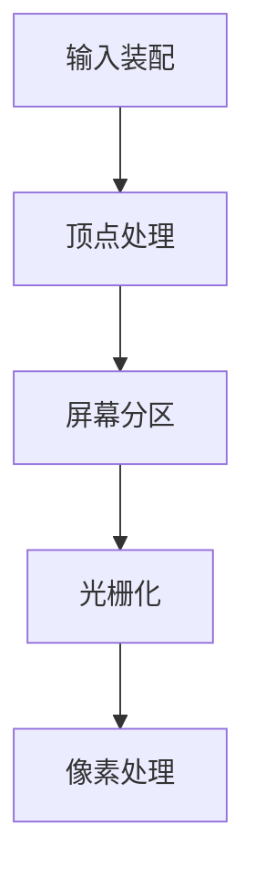

                 

# WebGL：浏览器中的3D图形渲染

## 文章关键词

WebGL, 3D图形渲染，浏览器技术，渲染管线，着色器，顶点缓冲区，纹理映射，动画与物理效果，性能优化，游戏开发，数据可视化

## 文章摘要

本文将深入探讨WebGL技术在浏览器中的3D图形渲染应用。首先，我们将回顾WebGL的历史和发展，理解其在现代网页设计中的重要性。接下来，文章将详细介绍WebGL的核心概念和API，包括渲染管线、着色器、顶点缓冲区和纹理映射等。随后，我们将探讨WebGL的实际应用，如游戏开发、数据可视化等领域。文章还将分析动画与物理效果实现、交互与性能优化等高级主题。最后，通过具体案例分析，我们将展示WebGL的实战应用，并总结最佳实践和注意事项。

## 第1章 WebGL概述

### 1.1 WebGL的历史与发展

WebGL（Web Graphics Library）是一种用于在网页上实现3D图形渲染的技术。它的起源可以追溯到2009年，当时由KHTML引擎的创建者Kai Hedden和Google的Chrome浏览器团队首次提出。随后，它被纳入到HTML5标准中，成为网页设计领域的一个重要组成部分。

WebGL的发展历程可以分为几个阶段：

- **WebGL 1.0**：最初版本，提供了基本的3D图形渲染功能，如着色器编程、顶点缓冲区和纹理映射等。
- **WebGL 2.0**：在2017年发布，增加了许多新特性，如多重渲染目标、高级顶点处理和更多扩展功能。
- **WebGL 3.0**：仍在开发中，预计将引入更多高级功能，如光线追踪和更高效的渲染管线。

随着WebGL技术的不断发展，它已经广泛应用于网页游戏、数据可视化、虚拟现实和增强现实等领域。

### 1.2 WebGL的适用场景

WebGL适用于多种场景，主要包括以下几个方面：

- **网页游戏**：WebGL提供了强大的图形渲染能力，使得网页游戏可以具有与客户端游戏相媲美的视觉效果。
- **数据可视化**：WebGL可以用于创建复杂的3D图表和数据可视化，提供更加直观和动态的数据展示方式。
- **虚拟现实和增强现实**：WebGL技术在VR和AR中的应用日益增多，为用户提供了沉浸式的体验。

### 1.3 WebGL的核心概念

理解WebGL的核心概念是掌握这项技术的基础。以下是WebGL的一些核心概念：

- **渲染管线**：WebGL的渲染管线包括输入装配、顶点处理、屏幕分区、光栅化和像素处理等阶段。渲染管线决定了图形从数据输入到最终渲染的过程。
- **着色器**：着色器是WebGL中用于处理顶点和片元数据的程序。顶点着色器用于处理顶点数据，片元着色器用于处理像素数据。
- **顶点缓冲区**：顶点缓冲区是用于存储顶点数据的数据结构。WebGL通过顶点缓冲区来访问和操作顶点数据。
- **纹理映射**：纹理映射是一种将二维纹理图映射到三维模型表面的技术，用于增加模型的细节和纹理效果。

## 第2章 WebGL环境搭建

### 2.1 WebGL的开发工具

要开始使用WebGL，首先需要安装和配置开发工具。以下是一些常用的WebGL开发工具：

- **浏览器**：WebGL支持所有主流浏览器，如Chrome、Firefox和Safari。确保你的浏览器支持WebGL 2.0。
- **IDE**：一些集成开发环境（IDE）提供了对WebGL的支持，如Visual Studio Code、WebStorm等。
- **扩展库**：一些扩展库可以简化WebGL的开发，如Three.js、Babylon.js等。

### 2.2 WebGL的浏览器支持

WebGL在不同浏览器中的支持情况如下：

- **Chrome**：Chrome是最早支持WebGL的浏览器，目前支持WebGL 2.0。
- **Firefox**：Firefox也支持WebGL 2.0，并在不断更新中。
- **Safari**：Safari支持WebGL 1.0和部分WebGL 2.0功能。
- **Edge**：Edge浏览器支持WebGL 2.0。

### 2.3 WebGL的Hello World案例

以下是使用WebGL创建一个简单的3D立方体示例：

```html
<!DOCTYPE html>
<html>
<head>
    <title>Hello WebGL</title>
    <style>
        canvas { width: 400px; height: 400px; }
    </style>
</head>
<body>
    <canvas id="canvas"></canvas>
    <script>
        // 创建 WebGL上下文
        var canvas = document.getElementById('canvas');
        var gl = canvas.getContext('webgl');

        // 设置背景颜色
        gl.clearColor(1.0, 1.0, 1.0, 1.0);
        gl.clear(gl.COLOR_BUFFER_BIT);

        // 创建顶点缓冲区
        var vertices = [
            1.0,  1.0,  0.0,
           -1.0,  1.0,  0.0,
           -1.0, -1.0,  0.0,
            1.0, -1.0,  0.0
        ];
        var vertexBuffer = gl.createBuffer();
        gl.bindBuffer(gl.ARRAY_BUFFER, vertexBuffer);
        gl.bufferData(gl.ARRAY_BUFFER, new Float32Array(vertices), gl.STATIC_DRAW);

        // 创建着色器程序
        var vertexShaderSource = `
            attribute vec3 aVertexPosition;
            void main() {
                gl_Position = vec4(aVertexPosition, 1.0);
            }
        `;
        var fragmentShaderSource = `
            void main() {
                gl_FragColor = vec4(0.0, 0.0, 0.0, 1.0);
            }
        `;
        var vertexShader = gl.createShader(gl.VERTEX_SHADER);
        var fragmentShader = gl.createShader(gl.FRAGMENT_SHADER);
        gl.shaderSource(vertexShader, vertexShaderSource);
        gl.shaderSource(fragmentShader, fragmentShaderSource);
        gl.compileShader(vertexShader);
        gl.compileShader(fragmentShader);

        var shaderProgram = gl.createProgram();
        gl.attachShader(shaderProgram, vertexShader);
        gl.attachShader(shaderProgram, fragmentShader);
        gl.linkProgram(shaderProgram);
        gl.useProgram(shaderProgram);

        // 设置顶点属性指针
        var positionAttributeLocation = gl.getAttribLocation(shaderProgram, 'aVertexPosition');
        gl.vertexAttribPointer(positionAttributeLocation, 3, gl.FLOAT, false, 0, 0);
        gl.enableVertexAttribArray(positionAttributeLocation);

        // 绘制立方体
        gl.drawArrays(gl.TRIANGLE_STRIP, 0, 4);
    </script>
</body>
</html>
```

这个简单的例子展示了如何创建一个WebGL上下文、设置背景颜色、创建顶点缓冲区、编写和编译着色器程序、设置顶点属性指针并绘制一个简单的3D立方体。

## 第3章 WebGL核心API

### 3.1 WebGL的渲染管线

WebGL的渲染管线是图形渲染的核心，它包括以下几个阶段：

1. **输入装配**：将顶点数据传递给顶点处理阶段。
2. **顶点处理**：在顶点着色器中处理顶点数据。
3. **屏幕分区**：将顶点投影到屏幕空间。
4. **光栅化**：将顶点转换为像素。
5. **像素处理**：在片元着色器中处理像素数据。

以下是渲染管线的Mermaid流程图：



### 3.2 WebGL的顶点和片元着色器

顶点和片元着色器是WebGL中的核心组件，它们分别用于处理顶点数据和像素数据。以下是顶点和片元着色器的伪代码：

```c
// 顶点着色器
void main() {
    gl_Position = vec4(position, 1.0);
}

// 片元着色器
void main() {
    gl_FragColor = vec4(color, 1.0);
}
```

### 3.3 WebGL的纹理映射

纹理映射是将纹理图映射到3D模型表面的技术。以下是纹理映射的伪代码：

```c
// 设置纹理坐标
vec2 texCoord = vec2(position.x, position.y);

// 从纹理图中采样颜色值
vec4 color = texture2D(texture, texCoord);
```

## 第4章 三维图形绘制

### 4.1 三维坐标系统

三维坐标系统是三维图形绘制的基础。以下是三维坐标系统的定义：

- **笛卡尔坐标系**：使用三个坐标轴（x, y, z）来表示空间中的点。
- **向量**：表示空间中的方向和大小，定义为三个坐标值（x, y, z）。
- **矩阵**：用于表示变换，如旋转、平移和缩放等。

### 4.2 三维图形的基本操作

三维图形的基本操作包括顶点操作、面操作和纹理操作等。以下是三维图形的基本操作的伪代码：

```c
// 顶点操作
vec3 vertex = vec3(x, y, z);

// 面操作
triangle[3] = [vertex1, vertex2, vertex3];

// 纹理操作
texCoord[3] = [texCoord1, texCoord2, texCoord3];
```

### 4.3 三维图形的渲染流程

三维图形的渲染流程包括顶点处理、面处理和像素处理等阶段。以下是三维图形渲染流程的伪代码：

```c
// 顶点处理
for (each vertex in vertices) {
    transform(vertex);
}

// 面处理
for (each triangle in triangles) {
    drawTriangle(triangle);
}

// 像素处理
for (each pixel in screen) {
    shadePixel(pixel);
}
```

## 第5章 WebGL的动画与物理效果

### 5.1 WebGL的动画技术

WebGL的动画技术主要包括变换动画、纹理动画和光照动画等。以下是动画技术的伪代码：

```c
// 变换动画
mat4 transform = mat4(1.0);
transform = mat4.translate(transform, vec3(x, y, z));
transform = mat4.rotate(transform, angle, vec3(x, y, z));

// 纹理动画
texCoord = vec2(x * time, y * time);

// 光照动画
lightPosition = vec3(x, y, z);
lightIntensity = intensity * (1 - time);
```

### 5.2 WebGL的物理效果实现

WebGL的物理效果实现包括碰撞检测、重力模拟和弹簧模拟等。以下是物理效果的伪代码：

```c
// 碰撞检测
if (sphere1 && sphere2) {
    collision = true;
}

// 重力模拟
velocity += acceleration * time;

// 弹簧模拟
springLength = springConstant * (springLength - length);
force += springForce;
```

### 5.3 WebGL的实时渲染

WebGL的实时渲染是通过优化渲染流程和利用GPU并行计算来实现的。以下是实时渲染的伪代码：

```c
// 优化渲染流程
cullBackfaces();
sortVerticesByDepth();

// 利用GPU并行计算
dispatchComputeShader(vertices, triangles);
```

## 第6章 WebGL的交互与性能优化

### 6.1 WebGL的用户交互

WebGL的用户交互包括键盘输入、鼠标输入和触摸输入等。以下是用户交互的伪代码：

```c
// 键盘输入
if (keyPressed) {
    moveCamera(keyDirection);
}

// 鼠标输入
if (mousePressed) {
    rotateCamera(mouseX, mouseY);
}

// 触摸输入
if (touchStarted) {
    zoomCamera(touchDistance);
}
```

### 6.2 WebGL的性能优化

WebGL的性能优化包括减少绘制调用、减少内存占用和优化渲染流程等。以下是性能优化的伪代码：

```c
// 减少绘制调用
batchDrawCalls();
optimizeVertexData();

// 减少内存占用
useCompression();
optimizeTextures();

// 优化渲染流程
cullBackfaces();
sortVerticesByDepth();
```

### 6.3 WebGL的多线程处理

WebGL的多线程处理可以通过WebAssembly和Web Workers来实现。以下是多线程处理的伪代码：

```c
// WebAssembly
importModule("module.wasm").then(module => {
    module.exports.main();
});

// Web Workers
worker.onmessage = function(event) {
    result = event.data;
    postMessage(result);
};
```

## 第7章 WebGL在游戏开发中的应用

### 7.1 WebGL游戏引擎简介

WebGL游戏引擎是一种用于开发网页游戏的框架，它提供了丰富的功能和工具，如物理引擎、动画系统、音频系统等。以下是WebGL游戏引擎的概述：

- **Three.js**：一个流行的3D游戏引擎，提供了易于使用的API和丰富的功能。
- **Babylon.js**：另一个强大的3D游戏引擎，支持VR和AR等功能。
- **GameMaker Studio**：一个跨平台的游戏开发工具，支持WebGL渲染。

### 7.2 WebGL游戏的开发流程

WebGL游戏的开发流程包括以下几个步骤：

1. **需求分析**：明确游戏的目标、玩法和特性。
2. **设计阶段**：设计游戏关卡、角色、场景等。
3. **开发阶段**：使用WebGL引擎和工具开发游戏。
4. **测试阶段**：测试游戏并修复错误。
5. **发布阶段**：将游戏部署到网页。

### 7.3 WebGL游戏案例解析

以下是一个简单的WebGL游戏案例解析：

```c
// 游戏场景
scene = createScene();

// 游戏角色
player = createPlayer();

// 游戏逻辑
function gameLoop() {
    updatePlayerPosition();
    checkCollisions();
    renderScene();
    requestAnimationFrame(gameLoop);
}

// 游戏启动
gameLoop();
```

## 第8章 WebGL在其他领域中的应用

### 8.1 WebGL在数据可视化中的应用

WebGL在数据可视化中的应用非常广泛，它可以用于创建复杂的3D图表和数据可视化。以下是WebGL在数据可视化中的应用：

- **三维条形图**：使用WebGL创建具有深度感的条形图，提供更加直观的数据展示。
- **三维饼图**：使用WebGL创建具有立体效果的饼图，显示数据占比。
- **三维散点图**：使用WebGL创建具有立体效果的散点图，显示数据分布。

### 8.2 WebGL在虚拟现实中的应用

WebGL在虚拟现实（VR）中的应用使得网页VR体验变得更加丰富。以下是WebGL在VR中的应用：

- **网页VR游戏**：使用WebGL开发VR游戏，提供沉浸式的游戏体验。
- **网页VR购物**：使用WebGL创建VR购物体验，让用户在虚拟环境中浏览商品。
- **网页VR旅游**：使用WebGL创建虚拟旅游体验，让用户在虚拟环境中参观景点。

### 8.3 WebGL在科学计算中的应用

WebGL在科学计算中的应用非常广泛，它可以用于创建复杂的科学图表和模拟。以下是WebGL在科学计算中的应用：

- **三维流体模拟**：使用WebGL创建流体模拟，展示流体运动。
- **三维地质勘探**：使用WebGL创建地质勘探模拟，展示地质结构。
- **三维医学图像**：使用WebGL创建医学图像可视化，帮助医生诊断疾病。

## 附录：WebGL资源与工具汇总

### 附录 A WebGL学习资源

- **官方文档**：WebGL官方文档提供了详细的API说明和教程。
- **在线教程**：许多网站提供了免费的WebGL教程和课程。
- **书籍**：《WebGL编程指南》和《WebGL编程入门与实践》等书籍是学习WebGL的宝贵资源。

### 附录 B WebGL开发工具列表

- **浏览器**：Chrome、Firefox、Safari等浏览器支持WebGL。
- **IDE**：Visual Studio Code、WebStorm等IDE支持WebGL开发。
- **扩展库**：Three.js、Babylon.js等扩展库简化了WebGL开发。

### 附录 C WebGL编程规范

- **命名规范**：使用驼峰命名法，如`myVariable`。
- **注释规范**：使用单行注释`//`和多行注释`/* ... */`。
- **代码风格**：保持代码简洁、清晰，避免过度使用全局变量。

## 作者

作者：AI天才研究院/AI Genius Institute & 禅与计算机程序设计艺术/Zen And The Art of Computer Programming

---

### 文章小结

WebGL作为浏览器中的3D图形渲染技术，已经成为网页设计和开发的重要工具。本文从WebGL的概述、环境搭建、核心API、三维图形绘制、动画与物理效果、交互与性能优化、应用案例等多个方面进行了详细探讨。通过本文的学习，读者可以深入了解WebGL的技术原理和应用场景，掌握开发WebGL应用的基本技能。

### 注意事项

1. **浏览器兼容性**：在开发WebGL应用时，需要考虑不同浏览器的兼容性问题。
2. **性能优化**：合理优化渲染流程和资源，确保WebGL应用的性能。
3. **安全性**：在处理用户数据和敏感信息时，确保遵守相关法律法规。

### 拓展阅读

- **WebGL官方文档**：深入了解WebGL的API和使用方法。
- **Three.js官方教程**：学习如何使用Three.js进行WebGL开发。
- **Babylon.js文档**：了解Babylon.js引擎的功能和用法。

### 实际案例

通过实际案例，读者可以更好地理解WebGL的应用。以下是一些实用的案例：

- **三维地图**：使用WebGL创建交互式三维地图，提供更加直观的地理信息展示。
- **网页游戏**：使用WebGL开发具有复杂图形和动画的网页游戏。
- **虚拟现实体验**：使用WebGL创建虚拟现实体验，让用户沉浸在虚拟世界中。

通过本文的学习，读者可以掌握WebGL的基础知识和开发技能，为今后的网页设计和开发奠定坚实的基础。作者：AI天才研究院/AI Genius Institute & 禅与计算机程序设计艺术/Zen And The Art of Computer Programming。

