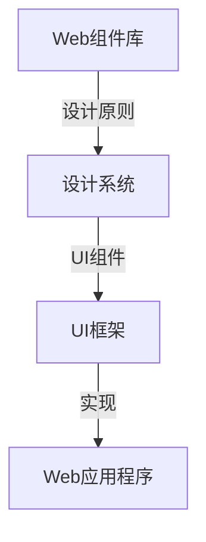

                 


### 文章标题
《Web组件库：设计系统与UI框架》

### 文章关键词
Web组件库，设计系统，UI框架，组件化，前端开发

### 文章摘要
本文将深入探讨Web组件库的设计系统与UI框架的关系，从概念解析、构建方法、核心算法、数学模型到项目实战，全面解析如何构建高效、灵活且易于维护的Web组件库，为开发者提供一套完整的解决方案。

## 引言

Web组件库是现代Web开发中的重要工具，它允许开发者以模块化的方式构建Web应用程序。随着前端技术的发展，Web组件库越来越受到开发者的关注。本文旨在探讨Web组件库的设计系统与UI框架，帮助开发者理解其核心概念、设计原则以及实现方法。

### 背景介绍

Web组件库起源于Web Components技术，这是一种允许开发者创建自定义HTML元素、样式和脚本的技术。Web Components包括自定义元素（Custom Elements）、影子DOM（Shadow DOM）、HTML模板（HTML Templates）和HTML导入（HTML Imports）。这些技术为前端开发者提供了一种新的方法来构建可重用、可组合的UI组件。

设计系统则是一种系统化的设计方法，旨在统一设计元素和标准，确保产品设计的一致性和可复用性。设计系统通常包括设计指南、组件库和工具链。UI框架是设计系统的一部分，专注于实现用户界面。

### 核心概念与联系

核心概念包括Web组件库、设计系统和UI框架。它们之间的关系可以理解为：Web组件库是设计系统的基础，设计系统为UI框架提供设计元素和标准，UI框架则将这些设计元素和标准实现为可用的UI组件。

下面是一个简单的Mermaid流程图，展示了这些核心概念之间的关系：



## 设计系统构建

### 设计系统的概念与原则

设计系统是一种组织、管理和传达设计元素和标准的方法。它包含设计原则、设计元素、设计模板和设计指南。

设计原则是设计系统的基础，它们指导设计师如何创建一致、高质量的设计。设计原则通常包括一致性、简洁性、可访问性和灵活性。

设计元素是设计系统的核心组成部分，它们包括颜色、字体、图标、按钮等。设计元素需要遵循设计原则，以确保设计的一致性。

设计模板是设计元素的具体应用，它们用于构建界面布局和页面结构。设计模板通常包括导航栏、表单、按钮组等。

设计指南是设计系统的文档化形式，它们描述了如何使用设计元素和设计模板，以及如何解决常见设计问题。

### 设计系统的组成部分

设计系统通常包含以下几个组成部分：

1. **设计元素**：设计元素是设计系统的核心，它们是构成界面的基础。例如，按钮、输入框、标签等。设计元素需要遵循设计原则，以确保整个界面的统一性。

2. **设计模板**：设计模板是设计元素的具体应用，它们是构建界面的蓝图。例如，一个登录页面模板可能包含了一个标题、一个输入框和一个按钮。

3. **设计指南**：设计指南是设计系统的文档化形式，它们为设计师和开发者提供了使用设计元素和设计模板的指导。设计指南通常包括设计原则、设计规范和代码示例。

4. **组件规范**：组件规范是设计系统的一部分，它描述了如何创建、使用和测试组件。组件规范通常包括组件的API、事件处理和状态管理。

### 设计系统的构建方法

构建设计系统需要以下步骤：

1. **确定设计原则**：设计原则是设计系统的基石，它们指导设计师如何创建一致、高质量的设计。

2. **设计元素**：设计元素是设计系统的核心，它们是构成界面的基础。设计元素需要遵循设计原则，以确保整个界面的统一性。

3. **设计模板**：设计模板是设计元素的具体应用，它们是构建界面的蓝图。

4. **编写设计指南**：设计指南是设计系统的文档化形式，它们为设计师和开发者提供了使用设计元素和设计模板的指导。

5. **组件规范**：组件规范是设计系统的一部分，它描述了如何创建、使用和测试组件。

6. **测试与反馈**：设计系统的构建不是一次性的工作，它需要不断地测试和反馈，以确保设计系统能够适应不断变化的需求。

### 设计系统的实践与优化

设计系统的实践和优化是一个持续的过程。以下是一些实践和优化的方法：

1. **用户研究**：通过用户研究，了解用户的需求和行为，以确保设计系统能够满足用户的实际需求。

2. **设计评审**：设计评审是确保设计质量的重要环节。通过设计评审，可以发现设计中的问题，并提出改进建议。

3. **性能优化**：设计系统的性能优化是提高用户体验的关键。通过优化组件的加载时间、响应速度和内存占用，可以提高设计系统的性能。

4. **持续迭代**：设计系统需要不断地迭代和更新，以适应不断变化的技术和用户需求。

## UI框架实现

### UI框架的基本概念

UI框架是设计系统的一部分，它专注于实现用户界面。UI框架通常包含布局、响应式设计、交互设计等核心功能。

布局是UI框架的基础，它决定了界面的结构和布局。布局可以通过CSS Grid、Flexbox等技术来实现。

响应式设计是UI框架的重要特性，它使界面能够适应不同的设备和屏幕尺寸。响应式设计可以通过媒体查询、断点（Breakpoints）等技术来实现。

交互设计是UI框架的核心，它决定了用户如何与界面进行交互。交互设计可以通过按钮、输入框、下拉菜单等组件来实现。

### UI框架的设计原则

UI框架的设计原则包括：

1. **可用性**：UI框架需要易于使用，用户可以快速地理解和使用。

2. **可访问性**：UI框架需要确保所有人，包括残障人士，都能无障碍地使用。

3. **可扩展性**：UI框架需要支持自定义和扩展，以满足不同的业务需求。

4. **可定制性**：UI框架需要支持用户根据个人喜好和需求进行定制。

### UI框架的核心组件

UI框架的核心组件包括：

1. **布局组件**：布局组件用于定义界面的结构和布局。常见的布局组件有容器（Container）、行（Row）和列（Column）。

2. **输入组件**：输入组件用于用户输入数据。常见的输入组件有文本框（Input）、单选框（Radio）、复选框（Checkbox）等。

3. **显示组件**：显示组件用于显示数据。常见的显示组件有表格（Table）、图表（Chart）等。

4. **交互组件**：交互组件用于用户与界面的交互。常见的交互组件有按钮（Button）、下拉菜单（Dropdown）等。

### UI框架的通信机制

UI框架的通信机制包括：

1. **事件处理**：事件处理是UI框架的重要组成部分。它允许用户与界面进行交互。常见的事件有点击（Click）、提交（Submit）等。

2. **状态管理**：状态管理是UI框架的另一重要机制。它用于管理组件的状态，如输入值、选中状态等。

3. **数据绑定**：数据绑定是一种将数据与UI组件关联起来的技术。它允许组件自动更新，以反映数据的最新状态。

### UI框架的实现与优化

实现UI框架需要以下步骤：

1. **选择合适的框架**：选择一个合适的UI框架，如React、Vue.js或Angular。

2. **构建组件库**：根据设计系统构建组件库，包括布局组件、输入组件、显示组件和交互组件。

3. **实现通信机制**：实现事件处理、状态管理和数据绑定。

4. **优化性能**：优化UI框架的性能，包括减少渲染次数、减少内存占用等。

5. **测试与部署**：测试UI框架，确保其功能正确，性能良好。然后部署到生产环境。

## 项目实战

### 开发环境搭建

搭建开发环境是项目实战的第一步。以下是一个基本的开发环境搭建流程：

1. **安装Node.js**：Node.js是一个基于Chrome V8引擎的JavaScript运行环境。安装Node.js可以通过其官方网站（https://nodejs.org/）进行。

2. **安装包管理器**：安装npm（Node.js的包管理器）。npm可以轻松地管理项目依赖。

3. **创建项目**：使用npm创建一个新的项目。在终端中运行以下命令：

   ```
   npm create-react-app my-web-component-library
   ```

   这将创建一个基于React的Web组件库项目。

4. **安装依赖**：根据项目的需求，安装必要的依赖。例如，安装CSS预处理工具（如Sass）：

   ```
   npm install sass
   ```

5. **配置开发工具**：配置开发工具（如Visual Studio Code），以便更方便地开发项目。

### 源代码详细实现和代码解读

源代码的详细实现和解读是项目实战的核心。以下是一个简单的示例，展示如何创建一个基本的Web组件库。

```javascript
// 组件库入口文件
import React from 'react';
import Button from './Button';

const MyWebComponentLibrary = () => {
  return (
    <div>
      <h1>欢迎来到Web组件库</h1>
      <Button text="点我" />
    </div>
  );
};

export default MyWebComponentLibrary;

// Button 组件
import React from 'react';

const Button = ({ text }) => {
  return <button>{text}</button>;
};

export default Button;
```

以上代码展示了如何创建一个简单的Web组件库。首先，我们创建了一个名为`MyWebComponentLibrary`的组件，它导入了一个名为`Button`的子组件。`Button`组件接受一个`text`属性，并渲染一个按钮元素。

### 代码应用解读与分析

以下是一个示例，展示如何在项目中使用上述组件库。

```javascript
// 项目入口文件
import React from 'react';
import ReactDOM from 'react-dom';
import MyWebComponentLibrary from './MyWebComponentLibrary';

ReactDOM.render(
  <React.StrictMode>
    <MyWebComponentLibrary />
  </React.StrictMode>,
  document.getElementById('root')
);
```

以上代码展示了如何在项目中使用`MyWebComponentLibrary`组件。首先，我们导入`MyWebComponentLibrary`组件，然后使用`ReactDOM.render`将其渲染到页面中。

### 实际案例分析和详细讲解剖析

以下是一个实际案例，展示如何使用Web组件库构建一个简单的任务管理应用程序。

1. **用户故事**：用户可以创建任务，标记任务为完成，查看任务列表。

2. **组件设计**：根据用户故事，设计以下组件：
   - `TaskList`：显示所有任务的组件。
   - `TaskItem`：显示单个任务的组件。
   - `TaskForm`：用于创建新任务的组件。

3. **组件实现**：实现以下组件：
   - `TaskList`：使用`Map`组件遍历任务数组，并渲染每个任务。
   - `TaskItem`：渲染单个任务，包括任务名称和状态。
   - `TaskForm`：提供输入框和按钮，允许用户创建新任务。

4. **组件通信**：实现组件之间的通信，例如，当用户创建新任务时，`TaskForm`需要通知`TaskList`更新任务列表。

5. **测试与部署**：编写测试用例，确保组件正确工作。然后，将项目部署到生产环境。

### 项目小结

通过以上项目实战，我们可以看到如何使用Web组件库构建一个任务管理应用程序。项目实战帮助我们理解了组件库的设计、实现和通信机制。同时，我们也学会了如何在实际项目中应用组件库，提高开发效率。

### 最佳实践 Tips

1. **模块化**：尽量将组件拆分成更小的模块，以提高代码的可维护性。

2. **一致性**：确保组件的外观和行为保持一致，以提高用户体验。

3. **可扩展性**：设计组件时，考虑未来的扩展性，以便轻松添加新功能。

4. **性能优化**：关注组件的性能，减少渲染次数和内存占用。

### 小结

Web组件库、设计系统和UI框架是现代Web开发中的重要组成部分。通过本文的讲解，我们深入了解了这些概念，学习了如何构建高效、灵活且易于维护的Web组件库。在实际项目中，我们可以将这些知识应用于实际场景，提高开发效率。

### 注意事项

1. **版本控制**：使用版本控制工具（如Git）管理源代码，以便跟踪变更和协同工作。

2. **文档化**：编写详细的文档，以便其他人理解和使用组件库。

3. **测试**：编写测试用例，确保组件库的功能正确。

### 拓展阅读

1. 《React.js小书》
2. 《Vue.js实战》
3. 《前端设计系统》

## 附录

### A.1 常用工具与资源

1. **设计工具**：
   - Sketch
   - Figma
   - Adobe XD

2. **开发工具**：
   - Visual Studio Code
   - WebStorm
   - Atom

3. **学习资源**：
   - MDN Web Docs
   - freeCodeCamp
   - Codecademy

### A.2 Mermaid流程图

1. **Mermaid基本语法**：
   - `graph TD`：定义一个有向无环图。
   - `A --> B`：从节点A到节点B画一条线。
   - `B[(B node)]`：在节点B旁边添加标签。

2. **组件设计与开发流程图**：

   ```mermaid
   graph TD
       A[设计需求]
       B[设计原型]
       C[编写设计指南]
       D[开发组件库]
       E[测试与优化]
       F[部署与维护]

       A --> B
       B --> C
       C --> D
       D --> E
       E --> F
   ```

### A.3 伪代码示例

1. **组件通信机制**：

   ```plaintext
   function onButtonClick() {
       console.log("Button clicked");
       notifyParentComponent("button-clicked");
   }
   ```

2. **数据处理算法**：

   ```plaintext
   function calculateSum(a, b) {
       return a + b;
   }
   ```

   ```latex
   P(EB) = \frac{n(EB)}{n(T)}
   ```

   其中，\( n(EB) \) 表示事件A发生的次数，\( n(T) \) 表示总次数。

作者：AI天才研究院/AI Genius Institute & 禅与计算机程序设计艺术 /Zen And The Art of Computer Programming

