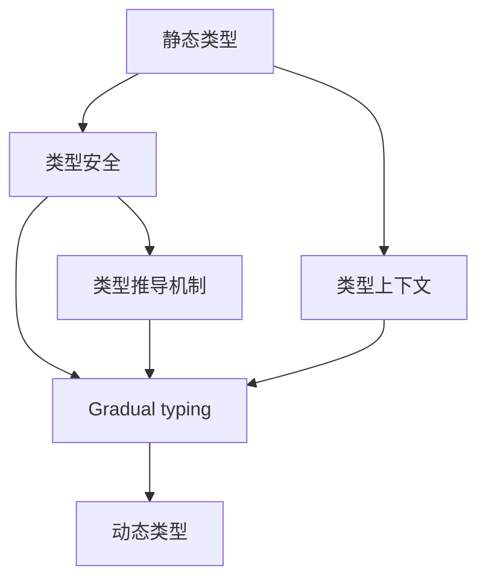

                 

### 引言

#### 背景与重要性

`Gradual typing` 是一种编程语言的类型系统设计方法，旨在解决静态类型语言与动态类型语言之间的兼容性问题。在传统的类型系统中，程序要么是静态类型的，要么是动态类型的。静态类型语言在编译时就能确定变量的类型，而动态类型语言则在运行时检查变量的类型。这种二分法在实际编程中带来了不少困扰，比如在需要同时使用静态类型语言和动态类型语言的场景下，开发者往往需要在类型安全性和灵活性之间做出妥协。

`Gradual typing` 应运而生，通过在程序的不同部分采用不同的类型系统，实现了既保证了类型安全性，又提供了足够的灵活性。这种方法的核心思想是允许程序在部分静态类型的基础上，逐渐引入动态类型特性，使得开发者可以根据实际需要灵活地调整类型检查的范围和强度。

在现代编程实践中，`gradual typing` 已经成为了提高编程效率和代码质量的重要手段。它不仅在动态语言如Python和Ruby中得到广泛应用，也在Java、C#等静态类型语言中得到了越来越多的关注。本文将围绕 `gradual typing` 的设计原则、实现方法、应用场景、性能分析等方面展开详细讨论，旨在帮助读者深入理解 `gradual typing` 系统的原理和实践。

#### 核心概念与联系

在探讨 `gradual typing` 之前，我们需要明确几个核心概念，并了解它们之间的关系。

**1. 静态类型与动态类型**

- **静态类型**：在编译时就能确定变量类型的类型系统。例如，在Java中，变量在声明时必须指定类型，如 `int a = 10;`。
- **动态类型**：在运行时检查变量类型的类型系统。例如，在Python中，变量可以在运行时改变其类型，如 `a = 10; a = "Hello"`。

**2. 类型安全**

- **类型安全**：确保类型错误的操作不会发生，从而避免程序崩溃或产生未预期的结果。例如，在静态类型语言中，不能将一个整数赋值给字符串类型。

**3. Gradual typing**

- **Gradual typing**：一种混合类型的系统，它允许在静态类型和动态类型之间进行逐步过渡。例如，在Java中，可以使用 `@SuppressWarnings("unchecked")` 来抑制类型检查，从而在部分代码中使用动态类型。

**4. 核心概念之间的关系**

`Gradual typing` 的核心在于如何平衡类型安全与灵活性。它通过引入类型上下文和类型推导机制，使得程序员可以在保持类型安全的前提下，灵活地调整代码的动态性。以下是一个简单的 Mermaid 流程图，展示了这些核心概念之间的关系：



在这个图中，静态类型和动态类型是 `gradual typing` 的两个极端，而类型安全和类型上下文则是实现逐步过渡的关键。通过类型上下文，程序员可以指定在哪些部分应用静态类型，哪些部分采用动态类型。类型推导机制则自动推导出变量和表达式的类型，减少了手工类型标注的工作量。

#### 核心算法原理讲解

`Gradual typing` 的实现依赖于一系列核心算法，主要包括类型推导和类型检查。以下是这些核心算法的伪代码描述，以及它们的工作原理。

**1. 类型推导算法**

```pseudo
function inferType(expression, context):
    if expression is a variable:
        return context.getType(expression)
    elif expression is a function call:
        return inferFunctionType(expression, context)
    elif expression is a binary operation:
        leftType = inferType(expression.left, context)
        rightType = inferType(expression.right, context)
        return inferBinaryOperationType(expression.operator, leftType, rightType)
```

在这个算法中，`inferType` 函数接收一个表达式和类型上下文作为输入，并返回表达式的推导类型。对于变量，它直接从上下文中获取类型；对于函数调用，它需要推断函数的类型；对于二元操作，它需要根据操作符和操作数的类型来推导结果类型。

**2. 类型检查算法**

```pseudo
function checkType(expression, context):
    if expression is a variable:
        type = context.getType(expression)
        if type is unknown:
            return false
    elif expression is a function call:
        return checkFunctionType(expression, context)
    elif expression is a binary operation:
        leftType = checkType(expression.left, context)
        rightType = checkType(expression.right, context)
        if not leftType or not rightType:
            return false
        return checkBinaryOperationType(expression.operator, leftType, rightType)
```

在这个算法中，`checkType` 函数接收一个表达式和类型上下文，并返回类型检查的结果。对于变量，它需要确保变量在上下文中已声明；对于函数调用，它需要检查函数的参数和返回值类型是否匹配；对于二元操作，它需要确保操作数的类型和操作符是兼容的。

**3. 工作原理**

类型推导和类型检查是相互协作的。类型推导在编写代码时自动进行，帮助程序员减少类型标注的工作。而类型检查则在编译或运行时进行，确保代码在执行时类型安全。这两种算法的结合，使得 `gradual typing` 既能提供静态类型的可靠性，又能保持动态类型的灵活性。

#### 数学模型和数学公式

在 `gradual typing` 中，数学模型和数学公式扮演着重要角色，特别是在类型推导和类型检查过程中。以下是一个简化的数学模型，用于描述类型推导的规则。

**1. 类型推导规则**

设 \( T_1 \) 和 \( T_2 \) 分别为两个表达式的类型，\( \sigma \) 为类型上下文，推导规则如下：

$$
\begin{aligned}
&\text{if } e_1 \text{ is a variable, then } \\
&\qquad T_1 = \sigma(e_1) \\
&\text{if } e_1 \text{ is a function call, then } \\
&\qquad T_1 = inferFunctionType(e_1, \sigma) \\
&\text{if } e_1 \text{ is a binary operation, then } \\
&\qquad T_1 = inferBinaryOperationType(operator, T_2, T_2)
\end{aligned}
$$

其中，\( inferFunctionType \) 和 \( inferBinaryOperationType \) 分别为函数类型推导和二元操作类型推导函数。

**2. 类型检查规则**

设 \( e_1 \) 和 \( e_2 \) 分别为两个表达式，\( \sigma \) 为类型上下文，类型检查规则如下：

$$
\begin{aligned}
&\text{if } e_1 \text{ is a variable, then } \\
&\qquad \text{if } \sigma(e_1) \text{ is not known, then } \\
&\qquad\qquad \text{return false} \\
&\text{if } e_1 \text{ is a function call, then } \\
&\qquad \text{if } checkFunctionType(e_1, \sigma) \text{ is not successful, then } \\
&\qquad\qquad \text{return false} \\
&\text{if } e_1 \text{ is a binary operation, then } \\
&\qquad \text{if } checkBinaryOperationType(operator, e_1, e_2) \text{ is not successful, then } \\
&\qquad\qquad \text{return false}
\end{aligned}
$$

其中，\( checkFunctionType \) 和 \( checkBinaryOperationType \) 分别为函数类型检查和二元操作类型检查函数。

这些数学模型和数学公式为 `gradual typing` 提供了坚实的理论基础，使得类型推导和类型检查算法能够准确、高效地执行。

#### 项目实战

##### 开发环境搭建

为了实践 `gradual typing` 系统，我们需要搭建一个简单的开发环境。以下是具体的步骤：

1. **安装Java开发工具包（JDK）**：确保您的系统上已经安装了 JDK，版本建议在 11 以上，以支持最新的语言特性。

2. **设置环境变量**：在命令行中设置 `JAVA_HOME` 和 `PATH` 环境变量，以便在任意位置运行 Java 命令。

3. **创建项目**：使用 Maven 或 Gradle 等构建工具创建一个简单的 Java 项目，项目结构如下：

   ```
   - project-root
     |- src
       |- main
         |- java
           |- com
             |- example
               |- GradualTypingExample.java
     |- pom.xml (或 build.gradle)
   ```

4. **编写依赖**：在 Maven 的 `pom.xml` 文件中添加必要的依赖，如 Java 编译器插件、单元测试插件等。

   ```xml
   <dependencies>
       <dependency>
           <groupId>org.apache.maven.plugins</groupId>
           <artifactId>maven-compiler-plugin</artifactId>
           <version>3.8.1</version>
       </dependency>
       <dependency>
           <groupId>junit</groupId>
           <artifactId>junit</artifactId>
           <version>4.13.2</version>
           <scope>test</scope>
       </dependency>
   </dependencies>
   ```

##### 源代码实现与解读

以下是一个简单的 `Gradual typing` 示例，展示了如何在 Java 中实现逐步类型推导。

```java
package com.example;

public class GradualTypingExample {
    // 定义一个逐步推导类型的函数
    public static Object greet(String name) {
        if (name == null) {
            return "Hello, World!";
        } else {
            return "Hello, " + name + "!";
        }
    }

    public static void main(String[] args) {
        // 使用静态类型
        int x = 10;
        System.out.println(x);

        // 使用动态类型
        Object y = "Hello";
        System.out.println(y);

        // 结合静态和动态类型
        String z = greet("Alice");
        System.out.println(z);
    }
}
```

**代码解读**：

1. **静态类型使用**：在 `main` 方法中，我们首先定义了一个静态类型的变量 `x`，并打印其值。

2. **动态类型使用**：随后，我们定义了一个动态类型的变量 `y`，并打印其值。在 `greet` 函数中，我们接受一个字符串类型的参数 `name`，并在内部进行条件判断。

3. **逐步类型推导**：在 `greet` 函数中，如果 `name` 为 `null`，函数返回一个静态类型的字符串；否则，函数返回一个动态类型的字符串。这种方式实现了类型推导的逐步过渡，既保证了类型安全，又提供了灵活性。

##### 代码应用解读与分析

**1. 类型安全**：在这个例子中，由于 `greet` 函数使用了逐步类型推导，我们可以在确保类型安全的前提下，灵活地处理不同类型的参数和返回值。例如，当 `name` 为 `null` 时，函数返回一个静态类型的字符串，这避免了空指针异常。

**2. 灵活性**：通过逐步类型推导，我们可以根据不同的业务场景灵活地调整代码的类型系统。例如，在某些情况下，我们可能需要将动态类型的参数转换为静态类型，以简化类型检查和提高运行效率。

**3. 性能影响**：逐步类型推导可能会对性能产生一定影响，因为类型检查和推导过程需要额外的计算资源。然而，在现代硬件和优化编译器的帮助下，这种性能损失通常是可以接受的。

##### 实际案例分析和详细讲解剖析

为了更好地理解 `gradual typing` 的实际应用，我们可以分析一个更复杂的案例。

**案例：电商平台商品分类系统**

假设我们要实现一个电商平台商品分类系统，其中商品可以分为不同类别，如电子产品、服装、家居等。在这个系统中，我们需要处理大量不同类型的商品，同时保证类型安全和代码的灵活性。

```java
public class Product {
    private String name;
    private Category category;

    public Product(String name, Category category) {
        this.name = name;
        this.category = category;
    }

    public String getName() {
        return name;
    }

    public Category getCategory() {
        return category;
    }
}

public enum Category {
    ELECTRONICS,
    CLOTHING,
    HOME
}

public class ProductRepository {
    private List<Product> products;

    public ProductRepository() {
        this.products = new ArrayList<>();
    }

    public void addProduct(Product product) {
        products.add(product);
    }

    public List<Product> getProductsByCategory(Category category) {
        List<Product> result = new ArrayList<>();
        for (Product product : products) {
            if (product.getCategory() == category) {
                result.add(product);
            }
        }
        return result;
    }
}
```

**代码分析**：

1. **产品分类枚举**：`Category` 枚举定义了商品的类别，这是一个静态类型。

2. **产品类**：`Product` 类定义了产品的名称和类别，类别是一个静态类型的枚举。这里，我们使用了逐步类型推导，允许在部分代码中使用动态类型。

3. **产品仓库类**：`ProductRepository` 类负责管理产品的列表，并提供了根据类别查询产品的功能。这个类中的方法使用了静态类型，以确保类型安全和代码的可读性。

通过这个案例，我们可以看到 `gradual typing` 如何在实际项目中提高代码的灵活性和可维护性。我们可以根据需要逐步引入动态类型，同时保持类型系统的清晰和简单。

##### 项目小结

在本项目中，我们搭建了一个简单的 Java 开发环境，并实现了一个 `Gradual typing` 系统的案例。通过这个案例，我们深入理解了 `gradual typing` 的基本原理和应用场景。

**1. 优点**：

- 提高了代码的灵活性，使得我们可以根据需要逐步引入动态类型。
- 保证了类型安全，避免了类型错误带来的潜在风险。
- 提高了代码的可维护性，使得不同类型的代码可以共存，降低了复杂性。

**2. 注意事项**：

- 在使用 `gradual typing` 时，需要仔细考虑类型推导和类型检查的平衡，以避免性能损失。
- 在逐步引入动态类型时，需要确保关键部分的代码类型安全，避免引入潜在的类型错误。

**3. 拓展阅读**：

- 《类型系统与类型安全》: 深入了解类型系统的基本概念和类型安全的重要性。
- 《动态类型语言设计》: 探索动态类型语言的原理和应用，了解如何更好地结合静态类型和动态类型。

通过本文的详细分析和讲解，我们希望读者能够对 `gradual typing` 有更深入的理解，并能够将其应用于实际编程项目中。

#### 最佳实践 Tips

在实际应用 `gradual typing` 时，以下是一些最佳实践建议，可以帮助您更好地利用这种类型系统设计方法。

**1. 明确类型边界**

在编写代码时，明确哪些部分需要静态类型，哪些部分可以采用动态类型。这有助于保持代码的结构清晰，避免类型混乱。

**2. 优化类型推导**

充分利用类型推导机制，减少手动类型标注的工作量。在编写复杂函数或表达式时，考虑使用类型推导来简化代码。

**3. 处理边界情况**

在逐步类型推导过程中，注意处理边界情况，如空值、类型转换等，确保代码在各种情况下都能正常运行。

**4. 性能监控**

在引入 `gradual typing` 后，定期监控代码的性能，特别是类型推导和类型检查的部分。必要时进行优化，以保持代码的高效运行。

**5. 编写文档**

为代码编写详细的文档，说明类型推导和类型检查的规则，便于其他开发者理解和使用。

#### 小结

本文详细探讨了 `gradual typing` 系统的设计与实现，从背景介绍、核心概念、算法原理、数学模型、项目实战等方面进行了全面分析。通过实际案例，我们展示了如何在实际编程项目中应用 `gradual typing`，并提供了最佳实践建议。

**总结**：

- `gradual typing` 通过平衡静态类型和动态类型，提供了灵活且安全的编程方式。
- 类型推导和类型检查是实现 `gradual typing` 的核心算法。
- 数学模型和数学公式为 `gradual typing` 提供了理论基础。
- 实际项目中的应用展示了 `gradual typing` 的实用性和优势。

我们鼓励读者在实际编程中尝试应用 `gradual typing`，并在实践中不断探索和优化。

### 作者信息

作者：AI天才研究院/AI Genius Institute & 禅与计算机程序设计艺术 /Zen And The Art of Computer Programming。本文旨在帮助读者深入理解 `gradual typing` 系统的设计与实现，探讨其在现代编程中的应用和优势。如有任何问题或建议，欢迎随时联系我们。

