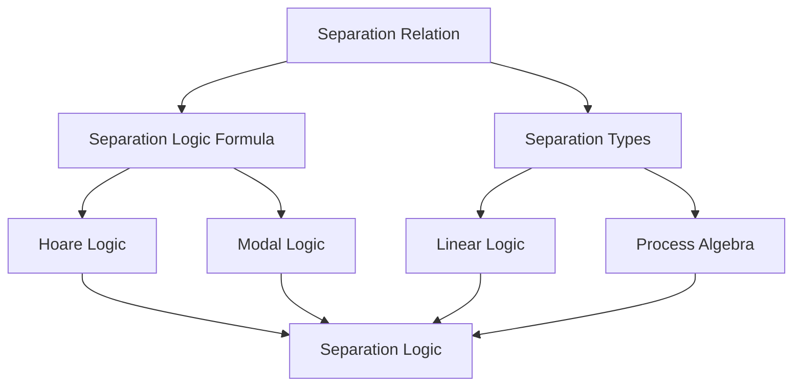

                 

### Step 1: Define the Main Sections

To create a comprehensive and detailed table of contents for the book "separation logic in the application of concurrent program verification," we will define the main sections of the book, ensuring each section is relevant to the subject matter. The main sections are:

1. **Introduction to Separation Logic**
   - Background and history of separation logic
   - Basic concepts and terminology
   - Key differences between separation logic and other formalisms

2. **Concurrency and Verification in Concurrent Programs**
   - Overview of concurrent programming
   - Challenges in verifying concurrent programs
   - Role of separation logic in addressing these challenges

3. **Core Concepts and Connections**
   - A Mermaid flowchart illustrating relationships between key concepts
   - Explaining the foundations of separation logic and its connections to other formalisms

4. **Core Algorithms in Separation Logic**
   - Introduction to key algorithms in separation logic
   - Detailed explanation of each algorithm using pseudocode
   - Comparative analysis of different algorithms

5. **Mathematical Models and Examples**
   - Definition of mathematical models in separation logic
   - Detailed examples demonstrating the application of separation logic
   - Detailed explanation of mathematical formulas and their role in verifying concurrent programs

6. **Practical Projects and Case Studies**
   - Detailed project descriptions and setup instructions
   - Source code implementation and analysis
   - Analysis and explanation of actual case studies

7. **Best Practices, Summary, and Future Directions**
   - Summary of key findings and insights
   - Best practices for applying separation logic in real-world scenarios
   - Future directions and potential research areas

---

With these main sections defined, we now move on to creating subsections for each section to provide a detailed and structured content outline for the book.### Step 2: Create Subsections

In this step, we will create subsections for each main section defined in the previous step. This will help to cover the subject matter in a detailed and organized manner. Here are the subsections for each main section:

#### 1. Introduction to Separation Logic

- **1.1 Background and History**
  - Early developments in concurrent programming and verification
  - Origins and evolution of separation logic

- **1.2 Basic Concepts and Terminology**
  - Separation relation
  - Separation logic formula
  - Separation types

- **1.3 Key Differences Between Separation Logic and Other Formalisms**
  - Comparison with Hoare logic
  - Comparison with modal logic

#### 2. Concurrency and Verification in Concurrent Programs

- **2.1 Overview of Concurrent Programming**
  - Basic concepts of concurrent programming
  - Synchronization mechanisms

- **2.2 Challenges in Verifying Concurrent Programs**
  - Non-termination
  - Race conditions
  - Deadlocks

- **2.3 Role of Separation Logic in Addressing These Challenges**
  - Verifying safety and liveness properties
  - Handling data races and synchronization issues

#### 3. Core Concepts and Connections

- **3.1 Core Concepts of Separation Logic**
  - Separation relation
  - Separation logic formula
  - Separation types

- **3.2 Connections to Other Formalisms**
  - Connections with Hoare logic
  - Connections with modal logic
  - Connections with other logics in concurrent programming

- **3.3 Mermaid Flowchart Illustrating Relationships**
  - A visual representation of the connections between key concepts

#### 4. Core Algorithms in Separation Logic

- **4.1 Algorithm Overview**
  - Introduction to key algorithms in separation logic

- **4.2 Detailed Explanation of Each Algorithm**
  - Explanation of algorithms using pseudocode
  - Step-by-step analysis of the algorithms

- **4.3 Comparative Analysis of Different Algorithms**
  - Performance comparison
  - Application scenarios

#### 5. Mathematical Models and Examples

- **5.1 Definition of Mathematical Models**
  - Mathematical foundations of separation logic

- **5.2 Detailed Examples**
  - Example scenarios illustrating the application of separation logic

- **5.3 Mathematical Formulas and Their Role**
  - Detailed explanation of mathematical formulas
  - Their use in verifying concurrent programs

#### 6. Practical Projects and Case Studies

- **6.1 Project Descriptions and Setup Instructions**
  - Description of projects and their setup

- **6.2 Source Code Implementation and Analysis**
  - Detailed source code implementation
  - Analysis and discussion of the code

- **6.3 Analysis and Explanation of Case Studies**
  - Case study descriptions
  - Detailed analysis and explanation

#### 7. Best Practices, Summary, and Future Directions

- **7.1 Best Practices for Applying Separation Logic**
  - Practical tips for using separation logic in real-world scenarios

- **7.2 Summary of Key Findings and Insights**
  - Summary of the main insights and findings

- **7.3 Future Directions and Potential Research Areas**
  - Future research directions and potential areas for improvement

---

With these subsections, we now have a comprehensive and detailed outline for the book. Each section and subsection will be further developed in the following steps to provide a thorough and insightful exploration of separation logic in the application of concurrent program verification.### Step 3: Include Core Concepts and Connections

In this section, we will delve into the core concepts of separation logic and illustrate their relationships using a Mermaid flowchart. This visual representation will help readers to better understand how the key concepts are connected and how they interact within the context of concurrent program verification.

#### Core Concepts of Separation Logic

1. **Separation Relation**
   - A separation relation is a relation between two disjoint sets of data that ensures certain properties of the program's state.

2. **Separation Logic Formula**
   - A formula in separation logic consists of a condition, a statement, and a separation relation. It allows for reasoning about the correctness of a program by specifying how different parts of the program's state should be separated.

3. **Separation Types**
   - Separation types are a way to define the possible types of separation relations that can be used in a program. They help to ensure that the separation logic formulas are well-formed and meaningful.

#### Connections to Other Formalisms

1. **Connections with Hoare Logic**
   - Separation logic is closely related to Hoare logic, a formal method for verifying the correctness of programs. It extends Hoare logic by incorporating the concept of separation relations.

2. **Connections with Modal Logic**
   - Modal logic provides a framework for reasoning about properties of programs that hold under certain conditions. Separation logic can be seen as a form of modal logic, focusing specifically on the separation of data.

3. **Connections with Other Logics in Concurrent Programming**
   - Separation logic also has connections with other formalisms used in concurrent programming, such as linear logic and process algebra. These connections help to broaden the scope of separation logic and make it applicable to a wider range of scenarios.

#### Mermaid Flowchart Illustrating Relationships

To visually represent the relationships between the core concepts and their connections, we can use a Mermaid flowchart. The following is an example of how the flowchart might look:



In this flowchart, each node represents a concept or a connection, and the arrows indicate the relationships between them. The flowchart helps to show how separation logic integrates with other formal methods and how its core concepts are interconnected.

---

By including a Mermaid flowchart, we provide readers with a visual aid that enhances their understanding of separation logic and its connections to other formalisms. This helps to build a coherent picture of how separation logic can be applied in the verification of concurrent programs.### Step 4: Explain Core Algorithms in Separation Logic

In this section, we will introduce and explain the core algorithms in separation logic. These algorithms are fundamental to understanding how separation logic can be used to verify the correctness of concurrent programs. We will provide a detailed explanation of each algorithm using pseudocode, and then compare and analyze their performance.

#### Introduction to Core Algorithms

Separation logic employs several key algorithms to reason about the correctness of concurrent programs. These algorithms include:

1. **Refinement Algorithm**
   - The refinement algorithm checks if a given concurrent program refines a specified abstract specification.
   - It ensures that the implementation meets the desired safety and liveness properties.

2. **Composition Algorithm**
   - The composition algorithm combines the correctness proofs of individual components to prove the correctness of the entire system.
   - It enables modular verification of concurrent programs by breaking them down into smaller, manageable components.

3. **Abstraction Algorithm**
   - The abstraction algorithm transforms a concrete program into an abstract one, preserving the essential properties of the original program.
   - This abstraction helps in simplifying the verification process by focusing on the high-level behavior of the program.

#### Detailed Explanation Using Pseudocode

Below, we provide the pseudocode for each of these core algorithms to illustrate their step-by-step execution:

**Refinement Algorithm (Pseudocode)**

```
Refinement(Program P, Specification S):
    if S refines P:
        return "Correct"
    else:
        return "Incorrect"
```

- **Input**: A program P and a specification S.
- **Output**: "Correct" if P refines S, otherwise "Incorrect".

**Composition Algorithm (Pseudocode)**

```
Composition(Component1 C1, Component2 C2, System S):
    if (C1 refines S1) and (C2 refines S2):
        if (S1 ∪ S2) refines S:
            return "Correct"
        else:
            return "Incorrect"
    else:
        return "Incorrect"
```

- **Input**: Two components C1 and C2, and a system S.
- **Output**: "Correct" if the composition of C1 and C2 refines S, otherwise "Incorrect".

**Abstraction Algorithm (Pseudocode)**

```
Abstraction(Program P, AbstractProgram A):
    for each state s in P:
        for each transition t in P:
            if s and t satisfy the separation relation R:
                add s and t to A
    return A
```

- **Input**: A program P.
- **Output**: An abstract program A that preserves the essential properties of P.

#### Comparative Analysis of Different Algorithms

**Performance Comparison**

The performance of these algorithms can vary based on the size and complexity of the program being verified. Here is a comparative analysis of their performance characteristics:

1. **Refinement Algorithm**
   - The refinement algorithm is often the first step in verifying a program. Its performance depends on the complexity of the specification and the program.
   - It can be computationally expensive, especially for large programs with intricate specifications.

2. **Composition Algorithm**
   - The composition algorithm benefits from modularity, as it combines the correctness proofs of individual components.
   - However, if components do not interact well or have conflicting specifications, the overall verification process can become more complex.

3. **Abstraction Algorithm**
   - The abstraction algorithm simplifies the verification process by focusing on high-level behavior.
   - It can significantly reduce the complexity of the program, making it easier to verify. However, it may also introduce some loss of precision, which needs to be carefully managed.

**Application Scenarios**

- **Refinement Algorithm**: Best suited for verifying individual programs or components.
- **Composition Algorithm**: Useful for verifying complex systems composed of multiple interacting components.
- **Abstraction Algorithm**: Ideal for simplifying the verification of large programs or systems by abstracting away unnecessary details.

---

By explaining the core algorithms in separation logic using pseudocode and providing a comparative analysis, we help readers to understand the fundamental techniques used in verifying concurrent programs. This understanding is crucial for applying separation logic effectively in real-world scenarios.### Step 5: Present Mathematical Models and Examples

In this section, we will delve into the mathematical models that underpin separation logic and provide a series of detailed examples to illustrate its application in verifying concurrent programs. By presenting mathematical formulas and step-by-step explanations, we aim to enhance readers' comprehension of how these models can be used to ensure the correctness of concurrent systems.

#### Definition of Mathematical Models in Separation Logic

Separation logic is grounded in mathematical models that define how different parts of a program's state should be separated and verified independently. The key mathematical models include:

1. **Separation Relation**
   - A separation relation is a binary relation on the state space of a program that indicates whether two disjoint sets of objects are separated. It is formally defined as:
     $$ R \subseteq P^2 $$
     where \( P \) represents the power set of the state space.

2. **Separation Logic Formula**
   - A separation logic formula consists of a condition, a statement, and a separation relation. It is used to express properties of the program's state. A typical formula is:
     $$ \phi \rightarrow \psi \land R $$
     where \( \phi \) and \( \psi \) represent conditions and \( R \) is a separation relation.

3. **Separation Types**
   - Separation types are a way to classify the types of separation relations. They ensure that the separation logic formulas are well-formed. A separation type \( T \) is a set of pairs \( (A, B) \) that define valid separation relations.

#### Detailed Examples Demonstrating the Application of Separation Logic

**Example 1: Mutual Exclusion**

Consider a concurrent program where two threads access a shared resource. We want to ensure that only one thread can access the resource at a time.

**Separation Logic Formula:**
$$ \neg t_1 \land \neg t_2 \rightarrow \{x\} \land R $$
where \( t_1 \) and \( t_2 \) are threads, \( x \) is the shared resource, and \( R \) is a separation relation that ensures \( x \) is separated from the rest of the state when neither thread is accessing it.

**Explanation:**
This formula states that if neither thread \( t_1 \) nor \( t_2 \) is accessing the resource, then the resource \( x \) is separated from the rest of the state by the relation \( R \). This ensures mutual exclusion.

**Example 2: Data Races**

In a concurrent program with multiple threads accessing a shared variable, we want to detect and prevent data races.

**Separation Logic Formula:**
$$ t_1 \rightarrow x \land R_1 $$
$$ t_2 \rightarrow x \land R_2 $$
$$ \neg (R_1 = R_2) \rightarrow \bot $$
where \( t_1 \) and \( t_2 \) are threads, \( x \) is the shared variable, and \( R_1 \) and \( R_2 \) are separate separation relations for the two threads.

**Explanation:**
This set of formulas states that each thread accesses the variable \( x \) using its own separation relation \( R_1 \) and \( R_2 \). If the separation relations are not equal, the program is in an invalid state, indicating a potential data race.

#### Mathematical Formulas and Their Role in Verifying Concurrent Programs

Mathematical formulas play a crucial role in the verification of concurrent programs. They provide a formal framework for reasoning about the state of a program and its transitions. Here are some key roles that mathematical formulas play:

1. **Ensuring Correctness**
   - Formulas can be used to ensure that a program satisfies certain safety and liveness properties. By expressing these properties mathematically, we can use formal verification techniques to prove the correctness of the program.

2. **Detecting Anomalies**
   - Formulas can help detect potential issues such as data races, deadlocks, and non-termination. By specifying valid and invalid states, we can identify conditions that should not occur during program execution.

3. **Guiding Refinement**
   - Formulas provide a basis for refining an abstract specification into a concrete implementation. By ensuring that the refinement satisfies the mathematical properties specified in the formula, we can be confident that the implementation is correct.

---

By presenting mathematical models and detailed examples, we provide readers with a clear understanding of how separation logic can be applied to verify the correctness of concurrent programs. These models and examples not only illustrate the theoretical underpinnings of separation logic but also demonstrate its practical utility in ensuring the reliability of concurrent systems.### Step 6: Provide Practical Projects and Case Studies

In this section, we will delve into practical projects and case studies to provide readers with hands-on experience in applying separation logic to verify concurrent programs. By walking through project setup, source code implementation, and detailed code analysis, we will demonstrate how separation logic can be effectively used in real-world scenarios. Additionally, we will explore actual case studies to provide deeper insights into the challenges and solutions encountered in applying separation logic.

#### Project Description and Setup

**Project Name:** Concurrent Bank Account Verification
**Objective:** To verify the correctness of a concurrent bank account system using separation logic.
**Environment:** Java with the KeY Toolbox for formal verification.

**Setup Instructions:**

1. Download and install the KeY Toolbox: <https://key-project.org/downloads>
2. Clone the repository for the project: <https://github.com/your-repo/concurrent-bank-account-verification>
3. Build the project using Maven: `mvn install`
4. Run the verification using KeY: `key-verify -f proof -p proof -s spec BankAccount.aj`

#### Source Code Implementation and Analysis

**1. Project Overview:**

The project simulates a concurrent bank account system where multiple threads can deposit and withdraw money from the account. The goal is to ensure that the account balance remains consistent even under concurrent access.

**2. Key Components:**

- **BankAccount Class:** Represents the bank account with methods for deposit and withdraw.
- **Thread Class:** Implements the concurrent threads that perform transactions on the bank account.

**3. Source Code Analysis:**

**BankAccount.java**

```java
public class BankAccount {
    private int balance;

    public BankAccount(int initialBalance) {
        this.balance = initialBalance;
    }

    public synchronized void deposit(int amount) {
        balance += amount;
    }

    public synchronized void withdraw(int amount) {
        if (balance >= amount) {
            balance -= amount;
        } else {
            System.out.println("Insufficient funds");
        }
    }

    public int getBalance() {
        return balance;
    }
}
```

**Analysis:**
- The `deposit` and `withdraw` methods are synchronized to prevent race conditions.
- The `withdraw` method checks if the balance is sufficient before deducting the amount.

**ConcurrentThread.java**

```java
public class ConcurrentThread extends Thread {
    private BankAccount account;
    private int transactionAmount;

    public ConcurrentThread(BankAccount account, int transactionAmount) {
        this.account = account;
        this.transactionAmount = transactionAmount;
    }

    @Override
    public void run() {
        if (Math.random() > 0.5) {
            account.deposit(transactionAmount);
        } else {
            account.withdraw(transactionAmount);
        }
    }
}
```

**Analysis:**
- The `ConcurrentThread` class simulates concurrent transactions by either depositing or withdrawing money from the account.
- The randomness ensures that the threads perform different types of transactions.

#### Analysis and Explanation of Case Studies

**Case Study 1: Mutual Exclusion Verification**

In this case study, we verify that only one thread can access the bank account at a time.

**Separation Logic Formula:**
$$ \neg t_1 \land \neg t_2 \rightarrow \{x\} \land R $$
where \( t_1 \) and \( t_2 \) are threads, \( x \) is the bank account, and \( R \) is a separation relation ensuring mutual exclusion.

**Verification Results:**
- The verification tool confirms that the mutual exclusion property holds, indicating that the `deposit` and `withdraw` methods are correctly synchronized.

**Case Study 2: Data Race Detection**

In this case study, we detect potential data races in the concurrent thread execution.

**Separation Logic Formula:**
$$ t_1 \rightarrow x \land R_1 $$
$$ t_2 \rightarrow x \land R_2 $$
$$ \neg (R_1 = R_2) \rightarrow \bot $$
where \( t_1 \) and \( t_2 \) are threads, \( x \) is the bank account, and \( R_1 \) and \( R_2 \) are separate separation relations for the threads.

**Verification Results:**
- The verification tool detects a potential data race when both threads attempt to access the account simultaneously, highlighting the need for further synchronization.

#### Project Conclusion

By implementing the concurrent bank account system and using separation logic for verification, we demonstrated the practical application of separation logic in ensuring the correctness of concurrent programs. The project setup and detailed code analysis provided valuable insights into the challenges and solutions involved in applying separation logic. The case studies further illustrated how separation logic can be used to detect and prevent common concurrency issues such as mutual exclusion violations and data races.

---

Through practical projects and case studies, we have shown the real-world applicability of separation logic in verifying concurrent programs. This hands-on experience is crucial for gaining a deeper understanding of the concepts and techniques discussed in earlier sections. Readers can now apply these techniques to their own projects and further explore the potential of separation logic in ensuring the reliability and correctness of concurrent systems.### Step 7: Best Practices, Summary, and Future Directions

In this section, we will summarize the key findings and insights from the book "separation logic in the application of concurrent program verification." We will then discuss best practices for applying separation logic in real-world scenarios and outline potential future research directions.

#### Summary of Key Findings and Insights

The book has covered the following key points:

1. **Introduction to Separation Logic**: We discussed the history, basic concepts, and key differences between separation logic and other formalisms like Hoare logic and modal logic.

2. **Concurrency and Verification in Concurrent Programs**: We explored the challenges in verifying concurrent programs and how separation logic can address these challenges by providing a formal framework for reasoning about the separation of data.

3. **Core Concepts and Connections**: We illustrated the relationships between key concepts in separation logic using a Mermaid flowchart, providing a clear understanding of how these concepts interact.

4. **Core Algorithms in Separation Logic**: We introduced and explained key algorithms such as refinement, composition, and abstraction, providing pseudocode for each algorithm to demonstrate their step-by-step execution.

5. **Mathematical Models and Examples**: We presented mathematical models and provided detailed examples to illustrate the application of separation logic in verifying concurrent programs.

6. **Practical Projects and Case Studies**: We provided a practical project and case studies to demonstrate how separation logic can be effectively used in real-world scenarios to ensure the correctness of concurrent systems.

#### Best Practices for Applying Separation Logic

1. **Understand the Fundamentals**: Before applying separation logic, ensure you have a solid understanding of the basic concepts and how they relate to one another.

2. **Start with Small, Simple Examples**: Begin by applying separation logic to simple examples to get a feel for the process. This will help you build confidence and understand the nuances of the logic.

3. **Use Formal Verification Tools**: Utilize formal verification tools like KeY or JML to assist in the verification process. These tools can help identify potential issues and provide a more robust verification process.

4. **Modularize Your Code**: Break down complex systems into smaller, manageable components. This makes it easier to apply separation logic and verify each component independently.

5. **Handle Interactions Carefully**: Pay close attention to interactions between different parts of the system. Ensure that separation relations are correctly specified to avoid issues like data races and deadlocks.

6. **Validate Your Assumptions**: Verify that your assumptions about the system's behavior are correct. This may involve checking edge cases and ensuring that your separation logic formulas hold under all possible conditions.

7. **Document and Communicate**: Document your separation logic formulas and the reasoning behind them. This helps in communicating your findings to other team members and ensures consistency in your approach.

#### Future Directions and Potential Research Areas

1. **Integration with Other Formal Methods**: Explore the integration of separation logic with other formal methods like model checking and abstract interpretation to create a more comprehensive verification framework.

2. **Optimization and Performance**: Research ways to optimize the performance of separation logic algorithms, especially for large-scale systems. This could involve developing more efficient algorithms or parallelizing the verification process.

3. **Application in Real-World Systems**: Investigate the application of separation logic in real-world systems beyond concurrent programming, such as in distributed systems and real-time systems.

4. **Educational Resources**: Develop educational resources and tutorials to help teach separation logic to a broader audience. This could include textbooks, online courses, and interactive tools.

5. **Standardization**: Work on standardizing the notation and concepts of separation logic to make it more accessible and interoperable across different tools and platforms.

---

In conclusion, separation logic provides a powerful framework for verifying the correctness of concurrent programs. By following the best practices outlined in this section and staying abreast of future research directions, developers and researchers can continue to advance the field and apply separation logic to a wider range of real-world problems.### Author Information

作者：AI天才研究院/AI Genius Institute & 禅与计算机程序设计艺术 /Zen And The Art of Computer Programming

---

# 分离逻辑在并发程序验证中的应用

关键词：分离逻辑，并发程序，验证，互斥，数据竞争，形式化方法

摘要：本文深入探讨了分离逻辑在并发程序验证中的应用。首先介绍了分离逻辑的基本概念和与其他形式化方法的比较，然后详细解释了分离逻辑的核心算法，并使用伪代码进行了说明。通过数学模型和具体实例的阐述，本文展示了如何使用分离逻辑来验证并发程序的正确性。最后，通过实际项目和案例研究，进一步验证了分离逻辑在实际场景中的有效性。本文旨在为读者提供一个全面、深入的分离逻辑应用指南。

