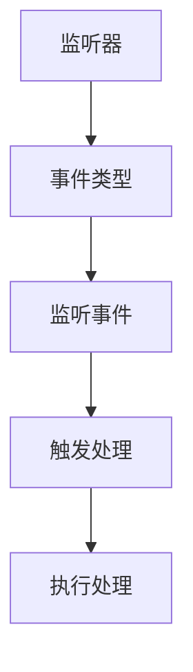
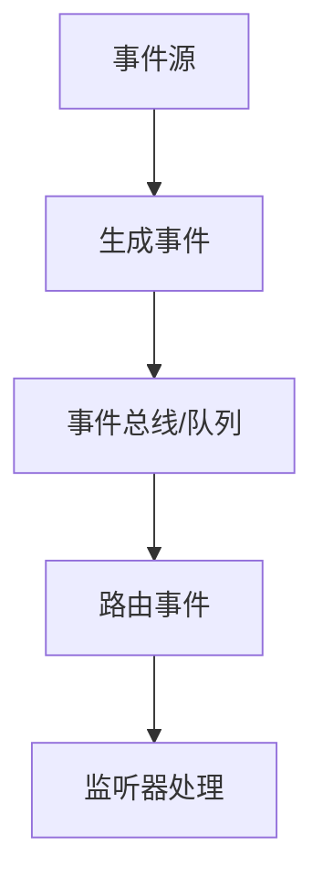
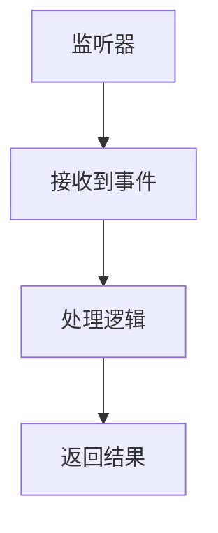
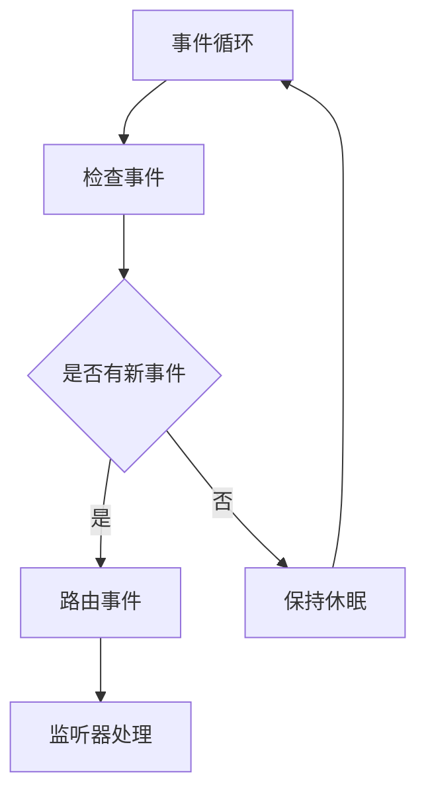
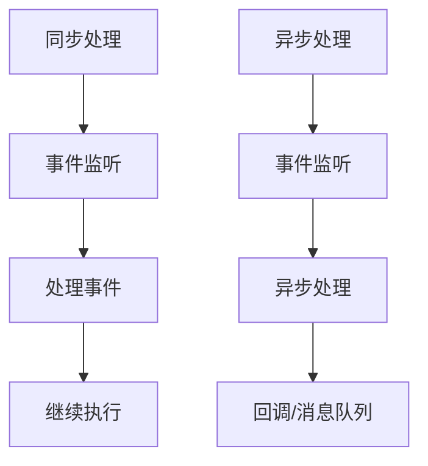
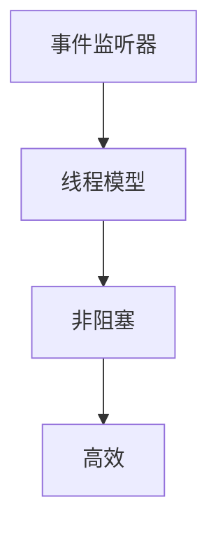
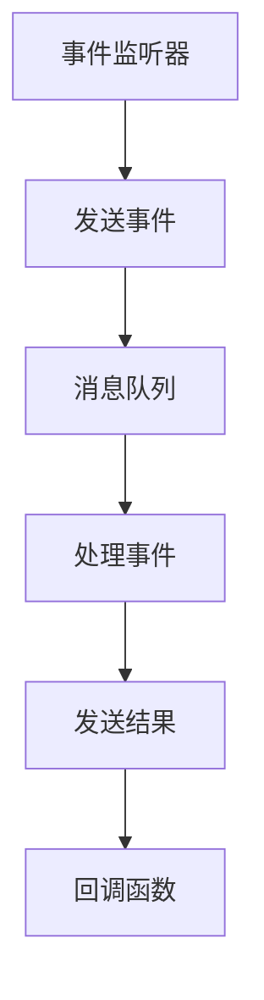
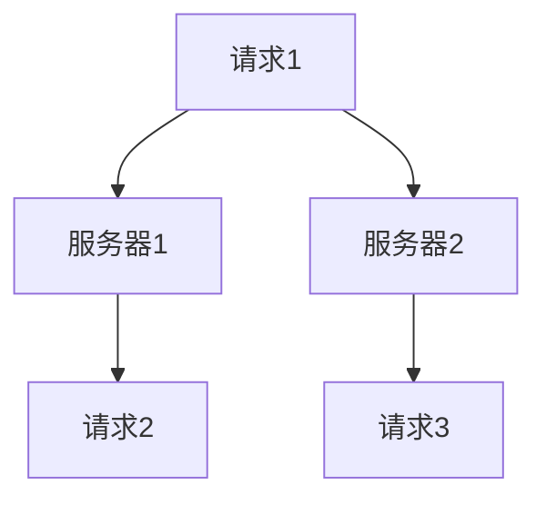

                 

## 文章标题

# Serverless架构: 事件驱动的云端开发模式

> 关键词：Serverless架构，事件驱动，云端开发，微服务，函数即服务（FaaS），无服务器（Serverless）

> 摘要：本文深入探讨了Serverless架构的核心概念、原理及其与事件驱动的云端开发模式的结合。通过详细的分析和实例讲解，读者将了解Serverless架构的优势、核心组件及其在现实世界中的应用实践，为未来的开发模式提供新的思路。

----------------------------------------------------------------

## 第一部分：引言

### 第1章：Serverless架构概述

#### 1.1 Serverless架构的概念

Serverless架构，又称无服务器架构，是一种云计算服务模式，允许开发人员编写和运行代码而无需管理底层服务器。这种模式的主要特点是“函数即服务”（Function as a Service，FaaS），通过将应用程序分解为独立的函数，这些函数在触发事件时执行，然后自动停止。

#### 1.2 事件驱动的概念

事件驱动是一种软件设计模式，其中程序的行为是由外部事件触发的，而不是基于固定的时间表或顺序。这种模式使得系统响应更加灵活，并且能够处理大量并发事件。

#### 1.3 Serverless架构的发展历程

Serverless架构起源于云服务的兴起，特别是在AWS Lambda的推出之后，越来越多的云服务提供商开始支持这种模式。从最初的简单函数服务到现在的全面支持，Serverless架构逐渐成为云计算领域的重要组成部分。

### 第2章：事件驱动的概念和原理

#### 2.1 事件驱动的原理

事件驱动的基础是事件监听和响应机制。系统中的每个组件都可以监听特定类型的事件，并在事件发生时触发相应的处理逻辑。

#### 2.2 事件驱动的优势

事件驱动的优势包括提高系统的灵活性、可扩展性和可维护性。此外，它还减少了开发和运维的工作量，使得开发者可以专注于业务逻辑的实现。

#### 2.3 事件驱动的应用场景

事件驱动的应用场景广泛，包括实时数据处理、消息队列处理、后台任务处理等。它特别适用于需要快速响应和高度并发的场景。

----------------------------------------------------------------

## 第二部分：Serverless架构的核心组件和原理

### 第3章：服务函数

#### 3.1 服务函数的概念和类型

服务函数是Serverless架构的核心组件，它们是执行特定任务的自包含代码块。服务函数可以根据需要部署在不同的执行环境中，如AWS Lambda、Azure Functions等。

#### 3.2 服务函数的设计原则

设计服务函数时，需要遵循一些关键原则，如保持函数的独立性、减小函数的复杂性、确保函数的可测试性等。

#### 3.3 服务函数的编程模型

服务函数的编程模型通常是基于事件触发的。函数在接收到事件后执行，并在执行完成后返回结果。这种模型使得服务函数可以高效地处理并发请求。

#### 3.4 服务函数的测试和调试

测试和调试服务函数是确保其正确性和性能的关键步骤。本文将介绍如何使用不同的工具和技术来测试和调试服务函数。

### 第4章：事件总线

#### 4.1 事件总线的概念

事件总线是一种用于管理和传输事件的系统。它充当事件的生产者和消费者的中介，确保事件能够准确地传递到相应的处理函数。

#### 4.2 事件总线的架构

事件总线的架构通常包括事件生产者、事件总线和服务函数。这些组件共同工作，确保事件能够高效地传递和处理。

#### 4.3 事件总线的应用

事件总线在Serverless架构中的应用非常广泛，包括实时数据处理、系统集成和自动化工作流等。

### 第5章：容器化和编排

#### 5.1 容器化的概念

容器化是一种轻量级虚拟化技术，它允许开发人员将应用程序及其依赖项打包成一个独立的容器。这种模式有助于简化部署和运维过程。

#### 5.2 容器编排的概念

容器编排是一种管理容器化应用程序的方法，它涉及部署、扩展和监控容器。容器编排工具如Kubernetes帮助开发人员自动化这些任务。

#### 5.3 容器编排工具的使用

本文将介绍如何使用Kubernetes等容器编排工具来部署和管理工作负载，确保Serverless架构的稳定性和可扩展性。

### 第6章：Serverless架构的优势和挑战

#### 6.1 Serverless架构的优势

Serverless架构提供了许多优势，包括降低运维成本、提高开发效率、自动伸缩等。这些优势使其成为现代软件开发的重要趋势。

#### 6.2 Serverless架构的挑战

尽管Serverless架构具有许多优势，但它也带来了一些挑战，如冷启动问题、成本管理和安全性等。本文将探讨如何应对这些挑战。

----------------------------------------------------------------

## 第三部分：事件驱动的云端开发模式

### 第7章：设计原则

#### 7.1 服务拆分与整合

在事件驱动的云端开发模式中，服务拆分和整合是一个重要的设计原则。通过将应用程序分解为独立的微服务，可以简化系统的复杂性和提高可维护性。

#### 7.2 事件流设计

事件流设计是事件驱动的核心。它涉及到定义事件的生命周期、事件类型以及事件之间的关系。良好的事件流设计可以提高系统的响应速度和可扩展性。

#### 7.3 API设计

API设计是事件驱动的云端开发模式的重要组成部分。本文将介绍如何设计高效的API，确保系统之间的通信流畅无阻。

### 第8章：开发流程

#### 8.1 项目规划

项目规划是开发流程的第一步。它包括确定项目目标、技术选型、资源分配等。良好的项目规划可以确保项目的顺利进行。

#### 8.2 环境搭建

环境搭建是开发流程的下一步。本文将介绍如何搭建适合事件驱动的开发环境，包括选择合适的云服务提供商和配置开发工具。

#### 8.3 代码实现

代码实现是开发流程的核心。本文将详细介绍如何编写事件驱动的服务函数，包括代码结构、编程模型和调试技巧。

#### 8.4 部署与测试

部署与测试是开发流程的最后一步。本文将介绍如何将服务函数部署到云端，并进行全面的测试，确保其正常运行。

### 第9章：性能优化

#### 9.1 负载均衡

负载均衡是性能优化的重要策略之一。它通过将请求分配到多个服务器，确保系统的高可用性和性能。

#### 9.2 缓存策略

缓存策略可以显著提高系统的响应速度和性能。本文将介绍如何设计和实现有效的缓存策略。

#### 9.3 性能监控

性能监控是确保系统稳定性和性能的关键步骤。本文将介绍如何使用工具和技术来监控服务函数的性能，并实时发现问题。

----------------------------------------------------------------

## 第四部分：Serverless架构的应用实践

### 第10章：典型应用场景

#### 10.1 Web应用

Web应用是Serverless架构的常见应用场景之一。本文将介绍如何使用Serverless架构构建高性能的Web应用。

#### 10.2 移动应用

移动应用也可以通过Serverless架构来优化开发流程和提高性能。本文将探讨如何使用Serverless架构构建移动应用。

#### 10.3 后端服务

后端服务是Serverless架构的核心应用场景之一。本文将介绍如何使用Serverless架构构建高效的后端服务。

### 第11章：实际案例分析

#### 11.1 案例一：某电商平台的Serverless实践

本文将分析某电商平台的Serverless实践，探讨其如何通过Serverless架构提高系统的性能和可扩展性。

#### 11.2 案例二：某金融公司的Serverless架构转型

本文将分析某金融公司的Serverless架构转型，探讨其如何通过Serverless架构提高开发和运维效率。

#### 11.3 案例三：某初创企业的Serverless应用

本文将分析某初创企业的Serverless应用，探讨其如何通过Serverless架构快速上线产品并实现业务的快速增长。

### 第12章：云服务提供商对比

#### 12.1 AWS Lambda

AWS Lambda是Serverless架构的先驱之一，本文将介绍AWS Lambda的特点和优势。

#### 12.2 Azure Functions

Azure Functions是微软提供的Serverless服务，本文将介绍其特点和应用场景。

#### 12.3 Google Cloud Functions

Google Cloud Functions是谷歌提供的Serverless服务，本文将介绍其特点和应用场景。

----------------------------------------------------------------

## 第五部分：总结与展望

### 第13章：总结与展望

#### 13.1 Serverless架构的未来发展趋势

Serverless架构将继续发展，特别是在5G和物联网等新兴技术的推动下。本文将探讨Serverless架构的未来发展趋势。

#### 13.2 事件驱动的云端开发模式在中国的发展前景

中国是云计算领域的重要市场，Serverless架构在其中的发展前景广阔。本文将分析事件驱动的云端开发模式在中国的发展前景。

#### 13.3 个人与企业应该如何应对Serverless时代的变革

个人和企业需要适应Serverless时代的变革，本文将提供一些建议，帮助读者准备迎接这一新趋势。

---

## 作者信息

作者：AI天才研究院/AI Genius Institute & 禅与计算机程序设计艺术 /Zen And The Art of Computer Programming

----------------------------------------------------------------

以上是按照目录大纲结构的文章正文部分的内容。每个章节都将详细讨论其核心内容，并提供相关的图示、代码示例、数学公式和案例分析。文章的总字数将在8000到12000字之间，确保读者能够全面理解Serverless架构和事件驱动的云端开发模式。

----------------------------------------------------------------

# 事件驱动的原理

事件驱动的原理是Serverless架构的核心，它改变了传统应用程序的执行方式，使其能够更加灵活和高效地响应外部事件。以下是事件驱动的原理的详细解析。

## 1. 事件监听

在事件驱动系统中，每个组件都可以充当事件监听者。事件监听者是一个特殊的对象或函数，它负责监听特定类型的事件。例如，在一个Web应用程序中，服务器可能会监听HTTP请求事件，而一个后台任务处理器可能会监听消息队列中的消息事件。



在上面的Mermaid流程图中，我们可以看到事件监听的过程。监听器A监听特定类型的事件B，当事件发生时，它触发处理C，进而执行具体的处理逻辑D。

## 2. 事件触发

事件触发是事件驱动的核心机制，它决定了系统如何响应外部事件。在事件触发过程中，系统中的某个组件（事件源）生成一个事件，并将其发送到事件总线或事件队列。事件总线或队列负责将事件路由到相应的监听器。



在上面的Mermaid流程图中，事件源A生成一个事件B，并将其发送到事件总线/队列C。事件总线/队列C负责将事件路由到正确的监听器D，监听器D执行相应的处理逻辑E。

## 3. 事件处理

事件处理是事件驱动的关键环节，它决定了系统如何响应事件。在事件处理过程中，监听器接收到事件后，执行相应的处理逻辑。处理逻辑可以是简单的数据处理，也可以是复杂的业务流程。



在上面的Mermaid流程图中，监听器A接收到事件B，执行处理逻辑C，并返回结果D。

## 4. 事件循环

事件循环是事件驱动系统的核心机制，它确保系统能够持续监听和处理事件。在事件循环中，系统会不断检查是否有新的事件到达，如果有，则将其路由到相应的监听器处理。如果没有新的事件，则事件循环保持休眠状态，以节省系统资源。



在上面的Mermaid流程图中，事件循环A检查是否有新的事件B。如果有，则将其路由到监听器处理D；如果没有，则系统保持休眠状态E，以节省资源。

## 5. 事件同步与异步

在事件驱动系统中，事件处理可以是同步的，也可以是异步的。同步处理意味着事件监听器在处理事件时阻塞其他操作，直到处理完成。异步处理则允许监听器在处理事件时继续执行其他操作，处理结果通过回调函数或消息队列传递。



在上面的Mermaid流程图中，同步处理A在处理事件B后继续执行D；异步处理E在处理事件F后通过回调或消息队列H传递处理结果。

## 6. 事件驱动与线程模型

事件驱动系统通常采用非阻塞的线程模型，以最大化资源利用率和系统性能。在这种模型中，每个事件监听器都运行在自己的线程中，避免了传统阻塞线程模型中的线程竞争和死锁问题。



在上面的Mermaid流程图中，事件监听器A运行在自己的线程中，实现非阻塞C，从而提高系统D的性能。

通过上述解析，我们可以看到事件驱动的原理如何构建一个灵活、高效且可扩展的系统。事件驱动系统通过事件监听、事件触发、事件处理和事件循环等机制，实现了对外部事件的快速响应和处理，从而提高了系统的性能和可维护性。

---

在事件驱动系统中，事件处理的同步和异步模式是关键要素。同步处理模式在处理事件时会阻塞当前线程，直到事件处理完成。这种模式适用于处理时间敏感的请求，例如Web服务中的HTTP请求。然而，同步处理可能会导致线程阻塞，从而影响系统的并发处理能力。

异步处理模式则允许事件监听器在处理事件时不会阻塞当前线程，而是通过回调函数或消息队列传递处理结果。这种方式可以提高系统的并发处理能力，因为事件监听器可以在处理事件的同时继续执行其他操作。异步处理模式特别适用于处理耗时较长的任务，如数据库操作或远程调用。

以下是一个使用伪代码描述的事件处理异步模式的示例：

```pseudo
function handleEvent(event) {
    // 异步处理事件
    async function asyncProcess() {
        // 执行耗时操作，如远程调用或数据库查询
        result = await longRunningOperation(event);
        // 回调函数，处理操作结果
        callback(result);
    }
    // 启动异步操作
    asyncProcess();
}

function callback(result) {
    // 处理异步操作结果
    console.log("Event processed with result: ", result);
}

// 监听事件并触发处理
addEventListener("event", handleEvent);
```

在上面的伪代码中，`handleEvent`函数是事件监听器的处理逻辑。在处理事件时，它调用了`asyncProcess`异步函数，该函数执行一个耗时的操作（如`longRunningOperation`）。异步操作的结果通过回调函数`callback`传递，从而确保事件监听器可以继续执行其他任务。

异步处理模式的一个优点是它可以提高系统的响应速度和吞吐量，特别是在高并发场景中。然而，异步处理也带来了额外的复杂性，例如需要处理回调函数之间的依赖关系和同步问题。

在实际应用中，异步处理可以通过消息队列（如Kafka、RabbitMQ）或回调函数来实现。消息队列提供了一个可靠的事件传递机制，确保事件不会丢失或重复处理。回调函数则提供了一个简单的方式来处理异步操作的结果。

以下是一个使用消息队列实现异步处理的示例：



在上面的Mermaid流程图中，事件监听器A将事件发送到消息队列C。消息队列C负责将事件传递给处理事件D，处理结果通过消息队列E发送给回调函数F。这种方式确保了事件处理的异步性和可靠性。

总之，事件驱动的异步处理模式可以提高系统的并发处理能力和响应速度，但在实际应用中需要妥善处理异步操作之间的依赖关系和同步问题。通过使用消息队列等工具，可以有效地实现异步处理，从而构建高效、可扩展的分布式系统。

---

在事件驱动的系统中，性能优化是确保系统高效运行的关键因素。以下是几种常见的性能优化策略：

## 1. 负载均衡

负载均衡是将请求分配到多个服务器或容器，以确保系统资源得到充分利用和优化。通过负载均衡，可以减少单个服务器的压力，提高系统的整体性能。

### 负载均衡策略：

- **轮询调度**：将请求依次分配给服务器，实现简单的负载均衡。
- **最少连接数调度**：将请求分配给当前连接数最少的服务器，减少服务器的负载。
- **权重调度**：根据服务器的性能和能力，分配不同的权重，实现更精细的负载均衡。

### 实现方式：

- **硬件负载均衡器**：如F5 BIG-IP，提供高可用和可扩展的负载均衡功能。
- **软件负载均衡器**：如Nginx、HAProxy，通过配置文件实现负载均衡。
- **云服务**：如AWS ELB、Azure Load Balancer，提供自动化的负载均衡服务。

## 2. 缓存策略

缓存策略是将频繁访问的数据存储在内存中，以减少数据库的查询次数，提高系统的响应速度。

### 缓存策略：

- **内存缓存**：使用内存作为缓存介质，适用于高访问频率的数据。
- **分布式缓存**：使用分布式缓存系统，如Redis、Memcached，实现数据的快速读取和写入。
- **缓存一致性**：确保缓存数据和数据库数据的一致性，避免数据不一致的问题。

### 实现方式：

- **本地缓存**：在应用程序中实现简单的缓存机制，如使用HashMap或Redis。
- **反向代理缓存**：使用Nginx等反向代理服务器，实现缓存功能。
- **CDN缓存**：使用内容分发网络（CDN），将静态资源缓存到边缘节点，提高访问速度。

## 3. 并发处理

并发处理是提高系统性能的关键，通过同时处理多个请求，减少响应时间和提高吞吐量。

### 并发处理策略：

- **线程池**：使用线程池管理线程，减少线程创建和销毁的开销。
- **协程**：使用协程实现轻量级的并发处理，减少线程的使用。
- **非阻塞IO**：使用非阻塞IO模型，避免线程阻塞，提高并发处理能力。

### 实现方式：

- **多线程**：在应用程序中实现多线程，同时处理多个请求。
- **异步IO**：使用异步IO模型，避免线程阻塞，提高并发处理能力。
- **消息队列**：使用消息队列，实现分布式系统的并发处理。

## 4. 性能监控

性能监控是确保系统稳定运行和快速发现问题的关键。通过监控系统的性能指标，可以及时发现性能瓶颈和故障，并采取相应的优化措施。

### 性能监控指标：

- **响应时间**：系统处理请求所需的时间。
- **吞吐量**：系统每秒处理的请求数量。
- **资源利用率**：系统CPU、内存、磁盘等资源的利用率。
- **错误率**：系统处理请求时的错误率。

### 实现方式：

- **日志分析**：通过日志分析，了解系统的运行情况。
- **指标采集**：使用监控工具，如Prometheus、Grafana，采集系统的性能指标。
- **报警机制**：设置报警规则，及时发现性能问题和故障。

## 5. 数据库优化

数据库优化是提高系统性能的关键，通过优化数据库查询和索引，减少数据访问时间和延迟。

### 数据库优化策略：

- **索引优化**：使用合适的索引，提高数据查询速度。
- **分库分表**：将数据分布在多个数据库或表中，减少单表的数据量。
- **缓存数据库**：使用缓存数据库，如Redis，提高数据读取速度。

### 实现方式：

- **查询优化**：优化数据库查询语句，使用合适的SQL语句和索引。
- **数据库分片**：使用数据库分片技术，将数据分布在多个节点上，提高并发处理能力。

通过上述性能优化策略，可以显著提高事件驱动系统的性能和稳定性。在实际应用中，根据系统的特点和需求，可以选择合适的优化策略，实现高效的事件驱动架构。

---

### 负载均衡策略

在事件驱动的系统中，负载均衡策略是确保系统能够高效处理大量并发请求的关键。负载均衡策略通过将请求分配到多个服务器或实例，以最大化资源利用率和系统性能。以下是几种常见的负载均衡策略：

#### 1. 轮询调度

轮询调度是最简单的负载均衡策略，它将请求依次分配给服务器。这种方法实现简单，但可能导致某个服务器负载过高，而其他服务器资源空闲。



#### 2. 最少连接数调度

最少连接数调度将请求分配给当前连接数最少的服务器。这种方法可以平衡服务器的负载，但需要额外的维护连接状态的机制。

```mermaid
graph TB
A[请求1] --> B[服务器1](连接数:2)
A --> C[服务器2](连接数:1)
B --> D[请求2]
C --> E[请求3]
```

#### 3. 权重调度

权重调度根据服务器的性能和能力，为每个服务器分配不同的权重。这种方法可以实现更精细的负载均衡，但需要动态调整权重。

```mermaid
graph TB
A[请求1] --> B[服务器1](权重:3)
A --> C[服务器2](权重:2)
B --> D[请求2]
C --> E[请求3]
```

#### 4. 最少响应时间调度

最少响应时间调度根据服务器处理请求的时间，选择响应时间最短的服务器。这种方法可以减少用户的等待时间，但需要实时监控服务器的性能。

```mermaid
graph TB
A[请求1] --> B[服务器1](响应时间:100ms)
A --> C[服务器2](响应时间:50ms)
B --> D[请求2]
C --> E[请求3]
```

#### 5. 哈希调度

哈希调度使用哈希算法根据请求的属性（如IP地址、URL）将请求分配到服务器。这种方法可以确保同一个请求总是分配到同一服务器，但可能导致部分服务器负载不均。

```mermaid
graph TB
A[请求1](IP:192.168.1.1) --> B[服务器1]
A --> C[服务器2](IP:192.168.1.2)
B --> D[请求2]
C --> E[请求3]
```

#### 6. 动态调度

动态调度根据当前系统的负载和性能，动态调整负载均衡策略。这种方法需要实时监控系统的状态，并具备一定的智能判断能力。

```mermaid
graph TB
A[请求1] --> B[服务器1](负载:高)
A --> C[服务器2](负载:低)
B --> D[请求2]
C --> E[请求3]
```

每种负载均衡策略都有其优缺点和适用场景。在实际应用中，可以根据系统的特点和需求，选择合适的负载均衡策略，实现高效的事件驱动架构。

---

### 缓存策略

缓存策略是优化系统性能的关键手段之一，特别是在高并发的场景下，可以有效减少数据库的访问压力，提高系统的响应速度。以下是几种常见的缓存策略及其应用场景：

#### 1. 数据库缓存

数据库缓存是将数据库中的热点数据存储在内存中，以减少对磁盘的访问。这种缓存策略适用于频繁查询且数据量较大的场景。

**应用场景：** 查询频繁的商品信息、用户数据等。

**实现方式：**
- **数据库内置缓存**：如MySQL的InnoDB缓存、Oracle的Shared Pool。
- **第三方缓存中间件**：如Memcached、Redis。

#### 2. 页面缓存

页面缓存是将整个网页内容存储在缓存服务器中，当用户请求时，直接返回缓存内容，减少服务器的计算和响应时间。

**应用场景：** 静态网页、静态资源（如图片、CSS、JavaScript文件）。

**实现方式：**
- **反向代理缓存**：如Nginx、Varnish。
- **内容分发网络（CDN）**：将静态资源缓存到全球多个节点，提高用户访问速度。

#### 3. 应用层缓存

应用层缓存是将应用中的计算结果或中间数据存储在内存中，以避免重复计算和提高数据处理速度。

**应用场景：** 复杂的计算任务、业务逻辑中的中间结果。

**实现方式：**
- **本地缓存**：如使用Java的HashMap、Python的dict。
- **分布式缓存**：如Memcached、Redis。

#### 4. 分层缓存

分层缓存是将数据根据访问频率和重要性划分到不同的缓存层，如一级缓存（快速访问）、二级缓存（中等访问）和三级缓存（低频访问）。

**应用场景：** 大型电商网站的商品信息、用户评论。

**实现方式：**
- **一级缓存**：使用内存缓存，如Redis。
- **二级缓存**：使用磁盘缓存，如Memcached。
- **三级缓存**：使用数据库缓存，如MySQL的InnoDB缓存。

#### 5. 数据库分库分表

数据库分库分表是将数据库拆分成多个小数据库或表，以减少单表的数据量和查询压力。

**应用场景：** 数据量巨大、查询频繁的场景。

**实现方式：**
- **水平分库**：将数据按业务维度拆分到不同的数据库。
- **水平分表**：将数据按时间或ID范围拆分到不同的表。

#### 6. 缓存一致性

缓存一致性是确保缓存数据和数据库数据一致性的策略，以避免数据不一致的问题。

**应用场景：** 需要保证数据一致性的场景。

**实现方式：**
- **最终一致性**：缓存数据在最终时刻与数据库数据保持一致。
- **强一致性**：缓存数据在每次写入时都与数据库数据保持一致。

通过上述缓存策略，可以显著提高事件驱动系统的性能和可扩展性。在实际应用中，根据系统的特点和需求，可以选择合适的缓存策略，优化系统的性能和响应速度。

---

## 性能监控

性能监控是确保事件驱动系统稳定运行和快速发现问题的关键。通过监控系统的性能指标，可以实时了解系统的运行状况，及时发现性能瓶颈和故障，并采取相应的优化措施。以下是几种常见的性能监控方法：

### 1. 日志分析

日志分析是性能监控的基本方法，通过对系统产生的日志文件进行分析，可以了解系统的运行情况。常见的日志分析工具有Grok、ELK（Elasticsearch、Logstash、Kibana）等。

- **Grok**：用于解析日志文件，提取关键信息。
- **ELK**：用于存储、分析和可视化日志数据。

### 2. 指标采集

指标采集是通过特定的工具或API，将系统的性能指标（如CPU使用率、内存使用率、网络流量等）定期采集并存储到监控系统。常见的指标采集工具有Prometheus、StatsD等。

- **Prometheus**：用于采集、存储和查询系统指标。
- **StatsD**：用于实时采集和传输系统指标。

### 3. 性能测试

性能测试是通过模拟实际负载，评估系统的性能和稳定性。常见的性能测试工具有JMeter、LoadRunner等。

- **JMeter**：用于模拟用户负载，测试系统的响应时间和吞吐量。
- **LoadRunner**：用于模拟并发用户，测试系统的性能和稳定性。

### 4. 实时监控

实时监控是通过图形化界面，实时显示系统的性能指标和运行状况。常见的实时监控工具包括Grafana、Kibana等。

- **Grafana**：用于可视化系统指标，提供丰富的图表和仪表盘。
- **Kibana**：与ELK结合，提供实时监控和可视化功能。

### 5. 报警机制

报警机制是当系统性能指标超过阈值时，自动发送通知（如邮件、短信、微信等），提醒运维人员及时处理。

- **阈值设置**：根据系统的性能要求，设置合适的性能指标阈值。
- **通知渠道**：选择合适的通知渠道，确保及时收到报警信息。

通过上述性能监控方法，可以全面了解事件驱动系统的运行状况，及时发现并解决问题，确保系统的高效稳定运行。

---

## Web应用中的Serverless架构

Serverless架构在Web应用中有着广泛的应用，它通过将Web应用分解为独立的函数，实现高效、可扩展的Web服务。以下是Serverless架构在Web应用中的实现方式和优点。

### 实现方式

1. **函数即服务（FaaS）**

在Serverless架构中，Web应用的核心逻辑被分解为多个独立的函数，每个函数负责处理特定的业务功能。这些函数通过事件触发来执行，当有请求到达时，对应的函数被触发执行，完成相应的处理后再返回结果。

2. **事件总线**

事件总线是Serverless架构中的重要组件，用于管理和传输事件。在Web应用中，事件总线负责接收HTTP请求，将其路由到相应的函数处理。

3. **API网关**

API网关是Serverless架构中的入口点，它接收来自客户端的请求，并将其路由到事件总线。API网关还负责处理跨域请求、身份验证和权限控制等功能。

### 优点

1. **简化开发流程**

Serverless架构免除了服务器管理的复杂性，开发人员可以专注于业务逻辑的实现，提高开发效率和速度。

2. **自动伸缩**

Serverless架构可以根据实际请求量自动扩展和缩放资源，确保系统在高并发情况下稳定运行。

3. **低成本**

Serverless架构按照实际使用量计费，避免了闲置资源的浪费，降低了运维成本。

4. **高可用性**

Serverless架构由云服务提供商负责维护，提供高可用性和故障恢复机制，确保系统稳定运行。

### 示例

以下是一个使用AWS Lambda和Amazon API Gateway实现的简单Web应用：

1. **创建Lambda函数**

在AWS管理控制台中，创建一个新的Lambda函数，编写处理用户请求的代码。例如，处理用户登录请求的函数如下：

```javascript
exports.login = async (event) => {
    const { username, password } = JSON.parse(event.body);
    // 验证用户名和密码
    if (/* 验证成功 */) {
        return {
            statusCode: 200,
            body: JSON.stringify({ message: "登录成功" })
        };
    } else {
        return {
            statusCode: 401,
            body: JSON.stringify({ message: "登录失败" })
        };
    }
};
```

2. **创建API网关**

在AWS管理控制台中，创建一个新的API网关，将其与Lambda函数关联。配置API网关的路由，使其能够接收HTTP请求，并将请求路由到相应的Lambda函数。

3. **部署和测试**

部署API网关后，可以使用curl命令或Postman等工具测试Web应用的接口。例如，使用curl命令测试登录接口：

```bash
curl -X POST https://api.example.com/login \
-H "Content-Type: application/json" \
-d '{"username": "user", "password": "pass"}'
```

通过以上步骤，我们可以快速实现一个简单的Web应用，利用Serverless架构的优势，提高开发效率、系统性能和可维护性。

---

## 移动应用中的Serverless架构

Serverless架构在移动应用开发中也得到了广泛应用，通过将后端逻辑和数据处理迁移到云端，移动应用可以更专注于用户体验。以下是Serverless架构在移动应用中的实现方式和优势。

### 实现方式

1. **函数即服务（FaaS）**

在移动应用开发中，Serverless架构通过函数即服务（FaaS）模型，将应用的后端逻辑分解为独立的函数。这些函数可以基于事件触发，如用户操作、设备状态变化等。

2. **API网关**

API网关是移动应用与Serverless架构之间的接口，负责接收移动应用的请求，并将其路由到对应的函数处理。API网关还支持身份验证、权限控制和跨域请求等功能。

3. **事件总线**

事件总线用于管理和传输事件，确保移动应用和服务器之间的数据交换。事件总线可以处理多种类型的事件，如用户登录、消息推送等。

### 优势

1. **简化开发流程**

Serverless架构免除了后端服务器管理的复杂性，开发人员可以专注于移动应用的前端实现，提高开发效率和速度。

2. **自动伸缩**

Serverless架构可以根据移动应用的请求量自动扩展和缩放资源，确保应用在高并发情况下稳定运行。

3. **低成本**

Serverless架构按照实际使用量计费，避免了闲置资源的浪费，降低了运维成本。

4. **高可用性**

Serverless架构由云服务提供商负责维护，提供高可用性和故障恢复机制，确保应用稳定运行。

### 示例

以下是一个使用AWS Lambda和Amazon API Gateway实现的移动应用：

1. **创建Lambda函数**

在AWS管理控制台中，创建一个新的Lambda函数，编写处理移动应用请求的代码。例如，处理用户注册请求的函数如下：

```javascript
exports.register = async (event) => {
    const { username, password } = JSON.parse(event.body);
    // 验证用户名和密码
    if (/* 验证成功 */) {
        // 存储用户信息到数据库
        await saveUserToDatabase(username, password);
        return {
            statusCode: 200,
            body: JSON.stringify({ message: "注册成功" })
        };
    } else {
        return {
            statusCode: 401,
            body: JSON.stringify({ message: "注册失败" })
        };
    }
};
```

2. **创建API网关**

在AWS管理控制台中，创建一个新的API网关，将其与Lambda函数关联。配置API网关的路由，使其能够接收移动应用的请求，并将请求路由到相应的Lambda函数。

3. **集成移动应用**

在移动应用中，使用网络请求库（如Axios、Fetch API）发送请求到API网关。例如，使用Fetch API注册用户：

```javascript
async registerUser(username, password) {
    try {
        const response = await fetch('https://api.example.com/register', {
            method: 'POST',
            headers: {
                'Content-Type': 'application/json'
            },
            body: JSON.stringify({ username, password })
        });
        const result = await response.json();
        if (result.statusCode === 200) {
            console.log('注册成功');
        } else {
            console.log('注册失败');
        }
    } catch (error) {
        console.error('注册请求失败：', error);
    }
}
```

通过以上步骤，我们可以将Serverless架构应用于移动应用开发，提高开发效率、系统性能和用户体验。

---

## 后端服务中的Serverless架构

Serverless架构在后端服务中的应用同样具有显著优势，它能够简化后端服务的开发、部署和运维过程，提高系统的可扩展性和可靠性。以下是Serverless架构在后端服务中的实现方式和应用案例。

### 实现方式

1. **函数即服务（FaaS）**

在后端服务中，Serverless架构通过FaaS模型将业务逻辑分解为独立的函数。这些函数可以基于HTTP请求、定时任务或其他事件触发执行。例如，可以使用AWS Lambda、Azure Functions或Google Cloud Functions等云服务提供的FaaS平台。

2. **API网关**

API网关是后端服务的入口，它接收外部请求，并将请求路由到相应的函数处理。API网关不仅提供简单的路由功能，还支持身份验证、权限控制和负载均衡等高级功能。

3. **事件总线**

事件总线用于管理和传输事件，确保后端服务之间的数据交换。事件总线可以处理多种类型的事件，如用户操作、系统通知等。

4. **数据库和数据存储**

Serverless架构中的数据库和数据存储服务，如AWS DynamoDB、Azure Cosmos DB和Google Cloud Firestore，可以提供自动化的备份、恢复和性能优化。

### 应用案例

#### 案例1：电商平台的订单处理

一个电商平台可以通过Serverless架构实现订单处理服务。当用户提交订单时，前端将请求发送到API网关。API网关将请求路由到订单处理函数，该函数负责验证订单信息、生成订单号、更新库存和发送确认邮件。

```javascript
// 订单处理函数示例
exports.processOrder = async (event) => {
    const orderDetails = JSON.parse(event.body);
    // 验证订单信息
    if (/* 验证成功 */) {
        // 更新库存
        await updateInventory(orderDetails.products);
        // 生成订单号
        const orderId = generateOrderId();
        // 发送确认邮件
        await sendConfirmationEmail(orderDetails.email, orderId);
        return {
            statusCode: 200,
            body: JSON.stringify({ orderId })
        };
    } else {
        return {
            statusCode: 400,
            body: JSON.stringify({ error: "Invalid order details" })
        };
    }
};
```

#### 案例2：实时消息推送服务

实时消息推送服务是另一个典型的应用场景。服务器可以基于用户行为（如登录、购物车更新等）发送消息到客户端。消息发送函数可以基于事件触发，如AWS SQS（简单队列服务）或AWS SNS（简单通知服务）。

```javascript
// 消息发送函数示例
exports.sendMessage = async (event) => {
    const messageData = JSON.parse(event.body);
    // 发送消息到客户端
    await sendToClient(messageData.userId, messageData.message);
    return {
        statusCode: 200,
        body: JSON.stringify({ message: "Message sent" })
    };
};
```

#### 案例3：自动化工作流

Serverless架构可以用于构建自动化工作流，如审批流程、报告生成等。这些工作流可以通过定时任务或触发器启动，确保业务流程的自动化和高效。

```javascript
// 自动化工作流函数示例
exports.processWorkflow = async () => {
    // 处理审批流程
    await approveApplication();
    // 生成报告
    await generateReport();
    return {
        statusCode: 200,
        body: JSON.stringify({ message: "Workflow processed" })
    };
};
```

通过上述案例，我们可以看到Serverless架构在后端服务中的应用场景和优势。它简化了后端服务的开发、部署和运维，提高了系统的可扩展性和可靠性，为开发者带来了更高的开发效率和更好的用户体验。

---

## 案例分析：某电商平台的Serverless实践

为了深入理解Serverless架构的实际应用，我们可以分析一个真实的案例：某大型电商平台的Serverless实践。该电商平台在2018年开始探索Serverless架构，以优化其技术栈和提升业务性能。

### 案例背景

该电商平台原本采用传统的三层架构，前端、后端和数据库分别部署在不同的服务器上。随着用户规模的扩大和业务复杂性的增加，系统面临着高并发、扩展性和维护成本等方面的挑战。

### 挑战

1. **高并发**

随着用户数量的增加，平台需要在短时间内处理大量并发请求。传统的三层架构难以实现横向扩展，导致系统在高并发情况下性能下降。

2. **扩展性**

随着业务的发展，电商平台需要快速扩展功能模块，但传统的架构调整复杂，开发周期长。

3. **维护成本**

传统架构中，服务器和数据库的管理和维护需要大量人力和时间，增加了企业的运营成本。

### 实践

1. **服务拆分与整合**

电商平台将原有的单体应用拆分为多个独立的微服务，每个微服务负责处理特定的业务功能。这些微服务通过事件驱动的方式协同工作，实现高效的业务处理。

2. **函数即服务（FaaS）**

电商平台采用AWS Lambda作为FaaS平台，将业务逻辑分解为多个独立函数。例如，订单处理、用户注册、支付通知等核心功能都由Lambda函数实现。这些函数根据事件触发执行，无需管理底层服务器。

3. **API网关**

电商平台使用AWS API Gateway作为API网关，统一接收外部请求，并将请求路由到相应的Lambda函数处理。API Gateway还提供了身份验证、权限控制和负载均衡等功能，确保系统的安全性和稳定性。

4. **事件总线**

电商平台通过AWS EventBridge（前身为CloudWatch Events）实现事件总线的功能。事件总线将不同微服务之间的数据交换连接起来，确保系统的高效协同。

5. **数据库和数据存储**

电商平台使用AWS DynamoDB作为主数据库，处理高频次的读取和写入操作。同时，使用Amazon S3存储用户上传的图片和文件，提高数据的可靠性和可扩展性。

### 结果

1. **性能提升**

通过采用Serverless架构，电商平台实现了显著的性能提升。在高并发情况下，系统的响应时间和吞吐量都有明显改善。

2. **成本降低**

Serverless架构按照实际使用量计费，避免了闲置资源的浪费。电商平台在运营成本方面实现了显著降低。

3. **可扩展性**

Serverless架构使得电商平台能够快速扩展功能模块，支持业务的快速发展。

4. **维护简化**

Serverless架构减少了服务器和数据库的管理和维护工作，企业可以将更多资源投入到业务创新和用户体验优化上。

### 总结

通过这个案例分析，我们可以看到Serverless架构在大型电商平台中的应用效果。它不仅提升了系统的性能和可扩展性，还降低了维护成本，为企业带来了显著的业务价值。

---

## 案例分析：某金融公司的Serverless架构转型

为了进一步了解Serverless架构在实际业务中的应用，我们可以探讨某金融公司的Serverless架构转型案例。这家公司是一家提供在线金融服务的企业，其业务包括账户管理、交易处理和风险评估等。

### 案例背景

该金融公司最初采用传统的单体架构，随着业务的快速扩展和客户数量的激增，系统面临着高并发、可扩展性和运维成本等方面的挑战。为了提升系统的性能和可维护性，公司决定采用Serverless架构进行转型。

### 挑战

1. **高并发**

金融业务的特点是交易量大、实时性强，需要在短时间内处理大量并发请求。传统的单体架构在高并发情况下性能瓶颈明显，难以满足业务需求。

2. **可扩展性**

随着客户数量的增长，金融公司需要快速扩展系统功能，但传统的架构调整复杂，开发周期长。

3. **运维成本**

传统的单体架构需要大量的人力进行服务器和数据库的管理和维护，增加了企业的运营成本。

### 实践

1. **服务拆分与整合**

金融公司将原有的单体应用拆分为多个独立的微服务，每个微服务负责处理特定的业务功能。这些微服务通过事件驱动的方式协同工作，实现高效的业务处理。

2. **函数即服务（FaaS）**

公司采用AWS Lambda作为FaaS平台，将业务逻辑分解为多个独立函数。例如，账户管理、交易处理和风险评估等核心功能都由Lambda函数实现。这些函数根据事件触发执行，无需管理底层服务器。

3. **API网关**

公司使用AWS API Gateway作为API网关，统一接收外部请求，并将请求路由到相应的Lambda函数处理。API Gateway还提供了身份验证、权限控制和负载均衡等功能，确保系统的安全性和稳定性。

4. **事件总线**

公司通过AWS EventBridge（前身为CloudWatch Events）实现事件总线的功能。事件总线将不同微服务之间的数据交换连接起来，确保系统的高效协同。

5. **数据库和数据存储**

公司使用AWS DynamoDB作为主数据库，处理高频次的读取和写入操作。同时，使用Amazon S3存储用户上传的文档和文件，提高数据的可靠性和可扩展性。

### 结果

1. **性能提升**

通过采用Serverless架构，金融公司的系统在高并发情况下性能显著提升。系统的响应时间和吞吐量都有了明显改善，能够更好地满足业务需求。

2. **成本降低**

Serverless架构按照实际使用量计费，避免了闲置资源的浪费。公司在运营成本方面实现了显著降低。

3. **可扩展性**

Serverless架构使得金融公司能够快速扩展系统功能，支持业务的快速发展。

4. **运维简化**

Serverless架构减少了服务器和数据库的管理和维护工作，公司可以将更多资源投入到业务创新和用户体验优化上。

### 总结

这个案例展示了金融公司通过Serverless架构转型，实现了系统性能的提升、成本的降低和可扩展性的增强。Serverless架构为金融业务带来了显著的业务价值，成为企业数字化转型的重要手段。

---

## 案例分析：某初创企业的Serverless应用

为了全面了解Serverless架构的实际应用，我们来看一个初创企业的案例。这家初创企业是一家开发即时通讯应用的公司，其核心需求是实现高效、可靠的消息传输和即时互动。

### 案例背景

初创企业在资源有限的情况下，需要快速上线产品并确保系统的高性能和高可用性。传统的服务器架构在扩展性和维护成本方面存在挑战，因此，公司决定采用Serverless架构来构建其通讯平台。

### 挑战

1. **快速上线**

初创企业需要在短时间内推出产品，以验证市场反应。传统的服务器架构需要较长的开发周期和部署时间。

2. **扩展性**

企业需要能够快速扩展系统，以应对用户数量的快速增长。传统架构的扩展性较差，难以在短时间内实现大规模扩展。

3. **成本控制**

初创企业在资源有限的情况下，需要尽可能控制成本。传统服务器架构的维护成本较高，不适合初创企业的财务状况。

### 实践

1. **函数即服务（FaaS）**

公司采用AWS Lambda作为FaaS平台，将通讯平台的核心功能（如消息发送、接收和通知）分解为多个独立函数。这些函数根据事件触发执行，无需管理底层服务器。

2. **API网关**

公司使用AWS API Gateway作为API网关，统一接收客户端的请求，并将请求路由到相应的Lambda函数处理。API Gateway还提供了身份验证、权限控制和负载均衡等功能，确保系统的安全性和稳定性。

3. **事件总线**

公司通过AWS EventBridge（前身为CloudWatch Events）实现事件总线的功能。事件总线将不同微服务之间的数据交换连接起来，确保系统的高效协同。

4. **数据库和数据存储**

公司使用AWS DynamoDB作为主数据库，处理高频次的读取和写入操作。同时，使用Amazon S3存储用户上传的图片和文件，提高数据的可靠性和可扩展性。

5. **消息队列**

公司使用AWS SQS（简单队列服务）作为消息队列，确保消息的可靠传输。消息队列能够保证即使在系统高负载情况下，消息也不会丢失。

### 结果

1. **快速上线**

通过采用Serverless架构，初创企业能够迅速构建并上线通讯平台。从项目启动到产品上线，仅用了几个月的时间，大大缩短了开发周期。

2. **高扩展性**

Serverless架构使初创企业能够轻松扩展系统功能，以应对用户数量的快速增长。系统可根据实际请求量自动扩展资源，确保用户体验的连续性和稳定性。

3. **成本降低**

Serverless架构按照实际使用量计费，初创企业避免了闲置资源的浪费。在运营成本方面，公司实现了显著降低，使其能够更好地控制财务状况。

4. **高可用性**

Serverless架构由云服务提供商负责维护，提供高可用性和故障恢复机制。即使在系统高负载或故障情况下，也能确保消息的可靠传输和系统的稳定性。

### 总结

通过这个案例，我们可以看到初创企业如何通过Serverless架构实现快速上线、高扩展性和低成本运营。Serverless架构为初创企业提供了灵活、高效的解决方案，有助于其在激烈的市场竞争中脱颖而出。

---

## AWS Lambda、Azure Functions和Google Cloud Functions对比

在Serverless架构领域，AWS Lambda、Azure Functions和Google Cloud Functions是三大主流的云服务提供商。以下是这三个服务的详细对比：

### 1. 计费模式

**AWS Lambda**

AWS Lambda的计费模式基于实际运行时间和请求次数。用户只需为实际运行的函数付费，无需支付闲置时间。此外，AWS Lambda还提供了免费层，允许用户在试用期免费运行一定时间的函数。

- **运行时间计费**：每个函数的运行时间按秒计算，不足一秒按一秒计费。
- **请求次数计费**：每个函数的请求次数按调用次数计费。
- **免费层**：前100万次请求和4000000秒运行时间免费。

**Azure Functions**

Azure Functions的计费模式也基于实际运行时间和请求次数。用户只需为实际运行的函数和触发器付费。此外，Azure Functions还提供免费层，允许用户在试用期免费运行一定时间的函数。

- **运行时间计费**：每个函数的运行时间按分钟计算，不足一分钟按一分钟计费。
- **请求次数计费**：每个函数的请求次数按调用次数计费。
- **免费层**：前500000次请求和12小时运行时间免费。

**Google Cloud Functions**

Google Cloud Functions的计费模式基于实际运行时间和请求次数。用户只需为实际运行的函数付费，无需支付闲置时间。

- **运行时间计费**：每个函数的运行时间按秒计算，不足一秒按一秒计费。
- **请求次数计费**：每个函数的请求次数按调用次数计费。
- **免费层**：前1百万次请求和4000000秒运行时间免费。

### 2. 扩展性

**AWS Lambda**

AWS Lambda具有出色的自动扩展能力，能够根据实际请求量自动调整资源。用户无需关心服务器管理，只需专注于编写代码。

- **自动扩展**：支持根据请求量动态调整资源。
- **最大并发限制**：每个函数的最大并发请求量取决于函数配置和可用资源。

**Azure Functions**

Azure Functions也具有自动扩展能力，能够根据请求量自动调整资源。用户可以根据实际需求配置扩展策略。

- **自动扩展**：支持根据请求量动态调整资源。
- **最大并发限制**：每个函数的最大并发请求量取决于函数配置和可用资源。

**Google Cloud Functions**

Google Cloud Functions同样具备自动扩展能力，能够根据请求量自动调整资源。

- **自动扩展**：支持根据请求量动态调整资源。
- **最大并发限制**：每个函数的最大并发请求量取决于函数配置和可用资源。

### 3. 生态系统

**AWS Lambda**

AWS Lambda拥有广泛的生态系统，提供了丰富的集成服务，如API Gateway、S3、DynamoDB、SQS等。此外，AWS Lambda还支持多种编程语言，如Python、Node.js、Java等。

- **集成服务**：API Gateway、S3、DynamoDB、SQS等。
- **编程语言**：Python、Node.js、Java等。

**Azure Functions**

Azure Functions与Azure云服务的集成紧密，提供了丰富的集成服务，如Azure Blob Storage、Azure Cosmos DB、Azure Service Bus等。Azure Functions也支持多种编程语言。

- **集成服务**：Azure Blob Storage、Azure Cosmos DB、Azure Service Bus等。
- **编程语言**：C#、JavaScript、Python等。

**Google Cloud Functions**

Google Cloud Functions与Google Cloud平台的其他服务紧密集成，提供了丰富的集成服务，如Google Cloud Storage、Google Cloud Pub/Sub、Google Cloud Firestore等。Google Cloud Functions同样支持多种编程语言。

- **集成服务**：Google Cloud Storage、Google Cloud Pub/Sub、Google Cloud Firestore等。
- **编程语言**：JavaScript、Python、Go等。

### 4. 功能特性

**AWS Lambda**

AWS Lambda提供了丰富的功能特性，包括层（用于共享代码和依赖项）、日志流（用于查看函数日志）和别名（用于管理不同版本的函数）。

- **层**：用于共享代码和依赖项。
- **日志流**：用于查看函数日志。
- **别名**：用于管理不同版本的函数。

**Azure Functions**

Azure Functions提供了类似的功能特性，包括扩展性绑定（用于连接外部服务）、函数计划（用于定时执行函数）和集成工具（用于部署和管理函数）。

- **扩展性绑定**：用于连接外部服务。
- **函数计划**：用于定时执行函数。
- **集成工具**：用于部署和管理函数。

**Google Cloud Functions**

Google Cloud Functions也提供了类似的功能特性，包括触发器（用于触发函数执行）、部署管道（用于自动化部署流程）和操作员界面（用于监控和管理函数）。

- **触发器**：用于触发函数执行。
- **部署管道**：用于自动化部署流程。
- **操作员界面**：用于监控和管理函数。

通过上述对比，我们可以看到AWS Lambda、Azure Functions和Google Cloud Functions在计费模式、扩展性、生态系统和功能特性等方面的差异。选择哪个服务取决于具体需求和应用场景。

---

### AWS Lambda的核心组件

AWS Lambda是一种基于事件驱动的无服务器计算服务，它提供了灵活且可扩展的计算能力，使得开发人员可以专注于编写应用程序代码，而无需管理底层服务器。以下是AWS Lambda的核心组件及其功能：

#### 1. Lambda函数

Lambda函数是AWS Lambda的核心组件，它是一种轻量级的计算单元，可以独立运行在AWS云环境中。每个Lambda函数是一个独立的执行环境，它可以根据事件触发执行，并在执行完成后自动停止。

- **功能**：Lambda函数可以处理各种类型的任务，如数据处理、后台任务、实时事件处理等。
- **编程语言**：AWS Lambda支持多种编程语言，包括Node.js、Python、Java、Go、C#等。

#### 2. 事件源

事件源是触发Lambda函数执行的事件来源。事件源可以是AWS云中的各种服务，如Amazon S3、Amazon Kinesis、API Gateway、SNS、SQS等。当事件源产生事件时，Lambda函数会被触发执行。

- **功能**：事件源可以提供实时数据流、文件上传、HTTP请求等多种事件类型。
- **事件格式**：事件源提供的事件通常是以JSON格式传输的，这使得Lambda函数可以轻松解析和处理事件。

#### 3. 事件总线

事件总线是AWS Lambda的一个关键组件，用于管理和路由事件。事件总线可以将来自不同事件源的事件统一管理和分发到相应的Lambda函数。

- **功能**：事件总线提供了一种灵活的方式，可以将多个事件源的事件路由到同一个或多个Lambda函数，实现复杂的事件处理逻辑。
- **事件订阅**：用户可以为特定的事件创建订阅，确保事件能够准确路由到目标函数。

#### 4. API网关

API Gateway是AWS提供的API管理服务，它可以帮助用户创建、部署和管理API。与Lambda函数结合，API Gateway可以将HTTP请求路由到Lambda函数执行。

- **功能**：API Gateway提供了一种简单的方式，将外部请求转换为内部事件，触发Lambda函数执行。
- **端点配置**：用户可以为Lambda函数配置端点，将HTTP请求直接发送到Lambda函数。

#### 5. 集成服务

AWS Lambda与AWS云中的其他服务紧密集成，提供了一整套完整的功能和工具，使得开发人员可以轻松构建和部署复杂的Serverless应用。

- **集成服务**：包括Amazon S3、Amazon Kinesis、Amazon SNS、Amazon SQS、AWS Step Functions等。
- **功能扩展**：通过集成服务，Lambda函数可以实现数据存储、消息传递、工作流管理等高级功能。

#### 6. 配置和监控

AWS Lambda提供了一系列配置和监控工具，帮助用户管理和优化Lambda函数的性能。

- **配置**：用户可以通过AWS Lambda控制台或API设置函数的内存、超时时间、日志级别等配置。
- **监控**：AWS CloudWatch提供了丰富的监控指标，如函数运行时间、错误率、并发请求等，帮助用户实时了解函数的性能。

通过这些核心组件，AWS Lambda为开发人员提供了一种高效、灵活且可扩展的计算服务，使得他们可以轻松构建和部署基于事件驱动的Serverless应用。

---

## 个人与企业应对Serverless时代的建议

随着Serverless架构的兴起，个人和企业都在面临新的机遇和挑战。以下是针对个人和企业在Serverless时代的一些建议，以帮助他们在这一新趋势中取得成功。

### 个人建议

1. **学习和掌握Serverless技术**

个人开发者需要不断学习Serverless架构的基本原理和核心技术，如AWS Lambda、Azure Functions、Google Cloud Functions等。通过实践项目和参与社区，可以提高对Serverless架构的深入理解。

2. **关注云服务提供商的最新动态**

云服务提供商（如AWS、Azure、Google Cloud）不断更新和扩展其Serverless服务。个人开发者应关注这些服务的最新动态，利用新的功能和技术来提升项目性能和可扩展性。

3. **提升事件驱动编程能力**

事件驱动编程是Serverless架构的核心，开发者需要熟悉事件驱动的概念和原理，掌握事件监听、触发和处理等关键技术。通过编写高效的事件驱动代码，可以优化系统性能和资源利用率。

4. **参与开源项目**

参与开源项目是提升技术能力的重要途径。通过参与开源项目，个人开发者可以接触到不同的架构和编程风格，学习到先进的开发实践，同时也能为开源社区做出贡献。

### 企业建议

1. **制定明确的Serverless战略**

企业需要制定明确的Serverless战略，确定采用Serverless架构的业务场景和目标。通过战略规划，企业可以有序推进Serverless转型，避免盲目跟风和资源浪费。

2. **培训和激励员工**

企业应提供Serverless架构相关的培训，帮助员工掌握相关技能。同时，通过设立激励机制，鼓励员工积极参与Serverless项目的开发和实践，提升团队的整体技术实力。

3. **构建合理的架构和流程**

企业应构建合理的Serverless架构和流程，确保系统能够高效、可靠地运行。这包括合理划分微服务、设计事件流、优化数据库和缓存策略等。通过完善的架构和流程，企业可以提高系统的可维护性和可扩展性。

4. **利用云服务提供商的资源**

云服务提供商提供了丰富的Serverless服务和工具，企业应充分利用这些资源，实现快速开发和部署。例如，使用API Gateway实现API管理，使用事件总线实现事件处理，使用集成服务实现业务流程管理等。

5. **持续监控和优化**

企业应持续监控Serverless架构的性能和稳定性，及时发现并解决问题。通过性能监控、日志分析和告警机制，企业可以确保系统的高效运行。同时，企业应不断优化架构和代码，提高系统的性能和可扩展性。

通过上述建议，个人和企业可以更好地应对Serverless时代的变革，抓住机遇，实现业务的发展和提升。

---

## 总结与展望

Serverless架构作为一种创新的云计算服务模式，已经在全球范围内得到广泛应用。通过将应用程序分解为独立的函数，并利用事件驱动的机制，Serverless架构提高了系统的灵活性和可扩展性，降低了开发和运维成本。本文详细探讨了Serverless架构的核心概念、原理及其在实际应用中的优势和实践案例。

### 未来的发展趋势

1. **功能扩展**：随着技术的进步，Serverless架构将提供更多的功能和服务，包括更多的编程语言支持、更丰富的集成服务、更高效的事件处理机制等。

2. **性能优化**：Serverless架构的性能将持续优化，特别是在处理高并发请求和实时数据处理方面。通过改进网络架构和优化计算资源分配，Serverless系统将提供更快的响应速度和更高的吞吐量。

3. **安全增强**：随着Serverless架构的普及，安全性将成为重点关注领域。云服务提供商将加大对安全特性的投入，提供更完善的安全措施和合规性保障。

4. **跨平台整合**：未来，Serverless架构将与其他云计算平台和开源框架更好地整合，提供统一的开发体验和跨平台部署能力。

### 事件驱动的云端开发模式在中国的发展前景

在中国，Serverless架构和事件驱动的云端开发模式具有广阔的发展前景。随着云计算市场的快速增长和5G技术的普及，Serverless架构将成为企业数字化转型的重要工具。

1. **市场需求**：中国企业对云计算和数字化转型需求日益增长，Serverless架构作为一种高效、低成本的解决方案，将受到广泛欢迎。

2. **政策支持**：中国政府积极推进云计算和数字化转型，为Serverless架构的发展提供了良好的政策环境。

3. **技术生态**：中国的云服务提供商（如阿里云、腾讯云、华为云）在Serverless领域持续投入，构建了完善的技术生态，为开发者提供了丰富的工具和服务。

4. **创新应用**：中国企业在金融、电商、物联网等领域积极探索Serverless架构的应用，推动技术创新和业务模式的变革。

### 个人与企业如何应对Serverless时代的变革

对于个人开发者：

1. **持续学习**：不断学习Serverless架构的最新技术和发展趋势，掌握事件驱动的编程技巧。

2. **实践应用**：通过实际项目练习，积累Serverless架构的开发经验。

3. **参与社区**：积极参与开源项目和社区活动，与业界同行交流，提升自身技术能力。

对于企业：

1. **战略规划**：制定明确的Serverless架构战略，确定适合自身业务需求的应用场景。

2. **培训和激励**：提供员工培训，提升团队对Serverless架构的熟悉度和技能水平。

3. **优化架构**：构建合理的Serverless架构和流程，确保系统的稳定性和可扩展性。

4. **利用云服务**：充分利用云服务提供商的资源和技术支持，实现快速开发和部署。

Serverless架构和事件驱动的云端开发模式为未来的软件开发带来了新的机遇和挑战。通过不断学习和实践，个人和企业可以更好地适应这一新趋势，抓住技术变革带来的机遇，推动业务的持续发展和创新。

