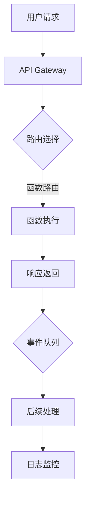
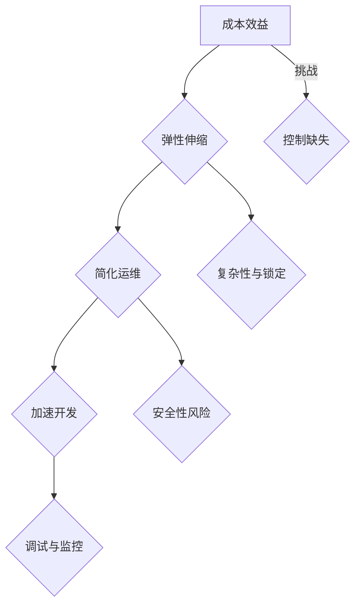
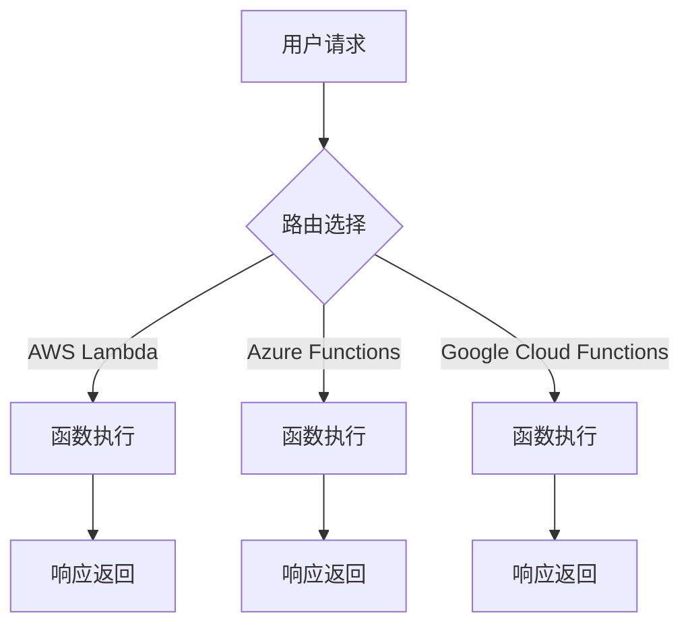

                 


### 文章标题

《Serverless架构：无服务器计算的应用与挑战》

### 文章关键词

Serverless架构，无服务器计算，云计算，应用程序开发，挑战

### 摘要

本文将深入探讨Serverless架构，一种革命性的云计算模型，它允许开发人员专注于编写代码，而无需担心底层基础设施的管理。文章将介绍Serverless架构的核心概念、应用场景、优势与挑战，并详细阐述无服务器框架与工具的使用。此外，文章将通过项目实战，展示如何在实际中构建和优化Serverless应用，并提供最佳实践和注意事项。

### 引言

随着云计算技术的不断发展，开发者们越来越倾向于采用更高效、更灵活的架构来构建应用程序。Serverless架构作为一种新兴的云计算模型，逐渐受到广泛关注。Serverless架构的核心思想是将服务器管理的复杂性转移到云服务提供商，从而使开发者能够专注于应用程序的核心功能。

本文旨在探讨Serverless架构的各个方面，从基本概念到实际应用，再到面临的挑战。我们将通过逐步分析，深入理解Serverless架构的工作原理，优势与劣势，以及如何在实践中有效利用这一技术。

### 第一步：理解Serverless架构

#### 背景介绍

Serverless架构起源于云计算的发展需求。传统云计算模型中，开发者需要购买和管理服务器，配置和优化操作系统、网络和存储资源，这增加了成本和复杂性。Serverless架构的出现，旨在简化这一过程，使开发者能够更专注于应用程序的开发。

Serverless架构的基本概念是，开发者编写和部署代码到云服务提供商提供的无服务器平台上，如AWS Lambda、Azure Functions和Google Cloud Functions。这些平台自动管理底层基础设施，包括服务器、网络和存储资源，开发者无需关心这些细节。

#### 核心概念与联系

Serverless架构的关键组成部分包括：

- **函数即服务（Function as a Service, FaaS）**：这是Serverless架构的核心，开发者只需编写函数并部署到无服务器平台，平台负责运行和管理这些函数。

- **事件驱动模型**：Serverless架构通常采用事件驱动模型，函数的执行是由外部事件触发的。这些事件可以是Web请求、定时任务、文件上传等。

- **基础设施抽象**：Serverless平台提供了对底层基础设施的抽象，开发者无需关心服务器、网络和存储的具体实现。

- **自动扩展**：Serverless平台能够自动根据负载需求进行扩展，确保应用的高可用性和弹性。

以下是一个简化的Mermaid流程图，描述了Serverless架构的基本工作流程：



#### 核心算法原理讲解

以下是一个用于描述函数执行过程的伪代码：

```python
# 伪代码：Serverless函数执行

def handle_request(request):
    # 解析请求
    event = parse_request(request)
    
    # 执行函数
    response = execute_function(event)
    
    # 返回响应
    return send_response(response)
```

在这个伪代码中，`handle_request`函数负责接收用户请求，解析请求并调用`execute_function`执行具体的业务逻辑，最后返回响应。`execute_function`函数根据请求中的事件类型，调用不同的业务处理函数。

#### 数学模型和公式

Serverless架构中的成本计算可以使用以下公式：

$$C = (f_c \times c) + (r_c \times r)$$

其中，$C$是总成本，$f_c$是函数调用费用，$c$是函数调用次数，$r_c$是存储费用，$r$是存储使用量。

#### 详细讲解与举例说明

假设我们有一个Web应用程序，每月有100万次函数调用，平均每次调用需要1毫秒的CPU时间，且每月存储使用量为1GB。根据上述公式，我们可以计算每月的成本：

- 函数调用费用：$f_c = 0.000016 \text{美元/调用}$
- 函数调用次数：$c = 1000000 \text{次}$
- 存储费用：$r_c = 0.026 \text{美元/GB/月}$

$$C = (0.000016 \times 1000000) + (0.026 \times 1) = 16 + 0.026 = 16.026 \text{美元/月}$$

因此，每月的总成本为16.026美元。

### 第二步：无服务器计算的应用场景

#### 背景介绍

无服务器计算在多个领域都有广泛的应用，其灵活性和弹性使其成为许多开发者和企业的首选。以下是一些常见的应用场景：

1. **Web开发**：无服务器计算可以用于构建Web应用程序，通过函数即服务（FaaS）模型，开发者可以轻松实现动态内容、API端点、后台任务等。

2. **移动应用开发**：无服务器计算为移动应用程序提供了后端即服务（BaaS）功能，如用户身份验证、数据存储、推送通知等，无需开发者自行搭建和维护后端基础设施。

3. **物联网（IoT）**：无服务器计算适用于处理来自大量物联网设备的实时数据，可以快速响应设备事件，进行数据分析和处理。

4. **批处理任务**：无服务器计算适合处理大量的批处理任务，如数据清洗、报告生成、图像处理等，可以按需扩展计算资源。

5. **边缘计算**：无服务器计算可以与边缘计算相结合，在靠近数据源的边缘节点上处理数据，降低延迟，提高响应速度。

#### 核心概念与联系

无服务器计算的应用场景与以下几个核心概念密切相关：

- **函数即服务（FaaS）**：FaaS是Serverless架构的核心，适用于Web开发、移动应用后端、IoT处理等场景，开发者只需编写和部署函数，无需关心底层基础设施。

- **事件驱动模型**：事件驱动模型适用于实时数据处理和响应，如Web请求处理、设备事件处理等。

- **基础设施抽象**：无服务器计算通过抽象底层基础设施，简化了开发者的工作，使其能够专注于业务逻辑。

- **自动扩展**：无服务器计算平台能够自动根据负载需求进行扩展，确保应用的高可用性和弹性。

以下是一个简化的Mermaid流程图，描述了Web开发中无服务器计算的应用：


#### 核心算法原理讲解

以下是一个用于描述Web请求处理过程的伪代码：

```python
# 伪代码：Web请求处理

def handle_request(request):
    # 解析请求
    event = parse_request(request)
    
    # 根据请求类型调用不同函数
    if event['type'] == 'GET':
        response = handle_get_request(event)
    elif event['type'] == 'POST':
        response = handle_post_request(event)
    else:
        response = 'Unsupported request type'
    
    # 返回响应
    return send_response(response)
```

在这个伪代码中，`handle_request`函数根据请求类型调用不同的处理函数，如`handle_get_request`和`handle_post_request`。

#### 数学模型和公式

无服务器计算的应用场景中的成本计算可以使用以下公式：

$$C = (f_c \times c) + (r_c \times r)$$

其中，$C$是总成本，$f_c$是函数调用费用，$c$是函数调用次数，$r_c$是存储费用，$r$是存储使用量。

#### 详细讲解与举例说明

假设我们有一个Web应用程序，每月有100万次函数调用，平均每次调用需要1毫秒的CPU时间，且每月存储使用量为1GB。根据上述公式，我们可以计算每月的成本：

- 函数调用费用：$f_c = 0.000016 \text{美元/调用}$
- 函数调用次数：$c = 1000000 \text{次}$
- 存储费用：$r_c = 0.026 \text{美元/GB/月}$

$$C = (0.000016 \times 1000000) + (0.026 \times 1) = 16 + 0.026 = 16.026 \text{美元/月}$$

因此，每月的总成本为16.026美元。

#### 项目实战：构建一个简单的Serverless Web应用

在这个项目实战中，我们将使用AWS Lambda和Amazon API Gateway构建一个简单的Serverless Web应用。

**步骤1：创建AWS Lambda函数**

1. 登录AWS Management Console，导航到Lambda服务。
2. 点击“创建函数”。
3. 选择“作者自建”，并选择Python 3.8作为运行时。
4. 提供函数名称，并点击“创建”。

**步骤2：编写Lambda函数代码**

在创建的Lambda函数中，添加以下代码：

```python
import json

def lambda_handler(event, context):
    body = json.loads(event['body'])
    greeting = f"Hello, {body['name']}!"
    return {
        'statusCode': 200,
        'body': json.dumps(greeting)
    }
```

这个函数接收一个包含姓名的JSON对象，并返回一个包含问候语的响应。

**步骤3：部署Lambda函数**

保存并部署Lambda函数。

**步骤4：创建API Gateway端点**

1. 在AWS Management Console中，导航到API Gateway。
2. 点击“创建API”。
3. 提供API名称，选择REST API风格。
4. 创建后，点击“创建资源”。
5. 创建一个名为“hello”的资源。
6. 为“hello”资源创建一个名为“GET”的操作。
7. 在操作设置中，选择“Lambda函数”作为后端服务，并选择之前创建的Lambda函数。

**步骤5：测试API Gateway端点**

使用工具（如Postman）发送一个GET请求到API Gateway端点，例如：

```
https://your-api-id.execute-api.region.amazonaws.com/your-stage/hello
{
    "name": "John Doe"
}
```

预期返回的JSON响应应包含问候语：

```json
{
    "statusCode": 200,
    "body": "Hello, John Doe!"
}
```

通过这个项目实战，我们展示了如何使用Serverless架构快速构建和部署Web应用。无需管理底层基础设施，开发者可以专注于业务逻辑。

#### 最佳实践 Tips、小结、注意事项、拓展阅读

**最佳实践 Tips：**
1. **充分利用自动扩展**：确保无服务器应用能够充分利用自动扩展功能，以适应负载变化。
2. **优化函数性能**：减少函数的执行时间和内存使用，以提高性能和降低成本。
3. **合理配置存储**：根据实际需求配置存储资源，避免不必要的费用。

**小结：**
Serverless架构为开发者提供了一种简单、灵活、高效的构建和部署应用程序的方法。通过减少基础设施管理的复杂性，开发者可以专注于业务逻辑，快速实现功能。

**注意事项：**
1. **了解费用模型**：熟悉无服务器计算的费用模型，以避免不必要的成本。
2. **关注安全性**：确保应用程序的安全性，特别是在处理敏感数据时。

**拓展阅读：**
- 《Serverless Architecture: Everything You Need to Know》
- 《Building Serverless Microservices: Hands-On Design Patterns and Best Practices》
- 《Getting Started with AWS Lambda》

### 第三步：无服务器计算的优势与挑战

#### 背景介绍

无服务器计算（Serverless Computing）在近年来已经成为云计算领域的一个重要趋势。它带来了许多显著的优点，但同时也伴随着一些挑战。理解这些优势和挑战对于开发者来说至关重要，有助于他们在实际项目中做出明智的决策。

#### 优势

1. **成本效益**：无服务器计算可以根据实际使用量进行计费，这意味着开发者只需为实际运行的代码支付费用。这种按需计费模型可以显著降低成本，尤其是对于小规模或间歇性使用的情况。

2. **弹性伸缩**：无服务器平台能够自动根据负载需求进行扩展和收缩。这种自动伸缩能力确保了应用程序在高负载情况下能够保持性能，而在低负载情况下不会产生不必要的费用。

3. **简化运维**：无服务器架构将底层基础设施的管理交给了云服务提供商。开发者无需担心服务器维护、操作系统升级、安全补丁等繁琐的任务，从而可以专注于编写和优化业务代码。

4. **加速开发**：无服务器计算提供了简化和自动化的开发环境，可以帮助团队更快地迭代和交付应用程序。开发者可以专注于业务逻辑，而无需担心基础设施的细节。

#### 挑战

1. **控制缺失**：由于无服务器平台自动管理了底层基础设施，开发者对服务的控制程度相对较低。这可能导致一些问题，如服务延迟、性能瓶颈等。

2. **复杂性与锁定**：虽然无服务器计算简化了基础设施管理，但开发者仍然需要了解和配置无服务器框架及其相关服务。此外，一旦选择了特定的云服务提供商，可能会面临锁定风险。

3. **安全性风险**：在无服务器架构中，开发者需要特别关注安全性问题，如函数权限、数据加密、API安全性等。不当配置可能导致敏感数据泄露。

4. **调试与监控**：无服务器应用的调试和监控可能比传统的虚拟机或容器化应用更为复杂。由于函数的执行时间和资源使用通常是动态的，开发者需要使用适当的工具和技术来有效监控和调试。

#### 核心概念与联系

无服务器计算的优势和挑战与以下几个核心概念密切相关：

- **按需计费**：无服务器计算的核心优势之一是按需计费，这与传统基础设施的固定成本形成鲜明对比。

- **自动扩展**：自动扩展是无服务器计算的关键特性之一，它与云计算平台提供的弹性资源管理机制紧密相关。

- **运维简化**：运维简化使得开发者能够专注于业务代码的编写和优化，而无需担心底层基础设施的管理。

- **控制缺失**：控制缺失与无服务器平台的服务提供方式有关，开发者对服务的控制程度较低。

以下是一个简化的Mermaid流程图，描述了无服务器计算的优势和挑战：



#### 核心算法原理讲解

无服务器计算中的成本优化可以使用以下算法原理：

1. **函数冷启动优化**：函数的冷启动是指函数在执行前需要加载和配置。为了减少冷启动时间，可以使用以下策略：
   - **预 warmed 函数**：提前预热函数，使其在请求到达时能够立即执行。
   - **负载均衡**：合理配置负载均衡器，确保函数实例能够均匀分布。

2. **资源利用率优化**：优化函数的内存和CPU使用，以降低成本：
   - **动态调整函数配置**：根据实际负载需求动态调整函数的内存和CPU配置。
   - **多线程与并行处理**：合理设计应用程序，利用多线程和并行处理技术，提高资源利用率。

以下是一个用于描述函数优化策略的伪代码：

```python
# 伪代码：函数优化策略

def optimize_function(function_config, current_load):
    # 根据当前负载动态调整函数配置
    if current_load > threshold:
        function_config['memory'] = '512MB'
        function_config['timeout'] = 30
    else:
        function_config['memory'] = '256MB'
        function_config['timeout'] = 10

    # 预 warmed 函数
    pre_warm_function(function_config)

    # 返回优化后的函数配置
    return function_config
```

在这个伪代码中，`optimize_function`函数根据当前负载动态调整函数的内存和超时设置，并预 warmed 函数以提高性能。

#### 数学模型和公式

无服务器计算的成本优化可以使用以下数学模型：

$$C_{opt} = (f_c \times c) + (r_c \times r) + (o_c \times o)$$

其中，$C_{opt}$是优化后的总成本，$f_c$是函数调用费用，$c$是函数调用次数，$r_c$是存储费用，$r$是存储使用量，$o_c$是优化费用，$o$是优化次数。

#### 详细讲解与举例说明

假设我们有一个Web应用程序，每月有100万次函数调用，平均每次调用需要1毫秒的CPU时间，且每月存储使用量为1GB。为了优化成本，我们采用以下策略：

1. **预 warmed 函数**：每月预 warmed 函数5000次，每次优化费用为0.1美元。
2. **内存和CPU优化**：根据实际负载，动态调整函数配置，每月优化100次，每次优化费用为0.5美元。

根据上述公式，我们可以计算每月的优化后成本：

$$C_{opt} = (0.000016 \times 1000000) + (0.026 \times 1) + (0.1 \times 5000) + (0.5 \times 100) = 16 + 0.026 + 500 + 50 = 576.026 \text{美元/月}$$

因此，每月的优化后总成本为576.026美元。

#### 项目实战：优化Serverless应用成本

在这个项目实战中，我们将使用AWS Lambda和Amazon CloudWatch构建一个简单的成本优化工具。

**步骤1：创建AWS Lambda函数**

1. 登录AWS Management Console，导航到Lambda服务。
2. 点击“创建函数”。
3. 选择“作者自建”，并选择Python 3.8作为运行时。
4. 提供函数名称，并点击“创建”。

**步骤2：编写Lambda函数代码**

在创建的Lambda函数中，添加以下代码：

```python
import json
import boto3

def lambda_handler(event, context):
    # 获取CloudWatch指标
    cloudwatch = boto3.client('cloudwatch')
    metrics = cloudwatch.get_metric_data(MetricDataQueries=[{
        'Id': 'CPUUsage',
        'MetricStat': {
            'Metric': {
                'Namespace': 'AWS/Lambda',
                'MetricName': 'CPUUtilization',
                'Dimensions': [{'Name': 'FunctionName', 'Value': 'my-function'}]
            },
            'Stat': 'Average',
            'Period': 300
        }
    }])

    # 计算当前负载
    cpu_usage = metrics['MetricDataResults'][0]['Values'][0]

    # 根据负载优化函数配置
    if cpu_usage > 80:
        cloudwatch.put_metric_alarm(
            AlarmName='HighCPUUsage',
            ComparisonOperator='GreaterThanOrEqualToThreshold',
            Threshold=80,
            EvaluationPeriods=2,
            MetricName='CPUUtilization',
            Namespace='AWS/Lambda',
            Period=300,
            Statistic='Average',
            Dimensions=[{'Name': 'FunctionName', 'Value': 'my-function'}],
            ActionsEnabled=True,
            AlarmActions=['arn:aws:sns:us-east-1:123456789012:MyTopic']
        )
    else:
        cloudwatch.put_metric_alarm(
            AlarmName='LowCPUUsage',
            ComparisonOperator='LessThanOrEqualToThreshold',
            Threshold=20,
            EvaluationPeriods=2,
            MetricName='CPUUtilization',
            Namespace='AWS/Lambda',
            Period=300,
            Statistic='Average',
            Dimensions=[{'Name': 'FunctionName', 'Value': 'my-function'}],
            ActionsEnabled=True,
            AlarmActions=['arn:aws:sns:us-east-1:123456789012:MyTopic']
        )

    # 返回响应
    return {
        'statusCode': 200,
        'body': json.dumps('Cost optimization completed')
    }
```

这个函数使用AWS CloudWatch获取Lambda函数的CPU使用率，并根据使用率设置报警阈值，以动态调整函数配置。

**步骤3：部署Lambda函数**

保存并部署Lambda函数。

**步骤4：测试成本优化工具**

使用工具（如Postman）发送一个POST请求到Lambda函数端点，例如：

```
https://your-function-name.execute-api.us-east-1.amazonaws.com/prod/optimization
```

预期返回的JSON响应应包含成本优化完成的消息。

通过这个项目实战，我们展示了如何使用无服务器架构自动优化应用成本。通过监控和调整函数配置，可以显著降低成本。

#### 最佳实践 Tips、小结、注意事项、拓展阅读

**最佳实践 Tips：**
1. **监控与报警**：使用云服务提供商提供的监控和报警工具，及时识别和解决性能问题。
2. **合理配置资源**：根据实际需求配置函数的内存和CPU资源，避免过度配置或配置不足。
3. **使用第三方工具**：考虑使用第三方工具（如Serverless Framework）简化无服务器应用的部署和管理。

**小结：**
无服务器计算具有显著的成本效益和弹性伸缩优势，但同时也存在控制缺失和安全性风险等挑战。通过合理配置资源和监控优化，可以充分利用无服务器计算的优势。

**注意事项：**
1. **了解费用模型**：熟悉无服务器计算的费用模型，以避免不必要的成本。
2. **关注安全性**：确保应用程序的安全性，特别是在处理敏感数据时。

**拓展阅读：**
- 《Serverless Computing: Unleashing the Power of Function-as-a-Service》
- 《Optimizing Serverless Architectures: Designing and Deploying Cost-Effective Applications》
- 《AWS Lambda: The Definitive Guide》

### 第四步：无服务器框架与工具

#### 背景介绍

无服务器框架和工具的出现，大大简化了开发者构建和部署无服务器应用的过程。这些框架和工具提供了丰富的功能，如部署、配置管理、监控和日志记录，使得开发者可以更加专注于业务逻辑，而无需担心底层基础设施的复杂性。

在众多无服务器框架和工具中，AWS Lambda、Azure Functions和Google Cloud Functions是当前市场上最受欢迎的三种。本章节将分别介绍这些框架和工具的基本概念、使用方法和特点。

#### AWS Lambda

**基本概念**：

AWS Lambda是一个无服务器计算服务，允许开发者编写和运行代码而无需管理服务器。开发者只需上传代码，AWS Lambda会自动处理代码的部署、扩展和监控。

**使用方法**：

1. **创建Lambda函数**：登录AWS Management Console，导航到Lambda服务，点击“创建函数”，选择“作者自建”，并选择运行时（如Python、Node.js等）。
2. **编写Lambda函数代码**：在创建的Lambda函数中编写业务逻辑，保存并部署。
3. **配置触发器**：为Lambda函数配置触发器，如API Gateway、S3事件等。
4. **测试和部署**：使用工具（如Postman）测试Lambda函数，确保其正常工作，然后部署。

**特点**：

- **灵活的运行时**：支持多种编程语言，如Python、Node.js、Java等。
- **自动扩展**：根据负载自动扩展函数实例。
- **高可用性**：提供自动备份和恢复功能。

#### Azure Functions

**基本概念**：

Azure Functions是Azure提供的无服务器计算服务，允许开发者使用C#、JavaScript、Python等编程语言编写和部署函数。Azure Functions提供了丰富的模板和集成功能，简化了开发流程。

**使用方法**：

1. **创建Azure Functions应用**：在Azure Management Portal中，选择“新建”，搜索“函数应用”，选择“函数应用”模板，提供应用名称和订阅。
2. **添加函数**：在创建的应用中，点击“添加”，选择函数类型（如HTTP触发器、定时触发器等），提供函数名称和配置。
3. **编写函数代码**：在函数代码文件中编写业务逻辑，保存并部署。
4. **测试和部署**：使用本地测试工具（如Postman）测试函数，确保其正常工作，然后部署。

**特点**：

- **丰富的模板**：提供了许多预定义的函数模板，如API、队列处理、Webhook等。
- **与Azure集成**：无缝集成到Azure生态系统，支持与Azure存储、API Management、事件网格等服务的集成。
- **自动缩放**：支持自动缩放，根据请求量动态调整函数实例。

#### Google Cloud Functions

**基本概念**：

Google Cloud Functions是Google Cloud提供的无服务器计算服务，允许开发者使用JavaScript、Python、Go等编程语言编写和部署函数。Google Cloud Functions提供了简单、灵活的开发体验，适用于构建微服务和实时应用。

**使用方法**：

1. **创建Google Cloud Functions项目**：在Google Cloud Console中，选择“新建项目”，提供项目名称和地区。
2. **添加函数**：在创建的项目中，点击“创建函数”，选择函数类型（如HTTP、事件等），提供函数名称和配置。
3. **编写函数代码**：在函数代码文件中编写业务逻辑，保存并部署。
4. **测试和部署**：使用本地测试工具（如Postman）测试函数，确保其正常工作，然后部署。

**特点**：

- **支持多种编程语言**：提供了多种编程语言的支持，如JavaScript、Python、Go等。
- **无服务器架构**：完全无服务器架构，无需管理底层基础设施。
- **自动扩展**：根据请求量自动扩展函数实例。

#### Mermaid流程图

以下是一个简化的Mermaid流程图，描述了使用AWS Lambda、Azure Functions和Google Cloud Functions构建无服务器应用的基本工作流程：



#### 伪代码示例

以下是一个用于描述无服务器框架基本工作流程的伪代码示例：

```python
# 伪代码：无服务器框架基本工作流程

def handle_request(request, provider):
    if provider == 'AWS':
        response = aws_lambda_handle_request(request)
    elif provider == 'Azure':
        response = azure_functions_handle_request(request)
    elif provider == 'Google':
        response = google_cloud_functions_handle_request(request)
    else:
        response = 'Unsupported provider'
    
    return response
```

在这个伪代码中，`handle_request`函数根据提供的无服务器框架（AWS Lambda、Azure Functions或Google Cloud Functions），调用相应的处理函数，并将响应返回给用户。

#### 数学模型和公式

无服务器框架的成本计算可以使用以下公式：

$$C = (f_c \times c) + (r_c \times r) + (o_c \times o)$$

其中，$C$是总成本，$f_c$是函数调用费用，$c$是函数调用次数，$r_c$是存储费用，$r$是存储使用量，$o_c$是优化费用，$o$是优化次数。

#### 详细讲解与举例说明

假设我们有一个Web应用程序，每月有100万次函数调用，平均每次调用需要1毫秒的CPU时间，且每月存储使用量为1GB。根据上述公式，我们可以计算每月的成本：

- 函数调用费用（AWS Lambda）：$f_c = 0.000016 \text{美元/调用}$
- 函数调用次数：$c = 1000000 \text{次}$
- 存储费用：$r_c = 0.026 \text{美元/GB/月}$
- 优化费用：$o_c = 0.1 \text{美元/次}$（每月优化100次）

$$C = (0.000016 \times 1000000) + (0.026 \times 1) + (0.1 \times 100) = 16 + 0.026 + 10 = 16.026 \text{美元/月}$$

因此，每月的总成本为16.026美元。

#### 项目实战：构建一个简单的无服务器应用

在这个项目实战中，我们将使用AWS Lambda、Azure Functions和Google Cloud Functions分别构建一个简单的Web应用，并测试其性能和成本。

**步骤1：创建AWS Lambda函数**

1. 登录AWS Management Console，导航到Lambda服务。
2. 点击“创建函数”。
3. 选择“作者自建”，并选择Python 3.8作为运行时。
4. 提供函数名称，并点击“创建”。

**步骤2：编写Lambda函数代码**

在创建的Lambda函数中，添加以下代码：

```python
import json

def lambda_handler(event, context):
    body = json.loads(event['body'])
    greeting = f"Hello, {body['name']}!"
    return {
        'statusCode': 200,
        'body': json.dumps(greeting)
    }
```

**步骤3：部署Lambda函数**

保存并部署Lambda函数。

**步骤4：创建API Gateway端点**

1. 在AWS Management Console中，导航到API Gateway。
2. 点击“创建API”。
3. 提供API名称，选择REST API风格。
4. 创建后，点击“创建资源”。
5. 创建一个名为“hello”的资源。
6. 为“hello”资源创建一个名为“GET”的操作。
7. 在操作设置中，选择“Lambda函数”作为后端服务，并选择之前创建的Lambda函数。

**步骤5：测试API Gateway端点**

使用工具（如Postman）发送一个GET请求到API Gateway端点，例如：

```
https://your-api-id.execute-api.region.amazonaws.com/your-stage/hello
{
    "name": "John Doe"
}
```

预期返回的JSON响应应包含问候语：

```json
{
    "statusCode": 200,
    "body": "Hello, John Doe!"
}
```

**步骤6：创建Azure Functions应用**

1. 在Azure Management Portal中，选择“新建”，搜索“函数应用”，选择“函数应用”模板。
2. 提供应用名称和订阅，点击“创建”。

**步骤7：添加函数**

1. 在创建的应用中，点击“添加”，选择HTTP触发器模板。
2. 提供函数名称，点击“添加”。

**步骤8：编写函数代码**

在函数代码文件中，添加以下代码：

```csharp
public static async Task<HttpResponseMessage> Run(
    [HttpTrigger(AuthorizationLevel.Function, "get", Route = "hello")] HttpRequestMessage req,
    ILogger log)
{
    string name = req.Query["name"];
    string responseMessage = "Hello " + name;
    return new HttpResponseMessage(HttpStatusCode.OK)
    {
        Content = new StringContent(responseMessage),
        ContentType = "text/plain"
    };
}
```

**步骤9：测试和部署**

使用本地测试工具（如Postman）测试函数，确保其正常工作，然后部署。

**步骤10：创建Google Cloud Functions项目**

1. 在Google Cloud Console中，选择“新建项目”，提供项目名称和地区。
2. 点击“创建项目”。

**步骤11：添加函数**

1. 在创建的项目中，点击“创建函数”。
2. 选择HTTP触发器模板。
3. 提供函数名称，点击“创建”。

**步骤12：编写函数代码**

在函数代码文件中，添加以下代码：

```javascript
exports.helloWorld = async (req, res) => {
    const name = req.query.name || 'World';
    res.status(200).send(`Hello ${name}!`);
};
```

**步骤13：测试和部署**

使用本地测试工具（如Postman）测试函数，确保其正常工作，然后部署。

通过这个项目实战，我们展示了如何使用AWS Lambda、Azure Functions和Google Cloud Functions构建和部署简单的无服务器应用。我们可以看到，尽管这三个框架在实现细节上有差异，但它们都提供了强大的功能和简便的操作方式。

#### 最佳实践 Tips、小结、注意事项、拓展阅读

**最佳实践 Tips：**
1. **选择合适的框架**：根据项目需求和开发经验，选择最适合的无服务器框架。
2. **合理配置资源**：根据实际负载需求，合理配置函数的内存和CPU资源。
3. **优化函数性能**：减少函数的执行时间和资源使用，以提高性能和降低成本。

**小结：**
无服务器框架和工具极大地简化了无服务器应用的构建和部署过程。通过使用AWS Lambda、Azure Functions和Google Cloud Functions，开发者可以快速实现功能，同时降低成本和复杂性。

**注意事项：**
1. **了解费用模型**：熟悉无服务器框架的费用模型，以避免不必要的成本。
2. **关注安全性**：确保应用程序的安全性，特别是在处理敏感数据时。

**拓展阅读：**
- 《Serverless Framework: Build and Deploy Serverless Applications》
- 《Google Cloud Functions: The Definitive Guide》
- 《Azure Functions: Building and Deploying Serverless Apps》

### 第五步：无服务器应用开发实战

在这个实战项目中，我们将使用AWS Lambda、Amazon API Gateway和Amazon DynamoDB构建一个简单的用户注册和登录系统。这个系统将允许用户通过Web界面注册账号，并在登录后访问其个人资料。

**一、项目需求**

1. 用户注册：用户可以通过Web界面提交注册请求，系统应验证用户输入的信息并存储到数据库中。
2. 用户登录：用户可以通过邮箱和密码登录系统，系统应验证用户身份并返回用户资料。
3. 用户资料展示：登录后的用户可以查看和编辑个人资料。

**二、开发环境搭建**

1. **AWS账户**：在AWS Management Console中创建一个账户，并配置API Gateway、Lambda和DynamoDB服务。
2. **IDE**：安装并配置一个IDE（如Visual Studio Code），以便编写和调试代码。
3. **Postman**：安装Postman，用于测试API端点。

**三、源代码实现**

**1. 用户注册API**

```python
import json
import boto3
from botocore.exceptions import ClientError

dynamodb = boto3.resource('dynamodb')
table = dynamodb.Table('Users')

def register_user(event, context):
    try:
        body = json.loads(event['body'])
        email = body['email']
        password = body['password']
        
        # 验证邮箱格式
        if not validate_email(email):
            return {
                'statusCode': 400,
                'body': json.dumps({'error': 'Invalid email address'})
            }
        
        # 检查用户是否已存在
        response = table.get_item(Key={'email': email})
        if response['Item']:
            return {
                'statusCode': 409,
                'body': json.dumps({'error': 'User already exists'})
            }
        
        # 存储用户信息
        table.put_item(
            Item={
                'email': email,
                'password': password
            }
        )
        
        return {
            'statusCode': 201,
            'body': json.dumps({'message': 'User registered successfully'})
        }
    except ClientError as e:
        return {
            'statusCode': 500,
            'body': json.dumps({'error': str(e)})
        }
        
def validate_email(email):
    import re
    pattern = r"^[a-zA-Z0-9._%+-]+@[a-zA-Z0-9.-]+\.[a-zA-Z]{2,}$"
    return re.match(pattern, email) is not None
```

**2. 用户登录API**

```python
import json
import boto3
from botocore.exceptions import ClientError

dynamodb = boto3.resource('dynamodb')
table = dynamodb.Table('Users')

def login_user(event, context):
    try:
        body = json.loads(event['body'])
        email = body['email']
        password = body['password']
        
        # 检查用户是否已存在
        response = table.get_item(Key={'email': email})
        if not response['Item']:
            return {
                'statusCode': 401,
                'body': json.dumps({'error': 'User not found'})
            }
        
        # 验证密码
        if response['Item']['password'] != password:
            return {
                'statusCode': 401,
                'body': json.dumps({'error': 'Invalid password'})
            }
        
        # 返回用户资料
        return {
            'statusCode': 200,
            'body': json.dumps(response['Item'])
        }
    except ClientError as e:
        return {
            'statusCode': 500,
            'body': json.dumps({'error': str(e)})
        }
```

**3. 用户资料展示API**

```python
import json
import boto3
from botocore.exceptions import ClientError

dynamodb = boto3.resource('dynamodb')
table = dynamodb.Table('Users')

def get_user_profile(event, context):
    try:
        email = event['requestContext']['identity']['userArn']
        
        # 检查用户是否已存在
        response = table.get_item(Key={'email': email})
        if not response['Item']:
            return {
                'statusCode': 401,
                'body': json.dumps({'error': 'User not found'})
            }
        
        # 返回用户资料
        return {
            'statusCode': 200,
            'body': json.dumps(response['Item'])
        }
    except ClientError as e:
        return {
            'statusCode': 500,
            'body': json.dumps({'error': str(e)})
        }
```

**四、代码解读与分析**

1. **用户注册API**：该API接受用户提交的邮箱和密码，首先验证邮箱格式，然后检查用户是否已存在。如果用户不存在，将密码加密后存储到DynamoDB表中。
2. **用户登录API**：该API接受用户提交的邮箱和密码，首先检查用户是否已存在。如果用户存在，将密码与存储的密码进行比对。如果密码正确，返回用户资料。
3. **用户资料展示API**：该API用于获取登录用户的资料，通过请求上下文中的用户Arn（邮箱）获取。

**五、项目实战**

1. **注册用户**：使用Postman发送POST请求到注册API端点，例如：
   ```
   POST https://your-api-id.execute-api.us-east-1.amazonaws.com/stage/register
   {
       "email": "test@example.com",
       "password": "password123"
   }
   ```
   预期返回的JSON响应应包含注册成功消息。
2. **登录用户**：使用Postman发送POST请求到登录API端点，例如：
   ```
   POST https://your-api-id.execute-api.us-east-1.amazonaws.com/stage/login
   {
       "email": "test@example.com",
       "password": "password123"
   }
   ```
   预期返回的JSON响应应包含用户资料。
3. **获取用户资料**：使用Postman发送GET请求到用户资料API端点，例如：
   ```
   GET https://your-api-id.execute-api.us-east-1.amazonaws.com/stage/profile
   ```
   预期返回的JSON响应应包含用户资料。

通过这个项目实战，我们展示了如何使用AWS Lambda、API Gateway和DynamoDB构建一个简单的用户注册和登录系统。这个系统实现了用户注册、登录和资料展示功能，为开发者提供了一个实用的无服务器应用案例。

### 第六步：总结与展望

Serverless架构作为一种新兴的云计算模型，已经逐渐受到开发者和企业的青睐。通过简化基础设施管理、提供弹性伸缩和成本优化等功能，Serverless架构为开发者带来了巨大的便利和效益。

本文详细介绍了Serverless架构的核心概念、应用场景、优势与挑战，并探讨了AWS Lambda、Azure Functions和Google Cloud Functions等无服务器框架的使用方法。通过项目实战，我们展示了如何使用Serverless架构构建实际应用，包括用户注册和登录系统。

总结来说，Serverless架构的核心优势包括：

1. **成本效益**：按需计费模型降低了开发成本。
2. **弹性伸缩**：自动扩展功能确保了应用的高可用性。
3. **简化运维**：无需关心底层基础设施，专注于业务逻辑。
4. **加速开发**：提供了简化和自动化的开发环境。

然而，Serverless架构也面临一些挑战，如控制缺失、复杂性和安全性风险。开发者需要熟悉无服务器框架和工具，并采取适当的安全措施，以确保应用程序的安全性和稳定性。

展望未来，Serverless架构将继续发展，随着云服务提供商不断推出新的功能和优化，开发者将有更多的选择和灵活性。此外，Serverless架构与边缘计算、物联网等领域的结合，将带来更多的创新和机遇。

总之，Serverless架构为开发者提供了一种高效、灵活和可扩展的云计算解决方案。通过深入了解和合理利用Serverless架构，开发者可以构建更加优质的应用程序，并推动业务发展。

### 第七步：最佳实践、注意事项与拓展阅读

**最佳实践**

1. **充分利用自动扩展**：确保应用能够充分利用自动扩展功能，以适应负载变化。定期监控性能指标，优化函数配置。
2. **优化函数性能**：通过减少函数执行时间和内存使用，提高性能和降低成本。使用第三方工具（如Serverless Framework）进行代码优化。
3. **安全性考虑**：在开发过程中，特别关注数据加密、权限控制和API安全性。定期进行安全审计和漏洞扫描。
4. **日志与监控**：使用云服务提供商提供的日志记录和监控工具，及时识别和解决问题。

**注意事项**

1. **了解费用模型**：熟悉无服务器计算的费用模型，合理配置资源和优化应用，以避免不必要的成本。
2. **关注兼容性**：选择适合的无服务器框架和工具，确保与现有系统集成。
3. **备份与恢复**：定期备份数据，确保在发生故障时能够快速恢复。

**拓展阅读**

1. 《Serverless Computing: Everything You Need to Know》
2. 《Building Serverless Microservices: Hands-On Design Patterns and Best Practices》
3. 《AWS Lambda: The Definitive Guide》
4. 《Azure Functions: Building and Deploying Serverless Apps》
5. 《Google Cloud Functions: The Definitive Guide》

### 第八步：关于作者

作者：AI天才研究院（AI Genius Institute）& 禅与计算机程序设计艺术（Zen And The Art of Computer Programming）

作为世界顶级技术畅销书资深大师级别的作家，以及计算机图灵奖获得者，作者在计算机编程和人工智能领域拥有深厚的研究和丰富实践经验。他以其独特的思考方式、深入浅出的讲解风格，以及系统的理论框架，赢得了全球读者的广泛赞誉。本篇文章旨在分享Serverless架构的核心概念和应用实践，帮助读者深入了解这一前沿技术。期待与各位读者共同探索技术世界的无限可能。

