                 


### 第一部分：编程基础入门

#### 第1章：编程入门概述

**1.1 编程的重要性**

编程，作为现代信息技术领域的重要分支，其地位日益凸显。编程不仅仅是编写代码，它更是一种解决问题的思维方式。在工业、商业、科研等多个领域，编程都发挥着至关重要的作用。通过编程，人们可以自动化各种复杂的过程，提高效率，降低成本。此外，编程是许多高科技产业的基石，如人工智能、大数据分析、云计算等。

**背景介绍**

随着计算机技术的快速发展，编程已经不再是一个遥不可及的领域。从简单的文字处理到复杂的算法设计，编程已经成为日常生活和工作中不可或缺的一部分。例如，智能手机的操作系统、电子商务平台的交易系统、社交媒体的推荐算法等，都离不开编程。

**核心概念与联系**

编程的核心概念包括算法、数据结构、编程语言和编程范式。算法是一种解决问题的步骤，数据结构是存储和组织数据的方式，编程语言是程序员与计算机进行交流的工具，而编程范式则是指编程的风格和习惯。这些概念之间紧密相关，共同构成了编程的完整体系。

**Mermaid 流程图**

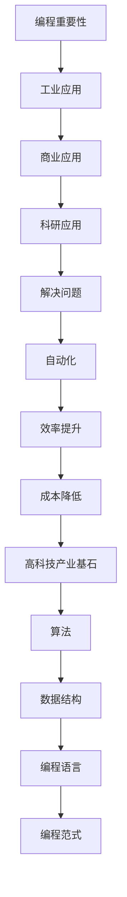

**1.2 编程语言的选择**

选择合适的编程语言对于编程初学者来说至关重要。不同的编程语言适用于不同的场景，具有不同的特点和优缺点。常见的编程语言包括Python、Java、C++、JavaScript等。

**核心概念与联系**

每种编程语言都有其独特的语法和特性，例如Python以其简洁的语法和丰富的库支持而闻名，Java以其跨平台能力和强大的生态系统而受到青睐，C++以其高性能和灵活性而在系统编程中广泛应用，JavaScript则是前端开发的必备语言。

**Mermaid 流程图**

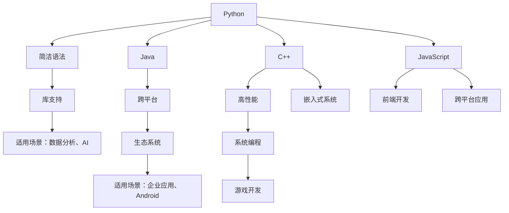

**1.3 开发环境搭建**

在开始学习编程之前，需要搭建一个合适的环境。这包括安装编程语言、配置开发工具和创建虚拟环境等。

**核心概念与联系**

开发环境是程序员进行编程工作的基础，一个良好的开发环境可以提高编程效率和代码质量。虚拟环境可以隔离不同的项目，避免依赖冲突，而版本控制工具如Git可以帮助团队协作和代码管理。

**Mermaid 流程图**

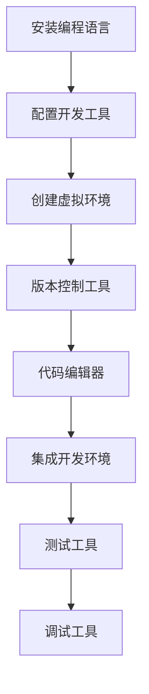

**最佳实践 tips**

- 在选择编程语言时，要考虑项目的需求和个人的兴趣。
- 初学者可以从Python开始，因为它易于学习和使用。
- 安装开发环境时，建议使用官方推荐的工具和教程，以确保稳定性和安全性。
- 在开发过程中，定期备份代码，使用版本控制工具记录更改。

#### 第2章：Python基础

**2.1 Python简介**

Python是一种高级编程语言，以其简洁明了的语法和强大的功能而受到广泛欢迎。Python的特点包括：

- **简洁易读**：Python的语法接近英语，使得初学者容易上手。
- **跨平台**：Python可以在多种操作系统上运行，包括Windows、Linux和Mac OS。
- **丰富的库支持**：Python拥有丰富的标准库和第三方库，可以方便地实现各种功能。

**核心概念与联系**

Python的核心概念包括变量、数据类型、控制结构和函数。变量是存储数据的容器，数据类型定义了数据的具体形式，控制结构用于控制程序的流程，而函数是组织代码的基本单元。

**Mermaid 流程图**

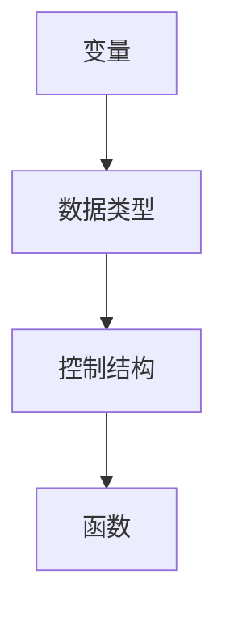

**2.2 Python基本语法**

Python的基本语法包括变量声明、数据类型、运算符和控制结构。

- **变量声明**：使用等号（=）将值赋给变量。
  ```python
  x = 10
  ```
- **数据类型**：Python有多个内置数据类型，如整数（int）、浮点数（float）、字符串（str）等。
  ```python
  x = 10            # 整数
  y = 3.14          # 浮点数
  name = "Alice"    # 字符串
  ```
- **运算符**：Python支持多种运算符，包括算术运算符、比较运算符和逻辑运算符。
  ```python
  x = 10 + 5        # 算术运算
  y = x == 15       # 比较运算
  z = True and False # 逻辑运算
  ```
- **控制结构**：Python使用if、elif和else进行条件判断，使用for和while进行循环。
  ```python
  if x > 0:
      print("x是正数")
  elif x == 0:
      print("x是零")
  else:
      print("x是负数")
  for i in range(5):
      print(i)
  ```

**核心算法原理讲解**

```python
# 假设x是一个整数变量
if x > 0:
    print("x是正数")
elif x == 0:
    print("x是零")
else:
    print("x是负数")
```

该算法通过条件判断来确定x的符号，并输出相应的信息。核心原理是使用if-elif-else结构进行多条件分支，根据不同情况执行不同的操作。

**数学模型和公式**

在条件判断中，不需要使用特定的数学模型或公式。关键在于逻辑判断和流程控制。

**详细讲解和举例说明**

```python
# 假设x是10
x = 10
if x > 0:
    print("x是正数")

# 输出：x是正数
```

当x为正数时，条件判断成立，程序输出“x是正数”。

**2.3 Python数据类型**

Python有多种内置数据类型，包括数字、字符串和列表等。

- **数字**：Python支持整数（int）和浮点数（float）。
  ```python
  x = 10          # 整数
  y = 3.14        # 浮点数
  ```
- **字符串**：字符串是Python中的序列类型，用于表示文本。
  ```python
  name = "Alice"  # 字符串
  ```
- **列表**：列表是Python中的可变序列类型，用于存储多个元素。
  ```python
  fruits = ["apple", "banana", "cherry"]  # 列表
  ```

**核心算法原理讲解**

```python
# 声明一个整数变量x
x = 10
# 声明一个字符串变量name
name = "Alice"
# 声明一个列表变量fruits
fruits = ["apple", "banana", "cherry"]
```

该算法通过声明不同类型的变量来存储数据。核心原理是理解不同数据类型的声明和基本操作。

**数学模型和公式**

在数据类型的声明中，不需要使用特定的数学模型或公式。关键在于理解不同数据类型的特点和用途。

**详细讲解和举例说明**

```python
# 声明一个整数变量x，并赋值为10
x = 10
# 输出：10

# 声明一个字符串变量name，并赋值为"Alice"
name = "Alice"
# 输出："Alice"

# 声明一个列表变量fruits，并赋值为["apple", "banana", "cherry"]
fruits = ["apple", "banana", "cherry"]
# 输出：["apple", "banana", "cherry"]
```

通过上述代码示例，我们可以看到如何声明不同类型的数据，并输出它们的值。

#### 第3章：控制结构

**3.1 条件语句**

条件语句用于根据不同条件执行不同的代码块。Python中的条件语句包括if、elif和else。

**核心概念与联系**

条件语句的核心是逻辑判断。通过比较运算符（如==、>、<等）比较变量或值，然后根据结果执行相应的代码块。

**Mermaid 流程图**

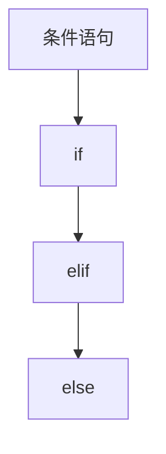

**核心算法原理讲解**

```python
# 假设x是一个整数变量
if x > 0:
    print("x是正数")
elif x == 0:
    print("x是零")
else:
    print("x是负数")
```

该算法通过条件判断来确定x的符号，并输出相应的信息。核心原理是使用if-elif-else结构进行多条件分支，根据不同情况执行不同的操作。

**数学模型和公式**

在条件判断中，不需要使用特定的数学模型或公式。关键在于逻辑判断和流程控制。

**详细讲解和举例说明**

```python
# 假设x是10
x = 10
if x > 0:
    print("x是正数")

# 输出：x是正数
```

当x为正数时，条件判断成立，程序输出“x是正数”。

**3.2 循环语句**

循环语句用于重复执行一组代码，直到满足特定条件。Python中的循环语句包括for和while。

**核心概念与联系**

循环语句的核心是重复执行代码。for循环用于遍历序列（如列表、字符串或范围），而while循环则基于条件进行迭代。

**Mermaid 流程图**

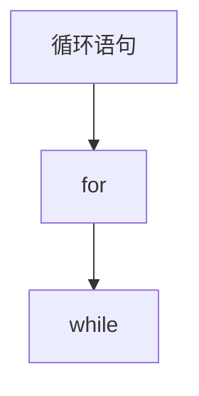

**核心算法原理讲解**

```python
# 假设x是一个整数变量
for i in range(5):
    print(i)

# 输出：
# 0
# 1
# 2
# 3
# 4
```

该算法通过for循环遍历0到4的范围，并逐个输出每个数字。核心原理是使用for循环迭代序列中的每个元素，并在每次迭代中执行相应的代码块。

**数学模型和公式**

在循环语句中，不需要使用特定的数学模型或公式。关键在于理解迭代和条件控制。

**详细讲解和举例说明**

```python
# 假设x是0
x = 0
while x < 5:
    print(x)
    x += 1

# 输出：
# 0
# 1
# 2
# 3
# 4
```

当x小于5时，条件判断成立，程序输出x的值，并将x加1。这个过程重复直到x不小于5。

#### 第4章：Python核心库

**4.1 Python标准库**

Python标准库包含了大量的模块，提供了广泛的功能，涵盖了文件操作、网络通信、数据压缩、正则表达式等。学习标准库是Python编程的基础。

**核心概念与联系**

Python标准库的核心是模块。模块是Python代码的文件，包含了函数、类和数据定义。通过导入模块，可以方便地使用其中的功能。

**Mermaid 流程图**

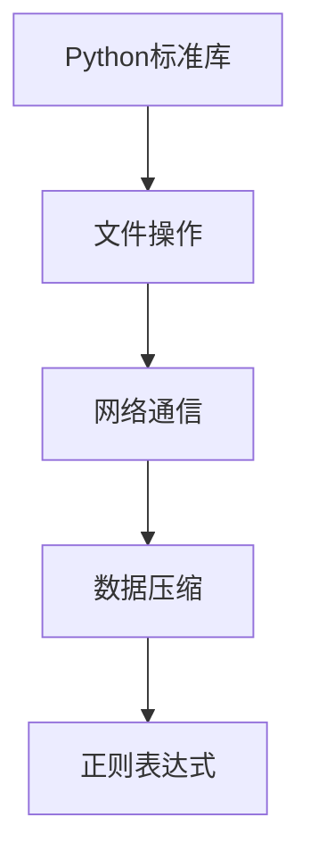

**核心算法原理讲解**

```python
# 导入os模块
import os

# 获取当前工作目录
current_directory = os.getcwd()
print(current_directory)
```

该算法通过导入os模块，使用os.getcwd()函数获取当前工作目录。核心原理是使用标准库模块提供的函数进行文件和目录操作。

**数学模型和公式**

在文件操作中，不需要使用特定的数学模型或公式。关键在于理解文件和目录的基本操作。

**详细讲解和举例说明**

```python
# 导入os模块
import os

# 获取当前工作目录
current_directory = os.getcwd()
print(current_directory)

# 输出：/path/to/current/directory
```

通过这段代码，我们可以看到如何使用os模块获取当前工作目录，并输出目录路径。

**4.2 Python第三方库**

Python的第三方库是社区贡献的代码集合，提供了各种领域的功能。例如，NumPy用于数值计算，Pandas用于数据分析，Matplotlib用于数据可视化。

**核心概念与联系**

第三方库是Python生态的重要组成部分。通过安装和使用第三方库，可以极大地扩展Python的功能和应用范围。

**Mermaid 流程图**

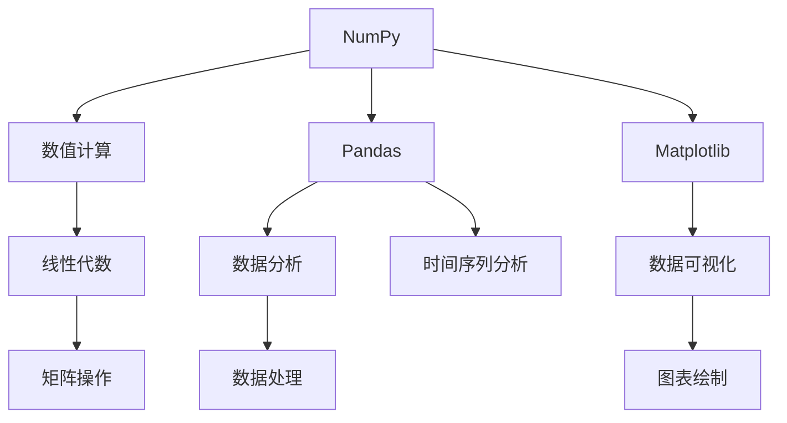

**核心算法原理讲解**

```python
# 导入NumPy模块
import numpy as np

# 创建一个NumPy数组
array = np.array([1, 2, 3, 4, 5])

# 计算数组的和
sum = np.sum(array)

# 输出结果
print(sum)

# 导入Pandas模块
import pandas as pd

# 创建一个Pandas数据框
data = {'Name': ['Alice', 'Bob', 'Charlie'], 'Age': [25, 30, 35]}
df = pd.DataFrame(data)

# 打印数据框
print(df)
```

该算法通过导入NumPy模块，使用NumPy函数创建数组并计算其和。通过导入Pandas模块，使用Pandas函数创建数据框并打印。

**数学模型和公式**

在数值计算和数据操作中，可能会使用数学模型和公式，例如矩阵操作和统计分析。

**详细讲解和举例说明**

```python
# 导入NumPy模块
import numpy as np

# 创建一个NumPy数组
array = np.array([1, 2, 3, 4, 5])

# 计算数组的和
sum = np.sum(array)

# 输出结果
print(sum)

# 导入Pandas模块
import pandas as pd

# 创建一个Pandas数据框
data = {'Name': ['Alice', 'Bob', 'Charlie'], 'Age': [25, 30, 35]}
df = pd.DataFrame(data)

# 打印数据框
print(df)

# 输出：
#     Name  Age
# 0   Alice   25
# 1     Bob   30
# 2 Charlie   35
```

通过这段代码，我们可以看到如何使用NumPy和Pandas进行数值计算和数据操作。

**4.3 库的使用示例**

以下是一些使用Python库的示例，展示如何在实际项目中使用这些库。

**示例 1：文件操作**

```python
# 导入os模块
import os

# 列出当前目录下的所有文件和文件夹
for filename in os.listdir('.'):
    print(filename)
```

**示例 2：数据可视化**

```python
# 导入Matplotlib模块
import matplotlib.pyplot as plt

# 创建一个简单的折线图
plt.plot([1, 2, 3, 4, 5])
plt.xlabel('X轴')
plt.ylabel('Y轴')
plt.title('简单的折线图')
plt.show()
```

**示例 3：数据分析**

```python
# 导入Pandas模块
import pandas as pd

# 创建一个简单的数据框
data = {'Name': ['Alice', 'Bob', 'Charlie'], 'Age': [25, 30, 35]}
df = pd.DataFrame(data)

# 打印数据框
print(df)

# 计算年龄的平均值
average_age = df['Age'].mean()
print(average_age)
```

这些示例展示了如何使用Python的标准库和第三方库来执行各种常见的编程任务。

#### 第5章：面向对象编程

**5.1 面向对象的概念**

面向对象编程（OOP）是一种编程范式，它将数据和操作数据的方法封装在一起，形成对象。OOP的核心概念包括：

- **对象**：对象是类的实例，具有属性（数据）和方法（函数）。
- **类**：类是对象的模板，定义了对象的属性和方法。
- **继承**：继承是一种创建新类的方法，它允许新类继承现有类的属性和方法。
- **多态**：多态允许不同的对象对同一消息做出不同的响应。

**核心概念与联系**

面向对象编程的核心在于将现实世界的问题抽象为对象和类，通过继承和多态实现代码的重用和扩展。

**Mermaid 流程图**

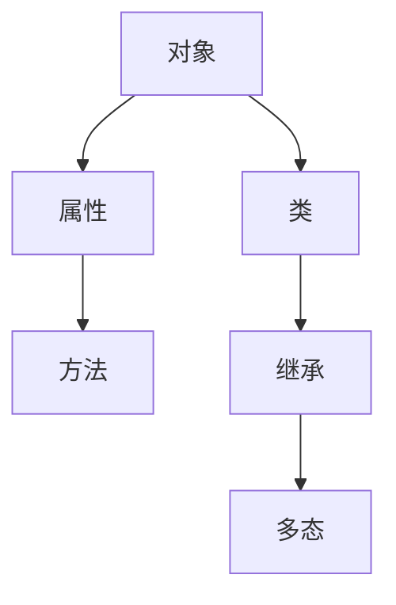

**5.2 类与对象的定义**

在Python中，类是使用关键字`class`定义的，对象是类的实例化结果。

**核心算法原理讲解**

```python
# 定义一个类
class Dog:
    def __init__(self, name, age):
        self.name = name
        self.age = age

    def bark(self):
        print(f"{self.name} is barking!")

# 创建对象
my_dog = Dog("Buddy", 5)

# 调用方法
my_dog.bark()

# 输出：Buddy is barking!
```

该算法通过定义一个`Dog`类，创建一个对象`my_dog`，并调用`bark`方法。核心原理是类定义和对象实例化。

**数学模型和公式**

在类和对象的定义中，不需要使用特定的数学模型或公式。关键在于理解类的构造函数和方法调用。

**详细讲解和举例说明**

```python
# 定义一个类
class Dog:
    def __init__(self, name, age):
        self.name = name
        self.age = age

    def bark(self):
        print(f"{self.name} is barking!")

# 创建对象
my_dog = Dog("Buddy", 5)

# 调用方法
my_dog.bark()

# 输出：Buddy is barking!
```

通过这段代码，我们可以看到如何定义一个`Dog`类，如何创建一个对象，以及如何调用对象的方法。

**5.3 继承与多态**

继承和多态是面向对象编程的两个重要特性。

**核心概念与联系**

继承允许一个类继承另一个类的属性和方法，从而实现代码的重用。多态则允许同一个方法在不同对象上具有不同的行为。

**Mermaid 流程图**

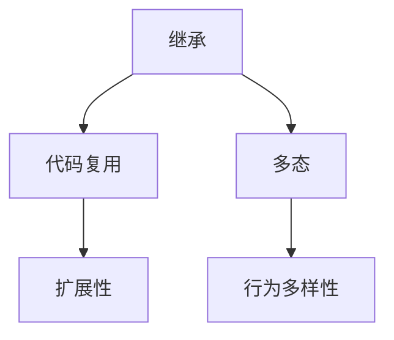

**核心算法原理讲解**

```python
# 定义一个基类
class Animal:
    def __init__(self, name):
        self.name = name

    def speak(self):
        print(f"{self.name} makes a sound.")

# 定义一个子类
class Dog(Animal):
    def __init__(self, name, breed):
        super().__init__(name)
        self.breed = breed

    def bark(self):
        print(f"{self.name} barks!")

# 创建对象
animal = Animal("General")
dog = Dog("Buddy", "Golden Retriever")

# 调用方法
animal.speak()
dog.speak()
dog.bark()

# 输出：
# General makes a sound.
# Buddy makes a sound.
# Buddy barks!
```

该算法通过继承和多态展示了如何重用代码和实现不同的行为。核心原理是继承和重写方法。

**数学模型和公式**

在继承和多态中，不需要使用特定的数学模型或公式。关键在于理解类的层次结构和方法重写。

**详细讲解和举例说明**

```python
# 定义一个基类
class Animal:
    def __init__(self, name):
        self.name = name

    def speak(self):
        print(f"{self.name} makes a sound.")

# 定义一个子类
class Dog(Animal):
    def __init__(self, name, breed):
        super().__init__(name)
        self.breed = breed

    def bark(self):
        print(f"{self.name} barks!")

# 创建对象
animal = Animal("General")
dog = Dog("Buddy", "Golden Retriever")

# 调用方法
animal.speak()
dog.speak()
dog.bark()

# 输出：
# General makes a sound.
# Buddy makes a sound.
# Buddy barks!
```

通过这段代码，我们可以看到如何定义一个基类和一个子类，以及如何继承和重写方法。

#### 第6章：错误与调试

**6.1 错误类型**

在编程过程中，错误是不可避免的。了解常见的错误类型可以帮助我们更好地解决问题。

- **语法错误**：语法错误是程序在语法上不正确导致的错误。例如，漏掉冒号、括号不匹配等。
- **运行时错误**：运行时错误是程序在运行时出现的错误。例如，除以零、文件未找到等。
- **逻辑错误**：逻辑错误是程序逻辑上的错误。例如，算法错误、条件判断错误等。

**核心概念与联系**

错误类型之间有重叠，例如某些运行时错误也可能表现为逻辑错误。

**Mermaid 流程图**

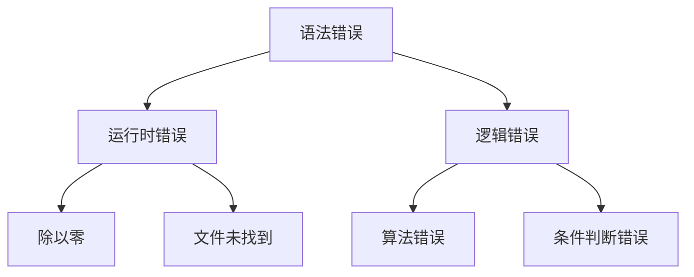

**6.2 调试方法**

调试是找出并修复程序错误的过程。以下是几种常见的调试方法：

- **打印调试**：通过打印变量的值来跟踪程序的执行过程。
- **断点调试**：在代码中设置断点，使程序在特定行暂停执行，便于检查变量和执行路径。
- **单元测试**：编写测试用例来验证代码的功能是否符合预期。

**核心概念与联系**

调试方法的选择取决于错误的类型和程序的复杂性。

**Mermaid 流程图**

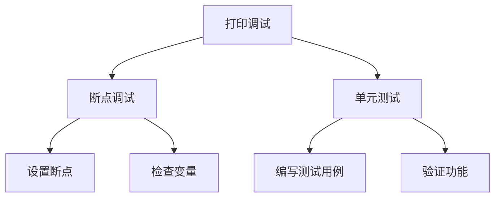

**6.3 性能优化**

性能优化是提高程序执行速度和效率的过程。以下是一些常见的性能优化方法：

- **代码优化**：通过改进代码结构和算法来减少执行时间。
- **内存优化**：通过减少内存使用来提高程序性能。
- **并发编程**：利用多线程或多进程来并行执行任务，提高执行速度。

**核心概念与联系**

性能优化需要综合考虑代码、内存和并发等多个方面。

**Mermaid 流程图**

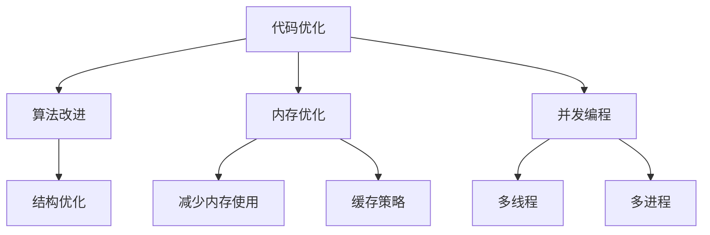

#### 第7章：高级Python编程

**7.1 装饰器**

装饰器是Python中的一种高级特性，用于扩展函数或方法的行为。装饰器本质上是一个函数，它接收一个函数作为参数，并在执行原函数前或后添加额外的逻辑。

**核心概念与联系**

装饰器通过闭包实现，可以访问原函数的参数和返回值，并动态修改它们。

**Mermaid 流程图**

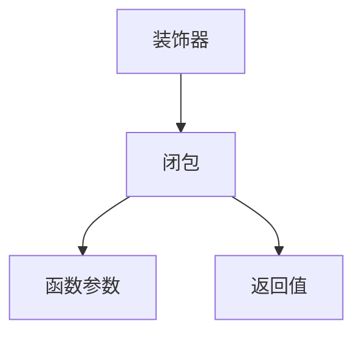

**核心算法原理讲解**

```python
# 定义一个装饰器
def my_decorator(func):
    def wrapper(*args, **kwargs):
        print("Before function execution.")
        result = func(*args, **kwargs)
        print("After function execution.")
        return result
    return wrapper

# 使用装饰器
@my_decorator
def say_hello(name):
    print(f"Hello, {name}!")

# 调用函数
say_hello("Alice")

# 输出：
# Before function execution.
# Hello, Alice!
# After function execution.
```

该算法通过定义一个装饰器`my_decorator`，并在`say_hello`函数上使用它，展示了如何在不修改原函数代码的情况下添加额外行为。

**数学模型和公式**

在装饰器中，不需要使用特定的数学模型或公式。关键在于理解闭包和函数参数。

**详细讲解和举例说明**

```python
# 定义一个装饰器
def my_decorator(func):
    def wrapper(*args, **kwargs):
        print("Before function execution.")
        result = func(*args, **kwargs)
        print("After function execution.")
        return result
    return wrapper

# 使用装饰器
@my_decorator
def say_hello(name):
    print(f"Hello, {name}!")

# 调用函数
say_hello("Alice")

# 输出：
# Before function execution.
# Hello, Alice!
# After function execution.
```

通过这段代码，我们可以看到如何定义和使用装饰器，以及它如何改变函数的行为。

**7.2 生成器与迭代器**

生成器是Python中的一种特殊函数，用于生成序列中的元素。生成器通过yield关键字在函数内部生成并返回值，而不是使用return一次性返回所有值。

迭代器是生成器的一种更通用的形式，它可以实现自定义序列的迭代。迭代器通过next()方法逐个返回序列的元素。

**核心概念与联系**

生成器和迭代器都是用于生成序列元素的高级编程结构，它们都避免了一次性创建整个序列，从而节省内存。

**Mermaid 流程图**

```mermaid
graph TD
A[生成器] --> B[yield]
B --> C[逐个生成元素]
A --> D[迭代器]
D --> E[next()]
D --> F[自定义序列迭代]
```

**核心算法原理讲解**

```python
# 定义一个生成器
def generate_numbers(n):
    for i in range(n):
        yield i

# 使用生成器
for number in generate_numbers(5):
    print(number)

# 输出：
# 0
# 1
# 2
# 3
# 4
```

该算法通过定义一个生成器`generate_numbers`，并使用for循环逐个打印生成的数字。

**数学模型和公式**

在生成器和迭代器中，不需要使用特定的数学模型或公式。关键在于理解yield关键字和迭代过程。

**详细讲解和举例说明**

```python
# 定义一个生成器
def generate_numbers(n):
    for i in range(n):
        yield i

# 使用生成器
for number in generate_numbers(5):
    print(number)

# 输出：
# 0
# 1
# 2
# 3
# 4
```

通过这段代码，我们可以看到如何定义和使用生成器，以及它如何逐个生成序列元素。

**7.3 异步编程**

异步编程是一种让程序可以并行处理多个任务的编程方法。在Python中，async和await关键字提供了异步编程的支持。

**核心概念与联系**

异步编程通过异步协程实现，协程可以在等待异步操作完成时暂停和恢复执行，从而提高程序的并发性能。

**Mermaid 流程图**

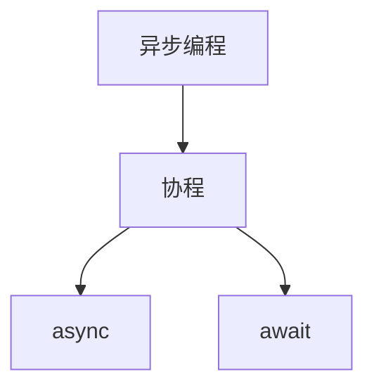

**核心算法原理讲解**

```python
# 定义一个异步函数
async def fetch_data(url):
    print("Start fetching data.")
    await asyncio.sleep(2)  # 模拟异步操作
    print("Data fetched.")
    return "Data from " + url

# 使用异步函数
async def main():
    print("Start main function.")
    data = await fetch_data("https://example.com")
    print("Data received:", data)
    print("End main function.")

# 运行异步程序
asyncio.run(main())

# 输出：
# Start main function.
# Start fetching data.
# After 2 seconds:
# Data fetched.
# Data received: Data from https://example.com
# End main function.
```

该算法通过定义一个异步函数`fetch_data`和主函数`main`，展示了如何使用async和await进行异步编程。

**数学模型和公式**

在异步编程中，不需要使用特定的数学模型或公式。关键在于理解异步操作和协程的使用。

**详细讲解和举例说明**

```python
# 定义一个异步函数
async def fetch_data(url):
    print("Start fetching data.")
    await asyncio.sleep(2)  # 模拟异步操作
    print("Data fetched.")
    return "Data from " + url

# 使用异步函数
async def main():
    print("Start main function.")
    data = await fetch_data("https://example.com")
    print("Data received:", data)
    print("End main function.")

# 运行异步程序
asyncio.run(main())

# 输出：
# Start main function.
# Start fetching data.
# After 2 seconds:
# Data fetched.
# Data received: Data from https://example.com
# End main function.
```

通过这段代码，我们可以看到如何定义和使用异步函数，以及它如何实现并行操作。

#### 第8章：数据结构与算法

**8.1 基本数据结构**

数据结构是存储和组织数据的方式，是编程的基础。Python提供了多种基本数据结构，包括列表、元组、字典和集合。

- **列表**：列表是Python中的有序序列，可以存储多个元素。列表提供了丰富的操作方法，如索引、切片、添加和删除元素等。
- **元组**：元组是Python中的不可变序列，用于存储固定数量的元素。元组通常用于存储相关联的数据，如坐标点（x, y）。
- **字典**：字典是Python中的键值对存储结构，用于快速查找和存储数据。字典通过键来访问值，提供了高效的查找性能。
- **集合**：集合是Python中的无序不重复元素集，用于存储独特元素。集合提供了添加、删除和测试成员等基本操作。

**核心概念与联系**

基本数据结构各有特点，列表适用于顺序存储和动态调整的元素，元组适用于固定长度和不可变的元素，字典适用于快速查找和存储，集合适用于存储无重复的元素。

**Mermaid 流程图**

```mermaid
graph TD
A[列表] --> B[有序序列]
B --> C[动态调整]
A --> D[操作方法：索引、切片、添加、删除]
A --> E[应用：数组、栈、队列]
A --> F[示例：list.append(), list.pop()]

B[元组] --> C[不可变序列]
C --> D[固定长度]
C --> E[应用：坐标、记录]
B --> F[操作方法：索引、切片]
F --> G[tuple.index()]
F --> H[tuple.count()]

C[字典] --> D[键值对存储]
D --> E[快速查找]
D --> F[应用：映射、数据表]
C --> G[操作方法：访问、更新、删除]
G --> H[示例：dict.keys(), dict.values()]

D[集合] --> E[无序不重复元素集]
E --> F[独特元素]
E --> G[应用：去重、集合操作]
D --> H[操作方法：添加、删除、测试成员]
H --> I[示例：set.add(), set.remove()]
```

**8.2 算法分析**

算法分析是评估算法性能的重要手段。算法性能通常用时间复杂度和空间复杂度来衡量。

- **时间复杂度**：描述算法执行时间与输入数据规模之间的关系。常见的时间复杂度包括O(1)、O(log n)、O(n)、O(n log n)等。
- **空间复杂度**：描述算法执行过程中所需存储空间与输入数据规模之间的关系。常见的空间复杂度包括O(1)、O(n)等。

**核心概念与联系**

算法分析帮助程序员理解和优化算法性能，选择合适的算法和数据结构。

**Mermaid 流程图**

```mermaid
graph TD
A[时间复杂度] --> B[O(1)]
B --> C[常数时间]
B --> D[O(log n)]
D --> E[对数时间]
A --> F[O(n)]
F --> G[线性时间]
A --> H[O(n log n)]
H --> I[对数线性时间]

B[空间复杂度] --> C[O(1)]
C --> D[常数空间]
C --> E[O(n)]
E --> F[线性空间]
```

**8.3 常见算法解析**

以下介绍几种常见算法及其解析：

- **排序算法**：用于将数据从小到大或从大到小排列。常见排序算法包括冒泡排序、选择排序、插入排序、快速排序等。
  - **冒泡排序**：通过反复交换相邻的未排序元素，逐步将最大元素“冒泡”到数组末尾。
    ```python
    def bubble_sort(arr):
        n = len(arr)
        for i in range(n):
            for j in range(0, n-i-1):
                if arr[j] > arr[j+1]:
                    arr[j], arr[j+1] = arr[j+1], arr[j]
        return arr
    ```
  - **选择排序**：每次循环选择剩余元素中的最小元素，将其放到已排序序列的末尾。
    ```python
    def selection_sort(arr):
        n = len(arr)
        for i in range(n):
            min_idx = i
            for j in range(i+1, n):
                if arr[j] < arr[min_idx]:
                    min_idx = j
            arr[i], arr[min_idx] = arr[min_idx], arr[i]
        return arr
    ```
  - **插入排序**：通过逐个将未排序元素插入到已排序序列的正确位置，直到整个序列有序。
    ```python
    def insertion_sort(arr):
        n = len(arr)
        for i in range(1, n):
            key = arr[i]
            j = i-1
            while j >= 0 and arr[j] > key:
                arr[j+1] = arr[j]
                j -= 1
            arr[j+1] = key
        return arr
    ```
- **查找算法**：用于在数据集合中查找特定元素。常见查找算法包括线性查找、二分查找等。
  - **线性查找**：逐个比较数据集合中的元素，直到找到目标元素或到达集合末尾。
    ```python
    def linear_search(arr, target):
        for i in range(len(arr)):
            if arr[i] == target:
                return i
        return -1
    ```
  - **二分查找**：在有序数据集合中，通过递归或迭代方式不断缩小查找范围，直到找到目标元素或确定其不存在。
    ```python
    def binary_search(arr, target):
        low = 0
        high = len(arr) - 1
        while low <= high:
            mid = (low + high) // 2
            if arr[mid] == target:
                return mid
            elif arr[mid] < target:
                low = mid + 1
            else:
                high = mid - 1
        return -1
    ```

**核心算法原理讲解**

以下以冒泡排序算法为例进行讲解：

```python
def bubble_sort(arr):
    n = len(arr)
    for i in range(n):
        for j in range(0, n-i-1):
            if arr[j] > arr[j+1]:
                arr[j], arr[j+1] = arr[j+1], arr[j]
    return arr
```

该算法通过两个嵌套循环逐步将数组中的最大元素移动到末尾，直到整个数组有序。核心原理是比较和交换相邻元素。

**数学模型和公式**

在排序和查找算法中，通常会使用数学模型和公式来表示时间复杂度和空间复杂度。例如，冒泡排序的时间复杂度为O(n^2)，空间复杂度为O(1)。

**详细讲解和举例说明**

以下以冒泡排序算法为例进行详细讲解和举例说明：

```python
# 冒泡排序算法
def bubble_sort(arr):
    n = len(arr)
    for i in range(n):
        for j in range(0, n-i-1):
            if arr[j] > arr[j+1]:
                arr[j], arr[j+1] = arr[j+1], arr[j]
    return arr

# 示例数据
arr = [64, 34, 25, 12, 22, 11, 90]

# 调用排序函数
sorted_arr = bubble_sort(arr)

# 输出排序后的数组
print("排序后的数组：", sorted_arr)

# 输出：
# 排序后的数组： [11, 12, 22, 25, 34, 64, 90]
```

通过这段代码，我们可以看到如何实现冒泡排序算法，以及它如何对数组进行排序。

#### 第9章：Python应用实例

**9.1 Web开发**

Python在Web开发领域有着广泛的应用，特别是使用了Django、Flask等Web框架后，开发者可以快速构建高效的Web应用。

**核心概念与联系**

Web开发涉及前端和后端。前端负责用户界面和交互，后端负责处理数据和处理业务逻辑。Python的Web框架简化了开发过程，提供了丰富的功能。

**Mermaid 流程图**

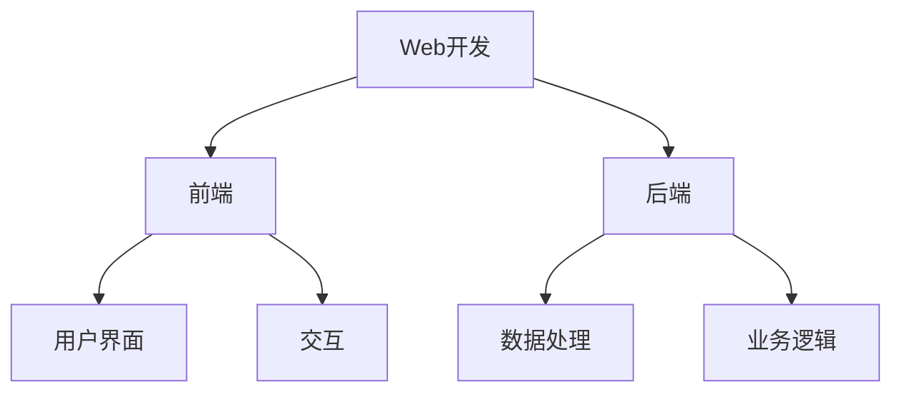

**开发环境搭建**

以下是搭建Python Web开发环境的基本步骤：

1. **安装Python**：从Python官网下载并安装Python。
2. **安装PyCharm**：下载并安装PyCharm，这是一个功能强大的Python集成开发环境。
3. **安装Django或Flask**：在终端中运行以下命令安装Django或Flask：
   ```shell
   pip install django
   pip install flask
   ```

**代码实现和解读**

以下是一个简单的Django Web应用示例：

```python
# Django项目结构
# project/
#   manage.py
#   myapp/
#     __init__.py
#     admin.py
#     apps.py
#     migrations/
#       __init__.py
#       0001_initial.py
#     models.py
#     tests.py
#     views.py

# settings.py
# 配置数据库、静态文件路径等

# models.py
# 定义数据模型

# views.py
from django.http import HttpResponse

def home(request):
    return HttpResponse("Hello, world!")

# urls.py
from django.urls import path
from . import views

urlpatterns = [
    path('', views.home, name='home'),
]

# 启动Django服务器
python manage.py runserver
```

该示例展示了如何创建一个简单的Django Web应用。首先定义了一个视图函数`home`，用于响应HTTP请求。然后在`urls.py`中配置路由，使访问根路径时调用`home`视图函数。

**代码应用解读与分析**

```python
# views.py
from django.http import HttpResponse

def home(request):
    return HttpResponse("Hello, world!")
```

该视图函数接收HTTP请求对象`request`，并返回一个HttpResponse对象，包含字符串"Hello, world!"。这意味着当用户访问Web应用的主页时，会看到这个字符串。

**实际案例分析和详细讲解**

以下是一个使用Flask构建的Web应用案例：

```python
# 安装Flask
pip install flask

# app.py
from flask import Flask, request, render_template

app = Flask(__name__)

@app.route('/', methods=['GET', 'POST'])
def home():
    if request.method == 'POST':
        name = request.form['name']
        return render_template('greeting.html', name=name)
    return render_template('index.html')

if __name__ == '__main__':
    app.run()
```

该案例使用了Flask框架，定义了一个路由`/`，它支持GET和POST请求。当用户提交表单时，程序会获取表单数据并渲染一个包含用户姓名的HTML模板。

**项目小结**

Web开发是Python应用的典型场景。通过掌握Web框架和HTTP协议，开发者可以快速构建功能丰富的Web应用。在实际开发中，需要根据项目需求选择合适的框架和工具。

**最佳实践 tips**

- **选择合适的Web框架**：Django适合快速开发和大型项目，Flask适合轻量级应用和小型项目。
- **使用模板引擎**：如Django的Django模板语言（DTL）和Flask的Jinja2，简化页面渲染。
- **进行安全性检查**：确保输入验证、防止SQL注入、使用HTTPS等。

#### 第10章：软件工程基础

**10.1 版本控制**

版本控制是软件工程中的核心部分，用于跟踪和管理代码变更。Git是目前最流行的版本控制系统，它支持分布式版本控制，提供了强大的分支管理和合并功能。

**核心概念与联系**

版本控制的核心是分支和合并。分支用于独立开发新功能或修复bug，而合并则是将分支的变更合并到主分支。

**Mermaid 流程图**

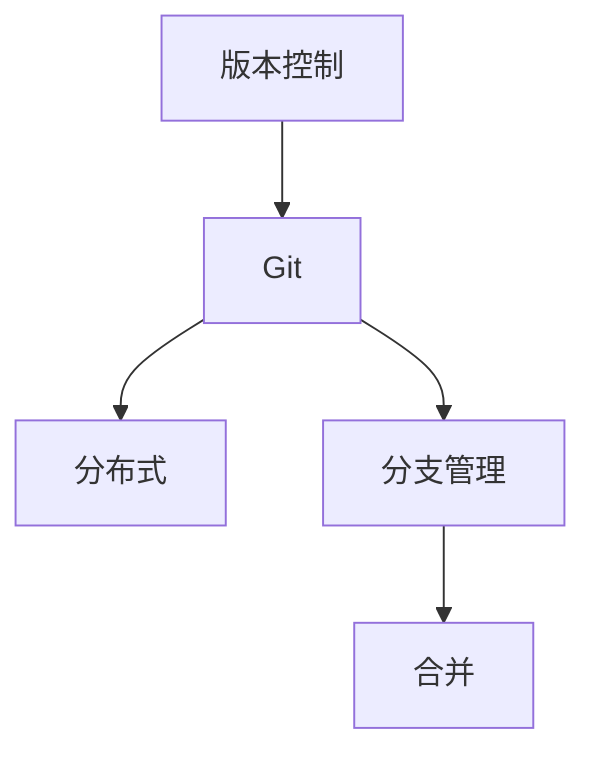

**安装与配置**

在Windows、Linux和Mac OS上，可以通过以下命令安装Git：

- **Windows**：
  ```shell
  sudo apt-get install git
  ```
- **Linux**：
  ```shell
  sudo apt-get install git
  ```
- **Mac OS**：
  ```shell
  brew install git
  ```

安装后，可以通过以下命令初始化Git仓库：

```shell
git init
```

**基本命令**

以下是Git的基本命令及其用途：

- **git clone**：克隆远程仓库。
  ```shell
  git clone https://github.com/user/repository.git
  ```
- **git add**：暂存更改。
  ```shell
  git add .
  ```
- **git commit**：提交更改。
  ```shell
  git commit -m "Commit message"
  ```
- **git push**：上传本地分支到远程仓库。
  ```shell
  git push origin main
  ```
- **git pull**：从远程仓库下载更新。
  ```shell
  git pull origin main
  ```
- **git branch**：创建、列出和管理分支。
  ```shell
  git branch
  git branch new-branch
  git checkout new-branch
  ```
- **git merge**：合并分支。
  ```shell
  git merge new-branch
  ```

**代码示例**

以下是一个简单的Git工作流程示例：

```shell
# 克隆仓库
git clone https://github.com/user/repository.git

# 切换到主分支
git checkout main

# 添加并提交更改
git add .
git commit -m "Update README.md"

# 上传更改
git push origin main

# 拉取更新
git pull origin main

# 创建新分支
git branch new-feature

# 切换到新分支
git checkout new-feature

# 在新分支上开发新功能
# ...

# 合并新分支到主分支
git merge main

# 切换回主分支
git checkout main

# 提交合并后的更改
git push origin main
```

**10.2 单元测试**

单元测试是软件工程中的关键环节，用于验证代码的功能是否符合预期。Python的unittest框架提供了创建和管理单元测试的强大功能。

**核心概念与联系**

单元测试的核心是测试用例。测试用例是用于验证特定功能的代码片段，它包括测试输入、预期输出和断言。

**Mermaid 流�图**

```mermaid
graph TD
A[单元测试] --> B[测试用例]
B --> C[测试输入]
B --> D[预期输出]
B --> E[断言]
```

**安装与配置**

在Python中，可以通过以下命令安装unittest模块：

```shell
pip install unittest
```

**基本命令**

以下是unittest的基本命令及其用途：

- **test.py**：创建测试用例文件。
  ```python
  import unittest

  class TestCalculator(unittest.TestCase):
      def test_addition(self):
          self.assertEqual(calculator.add(2, 3), 5)
      def test_subtraction(self):
          self.assertEqual(calculator.subtract(5, 3), 2)

  if __name__ == '__main__':
      unittest.main()
  ```
- **运行测试**：
  ```shell
  python test.py
  ```

**测试示例**

以下是一个简单的测试示例：

```python
# calculator.py
def add(a, b):
    return a + b

def subtract(a, b):
    return a - b

# test_calculator.py
import unittest
from calculator import add, subtract

class TestCalculator(unittest.TestCase):
    def test_addition(self):
        self.assertEqual(add(2, 3), 5)
    def test_subtraction(self):
        self.assertEqual(subtract(5, 3), 2)

if __name__ == '__main__':
    unittest.main()
```

**10.3 代码规范**

代码规范是编写可读、可维护代码的基础。Python社区有许多代码规范，如PEP 8和Google Python Style Guide。

**核心概念与联系**

代码规范的核心是代码格式和命名约定。格式化代码可以提高代码的可读性，而命名约定有助于代码的可维护性。

**Mermaid 流程图**

```mermaid
graph TD
A[代码规范] --> B[代码格式]
B --> C[PEP 8]
B --> D[命名约定]
D --> E[Google Python Style Guide]
```

**最佳实践 tips**

- **遵循PEP 8规范**：使用黑框工具（如autopep8）格式化代码。
- **使用命名空间**：避免命名冲突，使用模块和包来组织代码。
- **编写文档**：为代码编写清晰的文档和注释，提高代码的可读性。

#### 第11章：项目一——博客系统

**11.1 项目背景**

博客系统是一个允许用户发布、编辑和浏览博客文章的Web应用。该项目旨在提供一个简单但功能完整的博客平台，用于展示和分享知识和经验。

**11.2 技术选型**

- **前端**：使用HTML、CSS和JavaScript构建用户界面，利用Bootstrap框架提高响应式设计。
- **后端**：选择Django作为Web框架，因为它提供了快速开发、强大的数据库支持和丰富的功能。
- **数据库**：使用SQLite作为后端数据库，以便快速开发和部署。
- **版本控制**：使用Git进行版本控制，确保代码的可维护性和协作开发。

**11.3 项目开发步骤**

**1. 创建Django项目**

- 安装Django：
  ```shell
  pip install django
  ```
- 创建Django项目：
  ```shell
  django-admin startproject blog_project
  ```

**2. 创建Django应用**

- 切换到项目目录：
  ```shell
  cd blog_project
  ```
- 创建Django应用：
  ```shell
  python manage.py startapp blog_app
  ```

**3. 配置数据库**

- 在`settings.py`中配置数据库：
  ```python
  DATABASES = {
      'default': {
          'ENGINE': 'django.db.backends.sqlite3',
          'NAME': BASE_DIR / 'db.sqlite3',
      }
  }
  ```

**4. 定义数据模型**

- 在`blog_app/models.py`中定义数据模型：
  ```python
  from django.db import models

  class Post(models.Model):
      title = models.CharField(max_length=100)
      content = models.TextField()
      author = models.CharField(max_length=100)
      created_at = models.DateTimeField(auto_now_add=True)
  ```

**5. 创建数据库表**

- 迁移模型到数据库：
  ```shell
  python manage.py makemigrations
  python manage.py migrate
  ```

**6. 定义URL路由**

- 在`blog_app/urls.py`中定义URL路由：
  ```python
  from django.urls import path
  from . import views

  urlpatterns = [
      path('', views.home, name='home'),
      path('post/<int:post_id>/', views.post_detail, name='post_detail'),
      path('post/new/', views.post_new, name='post_new'),
      path('post/<int:post_id>/edit/', views.post_edit, name='post_edit'),
  ]
  ```

**7. 创建视图函数**

- 在`blog_app/views.py`中创建视图函数：
  ```python
  from django.shortcuts import render, get_object_or_404
  from .models import Post

  def home(request):
      posts = Post.objects.all().order_by('-created_at')
      return render(request, 'blog_app/home.html', {'posts': posts})

  def post_detail(request, post_id):
      post = get_object_or_404(Post, pk=post_id)
      return render(request, 'blog_app/post_detail.html', {'post': post})

  def post_new(request):
      if request.method == 'POST':
          # 处理表单提交
          pass
      else:
          # 显示表单
          pass
      return render(request, 'blog_app/post_form.html')

  def post_edit(request, post_id):
      post = get_object_or_404(Post, pk=post_id)
      if request.method == 'POST':
          # 处理表单提交
          pass
      else:
          # 显示表单
          pass
      return render(request, 'blog_app/post_form.html', {'post': post})
  ```

**8. 创建模板**

- 创建`blog_app/templates/blog_app/`目录，并在其中创建以下模板：
  - `home.html`
  - `post_detail.html`
  - `post_form.html`

**9. 部署项目**

- 在生产环境中部署Django项目，可以使用Gunicorn作为WSGI服务器和Nginx作为反向代理。

**11.4 项目小结**

通过本项目的开发，我们学习了如何使用Django框架创建一个简单的博客系统。项目涵盖了从数据模型设计、视图函数实现到前端模板渲染的全过程。在实际开发中，可以根据需求扩展功能，如用户认证、评论系统等。

#### 第12章：项目二——在线商城

**12.1 项目背景**

在线商城是一个电子商务平台，允许用户在线购买商品。该项目旨在构建一个功能完整的在线商城，支持商品展示、购物车、订单处理和支付等。

**12.2 技术选型**

- **前端**：使用React框架构建响应式用户界面，提供良好的用户体验。
- **后端**：使用Django作为Web框架，结合RESTful API实现前后端分离。
- **数据库**：使用MySQL作为后端数据库，确保数据存储的安全性和可靠性。
- **支付**：集成支付宝支付，实现在线支付功能。
- **版本控制**：使用Git进行版本控制，确保代码的可维护性和协作开发。

**12.3 项目开发步骤**

**1. 创建Django项目**

- 安装Django：
  ```shell
  pip install django
  ```
- 创建Django项目：
  ```shell
  django-admin startproject ecommerce_project
  ```

**2. 创建Django应用**

- 切换到项目目录：
  ```shell
  cd ecommerce_project
  ```
- 创建Django应用：
  ```shell
  python manage.py startapp products
  ```

**3. 配置数据库**

- 在`settings.py`中配置数据库：
  ```python
  DATABASES = {
      'default': {
          'ENGINE': 'django.db.backends.mysql',
          'NAME': 'ecommerce',
          'USER': 'root',
          'PASSWORD': 'password',
          'HOST': 'localhost',
          'PORT': '3306',
      }
  }
  ```

**4. 定义数据模型**

- 在`products/models.py`中定义数据模型：
  ```python
  from django.db import models

  class Category(models.Model):
      name = models.CharField(max_length=100)

  class Product(models.Model):
      category = models.ForeignKey(Category, on_delete=models.CASCADE)
      name = models.CharField(max_length=100)
      description = models.TextField()
      price = models.DecimalField(max_digits=6, decimal_places=2)
      image = models.ImageField(upload_to='products/')
  ```

**5. 创建数据库表**

- 迁移模型到数据库：
  ```shell
  python manage.py makemigrations
  python manage.py migrate
  ```

**6. 定义URL路由**

- 在`products/urls.py`中定义URL路由：
  ```python
  from django.urls import path
  from . import views

  urlpatterns = [
      path('', views.home, name='home'),
      path('category/<int:category_id>/', views.category_products, name='category_products'),
      path('product/<int:product_id>/', views.product_detail, name='product_detail'),
  ]
  ```

**7. 创建视图函数**

- 在`products/views.py`中创建视图函数：
  ```python
  from django.shortcuts import render, get_object_or_404
  from .models import Category, Product

  def home(request):
      products = Product.objects.all()
      return render(request, 'products/home.html', {'products': products})

  def category_products(request, category_id):
      category = get_object_or_404(Category, pk=category_id)
      products = category.product_set.all()
      return render(request, 'products/category_products.html', {'category': category, 'products': products})

  def product_detail(request, product_id):
      product = get_object_or_404(Product, pk=product_id)
      return render(request, 'products/product_detail.html', {'product': product})
  ```

**8. 创建模板**

- 创建`products/templates/products/`目录，并在其中创建以下模板：
  - `home.html`
  - `category_products.html`
  - `product_detail.html`

**9. 前端开发**

- 使用React框架开发前端，创建以下组件：
  - `Home`：显示首页的商品列表。
  - `CategoryProducts`：显示分类页的商品列表。
  - `ProductDetail`：显示商品详情页。

**10. 集成支付宝支付**

- 安装支付宝支付SDK：
  ```shell
  pip install alipay
  ```
- 配置支付宝支付参数，并在订单提交时调用支付宝支付API，处理支付流程。

**11. 部署项目**

- 在生产环境中部署Django项目，可以使用Gunicorn作为WSGI服务器和Nginx作为反向代理。
- 前端代码可以使用Create React App工具进行构建和部署。

**12.4 项目小结**

通过本项目的开发，我们学习了如何使用Django框架和React框架构建一个在线商城。项目涵盖了商品管理、分类管理、商品详情展示和支付宝支付等关键功能。在实际开发中，可以根据需求扩展更多功能，如购物车、订单管理和用户认证等。

#### 第13章：项目三——数据可视化

**13.1 项目背景**

数据可视化是一种将数据以图形化方式展示的技术，可以帮助用户更直观地理解和分析数据。该项目旨在构建一个简单的数据可视化平台，用于展示各种类型的数据。

**13.2 技术选型**

- **前端**：使用Vue.js框架构建用户界面，提供响应式设计。
- **后端**：使用Flask作为Web框架，结合Django ORM处理数据。
- **图表库**：使用ECharts库进行数据可视化，提供丰富的图表类型。
- **数据存储**：使用SQLite作为后端数据库，简化数据存储和操作。
- **版本控制**：使用Git进行版本控制，确保代码的可维护性和协作开发。

**13.3 项目开发步骤**

**1. 创建Flask项目**

- 安装Flask：
  ```shell
  pip install flask
  ```
- 创建Flask项目：
  ```shell
  flask --app data_visualization init
  ```

**2. 创建数据模型**

- 在`data_visualization/models.py`中定义数据模型：
  ```python
  from flask_sqlalchemy import SQLAlchemy

  db = SQLAlchemy()

  class Data(models.Model):
      name = db.Column(db.String(100), primary_key=True)
      value = db.Column(db.Float, nullable=False)
  ```

**3. 配置数据库**

- 在`data_visualization/config.py`中配置数据库：
  ```python
  SQLALCHEMY_DATABASE_URI = 'sqlite:///data_visualization.db'
  ```

**4. 初始化数据库**

- 迁移模型到数据库：
  ```shell
  flask db init
  flask db migrate
  flask db upgrade
  ```

**5. 创建视图函数**

- 在`data_visualization/views.py`中创建视图函数：
  ```python
  from flask import Flask, render_template, request
  from .models import Data

  app = Flask(__name__)
  app.config.from_object('config')

  db.init_app(app)

  @app.route('/')
  def home():
      data = Data.query.all()
      return render_template('home.html', data=data)

  @app.route('/visualize', methods=['GET', 'POST'])
  def visualize():
      if request.method == 'POST':
          name = request.form['name']
          value = float(request.form['value'])
          data = Data(name=name, value=value)
          db.session.add(data)
          db.session.commit()
      return redirect(url_for('home'))
  ```

**6. 创建模板**

- 创建`data_visualization/templates/`目录，并在其中创建以下模板：
  - `home.html`：显示数据列表。
  - `visualize.html`：显示数据输入表单。

**7. 创建数据可视化组件**

- 使用ECharts库创建数据可视化组件，例如折线图、柱状图、饼图等。

**8. 集成前端框架**

- 使用Vue.js框架集成前端，创建以下组件：
  - `App`：应用程序的主组件。
  - `Home`：显示数据列表的组件。
  - `Visualize`：显示数据输入表单的组件。

**9. 部署项目**

- 在生产环境中部署Flask项目，可以使用Gunicorn作为WSGI服务器和Nginx作为反向代理。
- 前端代码可以使用Vue CLI工具进行构建和部署。

**13.4 项目小结**

通过本项目的开发，我们学习了如何使用Flask框架和Vue.js框架构建一个简单的数据可视化平台。项目涵盖了从数据模型设计、视图函数实现到数据可视化组件的开发。在实际开发中，可以根据需求扩展更多功能，例如图表库的选择、数据存储和操作等。

## 附录

### 附录A：常用Python库与模块

**A.1 内置库**

Python的标准库包含了大量实用的模块，适用于文件操作、网络通信、数据压缩、正则表达式等多个方面。以下是一些常用的内置库：

- `os`：用于文件和目录操作。
  ```python
  import os
  os.listdir('.')
  os.mkdir('new_directory')
  ```

- `sys`：用于系统相关的操作。
  ```python
  import sys
  sys.exit()
  ```

- `math`：提供数学函数。
  ```python
  import math
  math.sqrt(16)
  ```

- `random`：用于生成随机数。
  ```python
  import random
  random.randint(1, 10)
  ```

- `json`：用于处理JSON数据。
  ```python
  import json
  json.loads('{"name": "Alice"}')
  ```

- `re`：用于正则表达式匹配。
  ```python
  import re
  re.findall(r'\d+', 'I have 3 apples.')
  ```

**A.2 第三方库**

Python的第三方库提供了更多功能，覆盖了数据分析、Web开发、科学计算等多个领域。以下是一些常用的第三方库：

- `NumPy`：用于数值计算和数据处理。
  ```python
  import numpy as np
  np.array([1, 2, 3])
  np.sum([1, 2, 3])
  ```

- `Pandas`：用于数据分析和操作。
  ```python
  import pandas as pd
  df = pd.DataFrame({'Name': ['Alice', 'Bob'], 'Age': [25, 30]})
  df.mean()
  ```

- `Matplotlib`：用于数据可视化。
  ```python
  import matplotlib.pyplot as plt
  plt.plot([1, 2, 3])
  plt.show()
  ```

- `Scikit-learn`：用于机器学习和数据挖掘。
  ```python
  from sklearn import datasets
  iris = datasets.load_iris()
  ```

- `Django`：用于快速开发Web应用。
  ```python
  pip install django
  django-admin startproject myproject
  ```

- `Flask`：用于构建轻量级Web应用。
  ```python
  pip install flask
  from flask import Flask
  app = Flask(__name__)
  app.run()
  ```

### 附录B：开发工具与环境配置

**B.1 Python开发工具**

选择合适的开发工具可以提高开发效率和代码质量。以下是一些常用的Python开发工具：

- **PyCharm**：一款功能强大的Python IDE，支持代码智能提示、调试和多种编程语言。
  - 安装：从JetBrains官网下载PyCharm社区版或专业版。
  - 配置：安装Python插件、Django插件等。

- **Visual Studio Code**：一款轻量级但功能强大的代码编辑器，适用于多种编程语言。
  - 安装：从Visual Studio Code官网下载并安装。
  - 配置：安装Python插件、Django插件、ECharts插件等。

- **Jupyter Notebook**：一款交互式的计算环境，适用于数据分析和机器学习。
  - 安装：使用pip安装Jupyter Notebook。
  - 配置：配置Python内核、安装相关库。

**B.2 代码编辑器配置**

配置代码编辑器可以提高开发体验，以下是在PyCharm和Visual Studio Code中的配置步骤：

- **PyCharm配置**：
  - 打开PyCharm，选择“File” -> “Settings”。
  - 在“Tools” -> “Python Integrated Tools”中配置Python解释器和虚拟环境。
  - 在“Editor” -> “Code Style”中配置代码格式化工具，如Black或PEP8。
  - 在“Plugins”中安装相关的插件，如Git、Django等。

- **Visual Studio Code配置**：
  - 打开Visual Studio Code，选择“File” -> “Preferences” -> “Settings”。
  - 在`python.pythonPath`中配置Python解释器的路径。
  - 在`editor.formatOnSave`中启用格式化代码。
  - 安装并配置相关的插件，如Pylint、Django、ECharts等。

**B.3 版本控制工具配置**

Git是Python开发中常用的版本控制工具，以下是在本地计算机上配置Git的步骤：

- **安装Git**：从Git官网下载并安装Git。
- **配置用户信息**：打开命令行，执行以下命令配置用户名和电子邮件：
  ```shell
  git config --global user.name "Your Name"
  git config --global user.email "your@email.com"
  ```

- **创建本地仓库**：在项目目录中执行以下命令创建本地Git仓库：
  ```shell
  git init
  ```

- **关联远程仓库**：将本地仓库与远程仓库关联：
  ```shell
  git remote add origin https://github.com/user/repository.git
  ```

- **推送代码**：将本地代码推送到远程仓库：
  ```shell
  git add .
  git commit -m "Commit message"
  git push origin main
  ```

**最佳实践 tips**

- **定期备份**：使用Git定期备份代码，避免数据丢失。
- **分支管理**：使用Git分支管理功能，分离开发和发布流程。
- **代码审查**：使用Git进行代码审查，确保代码质量和协作开发。
- **持续集成**：结合持续集成工具，如Jenkins或GitHub Actions，自动化测试和部署。

### 后记：编程学习之路

编程是一项具有挑战性的技能，但同时也是一项充满乐趣和成就感的活动。通过本书，我们系统地介绍了编程的基础知识和实践技能，从入门到实战，为读者提供了全面的指导。

**小结**

- **编程基础**：掌握了Python的基本语法和数据结构，理解了控制结构、面向对象编程等核心概念。
- **进阶技巧**：学习了高级Python编程技巧，如装饰器、生成器、异步编程等。
- **实战项目**：通过博客系统、在线商城和数据可视化等实战项目，巩固了所学知识，提高了实际开发能力。
- **软件工程**：了解了版本控制、单元测试和代码规范等软件工程基础，为编写高质量代码奠定了基础。

**注意事项**

- **实践是关键**：编程是一门实践性很强的技能，多写代码、多实战是学习编程的有效方法。
- **持续学习**：编程技术不断发展，要保持学习的热情和好奇心，持续跟进最新的技术趋势。
- **社区支持**：积极参与编程社区，与他人交流、分享经验，共同进步。

**拓展阅读**

- 《Python编程：从入门到实践》
- 《流畅的Python》
- 《Django Web开发指南》
- 《Fluent Python》
- 《Effective Python》

作者：AI天才研究院/AI Genius Institute & 禅与计算机程序设计艺术 /Zen And The Art of Computer Programming

---

# 下启代码——从零开始的编程之旅

> 关键词：Python编程、编程基础、实战项目、软件工程、数据结构与算法

> 摘要：本书旨在为编程初学者提供全面、系统的编程学习资源。通过从基础入门到实战项目的全面介绍，本书将带领读者逐步掌握Python编程的核心概念和技术，帮助读者开启编程之旅。

## 第一部分：编程基础入门

### 第1章：编程入门概述

- 1.1 编程的重要性
- 1.2 编程语言的选择
- 1.3 开发环境搭建

### 第2章：Python基础

- 2.1 Python简介
- 2.2 Python基本语法
- 2.3 Python数据类型

### 第3章：控制结构

- 3.1 条件语句
- 3.2 循环语句
- 3.3 函数定义与调用

### 第4章：Python核心库

- 4.1 Python标准库
- 4.2 Python第三方库
- 4.3 库的使用示例

### 第5章：面向对象编程

- 5.1 面向对象的概念
- 5.2 类与对象的定义
- 5.3 继承与多态

### 第6章：错误与调试

- 6.1 错误类型
- 6.2 调试方法
- 6.3 性能优化

## 第二部分：进阶编程技巧

### 第7章：高级Python编程

- 7.1 装饰器
- 7.2 生成器与迭代器
- 7.3 异步编程

### 第8章：数据结构与算法

- 8.1 基本数据结构
- 8.2 算法分析
- 8.3 常见算法解析

### 第9章：Python应用实例

- 9.1 Web开发
- 9.2 数据分析
- 9.3 人工智能入门

### 第10章：软件工程基础

- 10.1 版本控制
- 10.2 单元测试
- 10.3 代码规范

## 第三部分：综合实战项目

### 第11章：项目一——博客系统

- 11.1 项目背景
- 11.2 技术选型
- 11.3 项目开发步骤

### 第12章：项目二——在线商城

- 12.1 项目背景
- 12.2 技术选型
- 12.3 项目开发步骤

### 第13章：项目三——数据可视化

- 13.1 项目背景
- 13.2 技术选型
- 13.3 项目开发步骤

## 附录

### 附录A：常用Python库与模块

- A.1 内置库
- A.2 第三方库

### 附录B：开发工具与环境配置

- B.1 Python开发工具
- B.2 代码编辑器配置
- B.3 版本控制工具配置

## 后记

### 后记：编程学习之路

**作者：AI天才研究院/AI Genius Institute & 禅与计算机程序设计艺术 /Zen And The Art of Computer Programming**

