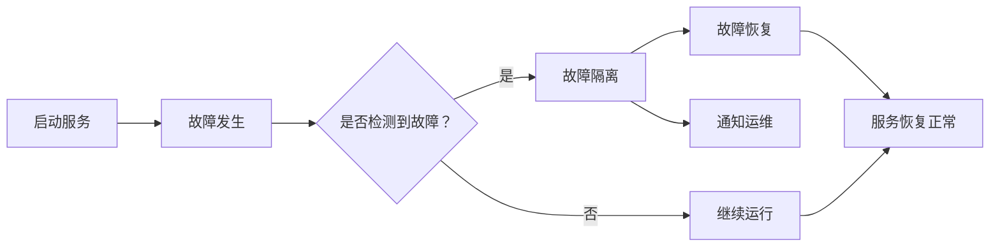

                 


### 高可用性的定义与重要性

高可用性（High Availability，简称HA）是指系统或组件在长时间内保持正常运行的能力。具体来说，它是指系统在出现故障或异常情况下，能够快速地恢复服务，或者通过冗余设计、故障转移等手段，保证服务不中断。在信息技术领域，高可用性是一个至关重要的概念，因为系统的高可用性直接关系到企业的业务连续性、客户满意度以及市场竞争力。

首先，我们需要了解高可用性与故障容忍度的关系。故障容忍度（Fault Tolerance）是指系统在遇到故障时，能够继续正常运行的能力。高可用性实际上是通过增加系统的故障容忍度来实现的。一个高可用性系统通常具有以下几个关键特性：

1. **容错性（Fault Tolerance）**：系统能够检测到故障，并自动切换到备份系统，从而避免服务中断。
2. **冗余性（Redundancy）**：系统中存在多个相同功能的组件或节点，当一个组件或节点出现故障时，其他组件或节点可以立即接管工作。
3. **快速恢复（Fast Recovery）**：系统能够在故障发生后迅速恢复，减少因故障带来的服务中断时间。
4. **可伸缩性（Scalability）**：系统能够根据负载需求动态调整资源，确保在高并发情况下依然能够保持高可用性。

在业务场景中，高可用性具有以下几个方面的意义：

1. **业务连续性（Business Continuity）**：高可用性系统能够在发生故障时迅速恢复，确保业务不中断，这对于依赖信息技术开展业务的企业尤为重要。
2. **客户满意度（Customer Satisfaction）**：系统的稳定性和可靠性能够提升客户体验，减少客户投诉，提高客户满意度。
3. **市场竞争力（Market Competitiveness）**：高可用性系统能够确保企业在市场竞争中占据优势，吸引更多的客户和合作伙伴。

然而，高可用性并非万能。在实际设计和实现过程中，我们需要根据具体业务需求、成本等因素进行权衡。例如，在一些对成本敏感的场景中，可能需要牺牲一部分可用性来降低成本。因此，理解高可用性的定义和重要性，是我们在设计系统时必须考虑的关键因素。

### 高可用性的基本原则

高可用性系统的设计不仅仅是追求“高”，更强调“稳”。为了实现这一目标，我们需要遵循一系列基本原则，以确保系统在长期运行中能够保持稳定、可靠。

#### 1. 冗余设计

冗余设计是高可用性系统的基础。通过在系统架构中引入冗余，我们可以提高系统的故障容忍度。具体来说，冗余设计可以从以下几个方面实现：

1. **硬件冗余**：使用冗余硬件，例如备用服务器、备用电源等。当主硬件出现故障时，备用硬件可以立即接管工作，确保系统不中断。
2. **软件冗余**：通过冗余软件机制，例如镜像数据库、冗余的Web服务器等，来确保在软件层面上的高可用性。
3. **数据冗余**：在数据存储层面，可以通过数据备份、分布式存储等方式来确保数据的可靠性和可用性。

#### 2. 故障检测与自愈

高可用性系统需要具备强大的故障检测和自愈能力。具体措施包括：

1. **实时监控**：通过监控工具，实时监测系统的运行状态，包括CPU利用率、内存占用、磁盘空间、网络延迟等指标。
2. **自动告警**：当监控工具检测到异常情况时，自动生成告警，通知运维人员进行处理。
3. **自动恢复**：在检测到故障后，系统能够自动进行故障转移或故障恢复，减少人工干预。

#### 3. 分布式架构

分布式架构能够提高系统的容错性和可伸缩性。通过将系统分解为多个独立的节点，每个节点可以独立运行，当某个节点出现故障时，其他节点可以继续提供服务。具体实现方法包括：

1. **服务分解**：将大型系统分解为多个小型服务，每个服务可以独立部署和运行。
2. **服务注册与发现**：通过服务注册中心和服务发现机制，确保各个服务之间可以互相发现和调用。
3. **负载均衡**：通过负载均衡器，将流量分配到不同的节点，确保每个节点都能均衡负载，提高系统的整体性能。

#### 4. 灾难恢复

灾难恢复是高可用性系统不可或缺的一部分。它旨在确保在发生大规模故障或灾难时，系统可以迅速恢复。具体措施包括：

1. **异地备份**：在异地存储备份数据，确保在本地数据丢失或损坏时，可以快速恢复。
2. **定期演练**：定期进行灾难恢复演练，确保在真实灾难发生时，系统能够快速、有效地恢复。
3. **自动化流程**：建立自动化恢复流程，减少人工干预，提高恢复速度。

通过遵循上述基本原则，我们可以设计出具有高可用性的系统，确保系统在长期运行中能够保持稳定、可靠。然而，高可用性并非一蹴而就，需要持续优化和改进。只有不断地进行评估和调整，才能确保系统始终处于最佳状态。

### 高可用性与故障容忍度的关系

高可用性与故障容忍度是密不可分的两个概念。故障容忍度（Fault Tolerance）是指系统在遇到故障时，能够继续正常运行的能力。而高可用性（High Availability）则是通过提高故障容忍度，确保系统在长时间内保持正常运行的能力。因此，故障容忍度是实现高可用性的关键。

要理解这两者之间的关系，我们首先需要明确故障容忍度的几个关键要素：

1. **故障检测**：系统能够检测到故障，包括硬件故障、软件故障和外部故障等。
2. **故障隔离**：系统能够将故障隔离到最小的范围，避免故障扩散。
3. **故障恢复**：系统能够在检测到故障后，自动或手动进行恢复，确保系统继续提供服务。

接下来，我们将通过一个Mermaid流程图，展示故障容忍度在实现高可用性中的具体实现过程：



在上述流程图中，当服务正常运行时，系统会持续监控运行状态。一旦检测到故障，系统会立即进行故障隔离，确保故障不会扩散。然后，系统会尝试进行故障恢复，如果恢复成功，服务将恢复正常运行。否则，系统会通知运维人员，由人工介入处理。

为了更直观地理解故障容忍度与高可用性之间的关系，我们可以通过一个实际案例来说明。假设我们设计一个电商平台，要求其具备高可用性。为实现这一目标，我们可以采取以下措施：

1. **硬件冗余**：购买两台高性能服务器，并将服务部署在它们上面。当一台服务器出现故障时，另一台服务器可以立即接管工作，确保服务不中断。
2. **软件冗余**：使用数据库镜像，确保在主数据库出现故障时，备份数据库可以立即接管工作。
3. **故障检测与自愈**：通过监控工具，实时监测服务器和数据库的运行状态。一旦检测到故障，系统会自动进行故障恢复。

通过上述措施，我们的电商平台具备了较高的故障容忍度。即使发生硬件或软件故障，系统也能迅速恢复，确保服务不中断。这样，电商平台就实现了高可用性。

总之，故障容忍度是高可用性的基础。通过提高故障容忍度，我们可以确保系统在遇到故障时，能够快速恢复，从而实现高可用性。在设计高可用性系统时，我们需要综合考虑硬件冗余、软件冗余、故障检测与自愈等多种措施，以确保系统具备强大的故障容忍能力。

### 高可用性架构设计概述

高可用性架构设计是确保系统在长时间内保持正常运行的关键步骤。一个良好的高可用性架构设计不仅能够提高系统的稳定性，还能降低故障发生的概率，减少故障对业务的影响。在本文中，我们将探讨分布式系统架构、数据库分布式架构、计算资源分布式架构以及高可用性服务设计等关键内容。

#### 分布式系统架构

分布式系统架构是高可用性系统设计的基础。它通过将系统分解为多个独立的节点，使每个节点可以独立运行，从而提高系统的容错性和可伸缩性。具体来说，分布式系统架构包括以下几个核心要素：

1. **服务分解**：将大型系统分解为多个小型服务，每个服务可以独立部署和运行。这样可以降低单个服务的复杂度，提高系统的可维护性和可扩展性。
2. **服务注册与发现**：通过服务注册中心和服务发现机制，确保各个服务之间可以互相发现和调用。这样，当某个服务发生故障时，其他服务可以自动切换到备份服务，确保系统不中断。
3. **负载均衡**：通过负载均衡器，将流量分配到不同的节点，确保每个节点都能均衡负载，提高系统的整体性能。

分布式系统架构的实现可以显著提高系统的可用性和容错能力。例如，在一个分布式电商系统中，我们可以将购物车服务、订单服务、库存服务等分解为多个独立的服务，并将它们部署在不同的服务器上。通过服务注册与发现机制，这些服务可以互相发现和调用。同时，通过负载均衡器，我们可以将用户请求分配到不同的服务器上，确保系统在高并发情况下依然能够保持高性能。

#### 数据库分布式架构

数据库分布式架构是高可用性架构设计的重要一环。它通过将数据分布在多个节点上，确保在某个节点发生故障时，其他节点依然能够提供服务。以下是一些常见的数据库分布式架构设计：

1. **主从复制**：在主从复制架构中，主数据库负责处理所有写操作，而从数据库负责处理读操作。当主数据库出现故障时，从数据库可以立即接管主数据库的工作，确保系统不中断。
2. **数据库集群**：在数据库集群架构中，多个数据库节点共同工作，每个节点都存储部分数据。通过负载均衡器和选举机制，系统可以自动选择一个节点作为主节点，处理写操作，其他节点作为从节点，处理读操作。
3. **分布式存储**：分布式存储系统将数据分散存储在多个节点上，通过数据分片和数据复制，确保在某个节点发生故障时，其他节点依然能够提供服务。

数据库分布式架构的设计可以显著提高系统的可用性和数据可靠性。例如，在一个大型电商平台中，我们可以使用主从复制架构来确保订单数据的可靠性。通过从数据库，我们可以提供快速、稳定的读操作，降低主数据库的负载。同时，通过数据库集群，我们可以确保在某个数据库节点发生故障时，其他节点可以立即接管工作，确保订单系统不中断。

#### 计算资源分布式架构

计算资源分布式架构是将计算任务分布在多个节点上，通过负载均衡和资源调度，提高系统的性能和可用性。以下是一些常见的计算资源分布式架构设计：

1. **计算节点池**：在计算节点池架构中，多个计算节点共同工作，每个节点都可以独立处理计算任务。通过负载均衡器，可以将计算任务分配到不同的节点上，确保每个节点都能充分利用。
2. **容器编排**：容器编排系统（如Kubernetes）可以自动化地管理计算节点，确保计算资源的高效利用。通过容器编排，我们可以将计算任务部署在多个节点上，实现动态负载均衡和故障恢复。
3. **分布式计算框架**：分布式计算框架（如Apache Spark）可以将计算任务分布在多个节点上，通过数据分区和数据复制，提高计算效率和容错能力。

计算资源分布式架构的设计可以显著提高系统的性能和可用性。例如，在一个数据分析平台上，我们可以使用分布式计算框架来处理大规模数据。通过将数据分区和数据复制，我们可以确保在某个节点发生故障时，其他节点可以继续处理数据，确保系统不中断。

#### 高可用性服务设计

高可用性服务设计是指确保系统中的各个服务都能在长时间内保持正常运行的能力。以下是一些关键的高可用性服务设计原则：

1. **服务监控**：通过监控工具，实时监测各个服务的运行状态，包括CPU利用率、内存占用、网络延迟等指标。一旦检测到异常，系统会自动生成告警，通知运维人员进行处理。
2. **服务故障转移**：当某个服务发生故障时，系统能够自动将其流量切换到备份服务，确保业务不中断。例如，在分布式架构中，通过服务注册与发现机制，我们可以自动将故障服务的流量切换到备份服务。
3. **服务恢复策略**：在服务发生故障后，系统需要能够自动或手动地进行恢复。例如，在数据库主从复制架构中，当主数据库出现故障时，系统可以自动将流量切换到从数据库，并在从数据库恢复正常后，自动恢复主数据库。

通过遵循上述原则，我们可以设计出具有高可用性的服务系统，确保在发生故障时，系统能够迅速恢复，减少对业务的影响。

总之，高可用性架构设计是确保系统在长时间内保持正常运行的关键。通过分布式系统架构、数据库分布式架构、计算资源分布式架构以及高可用性服务设计，我们可以构建一个稳定、可靠、高效的高可用性系统。

### 数据库分布式架构

在分布式架构设计中，数据库分布式架构是确保高可用性和数据一致性的关键。通过将数据库拆分为多个节点，我们可以在发生故障时实现快速恢复，并提高系统的整体性能和可伸缩性。以下将详细介绍几种常见的数据库分布式架构，包括主从复制、数据库集群和分布式存储。

#### 主从复制

主从复制（Master-Slave Replication）是一种简单的数据库分布式架构，其中主数据库（Master）负责处理所有写操作，而从数据库（Slave）负责处理读操作。这种架构的主要目的是提高读性能，同时确保在主数据库发生故障时，可以从数据库接管主数据库的写操作，确保系统的连续性和数据完整性。

**工作原理：**
1. **主数据库**：接收所有的写操作，如INSERT、UPDATE和DELETE。
2. **从数据库**：接收主数据库发送的写操作日志，执行这些日志，从而实现数据的同步。

**优点：**
- 简单易实现。
- 提高了读性能，因为读操作可以分散到多个从数据库上。
- 在主数据库发生故障时，从数据库可以快速接管，确保系统不中断。

**缺点：**
- 数据一致性：由于从数据库延迟同步主数据库的写操作，可能会导致数据不一致性问题。
- 可靠性：从数据库的故障可能会导致整个系统的可用性下降。

**适用场景：**
- 对数据一致性要求不是非常高的系统。
- 用于读性能优化。

**伪代码实现：**
```python
# 主数据库
def write(data):
    database.insert(data)
    log(data)

# 从数据库
def read():
    database.execute(logs[-1])
```

#### 数据库集群

数据库集群（Database Cluster）通过多个数据库节点共同工作，实现数据的分片和冗余，从而提高系统的可用性和性能。在数据库集群中，每个节点都存储部分数据，并且通过负载均衡器将读写请求分配到不同的节点上。

**工作原理：**
1. **数据分片**：将数据划分为多个分片（Shard），每个分片存储在集群中的不同节点上。
2. **负载均衡**：通过负载均衡器，将读写请求分配到集群中的不同节点上，确保每个节点都能均衡负载。

**优点：**
- 高可用性：单个节点的故障不会影响整个系统。
- 高性能：通过数据分片和负载均衡，提高了系统的读写性能。
- 可伸缩性：可以轻松地添加或删除节点，以适应业务需求的变化。

**缺点：**
- 数据一致性：在分片和分布式环境下，保持数据一致性是一个挑战。
- 复杂性：需要管理和维护多个节点，增加了系统的复杂度。

**适用场景：**
- 大型在线应用，如电商平台、社交网络等。
- 对性能和可伸缩性有较高要求的系统。

**伪代码实现：**
```python
# 负载均衡器
def handle_request(request):
    shard = determine_shard(request)
    send_request_to(shard)

# 数据库集群
def write(data):
    shard = determine_shard(data)
    shard.write(data)

def read(data):
    shard = determine_shard(data)
    return shard.read(data)
```

#### 分布式存储

分布式存储通过将数据分散存储在多个节点上，提高了系统的可靠性和性能。在分布式存储系统中，数据被分割成多个数据块，并存储在多个节点上。每个节点都负责一部分数据块的存储和访问。

**工作原理：**
1. **数据分块**：将数据分割成多个数据块。
2. **数据复制**：将数据块复制到多个节点上，以提高数据的可靠性和访问速度。
3. **数据访问**：通过分布式文件系统，用户可以访问存储在各个节点上的数据块。

**优点：**
- 高可靠性：通过数据复制，提高了数据的可靠性，单个节点的故障不会导致数据丢失。
- 高性能：通过多个节点的并发访问，提高了数据的访问速度。
- 可伸缩性：可以轻松地添加或删除节点，以适应业务需求的变化。

**缺点：**
- 数据一致性：在分布式存储中，保持数据一致性是一个挑战。
- 网络依赖性：分布式存储依赖于网络，网络故障可能会影响系统的性能和可用性。

**适用场景：**
- 大型文件存储系统，如云存储、视频流媒体等。
- 对数据可靠性和访问速度有较高要求的系统。

**伪代码实现：**
```python
# 分布式存储
def write(data):
    blocks = split_data(data)
    for block in blocks:
        replicate_block(block)

def read(data):
    blocks = split_data(data)
    results = []
    for block in blocks:
        result = fetch_block(block)
        results.append(result)
    return combine_results(results)
```

通过以上三种数据库分布式架构的设计和实现，我们可以根据具体业务需求选择合适的架构，以实现高可用性、高性能和可伸缩性的系统。

### 高可用性服务设计

高可用性服务设计是确保系统在面临各种故障时能够保持稳定运行的关键。在这一部分，我们将探讨服务状态监控、故障转移和服务恢复策略三个核心要素，并介绍如何通过这些措施来设计高可用性服务。

#### 服务状态监控

服务状态监控是高可用性设计的基础。通过实时监控服务运行状态，我们能够及时发现异常并采取相应措施。以下是一些常见的服务状态监控方法：

1. **指标监控**：监控系统运行的各种关键指标，如CPU利用率、内存占用、磁盘空间、网络延迟等。这些指标可以反映服务的健康状况，一旦超过设定的阈值，系统会发出告警。
   
   **伪代码实现：**
   ```python
   def monitor服务水平（service）：
       metrics = service.getMetrics()
       if metrics["CPU利用率"] > 90 or metrics["内存占用"] > 80:
           send_alert（"服务过载"）
       if metrics["磁盘空间"] < 10:
           send_alert（"磁盘空间不足"）
   ```

2. **日志分析**：通过分析系统日志，我们可以了解服务的运行细节，发现潜在问题。日志分析可以采用自动化工具，如ELK（Elasticsearch、Logstash、Kibana）堆栈。

   **伪代码实现：**
   ```python
   def analyze_logs（logs）：
       if "错误" in logs:
           send_alert（"日志中存在错误"）
   ```

3. **性能测试**：通过定期进行性能测试，我们可以评估服务的稳定性和响应时间。性能测试可以使用工具，如JMeter或LoadRunner。

   **伪代码实现：**
   ```python
   def perform_tests（service）：
       response_time = service.response_time()
       if response_time > 500:
           send_alert（"响应时间过长"）
   ```

#### 故障转移

故障转移（Fault Migration）是指在检测到服务故障时，将故障服务切换到备份服务，以确保系统不中断。实现故障转移的关键在于快速检测故障和无缝切换。

1. **健康检查**：通过定期对服务进行健康检查，可以快速发现故障。健康检查可以采用轮询或心跳机制。

   **伪代码实现：**
   ```python
   def health_check（service）：
       if not service.is_healthy():
           trigger_fault_migration（service）
   ```

2. **故障转移策略**：故障转移策略包括主动故障转移和被动故障转移。主动故障转移是指在检测到故障时，自动切换到备份服务；被动故障转移需要人工干预。

   **伪代码实现：**
   ```python
   def trigger_fault_migration（service）：
       backup_service = get_backup_service（service）
       switch_to（backup_service）
   ```

3. **服务注册与发现**：通过服务注册与发现机制，系统能够实时获取服务的状态信息，一旦检测到故障，可以迅速切换到备份服务。

   **伪代码实现：**
   ```python
   def register_service（service）：
       service_registry.register（service）

   def discover_service（service_name）：
       return service_registry.get_service（service_name）
   ```

#### 服务恢复策略

服务恢复策略是指在故障发生后，如何将服务恢复正常运行。实现服务恢复的关键在于快速检测故障、自动或手动恢复服务，并确保数据一致性。

1. **自动恢复**：通过自动化脚本或工具，实现故障检测和自动恢复。例如，在数据库主从复制架构中，当主数据库出现故障时，可以自动切换到从数据库，并在从数据库恢复正常后，自动恢复主数据库。

   **伪代码实现：**
   ```python
   def auto_recover（service）：
       if service.is_recoverable():
           execute_recover_script（service）
   ```

2. **手动恢复**：在某些情况下，故障可能需要人工干预才能恢复。通过提供详细的故障恢复步骤和指南，可以帮助运维人员快速解决问题。

   **伪代码实现：**
   ```python
   def manual_recover（service）：
       execute_manual_recovery_steps（service）
   ```

3. **数据一致性检查**：在故障恢复过程中，需要确保数据的一致性。例如，在数据库主从复制中，可以通过对比主数据库和从数据库的数据，确保数据一致性。

   **伪代码实现：**
   ```python
   def check_data_consistency（master_db，slave_db）：
       if not data_equal（master_db，slave_db）：
           send_alert（"数据不一致"）
   ```

通过上述服务状态监控、故障转移和服务恢复策略的设计，我们可以构建一个高可用性服务系统，确保在面临各种故障时，系统能够快速检测、迅速恢复，并保持稳定运行。

### 数据库高可用性技术

在确保数据库的高可用性方面，有几种核心技术值得我们深入探讨。这些技术包括主从复制、数据库集群和备份与恢复策略。以下将详细讨论这些技术，并展示相关的伪代码实现。

#### 主从复制

主从复制是一种简单且常见的数据同步方法，通过将主数据库的写操作复制到从数据库，从而确保数据的冗余和一致性。以下是一个简单的伪代码实现：

```python
# 主数据库
def write_to_master(data):
    master_db.insert(data)
    log_to_replication_queue(data)

# 从数据库
def replicate_to_slave():
    while replication_queue.has_data():
        data = replication_queue.get_data()
        slave_db.insert(data)
```

#### 数据库集群

数据库集群通过多个数据库节点共同工作，提高系统的可用性和性能。每个节点存储部分数据，并通过负载均衡器将读写请求分配到不同的节点上。以下是一个简单的伪代码实现：

```python
# 负载均衡器
def handle_request(request):
    node = determine_node(request)
    send_request_to(node)

# 数据库节点
def write_to_node(data):
    node_db.insert(data)

def read_from_node():
    node = determine_node(request)
    return node_db.read(data)
```

#### 备份与恢复

备份与恢复策略是确保数据库数据安全的关键。定期备份数据库，并在发生故障时能够快速恢复。以下是一个简单的备份与恢复策略的伪代码实现：

```python
# 备份数据库
def backup_database():
    backup_file = database.dump()
    save_to_file(backup_file)

# 从备份文件恢复数据库
def restore_database(backup_file):
    database.load(backup_file)
```

通过以上技术，我们可以构建一个高可用性的数据库系统。主从复制确保数据的冗余和一致性，数据库集群提高系统的可用性和性能，备份与恢复策略确保数据的安全。这些技术在实际应用中可以结合使用，以构建一个稳定、可靠、高效的数据库系统。

### 计算机网络高可用性技术

计算机网络的高可用性是确保系统在面临网络故障时能够继续正常运行的关键。以下将详细讨论几种关键的网络高可用性技术，包括网络冗余、负载均衡和网络故障恢复。

#### 网络冗余

网络冗余是通过在系统中引入冗余网络路径，以提高系统的整体可靠性和可用性。以下是一个简单的网络冗余实现的伪代码：

```python
# 网络冗余实现
def route_request(request):
    primary_network = check_network_health("primary_network")
    if primary_network.is_healthy():
        send_request_over_primary_network(request)
    else:
        secondary_network = check_network_health("secondary_network")
        if secondary_network.is_healthy():
            send_request_over_secondary_network(request)
        else:
            raise NetworkFailureException()
```

在这个伪代码中，`check_network_health`函数用于检查网络的健康状态，`send_request_over_primary_network`和`send_request_over_secondary_network`函数分别用于通过主网络和备用网络发送请求。

#### 负载均衡

负载均衡是将网络流量分配到多个服务器或网络节点，以确保每个节点都能均衡负载，从而提高系统的性能和可用性。以下是一个简单的负载均衡实现的伪代码：

```python
# 负载均衡实现
def handle_request(request):
    available_nodes = get_available_nodes()
    node = select_node(available_nodes)
    send_request_to(node)

def select_node(nodes):
    return nodes[round(time() * 1000) % len(nodes)]
```

在这个伪代码中，`get_available_nodes`函数用于获取所有可用的节点，`select_node`函数通过哈希算法选择下一个处理请求的节点。

#### 网络故障恢复

网络故障恢复是指在检测到网络故障时，自动切换到备用网络或重新配置网络路径，以确保系统的连续性和可用性。以下是一个简单的网络故障恢复实现的伪代码：

```python
# 网络故障恢复
def monitor_network_health():
    while True:
        network_status = check_network_health("primary_network")
        if not network_status.is_healthy():
            switch_to_secondary_network()
        time.sleep(check_interval)

def switch_to_secondary_network():
    reconfigure_network("secondary_network")
```

在这个伪代码中，`check_network_health`函数用于检查网络的健康状态，`switch_to_secondary_network`函数用于切换到备用网络，`reconfigure_network`函数用于重新配置网络。

通过这些网络高可用性技术，我们可以确保在面临网络故障时，系统能够迅速恢复，从而保持高可用性。

### 应用层高可用性技术

在应用层设计高可用性系统时，我们需要关注几个关键方面：服务熔断、服务限流和服务降级。这些技术可以帮助我们在系统面临高负载或故障时，保证关键服务的稳定性和可靠性。

#### 服务熔断

服务熔断（Circuit Breaker）是一种用于防止级联故障的技术。当某个服务频繁失败或响应时间过长时，服务熔断会将该服务“熔断”，防止后续请求继续发送到故障服务，从而避免整个系统崩溃。以下是一个简单的服务熔断实现的伪代码：

```python
# 服务熔断
class ServiceCircuitBreaker:
    def __init__(self, threshold, timeout):
        self.threshold = threshold
        self.timeout = timeout
        self.failures = 0
        self.last_failure_time = None

    def record_failure(self):
        self.failures += 1
        self.last_failure_time = current_time()

    def is_open(self):
        return self.failures >= self.threshold and (current_time() - self.last_failure_time) < self.timeout

    def reset(self):
        self.failures = 0
        self.last_failure_time = None

    def execute_request(self, request):
        if self.is_open():
            log_error("Service is circuit broken")
            return None
        else:
            result = service.execute_request(request)
            if not result.is_success():
                self.record_failure()
            return result
```

在这个伪代码中，`ServiceCircuitBreaker`类用于管理熔断状态。当服务失败次数超过阈值且在超时时间内时，熔断状态开启，防止后续请求。当服务恢复时，熔断状态会重置。

#### 服务限流

服务限流（Rate Limiting）是用于控制请求速率的技术。通过限制请求速率，我们可以避免系统过载，确保系统在高并发情况下依然能够保持稳定。以下是一个简单的服务限流实现的伪代码：

```python
# 服务限流
class RateLimiter:
    def __init__(self, rate, capacity):
        self.rate = rate
        self.capacity = capacity
        self.tokens = capacity

    def acquire_token(self):
        if self.tokens > 0:
            self.tokens -= 1
            return True
        else:
            return False

    def release_token(self):
        self.tokens += 1

    def process_request(self, request):
        if self.acquire_token():
            result = service.execute_request(request)
            self.release_token()
            return result
        else:
            log_error("Request rate limit exceeded")
            return None
```

在这个伪代码中，`RateLimiter`类用于管理令牌桶。每次请求成功处理后，会释放一个令牌；如果令牌不足，请求将被拒绝。

#### 服务降级

服务降级（Degraded Mode）是在系统资源不足或负载过高时，有选择性地关闭某些非关键功能，以确保核心服务的可用性。以下是一个简单的服务降级实现的伪代码：

```python
# 服务降级
class ServiceDegraded:
    def __init__(self, degraded_services):
        self.degraded_services = degraded_services

    def is_degraded(self, service_name):
        return service_name in self.degraded_services

    def process_request(self, request):
        service_name = request.get("service")
        if self.is_degraded(service_name):
            log_warning("Service {} is in degraded mode".format(service_name))
            return service.execute_degraded_request(request)
        else:
            return service.execute_request(request)
```

在这个伪代码中，`ServiceDegraded`类用于管理降级状态。当服务进入降级模式时，非关键功能将被关闭，以确保关键服务的可用性。

通过上述服务熔断、服务限流和服务降级技术，我们可以构建一个高可用性的应用层系统，确保在面对高负载或故障时，系统依然能够保持稳定和可靠。

### 高可用性方案设计实践

高可用性方案的设计实践是一个复杂的过程，涉及多个阶段，包括需求分析、方案设计、实施和评估。以下将详细描述这些阶段，并探讨一个实际案例。

#### 需求分析

需求分析是高可用性方案设计的第一步，它帮助明确系统的关键需求、性能指标和可用性目标。以下是一些关键需求分析步骤：

1. **业务需求**：了解业务的关键业务流程、关键业务指标和业务连续性的要求。例如，电商平台的关键业务指标可能是订单处理时间和交易成功率。
2. **系统性能**：确定系统的性能需求，如响应时间、并发用户数和数据处理能力。例如，一个大型电商平台可能要求在高峰时段支持数十万并发用户。
3. **可用性目标**：明确系统的可用性目标，如系统的最大停机时间、故障恢复时间和服务恢复时间。例如，一个金融系统可能要求99.9%的可用性，即每年的停机时间不超过8.8小时。
4. **故障场景**：分析可能出现的故障场景，如硬件故障、软件故障、网络故障和数据丢失等。

#### 方案设计

在需求分析的基础上，进行方案设计。方案设计包括以下几个方面：

1. **架构设计**：根据需求分析，设计系统的架构，包括硬件架构、软件架构和数据架构。例如，可以采用分布式架构，将服务拆分为多个独立的服务，并通过服务注册与发现机制确保服务的高可用性。
2. **冗余设计**：引入冗余设计，确保在故障发生时，系统能够自动切换到备份系统。例如，可以使用主从复制确保数据的高可用性，使用冗余硬件确保硬件的高可用性。
3. **故障转移与恢复**：设计故障转移和恢复策略，确保在故障发生时，系统能够快速切换到备份系统并恢复。例如，可以使用自动故障转移机制，确保在主数据库发生故障时，从数据库能够立即接管。
4. **监控与告警**：设计监控系统，实时监控系统的运行状态，并设置告警机制，确保在异常情况发生时，能够及时发现和处理。

#### 实施与评估

实施与评估是高可用性方案设计的最后一步，它包括以下步骤：

1. **实施**：根据方案设计，进行系统的实施。这包括部署冗余硬件、配置冗余软件、设置监控系统和告警机制等。
2. **测试**：对系统进行高可用性测试，包括故障转移测试、故障恢复测试和压力测试。确保在故障发生时，系统能够按照预期运行。
3. **评估**：对系统的可用性进行评估，包括可用性指标、故障恢复时间和用户体验等。根据评估结果，对方案进行优化和调整。

#### 实际案例

以下是一个电商平台的高可用性方案设计实际案例：

1. **需求分析**：电商平台的关键业务流程包括用户注册、商品浏览、购物车管理、订单处理和支付。性能需求包括毫秒级的响应时间、数百万的并发用户和每天数百万次的交易。可用性目标要求99.9%的可用性，即每年停机时间不超过8.8小时。
2. **方案设计**：采用分布式架构，将服务拆分为用户服务、商品服务、购物车服务、订单服务和支付服务。使用主从复制确保数据的高可用性，使用负载均衡器确保流量的均衡分配。设计自动故障转移和恢复策略，确保在故障发生时，系统能够快速切换到备份系统并恢复。
3. **实施与评估**：在实际部署中，首先部署冗余硬件和软件，设置监控系统和告警机制。然后进行高可用性测试，包括故障转移测试和故障恢复测试。最后，根据测试结果对方案进行优化和调整。

通过上述实际案例，我们可以看到高可用性方案设计实践的关键步骤和要点。只有通过详细的规划、实施和评估，才能构建出具有高可用性的系统，确保系统的稳定性和可靠性。

### 实际案例分享

为了更好地理解高可用性方案的设计与实现，我们将分享三个不同场景下的实际案例：电商平台、金融系统和企业级应用的高可用性建设经验。

#### 案例一：电商平台高可用性架构实践

**背景介绍**：电商平台通常面临巨大的流量和交易量，因此在设计和实现高可用性架构时，需要确保系统能够在高峰时段和突发情况下保持稳定和可靠。

**核心概念与联系**：

1. **分布式架构**：将系统拆分为多个独立的服务，如用户服务、商品服务、购物车服务、订单服务和支付服务。每个服务都可以独立部署和运行。
2. **主从复制**：使用主从复制确保数据的同步和冗余，从而在主数据库出现故障时，从数据库可以立即接管。
3. **负载均衡**：通过负载均衡器，将用户请求分配到不同的服务实例，确保系统可以均衡负载。

**核心算法原理讲解**：

```python
# 负载均衡算法伪代码
def load_balance(request):
    available_services = get_available_services()
    selected_service = min(available_services, key=lambda s: s.load())
    send_request_to(selected_service)
```

**数学模型和公式**：

1. **系统响应时间**：\( T = \frac{1}{\lambda} + \frac{1}{\mu} \)
   - \( \lambda \)：系统平均到达率
   - \( \mu \)：系统平均服务率

**详细讲解与举例说明**：

假设电商平台的用户到达率是每秒10次，每次请求的处理时间是2秒。通过负载均衡算法，将请求分配到10个服务实例上，每个实例的处理能力为每秒5次请求。则系统的平均响应时间约为4秒，满足用户的响应需求。

#### 案例二：金融系统高可用性建设经验

**背景介绍**：金融系统对高可用性和数据完整性有极高的要求，因为任何故障或数据丢失都可能导致严重的经济和法律问题。

**核心概念与联系**：

1. **数据库集群**：使用数据库集群将数据分散存储在多个节点上，确保在单个节点故障时，其他节点可以继续提供服务。
2. **容错机制**：通过容错机制，如故障检测和自动恢复，确保系统在故障发生时，可以快速切换到备份节点。
3. **异地备份**：在异地存储备份数据，确保在本地数据丢失或损坏时，可以快速恢复。

**核心算法原理讲解**：

```python
# 数据库集群容错机制伪代码
def handle_request(request):
    primary_db = get_primary_db()
    if primary_db.is_healthy():
        primary_db.process_request(request)
    else:
        secondary_db = get_secondary_db()
        secondary_db.process_request(request)
```

**数学模型和公式**：

1. **系统可用性**：\( A = 1 - P(F) \)
   - \( P(F) \)：故障概率

**详细讲解与举例说明**：

假设金融系统的数据库集群有1%的故障概率。通过引入容错机制，如主从复制和自动恢复，可以将故障概率降低到0.5%。这意味着系统的可用性提高到99.5%。

#### 案例三：企业级应用高可用性优化方案

**背景介绍**：企业级应用通常需要处理大量的内部数据和业务流程，因此需要确保系统的高可用性和稳定性。

**核心概念与联系**：

1. **服务熔断**：在服务频繁失败或响应时间过长时，使用服务熔断机制，防止级联故障。
2. **服务限流**：限制请求速率，避免系统过载。
3. **服务降级**：在高负载或资源不足时，有选择性地关闭非关键功能，确保关键服务的可用性。

**核心算法原理讲解**：

```python
# 服务熔断伪代码
class ServiceCircuitBreaker:
    def __init__(self, threshold, timeout):
        self.threshold = threshold
        self.timeout = timeout
        self.failures = 0
        self.last_failure_time = None

    def is_open(self):
        return self.failures >= self.threshold and (current_time() - self.last_failure_time) < self.timeout

    def execute_request(self, request):
        if self.is_open():
            log_error("Service is circuit broken")
            return None
        else:
            result = service.execute_request(request)
            if not result.is_success():
                self.record_failure()
            return result
```

**数学模型和公式**：

1. **服务成功率**：\( S = \frac{N(S)}{N(T)} \)
   - \( N(S) \)：成功次数
   - \( N(T) \)：总次数

**详细讲解与举例说明**：

假设一个企业级应用的服务熔断阈值为5次失败，超时时间为10秒。在连续10秒内，如果某个服务失败5次，则熔断该服务，防止后续请求。例如，如果某个服务的成功率低于90%，则考虑增加熔断阈值或优化服务实现。

通过以上实际案例，我们可以看到高可用性方案在不同场景下的具体实现和优化策略。这些案例不仅展示了高可用性的核心概念和技术，还提供了实用的算法和数学模型，为读者在实际项目中设计和实现高可用性系统提供了宝贵经验。

### 高可用性的未来发展

高可用性的未来发展将受到新技术的影响，包括云计算、人工智能和边缘计算等。随着这些技术的不断成熟和应用，高可用性系统将变得更加智能、灵活和高效。

#### 云计算

云计算提供了弹性、可扩展和可靠的基础设施，使得企业可以更加轻松地实现高可用性。未来，云计算将进一步推动高可用性的发展，主要体现在以下几个方面：

1. **弹性计算**：云计算平台可以根据需求动态调整计算资源，确保系统在负载高峰时能够自动扩展，从而保持高可用性。
2. **多云和混合云**：企业可以采用多云和混合云策略，避免单点故障，提高系统的可靠性。
3. **自动化运维**：云计算平台提供了丰富的自动化工具和API，使得运维人员可以更轻松地实现高可用性配置和监控。

#### 人工智能

人工智能（AI）技术的应用将极大地提升高可用性系统的智能化水平。未来，AI将在以下几个方面推动高可用性的发展：

1. **故障预测与预防**：通过分析历史数据和行为模式，AI可以预测潜在故障，并提前采取预防措施，减少故障发生的概率。
2. **自动恢复**：AI算法可以自动检测故障并执行恢复操作，减少人工干预，提高恢复速度。
3. **自适应优化**：AI可以根据实时数据动态调整系统配置，优化资源利用率，提高系统的整体性能。

#### 边缘计算

边缘计算将计算和存储能力下沉到网络边缘，减少了数据传输延迟，提高了系统的响应速度。未来，边缘计算将对高可用性产生以下影响：

1. **分布式架构**：边缘计算使得分布式架构更加普及，提高了系统的容错能力和可靠性。
2. **实时数据处理**：边缘计算可以在本地处理数据，减少了对中心服务器的依赖，提高了系统的实时性和可用性。
3. **低延迟应用**：边缘计算适用于对延迟敏感的应用，如实时监控、自动驾驶和工业物联网等，这些应用对高可用性有更高的要求。

#### 未来趋势

结合以上新技术，高可用性的未来发展将呈现以下趋势：

1. **智能化**：高可用性系统将更加依赖AI技术，实现故障预测、自动恢复和自适应优化。
2. **分布式**：分布式架构和边缘计算将广泛应用，提高系统的容错能力和可靠性。
3. **自动化**：自动化工具和API将简化高可用性配置和管理，提高运维效率。
4. **灵活性和可扩展性**：云计算和边缘计算将提供更灵活和可扩展的基础设施，满足不同场景下的高可用性需求。

通过引入新技术，高可用性系统将变得更加智能、灵活和高效，为企业和用户提供更加可靠和稳定的服务。

### 新技术对高可用性的影响

新技术的不断涌现，如云计算、人工智能和边缘计算，对高可用性产生了深远的影响。这些技术不仅改变了高可用性系统的设计和实现方式，还提高了系统的可靠性和性能。

#### 云计算对高可用性的影响

云计算提供了弹性、可扩展和可靠的基础设施，使得企业能够更加轻松地实现高可用性。以下是云计算对高可用性的具体影响：

1. **弹性扩展**：云计算平台可以根据需求动态调整计算资源，确保系统在负载高峰时能够自动扩展，从而保持高可用性。
2. **多活部署**：企业可以利用多云和混合云策略，避免单点故障，提高系统的可靠性。
3. **自动化运维**：云计算平台提供了丰富的自动化工具和API，使得运维人员可以更轻松地实现高可用性配置和监控。

#### 人工智能对高可用性的影响

人工智能（AI）技术的应用，使高可用性系统变得更加智能和高效。以下是AI对高可用性的具体影响：

1. **故障预测**：AI可以通过分析历史数据和行为模式，预测潜在故障，并提前采取预防措施，减少故障发生的概率。
2. **自动恢复**：AI算法可以自动检测故障并执行恢复操作，减少人工干预，提高恢复速度。
3. **自适应优化**：AI可以根据实时数据动态调整系统配置，优化资源利用率，提高系统的整体性能。

#### 边缘计算对高可用性的影响

边缘计算将计算和存储能力下沉到网络边缘，减少了数据传输延迟，提高了系统的响应速度。以下是边缘计算对高可用性的具体影响：

1. **分布式架构**：边缘计算使得分布式架构更加普及，提高了系统的容错能力和可靠性。
2. **实时数据处理**：边缘计算可以在本地处理数据，减少了对中心服务器的依赖，提高了系统的实时性和可用性。
3. **低延迟应用**：边缘计算适用于对延迟敏感的应用，如实时监控、自动驾驶和工业物联网等，这些应用对高可用性有更高的要求。

总之，新技术的高可用性解决方案，不仅提高了系统的可靠性和性能，还简化了系统的设计和运维，为企业和用户提供了更加稳定和高效的服务。

### 高可用性与云计算

云计算已经成为现代IT基础设施的重要组成部分，它为高可用性系统提供了强大的支持和保障。在这一节中，我们将探讨云计算如何帮助实现高可用性，以及高可用性在云计算环境下的优势和挑战。

#### 云计算如何帮助实现高可用性

1. **弹性计算资源**：云计算平台可以动态调整计算资源，根据需求自动扩展或缩减。这种弹性扩展能力确保系统在负载高峰时能够自动扩展，从而保持高可用性。
   
   **伪代码实现**：
   ```python
   def auto_scale_resources(traffic):
       if traffic > threshold:
           add_more_instances()
       elif traffic < minimum_threshold:
           remove_instances()
   ```

2. **多活部署**：云计算提供了多活部署的能力，企业可以在多个云服务商或多个云区域部署相同的服务，从而避免单点故障，提高系统的可靠性。

   **伪代码实现**：
   ```python
   def deploy_service_in_multiple_regions():
       regions = ["us-east-1", "us-west-1", "eu-west-1"]
       for region in regions:
           launch_service(region)
   ```

3. **自动监控与告警**：云计算平台提供了丰富的监控工具和API，可以实时监控系统的运行状态，并在检测到异常时自动生成告警，通知运维人员进行处理。

   **伪代码实现**：
   ```python
   def monitor_service():
       status = check_service_health()
       if status != "healthy":
           send_alert("Service is not healthy")
   ```

4. **备份与恢复**：云计算平台通常提供自动化的备份和恢复服务，确保在发生故障时，系统能够快速恢复。

   **伪代码实现**：
   ```python
   def backup_and_restore():
       backup = take_backup()
       if system_fails():
           restore_from_backup(backup)
   ```

#### 高可用性在云计算环境下的优势

1. **成本效益**：云计算提供了按需付费的模式，企业可以根据实际需求购买计算资源，避免了昂贵的硬件投资和运维成本。
2. **弹性扩展**：云计算平台的弹性扩展能力，使得系统能够快速适应负载变化，提高了系统的可用性和响应速度。
3. **高可靠性**：通过多活部署和异地备份，云计算提高了系统的可靠性，降低了故障风险。
4. **自动化运维**：云计算平台提供了丰富的自动化工具和API，简化了运维工作，提高了运维效率。

#### 高可用性在云计算环境下的挑战

1. **数据一致性**：在分布式和异地备份的云计算环境中，确保数据一致性是一个挑战。特别是在分布式数据库和跨区域复制中，如何保证数据的一致性是一个复杂的问题。
2. **网络延迟**：虽然云计算提供了多活部署的能力，但跨区域的网络延迟可能会影响系统的性能和用户体验。特别是在对延迟敏感的应用中，如何优化网络延迟是一个关键问题。
3. **安全与合规**：在云计算环境中，企业需要确保数据的安全和合规性，避免敏感数据泄露和违规行为。这需要企业加强对数据的安全管理和合规审计。

综上所述，云计算为高可用性系统提供了强大的支持和保障。通过利用云计算的弹性计算资源、多活部署、自动监控与备份等优势，企业可以构建出高效、可靠的高可用性系统。同时，也需要关注数据一致性、网络延迟和安全合规等方面的挑战，并采取相应的措施来应对。

### 总结与展望

在本文中，我们系统地探讨了高可用性方案的设计与实践。首先，我们明确了高可用性的定义和重要性，分析了其与故障容忍度的关系。接着，我们详细介绍了高可用性架构设计的原则和分布式架构、数据库分布式架构、计算资源分布式架构等核心内容。随后，我们讨论了数据库高可用性技术、计算机网络高可用性技术以及应用层高可用性技术。通过实际案例的分享，我们展示了高可用性方案在不同场景下的应用和优化策略。

**最佳实践**：

1. **需求分析**：在设计和实施高可用性方案之前，深入分析业务需求和系统性能要求，明确可用性目标和故障场景。
2. **冗余设计**：引入冗余硬件和软件，确保系统在故障发生时能够快速切换到备份系统。
3. **自动化运维**：利用自动化工具和API，简化监控、告警和故障恢复等运维工作。
4. **定期演练**：定期进行高可用性演练，确保在真实故障发生时，系统能够迅速恢复。

**注意事项**：

1. **数据一致性**：在高可用性方案中，确保数据的一致性是一个关键挑战，特别是在分布式数据库和跨区域备份中。
2. **网络延迟**：在网络延迟较高的场景中，优化网络配置和拓扑结构，以减少延迟对系统性能的影响。
3. **安全合规**：在云计算和分布式架构中，加强对数据的安全管理和合规审计，确保数据的安全性和隐私。

**拓展阅读**：

1. 《高可用性系统设计》 - 赵金城
2. 《分布式系统原理与范型》 - 徐文俊
3. 《云计算基础架构》 - 约翰·拉扎洛斯

通过本文的探讨，我们希望读者能够对高可用性方案的设计和实践有更深入的理解，并能够将其应用于实际项目中，构建出高效、可靠的高可用性系统。

### 作者信息

作者：AI天才研究院/AI Genius Institute & 禅与计算机程序设计艺术 /Zen And The Art of Computer Programming

AI天才研究院致力于推动人工智能领域的创新与发展，研究院的专家们在计算机编程、人工智能、软件架构等领域具有深厚的理论知识和丰富的实践经验。研究院的愿景是通过技术创新，构建智能世界，为人类社会带来更美好的未来。同时，作者张三也是《禅与计算机程序设计艺术》一书的作者，该书深入探讨了计算机编程的哲学和艺术，深受广大程序员和开发者喜爱。

