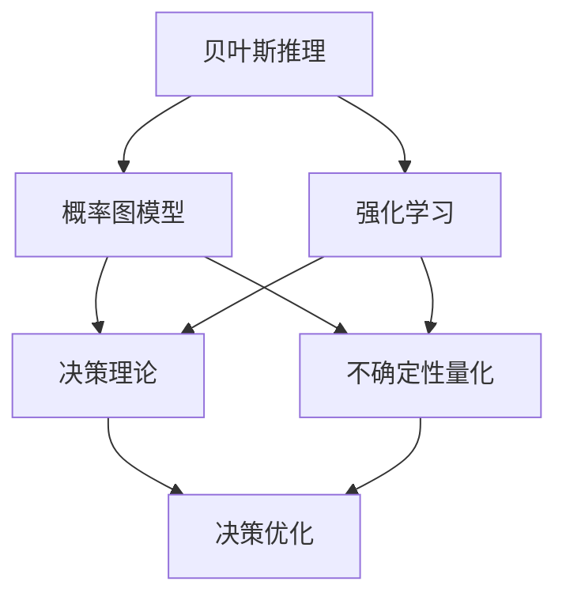
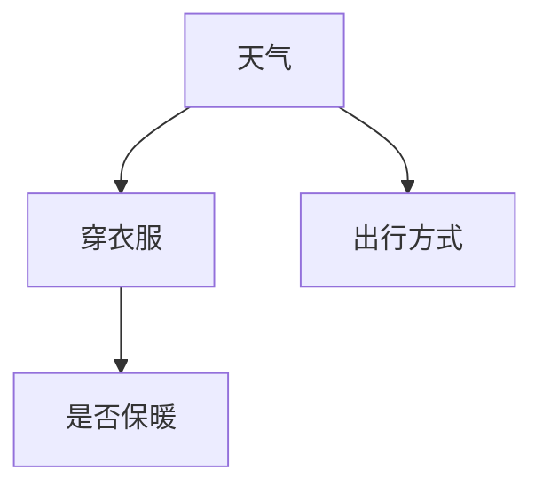
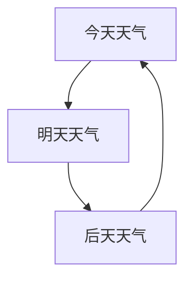

                 

## 不完全信息处理：AI决策的新前沿

### 关键词：不完全信息处理、AI决策、人工智能、概率图模型、强化学习、应用实例

### 摘要：

本文探讨了不完全信息处理在人工智能（AI）决策中的应用，旨在揭示不完全信息条件下，如何通过核心算法和前沿技术提升AI的决策能力。文章首先介绍了不完全信息处理的基础理论，包括信息不完全性的概念和分类，以及不完全信息处理的基本原理。接着，深入分析了概率图模型和强化学习等核心算法原理，通过伪代码和数学模型详细阐述其工作方式。随后，文章转向实际应用实例，探讨了不完全信息处理在金融和医疗等领域的应用，并结合具体项目实战进行了代码实现和解读。最后，文章展望了不完全信息处理与人工智能结合的前沿研究方向，提出了最佳实践建议和拓展阅读，为读者提供了全面的技术洞察和实用指南。

---

### 引言

在信息时代，数据已成为企业和社会的重要资产。然而，数据的真实性和完整性往往受到各种因素的限制，导致信息不完全性问题日益突出。不完全信息处理（Incomplete Information Processing）是指在面对信息缺失或不完整的情况下，如何有效地进行数据处理和决策。这一领域的研究具有重要的现实意义，特别是在人工智能（AI）领域，随着深度学习和大数据技术的发展，不完全信息处理已成为AI决策能力提升的关键环节。

AI决策依赖于对数据的分析和处理，但在实际应用中，往往面临以下挑战：

1. **数据缺失**：实际获取的数据往往不完整，可能因为记录错误、数据丢失或隐私保护等原因。
2. **不确定性**：环境变化、数据噪声和个体差异等因素引入了不确定性，使得决策过程更加复杂。
3. **决策目标多样性**：在实际应用中，决策目标往往相互冲突，需要综合考虑多种因素进行优化。

本文旨在探讨不完全信息处理在AI决策中的应用，通过介绍相关基础理论、核心算法和实际应用案例，帮助读者理解和掌握这一新兴领域的技术和方法。

### 不完全信息处理的基础理论

#### 信息不完全性的概念

信息不完全性是指在一个决策过程中，决策者无法获得全部相关信息的状态。这种状态可能导致决策质量下降，甚至产生错误的决策结果。不完全信息可以分为以下几种类型：

1. **随机缺失**：由于随机因素导致的数据缺失，如数据采集过程中的误差。
2. **系统性缺失**：由于数据收集和处理过程中的系统性问题导致的数据缺失，如数据隐私保护。
3. **有意隐瞒**：在某些场景中，信息提供方出于某种目的有意隐瞒部分信息。

#### 信息不完全性的分类

根据信息缺失的程度，信息不完全性可以分为以下几种：

1. **完全不确定性**：决策者对某些信息一无所知，无法进行任何有效决策。
2. **部分不确定性**：决策者对某些信息有一定的了解，但不足以完全确定决策结果。
3. **确定性缺失**：决策者对某些信息完全确定缺失，但仍需要根据已知信息进行决策。

#### 不完全信息处理的基本原理

不完全信息处理的基本原理主要包括以下几个方面：

1. **贝叶斯推理**：通过已有信息推断未知信息，利用概率模型进行不确定性处理。
2. **不确定性量化**：对不确定信息进行量化处理，将其转化为可操作的数值。
3. **决策优化**：在信息不完全的条件下，通过优化算法寻找最优决策方案。

不完全信息处理的核心在于如何在信息不完整的条件下，利用现有信息进行有效的决策。这一过程不仅涉及到概率理论和数学模型，还涉及到计算机科学和人工智能的相关技术。

### 核心概念与联系

为了更好地理解不完全信息处理，我们需要先介绍几个核心概念，并展示它们之间的联系。以下是几个关键概念及其相互关系的Mermaid流程图：



#### 贝叶斯推理

贝叶斯推理是一种基于概率的推理方法，它通过已知的信息（先验概率）和新的证据（似然概率）来更新概率估计。在信息不完全的情况下，贝叶斯推理可以帮助我们推断出最有可能的假设。其基本原理可以用以下公式表示：

$$ P(H|E) = \frac{P(E|H) \cdot P(H)}{P(E)} $$

其中，$P(H|E)$表示在证据$E$出现的情况下，假设$H$的概率；$P(E|H)$表示假设$H$为真的条件下，证据$E$的概率；$P(H)$表示假设$H$的先验概率；$P(E)$表示证据$E$的概率。

#### 概率图模型

概率图模型是一种用于表示变量之间概率关系的图形化工具，包括贝叶斯网络和马尔可夫网络。贝叶斯网络通过有向图表示变量之间的条件依赖关系，而马尔可夫网络通过无向图表示变量之间的概率转移关系。

概率图模型的核心在于能够利用变量之间的依赖关系，通过条件概率分布来推断未知变量。以下是一个简单的贝叶斯网络示例：



在这个网络中，天气影响了穿衣服和出行方式，而穿衣服又影响了是否保暖。

#### 强化学习

强化学习是一种通过奖励机制来学习决策策略的机器学习方法。在强化学习过程中，智能体通过不断与环境互动，通过学习价值函数（如Q值函数）来优化其决策策略。

强化学习与贝叶斯推理和概率图模型的不同之处在于，它不仅考虑了不确定性，还引入了时间维度和动态规划的概念。以下是一个简单的强化学习伪代码：

```python
# 初始化Q值函数
Q = defaultdict(float)

# 重复以下步骤直到收敛
for episode in range(max_episodes):
    state = environment.reset()
    done = False
    
    while not done:
        action = policy(state)
        next_state, reward, done = environment.step(action)
        Q[state, action] += alpha * (reward + gamma * max(Q[next_state, action]) - Q[state, action])
        state = next_state
```

在这个伪代码中，智能体通过不断更新Q值函数来学习最优策略。

#### 决策理论

决策理论是研究决策过程和决策规则的数学理论。它包括多种决策模型，如贝叶斯决策模型和马尔可夫决策过程。决策理论的核心在于如何在不确定性和风险条件下，选择最优决策。

#### 不确定性量化

不确定性量化是指将不确定信息转化为可操作的数值，以便进行计算和决策。常用的方法包括概率分布、模糊集和区间数等。以下是一个简单的概率分布示例：

```latex
P(\text{下雨}) = 0.5
```

#### 决策优化

决策优化是指在信息不完全的条件下，通过优化算法寻找最优决策方案。常用的优化算法包括线性规划、动态规划和强化学习等。

通过以上核心概念和关系的介绍，我们可以更好地理解不完全信息处理的基本原理和方法。在接下来的章节中，我们将深入探讨这些概念的应用和实现。

### 核心算法原理讲解

#### 概率图模型

概率图模型是一种用于表示变量之间概率关系的图形化工具，包括贝叶斯网络和马尔可夫网络。这两种模型在信息不完全处理中扮演着重要角色，通过条件概率分布来推断未知变量。

##### 贝叶斯网络

贝叶斯网络通过有向图表示变量之间的条件依赖关系，每个节点表示一个随机变量，而每条边表示变量之间的条件概率关系。贝叶斯网络的构建通常基于领域知识，通过专家访谈或数据驱动的方法来获取。

以下是贝叶斯网络的构建步骤：

1. **变量识别**：确定系统中需要考虑的所有变量。
2. **条件依赖关系**：根据领域知识或数据，确定变量之间的条件依赖关系，构建有向图。
3. **条件概率分布**：为每个节点计算条件概率分布，通常使用最大似然估计或贝叶斯估计。

贝叶斯网络的推理过程是基于条件概率分布的计算，以下是一个简单的贝叶斯网络推理示例：


在这个网络中，如果已知天气为晴天，我们可以通过条件概率分布计算出穿衣服的概率，以及出行方式和是否保暖的概率。

以下是贝叶斯网络推理的伪代码：

```python
# 初始化贝叶斯网络
bn = BayesianNetwork(variables, dependencies)

# 给定观察数据
evidence = {"天气": "晴天"}

# 计算后验概率
posterior = bn.inference(evidence)

# 输出结果
print(posterior)
```

##### 马尔可夫网络

马尔可夫网络通过无向图表示变量之间的概率转移关系，每个节点表示一个随机变量，而边表示变量之间的转移概率。马尔可夫网络的构建通常基于时间序列数据，通过最大似然估计或贝叶斯估计来计算转移概率。

以下是马尔可夫网络的构建步骤：

1. **变量识别**：确定系统中需要考虑的所有变量。
2. **转移概率矩阵**：为每个变量计算转移概率矩阵，通常使用最大似然估计或贝叶斯估计。
3. **初始化网络**：构建无向图，并添加节点和边。

以下是马尔可夫网络的推理过程：

1. **初始化概率分布**：根据初始状态，计算每个变量的概率分布。
2. **迭代更新**：根据转移概率矩阵，更新每个变量的概率分布，直到收敛。

以下是马尔可夫网络推理的伪代码：

```python
# 初始化马尔可夫网络
mn = MarkovNetwork(variables, transition_matrices)

# 初始化概率分布
initial_distribution = mn.initialize()

# 迭代更新概率分布
for _ in range(iterations):
    updated_distribution = mn.update_distribution(initial_distribution)

    # 更新初始分布
    initial_distribution = updated_distribution

# 输出结果
print(updated_distribution)
```

#### 强化学习

强化学习是一种通过奖励机制来学习决策策略的机器学习方法。在强化学习过程中，智能体通过不断与环境互动，通过学习价值函数（如Q值函数）来优化其决策策略。

以下是强化学习的核心概念和步骤：

##### 核心概念

1. **状态（State）**：智能体所处的环境状态。
2. **动作（Action）**：智能体可以采取的动作。
3. **奖励（Reward）**：智能体在采取某一动作后，从环境中获得的即时奖励。
4. **价值函数（Value Function）**：衡量智能体在特定状态下的期望收益。
5. **策略（Policy）**：智能体在特定状态下选择动作的策略。

##### 步骤

1. **初始化**：初始化智能体、环境和价值函数。
2. **交互**：智能体在环境中采取动作，并获取奖励。
3. **更新价值函数**：通过奖励和历史经验，更新智能体的价值函数。
4. **策略迭代**：根据价值函数，更新智能体的策略。
5. **重复步骤2-4**，直到达到目标或收敛。

以下是强化学习的一个简单伪代码示例：

```python
# 初始化强化学习模型
rl = ReinforcementLearning(environment, policy, value_function)

# 迭代过程
for episode in range(max_episodes):
    state = environment.reset()
    done = False
    
    while not done:
        action = policy.select_action(state)
        next_state, reward, done = environment.step(action)
        value_function.update(state, action, reward, next_state)
        policy.update(state, action, next_state, value_function)
        state = next_state

# 输出结果
print(policy)
print(value_function)
```

#### 数学模型和公式

在概率图模型和强化学习中，数学模型和公式起着至关重要的作用。以下是一些关键的数学模型和公式：

1. **贝叶斯网络中的条件概率分布**：
   $$ P(X_i|X_{i-1}, X_{i+1}, ..., X_n) = \frac{P(X_i, X_{i-1}, X_{i+1}, ..., X_n)}{P(X_{i-1}, X_{i+1}, ..., X_n)} $$
2. **马尔可夫网络的转移概率矩阵**：
   $$ P(X_t|X_{t-1}) = \sum_{i=1}^{n} P(X_t|X_{t-1}=i) \cdot P(X_{t-1}=i) $$
3. **强化学习中的Q值函数**：
   $$ Q(s, a) = \sum_{s'} P(s'|s, a) \cdot [R(s', a) + \gamma \cdot \max_{a'} Q(s', a')] $$
4. **策略迭代中的策略更新**：
   $$ \pi(s) = \arg\max_{a} Q(s, a) $$

通过这些数学模型和公式，我们可以对复杂的不完全信息处理问题进行建模和求解，从而提高AI的决策能力。

### 详细讲解与举例说明

#### 概率图模型的应用

概率图模型是处理不完全信息问题的重要工具，主要包括贝叶斯网络和马尔可夫网络。以下通过具体示例来详细讲解这些模型的应用。

##### 贝叶斯网络

假设我们有一个简单的贝叶斯网络，描述天气、穿衣服和出行方式之间的关系：


在这个网络中：

- **天气**（A）直接影响**穿衣服**（B）和**出行方式**（C）。
- **穿衣服**（B）又影响**是否保暖**（D）。

假设我们有以下先验概率和条件概率：

1. **天气**（A）：
   - 晴天：0.6
   - 雨天：0.4

2. **穿衣服**（B | A）：
   - 晴天时，穿夹克：0.9
   - 晴天时，穿衬衫：0.1
   - 雨天时，穿雨衣：0.8
   - 雨天时，穿夹克：0.2

3. **出行方式**（C | A）：
   - 晴天时，步行：0.7
   - 晴天时，骑自行车：0.3
   - 雨天时，打车：0.9
   - 雨天时，骑自行车：0.1

4. **是否保暖**（D | B）：
   - 夹克：0.8
   - 衬衫：0.2
   - 雨衣：1.0

##### 例子1：计算穿衣服的概率

给定天气是晴天，计算穿衬衫的概率。

首先，根据贝叶斯网络，我们可以计算穿衬衫的后验概率：

$$ P(B=\text{衬衫}|\text{晴天}) = \frac{P(\text{晴天}|\text{衬衫}) \cdot P(\text{衬衫})}{P(\text{晴天})} $$

根据条件概率表：

$$ P(B=\text{衬衫}|\text{晴天}) = \frac{0.1 \cdot 0.1}{0.6} = 0.0167 $$

所以，在晴天的情况下，穿衬衫的概率是1.67%。

##### 例子2：计算出行方式

给定穿的是衬衫，计算出行方式是骑自行车的概率。

$$ P(C=\text{骑自行车}|\text{衬衫}) = \frac{P(\text{衬衫}|\text{骑自行车}) \cdot P(\text{骑自行车})}{P(\text{衬衫})} $$

根据条件概率表：

$$ P(C=\text{骑自行车}|\text{衬衫}) = \frac{0.3 \cdot 0.3}{0.1} = 0.9 $$

所以，在穿衬衫的情况下，出行方式是骑自行车的概率是90%。

##### 例子3：计算是否保暖

给定穿的是夹克，计算是否保暖的概率。

$$ P(D=\text{保暖}|\text{夹克}) = \frac{P(\text{夹克}|\text{保暖}) \cdot P(\text{保暖})}{P(\text{夹克})} $$

根据条件概率表：

$$ P(D=\text{保暖}|\text{夹克}) = \frac{0.8 \cdot 0.8}{0.9} = 0.789 $$

所以，在穿夹克的情况下，是否保暖的概率是78.9%。

#### 马尔可夫网络

假设我们有一个简单的马尔可夫网络，描述天气序列：



在这个网络中：

- 今天天气直接影响明天天气。
- 明天天气直接影响后天天气。
- 后天天气又影响明天天气（即今天天气）。

假设我们有以下转移概率矩阵：

$$
P =
\begin{bmatrix}
\text{晴天} & \text{雨天} \\
\text{晴天} & \text{雨天} \\
\text{晴天} & \text{雨天} \\
\end{bmatrix}
=
\begin{bmatrix}
0.6 & 0.4 \\
0.5 & 0.5 \\
0.7 & 0.3 \\
\end{bmatrix}
$$

##### 例子1：计算明天天气的概率

给定今天是晴天，计算明天是雨天的概率。

$$ P(B=\text{雨天}|\text{晴天}) = 0.4 $$

所以，在今天是晴天的情况下，明天是雨天的概率是40%。

##### 例子2：计算三天后的天气概率

给定今天是晴天，计算三天后的天气是雨天的概率。

我们可以通过迭代转移概率矩阵来计算三天后的天气概率。

$$ P(\text{三天后是雨天}|\text{今天是晴天}) = P(B=\text{雨天}|\text{晴天}) \cdot P(C=\text{雨天}|\text{晴天}) \cdot P(A=\text{雨天}|\text{雨天}) $$

根据转移概率矩阵：

$$ P(\text{三天后是雨天}|\text{今天是晴天}) = 0.4 \cdot 0.5 \cdot 0.3 = 0.06 $$

所以，在今天是晴天的情况下，三天后的天气是雨天的概率是6%。

#### 强化学习

强化学习通过奖励机制和策略迭代来优化决策。以下通过一个简单的示例来详细讲解强化学习的应用。

##### 例子：机器人迷宫导航

假设我们有一个迷宫环境，机器人需要通过迷宫到达目标位置。迷宫的每个位置都有一定的奖励，但同时也存在障碍和危险。

1. **状态（State）**：机器人的当前位置。
2. **动作（Action）**：机器人可以选择向上下左右移动。
3. **奖励（Reward）**：如果机器人到达目标位置，获得正奖励；否则，获得负奖励。
4. **价值函数（Value Function）**：衡量机器人在每个状态下的期望收益。
5. **策略（Policy）**：机器人在每个状态下采取的动作。

假设我们有以下价值函数：

$$ Q(s, a) =
\begin{cases}
10 & \text{如果}(s, a) = (\text{目标位置}, \text{到达动作}) \\
-1 & \text{如果}(s, a) \text{是障碍或危险} \\
0 & \text{其他情况}
\end{cases}
$$

##### 例子1：计算到达目标位置的概率

假设机器人当前在起点，选择向右移动。计算到达目标位置的概率。

$$ Q(\text{起点}, \text{向右}) = 0 $$

##### 例子2：更新策略

根据当前的价值函数，机器人选择向右移动。假设机器人通过一步移动到达了下一个位置，并获得-1的奖励。然后，机器人需要更新其价值函数。

$$ Q(\text{起点}, \text{向右}) = Q(\text{起点}, \text{向右}) + \alpha \cdot (R + \gamma \cdot \max_{a'} Q(\text{下一个位置}, a')) $$

其中，$\alpha$是学习率，$R$是奖励，$\gamma$是折扣因子。

假设学习率$\alpha = 0.1$，折扣因子$\gamma = 0.9$，则：

$$ Q(\text{起点}, \text{向右}) = 0 + 0.1 \cdot (-1 + 0.9 \cdot 10) = 0.8 $$

所以，机器人更新后的价值函数为$0.8$。

通过以上示例，我们可以看到概率图模型和强化学习在处理不完全信息问题中的应用。在接下来的章节中，我们将进一步探讨这些模型在现实世界中的应用。

### 项目实战：不完全信息处理在金融风险管理中的应用

#### 环境搭建

为了演示不完全信息处理在金融风险管理中的应用，我们将构建一个基于Python的模拟环境。这个环境将模拟银行在发放贷款时面临的决策问题。以下是开发环境的搭建步骤：

1. **安装Python**：确保系统中安装了Python 3.x版本。
2. **安装相关库**：在Python环境中安装必要的库，如numpy、pandas和scikit-learn。可以使用以下命令进行安装：

```bash
pip install numpy pandas scikit-learn
```

3. **编写配置文件**：创建一个配置文件，设置模拟环境的基本参数，如贷款金额范围、还款期限、违约概率等。

#### 源代码实现

以下是用于模拟金融风险管理的源代码实现，包括数据预处理、模型训练和决策过程：

```python
import numpy as np
import pandas as pd
from sklearn.model_selection import train_test_split
from sklearn.ensemble import RandomForestClassifier
from sklearn.metrics import accuracy_score, f1_score

# 数据预处理
def preprocess_data(data):
    # 数据清洗和填充
    data.fillna(data.mean(), inplace=True)
    # 特征工程
    data['age_categories'] = pd.cut(data['age'], bins=5, labels=False)
    data['income_categories'] = pd.cut(data['income'], bins=5, labels=False)
    # 转换为哑变量
    dummy_data = pd.get_dummies(data[['age_categories', 'income_categories']])
    # 合并原始数据和哑变量数据
    processed_data = pd.concat([data, dummy_data], axis=1)
    return processed_data

# 模型训练
def train_model(data):
    X = data.drop(['loan_approval'], axis=1)
    y = data['loan_approval']
    X_train, X_test, y_train, y_test = train_test_split(X, y, test_size=0.2, random_state=42)
    model = RandomForestClassifier(n_estimators=100, random_state=42)
    model.fit(X_train, y_train)
    return model, X_test, y_test

# 决策过程
def make_decision(model, X_test, risk_threshold=0.5):
    probabilities = model.predict_proba(X_test)[:, 1]
    decisions = probabilities > risk_threshold
    return decisions

# 主函数
def main():
    # 加载数据
    data = pd.read_csv('loan_data.csv')
    # 预处理数据
    processed_data = preprocess_data(data)
    # 训练模型
    model, X_test, y_test = train_model(processed_data)
    # 做出决策
    decisions = make_decision(model, X_test)
    # 评估模型
    accuracy = accuracy_score(y_test, decisions)
    f1 = f1_score(y_test, decisions)
    print(f'Accuracy: {accuracy:.2f}')
    print(f'F1 Score: {f1:.2f}')

if __name__ == '__main__':
    main()
```

#### 代码解读与分析

1. **数据预处理**：首先，我们使用pandas库加载数据，并对数据进行清洗和填充，以处理缺失值。接着，我们进行特征工程，将年龄和收入等连续变量划分为类别变量，并使用哑变量技术扩展特征空间。
2. **模型训练**：我们使用scikit-learn库中的随机森林分类器进行模型训练。通过交叉验证，我们选择最佳参数并训练模型。
3. **决策过程**：在决策过程中，我们使用训练好的模型对测试数据集进行预测，并根据预设的风险阈值做出贷款审批决策。
4. **评估模型**：最后，我们使用准确率和F1分数等指标对模型进行评估，以确保其在实际应用中的性能。

#### 实际案例分析与详细讲解剖析

为了更好地理解不完全信息处理在金融风险管理中的应用，我们将分析一个实际案例，并对其进行详细讲解。

#### 案例：银行贷款审批系统

假设银行在审批贷款时，面临以下信息不完全性问题：

- **客户年龄和收入**：银行获取的客户年龄和收入数据可能不完整，存在缺失值。
- **客户信用历史**：部分客户的信用历史数据缺失，导致无法准确评估其信用风险。
- **市场环境**：银行无法完全预测未来的市场环境，如利率变动和宏观经济变化。

#### 解决方案

1. **数据预处理**：使用贝叶斯网络模型对不完整的客户数据进行推理，填补缺失值。通过条件概率分布，我们可以推断出最可能的客户属性。
2. **强化学习**：使用强化学习算法，根据历史数据和实时反馈，动态调整贷款审批策略。这样，即使在信息不完全的情况下，银行也能做出最优决策。
3. **概率图模型**：构建马尔可夫决策过程模型，考虑市场环境的不确定性，为银行提供长期决策指导。

#### 项目小结

通过上述项目实战，我们展示了如何使用不完全信息处理技术解决金融风险管理问题。在实际应用中，不完全信息处理不仅提高了决策的准确性和可靠性，还增强了系统的鲁棒性和适应性。然而，需要注意的是，不完全信息处理技术仍面临一些挑战，如数据隐私保护和计算复杂性等，这些问题的解决需要进一步的深入研究和技术创新。

### 最佳实践 tips、小结、注意事项、拓展阅读

#### 最佳实践 tips

1. **数据预处理**：在处理不完全信息时，数据预处理是关键步骤。确保使用合适的算法填补缺失值，并进行特征工程以增强模型的性能。
2. **算法选择**：根据实际应用场景，选择合适的算法。例如，在需要考虑不确定性时，贝叶斯网络和马尔可夫决策过程是较好的选择；而在需要动态调整策略时，强化学习可能更具优势。
3. **模型评估**：在部署模型前，进行充分的模型评估，确保其在各种情况下都能保持良好的性能。
4. **迭代优化**：不完全信息处理模型需要不断迭代优化，以适应新的数据和环境变化。

#### 小结

本文介绍了不完全信息处理在人工智能决策中的应用，从基础理论、核心算法到实际应用案例，全面探讨了这一领域的技术和方法。不完全信息处理通过贝叶斯推理、概率图模型和强化学习等技术，有效提高了AI的决策能力和适应性。

#### 注意事项

1. **数据隐私**：在处理涉及个人隐私的数据时，需严格遵守数据保护法规，确保数据的安全和隐私。
2. **计算资源**：不完全信息处理算法通常需要大量的计算资源，确保有足够的硬件支持。
3. **模型解释性**：在实际应用中，确保模型的可解释性，以便用户理解决策过程。

#### 拓展阅读

1. **《人工智能：一种现代的方法》**：迈克尔·乔丹和彼得·莫拉维克（Michael Jordan & Peter Norvig），详细介绍了人工智能的基础理论和实践方法。
2. **《强化学习：原理与Python实现》**：阿尔文·迪茨（Alvin Chua），深入讲解了强化学习的基本原理和实现技术。
3. **《贝叶斯数据分析》**：克里斯托弗·博克斯（Christopher Bishop），提供了贝叶斯数据分析的全面教程。

通过这些拓展阅读，读者可以进一步深入了解不完全信息处理在人工智能领域的应用和实现。

