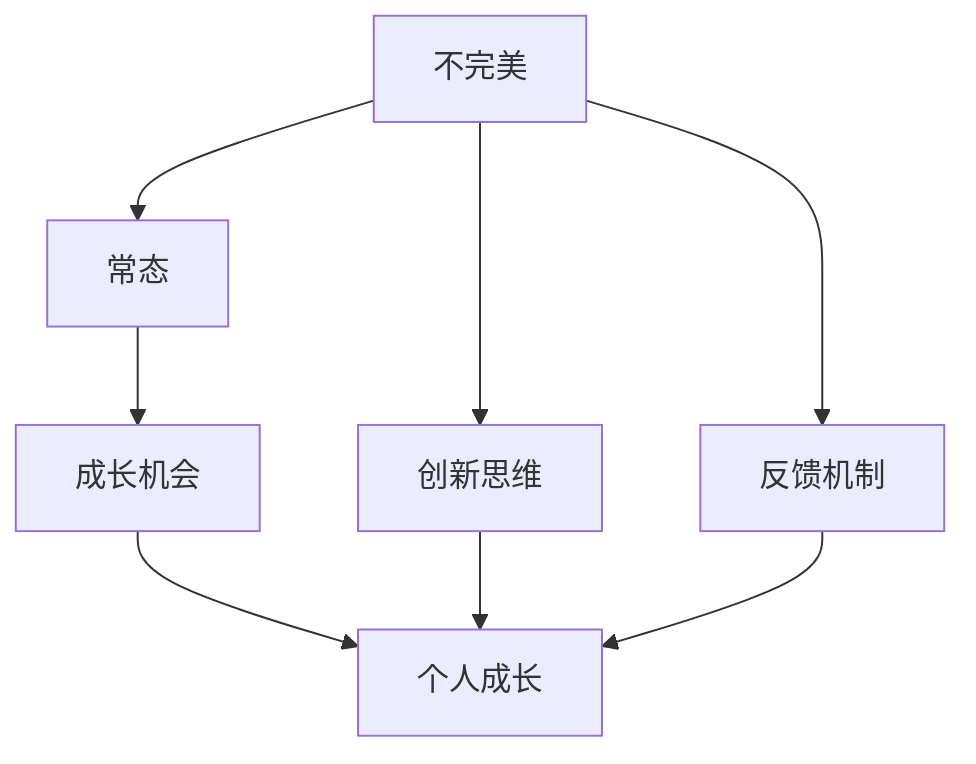

                 

# 文章标题：不完美也可以有所作为

> 关键词：不完美，成长，成功，策略，工具，心态调整

> 摘要：本文旨在探讨不完美在个人生活和工作中的普遍性，并强调不完美并非障碍，而是一个机会。通过提供一系列策略和工具，本文将帮助读者学会如何利用和改善不完美，从而实现个人成长和成功。

## 第1章 引言：不完美也可以有所作为

### 1.1 背景介绍

在现实生活的方方面面，不完美无处不在。无论是个人生活、工作环境还是人际关系，我们都会遇到各种各样的不完美。这些不完美可能表现为事物的不完美，也可能表现为个人的不足。然而，不完美并非完全的负面因素，它也可以成为一种机会和动力。

### 1.2 作者观点

作为一名人工智能专家和程序员，我深知不完美在技术领域中的普遍性。在实际工作中，我们经常需要面对各种复杂的问题和挑战，这些问题的解决往往需要我们发挥创新思维和解决问题的能力。因此，我认为，不完美并非障碍，而是一个机会。通过接受和利用不完美，我们可以实现个人成长和成功。

### 1.3 阅读指南

本书将分为八个章节，从不同角度探讨不完美的问题。每个章节都将提供具体的策略和工具，帮助读者学会如何应对和改善不完美。在阅读过程中，读者可以结合自身实际情况，积极思考和尝试，从而更好地理解和应用书中的内容。

## 第2章 不完美：理解与接受

### 2.1 不完美是一种常态

不完美是生活中的一种常态。无论是在个人生活中，还是在工作中，我们都会遇到各种各样的不完美。这些不完美可能来源于外部环境，也可能来源于我们自身的不足。然而，正是这些不完美，推动了我们的成长和进步。

### 2.2 调整心态：从接受到利用

要应对不完美，首先需要调整心态。我们需要从接受不完美开始，认识到不完美是生活的一部分，是成长的机会。然后，我们可以通过积极的态度和行动，将不完美转化为动力，推动自己不断进步。

### 2.3 不完美：一个全新的视角

当我们以全新的视角看待不完美时，会发现它并非全是负面的。不完美可以激发我们的创新思维，推动我们寻找新的解决方案。同时，不完美也可以让我们更加珍惜现有的成果，从而更加努力地追求更好的未来。

## 第3章 改变不完美：策略与方法

### 3.1 审视不完美：识别问题

要改变不完美，首先需要识别问题。通过审视自身和环境，我们可以发现哪些方面存在不完美，并确定改进的方向。

### 3.2 设定目标：明确方向

在识别问题之后，我们需要设定目标。一个明确的目标可以指导我们的行动，帮助我们更有效地改善不完美。

### 3.3 行动计划：逐步改善

制定和执行行动计划是实现目标的关键。通过逐步改善，我们可以逐步消除不完美，实现个人成长和成功。

## 第4章 个人成长：从不完美到完美

### 4.1 学习与适应

通过不断学习和适应，我们可以减少生活中的不完美。学习新的知识和技能，可以让我们更好地应对各种挑战。

### 4.2 发展技能：弥补不完美

通过发展个人技能，我们可以弥补自身的不足，从而改善生活中的不完美。例如，提高沟通能力、解决问题的能力等。

### 4.3 建立自信：面对不完美

自信是面对不完美的关键。通过建立自信，我们可以更加从容地应对生活中的挑战，从而实现个人成长。

## 第5章 团队协作：不完美中的力量

### 5.1 合作与沟通

团队协作是改善不完美的有效途径。通过合作与沟通，我们可以充分发挥团队的力量，共同应对挑战。

### 5.2 多元化视角：互补不完美

多元化视角可以帮助团队更好地应对不完美。不同的观点和经验可以互补团队中的不足，从而提高团队的应对能力。

### 5.3 解决冲突：协同不完美

在团队中，冲突是不可避免的。然而，通过有效的解决冲突，我们可以将冲突转化为团队协作的动力，共同应对不完美。

## 第6章 创新与突破：利用不完美

### 6.1 创新思维：从问题中寻找机会

创新思维可以帮助我们将不完美转化为机会。通过从问题中寻找机会，我们可以实现创新和突破。

### 6.2 突破困境：主动应对不完美

在面对困境时，主动应对是关键。通过主动应对，我们可以找到突破点，实现个人和团队的成长。

### 6.3 创新实践：成功案例分享

通过分享成功案例，我们可以看到如何利用不完美进行创新实践，从而实现个人和团队的突破。

## 第7章 不完美生活：平衡与快乐

### 7.1 生活管理：规划与平衡

通过有效的规划和平衡，我们可以管理不完美的生活。这包括时间管理、任务分配等。

### 7.2 快乐源泉：寻找生活中的美好

在充满不完美的生活中，我们可以寻找生活中的美好。这包括家庭、朋友、爱好等。

### 7.3 持续进步：不完美中的成长

在生活的不断进步中，我们可以面对和利用不完美。通过持续进步，我们可以实现个人成长和成功。

## 第8章 结论：拥抱不完美，迎接美好

### 8.1 总结本书的核心观点

本书的核心观点是：不完美并非障碍，而是一个机会。通过接受和利用不完美，我们可以实现个人成长和成功。

### 8.2 拥抱不完美，创造未来

拥抱不完美，意味着积极面对生活中的挑战。通过不断学习和进步，我们可以创造一个更加美好的未来。

### 8.3 读者行动指南

作为读者，你们可以通过以下行动指南，将书中的内容应用到实际生活中：

1. **自我审视**：定期审视自己的生活和工作中存在的不完美，识别问题，明确改进方向。
2. **设定目标**：为自己设定明确的目标，制定行动计划，逐步实现。
3. **积极行动**：勇于面对挑战，主动解决问题，不断进步。
4. **团队协作**：与他人合作，分享经验，互补不足，共同成长。
5. **持续学习**：不断学习新知识和技能，提升自我，适应变化。
6. **保持乐观**：保持积极的心态，面对不完美，寻找机会，创造美好。

作者：AI天才研究院/AI Genius Institute & 禅与计算机程序设计艺术 /Zen And The Art of Computer Programming## 第1章 引言：不完美也可以有所作为

### 1.1 背景介绍

在现实生活的方方面面，不完美无处不在。无论是个人生活、工作环境还是人际关系，我们都会遇到各种各样的不完美。这些不完美可能表现为事物的缺陷，也可能表现为个人的不足。然而，不完美并非完全的负面因素，它也可以成为一种机会和动力。

在技术领域中，不完美同样普遍存在。软件开发中，系统可能会存在漏洞和缺陷；人工智能研究中，算法可能无法完美地处理所有问题；甚至在最先进的科学领域，也存在着尚未解决的难题。面对这些不完美，我们可以选择逃避或抱怨，但更有效的方式是接受和利用这些不完美，从中寻找创新和进步的机会。

### 1.2 作者观点

作为一名人工智能专家和程序员，我深知不完美在技术领域中的普遍性。在实际工作中，我们经常需要面对各种复杂的问题和挑战，这些问题的解决往往需要我们发挥创新思维和解决问题的能力。因此，我认为，不完美并非障碍，而是一个机会。通过接受和利用不完美，我们可以实现个人成长和成功。

在本书中，我将分享一系列策略和工具，帮助读者学会如何应对和改善不完美。这些策略和工具不仅适用于技术领域，也可以广泛应用于个人生活、工作和人际关系中。通过调整心态、审视不完美、设定目标、制定行动计划等步骤，我们可以将不完美转化为动力，推动自己不断进步。

### 1.3 阅读指南

本书将分为八个章节，从不同角度探讨不完美的问题。每个章节都将提供具体的策略和工具，帮助读者学会如何应对和改善不完美。在阅读过程中，读者可以结合自身实际情况，积极思考和尝试，从而更好地理解和应用书中的内容。

以下是本书的结构安排：

1. **第1章 引言：不完美也可以有所作为**：介绍不完美的背景和重要性，阐述作者的观点和本书的阅读指南。
   
2. **第2章 不完美：理解与接受**：探讨不完美在个人生活和工作中的存在，以及如何调整心态，从接受到利用不完美。

3. **第3章 改变不完美：策略与方法**：提供识别和改变不完美的具体策略和方法。

4. **第4章 个人成长：从不完美到完美**：讨论通过学习、适应和发展技能，如何从不完美中实现个人成长。

5. **第5章 团队协作：不完美中的力量**：强调团队协作在改善不完美中的重要性，并提供有效的沟通技巧和团队建设策略。

6. **第6章 创新与突破：利用不完美**：探索如何通过创新思维和主动应对，将不完美转化为机会和突破。

7. **第7章 不完美生活：平衡与快乐**：分析如何在充满不完美的生活中寻找平衡和快乐。

8. **第8章 结论：拥抱不完美，迎接美好**：总结本书的核心观点，鼓励读者拥抱不完美，创造美好未来。

通过这八个章节的阅读，读者将能够全面了解如何应对和改善不完美，从而实现个人成长和成功。同时，本书也旨在激励读者积极面对生活中的挑战，将不完美转化为动力，追求更好的自己。

### 1.4 启示与期望

通过阅读本书，我希望读者能够获得以下启示：

1. **接受不完美**：认识到不完美是生活中的一部分，是成长和进步的机会。
2. **积极应对**：面对不完美时，保持积极的态度，寻找解决问题的方法。
3. **持续进步**：不断学习和成长，通过改变和改进，实现个人和事业的突破。
4. **团队协作**：与他人合作，互补不足，共同应对不完美。
5. **创新思维**：通过创新和突破，将不完美转化为机会和突破。

我相信，通过这些启示，读者不仅能够在个人生活中有所收获，也能够在工作中取得更大的成功。希望本书能够成为读者在追求卓越的道路上的得力助手，助力他们拥抱不完美，迎接美好的未来。

## 第2章 不完美：理解与接受

### 2.1 不完美是一种常态

不完美是生活中的一种常态。无论是在个人生活中，还是在工作中，我们都会遇到各种各样的不完美。这些不完美可能表现为事物的缺陷，也可能表现为个人的不足。然而，正是这些不完美，推动了我们的成长和进步。

在技术领域中，不完美同样普遍存在。软件开发中，系统可能会存在漏洞和缺陷；人工智能研究中，算法可能无法完美地处理所有问题；甚至在最先进的科学领域，也存在着尚未解决的难题。面对这些不完美，我们可以选择逃避或抱怨，但更有效的方式是接受和利用这些不完美，从中寻找创新和进步的机会。

在个人生活中，不完美同样无处不在。无论是人际关系的处理，还是个人目标的实现，都可能会遇到各种挑战。这些挑战和不足，正是我们成长和进步的动力。通过接受和应对这些不完美，我们可以不断提升自己，实现个人成长。

### 2.2 调整心态：从接受到利用

要应对不完美，首先需要调整心态。我们需要从接受不完美开始，认识到不完美是生活的一部分，是成长和进步的机会。然后，我们可以通过积极的态度和行动，将不完美转化为动力，推动自己不断进步。

首先，接受不完美意味着认识到它是一种常态。我们不能期望一切都能完美无缺，也不能因为出现不完美就感到沮丧或失落。相反，我们应该以平和的心态接受不完美，将其视为一种挑战和机遇。

接下来，我们需要将不完美转化为动力。这意味着我们要在遇到不完美时，保持积极的态度，寻找解决问题的方法。例如，当我们在工作中遇到问题时，不应该抱怨或逃避，而是要积极面对，通过学习和实践，找到解决问题的方法。

最后，我们可以通过调整心态，将不完美视为成长的机会。这意味着我们要从每次失败和不足中学习，不断提升自己的能力和水平。通过这种积极的心态，我们可以更好地应对不完美，实现个人成长。

### 2.3 不完美：一个全新的视角

当我们以全新的视角看待不完美时，会发现它并非全是负面的。不完美可以激发我们的创新思维，推动我们寻找新的解决方案。同时，不完美也可以让我们更加珍惜现有的成果，从而更加努力地追求更好的未来。

首先，不完美可以激发我们的创新思维。当面对不完美时，我们会思考如何改进和优化，从而找到新的解决方案。这种创新思维可以推动我们在技术、工作和生活中不断进步。

其次，不完美可以让我们更加珍惜现有的成果。当我们意识到自己的成就中存在不完美时，会更加珍惜这些成果，并努力提升自己的能力和水平。这种珍惜和努力，可以激发我们的内在动力，推动我们不断追求卓越。

最后，不完美也可以作为一种反馈机制。通过面对不完美，我们可以发现自身的不足和问题，从而找到改进的方向。这种反馈机制可以帮助我们不断调整和优化，实现个人成长和成功。

总之，不完美并非完全的负面因素，它也可以成为一种机会和动力。通过接受和利用不完美，我们可以实现个人成长和成功。在接下来的章节中，我们将探讨如何识别和改变不完美，以及如何通过个人成长、团队协作和创新思维，应对和利用不完美，实现更大的成功。

### 2.4 核心概念与联系：Mermaid流程图

为了更好地理解不完美在个人成长和成功中的角色，我们可以使用Mermaid流程图来展示核心概念之间的关系。以下是一个简化的流程图：

在这个流程图中，我们可以看到以下核心概念之间的联系：

- **不完美**：作为生活中的一种常态，既包括外部环境中的不完美，也包括个人生活中的不足。
- **常态**：不完美是生活中的一部分，是不可避免的现象。
- **成长机会**：不完美可以转化为成长的机会，激发创新思维，推动个人进步。
- **创新思维**：通过面对不完美，我们可以激发创新思维，寻找新的解决方案。
- **反馈机制**：不完美作为一种反馈，可以帮助我们发现自身不足，找到改进方向。
- **个人成长**：通过创新思维和反馈机制，我们可以实现个人成长和成功。

通过这个流程图，我们可以更清晰地理解不完美在个人成长和成功中的重要作用，以及各个概念之间的相互联系。

### 2.5 不完美带来的积极影响

不完美并非全然负面，它也可以带来许多积极的影响。首先，不完美可以激发我们的创新思维。当面对不完美时，我们会思考如何改进和优化，从而找到新的解决方案。这种创新思维可以推动我们在技术、工作和生活中不断进步。

例如，在软件开发过程中，系统可能会出现各种漏洞和缺陷。这些不完美可以激发开发者的创新思维，促使他们寻找新的解决方案，改进系统性能和安全性。通过不断的改进和创新，软件最终可以变得更加完善和可靠。

其次，不完美可以让我们更加珍惜现有的成果。当我们意识到自己的成就中存在不完美时，会更加珍惜这些成果，并努力提升自己的能力和水平。这种珍惜和努力，可以激发我们的内在动力，推动我们不断追求卓越。

例如，在职业生涯中，我们可能会遇到各种挑战和困难。这些不完美可以让我们更加珍惜现有的工作机会，努力提升自己的能力和技能，从而在职业道路上取得更大的成功。

最后，不完美可以作为反馈机制，帮助我们不断调整和优化。通过面对不完美，我们可以发现自身的不足和问题，从而找到改进的方向。这种反馈机制可以帮助我们不断学习和成长，实现个人和职业的突破。

总之，不完美并非完全的负面因素，它也可以带来许多积极的影响。通过接受和利用不完美，我们可以激发创新思维，珍惜现有成果，不断调整和优化，实现个人成长和成功。

### 2.6 为什么接受和利用不完美能够带来成功

接受和利用不完美能够带来成功的原因可以从多个角度进行分析。

首先，不完美提供了一个挑战和成长的机会。当我们在面对不完美时，必须寻找解决方案，这种过程本身就是一个学习和成长的过程。通过不断地解决问题，我们的思维能力和解决问题的技巧会得到显著提升，从而为我们在未来的工作和生活中应对各种挑战打下坚实的基础。

例如，在软件开发领域，系统可能会存在各种漏洞和缺陷。程序员在修复这些漏洞和缺陷的过程中，不仅需要掌握更多的编程技巧，还需要培养良好的问题分析和解决能力。这种能力的提升，使得程序员在面对更加复杂的项目时能够更加从容应对。

其次，接受和利用不完美可以激发我们的创新思维。面对不完美时，我们会思考如何改进现有的方案，或者从新的角度寻找解决方案。这种创新思维可以推动我们在技术、工作和生活中不断进步。

例如，在科学研究中，科学家经常会遇到无法解释的现象和问题。通过接受和利用这些不完美，科学家们能够不断提出新的假设和理论，推动科学的发展。历史上许多重大科学发现，如DNA的双螺旋结构和量子力学的建立，都是在面对不完美时产生的。

此外，接受和利用不完美可以帮助我们建立更强的适应能力。在现实生活中，不完美是不可避免的，如果我们能够接受和利用这些不完美，我们的适应能力将得到显著提升。这种适应能力不仅有助于我们在工作中应对各种变化和挑战，还能够帮助我们在生活中更加从容地应对各种突发情况。

例如，在创业过程中，创业者经常会遇到各种意想不到的困难和挑战。如果创业者能够接受和利用这些不完美，积极寻找解决方案，他们的创业项目就有更大的可能成功。许多成功的创业故事，都是在面对不完美时，通过不断调整和优化，最终取得成功的。

最后，接受和利用不完美可以帮助我们建立更加积极的心态。当我们把不完美看作是成长的机会时，我们会更加乐观地面对生活中的各种挑战。这种积极的心态不仅可以提高我们的生活质量，还能够激发我们的内在动力，推动我们不断追求更高的目标。

例如，在个人成长过程中，我们可能会遇到各种挫折和困难。如果我们能够接受和利用这些不完美，将其看作是成长的机会，我们的心态会更加积极，更有可能取得成功。

总之，接受和利用不完美能够带来成功的原因是多方面的，包括提供成长机会、激发创新思维、提升适应能力和建立积极心态等。通过接受和利用不完美，我们可以实现个人和事业的突破，创造更加美好的未来。

### 2.7 实际案例分享：不完美带来的成长与成功

为了更直观地展示不完美如何带来成长和成功，我们可以通过几个实际案例来分析。

**案例一：乔布斯的创新之路**

苹果公司的创始人乔布斯是一个典型的例子。在他的职业生涯中，苹果公司经历了许多挫折和不完美。例如，Macintosh计算机的失败、NeXT计算机的市场表现不佳等。然而，乔布斯并没有因此放弃，相反，他接受并利用这些不完美，从中汲取经验，推动苹果公司的创新和发展。

乔布斯通过将这些挫折视为成长的机会，不断改进产品，最终推出了iPhone、iPad等颠覆性产品。这些产品的成功不仅改变了苹果公司的命运，也改变了整个科技行业。乔布斯的经历表明，接受和利用不完美，可以激发创新思维，推动个人和公司的成长。

**案例二：乔尔·马奎特的创业故事**

另一个例子是GitHub的创始人乔尔·马奎特（Joel Spolsky）。在创立GitHub之前，马奎特曾在微软工作，并参与开发了一些知名的产品，如Outlook Express。然而，在微软的工作经历并没有让他感到满意，他意识到自己需要创业。

在创立GitHub的过程中，马奎特面临着诸多挑战，包括技术上的不完美、市场竞争的压力等。然而，他并没有被这些不完美所困扰，而是积极地寻找解决方案。通过不断优化产品和服务，GitHub最终成为了全球最大的代码托管平台之一，吸引了数百万开发者和企业用户。

马奎特的创业故事展示了如何通过接受和利用不完美，实现个人和事业的突破。他通过不断调整和改进，将不完美转化为成功的机会。

**案例三：埃隆·马斯克的太空探索**

埃隆·马斯克（Elon Musk）的太空探索公司（SpaceX）也是一个典型的例子。在SpaceX的发展过程中，马斯克面临着诸多不完美，包括火箭发射失败、成本超支等。然而，他并没有因此放弃，反而将这些不完美视为成长的机会。

通过持续的创新和改进，SpaceX成功地降低了火箭发射的成本，并实现了多次成功的卫星发射和载人航天任务。马斯克的经历表明，接受和利用不完美，可以推动技术进步和产业变革。

这些案例展示了不完美如何在不同领域和不同背景下，带来成长和成功。通过接受和利用不完美，我们可以激发创新思维，提升适应能力，最终实现个人和事业的突破。

### 2.8 小结与思考

通过本章的探讨，我们可以看到不完美在个人成长和成功中的重要性。不完美并非完全的负面因素，它也可以成为一种机会和动力。通过接受和利用不完美，我们可以激发创新思维，提升适应能力，实现个人和事业的突破。

在现实生活中，我们都会遇到各种各样的不完美。面对这些不完美，我们应该保持积极的心态，从中寻找机会，不断学习和进步。通过调整心态、审视不完美、设定目标、制定行动计划等步骤，我们可以将不完美转化为动力，推动自己不断成长。

在接下来的章节中，我们将进一步探讨如何具体应对和改善不完美，以及如何通过个人成长、团队协作和创新思维，实现更大的成功。希望读者能够结合自身实际情况，积极思考和尝试，将书中的内容应用到实际生活中，实现个人和事业的突破。

### 2.9 注意事项与拓展阅读

在应对和利用不完美时，以下几点注意事项和建议可能对读者有所帮助：

1. **保持耐心**：改变不完美需要时间和努力，保持耐心是非常重要的。不要期望一夜之间就能解决所有问题，而是要持之以恒，逐步改善。

2. **具体行动**：仅仅认识到不完美是不够的，关键在于采取具体的行动。制定明确的行动计划，并严格执行，这是实现改变的关键。

3. **持续学习**：在不断应对不完美的过程中，持续学习新的知识和技能是非常重要的。通过学习，我们可以更好地应对挑战，找到解决问题的方法。

4. **反思与总结**：在应对不完美的过程中，定期进行反思和总结也是非常重要的。通过反思和总结，我们可以发现自身的不足，找到改进的方向。

5. **心态调整**：保持积极的心态是应对不完美的关键。当遇到挫折和困难时，要相信自己有能力克服，保持乐观和自信。

为了进一步拓展读者对不完美主题的理解，以下是一些建议的拓展阅读资源：

- 《活法》（作者：稻盛和夫）：本书介绍了如何通过调整心态和积极应对生活中的不完美，实现个人成长和成功。
- 《精益创业》（作者：埃里克·莱斯）：本书提供了关于如何在不确定性和不完美中快速迭代和改进的创新方法。
- 《黑天鹅：如何应对不可预知的未来》（作者：纳西姆·尼古拉斯·塔勒布）：本书探讨了不可预测事件（黑天鹅事件）对我们的影响，以及如何应对这些不可预测事件。

通过这些拓展阅读，读者可以更加深入地了解如何应对和利用不完美，从而实现个人和职业的突破。希望这些建议对读者有所帮助，助力他们在追求卓越的道路上取得更大的成功。

