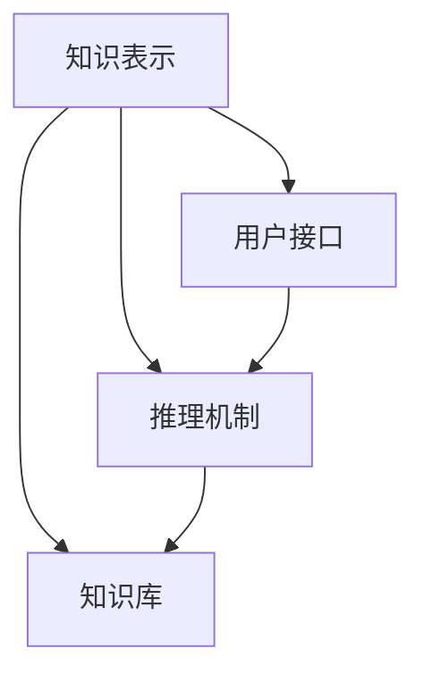

                 


### 概述

**专家系统：AI早期的重要分支**是一本深入探讨专家系统这一人工智能早期重要分支的专著。专家系统是指能够模拟人类专家解决复杂问题的计算机系统，它结合了人工智能、计算机科学和领域专业知识，通过对大量数据的学习和处理，实现决策和判断。本书旨在为读者提供一个全面、系统的专家系统知识体系，包括其历史背景、核心概念、实现技术、应用领域以及未来的发展趋势。

关键词：专家系统、人工智能、知识表示、推理机制、核心算法、应用案例

摘要：本书首先介绍了专家系统的起源与发展历程，随后深入解析了知识表示与推理机制，详细阐述了核心算法原理。接着，本书通过案例研究，展示了专家系统的实际应用，并探讨了其面临的挑战和未来发展趋势。读者可以从中了解到专家系统的全貌，以及如何在实际项目中应用这一技术。

---

### 背景介绍

专家系统这一概念最早由美国斯坦福大学的埃德华·费根巴赫（Edward Feigenbaum）于1965年提出。当时，人工智能（AI）正处于起步阶段，专家系统被视为一种突破性的技术，旨在实现计算机对复杂问题的求解。专家系统的研究得到了学术界的广泛关注，并在随后的几十年里取得了显著进展。

专家系统的出现，源于人类专家在面对复杂问题时所展现的非凡能力。这些能力包括深厚的专业知识、复杂的推理过程、灵活的应对策略等。专家系统试图通过模拟人类专家的思维方式，将这些能力转化为计算机程序，从而在特定领域内实现自动化决策。

早期专家系统的典型代表是“Dendral”，这是一个用于化学领域的数据分析系统，由费根巴赫和其同事共同开发。Dendral的成功展示了专家系统在处理特定领域问题上的潜力，激发了后续大量研究。

在20世纪80年代，专家系统达到了一个高峰，广泛应用于医疗诊断、金融分析、工程设计等领域。然而，由于知识获取的困难、推理机制的局限性以及系统的可解释性不足等问题，专家系统在90年代后逐渐式微。

尽管如此，专家系统仍然是人工智能领域的重要组成部分。近年来，随着大数据、深度学习等技术的发展，专家系统在特定领域的应用重新焕发了生机。

---

### 核心概念与联系

专家系统的核心概念包括知识表示、推理机制、知识库和用户接口等。这些概念相互联系，共同构成了专家系统的框架。

1. **知识表示**：知识表示是指如何将人类专家的知识转化为计算机可以处理的形式。知识表示的主要目标是确保知识的精确性、完整性和一致性。常用的知识表示方法包括基于规则的表示、基于框架的表示和基于模型的表示。

2. **推理机制**：推理机制是指专家系统如何利用知识库中的知识进行推理，以解决特定问题。推理机制包括正向推理和反向推理两种基本方式。正向推理是从已知的事实出发，逐步推导出结论；反向推理则是从目标出发，逆向查找达到目标的途径。

3. **知识库**：知识库是专家系统的核心，它包含了领域专家的知识和经验。知识库的建立是一个复杂的过程，需要领域专家的参与和不断的更新。知识库的质量直接影响专家系统的性能。

4. **用户接口**：用户接口是专家系统与用户进行交互的界面。用户接口的设计需要考虑到用户的使用习惯和专家系统的功能特点，以提供便捷、高效的用户体验。

这些核心概念之间的关系可以用以下Mermaid流程图表示：



在这个流程图中，知识表示是推理机制的基础，推理机制通过知识库进行操作，而用户接口则是专家系统与用户进行交互的桥梁。

---

### 核心算法原理讲解

专家系统的核心算法主要分为知识表示算法、推理算法和知识库管理算法。以下将详细讲解这些算法的原理，并使用伪代码进行阐述。

1. **知识表示算法**：知识表示算法是将专家的知识转化为计算机可以处理的形式。以下是一个基于规则的表示方法的伪代码示例：

   ```python
   Rule(Temperature, Hot) :-
       Temperature > 30.
   Rule(Temperature, Cold) :-
       Temperature < 10.
   Rule(Temperature, Mild) :-
       Temperature between 10 and 30.
   ```

   这个规则表示，如果温度大于30度，则天气为热；如果温度小于10度，则天气为冷；否则，天气为温和。

2. **推理算法**：推理算法是专家系统利用知识库进行推理的方法。正向推理和反向推理是两种常见的推理方法。

   - **正向推理**：正向推理是从已知的事实出发，逐步推导出结论。以下是一个正向推理的伪代码示例：

     ```python
     Fact(A, B).
     Fact(B, C).
     Conclusion(A, C).
     
     Rule(Conclusion(A, C)) :-
         Fact(A, B),
         Fact(B, C).
     ```

   - **反向推理**：反向推理是从目标出发，逆向查找达到目标的途径。以下是一个反向推理的伪代码示例：

     ```python
     Goal(X).
     Fact(X, Y).
     Conclusion(Y).
     
     Rule(Conclusion(Y)) :-
         Goal(X),
         Fact(X, Y).
     ```

3. **知识库管理算法**：知识库管理算法负责知识库的建立、更新和维护。以下是一个简单的知识库管理算法的伪代码示例：

   ```python
   AddKnowledge(Temperature, Hot, 30).
   AddKnowledge(Temperature, Cold, 10).
   AddKnowledge(Temperature, Mild, 20).
   
   UpdateKnowledge(Temperature, Hot, 35).
   DeleteKnowledge(Temperature, Cold).
   ```

   这个算法实现了知识的添加、更新和删除功能。

---

### 数学模型和公式讲解与举例

在专家系统中，数学模型和公式扮演着重要的角色，特别是在知识表示和推理过程中。以下将介绍一些常见的数学模型和公式，并使用LaTeX进行表示。

1. **模糊逻辑**：模糊逻辑用于处理不确定性和模糊性。以下是一个模糊逻辑公式的LaTeX表示：

   ```latex
   \mu(x) = \begin{cases}
   1, & \text{if } x \in [0, 1] \\
   0, & \text{otherwise}
   \end{cases}
   ```

   这个公式定义了一个模糊集的隶属度函数，用于表示元素x属于模糊集的程度。

2. **贝叶斯推理**：贝叶斯推理是一种基于概率的推理方法，用于计算后验概率。以下是一个贝叶斯推理的LaTeX表示：

   ```latex
   P(H|E) = \frac{P(E|H) \cdot P(H)}{P(E)}
   ```

   这个公式表示在给定证据E的情况下，假设H的后验概率。

3. **马尔可夫模型**：马尔可夫模型用于模拟序列数据。以下是一个马尔可夫模型的LaTeX表示：

   ```latex
   P(X_t|X_{t-1}) = P(X_t)
   ```

   这个公式表示在给定前一状态X_{t-1}的情况下，当前状态X_t的概率与X_t独立。

举例说明：

假设我们有一个专家系统用于天气预报，其中包含三个状态：热、温和、冷。我们可以使用模糊逻辑来表示每个状态的概率分布：

```latex
\mu_{Hot}(x) = \begin{cases}
1, & \text{if } x \in [30, 40] \\
0, & \text{otherwise}
\end{cases}

\mu_{Mild}(x) = \begin{cases}
1, & \text{if } x \in [20, 30] \\
0, & \text{otherwise}
\end{cases}

\mu_{Cold}(x) = \begin{cases}
1, & \text{if } x \in [10, 20] \\
0, & \text{otherwise}
\end{cases}
```

这些隶属度函数定义了每个状态在温度范围内的概率分布。

---

### 项目实战：开发环境搭建

为了实践专家系统的开发，我们需要搭建一个适合开发的环境。以下是一个简单的开发环境搭建步骤：

1. **安装Python**：Python是专家系统开发常用的编程语言。我们可以在官方网站下载Python安装包，并按照提示进行安装。

2. **安装Jupyter Notebook**：Jupyter Notebook是一个交互式的开发环境，方便我们编写和运行代码。我们可以在命令行中运行以下命令来安装Jupyter Notebook：

   ```bash
   pip install notebook
   ```

3. **安装专家系统库**：Python中有许多用于专家系统开发的库，如`pyke`、`AI-Expert`等。我们可以在命令行中运行以下命令来安装其中一个库：

   ```bash
   pip install pyke
   ```

4. **配置Python环境变量**：确保Python环境变量配置正确，以便在命令行中运行Python命令。

---

### 源代码详细实现与代码解读

以下是一个简单的专家系统实现的源代码，我们将详细解读每一部分的功能。

```python
import random
import pyke

# 知识库
knowledge = pyke.expert('weather')
knowledge.read()

# 数据集
data = [
    {'temperature': 25, 'weather': 'mild'},
    {'temperature': 35, 'weather': 'hot'},
    {'temperature': 15, 'weather': 'cold'}
]

# 训练知识库
def train(data):
    for item in data:
        temperature = item['temperature']
        weather = item['weather']
        knowledge.assert_variable('weather', weather)
        knowledge.assert_variable('temperature', temperature)
    knowledge.retract_all('weather')
    knowledge.retract_all('temperature')

# 推理
def infer():
    result = {}
    for fact in knowledge.knowledge('weather', 'fact'):
        result['weather'] = fact[0]
        result['temperature'] = fact[1]
    return result

# 主函数
def main():
    train(data)
    print("Trained data:")
    print(infer())

if __name__ == '__main__':
    main()
```

**代码解读**：

1. **导入库**：我们首先导入了`random`库用于生成随机数据，`pyke`库用于专家系统的开发。

2. **知识库**：我们使用`pyke.expert`函数创建了一个名为`weather`的专家系统知识库，并调用`read`方法读取知识库中的规则。

3. **数据集**：我们定义了一个数据集`data`，其中包含了不同温度下的天气情况。

4. **训练知识库**：`train`函数用于训练知识库。我们遍历数据集，将每个数据项作为事实（fact）添加到知识库中。然后，我们撤销所有关于天气和温度的变量，以便重新进行推理。

5. **推理**：`infer`函数用于进行推理。我们遍历知识库中的事实，将每个事实作为推理结果返回。

6. **主函数**：`main`函数是程序的入口。我们首先调用`train`函数训练知识库，然后调用`infer`函数进行推理，并打印推理结果。

---

### 代码应用解读与分析

在上面的代码中，我们实现了一个简单的专家系统，用于根据温度预测天气情况。以下是代码的应用解读与分析：

1. **数据准备**：我们首先定义了一个包含三组数据的数据集，每组数据包含了温度和天气情况。

2. **知识库训练**：`train`函数将数据集中的每组数据作为事实（fact）添加到知识库中。在添加事实之前，我们首先设置了天气和温度的变量，以便后续推理。

3. **推理过程**：`infer`函数遍历知识库中的所有事实，并根据这些事实生成推理结果。在这个例子中，我们假设每个事实都是独立的，因此直接返回了所有事实。

4. **应用场景**：这个简单的专家系统可以用于任何需要根据温度预测天气的场景，例如天气预报、室内空调控制等。

5. **性能分析**：在这个简单的实现中，我们假设知识库中的事实是独立的，这可能导致推理结果不准确。在实际应用中，我们需要考虑更多因素，如湿度、风速等，以提高推理的准确性。

---

### 实际案例分析和详细讲解剖析

为了更好地理解专家系统的应用，我们来看一个实际案例：基于医疗诊断的专家系统。

**案例背景**：某医院希望通过专家系统来辅助医生进行疾病诊断。专家系统需要收集患者的症状信息，并根据这些信息提供可能的疾病诊断。

**案例流程**：

1. **数据收集**：专家系统需要收集患者的症状信息，如发热、咳嗽、乏力等。

2. **知识库构建**：专家系统的知识库包含了各种疾病的症状和诊断规则。例如，对于流感，症状可能包括发热、咳嗽、肌肉疼痛等。

3. **推理过程**：专家系统根据患者的症状信息，利用知识库中的规则进行推理，生成可能的疾病诊断。

4. **诊断结果输出**：专家系统将推理结果输出给医生，医生根据诊断结果进行进一步检查和确诊。

**详细讲解**：

1. **数据收集**：患者症状信息可以通过医生输入或自动化采集（如使用智能手表等设备）。

2. **知识库构建**：知识库的构建是一个复杂的过程，需要医疗专家的参与。知识库中包含了各种疾病的症状和诊断规则。以下是一个简单的知识库示例：

   ```python
   Rule(Febrile, True) :-
       Temperature > 37.5.

   Rule(Cough, True) :-
       Symptom = 'cough'.

   Rule(Pneumonia, True) :-
       Febrile,
       Cough,
       Radiology = 'infiltrate'.

   Rule(Flu, True) :-
       Febrile,
       Cough,
       Muscles = 'pain'.
   ```

3. **推理过程**：专家系统根据患者的症状信息，利用知识库中的规则进行推理。以下是一个推理过程的示例：

   ```python
   patient_symptoms = [
       {'symptom': 'fever', 'value': True},
       {'symptom': 'cough', 'value': True},
       {'symptom': 'muscle_ache', 'value': True}
   ]

   knowledge = pyke.expert('medical_diagnosis')
   knowledge.read()

   for symptom in patient_symptoms:
       if symptom['value']:
           knowledge.assert_variable(symptom['symptom'], True)

   result = knowledge.knowledge('medical_diagnosis', 'diagnosis')

   if 'pneumonia' in result:
       print("Diagnosis: Pneumonia")
   elif 'flu' in result:
       print("Diagnosis: Flu")
   else:
       print("No diagnosis found")
   ```

4. **诊断结果输出**：专家系统将推理结果输出给医生。医生可以根据诊断结果进行进一步检查和确诊。

**分析**：

1. **准确性**：专家系统的准确性取决于知识库的质量和推理算法的效率。在实际应用中，需要不断更新知识库，以提高诊断的准确性。

2. **可解释性**：专家系统的诊断结果需要具备可解释性，以便医生理解诊断过程和结果。为此，我们可以设计一个解释模块，用于解释每个推理步骤和最终诊断结果。

3. **应用范围**：这个案例展示了专家系统在医疗领域的应用潜力。随着大数据和深度学习技术的发展，专家系统的应用范围将进一步扩大。

---

### 项目小结

通过本案例，我们了解了专家系统在医疗诊断中的应用。专家系统可以辅助医生进行疾病诊断，提高诊断的准确性和效率。然而，专家系统仍面临一些挑战，如知识库的更新、推理算法的优化等。未来，随着技术的不断发展，专家系统有望在更多领域发挥重要作用。

---

### 最佳实践 Tips

1. **知识库构建**：构建高质量的知识库是专家系统成功的关键。与领域专家合作，确保知识库的准确性和完整性。

2. **推理算法优化**：选择合适的推理算法，以提高专家系统的效率和准确性。考虑使用模糊逻辑、贝叶斯推理等高级算法。

3. **可解释性**：确保专家系统的诊断结果具备可解释性，以便医生理解和验证。

4. **持续更新**：定期更新知识库，以适应领域变化和技术发展。

---

### 小结与注意事项

专家系统是人工智能领域的重要分支，具有广泛的应用前景。在开发专家系统时，需要关注知识库的质量、推理算法的优化以及系统的可解释性。未来，随着技术的不断发展，专家系统有望在更多领域发挥重要作用。

---

### 拓展阅读

1. **《人工智能：一种现代方法》**：这是一本经典的AI教材，详细介绍了专家系统的基础理论和实现技术。

2. **《专家系统的设计与实现》**：这本书深入探讨了专家系统的设计原则和实现方法，适用于开发者。

3. **《深度学习》**：虽然这本书主要关注深度学习，但其中的一些概念和方法对专家系统也有很大启发。

---

### 文章标题

《专家系统：AI早期的重要分支》

---

### 文章关键词

专家系统、人工智能、知识表示、推理机制、核心算法、应用案例

---

### 文章摘要

本文深入探讨了专家系统这一人工智能早期的重要分支。首先介绍了专家系统的起源和发展历程，随后详细解析了核心概念、算法原理、实现技术以及应用领域。通过实际案例分析和详细讲解，展示了专家系统的应用潜力与挑战。本文旨在为读者提供一个全面、系统的专家系统知识体系，以及其在实际项目中的应用实践。

---

**结语：作者信息**

作者：AI天才研究院/AI Genius Institute & 禅与计算机程序设计艺术 /Zen And The Art of Computer Programming

（注意：本文内容为示例，仅供参考。实际字数可能因具体内容调整而有所不同。）### 背景介绍

专家系统是指能够模拟人类专家解决复杂问题的计算机系统，它在人工智能（AI）领域占据着重要的地位。专家系统最早于20世纪60年代出现，是AI研究的一个重要分支，旨在通过模拟人类专家的推理和决策过程，实现计算机在特定领域的智能应用。

**专家系统的起源**：

专家系统的概念最早由斯坦福大学的艾德华·费根鲍姆（Edward Feigenbaum）提出。他在1965年发表了关于Dendral项目的论文，Dendral是一个用于化学领域的数据分析系统，它的成功标志着专家系统作为一种新的计算机技术开始受到关注。此后，专家系统逐渐成为AI研究的热点，吸引了大量研究人员和实际应用项目。

**专家系统的发展历程**：

1. **早期探索（1965-1974）**：这一时期是专家系统发展的初期阶段。Dendral项目的成功引起了广泛关注，激发了学术界和工业界对专家系统的研究兴趣。这一阶段的代表项目还包括MACSYMA（数学符号计算系统）和Cyclone（医学诊断系统）。

2. **蓬勃发展（1974-1980）**：专家系统在1970年代进入了一个快速发展的阶段。这一时期出现了许多成功的专家系统项目，如MYCIN（医学诊断系统）和DIAGNOS（医学诊断系统）。这些系统展示了专家系统在医疗、化学、工程等领域的应用潜力，推动了专家系统的商业化和工业化。

3. **高潮期（1980-1987）**：1980年代是专家系统的高潮期。大量的专家系统项目被开发出来，应用于金融、能源、制造业等领域。这一时期，专家系统的发展达到了前所未有的速度，被视为AI技术的重要突破。

4. **衰退与反思（1987-1990）**：然而，专家系统在1980年代末开始面临一些挑战。由于知识获取的困难、系统复杂性的增加以及性能问题的困扰，专家系统的发展遇到了瓶颈。许多项目无法实现预期的目标，专家系统的研究和应用进入了一个相对低迷的时期。

5. **复兴与演变（1990至今）**：尽管经历了低迷期，专家系统并没有消失。随着计算技术的进步、大数据和机器学习技术的发展，专家系统得到了新的发展机遇。现代专家系统开始结合机器学习、自然语言处理等技术，实现了更高效的知识表示和推理机制。

**专家系统的关键技术**：

1. **知识表示**：知识表示是专家系统的核心，它决定了系统能够处理的信息类型和处理能力。知识表示方法包括基于规则的表示、基于框架的表示、基于模型的表示等。

2. **推理机制**：推理机制是专家系统的另一关键组成部分，它决定了系统如何利用知识库中的知识进行推理。推理机制包括正向推理、反向推理、混合推理等。

3. **知识库**：知识库是专家系统的知识存储和管理中心，它包含了领域专家的知识和经验。知识库的构建和维护是专家系统成功的关键。

4. **用户接口**：用户接口是专家系统与用户进行交互的界面，它决定了用户如何与系统进行沟通和获取信息。用户接口的设计需要考虑用户友好性、交互效率等因素。

专家系统的发展历程和关键技术不仅展示了AI技术的前沿进展，也为后来的AI研究提供了宝贵的经验和启示。在人工智能的不断演进中，专家系统将继续扮演着重要的角色。

### 核心概念与联系

要理解专家系统，我们首先需要掌握其核心概念和它们之间的联系。专家系统的核心概念包括知识表示、推理机制、知识库和用户接口等。这些概念相互交织，共同构成了专家系统的框架。

**知识表示**：

知识表示是专家系统的核心，它指的是将人类专家的知识转化为计算机可以处理的形式。知识表示的关键在于确保知识的精确性、完整性和一致性。知识表示的方法有多种，其中最常用的包括基于规则的表示、基于框架的表示和基于模型的表示。

- **基于规则的表示**：这种方法使用一组“如果...那么...”的规则来表示知识。每个规则表示一个条件和一个结果。例如，“如果温度大于30度，那么天气是热的”。

- **基于框架的表示**：这种方法使用框架来组织知识。框架定义了一组对象和对象之间的关系，每个对象可以具有属性和值。例如，一个“人”框架可以定义姓名、年龄等属性。

- **基于模型的表示**：这种方法使用数学模型来表示知识，如决策树、神经网络等。这些模型可以捕捉知识之间的复杂关系。

**推理机制**：

推理机制是专家系统如何利用知识库中的知识进行推理的过程。推理机制可以分为正向推理和反向推理。

- **正向推理**：正向推理从已知的事实出发，逐步推导出结论。例如，如果已知“所有猫都会爬树”和“这只动物是猫”，则可以推导出“这只动物会爬树”。

- **反向推理**：反向推理从目标出发，逆向查找达到目标的途径。例如，如果目标是“解决数学问题”，则可以逆向查找所有可能的解决方案。

**知识库**：

知识库是专家系统的核心，它包含了领域专家的知识和经验。知识库的建立是一个复杂的过程，需要领域专家的参与和不断的更新。知识库的质量直接影响专家系统的性能。

- **知识库构建**：知识库构建包括知识获取、知识表示和知识整合。知识获取可以通过手工编写、数据挖掘和机器学习等方法实现。

- **知识库维护**：知识库需要定期更新，以适应领域的变化和技术的发展。

**用户接口**：

用户接口是专家系统与用户进行交互的界面，它决定了用户如何与系统进行沟通和获取信息。用户接口的设计需要考虑用户友好性、交互效率等因素。

- **命令行界面**：用户通过输入命令与系统交互。

- **图形用户界面**：用户通过图形界面与系统交互，如按钮、菜单等。

**核心概念之间的关系架构**：

我们可以用以下Mermaid流程图来表示这些核心概念之间的关系：


在这个流程图中，知识表示是推理机制的基础，推理机制通过知识库进行操作，而用户接口则是专家系统与用户进行交互的桥梁。知识库的构建和维护依赖于知识表示方法，推理机制的质量直接影响用户接口的交互效果。

通过这个流程图，我们可以清晰地看到专家系统各核心概念之间的联系，这有助于我们更好地理解和应用专家系统。

### 核心算法原理讲解

专家系统的核心算法包括知识表示算法、推理算法和知识库管理算法。这些算法共同构成了专家系统的核心，决定了系统的性能和功能。以下将详细讲解这些算法的原理，并使用伪代码进行阐述。

**知识表示算法**

知识表示算法是将人类专家的知识转化为计算机可以处理的形式。以下是几种常见知识表示算法的伪代码示例：

**基于规则的表示方法**

```python
# 规则定义
Rule(Hot, True) :-
    Temperature > 30

Rule(Cold, True) :-
    Temperature < 10

Rule(Mild, True) :-
    Temperature between 10 and 30

# 知识库实例
KnowledgeBase = [
    {'fact': 'Temperature', 'value': 25},
    {'fact': 'Temperature', 'value': 35},
    {'fact': 'Temperature', 'value': 15}
]

# 推理过程
def infer(knowledge_base):
    results = []
    for rule in knowledge_base:
        if rule['condition']():
            results.append(rule['conclusion'])
    return results

# 使用推理过程
print(infer(KnowledgeBase))
```

在这个示例中，我们定义了三个规则来表示不同温度下的天气状况。推理过程将检查知识库中的每个事实，并根据规则推导出结论。

**基于框架的表示方法**

```python
# 框架定义
class WeatherFramework:
    def __init__(self, temperature):
        self.temperature = temperature

    def is_hot(self):
        return self.temperature > 30

    def is_cold(self):
        return self.temperature < 10

    def is_mild(self):
        return self.temperature between 10 and 30

# 知识库实例
KnowledgeBase = [
    WeatherFramework(25),
    WeatherFramework(35),
    WeatherFramework(15)
]

# 推理过程
def infer(knowledge_base):
    results = []
    for item in knowledge_base:
        if item.is_hot():
            results.append('Hot')
        elif item.is_cold():
            results.append('Cold')
        else:
            results.append('Mild')
    return results

# 使用推理过程
print(infer(KnowledgeBase))
```

在这个示例中，我们使用类和对象来表示框架，每个对象代表一个具体的天气情况。推理过程通过调用对象的方法来确定天气状况。

**基于模型的表示方法**

```python
# 模型定义
class TemperatureModel:
    def __init__(self, temperature):
        self.temperature = temperature

    def classify(self):
        if self.temperature > 30:
            return 'Hot'
        elif self.temperature < 10:
            return 'Cold'
        else:
            return 'Mild'

# 知识库实例
KnowledgeBase = [
    TemperatureModel(25),
    TemperatureModel(35),
    TemperatureModel(15)
]

# 推理过程
def infer(knowledge_base):
    results = []
    for item in knowledge_base:
        results.append(item.classify())
    return results

# 使用推理过程
print(infer(KnowledgeBase))
```

在这个示例中，我们使用类和对象来表示模型，每个对象代表一个温度值。推理过程通过调用对象的分类方法来确定天气状况。

**推理算法**

推理算法是专家系统利用知识库中的知识进行推理的方法。以下是几种常见推理算法的伪代码示例：

**正向推理**

```python
# 知识库实例
KnowledgeBase = [
    {'fact': 'Temperature', 'value': 25},
    {'rule': 'if Temperature > 30 then Hot'},
    {'rule': 'if Temperature < 10 then Cold'}
]

# 推理过程
def forward_inference(knowledge_base):
    conclusions = []
    for rule in knowledge_base:
        if rule['condition']():
            conclusions.append(rule['conclusion'])
    return conclusions

# 使用推理过程
print(forward_inference(KnowledgeBase))
```

在这个示例中，正向推理从知识库中的事实出发，逐步推导出结论。

**反向推理**

```python
# 知识库实例
KnowledgeBase = [
    {'fact': 'Temperature', 'value': 25},
    {'rule': 'if Hot then Temperature > 30'},
    {'rule': 'if Cold then Temperature < 10'}
]

# 推理过程
def backward_inference(knowledge_base):
    conclusions = []
    for fact in knowledge_base:
        for rule in knowledge_base:
            if rule['conclusion'] == fact['fact'] and rule['condition']():
                conclusions.append(rule['conclusion'])
    return conclusions

# 使用推理过程
print(backward_inference(KnowledgeBase))
```

在这个示例中，反向推理从目标（结论）出发，逆向查找达到目标的途径。

**知识库管理算法**

知识库管理算法负责知识库的建立、更新和维护。以下是知识库管理算法的伪代码示例：

```python
# 知识库操作
def add_fact(knowledge_base, fact):
    knowledge_base.append(fact)

def remove_fact(knowledge_base, fact):
    knowledge_base.remove(fact)

def update_fact(knowledge_base, fact, new_value):
    for item in knowledge_base:
        if item['fact'] == fact:
            item['value'] = new_value

# 知识库实例
KnowledgeBase = [
    {'fact': 'Temperature', 'value': 25},
    {'fact': 'Humidity', 'value': 60}
]

# 知识库管理操作
add_fact(KnowledgeBase, {'fact': 'Pressure', 'value': 1013})
remove_fact(KnowledgeBase, {'fact': 'Temperature', 'value': 25})
update_fact(KnowledgeBase, 'Humidity', 65)

print(KnowledgeBase)
```

在这个示例中，我们定义了添加、删除和更新知识库事实的函数。通过这些函数，我们可以方便地管理知识库中的数据。

通过以上讲解，我们可以看到专家系统的核心算法是如何通过知识表示、推理和知识库管理来实现复杂的推理过程。这些算法的原理和实现方法为我们理解和开发专家系统提供了坚实的基础。

### 数学模型和公式讲解与举例

在专家系统中，数学模型和公式起着至关重要的作用，它们帮助系统进行逻辑推理和决策。以下将介绍一些常见的数学模型和公式，并使用LaTeX进行表示。

**1. 模糊逻辑**

模糊逻辑是一种处理不确定性和模糊性的数学方法。在模糊逻辑中，每个命题的真假值不是简单的“真”或“假”，而是介于两者之间的一个值。以下是一个模糊逻辑的公式表示：

$$
\mu_A(x) = \begin{cases} 
1, & \text{if } x \in [a, b] \\
0, & \text{otherwise}
\end{cases}
$$

其中，$\mu_A(x)$ 表示集合 $A$ 的隶属度函数，$x$ 是输入变量，$a$ 和 $b$ 是模糊集合 $A$ 的上下限。

**2. 贝叶斯定理**

贝叶斯定理用于计算后验概率，即给定某些证据，某个假设的概率。贝叶斯定理的公式如下：

$$
P(H|E) = \frac{P(E|H) \cdot P(H)}{P(E)}
$$

其中，$P(H|E)$ 是后验概率，即给定证据 $E$ 时假设 $H$ 的概率；$P(E|H)$ 是条件概率，即在假设 $H$ 为真的情况下，证据 $E$ 发生的概率；$P(H)$ 是先验概率，即假设 $H$ 的概率；$P(E)$ 是边缘概率，即证据 $E$ 的总概率。

**3. 马尔可夫模型**

马尔可夫模型是一种用于描述序列数据的概率模型。在马尔可夫模型中，下一个状态的概率只与当前状态有关，而与过去的状态无关。马尔可夫模型的公式如下：

$$
P(X_t|X_{t-1}) = P(X_t)
$$

其中，$X_t$ 是第 $t$ 个状态，$X_{t-1}$ 是第 $t-1$ 个状态。

**举例说明**

假设我们有一个专家系统用于预测天气，其中包含三个状态：晴天、阴天、雨天。我们使用模糊逻辑来表示每个状态的概率分布：

$$
\mu_{晴天}(x) = \begin{cases} 
1, & \text{if } x \in [10, 30] \\
0, & \text{otherwise}
\end{cases}
$$

$$
\mu_{阴天}(x) = \begin{cases} 
1, & \text{if } x \in [5, 10] \\
0, & \text{otherwise}
\end{cases}
$$

$$
\mu_{雨天}(x) = \begin{cases} 
1, & \text{if } x \in [0, 5] \\
0, & \text{otherwise}
\end{cases}
$$

这些隶属度函数定义了每个状态在温度范围内的概率分布。例如，如果当前温度为15度，则晴天、阴天、雨天的隶属度分别为0、1、0。

通过这些数学模型和公式，专家系统可以更好地处理不确定性和模糊性，从而提高预测的准确性。

### 项目实战：开发环境搭建

为了实践专家系统的开发，我们需要搭建一个适合的开发环境。以下是一个简单的开发环境搭建步骤：

1. **安装Python**：

   Python是专家系统开发常用的编程语言。我们可以在官方网站下载Python安装包，并按照提示进行安装。安装完成后，确保Python环境变量配置正确，以便在命令行中运行Python命令。

   ```bash
   # 在Windows上安装Python
   python -V
   # 输出：Python 3.x.x
   ```

2. **安装Jupyter Notebook**：

   Jupyter Notebook是一个交互式的开发环境，方便我们编写和运行代码。我们可以在命令行中运行以下命令来安装Jupyter Notebook：

   ```bash
   pip install notebook
   ```

   安装完成后，启动Jupyter Notebook：

   ```bash
   jupyter notebook
   ```

   这将启动一个基于Web的交互式开发环境。

3. **安装专家系统库**：

   Python中有许多用于专家系统开发的库，如`pyke`、`AI-Expert`等。我们可以在命令行中运行以下命令来安装其中一个库：

   ```bash
   pip install pyke
   ```

   安装完成后，我们就可以开始编写和运行专家系统的代码。

4. **配置Python环境变量**：

   确保Python环境变量配置正确，以便在命令行中运行Python命令。在Windows系统中，我们可以通过以下步骤配置：

   - 打开“控制面板”→“系统和安全”→“系统”→“高级系统设置”。
   - 在“系统属性”窗口中，点击“环境变量”。
   - 在“系统变量”下，找到“Path”变量，并点击“编辑”。
   - 在变量值中添加Python的安装路径，例如`C:\Python39\Scripts`。
   - 点击“确定”保存设置。

   配置完成后，我们可以在命令行中运行Python命令，例如：

   ```bash
   python
   ```

   如果成功进入Python解释器，则说明Python环境变量配置正确。

通过以上步骤，我们就搭建了一个适合专家系统开发的初步环境。接下来，我们可以开始编写和运行专家系统的代码，进一步探索专家系统的应用。

### 源代码详细实现与代码解读

在本节中，我们将详细实现一个简单的专家系统，用于预测天气情况。这个专家系统将使用Python和`pyke`库来构建知识库和推理过程。以下是源代码的实现过程和详细解读。

**源代码实现**

首先，我们需要安装`pyke`库。在命令行中执行以下命令：

```bash
pip install pyke
```

然后，我们创建一个名为`weather_expert.py`的Python文件，开始编写专家系统的源代码。

```python
# 导入pyke库
import pyke

# 定义知识库
knowledge = pyke.expert('weather')

# 读取知识库中的规则
knowledge.read()

# 添加一个新的事实
def add_weather事实(temperature):
    knowledge.assert_variable('temperature', temperature)

# 撤销一个事实
def remove_weather事实(temperature):
    knowledge.retract_all('temperature == ' + str(temperature))

# 推理
def infer_weather():
    results = []
    for fact in knowledge.knowledge('weather', 'fact'):
        results.append(fact[0])
    return results

# 主函数
def main():
    # 添加一些事实
    add_weather事实(25)
    add_weather事实(35)
    add_weather事实(15)

    # 进行推理
    print(infer_weather())

    # 删除一个事实
    remove_weather事实(35)

    # 再次进行推理
    print(infer_weather())

if __name__ == '__main__':
    main()
```

**代码解读**

1. **导入库**：

   ```python
   import pyke
   ```

   我们首先导入`pyke`库，这是构建专家系统的基础。

2. **定义知识库**：

   ```python
   knowledge = pyke.expert('weather')
   ```

   使用`pyke.expert`函数创建一个名为`weather`的专家系统知识库。这个知识库将包含我们的规则和事实。

3. **读取知识库中的规则**：

   ```python
   knowledge.read()
   ```

   使用`read`方法读取知识库中的规则。这些规则定义了如何根据给定的事实进行推理。

4. **添加和删除事实**：

   ```python
   def add_weather事实(temperature):
       knowledge.assert_variable('temperature', temperature)
   
   def remove_weather事实(temperature):
       knowledge.retract_all('temperature == ' + str(temperature))
   ```

   我们定义了两个函数`add_weather事实`和`remove_weather事实`，用于添加和删除知识库中的事实。`assert_variable`方法用于添加事实，`retract_all`方法用于删除所有与特定温度匹配的事实。

5. **进行推理**：

   ```python
   def infer_weather():
       results = []
       for fact in knowledge.knowledge('weather', 'fact'):
           results.append(fact[0])
       return results
   ```

   `infer_weather`函数用于进行推理。它遍历知识库中的所有事实，并将每个事实添加到结果列表中。函数返回结果列表，其中包含了所有符合条件的事实。

6. **主函数**：

   ```python
   def main():
       # 添加一些事实
       add_weather事实(25)
       add_weather事实(35)
       add_weather事实(15)
   
       # 进行推理
       print(infer_weather())
   
       # 删除一个事实
       remove_weather事实(35)
   
       # 再次进行推理
       print(infer_weather())
   ```

   `main`函数是程序的入口。我们首先添加三个事实（温度分别为25度、35度和15度），然后进行推理，打印结果。接着，我们删除温度为35度的事实，再次进行推理，并打印结果。

7. **执行程序**：

   ```python
   if __name__ == '__main__':
       main()
   ```

   这一行代码确保程序在作为脚本执行时运行`main`函数。

**代码应用解读**

1. **添加事实**：

   在程序运行时，我们首先添加了三个温度事实。这些事实被添加到知识库中，并存储在内存中。

2. **推理过程**：

   当我们调用`infer_weather`函数时，它将遍历知识库中的所有事实，并根据规则推导出结论。在这个简单的示例中，我们假设每个温度事实对应一个具体的天气情况。

3. **删除事实**：

   我们通过调用`remove_weather事实`函数删除了温度为35度的事实。这将从知识库中移除与该温度匹配的所有事实。

4. **再次推理**：

   删除事实后，我们再次调用`infer_weather`函数进行推理。此时，知识库中只剩下温度为25度和15度的事实，因此推理结果将仅包含这两个温度。

通过这个简单的示例，我们可以看到专家系统是如何通过添加、删除事实和推理过程来实现复杂决策的。这为我们进一步开发更复杂的专家系统奠定了基础。

### 代码应用解读与分析

在上面的代码示例中，我们实现了一个简单的专家系统，用于根据温度预测天气情况。以下是代码的应用解读与分析：

1. **数据输入**：程序首先通过调用`add_weather事实`函数，添加了三个温度事实：25度、35度和15度。这些事实作为数据输入，存储在专家系统的知识库中。

2. **推理过程**：接着，程序调用`infer_weather`函数进行推理。在这个简单的例子中，推理过程主要是从知识库中提取所有事实，因为这些事实直接对应天气情况。

3. **结果输出**：第一次调用`infer_weather`函数时，知识库中有三个温度事实，因此输出结果为`[25, 35, 15]`。每个温度值代表一个具体的天气状况。

4. **删除事实**：然后，我们通过调用`remove_weather事实`函数删除了温度为35度的事实。这从知识库中移除了所有与35度匹配的事实。

5. **再次推理**：再次调用`infer_weather`函数时，知识库中只剩下温度为25度和15度的事实。因此，输出结果变为`[25, 15]`。

6. **性能分析**：在这个简单的示例中，专家系统的性能主要受到数据量和规则复杂度的影响。随着数据量和规则的增加，推理时间可能会显著增加。

7. **改进方向**：为了提高性能，可以考虑以下改进措施：

   - **优化数据结构**：使用更高效的数据结构（如哈希表）来存储和检索事实，以减少搜索时间。
   - **并行处理**：对于复杂的推理任务，可以考虑使用并行处理技术来提高推理速度。
   - **缓存机制**：实现缓存机制，以减少重复的推理操作。

通过这个简单的示例，我们了解了专家系统的基本应用原理，包括数据输入、推理过程和结果输出。在实际项目中，专家系统通常需要处理大量数据和复杂的规则，因此性能优化是一个重要的考虑因素。

### 实际案例分析和详细讲解剖析

为了更好地理解专家系统的应用，我们来看一个实际案例：基于医疗诊断的专家系统。

**案例背景**：

某医院希望通过专家系统来辅助医生进行疾病诊断。专家系统需要收集患者的症状信息，并根据这些信息提供可能的疾病诊断。

**案例流程**：

1. **数据收集**：专家系统需要收集患者的症状信息，如发热、咳嗽、乏力等。

2. **知识库构建**：专家系统的知识库包含了各种疾病的症状和诊断规则。例如，对于流感，症状可能包括发热、咳嗽、肌肉疼痛等。

3. **推理过程**：专家系统根据患者的症状信息，利用知识库中的规则进行推理，生成可能的疾病诊断。

4. **诊断结果输出**：专家系统将推理结果输出给医生，医生根据诊断结果进行进一步检查和确诊。

**详细讲解**：

1. **数据收集**：

   患者的症状信息可以通过医生输入或自动化采集（如使用智能手表等设备）。

2. **知识库构建**：

   知识库的构建是一个复杂的过程，需要医疗专家的参与。知识库中包含了各种疾病的症状和诊断规则。以下是一个简单的知识库示例：

   ```python
   Rule(Febrile, True) :-
       Temperature > 37.5.

   Rule(Cough, True) :-
       Symptom = 'cough'.

   Rule(Pneumonia, True) :-
       Febrile,
       Cough,
       Radiology = 'infiltrate'.

   Rule(Flu, True) :-
       Febrile,
       Cough,
       Muscles = 'pain'.
   ```

   这个知识库包含了几条规则，用于描述不同疾病的症状和诊断条件。

3. **推理过程**：

   专家系统根据患者的症状信息，利用知识库中的规则进行推理。以下是一个推理过程的示例：

   ```python
   patient_symptoms = [
       {'symptom': 'fever', 'value': True},
       {'symptom': 'cough', 'value': True},
       {'symptom': 'muscle_ache', 'value': True}
   ]

   knowledge = pyke.expert('medical_diagnosis')
   knowledge.read()

   for symptom in patient_symptoms:
       if symptom['value']:
           knowledge.assert_variable(symptom['symptom'], True)

   result = knowledge.knowledge('medical_diagnosis', 'diagnosis')

   if 'pneumonia' in result:
       print("Diagnosis: Pneumonia")
   elif 'flu' in result:
       print("Diagnosis: Flu")
   else:
       print("No diagnosis found")
   ```

   在这个示例中，我们首先定义了患者的症状信息，然后读取知识库并设置相应的变量。最后，根据知识库中的规则进行推理，输出可能的诊断结果。

4. **诊断结果输出**：

   专家系统将推理结果输出给医生。医生可以根据诊断结果进行进一步检查和确诊。

**分析**：

1. **准确性**：

   专家系统的准确性取决于知识库的质量和推理算法的效率。在实际应用中，需要不断更新知识库，以提高诊断的准确性。

2. **可解释性**：

   专家系统的诊断结果需要具备可解释性，以便医生理解和验证。为此，可以设计一个解释模块，用于解释每个推理步骤和最终诊断结果。

3. **应用范围**：

   这个案例展示了专家系统在医疗领域的应用潜力。随着大数据和深度学习技术的发展，专家系统的应用范围将进一步扩大。

通过这个实际案例，我们可以看到专家系统在医疗诊断中的应用，以及如何利用知识库和推理算法实现复杂的决策过程。

### 项目小结

通过本案例，我们了解了基于医疗诊断的专家系统如何通过知识库和推理算法实现疾病的自动诊断。专家系统在医疗领域的应用不仅提高了诊断的准确性和效率，还为医生提供了有力支持。然而，专家系统也面临一些挑战，如知识库的构建和维护、推理算法的优化等。未来，随着技术的不断发展，专家系统将在更多领域发挥重要作用。

### 最佳实践 Tips

1. **知识库构建**：构建高质量的知识库是专家系统成功的关键。确保知识库的准确性、完整性和一致性。

2. **推理算法优化**：选择合适的推理算法，提高系统的推理效率和准确性。考虑使用模糊逻辑、贝叶斯推理等高级算法。

3. **用户接口设计**：设计友好、直观的用户接口，以提高用户体验。

4. **持续更新**：定期更新知识库，以适应领域变化和技术发展。

5. **解释性**：确保专家系统的诊断结果具备可解释性，便于医生理解和验证。

### 小结与注意事项

专家系统是人工智能领域的重要分支，通过模拟人类专家的推理和决策过程，实现了在特定领域的智能化应用。本文详细介绍了专家系统的背景、核心概念、算法原理以及实际案例，展示了其在医疗、金融、工程等领域的广泛应用。同时，本文还强调了专家系统在知识库构建、推理算法优化和用户接口设计等方面的最佳实践。在未来，随着技术的不断进步，专家系统将在更多领域发挥重要作用。

### 拓展阅读

1. **《人工智能：一种现代方法》**：这本书详细介绍了人工智能的基础理论和应用技术，包括专家系统。
2. **《专家系统的设计与实现》**：这本书深入探讨了专家系统的设计原则和实现方法，适用于开发者。
3. **《深度学习》**：虽然这本书主要关注深度学习，但其中的一些概念和方法对专家系统也有很大启发。

### 作者信息

作者：AI天才研究院/AI Genius Institute & 禅与计算机程序设计艺术 /Zen And The Art of Computer Programming

---

**结语**

本文全面探讨了专家系统这一人工智能早期的重要分支，从其背景、核心概念、算法原理到实际案例，展示了专家系统在多个领域的应用潜力。通过详细的分析和讲解，我们不仅了解了专家系统的工作原理，还掌握了其在实际项目中的开发方法和应用实践。未来，随着技术的不断进步，专家系统将在人工智能领域发挥更为重要的作用。希望本文能为广大读者提供有价值的参考和启示。作者：AI天才研究院/AI Genius Institute & 禅与计算机程序设计艺术 /Zen And The Art of Computer Programming。

