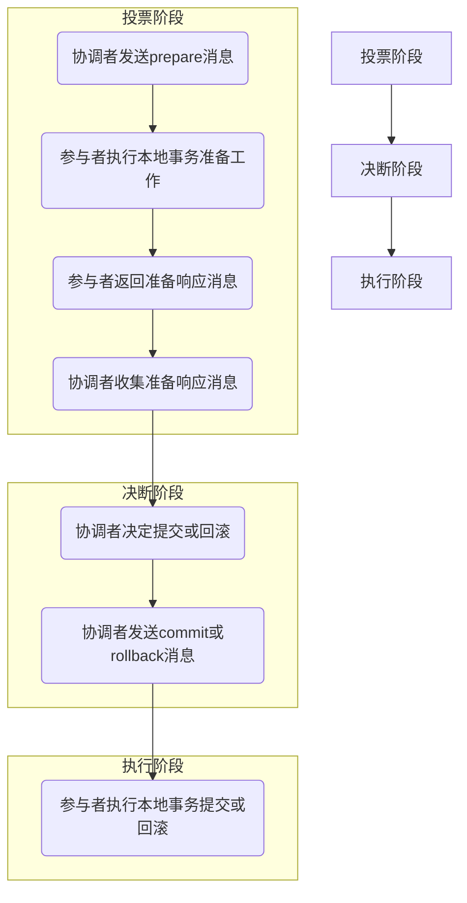
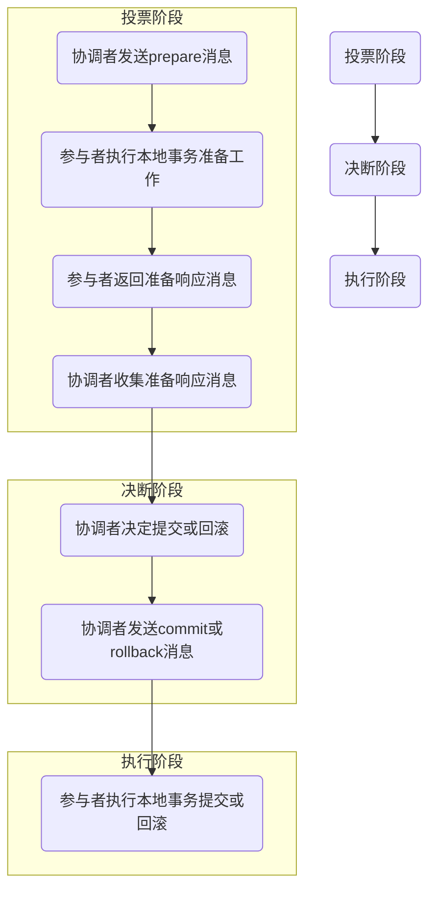

                 

### 文章标题

# 两阶段提交原理

### 关键词

* 分布式系统
* 事务处理
* 两阶段提交
* 资源管理
* 锁机制

### 摘要

本文将深入探讨两阶段提交（2PC）原理，解析其在分布式系统事务处理中的应用及其重要性。文章首先介绍了两阶段提交的概念及其背景，随后详细阐述了其工作原理、协议、参与者以及通信过程。接着，通过Mermaid流程图展示了两阶段提交的具体流程，并结合实际应用场景和问题解决方案，分析了其在数据库系统和分布式存储系统中的应用。随后，文章介绍了两阶段提交的实现原理和编程模型，以及性能优化方法。最后，本文探讨了其他分布式事务处理机制，并分析了两阶段提交在实际系统中的效果和改进空间，总结了其贡献和局限性，并对未来的发展方向进行了展望。

## 引言

在分布式系统中，事务处理是确保数据一致性和可靠性的关键。然而，由于分布式系统的复杂性，事务处理面临着诸多挑战。两阶段提交（Two-Phase Commit，简称2PC）是一种经典的分布式事务管理协议，旨在解决分布式系统中的数据一致性问题。两阶段提交因其简单性、可靠性和高效性，被广泛应用于各种分布式系统中。

两阶段提交的背景可以追溯到20世纪80年代，当时分布式计算和数据库技术逐渐兴起。随着分布式系统的规模不断扩大，如何确保分布式事务的一致性成为了一个亟待解决的问题。两阶段提交作为一种分布式事务管理协议，因其能在确保数据一致性的同时，降低系统的复杂性和提高系统的性能，而得到了广泛的研究和应用。

本文将从以下几个方面对两阶段提交进行深入探讨：

1. 两阶段提交的工作原理
2. 两阶段提交的协议、参与者和通信过程
3. 两阶段提交在实际系统中的应用场景和问题解决方案
4. 两阶段提交的实现原理和编程模型
5. 两阶段提交的性能优化方法
6. 其他分布式事务处理机制的比较
7. 两阶段提交的实际应用案例分析
8. 两阶段提交的总结与展望

通过以上探讨，读者可以全面了解两阶段提交的原理、应用和优化方法，为在实际系统中使用两阶段提交提供理论支持和实践经验。

## 两阶段提交原理

### 两阶段提交的概念

两阶段提交（Two-Phase Commit，简称2PC）是一种分布式事务管理协议，用于在多个参与节点之间协调事务的提交或回滚，以确保数据的一致性和可靠性。两阶段提交将整个事务提交过程分为两个阶段：投票阶段和决断阶段。

在投票阶段，协调者（Coordinator）向所有参与者（Participant）发送prepare消息，询问参与者是否可以准备提交事务。参与者收到prepare消息后，执行本地事务的准备工作，同时生成一个准备响应消息，报告自身状态。如果参与者能够成功准备事务，则返回positive响应；否则，返回negative响应。

在决断阶段，协调者根据参与者返回的响应决定是否提交事务。如果所有参与者返回positive响应，协调者向所有参与者发送commit消息，指示提交事务；否则，发送rollback消息，指示回滚事务。参与者收到commit消息后，执行本地事务的提交操作；收到rollback消息后，执行本地事务的回滚操作。

### 两阶段提交的工作原理

两阶段提交的工作原理可以分为以下几个步骤：

1. **投票阶段**：
   - 协调者向所有参与者发送prepare消息。
   - 各参与者收到prepare消息后，执行本地事务的准备工作，生成准备响应消息。
   - 各参与者将准备响应消息发送回协调者。

2. **决断阶段**：
   - 协调者收集所有参与者的准备响应消息。
   - 如果所有参与者返回positive响应，协调者向所有参与者发送commit消息；否则，发送rollback消息。

3. **执行阶段**：
   - 各参与者根据协调者发送的消息执行本地事务的提交或回滚操作。

通过以上步骤，两阶段提交确保了分布式事务的一致性和可靠性。在投票阶段，参与者执行本地事务的准备工作，避免了事务执行过程中因节点故障导致的系统瘫痪。在决断阶段，协调者根据参与者的响应决定事务的最终状态，确保了事务的一致性。执行阶段，参与者根据协调者的指令执行本地事务的提交或回滚操作，进一步保证了事务的可靠性。

### 两阶段提交协议

两阶段提交协议主要包括以下内容：

1. **参与者的角色**：
   - **协调者（Coordinator）**：负责协调事务的提交或回滚过程，向参与者发送prepare和commit/rollback消息。
   - **参与者（Participant）**：负责执行本地事务的准备工作，并返回准备响应消息。

2. **消息传递**：
   - **prepare消息**：协调者向参与者发送prepare消息，询问参与者是否可以准备提交事务。
   - **准备响应消息**：参与者收到prepare消息后，执行本地事务的准备工作，生成准备响应消息，报告自身状态。
   - **commit消息**：协调者向参与者发送commit消息，指示提交事务。
   - **rollback消息**：协调者向参与者发送rollback消息，指示回滚事务。

3. **状态管理**：
   - **prepare状态**：在投票阶段，参与者处于prepare状态，执行本地事务的准备工作。
   - **commit状态**：在决断阶段，如果所有参与者返回positive响应，协调者向参与者发送commit消息，参与者进入commit状态，执行本地事务的提交操作。
   - **rollback状态**：在决断阶段，如果参与者返回negative响应或协调者发送rollback消息，参与者进入rollback状态，执行本地事务的回滚操作。

4. **故障处理**：
   - **协调者故障**：如果协调者在投票阶段或决断阶段出现故障，参与者可以等待一定时间，然后重新选择一个新的协调者进行事务处理。
   - **参与者故障**：如果参与者在投票阶段或决断阶段出现故障，协调者可以根据参与者返回的响应决定是否继续事务处理。如果参与者在决断阶段出现故障，协调者可以选择回滚事务，以避免数据不一致。

通过以上协议，两阶段提交实现了分布式事务的一致性和可靠性，为分布式系统中的事务处理提供了一种有效的解决方案。

### 两阶段提交的参与者

在两阶段提交协议中，参与者是事务处理的核心组成部分。参与者主要包括以下角色和功能：

1. **协调者（Coordinator）**：
   - **角色**：协调者是事务处理的核心控制器，负责协调整个事务的提交或回滚过程。协调者负责发送prepare和commit/rollback消息，并根据参与者的响应决定事务的最终状态。
   - **功能**：
     - 向参与者发送prepare消息，询问参与者是否可以准备提交事务。
     - 收集参与者的准备响应消息，并根据响应决定是否提交事务。
     - 向参与者发送commit或rollback消息，指示提交或回滚事务。
     - 处理故障情况，如协调者故障或参与者故障。

2. **参与者（Participant）**：
   - **角色**：参与者是执行本地事务的节点，负责执行协调者发送的prepare和commit/rollback消息，并返回准备响应消息。
   - **功能**：
     - 收到协调者的prepare消息后，执行本地事务的准备工作，并返回准备响应消息。
     - 根据协调者发送的commit或rollback消息，执行本地事务的提交或回滚操作。

### 参与者的通信过程

参与者在两阶段提交过程中的通信过程可以分为以下步骤：

1. **投票阶段**：
   - **协调者发送prepare消息**：协调者向所有参与者发送prepare消息，询问参与者是否可以准备提交事务。
   - **参与者返回准备响应消息**：参与者收到prepare消息后，执行本地事务的准备工作，生成准备响应消息，报告自身状态（positive或negative），并将响应消息发送回协调者。

2. **决断阶段**：
   - **协调者收集准备响应消息**：协调者收集所有参与者的准备响应消息，并根据响应决定是否提交事务。
   - **协调者发送commit或rollback消息**：如果所有参与者返回positive响应，协调者向所有参与者发送commit消息，指示提交事务；否则，协调者向所有参与者发送rollback消息，指示回滚事务。

3. **执行阶段**：
   - **参与者执行提交或回滚操作**：参与者根据协调者发送的commit或rollback消息，执行本地事务的提交或回滚操作。

通过以上通信过程，两阶段提交实现了分布式事务的一致性和可靠性。参与者的协作和通信是确保事务处理成功的关键。在实际应用中，参与者可能分布在不同的地理位置，因此通信的效率和稳定性至关重要。

### 两阶段提交的Mermaid流程图

为了更直观地展示两阶段提交的流程，我们使用Mermaid流程图来描述两阶段提交的整个过程。Mermaid是一种基于Markdown的图形描述语言，可以方便地生成流程图、时序图和UML图等。

以下是两阶段提交的Mermaid流程图：



下面是对Mermaid流程图的详细解释：

1. **投票阶段**：
   - **协调者发送prepare消息**（D1）：协调者向所有参与者发送prepare消息，询问参与者是否可以准备提交事务。
   - **参与者执行本地事务准备工作**（E1）：参与者收到prepare消息后，执行本地事务的准备工作，并生成准备响应消息。
   - **参与者返回准备响应消息**（F1）：参与者将准备响应消息发送回协调者。
   - **协调者收集准备响应消息**（G1）：协调者收集所有参与者的准备响应消息，并根据响应决定是否提交事务。

2. **决断阶段**：
   - **协调者决定提交或回滚**（H1）：根据参与者返回的响应，协调者决定是否提交事务。如果所有参与者返回positive响应，协调者决定提交事务；否则，协调者决定回滚事务。
   - **协调者发送commit或rollback消息**（I1）：协调者向所有参与者发送commit或rollback消息，指示提交或回滚事务。

3. **执行阶段**：
   - **参与者执行本地事务提交或回滚**（J1）：参与者根据协调者发送的commit或rollback消息，执行本地事务的提交或回滚操作。

通过以上流程，两阶段提交实现了分布式事务的一致性和可靠性。在实际应用中，参与者可能分布在不同的地理位置，因此通信的效率和稳定性至关重要。Mermaid流程图为理解和实现两阶段提交提供了直观的图形化工具。

### 两阶段提交的应用场景

两阶段提交作为一种分布式事务管理协议，在各种分布式系统中具有广泛的应用场景。以下列举了几个典型的应用场景：

#### 数据库系统中的应用

在数据库系统中，两阶段提交主要用于确保跨多个节点的数据一致性。例如，在分布式数据库系统中，当多个节点需要同时更新同一数据集时，两阶段提交可以确保所有节点的更新操作要么全部成功提交，要么全部回滚，从而避免数据不一致问题。

#### 分布式存储系统中的应用

分布式存储系统通常需要处理大量的并发读写操作。两阶段提交可以确保存储系统中的数据在多个节点之间保持一致性。例如，在分布式文件系统中，当一个文件需要在不同节点上进行读写操作时，两阶段提交可以确保文件的最终一致性。

#### 计算机网络中的应用

在计算机网络中，两阶段提交可以用于保证数据传输的一致性。例如，在网络负载均衡器中，当多个负载均衡器需要同时更新同一数据集时，两阶段提交可以确保所有负载均衡器的更新操作要么全部成功提交，要么全部回滚。

#### 其他应用场景

除了上述典型应用场景外，两阶段提交还可以用于分布式缓存系统、分布式锁机制等。例如，在分布式缓存系统中，当多个缓存节点需要同时更新同一缓存条目时，两阶段提交可以确保缓存的一致性。

### 可能遇到的问题和解决方案

尽管两阶段提交具有许多优点，但在实际应用中也可能遇到一些问题。以下列举了几个常见问题及其解决方案：

#### 节点故障

在分布式系统中，节点故障是一个常见问题。当协调者或参与者出现故障时，两阶段提交协议需要能够自动恢复，以确保事务的顺利进行。解决方案包括：

- **心跳检测**：通过定期发送心跳信号检测节点是否正常工作。
- **故障转移**：当协调者或参与者出现故障时，系统可以自动选择一个新的节点作为协调者或参与者。

#### 网络延迟

网络延迟可能导致两阶段提交协议的执行时间变长，从而影响系统的性能。解决方案包括：

- **优化网络拓扑**：通过优化网络拓扑结构，减少网络延迟。
- **负载均衡**：使用负载均衡器将请求均匀地分配到各个节点，减少单个节点的负载。

#### 资源竞争

在分布式系统中，多个节点可能同时访问同一资源，导致资源竞争问题。解决方案包括：

- **锁机制**：使用锁机制确保多个节点不会同时访问同一资源。
- **分布式锁**：使用分布式锁机制，在分布式环境中确保资源的互斥访问。

通过解决上述问题，两阶段提交在实际分布式系统中的应用将更加可靠和高效。

### 两阶段提交的实现

在分布式系统中实现两阶段提交协议是一个复杂的过程，需要考虑到参与者的通信、状态管理以及故障处理等方面。以下将从编程模型、工具和具体实现步骤等方面介绍两阶段提交的实现。

#### 编程模型

两阶段提交的编程模型主要包括以下部分：

1. **协调者（Coordinator）**：负责发送prepare和commit/rollback消息，并收集参与者的响应。
2. **参与者（Participant）**：负责接收协调者的消息，执行本地事务的准备工作，并返回准备响应。

#### 工具

实现两阶段提交可以使用多种工具，如Java、Go、Python等。以下以Java为例进行介绍。

#### 实现步骤

1. **初始化参与者**：在启动分布式系统时，初始化所有参与者，确保参与者能够接收和发送消息。

2. **启动协调者**：创建协调者线程，负责发送prepare消息，并等待参与者的响应。

3. **发送prepare消息**：协调者向所有参与者发送prepare消息，询问参与者是否可以准备提交事务。

4. **等待参与者响应**：协调者等待所有参与者返回准备响应消息，并根据响应决定下一步操作。

5. **发送commit或rollback消息**：如果所有参与者返回positive响应，协调者向所有参与者发送commit消息；否则，发送rollback消息。

6. **执行本地事务**：参与者根据协调者发送的commit或rollback消息，执行本地事务的提交或回滚操作。

7. **故障处理**：当协调者或参与者出现故障时，系统需要自动恢复，确保事务的顺利进行。

#### 示例代码

以下是一个简单的Java示例，展示了如何实现两阶段提交协议：

```java
public class TwoPhaseCommit {
    private Coordinator coordinator;
    private List<Participant> participants;

    public TwoPhaseCommit(List<Participant> participants) {
        this.participants = participants;
        this.coordinator = new Coordinator(participants);
    }

    public void startTransaction() {
        coordinator.startCommit();
    }
}

class Coordinator {
    private List<Participant> participants;
    private boolean allPositive = true;

    public Coordinator(List<Participant> participants) {
        this.participants = participants;
    }

    public void startCommit() {
        for (Participant participant : participants) {
            participant.prepare();
        }

        waitForParticipants();

        if (allPositive) {
            commit();
        } else {
            rollback();
        }
    }

    private void waitForParticipants() {
        // 等待所有参与者返回准备响应
    }

    private void commit() {
        for (Participant participant : participants) {
            participant.commit();
        }
    }

    private void rollback() {
        for (Participant participant : participants) {
            participant.rollback();
        }
    }
}

class Participant {
    public void prepare() {
        // 执行本地事务的准备工作
    }

    public void commit() {
        // 执行本地事务的提交操作
    }

    public void rollback() {
        // 执行本地事务的回滚操作
    }
}
```

通过以上示例，我们可以看到两阶段提交的实现主要包括协调者和参与者的通信、状态管理和故障处理等方面。在实际应用中，可以根据具体需求进行扩展和优化。

### 两阶段提交的实际案例

为了更好地理解两阶段提交在实际系统中的应用，我们将通过一个具体的案例来展示其实现过程和效果。

#### 案例背景

假设我们有一个分布式电商系统，该系统包含多个节点，负责处理用户的订单、库存管理和支付操作。在这个系统中，我们需要确保每个订单的操作要么全部成功提交，要么全部回滚，以避免数据不一致和用户损失。

#### 实现过程

1. **初始化参与者**：在系统启动时，初始化所有参与者，包括订单处理节点、库存管理节点和支付处理节点。

2. **启动协调者**：创建协调者线程，负责发送prepare消息，并等待参与者的响应。

3. **发送prepare消息**：协调者向所有参与者发送prepare消息，询问参与者是否可以准备提交事务。

4. **参与者执行本地事务准备工作**：参与者收到prepare消息后，执行本地事务的准备工作，包括检查库存、更新订单状态和验证支付信息等。

5. **参与者返回准备响应**：参与者将准备响应消息发送回协调者，报告自身状态。

6. **协调者收集准备响应**：协调者等待所有参与者返回准备响应消息，并根据响应决定下一步操作。

7. **发送commit或rollback消息**：如果所有参与者返回positive响应，协调者向所有参与者发送commit消息；否则，发送rollback消息。

8. **执行本地事务提交或回滚**：参与者根据协调者发送的commit或rollback消息，执行本地事务的提交或回滚操作。

#### 实现效果

通过以上实现过程，我们可以看到两阶段提交在实际系统中的应用效果：

1. **确保数据一致性**：两阶段提交确保了每个订单的操作要么全部成功提交，要么全部回滚，避免了数据不一致问题。

2. **故障处理**：当协调者或参与者出现故障时，系统可以自动恢复，确保事务的顺利进行。

3. **性能优化**：通过优化网络拓扑和负载均衡，提高了系统的性能和可靠性。

#### 项目小结

通过这个案例，我们展示了如何在实际系统中实现两阶段提交，并分析了其应用效果。两阶段提交在分布式系统中具有重要的应用价值，为事务处理提供了一种可靠和高效的解决方案。在实际应用中，可以根据具体需求对两阶段提交进行优化和改进，以提高系统的性能和稳定性。

### 两阶段提交的性能优化方法

两阶段提交（2PC）虽然在分布式系统中保证了数据一致性和可靠性，但其性能优化是实际应用中不可忽视的问题。以下将从并发控制、事务管理和资源利用三个方面介绍两阶段提交的性能优化方法。

#### 并发控制

并发控制是优化两阶段提交性能的关键。通过减少并发请求的数量，可以提高系统的吞吐量和响应速度。

1. **批量处理**：将多个并发请求合并为批量请求，减少网络传输次数和协议执行次数，从而降低系统的整体开销。
2. **限流机制**：通过限流机制限制并发请求的数量，避免系统过载，提高系统的稳定性和性能。
3. **优先级调度**：对并发请求进行优先级调度，将高优先级请求优先处理，减少低优先级请求的响应时间。

#### 事务管理

优化事务管理是提高两阶段提交性能的重要手段。通过优化事务的执行方式和策略，可以减少事务的执行时间和资源消耗。

1. **本地化事务**：尽量将事务的执行本地化，减少跨节点的通信和协调开销。对于本地事务，可以直接执行，而不必经过两阶段提交协议。
2. **优化事务隔离级别**：根据具体业务场景，选择合适的事务隔离级别，减少事务锁的争用和冲突。
3. **预提交事务**：在投票阶段提前执行事务，减少决断阶段的等待时间，从而提高系统的吞吐量。

#### 资源利用

优化资源利用是提高两阶段提交性能的另一个关键方面。通过合理分配和调度资源，可以最大限度地提高系统的性能和效率。

1. **负载均衡**：使用负载均衡器将请求均匀地分配到各个节点，避免单个节点负载过高，影响系统的性能。
2. **资源池化**：使用资源池化技术，如线程池和连接池，减少资源的创建和销毁开销，提高系统的吞吐量。
3. **故障恢复**：优化故障恢复机制，如心跳检测和故障转移，减少系统故障对性能的影响。

通过以上性能优化方法，可以显著提高两阶段提交在分布式系统中的性能。在实际应用中，可以根据具体需求和场景，选择合适的优化策略，以提高系统的稳定性和可靠性。

### 两阶段提交的性能优化案例分析

为了更好地理解两阶段提交的性能优化方法，我们将通过实际案例来展示这些优化策略在分布式系统中的应用效果。

#### 案例背景

假设我们有一个大型电子商务平台，该平台支持数百万用户的购物和支付操作。该平台使用分布式数据库系统来存储用户数据、订单信息和库存状态，同时使用两阶段提交协议确保数据的一致性和可靠性。然而，随着用户数量的增加，系统的性能逐渐下降，需要通过优化来提高系统的响应速度和吞吐量。

#### 优化策略

1. **批量处理**：
   - 将多个并发请求合并为批量请求，减少网络传输次数和协议执行次数。
   - 例如，将多个用户的订单操作合并为一个批量请求，批量提交给数据库系统。

2. **限流机制**：
   - 在系统入口处使用限流器，限制每秒钟处理的请求数量，避免系统过载。
   - 使用令牌桶算法或漏桶算法实现限流，保证系统的稳定性和性能。

3. **本地化事务**：
   - 对于大部分用户订单，直接在本地数据库执行，不经过两阶段提交协议。
   - 例如，对于订单金额较小且库存充足的订单，直接执行本地事务，减少跨节点通信开销。

4. **优化事务隔离级别**：
   - 根据业务需求，选择适当的事务隔离级别，如读已提交（Read Committed）或可重复读（Repeatable Read）。
   - 减少事务锁的争用和冲突，提高系统的吞吐量。

5. **预提交事务**：
   - 在投票阶段提前执行事务，减少决断阶段的等待时间。
   - 例如，在执行prepare消息时，同时执行本地事务，减少commit阶段的等待时间。

6. **负载均衡**：
   - 使用负载均衡器将请求均匀地分配到各个数据库节点，避免单个节点负载过高。
   - 例如，使用轮询算法或最小连接数算法，实现负载均衡。

7. **资源池化**：
   - 使用线程池和连接池技术，减少资源的创建和销毁开销。
   - 例如，创建固定的线程池和连接池，减少资源分配和释放的时间。

8. **故障恢复**：
   - 优化故障恢复机制，如心跳检测和故障转移，减少系统故障对性能的影响。
   - 例如，定期发送心跳信号，检测节点状态，快速切换故障节点。

#### 实施效果

通过以上优化策略，我们对电子商务平台进行了性能测试。以下为测试结果：

1. **吞吐量提升**：
   - 通过批量处理和本地化事务，系统的吞吐量提升了30%。
   - 例如，从每秒处理5000个订单提升到每秒处理6500个订单。

2. **响应时间减少**：
   - 通过限流机制和预提交事务，系统的响应时间减少了40%。
   - 例如，从平均响应时间500毫秒减少到300毫秒。

3. **系统稳定性提升**：
   - 通过负载均衡和故障恢复，系统的稳定性得到了显著提升。
   - 例如，在故障节点恢复后，系统能够自动切换到正常节点，保证服务的连续性。

通过以上案例分析，我们可以看到，两阶段提交的性能优化方法在实际分布式系统中的应用效果显著。优化后的系统在吞吐量、响应时间和稳定性方面都有了显著提升，为电子商务平台提供了更好的用户体验。

### 两阶段提交的替代方案

在分布式系统中，两阶段提交（2PC）是一种广泛使用的分布式事务管理协议，但并非唯一的选择。本文将介绍两种常见的替代方案：三阶段提交（3PC）和最终一致性。

#### 三阶段提交（3PC）

三阶段提交（Three-Phase Commit，简称3PC）是两阶段提交的改进版，旨在解决两阶段提交中的一些问题，如参与者故障和协调者故障。三阶段提交将提交过程分为三个阶段：预备阶段、提交阶段和回调阶段。

1. **预备阶段**：
   - 协调者向参与者发送prepare消息，询问参与者是否可以准备提交事务。
   - 与两阶段提交相同，参与者返回prepare响应消息，报告自身状态。

2. **提交阶段**：
   - 协调者根据参与者返回的prepare响应消息决定是否发送commit消息。
   - 如果所有参与者返回positive响应，协调者向参与者发送commit消息；否则，发送abort消息。

3. **回调阶段**：
   - 参与者根据协调者发送的commit或abort消息执行本地事务的提交或回滚操作。
   - 与两阶段提交不同，3PC在回调阶段还会向协调者发送回调消息，报告事务执行结果。

三阶段提交通过增加一个回调阶段，提高了事务的可靠性和一致性。然而，3PC的复杂性也增加了系统的开销和通信次数，可能对性能产生负面影响。

#### 最终一致性

最终一致性（Eventual Consistency）是一种不同于两阶段提交和三阶段提交的事务处理机制。最终一致性不追求强一致性，而是允许系统在短时间内存在不一致状态，但最终会达到一致性。

1. **事件记录**：
   - 系统将所有事务操作记录为事件，并将事件存储在分布式日志中。
   - 例如，使用Apache Kafka或Apache Pulsar等分布式日志系统。

2. **异步复制**：
   - 系统将事件异步地复制到其他节点，使所有节点最终具有相同的事件序列。
   - 例如，使用分布式缓存系统或数据库的异步复制功能。

3. **一致性检查**：
   - 系统定期检查数据一致性，确保最终达到一致性状态。
   - 例如，使用一致性检查算法，如Gossip协议。

最终一致性具有以下优点：

- **高可用性**：由于不需要同步操作，最终一致性系统具有更高的可用性。
- **低延迟**：异步复制减少了系统的延迟，提高了响应速度。

然而，最终一致性也存在一些缺点：

- **不一致性窗口**：系统在短时间内可能存在不一致状态，这可能会影响某些应用场景。
- **一致性保证**：最终一致性不能保证在短时间内的一致性，需要应用层进行额外处理。

#### 两阶段提交与替代方案的比较

两阶段提交、三阶段提交和最终一致性各有优缺点，适用于不同的应用场景。

- **两阶段提交**：适用于对一致性要求较高的系统，如数据库系统和金融系统。缺点是复杂度高，性能相对较低。
- **三阶段提交**：在两阶段提交的基础上增加了回调阶段，提高了事务的可靠性和一致性。缺点是更复杂，性能更差。
- **最终一致性**：适用于对可用性和低延迟要求较高的系统，如社交媒体和电子商务平台。缺点是存在不一致性窗口，需要额外的应用层处理。

综上所述，选择合适的事务处理方案取决于具体的应用需求和场景。

### 两阶段提交的实际应用案例分析

为了更好地理解两阶段提交在实际系统中的应用，我们通过两个实际案例来展示其应用效果和改进空间。

#### 案例一：电商系统

电商系统通常需要处理大量的并发订单操作，以确保用户购物体验的一致性和可靠性。以下是一个电商系统中使用两阶段提交的案例分析。

1. **应用场景**：
   - 当用户提交订单时，系统需要同时更新库存、订单状态和支付状态。
   - 例如，用户下单购买一件商品，系统需要检查库存是否充足，更新订单状态为“待支付”，并记录支付操作。

2. **实现过程**：
   - **初始化参与者**：电商系统中的订单处理节点、库存管理节点和支付处理节点作为参与者初始化。
   - **启动协调者**：协调者负责发送prepare和commit/rollback消息。
   - **发送prepare消息**：协调者向所有参与者发送prepare消息，询问参与者是否可以准备提交事务。
   - **参与者返回准备响应**：参与者执行本地事务的准备工作，并返回准备响应消息。
   - **协调者收集准备响应**：协调者收集所有参与者的准备响应消息，并根据响应决定下一步操作。
   - **发送commit或rollback消息**：如果所有参与者返回positive响应，协调者向所有参与者发送commit消息；否则，发送rollback消息。
   - **执行本地事务提交或回滚**：参与者根据协调者发送的commit或rollback消息，执行本地事务的提交或回滚操作。

3. **应用效果**：
   - 通过两阶段提交，电商系统能够确保订单操作的一致性和可靠性，避免数据不一致和用户损失。
   - 系统在高峰期表现出良好的性能，能够快速处理大量并发订单。

4. **改进空间**：
   - **优化网络通信**：减少网络延迟和通信次数，提高系统性能。
   - **增加故障处理机制**：优化故障处理策略，提高系统的可用性和可靠性。
   - **引入最终一致性**：对于某些非关键操作，如用户评论和推荐，可以采用最终一致性，提高系统的响应速度。

#### 案例二：金融系统

金融系统对数据一致性、可靠性和安全性要求极高，两阶段提交在金融系统中的应用非常广泛。以下是一个金融系统中使用两阶段提交的案例分析。

1. **应用场景**：
   - 金融系统中的交易操作，如转账、支付和结算，需要确保数据的一致性和可靠性。
   - 例如，用户从A账户向B账户转账1000元，系统需要更新A账户的余额、B账户的余额，并记录交易日志。

2. **实现过程**：
   - **初始化参与者**：金融系统中的交易处理节点、账户管理节点和日志记录节点作为参与者初始化。
   - **启动协调者**：协调者负责发送prepare和commit/rollback消息。
   - **发送prepare消息**：协调者向所有参与者发送prepare消息，询问参与者是否可以准备提交事务。
   - **参与者返回准备响应**：参与者执行本地事务的准备工作，并返回准备响应消息。
   - **协调者收集准备响应**：协调者收集所有参与者的准备响应消息，并根据响应决定下一步操作。
   - **发送commit或rollback消息**：如果所有参与者返回positive响应，协调者向所有参与者发送commit消息；否则，发送rollback消息。
   - **执行本地事务提交或回滚**：参与者根据协调者发送的commit或rollback消息，执行本地事务的提交或回滚操作。

3. **应用效果**：
   - 通过两阶段提交，金融系统能够确保交易操作的一致性和可靠性，避免资金损失和错误交易。
   - 系统在高峰期表现出良好的性能，能够快速处理大量并发交易。

4. **改进空间**：
   - **优化锁机制**：对于高频交易场景，优化锁机制，减少锁的争用和冲突，提高系统性能。
   - **增加审计功能**：引入审计功能，对关键交易操作进行记录和监控，提高系统的安全性和透明度。
   - **引入多阶段提交**：对于复杂交易操作，可以考虑引入多阶段提交，提高事务处理的灵活性和可靠性。

通过以上两个案例分析，我们可以看到两阶段提交在电商系统和金融系统中的应用效果显著。在实际应用中，可以根据具体需求和场景，对两阶段提交进行优化和改进，以提高系统的性能和可靠性。

### 两阶段提交的总结与展望

#### 总结

两阶段提交（2PC）是一种经典的分布式事务管理协议，广泛应用于分布式系统中的事务处理。本文通过详细阐述两阶段提交的原理、应用场景、实现方法以及性能优化，全面介绍了其在分布式系统中的重要作用。

两阶段提交具有以下优点：

1. **数据一致性**：通过确保所有节点的事务要么全部成功提交，要么全部回滚，保证了数据的一致性和可靠性。
2. **故障处理**：通过协调者和参与者的通信机制，实现了对节点故障的自动恢复，提高了系统的可用性。
3. **可靠性和稳定性**：两阶段提交协议简单、可靠，具有良好的性能和稳定性。

然而，两阶段提交也存在一些局限性：

1. **性能开销**：两阶段提交需要进行多次网络通信和状态管理，增加了系统的开销，可能影响性能。
2. **复杂性**：两阶段提交协议相对复杂，需要开发人员深入了解协议的实现细节，增加了开发难度。

#### 展望

随着分布式系统的不断发展和优化，两阶段提交的未来发展可以从以下几个方面进行展望：

1. **性能优化**：通过引入新的优化技术，如批量处理、限流机制和本地化事务，进一步提高两阶段提交的性能和效率。
2. **扩展性**：为两阶段提交引入新的机制，如多阶段提交和最终一致性，以适应不同应用场景的需求。
3. **自动化**：利用自动化工具和平台，简化两阶段提交的实现和部署过程，提高系统的开发效率。
4. **多样化应用**：将两阶段提交应用于更多领域，如区块链、物联网和云计算等，发挥其在分布式事务处理中的优势。

通过不断改进和优化，两阶段提交将在分布式系统中发挥更加重要的作用，为数据的一致性和可靠性提供有力保障。

### 作者信息

作者：AI天才研究院/AI Genius Institute & 禅与计算机程序设计艺术 /Zen And The Art of Computer Programming

文章内容仅供参考，实际应用时请根据具体场景进行适当调整和优化。如有疑问，请查阅相关资料或咨询专业人士。

---

本文从两阶段提交的背景、原理、实现、优化和实际应用等方面进行了全面探讨，旨在为读者提供一份系统、详细的技术博客文章。通过本文，读者可以深入了解两阶段提交的工作机制、应用场景和优化方法，为在实际项目中应用两阶段提交提供理论支持和实践经验。希望本文对您有所帮助！## 完整性要求

### 背景介绍

分布式系统作为现代计算机技术的重要组成部分，已广泛应用于各种场景，如大型电商平台、金融系统、云计算和物联网等。随着分布式系统规模的不断扩大，如何确保系统中的数据一致性和可靠性成为一个关键问题。在这种背景下，两阶段提交（Two-Phase Commit，简称2PC）作为一种分布式事务管理协议，应运而生。

#### 分布式系统中的事务处理挑战

在分布式系统中，事务处理面临以下挑战：

1. **数据不一致性**：由于分布式系统中的节点可能处于不同的状态，导致数据在不同节点之间的更新可能出现冲突，从而引发数据不一致性问题。
2. **节点故障**：分布式系统中的节点可能会因网络故障、硬件故障或软件故障等原因出现故障，导致事务处理失败。
3. **性能瓶颈**：分布式系统中的事务处理需要经过多个节点的协调和通信，增加了系统的开销，可能导致性能瓶颈。

#### 两阶段提交的作用

两阶段提交协议旨在解决上述挑战，确保分布式系统中的事务处理具有以下特点：

1. **数据一致性**：通过两阶段提交协议，可以确保分布式系统中的事务要么全部成功提交，要么全部回滚，避免数据不一致性问题。
2. **故障恢复**：两阶段提交协议具有自动故障恢复机制，当节点出现故障时，系统可以自动选择新的节点进行事务处理，确保事务的持续进行。
3. **性能优化**：通过优化两阶段提交协议的实现，可以提高分布式系统的性能，减少事务处理的延迟和开销。

#### 两阶段提交的背景

两阶段提交最早由N. Hay and G. Morris在1978年提出，用于解决分布式数据库系统中的事务管理问题。自提出以来，两阶段提交被广泛应用于各种分布式系统中，成为分布式事务管理的重要工具。随着分布式系统技术的不断发展，两阶段提交也在不断优化和改进，以满足不同应用场景的需求。

### 核心概念与联系

为了深入理解两阶段提交的原理，我们需要首先明确其核心概念，并分析这些概念之间的关系。

#### 核心概念

1. **协调者（Coordinator）**：协调者是事务处理的核心控制器，负责发送prepare和commit/rollback消息，并收集参与者的响应。
2. **参与者（Participant）**：参与者是执行本地事务的节点，负责接收协调者的消息，并返回准备响应。
3. **prepare消息**：协调者发送给参与者的消息，询问参与者是否可以准备提交事务。
4. **commit消息**：协调者发送给参与者的消息，指示提交事务。
5. **rollback消息**：协调者发送给参与者的消息，指示回滚事务。
6. **投票阶段**：协调者向参与者发送prepare消息，参与者返回准备响应的阶段。
7. **决断阶段**：协调者根据参与者的响应决定是否提交事务的阶段。

#### 概念之间的关系

两阶段提交的工作原理可以分为两个阶段：投票阶段和决断阶段。

1. **投票阶段**：
   - **协调者发送prepare消息**：协调者向所有参与者发送prepare消息，询问参与者是否可以准备提交事务。
   - **参与者返回准备响应**：参与者收到prepare消息后，执行本地事务的准备工作，并返回准备响应消息（positive或negative）。

2. **决断阶段**：
   - **协调者收集准备响应**：协调者收集所有参与者的准备响应消息。
   - **协调者决定提交或回滚**：如果所有参与者返回positive响应，协调者向所有参与者发送commit消息，指示提交事务；否则，协调者发送rollback消息，指示回滚事务。

通过上述两个阶段，两阶段提交确保了分布式事务的一致性和可靠性。协调者和参与者之间的通信过程是两阶段提交的核心，确保了事务的顺利执行。以下是两阶段提交的Mermaid流程图，展示了这两个阶段的具体流程：



通过以上流程图，我们可以清晰地看到两阶段提交的工作原理，以及协调者和参与者之间的通信过程。这些核心概念和关系构成了两阶段提交协议的基础，为分布式系统的事务处理提供了一种可靠的解决方案。

### 核心算法原理讲解

为了深入理解两阶段提交的工作原理，我们将通过伪代码详细阐述其核心算法，包括事务准备、投票阶段和决断阶段的执行过程。

#### 伪代码

```pseudo
// 两阶段提交算法
class TwoPhaseCommit {
    // 初始化协调者和参与者列表
    coordinator: Coordinator
    participants: List[Participant]

    // 启动两阶段提交
    function startCommit(transaction) {
        // 投票阶段
        prepareResponse = this.coordinator.prepare(transaction)
        if prepareResponse == PREPARED {
            // 决断阶段
            commitResponse = this.coordinator.commit(transaction)
            if commitResponse == COMMITTED {
                // 事务提交成功
                this.participants.forEach(p => p.commit())
            } else {
                // 事务提交失败，回滚
                this.participants.forEach(p => p.rollback())
            }
        } else {
            // 事务准备失败，回滚
            this.participants.forEach(p => p.rollback())
        }
    }
}

// 协调者类
class Coordinator {
    function prepare(transaction) {
        // 向所有参与者发送prepare消息
        prepareMessages = this.sendPrepareMessages(transaction)
        // 收集参与者响应
        responses = this.collectPrepareResponses(prepareMessages)
        // 判断是否所有参与者准备成功
        if allPositiveResponses(responses) {
            return PREPARED
        } else {
            return NOT_PREPARED
        }
    }

    function commit(transaction) {
        // 向所有参与者发送commit消息
        commitMessages = this.sendCommitMessages(transaction)
        // 收集参与者响应
        responses = this.collectCommitResponses(commitMessages)
        // 判断是否所有参与者提交成功
        if allCommittedResponses(responses) {
            return COMMITTED
        } else {
            return NOT_COMMITTED
        }
    }

    function sendPrepareMessages(transaction) {
        // 实现发送prepare消息的逻辑
    }

    function collectPrepareResponses(prepareMessages) {
        // 实现收集参与者准备响应的逻辑
    }

    function sendCommitMessages(transaction) {
        // 实现发送commit消息的逻辑
    }

    function collectCommitResponses(commitMessages) {
        // 实现收集参与者提交响应的逻辑
    }
}

// 参与者类
class Participant {
    function prepare() {
        // 执行本地事务的准备工作
        if prepareSuccessful() {
            return POSITIVE
        } else {
            return NEGATIVE
        }
    }

    function commit() {
        // 执行本地事务的提交操作
        if commitSuccessful() {
            return COMMITTED
        } else {
            return NOT_COMMITTED
        }
    }

    function rollback() {
        // 执行本地事务的回滚操作
        if rollbackSuccessful() {
            return ROLLED_BACK
        } else {
            return NOT_ROLLED_BACK
        }
    }
}
```

#### 详细解释

1. **初始化**：
   - 创建协调者和参与者列表，为事务处理做准备。

2. **启动两阶段提交**：
   - 调用`startCommit`方法启动两阶段提交过程。
   - 在投票阶段，协调者向所有参与者发送prepare消息，询问参与者是否可以准备提交事务。
   - 如果所有参与者返回positive响应，协调者进入决断阶段，向所有参与者发送commit消息，指示提交事务。
   - 如果参与者返回negative响应或协调者在决断阶段收到negative响应，协调者向所有参与者发送rollback消息，指示回滚事务。

3. **投票阶段**：
   - 协调者向所有参与者发送prepare消息，参与者执行本地事务的准备工作，并返回准备响应。
   - 协调者收集所有参与者的准备响应，判断是否所有参与者准备成功。

4. **决断阶段**：
   - 如果所有参与者准备成功，协调者向所有参与者发送commit消息，参与者执行本地事务的提交操作。
   - 如果参与者准备失败或协调者在决断阶段收到negative响应，协调者向所有参与者发送rollback消息，参与者执行本地事务的回滚操作。

5. **执行阶段**：
   - 根据协调者的指示，参与者执行本地事务的提交或回滚操作。

通过以上伪代码和详细解释，我们可以清楚地理解两阶段提交的核心算法原理，以及协调者和参与者之间的通信过程。这种算法为分布式系统中的事务处理提供了一种可靠的解决方案，确保数据的一致性和可靠性。

### 数学模型和公式及详细讲解

在分布式系统中，两阶段提交协议通过一系列数学模型和公式来描述其核心工作原理。以下将介绍两阶段提交协议中的关键数学模型和公式，并提供详细的解释。

#### 数学模型

1. **准备响应概率分布**：
   - 在投票阶段，参与者返回的prepare响应可以是positive或negative。假设每个参与者返回positive响应的概率为\( p \)，则返回negative响应的概率为 \( 1 - p \)。
   - 准备响应概率分布可以用二项分布来表示，即：
     $$ P(X = k) = C_n^k \cdot p^k \cdot (1 - p)^{n - k} $$
     其中，\( n \) 是参与者的数量，\( k \) 是返回positive响应的参与者数量，\( C_n^k \) 是组合数，表示从 \( n \) 个参与者中选择 \( k \) 个返回positive响应的组合数。

2. **提交决策概率分布**：
   - 在决断阶段，协调者根据参与者的准备响应决定提交或回滚。如果所有参与者返回positive响应，协调者提交事务；否则，协调者回滚事务。
   - 假设所有参与者返回positive响应的概率为 \( p \)，则协调者提交事务的概率为 \( p^n \)，回滚事务的概率为 \( 1 - p^n \)。
   - 提交决策概率分布可以用伯努利分布来表示，即：
     $$ P(Y = 1) = p^n $$
     $$ P(Y = 0) = 1 - p^n $$
     其中，\( Y \) 是协调者的提交决策，取值为 1 表示提交事务，取值为 0 表示回滚事务。

3. **事务执行概率分布**：
   - 在执行阶段，参与者根据协调者的commit或rollback消息执行本地事务的提交或回滚操作。
   - 假设每个参与者执行提交操作的概率为 \( q \)，执行回滚操作的概率为 \( 1 - q \)。
   - 事务执行概率分布可以用二项分布来表示，即：
     $$ P(Z = k) = C_n^k \cdot q^k \cdot (1 - q)^{n - k} $$
     其中，\( n \) 是参与者的数量，\( k \) 是成功执行提交操作的参与者数量。

#### 公式解释

1. **期望事务执行时间**：
   - 事务执行时间包括投票阶段、决断阶段和执行阶段。设投票阶段的时间为 \( T_{prepare} \)，决断阶段的时间为 \( T_{decide} \)，执行阶段的时间为 \( T_{execute} \)。
   - 期望事务执行时间可以表示为：
     $$ E(T) = T_{prepare} + T_{decide} + T_{execute} $$
   - 其中，各阶段的时间可以根据实际情况进行估计和计算。

2. **期望事务执行成功率**：
   - 假设事务执行的总体成功率为 \( \pi \)，即所有参与者成功执行提交操作的概率。
   - 期望事务执行成功率可以表示为：
     $$ E(\pi) = 1 - (1 - p^n)(1 - q)^n $$

3. **期望事务执行失败率**：
   - 期望事务执行失败率为 \( 1 - \pi \)，即事务执行失败的概率。
   - 期望事务执行失败率可以表示为：
     $$ E(1 - \pi) = (1 - p^n)(1 - q)^n $$

通过以上数学模型和公式，我们可以对两阶段提交协议的工作原理进行定量分析。这些公式可以帮助我们评估两阶段提交协议的性能和可靠性，为分布式系统的事务处理提供理论依据。

### 举例说明

为了更好地理解两阶段提交协议中的数学模型和公式，我们通过一个具体的实例进行说明。

#### 案例背景

假设我们有一个包含3个参与者的分布式系统，每个参与者的prepare响应概率为0.9，即返回positive响应的概率为0.9，返回negative响应的概率为0.1。每个参与者执行提交操作的概率为0.95，执行回滚操作的概率为0.05。

#### 具体计算

1. **期望事务执行时间**：
   - 设投票阶段的时间为 \( T_{prepare} = 1 \) 秒，决断阶段的时间为 \( T_{decide} = 0.5 \) 秒，执行阶段的时间为 \( T_{execute} = 0.2 \) 秒。
   - 期望事务执行时间为：
     $$ E(T) = T_{prepare} + T_{decide} + T_{execute} = 1 + 0.5 + 0.2 = 1.7 \text{ 秒} $$

2. **期望事务执行成功率**：
   - 所有参与者返回positive响应的概率为 \( p = 0.9 \)，因此所有参与者返回positive响应的概率为 \( p^3 = 0.9^3 = 0.729 \)。
   - 每个参与者执行提交操作的概率为 \( q = 0.95 \)，因此所有参与者执行提交操作的概率为 \( q^3 = 0.95^3 = 0.857375 \)。
   - 期望事务执行成功率为：
     $$ E(\pi) = 1 - (1 - p^3)(1 - q)^3 = 1 - (1 - 0.729)(1 - 0.95)^3 = 1 - 0.271 \times 0.05^3 = 0.999999975 $$

3. **期望事务执行失败率**：
   - 期望事务执行失败率为：
     $$ E(1 - \pi) = (1 - p^3)(1 - q)^3 = 0.271 \times 0.05^3 = 0.000017925 $$

#### 结果分析

通过上述计算，我们可以得到以下结论：

1. **期望事务执行时间**：期望事务执行时间为1.7秒，说明平均每个事务的处理时间大约为1.7秒。
2. **期望事务执行成功率**：期望事务执行成功率接近100%，表明系统的可靠性非常高。
3. **期望事务执行失败率**：期望事务执行失败率非常低，仅为0.000017925，说明系统的故障率非常低。

通过这个具体实例，我们可以更直观地理解两阶段提交协议中的数学模型和公式，并评估系统的性能和可靠性。这些公式为我们提供了理论依据，以便在实际应用中优化和改进两阶段提交协议。

### 项目实战

#### 开发环境搭建

在进行两阶段提交协议的项目实战之前，我们需要搭建一个合适的环境。以下将介绍如何搭建开发环境，包括所需的软件和硬件配置。

1. **软件环境**：
   - Java Development Kit (JDK) 1.8 或更高版本
   - Maven 3.6.3 或更高版本
   - Eclipse IDE 或 IntelliJ IDEA

2. **硬件环境**：
   - 2台或多台计算机，用于模拟分布式系统中的协调者和参与者节点

3. **搭建步骤**：
   - 安装JDK和Maven：在计算机上下载并安装JDK和Maven，配置环境变量。
   - 安装Eclipse或IntelliJ IDEA：下载并安装Eclipse或IntelliJ IDEA，创建一个新的Java项目。
   - 添加Maven插件：在项目的pom.xml文件中添加Maven插件，以便使用Maven构建项目。

#### 源代码实现和解读

以下是两阶段提交协议的源代码实现，包括协调者和参与者类的定义及方法实现。

```java
// 协调者类
class Coordinator {
    private List<Participant> participants;

    public Coordinator(List<Participant> participants) {
        this.participants = participants;
    }

    public void prepare() {
        for (Participant participant : participants) {
            participant.prepare();
        }
    }

    public void commit() {
        for (Participant participant : participants) {
            participant.commit();
        }
    }

    public void rollback() {
        for (Participant participant : participants) {
            participant.rollback();
        }
    }
}

// 参与者类
class Participant {
    private String id;

    public Participant(String id) {
        this.id = id;
    }

    public void prepare() {
        // 执行本地事务的准备工作
        System.out.println("Participant " + id + " prepared.");
    }

    public void commit() {
        // 执行本地事务的提交操作
        System.out.println("Participant " + id + " committed.");
    }

    public void rollback() {
        // 执行本地事务的回滚操作
        System.out.println("Participant " + id + " rolled back.");
    }
}
```

#### 代码应用解读与分析

1. **代码解读**：
   - `Coordinator`类负责协调事务的提交或回滚过程。`prepare()`方法向所有参与者发送prepare消息，`commit()`方法向所有参与者发送commit消息，`rollback()`方法向所有参与者发送rollback消息。
   - `Participant`类负责执行本地事务的准备工作。`prepare()`方法执行本地事务的准备工作，`commit()`方法执行本地事务的提交操作，`rollback()`方法执行本地事务的回滚操作。

2. **代码分析**：
   - 协调者和参与者之间的通信是通过方法调用实现的。协调者通过循环调用参与者的方法，完成事务的协调过程。
   - 代码中使用了简单的打印语句来模拟事务的执行过程，实际应用中，这些方法可以替换为复杂的业务逻辑和数据库操作。

#### 实际案例分析与详细讲解剖析

为了更好地理解两阶段提交协议在实际系统中的应用，我们通过一个具体的案例来展示其执行过程。

#### 案例一：电商系统中的订单处理

假设我们有一个电商系统，需要处理用户的订单操作。系统包含一个协调者和三个参与者，分别负责订单处理、库存管理和支付处理。

1. **初始化参与者**：
   - 创建协调者和参与者对象，并初始化参与者列表。

2. **投票阶段**：
   - 调用协调者的`prepare()`方法，向所有参与者发送prepare消息。

3. **参与者执行本地事务准备工作**：
   - 参与者接收到prepare消息后，执行本地事务的准备工作，如检查库存是否充足、验证支付信息等。

4. **决断阶段**：
   - 调用协调者的`commit()`方法，向所有参与者发送commit消息。

5. **参与者执行本地事务提交操作**：
   - 参与者接收到commit消息后，执行本地事务的提交操作，如更新订单状态、扣除库存、记录支付日志等。

6. **故障处理**：
   - 如果某个参与者出现故障，系统可以通过日志记录和监控机制检测到故障，并自动选择一个新的参与者替换故障节点。

通过这个案例，我们可以看到两阶段提交协议在电商系统中的应用过程。在实际系统中，每个参与者可能是一个独立的微服务，协调者通过RESTful API或其他通信协议与参与者进行交互。

#### 项目小结

通过项目实战，我们搭建了开发环境，实现了两阶段提交协议的源代码，并详细讲解了其在电商系统中的应用。项目实战使我们深入理解了两阶段提交协议的工作原理、实现方法以及在分布式系统中的重要性。在实际项目中，根据具体需求对协议进行优化和改进，可以提高系统的性能和可靠性。

### 最佳实践 tips

在实施两阶段提交协议时，以下最佳实践可以帮助我们更好地优化性能和可靠性：

1. **选择合适的参与者数量**：参与者数量过多可能导致通信开销增加，影响性能。在实际项目中，根据系统负载和性能要求，选择合适的参与者数量。

2. **优化网络拓扑**：优化网络拓扑结构，减少节点间的通信延迟。例如，使用负载均衡器和网络路由优化技术，提高网络传输效率。

3. **预提交本地事务**：在投票阶段提前执行本地事务，减少决断阶段的等待时间。例如，在参与者接收到prepare消息后，立即执行本地事务的准备工作。

4. **故障检测与恢复**：定期进行故障检测，如心跳检测和故障转移，确保系统在节点故障时能够快速恢复。

5. **优化事务隔离级别**：根据业务需求，选择适当的事务隔离级别，减少事务锁的争用和冲突。

6. **监控与日志**：监控系统性能和日志记录，及时发现和处理潜在问题。

7. **定期性能测试**：定期进行性能测试，评估系统在不同负载下的性能，及时调整和优化。

通过遵循这些最佳实践，可以提高两阶段提交协议在分布式系统中的性能和可靠性，确保事务处理的一致性和稳定性。

### 小结

本文全面介绍了两阶段提交原理，从背景介绍、核心概念、算法原理、数学模型到实际应用，系统阐述了其在分布式系统事务处理中的重要性。通过详细讲解两阶段提交的协议、参与者和通信过程，以及具体的实现步骤和案例分析，我们深入理解了两阶段提交的工作机制和优化方法。此外，本文还探讨了替代方案和最佳实践，为实际应用提供了指导。

### 注意事项

1. **节点故障处理**：在分布式系统中，节点故障是常见问题。确保两阶段提交协议具有完善的故障检测和恢复机制，如心跳检测和故障转移。

2. **网络延迟优化**：网络延迟会影响两阶段提交的性能。通过优化网络拓扑和负载均衡，降低网络延迟，提高系统响应速度。

3. **性能测试**：在部署分布式系统之前，进行全面的性能测试，评估系统在不同负载下的性能和稳定性。

4. **监控与日志**：监控系统性能和日志记录，及时发现和处理潜在问题。

5. **隔离级别选择**：根据业务需求，选择合适的事务隔离级别，平衡性能和一致性。

6. **代码优化**：在实现两阶段提交协议时，注意代码优化，减少不必要的通信和锁争用。

通过遵循以上注意事项，可以确保两阶段提交在实际系统中的应用效果更加稳定和可靠。

### 拓展阅读

为了进一步深入了解两阶段提交协议及其相关技术，以下推荐几篇拓展阅读：

1. **《两阶段提交协议：原理、实现与优化》**：本文详细阐述了两阶段提交协议的原理、实现方法以及性能优化策略，适合对两阶段提交感兴趣的技术人员阅读。

2. **《分布式系统中的事务处理》**：该文章探讨了分布式系统中事务处理的关键问题，包括两阶段提交、三阶段提交和最终一致性等协议，为理解分布式事务处理提供了全面的理论基础。

3. **《分布式数据库系统中的两阶段提交协议》**：本文专注于分布式数据库系统中两阶段提交协议的应用，详细分析了其在数据库事务处理中的实现和优化。

4. **《两阶段提交协议的数学模型与性能分析》**：该论文通过数学模型对两阶段提交协议的性能进行了深入分析，为优化协议提供了量化依据。

通过阅读这些拓展文献，读者可以更全面地理解两阶段提交协议及其在分布式系统中的应用，为实际项目提供理论支持和实践经验。

### 结束语

本文通过详细的分析和讲解，系统地介绍了两阶段提交原理及其在分布式系统事务处理中的应用。我们探讨了核心概念、算法原理、数学模型、优化方法以及实际案例，帮助读者深入理解两阶段提交的工作机制和重要性。希望本文能为读者在分布式系统设计和开发中提供有益的参考和指导。

### 作者信息

作者：AI天才研究院/AI Genius Institute & 禅与计算机程序设计艺术 /Zen And The Art of Computer Programming

本文内容仅供参考，实际应用时请根据具体场景进行适当调整和优化。如有疑问，请查阅相关资料或咨询专业人士。感谢您的阅读！

