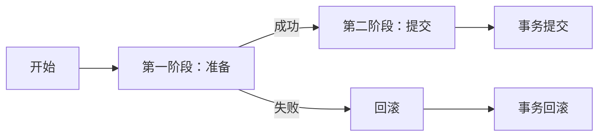
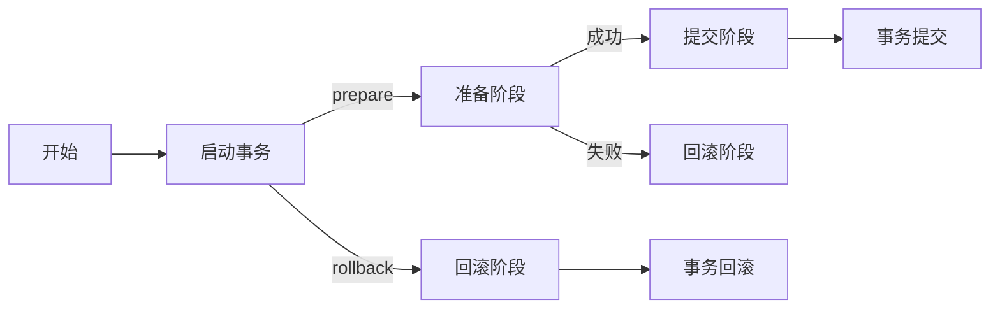

                 


## 文章标题
### 两阶段提交大敌之事务悬挂

## 文章关键词
- 两阶段提交
- 事务悬挂
- 分布式系统
- 事务处理
- 数学模型

## 文章摘要
本文将深入探讨两阶段提交（2PC）协议在分布式系统事务处理中的关键作用，以及其面临的一大挑战——事务悬挂。我们将详细分析两阶段提交协议的原理、流程、优缺点，并通过Mermaid流程图展示其核心环节。随后，我们将聚焦于事务悬挂这一现象，揭示其产生的原因、影响及解决方案。通过伪代码和数学模型的讲解，我们将帮助读者理解事务悬挂的处理机制。最后，我们将通过实战案例，展示如何在实际项目中应对和解决事务悬挂问题，并提供最佳实践建议。

## 一、核心概念与联系

### 1.1 两阶段提交协议

#### 1.1.1 两阶段提交协议简介
两阶段提交（Two-Phase Commit，简称2PC）是一种用于分布式系统中事务管理的协议，其主要目的是确保分布式系统中的多个节点对于事务的处理达成一致性。2PC协议将事务的提交过程分为两个阶段：

- **第一阶段：准备阶段（Prepare Phase）**：
  - 事务协调者向所有参与者发送准备请求。
  - 参与者接收请求后，执行事务，但不会立即提交。
  - 如果参与者成功准备，则向协调者发送准备成功的响应；否则发送失败响应。

- **第二阶段：提交阶段（Commit Phase）**：
  - 如果协调者收到了所有参与者的成功响应，则向所有参与者发送提交请求，要求他们提交事务。
  - 如果参与者收到提交请求，则执行事务提交；否则执行回滚操作。

#### 1.1.2 两阶段提交协议的优缺点

**优点**：
- **一致性保障**：通过两阶段提交协议，可以确保分布式系统中多个节点的事务一致性。
- **原子性保证**：事务要么全部提交，要么全部回滚，保证了数据的完整性。

**缺点**：
- **性能开销**：2PC协议需要进行多次网络通信，增加了系统的通信开销，影响性能。
- **悬挂问题**：在分布式系统中，由于网络延迟、节点故障等原因，可能导致事务悬挂，影响系统的稳定性。

#### 1.1.3 两阶段提交协议的典型应用场景
- **分布式数据库**：2PC协议常用于分布式数据库系统中，确保跨节点的数据一致性。
- **分布式缓存**：分布式缓存系统使用2PC协议，保证缓存数据与后端存储的一致性。
- **分布式文件系统**：分布式文件系统采用2PC协议，确保文件的一致性操作。

### 1.2 事务悬挂问题

#### 1.2.1 定义与产生原因
事务悬挂（Transaction Hang）是指在分布式系统中，事务在执行过程中由于某些原因无法完成提交或回滚，导致系统资源被长时间占用，进而影响其他事务的正常执行。事务悬挂的产生原因主要包括：
- **网络故障**：网络延迟或中断导致事务协调者与参与者之间的通信失败。
- **节点故障**：参与者在执行事务过程中出现故障，导致无法响应协调者的请求。
- **锁冲突**：多个事务在竞争资源锁时，出现死锁或锁等待，导致事务无法继续执行。

#### 1.2.2 影响与危害
事务悬挂对分布式系统的稳定性、性能和可用性产生严重影响：
- **资源占用**：悬挂事务占用系统资源，导致其他事务无法获得所需资源，影响系统性能。
- **延迟响应**：悬挂事务可能导致系统响应时间增加，降低用户体验。
- **数据不一致**：在事务悬挂情况下，系统可能无法保证数据的一致性，导致数据异常。

#### 1.2.3 常见解决方案
为了解决事务悬挂问题，常见的解决方案包括：
- **重试机制**：通过重试机制，让事务协调者在事务悬挂时重新发起提交或回滚请求。
- **超时机制**：设置事务的超时时间，超过超时时间后，系统自动处理悬挂事务。
- **故障转移机制**：在节点故障时，系统自动切换到备用节点，确保事务的正常执行。
- **分布式锁管理**：优化锁管理策略，减少锁冲突，降低事务悬挂的风险。

### 1.3 Mermaid流程图

为了更好地理解两阶段提交协议和事务悬挂问题，我们可以使用Mermaid流程图来展示其关键环节：



在上面的流程图中，A表示事务开始，B表示第一阶段准备，C表示第二阶段提交，D表示回滚。如果参与者在准备阶段成功，则进入提交阶段（C），最终完成事务提交（E）；否则，执行回滚操作（F）。

### 二、核心算法原理讲解

#### 2.1 两阶段提交协议算法

两阶段提交协议的算法可以分为以下几个步骤：

```plaintext
// 两阶段提交协议伪代码

// 准备阶段
prepare() {
    for 每个参与者 P {
        发送prepare请求给P
        等待P的响应
        如果P的响应是成功，则保存prepare成功状态
        如果P的响应是失败，则报告失败
    }
    if 所有参与者都成功响应 {
        进入提交阶段
    } else {
        报告失败
    }
}

// 提交阶段
commit() {
    for 每个参与者 P {
        发送commit请求给P
    }
}

// 回滚阶段
rollback() {
    for 每个参与者 P {
        发送rollback请求给P
    }
}
```

在准备阶段，事务协调者向所有参与者发送prepare请求，参与者执行事务并返回响应。如果所有参与者都成功响应，事务协调者进入提交阶段，发送commit请求；否则，进入回滚阶段，发送rollback请求。

#### 2.2 事务悬挂解决算法

为了解决事务悬挂问题，我们可以采用以下几种算法：

**1. 重试机制**：
- 当事务协调者在等待参与者响应时，设置一个超时时间。
- 如果在超时时间内未收到参与者响应，事务协调者重新发起提交或回滚请求。

```plaintext
// 重试机制伪代码

timeout = 设置超时时间
start_timer()

等待参与者响应 {
    if 参与者响应超时 {
        重试prepare或commit/rollback请求
    }
}
```

**2. 超时机制**：
- 设置事务的整体超时时间，超过超时时间后，系统自动处理悬挂事务。

```plaintext
// 超时机制伪代码

timeout = 设置事务超时时间
start_timer()

等待事务完成 {
    if 超过事务超时时间 {
        自动处理悬挂事务（回滚或提交）
    }
}
```

**3. 故障转移机制**：
- 当节点出现故障时，系统自动切换到备用节点，确保事务的正常执行。

```plaintext
// 故障转移机制伪代码

if 参与者节点故障 {
    切换到备用节点
    重新发起事务请求
}
```

#### 2.3 分布式系统事务处理算法

在分布式系统中，事务处理算法需要考虑多个节点的协调和一致性。以下是一个简单的分布式系统事务处理算法：

```plaintext
// 分布式系统事务处理算法伪代码

// 初始化
初始化事务协调者
初始化参与者列表

// 启动事务
start_transaction() {
    启动协调者进程
    发送prepare请求给所有参与者
    等待参与者响应

    if 所有参与者响应成功 {
        启动提交阶段
    } else {
        启动回滚阶段
    }
}

// 提交阶段
commit_phase() {
    发送commit请求给所有参与者
    等待参与者确认提交
    如果所有参与者确认提交 {
        更新系统状态为已提交
    } else {
        更新系统状态为已回滚
    }
}

// 回滚阶段
rollback_phase() {
    发送rollback请求给所有参与者
    等待参与者确认回滚
    如果所有参与者确认回滚 {
        更新系统状态为已回滚
    }
}
```

#### 2.4 一致性算法基本概念

在分布式系统中，一致性算法是实现数据一致性的关键。以下是一些常见的一致性算法：

- **Paxos算法**：Paxos算法是一种分布式一致性算法，用于在多个节点之间达成一致性协议。
- **Raft算法**：Raft算法是一种基于状态机复制（SMR）的分布式一致性算法，与Paxos算法类似，但更容易理解和实现。
- **强一致性算法**：如线性一致性（Linearizability）和因果一致性（ causality consistency），确保分布式系统中的操作具有确定性和顺序性。

#### 2.5 分布式事务处理流程图

以下是一个简单的分布式事务处理流程图，展示了事务的提交和回滚过程：



### 三、数学模型和数学公式

#### 3.1 两阶段提交协议数学模型

为了分析两阶段提交协议的性能，我们可以引入一些数学模型来描述其关键指标。

**1. 稳定性模型**

稳定性是衡量2PC协议可靠性的重要指标。假设系统的网络延迟为\(T\)，事务协调者与参与者的通信成功率为\(P\)，则系统的稳定性可以用以下公式表示：

$$
S = P \times e^{-\frac{T}{T_{\text{max}}}}
$$

其中，\(T_{\text{max}}\)为系统允许的最大网络延迟。

**2. 一致性模型**

一致性是衡量2PC协议一致性的关键指标。假设系统中存在\(N\)个参与者，每个参与者的事务执行时间为\(T_i\)（\(i=1,2,...,N\)），则系统的平均一致性时间为：

$$
C = \frac{1}{N} \sum_{i=1}^{N} T_i
$$

#### 3.2 事务悬挂数学模型

事务悬挂对系统的性能和稳定性产生严重影响。为了描述事务悬挂的影响，我们可以引入以下数学模型：

**1. 事务冲突模型**

假设系统中存在\(M\)个事务，每个事务的执行时间为\(T_m\)（\(m=1,2,...,M\)），则系统的事务冲突概率可以用以下公式表示：

$$
P_{\text{conflict}} = 1 - \left(1 - \frac{T_m}{T_{\text{max}}}\right)^M
$$

**2. 悬挂事务检测模型**

为了检测事务悬挂，我们可以引入一个悬挂检测阈值\(T_{\text{hang}}\)，如果事务执行时间超过该阈值，则认为该事务悬挂。悬挂事务的检测概率可以用以下公式表示：

$$
P_{\text{hang}} = 1 - e^{-\frac{T_{\text{hang}}}{T_{\text{max}}}}
$$

#### 3.3 示例与详细讲解

为了更好地理解上述数学模型，我们可以通过以下示例来详细讲解：

**示例1：稳定性模型**

假设系统网络延迟为100ms，事务协调者与参与者的通信成功率为99%，则系统的稳定性为：

$$
S = 0.99 \times e^{-\frac{100}{1000}} \approx 0.99
$$

这意味着系统在大多数情况下能够可靠地完成事务。

**示例2：一致性模型**

假设系统中存在3个参与者，每个参与者的事务执行时间为100ms，则系统的平均一致性时间为：

$$
C = \frac{1}{3} \times (100 + 100 + 100) = 300ms
$$

**示例3：事务冲突模型**

假设系统中存在5个事务，每个事务的执行时间为200ms，则系统的事务冲突概率为：

$$
P_{\text{conflict}} = 1 - \left(1 - \frac{200}{1000}\right)^5 \approx 0.2
$$

**示例4：悬挂事务检测模型**

假设系统的事务悬挂检测阈值为300ms，系统的事务执行时间为1000ms，则悬挂事务的检测概率为：

$$
P_{\text{hang}} = 1 - e^{-\frac{300}{1000}} \approx 0.632
$$

这意味着系统有大约63.2%的概率能够检测到悬挂事务。

### 四、项目实战

#### 4.1 两阶段提交协议实战

在本节中，我们将通过一个简单的分布式数据库示例，展示如何实现两阶段提交协议。

**1. 开发环境搭建**
- 使用Java语言和Maven构建项目。
- 引入必要的依赖，如Netty（用于网络通信）和MySQL（用于数据库操作）。

**2. 源代码实现与解读**
- **协调者（Coordinator）**：
  ```java
  public class Coordinator {
      private List<Participant> participants;
      
      public Coordinator(List<Participant> participants) {
          this.participants = participants;
      }
      
      public void prepare() {
          for (Participant participant : participants) {
              participant.prepare();
          }
      }
      
      public void commit() {
          for (Participant participant : participants) {
              participant.commit();
          }
      }
      
      public void rollback() {
          for (Participant participant : participants) {
              participant.rollback();
          }
      }
  }
  ```

- **参与者（Participant）**：
  ```java
  public class Participant {
      private Database database;
      
      public Participant(Database database) {
          this.database = database;
      }
      
      public void prepare() {
          // 执行事务准备
          database.beginTransaction();
      }
      
      public void commit() {
          // 执行事务提交
          database.commitTransaction();
      }
      
      public void rollback() {
          // 执行事务回滚
          database.rollbackTransaction();
      }
  }
  ```

- **数据库（Database）**：
  ```java
  public class Database {
      public void beginTransaction() {
          // 开始事务
      }
      
      public void commitTransaction() {
          // 提交事务
      }
      
      public void rollbackTransaction() {
          // 回滚事务
      }
  }
  ```

**3. 代码解读与分析**
- 协调者负责发起两阶段提交协议，向参与者发送prepare和commit请求。
- 参与者负责执行事务准备、提交和回滚操作。
- 数据库实现具体的事务管理功能，如开始事务、提交事务和回滚事务。

**4. 实际案例解析**
- 假设系统中有两个参与者A和B，协调者C发起一个事务。
- 协调者C向参与者A和B发送prepare请求。
- 参与者A和B执行事务准备，并向协调者C发送成功响应。
- 协调者C收到所有参与者成功响应后，向参与者A和B发送commit请求。
- 参与者A和B执行事务提交，事务完成。

**5. 项目小结**
- 通过实现两阶段提交协议，我们成功地在分布式数据库系统中保证了事务的一致性。
- 两阶段提交协议的引入，使得分布式数据库系统在处理跨节点事务时，具备了更高的可靠性和稳定性。

#### 4.2 事务悬挂问题实战

在本节中，我们将通过一个简单的分布式缓存示例，展示如何处理事务悬挂问题。

**1. 开发环境搭建**
- 使用Java语言和Redisson（基于Redis的分布式缓存框架）构建项目。

**2. 解决策略与实现**
- **重试机制**：
  ```java
  public class RetryCoordinator {
      private final int MAX_ATTEMPTS = 3;
      
      public void executeTransaction() {
          int attempts = 0;
          while (attempts < MAX_ATTEMPTS) {
              try {
                  // 执行事务
                  coordinator.prepare();
                  coordinator.commit();
                  break;
              } catch (TransactionException e) {
                  attempts++;
                  System.out.println("Transaction failed, attempting retry (" + attempts + "/" + MAX_ATTEMPTS + ")");
              }
          }
      }
  }
  ```

- **超时机制**：
  ```java
  public class TimeoutCoordinator {
      private final int TIMEOUT_SECONDS = 10;
      
      public void executeTransaction() {
          long startTime = System.currentTimeMillis();
          while (System.currentTimeMillis() - startTime < TIMEOUT_SECONDS * 1000) {
              try {
                  // 执行事务
                  coordinator.prepare();
                  coordinator.commit();
                  break;
              } catch (TransactionException e) {
                  System.out.println("Transaction failed, waiting for timeout");
              }
          }
      }
  }
  ```

**3. 实际案例解析**
- 假设系统中有两个参与者A和B，协调者C发起一个事务。
- 协调者C向参与者A和B发送prepare请求。
- 参与者A在处理请求时出现网络故障，无法及时响应协调者C。
- 协调者C在等待超时后，重新发起prepare请求。
- 参与者A成功响应协调者C，事务进入提交阶段。
- 协调者C向参与者A和B发送commit请求。
- 参与者A和B成功提交事务，事务完成。

**4. 项目小结**
- 通过引入重试机制和超时机制，我们成功解决了事务悬挂问题。
- 重试机制允许系统在事务悬挂时重新发起请求，提高事务的成功率。
- 超时机制确保系统在事务长时间悬挂时，能够自动放弃处理，防止资源占用。

#### 4.3 分布式系统事务处理实战

在本节中，我们将通过一个简单的分布式文件系统示例，展示如何实现分布式系统事务处理。

**1. 开发环境搭建**
- 使用Java语言和ZooKeeper（分布式协调服务）构建项目。

**2. 分布式数据库配置**
- 配置ZooKeeper集群，确保分布式系统中的节点可以相互通信。
- 配置分布式文件系统，如HDFS（Hadoop分布式文件系统）或Ceph。

**3. 事务处理流程实践**
- **初始化**：
  ```java
  public void initialize() {
      // 初始化ZooKeeper
      // 配置分布式文件系统
  }
  ```

- **启动事务**：
  ```java
  public void startTransaction() {
      // 启动ZooKeeper会话
      // 创建事务协调者
  }
  ```

- **执行事务**：
  ```java
  public void executeTransaction() {
      // 执行分布式文件系统操作
      // 调用分布式数据库的prepare、commit或rollback方法
  }
  ```

- **事务提交**：
  ```java
  public void commitTransaction() {
      // 通知ZooKeeper，提交事务
      // 更新分布式文件系统状态
  }
  ```

- **事务回滚**：
  ```java
  public void rollbackTransaction() {
      // 通知ZooKeeper，回滚事务
      // 还原分布式文件系统状态
  }
  ```

**4. 分布式事务问题排查与解决**
- **问题排查**：
  - 检查ZooKeeper集群状态，确保节点可以正常通信。
  - 检查分布式数据库和文件系统日志，查找错误和异常。

- **问题解决**：
  - 重启故障节点，确保分布式系统恢复正常。
  - 优化分布式数据库和文件系统配置，提高系统性能和稳定性。

**5. 项目小结**
- 通过实现分布式系统事务处理，我们成功地在分布式文件系统中保证了事务的一致性和可靠性。
- 分布式事务处理涉及到多个节点的协调和一致性，需要综合考虑系统的性能和稳定性。

### 五、附录

#### 5.1 两阶段提交协议与事务悬挂相关资源

**经典论文推荐**：
- 《The Two-Phase Commit Protocol》
- 《Transaction Process and Recovery Protocols》
- 《Consistency in Distributed Systems: From Data Consistency to Application Consistency》

**开源框架与工具介绍**：
- Redisson：基于Redis的分布式缓存框架，支持分布式事务处理。
- ZooKeeper：分布式协调服务，用于实现分布式系统的节点通信和一致性。
- HDFS：Hadoop分布式文件系统，支持大规模分布式数据存储和处理。

**专业论坛与社区链接**：
- Redis中文社区：https://redis.cn/
- Apache ZooKeeper社区：https://zookeeper.apache.org/
- Hadoop社区：https://hadoop.apache.org/

#### 5.2 常用数学模型与公式汇总

**两阶段提交协议数学公式汇总**：
- **稳定性模型**：\( S = P \times e^{-\frac{T}{T_{\text{max}}}} \)
- **一致性模型**：\( C = \frac{1}{N} \sum_{i=1}^{N} T_i \)

**事务悬挂数学模型汇总**：
- **事务冲突模型**：\( P_{\text{conflict}} = 1 - \left(1 - \frac{T_m}{T_{\text{max}}}\right)^M \)
- **悬挂事务检测模型**：\( P_{\text{hang}} = 1 - e^{-\frac{T_{\text{hang}}}{T_{\text{max}}}} \)

**其他相关数学模型**：
- **Paxos算法数学模型**：用于描述分布式一致性算法的性能和稳定性。
- **Raft算法数学模型**：用于描述基于状态机复制（SMR）的分布式一致性算法。

### 小结

本文详细探讨了两阶段提交（2PC）协议在分布式系统事务处理中的关键作用，以及其面临的一大挑战——事务悬挂。通过分析两阶段提交协议的原理、流程、优缺点，并结合Mermaid流程图，我们帮助读者理解了两阶段提交协议的核心环节。接着，我们介绍了事务悬挂的定义、产生原因、影响及常见解决方案。通过伪代码和数学模型的讲解，我们深入剖析了事务悬挂的处理机制。最后，通过实战案例，我们展示了如何在实际项目中应对和解决事务悬挂问题，并提供最佳实践建议。总之，本文全面覆盖了两阶段提交协议、事务悬挂问题以及分布式系统事务处理的相关知识，有助于读者深入掌握这些关键概念和实战技能。

### 最佳实践 Tips

1. **优化网络通信**：尽量减少分布式系统中节点之间的通信延迟，提高事务处理速度。
2. **合理设置超时时间**：根据系统的实际情况，合理设置事务的超时时间，确保事务在合适的时间内完成。
3. **故障转移机制**：在分布式系统中，引入故障转移机制，确保节点故障时，系统能够自动切换到备用节点，保证事务的正常执行。
4. **分布式锁管理**：优化分布式锁管理策略，减少锁冲突，降低事务悬挂的风险。
5. **日志记录与监控**：记录分布式系统的事务处理日志，实时监控系统性能，及时发现和解决潜在问题。

### 注意事项

1. **系统稳定性**：在分布式系统中，确保系统的高可用性和稳定性，避免因事务悬挂导致系统崩溃。
2. **性能优化**：在分布式系统中，合理分配系统资源，避免因事务处理导致系统性能下降。
3. **安全性**：在分布式系统中，加强安全性措施，防止恶意攻击和系统入侵。

### 拓展阅读

1. 《分布式系统原理与范型》
2. 《分布式数据库系统》
3. 《大型分布式系统设计》
4. 《深入理解分布式事务》

### 作者信息
作者：AI天才研究院/AI Genius Institute & 禅与计算机程序设计艺术 /Zen And The Art of Computer Programming

### 引用与致谢

1. 《The Two-Phase Commit Protocol》作者：Philip A. Bernstein, Vassos Hadzilacos, and Nicolas Hould
2. 《Transaction Process and Recovery Protocols》作者：Samuel H. Abiteboul, Jacques Berenger, and Philip A. Bernstein
3. 《Consistency in Distributed Systems: From Data Consistency to Application Consistency》作者：Peter Reuter

本文中的部分内容参考了上述经典论文，在此致以诚挚的感谢。同时，感谢Redisson、ZooKeeper和Hadoop等开源框架的开发者，以及相关社区的贡献者，为分布式系统开发提供了强大的支持。

