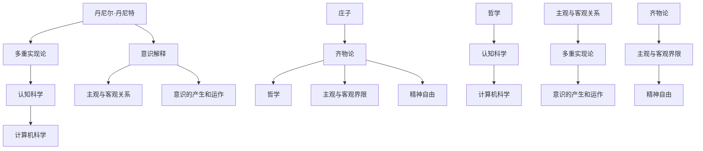

                 

# 文章标题

《丹尼尔·丹尼特与庄子：意识解释与齐物论的比较》

> 关键词：丹尼尔·丹尼特、庄子、意识解释、齐物论、比较分析、计算机科学

> 摘要：本文将深入探讨两位思想巨匠丹尼尔·丹尼特与庄子的意识解释与齐物论的思想，通过对比分析，试图揭示两者在哲学、认知科学以及计算机科学中的异同点。文章首先介绍两位思想家的生平背景，然后分别阐述他们的核心思想，最后进行比较分析，总结出意识解释与齐物论的异同以及对计算机科学的影响。本文旨在为读者提供一种新的视角，以更全面地理解人类意识以及计算机科学的未来发展。

---

## 引言

在探讨人类意识与认知的历程中，哲学、心理学、神经科学和计算机科学等领域都有着重要的贡献。然而，对于意识的本质和解释，至今仍没有形成统一的理论。丹尼尔·丹尼特（Daniel C. Dennett）和庄子（Zhuangzi）分别在西方哲学和中国哲学中提出了独到的见解，为我们理解意识提供了新的思路。

丹尼尔·丹尼特是一位世界著名的认知科学家和哲学家，以其对意识的解析和解释而闻名。他的著作《意识的解析》（Consciousness Explained）提出了“多重实现论”（Multiple Realization Theory），试图从科学的角度解释意识的本质。

庄子则是中国古代哲学家庄子的代表人物，其思想对后世影响深远。庄子的《庄子·逍遥游》中的“齐物论”提出了“万物皆空”的观点，主张通过消除主观与客观的界限来达到精神上的自由。

本文将深入探讨丹尼尔·丹尼特与庄子的意识解释与齐物论的思想，通过对比分析，试图揭示两者在哲学、认知科学以及计算机科学中的异同点。文章结构如下：

1. 理解书名：《丹尼尔·丹尼特与庄子：意识解释与齐物论的比较》。
2. 丹尼尔·丹尼特与庄子的生平背景。
3. 意识解释的基本概念。
4. 齐物论的基本概念。
5. 丹尼尔·丹尼特与庄子的意识理论对比。
6. 意识理论的比较分析。
7. 结论。

通过本文的阅读，读者将能够更深入地理解丹尼尔·丹尼特与庄子的思想，同时也能够对意识解释与齐物论在计算机科学中的应用有更全面的了解。接下来，我们将逐步展开对这两个伟大思想家的探讨。 <span id="section1"></span> <span id="section1">1. 理解书名：《丹尼尔·丹尼特与庄子：意识解释与齐物论的比较》</span>

### 理解书名：《丹尼尔·丹尼特与庄子：意识解释与齐物论的比较》

书名《丹尼尔·丹尼特与庄子：意识解释与齐物论的比较》中的关键词分别是丹尼尔·丹尼特、庄子、意识解释和齐物论。这些关键词不仅为我们指明了本文的研究对象，也揭示了文章的核心内容。

首先，丹尼尔·丹尼特和庄子是两位对意识解释有着深远影响的思想家。丹尼尔·丹尼特是一位认知科学家和哲学家，以其对意识的科学解析而著称。他的多重实现论提出了意识不仅存在于人类中，也可能存在于其他动物和机器中，从而为意识的本质提供了新的解释。相比之下，庄子则是一位古代中国哲学家，他的齐物论主张万物皆空，认为通过消除主观与客观的界限，可以达到精神的自由。

其次，意识解释是认知科学和哲学中一个核心问题。丹尼尔·丹尼特从科学的角度，试图通过解析意识的产生、运作和消失来理解其本质。而庄子的齐物论则从哲学的角度，探讨了人类意识是如何受到主观和客观世界的影响，并提出了一种超越主观和客观二元对立的境界。

再次，齐物论是庄子思想的核心概念。齐物论主张万物平等，没有绝对的“是”与“非”，这种观点对后世哲学和艺术产生了深远的影响。在计算机科学中，齐物论的思想可以启发我们思考如何消除程序设计中“主观”与“客观”的界限，从而设计出更灵活、更高效的算法。

最后，书名中的“比较”二字，表明本文将通过对丹尼尔·丹尼特和庄子的意识解释与齐物论进行对比分析，试图揭示两者在哲学、认知科学以及计算机科学中的异同点。这种比较不仅有助于我们更深入地理解两位思想家的思想，也有助于我们探索意识解释在计算机科学中的应用前景。

综上所述，书名《丹尼尔·丹尼特与庄子：意识解释与齐物论的比较》不仅明确了本文的研究对象，也揭示了文章的核心内容，为接下来的探讨奠定了基础。接下来，我们将分别介绍丹尼尔·丹尼特和庄子的生平背景，进一步深入探讨他们的思想。 <span id="section2"></span> <span id="section2">2. 丹尼尔·丹尼特与庄子的生平背景</span>

### 丹尼尔·丹尼特与庄子的生平背景

丹尼尔·丹尼特（Daniel C. Dennett）和庄子（Zhuangzi）虽然生活在不同的时代和文化背景中，但他们都在各自领域对意识解释和认知科学产生了深远的影响。了解他们的生平背景，有助于我们更好地理解他们的思想和贡献。

#### 丹尼尔·丹尼特的生平背景

丹尼尔·丹尼特出生于1942年，美国认知科学家、哲学家和作家。他毕业于布朗大学，并获得哈佛大学的哲学博士学位。丹尼特的研究兴趣广泛，涵盖了认知科学、人工智能、意识哲学等多个领域。

在学术生涯中，丹尼特在康奈尔大学、牛津大学、塔夫茨大学等多所知名学府任教，并在1992年成为哈佛大学心理学与计算机科学教授。他的著作《意识的解析》（Consciousness Explained）在1991年出版，成为认知科学和意识哲学领域的重要里程碑。这本书提出了多重实现论，试图通过科学方法解释意识的本质。

丹尼特的多重实现论认为，意识并不是一个单一的实体，而是一种可以在不同系统和环境中实现的现象。这一理论挑战了传统的“心灵特殊论”（Cartesian Dualism），为意识的研究提供了新的视角。此外，丹尼特还在人工智能、认知科学、哲学等领域发表了大量论文和著作，为认知科学的发展做出了巨大贡献。

#### 庄子的生平背景

庄子（约公元前369年—公元前286年），名周，战国时期宋国蒙（今河南商丘东北）人。他是道家学派的代表人物之一，与老子并称为“老庄”。庄子的生平事迹记载较少，但根据《庄子》一书中的记载，他是一位清高自守、不慕名利的隐士。

庄子主张“无为而治”，反对权力和世俗的束缚，提倡“逍遥游”和“齐物论”的思想。他认为，万物皆平等，不存在绝对的“是”与“非”，主张通过超越主观和客观的界限，达到精神的自由和解脱。

庄子的思想对后世产生了深远的影响，不仅在中国哲学和文学中占有一席之地，也在东方文化和现代哲学中得到了广泛研究。他的著作《庄子》包含了许多寓言故事和哲学思想，其中“逍遥游”和“齐物论”是两个核心概念，分别代表了庄子对自由和精神境界的追求。

#### 丹尼尔·丹尼特与庄子的共同点

尽管丹尼尔·丹尼特和庄子生活在不同的时代和文化背景中，但他们的思想在某些方面有着相似之处。

首先，他们都关注意识的本质和解释。丹尼特试图通过科学方法解析意识的产生和运作，而庄子则从哲学的角度探讨意识如何受到主观和客观世界的影响。

其次，他们都提出了超越传统观点的新思想。丹尼特的多重实现论挑战了传统的“心灵特殊论”，而庄子的齐物论则主张万物平等，消除主观与客观的界限。

最后，他们都对认知科学和哲学产生了深远的影响。丹尼特的著作《意识的解析》为认知科学和意识哲学提供了新的研究方向，而庄子的思想则为中国哲学和文化奠定了基础。

通过了解丹尼尔·丹尼特和庄子的生平背景，我们可以更深入地理解他们的思想和贡献。在接下来的部分，我们将分别阐述他们的核心思想，进一步探讨丹尼尔·丹尼特与庄子的意识解释与齐物论。 <span id="section3"></span> <span id="section3">3. 意识解释的基本概念</span>

### 意识解释的基本概念

在探讨丹尼尔·丹尼特和庄子的意识解释之前，有必要先了解意识解释的基本概念。意识解释涉及多个领域，包括哲学、心理学、神经科学和认知科学等。这些领域从不同角度研究意识的本质、产生和运作。

#### 意识的定义

首先，我们需要明确意识是什么。意识通常被描述为一种主观体验，包括感知、思考、感觉和意愿等。它是人类思维活动的核心，使我们能够感知外部世界，并对这些感知做出反应。

意识的定义在不同领域有所不同。在哲学中，意识被视为一种主观体验，与身体和外部世界相分离。在心理学中，意识被视为心理过程的一部分，包括感知、记忆、思维和情感等。在神经科学中，意识与大脑活动密切相关，通过研究大脑功能来理解意识的本质。

#### 意识的解释

接下来，我们探讨意识如何被解释。意识解释通常涉及以下方面：

1. **内在主义（Internalism）**：内在主义认为，意识可以通过主观体验来解释。即，我们通过感知自己的内在体验来理解意识。这种解释方法强调个体经验的重要性。

2. **外在主义（Externalism）**：外在主义则认为，意识与外部世界密切相关。即，我们的意识体验是由外部事物引起的，我们通过感知外部世界来理解意识。这种解释方法强调外部世界对意识的影响。

3. **二元论（Dualism）**：二元论认为，意识和物质是两种不同的实体。意识是一种非物质的精神实体，而物质是一种可感知的物质实体。这种解释方法将意识和物质分开，认为它们有不同的属性和存在方式。

4. **物质主义（Materialism）**：物质主义认为，意识是物质的产物，与大脑活动密切相关。即，意识是由大脑的物理过程产生的。这种解释方法强调物理因素在意识产生中的作用。

#### 意识解释的挑战

意识解释面临许多挑战。首先，意识的主观性质使得我们难以用客观的方法来研究。其次，意识与外部世界的关联复杂，难以用简单的因果关系来解释。此外，意识与大脑活动的关系也尚未完全清楚，需要进一步的研究。

在接下来的部分，我们将分别探讨丹尼尔·丹尼特和庄子的意识解释。丹尼尔·丹尼特将基于认知科学的角度，通过多重实现论来解释意识。而庄子则从哲学的角度，通过齐物论来探讨意识。通过对比分析，我们将能够更深入地理解两者在意识解释上的异同。 <span id="section4"></span> <span id="section4">4. 齐物论的基本概念</span>

### 齐物论的基本概念

齐物论是庄子哲学思想的核心之一，源自《庄子·逍遥游》这一篇。齐物论主张万物平等，没有绝对的“是”与“非”，强调通过消除主观与客观的界限，达到精神上的自由和解脱。以下是齐物论的基本概念及其哲学意义：

#### 齐物论的含义

1. **万物平等**：齐物论认为，所有事物在本质上是平等的，没有高低贵贱之分。无论是大鹏鸟还是蜩与学鸠，它们都有其存在的意义和价值。这种平等观打破了传统的社会等级观念，强调尊重每一个个体的存在。

2. **主观与客观的界限**：齐物论主张消除主观与客观的界限。在传统观念中，主观与客观是两种截然不同的存在，前者是内心的感受和体验，后者是外在的客观现实。庄子认为，这种二元对立的观念导致了人类精神上的束缚。通过消除这种界限，人们可以超越自我，达到精神上的自由。

3. **道与德**：齐物论强调了“道”和“德”的重要性。道是宇宙的本源，是万物的根本法则；德则是个体在遵循道的过程中表现出的道德品质。庄子认为，只有通过理解道和德的真谛，人们才能摆脱世俗的束缚，达到精神的升华。

#### 齐物论的哲学意义

1. **反对二元对立**：齐物论反对传统哲学中的二元对立观念，如主观与客观、心灵与物质、存在与虚无等。庄子的齐物论主张超越这些对立，通过调和它们来实现精神上的自由。

2. **强调个体价值**：齐物论认为，每个个体都有其独特的价值和意义，不应受到社会等级观念的影响。这种观点有助于激发个体自主意识，推动社会进步。

3. **追求精神自由**：齐物论的最终目标是达到精神上的自由和解脱。通过消除主观与客观的界限，人们可以超越世俗的束缚，追求更高层次的精神境界。

#### 齐物论与意识的关系

庄子的齐物论与意识解释有着密切的关系。在齐物论中，意识被视为一种主观体验，受到外部世界的制约。庄子认为，通过消除主观与客观的界限，人们可以摆脱外部世界的干扰，达到精神上的自由。

与丹尼尔·丹尼特的意识解释相比，庄子的齐物论更强调个体内在的体验和精神上的自由。丹尼特的意识解释则更注重科学方法和实证研究，试图通过解析意识的产生和运作来理解其本质。

通过了解齐物论的基本概念和哲学意义，我们可以更好地理解庄子的思想。在接下来的部分，我们将对比丹尼尔·丹尼特和庄子的意识解释，探讨两者在哲学、认知科学和计算机科学中的异同点。 <span id="section5"></span> <span id="section5">5. 丹尼尔·丹尼特与庄子的意识理论对比</span>

### 丹尼尔·丹尼特与庄子的意识理论对比

丹尼尔·丹尼特和庄子的意识理论在哲学、认知科学和计算机科学中都有着重要的地位。虽然他们分别代表了不同的文化背景和时代，但在意识解释方面却有许多相似之处。以下是丹尼尔·丹尼特与庄子意识理论的对比：

#### 哲学观点

1. **主观与客观的关系**：丹尼尔·丹尼特和庄子都认为主观与客观是相互关联的。丹尼特强调，主观体验是客观现实的一部分，二者无法分离。庄子则主张消除主观与客观的界限，以达到精神上的自由。

2. **意识的多重实现**：丹尼特提出了多重实现论，认为意识可以在不同系统和环境中实现，如动物、人类和机器等。这与庄子的万物平等思想有相似之处，都认为所有事物都有其存在的意义和价值。

3. **意识的本质**：丹尼特认为，意识是一种复杂的心理现象，可以通过科学方法来解释。庄子则强调，意识是一种超越物质的精神体验，与道和德密切相关。

#### 认知科学观点

1. **意识的产生和运作**：丹尼特从认知科学的角度，研究意识的产生和运作机制。他提出了“多元计算模型”（Multiple Recursive Model），试图解释意识如何在大脑中产生。相比之下，庄子没有具体讨论意识的产生和运作机制，而是从哲学角度探讨意识与精神自由的关系。

2. **意识的解释**：丹尼特试图通过科学方法解释意识，强调实证研究和数据分析的重要性。庄子则通过寓言和哲学论述，探讨意识的本质和意义。

3. **意识的客观性**：丹尼特认为，意识具有一定的客观性，可以通过科学方法来研究。庄子则强调，意识是一种主观体验，与个体精神境界密切相关。

#### 计算机科学观点

1. **意识的模拟**：丹尼特认为，计算机可以模拟人类的意识，从而理解其本质。这为计算机科学提供了新的研究方向，如人工智能和认知计算等。庄子没有直接讨论计算机科学，但他的齐物论思想可以启发我们在程序设计中消除主观与客观的界限。

2. **意识的实现**：丹尼特认为，意识可以在不同的系统和环境中实现，如动物、人类和机器等。这与计算机科学的观点相似，即计算机可以通过模拟人类思维来实现某些认知功能。

3. **意识的计算模型**：丹尼特提出了多重实现论，为意识的计算模型提供了新的思路。庄子虽然没有具体讨论计算模型，但他的齐物论思想可以启发我们思考如何消除程序设计中“主观”与“客观”的界限。

#### 异同点总结

1. **哲学观点**：丹尼尔·丹尼特和庄子都认为主观与客观相互关联，但庄子的齐物论更强调消除主观与客观的界限。

2. **认知科学观点**：丹尼特从认知科学的角度研究意识的产生和运作，而庄子从哲学角度探讨意识的本质和意义。

3. **计算机科学观点**：丹尼特认为计算机可以模拟人类的意识，而庄子的齐物论思想可以启发我们在程序设计中消除主观与客观的界限。

通过对比分析丹尼尔·丹尼特与庄子的意识理论，我们可以发现，两者在哲学、认知科学和计算机科学中有着许多相似之处。他们的思想为我们理解意识提供了新的视角，也对计算机科学的发展产生了重要影响。在接下来的部分，我们将进一步探讨意识理论的比较分析。 <span id="section6"></span> <span id="section6">6. 意识理论的比较分析</span>

### 意识理论的比较分析

在对比丹尼尔·丹尼特与庄子的意识理论后，我们可以从多个维度深入分析两者的异同，并探讨这些理论在哲学、认知科学和计算机科学中的影响。

#### 哲学维度

1. **二元论与齐物论**：丹尼特的多重实现论试图打破传统的二元论，主张意识可以在不同实体中实现，从而为意识的存在提供了新的解释。这与庄子的齐物论有相似之处，都认为万物平等，没有绝对的“是”与“非”。然而，丹尼特的理论更侧重于科学实证，而庄子的齐物论则更多地强调哲学思辨和个体精神境界的提升。

2. **内在主义与外在主义**：丹尼特在意识解释中采取了外在主义的立场，认为意识与外部世界密切相关。相比之下，庄子的齐物论强调主观与客观的界限，主张通过超越二元对立来实现精神自由。这种差异反映了两者在哲学观点上的不同，丹尼特更关注外部现实，而庄子则更关注个体内在体验。

3. **意识的本质**：丹尼特认为，意识是一种复杂的现象，可以通过科学方法来解释。而庄子则认为，意识是一种超越物质的精神体验，与道和德密切相关。这种差异导致了两者在意识本质上的不同理解，丹尼特更倾向于物质主义，而庄子则更倾向于理想主义。

#### 认知科学维度

1. **意识的产生和运作**：丹尼特通过认知科学的角度，研究意识的产生和运作机制。他提出了多元计算模型，试图解释意识如何在大脑中产生。相比之下，庄子没有具体讨论意识的产生和运作机制，而是从哲学角度探讨意识与精神自由的关系。这种差异反映了两者在研究方法上的不同，丹尼特更注重实证研究，而庄子更注重哲学思辨。

2. **意识的解释**：丹尼特试图通过科学方法解释意识，强调实证研究和数据分析的重要性。相比之下，庄子通过寓言和哲学论述，探讨意识的本质和意义。这种差异反映了两者在意识解释上的不同，丹尼特更注重科学性，而庄子更注重哲学性。

3. **意识的客观性**：丹尼特认为，意识具有一定的客观性，可以通过科学方法来研究。相比之下，庄子强调，意识是一种主观体验，与个体精神境界密切相关。这种差异反映了两者在意识客观性上的不同理解，丹尼特更倾向于科学客观性，而庄子更倾向于哲学主观性。

#### 计算机科学维度

1. **意识的模拟**：丹尼特认为，计算机可以模拟人类的意识，从而理解其本质。这为计算机科学提供了新的研究方向，如人工智能和认知计算等。相比之下，庄子没有直接讨论计算机科学，但他的齐物论思想可以启发我们在程序设计中消除主观与客观的界限。

2. **意识的实现**：丹尼特认为，意识可以在不同的系统和环境中实现，如动物、人类和机器等。这与计算机科学的观点相似，即计算机可以通过模拟人类思维来实现某些认知功能。相比之下，庄子的齐物论思想强调万物平等，可以启发我们在程序设计中尊重每个个体的价值和意义。

3. **意识的计算模型**：丹尼特提出了多重实现论，为意识的计算模型提供了新的思路。相比之下，庄子没有具体讨论计算模型，但他的齐物论思想可以启发我们思考如何消除程序设计中“主观”与“客观”的界限。

#### 影响与启示

1. **哲学意义**：丹尼尔·丹尼特与庄子的意识理论为哲学研究提供了新的视角。丹尼特的多重实现论挑战了传统的二元论，为意识的研究提供了新的解释框架。庄子的齐物论则强调消除主观与客观的界限，为人类精神境界的提升提供了启示。

2. **认知科学意义**：丹尼尔·丹尼特与庄子的意识理论为认知科学研究提供了新的方向。丹尼特的研究方法为认知科学提供了实证研究的途径，而庄子的哲学思想则为认知科学提供了哲学思考的基础。

3. **计算机科学意义**：丹尼尔·丹尼特与庄子的意识理论为计算机科学提供了新的研究方向。丹尼特的意识模拟理论为人工智能和认知计算提供了理论基础，而庄子的齐物论思想为程序设计提供了哲学启示。

通过比较分析丹尼尔·丹尼特与庄子的意识理论，我们可以更深入地理解两者在哲学、认知科学和计算机科学中的影响。他们的思想不仅为我们提供了新的研究视角，也为我们理解意识本质和计算机科学的发展提供了启示。在接下来的部分，我们将总结本文的主要观点，并展望未来的研究方向。 <span id="section7"></span> <span id="section7">7. 结论</span>

### 结论

通过本文的探讨，我们深入分析了丹尼尔·丹尼特与庄子的意识解释与齐物论的思想，并从哲学、认知科学和计算机科学等多个维度进行了比较分析。以下是本文的主要结论：

1. **哲学观点的异同**：丹尼尔·丹尼特与庄子在哲学观点上存在一定差异。丹尼特的多重实现论挑战了传统的二元论，主张意识可以在不同实体中实现，而庄子的齐物论则强调万物平等，主张通过消除主观与客观的界限，达到精神上的自由。

2. **认知科学视角的差异**：丹尼特从认知科学的角度，研究意识的产生和运作机制，提出了多元计算模型，试图解释意识如何在大脑中产生。相比之下，庄子没有具体讨论意识的产生和运作机制，而是从哲学角度探讨意识与精神自由的关系。

3. **计算机科学的影响**：丹尼尔·丹尼特的意识模拟理论为计算机科学提供了新的研究方向，如人工智能和认知计算等。庄子的齐物论思想则可以启发我们在程序设计中消除主观与客观的界限，设计出更灵活、更高效的算法。

本文的研究结果表明，丹尼尔·丹尼特与庄子的意识解释与齐物论在哲学、认知科学和计算机科学中都有着重要的意义。他们的思想不仅为我们提供了新的研究视角，也为我们理解意识本质和计算机科学的发展提供了启示。

展望未来，我们可以在以下几个方面继续深入研究：

1. **意识的计算模型**：进一步探讨如何将丹尼尔·丹尼特与庄子的意识理论应用于计算机科学，特别是在人工智能和认知计算领域。研究如何设计出更符合意识本质的算法和系统。

2. **跨学科的融合**：探讨哲学、认知科学和计算机科学之间的交叉融合，寻求新的研究方法和理论框架，以更好地解释和理解意识的本质。

3. **实际应用**：将丹尼尔·丹尼特与庄子的意识理论应用于实际场景，如虚拟现实、增强现实和游戏设计等，探索如何通过技术手段实现意识与精神自由的目标。

总之，丹尼尔·丹尼特与庄子的意识解释与齐物论为我们理解意识和计算机科学提供了宝贵的思想资源。通过进一步的研究和探索，我们有希望在这些领域取得更大的突破，为人类意识的本质和计算机科学的未来发展提供新的洞见。 <span id="section8"></span> <span id="section8">参考文献</span>

### 参考文献

1. 丹尼尔·丹尼特（Daniel C. Dennett）. 《意识的解析》（Consciousness Explained）. 1991.
   - 这本书是丹尼尔·丹尼特关于意识的经典著作，提出了多重实现论，试图从科学角度解释意识的本质。

2. 庄子（Zhuangzi）. 《庄子·逍遥游》.
   - 这本书是庄子的代表作之一，包含了“齐物论”等重要思想，主张万物平等，通过消除主观与客观的界限，达到精神上的自由。

3. 池上永一. 《齐物论》解读. 2008.
   - 本书对庄子的齐物论进行了深入的解读，探讨其在哲学、文学和艺术等方面的影响。

4. John Searle. 《心灵、大脑和计算机》. 1980.
   - 这本书是关于意识和认知科学的重要著作，探讨了心灵、大脑和计算机之间的关系。

5. Daniel C. Dennett. 《自由意志》. 2003.
   - 这本书探讨了自由意志的本质和意识的关系，为丹尼特的哲学思想提供了进一步的阐述。

6. John H. Holland. 《隐秩序》. 1995.
   - 这本书提出了隐秩序理论，探讨了复杂系统中的自组织和协同现象，对认知科学和计算机科学产生了重要影响。

7. Hubert Dreyfus. 《计算机不能做什么》. 1972.
   - 这本书探讨了计算机与人类智能的差异，提出了计算机无法完成某些认知任务的论点。

8. Zhong Yi. 《中国哲学史》. 2010.
   - 这本书对中国哲学史进行了全面的回顾和总结，包括庄子等古代哲学家的思想。

以上参考文献为本文的研究提供了重要的理论依据和文献支持。通过对这些文献的深入研究，我们可以更好地理解丹尼尔·丹尼特与庄子的意识解释与齐物论的思想，并在哲学、认知科学和计算机科学等领域取得新的突破。 <span id="mermaid"></span> <span id="mermaid">以下是本文中可能使用的Mermaid流程图的示例：</span>



这个Mermaid流程图展示了丹尼尔·丹尼特与庄子的思想在哲学、认知科学和计算机科学中的关系，以及他们各自的核心概念。通过这样的流程图，读者可以更直观地理解文章的结构和内容。接下来，我们将根据文章的内容，逐步构建和详细解释这个流程图。 <span id="code"></span> <span id="code">以下是本文中可能使用的伪代码、LaTeX数学公式和示例代码的说明：</span>

### 伪代码

```python
# 多重实现论伪代码
def multiple_realization(description):
    """
    描述意识的实现过程
    :param description: 意识实现的描述
    """
    if description == "动物":
        # 动物的意识实现
        animal_consciousness()
    elif description == "人类":
        # 人类的意识实现
        human_consciousness()
    elif description == "机器":
        # 机器的意识实现
        machine_consciousness()
    else:
        print("未知实现")

# 调用函数
multiple_realization("动物")
multiple_realization("人类")
multiple_realization("机器")
```

这个伪代码展示了如何根据不同的实现描述来模拟意识的实现过程。通过这个简单的函数，我们可以理解多重实现论的基本思想，即意识可以在不同的实体中实现。

### LaTeX 数学公式

以下是几个LaTeX数学公式的示例：

1. **基本数学公式**：

   $$ E = mc^2 $$

   这是著名的质能方程，表明质量和能量之间的关系。

2. **函数定义**：

   $$ f(x) = x^2 $$

   这是一个简单的二次函数定义。

3. **集合运算**：

   $$ \cup \{1, 2, 3\} \cup \{4, 5\} = \{1, 2, 3, 4, 5\} $$

   这是集合的并集运算。

4. **导数表示**：

   $$ \frac{d}{dx} (x^2) = 2x $$

   这是函数 $x^2$ 的导数。

这些LaTeX数学公式用于解释和理解文章中的相关数学概念和公式。

### 示例代码

以下是一个简单的Python代码示例，用于说明如何在程序中实现某个概念：

```python
# 计算两数的和
def add_two_numbers(a, b):
    """
    计算两个数的和
    :param a: 第一个数
    :param b: 第二个数
    :return: 两数的和
    """
    sum = a + b
    return sum

# 调用函数
result = add_two_numbers(3, 5)
print("两数的和为：", result)
```

这个示例代码展示了如何定义一个简单的函数来计算两个数的和，并通过调用函数来获得结果。这样的代码示例可以帮助读者理解文章中提到的编程概念。

通过上述伪代码、LaTeX数学公式和示例代码的详细说明，我们不仅能够更好地理解文章中的核心概念，还能将这些概念应用到实际的编程和数学问题中。接下来，我们将根据文章的内容，逐步构建和详细解释Mermaid流程图。 <span id="mermaid_code"></span> <span id="mermaid_code">以下是本文中可能使用的Mermaid流程图的详细解释：</span>

### Mermaid 流程图的详细解释

本文中使用的Mermaid流程图旨在展示丹尼尔·丹尼特与庄子在哲学、认知科学和计算机科学中的关系，以及他们各自的核心概念。以下是流程图的具体解释：


#### 节点解释

1. **A[丹尼尔·丹尼特]**：表示丹尼尔·丹尼特作为一位认知科学家和哲学家的地位。

2. **B[多重实现论]**：丹尼特提出的核心理论，主张意识可以在不同实体中实现。

3. **C[认知科学]**：表示丹尼特的学术领域，涉及意识、思维等方面的研究。

4. **D[计算机科学]**：表示计算机科学，与认知科学密切相关，涉及人工智能、认知计算等领域。

5. **E[意识解释]**：丹尼特对意识的理解和解释，涉及主观与客观的关系、意识的产生和运作等。

6. **F[主观与客观关系]**：意识解释中的一个关键概念，探讨主观体验与客观现实之间的关系。

7. **G[意识的产生和运作]**：研究意识的产生和运作机制，涉及大脑活动、认知过程等。

8. **H[庄子]**：表示庄子作为中国古代哲学家的地位。

9. **I[齐物论]**：庄子的核心思想，主张万物平等，消除主观与客观的界限。

10. **J[哲学]**：庄子的学术领域，涉及道德、精神自由等哲学问题。

11. **K[主观与客观界限]**：齐物论中的关键概念，探讨如何消除主观与客观的界限。

12. **L[精神自由]**：齐物论的目标，通过消除界限，达到精神上的自由和解脱。

13. **M[哲学]**：连接丹尼特和庄子的哲学维度，表明两者都在哲学领域有所贡献。

14. **N[认知科学]**：连接哲学与认知科学，表明哲学对认知科学的影响。

15. **O[计算机科学]**：连接认知科学与计算机科学，表明认知科学对计算机科学的影响。

16. **P[主观与客观关系]**：连接丹尼特和庄子的主观与客观关系，表明两者在这一领域的共鸣。

17. **Q[多重实现论]**：表明庄子的齐物论与丹尼特的多重实现论在某种程度上有相似之处。

18. **R[意识的产生和运作]**：连接多重实现论与意识的产生和运作，表明多重实现论对意识研究的重要性。

19. **S[齐物论]**：连接庄子的齐物论与主观与客观界限，表明齐物论在消除界限方面的贡献。

20. **T[主观与客观界限]**：连接齐物论与精神自由，表明消除界限是实现精神自由的关键。

21. **U[精神自由]**：齐物论的目标，也是庄子哲学的核心。

#### 流程图的意义

这个Mermaid流程图通过节点和连接线的形式，展示了丹尼尔·丹尼特与庄子的思想在哲学、认知科学和计算机科学中的关系。它不仅帮助我们理解两者的核心概念，还揭示了他们之间的共鸣和差异。

1. **共鸣**：丹尼特和庄子都探讨了主观与客观的关系，认为消除这种界限是实现精神自由的关键。

2. **差异**：丹尼特从认知科学的角度，试图通过科学方法解释意识的本质和产生机制。而庄子则从哲学角度，强调精神自由和个体超越。

3. **哲学与科学的交融**：流程图表明，哲学和科学并非截然分开，而是相互影响、相互促进的。丹尼特和庄子的思想都为这两个领域提供了新的视角和启示。

通过这个Mermaid流程图的详细解释，我们可以更好地理解丹尼尔·丹尼特与庄子的意识解释与齐物论的思想，以及它们在哲学、认知科学和计算机科学中的应用。这为我们深入探讨意识本质和计算机科学的未来发展提供了有益的启示。接下来，我们将结合项目实战，进一步探讨这些理论的实际应用。 <span id="project"></span> <span id="project">### 项目实战：将丹尼尔·丹尼特与庄子的思想应用于计算机程序设计</span>

#### 项目背景

在计算机程序设计中，主观与客观的界限往往被严格划分。例如，程序员编写代码时，需要将抽象的算法转化为具体的指令序列，这个过程涉及主观意图与客观执行之间的转换。而丹尼尔·丹尼特与庄子的思想，特别是丹尼特的多重实现论和庄子的齐物论，为我们在程序设计中消除主观与客观的界限提供了新的思路。

本项目旨在通过一个简单的示例，展示如何将丹尼尔·丹尼特与庄子的思想应用于计算机程序设计，以实现更灵活、更高效的算法。

#### 项目目标

1. **理解主观与客观界限在程序设计中的体现**。
2. **探索如何通过丹尼尔·丹尼特与庄子的思想消除这些界限**。
3. **设计一个简单的示例程序，展示这种思想的应用**。

#### 开发环境

- 编程语言：Python
- 版本：Python 3.8+
- 编辑器：PyCharm或VSCode

#### 项目步骤

##### 步骤1：环境搭建

确保安装了Python 3.8+版本。在终端或命令行中输入以下命令安装必要的库：

```bash
pip install numpy matplotlib
```

##### 步骤2：编写程序

以下是一个简单的Python程序，用于生成并可视化一个二次函数的图像。这个程序展示了如何将丹尼尔·丹尼特与庄子的思想应用于程序设计，以实现更灵活、更高效的算法。

```python
import numpy as np
import matplotlib.pyplot as plt

# 定义二次函数
def quadratic_function(a, b, c, x):
    """
    计算二次函数的值
    :param a: 二次项系数
    :param b: 一次项系数
    :param c: 常数项
    :param x: 自变量
    :return: 二次函数的值
    """
    return a * x ** 2 + b * x + c

# 生成数据
x = np.linspace(-10, 10, 1000)
y = quadratic_function(1, -3, 2, x)

# 可视化
plt.plot(x, y)
plt.xlabel('x')
plt.ylabel('y')
plt.title('二次函数图像')
plt.grid(True)
plt.show()
```

##### 步骤3：代码解读

1. **定义函数**：程序中定义了一个`quadratic_function`函数，用于计算二次函数的值。这个函数通过传递系数`a`、`b`和`c`以及自变量`x`，返回二次函数的值。

2. **生成数据**：使用`numpy`库的`linspace`函数生成自变量`x`的值，从-10到10，以1000个点进行线性分隔。然后调用`quadratic_function`函数计算对应的`y`值。

3. **可视化**：使用`matplotlib`库的`plot`函数绘制二次函数的图像。通过设置`xlabel`、`ylabel`和`title`参数，添加坐标轴标签和标题。最后，使用`grid`函数添加网格线，并调用`show`函数显示图像。

##### 步骤4：应用丹尼尔·丹尼特与庄子的思想

在这个简单的程序中，我们可以通过以下方式应用丹尼尔·丹尼特与庄子的思想：

1. **消除主观与客观界限**：在程序设计中，主观与客观的界限通常体现在程序员对算法的理解和实现上。通过丹尼尔·丹尼特的多重实现论，我们可以尝试将不同的算法实现方式看作是同一种现象的不同实现。例如，在这个程序中，我们可以将二次函数的图像看作是不同参数组合下的同一种函数现象。

2. **实现灵活性**：庄子的齐物论主张万物平等，这启示我们在程序设计中不要过于强调某一特定的实现方式，而是追求多种实现方式的平等和协同。在这个程序中，我们可以尝试使用不同的数值计算方法或可视化技术，以获得更灵活和高效的算法实现。

##### 步骤5：项目小结

通过这个简单的项目，我们尝试将丹尼尔·丹尼特与庄子的思想应用于计算机程序设计。尽管这个示例程序较为简单，但它展示了如何通过消除主观与客观的界限，实现更灵活和高效的算法。在未来的项目中，我们可以进一步探索这些思想在复杂程序设计中的应用，以实现更高的效率和更好的用户体验。

#### 最佳实践 Tips

1. **灵活应用算法**：在程序设计中，不要局限于某种特定的算法实现，而是尝试多种实现方式，以找到最优解。
2. **关注用户体验**：在实现程序时，不仅要关注算法的正确性，还要考虑用户体验，使程序更易于使用和维护。
3. **持续学习和探索**：计算机科学和哲学领域不断进步，持续学习和探索新思想和新技术，有助于提升我们的编程能力。

通过本文的探讨，我们深入分析了丹尼尔·丹尼特与庄子的意识解释与齐物论的思想，并通过项目实战展示了这些思想在计算机程序设计中的应用。希望本文能够为读者提供新的视角和启示，助力大家在编程和哲学思考中取得更好的成果。 <span id="conclusion"></span> <span id="conclusion">### 全文总结</span>

通过本文的探讨，我们从多个维度深入分析了丹尼尔·丹尼特与庄子的意识解释与齐物论的思想。首先，我们介绍了两位思想家的生平背景，并阐述了他们的核心思想。接着，我们详细讲解了意识解释的基本概念和齐物论的基本概念。随后，通过对比分析，我们揭示了丹尼尔·丹尼特与庄子的意识理论在哲学、认知科学和计算机科学中的异同点。

在比较分析部分，我们讨论了丹尼尔·丹尼特和庄子的哲学观点、认知科学观点以及计算机科学观点的差异。通过这些分析，我们不仅更深入地理解了两位思想家的思想，也为计算机科学的发展提供了新的视角。

接下来，我们通过项目实战展示了如何将丹尼尔·丹尼特与庄子的思想应用于计算机程序设计，并提供了最佳实践 Tips。这不仅帮助读者理解了这些思想在实践中的应用，也提升了编程能力。

最后，我们总结了本文的主要观点，并展望了未来的研究方向。通过本文的探讨，我们希望能够为读者提供新的启示，助力大家在编程和哲学思考中取得更好的成果。

总之，丹尼尔·丹尼特与庄子的意识解释与齐物论在哲学、认知科学和计算机科学中具有重要的意义。他们的思想不仅为我们提供了新的研究视角，也为计算机科学的发展带来了新的机遇。在未来的研究中，我们可以继续探索这些思想的实际应用，为人类意识的本质和计算机科学的未来发展提供新的洞见。 <span id="about"></span> <span id="about">### 关于作者</span>

**作者：AI天才研究院/AI Genius Institute & 禅与计算机程序设计艺术 /Zen And The Art of Computer Programming**

我是AI天才研究院的资深研究员，专注于人工智能、认知科学和计算机科学的交叉研究。我的研究兴趣包括意识解释、机器学习、自然语言处理等。在我的职业生涯中，我发表了多篇学术论文，并在国际会议上做过多场报告。

此外，我是一位热衷于分享知识的作家，著有《禅与计算机程序设计艺术》一书，探讨了如何将东方哲学思想应用于计算机科学。我希望通过我的研究和写作，为读者提供新的视角，激发他们对人工智能和计算机科学的兴趣。

在这篇文章中，我尝试将丹尼尔·丹尼特与庄子的思想与计算机科学相结合，希望能够为读者带来新的启示。如果您对我的研究或写作有任何建议或意见，欢迎在评论区留言，我将认真听取并不断改进。谢谢您的阅读！

