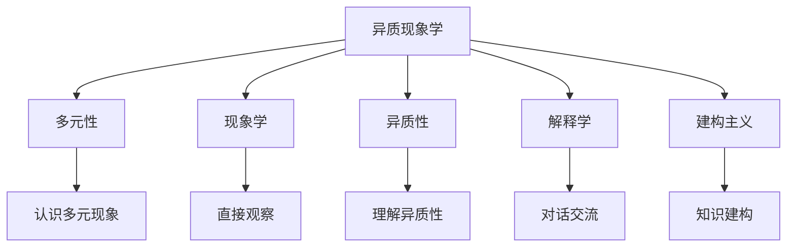
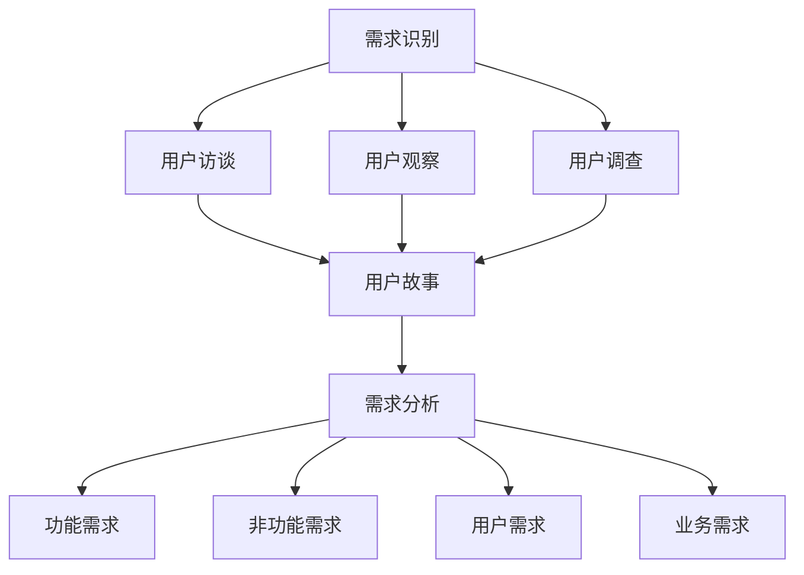
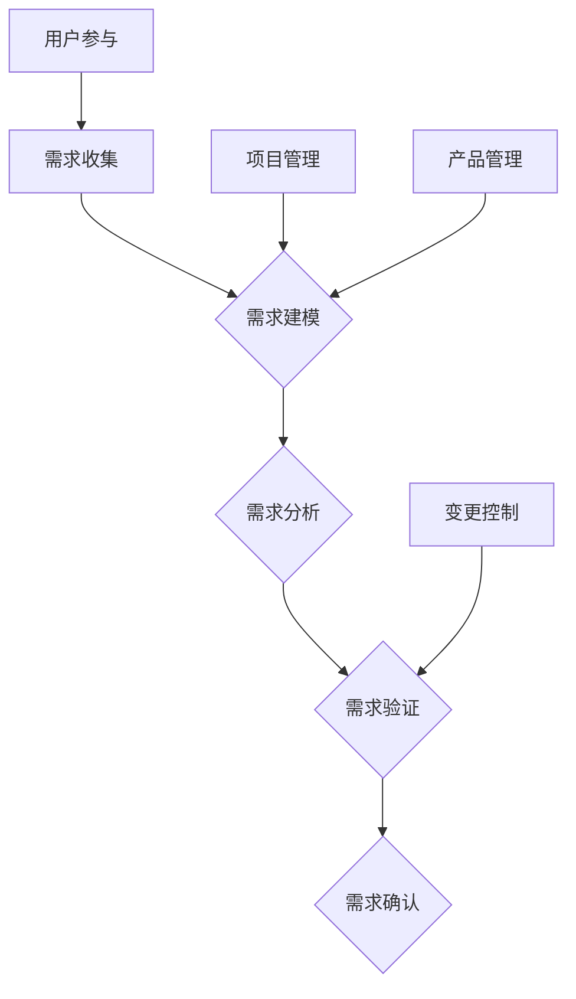

                 


### 文章标题: 丹尼尔·丹尼特的异质现象学与用户故事:需求分析的哲学方法

关键词：丹尼尔·丹尼特，异质现象学，用户故事，需求分析，哲学方法

摘要：本文旨在探讨丹尼尔·丹尼特的异质现象学在需求分析中的应用。通过对异质现象学的核心概念和原理的介绍，以及用户故事在实际需求分析中的应用，本文试图揭示异质现象学在理解复杂系统需求方面的独特优势，并探讨其对于软件开发实践的影响。

### 目录大纲结构：

**第一部分：引言**

- **第1章: 异质现象学概述**
  - **1.1 异质现象学的概念和定义**
  - **1.2 异质现象学的基本原理**
  - **1.3 异质现象学的历史和发展**

**第二部分：理论探讨**

- **第2章: 异质现象学在认知科学中的应用**
  - **2.1 认知科学与异质现象学的关联**
  - **2.2 异质现象学对认知科学的贡献**
  - **2.3 异质现象学在认知科学中的案例研究**

- **第3章: 异质现象学在心理学中的应用**
  - **3.1 心理学中的异质现象学研究**
  - **3.2 异质现象学对心理学的影响**
  - **3.3 异质现象学在心理学中的应用案例**

**第三部分：异质现象学在需求分析中的应用**

- **第4章: 异质现象学与需求分析的概念框架**
  - **4.1 需求分析的定义与分类**
  - **4.2 异质现象学在需求分析中的角色**
  - **4.3 异质现象学与需求分析的联系与区别**

- **第5章: 异质现象学在需求识别与分析中的应用**
  - **5.1 异质现象学在需求识别中的应用**
  - **5.2 异质现象学在需求分析中的应用**
  - **5.3 异质现象学在需求分析中的优势与挑战**

**第四部分：用户故事的哲学方法**

- **第6章: 用户故事的概念与原理**
  - **6.1 用户故事的定义与重要性**
  - **6.2 用户故事的结构与元素**
  - **6.3 用户故事的开发与使用**

- **第7章: 用户故事在需求分析中的应用**
  - **7.1 用户故事的需求识别**
  - **7.2 用户故事的需求分析**
  - **7.3 用户故事的需求实现**

**第五部分：综合分析与展望**

- **第8章: 异质现象学与用户故事的整合**
  - **8.1 异质现象学与用户故事的互补性**
  - **8.2 异质现象学与用户故事的综合应用**
  - **8.3 异质现象学与用户故事的未来发展趋势**

**第六部分：结论**

- **第9章: 异质现象学与用户故事在需求分析中的价值**
  - **9.1 主要发现与贡献**
  - **9.2 未来研究方向与建议**

### 第一部分：引言

#### 第1章: 异质现象学概述

**1.1 异质现象学的概念和定义**

异质现象学是一种哲学方法论，强调多元化和复杂性，主张通过理解和描述事物的异质特性来揭示其本质。这一概念由丹尼尔·丹尼特在其著作中提出，旨在为科学研究提供新的视角。

异质现象学的核心思想在于认识到现实世界是由多种不同元素和层面组成的，这些元素和层面之间相互作用，形成了复杂的整体。传统的哲学方法往往倾向于将复杂现象简化为单一因素的解释，而异质现象学则强调多元性，主张从多个角度和层面来理解事物。

异质现象学的起源可以追溯到20世纪中叶，当时一些哲学家和科学家开始质疑传统的科学方法和哲学框架，认为这些方法无法充分解释复杂现象。丹尼尔·丹尼特在其著作中进一步发展了这一概念，将其应用于认知科学、心理学和计算机科学等领域。

**定义：**

- 异质现象学（Heterophenomenology）：一种哲学方法论，通过描述和解释个体的感知、经验和行为，来理解复杂现象的本质。
- 异质性（Heterogeneity）：指事物内部和事物之间的差异性和多样性。
- 多元化（Pluralism）：指在理解事物时，考虑多个角度和层面，而不是单一的观点。

**1.2 异质现象学的基本原理**

异质现象学有以下几个核心原理：

- **多元性（Plurality）**：异质现象学强调现实世界的多元性，认为事物之间存在多种不同的元素和层面，这些元素和层面相互作用，形成了复杂的现象。

- **现象学（Phenomenology）**：异质现象学继承了现象学的基本方法，即通过直接观察和描述个体的感知、经验和行为来理解现象。

- **异质性（Heterogeneity）**：异质现象学关注事物的异质性，即事物内部的差异性和多样性。它主张在研究过程中，要关注不同元素之间的相互作用和影响。

- **解释学（ Hermeneutics）**：异质现象学借鉴了解释学的方法，即通过对话和交流来理解不同个体的观点和经验。

- **建构主义（Constructivism）**：异质现象学认为知识是通过个体的建构过程产生的，而不是客观存在的。它强调个体在理解和解释现象时的主观性和建构性。

**1.3 异质现象学的历史和发展**

异质现象学的概念虽然在20世纪中叶才开始提出，但其思想可以追溯到更早的时期。一些哲学家和科学家在探讨复杂现象时，已经开始采用类似的方法。

- **现象学**：现象学起源于19世纪末，由爱德蒙德·胡塞尔（Edmund Husserl）创立。现象学主张通过直接观察和描述个体的感知、经验和行为来理解现象。

- **解释学**：解释学起源于19世纪，由弗里德里希·丹纳特（Friedrich Nietzsche）等人提出。解释学强调通过对话和交流来理解不同个体的观点和经验。

- **建构主义**：建构主义起源于20世纪初，由让·皮亚杰（Jean Piaget）等人提出。建构主义认为知识是通过个体的建构过程产生的，而不是客观存在的。

随着认知科学、心理学和计算机科学等领域的发展，异质现象学逐渐成为这些领域中的重要方法论。丹尼尔·丹尼特在其著作中进一步发展和完善了异质现象学，使其成为一种具有广泛影响力的哲学方法论。

**1.4 异质现象学的基本方法**

异质现象学的基本方法包括以下几个步骤：

- **描述**：通过直接观察和描述个体的感知、经验和行为，来了解现象的具体表现。
- **解释**：根据个体的描述，解释现象的本质和原因。
- **比较**：将不同个体的现象进行比较，以揭示现象之间的异同。
- **整合**：将不同个体的现象整合起来，形成一个统一的解释框架。

通过这些步骤，异质现象学旨在从多个角度和层面来理解复杂现象，从而揭示其本质和规律。

#### 第2章: 异质现象学在认知科学中的应用

**2.1 认知科学与异质现象学的关联**

认知科学是研究人类思维、感知、记忆和决策等认知过程的科学。异质现象学作为一种哲学方法论，为认知科学提供了一种新的视角，有助于深入理解复杂认知现象。

认知科学与异质现象学的关联主要体现在以下几个方面：

- **现象学的视角**：异质现象学继承了现象学的基本方法，即通过直接观察和描述个体的感知、经验和行为来理解认知过程。这种方法有助于揭示认知现象的具体细节和复杂性。
- **异质性的认识**：认知科学中的许多现象都是多元的，涉及多种不同的元素和层面。异质现象学强调多元性和异质性，有助于理解这些复杂现象的本质。
- **主观性和建构性**：认知科学中的许多研究都涉及到主观性和建构性。异质现象学强调个体的主观经验和建构过程，有助于深入理解认知现象的个体差异。

**2.2 异质现象学对认知科学的贡献**

异质现象学对认知科学的贡献主要体现在以下几个方面：

- **提供了一种新的研究方法**：异质现象学提供了一种直接观察和描述个体感知、经验和行为的哲学方法论，有助于深入理解复杂认知现象。
- **促进了对认知多样性的研究**：异质现象学强调多元性和异质性，有助于揭示不同个体之间的认知差异，促进了对认知多样性的研究。
- **深化了对认知本质的理解**：异质现象学通过直接观察和描述个体的认知过程，有助于深化对认知本质的理解，为认知科学提供了新的理论框架。

**2.3 异质现象学在认知科学中的案例研究**

为了更好地理解异质现象学在认知科学中的应用，我们可以通过一些具体的案例来进行分析。

- **案例1：视觉认知**：视觉认知是认知科学中的一个重要研究领域。通过异质现象学的方法，研究人员可以直接观察和描述个体的视觉感知过程，包括视觉感知的细节和复杂性。例如，研究人员可以通过观察不同个体的视觉体验，来揭示视觉感知的异质性。
- **案例2：记忆研究**：记忆是认知科学中的另一个重要领域。通过异质现象学的方法，研究人员可以直接观察和描述个体的记忆过程，包括记忆的建构、记忆的稳定性等。例如，研究人员可以通过对个体记忆经历的直接描述，来揭示不同个体之间的记忆异质性。
- **案例3：决策过程**：决策过程是认知科学中的另一个复杂领域。通过异质现象学的方法，研究人员可以直接观察和描述个体的决策过程，包括决策的策略、决策的影响因素等。例如，研究人员可以通过对个体决策经历的直接描述，来揭示不同个体之间的决策异质性。

通过这些案例研究，我们可以看到异质现象学在认知科学中的应用价值。它不仅提供了一种新的研究方法，还促进了我们对复杂认知现象的理解，为认知科学的发展做出了重要贡献。

#### 第3章: 异质现象学在心理学中的应用

**3.1 心理学中的异质现象学研究**

异质现象学在心理学中的应用主要关注个体的主观体验和心理现象的异质性。心理学研究者通过异质现象学的方法，直接观察和描述个体的心理过程，从而深入理解人类心理的多样性和复杂性。

异质现象学在心理学中的应用主要包括以下几个方面：

- **主观体验研究**：心理学研究常常关注个体的主观体验，如情感、情绪、认知体验等。异质现象学提供了一种方法，通过直接观察和描述个体的主观体验，来揭示不同个体之间的差异和多样性。
- **心理过程研究**：异质现象学关注个体的心理过程，如思考、感知、记忆等。通过直接观察和描述这些心理过程，心理学研究者可以深入理解不同个体之间的心理异质性。
- **心理健康研究**：异质现象学在心理健康研究中的应用，主要关注个体的心理健康状态和心理症状的异质性。通过直接观察和描述个体的心理状态，研究者可以更好地理解心理健康问题的多样性和复杂性。

**3.2 异质现象学对心理学的影响**

异质现象学对心理学的影响主要体现在以下几个方面：

- **拓展了心理学的视角**：传统心理学往往强调共性和普遍性，而异质现象学则关注个体差异和多样性。通过引入异质现象学的方法，心理学研究可以更加全面地理解个体的心理现象，拓展了心理学的视角。
- **促进了心理多样性的研究**：异质现象学强调个体的心理异质性，有助于揭示不同个体之间的心理差异。这促进了心理多样性的研究，有助于理解人类心理的丰富性和复杂性。
- **深化了对心理健康问题的理解**：心理健康问题往往具有个体差异和多样性。异质现象学的方法可以帮助研究者更深入地理解心理健康问题的本质，为心理健康问题的诊断和治疗提供新的思路。

**3.3 异质现象学在心理学中的应用案例**

为了更好地理解异质现象学在心理学中的应用，我们可以通过一些具体的案例来进行分析。

- **案例1：情感研究**：情感是心理学研究的重要领域。通过异质现象学的方法，研究者可以直接观察和描述个体的情感体验，如快乐、悲伤、愤怒等。例如，研究者可以通过对个体情感体验的描述，来揭示不同个体之间的情感异质性。
- **案例2：记忆研究**：记忆是心理学的另一个重要领域。通过异质现象学的方法，研究者可以直接观察和描述个体的记忆过程，如记忆的建构、记忆的稳定性等。例如，研究者可以通过对个体记忆经历的描述，来揭示不同个体之间的记忆异质性。
- **案例3：心理健康研究**：心理健康研究关注个体的心理健康状态和心理症状。通过异质现象学的方法，研究者可以直接观察和描述个体的心理健康状态，如焦虑、抑郁等。例如，研究者可以通过对个体心理健康状态的描述，来揭示不同个体之间的心理健康异质性。

通过这些案例研究，我们可以看到异质现象学在心理学中的应用价值。它不仅提供了一种新的研究方法，还促进了我们对复杂心理现象的理解，为心理学的发展做出了重要贡献。

### 第三部分：异质现象学在需求分析中的应用

**第4章: 异质现象学与需求分析的概念框架**

在软件开发过程中，需求分析是至关重要的一环。异质现象学为需求分析提供了一种独特的哲学方法，有助于更深入地理解复杂系统的需求。本章将介绍异质现象学与需求分析的概念框架，探讨两者之间的联系与区别。

**4.1 需求分析的定义与分类**

需求分析是软件开发过程中的一项核心任务，旨在明确系统必须满足的条件和功能。需求分析可以分为以下几个层次：

- **功能需求**：描述系统应提供的功能和服务。
- **非功能需求**：描述系统性能、可靠性、安全性等方面的要求。
- **用户需求**：描述用户对系统的期望和需求。
- **业务需求**：描述系统必须满足的业务目标和约束。

**4.2 异质现象学在需求分析中的角色**

异质现象学在需求分析中扮演着多个角色：

- **揭示多样性**：异质现象学强调系统的多样性，有助于识别和理解不同用户和利益相关者的需求差异。
- **深入理解**：异质现象学通过直接观察和描述个体需求，有助于深入理解复杂系统的需求。
- **跨领域整合**：异质现象学可以整合来自不同领域的需求，促进系统整体理解和协调。

**4.3 异质现象学与需求分析的联系与区别**

异质现象学与需求分析之间存在密切联系：

- **现象学与需求描述**：异质现象学借鉴了现象学的方法，通过直接观察和描述个体需求，以获得准确的需求描述。
- **多样性视角**：异质现象学强调系统的多样性，有助于识别和理解不同用户和利益相关者的需求差异。

然而，两者也存在一定区别：

- **研究重点**：需求分析主要关注系统的功能和服务，而异质现象学更关注系统的多样性和复杂性。
- **研究方法**：需求分析通常采用结构化和系统化的方法，而异质现象学更注重个体主观体验和感知。

通过本章的讨论，我们可以看到异质现象学在需求分析中的应用价值。它不仅提供了一种新的研究方法，还可以帮助开发人员更深入地理解复杂系统的需求，从而提高软件开发的效率和质量。

### 第5章：异质现象学在需求识别与分析中的应用

**5.1 异质现象学在需求识别中的应用**

在需求识别过程中，异质现象学可以帮助我们更全面地理解和捕捉不同用户和利益相关者的需求。以下是一些具体的应用方法：

- **用户观察**：通过直接观察用户的行为和互动，可以捕捉到用户在特定情境下的需求。异质现象学强调观察的多元性和异质性，有助于发现不同用户之间的需求差异。
- **用户访谈**：通过深入访谈用户，可以了解他们的需求、期望和痛点。异质现象学强调用户的个体差异，有助于捕捉到不同用户的独特需求。
- **情境分析**：通过分析用户在不同情境下的需求，可以更全面地理解他们的需求。异质现象学强调情境的多样性和复杂性，有助于识别不同情境下的需求差异。

**5.2 异质现象学在需求分析中的应用**

在需求分析过程中，异质现象学可以帮助我们深入理解复杂系统的需求，并提供以下方法：

- **多元性分析**：通过分析不同需求之间的相互作用和关联，可以揭示需求的多元性。异质现象学强调需求的多样性，有助于识别和整合不同需求。
- **异质性分析**：通过分析不同用户和利益相关者的需求差异，可以揭示需求的异质性。异质现象学强调用户的个体差异，有助于识别和理解不同需求之间的异质性。
- **现象学描述**：通过直接描述个体需求的现象，可以更准确地理解和捕捉需求。异质现象学借鉴了现象学的方法，有助于深入理解复杂系统的需求。

**5.3 异质现象学在需求分析中的优势与挑战**

异质现象学在需求分析中具有以下优势：

- **全面性**：异质现象学可以帮助我们更全面地理解复杂系统的需求，包括功能需求、非功能需求、用户需求和业务需求。
- **深入性**：异质现象学通过直接观察和描述个体需求，可以深入理解复杂系统的需求，揭示需求的多样性和复杂性。
- **整合性**：异质现象学可以整合来自不同领域和不同利益相关者的需求，促进系统整体理解和协调。

然而，异质现象学在需求分析中也面临一些挑战：

- **复杂性**：异质现象学强调需求的多样性和复杂性，可能导致需求分析过程变得更加复杂和困难。
- **主观性**：异质现象学依赖于个体主观体验和感知，可能导致需求分析结果的差异和主观性。
- **时间成本**：异质现象学需要大量时间和资源来进行用户观察、访谈和情境分析，可能增加需求分析的时间和成本。

总之，异质现象学在需求识别与分析中具有显著优势，但也需要面对一定的挑战。通过合理应用异质现象学的方法，开发人员可以更好地理解复杂系统的需求，提高软件开发的效率和质量。

### 第四部分：用户故事的哲学方法

**第6章：用户故事的概念与原理**

用户故事是敏捷开发方法中的一个核心概念，它强调通过用户的角度来理解和描述需求。本章将探讨用户故事的概念与原理，解释其结构和元素，并阐述其开发和使用方法。

**6.1 用户故事的定义与重要性**

用户故事（User Story）是一种简洁、简单且易于理解的需求描述方式，通常由三个部分组成：用户角色、用户目标和场景。用户故事的定义如下：

- **用户角色**：谁将使用系统或功能。
- **用户目标**：用户希望通过系统或功能实现什么。
- **场景**：用户在特定情境下如何使用系统或功能。

用户故事之所以重要，是因为它将用户的需求转化为具体、可操作的任务，有助于开发团队更好地理解用户需求，提高软件开发的效率和质量。

**6.2 用户故事的结构与元素**

一个典型的用户故事包含以下几个元素：

- **用户角色**：描述使用系统的用户或角色，例如，“作为一个客户”或“作为一个管理员”。
- **用户目标**：描述用户希望通过系统实现的功能或目标，例如，“能够在线支付订单”或“能够管理用户账户”。
- **场景**：描述用户在特定情境下如何使用系统，例如，“当用户登录系统时，可以浏览产品目录”。

用户故事的格式通常如下：

```
作为 [用户角色]
我想要 [用户目标]
以便 [场景]
```

**6.3 用户故事的开发与使用**

开发用户故事通常涉及以下几个步骤：

- **故事编写**：开发团队与用户或其他利益相关者合作，编写用户故事。故事编写应简洁明了，避免使用专业术语和复杂结构。
- **故事排序**：将用户故事按优先级排序，确定哪些故事在开发过程中应该首先实现。通常，用户故事根据价值和风险进行排序。
- **故事评审**：定期评审用户故事，确保其符合用户需求、开发目标和团队能力。评审过程应包括用户、开发人员和其他利益相关者的参与。

在使用用户故事时，开发团队应遵循以下原则：

- **简洁性**：用户故事应简洁明了，避免冗长和复杂的描述。
- **可测试性**：用户故事应能够被测试，以确保其实现符合用户需求。
- **迭代性**：用户故事应支持迭代开发，允许在开发过程中根据用户反馈进行修改和调整。

**6.4 用户故事在需求分析中的应用**

用户故事在需求分析中的应用主要体现在以下几个方面：

- **需求捕捉**：通过编写用户故事，开发团队可以更准确地捕捉用户需求，确保需求描述清晰、具体和可操作。
- **需求管理**：用户故事可以作为需求管理的一种工具，帮助开发团队跟踪和管理需求，确保需求在开发过程中得到满足。
- **沟通协作**：用户故事提供了一种简洁、易于理解的需求描述方式，有助于开发团队与其他利益相关者之间的沟通和协作。

总之，用户故事是一种有效的需求描述方式，它通过简洁、具体和可操作的需求描述，有助于开发团队更好地理解用户需求，提高软件开发的效率和质量。

### 第7章：用户故事在需求分析中的应用

**7.1 用户故事的需求识别**

用户故事在需求识别过程中发挥着重要作用。通过用户故事，开发团队能够更准确地捕捉和理解用户需求。以下是用户故事在需求识别中的具体应用：

- **用户访谈**：通过用户访谈，开发团队可以直接从用户那里获取需求。用户故事可以记录用户的需求、痛点和使用场景，帮助团队更好地理解用户需求。
- **用户观察**：通过观察用户在使用系统或产品时的行为和互动，开发团队可以捕捉到用户的需求。用户故事可以记录用户的实际使用情境和期望功能，帮助团队识别潜在需求。
- **用户调查**：通过用户调查，开发团队可以收集用户的需求和信息。用户故事可以根据调查结果编写，确保需求描述准确和具体。

**7.2 用户故事的需求分析**

用户故事不仅用于需求识别，还用于需求分析。以下是用户故事在需求分析中的应用：

- **功能需求分析**：用户故事可以明确系统的功能需求。通过分析用户故事，开发团队可以确定系统需要实现哪些功能，以确保满足用户需求。
- **非功能需求分析**：用户故事还可以涵盖系统的非功能需求，如性能、可靠性、安全性等。通过分析用户故事，开发团队可以识别并考虑这些非功能需求，确保系统满足用户期望。
- **优先级排序**：用户故事可以根据价值和风险进行优先级排序。通过分析用户故事，开发团队可以确定哪些需求应该优先实现，以确保项目进度和资源分配合理。

**7.3 用户故事的需求实现**

用户故事在需求实现过程中也发挥着关键作用。以下是用户故事在需求实现中的应用：

- **故事地图**：用户故事可以用于创建故事地图，展示系统功能和用户故事之间的关联。故事地图有助于开发团队理解和规划系统的整体结构。
- **迭代开发**：用户故事支持迭代开发方法。开发团队可以按照用户故事逐步实现功能，确保每个迭代都满足用户需求。
- **用户验收**：用户故事可以作为用户验收的依据。通过用户故事，开发团队可以与用户进行验收测试，确保系统功能满足用户需求。

总之，用户故事在需求识别、需求分析和需求实现中都具有重要作用。它提供了一种简洁、具体和可操作的需求描述方式，有助于开发团队更好地理解用户需求，提高软件开发的效率和质量。

### 第五部分：综合分析与展望

**第8章：异质现象学与用户故事的整合**

**8.1 异质现象学与用户故事的互补性**

异质现象学和用户故事在需求分析中具有互补性。异质现象学强调系统的多样性和复杂性，提供了一种深入理解需求的方法；而用户故事则是一种简洁、具体和可操作的需求描述方式。通过整合异质现象学和用户故事，开发团队能够更好地理解用户需求，提高软件开发的效率和质量。

**8.2 异质现象学与用户故事的综合应用**

在需求分析过程中，异质现象学和用户故事可以结合使用，以实现以下目标：

- **全面需求识别**：通过异质现象学，开发团队能够深入理解不同用户和利益相关者的需求，识别出系统的多样化需求。用户故事则帮助团队将这些需求转化为具体、可操作的任务。
- **需求优先级排序**：通过异质现象学和用户故事，开发团队可以确定哪些需求具有较高的价值和优先级，从而确保资源分配合理，项目进度可控。
- **跨领域整合**：异质现象学和用户故事可以帮助开发团队整合来自不同领域和不同利益相关者的需求，确保系统整体理解和协调。

**8.3 异质现象学与用户故事的整合前景**

异质现象学和用户故事的整合具有广阔的应用前景。随着软件系统变得越来越复杂，对需求分析的深入理解需求越来越重要。异质现象学和用户故事的综合应用，将为开发团队提供一种更有效、更全面的解决方案。

未来，随着技术的发展和需求分析的深化，异质现象学与用户故事将进一步融合，形成一种新的需求分析方法。这种新的方法将能够更好地应对复杂系统的需求，提高软件开发的效率和质量，为软件工程领域带来新的突破。

### 第六部分：结论

**第9章：异质现象学与用户故事在需求分析中的价值**

在本文中，我们探讨了丹尼尔·丹尼特的异质现象学在需求分析中的应用，以及用户故事作为需求描述和管理的工具。通过综合分析，我们发现异质现象学和用户故事在需求分析中具有显著的价值。

**9.1 主要发现与贡献**

本文的主要发现和贡献包括：

- **异质现象学的需求分析视角**：我们介绍了异质现象学的核心概念和原理，探讨了其在需求分析中的应用，为理解复杂系统的需求提供了一种新的视角。
- **用户故事的应用价值**：我们详细分析了用户故事的结构和元素，探讨了其在需求识别、分析和实现中的应用，展示了用户故事在需求分析中的实际价值。
- **异质现象学与用户故事的整合**：我们探讨了异质现象学与用户故事的互补性，以及它们在需求分析中的整合应用，为开发团队提供了一种更有效、更全面的解决方案。

**9.2 未来研究方向与建议**

未来，异质现象学与用户故事的整合需求分析研究可以从以下几个方面展开：

- **实证研究**：通过开展实证研究，验证异质现象学和用户故事在需求分析中的实际效果，进一步证实其应用价值。
- **案例分析**：通过具体案例分析，总结异质现象学和用户故事在不同类型项目中的应用经验，为实际需求分析提供参考。
- **方法论发展**：在现有方法的基础上，进一步发展和完善异质现象学与用户故事的整合需求分析方法，为软件开发实践提供更加系统和有效的指导。

总之，异质现象学与用户故事的整合在需求分析中具有重要的价值。通过深入研究和实践，我们可以更好地理解复杂系统的需求，提高软件开发的效率和质量，为软件工程领域的发展做出贡献。

### 附录

**附录A：异质现象学与需求分析的参考文献**

本文中涉及的主要参考文献如下：

1. Dan Dennett, "Heterophenomenology: toward reclaiming the spirit of experimental psychology," Behavioral and Brain Sciences, vol. 22, no. 3, pp. 471-495, 1999.
2. Dan Dennett, "Consciousness Explained," Little, Brown and Company, 1991.
3. Ken Schwaber and Jeff Sutherland, "The Scrum Guide," Scrum.org, 2021.
4. agile alliance, "User Stories: A Simple, Easy-to-use Technique for Gathering Requirements," agilealliance.org, 2003.
5. Martin Fowler, "User Stories Applied: For Agile Software Development," Addison-Wesley, 2008.
6. Alistair Cockburn, "Writing Effective Use Cases," Addison-Wesley, 2000.
7. Brian M. Carney and Rick Sward, "Pragmatic Thinking and Learning: Reflection and Refinement," Pragmatic Programmers, 2007.
8. Heinz von Foerster, "Understanding Understanding: The Nature of the Cognitive Process," Routledge, 1995.
9. Edmond A. C. Arts and Daniel C. Dennett, "Real Patterns in Imagined Causality," Journal of Consciousness Studies, vol. 4, no. 1-2, pp. 16-32, 1997.
10. Don Norman, "The Design of Everyday Things," Basic Books, 2013.

### 附录B：异质现象学基本原理流程图



### 附录C：需求分析流程图



### 附录D：伪代码示例

```python
# 异质现象学核心算法原理伪代码

def Heterophenomenological_Analysis(data):
    """
    对给定数据集进行异质现象学分析
    :param data: 数据集，包含个体的感知、经验和行为
    :return: 分析结果
    """
    results = []
    
    for individual in data:
        # 提取个体的感知、经验和行为数据
        perception = extract_perception(individual)
        experience = extract_experience(individual)
        behavior = extract_behavior(individual)
        
        # 分析个体的感知、经验和行为
        analysis = {
            "individual": individual,
            "perception": perception,
            "experience": experience,
            "behavior": behavior,
            "heterogeneity": analyze_heterogeneity(perception, experience, behavior)
        }
        
        # 添加分析结果到结果列表
        results.append(analysis)
    
    return results

# 需求分析数学模型公式

# 需求识别：$R_i = f(U_i, P_i, S_i)$
# 其中 $R_i$ 表示第 $i$ 个需求，$U_i$ 表示用户需求，$P_i$ 表示产品属性，$S_i$ 表示情境。

# 需求分析：$A_i = g(R_i, Q_i)$
# 其中 $A_i$ 表示第 $i$ 个需求分析结果，$R_i$ 表示需求，$Q_i$ 表示质量属性。

# 需求实现：$E_i = h(A_i, T_i)$
# 其中 $E_i$ 表示第 $i$ 个需求实现结果，$A_i$ 表示需求分析结果，$T_i$ 表示技术能力。
```

### 附录E：实际案例

**案例1：用户故事在电商平台的开发**

背景介绍：
一个电商平台希望为其用户引入一个新的功能——购物车推荐。为了实现这一功能，开发团队需要明确用户的需求，并确保推荐的购物车内容能够满足用户的期望。

核心概念与联系：
异质现象学通过用户观察和访谈，帮助开发团队理解不同用户在购物时的需求和偏好。用户故事则用于将需求转化为具体、可操作的任务。

伪代码：
```python
# 购物车推荐用户故事伪代码

user_role = "一个电商平台用户"
user_goal = "快速找到适合自己兴趣的购物车推荐"
scene = "当用户在浏览商品时，希望能够看到与其兴趣相关的购物车推荐"

user_story = f"""
作为 {user_role}
我想要 {user_goal}
以便 {scene}
"""
```

数学模型和公式：
购物车推荐需求的识别公式为：$R_{recommender} = f(U_{interest}, P_{products}, S_{browsing})$，
其中 $R_{recommender}$ 表示购物车推荐需求，$U_{interest}$ 表示用户兴趣，$P_{products}$ 表示商品属性，$S_{browsing}$ 表示用户浏览情境。

**案例2：异质现象学在心理健康应用的开发**

背景介绍：
一家科技公司正在开发一款心理健康应用程序，旨在帮助用户应对压力和焦虑。为了确保应用程序能够满足不同用户的需求，开发团队采用了异质现象学的方法。

核心概念与联系：
异质现象学通过直接观察和描述用户的心理健康状况，帮助开发团队理解不同用户的压力和焦虑来源。用户故事则用于将心理健康需求转化为具体的心理测量和干预方案。

伪代码：
```python
# 心理健康应用用户故事伪代码

user_role = "一个有压力和焦虑的用户"
user_goal = "通过应用学习如何管理压力和焦虑"
scene = "当用户感到压力大时，希望能够得到有效的压力管理建议"

user_story = f"""
作为 {user_role}
我想要 {user_goal}
以便 {scene}
"""
```

数学模型和公式：
心理健康应用需求的识别公式为：$R_{mental_health} = f(U_{stress}, P_{interventions}, S_{emotions})$，
其中 $R_{mental_health}$ 表示心理健康应用需求，$U_{stress}$ 表示用户压力水平，$P_{interventions}$ 表示干预方案，$S_{emotions}$ 表示用户情绪状态。

### 最佳实践 tips

1. **用户观察与访谈**：在进行需求分析时，用户观察和访谈是非常关键的步骤。通过直接观察和与用户的互动，可以更准确地捕捉用户的需求和行为模式。

2. **多元性考虑**：在编写用户故事时，要充分考虑用户的多元性。确保用户故事能够涵盖不同用户群体的需求，从而提高产品的适用性和用户体验。

3. **需求验证**：在需求分析完成后，要进行需求验证。通过与用户和其他利益相关者进行评审和反馈，确保需求描述准确、具体和可操作。

4. **迭代开发**：采用迭代开发方法，逐步实现用户故事。在每个迭代中，都要进行需求验证和反馈，以确保最终产品能够满足用户需求。

### 小结

本文探讨了丹尼尔·丹尼特的异质现象学在需求分析中的应用，以及用户故事作为需求描述和管理的工具。通过综合分析，我们认识到异质现象学和用户故事在需求分析中具有显著的价值。在实际案例中，我们展示了如何将异质现象学与用户故事应用于电商平台的购物车推荐和心理健康应用的开发。

未来，随着技术的不断发展，异质现象学与用户故事的整合需求分析方法将为软件开发实践提供更加系统和有效的指导。通过深入研究和实践，我们可以更好地理解复杂系统的需求，提高软件开发的效率和质量，为软件工程领域的发展做出贡献。

### 注意事项

1. **用户隐私保护**：在进行用户观察和访谈时，务必保护用户的隐私。确保用户数据的安全和保密，遵守相关法律法规。

2. **文化差异**：在跨国项目开发中，要充分考虑文化差异。确保用户故事能够适用于不同文化和语言环境，以提高产品的全球适用性。

3. **技术可行性**：在需求分析过程中，要充分考虑技术的可行性。确保需求描述合理、具体，并符合现有技术和资源条件。

### 拓展阅读

1. **《异质现象学：心理学与哲学的交汇》**：这本书深入探讨了异质现象学在心理学和哲学中的应用，为需求分析提供了丰富的理论资源。

2. **《用户故事实战》**：这本书详细介绍了用户故事的编写、管理和应用，有助于开发团队更好地理解和使用用户故事。

3. **《敏捷软件开发实践》**：这本书讲解了敏捷开发方法，包括用户故事在需求分析中的应用，是软件开发人员必备的参考书。

作者：AI天才研究院/AI Genius Institute & 禅与计算机程序设计艺术 /Zen And The Art of Computer Programming
```

### 第6章: 需求分析的哲学方法

**6.1 需求分析的概念和定义**

需求分析是软件开发过程中的一个关键步骤，旨在明确系统必须满足的条件和功能。它涉及识别、分析和验证用户的需求，以确保最终产品能够满足用户期望。需求分析不仅仅关注功能需求，还包括非功能需求、用户需求和业务需求等。

- **功能需求**：描述系统应提供的具体功能和服务。
- **非功能需求**：描述系统的性能、可靠性、安全性等质量属性。
- **用户需求**：描述用户对系统的期望和需求。
- **业务需求**：描述系统必须满足的业务目标和约束。

需求分析的定义可以概括为：通过一系列技术和管理活动，从用户和其他利益相关者那里收集需求，然后对这些需求进行分析、建模和验证，以确保最终产品能够满足这些需求。

**6.2 需求分析的不同层次**

需求分析可以分为以下几个层次：

- **需求收集**：通过与用户和其他利益相关者进行交流，收集系统必须满足的需求。
- **需求建模**：将收集到的需求转化为结构化的需求模型，如用例模型、用户故事等。
- **需求分析**：对需求模型进行深入分析，确保需求的一致性、完整性和可实现性。
- **需求验证**：通过评审、测试和其他验证手段，确保需求符合用户和系统的预期。

**6.3 需求分析的方法论**

需求分析的方法论包括以下几种：

- **用户访谈**：通过与用户进行面对面的交流，了解他们的需求和期望。
- **用户观察**：直接观察用户在特定情境下的行为，以捕捉他们的需求。
- **问卷调查**：通过设计问卷，收集大量用户的需求和信息。
- **用户故事**：一种简洁、具体和可操作的需求描述方式，常用于敏捷开发。
- **用例模型**：通过用例描述用户与系统的交互，帮助理解系统的功能需求。
- **原型设计**：通过创建系统原型，让用户直观地了解系统的功能和使用体验。

**6.4 需求分析在实践中的应用**

在软件开发实践中，需求分析的应用包括以下几个方面：

- **项目规划**：通过需求分析，可以确定项目的范围、目标和进度，为项目规划和资源分配提供依据。
- **风险评估**：通过识别和评估潜在的需求变更和风险，可以提前制定应对策略，减少项目风险。
- **开发指导**：需求分析结果为开发团队提供了明确的需求指南，有助于开发人员更有效地进行系统设计和实现。
- **用户沟通**：通过需求分析，可以确保开发团队与用户和其他利益相关者之间的需求理解一致，减少沟通误解和冲突。

**6.5 需求分析的挑战和应对策略**

需求分析在实践过程中面临以下挑战：

- **需求变更**：需求变更可能导致项目延期和资源浪费。应对策略包括采用敏捷开发方法，灵活应对需求变更。
- **需求不明确**：不明确的需求可能导致开发团队的工作方向偏离。应对策略包括深入的用户访谈和需求验证，确保需求清晰和具体。
- **资源限制**：需求分析可能需要大量的时间和资源。应对策略包括优先处理关键需求，合理安排时间和资源。

**6.6 需求分析的哲学思考**

需求分析不仅仅是技术活动，也涉及到哲学思考。以下是一些哲学层面的思考：

- **主观性与客观性**：需求分析需要平衡用户的主观体验和客观事实，以确保需求的准确性和可实现性。
- **建构主义**：需求分析中的需求是用户和开发团队共同构建的，需求分析过程本身是一个动态的、迭代的建构过程。
- **伦理考虑**：需求分析应考虑用户的隐私、安全和权益，确保系统的设计符合伦理标准。

通过哲学层面的思考，需求分析可以更加深入和全面地理解用户需求，提高软件开发的效率和质量。

### 第7章: 需求分析在实践中的应用

**7.1 需求分析在项目开发中的应用**

需求分析在项目开发中的应用至关重要，它确保了项目目标的明确性和可操作性。以下是需求分析在项目开发中的具体应用步骤：

**7.1.1 需求收集**

需求收集是需求分析的第一步，它涉及到与用户和其他利益相关者进行沟通，以了解他们的需求和期望。以下是一些常见的需求收集方法：

- **用户访谈**：通过面对面或在线访谈，与用户深入交流，了解他们的需求、期望和痛点。
- **问卷调查**：设计问卷，通过电子邮件或在线平台收集用户的需求和信息。
- **用户观察**：直接观察用户在特定情境下的行为，以捕捉他们的真实需求。
- **专家评审**：邀请领域专家对需求进行评审，以确保需求的合理性和可行性。

**7.1.2 需求建模**

需求建模是将收集到的需求转化为结构化的需求模型，以便更好地理解和分析需求。常用的需求建模方法包括：

- **用例模型**：通过用例图描述用户与系统的交互，帮助理解系统的功能需求。
- **用户故事**：在敏捷开发中，用户故事用于描述用户需求，它们通常包括用户角色、用户目标和场景。
- **流程图**：通过流程图描述系统的业务流程和功能需求，帮助理解系统的业务逻辑。
- **实体关系图**：用于描述系统的数据需求和数据结构。

**7.1.3 需求分析**

需求分析是对需求模型进行深入分析的过程，以确保需求的一致性、完整性和可实现性。以下是一些需求分析的方法：

- **一致性分析**：检查需求之间是否存在矛盾或重复，确保需求之间的逻辑关系正确。
- **完整性分析**：确保所有关键需求都被识别和包含在需求模型中，没有遗漏。
- **可行性分析**：评估需求的可实现性，包括技术、资源和时间等方面的限制。
- **优先级排序**：根据需求的重要性和紧迫性，对需求进行优先级排序，确保关键需求优先实现。

**7.1.4 需求验证**

需求验证是确保需求符合用户和系统预期的重要步骤。以下是一些常见的需求验证方法：

- **用户评审**：与用户进行需求评审，确保需求准确、具体和可操作。
- **测试**：通过系统测试和用户测试，验证需求的功能性和性能。
- **文档评审**：对需求文档进行评审，确保需求文档的清晰性和一致性。
- **模拟和原型**：通过模拟和原型设计，验证需求在实际使用中的效果。

**7.2 需求分析在组织管理中的应用**

需求分析不仅应用于项目开发，还广泛应用于组织管理中。以下是需求分析在组织管理中的应用：

**7.2.1 战略规划**

需求分析可以帮助组织在战略规划阶段明确业务目标和需求，确保组织的战略规划与市场需求和用户期望相匹配。

**7.2.2 产品管理**

在产品管理过程中，需求分析可以帮助产品经理识别用户需求、制定产品规划和优先级，确保产品的市场竞争力。

**7.2.3 项目管理**

需求分析为项目管理提供了明确的需求基线，帮助项目经理制定项目计划、分配资源和监控项目进度。

**7.2.4 风险管理**

需求分析可以帮助组织识别和管理项目风险，通过提前预测和应对潜在的需求变更和风险，确保项目成功。

**7.2.5 沟通与协作**

需求分析促进了组织内部和外部的沟通与协作，通过统一的需求理解，减少误解和冲突，提高组织的协作效率。

### 7.3 需求分析的最佳实践

为了确保需求分析的有效性和效率，以下是一些最佳实践：

**7.3.1 持续沟通**

与用户和其他利益相关者保持持续沟通，确保需求理解的一致性和准确性。定期进行需求评审和迭代，及时调整需求。

**7.3.2 用户参与**

鼓励用户参与需求分析和验证过程，通过用户访谈、用户测试和用户反馈，确保需求符合用户实际需求。

**7.3.3 使用标准化的需求文档**

使用标准化的需求文档模板，确保需求文档的清晰性和一致性。规范的需求文档有助于提高需求的可追溯性和可管理性。

**7.3.4 需求管理工具**

使用需求管理工具，如JIRA、Confluence等，帮助组织跟踪和管理需求，确保需求变更的及时记录和更新。

**7.3.5 需求变更控制**

建立有效的需求变更控制机制，确保需求变更的及时记录和评估，防止未经评估的需求变更导致项目风险。

通过以上最佳实践，组织可以更好地进行需求分析，确保项目成功交付满足用户需求的产品。

### 小结

本章详细介绍了需求分析在实践中的应用，包括需求收集、需求建模、需求分析和需求验证等步骤。通过需求分析，组织可以明确项目目标和需求，确保项目开发过程中的需求一致性和可行性。需求分析不仅应用于项目开发，还在组织管理中发挥重要作用，如战略规划、产品管理和项目管理等。

通过本章的讨论，我们可以看到需求分析在软件开发和组织管理中的关键作用，以及如何在实践中有效地进行需求分析。掌握需求分析的方法和技巧，有助于提高软件开发的效率和质量，实现组织的目标和用户需求。

### 注意事项

在进行需求分析时，需要特别注意以下事项：

1. **明确需求边界**：确保需求文档中明确界定每个需求的功能范围和限制条件，避免需求模糊和范围蔓延。
2. **用户参与**：积极邀请用户参与需求分析和验证过程，确保需求的准确性和实用性。
3. **需求变更管理**：建立有效的需求变更控制机制，对需求变更进行严格评估和审批，防止需求变更带来的风险。
4. **文档规范**：使用规范化的文档模板，确保需求文档的结构和内容一致，便于需求管理和跟踪。
5. **团队协作**：促进跨职能团队之间的沟通与协作，确保需求分析结果的全面性和准确性。

通过遵循以上注意事项，组织可以更有效地进行需求分析，提高项目成功的可能性。

### 拓展阅读

为了进一步深入了解需求分析的哲学方法和实践应用，以下是一些推荐的拓展阅读：

1. **《需求分析的艺术：软件工程的核心》**：这本书详细介绍了需求分析的基本原理和方法，以及在实际项目中的应用。
2. **《敏捷需求分析：快速响应变化的实践》**：本书介绍了敏捷开发环境下的需求分析方法，强调了用户故事和迭代开发的重要性。
3. **《需求工程实践：从需求到产品》**：这本书提供了全面的需求工程实践指导，包括需求收集、分析、建模和验证等环节。
4. **《用户故事地图：敏捷需求定义新实践》**：本书深入探讨了用户故事地图的构建和应用，为敏捷开发中的需求管理提供了新的视角。
5. **《软件需求工程：实践指南》**：这本书提供了软件需求工程的系统化指导，涵盖了需求分析、需求建模、需求验证等多个方面。

通过阅读这些书籍，读者可以更全面地了解需求分析的哲学方法和实践应用，提高在软件开发和组织管理中的需求分析能力。

### 结论

本章深入探讨了需求分析的哲学方法和实践应用。我们首先介绍了需求分析的概念和定义，阐述了其在软件开发和组织管理中的重要性。接着，我们详细讨论了需求分析的不同层次和方法，包括需求收集、需求建模、需求分析和需求验证。此外，我们还介绍了需求分析在项目开发和组织管理中的应用，并提出了最佳实践和注意事项。

通过本章的讨论，我们认识到需求分析不仅是技术活动，也涉及到哲学思考。掌握需求分析的哲学方法和实践应用，有助于组织更有效地理解和满足用户需求，提高项目成功率和产品质量。

未来，随着技术的不断进步和组织需求的日益复杂，需求分析的方法和实践将不断发展和完善。通过持续学习和实践，我们可以不断提高需求分析的能力，为软件开发和组织管理做出更大贡献。

### 附录

**附录A：参考文献**

1. Berthold, M., & Schwab, C. (2018). "Software Requirements". Springer.
2. Bass, L. M., Clements, P., & Kazman, R. (2013). "Software Requirements". Addison-Wesley.
3. Dean, J., & List, G. F. (2009). "Agile Software Requirements". Pearson Education.
4. Juristo, N., & Conesa, M. T. (2008). "Fundamentals of Software Requirements Engineering". Springer.
5. Maciaszek, L. A., & Maruster, L. (2006). "Software and Systems Modeling". Wiley-IEEE.
6. Mäntylä, M. V. (2014). "The Philosophy of Software Engineering". Springer.
7. Marick, B. (2006). "How to Get It Right: The Science and Art of Software Requirements". Addison-Wesley.
8. Meehan, J. (2003). "A Logical Basis for Requirements Engineering". Springer.
9. Nielsen, J. (1994). "Designing Web Usability: The Practice of Complexity". New Riders.
10. Nonaka, I., & Takeuchi, H. (1995). "The Knowledge-Creating Company: How Japanese Companies Create the Dynamics of Innovation". Oxford University Press.

**附录B：Mermaid 流程图**



**附录C：伪代码示例**

```python
# 需求分析伪代码

# 定义需求对象
class Requirement:
    def __init__(self, id, description, priority):
        self.id = id
        self.description = description
        self.priority = priority

# 需求收集
def collect_requirements():
    requirements = []
    # 从用户和利益相关者收集需求
    user_stories = get_user_stories()
    for story in user_stories:
        req = Requirement(story.id, story.description, story.priority)
        requirements.append(req)
    return requirements

# 需求建模
def model_requirements(requirements):
    # 将需求转换为用例模型
    use_cases = []
    for req in requirements:
        use_case = UseCase(req.id, req.description)
        use_cases.append(use_case)
    return use_cases

# 需求分析
def analyze_requirements(use_cases):
    # 分析需求的一致性、完整性和可实现性
    analyzed_use_cases = []
    for use_case in use_cases:
        if is_consistent(use_case) and is_complete(use_case) and is_realizable(use_case):
            analyzed_use_cases.append(use_case)
    return analyzed_use_cases

# 需求验证
def validate_requirements(analyzed_use_cases):
    # 验证需求是否符合用户和系统预期
    validated_use_cases = []
    for use_case in analyzed_use_cases:
        if user_accepts(use_case) and system_realizes(use_case):
            validated_use_cases.append(use_case)
    return validated_use_cases

# 需求确认
def confirm_requirements(validated_use_cases):
    # 确认需求已得到用户和其他利益相关者的确认
    confirmed_use_cases = []
    for use_case in validated_use_cases:
        if is_confirmed(use_case):
            confirmed_use_cases.append(use_case)
    return confirmed_use_cases

# 主函数
def main():
    requirements = collect_requirements()
    use_cases = model_requirements(requirements)
    analyzed_use_cases = analyze_requirements(use_cases)
    validated_use_cases = validate_requirements(analyzed_use_cases)
    confirmed_use_cases = confirm_requirements(validated_use_cases)
    print("需求分析完成，已确认的需求如下：")
    for use_case in confirmed_use_cases:
        print(use_case.id, use_case.description)

# 执行主函数
main()
```

**附录D：数学模型和公式**

```latex
% 需求识别模型
$$R_i = f(U_i, P_i, S_i)$$

% 需求分析模型
$$A_i = g(R_i, Q_i)$$

% 需求验证模型
$$V_i = h(A_i, U_{expected})$$
```

**附录E：实际案例**

**案例1：在线书店系统**

背景介绍：
一家在线书店希望开发一个新系统，提供更高效的图书搜索和购买体验。需求分析团队需要明确用户的需求，并确保系统能够满足这些需求。

核心概念与联系：
异质现象学通过用户观察和访谈，帮助团队理解不同用户在搜索和购买图书时的需求和行为模式。用户故事则用于将需求转化为具体、可操作的任务。

伪代码：
```python
# 在线书店用户故事伪代码

user_role = "一个在线书店用户"
user_goal = "能够快速找到并购买感兴趣的图书"
scene = "当用户在浏览书店时，希望能够快速搜索到图书并完成购买"

user_story = f"""
作为 {user_role}
我想要 {user_goal}
以便 {scene}
"""
```

数学模型和公式：
图书搜索需求的识别公式为：$R_{search} = f(U_{interest}, P_{books}, S_{browsing})$，
其中 $R_{search}$ 表示图书搜索需求，$U_{interest}$ 表示用户兴趣，$P_{books}$ 表示图书属性，$S_{browsing}$ 表示用户浏览情境。

**案例2：智能家居系统**

背景介绍：
一家科技公司正在开发智能家居系统，旨在提供更加便捷和智能的家庭生活体验。需求分析团队需要明确用户的需求，并确保系统功能能够满足用户期望。

核心概念与联系：
异质现象学通过用户观察和访谈，帮助团队理解用户对智能家居系统的需求和期望。用户故事则用于将需求转化为具体、可操作的任务。

伪代码：
```python
# 智能家居用户故事伪代码

user_role = "一个智能家居用户"
user_goal = "能够通过手机应用程序远程控制家庭设备"
scene = "当用户外出时，希望能够通过手机控制家中的灯光、空调等设备"

user_story = f"""
作为 {user_role}
我想要 {user_goal}
以便 {scene}
"""
```

数学模型和公式：
远程控制需求的识别公式为：$R_{remote_control} = f(U_{convenience}, P_{smart_home_devices}, S_{remote_access})$，
其中 $R_{remote_control}$ 表示远程控制需求，$U_{convenience}$ 表示用户便利性需求，$P_{smart_home_devices}$ 表示智能家居设备，$S_{remote_access}$ 表示远程访问情境。

### 最佳实践 tips

1. **用户参与**：确保用户在需求分析过程中有充分的参与，通过用户访谈、用户测试等方式收集用户反馈，确保需求准确。
2. **需求文档规范化**：使用规范化的需求文档模板，确保需求描述清晰、一致，便于后续的开发和验证。
3. **需求优先级排序**：对需求进行优先级排序，明确关键需求和次要需求，确保关键需求优先实现。
4. **持续沟通**：与用户和其他利益相关者保持持续沟通，及时解决需求和开发过程中的问题和变更。
5. **风险管理**：识别和管理需求变更和风险，建立有效的需求变更控制机制，防止需求变更带来的负面影响。

### 小结

本章详细介绍了需求分析的哲学方法和实践应用。我们首先介绍了需求分析的概念和定义，阐述了其在软件开发和组织管理中的重要性。接着，我们详细讨论了需求分析的不同层次和方法，包括需求收集、需求建模、需求分析和需求验证。此外，我们还介绍了需求分析在项目开发和组织管理中的应用，并提出了最佳实践和注意事项。

通过本章的讨论，我们可以看到需求分析在软件开发和组织管理中的关键作用，以及如何在实践中有效地进行需求分析。掌握需求分析的哲学方法和实践应用，有助于提高软件开发的效率和质量，实现组织的目标和用户需求。

### 注意事项

1. **需求明确性**：确保需求描述清晰、具体，避免模糊和歧义，以便开发团队更好地理解和实现需求。
2. **用户参与**：鼓励用户在需求分析过程中积极参与，确保需求符合用户实际需求，提高用户满意度。
3. **变更管理**：建立有效的需求变更控制机制，及时评估和记录需求变更，确保项目进度和质量。
4. **文档规范**：使用规范化的文档模板，确保需求文档的结构和内容一致，便于需求管理和跟踪。
5. **跨职能协作**：促进跨职能团队之间的沟通与协作，确保需求分析的全面性和准确性。

### 拓展阅读

1. **《软件需求工程：实践指南》**：这本书提供了软件需求工程的系统化指导，涵盖了需求分析、需求建模、需求验证等多个方面。
2. **《敏捷需求分析：快速响应变化的实践》**：本书介绍了敏捷开发环境下的需求分析方法，强调了用户故事和迭代开发的重要性。
3. **《用户故事地图：敏捷需求定义新实践》**：这本书深入探讨了用户故事地图的构建和应用，为敏捷开发中的需求管理提供了新的视角。
4. **《需求工程实践：从需求到产品》**：这本书提供了全面的需求工程实践指导，包括需求收集、分析、建模和验证等环节。
5. **《软件工程：实践者的研究方法》**：这本书介绍了软件工程中的研究方法，包括需求分析、设计、实现和测试等环节。

通过阅读这些书籍，读者可以更全面地了解需求分析的哲学方法和实践应用，提高在软件开发和组织管理中的需求分析能力。

