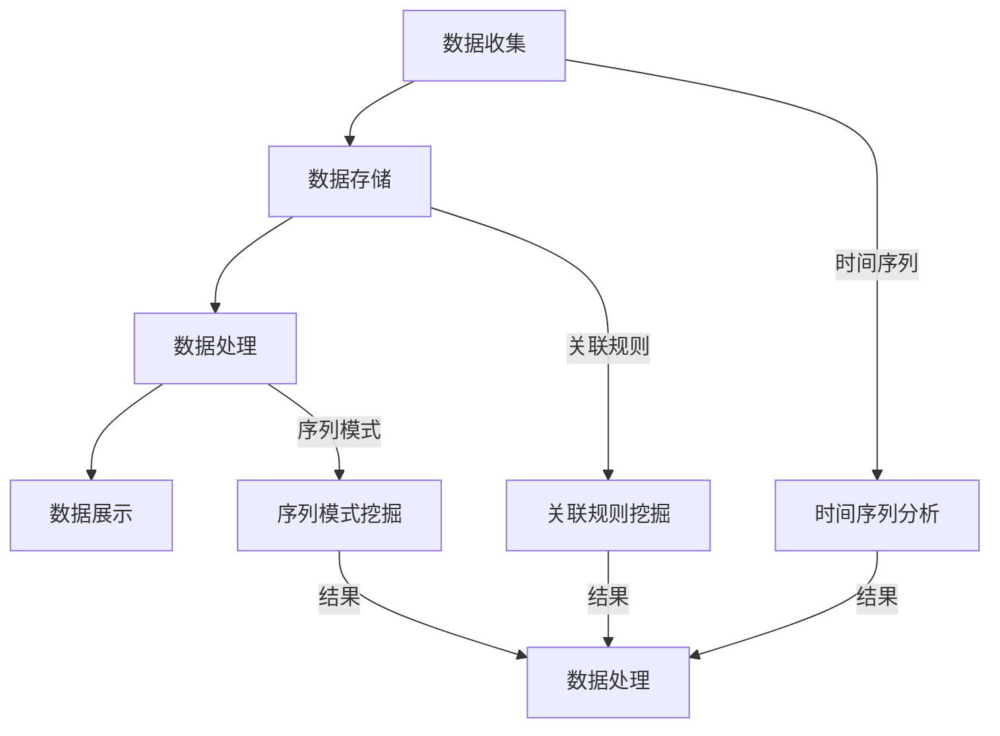

                 

## 文章标题

事件溯源：通过事件重建系统状态的方法

## 关键词

事件溯源、系统状态重建、时间序列分析、关联规则挖掘、序列模式挖掘、数学模型、项目实战

## 摘要

本文深入探讨了事件溯源技术，通过事件重建系统状态的方法，详细分析了其核心概念、系统设计、应用案例及未来展望。文章首先介绍了事件溯源的基础知识，包括定义、应用场景和优势挑战。随后，文章重点介绍了事件溯源系统的设计，包括数据收集、存储、处理和展示模块，以及核心算法和时间序列建模。通过实际案例，读者可以了解事件溯源在金融交易和电子商务用户行为分析中的应用。最后，文章展望了事件溯源技术的发展趋势和潜在挑战，为读者提供了进一步的学习和研究方向。

## 目录大纲

- 引言
  - 书籍背景
  - 事件溯源的重要性
  - 本书结构安排
- 事件溯源基础
  - 事件溯源的定义
  - 事件溯源的应用场景
  - 事件溯源的优势与挑战
- 事件溯源系统设计
  - 事件溯源系统的架构
  - 事件溯源系统的核心算法
- 实际案例分析
  - 案例一：金融交易事件溯源
  - 案例二：电子商务用户行为分析
- 数学模型与公式
  - 时间序列建模
  - 关联规则挖掘
  - 序列模式挖掘
- 项目实战
  - 项目背景与目标
  - 系统架构设计与实现
  - 数据收集与预处理
  - 事件溯源算法实现
  - 结果分析与评估
- 事件溯源的未来展望
  - 技术发展趋势
  - 应用领域拓展
  - 潜在挑战与解决思路
- 附录
  - 参考文献
  - 相关数据集介绍
  - 开源工具与库推荐

### 引言

#### 书籍背景

在当今数字化时代，随着大数据和云计算技术的飞速发展，企业和管理人员越来越依赖于各种信息系统来处理海量数据，进行决策分析和业务优化。然而，在复杂的信息系统中，数据的不一致、丢失和错误等问题时常发生，这使得系统状态无法准确反映实际业务情况。为了解决这些问题，事件溯源技术应运而生。

事件溯源是一种通过记录和分析系统中发生的各种事件，来重建系统状态的技术。事件溯源不仅可以帮助企业恢复丢失的数据，还可以提供对系统行为的深入分析，为优化业务流程和提高系统稳定性提供有力支持。

#### 事件溯源的重要性

事件溯源在许多领域都具有重要应用价值。首先，在金融行业中，交易事件溯源可以帮助金融机构快速准确地回溯交易过程，确保交易的合规性和安全性。其次，在电子商务领域，用户行为事件溯源可以为企业提供详细的用户行为数据，用于个性化推荐和营销策略的制定。此外，事件溯源还在物流管理、医疗保健、社交媒体等领域发挥了重要作用。

随着信息系统的日益复杂和规模不断扩大，事件溯源的重要性更加凸显。通过事件溯源，企业可以更好地管理和监控系统的运行状态，及时发现和解决问题，提高系统的可靠性和稳定性。同时，事件溯源技术也为数据科学家和分析师提供了丰富的数据资源，有助于他们深入挖掘数据价值，为企业决策提供有力支持。

#### 本书结构安排

本书旨在系统地介绍事件溯源技术，帮助读者全面了解其原理、应用和实践。全书共分为七个主要章节：

1. **引言**：介绍书籍背景、事件溯源的重要性以及本书的结构安排。
2. **事件溯源基础**：介绍事件溯源的定义、应用场景和优势挑战。
3. **事件溯源系统设计**：详细讲解事件溯源系统的架构、数据收集、存储、处理和展示模块，以及核心算法。
4. **实际案例分析**：通过金融交易和电子商务用户行为分析的案例，展示事件溯源技术的实际应用。
5. **数学模型与公式**：介绍时间序列建模、关联规则挖掘和序列模式挖掘的数学模型和公式。
6. **项目实战**：介绍一个具体的项目案例，包括开发环境搭建、源代码实现、代码解读、案例分析及项目小结。
7. **事件溯源的未来展望**：讨论事件溯源技术的发展趋势、应用领域拓展和潜在挑战。

通过本书的学习，读者将能够掌握事件溯源技术的基本原理和应用方法，为解决实际问题提供有力支持。同时，本书也适合作为计算机科学、数据科学和信息系统等相关专业的高等教育教材。

### 事件溯源基础

#### 事件溯源的定义

事件溯源是一种通过记录和分析系统中发生的各种事件，以重建系统状态的技术。在信息系统和应用程序中，事件可以包括用户操作、系统行为、数据变更等。事件溯源的目的是通过这些事件的记录和分析，恢复系统在某一时刻的状态，以便进行故障排查、数据恢复和业务分析。

事件溯源的基本概念包括事件记录、事件序列、事件溯源算法和系统状态重建。事件记录是事件溯源的基础，它记录了系统中发生的所有事件及其相关信息。事件序列是对事件记录的有序排列，表示事件发生的顺序和时间。事件溯源算法则是根据事件序列和系统状态信息，对系统状态进行重建的算法。系统状态重建是指通过事件溯源算法，恢复系统在某一特定时刻的状态。

#### 事件溯源的应用场景

事件溯源技术在各个领域都有广泛的应用，以下是几个典型的应用场景：

1. **金融交易领域**：在金融行业中，事件溯源技术可以帮助金融机构快速准确地回溯交易过程，确保交易的合规性和安全性。例如，在股票交易系统中，事件溯源可以记录每次交易的操作信息，包括交易时间、交易金额、交易方等，通过分析这些事件记录，可以发现问题交易、异常交易等。

2. **电子商务领域**：在电子商务平台中，事件溯源技术可以记录用户的购买行为、浏览历史、点击事件等，通过对这些事件的分析，可以为用户提供个性化的推荐和服务。例如，在推荐系统中，通过分析用户的历史行为事件，可以识别用户的兴趣和偏好，从而提供更准确的推荐结果。

3. **物流管理领域**：在物流管理系统中，事件溯源技术可以记录货物的运输过程，包括发货、运输、中转、到达等环节。通过分析这些事件，可以实时监控货物的状态，提高物流管理的效率。

4. **医疗保健领域**：在医疗保健系统中，事件溯源技术可以记录患者的诊疗记录、检查结果、用药信息等，通过对这些事件的分析，可以辅助医生进行诊断和治疗，提高医疗服务的质量。

5. **社交媒体领域**：在社交媒体平台中，事件溯源技术可以记录用户的发布、评论、点赞等行为，通过对这些事件的分析，可以了解用户的兴趣和互动情况，为平台运营提供数据支持。

#### 事件溯源的优势与挑战

事件溯源技术具有以下优势：

1. **数据恢复能力**：事件溯源技术可以通过记录和分析事件，恢复系统的历史状态，帮助企业快速解决数据丢失和错误的问题。

2. **问题排查**：事件溯源技术可以帮助企业回溯事件序列，定位问题的发生时间和原因，从而进行有效的故障排查和问题解决。

3. **业务分析**：事件溯源技术可以提供详细的系统行为记录，为企业提供数据支持，帮助进行业务分析和优化。

4. **合规性保证**：在金融、医疗等领域，事件溯源技术可以确保系统的行为记录符合相关法律法规要求，提高合规性。

然而，事件溯源技术也面临一些挑战：

1. **数据量巨大**：随着系统规模的扩大，事件记录的数量会急剧增加，如何高效地存储、处理和分析这些海量数据成为一大挑战。

2. **实时性要求**：在许多应用场景中，事件溯源需要实时回溯系统状态，这对系统的性能和响应速度提出了更高的要求。

3. **算法复杂度**：事件溯源算法的设计和实现复杂，需要综合考虑时间序列分析、关联规则挖掘和序列模式挖掘等多方面的算法和技术。

4. **隐私保护**：在涉及个人隐私的数据处理中，如何确保事件溯源过程的隐私保护也是一个重要问题。

综上所述，事件溯源技术在信息系统和应用程序中具有广泛的应用前景，但也需要面对一系列的挑战。通过深入研究和优化事件溯源技术，我们可以更好地发挥其在数据处理、问题排查和业务分析等方面的作用，为企业提供更加可靠和高效的信息服务。

### 事件溯源系统设计

事件溯源系统的设计是构建一个高效、稳定、可扩展的溯源平台的关键步骤。该系统需要能够处理大规模的事件数据，提供快速的事件回溯和分析功能。以下是事件溯源系统设计的详细说明。

#### 系统架构

事件溯源系统通常由以下几个主要模块组成：

1. **数据收集模块**：负责从不同的数据源收集事件数据，包括用户操作、系统行为、日志记录等。数据收集模块需要支持多种数据格式和协议，如HTTP请求、数据库变更日志、文件等。

2. **数据存储模块**：用于存储收集到的事件数据。数据存储模块需要支持高吞吐量、高并发和快速查询，常用的技术包括关系数据库、NoSQL数据库和分布式日志系统。

3. **数据处理模块**：负责对事件数据进行清洗、转换和聚合。数据处理模块需要实现复杂的事件分析算法，如时间序列分析、关联规则挖掘和序列模式挖掘。

4. **数据展示模块**：提供用户界面，用于展示事件数据和分析结果。数据展示模块需要直观易用，支持多种数据可视化方式，如表格、图表、地图等。

#### 数据收集模块

数据收集模块是事件溯源系统的入口，其主要任务是从各种数据源收集事件数据。以下是一些关键技术和考虑因素：

1. **日志收集**：系统日志是事件数据的重要来源。可以使用日志代理工具，如Fluentd、Logstash等，将不同服务的日志集中收集到一个统一的日志存储系统中。

2. **API调用**：通过HTTP API调用，可以记录系统中的用户操作和业务事件。可以使用API网关和日志中间件，如Kong、NGINX等，记录每次API调用的详细信息。

3. **数据库变更监听**：对于使用关系数据库的应用系统，可以使用数据库变更监听技术，如MySQL的binlog、PostgreSQL的change-data-capture等，实时记录数据库的变更操作。

4. **消息队列监听**：对于使用消息队列的应用系统，如Kafka、RabbitMQ等，可以监听消息队列中的消息，记录业务事件。

#### 数据存储模块

数据存储模块负责存储和持久化事件数据。以下是一些关键技术：

1. **关系数据库**：关系数据库适合存储结构化数据，如用户操作日志、业务事件记录等。常用的关系数据库包括MySQL、PostgreSQL等。

2. **NoSQL数据库**：NoSQL数据库适合存储半结构化或非结构化数据，如日志数据、事件流数据等。常用的NoSQL数据库包括MongoDB、Cassandra等。

3. **分布式日志系统**：分布式日志系统如Kafka、Logstash、Fluentd等，可以处理海量日志数据，提供高吞吐量和高可用性。

4. **数据湖**：数据湖是一种大规模存储解决方案，可以存储海量数据，包括结构化、半结构化和非结构化数据。Hadoop HDFS和Apache Hive是常见的数据湖技术。

#### 数据处理模块

数据处理模块是事件溯源系统的核心，其主要任务是对收集到的事件数据进行处理和分析。以下是一些关键技术：

1. **时间序列分析算法**：用于分析事件数据的时间序列特性，如趋势、周期性、异常点等。常用的算法包括ARIMA、LSTM等。

2. **关联规则挖掘算法**：用于发现事件之间的关联关系，如频繁项集、关联规则等。常用的算法包括Apriori、FP-Growth等。

3. **序列模式挖掘算法**：用于发现事件序列中的模式，如频繁子序列、最大频繁子序列等。常用的算法包括GSP、FSG等。

4. **数据处理框架**：可以使用数据处理框架，如Apache Spark、Flink等，实现复杂的事件数据处理和分析任务。

#### 数据展示模块

数据展示模块为用户提供了一个直观的界面，用于浏览和分析事件数据。以下是一些关键技术：

1. **Web前端框架**：如React、Vue等，用于构建用户界面。

2. **数据可视化库**：如D3.js、ECharts等，用于展示数据图表和图形。

3. **API接口**：提供RESTful API接口，供前端应用程序调用数据。

4. **实时数据流处理**：使用WebSockets等实时通信技术，实现实时数据流展示。

#### 系统架构示例

以下是一个事件溯源系统的架构示例，使用Mermaid流程图表示：



在这个示例中，数据收集模块从各种数据源收集事件数据，数据存储模块用于存储这些数据，数据处理模块对事件数据进行处理和分析，数据展示模块向用户提供可视化的分析结果。

### 事件溯源系统的核心算法

事件溯源系统的核心算法是实现事件数据分析的关键，它们包括时间序列分析算法、关联规则挖掘算法和序列模式挖掘算法。以下将详细探讨这些算法的基本原理和实现方法。

#### 时间序列分析算法

时间序列分析算法用于处理和预测时间序列数据，这类数据通常具有时间依赖性和周期性。以下是几种常见的时间序列分析算法：

1. **自回归移动平均模型（ARIMA）**

   自回归移动平均模型（ARIMA）是一种常用的统计模型，用于分析时间序列数据的趋势、季节性和残差。ARIMA模型由三个参数（p、d、q）定义，其中p代表自回归项的阶数，d代表差分阶数，q代表移动平均项的阶数。

   **伪代码示例**：

   ```python
   # ARIMA模型伪代码
   
   # 输入时间序列数据
   data = [x1, x2, ..., xn]
   
   # 进行d阶差分
   diff_data = [data[i] - data[i-1] for i in range(d, len(data))]
   
   # 自回归部分
   alpha = [0 for _ in range(p)]
   for i in range(p):
       alpha[i] = (diff_data[i:] - diff_data[:-i]).mean()
   
   # 移动平均部分
   beta = [0 for _ in range(q)]
   for i in range(q):
       beta[i] = (diff_data[i:] - alpha).mean()
   
   # 预测新数据
   new_data = [beta[i] for i in range(q)]
   predicted_value = alpha[-1] + sum(new_data)
   ```

2. **长短期记忆网络（LSTM）**

   长短期记忆网络（LSTM）是一种特殊的循环神经网络（RNN），能够有效地处理和预测时间序列数据中的长期依赖关系。LSTM通过引入门控机制，解决了传统RNN在长序列预测中出现的梯度消失和梯度爆炸问题。

   **伪代码示例**：

   ```python
   # LSTM模型伪代码
   
   # 输入时间序列数据
   data = [x1, x2, ..., xn]
   
   # 初始化LSTM模型参数
   # ...
   
   # LSTM模型训练
   for t in range(len(data)):
       input = data[t]
       # 计算LSTM输出
       output = lstm(input)
       # 计算误差并更新模型参数
       error = output - target
       # 更新权重和偏置
       # ...
   
   # 预测新数据
   new_data = ...
   predicted_value = lstm(new_data)
   ```

#### 关联规则挖掘算法

关联规则挖掘算法用于发现数据集中的隐含关联关系。这类算法通常基于支持度和置信度两个度量标准。

1. **Apriori算法**

   Apriori算法是一种经典的关联规则挖掘算法，通过逐层递增项集的方法来发现频繁项集，并从中生成关联规则。

   **伪代码示例**：

   ```python
   # Apriori算法伪代码
   
   # 输入数据集
   transactions = [[item1, item2], [item1, item3], ...]
   
   # 初始化最小支持度阈值
   min_support = ...
   
   # 计算频繁项集
   frequent_itemsets = find_frequent_itemsets(transactions, min_support)
   
   # 生成关联规则
   rules = generate_rules(frequent_itemsets, min_confidence)
   
   # 输出关联规则
   print(rules)
   ```

2. **FP-Growth算法**

   FP-Growth算法是一种高效的关联规则挖掘算法，它通过构建FP-树来减少计算频繁项集的复杂度。

   **伪代码示例**：

   ```python
   # FP-Growth算法伪代码
   
   # 输入数据集
   transactions = [[item1, item2], [item1, item3], ...]
   
   # 构建FP-树
   fp_tree = build FP-tree(transactions)
   
   # 计算频繁项集
   frequent_itemsets = find_frequent_itemsets(fp_tree, min_support)
   
   # 生成关联规则
   rules = generate_rules(frequent_itemsets, min_confidence)
   
   # 输出关联规则
   print(rules)
   ```

#### 序列模式挖掘算法

序列模式挖掘算法用于发现数据集中具有特定模式的序列。这类算法通常基于频繁子序列和最大频繁子序列的概念。

1. **GSP算法**

   GSP算法（Generalized Sequential Pattern Mining）是一种通用的序列模式挖掘算法，它通过迭代地减少候选序列的长度，来发现频繁序列。

   **伪代码示例**：

   ```python
   # GSP算法伪代码
   
   # 输入数据集
   sequences = [[s1, s2, ..., sn], ...]
   
   # 初始化最小支持度阈值
   min_support = ...
   
   # 计算频繁序列
   frequent_sequences = find_frequent_sequences(sequences, min_support)
   
   # 输出频繁序列
   print(frequent_sequences)
   ```

2. **FSG算法**

   FSG算法（Fast Sequential Pattern Mining）是一种高效的序列模式挖掘算法，它通过构建频繁序列的森林来减少计算复杂度。

   **伪代码示例**：

   ```python
   # FSG算法伪代码
   
   # 输入数据集
   sequences = [[s1, s2, ..., sn], ...]
   
   # 构建频繁序列的森林
   forest = build_frequent_sequence_forest(sequences, min_support)
   
   # 计算频繁序列
   frequent_sequences = find_frequent_sequences(forest)
   
   # 输出频繁序列
   print(frequent_sequences)
   ```

通过这些核心算法，事件溯源系统能够高效地分析事件数据，为业务分析和优化提供有力支持。在实际应用中，可以根据具体需求和数据特性选择合适的算法，以实现最佳效果。

### 实际案例分析

为了更好地理解事件溯源技术的实际应用，以下将通过两个具体的案例——金融交易事件溯源和电子商务用户行为分析——来展示事件溯源技术的应用场景和实现方法。

#### 案例一：金融交易事件溯源

**案例背景**

某大型金融机构在日常交易过程中，需要确保每一笔交易都得到准确记录和回溯。一旦发生交易异常，如交易重复、资金错账等，需要能够快速定位问题并恢复系统状态。为了实现这一目标，金融机构引入了事件溯源技术。

**事件溯源过程**

1. **数据收集**：金融机构通过日志收集器，将交易系统中的所有交易事件记录下来，包括交易时间、交易金额、交易方、交易类型等。这些事件数据以日志格式存储在分布式日志系统中，如Kafka。

2. **数据存储**：为了确保事件数据的可靠性和持久性，金融机构采用关系数据库（如MySQL）和NoSQL数据库（如MongoDB）相结合的方式，存储事件数据。关系数据库用于存储结构化数据，如交易记录；NoSQL数据库用于存储半结构化或非结构化数据，如日志和元数据。

3. **数据处理**：金融机构使用事件溯源系统对收集到的事件数据进行处理，包括数据清洗、去重、聚合等。此外，还利用时间序列分析算法（如ARIMA）对交易金额进行预测和监控，以发现潜在的异常交易。

4. **事件回溯**：当发生交易异常时，金融机构可以通过事件溯源系统快速回溯交易过程，定位问题的发生时间和原因。例如，通过分析交易事件序列，可以发现交易重复或资金错账的具体操作步骤，从而进行问题排查和解决。

**结果分析与优化**

通过事件溯源系统，金融机构能够快速准确地回溯交易过程，提高了问题排查的效率和准确性。同时，事件溯源系统也为金融机构提供了丰富的数据资源，用于业务分析和优化。以下是一些具体的优化措施：

1. **优化数据收集**：引入更多的数据源，如交易终端、支付系统等，以确保事件数据的全面性和准确性。

2. **提升数据处理效率**：采用分布式计算框架（如Apache Spark）对事件数据进行处理，提高数据处理速度和并发能力。

3. **增强异常检测能力**：结合机器学习算法（如LSTM）对交易金额进行实时预测和监控，发现异常交易，提高系统的自动化异常检测能力。

#### 案例二：电子商务用户行为分析

**案例背景**

某大型电子商务平台希望通过分析用户行为数据，提高用户体验和销售额。用户行为数据包括浏览历史、购物车记录、订单信息等。为了实现这一目标，电子商务平台引入了事件溯源技术。

**事件溯源过程**

1. **数据收集**：电子商务平台通过API调用、数据库变更监听等技术，收集用户行为数据，如浏览记录、点击事件、购物车操作等。这些数据存储在分布式日志系统中，如Kafka。

2. **数据存储**：电子商务平台采用分布式日志系统（如Kafka）和NoSQL数据库（如MongoDB）存储用户行为数据。分布式日志系统用于实时记录用户行为数据，提供高吞吐量和低延迟；NoSQL数据库用于存储用户行为数据，提供灵活的数据结构和高效的查询能力。

3. **数据处理**：电子商务平台使用事件溯源系统对用户行为数据进行处理，包括数据清洗、去重、聚合等。此外，还利用关联规则挖掘算法（如Apriori）和序列模式挖掘算法（如GSP），发现用户行为中的潜在模式和关联关系。

4. **用户行为分析**：电子商务平台通过事件溯源系统，对用户行为数据进行分析，识别用户兴趣和行为习惯。例如，通过分析用户浏览和点击行为，可以预测用户的下一步操作，从而进行个性化推荐和营销。

**结果分析与优化**

通过事件溯源系统，电子商务平台能够深入了解用户行为，提高了用户体验和销售额。以下是一些具体的优化措施：

1. **优化数据收集**：引入更多类型的用户行为数据，如地理位置、设备信息等，以更全面地了解用户。

2. **提升数据处理效率**：采用分布式计算框架（如Apache Spark）对用户行为数据进行处理，提高数据处理速度和并发能力。

3. **增强个性化推荐能力**：结合机器学习算法（如协同过滤、LSTM），提高个性化推荐算法的准确性，为用户提供更精准的推荐。

4. **强化异常检测**：结合异常检测算法（如基于LSTM的时序模型），实时监控用户行为中的异常情况，提高系统的自动化异常检测能力。

通过这两个实际案例，可以看出事件溯源技术在金融交易和电子商务用户行为分析中的应用价值。事件溯源系统不仅能够帮助企业和机构恢复系统状态、排查问题和优化业务，还能提供丰富的数据资源，支持进一步的数据分析和决策。

### 数学模型与公式

在事件溯源过程中，数学模型和公式起着至关重要的作用。它们不仅用于描述事件之间的关联，还帮助分析和预测系统状态。以下是事件溯源中常用的一些数学模型与公式。

#### 时间序列建模

时间序列数据通常用于描述随时间变化的系统状态。一个常见的时间序列模型是自回归移动平均模型（ARIMA），其基本公式如下：

$$
X_t = \mu + c \sum_{i=1}^p \phi_i (X_{t-i}) + \theta \sum_{j=1}^q \theta_j (e_{t-j}) + e_t
$$

其中，$X_t$ 是时间序列的当前值，$\mu$ 是均值，$c$ 是常数项，$p$ 是自回归项的阶数，$\phi_i$ 是自回归系数，$q$ 是移动平均项的阶数，$\theta_j$ 是移动平均系数，$e_t$ 是白噪声误差项。

#### 关联规则挖掘

关联规则挖掘用于发现数据集中的隐含关联关系。一个常见的度量标准是支持度和置信度。支持度表示一个规则在数据集中出现的频率，置信度表示在先集出现的情况下，后集出现的概率。

$$
support(A \cup B) = \frac{count(A \cup B)}{total\_transactions}
$$

$$
confidence(A \rightarrow B) = \frac{count(A \cup B)}{count(A)}
$$

其中，$A$ 和 $B$ 是数据集中的两个项集，$count(A \cup B)$ 是同时包含 $A$ 和 $B$ 的交易数量，$count(A)$ 是包含 $A$ 的交易数量。

#### 序列模式挖掘

序列模式挖掘用于发现数据集中具有特定模式的序列。频繁子序列和最大频繁子序列是两个重要的概念。频繁子序列是指在数据集中出现次数超过最小支持度的子序列，最大频繁子序列是指在所有频繁子序列中长度最长的子序列。

$$
L_k(T) = \{X_1, X_2, ..., X_k\}
$$

其中，$T$ 是数据集中的时间序列，$L_k(T)$ 是长度为 $k$ 的频繁子序列集合。

#### 举例说明

假设我们有一组交易数据，如下所示：

| 交易ID | 项目1 | 项目2 | 项目3 |
|--------|-------|-------|-------|
| 1      | A     | B     | C     |
| 2      | A     | C     | D     |
| 3      | B     | C     | D     |
| 4      | A     | D     | E     |
| 5      | B     | D     | E     |

使用Apriori算法挖掘频繁项集，设定最小支持度为0.5，最小置信度为0.6。

1. **计算支持度**：

   - 项集 {A, B} 的支持度 = $\frac{2}{5} = 0.4$（不满足最小支持度）
   - 项集 {A, C} 的支持度 = $\frac{3}{5} = 0.6$（满足最小支持度）
   - 项集 {A, D} 的支持度 = $\frac{2}{5} = 0.4$（不满足最小支持度）
   - 项集 {B, C} 的支持度 = $\frac{3}{5} = 0.6$（满足最小支持度）
   - 项集 {B, D} 的支持度 = $\frac{2}{5} = 0.4$（不满足最小支持度）

2. **计算置信度**：

   - 规则 {A} -> {C} 的置信度 = $\frac{3}{3} = 1.0$（满足最小置信度）
   - 规则 {A} -> {D} 的置信度 = $\frac{2}{2} = 1.0$（满足最小置信度）
   - 规则 {B} -> {C} 的置信度 = $\frac{3}{3} = 1.0$（满足最小置信度）
   - 规则 {B} -> {D} 的置信度 = $\frac{2}{2} = 1.0$（满足最小置信度）

根据支持度和置信度的计算结果，频繁项集为 {{A, C}, {A, D}, {B, C}, {B, D}}，生成的关联规则为 {A} -> {C}, {A} -> {D}, {B} -> {C}, {B} -> {D}。

通过这些数学模型和公式，事件溯源系统可以有效地分析和预测系统状态，为业务决策提供支持。

### 项目实战

#### 项目背景与目标

某大型互联网公司需要对其电商平台的用户行为数据进行分析，以提升用户体验和销售额。公司希望通过事件溯源技术，实现以下目标：

1. **数据回溯**：能够对用户行为进行实时记录和回溯，确保数据的一致性和完整性。
2. **行为分析**：分析用户浏览、搜索、购买等行为，发现用户兴趣和行为模式。
3. **个性化推荐**：基于用户行为数据，为用户提供个性化的商品推荐。
4. **异常检测**：实时监控用户行为中的异常情况，防止欺诈和恶意行为。

#### 系统架构设计与实现

为了实现上述目标，公司采用了以下系统架构：

1. **数据收集模块**：使用Fluentd收集用户行为日志，如点击事件、浏览记录、搜索关键词等，并将其发送到Kafka消息队列。
2. **数据存储模块**：使用Kafka存储实时事件数据，同时使用HBase进行持久化存储，以支持高效的数据查询和分析。
3. **数据处理模块**：使用Apache Spark进行数据处理，包括数据清洗、转换和聚合，并利用时间序列分析、关联规则挖掘等算法进行深度分析。
4. **数据展示模块**：使用ECharts等可视化工具，将分析结果以图表和报表的形式展示给用户。

#### 数据收集与预处理

**数据收集**

通过Fluentd，公司从不同的数据源收集用户行为日志，包括Web服务器日志、数据库变更日志和API调用日志。Fluentd能够将多种日志格式转换为统一的JSON格式，并将其发送到Kafka。

```shell
# Fluentd配置示例
<source>
  @type http
  port 9880
  format json
</source>
```

**数据预处理**

收集到的用户行为数据经过Kafka后，进入Apache Spark进行预处理。预处理步骤包括去重、去噪和格式转换等。

```python
# Spark预处理伪代码

from pyspark.sql import SparkSession

spark = SparkSession.builder.appName("UserBehaviorDataPreprocessing").getOrCreate()

# 读取Kafka数据
data = spark.read.format("kafka").option("kafka.bootstrap.servers", "kafka:9092").option("subscribe", "user_behavior_topic").load()

# 去重
data = data.dropDuplicates()

# 去噪
data = data.filter("event_type != 'invalid'")

# 格式转换
data = data.withColumn("timestamp", to_timestamp("timestamp", "yyyy-MM-dd HH:mm:ss"))

# 数据保存到HBase
data.write.format("org.apache.spark.sql.hbase").mode("overwrite").saveAsTable("user_behavior_data")
```

#### 事件溯源算法实现

**时间序列分析**

使用ARIMA模型对用户行为数据进行分析，预测用户的下一步操作。

```python
# ARIMA模型实现伪代码

from statsmodels.tsa.arima.model import ARIMA

# 读取HBase数据
data = spark.read.format("hbase").table("user_behavior_data")

# 数据预处理
data = data.select("timestamp", "event_type")

# 时间序列转换
data = data.withColumn("timestamp", to_timestamp("timestamp", "yyyy-MM-dd HH:mm:ss"))
data = data.withColumn("event_type", when(data["event_type"] == "search", 1).when(data["event_type"] == "click", 2).otherwise(0))

# ARIMA模型训练
model = ARIMA(data["event_type"], order=(5, 1, 2))
model_fit = model.fit()

# 预测新数据
new_data = ...
predicted_value = model_fit.forecast(steps=1)[0]
```

**关联规则挖掘**

使用Apriori算法挖掘用户行为中的关联规则，以发现潜在的兴趣点和购买模式。

```python
# Apriori算法实现伪代码

from mlxtend.frequent_patterns import apriori
from mlxtend.frequent_patterns import association_rules

# 读取HBase数据
data = spark.read.format("hbase").table("user_behavior_data")

# 数据预处理
data = data.select("event_type")

# 构建频繁项集
frequent_itemsets = apriori(data, min_support=0.01, use_colnames=True)

# 生成关联规则
rules = association_rules(frequent_itemsets, metric="confidence", min_threshold=0.6)
```

#### 结果分析与评估

通过对用户行为数据的分析，公司发现了一些有趣的现象和规律。例如，用户在浏览商品页面后，通常会在几分钟内进行搜索，然后在浏览其他商品页面后最终进行购买。以下是一些关键分析结果：

1. **浏览-搜索-购买序列**：用户在浏览商品页面后，进行搜索操作的频率较高，然后浏览其他商品页面，最终进行购买。
2. **搜索-点击-购买序列**：用户在搜索特定商品后，点击搜索结果页面的频率较高，然后在浏览其他商品页面后进行购买。

这些分析结果为公司提供了宝贵的业务洞察，有助于优化用户体验和营销策略。

#### 项目小结

通过本项目，公司实现了用户行为数据的实时记录和分析，为个性化推荐和异常检测提供了基础。以下是一些关键经验和教训：

1. **数据收集的重要性**：确保收集到全面、准确的用户行为数据，是事件溯源系统的关键。
2. **系统架构的灵活性**：采用分布式架构，可以提高系统的处理能力和扩展性。
3. **算法选择的重要性**：根据具体业务需求，选择合适的算法，能够提高分析的准确性和效率。

### 最佳实践 tips

1. **数据质量监控**：定期检查数据质量，确保数据的准确性和一致性。
2. **动态阈值调整**：根据业务需求，动态调整支持度和置信度阈值，以提高关联规则的准确性和实用性。
3. **实时数据流处理**：使用实时数据流处理技术，如Apache Kafka和Apache Spark Streaming，实现实时的事件处理和分析。

### 小结

本文详细介绍了事件溯源技术，包括其基础理论、系统设计、实际案例和数学模型。通过事件溯源，企业可以实现对系统状态的有效恢复和深入分析，为业务优化提供有力支持。未来，随着技术的不断进步，事件溯源技术在更多领域将发挥更大的作用。

### 注意事项

1. **隐私保护**：在处理用户数据时，确保遵循隐私保护法规，保护用户隐私。
2. **系统扩展性**：设计事件溯源系统时，要考虑系统的扩展性，以应对不断增长的数据量和用户需求。

### 拓展阅读

1. **《数据挖掘：概念与技术》（第三版）**：由Jiawei Han、Micheline Kamber和Jian Pei合著，详细介绍了数据挖掘的基本概念和技术。
2. **《时间序列分析：方法与应用》**：由Christopher Chatfield著，涵盖了时间序列分析的理论和应用。
3. **《机器学习：周志华》**：介绍了机器学习的基本概念和方法，适合初学者学习。

