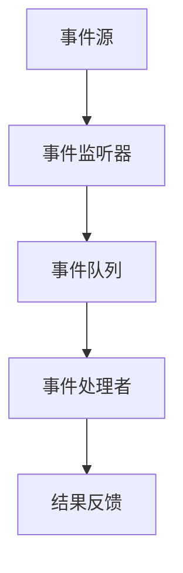
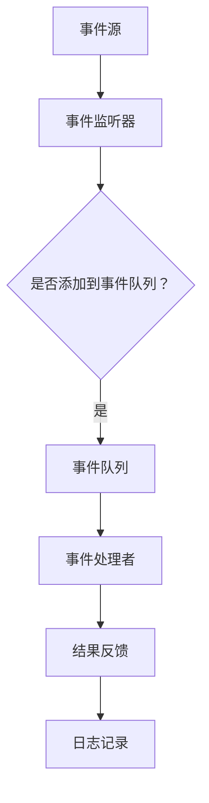

                 


### 文章标题

# 事件溯源：构建高度可扩展的事件驱动系统

### 文章关键词

- 事件驱动系统
- 可扩展性
- 架构设计
- 实现方法
- 优化策略
- 项目实战

### 文章摘要

本文旨在深入探讨事件驱动系统的构建，特别是在实现高度可扩展性方面。我们将从基础概念入手，逐步介绍事件驱动系统的架构设计、实现方法和优化策略，并通过实际项目案例进行分析和讲解，帮助读者全面理解并掌握构建高效事件驱动系统的技巧。文章还将提供最佳实践、注意事项以及拓展阅读资源，以助力读者在技术道路上不断进步。

## 引言

在当今快速发展的信息技术领域，事件驱动系统作为一种重要的架构模式，正逐渐成为企业级应用的首选。事件驱动系统（Event-Driven System）的核心在于其响应性，能够快速响应用户行为、系统事件以及其他外部事件。相较于传统的请求-响应模式，事件驱动系统具备更高的灵活性和可扩展性，能够更好地应对复杂多变的业务场景。

本文将围绕构建高度可扩展的事件驱动系统展开讨论。首先，我们将介绍事件驱动系统的基本概念，包括事件、事件源、事件处理者等核心概念及其相互关系。接着，我们将探讨事件驱动系统的架构设计，详细阐述其整体架构以及各个关键组件的作用。在此基础上，我们将深入探讨事件驱动系统的实现方法，通过伪代码和数学模型详细讲解核心算法原理。随后，我们将介绍一系列优化策略，以提升系统的性能和可扩展性。文章的后半部分将结合实际项目案例，详细解析开发环境搭建、源代码实现和代码解读，帮助读者将理论知识转化为实践技能。最后，我们将对全文进行总结，并提出未来发展的方向和展望。

通过本文的阅读，读者将能够全面理解事件驱动系统的构建方法，掌握其核心原理和关键技术，为实际项目开发提供有力支持。

## 第1章 事件驱动系统的基本概念

### 事件驱动系统简介

事件驱动系统是一种基于事件监听和响应的软件架构模式，它强调系统的行为是由外部或内部事件触发的。事件可以理解为系统中发生的一件事情，它可以是用户操作、系统内部状态变化、定时触发或其他外部系统产生的消息。事件驱动系统通过事件监听机制捕获这些事件，并将事件传递给相应的处理者进行处理。

与传统的请求-响应模式不同，事件驱动系统不需要事先定义明确的请求和响应流程，而是根据事件的发生动态地执行相应的处理逻辑。这种模式具有高度的灵活性和可扩展性，能够更好地适应快速变化的需求。

### Mermaid流程图：事件驱动系统的核心概念与联系

以下是一个简化的Mermaid流程图，展示了事件驱动系统中的核心概念及其相互关系：



- **事件源（Event Source）**：事件源是系统中产生事件的地方，可以是用户操作、系统内部状态变化或其他外部系统的通知。事件源负责生成事件并将其传递给事件监听器。
- **事件监听器（Event Listener）**：事件监听器负责监听事件源产生的事件，并在事件发生时将其添加到事件队列中。事件监听器通常是一个独立的组件，可以独立于事件处理者运行。
- **事件队列（Event Queue）**：事件队列是一个用于暂存事件的缓冲区，它按照事件的发生顺序对事件进行排队。事件处理者会从事件队列中取出事件进行处理。
- **事件处理者（Event Handler）**：事件处理者负责处理事件队列中的事件，并根据事件类型执行相应的处理逻辑。事件处理者可以是系统内置的处理逻辑，也可以是自定义的处理逻辑。
- **结果反馈（Result Feedback）**：事件处理完成后，系统会根据处理结果进行反馈，这可能包括更新系统状态、触发其他事件或生成通知等。

### 事件、事件源、事件处理者的定义

- **事件（Event）**：事件是系统中发生的一件事情，它可以包含数据、状态、行为等信息。事件通常由事件源生成，并传递给事件监听器和事件处理者。
- **事件源（Event Source）**：事件源是系统中产生事件的地方，它可以是一个用户操作、一个系统内部状态变化或其他外部系统的通知。事件源生成事件并将其传递给事件监听器。
- **事件处理者（Event Handler）**：事件处理者是负责处理事件队列中事件的核心组件。它从事件队列中取出事件，并根据事件类型执行相应的处理逻辑。

通过上述定义，我们可以看到事件驱动系统的核心在于事件的产生、监听和处理。事件驱动系统通过事件监听机制和事件队列，实现了事件与处理逻辑的解耦，从而提高了系统的灵活性和可扩展性。

### 事件驱动的优点与挑战

#### 优点

1. **高响应性**：事件驱动系统能够快速响应用户行为和系统事件，提供更流畅的用户体验。
2. **灵活性**：事件驱动系统无需事先定义明确的请求和响应流程，可以根据实际需求动态调整处理逻辑，适应快速变化的业务场景。
3. **可扩展性**：事件驱动系统通过事件队列和解耦的事件处理机制，能够轻松扩展处理逻辑，支持更多的功能和业务需求。
4. **模块化**：事件驱动系统将事件产生、监听和处理分开，各个组件独立运行，降低了系统的耦合度，提高了模块的可重用性。

#### 挑战

1. **复杂性**：事件驱动系统的设计和管理较为复杂，需要深入理解事件流和控制流的关系，确保系统的稳定性和可靠性。
2. **性能瓶颈**：在高并发场景下，事件驱动系统的性能可能会成为瓶颈，需要通过优化策略来提升系统性能。
3. **调试难度**：事件驱动系统中的事件处理逻辑较为分散，调试过程可能会变得复杂，需要采用合适的调试工具和方法。

通过以上介绍，我们可以看到事件驱动系统在构建高效、灵活和可扩展的软件系统方面具有显著优势。然而，同时也面临着一定的挑战。在接下来的章节中，我们将进一步探讨事件驱动系统的架构设计、实现方法和优化策略，帮助读者深入了解并掌握这一重要的系统设计模式。

## 第2章 事件驱动系统的架构设计

事件驱动系统的架构设计是确保系统高效、灵活和可扩展的关键。在本节中，我们将详细讨论事件驱动系统的整体架构，包括事件流、控制流、数据流以及各个核心组件的作用。

### 事件驱动系统的整体架构

事件驱动系统的整体架构可以分为以下几个关键部分：

1. **事件源（Event Source）**
2. **事件监听器（Event Listener）**
3. **事件队列（Event Queue）**
4. **事件处理者（Event Handler）**
5. **结果反馈（Result Feedback）**
6. **日志记录（Logging）**

下面我们将逐一介绍这些组件及其作用。

#### 事件源（Event Source）

事件源是系统中产生事件的地方。它可以是一个用户操作、一个系统内部状态变化，或者来自其他外部系统的通知。事件源通常负责生成事件，并将事件传递给事件监听器。

#### 事件监听器（Event Listener）

事件监听器负责监听事件源产生的事件，并在事件发生时将其添加到事件队列中。事件监听器可以是系统内置的，也可以是自定义的。其主要职责是确保事件能够在系统内被及时捕获和处理。

#### 事件队列（Event Queue）

事件队列是一个用于暂存事件的缓冲区，它按照事件的发生顺序对事件进行排队。事件处理者会从事件队列中取出事件进行处理。事件队列的设计和性能对系统的整体性能至关重要。

#### 事件处理者（Event Handler）

事件处理者是负责处理事件队列中事件的核心组件。它从事件队列中取出事件，并根据事件类型执行相应的处理逻辑。事件处理者可以是系统内置的处理逻辑，也可以是自定义的处理逻辑。

#### 结果反馈（Result Feedback）

事件处理完成后，系统会根据处理结果进行反馈。这可能包括更新系统状态、触发其他事件或生成通知等。结果反馈是确保事件驱动系统各个组件之间能够有效协作的重要环节。

#### 日志记录（Logging）

日志记录是事件驱动系统中不可或缺的一部分。它负责记录系统运行过程中的各种事件、错误和处理结果，以便进行调试和故障排除。良好的日志记录机制有助于系统维护和性能优化。

### Mermaid流程图：事件处理流程

以下是一个简化的Mermaid流程图，展示了事件驱动系统中各个组件之间的处理流程：



在这个流程图中：

- **A[事件源]**：事件源生成事件并将其传递给事件监听器。
- **B[事件监听器]**：事件监听器捕获事件并判断是否将其添加到事件队列。
- **C{是否添加到事件队列？}**：这个判断逻辑可以根据实际需求进行设计，例如基于事件类型、优先级等。
- **D[事件队列]**：事件队列按照事件的发生顺序对事件进行排队。
- **E[事件处理者]**：事件处理者从事件队列中取出事件进行处理。
- **F[结果反馈]**：事件处理完成后，系统根据处理结果进行反馈。
- **G[日志记录]**：日志记录系统运行过程中的各种事件、错误和处理结果。

通过这个流程图，我们可以清晰地看到事件驱动系统中各个组件之间的交互关系和处理流程。

### 事件源的选择与设计

事件源的选择与设计是构建高效事件驱动系统的关键之一。以下是一些关于事件源的选择和设计要点：

1. **事件类型**：确定事件源需要生成哪些类型的事件。事件类型应覆盖系统中的所有关键操作和状态变化，以确保系统能够全面响应。
2. **事件数据**：为每个事件定义相应的数据结构，确保事件数据能够包含必要的详细信息，以便事件处理者能够进行有效的处理。
3. **事件触发条件**：明确事件触发条件，确保事件源在适当的条件下生成事件。例如，用户操作、定时任务或其他系统的通知。
4. **事件源隔离**：为了提高系统的灵活性和可扩展性，建议将事件源设计为独立的组件，并与事件处理者解耦。这样，在需要修改或扩展事件源时，不会影响到事件处理者的正常运行。

### 事件处理者的设计原则

事件处理者是事件驱动系统中的核心组件，其设计原则如下：

1. **可扩展性**：事件处理者应具备良好的可扩展性，能够方便地添加新的处理逻辑。这可以通过定义统一的事件处理接口或使用策略模式实现。
2. **解耦**：事件处理者应与事件源和事件队列解耦，确保各个组件可以独立运行和测试。这样可以提高系统的可靠性和可维护性。
3. **高性能**：事件处理者应具备高效的处理逻辑，以减少系统的响应时间。可以通过优化算法、减少同步操作、使用异步处理等方式来实现。
4. **错误处理**：事件处理者应具备良好的错误处理机制，确保在处理事件时出现异常时能够进行适当的处理和恢复。这包括日志记录、异常捕获和重试策略等。

通过以上架构设计和设计原则，我们可以构建出一个高效、灵活且可扩展的事件驱动系统。在接下来的章节中，我们将进一步探讨事件驱动系统的实现方法和优化策略，帮助读者将理论知识转化为实际技能。

### 第3章 事件驱动系统的实现方法

在构建事件驱动系统时，实现方法是关键环节之一。本章将详细讨论事件驱动系统的实现方法，包括核心算法原理、具体实现细节以及优化策略。

#### 核心算法原理讲解（伪代码）

以下是一个简化的事件驱动系统的核心算法原理，使用伪代码进行讲解：

```plaintext
1. 初始化事件源、事件队列和事件处理者
2. 当事件源生成事件时：
   a. 将事件添加到事件队列
   b. 通知事件监听器事件已生成
3. 事件监听器监听到事件生成后：
   a. 将事件从事件队列中取出
   b. 调用事件处理者进行处理
4. 事件处理者处理事件：
   a. 根据事件类型执行相应的处理逻辑
   b. 将处理结果反馈给系统
5. 系统根据反馈结果更新状态或触发其他事件
```

这个伪代码展示了事件驱动系统的基础流程，其中事件源、事件队列和事件处理者是核心组件。事件源负责生成事件，事件队列用于暂存事件，事件处理者负责处理事件。

#### 实现细节与优化

1. **事件数据结构设计**：为每个事件定义一个数据结构，确保事件能够包含必要的详细信息。例如，可以包含事件类型、事件发生时间、相关数据和事件处理结果等。

2. **事件队列实现**：事件队列的实现可以选择基于链表或优先队列的数据结构。链表可以实现简单的事件顺序处理，而优先队列可以实现对高优先级事件优先处理的机制。

3. **事件监听器设计**：事件监听器可以是独立的线程或协程，以实现异步处理。在设计时，应考虑监听器线程的数量和负载均衡，以避免系统过载。

4. **事件处理者调度**：事件处理者可以根据事件类型和优先级进行调度。可以使用线程池或协程池来实现事件处理者的调度，以提高系统的并发处理能力。

5. **并发处理与同步**：在实现事件驱动系统时，应考虑并发处理和同步问题。例如，可以使用锁、信号量等同步机制来保证数据的一致性和线程安全。

6. **错误处理与重试**：事件处理过程中可能出现异常，因此需要设计良好的错误处理和重试机制。可以记录错误日志，并在满足一定条件时尝试重试事件处理。

7. **性能监控与优化**：通过性能监控工具对系统进行监控，分析系统的瓶颈和性能问题。根据监控结果，可以优化事件处理逻辑、调整系统配置或增加硬件资源。

#### 测试与调试

1. **单元测试**：对事件源、事件队列和事件处理者等核心组件进行单元测试，确保其功能正确且性能符合预期。

2. **集成测试**：在系统集成测试阶段，测试事件驱动系统的整体流程，确保事件能够正确地生成、监听和处理。

3. **性能测试**：通过压力测试和负载测试，评估系统的性能和可扩展性。确定系统的瓶颈，并进行相应的优化。

4. **调试工具**：使用调试工具（如日志分析工具、性能分析工具等）对系统进行调试，快速定位和解决故障。

通过以上实现方法和优化策略，我们可以构建出一个高效、灵活和可扩展的事件驱动系统。在接下来的章节中，我们将通过实际项目案例，详细讲解事件驱动系统的具体实现过程和调试方法。

### 第4章 事件驱动系统的优化策略

在构建事件驱动系统时，优化策略是提高系统性能和可扩展性的关键。以下将介绍几种常用的优化方法，以帮助我们在高并发场景下提升事件驱动系统的性能。

#### 性能优化方法

1. **异步处理**：通过异步处理减少同步操作的等待时间，提高系统的响应速度。例如，可以使用异步I/O、消息队列等机制，将事件处理过程与主线程解耦，从而提高系统的并发处理能力。

2. **批量处理**：批量处理能够减少系统调用的次数，提高系统效率。例如，可以将多个事件合并为一个批量事件进行处理，从而减少事件处理的开销。

3. **缓存策略**：利用缓存策略减少对数据库等外部资源的访问次数，降低系统响应时间。例如，可以使用本地缓存、分布式缓存等技术，减少数据访问的延迟。

4. **负载均衡**：通过负载均衡将系统负载分配到多个节点上，避免单点瓶颈。例如，可以使用轮询、哈希等方式进行负载均衡，确保系统资源得到充分利用。

5. **并行处理**：利用多线程或并行计算技术，提高系统的处理能力。例如，可以使用线程池、协程池等技术，实现并行事件处理，从而提高系统的吞吐量。

#### 可扩展性优化策略

1. **服务拆分**：将系统拆分为多个独立的服务，每个服务负责不同的功能模块。这样，在需要扩展时，可以单独扩展某个服务，而不影响其他服务的运行。

2. **水平扩展**：通过水平扩展增加系统节点的数量，提高系统的处理能力。例如，可以通过增加服务器、数据库副本等方式，实现系统容量的线性扩展。

3. **分布式架构**：采用分布式架构，将系统中的各个组件分布到不同的服务器上，提高系统的可靠性和可扩展性。例如，可以使用微服务架构、分布式数据库等技术，实现系统的分布式部署。

4. **弹性伸缩**：通过弹性伸缩机制，根据系统负载动态调整系统资源。例如，可以使用容器编排技术（如Kubernetes）、自动扩展策略等，实现系统资源的自动调整。

#### 安全性与一致性保障

1. **事务管理**：使用分布式事务管理技术，确保系统在多节点环境下的数据一致性。例如，可以使用分布式事务框架（如Seata）、本地事务与远程调用的集成等方案。

2. **数据备份与恢复**：定期进行数据备份，以防止数据丢失。同时，设计良好的数据恢复策略，确保在数据丢失或系统故障时能够快速恢复。

3. **权限控制与审计**：实现完善的权限控制机制，确保只有授权用户才能访问系统资源。同时，进行系统审计，监控系统的访问和操作记录，及时发现和防范潜在的安全威胁。

4. **安全加密**：对系统中的敏感数据进行加密处理，确保数据在传输和存储过程中的安全性。例如，可以使用HTTPS协议、加密库等技术，实现数据的加密传输和存储。

通过以上优化策略，我们可以显著提高事件驱动系统的性能和可扩展性，同时保障系统的安全性和一致性。在实现这些策略时，应结合实际应用场景，灵活调整和优化系统架构，以满足不同业务需求。

### 第5章 项目实战

在本章中，我们将通过一个实际项目案例，详细讲解事件驱动系统的开发过程，包括开发环境的搭建、源代码的实现和详细解读。该项目将模拟一个在线购物系统的订单处理模块，以展示事件驱动系统在实际应用中的具体实现。

#### 开发环境搭建

为了实现这个项目，我们选择以下开发环境和工具：

- **编程语言**：Java
- **开发框架**：Spring Boot、Spring Cloud
- **消息队列**：RabbitMQ
- **数据库**：MySQL
- **开发工具**：IntelliJ IDEA
- **版本控制**：Git

首先，我们需要在本地环境安装上述工具。以下是一个简要的安装指南：

1. **安装Java JDK**：下载并安装Java JDK 11及以上版本。
2. **安装RabbitMQ**：下载并解压RabbitMQ安装包，启动RabbitMQ服务。
3. **安装MySQL**：下载并安装MySQL数据库，创建相关数据库和表。
4. **安装Spring Boot**：在IDEA中创建Spring Boot项目，并引入相关依赖。
5. **安装Spring Cloud**：在Spring Boot项目中引入Spring Cloud依赖，搭建微服务架构。

#### 源代码实现

以下是一个简化版的订单处理模块源代码实现，包括事件源、事件处理者以及相关组件。

1. **事件源（OrderEventSource.java）**

```java
import org.springframework.cloud.stream.annotation.Output;
import org.springframework.messaging.Channel;
import org.springframework.messaging.support.MessageBuilder;

public class OrderEventSource {

    @Output("order_output")
    public Channel<OrderEvent> orderChannel;

    public void createOrder(Order order) {
        OrderEvent event = new OrderEvent(order);
        orderChannel.send(MessageBuilder.withPayload(event).build());
    }
}
```

2. **事件处理者（OrderEventHandler.java）**

```java
import org.springframework.cloud.stream.annotation.StreamListener;
import org.springframework.stereotype.Service;

@Service
public class OrderEventHandler {

    @StreamListener("order_input")
    public void handleOrder(OrderEvent orderEvent) {
        // 根据订单状态进行相应的处理逻辑
        if (orderEvent.getStatus() == OrderStatus.NEW) {
            // 新订单处理逻辑
        } else if (orderEvent.getStatus() == OrderStatus.PAID) {
            // 支付订单处理逻辑
        } else if (orderEvent.getStatus() == OrderStatus.SHIPPED) {
            // 发货订单处理逻辑
        }
    }
}
```

3. **订单事件（OrderEvent.java）**

```java
public class OrderEvent {

    private Order order;

    public OrderEvent(Order order) {
        this.order = order;
    }

    // 省略getter和setter方法

    public Order getOrder() {
        return order;
    }

    public void setOrder(Order order) {
        this.order = order;
    }
}
```

4. **订单实体（Order.java）**

```java
public class Order {

    private Long id;
    private String customerName;
    private OrderStatus status;

    // 省略getter和setter方法

    public Long getId() {
        return id;
    }

    public void setId(Long id) {
        this.id = id;
    }

    public String getCustomerName() {
        return customerName;
    }

    public void setCustomerName(String customerName) {
        this.customerName = customerName;
    }

    public OrderStatus getStatus() {
        return status;
    }

    public void setStatus(OrderStatus status) {
        this.status = status;
    }
}
```

5. **订单状态（OrderStatus.java）**

```java
public enum OrderStatus {
    NEW, 
    PAID, 
    SHIPPED, 
    CANCELLED
}
```

#### 代码解读与分析

1. **事件源（OrderEventSource.java）**：该类定义了一个名为`order_output`的消息输出通道，用于将订单事件发送到消息队列。`createOrder`方法负责生成订单事件，并将其发送到消息队列。

2. **事件处理者（OrderEventHandler.java）**：该类通过`@StreamListener`注解监听名为`order_input`的消息输入通道，从消息队列中获取订单事件。根据订单状态，调用相应的处理逻辑。

3. **订单事件（OrderEvent.java）**：该类是一个简单的Java对象，用于封装订单信息。它包含一个Order对象，用于传递订单数据。

4. **订单实体（Order.java）**：该类定义了一个订单实体，包含订单ID、客户姓名和订单状态等属性。

5. **订单状态（OrderStatus.java）**：该类定义了一个订单状态的枚举，用于表示订单的不同状态。

#### 项目小结

通过本案例，我们实现了订单处理模块的事件驱动系统。具体来说，订单事件通过消息队列进行传递，事件处理者根据订单状态进行相应的处理。这个项目展示了事件驱动系统的基本架构和实现方法，可以帮助读者更好地理解事件驱动系统的实际应用。

在项目开发过程中，我们使用了Spring Boot和Spring Cloud等框架，简化了开发过程。同时，通过消息队列实现了事件与处理逻辑的解耦，提高了系统的灵活性和可扩展性。在实际应用中，可以根据业务需求进行相应的扩展和优化，以满足不同场景的需求。

### 最佳实践 tips、小结、注意事项、拓展阅读

#### 最佳实践 tips

1. **事件数据结构设计**：在设计事件数据结构时，应充分考虑事件数据的完整性和可扩展性，确保事件数据能够包含必要的详细信息。
2. **事件处理逻辑分离**：将事件处理逻辑与事件源和事件队列分离，以提高系统的可维护性和可扩展性。
3. **异步处理和批量处理**：在高并发场景下，使用异步处理和批量处理可以提高系统的性能和响应速度。
4. **负载均衡和弹性伸缩**：通过负载均衡和弹性伸缩策略，提高系统的可靠性和可扩展性。

#### 小结

本文详细介绍了事件驱动系统的基本概念、架构设计、实现方法和优化策略，并通过实际项目案例展示了事件驱动系统的应用。通过本文的学习，读者可以全面理解事件驱动系统的原理和实现方法，掌握构建高效事件驱动系统的技巧。

#### 注意事项

1. **事件同步与异步**：在实现事件驱动系统时，应明确事件是同步处理还是异步处理，确保系统性能和响应速度。
2. **错误处理与重试**：事件处理过程中可能出现异常，应设计良好的错误处理和重试机制，确保系统的稳定性和可靠性。
3. **日志记录和监控**：良好的日志记录和监控机制有助于系统的调试和维护，及时发现和解决潜在问题。

#### 拓展阅读

1. 《Designing Event-Driven Systems: Demystifying the Event-Driven Architecture》
2. 《Building Microservices: Designing Fine-Grained Systems》
3. 《Message Queue: Design and Implementation》

通过拓展阅读，读者可以深入了解事件驱动系统、微服务架构和消息队列等相关技术，进一步提升自己的技术能力。作者：AI天才研究院/AI Genius Institute & 禅与计算机程序设计艺术 /Zen And The Art of Computer Programming

