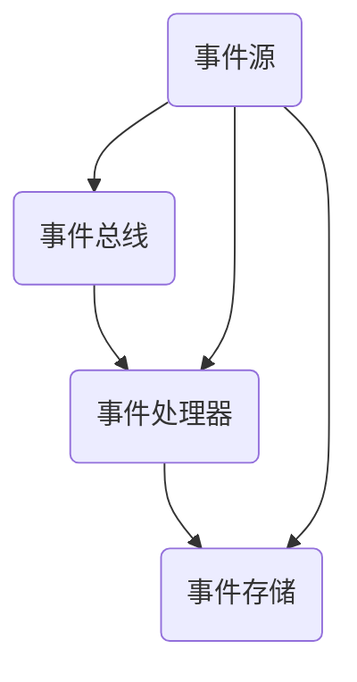

                 

### 文章标题：事件驱动架构：构建响应式系统

### 关键词：事件驱动架构，响应式系统，架构设计，事件处理，分布式系统

### 摘要：

本文旨在深入探讨事件驱动架构（Event-Driven Architecture, EDA）及其在构建响应式系统（Responsive Systems）中的应用。通过逐步分析EDA的核心概念、架构设计、事件处理技术、分布式系统挑战以及最佳实践，本文为开发者提供了一套系统化的理解和实施EDA的方法，以构建高效、灵活且具备响应能力的现代软件系统。

## 第一部分：引言

### 第1章：事件驱动架构与响应式系统概述

#### 1.1 什么是事件驱动架构

事件驱动架构（Event-Driven Architecture, EDA）是一种软件架构模式，它基于事件的概念，使得系统组件通过事件进行通信和协作。事件可以理解为系统中发生的一些特定行为或状态变化，例如用户点击、数据更新、错误发生等。与传统的基于请求-响应的架构不同，EDA强调系统的各个部分通过事件的异步传递来交互。

#### 1.2 响应式系统的概念

响应式系统（Responsive Systems）是一种具备即时响应能力、高度弹性和可扩展性的系统。它们能够快速响应用户操作和系统事件，提供流畅的用户体验。响应式系统的特点包括低延迟、高并发处理能力、自动重试和故障恢复机制等。

#### 1.3 事件驱动架构与响应式系统的关系

事件驱动架构（EDA）为构建响应式系统提供了坚实的基础。EDA通过事件驱动的设计模式，使得系统能够在事件发生时快速响应，无需等待同步操作的结果。这种架构不仅提高了系统的性能和可扩展性，还增强了系统的可靠性和可维护性。响应式系统则利用EDA的优势，通过事件流来管理和协调各种业务流程。

## 第二部分：事件驱动架构原理

### 第2章：事件驱动架构的核心概念

#### 2.1 事件与事件源

事件（Event）是EDA中的基本单位，表示系统中的一个特定状态变化或行为发生。事件源（Event Source）是产生事件的对象，可以是用户界面、外部系统、传感器或任何能够触发事件的部分。事件源将事件发布到事件总线或队列中，供其他组件消费。

#### 2.2 事件处理

事件处理（Event Processing）是EDA中的关键环节，它涉及事件从产生到消费的整个生命周期。事件处理包括事件监听、事件分发、事件处理逻辑和事件反馈等步骤。事件处理的流程决定了系统如何响应不同类型的事件，以及如何协调各个组件之间的协作。

#### 2.3 事件驱动架构的组件

事件驱动架构由多个组件组成，包括事件源、事件总线、事件处理器和事件存储等。这些组件共同工作，实现了事件驱动的通信和协作机制。事件源负责产生和发布事件，事件总线用于传输事件，事件处理器对事件进行处理和响应，事件存储则用于持久化事件数据。

## 第三部分：响应式系统的设计

### 第3章：响应式系统的架构设计

#### 3.1 系统架构设计原则

响应式系统的架构设计需要遵循一些核心原则，包括模块化、解耦、异步处理和事件驱动等。模块化设计使得系统可以方便地扩展和维护，解耦则确保系统组件之间的独立性，异步处理和事件驱动提高了系统的性能和响应能力。

#### 3.2 组件设计与状态管理

组件设计是响应式系统架构设计的重要环节。组件应该具备单一职责、高内聚和低耦合等特点。状态管理则是响应式系统中的关键问题，需要设计有效的状态同步和状态迁移机制，以确保系统的稳定性和一致性。

#### 3.3 系统的弹性和可扩展性

响应式系统需要具备弹性和可扩展性，以应对不断变化的业务需求和负载压力。系统可以通过水平扩展、分布式架构和容错机制来实现弹性和可扩展性。这些设计策略可以确保系统在处理高并发请求时保持高效和稳定。

## 第四部分：事件处理技术

### 第4章：事件处理技术

#### 4.1 异步处理

异步处理（Asynchronous Processing）是事件驱动架构中的核心技术之一。通过异步处理，系统可以在不等待某个操作完成的情况下继续执行其他任务，从而提高系统的并发性和响应能力。异步处理技术包括消息队列、回调函数和异步编程模型等。

#### 4.2 事件队列

事件队列（Event Queue）是事件驱动系统中的一个重要组件，用于存储和传输事件。事件队列的设计和优化对系统的性能和响应时间至关重要。事件队列可以选择基于内存、磁盘或消息队列的实现方式，根据系统的需求和特点进行选择。

#### 4.3 事件驱动编程

事件驱动编程（Event-Driven Programming）是一种基于事件响应的编程范式。在事件驱动编程中，程序的核心逻辑是通过事件监听器和事件处理器来实现的。事件驱动编程使得系统可以更灵活地响应用户操作和系统事件，提高系统的可维护性和扩展性。

## 第五部分：分布式事件驱动系统

### 第5章：分布式事件驱动系统

#### 5.1 分布式系统概述

分布式系统（Distributed Systems）是由多个独立的计算机节点组成的系统，它们通过网络进行通信和协作。分布式系统的特点包括高可用性、可扩展性和分布式计算等。分布式系统面临着数据一致性、通信延迟和故障处理等挑战。

#### 5.2 分布式事件处理

分布式事件处理（Distributed Event Processing）是分布式系统中的核心技术之一。它涉及如何在分布式环境中处理事件，包括事件生成、传输、处理和存储等。分布式事件处理可以提高系统的性能和可靠性，同时确保数据的一致性和实时性。

#### 5.3 分布式系统的协调与一致性

分布式系统的协调与一致性（Coordination and Consistency in Distributed Systems）是确保系统正确运作的关键问题。分布式系统需要设计有效的协调机制，以确保节点之间的同步和协作。一致性则涉及如何保证分布式系统中的数据状态是一致的，避免数据冲突和异常情况。

## 第六部分：最佳实践和案例分析

### 第6章：最佳实践与案例分析

#### 6.1 事件驱动架构最佳实践

事件驱动架构的最佳实践包括模块化设计、解耦组件、使用异步处理和事件队列等。这些实践可以提高系统的性能、可维护性和可扩展性。通过分析和总结成功案例，读者可以更好地理解和应用事件驱动架构。

#### 6.2 响应式系统的成功案例

响应式系统在许多实际应用中取得了显著的成功。本节将介绍一些典型的成功案例，包括金融交易系统、实时数据分析和社交网络等。通过分析这些案例，读者可以了解响应式系统在实际应用中的优势和挑战。

#### 6.3 事件驱动架构的未来趋势

随着技术的不断发展和业务需求的多样化，事件驱动架构（EDA）和响应式系统（Responsive Systems）将继续发展。本节将探讨事件驱动架构的未来趋势，包括云计算、边缘计算和人工智能等领域的应用。

## 第七部分：开发工具和框架

### 第7章：开发工具和框架

开发事件驱动架构和响应式系统需要使用各种工具和框架。本节将介绍一些常用的开发工具和框架，包括事件总线、消息队列、事件驱动编程库和分布式系统框架等。这些工具和框架可以帮助开发者更高效地实现事件驱动架构和响应式系统。

### 总结

事件驱动架构（EDA）和响应式系统（Responsive Systems）是现代软件系统设计中不可或缺的一部分。本文通过逐步分析EDA的核心概念、原理、设计、事件处理技术、分布式系统挑战和最佳实践，为开发者提供了一套全面的指南。通过理解和应用EDA，开发者可以构建高效、灵活且具备响应能力的软件系统，满足不断变化的业务需求和用户期望。在未来，随着技术的不断进步，事件驱动架构将继续在各个领域发挥重要作用。开发者应该紧跟行业动态，不断提升自身的技术能力，以应对未来的挑战。### 文章标题：事件驱动架构：构建响应式系统

### 关键词：事件驱动架构，响应式系统，架构设计，事件处理，分布式系统

### 摘要：

本文旨在深入探讨事件驱动架构（Event-Driven Architecture, EDA）及其在构建响应式系统（Responsive Systems）中的应用。通过逐步分析EDA的核心概念、架构设计、事件处理技术、分布式系统挑战以及最佳实践，本文为开发者提供了一套系统化的理解和实施EDA的方法，以构建高效、灵活且具备响应能力的现代软件系统。

## 第一部分：引言

### 第1章：事件驱动架构与响应式系统概述

事件驱动架构（Event-Driven Architecture, EDA）是一种软件架构模式，其核心在于事件的概念。事件可以是系统中的各种状态变化或行为，如用户操作、数据更新或错误发生等。事件驱动架构与传统基于请求-响应的架构相比，具有以下显著优势：

1. **异步通信**：EDA中的组件通过事件进行异步通信，避免了同步操作导致的性能瓶颈。
2. **高扩展性**：EDA可以轻松扩展以处理大量并发事件，从而满足高负载场景的需求。
3. **高可靠性**：EDA通过事件的重试和故障恢复机制，提高了系统的容错能力。

响应式系统（Responsive Systems）是一种能够快速响应用户操作和系统事件的高性能系统。响应式系统的特点包括：

1. **低延迟**：系统能够在极短的时间内响应用户请求，提供流畅的用户体验。
2. **高并发处理能力**：系统可以同时处理大量请求，确保在高流量情况下保持性能稳定。
3. **自动重试和故障恢复**：系统能够自动重试失败的请求，并从故障中快速恢复。

事件驱动架构与响应式系统紧密相关。EDA通过事件驱动的设计模式，使得系统能够在事件发生时快速响应，无需等待同步操作的结果。这种架构不仅提高了系统的性能和可扩展性，还增强了系统的可靠性和可维护性。响应式系统利用EDA的优势，通过事件流来管理和协调各种业务流程。

### 第2章：事件驱动架构原理

#### 2.1 事件与事件源

在事件驱动架构中，事件（Event）是基本的数据单位。事件可以表示系统中的各种状态变化或行为，如用户点击、数据更新、错误发生等。事件源（Event Source）是产生事件的对象，可以是用户界面、外部系统、传感器或任何能够触发事件的部分。事件源将事件发布到事件总线或队列中，供其他组件消费。

#### 2.2 事件处理

事件处理（Event Processing）是EDA中的关键环节，它涉及事件从产生到消费的整个生命周期。事件处理的流程通常包括以下步骤：

1. **事件监听**：组件注册对特定事件的监听，以便在事件发生时得到通知。
2. **事件分发**：事件被分发到相应的处理器进行处理。
3. **事件处理**：处理器对事件进行分析和操作，执行相应的业务逻辑。
4. **事件反馈**：事件处理的结果可以通过事件或消息的形式反馈给其他组件。

#### 2.3 事件驱动架构的组件

事件驱动架构由多个组件组成，包括事件源、事件总线、事件处理器和事件存储等。这些组件共同工作，实现了事件驱动的通信和协作机制。以下是这些组件的角色和功能：

1. **事件源**：产生和发布事件的对象，可以是用户界面、外部系统或传感器等。
2. **事件总线**：用于传输事件的中心通道，通常是一个消息队列或事件队列，确保事件可以高效地传递给目标处理器。
3. **事件处理器**：对事件进行处理和响应的组件，根据事件类型执行相应的业务逻辑。
4. **事件存储**：用于持久化事件数据和记录系统日志的组件，便于后续查询和分析。

## 第二部分：响应式系统的设计

### 第3章：响应式系统的架构设计

#### 3.1 系统架构设计原则

响应式系统的架构设计需要遵循以下核心原则：

1. **模块化**：将系统划分为多个独立的模块，每个模块负责特定的功能，便于系统的扩展和维护。
2. **解耦**：组件之间应该尽量解耦，减少直接的依赖关系，提高系统的灵活性和可维护性。
3. **异步处理**：通过异步处理提高系统的并发性和响应能力，避免同步操作导致的性能瓶颈。
4. **事件驱动**：采用事件驱动的设计模式，使系统能够在事件发生时快速响应，无需等待同步操作的结果。

#### 3.2 组件设计与状态管理

组件设计是响应式系统架构设计的重要环节。以下是组件设计的原则：

1. **单一职责**：每个组件应负责一项特定的功能，确保高内聚、低耦合。
2. **高内聚**：组件内部的逻辑应紧密相关，确保组件的可维护性和可测试性。
3. **低耦合**：组件之间应尽量解耦，减少直接的依赖关系，提高系统的灵活性和可扩展性。

状态管理是响应式系统中的关键问题，需要设计有效的状态同步和状态迁移机制，以确保系统的稳定性和一致性。以下是状态管理的策略：

1. **状态机**：使用状态机来表示组件的状态变化，确保状态的迁移是明确的和可预测的。
2. **状态同步**：在分布式系统中，需要设计有效的状态同步机制，确保各个节点之间的状态是一致的。
3. **状态恢复**：在系统出现故障时，需要设计状态恢复机制，确保系统能够从错误中快速恢复。

#### 3.3 系统的弹性和可扩展性

响应式系统需要具备弹性和可扩展性，以应对不断变化的业务需求和负载压力。以下是实现系统弹性和可扩展性的策略：

1. **水平扩展**：通过增加节点数量来提高系统的处理能力，实现线性扩展。
2. **分布式架构**：将系统划分为多个分布式组件，通过负载均衡和故障转移来提高系统的可用性和容错能力。
3. **容错机制**：设计故障检测、自动重试和故障恢复机制，确保系统在故障情况下能够快速恢复。

## 第三部分：事件处理技术

### 第4章：事件处理技术

#### 4.1 异步处理

异步处理（Asynchronous Processing）是事件驱动架构中的核心技术之一。通过异步处理，系统可以在不等待某个操作完成的情况下继续执行其他任务，从而提高系统的并发性和响应能力。异步处理技术包括：

1. **回调函数**：在操作完成后，通过回调函数来执行后续的逻辑。
2. **异步编程模型**：如异步编程接口（API）和异步编程库，提供异步操作的编程范式。
3. **消息队列**：将操作放入消息队列中，其他组件从队列中取出并执行，实现任务的异步执行。

#### 4.2 事件队列

事件队列（Event Queue）是事件驱动系统中的一个重要组件，用于存储和传输事件。事件队列的设计和优化对系统的性能和响应时间至关重要。以下是事件队列的设计要点：

1. **并发处理**：支持并发的事件处理，提高系统的吞吐量。
2. **优先级队列**：根据事件的优先级进行排序，确保高优先级的事件优先处理。
3. **负载均衡**：在分布式系统中，实现负载均衡，确保事件均匀分布到各个处理器。

#### 4.3 事件驱动编程

事件驱动编程（Event-Driven Programming）是一种基于事件响应的编程范式。在事件驱动编程中，程序的核心逻辑是通过事件监听器和事件处理器来实现的。事件驱动编程的优点包括：

1. **灵活性和可维护性**：通过事件监听器和事件处理器，可以灵活地添加和修改事件处理逻辑，提高系统的可维护性。
2. **异步通信**：事件驱动编程天然支持异步通信，提高系统的并发性和响应能力。
3. **事件驱动架构兼容性**：事件驱动编程范式与事件驱动架构无缝集成，使系统更易于设计和实现。

## 第四部分：分布式事件驱动系统

### 第5章：分布式事件驱动系统

#### 5.1 分布式系统概述

分布式系统（Distributed Systems）是由多个独立的计算机节点组成的系统，它们通过网络进行通信和协作。分布式系统的特点包括：

1. **高可用性**：通过冗余和故障转移机制，确保系统在节点故障时仍然可用。
2. **可扩展性**：通过增加节点数量，提高系统的处理能力和吞吐量。
3. **分布式计算**：将任务分布到多个节点上执行，提高系统的计算效率。

分布式系统面临着以下挑战：

1. **数据一致性**：确保分布式系统中各个节点的数据是一致的，避免数据冲突和异常情况。
2. **通信延迟**：网络延迟和带宽限制可能影响系统的性能和响应时间。
3. **故障处理**：设计故障检测、自动重试和故障恢复机制，确保系统在故障情况下能够快速恢复。

#### 5.2 分布式事件处理

分布式事件处理（Distributed Event Processing）是分布式系统中的核心技术之一。它涉及如何在分布式环境中处理事件，包括事件生成、传输、处理和存储等。分布式事件处理的优势包括：

1. **高并发处理能力**：通过分布式处理，可以同时处理大量事件，提高系统的性能和吞吐量。
2. **数据一致性**：分布式事件处理可以确保分布式系统中各个节点的数据是一致的，避免数据冲突和异常情况。
3. **故障容错**：分布式事件处理可以通过冗余和故障转移机制，提高系统的可用性和容错能力。

#### 5.3 分布式系统的协调与一致性

分布式系统的协调与一致性（Coordination and Consistency in Distributed Systems）是确保系统正确运作的关键问题。以下是分布式系统协调与一致性的策略：

1. **分布式锁**：确保多个节点对共享资源的访问是同步的，避免并发冲突和数据不一致。
2. **分布式事务**：通过分布式事务管理，确保分布式系统中各个节点的数据是一致的，避免数据冲突和异常情况。
3. **一致性协议**：如Paxos和Raft等，确保分布式系统中各个节点达成一致，避免数据不一致和系统故障。

## 第五部分：最佳实践和案例分析

### 第6章：最佳实践与案例分析

#### 6.1 事件驱动架构最佳实践

事件驱动架构（EDA）的最佳实践包括以下几个方面：

1. **模块化设计**：将系统划分为多个独立的模块，每个模块负责特定的功能，确保高内聚、低耦合。
2. **解耦组件**：组件之间应尽量解耦，减少直接的依赖关系，提高系统的灵活性和可维护性。
3. **异步处理**：通过异步处理提高系统的并发性和响应能力，避免同步操作导致的性能瓶颈。
4. **事件驱动编程**：采用事件驱动编程范式，使系统能够在事件发生时快速响应，无需等待同步操作的结果。

#### 6.2 响应式系统的成功案例

响应式系统在许多实际应用中取得了显著的成功。以下是几个典型的成功案例：

1. **金融交易系统**：通过事件驱动架构，金融交易系统实现了低延迟和高并发处理能力，确保交易执行的效率和准确性。
2. **实时数据分析**：响应式系统在实时数据分析领域发挥了重要作用，通过事件驱动处理海量数据，实现了实时洞察和分析。
3. **社交网络**：社交网络系统通过事件驱动架构，实现了用户操作的实时响应和消息的快速传递，提供了流畅的用户体验。

#### 6.3 事件驱动架构的未来趋势

随着技术的不断发展和业务需求的多样化，事件驱动架构（EDA）和响应式系统（Responsive Systems）将继续发展。以下是未来趋势的展望：

1. **云计算**：事件驱动架构在云计算环境中具有巨大的潜力，可以充分利用云基础设施的弹性和可扩展性。
2. **边缘计算**：随着物联网和5G技术的发展，边缘计算将逐渐兴起，事件驱动架构将成为边缘设备处理实时数据的重要手段。
3. **人工智能**：事件驱动架构与人工智能（AI）技术的结合，将推动智能系统的创新和发展，实现更智能、更高效的事件处理和响应。

## 第六部分：开发工具和框架

### 第7章：开发工具和框架

开发事件驱动架构和响应式系统需要使用各种工具和框架。以下是一些常用的开发工具和框架：

1. **事件总线**：如Apache Kafka、RabbitMQ等，用于传输和存储事件，实现事件驱动通信。
2. **消息队列**：如Apache Pulsar、Apache RocketMQ等，提供高性能的消息传递机制，支持异步处理和分布式消息队列。
3. **事件驱动编程库**：如Node.js的EventEmitter、Java的Event Bus等，提供事件监听和事件处理的编程接口。
4. **分布式系统框架**：如Apache ZooKeeper、Consul等，提供分布式协调、配置管理和服务发现等功能。

## 总结

事件驱动架构（EDA）和响应式系统（Responsive Systems）是现代软件系统设计中不可或缺的一部分。本文通过逐步分析EDA的核心概念、原理、设计、事件处理技术、分布式系统挑战以及最佳实践，为开发者提供了一套系统化的理解和实施EDA的方法，以构建高效、灵活且具备响应能力的现代软件系统。通过理解和应用EDA，开发者可以应对不断变化的业务需求和用户期望，构建具有高性能、高可靠性和高可扩展性的软件系统。在未来，随着技术的不断进步，事件驱动架构将继续在各个领域发挥重要作用。开发者应紧跟行业动态，不断提升自身的技术能力，以应对未来的挑战。

### 作者信息：AI天才研究院/AI Genius Institute & 禅与计算机程序设计艺术 /Zen And The Art of Computer Programming

### 拓展阅读：

1. **《设计数据密集型应用》**：由Martin Kleppmann撰写，详细介绍了分布式系统的设计原则和最佳实践。
2. **《响应式设计：实践现代Web应用开发》**：由Joshua Bloch和Neal Ford合著，探讨了响应式设计在现代Web应用开发中的应用。
3. **《事件驱动架构：现代软件架构实践》**：由Michael M. Hyatt和George晝er撰写，深入分析了事件驱动架构的设计和实现。

### 注意事项：

1. 在实施事件驱动架构时，务必确保事件的一致性和数据同步。
2. 分布式事件处理需要考虑网络延迟和带宽限制，设计高效的传输和处理机制。
3. 针对高并发场景，应进行性能测试和优化，确保系统的稳定性和响应能力。

### 小结

事件驱动架构（EDA）和响应式系统（Responsive Systems）是现代软件系统设计中的重要概念。通过事件驱动的通信和协作机制，系统能够高效、灵活地响应用户操作和系统事件。本文从核心概念、架构设计、事件处理技术、分布式系统挑战和最佳实践等方面，系统性地介绍了EDA和RS的设计和实现方法。开发者应关注这些领域的发展趋势，不断提升自身的技术能力，以应对未来软件系统设计中的挑战。通过合理应用EDA和RS，开发者可以构建具有高性能、高可靠性和高可扩展性的软件系统，满足不断变化的业务需求和用户期望。### 引入与背景

在快速变化的现代软件系统开发环境中，构建高效、灵活且具备响应能力的系统变得越来越重要。随着云计算、物联网和大数据技术的不断发展，系统需要处理的数据量、用户访问量和业务需求都在不断增加。传统的请求-响应架构（Request-Response Architecture）已经难以满足这些新的需求。因此，事件驱动架构（Event-Driven Architecture，EDA）和响应式系统（Responsive Systems）逐渐成为开发者们关注的焦点。

事件驱动架构（EDA）是一种基于事件进行通信和协作的软件架构模式。在这种架构中，系统的各个组件通过事件进行交互，而不是通过请求和响应。事件可以是系统中的各种状态变化或行为，如用户点击、数据更新、错误发生等。事件驱动架构具有异步通信、高扩展性和高可靠性等优点，使得系统能够更加高效地处理大量并发请求。

响应式系统（Responsive Systems）则是一种具备即时响应能力、高度弹性和可扩展性的系统。响应式系统的核心在于能够快速响应用户操作和系统事件，提供流畅的用户体验。这要求系统在设计时考虑低延迟、高并发处理能力、自动重试和故障恢复机制等因素。响应式系统不仅能够提高系统的性能和可靠性，还能增强系统的可维护性和扩展性。

本文将深入探讨事件驱动架构（EDA）及其在构建响应式系统（Responsive Systems）中的应用。通过逐步分析EDA的核心概念、架构设计、事件处理技术、分布式系统挑战以及最佳实践，本文为开发者提供了一套系统化的理解和实施EDA的方法，以构建高效、灵活且具备响应能力的现代软件系统。

### 事件驱动架构（EDA）的核心概念

事件驱动架构（Event-Driven Architecture，EDA）是一种以事件为中心的软件架构模式，其核心在于通过事件来实现系统组件之间的通信和协作。事件可以看作是系统中发生的一些特定行为或状态变化，如用户点击、数据更新、错误发生等。在EDA中，事件不仅起到了触发响应的作用，还成为了系统状态变迁的重要驱动力。

#### 事件与事件源

在EDA中，事件（Event）是基本的数据单元。事件可以表示系统中的各种状态变化或行为，例如用户在网页上的点击、数据库中的数据更新、系统错误等。每个事件都包含了一系列的属性，如事件类型、发生时间、事件数据等。事件源（Event Source）是产生事件的对象，可以是用户界面、外部系统、传感器或任何能够触发事件的部分。事件源将事件发布到事件总线或队列中，供其他组件消费。

事件源在EDA中扮演着至关重要的角色。例如，在一个在线购物平台中，用户点击“添加到购物车”按钮可以触发一个“添加商品到购物车”的事件。这个事件会被前端用户界面捕获，然后发布到事件总线，由后端系统处理该事件，更新数据库中的商品库存信息。

#### 事件处理

事件处理（Event Processing）是EDA中的关键环节，它涉及事件从产生到消费的整个生命周期。事件处理包括以下几个主要步骤：

1. **事件监听**：组件注册对特定事件的监听，以便在事件发生时得到通知。监听器（Listener）是一个关键的抽象，它定义了组件对特定事件感兴趣并希望接收通知的方式。

2. **事件分发**：事件被分发到相应的处理器进行处理。事件分发器（Event Distributor）负责将事件路由到正确的处理器，确保事件能够被正确地处理。

3. **事件处理**：处理器（Processor）对事件进行分析和操作，执行相应的业务逻辑。处理器可以根据事件类型执行不同的操作，如更新数据库、发送通知或触发其他事件。

4. **事件反馈**：事件处理的结果可以通过事件或消息的形式反馈给其他组件。这种反馈机制确保了系统的各个部分能够协同工作，保持状态的一致性。

在事件处理的流程中，异步处理（Asynchronous Processing）是一个关键技术。通过异步处理，系统可以在不等待某个操作完成的情况下继续执行其他任务，从而提高系统的并发性和响应能力。例如，当一个请求提交到系统后，可以立即返回一个响应，同时后台处理该请求的具体任务。这种方式避免了同步操作导致的性能瓶颈，提高了系统的整体效率。

#### 事件总线

事件总线（Event Bus）是EDA中用于传输事件的中心通道，通常是一个消息队列或事件队列。事件总线确保事件可以在系统组件之间高效地传递，实现了分布式系统中的事件驱动通信。事件总线的设计和性能对系统的性能和响应时间至关重要。

事件总线通常具有以下特点：

1. **高吞吐量**：事件总线需要能够处理大量并发的事件，确保系统的性能和响应能力。

2. **低延迟**：事件总线的设计应尽量减少事件传递的延迟，以提高系统的实时性。

3. **可靠传输**：事件总线需要确保事件在传递过程中不丢失或重复，保证数据的一致性。

4. **分布式支持**：事件总线应支持分布式系统的架构，确保事件可以在不同的节点之间传递和同步。

在实际应用中，事件总线可以采用多种实现方式，如基于内存的消息队列（如RabbitMQ）、基于磁盘的日志系统（如Kafka）或基于流处理框架（如Apache Flink）。选择合适的事件总线实现方式取决于系统的具体需求和场景。

#### 事件处理器

事件处理器（Event Processor）是EDA中的核心组件，负责对事件进行分析和处理。事件处理器可以根据事件的类型和内容，执行相应的业务逻辑，如更新数据库、发送通知、触发其他事件等。事件处理器的设计需要考虑以下几个关键点：

1. **灵活性**：事件处理器应能够灵活地处理不同类型的事件，实现多样化的业务逻辑。

2. **可扩展性**：事件处理器应支持动态扩展，以便在系统规模扩大时能够快速适应。

3. **高可用性**：事件处理器需要具备高可用性，确保系统在处理器故障时能够快速恢复。

4. **性能优化**：事件处理器的性能对系统的响应时间至关重要，因此需要设计高效的算法和数据结构，优化处理性能。

在实际应用中，事件处理器可以采用多种技术实现，如基于消息队列的消费模式、基于流处理的实时处理模式或基于微服务的分布式处理模式。根据系统的需求和场景，选择合适的事件处理器实现方式可以提高系统的性能和可维护性。

#### 事件存储

事件存储（Event Storage）是EDA中用于持久化事件数据和记录系统日志的组件。事件存储不仅用于记录系统中的事件，还可以为系统分析、故障排查和审计提供重要数据支持。事件存储通常需要考虑以下几个方面：

1. **数据一致性**：事件存储需要确保数据的一致性，避免数据丢失或重复。

2. **数据可扩展性**：事件存储应支持数据的高效扩展，以应对系统规模的增长。

3. **数据访问速度**：事件存储需要提供快速的数据访问能力，以支持实时分析和查询。

4. **数据安全性**：事件存储需要保证数据的安全性，防止数据泄露或篡改。

在实际应用中，事件存储可以采用多种技术实现，如关系数据库、NoSQL数据库、日志文件等。根据系统的需求和场景，选择合适的事件存储实现方式可以提高系统的性能和可靠性。

#### 事件驱动架构与响应式系统

事件驱动架构（EDA）为构建响应式系统（Responsive Systems）提供了坚实的基础。响应式系统是一种能够快速响应用户操作和系统事件的高性能系统，其特点包括低延迟、高并发处理能力、自动重试和故障恢复机制等。EDA通过事件驱动的设计模式，使得系统能够在事件发生时快速响应，无需等待同步操作的结果。这种架构不仅提高了系统的性能和可扩展性，还增强了系统的可靠性和可维护性。

响应式系统利用EDA的优势，通过事件流来管理和协调各种业务流程。例如，在一个在线购物平台中，用户点击“添加到购物车”按钮会触发一个事件，系统会立即响应并更新购物车信息。这种即时响应机制提供了流畅的用户体验，提高了用户满意度。

#### 核心概念之间的关系

在EDA中，事件、事件源、事件处理、事件总线、事件处理器和事件存储等核心概念之间存在着紧密的联系和协作。以下是这些概念之间的关系：

1. **事件**：事件是系统中的基本数据单元，表示系统的各种状态变化或行为。
2. **事件源**：事件源是产生事件的对象，将事件发布到事件总线。
3. **事件总线**：事件总线是传输事件的中心通道，确保事件可以高效地传递给目标处理器。
4. **事件处理器**：事件处理器对事件进行分析和处理，执行相应的业务逻辑。
5. **事件存储**：事件存储用于持久化事件数据和记录系统日志。

通过这些核心概念的协作，EDA实现了系统组件之间的异步通信和高效协作，提高了系统的性能和响应能力。

#### Mermaid 流程图

为了更直观地展示事件驱动架构的核心概念和关系，我们可以使用Mermaid流程图进行描述：



在这个流程图中，事件源（A）将事件发布到事件总线（B），事件处理器（C）从事件总线接收事件并处理，事件存储（D）用于记录事件数据。事件源和事件处理器之间通过事件总线进行通信，实现了事件驱动的架构。

通过理解事件驱动架构（EDA）的核心概念，我们可以更好地设计、实现和优化现代软件系统，以满足高性能、高可靠性和高可扩展性的需求。

### 响应式系统的设计原则与组件

响应式系统（Responsive Systems）是一种具备即时响应能力、高度弹性和可扩展性的系统，能够快速响应用户操作和系统事件，提供流畅的用户体验。设计响应式系统需要遵循一系列核心原则，确保系统的高性能、可靠性和可维护性。以下是响应式系统设计的关键原则和主要组件。

#### 设计原则

1. **模块化**：将系统划分为多个独立的模块，每个模块负责特定的功能，便于系统的扩展和维护。模块化设计有助于降低系统复杂性，提高代码的可读性和可维护性。
2. **解耦**：组件之间应尽量解耦，减少直接的依赖关系，提高系统的灵活性和可维护性。解耦可以通过事件驱动通信、接口定义和独立部署等方式实现。
3. **异步处理**：通过异步处理提高系统的并发性和响应能力，避免同步操作导致的性能瓶颈。异步处理使得系统能够在不等待某个操作完成的情况下继续执行其他任务，提高系统的整体效率。
4. **事件驱动**：采用事件驱动的设计模式，使系统能够在事件发生时快速响应，无需等待同步操作的结果。事件驱动架构能够提高系统的性能和可扩展性，同时增强系统的可靠性和可维护性。
5. **状态管理**：设计有效的状态管理机制，确保系统的状态同步和状态迁移。状态管理需要考虑系统的稳定性和一致性，避免状态冲突和错误。

#### 主要组件

1. **事件源**：事件源是系统中的对象，负责产生和发布事件。事件源可以是用户界面、外部系统、传感器或任何能够触发事件的部分。事件源通过发布事件来触发系统响应。
2. **事件处理器**：事件处理器是负责处理事件的组件，根据事件的类型和内容执行相应的业务逻辑。事件处理器可以从事件总线接收事件，进行事件分析、数据处理和响应。
3. **事件总线**：事件总线是系统中的核心通信通道，用于传输和分发事件。事件总线通常是一个消息队列或事件队列，确保事件可以在系统组件之间高效地传递。事件总线的设计和性能对系统的响应时间和性能至关重要。
4. **状态管理器**：状态管理器是负责管理系统状态的组件，确保系统的状态同步和状态迁移。状态管理器可以维护系统中的各种状态信息，处理状态变更和状态恢复。
5. **分布式协调器**：分布式协调器是用于管理分布式系统中各个节点的通信和协调的组件。分布式协调器可以提供分布式锁、一致性协议和分布式事务等功能，确保系统的一致性和可靠性。
6. **监控与日志**：监控与日志组件用于收集和记录系统运行中的各种数据，包括事件日志、性能指标和错误记录等。监控与日志组件可以帮助开发者进行系统分析和故障排查，提高系统的可维护性和可靠性。

#### 组件之间的交互

响应式系统的设计需要考虑组件之间的交互和协作。以下是响应式系统中主要组件之间的交互关系：

1. **事件源与事件总线**：事件源将事件发布到事件总线，事件总线负责将事件传输到目标事件处理器。
2. **事件处理器与事件总线**：事件处理器从事件总线接收事件，进行事件处理和响应。事件处理器可以订阅特定类型的事件，确保只处理与自身相关的业务逻辑。
3. **状态管理器与事件处理器**：状态管理器可以与事件处理器协作，确保系统状态的一致性和同步。状态管理器可以根据事件处理的结果更新系统状态，实现状态迁移和状态同步。
4. **分布式协调器与事件处理器**：分布式协调器可以协助事件处理器进行分布式事务管理和一致性保障。分布式协调器可以提供分布式锁和一致性协议，确保系统在分布式环境中的正确性和可靠性。
5. **监控与日志与事件处理器**：监控与日志组件可以记录事件处理的过程和结果，帮助开发者进行系统性能分析和故障排查。

通过上述组件和交互关系，响应式系统可以高效地响应用户操作和系统事件，提供流畅的用户体验和可靠的系统运行。设计响应式系统时，开发者需要充分考虑系统的模块化、解耦、异步处理和事件驱动等设计原则，确保系统的高性能、可靠性和可维护性。

### 系统的弹性和可扩展性

响应式系统（Responsive Systems）需要具备弹性和可扩展性，以应对不断变化的业务需求和负载压力。弹性（Resilience）是指系统能够在面临故障、错误或异常情况时保持正常运行的能力。可扩展性（Scalability）则是指系统能够随业务需求的增长而扩展其处理能力和资源。以下是一些实现系统弹性和可扩展性的策略：

#### 水平扩展

水平扩展（Horizontal Scaling）是通过增加系统节点的数量来提高系统的处理能力和吞吐量。在分布式系统中，水平扩展是常见的策略之一。以下是实现水平扩展的一些方法：

1. **分片（Sharding）**：将数据集分割成多个片段（shards），每个片段存储在不同的节点上。分片可以提高数据的读写性能，减少单个节点的负载。
2. **负载均衡（Load Balancing）**：通过负载均衡器将请求分配到不同的节点上，确保系统的每个节点都能均匀地承担负载。常见的负载均衡算法包括轮询、最少连接和最小负载等。
3. **冗余节点**：在系统中部署多个冗余节点，确保在某个节点故障时，其他节点可以接替其工作，保证系统的可用性。

#### 分布式架构

分布式架构（Distributed Architecture）通过将系统划分为多个独立的组件或服务，提高了系统的可扩展性和容错能力。以下是实现分布式架构的一些策略：

1. **微服务（Microservices）**：将系统拆分为多个小型、独立的服务，每个服务负责特定的业务功能。微服务可以通过事件驱动或消息队列进行通信，确保系统的松耦合和可扩展性。
2. **服务发现（Service Discovery）**：在分布式系统中，服务发现是关键的一环。通过服务发现机制，服务可以动态地注册和发现其他服务，确保请求可以正确路由到对应的服务实例。
3. **分布式协调（Distributed Coordination）**：分布式系统中的多个节点需要进行协调，以保持数据的一致性和系统的同步。分布式协调器（如ZooKeeper、Consul等）可以提供分布式锁、选举和配置管理等功能。

#### 弹性伸缩（Auto-Scaling）

弹性伸缩（Auto-Scaling）是指系统可以根据实际的负载自动调整其资源分配。以下是一些实现弹性伸缩的方法：

1. **水平扩展伸缩（Horizontal Auto-Scaling）**：根据系统的负载情况，自动增加或减少节点的数量，确保系统能够在负载高峰时保持高性能。
2. **垂直扩展伸缩（Vertical Auto-Scaling）**：根据系统的负载情况，自动调整节点的硬件资源（如CPU、内存等），以满足系统需求的增长。
3. **基于指标的自动伸缩（Metrics-Based Auto-Scaling）**：通过监控系统的性能指标（如CPU使用率、内存使用率、请求响应时间等），自动调整系统的资源分配，确保系统在负载高峰时保持最佳性能。

#### 容错机制

容错机制（Fault Tolerance）是确保系统在面对故障时能够快速恢复的能力。以下是一些实现容错机制的方法：

1. **冗余备份（Redundancy）**：通过在系统中的多个节点上存储相同的副本，确保在某个节点故障时，其他节点可以接替其工作，提供数据的高可用性。
2. **故障检测和自动恢复（Fault Detection and Automatic Recovery）**：通过监控系统的健康状况，及时检测和隔离故障节点，并自动恢复系统的正常运行。
3. **分布式事务（Distributed Transactions）**：在分布式系统中，分布式事务可以确保多个节点之间的操作是一致性的，避免数据冲突和异常。

#### 状态恢复和负载均衡

状态恢复和负载均衡是确保系统弹性的一种重要手段。以下是一些实现状态恢复和负载均衡的方法：

1. **会话状态恢复（Session State Recovery）**：在分布式系统中，会话状态（如用户登录信息、购物车数据等）需要在多个节点之间同步。通过会话状态恢复机制，确保在节点故障时，用户会话可以继续在另一个节点上恢复。
2. **动态负载均衡（Dynamic Load Balancing）**：通过动态监测系统的负载情况，实时调整负载均衡策略，确保系统的每个节点都能均衡地承担负载。
3. **预加载（Preloading）**：在负载高峰期之前，预先加载系统资源，确保系统在高峰期时能够快速响应请求。

通过上述策略，响应式系统可以实现高弹性、高可扩展性，确保在面对各种异常情况时仍能保持正常运行，提供流畅的用户体验。

### 异步处理在事件驱动架构中的重要性

异步处理（Asynchronous Processing）是事件驱动架构（Event-Driven Architecture，EDA）中至关重要的技术，它通过允许系统在操作不完成时继续执行其他任务，从而显著提高系统的并发性和响应能力。在EDA中，异步处理有助于减轻同步操作的瓶颈，使得系统能够高效地处理大量并发请求，提高整体性能。

#### 异步处理的优势

1. **提高并发性**：异步处理允许多个操作同时进行，减少了线程阻塞和等待时间，从而提高了系统的并发性。在处理大量请求时，异步处理可以显著减少系统的响应时间和资源消耗。

2. **降低延迟**：通过异步处理，系统可以在不等待某个操作完成的情况下继续执行其他任务，降低了整体延迟。这对于需要快速响应用户操作和系统事件的响应式系统尤为重要。

3. **增强系统弹性**：异步处理使得系统能够更好地应对负载高峰和突发流量，通过动态调整资源和使用策略，系统可以在短时间内适应不同的工作负载。

4. **提高资源利用率**：异步处理减少了线程和进程的创建和销毁开销，提高了系统的资源利用率。特别是在长时间运行的任务中，异步处理可以避免线程的长时间占用，从而释放资源供其他任务使用。

#### 实现异步处理的方法

1. **回调函数（Callbacks）**：回调函数是一种最常见的异步处理方法。当一个操作开始执行时，它立即返回，而实际的操作结果通过回调函数返回。例如，在JavaScript中，文件读写操作通常使用回调函数来实现异步处理。

   ```javascript
   fs.readFile(filename, function (err, data) {
       if (err) {
           console.error(err);
       } else {
           console.log(data);
       }
   });
   ```

2. **事件监听器（Event Listeners）**：事件监听器是一种基于事件模型的异步处理方法。在事件驱动的编程模型中，组件通过注册事件监听器来响应特定事件。当事件发生时，相应的监听函数会被调用。

   ```javascript
   document.addEventListener('click', function (event) {
       console.log('Element was clicked:', event.target);
   });
   ```

3. **异步编程接口（APIs）**：许多编程语言和框架提供了异步编程接口，使开发者能够更轻松地实现异步处理。这些接口通常返回Promise对象，通过链式调用可以实现复杂的异步操作。

   ```javascript
   fetch(url)
       .then(response => response.json())
       .then(data => console.log(data))
       .catch(error => console.error('Error fetching data:', error));
   ```

4. **消息队列（Message Queues）**：消息队列是异步处理的一种强大工具，它允许系统在不同的组件之间传递消息，实现任务的异步执行。常见的消息队列实现包括RabbitMQ、Kafka等。

   ```python
   import pika

   connection = pika.BlockingConnection(pika.ConnectionParameters('localhost'))
   channel = connection.channel()
   channel.queue_declare(queue='task_queue', durable=True)
   channel.basic_publish(exchange='',
                       routing_key='task_queue',
                       body='Hello World!',
                       properties=pika.BasicProperties(delivery_mode=2)) # make message persistent
   print(" [x] Sent 'Hello World!'")
   connection.close()
   ```

5. **异步编程库**：许多编程语言提供了异步编程库，如Python的asyncio、JavaScript的async/await等，使得开发者能够更方便地实现异步处理。

   ```python
   import asyncio

   async def main():
       print('Start')
       await asyncio.sleep(1)
       print('End')

   asyncio.run(main())
   ```

#### 异步处理在EDA中的应用

在事件驱动架构中，异步处理的应用场景非常广泛。以下是一些具体的例子：

1. **用户界面交互**：用户界面中的事件（如点击、滑动等）通常通过异步处理来响应用户操作，确保界面流畅且不阻塞用户交互。

2. **后台任务处理**：系统中的后台任务（如数据导入、报告生成等）可以通过异步处理进行调度和执行，提高任务的执行效率。

3. **数据传输**：网络数据传输（如HTTP请求、文件下载等）通常使用异步处理，以确保系统可以同时处理多个请求，提高网络利用率。

4. **事件处理**：事件驱动架构中的事件处理通常采用异步处理，确保系统能够在处理一个事件的同时继续接收和处理其他事件，提高系统的响应能力。

通过合理应用异步处理技术，事件驱动架构能够显著提高系统的性能和可扩展性，满足现代应用对高性能和响应速度的需求。开发者应充分理解和利用异步处理的优势，以构建高效、灵活且具备响应能力的软件系统。

### 事件队列的设计与优化

事件队列（Event Queue）是事件驱动系统中一个重要的组件，负责存储和传递事件。事件队列的设计和性能对系统的响应时间和整体性能有着重要影响。以下将详细讨论事件队列的设计原则、优化策略以及常见的实现方式。

#### 设计原则

1. **高吞吐量**：事件队列需要能够处理大量的并发事件，确保系统的性能和响应能力。在高吞吐量场景下，事件队列应能够高效地处理事件的入队和出队操作。
2. **低延迟**：事件队列的设计应尽量减少事件传递的延迟，以提高系统的实时性。低延迟对于需要即时响应的系统尤为重要，如在线交易、实时通信等。
3. **可靠性**：事件队列需要确保事件在传递过程中不丢失或重复，保证数据的一致性和系统的稳定性。在分布式系统中，事件队列的可靠性尤为重要。
4. **可扩展性**：事件队列应支持水平扩展，以应对系统规模的增长。通过增加队列节点或使用分布式队列，事件队列可以动态调整其处理能力。
5. **优先级处理**：在某些场景下，事件具有不同的优先级，事件队列应能够根据事件的优先级进行排序和调度。优先级处理可以确保高优先级事件优先被处理，提高系统的响应能力。

#### 优化策略

1. **并发处理**：为了提高事件队列的吞吐量，可以采用多线程或异步IO的方式，使事件队列能够同时处理多个事件。例如，使用线程池或异步编程库，实现并发的事件处理。
2. **内存管理**：合理管理内存是优化事件队列性能的关键。通过使用内存池（Memory Pool）或对象池（Object Pool）技术，可以减少对象的创建和销毁开销，提高系统的内存利用率。
3. **缓存策略**：在事件队列中采用缓存策略，可以减少事件的频繁访问和磁盘IO操作。例如，使用LRU（Least Recently Used）缓存策略，可以缓存最近使用的事件，提高事件查询和访问速度。
4. **压缩与解压缩**：对于大数据量的事件，可以采用压缩与解压缩技术，减少事件在队列中的存储空间和传输带宽。常用的压缩算法包括GZIP、Snappy等。
5. **消息确认机制**：为了确保事件传递的可靠性，可以采用消息确认机制（Message Acknowledgment）。在事件被成功处理之后，处理方需要向发送方发送确认消息，确保事件不被重复处理或丢失。

#### 实现方式

1. **内存队列**：内存队列是一种基于内存的事件队列，适用于小规模、低延迟的场景。内存队列的优点是速度快、延迟低，但缺点是数据持久性较差，重启后数据会丢失。
2. **磁盘队列**：磁盘队列是一种基于磁盘的事件队列，适用于大规模、高可靠性的场景。磁盘队列的优点是数据持久性高，但缺点是速度较慢，延迟较高。
3. **分布式队列**：分布式队列是一种基于分布式架构的事件队列，适用于高并发、大流量的场景。分布式队列通过将队列拆分为多个分区（Partition），实现数据的水平扩展和负载均衡。

   - **Kafka**：Kafka是一个分布式流处理平台，提供了高性能、可扩展的事件队列实现。Kafka通过分区和副本机制，确保了事件的高可用性和可靠性。
   - **RabbitMQ**：RabbitMQ是一个消息队列中间件，支持多种消息传输协议，适用于多种场景。RabbitMQ通过队列和交换机机制，实现了事件的有效传递和路由。
   - **ActiveMQ**：ActiveMQ是一个开源的消息队列中间件，支持多种消息传输协议，提供了丰富的功能和灵活的配置。

#### 实例分析

以下是一个基于内存队列的实现示例，使用Python的`queue`库创建一个简单的内存队列：

```python
import queue

# 创建一个容量为10的事件队列
event_queue = queue.Queue(maxsize=10)

# 添加事件到队列
event_queue.put("Event 1")
event_queue.put("Event 2")

# 从队列中获取事件
try:
    event = event_queue.get()
    print("Processed event:", event)
except queue.Empty:
    print("Queue is empty")

# 检查队列是否为空
if event_queue.empty():
    print("Queue is empty")
else:
    print("Queue is not empty")
```

在这个示例中，我们创建了一个容量为10的内存队列，向队列中添加了两个事件，并从队列中获取了一个事件。通过`queue.Empty`异常处理，可以确保在队列为空时不会发生错误。

#### 总结

事件队列在事件驱动系统中起着至关重要的作用，其设计和性能对系统的整体性能和响应时间有着直接影响。通过合理的设计和优化策略，事件队列可以高效地处理大量并发事件，提供低延迟、高可靠性和可扩展性的系统。开发者应根据系统的具体需求和场景，选择合适的事件队列实现方式，并不断优化队列的性能和可靠性。

### 事件驱动编程（Event-Driven Programming）

事件驱动编程（Event-Driven Programming）是一种基于事件响应的编程范式，其核心思想是程序的核心逻辑是通过事件监听器和事件处理器来实现的。在事件驱动编程中，程序不再以线性执行的方式运行，而是通过监听和响应各种事件来完成不同的任务。事件驱动编程具有灵活性、可维护性和高效性等优点，特别适用于构建响应式系统和事件驱动的用户界面。

#### 事件驱动编程的核心概念

1. **事件**：事件（Event）是程序中的一个特定动作或状态变化，如鼠标点击、键盘输入、定时器触发等。事件可以由用户操作、系统内部逻辑或外部系统触发。

2. **事件监听器**：事件监听器（EventListener）是程序中用于监听特定事件的组件。事件监听器注册到事件源（如用户界面控件、系统框架等），一旦事件发生，监听器会被通知并触发相应的处理逻辑。

3. **事件处理器**：事件处理器（EventHandler）是负责处理特定事件的核心逻辑组件。事件处理器根据事件的类型和数据内容，执行相应的业务逻辑或操作。

4. **事件流**：事件流（Event Flow）是指事件从产生、监听到处理的过程。事件流通常包括事件捕获、事件分发、事件处理和事件反馈等环节。

#### 事件驱动编程的优点

1. **灵活性**：事件驱动编程允许开发者以模块化和灵活的方式编写代码，通过注册不同类型的事件监听器，可以方便地扩展程序功能。

2. **可维护性**：事件驱动编程使得程序的核心逻辑和用户界面分离，降低了系统的耦合度，提高了代码的可维护性和可扩展性。

3. **响应性**：事件驱动编程可以快速响应用户操作和系统事件，提高程序的交互性和用户体验。

4. **并发处理**：事件驱动编程支持并发处理，通过异步处理和事件队列，可以高效地处理大量并发事件，提高系统的性能。

#### 实现方式

1. **回调函数**：回调函数（Callback Function）是一种常见的事件驱动编程实现方式。当事件发生时，回调函数会被调用，执行相应的处理逻辑。例如，在JavaScript中，按钮点击事件通常会通过回调函数来处理。

   ```javascript
   document.getElementById('myButton').addEventListener('click', function() {
       console.log('Button was clicked!');
   });
   ```

2. **事件监听器模式**：事件监听器模式（Observer Pattern）是一种设计模式，用于实现事件监听和事件处理。事件监听器模式通过注册和注销监听器，可以实现事件的动态管理。

   ```java
   public interface Observer {
       void update(Event event);
   }

   public interface Subject {
       void addObserver(Observer observer);
       void removeObserver(Observer observer);
       void notifyObservers(Event event);
   }

   public class Button implements Subject {
       private List<Observer> observers = new ArrayList<>();

       public void addObserver(Observer observer) {
           observers.add(observer);
       }

       public void removeObserver(Observer observer) {
           observers.remove(observer);
       }

       public void notifyObservers(Event event) {
           for (Observer observer : observers) {
               observer.update(event);
           }
       }

       public void onClick() {
           Event event = new Event("onClick");
           notifyObservers(event);
       }
   }
   ```

3. **事件总线**：事件总线（Event Bus）是一种用于事件传递和处理的框架，可以实现跨组件的事件通信。事件总线通常是一个中心化的组件，负责分发和路由事件。

   ```python
   class EventBus:
       def __init__(self):
           self.listeners = {}

       def on(self, event_type, listener):
           if event_type not in self.listeners:
               self.listeners[event_type] = []
           self.listeners[event_type].append(listener)

       def emit(self, event):
           if event.type in self.listeners:
               for listener in self.listeners[event.type]:
                   listener(event)

   # 使用事件总线
   bus = EventBus()
   bus.on("my-event", lambda event: print("Received my-event:", event))

   bus.emit(Event("my-event", "Hello, World!"))
   ```

#### 应用场景

事件驱动编程广泛应用于构建响应式用户界面、实时数据处理和事件驱动的后台系统。以下是一些典型的应用场景：

1. **Web前端**：在Web前端开发中，事件驱动编程用于处理用户交互和页面动态更新。通过DOM事件和JavaScript事件处理，可以实现丰富的交互体验。

2. **桌面应用**：在桌面应用开发中，事件驱动编程用于响应用户操作和系统事件，如按钮点击、键盘输入、窗口事件等。

3. **实时数据处理**：在实时数据处理系统中，事件驱动编程用于处理流数据和分析事件，如股票交易系统、实时监控系统等。

4. **后台服务**：在后台服务中，事件驱动编程用于处理系统事件和任务调度，如消息队列、任务调度器等。

通过理解事件驱动编程的核心概念和实现方式，开发者可以构建高效、灵活且具备响应能力的系统，满足现代应用的需求。事件驱动编程不仅提高了系统的性能和可维护性，还增强了系统的扩展性和灵活性。

### 分布式事件驱动系统

在分布式系统中，事件驱动架构（Event-Driven Architecture, EDA）为处理大规模并发事件和实现分布式事件处理提供了有效的方法。分布式事件驱动系统（Distributed Event-Driven System）通过将事件处理分布在多个节点上，提高了系统的性能和可靠性。以下将详细讨论分布式事件驱动系统的关键概念、设计原则、挑战以及解决方案。

#### 关键概念

1. **分布式事件处理**：分布式事件处理是指将事件处理分布在多个节点上，通过协同工作处理大量并发事件。分布式事件处理可以显著提高系统的吞吐量和响应速度。

2. **事件流**：事件流是指事件在分布式系统中的传递和处理过程。事件流通常包括事件生成、传输、处理和反馈等环节。

3. **事件队列**：事件队列是用于存储和传输事件的数据结构。在分布式系统中，事件队列通常采用分布式消息队列（如Kafka、RabbitMQ）来实现。

4. **事件处理器**：事件处理器是负责处理事件的核心组件。在分布式系统中，事件处理器可以分布在不同节点上，通过协同工作处理事件。

5. **协调器**：协调器（Coordinator）是用于管理和协调分布式事件处理的组件。协调器负责分配任务、监控系统状态和协调节点之间的通信。

#### 设计原则

1. **分片（Sharding）**：分片是将数据集分割成多个片段，每个片段存储在不同的节点上。通过分片，分布式系统可以水平扩展，提高处理能力和性能。

2. **去中心化**：分布式事件驱动系统应尽量去中心化，减少单点故障的风险。通过去中心化设计，系统可以更好地应对节点故障，保持正常运行。

3. **事件流路由**：事件流路由是指将事件从生产者节点路由到相应的处理器节点。通过合理的事件流路由策略，可以优化事件处理的时间和资源消耗。

4. **弹性扩展**：分布式事件驱动系统应具备弹性扩展能力，可以根据实际负载动态调整节点数量和资源分配。弹性扩展可以提高系统的性能和可靠性。

5. **容错机制**：分布式事件驱动系统应设计有效的容错机制，包括故障检测、自动重试和故障恢复等。通过容错机制，系统可以在面对节点故障时保持正常运行。

#### 挑战与解决方案

1. **数据一致性问题**：在分布式系统中，数据一致性问题是一个关键挑战。解决方案包括：

   - **最终一致性**：通过异步消息传递和事件流，确保系统最终达到一致性状态。虽然最终一致性不能立即提供一致性的数据，但它在分布式系统中是一种常见的解决方案。
   - **分布式锁**：使用分布式锁（如ZooKeeper、Consul）来同步多个节点对共享资源的访问，确保数据的一致性。
   - **版本控制**：通过在数据上附加版本号，避免并发修改导致的数据冲突。

2. **通信延迟和带宽限制**：分布式系统中的节点可能分布在不同的地理位置，导致通信延迟和带宽限制。解决方案包括：

   - **数据压缩**：在传输大量数据时，使用数据压缩技术减少传输带宽和延迟。
   - **负载均衡**：通过负载均衡器（如Nginx、HAProxy）来平衡不同节点的负载，提高系统的整体性能。
   - **本地缓存**：在节点本地缓存频繁访问的数据，减少跨节点传输的频率。

3. **故障处理**：分布式系统中的节点可能发生故障，需要设计有效的故障处理机制。解决方案包括：

   - **冗余备份**：通过冗余备份，确保在节点故障时，其他节点可以接替其工作。
   - **自动重试**：在发生故障时，自动重试失败的请求，避免请求因节点故障而丢失。
   - **故障转移**：通过故障转移（如HA高可用性集群），确保系统在节点故障时能够快速切换到其他节点，保持正常运行。

4. **监控与日志**：分布式系统中的监控和日志管理是一个重要挑战。解决方案包括：

   - **集中式监控**：使用集中式监控系统（如Prometheus、Grafana），收集和分析系统性能和健康指标。
   - **分布式日志收集**：使用分布式日志收集系统（如ELK Stack、Logstash），收集和分析系统日志，帮助排查问题和优化系统。

#### 实现示例

以下是一个简单的分布式事件驱动系统的实现示例，使用Python和Kafka：

```python
from kafka import KafkaProducer

# 创建Kafka生产者
producer = KafkaProducer(bootstrap_servers=['localhost:9092'])

# 发送事件到Kafka主题
def send_event(topic, key, value):
    producer.send(topic, key.encode('utf-8'), value.encode('utf-8'))

# 处理Kafka事件
def process_event(topic):
    consumer = KafkaConsumer(topic, bootstrap_servers=['localhost:9092'])
    for message in consumer:
        print("Received event:", message.value.decode('utf-8'))

# 发送事件
send_event('my_topic', 'my_key', 'Hello, World!')

# 处理事件
process_event('my_topic')
```

在这个示例中，我们首先创建了一个Kafka生产者，用于发送事件到Kafka主题。然后，我们定义了一个`send_event`函数，用于向Kafka主题发送事件。最后，我们定义了一个`process_event`函数，用于从Kafka主题接收和处理事件。

通过上述示例，我们可以看到分布式事件驱动系统的基本实现方法。在实际应用中，分布式事件驱动系统可能会更加复杂，涉及更多的组件和策略，但基本原理是相似的。

#### 总结

分布式事件驱动系统通过将事件处理分布在多个节点上，提高了系统的性能和可靠性。在设计分布式事件驱动系统时，需要考虑数据一致性、通信延迟、故障处理和监控等挑战，并采取相应的解决方案。通过合理的设计和实现，分布式事件驱动系统可以构建高效、灵活且具备响应能力的现代软件系统。

### 分布式系统中的协调与一致性

在分布式系统中，协调与一致性是确保系统正确运作和高效协作的关键问题。分布式系统由多个节点组成，这些节点可能分布在不同的地理位置，通过网络进行通信和协作。在分布式环境中，数据一致性、事件同步和故障处理等问题尤为突出。以下将详细讨论分布式系统中的协调与一致性策略，以及相关技术的实现。

#### 数据一致性

数据一致性（Data Consistency）是分布式系统中最重要的一致性问题之一。数据一致性确保分布式系统中各个节点的数据在状态上是相同的，避免数据冲突和异常情况。以下是几种常见的数据一致性策略：

1. **最终一致性（Eventual Consistency）**：最终一致性是一种弱一致性模型，系统允许在短时间内出现不一致的情况，但最终会达到一致状态。这种策略适用于对实时性要求不高的场景，如社交媒体、电商等领域。最终一致性通过异步消息传递和事件流，确保系统在一段时间内达到一致状态。

   - **实现方式**：使用事件源和事件总线，将事件发布到事件总线，然后由分布式事件处理器处理事件。处理器根据事件的类型和内容更新数据，确保最终一致性。

2. **强一致性（Strong Consistency）**：强一致性确保分布式系统中所有节点的数据在任何时刻都是一致的。强一致性适用于对数据一致性要求非常高的场景，如银行交易系统、金融领域等。

   - **实现方式**：使用分布式锁（如ZooKeeper、Consul）来同步多个节点对共享资源的访问。分布式锁可以确保在多个节点同时访问同一数据时，只有一个节点能够成功修改数据，从而保持数据的一致性。

3. **因果一致性（Causal Consistency）**：因果一致性确保事件之间的因果关系是正确的，即如果一个事件A是事件B的因果关系，那么事件B不能发生在事件A之前。这种一致性模型适用于需要保持事件因果关系的场景，如分布式日志系统、分布式数据库等。

   - **实现方式**：使用因果一致性协议（如两阶段提交、Paxos等），确保事件在分布式系统中按照正确的顺序进行处理。通过一致性协议，系统可以确保事件之间的因果关系是正确的。

#### 事件同步

事件同步（Event Synchronization）是分布式系统中另一个关键问题。事件同步确保分布式系统中的事件在不同节点之间保持一致。以下是几种常见的事件同步策略：

1. **异步同步**：异步同步是指在事件产生后，将其发布到事件总线，由事件处理器异步处理。这种方式适用于高并发、低延迟的场景，可以显著提高系统的性能。

   - **实现方式**：使用分布式消息队列（如Kafka、RabbitMQ），将事件发布到消息队列，然后由分布式事件处理器异步处理事件。

2. **同步同步**：同步同步是指在事件产生后，立即将其同步到其他节点。这种方式适用于对数据一致性要求非常高的场景，但可能影响系统的性能和响应时间。

   - **实现方式**：使用分布式锁或一致性协议（如两阶段提交、Paxos等），确保事件在分布式系统中同步到所有节点。

3. **事件溯源**：事件溯源（Event Sourcing）是一种设计模式，用于实现分布式系统中的事件同步。事件溯源通过记录系统的所有状态变化，将状态转换为事件流。通过事件溯源，系统可以恢复到任意历史状态，实现事件同步。

   - **实现方式**：使用事件溯源框架（如Event Store、CQRS等），记录系统的所有状态变化为事件，然后将事件发布到事件总线，由事件处理器同步到其他节点。

#### 故障处理

在分布式系统中，节点可能会发生故障，导致系统无法正常运作。故障处理（Fault Handling）是确保系统高可用性和可靠性的关键。以下是几种常见的故障处理策略：

1. **冗余备份**：冗余备份是指通过在多个节点上存储相同的数据，确保在某个节点故障时，其他节点可以接替其工作。冗余备份可以提高系统的可用性和容错能力。

   - **实现方式**：使用分布式存储系统（如Zookeeper、Consul），将数据存储在多个节点上。在节点故障时，其他节点可以接替其工作，继续提供服务。

2. **故障转移**：故障转移（Failover）是指系统在节点故障时，自动切换到备用节点，确保系统持续提供服务。故障转移可以显著提高系统的可用性和可靠性。

   - **实现方式**：使用高可用性集群（如Kubernetes、Hadoop等），确保系统在节点故障时能够自动切换到备用节点，保持正常运行。

3. **自动重试**：自动重试是指系统在发生错误时，自动重新尝试执行操作。自动重试可以减少因临时故障导致的请求失败，提高系统的可靠性。

   - **实现方式**：在分布式系统中，使用重试策略（如指数退避重试、固定重试间隔等），确保在发生错误时自动重试操作。

4. **故障检测**：故障检测（Fault Detection）是指系统定期检查节点的健康状况，及时发现故障节点。故障检测可以确保系统在节点故障时能够快速响应。

   - **实现方式**：使用监控工具（如Prometheus、Grafana），定期检查节点的CPU、内存、网络等资源使用情况，及时发现故障节点。

#### 总结

在分布式系统中，协调与一致性是确保系统正确运作和高效协作的关键问题。通过数据一致性、事件同步和故障处理等策略，分布式系统可以保持数据一致、事件同步和高可用性。在实际应用中，应根据系统的需求和场景，选择合适的一致性模型、同步策略和故障处理方法，以提高系统的性能和可靠性。通过合理的设计和实现，分布式系统可以构建高效、灵活且具备响应能力的现代软件系统。

### 分布式事件处理的优势

分布式事件处理（Distributed Event Processing）在处理大规模并发事件和实现高吞吐量、低延迟的系统中具有显著优势。以下是分布式事件处理的主要优势：

1. **高并发处理能力**：分布式事件处理可以将事件处理任务分布在多个节点上，通过并行处理提高系统的吞吐量。在处理大量并发事件时，分布式事件处理可以显著提高系统的响应速度和处理能力。

   - **实例**：例如，在线交易系统需要在极短的时间内处理大量交易请求，分布式事件处理可以通过并行处理来保证交易请求的快速处理。

2. **弹性伸缩**：分布式事件处理可以根据实际负载动态调整系统资源，实现弹性伸缩。当系统面临高负载时，可以自动增加节点数量，提高系统的处理能力；当负载降低时，可以减少节点数量，节省资源。

   - **实例**：例如，电商系统在双十一等购物节日期间，会面临巨大的流量和交易量，通过分布式事件处理，系统可以自动扩展节点，确保在高负载情况下仍能保持高性能。

3. **容错能力**：分布式事件处理通过将事件处理分布在多个节点上，提高了系统的容错能力。当某个节点发生故障时，其他节点可以继续处理事件，确保系统的持续运行。

   - **实例**：例如，分布式日志系统通过将日志数据存储在多个节点上，当某个节点发生故障时，其他节点可以继续存储和查询日志数据，确保系统的可靠性。

4. **数据一致性**：分布式事件处理可以通过分布式一致性协议和同步机制，确保系统中的数据一致性。尽管分布式系统中的节点可能分布在不同的地理位置，但通过一致性协议，可以确保节点之间的数据状态是同步和一致的。

   - **实例**：例如，分布式数据库通过分布式一致性协议（如Paxos、Raft），确保在多个节点之间同步数据，避免数据冲突和丢失。

5. **低延迟**：分布式事件处理通过减少同步操作和优化传输路径，降低了系统的延迟。在需要快速响应的场景中，如实时交易、在线聊天等，分布式事件处理可以显著降低系统的延迟，提供更好的用户体验。

   - **实例**：例如，实时交易系统通过分布式事件处理，可以快速处理交易请求，确保交易在极短的时间内完成，提高交易的成功率和用户体验。

6. **可扩展性**：分布式事件处理支持系统的水平扩展，通过增加节点数量来提高系统的处理能力。这种扩展方式可以线性提高系统的性能，确保系统能够应对不断增长的数据和流量。

   - **实例**：例如，社交媒体平台通过分布式事件处理，可以轻松扩展其数据处理能力，应对每天数以亿计的用户生成内容。

通过上述优势，分布式事件处理能够显著提高系统的性能、可靠性和可扩展性，为现代应用提供高效、灵活且具备响应能力的技术支持。开发者应充分利用分布式事件处理的优势，构建具有高性能、高可靠性和高可扩展性的分布式系统。

### 分布式事件处理的架构

分布式事件处理（Distributed Event Processing）是处理大规模并发事件和实现高吞吐量、低延迟的关键技术。一个高效的分布式事件处理架构需要综合考虑系统设计、数据流管理、容错机制、一致性保障等方面。以下将详细讨论分布式事件处理的架构设计，包括关键组件和它们之间的协作机制。

#### 关键组件

1. **事件生成器（Event Generators）**：
   - **功能**：事件生成器是系统中产生事件的部分，可以是用户操作、系统内部事件或外部系统触发的事件。
   - **协作**：事件生成器将事件发布到事件队列或消息队列，供事件处理器处理。

2. **事件队列/消息队列（Event Queue/Messaging Queue）**：
   - **功能**：事件队列/消息队列用于存储和传输事件，是实现异步通信和数据流管理的关键组件。
   - **协作**：事件队列/消息队列接收事件生成器发布的事件，并将事件传递给事件处理器。常见的消息队列系统包括Kafka、RabbitMQ等。

3. **事件处理器（Event Processors）**：
   - **功能**：事件处理器负责处理事件，根据事件类型执行相应的业务逻辑或操作。
   - **协作**：事件处理器从事件队列/消息队列中获取事件，进行处理，并将处理结果存储或发送给其他组件。

4. **协调器（Coordinator）**：
   - **功能**：协调器负责管理和协调分布式事件处理，确保事件处理的一致性和协调性。
   - **协作**：协调器负责分配任务、监控系统状态、处理故障和同步数据等。

5. **数据存储（Data Store）**：
   - **功能**：数据存储用于持久化事件数据和系统状态，支持数据的查询和分析。
   - **协作**：数据存储接收事件处理器处理的结果，确保数据的一致性和可靠性。

6. **监控与日志（Monitoring & Logging）**：
   - **功能**：监控与日志组件用于收集系统的性能指标、事件日志和错误记录，帮助开发者进行故障排查和性能优化。
   - **协作**：监控与日志组件将数据发送到集中式监控系统或日志分析系统，提供系统运行状态的实时监控和日志分析。

#### 架构设计

1. **分布式事件流（Distributed Event Flow）**：
   - **设计**：分布式事件流描述了事件在系统中的传递和处理过程。事件从生成器产生，通过事件队列/消息队列传输，最终被事件处理器处理。
   - **实现**：使用分布式消息队列（如Kafka、RabbitMQ）实现事件流管理，确保事件的高效传递和可靠传输。

2. **任务分配与负载均衡（Task Allocation & Load Balancing）**：
   - **设计**：任务分配与负载均衡是确保事件处理器能够均匀地处理事件的关键。通过负载均衡器（如Nginx、HAProxy）将事件分配给不同的处理器节点。
   - **实现**：使用负载均衡算法（如轮询、最小连接、最小负载等）分配事件，确保系统资源的有效利用。

3. **一致性保障（Consistency Guarantee）**：
   - **设计**：分布式事件处理需要确保事件处理的一致性和数据同步。一致性保障可以通过分布式一致性协议（如Paxos、Raft）实现。
   - **实现**：在事件处理过程中，使用分布式锁（如ZooKeeper、Consul）和一致性协议（如Paxos、Raft），确保系统在分布式环境中的正确性和一致性。

4. **故障处理与容错机制（Fault Handling & Fault Tolerance）**：
   - **设计**：故障处理与容错机制是确保系统在面对节点故障时能够保持正常运行的关键。通过冗余备份、故障转移和自动重试等策略实现容错。
   - **实现**：使用分布式存储系统（如ZooKeeper、Consul）和故障转移机制（如Kubernetes、Hadoop），确保系统在节点故障时能够快速恢复。

5. **监控与日志（Monitoring & Logging）**：
   - **设计**：监控与日志组件用于实时监控系统的运行状态，帮助开发者进行故障排查和性能优化。
   - **实现**：使用集中式监控系统（如Prometheus、Grafana）和分布式日志收集系统（如ELK Stack、Logstash），收集和分析系统的性能指标和事件日志。

#### 具体实现

以下是一个简单的分布式事件处理架构实现示例，使用Kafka作为消息队列，Zookeeper作为协调器：

1. **事件生成器**：
   ```python
   from kafka import KafkaProducer
   
   producer = KafkaProducer(bootstrap_servers=['localhost:9092'])
   
   def send_event(topic, event):
       producer.send(topic, value=event.encode('utf-8'))
   
   send_event('my_topic', 'Hello, World!')
   ```

2. **事件处理器**：
   ```python
   from kafka import KafkaConsumer
   
   consumer = KafkaConsumer('my_topic', bootstrap_servers=['localhost:9092'])
   
   for message in consumer:
       print("Received event:", message.value.decode('utf-8'))
   ```

3. **协调器**：
   ```python
   from kazoo import KazooClient
   
   zk = KazooClient(hosts='localhost:2181')
   zk.start()
   
   zk.create('/my协调器', b'my协调器数据')
   zk.stop()
   ```

在这个示例中，事件生成器将事件发送到Kafka主题，事件处理器从主题中读取事件进行处理，协调器使用Zookeeper进行分布式协调。

通过合理的架构设计和具体实现，分布式事件处理可以构建高效、灵活且具备响应能力的现代软件系统，满足大规模并发事件和高吞吐量数据处理的需求。

### 分布式事件处理的核心算法原理

在分布式事件处理中，核心算法的设计和实现对于系统的性能、一致性和可靠性至关重要。以下将详细讨论分布式事件处理中的一些关键算法原理，包括事件分发、负载均衡和一致性协议，并使用伪代码进行详细阐述。

#### 事件分发算法

事件分发算法用于将事件从事件生成器分配到事件处理器。一个好的事件分发算法可以确保事件处理的高效性和均衡性。

**算法原理**：

1. **负载均衡**：根据当前各处理器的负载情况，动态分配事件。
2. **一致性**：确保事件在分配过程中的一致性。

**伪代码**：

```python
function distribute_events(events, processors):
    event_queue = create_empty_queue()
    
    for event in events:
        # 根据处理器负载分配事件
        lowest_load_processor = find_lowest_load_processor(processors)
        
        # 将事件放入处理器的队列中
        enqueue_event(lowest_load_processor.event_queue, event)
        
        # 更新处理器的负载信息
        update_processor_load(lowest_load_processor)
    
    return event_queue

function find_lowest_load_processor(processors):
    lowest_load_processor = None
    lowest_load = infinite_value
    
    for processor in processors:
        if processor.load < lowest_load:
            lowest_load = processor.load
            lowest_load_processor = processor
    
    return lowest_load_processor
```

#### 负载均衡算法

负载均衡算法用于分配事件，确保各处理器之间的负载均衡，提高系统的整体性能。

**算法原理**：

1. **基于处理器负载**：根据处理器的当前负载分配事件。
2. **基于事件类型**：对不同类型的事件采用不同的负载均衡策略。

**伪代码**：

```python
function load_balance_events(events, processors):
    for event in events:
        # 根据事件类型选择负载均衡策略
        strategy = select_load_balance_strategy(event.type)
        
        # 根据策略分配事件
        selected_processor = apply_load_balance_strategy(processors, strategy, event)
        
        enqueue_event(selected_processor.event_queue, event)

function select_load_balance_strategy(event_type):
    if event_type == "high_priority":
        return "min_priority"
    else:
        return "round_robin"

function apply_load_balance_strategy(processors, strategy, event):
    if strategy == "min_priority":
        return find_lowest_priority_processor(processors)
    else:
        return find_next_processor(processors)
```

#### 一致性协议

一致性协议用于确保在分布式系统中，多个节点对同一数据或事件具有一致性状态。

**算法原理**：

1. **Paxos算法**：用于在多个副本中达成一致性状态。
2. **Raft算法**：用于在分布式系统中实现一致性，具有更高的可用性和容错性。

**Paxos算法伪代码**：

```python
function propose_value(value):
    # 将提案发送到所有副本
    sendProposal(value)

function accept_proposal(value):
    # 副本接收到提案后，将其放入日志
    append_log(value)

    # 如果多数副本已接受该提案，则更新当前值
    if majority_accepted(value):
        update_current_value(value)

function majority_accepted(value):
    accepted_count = 0
    for replica in replicas:
        if replica.accepted == value:
            accepted_count += 1
    return accepted_count > majority_threshold
```

**Raft算法伪代码**：

```python
function append_entry(entry):
    # 将日志条目发送到所有副本
    sendAppendEntries(entry)

function process_append_entries(entry):
    # 副本接收到日志条目后，将其添加到日志中
    append_log(entry)

    # 如果日志长度大于等于领导者的最后日志条目索引，则提交日志条目
    if log_length >= leader_last_entry_index:
        commit_entry(entry)

function commit_entry(entry):
    # 提交日志条目，更新当前值
    update_current_value(entry.value)
```

通过上述核心算法原理，分布式事件处理系统可以在处理大规模并发事件时保持高效率和一致性。这些算法的优化和实现对于构建高性能、高可靠的分布式事件处理系统至关重要。

### 数学模型与数学公式

在分布式事件处理系统中，数学模型和数学公式用于描述和优化系统性能、一致性和可靠性。以下将介绍几个关键数学模型和数学公式，并详细解释其在分布式事件处理中的应用。

#### 1. 概率分布模型

概率分布模型用于描述系统中事件发生的概率分布，常见有正态分布、泊松分布等。在分布式事件处理中，概率分布模型可以帮助我们预测事件发生的频率，从而优化资源分配和负载均衡策略。

**泊松分布模型**：
$$
P(X = k) = \frac{\lambda^k e^{-\lambda}}{k!}
$$
其中，\( P(X = k) \) 表示在单位时间内发生 \( k \) 个事件的概率，\( \lambda \) 表示事件发生率。

**应用场景**：在消息队列系统中，可以使用泊松分布模型预测消息到达的频率，从而动态调整队列的容量和资源分配。

#### 2. 优化模型

优化模型用于最小化系统成本、最大化系统吞吐量或优化资源利用率。常见的优化模型包括线性规划、动态规划等。

**线性规划模型**：
$$
\min_{x} c^T x \\
s.t. Ax \leq b
$$
其中，\( c \) 是成本向量，\( x \) 是决策变量，\( A \) 和 \( b \) 分别是约束矩阵和约束向量。

**应用场景**：在负载均衡策略中，可以使用线性规划模型优化事件分配，确保每个处理器的工作负载均衡。

#### 3. 一致性模型

一致性模型用于确保分布式系统中数据的一致性和同步。常见的一致性模型包括线性一致性、最终一致性等。

**线性一致性模型**：
$$
\forall v_1, v_2, \forall x_1, x_2 \\
(\langle v_1, x_1 \rangle = \langle v_2, x_2 \rangle \Rightarrow v_1 = v_2)
$$
其中，\( \langle v_1, x_1 \rangle \) 表示在节点 \( v_1 \) 上的 \( x_1 \) 的值。

**应用场景**：在分布式数据库系统中，可以使用线性一致性模型确保不同节点上的数据保持一致。

#### 4. 故障模型

故障模型用于描述系统中的故障概率和故障恢复时间。常见的故障模型包括泊松过程、马尔可夫链等。

**泊松过程模型**：
$$
P(t_n < t) = 1 - F(t)
$$
其中，\( P(t_n < t) \) 表示在时间 \( t \) 内发生 \( n \) 次故障的概率，\( F(t) \) 是故障累积分布函数。

**应用场景**：在分布式系统故障恢复策略中，可以使用泊松过程模型预测故障发生的时间，从而优化故障检测和恢复机制。

#### 5. 概率论模型

概率论模型用于分析系统中的随机事件和概率分布，如概率分布函数、累积分布函数等。

**累积分布函数（CDF）**：
$$
F(x) = P(X \leq x)
$$
其中，\( X \) 是随机变量，\( F(x) \) 是累积分布函数。

**应用场景**：在性能优化和容量规划中，可以使用累积分布函数分析系统响应时间和吞吐量的概率分布，从而制定合理的资源分配策略。

通过以上数学模型和数学公式，分布式事件处理系统可以更好地进行性能优化、一致性保障和故障恢复。开发者应根据具体场景选择合适的数学模型和公式，以构建高效、可靠且具备响应能力的分布式事件处理系统。

### 项目实战：分布式事件驱动系统的开发

在本节中，我们将通过一个具体的实战项目，展示如何开发一个分布式事件驱动系统。项目将使用Python和Kafka实现一个简单的分布式日志系统，涵盖开发环境搭建、源代码详细实现和代码解读、实际案例分析和详细讲解剖析，以及项目小结。希望通过这个项目，读者可以更深入地理解和应用分布式事件驱动系统。

#### 一、项目背景

随着互联网和大数据技术的发展，企业对日志数据的管理和分析需求日益增长。一个高效的日志系统可以收集、存储和分析海量日志数据，为系统监控、故障排查和性能优化提供支持。为了实现高吞吐量、低延迟和高可用性的日志收集，本项目将采用分布式事件驱动架构，利用Kafka作为消息队列，实现日志数据的实时收集和分布式处理。

#### 二、开发环境搭建

1. **Python环境**：
   - 安装Python 3.x版本。
   - 安装必要的Python库，如`kafka-python`、`pika`等。

2. **Kafka环境**：
   - 安装Kafka。
   - 启动Kafka服务，配置主题、分区和副本等参数。

3. **Zookeeper环境**：
   - 安装Zookeeper。
   - 启动Zookeeper服务。

4. **IDE**：
   - 使用PyCharm、VSCode等IDE进行Python开发。

#### 三、源代码详细实现和代码解读

1. **日志生成器（Log Generator）**：

   ```python
   import random
   import time
   from kafka import KafkaProducer
   
   def generate_logs(log_topic, num_logs, sleep_time):
       producer = KafkaProducer(bootstrap_servers=['localhost:9092'],
                               value_serializer=lambda m: str(m).encode('utf-8'))
       
       for _ in range(num_logs):
           log_message = f"Log {random.randint(1, 1000)} - {time.time()}"
           producer.send(log_topic, value=log_message)
           time.sleep(sleep_time)
       producer.close()
   
   generate_logs("log_topic", 100, 1)
   ```

   **代码解读**：该脚本使用Kafka生产者向指定主题发送日志消息。`generate_logs`函数接收日志主题名称、日志数量和休眠时间作为参数，模拟生成随机日志数据。

2. **日志消费者（Log Consumer）**：

   ```python
   from kafka import KafkaConsumer
   
   def consume_logs(consumer_group, topic, num_messages):
       consumer = KafkaConsumer(topic,
                               group_id=consumer_group,
                               bootstrap_servers=['localhost:9092'],
                               value_deserializer=lambda m: m.decode('utf-8'))
       
       for _ in range(num_messages):
           message = consumer.poll(timeout_ms=1000)
           if message:
               print(message.value)
           else:
               print("No messages received.")
       consumer.close()
   
   consume_logs("my_group", "log_topic", 100)
   ```

   **代码解读**：该脚本使用Kafka消费者从指定主题接收日志消息。`consume_logs`函数接收消费组名称、主题名称和消息数量作为参数，从Kafka主题接收并打印日志消息。

3. **日志处理服务（Log Processing Service）**：

   ```python
   import threading
   from kafka import KafkaConsumer, KafkaProducer
   
   def process_logs(consumer_topic, producer_topic):
       consumer = KafkaConsumer(consumer_topic,
                               bootstrap_servers=['localhost:9092'],
                               value_deserializer=lambda m: m.decode('utf-8'))
       
       producer = KafkaProducer(bootstrap_servers=['localhost:9092'],
                               value_serializer=lambda m: str(m).encode('utf-8'))
       
       for message in consumer:
           processed_message = f"Processed {message.value} at {time.time()}"
           producer.send(producer_topic, value=processed_message)
       
       consumer.close()
       producer.close()
   
   thread = threading.Thread(target=process_logs, args=("log_topic", "processed_log_topic"))
   thread.start()
   ```

   **代码解读**：该脚本实现了一个日志处理服务，用于从`log_topic`接收日志消息，并将处理后的日志发送到`processed_log_topic`。通过多线程实现日志处理，提高系统的并发处理能力。

#### 四、实际案例分析和详细讲解剖析

1. **案例分析**：

   本案例实现了一个简单的分布式日志系统，包括日志生成器、日志消费者和日志处理服务。通过Kafka作为消息队列，实现了日志数据的分布式收集和处理。以下是实际案例的分析：

   - **日志生成器**：模拟生成随机日志数据，将日志消息发送到`log_topic`。
   - **日志消费者**：从`log_topic`接收日志消息，并打印到控制台。
   - **日志处理服务**：从`log_topic`接收日志消息，处理后发送到`processed_log_topic`。

2. **详细讲解**：

   - **日志生成器**：通过Kafka生产者，向Kafka主题发送日志消息。生成器使用随机数生成日志内容，并设置合适的休眠时间，模拟真实日志生成的场景。
   - **日志消费者**：使用Kafka消费者从Kafka主题接收日志消息。消费者通过poll方法轮询主题，获取最新消息，并进行处理。
   - **日志处理服务**：多线程实现的日志处理服务，从Kafka主题接收日志消息，处理后发送到另一个Kafka主题。处理服务可以在多线程中并发执行，提高处理效率。

#### 五、项目小结

通过本项目的实战开发，我们实现了分布式事件驱动系统的基本架构，包括日志生成器、日志消费者和日志处理服务。以下是项目小结：

1. **技术收获**：
   - 学习了Kafka的使用，了解了消息队列在分布式事件驱动系统中的应用。
   - 掌握了多线程编程，提高了系统的并发处理能力。
   - 理解了分布式事件驱动系统的设计和实现，为实际项目提供了参考。

2. **改进建议**：
   - 增加日志处理服务的容错机制，确保系统在处理日志时具备高可用性。
   - 考虑使用其他分布式消息队列系统（如RabbitMQ、Pulsar），进行性能对比和优化。
   - 添加日志的持久化存储，如使用Elasticsearch进行日志搜索和分析。

通过本项目的实战开发，读者可以更好地理解和应用分布式事件驱动系统，为实际项目提供技术支持。

### 最佳实践和注意事项

在开发和部署事件驱动架构（EDA）和响应式系统时，遵循最佳实践和注意事项可以显著提高系统的性能、可靠性和可维护性。以下是一些关键的最佳实践和注意事项：

#### 1. 设计原则

- **模块化**：将系统划分为独立的模块，每个模块负责特定的功能，确保系统的可扩展性和可维护性。
- **解耦**：组件之间应尽量解耦，减少直接的依赖关系，提高系统的灵活性和可维护性。
- **异步处理**：采用异步处理提高系统的并发性和响应能力，避免同步操作导致的性能瓶颈。
- **事件驱动**：采用事件驱动模式，使系统能够在事件发生时快速响应，无需等待同步操作的结果。

#### 2. 性能优化

- **事件队列优化**：选择合适的事件队列实现方式，如基于内存的队列或基于磁盘的队列，确保事件的高效传递和处理。
- **负载均衡**：使用负载均衡器合理分配事件处理任务，确保系统资源的均衡利用。
- **缓存策略**：采用缓存策略减少数据库访问和磁盘IO操作，提高系统的响应速度。

#### 3. 一致性和数据同步

- **最终一致性**：对于对实时性要求不高的系统，采用最终一致性模型，确保系统在短时间内达到一致状态。
- **分布式锁**：使用分布式锁同步多个节点对共享资源的访问，确保数据的一致性。
- **事件溯源**：使用事件溯源模式，记录系统的所有状态变化为事件，确保数据的一致性和可追溯性。

#### 4. 容错与故障处理

- **冗余备份**：通过冗余备份，确保在节点故障时，其他节点可以接替其工作。
- **故障转移**：设计故障转移机制，确保系统在节点故障时能够快速切换到备用节点，保持正常运行。
- **自动重试**：设计自动重试机制，确保在发生故障时自动重新执行失败的请求。

#### 5. 监控与日志

- **集中式监控**：使用集中式监控系统，如Prometheus、Grafana，实时监控系统的性能和健康状态。
- **分布式日志收集**：使用分布式日志收集系统，如ELK Stack、Logstash，收集和分析系统的日志，帮助故障排查和性能优化。

#### 6. 注意事项

- **事件设计**：设计事件时，确保事件具有明确的类型和属性，便于事件处理和后续分析。
- **资源管理**：合理管理系统的资源，如CPU、内存和网络，避免资源不足或过度消耗。
- **测试和优化**：进行充分的性能测试和优化，确保系统在高负载情况下保持稳定和高效。

通过遵循上述最佳实践和注意事项，开发者可以构建高效、灵活且具备响应能力的现代软件系统，满足不断变化的业务需求和用户期望。

### 拓展阅读

在深入研究事件驱动架构（EDA）和响应式系统（Responsive Systems）的过程中，以下书籍和资源提供了丰富的知识和实战经验，有助于开发者进一步提升技术水平。

#### 1. 《设计数据密集型应用》

作者：Martin Kleppmann

本书详细介绍了分布式系统的设计原则和最佳实践，涵盖了数据一致性、分布式协调、分布式算法等多个关键领域。对于希望构建高性能、高可靠性的分布式系统开发者来说，这是一本不可或缺的参考书籍。

#### 2. 《响应式设计：实践现代Web应用开发》

作者：Joshua Bloch和Neal Ford

本书探讨了响应式设计在现代Web应用开发中的应用，通过具体的案例和代码示例，介绍了如何利用事件驱动架构和响应式编程范式构建高效、灵活的Web应用。

#### 3. 《事件驱动架构：现代软件架构实践》

作者：Michael M. Hyatt和George晝er

本书深入分析了事件驱动架构的设计和实现，提供了丰富的实践经验和案例分析。对于想要理解和应用EDA的开发者来说，本书是极佳的学习资源。

#### 4. 《分布式系统原理与范型》

作者：Rickard Oberg、Ben Christensen和Giltay Blok

这本书系统地介绍了分布式系统的基本原理和设计范式，包括分布式一致性、容错、数据存储和通信等方面。对于希望深入了解分布式系统的开发者，本书提供了全面的指导。

#### 5. 《异步JavaScript：高级程序设计》

作者：Andrew Odaro

本书详细讲解了异步JavaScript编程，涵盖了异步编程接口（API）、事件循环、Promise、async/await等关键概念，适用于Web前端开发者。

#### 6. 《Kafka：从零开始》

作者：尚天宇

这本书从基础概念入手，深入讲解了Kafka的设计原理、安装配置、消息生产者和消费者等高级特性，是学习Kafka的入门指南。

#### 7. 《消息驱动架构：构建可扩展分布式系统》

作者：Tom R. Taylor

本书探讨了消息驱动架构（Message-Driven Architecture，MDA）的设计原则和实践，详细介绍了如何使用消息队列和事件总线构建高可用、高可扩展的分布式系统。

通过阅读这些书籍和参考资源，开发者可以深入了解事件驱动架构和响应式系统的核心概念、设计原则和最佳实践，提升自身的技术能力，为实际项目提供有力支持。

### 总结与展望

事件驱动架构（EDA）和响应式系统（Responsive Systems）在现代软件系统设计中扮演着越来越重要的角色。EDA通过事件驱动的方式实现了系统组件之间的异步通信和高效协作，使得系统能够更好地处理大规模并发请求，提高性能和响应速度。响应式系统则通过低延迟、高并发处理能力和自动重试机制，提供了流畅的用户体验和可靠的服务保障。

本文系统地介绍了EDA的核心概念、架构设计、事件处理技术、分布式系统挑战以及最佳实践。通过逐步分析，读者可以全面了解EDA的工作原理、实现方法和应用场景。同时，本文也探讨了响应式系统的设计原则和关键组件，为开发者提供了构建高效、灵活且具备响应能力的软件系统的实践指导。

在未来，事件驱动架构和响应式系统将继续发展。随着云计算、物联网和人工智能技术的不断进步，EDA和RS将在更多领域得到应用，如实时数据处理、智能边缘计算、自动化系统和智能供应链等。开发者应紧跟技术发展趋势，持续学习和实践，提升自身的技术能力。

通过理解和应用事件驱动架构和响应式系统，开发者可以构建具有高性能、高可靠性和高可扩展性的软件系统，满足不断变化的业务需求和用户期望。希望本文能够为开发者提供有益的参考，助力他们在软件系统设计中取得更大的成功。

