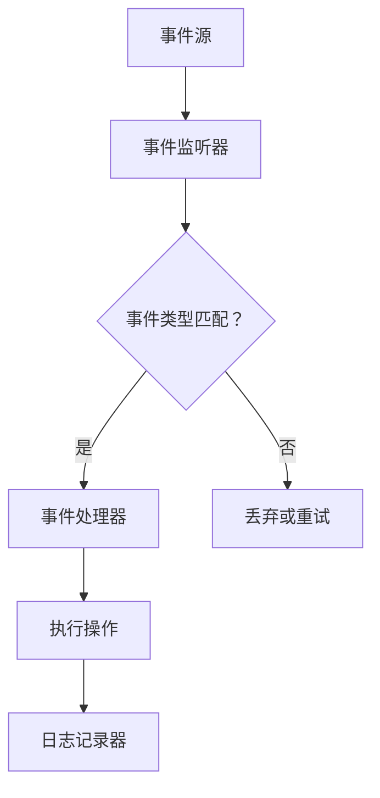

                 

### 文章标题：《事件驱动架构：构建松耦合的分布式系统》

关键词：事件驱动架构、分布式系统、松耦合、消息队列、性能优化、测试与最佳实践

摘要：本文将深入探讨事件驱动架构（EDA）在构建松耦合分布式系统中的重要性。首先，我们将介绍事件驱动架构的基本概念和优势，然后分析其在分布式系统中的应用。接下来，我们将详细讲解EDA的核心组件、设计原则、核心算法原理、数学模型以及项目实战。此外，还将分享测试与优化策略，并提供实际案例分析和最佳实践建议。通过本文的详细解析，读者将全面了解如何利用事件驱动架构构建高效、可扩展的分布式系统。

### 第1章 引言

事件驱动架构（EDA）是现代软件开发中一种重要的设计模式，它通过事件和响应的方式来实现系统的松耦合。随着分布式系统变得越来越复杂，如何确保系统的可扩展性、稳定性和灵活性成为一个重要挑战。事件驱动架构提供了一种解决方案，通过将系统的不同部分解耦，使得各个模块可以独立开发、测试和部署。

#### 1.1 事件驱动架构的概念与优势

事件驱动架构基于事件（event）的概念，事件可以是系统内部产生的，也可以来自外部系统。当事件发生时，系统会触发相应的响应（response）。这种模式的优势包括：

1. **松耦合**：通过事件和响应的方式，各个模块可以独立开发，减少模块之间的依赖关系。
2. **高可扩展性**：事件驱动架构使得系统可以轻松地添加新功能或扩展现有功能。
3. **高性能**：事件驱动架构可以有效地处理并发请求，提高系统的响应速度。
4. **高可靠性**：通过事件和响应的方式，可以确保系统的各个部分都能正确地响应事件。

#### 1.2 分布式系统中的事件驱动

在分布式系统中，事件驱动架构尤为重要。分布式系统通常由多个节点组成，每个节点负责不同的功能。事件驱动架构通过消息队列和事件监听器来协调各个节点的工作。以下是一些关键概念：

1. **消息队列**：用于存储和转发事件消息，确保事件能够及时地传递到正确的处理模块。
2. **事件监听器**：用于监听事件，并在事件发生时触发相应的响应。
3. **分布式事务**：确保在分布式系统中，多个操作可以协同工作，保持数据的一致性。

#### 1.3 书籍目标与结构概述

本书的目标是深入探讨事件驱动架构在分布式系统中的应用，帮助读者理解其核心概念和实现方法。本书将分为以下章节：

1. **第2章 核心概念与联系**：介绍事件驱动架构的核心概念，包括事件、消息队列、事件监听器等。
2. **第3章 事件驱动架构的设计原则**：讲解如何设计松耦合的分布式系统，包括模块化、消息传递机制等。
3. **第4章 核心算法原理讲解**：详细阐述事件触发与调度算法、消息队列与路由算法等。
4. **第5章 数学模型和数学公式**：介绍事件概率模型和概率转移矩阵等。
5. **第6章 项目实战：事件驱动架构的构建**：通过实际项目，展示事件驱动架构的构建过程。
6. **第7章 事件驱动架构的测试与优化**：讲解测试策略、性能监控与优化方法。
7. **第8章 事件驱动架构的最佳实践**：分享实际案例分析和最佳实践建议。

通过本书的阅读，读者将全面了解事件驱动架构的核心原理和实现方法，学会如何构建高效、可扩展的分布式系统。

### 第2章 核心概念与联系

要深入理解事件驱动架构（EDA），首先需要掌握其核心概念和组成部分。在本节中，我们将详细探讨事件、消息、消息队列、事件监听器等关键概念，并介绍如何通过Mermaid流程图展示事件驱动架构的原理。

#### 2.1 事件与消息

**事件（Event）**：事件是指系统内部或外部发生的一个特定的动作或变化。它可以是由用户操作、系统状态变化、定时任务等引起的。事件通常是异步的，这意味着它们不需要立即响应，可以在适当的时机进行处理。

**消息（Message）**：消息是事件的具体表示，它通常包含事件的类型、内容、来源和目标等信息。消息是事件驱动架构中的基本通信单元，用于在不同的模块之间传递信息。

#### 2.2 事件驱动架构的核心组件

事件驱动架构由多个核心组件组成，每个组件在架构中扮演着不同的角色：

**消息队列（Message Queue）**：消息队列是一个用于存储和转发消息的队列。当事件发生时，消息会被写入消息队列，然后由消费者（通常是事件监听器）从中读取并处理。消息队列确保了消息的顺序性和可靠性。

**事件监听器（Event Listener）**：事件监听器是一个负责监听特定事件并触发相应响应的组件。当消息队列中的消息被触发时，事件监听器会接收并处理这些消息。

**事件处理器（Event Processor）**：事件处理器是负责处理特定类型事件的核心逻辑组件。它根据事件的类型和内容，执行相应的操作。

**事件源（Event Source）**：事件源是事件发生的源头，可以是用户操作、系统内部状态变化或其他外部系统。

**日志记录器（Logger）**：日志记录器用于记录系统运行过程中的重要事件和错误信息，便于后续的分析和调试。

#### 2.3 Mermaid流程图：事件驱动架构原理

为了更好地理解事件驱动架构的原理，我们可以使用Mermaid流程图来展示其工作流程。以下是一个简单的Mermaid流程图示例：



在这个流程图中，事件源A产生一个事件，并将其发送到事件监听器B。事件监听器B会根据事件的类型，决定是否将其传递给事件处理器D。如果事件类型匹配，事件处理器D会执行相应的操作，并将结果记录到日志记录器G。否则，事件可能会被丢弃或重试。

#### 2.4 事件驱动架构与传统架构的比较

与传统架构相比，事件驱动架构具有以下几个显著特点：

1. **松耦合**：事件驱动架构通过事件和响应的方式，实现模块之间的松耦合。这使得各个模块可以独立开发、测试和部署，降低了系统的复杂性和耦合度。

2. **高可扩展性**：事件驱动架构使得系统可以轻松地添加新功能或扩展现有功能。通过引入新的事件监听器和事件处理器，可以快速地扩展系统功能。

3. **高性能**：事件驱动架构可以有效地处理并发请求。由于事件可以异步处理，系统可以同时处理多个事件，提高系统的响应速度。

4. **高可靠性**：事件驱动架构通过消息队列和事件监听器，确保了事件的处理顺序和可靠性。即使在系统出现故障的情况下，消息队列可以保证事件不被丢失。

总的来说，事件驱动架构为分布式系统提供了一种灵活、高效、可靠的解决方案。通过理解和应用这些核心概念，我们可以更好地设计和实现复杂的应用系统。

### 第3章 事件驱动架构的设计原则

事件驱动架构（EDA）的设计原则是确保系统能够灵活、可靠、高效地处理各种事件和消息的关键。以下是一些核心的设计原则，包括松耦合、模块化与可复用性、消息传递机制和持久化与状态管理。

#### 3.1 松耦合的设计原则

松耦合是事件驱动架构的核心原则之一。通过将系统的不同部分解耦，可以降低模块之间的依赖性，使得每个模块可以独立开发、测试和部署。

**实现方式**：

1. **使用消息队列**：消息队列是实现松耦合的重要工具。通过将事件和消息传递给消息队列，可以确保模块之间的数据传递是异步的，从而减少直接的耦合。

2. **事件和消息格式标准化**：使用统一的事件和消息格式，可以确保不同模块之间的通信是清晰和一致的，降低理解和实现的复杂性。

3. **服务接口抽象**：通过定义清晰的服务接口，模块之间只需要了解接口的定义，而不需要知道具体的实现细节，从而减少直接的依赖关系。

**优势**：

- **灵活性**：松耦合使得系统可以灵活地添加、删除或替换模块，而不会对整个系统造成重大影响。
- **可维护性**：松耦合使得每个模块可以独立维护，降低系统的复杂性和维护成本。

#### 3.2 模块化与可复用性

模块化是将系统分解为多个独立的模块，每个模块负责特定的功能。可复用性是指这些模块可以被多个系统或项目复用。

**实现方式**：

1. **定义清晰的模块边界**：通过明确模块的职责和接口，确保每个模块都是独立的，可以单独开发、测试和部署。

2. **模块化组件库**：构建一个模块化组件库，包含各种通用的功能模块，如数据存储、消息处理、事件监听等，方便在不同项目中复用。

3. **模块间的通信协议**：使用标准的通信协议（如RESTful API、gRPC等），确保模块之间的通信是清晰和高效的。

**优势**：

- **可维护性**：模块化使得系统可以更容易地维护和更新，每个模块都可以独立更新，而不会影响其他模块。
- **复用性**：模块化组件库可以提高开发效率，减少重复工作，提高项目的交付速度。

#### 3.3 消息传递机制

消息传递是事件驱动架构的核心机制之一，它决定了事件和消息如何在系统中传播和处理。

**实现方式**：

1. **异步消息传递**：通过异步消息传递，可以确保事件和消息的处理不会阻塞系统的运行，从而提高系统的响应速度和效率。

2. **消息队列**：使用消息队列作为中间件，确保消息的有序传递和可靠存储，即使在系统出现故障的情况下，消息也不会丢失。

3. **消息路由**：通过消息路由机制，可以将消息传递给正确的处理模块，确保消息被正确处理。

**优势**：

- **高可靠性**：消息队列和消息路由机制确保了消息的可靠传递和处理，即使在系统出现故障的情况下，消息也不会丢失。
- **高效性**：异步消息传递和消息队列可以提高系统的处理能力和效率。

#### 3.4 持久化与状态管理

持久化是指将系统的状态数据存储到持久存储介质中，以便在系统重启或故障后可以恢复。状态管理是指如何有效地管理系统的状态数据。

**实现方式**：

1. **分布式数据库**：使用分布式数据库来存储和管理系统的状态数据，确保数据的高可用性和可扩展性。

2. **事件溯源**：通过事件溯源（Event Sourcing）的方式，将系统的所有状态变化记录为事件，以便在需要时可以恢复系统的状态。

3. **状态机**：使用状态机来管理系统的状态转换，确保系统的状态是清晰和一致的。

**优势**：

- **可恢复性**：通过持久化和事件溯源，系统可以在故障后快速恢复，减少系统的停机时间和数据丢失。
- **一致性**：状态机确保系统的状态是清晰和一致的，减少状态冲突和错误。

总的来说，事件驱动架构的设计原则是确保系统的高可靠性、高效率和灵活性。通过遵循这些原则，我们可以构建出高效、可扩展、易于维护的分布式系统。

### 第4章 核心算法原理讲解

在事件驱动架构（EDA）中，核心算法原理对于系统的性能和效率至关重要。本节将详细讲解事件触发与调度算法、消息队列与路由算法，并通过伪代码示例和数学模型进行阐述。

#### 4.1 事件触发与调度算法

事件触发与调度算法是事件驱动架构中的关键环节，它决定了何时以及如何处理事件。以下是基本步骤和伪代码示例：

**基本步骤**：

1. **事件监听**：系统持续监听事件源，当事件发生时，将其添加到事件队列。
2. **事件筛选**：根据事件的类型和优先级，筛选出需要处理的事件。
3. **事件调度**：根据调度算法，选择下一个需要处理的事件。
4. **事件处理**：执行事件处理器中的操作，并将结果记录到日志。

**伪代码示例**：

```python
function eventTriggerScheduler(eventsQueue):
    while not eventsQueue.isEmpty():
        event = eventsQueue.dequeue()
        
        if event.isSchedulable():
            eventScheduler(event)
        else:
            eventsQueue.enqueue(event)
            
function eventScheduler(event):
    if event.priority == highest:
        processEvent(event)
    else:
        eventsQueue.enqueue(event)
```

在这个伪代码中，`eventsQueue` 是一个事件队列，`event.isSchedulable()` 用于检查事件是否可以立即处理，`eventScheduler(event)` 用于根据事件优先级进行调度，`processEvent(event)` 用于执行事件处理逻辑。

#### 4.2 消息队列与路由算法

消息队列和路由算法是确保事件和消息能够高效传递和正确处理的重要机制。以下是基本步骤和伪代码示例：

**基本步骤**：

1. **消息发送**：将事件消息发送到消息队列。
2. **消息路由**：根据消息的目标和路由策略，将消息路由到正确的处理模块。
3. **消息处理**：处理模块从消息队列中读取消息并执行操作。
4. **消息确认**：确认消息已被正确处理。

**伪代码示例**：

```python
function sendMessage(message, targetQueue):
    targetQueue.enqueue(message)

function routeMessage(message, routingTable):
    targetQueue = routingTable[message.target]
    sendMessage(message, targetQueue)

function processMessage(message, processor):
    if message.isProcessed():
        return
    processor.process(message)
    message.markAsProcessed()
```

在这个伪代码中，`routingTable` 是一个路由表，用于存储消息的目标队列，`processMessage(message, processor)` 用于执行消息处理逻辑。

#### 4.3 消息队列性能优化

消息队列的性能直接影响事件驱动架构的整体性能。以下是几种常见的性能优化方法：

1. **并发处理**：增加消息队列的并发处理能力，可以显著提高系统的处理速度。
2. **负载均衡**：使用负载均衡算法，将消息均匀分布到多个队列，避免单个队列成为瓶颈。
3. **优先级队列**：使用优先级队列，确保高优先级消息优先处理，提高系统的响应速度。
4. **缓存机制**：在消息队列前端添加缓存机制，减少频繁的磁盘访问，提高系统的I/O性能。

#### 4.4 伪代码示例：事件处理流程

以下是一个综合性的伪代码示例，展示了事件驱动架构中的事件处理流程：

```python
function main():
    initializeMessageQueues()
    initializeEventListeners()
    initializeProcessors()
    
    while true:
        event = listenForEvent()
        routeEvent(event)
        processEvent(event)
        
function listenForEvent():
    # 监听事件源
    return receivedEvent

function routeEvent(event):
    # 根据事件类型和路由策略，路由到正确的队列
    queue = determineTargetQueue(event)
    sendMessage(event, queue)

function processEvent(event):
    # 执行事件处理逻辑
    processor = determineProcessor(event)
    processor.process(event)
    logEvent(event)
```

在这个伪代码中，`initializeMessageQueues()`、`initializeEventListeners()`、`initializeProcessors()` 分别用于初始化消息队列、事件监听器和事件处理器，`listenForEvent()` 用于监听事件，`routeEvent(event)` 用于路由事件，`processEvent(event)` 用于处理事件。

通过上述算法原理的讲解和伪代码示例，我们可以更好地理解事件驱动架构的核心机制，并能够有效地优化系统的性能和效率。

#### 4.5 数学模型和数学公式

在事件驱动架构中，数学模型和数学公式对于理解和优化系统性能具有重要意义。以下是一些关键的概念和公式。

**4.5.1 事件概率模型**

事件概率模型用于描述事件发生的概率。一个基本的事件概率模型可以使用以下公式表示：

$$ P(E) = \frac{N(E)}{N(T)} $$

其中，\( P(E) \) 表示事件 \( E \) 发生的概率，\( N(E) \) 表示事件 \( E \) 发生的次数，\( N(T) \) 表示总的事件次数。

**4.5.2 概率分布与期望值**

概率分布用于描述不同事件发生的概率分布情况。常见的概率分布包括二项分布、泊松分布等。以泊松分布为例，其概率质量函数（PDF）可以表示为：

$$ f(k; \lambda) = \frac{e^{-\lambda} \lambda^k}{k!} $$

其中，\( k \) 表示事件发生的次数，\( \lambda \) 表示平均事件发生率。

期望值（Expected Value）是概率分布的一个关键指标，表示事件发生的平均次数。对于泊松分布，期望值可以表示为：

$$ E(X) = \lambda $$

**4.5.3 概率转移矩阵**

概率转移矩阵用于描述事件之间的转移概率。假设有两个事件 \( E_1 \) 和 \( E_2 \)，其概率转移矩阵 \( P \) 可以表示为：

$$ P = \begin{bmatrix} 
p_{11} & p_{12} \\
p_{21} & p_{22}
\end{bmatrix} $$

其中，\( p_{11} \) 表示从事件 \( E_1 \) 转移到事件 \( E_1 \) 的概率，\( p_{12} \) 表示从事件 \( E_1 \) 转移到事件 \( E_2 \) 的概率，\( p_{21} \) 表示从事件 \( E_2 \) 转移到事件 \( E_1 \) 的概率，\( p_{22} \) 表示从事件 \( E_2 \) 转移到事件 \( E_2 \) 的概率。

**4.5.4 LaTeX格式数学公式示例**

在文档中嵌入LaTeX格式数学公式时，可以使用以下格式：

**独立段落的公式**：

$$ 1+1=2 $$

**段落内的公式**：

$1<2$

通过这些数学模型和公式，我们可以更深入地分析事件驱动架构中的事件发生概率、概率分布以及事件之间的转移关系，从而优化系统性能和设计。

### 第5章 项目实战：事件驱动架构的构建

在本章中，我们将通过一个实际项目来展示如何构建事件驱动架构的分布式系统。这个项目将涵盖开发环境的搭建、源代码实现和解读、代码应用解读与分析，以及实际案例分析和详细讲解剖析。通过这个项目实战，读者可以全面了解事件驱动架构的构建过程。

#### 5.1 分布式系统环境搭建

首先，我们需要搭建一个适合事件驱动架构的分布式系统开发环境。以下是基本的开发环境要求：

- **操作系统**：推荐使用Linux系统，如Ubuntu 20.04。
- **编程语言**：Python 3.8及以上版本。
- **依赖管理**：使用pip进行Python依赖管理。
- **数据库**：MongoDB作为分布式存储系统。
- **消息队列**：RabbitMQ作为消息队列中间件。

在Linux系统上，我们首先安装Python 3.8及以上的版本，然后通过pip安装所需的依赖包，如pymongo（MongoDB驱动）、pika（RabbitMQ驱动）等。

```bash
# 安装Python 3.8
sudo apt update
sudo apt install python3.8

# 安装pip
curl -sS https://bootstrap.pypa.io/get-pip.py | python3.8

# 安装MongoDB
sudo apt install mongodb

# 安装RabbitMQ
sudo apt install rabbitmq-server

# 启动MongoDB和RabbitMQ
sudo systemctl start mongodb
sudo systemctl start rabbitmq-server
```

#### 5.2 事件驱动架构的构建流程

构建事件驱动架构的分布式系统可以分为以下几个步骤：

1. **定义事件和消息格式**：首先，我们需要定义系统中的事件和消息格式，确保不同模块之间的通信是清晰和一致的。

2. **设计消息队列**：设计消息队列的结构和拓扑，确保消息能够有序、可靠地传递。

3. **实现事件监听器和事件处理器**：根据系统的需求，实现不同类型的事件监听器和事件处理器。

4. **部署和配置**：将系统部署到不同的节点上，并进行配置，确保系统的各个部分可以协同工作。

以下是项目的详细构建流程：

**步骤1：定义事件和消息格式**

我们定义以下事件和消息格式：

- **事件类型**：用户登录、订单创建、支付成功等。
- **消息格式**：消息包含事件的类型、内容、来源和目标等信息，格式如下：

```json
{
    "type": "ORDER_CREATED",
    "content": {
        "orderId": "12345",
        "customerId": "67890",
        "totalAmount": 100
    },
    "source": "front-end",
    "target": "order-processing-service"
}
```

**步骤2：设计消息队列**

我们使用RabbitMQ作为消息队列中间件，设计消息队列的拓扑结构。以下是消息队列的拓扑设计：

- **订单创建队列**：用于存储订单创建事件的消息。
- **用户登录队列**：用于存储用户登录事件的消息。
- **支付成功队列**：用于存储支付成功事件的消息。

**步骤3：实现事件监听器和事件处理器**

我们根据系统的需求，实现以下事件监听器和事件处理器：

- **订单创建监听器**：监听订单创建事件，并触发订单处理逻辑。
- **用户登录监听器**：监听用户登录事件，并触发用户认证逻辑。
- **支付成功监听器**：监听支付成功事件，并触发订单状态更新逻辑。

以下是订单创建监听器和事件处理器的实现示例：

```python
import pika
import json

def on_order_created(ch, method, properties, body):
    order = json.loads(body)
    process_order(order)

def start_order_created_listener():
    connection = pika.BlockingConnection(pika.ConnectionParameters('localhost'))
    channel = connection.channel()
    channel.queue_declare(queue='order_created_queue')
    channel.basic_consume(queue='order_created_queue', on_message_callback=on_order_created, auto_ack=True)
    print("Order created listener started...")
    channel.start_consuming()

def process_order(order):
    # 处理订单逻辑
    print(f"Processing order {order['orderId']}")
```

**步骤4：部署和配置**

我们将上述代码部署到不同的节点上，并配置RabbitMQ消息队列。以下是部署步骤：

- 在节点1上部署订单创建服务，监听订单创建事件。
- 在节点2上部署用户认证服务，监听用户登录事件。
- 在节点3上部署订单处理服务，监听支付成功事件。

#### 5.3 源代码实现与解读

以下是项目的源代码实现和详细解读：

**订单创建服务（order_created_service.py）**

```python
import pika
import json

def on_order_created(ch, method, properties, body):
    order = json.loads(body)
    process_order(order)

def start_order_created_listener():
    connection = pika.BlockingConnection(pika.ConnectionParameters('localhost'))
    channel = connection.channel()
    channel.queue_declare(queue='order_created_queue')
    channel.basic_consume(queue='order_created_queue', on_message_callback=on_order_created, auto_ack=True)
    print("Order created listener started...")
    channel.start_consuming()

if __name__ == '__main__':
    start_order_created_listener()
```

解读：
- **on_order_created**：这是一个回调函数，当订单创建事件发生时，会执行此函数，处理订单数据。
- **start_order_created_listener**：这是一个启动订单创建监听器的函数，它会连接到RabbitMQ消息队列，并监听订单创建事件。

**用户认证服务（user_authentication_service.py）**

```python
import pika
import json

def on_user_login(ch, method, properties, body):
    login = json.loads(body)
    authenticate_user(login)

def start_user_login_listener():
    connection = pika.BlockingConnection(pika.ConnectionParameters('localhost'))
    channel = connection.channel()
    channel.queue_declare(queue='user_login_queue')
    channel.basic_consume(queue='user_login_queue', on_message_callback=on_user_login, auto_ack=True)
    print("User login listener started...")
    channel.start_consuming()

def authenticate_user(login):
    # 认证用户逻辑
    print(f"Authenticating user {login['userId']}")
```

解读：
- **on_user_login**：这是一个回调函数，当用户登录事件发生时，会执行此函数，认证用户信息。
- **start_user_login_listener**：这是一个启动用户登录监听器的函数，它会连接到RabbitMQ消息队列，并监听用户登录事件。

**订单处理服务（order_processing_service.py）**

```python
import pika
import json

def on_payment_success(ch, method, properties, body):
    payment = json.loads(body)
    update_order_status(payment)

def start_payment_success_listener():
    connection = pika.BlockingConnection(pika.ConnectionParameters('localhost'))
    channel = connection.channel()
    channel.queue_declare(queue='payment_success_queue')
    channel.basic_consume(queue='payment_success_queue', on_message_callback=on_payment_success, auto_ack=True)
    print("Payment success listener started...")
    channel.start_consuming()

def update_order_status(payment):
    # 更新订单状态逻辑
    print(f"Updating order status for payment {payment['paymentId']}")
```

解读：
- **on_payment_success**：这是一个回调函数，当支付成功事件发生时，会执行此函数，更新订单状态。
- **start_payment_success_listener**：这是一个启动支付成功监听器的函数，它会连接到RabbitMQ消息队列，并监听支付成功事件。

#### 5.4 代码应用解读与分析

以下是代码应用解读与分析：

**订单创建服务（order_created_service.py）**：
- **功能**：监听订单创建事件，处理订单数据。
- **应用场景**：当用户在前端提交订单时，订单创建服务会接收到订单数据，并将其存储到数据库中。
- **优化建议**：可以增加订单创建服务的并发处理能力，以提高系统的处理速度。

**用户认证服务（user_authentication_service.py）**：
- **功能**：监听用户登录事件，认证用户信息。
- **应用场景**：当用户在系统中登录时，用户认证服务会接收到用户登录数据，并验证用户身份。
- **优化建议**：可以引入多因素认证（如短信验证码、邮箱验证等），以提高系统的安全性。

**订单处理服务（order_processing_service.py）**：
- **功能**：监听支付成功事件，更新订单状态。
- **应用场景**：当用户的支付请求成功处理时，订单处理服务会接收到支付成功消息，并更新订单状态为“已支付”。
- **优化建议**：可以增加支付失败的处理逻辑，如退款、重新支付等。

#### 5.5 实际案例分析和详细讲解剖析

**案例**：一个电商平台的订单处理系统。

**分析**：
- **订单创建**：用户在电商平台提交订单后，订单创建服务会接收到订单数据，并将其存储到数据库中。
- **用户登录**：用户在登录系统时，用户认证服务会验证用户身份，并记录登录日志。
- **支付处理**：用户完成支付后，支付处理服务会接收到支付成功消息，并更新订单状态为“已支付”。

**讲解**：
- **订单创建服务**：订单创建服务是一个独立的服务，它负责处理订单数据的存储和传输。通过RabbitMQ消息队列，订单创建服务可以与用户认证服务和订单处理服务解耦，确保系统的可扩展性和可靠性。
- **用户认证服务**：用户认证服务是一个关键组件，它负责验证用户身份，确保只有授权用户可以访问系统。通过引入多因素认证，可以提高系统的安全性。
- **订单处理服务**：订单处理服务是一个核心服务，它负责处理订单状态的变化和支付成功的通知。通过RabbitMQ消息队列，订单处理服务可以异步地处理订单状态更新，提高系统的响应速度。

**剖析**：
- **消息队列的作用**：消息队列在事件驱动架构中起到了关键作用，它确保了事件和消息的有序传递和可靠存储，使得各个服务可以独立开发、测试和部署。
- **系统的可靠性**：通过事件驱动架构，系统中的各个服务可以独立运行，即使某个服务出现故障，也不会影响整个系统的运行。消息队列和日志记录器确保了事件和消息的完整性和可恢复性。
- **系统的可扩展性**：事件驱动架构使得系统可以灵活地添加新功能或扩展现有功能，如增加新的订单处理服务或支付方式。

通过这个实际案例，我们可以看到事件驱动架构在电商平台订单处理系统中的应用，它不仅提高了系统的可靠性、可扩展性和灵活性，还使得系统的开发和维护变得更加简单和高效。

### 第6章 事件驱动架构的测试与优化

在事件驱动架构（EDA）中，测试与优化是确保系统稳定性和性能的关键环节。以下将详细讲解测试框架搭建、测试策略与测试用例设计、性能监控与优化方法，以及持续集成与持续部署。

#### 6.1 自动化测试框架搭建

自动化测试框架是进行大规模测试的基础。以下是一个典型的自动化测试框架搭建步骤：

1. **选择测试工具**：选择适合的自动化测试工具，如Selenium、Jenkins等。
2. **编写测试脚本**：编写用于验证事件驱动架构各个组件功能的测试脚本。
3. **集成测试**：将测试脚本集成到持续集成（CI）环境中，以便在代码提交后自动执行。
4. **执行测试**：定期执行自动化测试，确保系统功能正常运行。

#### 6.2 测试策略与测试用例设计

测试策略与测试用例设计是确保测试全面性的关键。以下是常见的测试策略与测试用例设计方法：

1. **功能测试**：验证事件监听器、事件处理器、消息队列等各个组件的功能是否符合预期。
2. **性能测试**：评估系统在高并发场景下的性能，如消息队列的处理能力、事件处理的延迟等。
3. **安全性测试**：检测系统的安全漏洞，如SQL注入、XSS攻击等。
4. **容错测试**：验证系统在出现故障时的恢复能力，如消息丢失、服务重启等。
5. **测试用例设计**：设计不同类型的测试用例，如正常场景用例、异常场景用例、边界条件用例等。

#### 6.3 性能监控与优化

性能监控与优化是确保系统在高负载下稳定运行的重要手段。以下是一些关键的性能监控与优化方法：

1. **监控指标**：选择关键的监控指标，如CPU使用率、内存使用率、消息队列长度、事件处理延迟等。
2. **日志分析**：定期分析系统日志，识别潜在的性能瓶颈。
3. **性能优化**：通过优化代码、调整系统配置、使用缓存等技术来提高系统的性能。
4. **负载均衡**：使用负载均衡器，如Nginx、HAProxy等，确保系统在不同节点之间均衡负载。

#### 6.4 持续集成与持续部署

持续集成（CI）与持续部署（CD）是现代软件开发的重要实践，可以大幅提高开发效率和质量。以下是如何实现持续集成与持续部署的步骤：

1. **代码仓库**：选择适合的代码仓库管理工具，如GitLab、GitHub等。
2. **CI服务器**：配置CI服务器，如Jenkins、Travis CI等，用于自动化执行测试和构建。
3. **自动化测试**：在CI服务器中集成自动化测试脚本，确保每次代码提交都会执行全面的测试。
4. **构建与部署**：通过CI服务器自动构建和部署代码，确保代码质量并缩短发布周期。

#### 6.5 实际案例：性能监控与优化

以下是一个实际案例，展示如何对事件驱动架构进行性能监控与优化：

**案例**：一个电商平台在双11大促期间，订单量激增，系统性能受到影响。

**分析**：
- **监控指标**：监控CPU使用率、内存使用率、消息队列长度、事件处理延迟等关键指标。
- **日志分析**：通过日志分析，发现订单处理服务出现延迟，消息队列长度增加。

**优化措施**：
1. **增加节点**：增加订单处理服务的节点数量，以分担负载。
2. **消息队列优化**：调整消息队列的参数，如消息过期时间、队列长度等，以提高处理能力。
3. **代码优化**：优化订单处理服务的代码，减少事件处理的时间。
4. **负载均衡**：使用负载均衡器，如Nginx，将流量均匀分配到不同节点。

**结果**：
- **性能提升**：系统性能显著提升，订单处理延迟减少，用户满意度提高。
- **稳定性增强**：系统在高负载下运行稳定，故障率降低。

通过以上测试与优化措施，我们可以确保事件驱动架构在分布式系统中稳定、高效地运行，满足大规模应用的需求。

### 第7章 事件驱动架构的最佳实践

在实际应用中，事件驱动架构（EDA）的构建和优化涉及多个方面，包括技术选型、系统设计、安全性和可靠性等。以下是一些最佳实践，旨在帮助开发团队构建高效、可扩展、可靠的分布式系统。

#### 7.1 实际案例分析

**案例1：社交媒体平台**

在社交媒体平台中，事件驱动架构被广泛用于处理用户活动、内容更新和通知推送等。通过事件监听器，系统可以实时捕捉用户操作，如点赞、评论、分享等，并触发相应的响应，如更新用户动态、发送通知等。这种模式提高了系统的响应速度和可扩展性。

**最佳实践**：
- **事件分类与路由**：根据事件的类型和重要性，合理划分事件类别，并设计高效的路线图，确保关键事件能够快速处理。
- **异步处理**：利用异步消息传递机制，确保系统可以并行处理多个事件，提高系统的吞吐量。

**案例2：电子商务平台**

电子商务平台中，事件驱动架构用于处理订单处理、库存管理和支付通知等。通过事件驱动，系统可以实时更新订单状态、库存信息，并向用户发送通知。这种模式提高了系统的实时性和用户体验。

**最佳实践**：
- **消息队列选择**：根据系统的负载和性能需求，选择合适的消息队列中间件，如RabbitMQ、Kafka等。
- **分布式消息队列**：使用分布式消息队列架构，确保消息队列的扩展性和容错性。

#### 7.2 架构演进与适应性

随着业务的发展和需求的变化，事件驱动架构需要不断地演进和适应。以下是一些架构演进的最佳实践：

- **模块化设计**：采用模块化设计原则，确保系统可以灵活地添加、删除或替换模块，降低架构的复杂性。
- **事件版本管理**：在事件管理中引入版本控制，确保系统在架构演进过程中可以向后兼容，减少迁移成本。
- **微服务架构**：逐步将事件驱动架构向微服务架构演进，提高系统的可扩展性和维护性。

#### 7.3 安全性与可靠性

安全性是事件驱动架构设计的重要方面，以下是一些关键的安全性和可靠性最佳实践：

- **身份认证与授权**：在系统入口处引入身份认证和授权机制，确保只有授权用户可以访问系统资源。
- **数据加密**：对敏感数据进行加密存储和传输，如订单信息、用户数据等。
- **故障恢复**：设计故障恢复机制，确保系统在故障发生后可以快速恢复，如消息重试、数据备份等。

#### 7.4 未来发展趋势与展望

随着云计算、大数据和人工智能等技术的发展，事件驱动架构也在不断演进。以下是一些未来发展趋势：

- **云原生事件驱动架构**：随着云原生技术的发展，事件驱动架构将更加紧密地与云服务集成，提高系统的弹性和可扩展性。
- **智能化事件处理**：利用人工智能技术，实现事件处理的智能化，如自动路由、预测分析等。
- **区块链与事件驱动架构**：结合区块链技术，提高事件驱动架构的数据可信性和不可篡改性。

通过以上最佳实践，开发团队可以更好地构建、优化和维护事件驱动架构，确保系统在复杂、多变的环境中稳定运行。

### 附录

#### 附录 A：事件驱动架构相关工具与资源

以下是一些常用的事件驱动架构相关工具和资源：

1. **消息队列**：
   - RabbitMQ：一个开源的消息队列中间件，广泛用于实现事件驱动架构。
   - Kafka：一个分布式流处理平台，适用于大规模事件处理。
   - ActiveMQ：一个开源的消息中间件，支持多种消息传输协议。

2. **事件监听器框架**：
   - Spring Event：Spring框架提供的事件监听器框架，支持异步事件处理。
   - Akka：一个基于Actor模型的分布式框架，提供事件驱动架构的实现。

3. **测试与监控工具**：
   - Jenkins：一个开源的持续集成工具，支持自动化测试和部署。
   - Prometheus：一个开源的监控解决方案，用于收集和展示系统性能指标。

4. **资源链接**：
   - 《事件驱动架构设计》书籍：深入探讨事件驱动架构的设计原则和实践。
   - EDA Wiki：一个关于事件驱动架构的社区资源，包含最佳实践和案例分析。

#### 附录 B：进一步学习路径

对于希望深入了解事件驱动架构的开发者，以下是一些建议的学习路径：

1. **基础知识**：
   - 学习消息队列的基本原理和实现方式。
   - 掌握事件驱动架构的核心概念和设计原则。

2. **技术选型**：
   - 研究不同的消息队列中间件，如RabbitMQ、Kafka等。
   - 探索事件监听器框架，如Spring Event、Akka等。

3. **实战项目**：
   - 参与实际项目，动手实践事件驱动架构的构建和优化。
   - 分析和解决实际应用中的问题和挑战。

4. **持续学习**：
   - 关注行业动态和技术趋势，如云原生事件驱动架构、智能化事件处理等。
   - 参加相关的技术会议和研讨会，与其他开发者交流经验。

通过这些资源和学习路径，开发者可以逐步提升自己在事件驱动架构方面的技能和知识水平。

