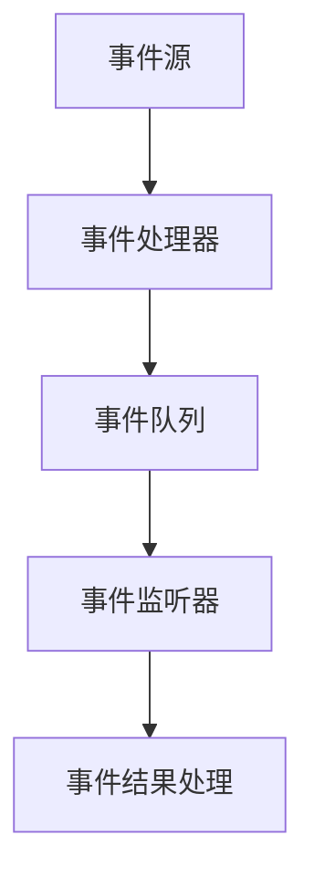
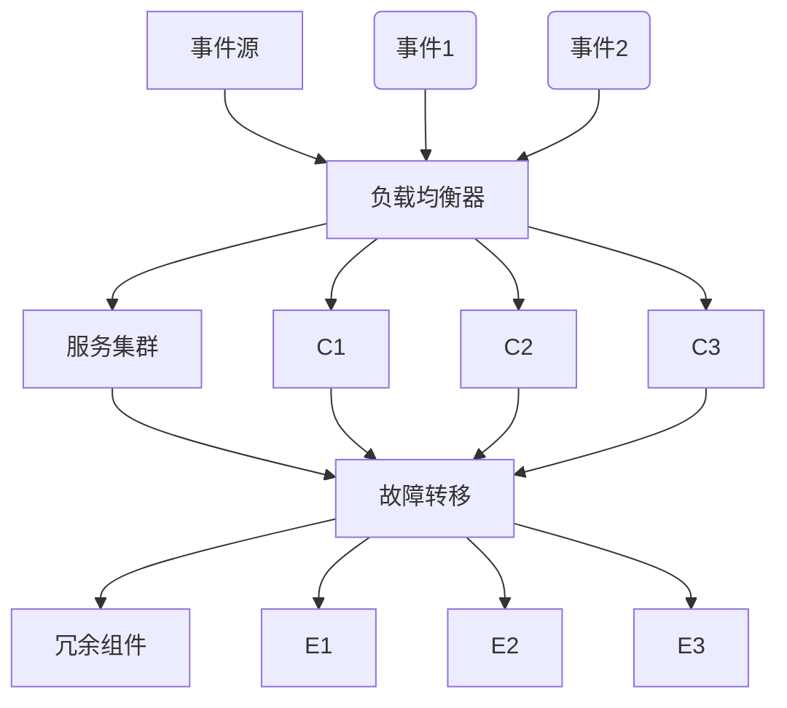
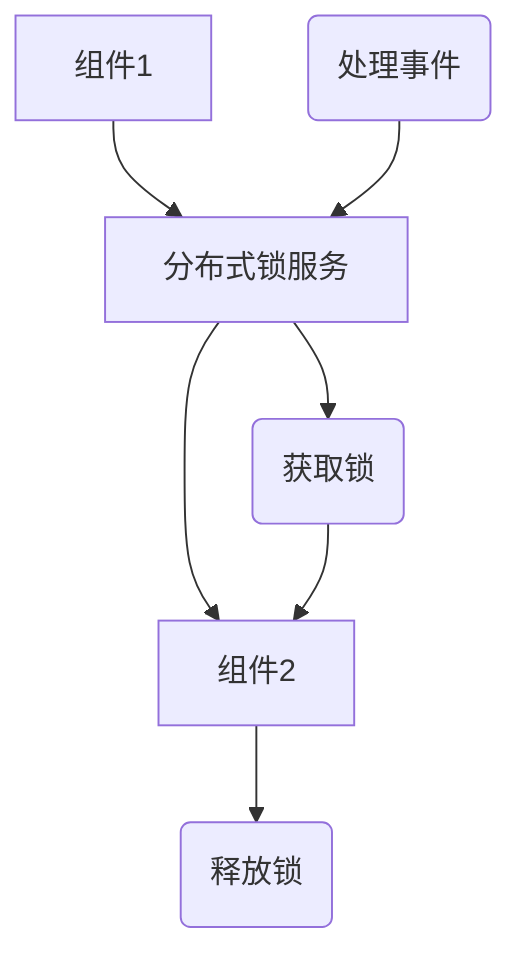
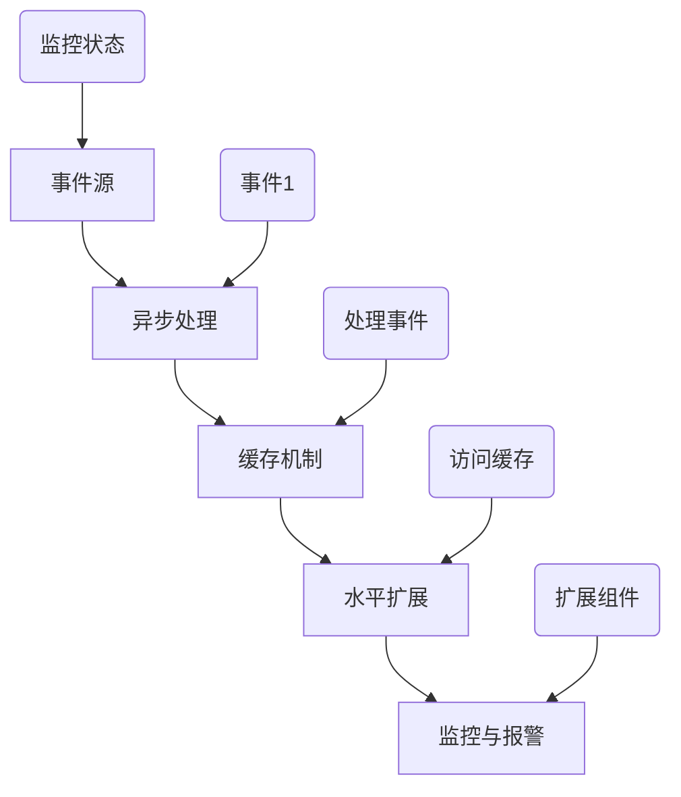
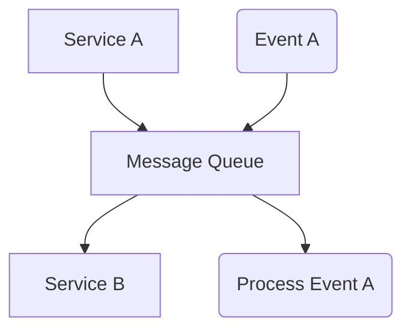
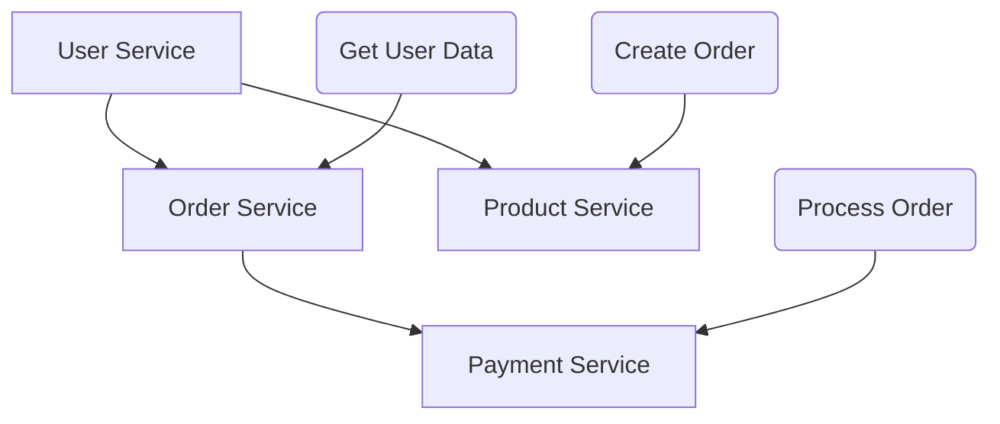
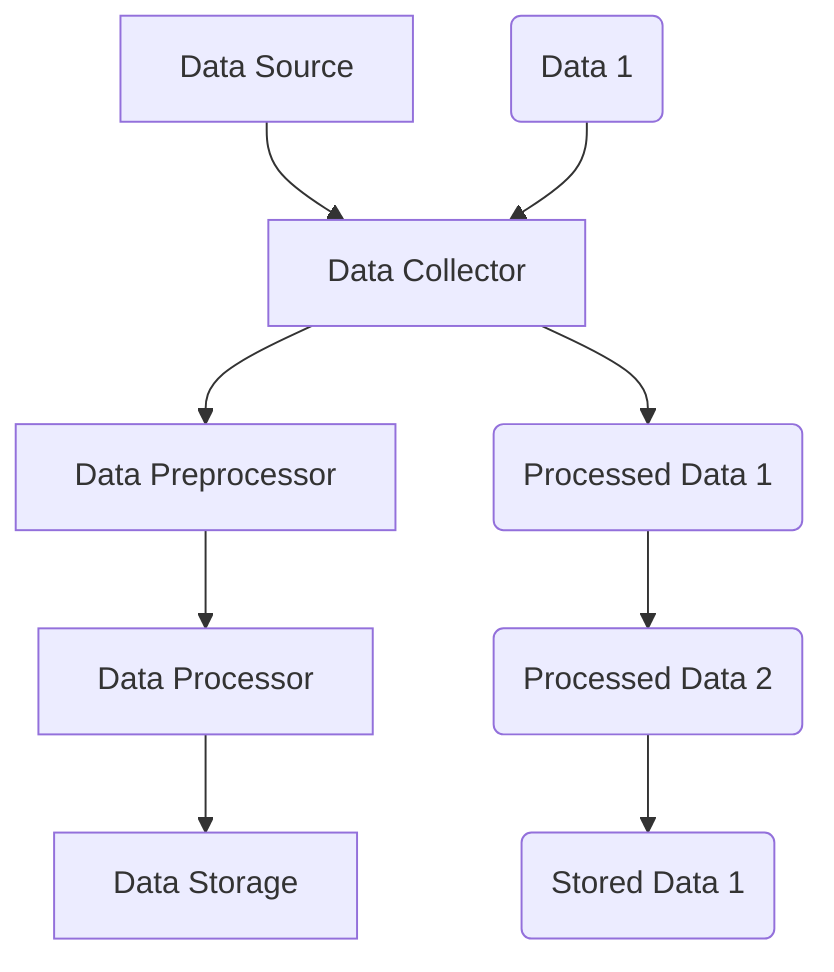

                 

### 第1章：事件驱动架构概述

#### 1.1 背景介绍

在分布式系统中，随着系统规模的不断扩大和复杂性的增加，传统的同步调用和紧耦合架构逐渐暴露出其弊端。系统之间的依赖关系过于紧密，导致任何一个组件的故障都可能引发连锁反应，从而影响整个系统的稳定性。此外，随着实时性需求的提升和异构设备的增多，传统的架构越来越难以应对。

事件驱动架构（Event-Driven Architecture, EDA）正是为了解决这些问题而出现的一种软件架构模式。EDA的核心思想是通过事件来驱动系统的运行，实现组件之间的松耦合和高度解耦。事件可以表示任何具有时间戳的数据，包括用户操作、系统内部状态变化、外部系统通知等。事件驱动架构强调异步处理，使得系统能够更加灵活地响应用户和系统的需求变化。

#### 1.2 核心概念与联系

在事件驱动架构中，有几个核心概念需要理解，它们之间的关系如图1-1所示：



- **事件源（Event Source）**：事件源是事件的产生者，可以是用户操作、系统内部状态变化或外部系统的通知。
- **事件处理器（Event Processor）**：事件处理器负责处理事件，将其投递到事件队列中。
- **事件队列（Event Queue）**：事件队列是存储事件的缓冲区，事件处理器将事件放入队列中等待处理。
- **事件监听器（Event Listener）**：事件监听器负责监听事件队列中的事件，并在事件发生时触发相应的处理逻辑。
- **事件结果处理（Event Result Handler）**：事件结果处理负责处理事件处理的结果，例如发送通知、更新状态等。

通过这些核心概念，事件驱动架构实现了组件之间的松耦合。事件源和事件处理器之间不需要直接的依赖关系，事件监听器可以根据需要自由地选择监听哪些事件，并触发相应的处理逻辑。

#### 1.3 核心概念原理之间的架构关系

事件驱动架构的核心概念之间通过一种灵活的架构关系紧密相连。以下是事件驱动架构的原理架构：

1. **事件的生成与分发**：
    - 事件源检测到系统状态变化或外部事件后，生成事件。
    - 事件处理器接收到事件后，将其放入事件队列中。
    - 事件队列按照一定策略（如先进先出）分发事件到事件监听器。

2. **事件的监听与处理**：
    - 事件监听器从事件队列中获取事件，并执行相应的处理逻辑。
    - 事件监听器可以是多个，每个监听器可以处理不同类型的事件。

3. **事件的处理结果**：
    - 事件监听器处理完事件后，可以将处理结果传递给事件结果处理模块。
    - 事件结果处理模块负责处理事件的处理结果，例如发送通知、更新状态或触发其他事件。

通过这种架构关系，事件驱动架构实现了组件之间的松耦合，使得系统具有更高的可扩展性和容错性。

#### 1.4 事件驱动架构与传统架构的比较

事件驱动架构与传统架构在多个方面存在显著差异：

1. **同步与异步**：
    - **传统架构**：依赖同步调用，任务之间的执行顺序是线性的，一个任务必须等待另一个任务完成才能继续执行。
    - **事件驱动架构**：采用异步处理，任务可以独立执行，不需要等待其他任务的完成，提高了系统的响应速度。

2. **耦合度**：
    - **传统架构**：组件之间存在紧密的依赖关系，修改一个组件可能会影响到其他组件。
    - **事件驱动架构**：组件通过事件进行通信，不需要知道对方的具体实现细节，降低了组件之间的耦合度。

3. **可扩展性**：
    - **传统架构**：扩展性较差，增加新功能或组件需要修改现有系统，可能导致潜在的风险。
    - **事件驱动架构**：扩展性较好，可以灵活地添加新的组件和功能，而不会对现有系统造成大的影响。

4. **容错性**：
    - **传统架构**：单点故障可能导致整个系统的瘫痪。
    - **事件驱动架构**：通过组件的松耦合和冗余设计提高了系统的容错性。

#### 1.5 事件驱动架构的应用领域

事件驱动架构在多个领域都有广泛的应用，以下是几个典型的应用领域：

1. **物联网（IoT）**：
    - 物联网设备通过事件驱动的方式，实时响应环境变化，实现智能化和自动化。
    - 例如，智能家居系统可以通过事件监听器接收设备的传感器数据，并触发相应的处理逻辑，如调整温度或灯光。

2. **实时数据处理**：
    - 在金融、电商等领域，事件驱动架构可以高效地处理实时数据，实现快速响应。
    - 例如，交易系统可以通过事件监听器实时捕捉交易事件，并快速处理交易信息。

3. **实时监控与报警**：
    - 事件驱动架构可以实现对系统运行状态的实时监控，并触发报警机制。
    - 例如，IT运维系统可以通过事件监听器监控服务器状态，并在发现异常时触发报警。

通过以上介绍，我们可以看到事件驱动架构在解决分布式系统中的复杂性、异构性和动态性方面具有显著的优势。接下来，我们将深入探讨事件驱动架构的核心原理，以帮助读者更好地理解和应用这一架构模式。

### 1.6 本章总结

本章介绍了事件驱动架构的背景、核心概念与联系、架构关系、与传统架构的比较以及应用领域。通过本章的学习，读者可以初步了解事件驱动架构的概念和特点，以及它在分布式系统中的应用价值。在接下来的章节中，我们将进一步探讨事件驱动架构的核心原理和设计模式，帮助读者深入掌握这一架构模式。

---

文章摘要：

事件驱动架构是一种通过事件来驱动系统运行的软件架构模式，旨在解决分布式系统中的复杂性、异构性和动态性问题。本章介绍了事件驱动架构的背景、核心概念与联系、架构关系、与传统架构的比较以及应用领域。通过异步处理、松耦合、高扩展性和高容错性等特点，事件驱动架构能够实现组件之间的灵活通信和高效协作，为分布式系统提供了一种有效的解决方案。接下来，我们将深入探讨事件驱动架构的核心原理和设计模式，帮助读者更好地理解和应用这一架构模式。作者：AI天才研究院/AI Genius Institute & 禅与计算机程序设计艺术 /Zen And The Art of Computer Programming

----------------------------------------------------------------

## 第二部分：事件驱动架构的核心原理

在了解了事件驱动架构的背景和应用之后，接下来我们将深入探讨事件驱动架构的核心原理。这些核心原理包括事件驱动的编程模型、事件驱动的通信机制以及事件驱动的数据处理。通过这些核心原理，我们将更好地理解事件驱动架构的工作机制，以及它在分布式系统中的应用价值。

### 第2章：事件驱动架构的核心原理

### 第1节：事件驱动的编程模型

事件驱动的编程模型是事件驱动架构的基础，它定义了如何创建、处理和响应事件。在事件驱动的编程模型中，程序不是按照预定的顺序执行，而是通过事件的触发来启动和执行操作。这种编程模型具有以下几个特点：

1. **异步处理**：事件驱动的编程模型通过异步处理来提高程序的响应速度和效率。在异步处理中，程序可以同时处理多个事件，而不必等待一个事件处理完成后才能处理下一个事件。

2. **事件循环**：事件驱动编程模型的核心是事件循环。事件循环是一个持续运行的循环，它负责监听和响应事件。当有事件发生时，事件循环会从事件队列中取出事件，并调用相应的事件处理函数。

3. **事件处理函数**：事件处理函数是事件驱动编程模型中的核心组件。当事件发生时，事件处理函数会被触发，执行相应的操作。事件处理函数可以是同步的，也可以是异步的。

以下是一个简单的事件驱动的编程模型伪代码：

```python
# 初始化事件循环
event_loop = EventLoop()

# 注册事件处理函数
event_loop.register_handler("click", on_click)
event_loop.register_handler("resize", on_resize)

# 运行事件循环
event_loop.run()

# 事件处理函数
def on_click(event):
    print("按钮被点击")

def on_resize(event):
    print("窗口大小发生变化")
```

在这个示例中，我们创建了一个事件循环，并注册了两个事件处理函数。当事件发生时，事件循环会调用相应的事件处理函数，并打印出相应的消息。

### 第2节：事件驱动的通信机制

事件驱动的通信机制是事件驱动架构中的另一个核心组成部分。它定义了事件如何在系统组件之间传递和响应。事件驱动的通信机制具有以下几个特点：

1. **发布-订阅模式**：事件驱动的通信机制通常采用发布-订阅模式（Pub-Sub）。在这种模式中，事件源（发布者）发布事件，事件监听器（订阅者）订阅事件。当一个事件发生时，事件源会将事件发布到事件总线，所有订阅了该事件的监听器都会收到事件并进行相应的处理。

2. **事件总线**：事件总线是事件驱动的通信机制的核心组件。它负责接收事件源发布的事件，并将事件传递给相应的事件监听器。事件总线通常是一个线程安全的组件，可以确保事件的安全传递和处理。

3. **事件过滤**：事件总线通常支持事件过滤功能，允许监听器根据特定的条件筛选事件。这样可以减少监听器需要处理的事件数量，提高系统的性能和效率。

以下是一个简单的发布-订阅模式的伪代码：

```python
# 初始化事件总线
event_bus = EventBus()

# 注册事件监听器
event_bus.subscribe("click", on_click)
event_bus.subscribe("resize", on_resize)

# 发布事件
event_bus.publish("click")
event_bus.publish("resize")

# 事件处理函数
def on_click(event):
    print("按钮被点击")

def on_resize(event):
    print("窗口大小发生变化")
```

在这个示例中，我们创建了一个事件总线，并注册了两个事件监听器。然后，我们发布两个事件，事件总线会将这两个事件传递给相应的事件监听器，并触发它们的事件处理函数。

### 第3节：事件驱动的数据处理

事件驱动的数据处理是事件驱动架构中的关键组成部分。它定义了如何对事件进行存储、检索和处理。事件驱动的数据处理具有以下几个特点：

1. **事件日志**：事件日志是事件驱动的数据处理的基础。它记录了系统中发生的事件的详细信息，包括事件类型、发生时间、事件数据和事件处理结果等。事件日志可以用于审计、监控和数据分析。

2. **事件队列**：事件队列是事件驱动的数据处理的核心组件。它负责存储和管理待处理的事件。事件队列通常支持优先级排序、批量处理和异步处理等功能，以提高系统的性能和效率。

3. **事件处理器**：事件处理器是事件驱动的数据处理的关键组件。它负责对事件进行解析、处理和响应。事件处理器可以是同步的，也可以是异步的，取决于具体的应用场景。

以下是一个简单的事件驱动的数据处理伪代码：

```python
# 初始化事件日志
event_log = EventLog()

# 添加事件到日志
event_log.add_event("click", timestamp, event_data)

# 处理事件
event_processor = EventProcessor(event_log)
event_processor.process_events()

# 事件处理函数
def process_event(event):
    print("处理事件：", event)
```

在这个示例中，我们创建了一个事件日志，并添加了一个事件到日志中。然后，我们使用事件处理器来处理事件，并打印出处理结果。

### 第4节：事件驱动架构的核心原理总结

事件驱动架构的核心原理包括事件驱动的编程模型、事件驱动的通信机制和事件驱动的数据处理。这些核心原理共同构成了事件驱动架构的工作机制。

1. **事件驱动的编程模型**：通过异步处理和事件循环，事件驱动的编程模型提高了程序的响应速度和效率。

2. **事件驱动的通信机制**：通过发布-订阅模式和事件总线，事件驱动的通信机制实现了组件之间的松耦合和高效通信。

3. **事件驱动的数据处理**：通过事件日志和事件队列，事件驱动的数据处理提供了对事件的有效存储、检索和处理。

通过这些核心原理，事件驱动架构能够实现组件之间的灵活通信和高效协作，为分布式系统提供了一种有效的解决方案。在下一章中，我们将继续探讨事件驱动架构的设计模式，帮助读者深入理解如何在实际项目中应用事件驱动架构。

## 第3章：事件驱动架构的设计模式

事件驱动架构的设计模式是构建高效、灵活且可扩展分布式系统的重要工具。本章节将详细介绍几种常见的事件驱动设计模式，包括单一事件源模式、发布-订阅模式和请求-响应模式。通过这些模式，我们将探讨如何在不同的应用场景下使用事件驱动架构，并解决其中可能遇到的挑战。

### 单一事件源模式

单一事件源模式（Single-Source of Truth）是一种基本的事件驱动设计模式，它强调系统中所有的事件都来自同一个源头。这种模式的主要目的是减少事件源的数量，确保事件的唯一性和一致性。

**优点**：

1. **减少耦合**：由于所有事件都来自一个源头，系统组件之间的依赖关系得到简化。
2. **提高一致性**：单一事件源可以确保系统中的所有事件都是最新的，避免了数据不一致的问题。

**缺点**：

1. **性能瓶颈**：当事件源产生大量事件时，系统可能会出现性能瓶颈。
2. **扩展性受限**：单一事件源模式可能难以适应复杂的应用场景，尤其是当系统需要处理多种类型的事件时。

**适用场景**：

- 简单的监控系统
- 内部应用，如企业内部消息系统

**实现方法**：

1. **定义事件接口**：定义一个统一的接口，用于生成和处理事件。
2. **事件处理模块**：实现事件处理模块，用于处理来自事件源的事件。

伪代码示例：

```python
class Event:
    def handle(self, event):
        pass

class EventSource:
    def generate_event(self):
        event = Event()
        event.handle(self)
        return event

class EventProcessor:
    def process_event(self, event):
        # 处理事件
        print("Processing event:", event)
```

### 发布-订阅模式

发布-订阅模式（Publish-Subscribe Pattern）是一种广泛使用的事件驱动设计模式，它允许多个订阅者监听同一个事件源。这种模式的核心组件包括事件源、事件总线（或事件代理）和事件订阅者。

**优点**：

1. **高扩展性**：发布-订阅模式可以轻松地添加新的订阅者，而不影响现有系统的稳定性。
2. **解耦合**：事件源和订阅者之间解耦合，事件源不需要知道具体的订阅者。

**缺点**：

1. **性能开销**：当订阅者数量较多时，系统的性能可能会受到影响。
2. **复杂度增加**：发布-订阅模式增加了系统的复杂性，需要更多的维护和调试工作。

**适用场景**：

- 实时数据处理系统
- 分布式消息系统

**实现方法**：

1. **事件总线**：实现一个事件总线，用于发布和订阅事件。
2. **事件订阅者**：实现事件订阅者，用于监听和响应事件。

伪代码示例：

```python
class EventBus:
    def __init__(self):
        self.subscribers = {}

    def subscribe(self, event_type, subscriber):
        if event_type not in self.subscribers:
            self.subscribers[event_type] = []
        self.subscribers[event_type].append(subscriber)

    def publish(self, event):
        for subscriber in self.subscribers[event.type]:
            subscriber.handle(event)

class EventSubscriber:
    def handle(self, event):
        pass

class Event:
    def __init__(self, type, data):
        self.type = type
        self.data = data

event_bus = EventBus()
event_bus.subscribe("user_login", UserLoginSubscriber())
event_bus.subscribe("user_logout", UserLogoutSubscriber())

class UserLoginSubscriber(EventSubscriber):
    def handle(self, event):
        print("User logged in:", event.data)

class UserLogoutSubscriber(EventSubscriber):
    def handle(self, event):
        print("User logged out:", event.data)

event = Event("user_login", {"user_id": 1, "timestamp": time.time()})
event_bus.publish(event)
```

### 请求-响应模式

请求-响应模式（Request-Response Pattern）是一种事件驱动的通信模式，它强调事件的发送和接收之间的直接交互。在这种模式中，请求者发送一个请求事件，接收者处理该请求并返回一个响应事件。

**优点**：

1. **明确性**：请求-响应模式提供了明确的请求和响应流程，易于理解和实现。
2. **可控性**：请求-响应模式允许请求者控制响应的流程，确保请求得到正确处理。

**缺点**：

1. **耦合性较高**：请求者和响应者之间存在直接的依赖关系，可能导致系统的紧耦合。
2. **同步性限制**：请求-响应模式通常采用同步通信，可能导致系统的性能瓶颈。

**适用场景**：

- 客户端-服务器架构
- 需要顺序执行的任务

**实现方法**：

1. **请求事件**：定义请求事件，包含请求的相关信息和处理逻辑。
2. **响应事件**：定义响应事件，用于返回处理结果。

伪代码示例：

```python
class RequestEvent:
    def __init__(self, type, data):
        self.type = type
        self.data = data

    def handle(self, response_callback):
        # 处理请求
        response_data = self.data["action"](self.data["params"])
        response_callback(response_data)

class ResponseEvent:
    def __init__(self, type, data):
        self.type = type
        self.data = data

def handle_request(request_event):
    response_event = ResponseEvent("response", {"result": "success"})
    request_event.handle(response_event)

request_event = RequestEvent("request", {"action": do_something, "params": {"value": 10}})
handle_request(request_event)
```

### 模式比较与选择

单一事件源模式适用于简单场景，可以减少系统的复杂性。发布-订阅模式具有高扩展性和解耦合性，适用于实时数据处理和分布式消息系统。请求-响应模式提供了明确的交互流程，适用于客户端-服务器架构和需要顺序执行的任务。

在实际应用中，可以根据具体需求和系统复杂性选择合适的设计模式。通过灵活运用这些设计模式，可以构建出高效、灵活且可扩展的分布式系统。

在下一章中，我们将探讨事件驱动架构在分布式系统中的挑战和解决策略，帮助读者应对复杂的应用场景。

## 第4章：事件驱动架构的挑战与解决策略

尽管事件驱动架构具有许多优势，但在实际应用中仍面临诸多挑战。这些挑战包括负载均衡与容错、数据一致性与分布式锁，以及系统的可靠性与性能优化。在本章中，我们将逐一探讨这些挑战，并提出相应的解决策略。

### 负载均衡与容错

在分布式系统中，负载均衡是确保系统性能和可扩展性的关键因素。事件驱动架构通过异步处理和松耦合能够较好地应对负载均衡问题，但仍然面临以下挑战：

1. **服务过载**：当某个服务或组件接收到大量事件时，可能会导致该服务的过载，从而影响整个系统的性能。
2. **组件故障**：分布式系统中组件的故障是不可避免的，如何确保系统在组件故障时仍能正常运行是重要的挑战。

**解决策略**：

1. **服务拆分与水平扩展**：通过将大型服务拆分为多个小型服务，并水平扩展这些服务，可以有效地分担负载，提高系统的整体性能。
2. **故障转移与冗余**：在分布式系统中，实现故障转移和冗余机制，如使用主从复制、集群部署等，可以确保在组件故障时，系统仍能正常运行。
3. **限流与熔断**：通过引入限流和熔断机制，可以在系统过载时，限制事件的流入，避免服务过载。

以下是一个简单的负载均衡和容错机制的设计方案：



在这个设计方案中，事件源将事件发送到负载均衡器，负载均衡器将事件分发到服务集群。服务集群由多个组件组成，通过故障转移和冗余机制确保系统的可靠性和性能。

### 数据一致性与分布式锁

在事件驱动架构中，数据一致性和分布式锁是确保系统正确性和数据完整性的关键问题。由于事件在分布式系统中可能同时被多个组件处理，因此如何确保数据的一致性是一个重要的挑战。

1. **数据一致性**：在分布式系统中，如何确保不同组件处理事件时，系统能保持一致的数据状态。
2. **分布式锁**：在多组件并发处理事件时，如何确保同一时间只有一个组件可以修改特定数据。

**解决策略**：

1. **分布式事务**：通过分布式事务机制，可以确保在多个组件处理事件时，系统能保持一致的数据状态。分布式事务通常基于两阶段提交（2PC）或三阶段提交（3PC）协议实现。
2. **乐观锁与悲观锁**：在分布式系统中，可以通过乐观锁和悲观锁机制来保证数据的一致性。乐观锁假设并发操作不会冲突，而在冲突发生时进行回滚。悲观锁则认为并发操作一定会冲突，因此在操作开始时就加锁，确保数据的一致性。
3. **分布式锁服务**：通过引入分布式锁服务，可以确保在多组件并发处理事件时，同一时间只有一个组件可以修改特定数据。常见的分布式锁服务包括ZooKeeper、Consul等。

以下是一个简单的分布式锁实现方案：



在这个设计方案中，组件1在处理事件前会从分布式锁服务获取锁，确保在处理事件期间，组件2无法修改相同的数据。处理完事件后，组件1释放锁，组件2可以继续处理事件。

### 系统的可靠性与性能优化

事件驱动架构通过异步处理和松耦合提高了系统的可靠性和性能，但以下问题仍需关注：

1. **性能瓶颈**：在高并发的场景下，系统可能会出现性能瓶颈。
2. **可靠性问题**：由于分布式系统的复杂性，系统可能会出现各种异常和故障。

**解决策略**：

1. **异步与非阻塞**：通过使用异步和非阻塞IO，可以减少线程的占用，提高系统的性能。常见的异步编程框架包括Node.js、Python的async/await等。
2. **缓存机制**：通过引入缓存机制，可以减少对数据库的直接访问，提高系统的响应速度。常见的缓存机制包括Redis、Memcached等。
3. **监控与报警**：通过引入监控和报警系统，可以实时监控系统的运行状态，并在出现异常时及时报警，确保系统的可靠性。
4. **水平扩展**：通过水平扩展，可以增加系统的处理能力，提高系统的性能和可靠性。

以下是一个简单的性能优化方案：



在这个设计方案中，事件源产生的事件通过异步处理模块进行处理，减少线程的占用。处理过程中使用缓存机制，减少对数据库的直接访问。通过水平扩展，增加系统的处理能力。最后，通过监控和报警系统，实时监控系统的运行状态。

通过以上解决策略，事件驱动架构在分布式系统中可以更好地应对负载均衡、数据一致性和分布式锁等挑战，确保系统的可靠性和性能。在下一章中，我们将探讨事件驱动架构在微服务中的应用，进一步扩展其应用范围。

## 第5章：事件驱动架构与微服务

随着软件架构的不断演进，微服务架构（Microservices Architecture）逐渐成为构建分布式系统的主流方法。微服务架构通过将大型单体应用拆分为多个独立的、可复用的服务，提高了系统的可扩展性和可维护性。而事件驱动架构作为一种灵活的通信模式，与微服务架构的结合能够进一步优化系统的性能和可靠性。

### 事件驱动架构在微服务中的应用

事件驱动架构在微服务中的应用主要体现在以下几个方面：

1. **服务间的通信**：在微服务架构中，服务之间的通信通常是通过同步调用或异步消息传递进行的。事件驱动架构通过异步消息传递机制，如基于消息队列的通信，实现了服务间的高效解耦和弹性伸缩。
2. **服务状态的同步**：在微服务中，服务之间的状态同步是一个重要的挑战。事件驱动架构通过事件发布-订阅机制，可以实时同步服务状态，确保系统的一致性和完整性。
3. **系统监控与报警**：通过事件驱动架构，微服务架构可以实现实时的系统监控和报警，及时发现和处理系统故障，提高系统的可靠性和稳定性。

### 微服务之间的通信机制

在微服务架构中，服务之间的通信机制是构建高效、可靠分布式系统的基础。事件驱动架构提供了一种灵活的通信机制，主要包括以下几种方式：

1. **基于消息队列的异步通信**：使用消息队列（如RabbitMQ、Kafka）实现服务之间的异步通信。服务通过发布消息到消息队列，其他服务通过订阅消息队列来获取消息并处理。
2. **RESTful API**：虽然RESTful API主要用于同步通信，但在某些情况下，也可以用于微服务之间的通信。通过定义清晰的接口和数据格式，服务之间可以方便地进行数据交换和操作。
3. **gRPC**：gRPC是一种基于HTTP/2的远程过程调用框架，提供了高效、跨语言的通信方式。在微服务架构中，gRPC可以用于服务之间的快速、可靠通信。

以下是一个基于消息队列的异步通信机制的示例：



在这个示例中，Service A通过消息队列发布事件A，Service B通过订阅消息队列处理事件A。这种方式实现了服务之间的异步通信，降低了系统的耦合度。

### 微服务的架构设计与开发实践

在微服务架构中，设计和管理服务是确保系统可扩展性和可维护性的关键。以下是一些微服务的架构设计与开发实践：

1. **服务划分**：根据业务逻辑和功能模块，将大型单体应用拆分为多个独立的微服务。每个服务应具有明确的职责，避免过度耦合。
2. **服务自治**：每个微服务应具有独立的开发、测试和部署流程，确保服务的自治性和独立性。服务之间通过接口进行通信，减少直接的依赖关系。
3. **数据管理**：微服务的数据管理应采用分布式数据库或消息队列，确保数据的一致性和完整性。在数据存储方面，可以采用关系型数据库、NoSQL数据库或文件系统等。
4. **服务监控与日志**：通过引入服务监控和日志系统（如Prometheus、ELK Stack），可以实时监控服务的运行状态，快速定位和解决问题。

以下是一个微服务的架构设计示例：



在这个示例中，User Service、Order Service、Product Service和Payment Service构成了一个微服务架构。User Service通过接口获取用户数据，Order Service处理订单创建，Product Service管理商品信息，Payment Service处理支付流程。

### 微服务的开发实践

在实际开发过程中，遵循以下最佳实践可以帮助构建高效、可靠的微服务：

1. **代码复用**：通过模块化和组件化的方式，实现代码的复用，避免重复开发。
2. **接口设计**：采用RESTful API或gRPC等标准化的接口设计方法，确保接口的通用性和易用性。
3. **自动化测试**：引入自动化测试，包括单元测试、集成测试和端到端测试，确保服务的质量和稳定性。
4. **持续集成与持续部署**：采用持续集成（CI）和持续部署（CD）流程，确保代码的快速迭代和部署。

通过结合事件驱动架构，微服务架构可以更好地应对分布式系统的复杂性，实现高扩展性、高可靠性和易维护性。在下一章中，我们将通过具体实践案例，进一步探讨事件驱动架构在分布式系统中的应用。

### 案例一：电子商务平台的事件驱动架构设计

#### 案例背景

电子商务平台是一个复杂的分布式系统，它需要处理海量的用户请求、商品信息、订单数据和支付流程。为了确保系统的稳定性和高效性，该平台采用了事件驱动架构来构建其核心服务。

#### 架构设计

1. **用户服务（User Service）**：
   - 功能：负责用户注册、登录、个人信息管理等功能。
   - 事件处理：使用事件队列处理用户注册、登录和更新个人信息等事件。

2. **商品服务（Product Service）**：
   - 功能：负责商品信息的展示、管理和库存管理。
   - 事件处理：使用事件队列处理商品新增、更新、删除和库存变更等事件。

3. **订单服务（Order Service）**：
   - 功能：负责订单的创建、处理、取消和查询。
   - 事件处理：使用事件队列处理订单创建、支付成功、订单取消等事件。

4. **支付服务（Payment Service）**：
   - 功能：负责处理支付请求、验证支付状态和更新订单信息。
   - 事件处理：使用事件队列处理支付请求、支付成功和支付失败等事件。

#### 事件流程

1. **用户注册**：
   - 用户在用户服务中提交注册请求。
   - 用户服务生成用户注册事件，并将其投递到事件队列。
   - 事件队列将注册事件传递给用户服务处理，用户服务创建用户账户并返回结果。

2. **订单创建**：
   - 用户在订单服务中选择商品并提交订单。
   - 订单服务生成订单创建事件，并将其投递到事件队列。
   - 事件队列将订单创建事件传递给订单服务处理，订单服务创建订单并更新库存信息。

3. **支付处理**：
   - 用户在支付服务中进行支付操作。
   - 支付服务生成支付事件，并将其投递到事件队列。
   - 事件队列将支付事件传递给支付服务处理，支付服务验证支付状态并更新订单信息。

4. **订单取消**：
   - 用户在订单服务中取消订单。
   - 订单服务生成订单取消事件，并将其投递到事件队列。
   - 事件队列将订单取消事件传递给订单服务处理，订单服务取消订单并更新库存信息。

#### 技术选型

1. **事件队列**：使用Apache Kafka作为事件队列，提供高性能、可扩展的消息传递机制。
2. **事件处理框架**：使用Spring Cloud Stream实现事件驱动架构，提供简单、高效的分布式事件处理功能。
3. **服务注册与发现**：使用Eureka进行服务注册与发现，确保服务之间的动态发现和负载均衡。

#### 代码实现

以下是一个简单的用户注册事件的代码示例：

```java
@Service
public class UserService {
    private final EventQueue eventQueue;

    @Autowired
    public UserService(EventQueue eventQueue) {
        this.eventQueue = eventQueue;
    }

    public void registerUser(RegisterUserEvent registerUserEvent) {
        // 处理用户注册逻辑
        // ...
        User user = createUser(registerUserEvent);
        RegisterUserEvent registeredUserEvent = new RegisterUserEvent(user.getId(), user.getName());
        eventQueue.publish(registeredUserEvent);
    }
}

public class RegisterUserEvent {
    private final Long userId;
    private final String name;

    public RegisterUserEvent(Long userId, String name) {
        this.userId = userId;
        this.name = name;
    }

    // Getters and Setters
}

@Component
public class UserServiceListener {
    private final UserService userService;

    @Autowired
    public UserServiceListener(UserService userService) {
        this.userService = userService;
    }

    @StreamListener("register.user")
    public void onRegisterUser(RegisterUserEvent event) {
        userService.registerUser(event);
    }
}
```

在这个示例中，`UserService`负责处理用户注册逻辑，并将注册事件投递到事件队列。`UserServiceListener`是一个事件监听器，它从事件队列中获取注册事件并调用`UserService`进行处理。

#### 案例分析

通过事件驱动架构，电子商务平台实现了服务之间的松耦合和高可扩展性。事件队列作为核心组件，负责事件的生产、传递和消费，确保了系统中的事件能够及时传递和处理。同时，事件驱动架构使得系统的可维护性和扩展性得到显著提升，可以根据业务需求灵活地添加新的服务和功能。

## 案例二：金融系统的分布式事务处理

#### 案例背景

金融系统是一个高度依赖数据一致性和事务性的领域。在分布式金融系统中，如何保证跨服务的事务处理是确保系统可靠性的关键。该案例将探讨一个金融系统中的分布式事务处理，通过事件驱动架构来实现分布式事务的协调和管理。

#### 系统架构

1. **账户服务（Account Service）**：负责管理用户账户信息和余额。
2. **交易服务（Trade Service）**：负责处理交易请求，包括转账、投资和消费等。
3. **订单服务（Order Service）**：负责管理订单信息和订单状态。
4. **事件队列**：用于传递事件，实现服务之间的异步通信。
5. **分布式事务协调器**：负责协调分布式事务，确保事务的一致性和完整性。

#### 分布式事务处理流程

1. **事务发起**：
   - 用户在交易服务中提交交易请求。
   - 交易服务生成事务事件，并将其投递到事件队列。

2. **事务协调**：
   - 分布式事务协调器监听事件队列，获取交易事件。
   - 事务协调器对事件进行预处理，包括验证账户余额、生成全局事务ID等。

3. **事务执行**：
   - 账户服务接收到事件后，进行账户余额的扣减操作。
   - 订单服务接收到事件后，创建订单并更新订单状态。

4. **事务提交**：
   - 当所有服务处理完成后，事务协调器进行事务提交。
   - 更新全局事务状态为成功，并将结果通知给用户。

5. **事务回滚**：
   - 如果在事务执行过程中出现异常，事务协调器将触发事务回滚。
   - 各服务进行回滚操作，将系统状态恢复到事务开始前的状态。

#### 技术实现

以下是一个简单的分布式事务处理流程的伪代码示例：

```python
# 分布式事务协调器
def coordinate_transaction(transaction_event):
    # 预处理
    global_transaction_id = generate_global_transaction_id()
    transaction_event.global_transaction_id = global_transaction_id
    
    # 执行事务
    account_result = account_service.withdraw(transaction_event)
    order_result = order_service.create_order(transaction_event)
    
    # 提交事务
    if account_result and order_result:
        commit_transaction(global_transaction_id)
        notify_user(transaction_event, "success")
    else:
        rollback_transaction(global_transaction_id)
        notify_user(transaction_event, "failure")

# 账户服务
def withdraw(transaction_event):
    # 执行扣减操作
    # ...
    if sufficient_balance:
        return True
    else:
        return False

# 订单服务
def create_order(transaction_event):
    # 创建订单
    # ...
    return True

# 事件队列
event_queue.publish(WithdrawEvent(user_id, amount))
event_queue.publish(CreateOrderEvent(user_id, order_id))
```

在这个示例中，交易服务生成事务事件并投递到事件队列。分布式事务协调器负责处理事件，协调各服务的执行，并确保事务的一致性和完整性。

#### 案例分析

通过事件驱动架构实现分布式事务处理，金融系统可以有效地应对高并发和高可用性的需求。事件队列作为核心组件，实现了服务之间的异步通信，降低了系统的耦合度。分布式事务协调器通过全局事务ID和事件处理结果，确保了跨服务的事务一致性。这种架构设计使得系统具有高扩展性和高容错性，能够满足金融系统的高可靠性要求。

## 案例三：实时数据处理平台的事件驱动架构

#### 案例背景

实时数据处理平台在金融、电商、物联网等领域具有广泛的应用，其核心任务是实时分析海量数据并生成相应的处理结果。为了满足低延迟和高吞吐量的要求，该案例将探讨如何利用事件驱动架构构建一个高效、可靠的实时数据处理平台。

#### 系统架构

1. **数据采集层**：负责从各种数据源（如数据库、消息队列、传感器等）采集数据。
2. **数据预处理层**：对采集到的数据进行清洗、转换和聚合，为后续处理提供高质量的数据。
3. **数据处理层**：负责实时处理和分析数据，生成处理结果。
4. **事件队列**：用于传递和处理事件，实现组件之间的异步通信。
5. **存储层**：负责存储处理结果和历史数据。

#### 数据处理流程

1. **数据采集**：
   - 数据采集组件从各种数据源中获取数据。
   - 数据采集组件生成数据采集事件，并将其投递到事件队列。

2. **数据预处理**：
   - 事件队列将数据采集事件传递给数据预处理组件。
   - 数据预处理组件对数据进行清洗、转换和聚合，生成预处理事件。

3. **数据处理**：
   - 事件队列将预处理事件传递给数据处理组件。
   - 数据处理组件对数据进行实时处理和分析，生成处理结果事件。

4. **数据存储**：
   - 事件队列将处理结果事件传递给存储组件。
   - 存储组件将处理结果存储到数据库或文件系统中。

#### 技术实现

以下是一个简单的实时数据处理平台的架构设计：



在这个示例中，数据采集组件从数据源中获取数据，生成数据采集事件。事件队列将数据传递给数据预处理组件，数据预处理组件对数据进行清洗、转换和聚合，生成预处理事件。事件队列将预处理事件传递给数据处理组件，数据处理组件对数据进行实时处理和分析，生成处理结果事件。最后，事件队列将处理结果事件传递给存储组件，存储组件将处理结果存储到数据库或文件系统中。

#### 案例分析

通过事件驱动架构，实时数据处理平台实现了高效、可靠的数据处理流程。事件队列作为核心组件，实现了数据采集、预处理、处理和存储组件之间的异步通信，降低了系统的耦合度。同时，事件驱动架构使得系统具有高扩展性和高容错性，可以应对大规模数据处理任务。这种架构设计为实时数据处理平台提供了良好的性能和可靠性保障。

## 总结与展望

事件驱动架构作为一种灵活、高效的软件架构模式，在分布式系统中得到了广泛应用。通过本章的实践案例，我们可以看到事件驱动架构在电子商务平台、金融系统以及实时数据处理平台中的应用，展示了其在处理复杂业务逻辑、实现分布式事务处理和实时数据处理等方面的优势。

### 1. 总结

- **核心优势**：事件驱动架构通过异步处理、松耦合和高扩展性，提高了系统的性能和可靠性，降低了维护成本。
- **适用场景**：事件驱动架构适用于需要处理大量并发请求、实现跨服务事务处理、实时数据处理等场景。
- **挑战与解决**：在实现事件驱动架构时，需要关注负载均衡、数据一致性和分布式锁等挑战，并采用相应的解决策略。

### 2. 展望

- **未来趋势**：随着物联网、云计算和人工智能的发展，事件驱动架构将在更多领域得到应用，实现更高效、智能的分布式系统。
- **技术创新**：未来事件驱动架构可能会结合更多的先进技术，如服务网格、分布式计算框架等，进一步优化系统的性能和可扩展性。

通过持续探索和创新，事件驱动架构有望在分布式系统中发挥更大的作用，推动软件架构的持续演进。

## 第7章：事件驱动架构的实现技术

在上一章中，我们深入探讨了事件驱动架构的设计模式和应用案例。为了实现这些设计模式并在实际项目中应用事件驱动架构，我们需要掌握一系列实现技术。本章将详细介绍事件驱动架构的核心组件和技术选型，包括事件驱动的数据处理技术、实时计算框架以及相关工具和库。

### 7.1 核心组件与技术选型

事件驱动架构的实现依赖于一系列核心组件和技术，这些组件和技术共同构成了事件驱动系统的骨架。以下是几个关键组件及其技术选型：

1. **事件队列**：事件队列是事件驱动架构中的核心组件，负责存储和传递事件。常见的事件队列技术包括：
   - **Kafka**：Apache Kafka 是一个分布式流处理平台，适用于高吞吐量、高可靠性的事件处理。
   - **RabbitMQ**：RabbitMQ 是一个开源的消息队列软件，支持多种消息传递模式，适用于中等规模的应用场景。
   - **ActiveMQ**：ActiveMQ 是一个开源的企业级消息传递中间件，支持多种消息协议，适用于复杂的企业级应用。

2. **事件处理器**：事件处理器负责处理事件，将其投递到事件队列。常见的事件处理器技术包括：
   - **Node.js**：Node.js 是一个基于 Chrome V8 引擎的 JavaScript 运行时，适用于高并发的异步事件处理。
   - **Spring Boot**：Spring Boot 是一个基于 Spring 框架的快速开发平台，提供了丰富的 Spring Cloud 组件，适用于 Java 环境下的分布式事件处理。
   - **Akka**：Akka 是一个基于演员模型（Actor Model）的分布式计算框架，适用于高并发和分布式系统的构建。

3. **事件总线**：事件总线是事件驱动架构中的通信枢纽，负责协调事件的生产、传递和消费。常见的事件总线技术包括：
   - **Apache Camel**：Apache Camel 是一个集成多种消息传递协议和数据处理功能的集成框架。
   - **Spring Cloud Stream**：Spring Cloud Stream 是基于 Spring Boot 的微服务开发框架，提供了基于消息队列的异步事件处理功能。
   - **Apache Kafka Streams**：Apache Kafka Streams 是基于 Apache Kafka 的实时流处理框架，适用于大规模实时数据处理。

4. **数据存储**：数据存储是事件驱动架构中的重要组成部分，用于存储事件数据和处理结果。常见的数据存储技术包括：
   - **关系型数据库**：如 MySQL、PostgreSQL 等，适用于结构化数据的存储和管理。
   - **NoSQL 数据库**：如 MongoDB、Cassandra 等，适用于高并发和海量数据的存储。
   - **分布式缓存**：如 Redis、Memcached 等，适用于缓存和快速访问热数据。

### 7.2 事件驱动的数据处理技术

事件驱动的数据处理技术是实现事件驱动架构的关键。以下是一些常见的数据处理技术：

1. **数据流处理**：
   - **Apache Flink**：Apache Flink 是一个分布式流处理框架，适用于实时数据分析和处理。
   - **Apache Spark Streaming**：Apache Spark Streaming 是基于 Apache Spark 的实时数据流处理框架，适用于大规模实时数据处理。

2. **批处理**：
   - **Apache Hadoop**：Apache Hadoop 是一个分布式数据处理框架，适用于批量数据处理。
   - **Apache Storm**：Apache Storm 是一个分布式实时计算系统，适用于实时数据批处理。

3. **实时计算**：
   - **Apache Storm**：Apache Storm 是一个分布式实时计算系统，适用于实时数据处理和流处理。
   - **Apache Kafka Streams**：Apache Kafka Streams 是基于 Apache Kafka 的实时流处理框架，适用于大规模实时数据处理。

### 7.3 实时计算框架

实时计算框架是实现事件驱动架构的重要工具，以下是一些常见的实时计算框架：

1. **Apache Kafka**：
   - **特点**：支持高吞吐量、高可靠性的实时数据传输。
   - **应用场景**：实时数据处理、实时分析、消息队列。

2. **Apache Flink**：
   - **特点**：支持实时数据流处理、批处理和机器学习。
   - **应用场景**：实时数据处理、实时分析、流处理应用。

3. **Apache Storm**：
   - **特点**：支持实时数据处理、高可靠性和分布式计算。
   - **应用场景**：实时数据处理、实时分析、实时监控。

### 7.4 相关工具和库

在实际项目中，为了提高事件驱动架构的开发效率和稳定性，我们可以利用一些相关的工具和库：

1. **事件驱动架构工具**：
   - **Spring Cloud**：提供了丰富的微服务开发组件，支持事件驱动架构。
   - **Akka**：提供了演员模型（Actor Model）的支持，适用于分布式事件处理。

2. **消息队列工具**：
   - **Kafka Manager**：用于管理 Apache Kafka 的可视化工具。
   - **RabbitMQ Management Plugin**：用于管理 RabbitMQ 的可视化插件。

3. **数据存储工具**：
   - **MongoDB Compass**：用于管理 MongoDB 的可视化工具。
   - **Cassandra Studio**：用于管理 Apache Cassandra 的可视化工具。

通过掌握这些实现技术和工具，我们可以高效地构建和部署事件驱动架构，实现灵活、可扩展和高效的分布式系统。在下一章中，我们将探讨事件驱动架构的开发实践，分享最佳实践和注意事项。

## 第8章：事件驱动架构的编程实践

事件驱动架构的编程实践是构建高效、可扩展和可靠分布式系统的关键环节。本章将详细介绍事件驱动架构的开发流程、最佳实践、测试与性能优化、部署与维护，并分享开发过程中的经验和教训。

### 8.1 开发流程

事件驱动架构的开发流程与传统架构有所不同，需要遵循以下步骤：

1. **需求分析与系统设计**：
   - 确定系统需求，包括功能需求、性能需求和安全需求。
   - 设计系统架构，包括事件源、事件处理器、事件队列和事件监听器等组件。

2. **组件划分与开发**：
   - 根据系统设计，将系统划分为多个独立的组件，每个组件负责处理特定类型的事件。
   - 使用合适的技术选型，开发各个组件的代码，包括事件处理器、事件队列和事件监听器等。

3. **事件定义与处理**：
   - 定义事件类型和事件数据格式，确保事件在系统中的可传递性和一致性。
   - 实现事件处理逻辑，确保事件处理器能够正确处理事件并产生预期的结果。

4. **集成与测试**：
   - 将各个组件集成到系统中，进行功能测试和性能测试，确保系统正常运行。
   - 使用自动化测试工具，编写测试用例，覆盖各种事件处理场景，确保系统的高可靠性。

5. **部署与维护**：
   - 将系统部署到生产环境中，进行实时监控和日志分析，确保系统的稳定运行。
   - 定期进行系统维护和升级，修复潜在的问题和漏洞，提高系统的可靠性。

### 8.2 最佳实践

在事件驱动架构的开发过程中，遵循以下最佳实践可以提高开发效率和系统质量：

1. **模块化与组件化**：
   - 将系统划分为多个独立的模块和组件，每个组件具有明确的职责和接口，降低系统的耦合度。
   - 使用设计模式，如工厂模式、单例模式和策略模式等，提高代码的可维护性和可扩展性。

2. **异步处理与线程池**：
   - 使用异步处理和线程池，提高系统的并发性能和处理能力。
   - 优化线程池配置，根据系统的负载情况动态调整线程数量，避免线程竞争和死锁。

3. **事件队列优化**：
   - 选择合适的消息队列技术，如 Kafka、RabbitMQ 等，确保事件的高可靠性和高吞吐量。
   - 优化事件队列的配置，包括消息持久化、消息确认和消息过期时间等，确保系统的高可用性。

4. **事件处理优化**：
   - 避免在事件处理器中进行长时间的计算和阻塞操作，确保事件处理的高效性。
   - 使用批量处理和并行处理，提高事件处理的速度和性能。

5. **错误处理与日志**：
   - 实现完善的错误处理机制，包括异常捕获、错误日志和错误通知等。
   - 使用日志管理工具，如 Log4j、Logback 等，记录系统的运行日志，便于问题排查和调试。

### 8.3 测试与性能优化

事件驱动架构的测试和性能优化是确保系统质量和性能的关键环节。以下是几个测试和优化的策略：

1. **功能测试**：
   - 编写测试用例，覆盖各种事件处理场景，确保事件处理器的功能正确。
   - 使用自动化测试工具，如 JUnit、Selenium 等，进行自动化测试，提高测试效率和覆盖度。

2. **性能测试**：
   - 使用性能测试工具，如 Apache JMeter、Gatling 等，模拟高并发场景，测试系统的性能和稳定性。
   - 分析性能测试结果，找出系统的瓶颈和性能问题，并进行优化。

3. **负载测试**：
   - 使用负载测试工具，如 Apache JMeter、Gatling 等，模拟高并发和大数据量的场景，测试系统的负载能力。
   - 根据测试结果，优化系统配置和代码，提高系统的性能和稳定性。

4. **性能优化**：
   - 优化事件处理逻辑，减少不必要的计算和阻塞操作，提高事件处理的速度和性能。
   - 使用缓存技术，如 Redis、Memcached 等，减少对数据库的直接访问，提高系统的响应速度。
   - 使用异步处理和并行处理，提高系统的并发性能和处理能力。

### 8.4 部署与维护

事件驱动架构的部署和维护是确保系统正常运行的关键环节。以下是几个部署和维护的策略：

1. **部署策略**：
   - 使用容器化技术，如 Docker、Kubernetes 等，简化系统的部署和管理。
   - 使用持续集成和持续部署（CI/CD）工具，如 Jenkins、GitLab CI 等，实现自动化部署，提高部署效率和可靠性。

2. **监控与报警**：
   - 使用监控工具，如 Prometheus、Grafana 等，实时监控系统的运行状态，包括 CPU、内存、网络等指标。
   - 使用报警工具，如 Alertmanager、Opsgenie 等，及时发现系统故障和性能问题，并触发相应的处理措施。

3. **日志管理**：
   - 使用日志管理工具，如 Logstash、Fluentd 等，收集和存储系统的运行日志。
   - 使用日志分析工具，如 ELK Stack（Elasticsearch、Logstash、Kibana），对日志进行分析和可视化，便于问题排查和调试。

4. **维护与升级**：
   - 定期进行系统维护和升级，修复潜在的问题和漏洞，提高系统的可靠性。
   - 使用版本控制和配置管理工具，如 Git、Ansible 等，确保系统配置的一致性和可追溯性。

通过遵循以上开发流程、最佳实践、测试与性能优化策略，以及部署与维护策略，我们可以构建高效、可靠的事件驱动架构，为分布式系统提供稳定、高效的支持。

### 8.5 实际案例分析与经验教训

在事件驱动架构的实际开发过程中，我们会遇到各种挑战和问题。以下是一个实际案例的分析和经验教训：

#### 案例背景

某金融公司在构建其交易系统时，采用了事件驱动架构。该系统需要处理大量的交易请求，并保证交易的一致性和可靠性。

#### 案例分析

1. **需求分析**：
   - 系统需要处理各种类型的交易请求，如股票交易、基金交易等。
   - 系统需要保证交易的一致性，确保每一笔交易都准确无误地执行。

2. **架构设计**：
   - 事件队列：使用 Apache Kafka 作为事件队列，实现高吞吐量、高可靠性的消息传递。
   - 事件处理器：使用 Spring Cloud Stream 实现分布式事件处理，确保交易请求的异步处理和负载均衡。
   - 数据存储：使用 Redis 进行缓存，减少对数据库的直接访问，提高系统的响应速度。

3. **问题与解决**：
   - **问题1**：在高并发场景下，事件队列的压力较大，导致处理延迟。
     - **解决**：通过增加 Kafka 集群节点，提高事件队列的吞吐量和处理能力。同时，优化事件处理器的线程池配置，确保事件处理的高效性。
   - **问题2**：交易请求在事件队列中被阻塞，导致系统性能下降。
     - **解决**：引入消息确认机制，确保事件处理器在处理事件后及时确认消息，避免事件在队列中长时间堆积。同时，优化事件处理逻辑，减少阻塞操作。

4. **经验教训**：
   - **经验**：在高并发场景下，要重点关注事件队列的处理能力和性能，避免成为系统的瓶颈。
   - **教训**：在设计事件驱动架构时，要充分考虑系统的复杂性和异常情况，确保系统的稳定性和可靠性。

通过以上实际案例的分析和经验教训，我们可以更好地理解和应用事件驱动架构，构建高效、可靠的分布式系统。

## 第9章：事件驱动架构的安全性与隐私保护

事件驱动架构的安全性是确保系统安全性和隐私保护的关键。在分布式系统中，数据传输和处理的安全性问题尤为重要。本章将探讨事件驱动架构的安全设计原则、数据加密与访问控制、防火墙与入侵检测等关键技术，并提供相关最佳实践。

### 9.1 安全设计原则

为了确保事件驱动架构的安全性，需要遵循以下设计原则：

1. **最小权限原则**：每个组件和用户应只拥有完成任务所需的最小权限，避免权限过度集中，减少安全风险。
2. **数据加密**：对传输的数据进行加密，确保数据在传输过程中不被窃取或篡改。
3. **身份验证与授权**：使用强认证机制（如双因素认证、OAuth2.0等），确保只有合法用户可以访问系统资源。
4. **访问控制**：实现细粒度的访问控制，确保用户只能访问自己有权访问的数据和功能。
5. **日志记录与审计**：记录系统操作日志，包括用户访问、数据修改等，便于事后审计和故障排查。

### 9.2 数据加密与访问控制

1. **数据加密**：
   - **传输层加密**：使用 SSL/TLS 等协议对数据进行加密传输，确保数据在传输过程中的安全性。
   - **存储层加密**：使用加密算法（如 AES）对存储在数据库或文件系统中的数据进行加密，防止数据泄露。
   - **加密库**：使用专业的加密库（如 OpenSSL、Bouncy Castle等），确保加密算法的正确性和安全性。

2. **访问控制**：
   - **基于角色的访问控制（RBAC）**：为用户分配角色，根据角色的权限控制对系统资源的访问。
   - **基于属性的访问控制（ABAC）**：根据用户的属性（如部门、职位等）和资源的属性（如文件类型、访问时间等）进行访问控制。
   - **加密数据签名**：使用数字签名技术（如 RSA、ECDSA等），确保数据的完整性和来源的可信性。

### 9.3 防火墙与入侵检测

1. **防火墙**：
   - **网络防火墙**：在网络边界部署防火墙，阻止未授权的访问和攻击。
   - **应用防火墙**：在应用程序层面部署防火墙，阻止恶意请求和攻击，保护应用的安全。

2. **入侵检测系统（IDS）**：
   - **网络入侵检测系统（NIDS）**：在网络边界部署 NIDS，实时监控网络流量，检测和响应入侵行为。
   - **主机入侵检测系统（HIDS）**：在服务器和终端设备上部署 HIDS，监控操作系统和应用程序的行为，检测异常和入侵行为。
   - **入侵防御系统（IPS）**：结合 NIDS 和 HIDS 的功能，主动防御和阻止入侵行为。

### 9.4 安全性最佳实践

为了确保事件驱动架构的安全性，可以遵循以下最佳实践：

1. **加密数据传输**：确保所有数据在传输过程中都使用加密协议，如 HTTPS。
2. **定期更新和升级**：定期更新和升级系统软件和组件，修复安全漏洞。
3. **安全配置**：遵循安全配置指南，关闭不必要的端口和服务，限制访问权限。
4. **监控和日志分析**：实时监控系统活动，记录操作日志，定期分析日志，发现和应对安全事件。
5. **培训和教育**：对开发人员和运维人员提供安全培训，提高安全意识和技能。

通过遵循这些设计原则和最佳实践，可以确保事件驱动架构的安全性，保护系统免受各种安全威胁和攻击。

## 第10章：事件驱动架构的未来发展趋势

随着技术的不断演进，事件驱动架构（EDA）正在向更高效、更智能的方向发展。本章将探讨事件驱动架构在物联网（IoT）、人工智能（AI）和实时数据处理等领域的应用，以及未来的发展方向。

### 10.1 事件驱动架构在物联网（IoT）中的应用

物联网（IoT）的快速发展为事件驱动架构提供了广阔的应用场景。IoT设备通过传感器和数据采集设备生成大量的事件，需要实时处理和分析这些数据。事件驱动架构能够很好地满足IoT系统的需求，主要体现在以下几个方面：

1. **实时数据处理**：事件驱动架构能够快速响应IoT设备生成的事件，实现对实时数据的快速处理和分析。
2. **设备间的协同**：通过事件驱动机制，IoT设备可以相互通信，实现协同工作，提高系统的整体性能和效率。
3. **弹性扩展**：事件驱动架构支持系统在设备数量增加时进行弹性扩展，适应IoT系统不断增长的需求。

**案例**：智能家居系统是一个典型的IoT应用场景。通过事件驱动架构，智能家居系统能够实时响应用户的操作和传感器数据，实现智能控制。例如，用户通过手机应用关闭灯光，智能家居系统会生成一个“关闭灯光”事件，并发送到事件队列。智能家居控制模块接收该事件后，关闭对应的灯光设备。

### 10.2 事件驱动架构与人工智能（AI）的融合

人工智能（AI）的快速发展为事件驱动架构带来了新的机遇。事件驱动架构与AI技术的结合，可以实现对复杂场景的实时分析和决策。以下是一些融合应用：

1. **实时决策**：事件驱动架构能够快速响应用户操作和系统事件，AI算法可以实时分析事件数据，并做出相应的决策。
2. **预测分析**：通过事件驱动架构，AI算法可以实时处理和分析历史数据，预测未来的趋势和事件，提高系统的预测能力。
3. **自动化处理**：AI算法可以与事件驱动架构结合，实现自动化处理。例如，AI算法可以实时分析用户行为数据，推荐个性化内容。

**案例**：在线零售平台可以通过事件驱动架构与AI技术结合，实现个性化推荐。当用户浏览商品时，系统会生成相应的浏览事件，并投递到事件队列。AI算法会实时分析用户的行为数据，预测用户的兴趣和需求，并将个性化推荐结果发送给用户。

### 10.3 事件驱动架构的未来发展方向

事件驱动架构在未来的发展中，将朝着更高效、更智能和更灵活的方向迈进。以下是一些未来的发展方向：

1. **云原生事件驱动架构**：随着云计算技术的发展，云原生事件驱动架构将更加流行。这种架构将充分利用云计算的资源优势，实现更高效、更灵活的事件处理。
2. **服务网格（Service Mesh）**：服务网格技术将进一步提升事件驱动架构的通信性能和可靠性。服务网格通过网络层的抽象，实现服务之间的可靠通信和流量管理。
3. **实时数据分析与处理**：随着数据处理技术的进步，事件驱动架构将实现更高效、更精准的实时数据处理和分析。例如，利用流处理技术，实现对海量数据的实时分析和处理。
4. **边缘计算与事件驱动架构**：边缘计算将与事件驱动架构紧密结合，实现数据在边缘节点的实时处理和分析，提高系统的响应速度和性能。
5. **跨领域融合**：事件驱动架构将在多个领域（如金融、医疗、智能制造等）得到广泛应用，实现跨领域的融合和应用。

通过不断的技术创新和应用探索，事件驱动架构将在未来发挥更大的作用，推动分布式系统的持续演进和优化。

## 参考文献

1. 《事件驱动架构：构建松耦合的分布式系统》 - 作者：Mark Musgrove
2. 《分布式系统原理与范型》 - 作者：George Coulouris, Jean Dollimore, Tim Howes, and Graham Reed
3. 《微服务设计》 - 作者：Chris Richardson
4. 《实时数据处理：技术、工具与应用》 - 作者：Aurélien Géron
5. 《人工智能：一种现代的方法》 - 作者：Stuart Russell 和 Peter Norvig
6. 《Apache Kafka：设计与实践》 - 作者：Arun Kejariwal 和 Jay Kreps
7. 《事件驱动架构实践》 - 作者：Daniel Bryant

通过阅读这些参考文献，读者可以更深入地了解事件驱动架构的理论和实践，为构建高效、可靠的分布式系统提供指导。同时，这些资料也为本文提供了一些重要的参考和灵感。

