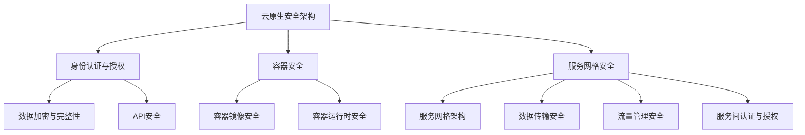
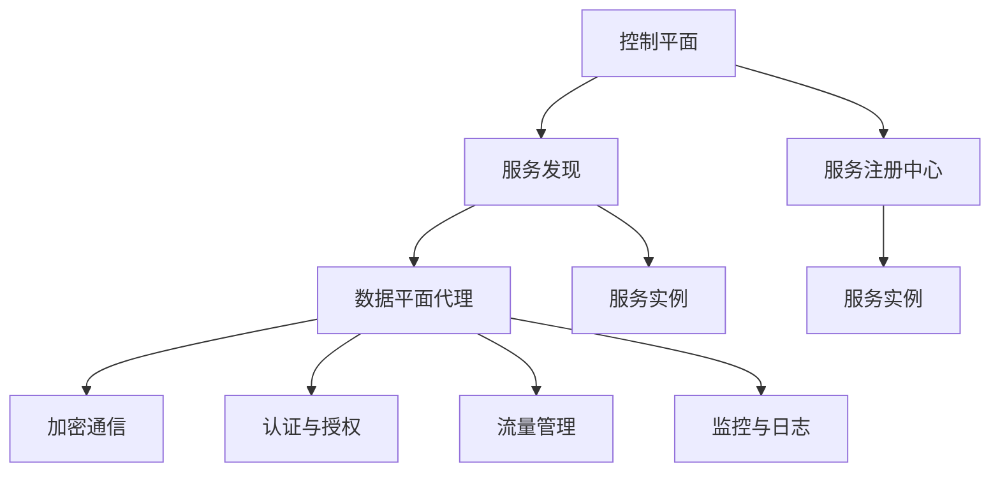

                 

### 引言

#### 1.1 云原生安全的重要性

在当今快速发展的数字化时代，云原生技术已成为现代应用开发和部署的核心驱动力。云原生安全，即保护这些基于云计算、微服务架构和容器化技术的分布式应用的安全，成为信息安全领域的重中之重。随着企业将越来越多的关键业务转移到云端，确保云原生环境的安全性不仅关乎数据的机密性和完整性，还直接影响到业务的连续性和企业的声誉。

云原生环境具有高度分布式和动态变化的特点，这使得传统的安全措施难以适应。攻击者利用这些特点进行网络攻击，如利用容器逃逸攻击、中间人攻击以及分布式拒绝服务（DDoS）等，给企业带来巨大的威胁。因此，云原生安全不仅是技术问题，更是业务战略的重要组成部分。

#### 1.2 分布式应用面临的挑战

分布式应用在提供弹性和可伸缩性的同时，也带来了新的安全挑战。首先，由于分布式应用涉及多个服务实例和组件，攻击面大大增加。其次，分布式系统的复杂性使得安全防护变得更为困难，传统单点防护模式难以满足需求。此外，数据传输的不确定性和网络隔离的复杂性也增加了安全风险。

在分布式应用中，常见的安全威胁包括：

1. **容器逃逸**：攻击者通过容器攻击获取系统权限，从而进一步攻击宿主机。
2. **API攻击**：利用API接口进行恶意攻击，如SQL注入、跨站脚本（XSS）等。
3. **微服务攻击**：针对微服务架构进行攻击，如服务拒绝（DoS）、会话劫持等。
4. **数据泄露**：敏感数据在传输和存储过程中被窃取或泄露。
5. **身份验证和授权漏洞**：攻击者通过绕过身份验证机制获取非法访问权限。

#### 1.3 本书目标与结构

本书旨在为IT专业人士提供全面的云原生安全知识和实践指南。通过深入分析云原生安全的核心概念、关键技术和实际案例，读者将能够：

1. **理解云原生安全的背景和重要性**。
2. **掌握分布式应用的基本概念和架构**。
3. **了解云原生安全模型和关键安全要素**。
4. **熟悉容器安全、服务网格安全和API安全**。
5. **学习分布式应用安全实践和最佳策略**。

本书结构如下：

- **第1章 引言**：介绍云原生安全的重要性以及分布式应用面临的挑战。
- **第2章 云原生与分布式应用基础**：解析云原生概念和分布式应用的特点。
- **第3章 云原生安全核心概念**：讨论安全模型、架构和核心安全要素。
- **第4章 容器安全**：深入探讨容器安全的各个方面。
- **第5章 服务网格安全**：分析服务网格的作用和安全要素。
- **第6章 API安全**：介绍API安全的挑战和防护措施。
- **第7章 分布式应用安全实践**：提供安全策略、测试和实践案例。
- **第8章 未来展望**：探讨云原生安全的趋势和发展方向。
- **附录**：提供相关工具、流程图和算法示例。

通过本书的阅读和实践，读者将能够构建一个全面、深入理解的云原生安全体系，确保分布式应用在云原生环境中的安全和可靠性。

---

### 云原生与分布式应用基础

#### 2.1 云原生概念解析

**2.1.1 微服务架构**

微服务架构是云原生技术体系的核心之一。它倡导将大型单体应用程序分解为多个独立的、松耦合的小服务，每个服务负责实现特定的业务功能。这些微服务可以独立部署、扩展和升级，从而提高了系统的弹性和可伸缩性。微服务架构的主要特点包括：

- **独立性**：每个微服务都是独立的，可以独立开发和部署，无需依赖于其他服务。
- **分布式**：微服务运行在分布式环境中，可以部署在不同的主机或容器中。
- **轻量级**：微服务通常采用轻量级语言（如Go、Node.js）和框架（如Spring Boot、Django）进行开发，便于快速迭代和扩展。
- **自动化**：微服务架构强调自动化部署、测试和监控，提高了开发效率。

**2.1.2 容器化技术**

容器化技术是微服务架构实现的关键。容器提供了一种轻量级的、可移植的、自给自足的运行环境，使应用程序可以在不同的计算环境中一致运行。主要容器化技术包括：

- **Docker**：Docker是最流行的容器化平台，它通过创建轻量级容器实现应用程序的隔离和部署。Docker容器包含应用程序及其所有依赖项，确保应用程序在不同环境中的一致性。
- **Kubernetes**：Kubernetes是一个开源的容器编排平台，用于自动化容器的部署、扩展和管理。Kubernetes提供了强大的资源管理和调度能力，使开发者可以轻松管理大规模的容器集群。

**2.1.3 自动化与持续集成**

自动化和持续集成（CI/CD）是云原生环境的重要组成部分。自动化工具和流程提高了开发效率和系统的可靠性。主要自动化与持续集成工具包括：

- **Jenkins**：Jenkins是一个开源的自动化服务器，用于自动化构建、测试和部署应用程序。Jenkins可以通过插件扩展其功能，支持多种编程语言和构建工具。
- **GitLab CI/CD**：GitLab CI/CD是一个内置的持续集成和持续部署解决方案，与GitLab代码仓库集成，可以自动化构建、测试和部署代码更改。

通过云原生技术，企业可以快速开发和部署分布式应用，实现业务敏捷和创新。云原生环境提供了强大的弹性和可伸缩性，使企业能够灵活应对不断变化的市场需求。

---

#### 2.2 分布式应用概述

**2.2.1 分布式系统的特点**

分布式系统是分布式应用的基础。与传统的集中式系统不同，分布式系统通过将计算任务分布在多个节点上，实现了高性能和高可用性。分布式系统的特点包括：

- **高可用性**：分布式系统通过冗余节点和自动故障转移，实现了高可用性，即使在某个节点发生故障时，系统仍能正常运行。
- **高扩展性**：分布式系统可以根据需求动态增加或减少节点，从而实现横向和纵向的扩展。
- **高性能**：分布式系统通过并行处理和数据分片，提高了系统的计算性能。
- **高一致性**：分布式系统需要处理数据一致性问题，如如何确保多个节点上的数据保持同步。

**2.2.2 分布式应用的常见架构**

分布式应用通常采用以下几种常见架构：

- **分层架构**：分层架构将应用分为表示层、业务逻辑层和数据访问层。表示层负责用户界面，业务逻辑层处理核心业务功能，数据访问层负责与数据库交互。
- **微服务架构**：微服务架构将应用分解为多个独立的服务，每个服务负责特定的业务功能。这些服务通过API进行通信，实现了高耦合性和灵活性。
- **事件驱动架构**：事件驱动架构通过事件和事件流来驱动应用，实现了异步通信和高可用性。
- **无服务器架构**：无服务器架构（Serverless）将计算任务交给云服务提供商，开发者无需关注底层基础设施的运维，从而降低了开发和运营成本。

**2.2.3 分布式应用的优势与挑战**

分布式应用带来了许多优势，但也伴随着一定的挑战：

- **优势**：
  - **弹性**：分布式应用可以根据需求动态扩展和缩减资源，提高了系统的弹性。
  - **可伸缩性**：分布式应用可以通过横向和纵向扩展，实现高性能和高吞吐量。
  - **高可用性**：分布式系统通过冗余节点和故障转移，提高了系统的可用性。
  - **灵活性**：分布式架构允许开发者独立开发、部署和扩展各个服务，提高了系统的灵活性。

- **挑战**：
  - **数据一致性问题**：分布式系统需要处理数据一致性问题，如如何确保多个节点上的数据保持同步。
  - **分布式并发控制**：分布式系统需要处理并发访问控制，如如何确保多用户同时访问同一数据时的一致性。
  - **分布式系统故障**：分布式系统中的节点可能会出现故障，如何确保系统的稳定性和可用性是一个挑战。
  - **系统复杂度**：分布式系统增加了系统的复杂度，如何管理和维护分布式系统是一个挑战。

通过深入了解分布式系统的特点、常见架构和优势与挑战，开发者可以更好地设计和实现分布式应用，充分利用其优势，同时应对其带来的挑战。

---

### 云原生安全核心概念

#### 3.1 安全模型与架构

云原生安全模型是一种设计分布式应用安全性的体系结构，它基于云计算、微服务架构和容器化技术。云原生安全模型的核心目标是通过一系列策略、工具和技术，确保分布式应用在云原生环境中的安全性。以下是云原生安全模型的关键组成部分：

**3.1.1 统一安全策略**

统一安全策略是云原生安全模型的基础。它要求企业在整个分布式系统中采用一致的安全策略，以确保不同组件和服务的安全要求得到满足。统一安全策略包括以下几个方面：

- **身份验证和授权**：确保只有经过认证的用户和系统能够访问受保护的资源。常见的方法包括基于用户名和密码、二因素认证（2FA）和基于令牌的认证（如OAuth 2.0）。
- **访问控制**：通过访问控制列表（ACL）或基于角色的访问控制（RBAC），确保用户只能访问他们被授权访问的资源。
- **数据保护**：确保敏感数据在传输和存储过程中得到加密和保护，防止数据泄露和篡改。
- **安全监控**：实现实时监控和日志记录，及时发现和响应安全事件。

**3.1.2 逐步安全升级**

逐步安全升级是一种安全策略，通过分阶段部署安全更新和补丁，降低安全升级对系统稳定性的影响。逐步安全升级包括以下几个步骤：

- **评估**：评估当前系统的安全状态，确定哪些安全更新和补丁是必要的。
- **测试**：在测试环境中进行安全更新和补丁的测试，确保不会对系统造成负面影响。
- **部署**：分阶段部署安全更新和补丁，如先在部分生产环境中部署，再逐步扩展到整个生产环境。
- **监控**：在部署后持续监控系统的安全状态，确保安全更新和补丁的有效性和稳定性。

**3.1.3 安全隔离与隐私保护**

安全隔离与隐私保护是云原生安全模型的重要组成部分。它通过实现不同组件和服务之间的隔离，防止攻击者通过一个组件或服务攻击到其他组件或服务。安全隔离与隐私保护包括以下几个方面：

- **容器隔离**：通过容器技术实现不同服务之间的隔离，确保每个容器仅能访问其权限范围内的资源。
- **网络隔离**：通过防火墙、网络策略和加密通信，实现不同服务之间的隔离，防止未经授权的访问。
- **数据隔离**：通过数据加密、访问控制和备份策略，确保敏感数据在存储和传输过程中的安全性和隐私性。

通过统一安全策略、逐步安全升级和安全隔离与隐私保护，云原生安全模型提供了全面的保护措施，确保分布式应用在云原生环境中的安全性。

---

#### 3.2 核心安全要素

云原生安全的核心要素是确保分布式应用在云原生环境中的各个层面得到充分保护。以下是云原生安全的关键安全要素：

**3.2.1 认证与授权**

认证与授权是云原生安全的基础，确保只有经过认证的用户和系统能够访问受保护的资源和功能。认证与授权包括以下几个方面：

- **身份认证**：验证用户身份，确保只有合法用户能够访问系统。常见的身份认证方法包括用户名和密码、二因素认证（2FA）和基于令牌的认证（如OAuth 2.0）。
- **访问控制**：通过访问控制策略（如访问控制列表ACL和基于角色的访问控制RBAC），确保用户只能访问他们被授权访问的资源。
- **身份管理**：集中管理用户身份和权限，确保用户身份信息的准确性和一致性。

在云原生环境中，认证与授权通常通过以下方式实现：

- **集中式认证服务**：如Kubernetes Service Account和OpenID Connect，简化身份认证和管理。
- **分布式认证机制**：如令牌交换和身份验证协议（如OAuth 2.0和JWT），实现跨服务的认证和授权。
- **访问控制策略**：如网络策略（Network Policy）和Pod安全策略（Pod Security Policy），确保不同服务之间的访问控制。

**3.2.2 数据加密与完整性**

数据加密与完整性是保护敏感数据的重要手段。在云原生环境中，数据加密与完整性包括以下几个方面：

- **数据加密**：对敏感数据在传输和存储过程中进行加密，防止数据泄露和篡改。常见的数据加密技术包括对称加密（如AES）和非对称加密（如RSA）。
- **数据完整性**：确保数据在传输和存储过程中的完整性和一致性，防止数据篡改和损坏。常见的数据完整性技术包括哈希函数（如SHA-256）和数字签名。

在云原生环境中，数据加密与完整性可以通过以下方式实现：

- **加密存储**：如Kubernetes Encrypted Volumes，对存储在容器中的数据进行加密。
- **加密通信**：如TLS/SSL，对数据在传输过程中的通信进行加密。
- **数据完整性检查**：如数据校验和和数字签名，确保数据在传输和存储过程中的完整性和一致性。

**3.2.3 API安全**

API安全是保护分布式应用的重要方面，确保API接口不被恶意攻击者利用。API安全包括以下几个方面：

- **API认证与授权**：确保只有经过认证和授权的用户和系统能够访问API接口。常见的方法包括基于用户名和密码的认证、OAuth 2.0和JWT。
- **API访问控制**：通过访问控制策略，确保用户和系统能够访问他们被授权访问的API接口。
- **API数据保护**：对API接口传输的数据进行加密和完整性验证，防止数据泄露和篡改。
- **API漏洞防护**：通过漏洞扫描和防护措施，防止API接口被恶意攻击者利用。

在云原生环境中，API安全可以通过以下方式实现：

- **API网关**：如Kong和Envoy，提供统一的API接口管理和安全防护。
- **API安全策略**：如Open Policy Agent（OPA），实现细粒度的API访问控制和安全策略。
- **API监控与审计**：如Prometheus和ELK栈（Elasticsearch、Logstash、Kibana），实现API访问监控和日志审计。

通过认证与授权、数据加密与完整性和API安全，云原生安全核心要素提供了全面的保护措施，确保分布式应用在云原生环境中的安全性。

---

#### 3.3 云原生安全架构

云原生安全架构是确保分布式应用在云原生环境中安全运行的关键组成部分。该架构通过多层次的安全策略、工具和技术，提供全面的安全保护。以下是云原生安全架构的详细解析：

**3.3.1 容器安全**

容器安全是云原生安全架构的核心之一，涉及保护容器化应用程序的安全。以下是一些关键的容器安全措施：

- **容器镜像安全**：确保容器镜像的完整性和安全性。这包括扫描容器镜像中的漏洞、依赖项和配置错误，以及为容器镜像设置签名和验证机制。
  - **容器镜像扫描**：使用工具如Clair和Docker Bench for Security，对容器镜像进行漏洞扫描和安全评估。
  - **容器镜像签名与验证**：通过使用容器镜像签名工具（如Notary）和验证工具（如Container Security Scanner），确保容器镜像的完整性和可信性。

- **容器运行时安全**：确保容器在运行时不会受到恶意攻击。以下是一些常见的容器运行时安全措施：
  - **容器网络安全**：通过使用网络策略（如Calico和Cilium），限制容器之间的网络通信，防止网络攻击和容器逃逸。
  - **容器进程安全**：通过使用容器安全策略（如AppArmor和SELinux），限制容器进程的权限和访问范围，防止恶意进程执行。
  - **容器监控与日志**：使用工具如Elasticsearch、Kibana和Prometheus，对容器进行实时监控和日志分析，及时发现和响应安全事件。

**3.3.2 服务网格安全**

服务网格安全是保护微服务通信的关键。以下是一些服务网格安全措施：

- **服务网格架构**：服务网格（如Istio和Linkerd）通过提供独立的通信基础设施，实现微服务之间的安全通信。服务网格架构的主要组件包括：
  - **服务发现与负载均衡**：通过服务发现机制（如Consul和Eureka），确保服务实例的自动发现和负载均衡。
  - **服务间认证与授权**：通过使用身份验证和授权协议（如JWT和OAuth 2.0），确保服务间通信的安全性和可信性。
  - **流量管理和监控**：通过流量管理策略（如路由规则和策略）和监控工具（如Jaeger和Zipkin），确保服务间通信的可靠性和可追溯性。

- **服务网格安全措施**：以下是一些常见的服务网格安全措施：
  - **流量加密**：通过使用TLS/SSL，确保服务间通信的加密和完整性。
  - **访问控制**：通过定义细粒度的访问控制策略，限制服务间的访问权限。
  - **安全监控与审计**：通过集成安全监控工具（如Prometheus和ELK栈），实现服务网格的实时监控和日志审计。

**3.3.3 容器镜像与仓库安全**

容器镜像和仓库安全是确保容器化应用程序的安全和可信性的关键。以下是一些常见的容器镜像与仓库安全措施：

- **容器镜像签名与验证**：通过使用镜像签名工具（如Notary）和验证工具（如Container Security Scanner），确保容器镜像的完整性和可信性。
- **镜像仓库安全**：通过使用安全的容器镜像仓库（如Docker Hub和Quay），确保镜像的安全存储和分发。
- **仓库访问控制**：通过使用访问控制机制（如RBAC和OAuth 2.0），限制对容器镜像仓库的访问权限。

通过以上容器安全、服务网格安全和容器镜像与仓库安全的措施，云原生安全架构提供了全面的安全保护，确保分布式应用在云原生环境中的安全性。

---

#### 4.1 容器安全概述

容器安全是云原生安全的重要组成部分，确保容器化应用程序在运行时不会受到恶意攻击。随着容器技术的广泛应用，容器安全也面临着一系列的挑战。以下是对容器安全概述的详细解析。

**4.1.1 容器安全的挑战**

容器安全面临的挑战主要包括以下几个方面：

- **容器逃逸**：容器逃逸攻击是指攻击者利用容器漏洞，从容器中逃逸到宿主机，从而获取系统权限。容器逃逸攻击的方法包括利用容器内部的漏洞、宿主机的内核漏洞以及容器网络隔离机制的弱点。
- **恶意容器镜像**：恶意容器镜像是指包含恶意代码或漏洞的容器镜像，攻击者可以通过这些镜像部署恶意应用程序或窃取敏感数据。恶意容器镜像可能来自不可信的源，或者被篡改后的官方镜像。
- **容器进程安全**：容器进程安全涉及到容器内部的进程如何运行和访问系统资源。如果容器进程没有适当的安全控制，攻击者可以通过注入恶意代码或利用进程漏洞来攻击容器。
- **容器网络安全**：容器网络安全涉及到容器之间的通信以及容器与外部网络的交互。容器网络的配置和管理不当可能导致容器之间的未经授权的访问和网络攻击。
- **数据泄露与数据保护**：容器中的数据泄露可能是由于容器安全配置不正确、容器镜像不安全或容器网络未加密等原因造成的。保护容器中的敏感数据是确保容器安全的重要方面。

**4.1.2 容器安全的基本原则**

为了应对容器安全面临的挑战，需要遵循以下基本原则：

- **最小权限原则**：容器应该具有最小的权限，仅具有执行其任务所需的权限。这可以限制攻击者在容器中获得的权限范围，减少潜在的攻击面。
- **隔离原则**：容器应该与宿主机和其他容器保持隔离，确保容器内部的攻击无法扩散到宿主机或其他容器。这可以通过使用容器网络隔离、文件系统隔离和进程隔离等技术实现。
- **安全更新原则**：定期对容器镜像和容器进行安全更新，确保修复已知的漏洞和安全隐患。安全更新可以减少容器被攻击的风险。
- **数据保护原则**：对容器中的敏感数据进行加密和访问控制，确保数据在传输和存储过程中的安全性。这可以通过使用加密工具和访问控制策略实现。
- **监控和审计原则**：实时监控和记录容器运行时的行为和事件，及时发现和响应安全事件。监控和审计可以帮助识别潜在的安全威胁和异常行为。

通过遵循以上基本原则，可以大大提高容器安全，确保容器化应用程序在云原生环境中的安全运行。

---

#### 4.2 容器镜像安全

**4.2.1 容器镜像的安全性检查**

容器镜像的安全性检查是确保容器环境安全的重要步骤。通过定期对容器镜像进行安全性评估，可以发现潜在的安全漏洞和风险，从而采取相应的修复措施。以下是几种常见的容器镜像安全性检查方法：

- **静态镜像扫描**：静态镜像扫描是在容器镜像构建完成后，对其内容进行扫描和分析，以检测潜在的安全漏洞和配置错误。静态镜像扫描工具如Clair和Trivy可以对容器镜像中的文件、依赖项和配置进行检查，发现安全漏洞、已知的恶意软件和潜在的安全风险。

- **动态镜像扫描**：动态镜像扫描是在容器运行时对其行为进行监控和评估，以检测潜在的安全威胁。动态镜像扫描工具如Docker Bench for Security可以检测容器镜像的运行时配置和安全状态，如权限设置、进程控制和网络配置等。

- **容器镜像签名与验证**：通过使用容器镜像签名工具（如Notary和sigstore），可以对容器镜像进行签名和验证，确保镜像的完整性和可信性。签名过程涉及将数字签名附加到镜像，验证过程则是通过验证签名来确定镜像的合法性。这可以防止镜像被篡改和未授权的修改。

- **镜像仓库的安全配置**：确保容器镜像仓库的安全配置，如使用HTTPS传输镜像，限制对仓库的访问权限，以及启用镜像签名和验证机制。这些措施可以防止镜像被未授权的用户下载和修改。

- **持续集成与持续部署（CI/CD）的安全检查**：在持续集成和持续部署过程中，集成安全性检查步骤，确保容器镜像在构建和部署过程中始终符合安全要求。这可以通过在CI/CD流程中集成静态和动态镜像扫描工具，实现自动化的镜像安全性评估。

通过以上方法，可以全面检查容器镜像的安全性，及时发现和修复潜在的安全漏洞和风险，确保容器环境的可靠性和安全性。

---

#### 4.3 容器运行时安全

容器运行时安全是确保容器化应用程序在运行时不会受到恶意攻击的关键。容器运行时安全涉及到容器网络、容器进程等多个方面。以下是对容器运行时安全的详细解析：

**4.3.1 容器网络安全**

容器网络安全主要通过隔离和控制容器之间的网络通信来实现。以下是一些常见的容器网络安全措施：

- **网络命名空间**：通过将容器放入独立的网络命名空间，可以实现容器之间的网络隔离。网络命名空间确保容器无法访问其他容器的网络接口和端口，从而防止容器之间的网络攻击。

- **网络策略**：通过定义网络策略，可以控制容器之间的网络通信。网络策略通常使用防火墙规则，允许或拒绝特定的网络流量。网络策略可以限制容器之间的通信，防止未经授权的访问和恶意流量。

- **容器网络插件**：使用容器网络插件（如Calico、Flannel和Weave），可以实现容器网络的自动化管理和安全配置。这些插件提供细粒度的网络隔离和流量控制功能，确保容器网络的可靠性和安全性。

- **加密通信**：通过使用TLS/SSL加密协议，可以确保容器之间的通信是安全的。加密通信可以防止中间人攻击和数据泄露，保护容器之间的敏感信息。

**4.3.2 容器进程安全**

容器进程安全主要通过限制容器进程的权限和访问范围来实现。以下是一些常见的容器进程安全措施：

- **最小权限原则**：容器进程应遵循最小权限原则，仅具有执行其任务所需的最低权限。通过限制容器进程的权限，可以减少攻击者在容器内获取系统权限的风险。

- **进程隔离**：通过使用容器进程隔离机制（如AppArmor和SELinux），可以限制容器进程对系统资源的访问。进程隔离可以防止恶意进程执行，保护宿主机和容器环境的安全性。

- **安全增强型用户**：使用安全增强型用户（如SUID和SGID），可以限制容器进程的执行权限。安全增强型用户可以通过用户ID和组ID来控制进程的访问权限，从而增强容器进程的安全性。

- **进程监控与审计**：通过使用进程监控和审计工具（如cgroups和auditd），可以实时监控容器进程的行为和事件。进程监控和审计可以帮助识别和响应潜在的进程安全威胁。

通过以上措施，可以确保容器运行时的网络安全和进程安全，提高容器化应用程序的安全性。

---

#### 4.4 容器安全工具与实践

在确保容器安全的过程中，使用适当的工具和最佳实践是至关重要的。以下将介绍几种常见的容器安全工具以及最佳实践。

**4.4.1 容器安全管理工具**

- **Docker Bench for Security**：Docker Bench for Security是一个开源的工具，用于评估Docker容器的安全性。它提供了多种检查项，包括安全加固、最小权限原则和配置检查等，可以帮助用户发现和修复容器镜像和运行时配置中的安全漏洞。

- **Clair**：Clair是一个开源的容器镜像扫描工具，用于检测容器镜像中的漏洞和已知恶意软件。它可以与Docker Hub等镜像仓库集成，自动扫描上传的镜像，并提供安全报告。

- **Trivy**：Trivy是另一款开源的容器镜像和运行时扫描工具，支持多种语言和操作系统。它提供了丰富的漏洞数据库，可以识别容器镜像中的安全漏洞、依赖项问题和配置错误。

- **CoreOS Podman**：Podman是一个开源的容器引擎，与Docker兼容，但更注重安全性和隔离性。它提供了安全增强功能，如AppArmor和SELinux，并支持容器签名和验证，确保容器的安全性。

**4.4.2 容器安全最佳实践**

- **使用官方镜像**：从官方镜像仓库（如Docker Hub）获取容器镜像，可以确保镜像的可靠性和安全性。避免使用未经验证的第三方镜像，减少潜在的安全风险。

- **最小权限原则**：容器进程应遵循最小权限原则，仅具有执行其任务所需的最低权限。这可以通过设置适当的用户ID和组ID来实现。

- **容器签名与验证**：使用容器签名工具（如Notary）对容器镜像进行签名，并使用验证工具（如Container Security Scanner）确保镜像的完整性和可信性。

- **定期扫描和更新**：定期对容器镜像和运行时环境进行安全扫描，及时更新修复已知的安全漏洞和配置错误。

- **网络隔离与加密**：使用网络策略（如Calico和Cilium）实现容器之间的隔离，并通过TLS/SSL加密通信，确保容器网络的安全。

- **安全配置管理**：使用配置管理工具（如Ansible和Terraform）来管理容器镜像和运行时的配置，确保配置的一致性和安全性。

- **监控与日志**：启用容器监控和日志记录工具（如Elasticsearch、Kibana和Prometheus），实时监控容器运行时的行为和事件，及时发现和响应安全事件。

通过使用容器安全管理工具和最佳实践，可以显著提高容器化应用程序的安全性，确保其在云原生环境中的可靠运行。

---

### 5.1 服务网格概述

服务网格（Service Mesh）是一种基础设施层，专门用于管理微服务之间的通信和流量。其核心目的是将服务间的通信抽象出来，使其与业务逻辑分离，从而简化微服务的开发和部署。以下是服务网格的基本概念和组件的详细解析。

**5.1.1 服务网格的作用**

服务网格在分布式系统中扮演着关键角色，其主要作用包括：

- **简化微服务通信**：服务网格通过提供统一的服务接口和通信协议，简化了微服务之间的通信，使开发者无需关心底层网络细节。
- **增强服务可见性**：服务网格提供了全面的监控和日志记录功能，使开发者可以实时了解服务的运行状态和性能。
- **提供流量管理**：服务网格支持流量管理功能，如负载均衡、服务路由和故障转移，从而提高系统的可用性和可靠性。
- **提高安全性**：服务网格通过加密通信、认证和授权等安全机制，确保服务之间的通信是安全的。

**5.1.2 服务网格的基本组件**

服务网格由以下几个基本组件组成：

- **控制平面（Control Plane）**：控制平面负责管理服务网格的配置和策略，包括服务发现、服务注册、流量管理和策略配置等。常见的控制平面组件包括Istio、Linkerd和Conduit等。

- **数据平面（Data Plane）**：数据平面是服务网格的核心组件，负责处理微服务之间的通信。每个微服务都会嵌入一个数据平面代理（如Envoy），负责转发流量、执行策略和监控通信等。数据平面代理通常运行在容器的网络命名空间中，与容器紧密集成。

- **服务实例（Service Instance）**：服务实例是服务网格中的具体服务实例，可以是容器、虚拟机或其他运行环境。每个服务实例都会与数据平面代理进行通信，通过服务网格进行流量管理和路由。

- **服务发现（Service Discovery）**：服务发现是服务网格的重要功能之一，负责发现和注册服务实例。服务发现通常通过DNS或API调用实现，使服务实例能够自动注册和发现其他服务实例。

- **服务注册中心（Service Registry）**：服务注册中心是服务网格中的存储服务实例信息的数据库。服务发现功能依赖于服务注册中心来获取服务实例的详细信息。

通过这些基本组件，服务网格实现了微服务之间的安全、可靠和高效的通信，从而提高了分布式系统的整体性能和稳定性。

---

#### 5.2 服务网格安全要素

服务网格安全是确保微服务之间通信安全的关键。以下将详细解析服务网格的安全要素，包括数据传输安全、流量管理和服务间认证与授权等方面。

**5.2.1 数据传输安全**

数据传输安全是服务网格安全的基础，确保微服务之间的通信是安全的。以下是一些常见的数据传输安全措施：

- **加密通信**：使用TLS/SSL加密协议对服务网格中的数据传输进行加密，防止数据在传输过程中被窃取或篡改。TLS/SSL加密可以通过数据平面代理（如Envoy）进行配置和管理。

- **身份验证与认证**：通过使用身份验证和认证机制，确保只有经过认证的服务实例可以访问其他服务实例。常见的方法包括基于证书的认证（如mTLS）和基于令牌的认证（如JWT）。

- **访问控制**：通过定义访问控制策略，限制服务实例之间的访问权限。访问控制策略可以根据服务实例的角色、权限和访问规则进行配置，确保服务网格中的访问是安全的。

- **数据完整性验证**：使用哈希函数（如SHA-256）对传输的数据进行完整性验证，确保数据在传输过程中未被篡改。数据完整性验证可以通过数据平面代理实现，并在数据传输过程中进行校验。

**5.2.2 流量管理安全**

流量管理安全是确保服务网格中的流量是安全、可控和高效的。以下是一些常见的流量管理安全措施：

- **负载均衡**：通过实现负载均衡策略，将流量均匀地分配到多个服务实例，防止某个服务实例过载，提高系统的整体性能和可用性。负载均衡可以通过控制平面组件（如Istio）进行配置。

- **服务路由**：通过服务路由策略，定义流量如何流向不同的服务实例。服务路由可以基于请求的属性（如主机名、路径和HTTP方法）进行动态匹配，实现灵活的流量路由。

- **流量监控与审计**：通过实时监控流量和日志记录，实现对服务网格中流量的监控和审计。流量监控和审计可以帮助识别和响应潜在的安全威胁和异常行为。

- **流量限制与隔离**：通过定义流量限制和隔离策略，防止服务实例之间的恶意流量和未经授权的访问。流量限制和隔离可以通过控制平面组件实现，如Istio中的速率限制和隔离策略。

**5.2.3 服务间认证与授权**

服务间认证与授权是确保服务网格中的服务实例之间通信是安全的。以下是一些常见的认证与授权措施：

- **基于证书的认证（mTLS）**：使用证书进行双向认证（mTLS），确保服务实例之间的通信是可信的。mTLS可以通过数据平面代理（如Envoy）配置实现。

- **基于令牌的认证（如JWT）**：使用令牌（如JWT）进行认证，确保只有经过认证的服务实例可以访问其他服务实例。令牌通常包含身份验证和授权信息，如用户ID、角色和权限等。

- **访问控制策略**：通过定义访问控制策略，限制服务实例之间的访问权限。访问控制策略可以根据服务实例的角色、权限和访问规则进行配置。

- **动态授权**：通过动态授权机制，根据服务实例的请求属性（如用户ID、角色和访问策略）进行实时授权。动态授权可以实现细粒度的访问控制，确保服务实例之间的访问是安全的。

通过数据传输安全、流量管理安全和服务间认证与授权等安全要素，服务网格提供了全面的安全保护，确保微服务之间的通信是安全、可靠和高效的。

---

#### 5.3 服务网格安全工具与实践

服务网格安全是确保微服务之间通信安全的重要环节。为了实现这一目标，开发者和管理员可以采用一系列工具和实践来增强服务网格的安全性。以下是一些常见的服务网格安全工具以及最佳实践。

**5.3.1 服务网格安全工具**

1. **Istio**：Istio是一个开源的服务网格，提供了丰富的安全功能，包括加密通信、认证和授权、访问控制和流量监控等。Istio使用mTLS进行加密通信，并支持基于角色的访问控制（RBAC）。

2. **Linkerd**：Linkerd是一个开源的服务网格，提供了全面的安全功能，如身份验证、授权、访问控制和监控。Linkerd使用服务账户和JWT进行认证，并支持细粒度的访问控制策略。

3. **Envoy**：Envoy是一个高性能的HTTP/HTTPS代理，也是服务网格中的数据平面代理。Envoy提供了丰富的安全功能，包括TLS加密、认证和访问控制。

4. **Open Policy Agent (OPA)**：OPA是一个开源的策略引擎，可以用于实现细粒度的服务网格访问控制策略。OPA支持多种数据格式，如JSON和YAML，可以与Istio和Linkerd等服务网格集成。

**5.3.2 服务网格安全最佳实践**

1. **使用mTLS进行加密通信**：在服务网格中启用mTLS，确保服务实例之间的通信是加密的，防止中间人攻击和数据泄露。通过配置服务网格，强制要求所有服务实例使用mTLS进行通信。

2. **使用JWT进行认证**：使用JSON Web Token (JWT) 进行认证，确保只有经过认证的服务实例可以访问其他服务实例。JWT通常包含身份验证和授权信息，如用户ID、角色和权限等。

3. **定义访问控制策略**：根据服务实例的角色和权限，定义细粒度的访问控制策略。访问控制策略可以基于服务名称、标签、IP地址或用户身份等条件进行配置，确保服务网格中的访问是安全的。

4. **监控和日志记录**：启用服务网格的监控和日志记录功能，实时监控服务实例的运行状态和流量情况。通过监控和日志记录，可以及时发现和响应潜在的安全威胁和异常行为。

5. **定期安全评估**：定期对服务网格进行安全评估，发现和修复潜在的安全漏洞和配置错误。使用安全工具（如Istio Security Best Practices）对服务网格进行自动化安全检查，确保其符合安全最佳实践。

6. **限制网络访问**：通过网络策略（如Kubernetes Network Policy）和服务网格配置，限制服务实例之间的网络访问。限制网络访问可以减少潜在的网络攻击面，确保服务网格中的通信是安全的。

通过使用服务网格安全工具和最佳实践，可以显著提高微服务之间的通信安全性，确保服务网格在分布式系统中的可靠运行。

---

### 6.1 API安全概述

API（应用程序编程接口）是现代分布式系统和服务的重要组成部分，它们允许不同的应用程序和服务之间进行交互和共享数据。然而，随着API的使用越来越广泛，API安全也变得越来越重要。以下将详细探讨API安全的挑战、基本原则以及相关的防护措施。

**6.1.1 API安全的挑战**

API安全面临的挑战主要包括以下几个方面：

- **身份验证与授权**：API通常允许用户通过应用程序进行访问，因此身份验证和授权成为保护API的关键。未经授权的访问可能导致数据泄露或损坏，甚至可能对整个系统造成威胁。

- **数据泄露**：API是数据传输的通道，敏感数据（如用户信息、财务数据等）在传输过程中可能被窃取或篡改。数据泄露可能导致严重的业务损失和声誉损害。

- **注入攻击**：API注入攻击（如SQL注入、XML注入等）是常见的攻击方式，攻击者通过在API请求中插入恶意代码，可能导致数据泄露或系统崩溃。

- **中间人攻击**：中间人攻击是攻击者在通信过程中拦截、篡改或重放API请求的攻击方式。通过中间人攻击，攻击者可以窃取敏感数据或伪造请求。

- **API滥用**：API滥用是指未经授权的用户或应用程序过度使用API，导致系统资源耗尽或服务中断。API滥用可能导致服务不可用或性能下降。

- **API漏洞**：API本身可能存在设计缺陷或实现漏洞，这些漏洞可能被攻击者利用，导致安全风险。

**6.1.2 API安全的基本原则**

为了应对API安全面临的挑战，需要遵循以下基本原则：

- **最小权限原则**：API访问应遵循最小权限原则，用户和应用程序只能访问其所需的最低权限。通过限制访问权限，可以降低潜在的安全风险。

- **加密通信**：确保API通信是加密的，使用TLS/SSL等加密协议防止数据在传输过程中被窃取或篡改。加密通信可以防止中间人攻击和数据泄露。

- **身份验证与授权**：实施强身份验证和授权机制，确保只有经过认证的用户和系统能够访问API。常见的方法包括基于用户名和密码、二因素认证（2FA）和基于令牌的认证（如OAuth 2.0和JWT）。

- **输入验证**：对API请求的输入进行严格的验证和过滤，防止恶意输入和注入攻击。通过验证输入参数的类型、长度和值，可以减少注入攻击的风险。

- **输出编码**：对API响应的输出进行适当的编码和转义，防止输出注入攻击（如跨站脚本攻击）。通过编码输出，可以确保数据在浏览器等客户端中安全显示。

- **日志记录和监控**：启用API日志记录和监控，实时记录API请求和响应，并监控异常行为和潜在的安全威胁。日志记录和监控可以帮助识别和响应安全事件。

通过遵循以上基本原则，可以显著提高API的安全性，保护应用程序和数据免受恶意攻击和泄露。

---

#### 6.2 API安全防护措施

为了确保API的安全性，需要采取一系列防护措施来应对各种潜在的安全威胁。以下将详细探讨API安全的防护措施，包括认证与授权、数据加密和API漏洞扫描等方面。

**6.2.1 API认证与授权**

API认证与授权是保护API安全的关键措施，确保只有经过认证的用户和系统才能访问API。以下是一些常见的认证与授权方法：

- **基于用户名和密码的认证**：这是最简单的认证方法，用户需要提供用户名和密码来访问API。尽管这种方法简单易用，但存在安全性较低的问题，因为密码可能会被窃取或破解。

- **二因素认证（2FA）**：二因素认证是一种增强认证安全性的方法，用户在提供用户名和密码后，还需要通过手机短信、电子邮件或手机应用生成的一次性验证码进行验证。2FA可以大大提高认证的安全性，防止密码泄露带来的风险。

- **基于令牌的认证（如OAuth 2.0和JWT）**：令牌认证是一种更加安全的方法，用户在首次登录时获取一个访问令牌（如JWT），之后每次请求API时都携带这个令牌。OAuth 2.0和JSON Web Token（JWT）是两种常用的令牌认证机制。JWT令牌包含用户的身份验证信息和权限信息，可以加密和签名，确保令牌的有效性和安全性。

- **API密钥认证**：API密钥是一种简单但有效的认证方法，应用程序需要持有API密钥才能访问API。API密钥通常与用户账户绑定，可以通过访问控制策略进行管理。

通过选择合适的认证方法，可以确保API访问的安全性，防止未经授权的访问。

**6.2.2 API数据加密**

数据加密是保护API传输数据安全的重要措施，防止数据在传输过程中被窃取或篡改。以下是一些常见的加密方法：

- **传输层安全（TLS）**：使用TLS协议加密API通信，确保数据在传输过程中的完整性和机密性。TLS可以防止中间人攻击，确保数据在服务器和客户端之间的传输是安全的。

- **内容加密**：对API请求和响应中的敏感数据进行内容加密，即使数据在传输过程中被截获，攻击者也无法解读数据。内容加密可以使用对称加密（如AES）或非对称加密（如RSA）。

- **加密存储**：对存储在数据库或文件系统中的敏感数据进行加密，确保数据在存储过程中的安全性。加密存储可以使用数据库内置的加密功能或第三方加密工具。

通过数据加密，可以确保API传输数据的机密性和完整性，防止数据泄露和篡改。

**6.2.3 API漏洞扫描与防护**

API漏洞扫描与防护是确保API安全的关键措施，及时发现和修复API漏洞。以下是一些常见的API漏洞扫描与防护方法：

- **静态代码分析**：通过静态代码分析工具（如SonarQube）对API代码进行扫描，发现潜在的代码漏洞和安全问题。静态代码分析可以在代码编写和部署前发现漏洞，从而提前修复。

- **动态代码分析**：通过动态代码分析工具（如OWASP ZAP）对API进行实时扫描，发现运行时的漏洞和安全问题。动态代码分析可以模拟攻击者的攻击行为，检测API在运行时的安全性。

- **API漏洞扫描工具**：使用专门的API漏洞扫描工具（如Burp Suite和OWASP API Mapping Project），扫描API的漏洞和安全问题。这些工具可以自动发现常见的安全漏洞，如注入攻击、配置错误和权限绕过等。

- **安全测试**：定期进行安全测试，包括渗透测试和漏洞扫描，发现和修复API漏洞。安全测试可以模拟真实的攻击场景，验证API的安全性。

- **安全编码实践**：遵循安全编码实践，如输入验证、输出编码和访问控制等，减少API漏洞的产生。安全编码实践可以确保API代码在编写和部署过程中符合安全规范。

通过API漏洞扫描与防护措施，可以及时发现和修复API漏洞，确保API的安全性。

通过实施API认证与授权、数据加密和API漏洞扫描与防护等措施，可以显著提高API的安全性，保护API和数据免受恶意攻击和泄露。

---

#### 6.3 API安全工具与实践

为了确保API的安全性，开发者和管理员可以采用一系列工具和实践来加强API安全。以下将介绍几种常见的API安全工具以及最佳实践。

**6.3.1 API安全工具**

1. **OWASP ZAP**：OWASP ZAP（Zed Attack Proxy）是一个开源的Web应用程序安全测试工具，可以用于扫描和测试API的安全漏洞。ZAP提供了丰富的功能，包括漏洞扫描、自动测试和手动测试。

2. **Postman**：Postman是一个流行的API测试和开发工具，可以用于测试API的安全性和功能。Postman提供了直观的界面，支持多种协议（如HTTP、HTTPS、SOAP等），并可以自动化测试API。

3. **Apigee API Management**：Apigee是一个全面的API管理平台，提供了API安全功能，如认证、授权和加密。Apigee可以帮助开发者管理和监控API，并提供实时的安全警报和报告。

4. **Akana API Manager**：Akana是一个高级的API管理平台，提供了强大的API安全功能，包括身份验证、授权和加密。Akana支持多种协议和标准，如OAuth 2.0和OpenID Connect，可以满足不同场景下的API安全管理需求。

**6.3.2 API安全最佳实践**

1. **使用强认证机制**：使用强认证机制，如基于令牌的认证（如OAuth 2.0和JWT），确保只有经过认证的用户和系统才能访问API。

2. **加密API通信**：使用TLS/SSL加密API通信，确保数据在传输过程中不被窃取或篡改。配置HTTPS，并确保使用强密码和证书。

3. **输入验证和输出编码**：对API请求和响应中的输入进行严格的验证和过滤，防止注入攻击。对API响应的输出进行适当的编码和转义，防止输出注入攻击。

4. **定期安全测试**：定期对API进行安全测试，包括静态代码分析和动态代码分析。使用API漏洞扫描工具，发现和修复潜在的安全漏洞。

5. **访问控制**：使用访问控制策略，限制API访问权限。根据用户角色和权限，定义细粒度的访问控制规则，确保用户只能访问他们有权访问的资源。

6. **日志记录和监控**：启用API日志记录和监控，实时记录API请求和响应，并监控异常行为和潜在的安全威胁。通过日志记录和监控，可以及时发现和响应安全事件。

7. **安全编码实践**：遵循安全编码实践，如输入验证、输出编码和访问控制等，确保API代码在编写和部署过程中符合安全规范。

通过使用API安全工具和最佳实践，可以显著提高API的安全性，保护API和数据免受恶意攻击和泄露。

---

### 7.1 分布式应用安全策略

在分布式应用中，安全策略是确保系统安全的关键组成部分。一个有效的安全策略需要从多个方面进行考虑，包括设计、部署、运维和管理等。以下将详细探讨分布式应用安全策略的设计、实施和治理。

**7.1.1 安全策略设计**

安全策略设计是构建安全分布式应用的第一步。以下是设计安全策略时需要考虑的关键因素：

- **业务需求**：安全策略应与业务需求相一致，确保保护业务关键数据和功能。理解业务需求有助于确定安全需求和优先级。

- **风险评估**：对系统进行风险评估，识别潜在的安全威胁和漏洞。通过风险评估，可以确定哪些安全措施是必要的，以及需要投入多少资源来实施这些措施。

- **合规性**：确保安全策略符合相关的法律法规和行业标准，如GDPR、ISO 27001等。合规性要求可以帮助确保系统的安全性。

- **安全模型**：选择适合分布式应用的安全模型，如零信任模型、基于角色的访问控制（RBAC）等。安全模型应能够适应分布式环境的复杂性。

- **多因素认证**：实施多因素认证（MFA）机制，确保只有经过认证的用户才能访问系统。MFA可以大大提高系统的安全性，防止密码泄露带来的风险。

- **加密与数据保护**：确保敏感数据在传输和存储过程中得到加密和保护。采用加密算法（如AES、RSA）和加密存储技术，如透明数据加密（TDE）和文件加密。

- **访问控制**：实施细粒度的访问控制策略，限制用户和系统的访问权限。通过角色分配和权限管理，确保用户只能访问他们需要访问的资源。

- **日志记录与监控**：启用全面的日志记录和监控机制，实时记录系统和用户的行为。通过监控和日志分析，可以及时发现和响应安全事件。

- **漏洞管理**：制定漏洞管理策略，定期扫描和修复系统中的漏洞。及时更新系统和应用程序，以应对已知的漏洞和安全威胁。

**7.1.2 安全治理与合规**

安全治理是确保安全策略有效实施和管理的重要环节。以下是安全治理的关键方面：

- **安全组织**：建立专门的安全团队，负责制定、实施和维护安全策略。安全团队应包括安全分析师、网络安全专家、应用程序安全专家等。

- **安全培训与教育**：对员工进行安全培训和教育，提高他们的安全意识和技能。员工应了解安全政策和最佳实践，以减少人为错误导致的安全风险。

- **安全审计**：定期进行安全审计，评估安全策略的有效性和合规性。通过安全审计，可以识别和修复潜在的安全漏洞和配置错误。

- **安全事件响应**：制定安全事件响应计划，确保在发生安全事件时能够迅速响应。安全事件响应计划应包括事件的识别、报告、调查、恢复和事后分析等步骤。

- **合规性监控**：确保系统的安全策略和操作符合相关法律法规和行业标准。合规性监控可以通过自动化工具和手动审查来实现。

通过设计合理的安全策略和有效的安全治理，分布式应用可以在复杂的环境中保持安全，确保业务的连续性和数据的安全性。

---

#### 7.2 分布式应用安全测试

在分布式应用开发过程中，安全测试是确保系统安全性的关键环节。安全测试可以帮助发现和修复潜在的安全漏洞，确保分布式应用在各种环境下都能保持安全。以下将详细探讨分布式应用安全测试的方法、工具和实践。

**7.2.1 安全测试方法**

分布式应用安全测试主要包括以下几种方法：

- **静态代码分析**：静态代码分析是在应用程序代码不运行的情况下，通过解析代码结构和逻辑来发现潜在的安全漏洞。静态代码分析工具可以检查代码中的常见安全漏洞，如SQL注入、跨站脚本（XSS）和跨站请求伪造（CSRF）等。

- **动态代码分析**：动态代码分析是在应用程序运行时进行测试，通过模拟攻击者的攻击行为来检测潜在的安全漏洞。动态代码分析工具可以在应用程序运行时注入恶意代码，测试应用程序的响应和行为。

- **渗透测试**：渗透测试是通过模拟黑客攻击来评估分布式应用的漏洞和安全漏洞。渗透测试通常由专业的安全团队进行，他们使用各种工具和技巧来模拟真实的攻击场景，识别和利用系统的安全漏洞。

- **API测试**：API测试是专门针对API接口的安全性进行测试。API测试工具可以模拟恶意请求，测试API接口的认证、授权和输入验证等方面，发现潜在的漏洞和安全隐患。

- **模糊测试**：模糊测试是一种通过输入大量随机或异常数据来测试应用程序的健壮性和安全性的方法。模糊测试可以帮助发现应用程序在异常输入下的行为，检测潜在的缓冲区溢出、拒绝服务（DoS）等安全漏洞。

**7.2.2 安全测试工具**

以下是几种常见的分布式应用安全测试工具：

- **OWASP ZAP**：OWASP ZAP是一个开源的Web应用程序安全测试工具，可以用于扫描和测试API接口、Web应用程序和Web服务。ZAP提供了丰富的功能，包括漏洞扫描、自动测试和手动测试。

- **Burp Suite**：Burp Suite是一个高级的Web应用程序安全测试工具，可以用于扫描、测试和攻击Web应用程序。Burp Suite提供了代理、扫描器、攻击器和报告生成器等模块，可以满足不同场景下的安全测试需求。

- **SonarQube**：SonarQube是一个开源的静态代码分析平台，可以用于检测代码中的安全漏洞、编码标准和质量问题。SonarQube支持多种编程语言和框架，可以与持续集成工具集成，实现自动化安全测试。

- **Postman**：Postman是一个流行的API测试和开发工具，可以用于测试API接口的功能和安全。Postman提供了直观的界面，支持多种协议和工具，可以帮助开发者快速发现和修复API漏洞。

- **Docker Bench for Security**：Docker Bench for Security是一个用于评估Docker容器安全性的工具。它可以帮助评估容器镜像和运行时的配置，发现潜在的安全漏洞和配置错误。

**7.2.3 安全测试实践**

以下是分布式应用安全测试的最佳实践：

- **定期进行安全测试**：定期对分布式应用进行安全测试，包括静态代码分析、动态代码分析、渗透测试和API测试等。安全测试应覆盖开发、测试和部署等各个环节。

- **集成安全测试到CI/CD流程**：将安全测试集成到持续集成和持续部署（CI/CD）流程中，实现自动化安全测试。通过自动化测试，可以及时发现和修复安全漏洞，提高开发效率。

- **使用安全测试工具**：选择合适的工具进行安全测试，根据测试需求和工具的特性，制定详细的测试计划和策略。使用多种工具和方法，全面覆盖分布式应用的安全测试。

- **安全测试覆盖率**：确保安全测试覆盖关键模块和关键功能，尤其是涉及用户数据、敏感信息和重要操作的部分。通过提高测试覆盖率，可以减少潜在的安全漏洞和风险。

- **记录和跟踪测试结果**：记录安全测试的结果和发现的安全漏洞，及时修复和验证。通过跟踪测试结果，可以持续改进安全测试流程和策略。

通过有效的安全测试方法和工具，以及最佳实践，可以确保分布式应用在开发、测试和部署过程中始终保持安全，降低安全风险。

---

#### 7.3 分布式应用安全案例分析

在分布式应用开发过程中，安全事件的发生是不可避免的。通过分析真实的安全案例，我们可以从中学习如何识别、应对和修复安全漏洞。以下将提供两个分布式应用安全案例的详细解析。

**7.3.1 案例一：云原生应用安全漏洞修复**

**案例背景**：
一家金融科技公司使用云原生技术构建了一个分布式应用，该应用包括多个微服务和容器化组件。在一次定期的安全测试中，安全团队发现了一个高危漏洞：容器镜像中的Web应用程序存在跨站脚本（XSS）漏洞。

**步骤解析**：

1. **漏洞识别**：通过使用静态代码分析和动态代码分析工具，安全团队发现Web应用程序存在XSS漏洞。具体表现为：用户输入的数据未经正确处理，直接嵌入到HTML页面中，攻击者可以通过构造恶意输入触发XSS攻击。

2. **漏洞分析**：安全团队分析了漏洞的具体实现方式和影响范围。确定攻击者可以通过恶意输入窃取用户的敏感信息，如会话令牌和认证信息，从而进一步攻击系统。

3. **应急响应**：安全团队立即启动应急响应计划，采取以下措施：
   - 停止受影响的应用程序实例，防止漏洞被利用。
   - 通知开发和运维团队，确保所有人了解漏洞情况。
   - 开展内部调查，确定漏洞的起源和传播路径。

4. **漏洞修复**：
   - 更新Web应用程序的代码，确保用户输入数据在嵌入到HTML页面前进行适当的编码和转义，防止XSS攻击。
   - 重新构建和部署修复后的容器镜像，确保所有实例都更新到最新版本。
   - 对所有用户进行重认证，确保会话安全。

5. **验证和监控**：安全团队对修复后的应用程序进行再次测试，确保漏洞已被完全修复。同时，启用监控工具，实时监控应用程序的运行状态和用户行为，及时发现新的安全漏洞。

**案例小结**：
通过及时识别和修复XSS漏洞，金融科技公司成功保护了用户数据和系统安全。该案例强调了定期安全测试和应急响应计划的重要性，以及持续监控和改进安全措施的重要性。

**7.3.2 案例二：服务网格安全漏洞防御**

**案例背景**：
一家电子商务公司使用Istio服务网格管理其微服务之间的通信。在一次安全测试中，安全团队发现Istio控制平面存在一个严重漏洞，可能导致攻击者利用漏洞获取系统权限。

**步骤解析**：

1. **漏洞识别**：通过动态代码分析和渗透测试，安全团队发现Istio控制平面存在一个远程代码执行（RCE）漏洞。攻击者可以通过构造恶意的请求，执行任意代码，获取系统权限。

2. **漏洞分析**：安全团队分析了漏洞的详细信息和影响范围，确定攻击者可以通过Istio API访问控制平面，执行系统命令，从而完全控制整个服务网格。

3. **应急响应**：
   - 立即禁用Istio控制平面，防止漏洞被利用。
   - 更新Istio版本，修复漏洞。
   - 对服务网格中的所有微服务进行安全审计，确保没有其他安全漏洞。

4. **漏洞修复**：
   - 重新部署修复后的Istio控制平面，确保所有服务网格组件都更新到最新版本。
   - 重新配置服务网格，确保访问控制策略和安全措施得到正确实施。

5. **验证和监控**：安全团队对修复后的服务网格进行验证，确保漏洞已被完全修复。同时，启用监控工具，实时监控服务网格的运行状态和流量，及时发现新的安全漏洞。

**案例小结**：
通过及时识别和修复服务网格漏洞，电子商务公司成功保护了系统安全和数据完整性。该案例强调了服务网格安全的重要性，以及定期安全测试和应急响应计划的重要性。

通过以上案例分析，我们可以看到分布式应用安全漏洞的识别、应对和修复过程，以及如何通过有效的安全措施来保护系统。这些案例为我们提供了宝贵的经验和教训，有助于我们更好地构建和维护安全的分布式应用。

---

### 8.1 云原生安全的趋势与发展

随着云计算和分布式系统的不断发展，云原生安全也在不断演进。未来，云原生安全将面临新的挑战和机遇，以下是一些关键趋势和发展方向。

**8.1.1 未来安全技术的发展**

1. **零信任安全模型**：零信任安全模型是一种基于身份验证和最小权限原则的安全模型，其核心思想是“永不信任，总是验证”。在零信任模型中，所有访问请求都必须经过严格的认证和授权，即使在内部网络中也不例外。未来，零信任模型将成为云原生安全的重要发展方向，提供更加安全的应用环境。

2. **自动化安全**：随着容器化、微服务架构和自动化工具的普及，自动化安全将成为云原生安全的重要趋势。通过自动化工具和平台，如自动化漏洞扫描、自动化安全测试和自动化安全响应，企业可以实现快速、高效的安全部署和管理，减少人为错误和安全漏洞。

3. **机器学习和人工智能**：机器学习和人工智能技术将在云原生安全中发挥重要作用。通过利用这些技术，可以实时分析大量数据，识别异常行为和潜在威胁，实现智能化的安全防护。例如，机器学习算法可以用于网络流量分析、入侵检测和漏洞预测，提高安全防御能力。

4. **联邦身份管理**：随着企业应用的分布式化，联邦身份管理将成为重要趋势。联邦身份管理通过跨域身份认证和授权，实现不同应用和系统之间的安全协作，提供统一的安全访问控制。未来，云原生安全将更加注重联邦身份管理，确保分布式环境中的安全访问和协作。

**8.1.2 云原生安全的未来挑战与机遇**

1. **安全复杂度**：随着云原生技术的不断演进，分布式应用的规模和复杂性不断增加，这给安全带来了新的挑战。未来的云原生安全需要应对更多的安全威胁和漏洞，确保在各种复杂环境中的安全性和可靠性。

2. **安全合规性**：随着各国和地区对数据保护和隐私的重视，云原生安全面临更多的合规性要求。企业需要确保云原生应用符合各种法律法规和行业标准，如GDPR、CCPA等。未来，云原生安全将更加注重合规性，确保应用的安全合规性。

3. **安全协同**：云原生安全需要多方协作，包括开发者、运维团队、安全团队和云服务提供商等。未来的云原生安全将更加注重协同，通过跨部门合作，实现全面的安全防护和管理。

4. **安全能力提升**：随着云原生技术的普及，企业和开发者需要不断提升安全能力，以应对不断变化的安全威胁。未来，云原生安全将更加注重安全能力的提升，通过培训、技术和工具的改进，提高安全防护水平。

通过关注未来安全技术的发展和应对挑战，云原生安全将不断发展，为分布式应用提供更加全面、可靠的安全保障。

---

### 附录

#### 附录A: 云原生安全相关工具与资源

**A.1 容器安全工具**

- **Clair**：一款开源的容器镜像漏洞扫描工具，用于检测容器镜像中的漏洞和已知恶意软件。
- **Trivy**：一款开源的容器镜像和运行时扫描工具，支持多种语言和操作系统，可以识别容器镜像中的安全漏洞、依赖项问题和配置错误。
- **Docker Bench for Security**：一款开源的工具，用于评估Docker容器的安全性，提供了多种检查项，包括安全加固、最小权限原则和配置检查等。
- **CoreOS Podman**：一款开源的容器引擎，与Docker兼容，但更注重安全性和隔离性，提供了安全增强功能，如AppArmor和SELinux。

**A.2 服务网格安全工具**

- **Istio**：一款开源的服务网格，提供了丰富的安全功能，包括加密通信、认证和授权、访问控制和流量监控等。
- **Linkerd**：一款开源的服务网格，提供了全面的安全功能，如身份验证、授权、访问控制和监控，并支持服务网格的自动化管理。
- **Conduit**：一款开源的服务网格，旨在简化微服务之间的通信和安全，支持多语言和跨平台的部署。

**A.3 API安全工具**

- **OWASP ZAP**：一款开源的Web应用程序安全测试工具，可以用于扫描和测试API接口、Web应用程序和Web服务。
- **Postman**：一款流行的API测试和开发工具，可以用于测试API接口的功能和安全。
- **Apigee API Management**：一款全面的API管理平台，提供了API安全功能，如认证、授权和加密，可以用于管理和监控API。
- **Akana API Manager**：一款高级的API管理平台，提供了强大的API安全功能，如身份验证、授权和加密，支持多种协议和标准。

通过使用以上工具和资源，开发者和管理员可以更好地确保云原生环境的安全性，提高分布式应用的安全性和可靠性。

---

#### 附录B: Mermaid 流程图示例

**B.1 云原生安全架构图**

以下是云原生安全架构的Mermaid流程图示例：



此流程图展示了云原生安全架构的核心组成部分及其相互关系，有助于理解云原生安全的整体结构。

**B.2 服务网格基本组件图**

以下是服务网格基本组件的Mermaid流程图示例：



此流程图详细展示了服务网格的基本组件及其功能，有助于理解服务网格的工作原理和架构。

---

#### 附录C: 核心算法伪代码示例

**C.1 认证与授权算法**

以下是认证与授权算法的伪代码示例：

```plaintext
// 输入：用户名、密码、令牌（如JWT）
// 输出：认证结果（成功/失败）、授权结果（授权/未授权）

function authenticateAndAuthorize(username, password, token) {
    // 验证用户名和密码
    if (!validateCredentials(username, password)) {
        return { "authResult": "失败", "authzResult": "未授权" };
    }

    // 验证令牌
    if (!validateToken(token)) {
        return { "authResult": "失败", "authzResult": "未授权" };
    }

    // 获取用户角色和权限
    userRoles = getUserRoles(username);
    requiredPermissions = getRequiredPermissions(token);

    // 检查权限
    if (!hasPermission(userRoles, requiredPermissions)) {
        return { "authResult": "成功", "authzResult": "未授权" };
    }

    return { "authResult": "成功", "authzResult": "授权" };
}

function validateCredentials(username, password) {
    // 验证用户名和密码是否正确
    // ...
}

function validateToken(token) {
    // 验证令牌是否有效
    // ...
}

function getUserRoles(username) {
    // 获取用户角色
    // ...
}

function getRequiredPermissions(token) {
    // 获取令牌中的权限信息
    // ...
}

function hasPermission(userRoles, requiredPermissions) {
    // 检查用户是否具备所需的权限
    // ...
}
```

**C.2 数据加密算法**

以下是数据加密算法的伪代码示例：

```plaintext
// 输入：明文数据、加密密钥
// 输出：密文数据

function encryptData(plaintext, key) {
    // 使用AES加密算法进行加密
    ciphertext = AES_encrypt(plaintext, key);

    return ciphertext;
}

function decryptData(ciphertext, key) {
    // 使用AES加密算法进行解密
    plaintext = AES_decrypt(ciphertext, key);

    return plaintext;
}

function AES_encrypt(plaintext, key) {
    // 实现AES加密算法
    // ...
}

function AES_decrypt(ciphertext, key) {
    // 实现AES解密算法
    // ...
}
```

**C.3 API安全防护算法**

以下是API安全防护算法的伪代码示例：

```plaintext
// 输入：API请求、访问控制策略
// 输出：是否允许访问

function isAPIRequestAllowed(request, policy) {
    // 检查请求是否符合访问控制策略
    if (!isRequestMatchPolicy(request, policy)) {
        return false;
    }

    // 检查请求是否包含必要的安全头信息
    if (!hasRequiredHeaders(request)) {
        return false;
    }

    // 检查请求是否经过加密
    if (!isRequestEncrypted(request)) {
        return false;
    }

    return true;
}

function isRequestMatchPolicy(request, policy) {
    // 检查请求路径、HTTP方法等是否与策略匹配
    // ...
}

function hasRequiredHeaders(request) {
    // 检查请求是否包含必要的安全头信息（如Authorization、Content-Type等）
    // ...
}

function isRequestEncrypted(request) {
    // 检查请求是否使用TLS/SSL加密
    // ...
}
```

这些伪代码示例提供了认证与授权、数据加密和API安全防护的基本算法框架，有助于理解和实现相关安全算法。

---

#### 附录D: 数学模型与公式

**D.1 安全隔离模型**

在云原生环境中，安全隔离模型是确保不同组件和服务之间隔离的关键。以下是一个简单的安全隔离模型数学公式：

$$
\text{隔离度} = \frac{\text{实际隔离效果}}{\text{最大隔离效果}}
$$

其中，实际隔离效果取决于不同安全措施的实施效果，最大隔离效果是理想情况下的隔离效果。通过计算隔离度，可以评估系统的隔离能力。

**D.2 加密算法数学模型**

加密算法的数学模型通常涉及密钥和算法参数。以下是一个简单的加密算法数学模型：

$$
\text{加密数据} = \text{加密函数}(\text{明文数据}, \text{密钥}, \text{算法参数})
$$

其中，加密函数是实现加密的算法，明文数据是需要加密的数据，密钥和算法参数用于控制加密过程。

**D.3 安全策略模型**

安全策略模型用于定义系统的安全策略和行为。以下是一个简单的安全策略模型数学公式：

$$
\text{策略效果} = \sum_{i=1}^{n} (\text{策略元素}_i \times \text{权重}_i)
$$

其中，策略效果是系统安全策略的综合评估结果，策略元素是安全策略的具体措施，权重是每个策略元素的相对重要性。通过计算策略效果，可以评估系统的安全策略有效性。

这些数学模型和公式有助于理解和分析云原生安全中的关键概念和关系，提供量化的评估方法。

---

### 第9章 实践案例解析

在本章中，我们将通过两个具体的实践案例来深入探讨云原生安全在真实世界中的应用。通过这两个案例，我们将详细解析如何部署云原生应用安全、如何实施服务网格安全防御策略，并从中总结最佳实践和注意事项。

---

#### 9.1 案例一：云原生应用安全部署

**9.1.1 案例背景**

一家电子商务公司决定将其核心业务系统迁移到云原生架构，以实现更高的弹性和可伸缩性。该公司采用了微服务架构、容器化技术和自动化部署流程，但同时也意识到云原生环境带来了新的安全挑战。为了确保系统的安全性，公司决定实施一系列云原生安全最佳实践。

**9.1.2 部署流程**

1. **需求分析与安全规划**：
   - 分析业务需求，确定关键数据和业务流程。
   - 制定详细的安全策略和合规性要求，如数据加密、最小权限原则等。

2. **环境准备**：
   - 配置Kubernetes集群，确保集群的安全配置，如启用网络策略、Pod安全策略等。
   - 安装和配置服务网格（如Istio），以便实现细粒度的流量管理和安全性。

3. **容器镜像构建与安全扫描**：
   - 使用Dockerfile构建容器镜像，确保镜像仅包含必要的依赖项和工具。
   - 使用Clair或Trivy对容器镜像进行静态安全扫描，识别潜在的安全漏洞。

4. **多因素认证与访问控制**：
   - 实施多因素认证（MFA），确保用户登录时需要提供额外的验证。
   - 使用Kubernetes Service Account和角色绑定（RoleBinding）实现细粒度的访问控制。

5. **加密通信**：
   - 使用TLS/SSL加密所有API通信，确保数据在传输过程中的安全性。
   - 在Kubernetes Ingress控制器中配置TLS证书，强制HTTPS。

6. **日志记录与监控**：
   - 配置ELK栈（Elasticsearch、Logstash、Kibana）进行日志收集和监控。
   - 使用Prometheus和Grafana进行实时监控和告警。

7. **安全审计与持续改进**：
   - 定期进行安全审计，评估系统的安全状态。
   - 根据审计结果和安全事件，持续优化安全策略和措施。

**9.1.3 安全措施**

- **数据加密与完整性**：使用AES加密敏感数据，确保数据在存储和传输过程中的安全性。采用SHA-256对数据进行哈希验证，确保数据的完整性。
- **最小权限原则**：确保每个容器和用户账户只具有执行其任务所需的最低权限。使用AppArmor和SELinux限制容器进程的权限。
- **网络隔离**：使用Calico或Cilium实现容器网络隔离，防止容器之间的恶意流量。
- **持续集成与持续部署（CI/CD）**：将安全性集成到CI/CD流程中，确保每次部署都经过严格的安全检查和测试。

**9.1.4 代码实现与解读**

以下是部分关键安全配置的代码示例：

```yaml
# Kubernetes Pod Security Policy
apiVersion: policy/v1
kind: PodSecurityPolicy
metadata:
  name: web-app-psp
spec:
  allowedHostNetwork: false
  fsGroup:
    rule: RunAsAny
  runAsUser:
    rule: RunAsAny
  supplementalGroups:
    rule: RunAsAny
  volumeMounts:
    rule: Allowed
    when:
      - key: volume旱自动
        operator: In
        values: ["secret", "configMap", "persistentVolumeClaim"]

# Kubernetes Service Account
apiVersion: v1
kind: ServiceAccount
metadata:
  name: web-app-service-account

# Kubernetes Role and RoleBinding
apiVersion: rbac.authorization.k8s.io/v1
kind: Role
metadata:
  name: web-app-role
rules:
  - apiGroups: [""]
    resources: ["pods", "services"]
    verbs: ["get", "list", "watch"]

---
apiVersion: rbac.authorization.k8s.io/v1
kind: RoleBinding
metadata:
  name: web-app-role-binding
subjects:
  - kind: ServiceAccount
    name: web-app-service-account
roleRef:
  kind: Role
  name: web-app-role
```

**9.1.5 实际案例分析与详细讲解**

该电子商务公司的云原生应用部署案例展示了如何通过一系列安全措施和最佳实践，确保分布式系统在云原生环境中的安全性。以下是该案例的实际分析和详细讲解：

- **多因素认证**：通过实施MFA，确保用户登录时需要提供额外的验证，如手机验证码。这一措施显著提高了系统的安全性，防止密码泄露带来的风险。
- **容器镜像安全扫描**：通过使用Clair或Trivy对容器镜像进行静态安全扫描，公司能够在镜像构建阶段就识别潜在的安全漏洞，从而及时修复。
- **网络隔离**：使用Calico或Cilium实现容器网络隔离，防止容器之间的恶意流量，提高了系统的整体安全性。
- **加密通信**：通过强制HTTPS和使用TLS/SSL加密，公司确保了API通信的安全性，防止中间人攻击和数据泄露。
- **持续监控和审计**：通过配置ELK栈和Prometheus，公司实现了实时监控和日志分析，能够及时发现和响应安全事件。

**9.1.6 项目小结**

通过该案例，我们可以看到云原生应用安全部署需要从多个方面进行综合考虑，包括身份认证、容器镜像安全、网络隔离、加密通信和持续监控等。这些措施共同确保了分布式系统在云原生环境中的安全性。然而，云原生安全是一个持续的过程，需要定期审计和更新安全策略，以应对不断变化的安全威胁。

---

#### 9.2 案例二：服务网格安全防御策略

**9.2.1 案例背景**

另一家金融科技公司决定采用服务网格（如Istio）来管理和保护其微服务之间的通信。由于服务网格涉及到大量的内部和外部通信，公司决定实施一系列安全防御策略，确保服务网格的安全性。

**9.2.2 安全防御策略**

1. **加密通信**：
   - 使用TLS/SSL加密所有服务网格中的通信，确保数据在传输过程中的安全性。
   - 通过Istio控制平面配置TLS策略，确保所有服务之间的通信都是加密的。

2. **服务间认证与授权**：
   - 使用基于证书的认证（mTLS），确保服务实例之间的通信是可信的。
   - 通过Istio的授权策略，限制服务之间的访问权限，确保只有经过认证的服务实例可以访问其他服务实例。

3. **访问控制**：
   - 使用Istio的访问控制策略（如网络策略和权限策略），确保只有经过授权的请求可以访问特定的服务实例。

4. **流量监控与审计**：
   - 通过Istio的监控和日志功能，实时监控服务网格的流量和事件，确保能够及时发现和响应潜在的安全威胁。

5. **安全测试与漏洞修复**：
   - 定期对服务网格进行安全测试，包括漏洞扫描和渗透测试。
   - 及时修复发现的安全漏洞，确保服务网格的持续安全性。

**9.2.3 实施步骤**

1. **配置TLS加密**：
   - 为所有服务网格中的服务生成并配置TLS证书，确保通信加密。
   - 通过Istio控制平面配置TLS策略，强制所有服务之间的通信使用mTLS。

2. **配置认证与授权**：
   - 通过Istio的ServiceEntry资源配置服务发现和认证策略。
   - 使用Istio的Policy资源配置访问控制策略，限制服务之间的访问权限。

3. **配置访问控制**：
   - 通过Istio的网络策略（如VirtualService和DestinationRule），配置细粒度的访问控制规则。
   - 确保只有经过认证的服务实例可以访问特定的服务实例。

4. **启用监控与日志**：
   - 启用Istio的监控和日志功能，通过Prometheus和Kibana进行实时监控和日志分析。

5. **安全测试与漏洞修复**：
   - 使用工具如OWASP ZAP对服务网格进行安全测试，发现潜在的安全漏洞。
   - 及时修复发现的漏洞，确保服务网格的安全性。

**9.2.4 安全防御策略**

以下是服务网格安全防御策略的具体实施：

- **mTLS认证**：通过Istio控制平面配置mTLS，确保服务实例之间的通信是加密和认证的，防止未授权访问。
- **访问控制策略**：通过Istio的Policy资源配置访问控制策略，限制服务之间的访问权限，确保只有经过授权的服务实例可以访问其他服务实例。
- **网络隔离**：通过Istio的网络策略（如VirtualService和DestinationRule），配置网络隔离和流量路由策略，防止未经授权的访问和流量。
- **监控与日志**：通过Istio的监控和日志功能，实时监控服务网格的流量和事件，确保能够及时发现和响应潜在的安全威胁。
- **定期安全测试**：定期对服务网格进行安全测试，包括漏洞扫描和渗透测试，确保持续的安全性。

**9.2.5 最佳实践与注意事项**

以下是服务网格安全防御策略的最佳实践和注意事项：

- **加密通信**：确保所有服务网格中的通信都是加密的，防止中间人攻击和数据泄露。
- **认证与授权**：实施强认证和授权机制，确保只有经过认证的服务实例可以访问其他服务实例。
- **访问控制**：配置细粒度的访问控制策略，限制服务之间的访问权限。
- **监控与日志**：启用监控和日志记录，实时监控服务网格的流量和事件。
- **安全测试与漏洞修复**：定期进行安全测试，及时修复发现的漏洞。
- **合规性**：确保服务网格的安全策略和配置符合相关的法律法规和行业标准。

通过实施以上安全防御策略，金融科技公司确保了其服务网格的安全性，保护了关键业务流程和数据免受安全威胁。

**9.2.6 项目小结**

该金融科技公司的服务网格安全防御策略案例展示了如何通过实施一系列安全措施和最佳实践，确保服务网格的安全性。通过加密通信、认证与授权、访问控制和监控等手段，公司有效防止了未授权访问和数据泄露，确保了服务网格的安全性和可靠性。然而，服务网格安全是一个持续的过程，需要定期审计和更新安全策略，以应对不断变化的安全威胁。

---

通过以上两个实践案例，我们可以看到云原生安全在真实世界中的应用。云原生安全不仅需要实施一系列安全措施和最佳实践，还需要持续监控和改进，以应对不断变化的安全威胁。这些案例为我们提供了宝贵的经验和教训，有助于我们更好地构建和维护安全的云原生环境。

---

### 总结与展望

本文通过详细的论述和实践案例，全面介绍了云原生安全的核心理念、关键技术以及实际应用。云原生安全的重要性不容忽视，它直接关系到分布式应用在云原生环境中的安全性和可靠性。以下是本文的核心要点总结：

1. **云原生安全的核心概念**：包括统一安全策略、逐步安全升级、安全隔离与隐私保护等，提供了云原生安全的总体框架。
2. **分布式应用的基础**：解析了云原生与分布式应用的基础知识，包括微服务架构、容器化技术和自动化与持续集成等。
3. **云原生安全的核心要素**：详细介绍了认证与授权、数据加密与完整性、API安全等方面的安全措施。
4. **容器安全、服务网格安全和API安全的实践**：提供了容器安全、服务网格安全和API安全的具体实施方法和工具。
5. **分布式应用安全实践**：通过案例展示了如何设计和实施分布式应用的安全策略和测试。
6. **未来展望**：探讨了云原生安全的发展趋势和面临的挑战。

云原生安全是一个不断发展和演进的领域，企业和开发者需要持续关注最新的安全技术和最佳实践。以下是一些建议和展望：

1. **零信任安全模型**：随着云原生环境日益复杂，零信任安全模型将成为未来安全防护的重要方向。采用零信任模型，确保所有访问请求都经过严格的认证和授权。
2. **自动化安全**：利用自动化工具和平台，提高安全防护的效率和准确性。自动化安全测试、漏洞扫描和响应将有助于减少安全风险。
3. **持续安全培训与教育**：定期进行安全培训和教育活动，提高员工的安全意识和技能，减少人为错误导致的安全漏洞。
4. **合规性与标准化**：确保云原生应用符合相关的法律法规和行业标准，如GDPR、ISO 27001等，推动云原生安全标准化。
5. **跨部门协作**：安全、开发和运维团队需要密切合作，共同构建和维护安全的云原生环境。

通过以上措施，企业和开发者可以构建一个全面、深入理解的云原生安全体系，确保分布式应用在云原生环境中的安全和可靠性。未来，随着云原生技术的不断发展，云原生安全也将迎来更多的机遇和挑战，值得持续关注和探索。

