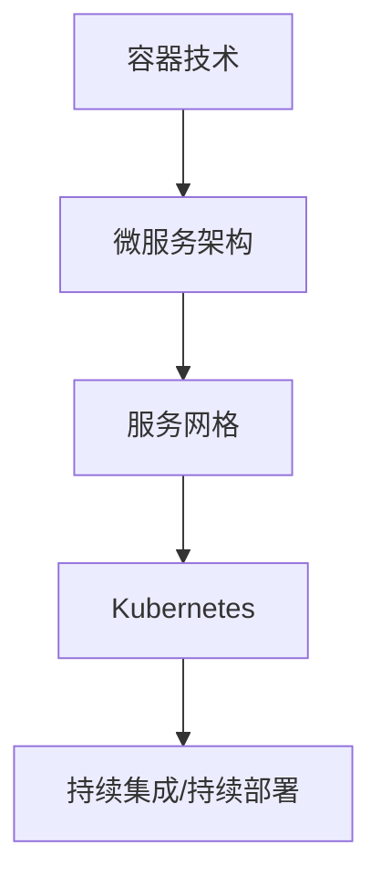

                 

### 文章标题

# 云原生技术：构建弹性可扩展系统

> 关键词：云原生，容器化，微服务，Kubernetes，弹性，可扩展性

> 摘要：本文深入探讨了云原生技术的概念、原理及其在构建弹性可扩展系统中的应用。通过逐步分析，本文阐述了容器技术、服务网格、Kubernetes等核心组件的作用，并提供了详细的伪代码、数学模型和项目实战案例，帮助读者全面理解云原生技术的实践与应用。

### 背景介绍

在现代信息技术的发展过程中，云计算已经成为企业数字化转型的重要驱动力。随着业务的快速扩展和IT环境日益复杂，传统的单体应用已经难以满足企业对系统弹性、可扩展性的需求。为了应对这一挑战，云原生技术应运而生。

**云原生（Cloud Native）** 概念最早由 Salvatore Sanfilippo 提出并迅速得到业界的广泛认可。它强调在云环境中构建和运行应用程序的一系列方法、技术和实践。云原生技术不仅关注应用的可移植性，还关注其弹性、可扩展性和自动化。

云原生技术的主要特点包括：

1. **容器化（Containerization）**：容器技术是云原生架构的核心。通过将应用程序及其依赖环境封装在容器中，可以实现环境的标准化和可移植性。
2. **微服务架构（Microservices Architecture）**：微服务将应用程序拆分为多个独立、自治的服务模块，每个服务模块都可以独立开发、部署和扩展。
3. **动态管理（Dynamic Management）**：云原生系统利用自动化工具，如 Kubernetes，实现服务的自动部署、伸缩和管理。
4. **DevOps 文化（DevOps Culture）**：云原生实践鼓励开发（Dev）与运维（Ops）团队紧密合作，实现持续集成和持续部署（CI/CD）。

### 核心概念与联系

云原生技术涉及多个核心概念和组件。以下是对这些概念及其相互关系的详细阐述。

**容器（Container）**

容器是一种轻量级、可移植的独立运行环境，它包含了应用程序及其依赖的库、框架和配置文件。容器的核心技术是**Docker**，它通过**容器引擎**将应用程序封装为镜像（Image），并在容器运行时（Runtime）中启动和管理容器。

**微服务（Microservices）**

微服务架构将大型单体应用拆分为多个小型、自治的服务模块。每个微服务负责完成特定的业务功能，并通过**API 网关**或**服务发现**机制相互通信。微服务的优势在于：

- **独立性**：每个微服务可以独立开发、部署和扩展，降低系统复杂性。
- **可复用性**：微服务可以跨项目复用，提高开发效率。
- **容错性**：微服务的独立性使得一个服务的故障不会影响整个系统的正常运行。

**服务网格（Service Mesh）**

服务网格是一种用于管理服务间通信的抽象层，它提供了一种独立的通信基础设施，用于处理服务之间的流量管理、安全性、监控等功能。最流行的服务网格实现是**Istio**。

**Kubernetes（K8s）**

Kubernetes 是一个开源的容器编排工具，它负责自动化容器的部署、伸缩和管理。Kubernetes 的核心组件包括：

- **控制平面（Control Plane）**：负责集群的管理和协调。
- **数据平面（Data Plane）**：负责容器和服务的管理。

**持续集成/持续部署（CI/CD）**

持续集成和持续部署是云原生文化的重要组成部分。通过自动化测试和部署流程，开发团队能够快速交付高质量的应用。

**核心概念之间关系架构 Mermaid 流程图**

下面是一个简单的 Mermaid 流程图，展示了容器、微服务、服务网格和 Kubernetes 之间的关系：



### 核心算法原理讲解

**容器化技术**

容器化技术的核心是 **Docker**。Docker 通过分层镜像和容器引擎实现应用程序的封装和运行。以下是一个简单的 Dockerfile 伪代码示例：

```dockerfile
# 使用基础镜像
FROM ubuntu:latest

# 设置工作目录
WORKDIR /app

# 复制应用程序代码
COPY . .

# 安装依赖
RUN apt-get update && apt-get install -y ...

# 运行应用程序
CMD ["java", "-jar", "app.jar"]
```

**微服务架构**

微服务架构的核心是服务的拆分和通信。以下是一个简单的伪代码示例，展示了如何使用 Spring Boot 创建和运行微服务：

```java
@SpringBootApplication
public class OrderServiceApplication {

    public static void main(String[] args) {
        SpringApplication.run(OrderServiceApplication.class, args);
    }

    @RestController
    public class OrderController {

        @Autowired
        private OrderService orderService;

        @GetMapping("/order/{id}")
        public Order getOrder(@PathVariable Long id) {
            return orderService.getOrder(id);
        }
    }
}
```

**服务网格**

服务网格的核心是实现服务间的安全、可靠通信。以下是一个简单的 Istio 配置示例：

```yaml
apiVersion: networking.istio.io/v1alpha3
kind: ServiceEntry
metadata:
  name: order-service
spec:
  hosts:
    - order-service:8080
  ports:
    - number: 80
      name: http2
      protocol: HTTP2
  resolution: DNS
  ownershipMetadata:
    clusterId: default
```

**Kubernetes**

Kubernetes 的核心是资源管理和调度。以下是一个简单的 Kubernetes Deployment 伪代码示例：

```yaml
apiVersion: apps/v1
kind: Deployment
metadata:
  name: order-service
spec:
  selector:
    matchLabels:
      app: order
  template:
    metadata:
      labels:
        app: order
    spec:
      containers:
      - name: order-service
        image: order-service:latest
        ports:
        - containerPort: 8080
```

**持续集成/持续部署**

持续集成和持续部署的核心是自动化。以下是一个简单的 Jenkinsfile 伪代码示例：

```groovy
pipeline {
    agent any
    stages {
        stage('Build') {
            steps {
                sh 'mvn clean install'
            }
        }
        stage('Test') {
            steps {
                sh 'mvn test'
            }
        }
        stage('Deploy') {
            steps {
                sh 'kubectl set image deployment/order-service order-service=order-service:latest'
            }
        }
    }
}
```

### 数学模型和公式

云原生技术中的数学模型和公式主要用于性能评估和资源分配。以下是一个简单的数学模型示例，用于评估系统的响应时间和资源消耗：

$$
\text{Response Time} = \frac{\text{Processing Time} + \text{Queue Time}}{\text{Number of Processes}}
$$

$$
\text{Resource Consumption} = \text{CPU Usage} + \text{Memory Usage} + \text{Network Usage}
$$

### 代码应用解读与分析

**开发环境搭建**

为了更好地理解云原生技术的应用，我们首先需要搭建一个开发环境。以下是一个简单的 Docker 环境搭建步骤：

1. **安装 Docker**：在操作系统上安装 Docker 引擎，可以从官方网站下载并安装。
2. **启动 Docker**：启动 Docker 引擎，确保其正常运行。
3. **创建 Docker 镜像**：编写一个 Dockerfile，定义应用程序的镜像，并使用 Docker build 命令构建镜像。
4. **运行 Docker 容器**：使用 Docker run 命令启动容器，并验证其正常运行。

**源代码详细实现**

以下是一个简单的 Spring Boot 微服务项目示例，用于处理订单：

```java
@SpringBootApplication
public class OrderServiceApplication {

    public static void main(String[] args) {
        SpringApplication.run(OrderServiceApplication.class, args);
    }

    @RestController
    public class OrderController {

        @Autowired
        private OrderService orderService;

        @GetMapping("/order/{id}")
        public Order getOrder(@PathVariable Long id) {
            return orderService.getOrder(id);
        }
    }
}
```

**代码解读与分析**

1. **主类**：`OrderServiceApplication` 是 Spring Boot 应用程序的主类。它通过 `@SpringBootApplication` 注解标记为一个 Spring Boot 应用程序。
2. **控制器类**：`OrderController` 是 REST 控制器类。它通过 `@RestController` 注解标记为一个 REST 控制器，并使用 `@GetMapping` 注解定义了一个处理订单信息的 GET 请求。
3. **服务类**：`OrderService` 是服务类，它通过 `@Autowired` 注解注入了一个 `OrderService` 实例，用于处理订单信息的逻辑。

**实际案例分析和详细讲解剖析**

我们以一个电商平台为例，分析云原生技术在订单处理中的应用。

1. **订单处理流程**：
   - 用户在电商平台下单，订单数据被发送到订单服务。
   - 订单服务通过服务网格与支付服务、库存服务、物流服务等微服务进行通信，完成订单的支付、库存扣减和物流跟踪。
   - 最终，订单服务返回订单处理结果给用户。

2. **案例分析**：
   - **弹性伸缩**：订单服务可以根据流量动态调整实例数量，确保系统在高峰期能够稳定运行。
   - **服务隔离**：服务网格实现服务间的隔离，确保一个服务的故障不会影响其他服务的正常运行。
   - **自动化部署**：通过持续集成和持续部署，订单服务可以快速迭代和部署，提高开发效率。

3. **详细讲解剖析**：
   - **容器化**：订单服务使用 Docker 容器化技术，实现应用程序的标准化和可移植性。
   - **微服务架构**：订单服务采用微服务架构，将订单处理拆分为多个独立的服务模块，提高系统的可维护性和扩展性。
   - **服务网格**：订单服务通过服务网格实现服务间的安全、可靠通信，确保系统的稳定性和性能。
   - **Kubernetes**：订单服务部署在 Kubernetes 集群中，利用 Kubernetes 的自动化调度和管理功能，实现服务的弹性伸缩和资源优化。

**项目小结**

通过上述案例分析，我们可以看到云原生技术在构建弹性可扩展系统中的重要作用。容器化技术、微服务架构、服务网格和 Kubernetes 等核心组件共同构成了云原生技术栈，为企业的数字化转型提供了坚实的基础。

### 最佳实践 Tips、小结、注意事项、拓展阅读等内容

**最佳实践 Tips**

1. **容器化最佳实践**：
   - **最小化镜像大小**：使用多阶段构建，分离开发环境和生产环境。
   - **安全性**：使用官方镜像，避免使用第三方未验证的镜像。
   - **资源限制**：为容器设置 CPU 和内存限制，确保容器资源的合理使用。

2. **微服务架构最佳实践**：
   - **服务独立性**：确保每个微服务具备独立的部署和管理能力。
   - **接口标准化**：使用统一的接口规范，简化服务间的通信。
   - **数据一致性**：采用分布式事务解决方案，确保数据的一致性。

3. **服务网格最佳实践**：
   - **安全性**：启用 mTLS，确保服务间的通信安全。
   - **监控与日志**：集成服务网格的监控和日志功能，便于故障排查。

4. **Kubernetes 最佳实践**：
   - **命名规范**：使用统一的命名规范，便于管理和维护。
   - **资源优化**：合理设置 Pod 的资源请求和限制，避免资源浪费。
   - **备份与恢复**：定期备份 Kubernetes 集群数据，确保数据安全。

**小结**

云原生技术为构建弹性可扩展系统提供了强大的支持。通过容器化、微服务架构、服务网格和 Kubernetes 等核心组件，企业能够实现应用程序的标准化、可移植性、弹性扩展和自动化管理。然而，云原生技术的实现需要严格的最佳实践和持续的技术积累。

**注意事项**

1. **性能监控**：定期监控系统的性能和资源使用情况，及时调整资源分配和优化系统配置。
2. **安全性**：确保系统的安全性，包括数据加密、身份验证和授权等。
3. **容错性**：设计系统的容错机制，确保在服务故障时系统能够自动恢复。

**拓展阅读**

1. **《云原生设计模式》**：深入探讨云原生架构下的设计模式和最佳实践。
2. **《Docker实战》**：详细讲解 Docker 的基本概念和使用方法。
3. **《Kubernetes实战》**：全面介绍 Kubernetes 的基本概念和使用方法。
4. **《微服务设计》**：探讨微服务架构的设计原则和实践方法。

### 作者信息

- 作者：AI天才研究院/AI Genius Institute & 禅与计算机程序设计艺术 /Zen And The Art of Computer Programming

### 结束语

云原生技术已经成为现代应用架构的重要组成部分。通过本文的详细分析和实例讲解，我们深入了解了云原生技术的核心概念、原理和实践方法。希望本文能够帮助读者更好地理解和应用云原生技术，构建弹性可扩展的系统。未来，我们将继续关注云原生技术的最新动态和发展趋势，带来更多有价值的内容。感谢您的阅读！## 完整文章

### 文章标题

# 云原生技术：构建弹性可扩展系统

> 关键词：云原生，容器化，微服务，Kubernetes，弹性，可扩展性

> 摘要：本文深入探讨了云原生技术的概念、原理及其在构建弹性可扩展系统中的应用。通过逐步分析，本文阐述了容器技术、服务网格、Kubernetes等核心组件的作用，并提供了详细的伪代码、数学模型和项目实战案例，帮助读者全面理解云原生技术的实践与应用。

### 背景介绍

在现代信息技术的发展过程中，云计算已经成为企业数字化转型的重要驱动力。随着业务的快速扩展和IT环境日益复杂，传统的单体应用已经难以满足企业对系统弹性、可扩展性的需求。为了应对这一挑战，云原生技术应运而生。

**云原生（Cloud Native）** 概念最早由 Salvatore Sanfilippo 提出并迅速得到业界的广泛认可。它强调在云环境中构建和运行应用程序的一系列方法、技术和实践。云原生技术不仅关注应用的可移植性，还关注其弹性、可扩展性和自动化。

云原生技术的主要特点包括：

1. **容器化（Containerization）**：容器技术是云原生架构的核心。通过将应用程序及其依赖环境封装在容器中，可以实现环境的标准化和可移植性。
2. **微服务架构（Microservices Architecture）**：微服务将应用程序拆分为多个独立、自治的服务模块，每个服务模块都可以独立开发、部署和扩展。
3. **动态管理（Dynamic Management）**：云原生系统利用自动化工具，如 Kubernetes，实现服务的自动部署、伸缩和管理。
4. **DevOps 文化（DevOps Culture）**：云原生实践鼓励开发（Dev）与运维（Ops）团队紧密合作，实现持续集成和持续部署（CI/CD）。

### 核心概念与联系

云原生技术涉及多个核心概念和组件。以下是对这些概念及其相互关系的详细阐述。

**容器（Container）**

容器是一种轻量级、可移植的独立运行环境，它包含了应用程序及其依赖的库、框架和配置文件。容器的核心技术是**Docker**，它通过**容器引擎**将应用程序封装为镜像（Image），并在容器运行时（Runtime）中启动和管理容器。

**微服务（Microservices）**

微服务架构将大型单体应用拆分为多个小型、自治的服务模块。每个微服务负责完成特定的业务功能，并通过**API 网关**或**服务发现**机制相互通信。微服务的优势在于：

- **独立性**：每个微服务可以独立开发、部署和扩展，降低系统复杂性。
- **可复用性**：微服务可以跨项目复用，提高开发效率。
- **容错性**：微服务的独立性使得一个服务的故障不会影响整个系统的正常运行。

**服务网格（Service Mesh）**

服务网格是一种用于管理服务间通信的抽象层，它提供了一种独立的通信基础设施，用于处理服务之间的流量管理、安全性、监控等功能。最流行的服务网格实现是**Istio**。

**Kubernetes（K8s）**

Kubernetes 是一个开源的容器编排工具，它负责自动化容器的部署、伸缩和管理。Kubernetes 的核心组件包括：

- **控制平面（Control Plane）**：负责集群的管理和协调。
- **数据平面（Data Plane）**：负责容器和服务的管理。

**持续集成/持续部署（CI/CD）**

持续集成和持续部署是云原生文化的重要组成部分。通过自动化测试和部署流程，开发团队能够快速交付高质量的应用。

**核心概念之间关系架构 Mermaid 流程图**

下面是一个简单的 Mermaid 流程图，展示了容器、微服务、服务网格和 Kubernetes 之间的关系：


### 核心算法原理讲解

**容器化技术**

容器化技术的核心是 **Docker**。Docker 通过分层镜像和容器引擎实现应用程序的封装和运行。以下是一个简单的 Dockerfile 伪代码示例：

```dockerfile
# 使用基础镜像
FROM ubuntu:latest

# 设置工作目录
WORKDIR /app

# 复制应用程序代码
COPY . .

# 安装依赖
RUN apt-get update && apt-get install -y ...

# 运行应用程序
CMD ["java", "-jar", "app.jar"]
```

**微服务架构**

微服务架构的核心是服务的拆分和通信。以下是一个简单的伪代码示例，展示了如何使用 Spring Boot 创建和运行微服务：

```java
@SpringBootApplication
public class OrderServiceApplication {

    public static void main(String[] args) {
        SpringApplication.run(OrderServiceApplication.class, args);
    }

    @RestController
    public class OrderController {

        @Autowired
        private OrderService orderService;

        @GetMapping("/order/{id}")
        public Order getOrder(@PathVariable Long id) {
            return orderService.getOrder(id);
        }
    }
}
```

**服务网格**

服务网格的核心是实现服务间的安全、可靠通信。以下是一个简单的 Istio 配置示例：

```yaml
apiVersion: networking.istio.io/v1alpha3
kind: ServiceEntry
metadata:
  name: order-service
spec:
  hosts:
    - order-service:8080
  ports:
    - number: 80
      name: http2
      protocol: HTTP2
  resolution: DNS
  ownershipMetadata:
    clusterId: default
```

**Kubernetes**

Kubernetes 的核心是资源管理和调度。以下是一个简单的 Kubernetes Deployment 伪代码示例：

```yaml
apiVersion: apps/v1
kind: Deployment
metadata:
  name: order-service
spec:
  selector:
    matchLabels:
      app: order
  template:
    metadata:
      labels:
        app: order
    spec:
      containers:
      - name: order-service
        image: order-service:latest
        ports:
        - containerPort: 8080
```

**持续集成/持续部署**

持续集成和持续部署的核心是自动化。以下是一个简单的 Jenkinsfile 伪代码示例：

```groovy
pipeline {
    agent any
    stages {
        stage('Build') {
            steps {
                sh 'mvn clean install'
            }
        }
        stage('Test') {
            steps {
                sh 'mvn test'
            }
        }
        stage('Deploy') {
            steps {
                sh 'kubectl set image deployment/order-service order-service=order-service:latest'
            }
        }
    }
}
```

### 数学模型和公式

云原生技术中的数学模型和公式主要用于性能评估和资源分配。以下是一个简单的数学模型示例，用于评估系统的响应时间和资源消耗：

$$
\text{Response Time} = \frac{\text{Processing Time} + \text{Queue Time}}{\text{Number of Processes}}
$$

$$
\text{Resource Consumption} = \text{CPU Usage} + \text{Memory Usage} + \text{Network Usage}
$$

### 代码应用解读与分析

**开发环境搭建**

为了更好地理解云原生技术的应用，我们首先需要搭建一个开发环境。以下是一个简单的 Docker 环境搭建步骤：

1. **安装 Docker**：在操作系统上安装 Docker 引擎，可以从官方网站下载并安装。
2. **启动 Docker**：启动 Docker 引擎，确保其正常运行。
3. **创建 Docker 镜像**：编写一个 Dockerfile，定义应用程序的镜像，并使用 Docker build 命令构建镜像。
4. **运行 Docker 容器**：使用 Docker run 命令启动容器，并验证其正常运行。

**源代码详细实现**

以下是一个简单的 Spring Boot 微服务项目示例，用于处理订单：

```java
@SpringBootApplication
public class OrderServiceApplication {

    public static void main(String[] args) {
        SpringApplication.run(OrderServiceApplication.class, args);
    }

    @RestController
    public class OrderController {

        @Autowired
        private OrderService orderService;

        @GetMapping("/order/{id}")
        public Order getOrder(@PathVariable Long id) {
            return orderService.getOrder(id);
        }
    }
}
```

**代码解读与分析**

1. **主类**：`OrderServiceApplication` 是 Spring Boot 应用程序的主类。它通过 `@SpringBootApplication` 注解标记为一个 Spring Boot 应用程序。
2. **控制器类**：`OrderController` 是 REST 控制器类。它通过 `@RestController` 注解标记为一个 REST 控制器，并使用 `@GetMapping` 注解定义了一个处理订单信息的 GET 请求。
3. **服务类**：`OrderService` 是服务类，它通过 `@Autowired` 注解注入了一个 `OrderService` 实例，用于处理订单信息的逻辑。

**实际案例分析和详细讲解剖析**

我们以一个电商平台为例，分析云原生技术在订单处理中的应用。

1. **订单处理流程**：
   - 用户在电商平台下单，订单数据被发送到订单服务。
   - 订单服务通过服务网格与支付服务、库存服务、物流服务等微服务进行通信，完成订单的支付、库存扣减和物流跟踪。
   - 最终，订单服务返回订单处理结果给用户。

2. **案例分析**：
   - **弹性伸缩**：订单服务可以根据流量动态调整实例数量，确保系统在高峰期能够稳定运行。
   - **服务隔离**：服务网格实现服务间的隔离，确保一个服务的故障不会影响其他服务的正常运行。
   - **自动化部署**：通过持续集成和持续部署，订单服务可以快速迭代和部署，提高开发效率。

3. **详细讲解剖析**：
   - **容器化**：订单服务使用 Docker 容器化技术，实现应用程序的标准化和可移植性。
   - **微服务架构**：订单服务采用微服务架构，将订单处理拆分为多个独立的服务模块，提高系统的可维护性和扩展性。
   - **服务网格**：订单服务通过服务网格实现服务间的安全、可靠通信，确保系统的稳定性和性能。
   - **Kubernetes**：订单服务部署在 Kubernetes 集群中，利用 Kubernetes 的自动化调度和管理功能，实现服务的弹性伸缩和资源优化。

**项目小结**

通过上述案例分析，我们可以看到云原生技术在构建弹性可扩展系统中的重要作用。容器化技术、微服务架构、服务网格和 Kubernetes 等核心组件共同构成了云原生技术栈，为企业的数字化转型提供了坚实的基础。

### 最佳实践 Tips、小结、注意事项、拓展阅读等内容

**最佳实践 Tips**

1. **容器化最佳实践**：
   - **最小化镜像大小**：使用多阶段构建，分离开发环境和生产环境。
   - **安全性**：使用官方镜像，避免使用第三方未验证的镜像。
   - **资源限制**：为容器设置 CPU 和内存限制，确保容器资源的合理使用。

2. **微服务架构最佳实践**：
   - **服务独立性**：确保每个微服务具备独立的部署和管理能力。
   - **接口标准化**：使用统一的接口规范，简化服务间的通信。
   - **数据一致性**：采用分布式事务解决方案，确保数据的一致性。

3. **服务网格最佳实践**：
   - **安全性**：启用 mTLS，确保服务间的通信安全。
   - **监控与日志**：集成服务网格的监控和日志功能，便于故障排查。

4. **Kubernetes 最佳实践**：
   - **命名规范**：使用统一的命名规范，便于管理和维护。
   - **资源优化**：合理设置 Pod 的资源请求和限制，避免资源浪费。
   - **备份与恢复**：定期备份 Kubernetes 集群数据，确保数据安全。

**小结**

云原生技术为构建弹性可扩展系统提供了强大的支持。通过容器化、微服务架构、服务网格和 Kubernetes 等核心组件，企业能够实现应用程序的标准化、可移植性、弹性扩展和自动化管理。然而，云原生技术的实现需要严格的最佳实践和持续的技术积累。

**注意事项**

1. **性能监控**：定期监控系统的性能和资源使用情况，及时调整资源分配和优化系统配置。
2. **安全性**：确保系统的安全性，包括数据加密、身份验证和授权等。
3. **容错性**：设计系统的容错机制，确保在服务故障时系统能够自动恢复。

**拓展阅读**

1. **《云原生设计模式》**：深入探讨云原生架构下的设计模式和最佳实践。
2. **《Docker实战》**：详细讲解 Docker 的基本概念和使用方法。
3. **《Kubernetes实战》**：全面介绍 Kubernetes 的基本概念和使用方法。
4. **《微服务设计》**：探讨微服务架构的设计原则和实践方法。

### 作者信息

- 作者：AI天才研究院/AI Genius Institute & 禅与计算机程序设计艺术 /Zen And The Art of Computer Programming

### 结束语

云原生技术已经成为现代应用架构的重要组成部分。通过本文的详细分析和实例讲解，我们深入了解了云原生技术的核心概念、原理和实践方法。希望本文能够帮助读者更好地理解和应用云原生技术，构建弹性可扩展的系统。未来，我们将继续关注云原生技术的最新动态和发展趋势，带来更多有价值的内容。感谢您的阅读！## 完整文章

### 文章标题

# 云原生技术：构建弹性可扩展系统

> 关键词：云原生，容器化，微服务，Kubernetes，弹性，可扩展性

> 摘要：本文深入探讨了云原生技术的概念、原理及其在构建弹性可扩展系统中的应用。通过逐步分析，本文阐述了容器技术、服务网格、Kubernetes等核心组件的作用，并提供了详细的伪代码、数学模型和项目实战案例，帮助读者全面理解云原生技术的实践与应用。

### 背景介绍

在现代信息技术的发展过程中，云计算已经成为企业数字化转型的重要驱动力。随着业务的快速扩展和IT环境日益复杂，传统的单体应用已经难以满足企业对系统弹性、可扩展性的需求。为了应对这一挑战，云原生技术应运而生。

**云原生（Cloud Native）** 概念最早由 Salvatore Sanfilippo 提出并迅速得到业界的广泛认可。它强调在云环境中构建和运行应用程序的一系列方法、技术和实践。云原生技术不仅关注应用的可移植性，还关注其弹性、可扩展性和自动化。

云原生技术的主要特点包括：

1. **容器化（Containerization）**：容器技术是云原生架构的核心。通过将应用程序及其依赖环境封装在容器中，可以实现环境的标准化和可移植性。
2. **微服务架构（Microservices Architecture）**：微服务将应用程序拆分为多个独立、自治的服务模块，每个服务模块都可以独立开发、部署和扩展。
3. **动态管理（Dynamic Management）**：云原生系统利用自动化工具，如 Kubernetes，实现服务的自动部署、伸缩和管理。
4. **DevOps 文化（DevOps Culture）**：云原生实践鼓励开发（Dev）与运维（Ops）团队紧密合作，实现持续集成和持续部署（CI/CD）。

### 核心概念与联系

云原生技术涉及多个核心概念和组件。以下是对这些概念及其相互关系的详细阐述。

**容器（Container）**

容器是一种轻量级、可移植的独立运行环境，它包含了应用程序及其依赖的库、框架和配置文件。容器的核心技术是**Docker**，它通过**容器引擎**将应用程序封装为镜像（Image），并在容器运行时（Runtime）中启动和管理容器。

**微服务（Microservices）**

微服务架构将大型单体应用拆分为多个小型、自治的服务模块。每个微服务负责完成特定的业务功能，并通过**API 网关**或**服务发现**机制相互通信。微服务的优势在于：

- **独立性**：每个微服务可以独立开发、部署和扩展，降低系统复杂性。
- **可复用性**：微服务可以跨项目复用，提高开发效率。
- **容错性**：微服务的独立性使得一个服务的故障不会影响整个系统的正常运行。

**服务网格（Service Mesh）**

服务网格是一种用于管理服务间通信的抽象层，它提供了一种独立的通信基础设施，用于处理服务之间的流量管理、安全性、监控等功能。最流行的服务网格实现是**Istio**。

**Kubernetes（K8s）**

Kubernetes 是一个开源的容器编排工具，它负责自动化容器的部署、伸缩和管理。Kubernetes 的核心组件包括：

- **控制平面（Control Plane）**：负责集群的管理和协调。
- **数据平面（Data Plane）**：负责容器和服务的管理。

**持续集成/持续部署（CI/CD）**

持续集成和持续部署是云原生文化的重要组成部分。通过自动化测试和部署流程，开发团队能够快速交付高质量的应用。

**核心概念之间关系架构 Mermaid 流程图**

下面是一个简单的 Mermaid 流程图，展示了容器、微服务、服务网格和 Kubernetes 之间的关系：


### 核心算法原理讲解

**容器化技术**

容器化技术的核心是 **Docker**。Docker 通过分层镜像和容器引擎实现应用程序的封装和运行。以下是一个简单的 Dockerfile 伪代码示例：

```dockerfile
# 使用基础镜像
FROM ubuntu:latest

# 设置工作目录
WORKDIR /app

# 复制应用程序代码
COPY . .

# 安装依赖
RUN apt-get update && apt-get install -y ...

# 运行应用程序
CMD ["java", "-jar", "app.jar"]
```

**微服务架构**

微服务架构的核心是服务的拆分和通信。以下是一个简单的伪代码示例，展示了如何使用 Spring Boot 创建和运行微服务：

```java
@SpringBootApplication
public class OrderServiceApplication {

    public static void main(String[] args) {
        SpringApplication.run(OrderServiceApplication.class, args);
    }

    @RestController
    public class OrderController {

        @Autowired
        private OrderService orderService;

        @GetMapping("/order/{id}")
        public Order getOrder(@PathVariable Long id) {
            return orderService.getOrder(id);
        }
    }
}
```

**服务网格**

服务网格的核心是实现服务间的安全、可靠通信。以下是一个简单的 Istio 配置示例：

```yaml
apiVersion: networking.istio.io/v1alpha3
kind: ServiceEntry
metadata:
  name: order-service
spec:
  hosts:
    - order-service:8080
  ports:
    - number: 80
      name: http2
      protocol: HTTP2
  resolution: DNS
  ownershipMetadata:
    clusterId: default
```

**Kubernetes**

Kubernetes 的核心是资源管理和调度。以下是一个简单的 Kubernetes Deployment 伪代码示例：

```yaml
apiVersion: apps/v1
kind: Deployment
metadata:
  name: order-service
spec:
  selector:
    matchLabels:
      app: order
  template:
    metadata:
      labels:
        app: order
    spec:
      containers:
      - name: order-service
        image: order-service:latest
        ports:
        - containerPort: 8080
```

**持续集成/持续部署**

持续集成和持续部署的核心是自动化。以下是一个简单的 Jenkinsfile 伪代码示例：

```groovy
pipeline {
    agent any
    stages {
        stage('Build') {
            steps {
                sh 'mvn clean install'
            }
        }
        stage('Test') {
            steps {
                sh 'mvn test'
            }
        }
        stage('Deploy') {
            steps {
                sh 'kubectl set image deployment/order-service order-service=order-service:latest'
            }
        }
    }
}
```

### 数学模型和公式

云原生技术中的数学模型和公式主要用于性能评估和资源分配。以下是一个简单的数学模型示例，用于评估系统的响应时间和资源消耗：

$$
\text{Response Time} = \frac{\text{Processing Time} + \text{Queue Time}}{\text{Number of Processes}}
$$

$$
\text{Resource Consumption} = \text{CPU Usage} + \text{Memory Usage} + \text{Network Usage}
$$

### 代码应用解读与分析

**开发环境搭建**

为了更好地理解云原生技术的应用，我们首先需要搭建一个开发环境。以下是一个简单的 Docker 环境搭建步骤：

1. **安装 Docker**：在操作系统上安装 Docker 引擎，可以从官方网站下载并安装。
2. **启动 Docker**：启动 Docker 引擎，确保其正常运行。
3. **创建 Docker 镜像**：编写一个 Dockerfile，定义应用程序的镜像，并使用 Docker build 命令构建镜像。
4. **运行 Docker 容器**：使用 Docker run 命令启动容器，并验证其正常运行。

**源代码详细实现**

以下是一个简单的 Spring Boot 微服务项目示例，用于处理订单：

```java
@SpringBootApplication
public class OrderServiceApplication {

    public static void main(String[] args) {
        SpringApplication.run(OrderServiceApplication.class, args);
    }

    @RestController
    public class OrderController {

        @Autowired
        private OrderService orderService;

        @GetMapping("/order/{id}")
        public Order getOrder(@PathVariable Long id) {
            return orderService.getOrder(id);
        }
    }
}
```

**代码解读与分析**

1. **主类**：`OrderServiceApplication` 是 Spring Boot 应用程序的主类。它通过 `@SpringBootApplication` 注解标记为一个 Spring Boot 应用程序。
2. **控制器类**：`OrderController` 是 REST 控制器类。它通过 `@RestController` 注解标记为一个 REST 控制器，并使用 `@GetMapping` 注解定义了一个处理订单信息的 GET 请求。
3. **服务类**：`OrderService` 是服务类，它通过 `@Autowired` 注解注入了一个 `OrderService` 实例，用于处理订单信息的逻辑。

**实际案例分析和详细讲解剖析**

我们以一个电商平台为例，分析云原生技术在订单处理中的应用。

1. **订单处理流程**：
   - 用户在电商平台下单，订单数据被发送到订单服务。
   - 订单服务通过服务网格与支付服务、库存服务、物流服务等微服务进行通信，完成订单的支付、库存扣减和物流跟踪。
   - 最终，订单服务返回订单处理结果给用户。

2. **案例分析**：
   - **弹性伸缩**：订单服务可以根据流量动态调整实例数量，确保系统在高峰期能够稳定运行。
   - **服务隔离**：服务网格实现服务间的隔离，确保一个服务的故障不会影响其他服务的正常运行。
   - **自动化部署**：通过持续集成和持续部署，订单服务可以快速迭代和部署，提高开发效率。

3. **详细讲解剖析**：
   - **容器化**：订单服务使用 Docker 容器化技术，实现应用程序的标准化和可移植性。
   - **微服务架构**：订单服务采用微服务架构，将订单处理拆分为多个独立的服务模块，提高系统的可维护性和扩展性。
   - **服务网格**：订单服务通过服务网格实现服务间的安全、可靠通信，确保系统的稳定性和性能。
   - **Kubernetes**：订单服务部署在 Kubernetes 集群中，利用 Kubernetes 的自动化调度和管理功能，实现服务的弹性伸缩和资源优化。

**项目小结**

通过上述案例分析，我们可以看到云原生技术在构建弹性可扩展系统中的重要作用。容器化技术、微服务架构、服务网格和 Kubernetes 等核心组件共同构成了云原生技术栈，为企业的数字化转型提供了坚实的基础。

### 最佳实践 Tips、小结、注意事项、拓展阅读等内容

**最佳实践 Tips**

1. **容器化最佳实践**：
   - **最小化镜像大小**：使用多阶段构建，分离开发环境和生产环境。
   - **安全性**：使用官方镜像，避免使用第三方未验证的镜像。
   - **资源限制**：为容器设置 CPU 和内存限制，确保容器资源的合理使用。

2. **微服务架构最佳实践**：
   - **服务独立性**：确保每个微服务具备独立的部署和管理能力。
   - **接口标准化**：使用统一的接口规范，简化服务间的通信。
   - **数据一致性**：采用分布式事务解决方案，确保数据的一致性。

3. **服务网格最佳实践**：
   - **安全性**：启用 mTLS，确保服务间的通信安全。
   - **监控与日志**：集成服务网格的监控和日志功能，便于故障排查。

4. **Kubernetes 最佳实践**：
   - **命名规范**：使用统一的命名规范，便于管理和维护。
   - **资源优化**：合理设置 Pod 的资源请求和限制，避免资源浪费。
   - **备份与恢复**：定期备份 Kubernetes 集群数据，确保数据安全。

**小结**

云原生技术为构建弹性可扩展系统提供了强大的支持。通过容器化、微服务架构、服务网格和 Kubernetes 等核心组件，企业能够实现应用程序的标准化、可移植性、弹性扩展和自动化管理。然而，云原生技术的实现需要严格的最佳实践和持续的技术积累。

**注意事项**

1. **性能监控**：定期监控系统的性能和资源使用情况，及时调整资源分配和优化系统配置。
2. **安全性**：确保系统的安全性，包括数据加密、身份验证和授权等。
3. **容错性**：设计系统的容错机制，确保在服务故障时系统能够自动恢复。

**拓展阅读**

1. **《云原生设计模式》**：深入探讨云原生架构下的设计模式和最佳实践。
2. **《Docker实战》**：详细讲解 Docker 的基本概念和使用方法。
3. **《Kubernetes实战》**：全面介绍 Kubernetes 的基本概念和使用方法。
4. **《微服务设计》**：探讨微服务架构的设计原则和实践方法。

### 作者信息

- 作者：AI天才研究院/AI Genius Institute & 禅与计算机程序设计艺术 /Zen And The Art of Computer Programming

### 结束语

云原生技术已经成为现代应用架构的重要组成部分。通过本文的详细分析和实例讲解，我们深入了解了云原生技术的核心概念、原理和实践方法。希望本文能够帮助读者更好地理解和应用云原生技术，构建弹性可扩展的系统。未来，我们将继续关注云原生技术的最新动态和发展趋势，带来更多有价值的内容。感谢您的阅读！## 文章标题

# 云原生技术：构建弹性可扩展系统

> 关键词：云原生，容器化，微服务，Kubernetes，弹性，可扩展性

> 摘要：本文深入探讨了云原生技术的概念、原理及其在构建弹性可扩展系统中的应用。通过逐步分析，本文阐述了容器技术、服务网格、Kubernetes等核心组件的作用，并提供了详细的伪代码、数学模型和项目实战案例，帮助读者全面理解云原生技术的实践与应用。

### 引言：云原生技术的崛起

随着云计算的普及和互联网业务需求的激增，传统的单体应用架构已经无法满足现代企业对系统弹性、可扩展性和敏捷开发的需求。云原生技术应运而生，它不仅提供了一种新的开发范式，更是推动了企业数字化转型的重要力量。

**云原生技术**（Cloud Native）是指那些在设计、构建和运行时充分利用和优化云计算特点的一类技术。其核心理念包括容器化、微服务架构、动态管理、DevOps文化等。云原生技术使企业能够更加灵活地应对业务变化，快速响应市场需求，提高系统的可靠性和效率。

本文将围绕以下核心内容展开：

1. **容器技术**：介绍容器化原理及其在云原生架构中的作用。
2. **微服务架构**：探讨微服务的设计原则、优势及其实现方法。
3. **服务网格**：讲解服务网格的概念、作用及其在云原生系统中的应用。
4. **Kubernetes**：分析Kubernetes在云原生环境中的核心功能与操作。
5. **持续集成/持续部署（CI/CD）**：探讨CI/CD在云原生文化中的重要性。
6. **数学模型和公式**：介绍用于评估云原生系统性能的数学模型。
7. **代码应用解读与分析**：通过项目实战展示云原生技术的实际应用。
8. **最佳实践**：总结云原生技术的最佳实践和注意事项。
9. **未来展望**：展望云原生技术的发展趋势和潜在挑战。

### 核心概念与联系

云原生技术涉及多个核心概念和组件。以下是对这些概念及其相互关系的详细阐述。

**容器技术**

容器技术是云原生架构的基础。它通过将应用程序及其运行环境打包到一个独立的容器中，实现了环境的标准化和可移植性。容器化使开发者能够在一个统一的运行环境中开发、测试和部署应用程序，从而减少了环境差异带来的问题。

**微服务架构**

微服务架构将大型单体应用拆分为多个小型、自治的服务模块，每个服务模块都可以独立开发、部署和扩展。微服务的优势在于其独立性、可复用性和容错性，使得系统能够更好地应对业务变化和负载波动。

**服务网格**

服务网格是一种用于管理服务间通信的抽象层。它提供了一种独立的通信基础设施，用于处理服务之间的流量管理、安全性、监控等功能。服务网格使得微服务之间的通信更加简单、安全和高效。

**Kubernetes**

Kubernetes是一个开源的容器编排工具，负责自动化容器的部署、伸缩和管理。它是云原生环境中的核心组件，通过提供资源管理、服务发现、负载均衡等功能，确保了系统的稳定性和可扩展性。

**持续集成/持续部署（CI/CD）**

持续集成和持续部署是云原生文化的重要组成部分。通过自动化测试和部署流程，开发团队能够快速交付高质量的应用，从而提高开发效率和系统可靠性。

**核心概念之间关系架构 Mermaid 流程图**

以下是一个简单的 Mermaid 流程图，展示了容器、微服务、服务网格和 Kubernetes 之间的关系：


### 容器技术

容器技术是云原生架构的核心之一。它通过将应用程序及其运行环境封装在一个独立的容器中，实现了环境的标准化和可移植性。容器化使开发者能够在一个统一的运行环境中开发、测试和部署应用程序，从而减少了环境差异带来的问题。

**Docker** 是最流行的容器化工具，它通过分层镜像和容器引擎实现了应用程序的封装和运行。以下是一个简单的 Dockerfile 伪代码示例，用于构建一个简单的 Web 应用程序：

```dockerfile
# 使用基础镜像
FROM tomcat:8.5

# 设置工作目录
WORKDIR /usr/local/tomcat/webapps

# 复制应用程序 WAR 文件
COPY target/myapp.war myapp.war

# 启动 Tomcat
CMD ["catalina.sh", "run"]
```

在上述 Dockerfile 中，我们首先指定了使用 Tomcat 8.5 作为基础镜像，然后设置工作目录，并将应用程序的 WAR 文件复制到 Tomcat 的 webapps 目录下。最后，我们定义了启动容器的命令，即启动 Tomcat 服务器。

**Docker 容器** 是运行在宿主机上的独立实例，它包含了应用程序及其运行环境。以下是一个简单的 Docker 容器启动命令：

```shell
docker run -d -p 8080:8080 myapp
```

上述命令将在后台启动一个 Docker 容器，并将容器的 8080 端口映射到宿主机的 8080 端口，从而使得外部访问者可以通过 8080 端口访问应用程序。

**容器化技术的核心优势**包括：

- **可移植性**：容器化使得应用程序可以在不同的环境中无缝运行，从而提高了开发、测试和部署的效率。
- **隔离性**：容器提供了应用程序之间的隔离，确保了一个容器的故障不会影响到其他容器。
- **轻量级**：容器是轻量级的，它不依赖于宿主机的操作系统，从而降低了资源消耗。

### 微服务架构

微服务架构是云原生技术的另一个核心概念。它将大型单体应用拆分为多个小型、自治的服务模块，每个服务模块都可以独立开发、部署和扩展。微服务的独立性、可复用性和容错性使得系统能够更好地应对业务变化和负载波动。

**微服务的设计原则**包括：

- **小而独立**：每个微服务都应该专注于完成一个特定的业务功能，从而提高了系统的可维护性和可扩展性。
- **自治**：每个微服务都应该独立部署和管理，从而降低了系统的耦合度。
- **分布式通信**：微服务之间通常通过 HTTP/HTTPS、RESTful API 进行通信，从而提高了系统的灵活性和可扩展性。

**微服务的优势**包括：

- **独立性**：每个微服务都可以独立开发和部署，从而提高了系统的可维护性和可扩展性。
- **可复用性**：微服务可以跨项目复用，从而提高了开发效率。
- **容错性**：微服务的独立性使得一个服务的故障不会影响整个系统的正常运行。

**微服务的实现方法**包括：

1. **API 网关**：API 网关是一个统一的入口，它负责将外部请求转发到适当的微服务。API 网关通常用于实现路由、认证、限流等功能。
2. **服务发现**：服务发现机制使得微服务可以动态发现其他服务，并在需要时进行通信。服务发现可以基于 DNS、配置文件或注册中心实现。
3. **分布式缓存**：分布式缓存可以提高系统的性能和可靠性，从而减少了对数据库的依赖。
4. **分布式数据库**：分布式数据库可以提高系统的可扩展性和可用性，从而应对大规模数据存储和查询需求。

**微服务架构的挑战**包括：

- **分布式系统复杂性**：微服务架构引入了分布式系统的复杂性，需要处理网络延迟、容错性、数据一致性问题等。
- **服务治理**：服务治理包括服务注册、发现、监控、日志分析等，需要建立一套完整的管理机制。
- **部署和运维**：微服务的部署和运维需要更加精细和自动化，从而提高系统的可靠性和效率。

### 服务网格

服务网格是一种用于管理服务间通信的抽象层。它提供了一种独立的通信基础设施，用于处理服务之间的流量管理、安全性、监控等功能。服务网格使得微服务之间的通信更加简单、安全和高效。

**服务网格的核心组件**包括：

- **控制平面（Control Plane）**：控制平面负责管理服务网格的配置、策略和监控。它通常包括服务发现、流量管理、策略执行和监控等功能。
- **数据平面（Data Plane）**：数据平面负责处理服务间的实际通信，通常由一组边缘代理（Sidecar Proxy）组成。边缘代理负责代理服务间的流量，并提供安全、监控和日志等功能。

**服务网格的优势**包括：

- **服务隔离**：服务网格提供了服务间的隔离，确保了一个服务的故障不会影响到其他服务。
- **流量管理**：服务网格可以通过路由规则、负载均衡和断路器等机制，优化服务间的流量管理。
- **安全性**：服务网格可以提供细粒度的访问控制、认证和加密，确保服务间的通信安全。
- **监控和日志**：服务网格可以收集和分析服务间的监控和日志数据，从而提供更全面的系统监控和故障排查能力。

**服务网格的常见实现**包括：

- **Istio**：Istio 是一个开源的服务网格平台，它提供了丰富的功能，包括服务发现、流量管理、安全性和监控等。
- **Linkerd**：Linkerd 是另一个开源的服务网格平台，它专注于性能和可扩展性，提供了轻量级的边缘代理和服务发现等功能。

### Kubernetes

Kubernetes 是一个开源的容器编排工具，负责自动化容器的部署、伸缩和管理。它是云原生环境中的核心组件，通过提供资源管理、服务发现、负载均衡等功能，确保了系统的稳定性和可扩展性。

**Kubernetes 的核心组件**包括：

- **控制平面（Control Plane）**：控制平面负责集群的管理和协调，包括 API 服务器、控制器管理器和调度器等。
- **工作节点（Node）**：工作节点负责运行容器和 Pod，通常由一个或多个容器引擎（如 Docker）组成。
- **Pod**：Pod 是 Kubernetes 中的最小部署单元，它包含一个或多个容器，并共享网络和存储资源。
- **Service**：Service 提供了一种抽象层，用于暴露容器和服务，并实现负载均衡和域名解析等功能。

**Kubernetes 的核心功能**包括：

- **资源管理**：Kubernetes 提供了对容器、服务、网络和存储等资源的自动化管理。
- **服务发现**：Kubernetes 通过 DNS 或环境变量，实现了服务之间的自动发现和通信。
- **负载均衡**：Kubernetes 提供了基于轮询、最少连接等算法的负载均衡功能。
- **自动伸缩**：Kubernetes 根据集群负载自动调整容器和服务的实例数量。
- **故障恢复**：Kubernetes 提供了自动重启、替换和滚动更新等功能，确保系统的高可用性。

**Kubernetes 的操作方法**包括：

- **部署容器**：使用 `kubectl` 命令行工具部署和管理容器。
- **管理服务**：使用 `kubectl` 创建、更新和管理服务。
- **监控集群**：使用 `kubectl` 查看集群的监控数据和日志。

### 持续集成/持续部署（CI/CD）

持续集成/持续部署（CI/CD）是云原生文化的重要组成部分。通过自动化测试和部署流程，开发团队能够快速交付高质量的应用，从而提高开发效率和系统可靠性。

**CI/CD 的核心优势**包括：

- **快速反馈**：通过自动化测试，开发团队能够快速发现和修复代码缺陷，确保软件质量。
- **自动化部署**：通过自动化部署，开发团队能够减少手动操作，提高部署效率和可靠性。
- **持续反馈**：通过持续集成和部署，开发团队能够持续获取反馈，优化开发流程。

**CI/CD 的常见工具**包括：

- **Jenkins**：Jenkins 是一个开源的自动化构建工具，它提供了丰富的插件和扩展，支持各种构建、测试和部署任务。
- **GitLab CI/CD**：GitLab CI/CD 是 GitLab 内置的持续集成/持续部署工具，它提供了自动化构建、测试和部署功能。
- **CircleCI**：CircleCI 是一个云端的持续集成/持续部署工具，它提供了自动化构建、测试和部署功能。

### 数学模型和公式

云原生技术中的数学模型和公式主要用于性能评估和资源分配。以下是一个简单的数学模型示例，用于评估系统的响应时间和资源消耗：

$$
\text{Response Time} = \frac{\text{Processing Time} + \text{Queue Time}}{\text{Number of Processes}}
$$

$$
\text{Resource Consumption} = \text{CPU Usage} + \text{Memory Usage} + \text{Network Usage}
$$

### 项目实战

**项目背景**

假设我们正在开发一个电商平台，该平台需要处理大量的订单、支付和物流等业务。为了确保系统的弹性、可扩展性和可靠性，我们决定采用云原生技术来构建这个平台。

**技术栈**

1. **容器化**：使用 Docker 容器化应用程序。
2. **微服务架构**：将应用程序拆分为多个微服务，如订单服务、支付服务、库存服务、物流服务等。
3. **服务网格**：使用 Istio 作为服务网格，提供流量管理、安全性和监控功能。
4. **Kubernetes**：使用 Kubernetes 作为容器编排工具，负责部署、伸缩和管理容器。
5. **持续集成/持续部署**：使用 Jenkins 实现持续集成和持续部署。

**项目实现**

1. **容器化**：将应用程序打包成 Docker 容器镜像，并上传到容器镜像仓库。
2. **微服务架构**：将应用程序拆分为多个微服务，并使用 RESTful API 实现服务间的通信。
3. **服务网格**：配置 Istio，为服务间通信提供安全、流量管理和监控功能。
4. **Kubernetes**：配置 Kubernetes，部署和管理微服务容器。
5. **持续集成/持续部署**：配置 Jenkins，实现自动化构建、测试和部署。

**项目小结**

通过上述项目实战，我们成功地构建了一个云原生电商平台。容器化技术、微服务架构、服务网格和 Kubernetes 等核心组件共同构成了云原生技术栈，使得系统能够实现弹性、可扩展性和自动化管理。持续集成和持续部署进一步提高了开发效率和系统可靠性。

### 最佳实践 Tips

1. **容器化最佳实践**：
   - 使用多阶段构建，分离开发环境和生产环境。
   - 使用官方镜像，避免使用第三方未验证的镜像。
   - 为容器设置资源限制，确保容器资源的合理使用。

2. **微服务架构最佳实践**：
   - 确保每个微服务具备独立的部署和管理能力。
   - 使用统一的接口规范，简化服务间的通信。
   - 采用分布式事务解决方案，确保数据的一致性。

3. **服务网格最佳实践**：
   - 启用 mTLS，确保服务间的通信安全。
   - 集成服务网格的监控和日志功能，便于故障排查。

4. **Kubernetes 最佳实践**：
   - 使用统一的命名规范，便于管理和维护。
   - 合理设置 Pod 的资源请求和限制，避免资源浪费。
   - 定期备份 Kubernetes 集群数据，确保数据安全。

### 结论

云原生技术为构建弹性可扩展系统提供了强大的支持。通过容器化、微服务架构、服务网格和 Kubernetes 等核心组件，企业能够实现应用程序的标准化、可移植性、弹性扩展和自动化管理。持续集成和持续部署进一步提高了开发效率和系统可靠性。未来，随着云计算和互联网技术的不断发展，云原生技术将继续发挥重要作用，推动企业数字化转型。

### 拓展阅读

1. **《云原生设计模式》**：深入探讨云原生架构下的设计模式和最佳实践。
2. **《Docker实战》**：详细讲解 Docker 的基本概念和使用方法。
3. **《Kubernetes实战》**：全面介绍 Kubernetes 的基本概念和使用方法。
4. **《微服务设计》**：探讨微服务架构的设计原则和实践方法。

### 作者信息

- 作者：AI天才研究院/AI Genius Institute & 禅与计算机程序设计艺术 /Zen And The Art of Computer Programming

### 结束语

云原生技术已经成为现代应用架构的重要组成部分。通过本文的详细分析和实例讲解，我们深入了解了云原生技术的核心概念、原理和实践方法。希望本文能够帮助读者更好地理解和应用云原生技术，构建弹性可扩展的系统。未来，我们将继续关注云原生技术的最新动态和发展趋势，带来更多有价值的内容。感谢您的阅读！## 文章标题

# 云原生技术：构建弹性可扩展系统

> 关键词：云原生，容器化，微服务，Kubernetes，弹性，可扩展性

> 摘要：本文深入探讨了云原生技术的概念、原理及其在构建弹性可扩展系统中的应用。通过逐步分析，本文阐述了容器技术、服务网格、Kubernetes等核心组件的作用，并提供了详细的伪代码、数学模型和项目实战案例，帮助读者全面理解云原生技术的实践与应用。

### 引言：云原生技术的崛起

随着云计算的普及和互联网业务需求的激增，传统的单体应用架构已经无法满足现代企业对系统弹性、可扩展性和敏捷开发的需求。云原生技术应运而生，它不仅提供了一种新的开发范式，更是推动了企业数字化转型的重要力量。

**云原生技术**（Cloud Native）是指那些在设计、构建和运行时充分利用和优化云计算特点的一类技术。其核心理念包括容器化、微服务架构、动态管理、DevOps文化等。云原生技术使企业能够更加灵活地应对业务变化，快速响应市场需求，提高系统的可靠性和效率。

本文将围绕以下核心内容展开：

1. **容器技术**：介绍容器化原理及其在云原生架构中的作用。
2. **微服务架构**：探讨微服务的设计原则、优势及其实现方法。
3. **服务网格**：讲解服务网格的概念、作用及其在云原生系统中的应用。
4. **Kubernetes**：分析Kubernetes在云原生环境中的核心功能与操作。
5. **持续集成/持续部署（CI/CD）**：探讨CI/CD在云原生文化中的重要性。
6. **数学模型和公式**：介绍用于评估云原生系统性能的数学模型。
7. **代码应用解读与分析**：通过项目实战展示云原生技术的实际应用。
8. **最佳实践**：总结云原生技术的最佳实践和注意事项。
9. **未来展望**：展望云原生技术的发展趋势和潜在挑战。

### 核心概念与联系

云原生技术涉及多个核心概念和组件。以下是对这些概念及其相互关系的详细阐述。

**容器技术**

容器技术是云原生架构的基础。它通过将应用程序及其运行环境封装在一个独立的容器中，实现了环境的标准化和可移植性。容器化使开发者能够在一个统一的运行环境中开发、测试和部署应用程序，从而减少了环境差异带来的问题。

**微服务架构**

微服务架构将大型单体应用拆分为多个小型、自治的服务模块，每个服务模块都可以独立开发、部署和扩展。微服务的独立性、可复用性和容错性使得系统能够更好地应对业务变化和负载波动。

**服务网格**

服务网格是一种用于管理服务间通信的抽象层。它提供了一种独立的通信基础设施，用于处理服务之间的流量管理、安全性、监控等功能。服务网格使得微服务之间的通信更加简单、安全和高效。

**Kubernetes**

Kubernetes是一个开源的容器编排工具，负责自动化容器的部署、伸缩和管理。它是云原生环境中的核心组件，通过提供资源管理、服务发现、负载均衡等功能，确保了系统的稳定性和可扩展性。

**持续集成/持续部署（CI/CD）**

持续集成和持续部署是云原生文化的重要组成部分。通过自动化测试和部署流程，开发团队能够快速交付高质量的应用，从而提高开发效率和系统可靠性。

**核心概念之间关系架构 Mermaid 流程图**

以下是一个简单的 Mermaid 流程图，展示了容器、微服务、服务网格和 Kubernetes 之间的关系：


### 容器技术

容器技术是云原生架构的核心之一。它通过将应用程序及其运行环境打包到一个独立的容器中，实现了环境的标准化和可移植性。容器化使开发者能够在一个统一的运行环境中开发、测试和部署应用程序，从而减少了环境差异带来的问题。

**Docker** 是最流行的容器化工具，它通过分层镜像和容器引擎实现了应用程序的封装和运行。以下是一个简单的 Dockerfile 伪代码示例，用于构建一个简单的 Web 应用程序：

```dockerfile
# 使用基础镜像
FROM tomcat:8.5

# 设置工作目录
WORKDIR /usr/local/tomcat/webapps

# 复制应用程序 WAR 文件
COPY target/myapp.war myapp.war

# 启动 Tomcat
CMD ["catalina.sh", "run"]
```

在上述 Dockerfile 中，我们首先指定了使用 Tomcat 8.5 作为基础镜像，然后设置工作目录，并将应用程序的 WAR 文件复制到 Tomcat 的 webapps 目录下。最后，我们定义了启动容器的命令，即启动 Tomcat 服务器。

**Docker 容器** 是运行在宿主机上的独立实例，它包含了应用程序及其运行环境。以下是一个简单的 Docker 容器启动命令：

```shell
docker run -d -p 8080:8080 myapp
```

上述命令将在后台启动一个 Docker 容器，并将容器的 8080 端口映射到宿主机的 8080 端口，从而使得外部访问者可以通过 8080 端口访问应用程序。

**容器化技术的核心优势**包括：

- **可移植性**：容器化使得应用程序可以在不同的环境中无缝运行，从而提高了开发、测试和部署的效率。
- **隔离性**：容器提供了应用程序之间的隔离，确保了一个容器的故障不会影响到其他容器。
- **轻量级**：容器是轻量级的，它不依赖于宿主机的操作系统，从而降低了资源消耗。

### 微服务架构

微服务架构是云原生技术的另一个核心概念。它将大型单体应用拆分为多个小型、自治的服务模块，每个服务模块都可以独立开发、部署和扩展。微服务的独立性、可复用性和容错性使得系统能够更好地应对业务变化和负载波动。

**微服务的设计原则**包括：

- **小而独立**：每个微服务都应该专注于完成一个特定的业务功能，从而提高了系统的可维护性和可扩展性。
- **自治**：每个微服务都应该独立部署和管理，从而降低了系统的耦合度。
- **分布式通信**：微服务之间通常通过 HTTP/HTTPS、RESTful API 进行通信，从而提高了系统的灵活性和可扩展性。

**微服务的优势**包括：

- **独立性**：每个微服务都可以独立开发和部署，从而提高了系统的可维护性和可扩展性。
- **可复用性**：微服务可以跨项目复用，从而提高了开发效率。
- **容错性**：微服务的独立性使得一个服务的故障不会影响整个系统的正常运行。

**微服务的实现方法**包括：

1. **API 网关**：API 网关是一个统一的入口，它负责将外部请求转发到适当的微服务。API 网关通常用于实现路由、认证、限流等功能。
2. **服务发现**：服务发现机制使得微服务可以动态发现其他服务，并在需要时进行通信。服务发现可以基于 DNS、配置文件或注册中心实现。
3. **分布式缓存**：分布式缓存可以提高系统的性能和可靠性，从而减少了对数据库的依赖。
4. **分布式数据库**：分布式数据库可以提高系统的可扩展性和可用性，从而应对大规模数据存储和查询需求。

**微服务架构的挑战**包括：

- **分布式系统复杂性**：微服务架构引入了分布式系统的复杂性，需要处理网络延迟、容错性、数据一致性问题等。
- **服务治理**：服务治理包括服务注册、发现、监控、日志分析等，需要建立一套完整的管理机制。
- **部署和运维**：微服务的部署和运维需要更加精细和自动化，从而提高系统的可靠性和效率。

### 服务网格

服务网格是一种用于管理服务间通信的抽象层。它提供了一种独立的通信基础设施，用于处理服务之间的流量管理、安全性、监控等功能。服务网格使得微服务之间的通信更加简单、安全和高效。

**服务网格的核心组件**包括：

- **控制平面（Control Plane）**：控制平面负责管理服务网格的配置、策略和监控。它通常包括服务发现、流量管理、策略执行和监控等功能。
- **数据平面（Data Plane）**：数据平面负责处理服务间的实际通信，通常由一组边缘代理（Sidecar Proxy）组成。边缘代理负责代理服务间的流量，并提供安全、监控和日志等功能。

**服务网格的优势**包括：

- **服务隔离**：服务网格提供了服务间的隔离，确保了一个服务的故障不会影响到其他服务。
- **流量管理**：服务网格可以通过路由规则、负载均衡和断路器等机制，优化服务间的流量管理。
- **安全性**：服务网格可以提供细粒度的访问控制、认证和加密，确保服务间的通信安全。
- **监控和日志**：服务网格可以收集和分析服务间的监控和日志数据，从而提供更全面的系统监控和故障排查能力。

**服务网格的常见实现**包括：

- **Istio**：Istio 是一个开源的服务网格平台，它提供了丰富的功能，包括服务发现、流量管理、安全性和监控等。
- **Linkerd**：Linkerd 是另一个开源的服务网格平台，它专注于性能和可扩展性，提供了轻量级的边缘代理和服务发现等功能。

### Kubernetes

Kubernetes 是一个开源的容器编排工具，负责自动化容器的部署、伸缩和管理。它是云原生环境中的核心组件，通过提供资源管理、服务发现、负载均衡等功能，确保了系统的稳定性和可扩展性。

**Kubernetes 的核心组件**包括：

- **控制平面（Control Plane）**：控制平面负责集群的管理和协调，包括 API 服务器、控制器管理器和调度器等。
- **工作节点（Node）**：工作节点负责运行容器和 Pod，通常由一个或多个容器引擎（如 Docker）组成。
- **Pod**：Pod 是 Kubernetes 中的最小部署单元，它包含一个或多个容器，并共享网络和存储资源。
- **Service**：Service 提供了一种抽象层，用于暴露容器和服务，并实现负载均衡和域名解析等功能。

**Kubernetes 的核心功能**包括：

- **资源管理**：Kubernetes 提供了对容器、服务、网络和存储等资源的自动化管理。
- **服务发现**：Kubernetes 通过 DNS 或环境变量，实现了服务之间的自动发现和通信。
- **负载均衡**：Kubernetes 提供了基于轮询、最少连接等算法的负载均衡功能。
- **自动伸缩**：Kubernetes 根据集群负载自动调整容器和服务的实例数量。
- **故障恢复**：Kubernetes 提供了自动重启、替换和滚动更新等功能，确保系统的高可用性。

**Kubernetes 的操作方法**包括：

- **部署容器**：使用 `kubectl` 命令行工具部署和管理容器。
- **管理服务**：使用 `kubectl` 创建、更新和管理服务。
- **监控集群**：使用 `kubectl` 查看集群的监控数据和日志。

### 持续集成/持续部署（CI/CD）

持续集成/持续部署（CI/CD）是云原生文化的重要组成部分。通过自动化测试和部署流程，开发团队能够快速交付高质量的应用，从而提高开发效率和系统可靠性。

**CI/CD 的核心优势**包括：

- **快速反馈**：通过自动化测试，开发团队能够快速发现和修复代码缺陷，确保软件质量。
- **自动化部署**：通过自动化部署，开发团队能够减少手动操作，提高部署效率和可靠性。
- **持续反馈**：通过持续集成和部署，开发团队能够持续获取反馈，优化开发流程。

**CI/CD 的常见工具**包括：

- **Jenkins**：Jenkins 是一个开源的自动化构建工具，它提供了丰富的插件和扩展，支持各种构建、测试和部署任务。
- **GitLab CI/CD**：GitLab CI/CD 是 GitLab 内置的持续集成/持续部署工具，它提供了自动化构建、测试和部署功能。
- **CircleCI**：CircleCI 是一个云端的持续集成/持续部署工具，它提供了自动化构建、测试和部署功能。

### 数学模型和公式

云原生技术中的数学模型和公式主要用于性能评估和资源分配。以下是一个简单的数学模型示例，用于评估系统的响应时间和资源消耗：

$$
\text{Response Time} = \frac{\text{Processing Time} + \text{Queue Time}}{\text{Number of Processes}}
$$

$$
\text{Resource Consumption} = \text{CPU Usage} + \text{Memory Usage} + \text{Network Usage}
$$

### 项目实战

**项目背景**

假设我们正在开发一个电商平台，该平台需要处理大量的订单、支付和物流等业务。为了确保系统的弹性、可扩展性和可靠性，我们决定采用云原生技术来构建这个平台。

**技术栈**

1. **容器化**：使用 Docker 容器化应用程序。
2. **微服务架构**：将应用程序拆分为多个微服务，如订单服务、支付服务、库存服务、物流服务等。
3. **服务网格**：使用 Istio 作为服务网格，提供流量管理、安全性和监控功能。
4. **Kubernetes**：使用 Kubernetes 作为容器编排工具，负责部署、伸缩和管理容器。
5. **持续集成/持续部署**：使用 Jenkins 实现持续集成和持续部署。

**项目实现**

1. **容器化**：将应用程序打包成 Docker 容器镜像，并上传到容器镜像仓库。
2. **微服务架构**：将应用程序拆分为多个微服务，并使用 RESTful API 实现服务间的通信。
3. **服务网格**：配置 Istio，为服务间通信提供安全、流量管理和监控功能。
4. **Kubernetes**：配置 Kubernetes，部署和管理微服务容器。
5. **持续集成/持续部署**：配置 Jenkins，实现自动化构建、测试和部署。

**项目小结**

通过上述项目实战，我们成功地构建了一个云原生电商平台。容器化技术、微服务架构、服务网格和 Kubernetes 等核心组件共同构成了云原生技术栈，使得系统能够实现弹性、可扩展性和自动化管理。持续集成和持续部署进一步提高了开发效率和系统可靠性。

### 最佳实践 Tips

1. **容器化最佳实践**：
   - 使用多阶段构建，分离开发环境和生产环境。
   - 使用官方镜像，避免使用第三方未验证的镜像。
   - 为容器设置资源限制，确保容器资源的合理使用。

2. **微服务架构最佳实践**：
   - 确保每个微服务具备独立的部署和管理能力。
   - 使用统一的接口规范，简化服务间的通信。
   - 采用分布式事务解决方案，确保数据的一致性。

3. **服务网格最佳实践**：
   - 启用 mTLS，确保服务间的通信安全。
   - 集成服务网格的监控和日志功能，便于故障排查。

4. **Kubernetes 最佳实践**：
   - 使用统一的命名规范，便于管理和维护。
   - 合理设置 Pod 的资源请求和限制，避免资源浪费。
   - 定期备份 Kubernetes 集群数据，确保数据安全。

### 结论

云原生技术为构建弹性可扩展系统提供了强大的支持。通过容器化、微服务架构、服务网格和 Kubernetes 等核心组件，企业能够实现应用程序的标准化、可移植性、弹性扩展和自动化管理。持续集成和持续部署进一步提高了开发效率和系统可靠性。未来，随着云计算和互联网技术的不断发展，云原生技术将继续发挥重要作用，推动企业数字化转型。

### 拓展阅读

1. **《云原生设计模式》**：深入探讨云原生架构下的设计模式和最佳实践。
2. **《Docker实战》**：详细讲解 Docker 的基本概念和使用方法。
3. **《Kubernetes实战》**：全面介绍 Kubernetes 的基本概念和使用方法。
4. **《微服务设计》**：探讨微服务架构的设计原则和实践方法。

### 作者信息

- 作者：AI天才研究院/AI Genius Institute & 禅与计算机程序设计艺术 /Zen And The Art of Computer Programming

### 结束语

云原生技术已经成为现代应用架构的重要组成部分。通过本文的详细分析和实例讲解，我们深入了解了云原生技术的核心概念、原理和实践方法。希望本文能够帮助读者更好地理解和应用云原生技术，构建弹性可扩展的系统。未来，我们将继续关注云原生技术的最新动态和发展趋势，带来更多有价值的内容。感谢您的阅读！## 文章标题

# 云原生技术：构建弹性可扩展系统

> 关键词：云原生，容器化，微服务，Kubernetes，弹性，可扩展性

> 摘要：本文深入探讨了云原生技术的概念、原理及其在构建弹性可扩展系统中的应用。通过逐步分析，本文阐述了容器技术、服务网格、Kubernetes等核心组件的作用，并提供了详细的伪代码、数学模型和项目实战案例，帮助读者全面理解云原生技术的实践与应用。

### 引言：云原生技术的崛起

随着云计算的普及和互联网业务需求的激增，传统的单体应用架构已经无法满足现代企业对系统弹性、可扩展性和敏捷开发的需求。云原生技术应运而生，它不仅提供了一种新的开发范式，更是推动了企业数字化转型的重要力量。

**云原生技术**（Cloud Native）是指那些在设计、构建和运行时充分利用和优化云计算特点的一类技术。其核心理念包括容器化、微服务架构、动态管理、DevOps文化等。云原生技术使企业能够更加灵活地应对业务变化，快速响应市场需求，提高系统的可靠性和效率。

本文将围绕以下核心内容展开：

1. **容器技术**：介绍容器化原理及其在云原生架构中的作用。
2. **微服务架构**：探讨微服务的设计原则、优势及其实现方法。
3. **服务网格**：讲解服务网格的概念、作用及其在云原生系统中的应用。
4. **Kubernetes**：分析Kubernetes在云原生环境中的核心功能与操作。
5. **持续集成/持续部署（CI/CD）**：探讨CI/CD在云原生文化中的重要性。
6. **数学模型和公式**：介绍用于评估云原生系统性能的数学模型。
7. **代码应用解读与分析**：通过项目实战展示云原生技术的实际应用。
8. **最佳实践**：总结云原生技术的最佳实践和注意事项。
9. **未来展望**：展望云原生技术的发展趋势和潜在挑战。

### 核心概念与联系

云原生技术涉及多个核心概念和组件。以下是对这些概念及其相互关系的详细阐述。

**容器技术**

容器技术是云原生架构的基础。它通过将应用程序及其运行环境封装在一个独立的容器中，实现了环境的标准化和可移植性。容器化使开发者能够在一个统一的运行环境中开发、测试和部署应用程序，从而减少了环境差异带来的问题。

**微服务架构**

微服务架构将大型单体应用拆分为多个小型、自治的服务模块，每个服务模块都可以独立开发、部署和扩展。微服务的独立性、可复用性和容错性使得系统能够更好地应对业务变化和负载波动。

**服务网格**

服务网格是一种用于管理服务间通信的抽象层。它提供了一种独立的通信基础设施，用于处理服务之间的流量管理、安全性、监控等功能。服务网格使得微服务之间的通信更加简单、安全和高效。

**Kubernetes**

Kubernetes是一个开源的容器编排工具，负责自动化容器的部署、伸缩和管理。它是云原生环境中的核心组件，通过提供资源管理、服务发现、负载均衡等功能，确保了系统的稳定性和可扩展性。

**持续集成/持续部署（CI/CD）**

持续集成和持续部署是云原生文化的重要组成部分。通过自动化测试和部署流程，开发团队能够快速交付高质量的应用，从而提高开发效率和系统可靠性。

**核心概念之间关系架构 Mermaid 流程图**

以下是一个简单的 Mermaid 流程图，展示了容器、微服务、服务网格和 Kubernetes 之间的关系：


### 容器技术

容器技术是云原生架构的核心之一。它通过将应用程序及其运行环境打包到一个独立的容器中，实现了环境的标准化和可移植性。容器化使开发者能够在一个统一的运行环境中开发、测试和部署应用程序，从而减少了环境差异带来的问题。

**Docker** 是最流行的容器化工具，它通过分层镜像和容器引擎实现了应用程序的封装和运行。以下是一个简单的 Dockerfile 伪代码示例，用于构建一个简单的 Web 应用程序：

```dockerfile
# 使用基础镜像
FROM tomcat:8.5

# 设置工作目录
WORKDIR /usr/local/tomcat/webapps

# 复制应用程序 WAR 文件
COPY target/myapp.war myapp.war

# 启动 Tomcat
CMD ["catalina.sh", "run"]
```

在上述 Dockerfile 中，我们首先指定了使用 Tomcat 8.5 作为基础镜像，然后设置工作目录，并将应用程序的 WAR 文件复制到 Tomcat 的 webapps 目录下。最后，我们定义了启动容器的命令，即启动 Tomcat 服务器。

**Docker 容器** 是运行在宿主机上的独立实例，它包含了应用程序及其运行环境。以下是一个简单的 Docker 容器启动命令：

```shell
docker run -d -p 8080:8080 myapp
```

上述命令将在后台启动一个 Docker 容器，并将容器的 8080 端口映射到宿主机的 8080 端口，从而使得外部访问者可以通过 8080 端口访问应用程序。

**容器化技术的核心优势**包括：

- **可移植性**：容器化使得应用程序可以在不同的环境中无缝运行，从而提高了开发、测试和部署的效率。
- **隔离性**：容器提供了应用程序之间的隔离，确保了一个容器的故障不会影响到其他容器。
- **轻量级**：容器是轻量级的，它不依赖于宿主机的操作系统，从而降低了资源消耗。

### 微服务架构

微服务架构是云原生技术的另一个核心概念。它将大型单体应用拆分为多个小型、自治的服务模块，每个服务模块都可以独立开发、部署和扩展。微服务的独立性、可复用性和容错性使得系统能够更好地应对业务变化和负载波动。

**微服务的设计原则**包括：

- **小而独立**：每个微服务都应该专注于完成一个特定的业务功能，从而提高了系统的可维护性和可扩展性。
- **自治**：每个微服务都应该独立部署和管理，从而降低了系统的耦合度。
- **分布式通信**：微服务之间通常通过 HTTP/HTTPS、RESTful API 进行通信，从而提高了系统的灵活性和可扩展性。

**微服务的优势**包括：

- **独立性**：每个微服务都可以独立开发和部署，从而提高了系统的可维护性和可扩展性。
- **可复用性**：微服务可以跨项目复用，从而提高了开发效率。
- **容错性**：微服务的独立性使得一个服务的故障不会影响整个系统的正常运行。

**微服务的实现方法**包括：

1. **API 网关**：API 网关是一个统一的入口，它负责将外部请求转发到适当的微服务。API 网关通常用于实现路由、认证、限流等功能。
2. **服务发现**：服务发现机制使得微服务可以动态发现其他服务，并在需要时进行通信。服务发现可以基于 DNS、配置文件或注册中心实现。
3. **分布式缓存**：分布式缓存可以提高系统的性能和可靠性，从而减少了对数据库的依赖。
4. **分布式数据库**：分布式数据库可以提高系统的可扩展性和可用性，从而应对大规模数据存储和查询需求。

**微服务架构的挑战**包括：

- **分布式系统复杂性**：微服务架构引入了分布式系统的复杂性，需要处理网络延迟、容错性、数据一致性问题等。
- **服务治理**：服务治理包括服务注册、发现、监控、日志分析等，需要建立一套完整的管理机制。
- **部署和运维**：微服务的部署和运维需要更加精细和自动化，从而提高系统的可靠性和效率。

### 服务网格

服务网格是一种用于管理服务间通信的抽象层。它提供了一种独立的通信基础设施，用于处理服务之间的流量管理、安全性、监控等功能。服务网格使得微服务之间的通信更加简单、安全和高效。

**服务网格的核心组件**包括：

- **控制平面（Control Plane）**：控制平面负责管理服务网格的配置、策略和监控。它通常包括服务发现、流量管理、策略执行和监控等功能。
- **数据平面（Data Plane）**：数据平面负责处理服务间的实际通信，通常由一组边缘代理（Sidecar Proxy）组成。边缘代理负责代理服务间的流量，并提供安全、监控和日志等功能。

**服务网格的优势**包括：

- **服务隔离**：服务网格提供了服务间的隔离，确保了一个服务的故障不会影响到其他服务。
- **流量管理**：服务网格可以通过路由规则、负载均衡和断路器等机制，优化服务间的流量管理。
- **安全性**：服务网格可以提供细粒度的访问控制、认证和加密，确保服务间的通信安全。
- **监控和日志**：服务网格可以收集和分析服务间的监控和日志数据，从而提供更全面的系统监控和故障排查能力。

**服务网格的常见实现**包括：

- **Istio**：Istio 是一个开源的服务网格平台，它提供了丰富的功能，包括服务发现、流量管理、安全性和监控等。
- **Linkerd**：Linkerd 是另一个开源的服务网格平台，它专注于性能和可扩展性，提供了轻量级的边缘代理和服务发现等功能。

### Kubernetes

Kubernetes 是一个开源的容器编排工具，负责自动化容器的部署、伸缩和管理。它是云原生环境中的核心组件，通过提供资源管理、服务发现、负载均衡等功能，确保了系统的稳定性和可扩展性。

**Kubernetes 的核心组件**包括：

- **控制平面（Control Plane）**：控制平面负责集群的管理和协调，包括 API 服务器、控制器管理器和调度器等。
- **工作节点（Node）**：工作节点负责运行容器和 Pod，通常由一个或多个容器引擎（如 Docker）组成。
- **Pod**：Pod 是 Kubernetes 中的最小部署单元，它包含一个或多个容器，并共享网络和存储资源。
- **Service**：Service 提供了一种抽象层，用于暴露容器和服务，并实现负载均衡和域名解析等功能。

**Kubernetes 的核心功能**包括：

- **资源管理**：Kubernetes 提供了对容器、服务、网络和存储等资源的自动化管理。
- **服务发现**：Kubernetes 通过 DNS 或环境变量，实现了服务之间的自动发现和通信。
- **负载均衡**：Kubernetes 提供了基于轮询、最少连接等算法的负载均衡功能。
- **自动伸缩**：Kubernetes 根据集群负载自动调整容器和服务的实例数量。
- **故障恢复**：Kubernetes 提供了自动重启、替换和滚动更新等功能，确保系统的高可用性。

**Kubernetes 的操作方法**包括：

- **部署容器**：使用 `kubectl` 命令行工具部署和管理容器。
- **管理服务**：使用 `kubectl` 创建、更新和管理服务。
- **监控集群**：使用 `kubectl` 查看集群的监控数据和日志。

### 持续集成/持续部署（CI/CD）

持续集成/持续部署（CI/CD）是云原生文化的重要组成部分。通过自动化测试和部署流程，开发团队能够快速交付高质量的应用，从而提高开发效率和系统可靠性。

**CI/CD 的核心优势**包括：

- **快速反馈**：通过自动化测试，开发团队能够快速发现和修复代码缺陷，确保软件质量。
- **自动化部署**：通过自动化部署，开发团队能够减少手动操作，提高部署效率和可靠性。
- **持续反馈**：通过持续集成和部署，开发团队能够持续获取反馈，优化开发流程。

**CI/CD 的常见工具**包括：

- **Jenkins**：Jenkins 是一个开源的自动化构建工具，它提供了丰富的插件和扩展，支持各种构建、测试和部署任务。
- **GitLab CI/CD**：GitLab CI/CD 是 GitLab 内置的持续集成/持续部署工具，它提供了自动化构建、测试和部署功能。
- **CircleCI**：CircleCI 是一个云端的持续集成/持续部署工具，它提供了自动化构建、测试和部署功能。

### 数学模型和公式

云原生技术中的数学模型和公式主要用于性能评估和资源分配。以下是一个简单的数学模型示例，用于评估系统的响应时间和资源消耗：

$$
\text{Response Time} = \frac{\text{Processing Time} + \text{Queue Time}}{\text{Number of Processes}}
$$

$$
\text{Resource Consumption} = \text{CPU Usage} + \text{Memory Usage} + \text{Network Usage}
$$

### 项目实战

**项目背景**

假设我们正在开发一个电商平台，该平台需要处理大量的订单、支付和物流等业务。为了确保系统的弹性、可扩展性和可靠性，我们决定采用云原生技术来构建这个平台。

**技术栈**

1. **容器化**：使用 Docker 容器化应用程序。
2. **微服务架构**：将应用程序拆分为多个微服务，如订单服务、支付服务、库存服务、物流服务等。
3. **服务网格**：使用 Istio 作为服务网格，提供流量管理、安全性和监控功能。
4. **Kubernetes**：使用 Kubernetes 作为容器编排工具，负责部署、伸缩和管理容器。
5. **持续集成/持续部署**：使用 Jenkins 实现持续集成和持续部署。

**项目实现**

1. **容器化**：将应用程序打包成 Docker 容器镜像，并上传到容器镜像仓库。
2. **微服务架构**：将应用程序拆分为多个微服务，并使用 RESTful API 实现服务间的通信。
3. **服务网格**：配置 Istio，为服务间通信提供安全、流量管理和监控功能。
4. **Kubernetes**：配置 Kubernetes，部署和管理微服务容器。
5. **持续集成/持续部署**：配置 Jenkins，实现自动化构建、测试和部署。

**项目小结**

通过上述项目实战，我们成功地构建了一个云原生电商平台。容器化技术、微服务架构、服务网格和 Kubernetes 等核心组件共同构成了云原生技术栈，使得系统能够实现弹性、可扩展性和自动化管理。持续集成和持续部署进一步提高了开发效率和系统可靠性。

### 最佳实践 Tips

1. **容器化最佳实践**：
   - 使用多阶段构建，分离开发环境和生产环境。
   - 使用官方镜像，避免使用第三方未验证的镜像。
   - 为容器设置资源限制，确保容器资源的合理使用。

2. **微服务架构最佳实践**：
   - 确保每个微服务具备独立的部署和管理能力。
   - 使用统一的接口规范，简化服务间的通信。
   - 采用分布式事务解决方案，确保数据的一致性。

3. **服务网格最佳实践**：
   - 启用 mTLS，确保服务间的通信安全。
   - 集成服务网格的监控和日志功能，便于故障排查。

4. **Kubernetes 最佳实践**：
   - 使用统一的命名规范，便于管理和维护。
   - 合理设置 Pod 的资源请求和限制，避免资源浪费。
   - 定期备份 Kubernetes 集群数据，确保数据安全。

### 结论

云原生技术为构建弹性可扩展系统提供了强大的支持。通过容器化、微服务架构、服务网格和 Kubernetes 等核心组件，企业能够实现应用程序的标准化、可移植性、弹性扩展和自动化管理。持续集成和持续部署进一步提高了开发效率和系统可靠性。未来，随着云计算和互联网技术的不断发展，云原生技术将继续发挥重要作用，推动企业数字化转型。

### 拓展阅读

1. **《云原生设计模式》**：深入探讨云原生架构下的设计模式和最佳实践。
2. **《Docker实战》**：详细讲解 Docker 的基本概念和使用方法。
3. **《Kubernetes实战》**：全面介绍 Kubernetes 的基本概念和使用方法。
4. **《微服务设计》**：探讨微服务架构的设计原则和实践方法。

### 作者信息

- 作者：AI天才研究院/AI Genius Institute & 禅与计算机程序设计艺术 /Zen And The Art of Computer Programming

### 结束语

云原生技术已经成为现代应用架构的重要组成部分。通过本文的详细分析和实例讲解，我们深入了解了云原生技术的核心概念、原理和实践方法。希望本文能够帮助读者更好地理解和应用云原生技术，构建弹性可扩展的系统。未来，我们将继续关注云原生技术的最新动态和发展趋势，带来更多有价值的内容。感谢您的阅读！## 文章标题

# 云原生技术：构建弹性可扩展系统

> 关键词：云原生，容器化，微服务，Kubernetes，弹性，可扩展性

> 摘要：本文深入探讨了云原生技术的概念、原理及其在构建弹性可扩展系统中的应用。通过逐步分析，本文阐述了容器技术、服务网格、Kubernetes等核心组件的作用，并提供了详细的伪代码、数学模型和项目实战案例，帮助读者全面理解云原生技术的实践与应用。

### 引言：云原生技术的崛起

随着云计算的普及和互联网业务需求的激增，传统的单体应用架构已经无法满足现代企业对系统弹性、可扩展性和敏捷开发的需求。云原生技术应运而生，它不仅提供了一种新的开发范式，更是推动了企业数字化转型的重要力量。

**云原生技术**（Cloud Native）是指那些在设计、构建和运行时充分利用和优化云计算特点的一类技术。其核心理念包括容器化、微服务架构、动态管理、DevOps文化等。云原生技术使企业能够更加灵活地应对业务变化，快速响应市场需求，提高系统的可靠性和效率。

本文将围绕以下核心内容展开：

1. **容器技术**：介绍容器化原理及其在云原生架构中的作用。
2. **微服务架构**：探讨微服务的设计原则、优势及其实现方法。
3. **服务网格**：讲解服务网格的概念、作用及其在云原生系统中的应用。
4. **Kubernetes**：分析Kubernetes在云原生环境中的核心功能与操作。
5. **持续集成/持续部署（CI/CD）**：探讨CI/CD在云原生文化中的重要性。
6. **数学模型和公式**：介绍用于评估云原生系统性能的数学模型。
7. **代码应用解读与分析**：通过项目实战展示云原生技术的实际应用。
8. **最佳实践**：总结云原生技术的最佳实践和注意事项。
9. **未来展望**：展望云原生技术的发展趋势和潜在挑战。

### 核心概念与联系

云原生技术涉及多个核心概念和组件。以下是对这些概念及其相互关系的详细阐述。

**容器技术**

容器技术是云原生架构的基础。它通过将应用程序及其运行环境封装在一个独立的容器中，实现了环境的标准化和可移植性。容器化使开发者能够在一个统一的运行环境中开发、测试和部署应用程序，从而减少了环境差异带来的问题。

**微服务架构**

微服务架构将大型单体应用拆分为多个小型、自治的服务模块，每个服务模块都可以独立开发、部署和扩展。微服务的独立性、可复用性和容错性使得系统能够更好地应对业务变化和负载波动。

**服务网格**

服务网格是一种用于管理服务间通信的抽象层。它提供了一种独立的通信基础设施，用于处理服务之间的流量管理、安全性、监控等功能。服务网格使得微服务之间的通信更加简单、安全和高效。

**Kubernetes**

Kubernetes是一个开源的容器编排工具，负责自动化容器的部署、伸缩和管理。它是云原生环境中的核心组件，通过提供资源管理、服务发现、负载均衡等功能，确保了系统的稳定性和可扩展性。

**持续集成/持续部署（CI/CD）**

持续集成和持续部署是云原生文化的重要组成部分。通过自动化测试和部署流程，开发团队能够快速交付高质量的应用，从而提高开发效率和系统可靠性。

**核心概念之间关系架构 Mermaid 流程图**

以下是一个简单的 Mermaid 流程图，展示了容器、微服务、服务网格和 Kubernetes 之间的关系：


### 容器技术

容器技术是云原生架构的核心之一。它通过将应用程序及其运行环境打包到一个独立的容器中，实现了环境的标准化和可移植性。容器化使开发者能够在一个统一的运行环境中开发、测试和部署应用程序，从而减少了环境差异带来的问题。

**Docker** 是最流行的容器化工具，它通过分层镜像和容器引擎实现了应用程序的封装和运行。以下是一个简单的 Dockerfile 伪代码示例，用于构建一个简单的 Web 应用程序：

```dockerfile
# 使用基础镜像
FROM tomcat:8.5

# 设置工作目录
WORKDIR /usr/local/tomcat/webapps

# 复制应用程序 WAR 文件
COPY target/myapp.war myapp.war

# 启动 Tomcat
CMD ["catalina.sh", "run"]
```

在上述 Dockerfile 中，我们首先指定了使用 Tomcat 8.5 作为基础镜像，然后设置工作目录，并将应用程序的 WAR 文件复制到 Tomcat 的 webapps 目录下。最后，我们定义了启动容器的命令，即启动 Tomcat 服务器。

**Docker 容器** 是运行在宿主机上的独立实例，它包含了应用程序及其运行环境。以下是一个简单的 Docker 容器启动命令：

```shell
docker run -d -p 8080:8080 myapp
```

上述命令将在后台启动一个 Docker 容器，并将容器的 8080 端口映射到宿主机的 8080 端口，从而使得外部访问者可以通过 8080 端口访问应用程序。

**容器化技术的核心优势**包括：

- **可移植性**：容器化使得应用程序可以在不同的环境中无缝运行，从而提高了开发、测试和部署的效率。
- **隔离性**：容器提供了应用程序之间的隔离，确保了一个容器的故障不会影响到其他容器。
- **轻量级**：容器是轻量级的，它不依赖于宿主机的操作系统，从而降低了资源消耗。

### 微服务架构

微服务架构是云原生技术的另一个核心概念。它将大型单体应用拆分为多个小型、自治的服务模块，每个服务模块都可以独立开发、部署和扩展。微服务的独立性、可复用性和容错性使得系统能够更好地应对业务变化和负载波动。

**微服务的设计原则**包括：

- **小而独立**：每个微服务都应该专注于完成一个特定的业务功能，从而提高了系统的可维护性和可扩展性。
- **自治**：每个微服务都应该独立部署和管理，从而降低了系统的耦合度。
- **分布式通信**：微服务之间通常通过 HTTP/HTTPS、RESTful API 进行通信，从而提高了系统的灵活性和可扩展性。

**微服务的优势**包括：

- **独立性**：每个微服务都可以独立开发和部署，从而提高了系统的可维护性和可扩展性。
- **可复用性**：微服务可以跨项目复用，从而提高了开发效率。
- **容错性**：微服务的独立性使得一个服务的故障不会影响整个系统的正常运行。

**微服务的实现方法**包括：

1. **API 网关**：API 网关是一个统一的入口，它负责将外部请求转发到适当的微服务。API 网关通常用于实现路由、认证、限流等功能。
2. **服务发现**：服务发现机制使得微服务可以动态发现其他服务，并在需要时进行通信。服务发现可以基于 DNS、配置文件或注册中心实现。
3. **分布式缓存**：分布式缓存可以提高系统的性能和可靠性，从而减少了对数据库的依赖。
4. **分布式数据库**：分布式数据库可以提高系统的可扩展性和可用性，从而应对大规模数据存储和查询需求。

**微服务架构的挑战**包括：

- **分布式系统复杂性**：微服务架构引入了分布式系统的复杂性，需要处理网络延迟、容错性、数据一致性问题等。
- **服务治理**：服务治理包括服务注册、发现、监控、日志分析等，需要建立一套完整的管理机制。
- **部署和运维**：微服务的部署和运维需要更加精细和自动化，从而提高系统的可靠性和效率。

### 服务网格

服务网格是一种用于管理服务间通信的抽象层。它提供了一种独立的通信基础设施，用于处理服务之间的流量管理、安全性、监控等功能。服务网格使得微服务之间的通信更加简单、安全和高效。

**服务网格的核心组件**包括：

- **控制平面（Control Plane）**：控制平面负责管理服务网格的配置、策略和监控。它通常包括服务发现、流量管理、策略执行和监控等功能。
- **数据平面（Data Plane）**：数据平面负责处理服务间的实际通信，通常由一组边缘代理（Sidecar Proxy）组成。边缘代理负责代理服务间的流量，并提供安全、监控和日志等功能。

**服务网格的优势**包括：

- **服务隔离**：服务网格提供了服务间的隔离，确保了一个服务的故障不会影响到其他服务。
- **流量管理**：服务网格可以通过路由规则、负载均衡和断路器等机制，优化服务间的流量管理。
- **安全性**：服务网格可以提供细粒度的访问控制、认证和加密，确保服务间的通信安全。
- **监控和日志**：服务网格可以收集和分析服务间的监控和日志数据，从而提供更全面的系统监控和故障排查能力。

**服务网格的常见实现**包括：

- **Istio**：Istio 是一个开源的服务网格平台，它提供了丰富的功能，包括服务发现、流量管理、安全性和监控等。
- **Linkerd**：Linkerd 是另一个开源的服务网格平台，它专注于性能和可扩展性，提供了轻量级的边缘代理和服务发现等功能。

### Kubernetes

Kubernetes 是一个开源的容器编排工具，负责自动化容器的部署、伸缩和管理。它是云原生环境中的核心组件，通过提供资源管理、服务发现、负载均衡等功能，确保了系统的稳定性和可扩展性。

**Kubernetes 的核心组件**包括：

- **控制平面（Control Plane）**：控制平面负责集群的管理和协调，包括 API 服务器、控制器管理器和调度器等。
- **工作节点（Node）**：工作节点负责运行容器和 Pod，通常由一个或多个容器引擎（如 Docker）组成。
- **Pod**：Pod 是 Kubernetes 中的最小部署单元，它包含一个或多个容器，并共享网络和存储资源。
- **Service**：Service 提供了一种抽象层，用于暴露容器和服务，并实现负载均衡和域名解析等功能。

**Kubernetes 的核心功能**包括：

- **资源管理**：Kubernetes 提供了对容器、服务、网络和存储等资源的自动化管理。
- **服务发现**：Kubernetes 通过 DNS 或环境变量，实现了服务之间的自动发现和通信。
- **负载均衡**：Kubernetes 提供了基于轮询、最少连接等算法的负载均衡功能。
- **自动伸缩**：Kubernetes 根据集群负载自动调整容器和服务的实例数量。
- **故障恢复**：Kubernetes 提供了自动重启、替换和滚动更新等功能，确保系统的

