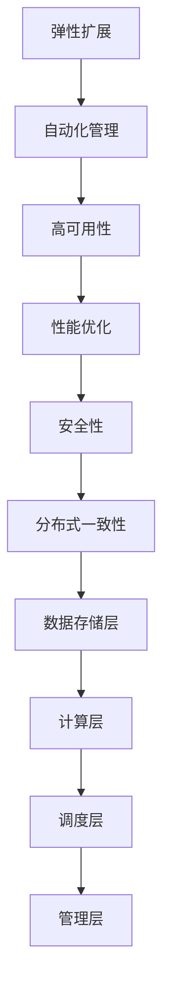

                 

### 文章标题

# 云原生数据库选型与实践

### 关键词

- 云原生数据库
- 选型原则
- 实践策略
- 性能优化
- 安全合规

### 摘要

本文旨在探讨云原生数据库的选型与实践，帮助读者了解云原生数据库的核心概念、技术趋势以及实际应用场景。文章首先介绍了云原生数据库的定义和重要性，随后详细阐述了云原生数据库的核心概念和架构，并对比了各种数据库技术的优缺点。接着，文章深入探讨了数据库性能优化和安全性等关键问题，并通过实际案例展示了云原生数据库的实践应用。最后，文章总结了最佳实践，为读者提供了一系列注意事项和拓展阅读资源。通过本文的阅读，读者将能够掌握云原生数据库选型的基本原则，并在实际项目中成功应用。

### 引言

#### 云原生数据库的定义和重要性

云原生数据库是指专门为云环境设计的一类数据库系统，它能够充分利用云计算的资源弹性、灵活性和高可用性，实现高效、可靠的数据存储和管理。与传统数据库相比，云原生数据库具有以下几个显著特点：

1. **弹性扩展**：云原生数据库能够根据实际业务需求自动调整资源，实现横向和纵向的弹性扩展，以满足不同规模和负载的业务需求。
2. **自动化管理**：云原生数据库提供了丰富的自动化管理功能，如自动化备份、恢复、监控和故障切换等，降低了运维成本。
3. **高可用性**：通过分布式架构和容错机制，云原生数据库能够确保高可用性，即使在部分节点发生故障时，也能保持系统的正常运行。
4. **高性能**：云原生数据库采用了各种性能优化技术，如缓存、分片和负载均衡等，能够提供高效的数据访问和处理能力。

在当今的数字化时代，云原生数据库的重要性日益凸显。首先，随着云计算技术的普及和业务需求的增长，传统的单体数据库系统已无法满足大规模、高并发的数据处理需求。云原生数据库能够提供灵活、可扩展的解决方案，助力企业实现数字化转型。其次，云原生数据库能够降低企业运维成本，提高运维效率，使企业能够专注于核心业务创新。此外，云原生数据库的高可用性和安全性也为企业提供了可靠的保障。

#### 云原生数据库的兴起背景

云原生数据库的兴起可以追溯到云计算和分布式系统的快速发展。云计算的出现，使得企业能够以更低成本、更高效率地获取和利用计算资源，而分布式系统的应用，则解决了传统单体数据库系统在扩展性和可用性方面的瓶颈。这些技术的发展，为云原生数据库的诞生奠定了基础。

随着互联网和移动互联网的普及，企业面临的数据规模和访问频率不断增加，传统的关系型数据库和NoSQL数据库已无法满足这些需求。为了应对这一挑战，新一代数据库技术应运而生，其中云原生数据库成为了热门选择。云原生数据库不仅具有强大的扩展能力和高可用性，还能够在云环境中实现自动化管理和优化，从而满足了现代企业对于高效、可靠和灵活的数据存储和管理需求。

#### 云原生数据库的发展趋势

云原生数据库的发展趋势主要体现在以下几个方面：

1. **分布式数据库的兴起**：分布式数据库通过将数据分布在多个节点上，实现了数据的横向扩展和负载均衡，能够更好地应对大数据场景下的性能挑战。
2. **数据库性能优化**：随着硬件技术的发展，数据库性能优化成为了一个重要方向。例如，通过缓存技术、索引优化和并行处理等技术，提高数据库的响应速度。
3. **数据库安全性和合规性**：随着数据隐私和合规性的要求不断提高，云原生数据库在安全性和合规性方面的投入也日益增加。例如，数据加密、访问控制和审计等功能。
4. **数据库智能化**：人工智能技术在数据库领域的应用逐渐增多，通过机器学习算法，可以实现自动化优化、故障预测和智能监控等功能。

总的来说，云原生数据库的发展趋势将更加注重性能优化、安全合规和智能化，为企业的数字化转型提供更强大的支持。

### 核心概念与联系

#### 云原生数据库的核心概念

云原生数据库的核心概念包括以下几个方面：

1. **弹性扩展**：弹性扩展是云原生数据库的重要特点，它允许数据库系统在资源需求变化时自动调整资源，以保持性能和可靠性。这种扩展方式可以是横向扩展（通过增加节点数量）或纵向扩展（通过增加单个节点的资源）。

2. **自动化管理**：云原生数据库通常具备自动化管理功能，如自动备份、自动扩缩容、自动故障切换等，这些功能大大简化了运维工作，提高了系统的可靠性和运维效率。

3. **高可用性**：高可用性是指数据库系统能够在硬件或软件故障情况下快速恢复，保持持续运行。云原生数据库通常通过分布式架构和冗余设计实现高可用性，例如使用主从复制、多活集群等技术。

4. **性能优化**：性能优化包括多种技术，如缓存、索引、查询优化、分片等，旨在提高数据库的响应速度和查询效率。

5. **安全性**：安全性是云原生数据库必须重视的一个方面，包括数据加密、访问控制、审计等功能，以确保数据的安全性和合规性。

6. **分布式一致性**：分布式一致性是指分布式数据库在多个节点之间保持数据一致性的能力。常用的分布式一致性协议包括Paxos、Raft等。

#### 云原生数据库的架构

云原生数据库的架构通常包括以下几个关键组件：

1. **数据存储层**：数据存储层负责数据的持久化存储，可以采用关系型数据库、NoSQL数据库或混合数据库等多种形式。

2. **计算层**：计算层负责数据处理和查询，包括查询引擎、缓存机制、索引服务等。计算层的设计直接影响到数据库的性能和响应速度。

3. **调度层**：调度层负责资源管理和任务调度，确保系统能够高效利用资源。调度层包括负载均衡、自动化扩缩容等功能。

4. **管理层**：管理层负责数据库的监控、备份、恢复、安全等功能。管理层通常通过自动化脚本或管理平台实现。

#### 核心概念之间的关系架构

为了更好地理解云原生数据库的核心概念和架构，我们可以使用Mermaid图来表示它们之间的关系：

在这个关系架构中，各个核心概念相互关联，共同构成了云原生数据库的完整架构。例如，弹性扩展和自动化管理是确保高可用性的关键，性能优化和安全性则是数据库运行的基本保障。

### 云原生数据库架构

#### 数据存储层

数据存储层是云原生数据库的核心组件之一，它负责数据的持久化存储。数据存储层的选择直接影响到数据库的性能、扩展性和可靠性。目前，常见的数据存储层技术包括关系型数据库、NoSQL数据库和混合数据库。

1. **关系型数据库**：关系型数据库（RDBMS）如MySQL、PostgreSQL等，以其强大的数据一致性、事务支持和复杂查询能力著称。在云原生环境中，关系型数据库通常通过分布式架构来实现高可用性和弹性扩展。例如，MySQL Cluster和PostgreSQL XLOG等分布式数据库技术，允许将数据分布在多个节点上，从而实现横向扩展。

2. **NoSQL数据库**：NoSQL数据库如MongoDB、Cassandra等，适用于大规模、高并发的数据存储场景。NoSQL数据库通常具有更好的扩展性和灵活性，但可能在数据一致性和复杂查询能力上不如关系型数据库。在云原生环境中，NoSQL数据库通过分布式数据存储和计算架构，能够实现线性扩展，从而满足大规模数据存储和访问需求。

3. **混合数据库**：混合数据库结合了关系型数据库和NoSQL数据库的优点，能够在同一系统中同时处理结构化和非结构化数据。例如，TiDB和Spanner等混合数据库，通过分布式存储和计算架构，实现了高效、可靠的数据存储和管理。

#### 计算层

计算层负责数据库的数据处理和查询。计算层的设计直接影响到数据库的性能和响应速度。计算层通常包括以下几个关键组件：

1. **查询引擎**：查询引擎是计算层的核心组件，负责解析、优化和执行SQL查询。查询引擎的性能优化包括查询计划生成、索引使用、缓存策略等。在云原生环境中，查询引擎通常采用分布式架构，以实现高效的查询处理。

2. **缓存机制**：缓存机制用于提高数据访问速度，减少数据库的负载。常用的缓存技术包括内存缓存（如Redis）和磁盘缓存（如MySQL的InnoDB Buffer Pool）。在云原生数据库中，缓存机制可以进一步优化，例如通过分布式缓存集群来实现更高效的数据访问。

3. **索引服务**：索引服务用于加速数据的查询和更新操作。云原生数据库通常支持多种索引类型，如B-Tree、哈希索引、全文索引等。索引服务的优化包括索引的选择、创建和维护策略等。

#### 调度层

调度层负责资源管理和任务调度，确保系统能够高效利用资源。调度层通常包括以下几个关键功能：

1. **负载均衡**：负载均衡用于将数据库请求均匀分布到多个节点上，以避免单点瓶颈。常用的负载均衡算法包括轮询、最小连接数、源IP哈希等。在云原生数据库中，负载均衡可以进一步优化，例如通过分布式负载均衡器来实现更高效的请求分发。

2. **自动化扩缩容**：自动化扩缩容功能允许数据库系统在资源需求变化时自动调整资源，以保持性能和可靠性。扩容操作可以通过增加节点或增加资源来实现，而缩容操作则可以通过减少节点或释放资源来实现。自动化扩缩容能够降低运维成本，提高系统的弹性。

3. **任务调度**：任务调度负责管理和调度数据库的各种任务，如备份、恢复、监控等。任务调度可以通过自动化脚本或管理平台来实现，以确保任务的高效执行和监控。

#### 管理层

管理层负责数据库的监控、备份、恢复、安全等功能。管理层通常通过自动化脚本或管理平台实现，以提高运维效率和系统可靠性。管理层的关键功能包括：

1. **监控与告警**：监控与告警用于实时监控数据库的运行状态，包括性能指标、资源使用情况、错误日志等。通过监控与告警，运维人员可以及时发现问题并采取措施。

2. **备份与恢复**：备份与恢复功能用于确保数据的安全性和可靠性。备份操作通常包括全量备份和增量备份，恢复操作则可以在数据丢失或故障时快速恢复数据。

3. **安全与合规**：安全与合规功能包括数据加密、访问控制、审计等。这些功能确保数据库系统的数据安全和合规性，以满足各种法规和标准的要求。

#### 综述

云原生数据库架构的核心在于其分布式设计和自动化管理。通过分布式存储和计算架构，云原生数据库能够实现横向和纵向的弹性扩展，从而满足大规模、高并发的数据处理需求。同时，自动化管理功能提高了系统的可靠性和运维效率。然而，云原生数据库也面临着一些挑战，如分布式一致性、数据迁移和跨云部署等问题。因此，在实际应用中，需要根据业务需求和场景选择合适的云原生数据库技术，并进行细致的架构设计和优化。

### 关键数据库技术

在云原生数据库的世界中，选择合适的技术对于实现高效、可靠的数据管理至关重要。本文将比较几种主流的数据库技术，包括SQL数据库、NoSQL数据库和NewSQL数据库，并讨论其优缺点及适用场景。

#### SQL数据库

SQL数据库，即关系型数据库（RDBMS），是最传统和广泛使用的数据库类型之一。典型的SQL数据库包括MySQL、PostgreSQL、Oracle和SQL Server等。

**优点：**

1. **强一致性**：关系型数据库通过ACID原则确保事务的强一致性，这对于需要严格事务管理和复杂查询的场景尤为重要。
2. **丰富的查询功能**：SQL数据库支持复杂的数据查询和聚合操作，包括事务处理、触发器和存储过程等。
3. **广泛的应用和社区支持**：SQL数据库有着庞大的用户基础和活跃的社区支持，学习资源和工具丰富。

**缺点：**

1. **扩展性有限**：关系型数据库在数据量和并发请求增加时，通常需要通过垂直扩展（增加服务器硬件）来提升性能，这在某些场景下可能导致成本上升。
2. **维护复杂**：关系型数据库通常需要手动管理索引、备份和恢复等，维护工作相对繁琐。

**适用场景：**

- **金融和会计系统**：需要高一致性和复杂查询的场景。
- **企业资源规划（ERP）系统**：处理大量结构化数据，需要事务支持。

#### NoSQL数据库

NoSQL数据库是一种非关系型数据库，它为了在数据量巨大、查询频繁的场景下提供更高的性能和扩展性，放弃了部分ACID特性。

**优点：**

1. **高扩展性**：NoSQL数据库通过水平扩展（增加服务器数量）来提升性能，适合处理大规模、高并发的数据。
2. **灵活的数据模型**：NoSQL数据库支持多种数据模型，包括键值对、文档、列族和图等，适用于不同类型的数据存储需求。
3. **高性能**：NoSQL数据库通常优化了数据访问路径，提高了读写速度。

**缺点：**

1. **一致性模型较弱**：NoSQL数据库通常采用最终一致性模型，这可能导致某些场景下数据的不一致性。
2. **查询功能有限**：NoSQL数据库通常不支持复杂查询和事务处理，适用于简单的查询场景。
3. **维护复杂**：NoSQL数据库通常需要自定义数据模型和查询逻辑，开发人员需要具备较高的技能。

**适用场景：**

- **社交媒体平台**：处理大量用户生成的数据，需要高并发读写。
- **物联网（IoT）应用**：处理传感器数据，需要快速存储和查询。

#### NewSQL数据库

NewSQL数据库结合了SQL数据库和NoSQL数据库的优点，旨在解决传统关系型数据库在扩展性方面的局限性。

**优点：**

1. **兼容SQL语法**：NewSQL数据库支持标准的SQL查询语言，对于熟悉SQL的开发人员来说易于使用。
2. **高性能**：NewSQL数据库通过优化查询引擎和分布式架构，提高了数据处理速度。
3. **高扩展性**：NewSQL数据库能够通过水平扩展来处理大规模数据。

**缺点：**

1. **一致性模型较弱**：虽然NewSQL数据库在一致性方面做了优化，但与关系型数据库相比仍有差距。
2. **迁移成本**：从传统关系型数据库迁移到NewSQL数据库可能需要修改部分应用程序代码和查询逻辑。

**适用场景：**

- **在线事务处理（OLTP）系统**：需要高并发和事务支持的场景。
- **电子商务平台**：处理大量订单和用户交互数据。

#### 对比与选择

选择合适的数据库技术需要考虑以下几个关键因素：

1. **数据一致性需求**：如果业务场景需要严格的事务一致性，SQL数据库可能是更好的选择。
2. **数据规模和扩展性需求**：对于大规模、高并发的数据场景，NoSQL数据库和NewSQL数据库提供了更好的扩展性。
3. **查询复杂度**：对于复杂查询和报表处理，SQL数据库通常更具优势。
4. **开发和维护成本**：NoSQL数据库在开发和维护方面可能更具优势，但需要开发人员具备更高的技能。

通过综合考虑这些因素，企业可以选择最适合自己的数据库技术，以实现高效、可靠的数据管理。

### 数据库性能优化

在云原生数据库的实践中，性能优化是确保系统高效运行的关键环节。以下是几种常见的数据库性能优化策略：

#### 缓存技术

缓存技术通过将频繁访问的数据存储在内存中，减少磁盘I/O操作，从而显著提高数据访问速度。常用的缓存技术包括：

1. **内存缓存**：例如Redis，适用于高并发、低延迟的数据访问场景。
2. **磁盘缓存**：例如MySQL的InnoDB Buffer Pool，用于缓存表数据和索引数据。

**优化建议：**
- 合理设置缓存大小，避免内存溢出或缓存不足。
- 根据数据访问模式调整缓存策略，例如优先缓存热数据。

#### 索引优化

索引是数据库性能优化的基础，它通过加速数据的查询和排序操作。以下是一些索引优化策略：

1. **选择合适的索引类型**：例如B-Tree索引适合范围查询和排序，哈希索引适合等值查询。
2. **索引列的选择**：选择能显著减少查询结果集的列作为索引，避免过度索引。
3. **索引维护**：定期分析索引使用情况，删除冗余索引，更新失效索引。

#### 查询优化

查询优化包括查询计划的生成、执行和优化。以下是一些查询优化策略：

1. **使用EXPLAIN工具**：通过分析查询执行计划，找到性能瓶颈。
2. **避免使用SELECT ***：只查询必要的列，减少数据传输和CPU负载。
3. **优化JOIN操作**：尽量减少JOIN操作的数量和复杂度，避免大表之间的JOIN。
4. **使用子查询和视图**：合理使用子查询和视图，避免重复计算。

#### 分片策略

分片（Sharding）是将数据水平拆分为多个片段，分布在不同节点上的技术。以下是一些分片优化策略：

1. **基于访问模式分片**：例如，根据用户ID或地理位置进行分片，提高数据局部性。
2. **基于数据量分片**：将数据按大小分片，避免单表过大影响性能。
3. **一致性哈希分片**：通过哈希函数将数据分配到不同的分片，实现负载均衡和数据均匀分布。

#### 负载均衡

负载均衡是将数据库请求均匀分布到多个节点上的技术。以下是一些负载均衡策略：

1. **轮询负载均衡**：将请求依次分配到各个节点，简单但可能导致部分节点负载过高。
2. **最小连接数负载均衡**：将请求分配到连接数最少的节点，减少响应时间。
3. **源IP哈希负载均衡**：根据客户端IP地址进行哈希计算，确保相同IP的请求总是分配到相同节点，提高会话一致性。

#### 性能监控与调优

性能监控与调优是确保数据库长期高效运行的重要环节。以下是一些监控和调优策略：

1. **实时监控**：监控关键性能指标（如CPU、内存、IOPS、延迟等），及时发现问题。
2. **定期调优**：根据性能监控数据，定期分析并调整数据库配置，如缓存大小、连接池设置等。
3. **自动化调优**：使用自动化工具或脚本，根据实时监控数据自动调整数据库配置，实现动态优化。

通过综合运用以上性能优化策略，企业可以在云原生数据库的实践中显著提升系统的性能和可靠性。

### 数据库安全性

在云原生数据库的实践中，安全性是确保数据完整性和合规性的关键。以下是一些关键的数据库安全性和合规性考虑因素：

#### 数据加密

数据加密是保护数据隐私的重要手段，包括数据在传输和存储过程中的加密。以下是一些数据加密策略：

1. **传输加密**：使用TLS/SSL等协议对数据库连接进行加密，防止数据在传输过程中被窃取或篡改。
2. **存储加密**：对存储在磁盘上的数据进行加密，防止数据在物理设备丢失或被访问时泄露。
3. **密钥管理**：合理管理加密密钥，确保密钥的安全存储和传输，避免密钥泄露导致数据被破解。

#### 访问控制

访问控制是防止未授权访问和操作的重要措施，以下是一些访问控制策略：

1. **用户认证**：使用强密码、多因素认证等方法确保用户身份的合法性。
2. **权限管理**：根据用户的角色和职责，分配适当的数据库权限，避免权限过宽导致数据泄露或误操作。
3. **访问日志**：记录用户的访问行为和操作日志，便于审计和追踪。

#### 数据备份和恢复

数据备份和恢复是确保数据安全性的重要措施，以下是一些备份和恢复策略：

1. **定期备份**：定期进行全量备份和增量备份，确保在数据丢失或损坏时能够快速恢复。
2. **异地备份**：将备份数据存储在异地，以防止本地设备故障或灾难导致数据丢失。
3. **备份验证**：定期验证备份数据的完整性和可恢复性，确保备份的有效性。

#### 审计和合规

审计和合规是满足法规要求和内部政策的重要环节，以下是一些审计和合规策略：

1. **合规性检查**：定期检查数据库是否符合相关法规和标准，如GDPR、PCI-DSS等。
2. **审计日志**：记录数据库操作和变更日志，便于审计和合规性检查。
3. **合规性培训**：定期对相关人员进行合规性培训，提高员工的合规意识。

通过实施以上安全性和合规性策略，企业可以显著提高云原生数据库的安全性，确保数据的完整性和合规性。

### 实际案例

为了更好地展示云原生数据库在实践中的应用，以下是一个真实的案例：某大型电子商务平台如何成功部署云原生数据库，以提高系统性能和可靠性。

#### 案例背景

该电子商务平台是一个高速增长的在线购物平台，其业务需求主要包括：高并发订单处理、海量商品库存管理、个性化推荐系统等。随着用户数量的增加和业务规模的扩大，传统的单体数据库系统已经无法满足日益增长的数据处理需求。为了提升系统的性能和可靠性，该平台决定采用云原生数据库技术。

#### 案例实施

1. **需求分析**：
   - **性能需求**：系统需要支持每秒数万次的订单处理，对数据库性能有极高的要求。
   - **可靠性需求**：系统需要保证高可用性，避免因单点故障导致服务中断。
   - **扩展性需求**：系统需要能够弹性扩展，以适应业务增长。

2. **技术选型**：
   - **数据存储层**：采用MySQL分布式数据库，支持横向扩展和自动故障切换。
   - **计算层**：使用MySQL的InnoDB存储引擎，结合Redis进行缓存加速。
   - **调度层**：采用数据库集群管理工具，实现负载均衡和自动化扩缩容。
   - **管理层**：使用自动化脚本和监控平台，进行数据库监控、备份和恢复。

3. **实施过程**：
   - **数据迁移**：采用分片策略，将原有数据迁移到分布式数据库系统，确保数据的一致性和完整性。
   - **性能优化**：通过索引优化、缓存策略和查询优化，提升系统性能。
   - **可靠性保障**：采用主从复制和多重备份策略，确保系统的高可用性和数据安全性。
   - **自动化运维**：使用自动化脚本进行日常运维任务，提高运维效率。

4. **效果评估**：
   - **性能提升**：通过分布式架构和缓存技术，订单处理速度提高了数倍，响应时间显著降低。
   - **可靠性提升**：采用主从复制和故障切换机制，系统可用性达到99.99%，有效避免了单点故障。
   - **扩展性增强**：通过自动化扩缩容，系统能够弹性扩展，适应业务增长。

#### 案例小结

通过这个案例，我们可以看到云原生数据库在电子商务平台中的成功应用。云原生数据库不仅提升了系统的性能和可靠性，还实现了弹性扩展和自动化管理，为企业提供了强大的支持。这个案例也表明，在实践云原生数据库时，需要充分考虑业务需求和技术选型，结合具体的实施过程和效果评估，才能取得最佳效果。

### 未来趋势和前沿技术

#### 新兴数据库技术

随着云计算和大数据技术的发展，新兴数据库技术不断涌现，为数据存储和管理带来了新的可能性。以下是几种备受关注的数据库技术：

1. **分布式数据库**：分布式数据库通过将数据分布在多个节点上，实现了横向扩展和负载均衡。代表性的技术包括Cassandra、HBase和Apache Presto等。这些数据库在大数据场景下表现出色，能够处理海量数据的存储和查询。

2. **时间序列数据库**：时间序列数据库专门用于存储和查询时间相关的数据，如传感器数据、日志数据和金融数据等。代表性的技术包括InfluxDB、TimescaleDB和OpenTSDB等。这些数据库通过高效的索引和查询优化，提供了快速的时间序列数据分析能力。

3. **图数据库**：图数据库用于存储和查询图形数据，如社交网络、推荐系统和知识图谱等。代表性的技术包括Neo4j、ArangoDB和JanusGraph等。这些数据库通过图论算法和索引技术，提供了强大的图形数据处理和分析能力。

#### 人工智能与数据库

人工智能（AI）技术在数据库领域的应用也日益增多，为数据库的性能优化、故障预测和智能监控提供了新的解决方案。以下是几个关键领域：

1. **自动性能优化**：通过机器学习算法，数据库可以自动识别性能瓶颈，并提出优化建议。例如，MySQL的InnoDB存储引擎已经开始使用机器学习技术来优化查询执行计划。

2. **故障预测和修复**：AI技术可以预测数据库的故障，并提前采取措施进行修复。例如，Google的Spanner数据库利用AI技术进行自动故障检测和恢复。

3. **智能监控和日志分析**：AI技术可以自动分析数据库日志，识别潜在问题和安全威胁。例如，数据库监控工具如Google的Stackdriver和Amazon的CloudWatch，通过机器学习算法提供了更智能的监控和报警功能。

#### 未来的发展趋势

1. **数据库智能化**：随着AI技术的发展，数据库将变得更加智能，能够自动优化性能、预测故障和提供智能化的运维支持。

2. **多模型数据库**：未来的数据库将支持多种数据模型，如关系型、文档型、图形型和时间序列型等，以适应不同类型的数据存储和查询需求。

3. **混合云和多云部署**：随着企业对云计算的依赖加深，数据库将支持在混合云和多云环境中进行部署和迁移，提供更高的灵活性和可靠性。

4. **边缘计算与数据库**：随着物联网和边缘计算的兴起，数据库将扩展到边缘设备，实现本地数据存储和处理，提高实时响应能力。

通过了解这些新兴数据库技术和未来发展趋势，企业可以更好地把握数据库技术的发展方向，为数字化转型提供强有力的支持。

### 最佳实践

在云原生数据库的选型和实施过程中，遵循最佳实践至关重要，以下是一些关键点：

#### 选择合适的数据库技术

1. **需求分析**：首先，对业务需求进行全面分析，明确数据规模、查询模式和性能要求。
2. **技术评估**：根据需求分析结果，评估不同数据库技术的优缺点，选择最适合的技术。
3. **迁移策略**：如果需要从传统数据库迁移到云原生数据库，制定详细的迁移计划，包括数据迁移、应用适配和测试。

#### 系统架构设计

1. **分布式架构**：采用分布式架构，实现数据的高可用性和弹性扩展。
2. **分片策略**：合理选择分片策略，确保数据均匀分布，避免热点问题。
3. **负载均衡**：使用负载均衡技术，确保数据库请求均匀分配，避免单点瓶颈。

#### 性能优化

1. **缓存机制**：充分利用缓存技术，减少磁盘I/O操作，提高数据访问速度。
2. **索引优化**：选择合适的索引类型和列，优化查询效率。
3. **查询优化**：使用EXPLAIN工具分析查询计划，优化SQL语句。

#### 安全性和合规性

1. **数据加密**：对传输和存储中的数据进行加密，确保数据安全。
2. **访问控制**：合理分配权限，确保只有授权用户才能访问敏感数据。
3. **备份和恢复**：定期进行数据备份，确保在数据丢失或故障时能够快速恢复。

#### 自动化和监控

1. **自动化运维**：使用自动化工具进行日常运维任务，提高效率。
2. **监控与告警**：实时监控数据库性能指标，及时发现问题并采取措施。
3. **日志审计**：记录数据库操作日志，便于审计和合规性检查。

通过遵循以上最佳实践，企业可以更好地实现云原生数据库的选型和实施，确保系统的高效、可靠和稳定运行。

### 总结

本文全面探讨了云原生数据库的选型与实践，从核心概念、技术趋势、性能优化、安全性到实际案例，为读者提供了深入的理解和实践指导。云原生数据库凭借其弹性扩展、自动化管理和高可用性，已成为现代企业数字化转型的关键支撑。在选型过程中，需要充分考虑业务需求和场景，结合最佳实践进行科学决策。未来，随着人工智能和新兴数据库技术的不断发展，云原生数据库将更加智能化、多样化，为数据管理和分析提供更强大的支持。希望本文能够为读者在云原生数据库的实践中提供有价值的参考。

### 附录

#### A. 数据库管理工具和资源

为了更好地管理和运维云原生数据库，以下是一些常用的数据库管理工具和资源：

1. **Percona Toolkit**：用于MySQL数据库的性能监控、故障诊断和调优。
   - 官网：[Percona Toolkit](https://www.percona.com/downloads/percona-toolkit/LATEST/)
   - GitHub：[Percona Toolkit](https://github.com/percona/percona-toolkit)

2. **pgBouncer**：用于PostgreSQL数据库的连接池和负载均衡。
   - 官网：[pgBouncer](https://pgbouncer.readthedocs.io/en/stable/)
   - GitHub：[pgBouncer](https://github.com/pgbouncer/pgbouncer)

3. **MongoDB Management Studio**：用于MongoDB数据库的图形化管理工具。
   - 官网：[MongoDB Management Studio](https://mongodb-management.github.io/mms）

4. **Google Cloud SQL**：Google提供的数据库托管服务，支持MySQL、PostgreSQL和SQL Server。
   - 官网：[Google Cloud SQL](https://cloud.google.com/sql/）

5. **AWS RDS**：Amazon Web Services提供的数据库托管服务，支持多种数据库引擎。
   - 官网：[AWS RDS](https://aws.amazon.com/rds/）

#### B. 数学模型和公式

在云原生数据库的性能优化和负载均衡策略中，一些数学模型和公式至关重要。以下是一些常用的数学模型和公式，并附有详细解释和举例说明：

1. **分片键选择**：分片键的选择直接影响数据的分布和查询效率。常用的方法包括：
   - **哈希分片**：使用哈希函数将数据分配到不同的分片，公式为：
     $$ hash(key) \mod N $$
     其中，`key`是数据键，`N`是分片数量。
     
     **举例**：假设有3个分片，使用哈希函数计算键`user_id`的分片：
     $$ hash(user_id) \mod 3 $$
     假设哈希值为5，则数据将被分配到第2个分片。

   - **范围分片**：将数据按一定范围分配到不同的分片，公式为：
     $$ range(key) \in [start, end) $$
     其中，`key`是数据键，`start`和`end`是范围边界。
     
     **举例**：假设数据按用户ID范围分片，范围如下：
     - 分片1：\[1, 1000\]
     - 分片2：\[1000, 2000\]
     - 分片3：\[2000, +\infty\]

     用户ID为1500的数据将分配到第2个分片。

2. **负载均衡算法**：负载均衡算法用于将数据库请求均匀分配到多个节点上。以下是一些常见算法：
   - **轮询**：依次将请求分配到各个节点，公式为：
     $$ node = (current\_node + 1) \mod N $$
     其中，`current_node`是当前节点的索引，`N`是节点数量。
     
     **举例**：当前节点为2，节点总数为3，下一个节点索引为：
     $$ (2 + 1) \mod 3 = 0 $$

   - **最小连接数**：将请求分配到连接数最少的节点，公式为：
     $$ node = \arg\min_{i} (conn\_count[i]) $$
     其中，`conn_count[i]`是第i个节点的连接数。

     **举例**：现有3个节点，连接数分别为5、3和4，下一个节点索引为1（连接数最少）。

3. **查询优化**：查询优化包括查询计划的生成和执行。以下是一些关键公式：
   - **COST公式**：用于评估不同查询计划的成本，公式为：
     $$ COST(Q) = cost_{select} + cost_{join} + cost_{group\_by} + ... $$
     其中，`COST(Q)`是查询Q的总成本，`cost_{select}`、`cost_{join}`等是各个操作的成本。

     **举例**：假设一个查询计划包含以下操作和成本：
     - SELECT：成本为10
     - JOIN：成本为20
     - GROUP BY：成本为5

     则查询的总成本为：
     $$ COST(Q) = 10 + 20 + 5 = 35 $$

4. **缓存命中率和命中率公式**：缓存命中率用于衡量缓存的有效性，公式为：
   $$ hit\_rate = \frac{hit\_count}{total\_count} \times 100\% $$
   其中，`hit_count`是命中缓存的数量，`total_count`是总查询次数。

   **举例**：在100次查询中，有60次命中缓存，则缓存命中率为：
   $$ hit\_rate = \frac{60}{100} \times 100\% = 60\% $$

通过理解和应用这些数学模型和公式，可以更好地优化云原生数据库的性能和可靠性，提高系统的整体效率。

### 拓展阅读

为了深入了解云原生数据库的选型和实施，以下是一些推荐的专业书籍、在线课程和博客文章：

1. **书籍**：
   - 《云原生数据库设计与实现》：详细介绍了云原生数据库的设计原则和实践方法。
   - 《分布式系统原理与范型》：涵盖了分布式系统的基本原理和云原生数据库的分布式架构设计。

2. **在线课程**：
   - Coursera上的“云计算与分布式系统”课程：提供了全面的云计算和分布式系统知识。
   - Udacity的“分布式系统与数据库”课程：深入讲解了分布式数据库的设计和优化。

3. **博客文章**：
   - 《云原生数据库技术选型指南》：总结了云原生数据库的技术特点和选型策略。
   - 《云原生数据库性能优化实战》：分享了云原生数据库性能优化的实用技巧和案例分析。

通过阅读这些资料，读者可以进一步拓宽知识面，提升在云原生数据库领域的专业素养。

