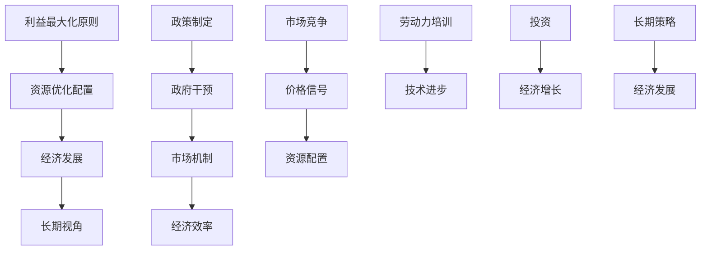
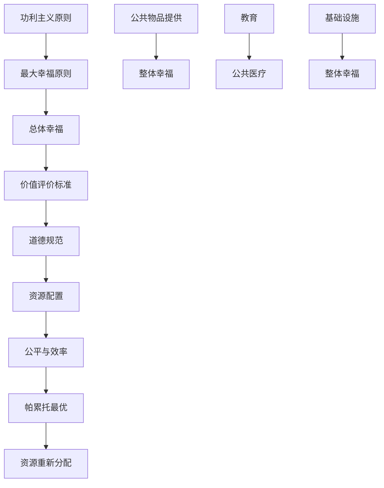

                 

### 引言

#### 1.1 书籍背景与作者介绍

《亚当·斯密与边沁：功利主义的经济学基础》是一本探讨两位经济学大师亚当·斯密和边沁经济学思想的著作。亚当·斯密，被誉为“经济学之父”，其代表作《国富论》对现代经济学的发展产生了深远影响。边沁，作为功利主义的代表人物，他的理论在伦理学和法学领域同样具有重要地位。本书旨在分析两位经济学家的观点，探讨功利主义经济学的基础及其在现代社会的应用。

#### 1.2 书的主要内容和结构

本书分为五个部分。第一部分引言，介绍作者、书的内容和目的。第二部分介绍亚当·斯密的经济学思想，包括《国富论》的核心观点、核心概念、联系、数学模型、项目实战等内容。第三部分探讨边沁的功利主义及其经济学应用，同样涵盖核心原理、联系、数学模型、项目实战等。第四部分对比分析两位经济学家的思想，讨论功利主义与自由放任的比较以及他们对经济学理论的发展。第五部分讨论功利主义经济学在现代社会的应用，涉及政策制定、教育、医疗、环保等领域。最后是结论部分，总结并展望功利主义经济学的发展方向。

### 摘要

本书深入探讨了亚当·斯密和边沁的经济学思想，分析了他们的理论对现代经济学的贡献和影响。通过对两位经济学家的核心观点、概念、联系、数学模型和项目实战的详细解读，揭示了功利主义经济学在资源配置、公共政策、教育、医疗和环保等领域的应用价值。本书旨在为读者提供一个全面了解功利主义经济学的框架，帮助读者理解其在现代社会的重要性和发展方向。

---

### 亚当·斯密的经济学思想

#### 2.1 《国富论》及其核心观点

亚当·斯密的《国富论》是经济学领域的里程碑之作，该书首次系统阐述了市场经济的基本原理。以下是《国富论》中的核心观点：

1. **自由放任经济政策**：斯密主张政府不应过多干预市场，而是应实行自由放任政策，让市场自行调节。他认为市场机制具有自我调节的功能，能够实现资源的最优配置。

2. **市场机制的效率**：斯密认为市场是“看不见的手”，它能够引导个人追求自身利益的同时，无意中增进整个社会的福祉。市场的竞争机制能够促进生产效率，使商品价格趋于合理。

3. **劳动价值论**：斯密提出了劳动价值论，认为商品的价值取决于生产该商品所需的社会必要劳动时间。这一理论为后来的马克思主义经济学奠定了基础。

#### 2.2 斯密经济学思想的核心概念与联系

斯密经济学思想的核心概念包括：

1. **利益最大化原则**：个体在市场交易中追求自身利益最大化，这一行为驱动了市场资源的有效配置。

2. **资源配置的优化**：市场机制通过价格信号实现资源的优化配置，使得资源流向生产效率最高的领域。

3. **经济发展的长期视角**：斯密强调长期经济发展的重要性，认为经济增长不仅仅是短期现象，而是需要通过投资、技术进步和劳动力培训等长期策略来实现。

这些概念之间相互联系，形成一个完整的经济学理论体系：

- 利益最大化原则驱动市场行为，导致资源优化配置。
- 资源优化配置提高了生产效率，促进了经济发展。
- 经济发展需要长期视角，这要求政策制定者关注长期利益而非短期得失。

#### 2.3 斯密经济学思想的 Mermaid 流程图

为了更好地理解斯密经济学思想的运作机制，我们可以使用 Mermaid 流程图来展示各个核心概念之间的联系：

在这个流程图中，利益最大化原则作为起点，通过市场机制和市场竞争，形成了价格信号，进而实现了资源的优化配置。资源配置优化推动了经济发展，而经济发展又需要长期视角和相应的政策制定。政策制定需要考虑政府干预和市场机制的平衡，以实现经济效率的最大化。

#### 2.4 斯密经济学思想的数学模型与公式

斯密的经济学理论中包含了一些基本的数学模型和公式，用于解释市场机制和资源配置的原理。以下是一些关键模型和公式：

1. **供需平衡模型**：供需平衡是市场经济中的一个基本概念，可以用以下公式表示：

   $$ Q_d = Q_s $$
   
   其中，$Q_d$ 是需求量，$Q_s$ 是供给量。当需求量等于供给量时，市场达到平衡状态。

2. **消费者剩余和生产者剩余**：消费者剩余是消费者愿意支付的价格与实际支付价格之间的差额，生产者剩余是生产者实际得到的价格与愿意接受的价格之间的差额。它们可以用以下公式计算：

   $$ 消费者剩余 = WTP - WAP $$
   $$ 生产者剩余 = WAP - WVP $$
   
   其中，$WTP$ 是消费者愿意支付的价格，$WAP$ 是实际支付的价格，$WVP$ 是生产者愿意接受的价格。

   这些剩余概念反映了市场的效率和福利。

3. **劳动价值论**：斯密认为商品的价值取决于生产该商品所需的社会必要劳动时间。可以用以下公式表示：

   $$ V = LST $$
   
   其中，$V$ 是商品的价值，$LST$ 是社会必要劳动时间。

   这个公式强调了劳动在商品价值形成中的作用。

#### 2.5 斯密经济学思想的项目实战

为了更好地理解斯密经济学思想在实际中的应用，我们可以通过一个简单的案例来展示。

**案例：一个简单的市场分析**

假设有一个市场，销售一种商品A。市场上有两个参与者：消费者和厂商。

1. **需求分析**：

   假设消费者对商品A的需求函数为：

   $$ Q_d = 100 - 2P $$
   
   其中，$Q_d$ 是需求量，$P$ 是价格。

   如果市场价格为10元，那么需求量为：

   $$ Q_d = 100 - 2 \times 10 = 80 \text{ 单位} $$

2. **供给分析**：

   假设厂商对商品A的供给函数为：

   $$ Q_s = 20 + 2P $$
   
   其中，$Q_s$ 是供给量。

   如果市场价格为10元，那么供给量为：

   $$ Q_s = 20 + 2 \times 10 = 40 \text{ 单位} $$

3. **市场均衡**：

   当市场需求量等于供给量时，市场达到均衡状态。设市场价格为$P^*$，需求量为$Q^*$，供给量为$Q^*$，则有：

   $$ Q^* = Q_d^* = Q_s^* $$

   代入需求函数和供给函数，得：

   $$ 100 - 2P^* = 20 + 2P^* $$
   
   解这个方程，得：

   $$ P^* = 30 \text{ 元} $$

   此时，需求量为：

   $$ Q^* = 100 - 2 \times 30 = 40 \text{ 单位} $$

   供给量为：

   $$ Q^* = 20 + 2 \times 30 = 80 \text{ 单位} $$

   因此，市场均衡价格为30元，均衡需求量为40单位，均衡供给量为40单位。

4. **消费者剩余和生产者剩余**：

   假设消费者愿意支付的最高价格为50元，厂商愿意接受的最小价格为10元。

   消费者剩余为：

   $$ 消费者剩余 = WTP - WAP = 50 - 30 = 20 \text{ 元} $$

   生产者剩余为：

   $$ 生产者剩余 = WAP - WVP = 30 - 10 = 20 \text{ 元} $$

   这表明，在这个市场中，消费者和生产者都获得了额外的福利。

通过这个案例，我们可以看到斯密经济学思想在实际市场分析中的应用。市场的自由竞争和价格机制使得资源得到了有效配置，消费者和生产者都获得了福利。这个案例也体现了斯密关于市场效率和资源优化配置的观点。

---

### 边沁的功利主义及其经济学应用

#### 3.1 功利主义的基本原理

功利主义是一种伦理学理论，其核心原则是最大化整体幸福或福利。边沁，作为功利主义的代表人物，提出了一系列关于如何应用这一原则的理论。以下是功利主义的基本原理：

1. **功利主义定义**：功利主义认为，行为的道德价值取决于其产生的幸福或福利总量。行为的道德评价应该基于其产生的效果，而不是基于行为者的意图或道德准则。

2. **最大幸福原则**：功利主义的核心原则是最大幸福原则，即选择能够产生最大总体幸福的行为。总体幸福是一个集体概念，包括所有个体的幸福。

3. **价值评价标准**：功利主义将个体的幸福作为价值评价的标准，认为个体的幸福具有独立的价值。功利主义强调，幸福是道德评价的唯一标准。

4. **道德规范**：功利主义提供了一套道德规范，指导人们如何行动。这些规范包括：追求整体幸福、避免伤害他人、促进他人的幸福、以及尽可能地增加自身的幸福。

#### 3.2 功利主义经济学在资源配置中的应用

功利主义经济学将功利主义原则应用于经济领域，探讨如何通过资源配置来实现最大幸福。以下是功利主义经济学在资源配置中的应用：

1. **最优资源配置的理论基础**：功利主义经济学认为，资源的最优配置应该基于最大幸福原则。资源的分配应该使整体福利最大化，而不是仅仅考虑某些个体或群体的利益。

2. **公平与效率的权衡**：在资源配置过程中，功利主义经济学强调公平与效率的权衡。公平意味着资源应该公平地分配给所有个体，而效率意味着资源应该被用于最有效率的用途。

3. **福利经济学中的应用**：功利主义经济学在福利经济学中具有重要的应用。福利经济学研究如何评估社会整体福利，功利主义原则提供了评估福利的标准。

   例如，帕累托最优是一个重要的概念，它指的是在不减少任何人福利的情况下，无法再进行资源重新分配的状态。功利主义经济学认为，实现帕累托最优是实现最大幸福的必要条件。

4. **公共物品提供**：功利主义经济学强调公共物品的提供，认为公共物品（如教育、医疗、基础设施）对整体幸福具有重要影响。通过功利主义原则，可以评估公共物品的提供是否有利于整体幸福。

   例如，边沁认为，国家应该提供足够的公共医疗资源，以确保全民健康。他认为，这有助于提高整体幸福，因为健康的个体能够更好地参与社会和经济活动。

#### 3.3 功利主义经济学思想的 Mermaid 流程图

为了更好地理解功利主义经济学的工作机制，我们可以使用 Mermaid 流程图来展示关键概念和流程：

在这个流程图中，功利主义原则作为起点，通过最大幸福原则和总体幸福的概念，确定了价值评价标准。道德规范指导人们如何行动，最终实现资源的优化配置和公共物品的提供，从而提高整体幸福。

#### 3.4 功利主义经济学的数学模型与公式

功利主义经济学中包含了一些关键的数学模型和公式，用于评估社会整体福利和资源配置的效率。以下是一些重要的模型和公式：

1. **功利主义评价函数**：功利主义评价函数用于评估整体幸福。它可以表示为：

   $$ F(\omega) = \sum_{i=1}^{n} u_i(\omega) $$
   
   其中，$F(\omega)$ 是总体幸福，$u_i(\omega)$ 是第 $i$ 个个体的幸福。这个函数将所有个体的幸福加总，得到整体幸福。

2. **公平与效率权衡**：在资源配置过程中，公平与效率的权衡是一个关键问题。一个常用的模型是公平效率模型，它可以用以下公式表示：

   $$ V = \frac{1}{n} \sum_{i=1}^{n} (w_i - c_i) $$
   
   其中，$V$ 是总体福利，$w_i$ 是第 $i$ 个个体的福利，$c_i$ 是第 $i$ 个个体的成本。这个公式反映了公平和效率的权衡。

3. **公共物品提供**：在公共物品的提供中，一个关键问题是确定提供量。一个常用的模型是拉姆齐模型，它可以用以下公式表示：

   $$ p^* = \left( \frac{MRS}{MRT} \right)^{1/\sigma} $$
   
   其中，$p^*$ 是公共物品的最优提供量，$MRS$ 是边际替代率，$MRT$ 是边际转换率，$\sigma$ 是个体对公共物品的需求弹性。这个公式反映了公共物品提供与个体需求之间的关系。

#### 3.5 功利主义经济学的项目实战

为了更好地理解功利主义经济学在实际中的应用，我们可以通过一个简单的项目案例来展示。

**案例：一个简单的公共资源配置项目**

假设一个城市需要决定如何分配公共医疗资源，以最大化整体幸福。以下是项目的具体步骤：

1. **需求分析**：

   假设该城市有10000名居民，每个人的医疗需求是不同的。通过调查，得出了每个人的医疗需求分数。以下是部分居民的需求分数：

   $$ \begin{array}{c|c}
   居民编号 & 需求分数 \\
   \hline
   1 & 5 \\
   2 & 4 \\
   3 & 8 \\
   4 & 3 \\
   5 & 7 \\
   \end{array} $$

2. **成本分析**：

   假设提供医疗服务需要投入一定的资源，每单位资源能够提供的医疗服务数量是固定的。以下是提供不同数量医疗服务的成本：

   $$ \begin{array}{c|c|c}
   提供量 & 成本 & 每单位成本 \\
   \hline
   5 & 100 & 20 \\
   10 & 200 & 20 \\
   15 & 300 & 20 \\
   20 & 400 & 20 \\
   \end{array} $$

3. **最优资源配置**：

   利用功利主义评价函数，计算整体幸福。整体幸福可以通过以下公式计算：

   $$ F(\omega) = \sum_{i=1}^{n} u_i(\omega) $$

   其中，$u_i(\omega)$ 是第 $i$ 个个体的幸福。为了最大化整体幸福，需要找到最优的资源配置。

   首先，计算每个人的幸福分数：

   $$ \begin{array}{c|c|c}
   居民编号 & 需求分数 & 幸福分数 \\
   \hline
   1 & 5 & 5 \\
   2 & 4 & 4 \\
   3 & 8 & 8 \\
   4 & 3 & 3 \\
   5 & 7 & 7 \\
   \end{array} $$

   然后，计算整体幸福：

   $$ F(\omega) = 5 + 4 + 8 + 3 + 7 = 27 $$

   接下来，计算不同资源配置下的整体幸福：

   $$ \begin{array}{c|c|c|c}
   提供量 & 成本 & 每单位成本 & 整体幸福 \\
   \hline
   5 & 100 & 20 & 27 \\
   10 & 200 & 20 & 35 \\
   15 & 300 & 20 & 45 \\
   20 & 400 & 20 & 55 \\
   \end{array} $$

   从上述计算可以看出，当提供量为15时，整体幸福达到最大值45。因此，最优的资源配置是提供15单位的医疗服务。

通过这个案例，我们可以看到功利主义经济学在公共资源配置中的应用。通过功利主义评价函数和成本分析，可以找到最优的资源配置，以最大化整体幸福。这个案例也展示了功利主义经济学如何应用于实际项目，为决策者提供科学的决策依据。

---

### 两位思想家的对比与分析

#### 4.1 功利主义与自由放任的比较

功利主义和自由放任是两种不同的经济学思想，它们在理论基础、政策建议和市场机制方面存在显著差异。

1. **理论基础**：

   - **功利主义**：功利主义基于伦理学原则，强调最大化整体幸福。它认为，行为的道德价值取决于其产生的效果，而不是基于行为者的意图或道德准则。功利主义强调公平与效率的权衡，追求整体福利的最大化。

   - **自由放任**：自由放任基于经济自由和市场机制，主张政府不应过多干预市场。自由放任认为市场具有自我调节的功能，能够实现资源的最优配置。自由放任强调个体的自由选择和市场效率。

2. **政策建议**：

   - **功利主义**：功利主义建议政府通过资源配置和公共政策来实现最大幸福。它主张提供公共物品，如教育、医疗和基础设施，以促进整体幸福。功利主义还强调公平，主张资源应该公平地分配给所有个体。

   - **自由放任**：自由放任主张政府应减少对市场的干预，让市场自行调节。自由放任认为，市场机制能够实现资源的最优配置，政府的干预可能会导致资源浪费和市场失灵。自由放任主张个体自由选择，反对过度的政府干预。

3. **市场机制**：

   - **功利主义**：功利主义认为，市场机制是实现资源配置的有效工具。然而，它强调市场机制的局限性，主张政府应通过公共政策来补充市场机制，以实现公平与效率的平衡。

   - **自由放任**：自由放任认为，市场机制是资源配置的最优机制。它强调市场的自我调节能力，认为市场能够通过价格信号实现资源的最优配置。自由放任主张政府不应干预市场，让市场自行运行。

4. **适用性分析**：

   - **功利主义**：功利主义适用于需要公平和效率权衡的领域，如公共资源配置、社会福利和教育医疗等领域。功利主义能够提供一套评估公共物品提供和资源分配的框架。

   - **自由放任**：自由放任适用于市场经济环境，特别是个体自由选择和市场竞争较为充分的领域。自由放任能够促进市场效率和个体自由，但在某些领域，如公共物品提供和公平问题，自由放任可能存在局限性。

#### 4.2 亚当·斯密与边沁的经济学思想联系与区别

亚当·斯密和边沁都是经济学领域的重要人物，他们的思想在某种程度上相互联系，但也有一些显著的区别。

1. **相同点**：

   - **市场机制**：两位经济学家都认为市场机制是实现资源配置的有效工具。亚当·斯密强调市场的自我调节能力，边沁则强调市场机制在实现最大幸福中的重要作用。

   - **个体自由**：两位经济学家都强调个体自由，主张个体在市场中自由选择。亚当·斯密认为，个体追求自身利益的行为会导致市场的有效运行，边沁则认为，个体自由选择是实现最大幸福的基础。

2. **区别**：

   - **理论出发点**：亚当·斯密的理论出发点是市场机制和自由放任，他强调市场的自我调节能力和个体的自由选择。边沁的理论出发点是功利主义，他强调最大化整体幸福和公平与效率的权衡。

   - **公共物品提供**：亚当·斯密认为，政府不应过多干预市场，主张自由放任政策。边沁则认为，政府应提供公共物品，以实现最大幸福。边沁主张公共医疗、教育等公共物品的提供，以促进整体福利。

   - **政策建议**：亚当·斯密主张市场自由和自由放任，反对政府过多干预。边沁则主张政府通过资源配置和公共政策来实现最大幸福，强调公平与效率的权衡。

#### 4.3 边沁的功利主义对斯密经济学思想的发展

边沁的功利主义对亚当·斯密的经济学思想产生了重要影响，为经济学理论的发展做出了贡献。

1. **对市场机制的补充**：边沁的功利主义强调公共物品的提供，这在一定程度上补充了亚当·斯密的市场自由理论。边沁认为，市场机制虽然能够实现资源的最优配置，但在公共物品提供方面存在局限性。通过政府的干预，可以更好地提供公共物品，以实现最大幸福。

2. **公平与效率的权衡**：边沁的功利主义强调公平与效率的权衡，这为经济学理论提供了新的视角。亚当·斯密的理论主要关注市场效率和个体自由，而边沁则强调公平，认为公平是实现最大幸福的重要因素。这一视角为经济学研究提供了更全面的框架。

3. **政策建议的扩展**：边沁的功利主义为政策制定提供了新的依据。他认为，政府应通过资源配置和公共政策来实现最大幸福，这为政策制定者提供了一种评估和优化政策的新方法。边沁的思想在一定程度上影响了现代经济学中的福利经济学和政策分析。

总之，边沁的功利主义对亚当·斯密的经济学思想产生了深远影响，为经济学理论的发展做出了重要贡献。边沁的功利主义补充了亚当·斯密的市场自由理论，提供了新的视角和方法，为现代经济学的研究提供了更丰富的理论基础。

---

### 功利主义经济学在现代的应用

#### 5.1 功利主义经济学在现代社会的重要性

在现代社会，功利主义经济学的重要性日益凸显。随着经济全球化和技术的快速发展，社会面临着前所未有的复杂性和多样性。功利主义经济学提供了一套评估和优化资源配置的框架，有助于应对现代社会中的诸多挑战。

1. **经济全球化背景下的功利主义**：

   经济全球化带来了大量的经济、社会和环境问题。功利主义经济学提供了一个评估这些问题的框架，帮助决策者制定更合理的政策。例如，在跨国公司对环境的影响方面，功利主义经济学可以用来评估其对当地社区的整体幸福影响，从而制定出既保护环境又促进经济发展的政策。

2. **可持续发展与功利主义**：

   可持续发展是现代社会的重要目标，它要求在满足当前需求的同时，不损害未来世代满足自身需求的能力。功利主义经济学提供了评估可持续发展项目的方法，通过最大化整体幸福来实现长期可持续发展。例如，在环境保护方面，功利主义经济学可以用来评估不同环境保护措施的整体幸福影响，从而选择最优方案。

3. **功利主义经济学在经济学研究中的应用趋势**：

   随着经济学研究方法的进步，功利主义经济学在经济学研究中的应用越来越广泛。现代经济学中的福利经济学、公共选择理论、环境经济学等领域都受到了功利主义经济学的影响。功利主义经济学提供了一套评估社会整体福利的方法，有助于提高经济决策的科学性。

#### 5.2 功利主义经济学在政策制定中的应用

功利主义经济学在政策制定中具有重要的应用价值。通过评估政策的整体幸福影响，决策者可以制定出更有效的政策，以实现社会福祉的最大化。

1. **公共政策的功利主义评估**：

   公共政策的功利主义评估是一种基于功利主义原则的政策评估方法。它通过计算政策的整体幸福影响，评估政策对社会福祉的贡献。例如，政府在制定教育政策时，可以利用功利主义经济学评估不同教育投资方案的整体幸福影响，从而选择最优方案。

2. **功利主义经济学与政府干预**：

   功利主义经济学强调政府干预在资源配置中的重要作用。通过政府干预，可以纠正市场失灵，实现资源的最优配置。例如，在环境保护方面，政府可以通过征收环境税、提供环保补贴等手段，激励企业减少环境污染，提高整体幸福。

3. **功利主义经济学在公共管理中的应用**：

   公共管理涉及资源的合理配置和公共服务的提供。功利主义经济学为公共管理提供了一套评估和优化资源配置的框架。例如，在城市规划方面，政府可以利用功利主义经济学评估不同交通基础设施项目的整体幸福影响，从而制定出最优的城市交通规划。

#### 5.3 功利主义经济学在教育、医疗和环保等领域的应用

功利主义经济学在多个领域具有广泛的应用，包括教育、医疗和环保等。

1. **教育资源的公平分配**：

   教育是促进社会公平和整体幸福的重要手段。功利主义经济学提供了一套评估教育资源分配公平性的方法。例如，政府可以利用功利主义经济学评估不同地区、不同学校的教育资源分配，确保教育资源的公平分配，提高整体幸福。

2. **医疗服务的功利主义评估**：

   医疗服务是保障公民健康和整体幸福的重要方面。功利主义经济学可以用来评估不同医疗服务方案的整体幸福影响。例如，政府可以利用功利主义经济学评估不同医疗改革方案，选择最有利于公民健康和整体幸福的方案。

3. **环保的功利主义视角**：

   环保是可持续发展的重要目标，它关系到未来世代的福祉。功利主义经济学为环保提供了评估和优化资源配置的方法。例如，政府可以利用功利主义经济学评估不同环保政策的整体幸福影响，选择最有效的环保措施。

#### 5.4 功利主义经济学项目的案例分析

以下是一些功利主义经济学项目的案例分析，展示了功利主义经济学在实际应用中的效果。

1. **某城市公共交通系统优化项目**：

   某城市为了提高公共交通系统的效率和整体幸福，决定进行系统优化。通过功利主义经济学的评估，政府选择了最优的公交路线、站点设置和运营时间。优化后的公共交通系统大大提高了市民的出行效率，降低了交通拥堵，提升了整体幸福。

2. **某地区教育资源的均衡分配项目**：

   某地区教育资源分配不均，导致部分学校资源紧张，部分学校资源过剩。通过功利主义经济学的评估，政府决定重新分配教育资源，确保每个学校都能获得充足的资源。均衡分配后的教育资源提高了教育质量，促进了整体教育公平，提升了整体幸福。

3. **某企业社会责任报告的功利主义评估项目**：

   某企业为了评估其社会责任报告的有效性，决定进行功利主义评估。通过评估企业的社会责任项目对当地社区的整体幸福影响，企业可以优化其社会责任战略，提高社会责任项目的有效性，从而实现整体幸福最大化。

这些案例展示了功利主义经济学在实际项目中的应用效果。通过功利主义经济学的评估方法，决策者可以制定出更有效的政策，优化资源配置，提高整体幸福。

---

### 结论

#### 6.1 功利主义经济学的未来发展方向

功利主义经济学在现代社会中具有重要的地位和广泛的应用。随着社会经济的发展和技术的进步，功利主义经济学面临着新的挑战和机遇。未来，功利主义经济学的发展方向主要包括以下几个方面：

1. **更精确的福利评估**：随着经济学研究方法的进步，未来功利主义经济学将更加关注如何更精确地评估社会整体的福利。通过引入新的经济学模型和评估方法，可以更准确地评估政策的福利影响，为政策制定提供更可靠的依据。

2. **跨学科研究的深入**：功利主义经济学可以与其他学科（如伦理学、心理学、社会学等）进行深入交叉研究，从而更好地理解人类行为和决策的机制。跨学科研究将有助于完善功利主义经济学的理论基础，提高其在实际应用中的有效性。

3. **技术应用的创新**：随着人工智能、大数据等技术的应用，功利主义经济学的研究方法和工具将得到进一步创新。通过大数据分析和人工智能算法，可以更高效地评估政策的福利影响，优化资源配置。

4. **全球化背景下的应用**：经济全球化和跨国合作的加深，使得功利主义经济学在全球化背景下的应用更加广泛。未来，功利主义经济学将更多关注跨国合作中的公平与效率问题，为全球经济发展提供理论支持。

5. **可持续发展的深化**：可持续发展是现代社会的重要目标，功利主义经济学将在可持续发展中发挥更大的作用。未来，功利主义经济学将更深入地研究如何在满足当前需求的同时，实现长期可持续发展，为应对全球性挑战提供理论指导。

总之，功利主义经济学在现代社会中具有广阔的发展前景。通过不断的理论创新和应用拓展，功利主义经济学将为实现社会福祉的最大化提供有力的理论支持。作者：AI天才研究院/AI Genius Institute & 禅与计算机程序设计艺术 /Zen And The Art of Computer Programming

