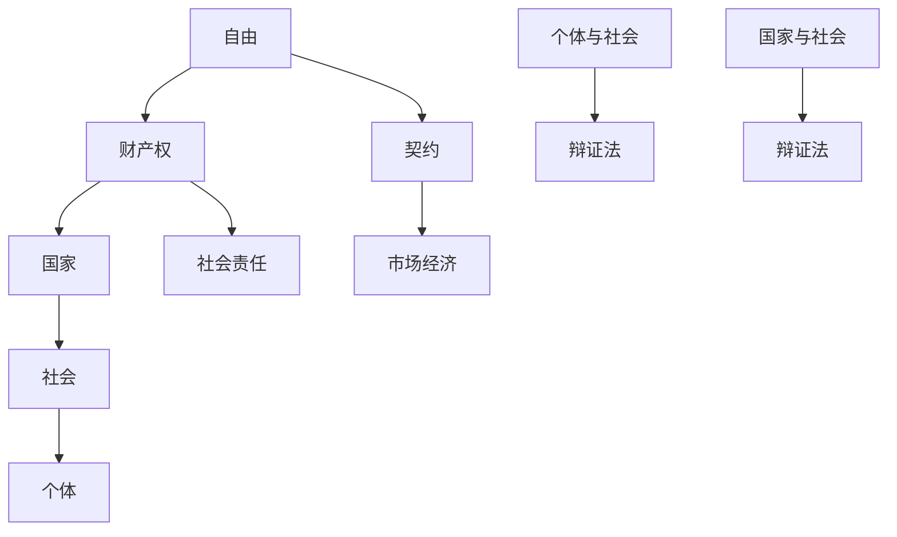

                 

### 文章标题：亚当·斯密与黑格尔：市民社会理论的两种视角

### 关键词：市民社会理论，亚当·斯密，黑格尔，自由主义，辩证法，经济学，社会学，数学模型

### 摘要：
本文旨在探讨两位哲学巨擘——亚当·斯密与黑格尔——对于市民社会理论的独特视角。通过对这两位思想家的生平背景、理论核心及其实践应用的分析，本文揭示了市民社会理论在不同历史阶段的发展脉络和现实意义。本文将首先介绍亚当·斯密与黑格尔的基本情况，然后深入剖析他们的市民社会理论，最后通过对比分析，探讨这两种视角的异同及其在现代社会的应用价值。

### 引言

市民社会理论是社会科学领域中的重要组成部分，探讨个体与社会之间的互动关系，以及社会结构和制度的形成与变迁。亚当·斯密与黑格尔作为西方哲学史上的重要人物，他们的市民社会理论对后世产生了深远的影响。本文将首先简要介绍这两位思想家的生平与成就，然后深入探讨他们的市民社会理论，并进行分析对比。

#### 亚当·斯密

亚当·斯密（Adam Smith，1723-1790）是18世纪著名的经济学家，被誉为“经济学之父”。他出生于苏格兰，毕业于格拉斯哥大学，后赴牛津大学深造。亚当·斯密在经济学领域的主要贡献包括提出“看不见的手”理论，强调市场自由和竞争的重要性。他的代表作《国富论》详细阐述了市场经济体系的运作原理，对现代经济学的发展产生了深远的影响。

#### 黑格尔

黑格尔（Georg Wilhelm Friedrich Hegel，1770-1831）是19世纪德国的哲学家，被誉为“现代哲学之父”。他出生于符腾堡，曾在图宾根大学学习，后任柏林大学校长。黑格尔的哲学体系强调辩证法，认为现实世界是不断变化和发展的。他的市民社会理论是在其哲学体系中的一部分，主张社会进步是通过个体与社会的矛盾和统一实现的。

### 市民社会理论的定义与重要性

市民社会理论主要探讨个体与社会之间的关系，以及社会结构和制度的形成与变迁。亚当·斯密与黑格尔的市民社会理论虽然有着不同的哲学背景和理论框架，但都强调了个体在社会发展中的重要作用。亚当·斯密认为，市民社会是市场经济和自由竞争的产物，个体通过市场交易实现自身利益的同时，推动了社会的整体发展。而黑格尔则强调市民社会是个体与社会矛盾和统一的场所，个体的自由和权利是在与社会的关系中实现的。

市民社会理论的重要性体现在多个方面。首先，它为理解现代社会的运作提供了理论框架。其次，它对社会制度的变革和政策制定具有指导意义。最后，市民社会理论的研究有助于深化对个体与社会关系的认识，促进个体与社会和谐发展。

### 第一部分：引言与背景

#### 第1章：著名经济学家亚当·斯密

##### 1.1 生平与成就

亚当·斯密（Adam Smith，1723-1790）是18世纪最具影响力的经济学家之一，被誉为“现代经济学之父”。他出生于苏格兰的科尔克里夫，在那里度过了他的童年。斯密在格拉斯哥大学接受了早期的教育，随后在牛津大学完成了他的学业。在牛津大学期间，斯密深受道德哲学和经济学的影响，特别是大卫·休谟的思想对他产生了深远的影响。

1776年，亚当·斯密发表了其最著名的作品《国富论》（The Wealth of Nations）。这本书不仅为经济学的发展奠定了基础，也对现代政治经济学产生了深远的影响。《国富论》中，斯密详细阐述了市场经济的运作原理，特别是自由竞争和市场机制的作用。他提出了著名的“看不见的手”理论，认为市场中的个体在追求自身利益的同时，无意中促进了整个社会的福祉。

此外，亚当·斯密还在教育领域有所贡献。在1751年至1764年间，他曾在格拉斯哥大学教授道德哲学，并撰写了《道德情感论》（The Theory of Moral Sentiments），这本书探讨了道德行为和情感的起源和作用。

##### 1.2 市民社会理论的基础

亚当·斯密的市民社会理论基于他对市场经济和自由竞争的深刻理解。《国富论》中，他提出了一系列关于市民社会的核心观点：

1. **市场经济的效率**：斯密认为，市场经济具有高度效率，因为它能够通过价格机制自动调节资源的分配。市场中的供需关系会自动达到平衡，从而实现资源的最大化利用。

2. **个体主义**：斯密强调个体在经济活动中的重要作用。他认为，个体通过追求自身利益，不仅能够实现自我发展，还能为社会整体带来福祉。

3. **自由主义**：斯密主张政府应该尽量减少对市场的干预，让市场自由运作。他认为，政府的职责主要是维护法律和秩序，保障市场的公平竞争。

4. **财产权的重要性**：斯密认为，财产权是市民社会的基石。个体通过拥有财产，不仅能够保障自身的基本生活需求，还能通过投资和创新推动社会的发展。

##### 1.3 亚当·斯密市民社会理论的数学模型

亚当·斯密的市民社会理论中包含了一些基本的数学模型，用于解释市场经济中的供求关系和个体行为。以下是一些关键的数学模型和概念：

1. **供需模型**：斯密认为，市场价格是由供给和需求相互作用决定的。供需曲线的交点即为市场价格。供给曲线表示在不同价格水平下，生产者愿意提供的商品数量；需求曲线表示在不同价格水平下，消费者愿意购买的商品数量。

2. **利润最大化模型**：生产者在市场经济中的目标是追求利润最大化。这个模型假设生产者会根据市场价格和成本来确定生产量和价格，从而实现利润最大化。

3. **生产成本模型**：斯密认为，生产成本包括固定成本和可变成本。固定成本是指在生产过程中不随产量变化的成本，如租金和设备费用；可变成本是指随产量变化的成本，如原材料和劳动力成本。

通过这些数学模型，斯密能够更精确地描述市场经济的运行机制，从而为经济政策提供理论依据。

##### 1.4 亚当·斯密市民社会理论的案例分析

亚当·斯密的市民社会理论在历史上有着广泛的应用。以下是一些具体的案例：

1. **英国工业革命**：工业革命是亚当·斯密市民社会理论的典型案例。在18世纪末和19世纪初，英国经历了一场以机器制造和工厂制度为特征的工业革命。这场革命极大地推动了生产力的提高，也证明了市场经济和自由竞争的有效性。

2. **市场经济制度的推广**：亚当·斯密的理论为市场经济制度在全球范围内的推广提供了理论支持。许多国家在制定经济政策时，都参考了斯密的观点，强调市场自由和竞争的重要性。

3. **社会契约理论**：斯密的市民社会理论也对社会契约理论的发展产生了影响。社会契约理论认为，政府的存在是为了保障公民的权利和自由，这与斯密强调政府作用有限的观点相呼应。

#### 第2章：哲学家黑格尔

##### 2.1 生平与成就

黑格尔（Georg Wilhelm Friedrich Hegel，1770-1831）是19世纪德国哲学的代表人物，被誉为“现代哲学之父”。他出生于符腾堡的斯图加特，他的家庭并不富裕，但他通过自己的努力和天赋，成为了一位杰出的哲学家。

黑格尔在图宾根大学接受了早期的教育，并在那里结识了后来的哲学同仁，如谢林和费希特。他在1793年前往柏林大学深造，并在那里度过了大部分职业生涯。黑格尔的教学和研究涵盖了广泛的哲学领域，包括逻辑学、美学、法学和历史哲学。

黑格尔在哲学上的主要成就包括：

1. **辩证法**：黑格尔提出了辩证法这一哲学概念，强调事物的发展是通过矛盾和冲突实现的。他认为，现实是一个不断变化和发展的过程，任何事物都包含着对立面，这些对立面在相互作用中推动事物的发展。

2. **历史哲学**：黑格尔认为，历史是理性的展开，每个历史时期都有其特定的逻辑和意义。他的历史哲学观点对后来的历史学和社会科学产生了深远的影响。

3. **国家哲学**：黑格尔强调国家的至高无上地位，认为国家是人民意志的体现，同时也是个体实现自由和权利的保障。

##### 2.2 市民社会理论的关键观点

黑格尔的市民社会理论是其哲学体系中的重要组成部分。他的市民社会理论主要涵盖以下几个关键观点：

1. **辩证法的应用**：黑格尔将辩证法应用于市民社会理论，认为市民社会中的个体与社会之间的矛盾和统一是社会发展的动力。他认为，市民社会的目标是实现个体与社会的和谐统一。

2. **个体与社会的关系**：黑格尔强调个体与社会之间的互动关系。他认为，个体的自由和权利是在与社会的关系中实现的，个体的行为和选择对社会结构和制度有着重要的影响。

3. **国家与市民社会的关系**：黑格尔认为，国家是市民社会的最高形式，它代表了普遍的理性。国家与市民社会之间是一种辩证的关系，国家需要平衡个体权利与社会利益。

##### 2.3 黑格尔市民社会理论的数学模型

黑格尔的市民社会理论中包含了一些哲学概念和逻辑结构，虽然不直接涉及数学模型，但可以通过逻辑推理和辩证法来理解。以下是一些关键的概念和逻辑框架：

1. **对立统一规律**：黑格尔认为，现实世界是通过对立面的统一和矛盾的运动实现的。这一规律可以被视为一种哲学模型，它描述了事物发展中的矛盾和统一。

2. **矛盾与和解**：黑格尔认为，社会中的矛盾是不可避免的，但矛盾也是社会进步的动力。矛盾通过辩证的过程得到解决，从而推动社会的不断发展。

3. **社会发展的辩证法模型**：黑格尔提出，社会的发展是一个辩证的过程，包括矛盾、冲突、和解和新的统一。这一模型可以用来描述社会结构的变迁和进步。

##### 2.4 黑格尔市民社会理论的案例分析

黑格尔的市民社会理论在历史上有着丰富的实践案例，以下是一些具体的案例：

1. **法国大革命**：黑格尔的历史哲学观点在法国大革命中得到了体现。他认为，革命是历史发展的必然结果，它反映了社会矛盾的激化和解决。

2. **德国统一**：黑格尔的国家哲学观点在德国统一过程中得到了应用。他认为，国家的统一是实现个体自由和权利的必要条件。

3. **社会主义理论**：黑格尔的市民社会理论对后来的社会主义理论产生了影响。马克思主义者吸取了黑格尔的辩证法观点，用于分析社会矛盾和阶级斗争。

### 市民社会理论的定义与重要性

市民社会理论是探讨个体与社会之间互动关系的重要概念，它不仅涵盖了经济学中的市场行为，还包括了社会结构、政治制度和文化价值观等多个层面。亚当·斯密与黑格尔的市民社会理论各有侧重，但都为我们理解现代社会提供了重要的视角。

#### 市民社会的概念

市民社会（Civil Society）通常指的是一个介于国家与市场之间的社会空间，其中个体可以自由地组织、表达和行动。这个概念在18世纪的西方社会尤为突出，它反映了个人权利与自由的重要地位。

亚当·斯密对市民社会的定义主要围绕市场经济和自由竞争。他认为，市民社会是由自主的个体组成的，这些个体通过市场交易实现自身利益，从而推动了社会的整体发展。

黑格尔则从哲学和辩证法的角度定义市民社会。他认为，市民社会是个体与社会之间的互动场所，个体在这里通过劳动和交换实现自身的价值，同时也承担着社会责任。

#### 市民社会理论的研究意义

市民社会理论在社会科学研究中具有重要意义，主要体现在以下几个方面：

1. **理解个体与社会的关系**：市民社会理论帮助我们理解个体与社会之间的复杂互动关系，包括自由、权利、责任和利益分配等方面。

2. **分析社会结构**：市民社会理论提供了分析社会结构的有力工具，有助于我们理解社会阶层、政治制度和文化价值观的形成和发展。

3. **指导政策制定**：市民社会理论为政策制定提供了理论依据。在市场经济和民主制度的背景下，市民社会理论有助于制定促进社会公平和发展的政策。

#### 现实意义

在现代社会，市民社会理论具有重要的现实意义：

1. **市场经济的发展**：亚当·斯密的市民社会理论为市场经济的发展提供了理论支持，强调市场自由和竞争的重要性。

2. **社会公平与正义**：黑格尔的市民社会理论强调个体权利与社会利益的平衡，为解决社会不平等和促进社会公平提供了思路。

3. **个体自由的实现**：无论是亚当·斯密的自由主义视角还是黑格尔的辩证法视角，都强调个体自由在社会发展中的核心地位。

### 第二部分：亚当·斯密市民社会理论

#### 第3章：亚当·斯密市民社会理论概述

##### 3.1 市民社会的兴起与发展

亚当·斯密的市民社会理论源于18世纪英国工业革命的背景。工业革命引发了生产力的巨大飞跃，市场经济迅速发展，市民社会逐渐兴起。在这一过程中，个体在经济活动中的地位日益凸显，自由竞争成为市场经济的重要特征。

市民社会的兴起是一个历史性的过程，它不仅改变了社会的生产方式，也影响了社会结构和文化价值观。亚当·斯密认为，市民社会的兴起是自由和理性的产物，它为个体提供了自由表达和追求自身利益的平台。

##### 3.1.1 市民社会的历史背景

18世纪是英国工业革命的时期，这一时期的生产力显著提高，工业化进程迅速推进。随着工厂制度的建立和市场的扩展，传统的社会结构发生了重大变化。个体从传统的农业社会转向工业社会，经济活动也从农业转向工业和服务业。

这一历史背景为亚当·斯密的市民社会理论提供了实践基础。他通过观察和分析这一时期的经济发展，提出了关于市民社会的核心观点。

##### 3.1.2 市民社会的发展趋势

市民社会的发展趋势主要体现在以下几个方面：

1. **市场经济的发展**：市场经济成为社会资源配置的主要方式，价格机制在调节供需关系方面发挥了关键作用。

2. **个体自由的扩大**：个体在经济活动中的自由度增加，个体可以在市场中自由选择职业、商品和交易对象。

3. **社会阶层的分化**：随着市场经济的发展，社会阶层逐渐分化，个体之间的经济地位和社会地位差异加大。

4. **社会组织的多样化**：市民社会的兴起导致了各种社会组织形式的出现，包括商会、工会和行业协会等。

##### 3.2 市民社会理论的核心概念

亚当·斯密的市民社会理论包含了一系列核心概念，这些概念构成了他理论体系的基础。以下是几个关键的核心概念：

1. **自由**：亚当·斯密认为，自由是个体在社会中的基本权利。个体应该享有经济自由，可以自由选择职业、商品和交易对象。

2. **财产权**：财产权是个体在社会中的经济保障。个体通过拥有财产，不仅可以保障自身的基本生活需求，还可以通过投资和创新推动社会的发展。

3. **契约**：契约是市场经济中的基本交易方式。个体通过签订契约，明确双方的权利和义务，保障交易的安全和公平。

4. **市场经济**：市场经济是亚当·斯密市民社会理论的核心。他认为，市场经济具有自我调节的能力，能够通过价格机制实现资源的优化配置。

##### 3.2.1 自由、财产与契约

自由、财产与契约是亚当·斯密市民社会理论中的三个核心概念，它们相互联系，构成了市民社会的基石。

1. **自由**：自由是亚当·斯密市民社会理论的核心理念。他认为，个体应该享有经济自由，可以在市场上自由选择职业、商品和交易对象。经济自由不仅是个体的基本权利，也是市场经济发展的基础。

2. **财产权**：财产权是个体在社会中的经济保障。个体通过拥有财产，不仅可以保障自身的基本生活需求，还可以通过投资和创新推动社会的发展。财产权是市场经济中的重要概念，它保障了个体在经济活动中的权益。

3. **契约**：契约是市场经济中的基本交易方式。个体通过签订契约，明确双方的权利和义务，保障交易的安全和公平。契约的签订是市场经济中个体之间合作的重要形式，它促进了市场交易的顺利进行。

这三大核心概念相互关联，共同构成了亚当·斯密市民社会的理论框架。自由保障了个体在经济活动中的权利，财产权提供了个体发展的经济保障，而契约则是市场经济中个体之间合作和交易的纽带。

##### 3.2.2 市民社会的法律基础

亚当·斯密认为，市民社会的法律基础是维护个体权利和市场秩序的保障。他在《国富论》中提出了一系列法律原则，这些原则构成了市民社会法律体系的基础。

1. **产权保护**：产权保护是市民社会法律体系的核心。亚当·斯密认为，法律应该明确和保护个体的财产权，防止侵犯和盗窃行为。

2. **合同法**：合同法是市场经济中的重要法律原则。亚当·斯密强调，合同应该是自愿和公平的，法律应该保障合同的执行，防止违约行为。

3. **公平竞争**：公平竞争是市场经济的基石。亚当·斯密认为，法律应该保障市场的公平竞争，防止垄断和不正当竞争行为。

4. **刑法和治安法**：亚当·斯密认为，刑法和治安法是维护社会秩序和公民安全的重要手段。法律应该明确规定犯罪行为和惩罚措施，维护社会的稳定和安全。

通过这些法律原则，亚当·斯密为市民社会的法律基础提供了理论支持，强调了法律在维护个体权利和市场秩序中的重要作用。

##### 3.3 亚当·斯密市民社会理论的数学模型

亚当·斯密市民社会理论中包含了一些关键的数学模型，这些模型有助于我们理解和分析市场经济的运行机制。以下是几个重要的数学模型：

1. **供需模型**：供需模型是经济学中最基本的模型之一。在亚当·斯密的市民社会理论中，供需模型用于解释市场价格的形成。供需曲线表示在不同价格水平下，生产者愿意提供的商品数量和消费者愿意购买的商品数量。市场价格是供需曲线的交点，它反映了市场的供需平衡。

2. **利润最大化模型**：利润最大化模型是生产者在市场经济中的目标。生产者会根据市场价格和成本来确定生产量和价格，从而实现利润最大化。利润最大化模型通常使用边际分析的方法，即通过比较边际成本和边际收入来确定最优生产水平。

3. **生产成本模型**：生产成本模型用于计算生产成本，包括固定成本和可变成本。固定成本是生产过程中不随产量变化的成本，如租金和设备费用；可变成本是生产过程中随产量变化的成本，如原材料和劳动力成本。通过生产成本模型，可以更准确地计算生产成本，为价格制定提供依据。

4. **价格机制模型**：价格机制模型描述了市场价格的形成和调节过程。在亚当·斯密的市民社会理论中，价格机制是通过供求关系和市场竞争实现的。市场价格会自动调节，以实现供需平衡，从而保证市场的稳定和效率。

通过这些数学模型，亚当·斯密能够更精确地描述市场经济的运行机制，为政策制定和经济发展提供了理论支持。

##### 3.3.1 微观经济分析

微观经济分析是亚当·斯密市民社会理论中的重要组成部分。它关注个体经济行为和市场机制的运行，通过分析个体和市场的互动，揭示经济现象的本质。

1. **个体行为分析**：微观经济分析首先关注个体行为。在市场经济中，个体包括消费者、生产者和投资者。他们通过选择商品、服务、投资等方式，实现自身利益最大化。微观经济分析通过需求函数、供给函数和效用函数等数学模型，分析个体行为的决策过程。

2. **市场机制分析**：微观经济分析其次关注市场机制的运行。市场机制主要通过价格机制、供求关系和信息传递实现资源的优化配置。价格机制是市场经济中最重要的机制，它通过供需关系的调节，实现市场价格的形成。微观经济分析通过供需模型、价格机制模型等，分析市场机制的运行规律。

3. **市场竞争分析**：微观经济分析还关注市场竞争的影响。市场竞争是市场经济的重要特征，它通过竞争压力，推动个体创新和提高效率。微观经济分析通过竞争模型、垄断模型等，分析市场竞争的效应。

通过微观经济分析，亚当·斯密能够深入理解市场经济的运行机制，为政策制定和经济发展提供科学依据。

##### 3.3.2 市场经济与道德

亚当·斯密认为，市场经济不仅是资源配置的有效手段，也是实现道德价值的重要途径。在他的市民社会理论中，市场经济与道德紧密相连，相互促进。

1. **市场经济与道德的关系**：亚当·斯密认为，市场经济中个体的行为应符合道德规范。市场经济中的公平、诚信、合作等道德价值，是市场经济健康发展的重要保障。同时，市场经济的发展也有助于培养个体的道德品质，通过经济活动，个体可以实现自我完善和社会责任。

2. **道德规范在市场经济中的作用**：道德规范在市场经济中发挥着关键作用。首先，道德规范可以促进市场交易的公平和诚信，减少欺诈和违约行为，提高市场效率。其次，道德规范有助于个体实现自我价值和社会价值的统一，推动社会和谐发展。

3. **市场经济中的道德困境**：尽管亚当·斯密强调市场经济与道德的关系，但在实际操作中，市场经济也面临着道德困境。例如，追求利润最大化可能导致道德缺失，市场竞争也可能引发不公平行为。因此，在市场经济中，道德教育和道德规范至关重要，只有通过良好的道德环境，市场经济才能健康发展。

通过探讨市场经济与道德的关系，亚当·斯密为市场经济的道德基础提供了理论支持，强调了道德在市场经济中的重要作用。

##### 3.4 亚当·斯密市民社会理论的案例分析

亚当·斯密的市民社会理论在历史上有着广泛的应用，以下是一些具体的案例：

1. **英国工业革命**：英国工业革命是亚当·斯密市民社会理论的典型案例。18世纪末和19世纪初，英国经历了一场以机器制造和工厂制度为特征的工业革命。这场革命极大地推动了生产力的提高，也证明了市场经济和自由竞争的有效性。亚当·斯密的理论为英国工业革命提供了理论支持，强调了市场自由和竞争的重要性。

2. **市场经济制度的推广**：亚当·斯密的理论为市场经济制度在全球范围内的推广提供了理论依据。许多国家在制定经济政策时，都参考了斯密的观点，强调市场自由和竞争的重要性。例如，美国在19世纪通过一系列改革，建立了自由市场经济体系，成为全球经济发展的典范。

3. **社会契约理论**：亚当·斯密的市民社会理论也对社会契约理论的发展产生了影响。社会契约理论认为，政府的存在是为了保障公民的权利和自由，这与斯密强调政府作用有限的观点相呼应。社会契约理论为现代民主制度的建立提供了理论基础，推动了社会公平和正义的实现。

#### 第4章：黑格尔市民社会理论概述

##### 4.1 黑格尔市民社会理论的哲学背景

黑格尔的市民社会理论深深植根于其哲学体系，他的哲学体系是一个以辩证法为核心的思想框架。辩证法是黑格尔哲学体系的基本方法，强调事物的发展是通过矛盾和对立面的统一实现的。黑格尔的哲学背景包括以下几个方面：

1. **辩证法**：辩证法是黑格尔哲学的核心。他认为，现实世界是一个不断变化和发展的过程，任何事物都包含着对立面，这些对立面在相互作用中推动事物的发展。辩证法不仅仅是逻辑思维的工具，更是理解现实世界的关键。

2. **理性**：黑格尔认为，理性是现实世界的本质。他强调，现实世界是理性的表现，人类社会的发展是理性不断实现和自我完善的过程。

3. **历史哲学**：黑格尔的历史哲学观点认为，历史是理性发展的过程，每个历史时期都有其特定的逻辑和意义。他强调，历史是普遍理性的展开，人类社会的发展是一个不断进步的过程。

4. **国家哲学**：黑格尔强调国家的至高无上地位，认为国家是人民意志的体现，同时也是个体实现自由和权利的保障。他的国家哲学观点对后来的政治理论产生了深远的影响。

这些哲学背景为黑格尔的市民社会理论提供了理论基础，使他能够从哲学的高度探讨市民社会的本质和发展规律。

##### 4.2 黑格尔市民社会理论的核心概念

黑格尔的市民社会理论包含了一系列核心概念，这些概念构成了他理论体系的基础。以下是几个关键的核心概念：

1. **个体与社会**：黑格尔认为，个体与社会是相互依存的。个体在市民社会中通过劳动和交换实现自身的价值，同时也承担着社会责任。个体与社会的关系是一个辩证的过程，个体在社会中实现自由和权利，同时也受到社会的限制。

2. **自由与约束**：黑格尔认为，自由是市民社会的重要特征，但自由并不是无约束的。个体的自由受到社会规则和法律的保护，同时也受到社会的限制。自由与约束是一个辩证的关系，只有在社会规则的保护下，个体的自由才能得到实现。

3. **国家与市民社会**：黑格尔认为，国家是市民社会的最高形式，它代表了普遍的理性。国家与市民社会之间是一种辩证的关系，国家需要平衡个体权利与社会利益。国家的职责是保障公民的权利和自由，同时也需要维护社会秩序。

4. **劳动与财产**：黑格尔强调劳动和财产在市民社会中的重要性。他认为，劳动是个体实现自身价值的重要途径，财产是个体经济保障的基础。通过劳动和财产，个体能够实现自身的价值和满足社会的需求。

这些核心概念相互联系，共同构成了黑格尔市民社会理论的基本框架。

##### 4.3 市民社会的辩证法

黑格尔的市民社会理论强调辩证法的应用，认为市民社会的发展是通过矛盾和对立面的统一实现的。以下是对黑格尔辩证法在市民社会中的应用的详细解释：

1. **对立统一规律**：黑格尔认为，现实世界是通过对立面的统一和矛盾的运动实现的。市民社会中的个体与社会、自由与约束、国家与市民社会等概念都是对立面的统一。这些对立面在相互作用中推动社会的发展。

2. **矛盾与冲突**：黑格尔认为，社会中的矛盾和冲突是不可避免的，但它们是社会进步的动力。市民社会中的个体和社会之间存在着矛盾和冲突，这些矛盾和冲突通过辩证的过程得到解决，从而推动社会的不断发展。

3. **和解与统一**：黑格尔认为，矛盾和冲突的解决是通过和解和统一实现的。在市民社会中，个体和社会通过协商和合作，解决矛盾和冲突，实现社会的和谐统一。

通过辩证法的应用，黑格尔能够深入分析市民社会的运行机制，揭示社会发展的内在规律。

##### 4.4 市民社会的辩证法模型

黑格尔的市民社会理论中包含了一些辩证法模型，用于描述市民社会的发展过程。以下是几个关键的辩证法模型：

1. **辩证过程模型**：黑格尔认为，市民社会的发展是一个辩证过程，包括矛盾、冲突、和解和新的统一。这个模型描述了市民社会从矛盾到统一的发展过程，反映了社会发展的动态性。

2. **个体与社会互动模型**：这个模型描述了个体与社会之间的辩证关系。个体在市民社会中通过劳动和交换实现自身的价值，同时也受到社会的限制和约束。个体与社会之间的互动是一个不断变化和发展的过程。

3. **国家与市民社会互动模型**：这个模型描述了国家与市民社会之间的辩证关系。国家是市民社会的最高形式，它需要平衡个体权利与社会利益。国家与市民社会的互动是一个动态平衡的过程，通过协商和合作，实现社会的和谐统一。

通过这些辩证法模型，黑格尔能够更深入地理解市民社会的发展规律，为现代社会的建设提供理论指导。

##### 4.5 黑格尔市民社会理论的数学模型

黑格尔的市民社会理论虽然主要侧重于哲学和辩证法，但其中仍包含了一些逻辑结构和概念模型，这些模型有助于我们理解其理论。以下是几个关键数学模型：

1. **对立统一模型**：黑格尔认为，现实世界是通过对立统一实现的。这个模型可以用数学中的二元运算表示，例如正负数的对立和运算。它反映了矛盾和对立面的统一，是黑格尔辩证法的基础。

2. **矛盾演变模型**：黑格尔认为，矛盾是事物发展的动力。这个模型可以用逻辑图或状态转移图表示，描述矛盾的产生、激化和解决过程。通过这个模型，可以分析社会矛盾的发展规律。

3. **社会动力模型**：黑格尔认为，社会的发展是一个动态过程，包括矛盾、冲突、和解和新的统一。这个模型可以用状态转移图或微分方程表示，描述社会状态的变化和演进。

通过这些数学模型，黑格尔的市民社会理论得以量化，从而为社会科学研究提供了新的工具。

##### 4.6 黑格尔市民社会理论的案例分析

黑格尔的市民社会理论在历史上有着丰富的实践案例，以下是一些具体的案例：

1. **法国大革命**：法国大革命是黑格尔市民社会理论的典型案例。这场革命反映了社会矛盾的激化和解决，体现了个体与社会的辩证关系。黑格尔认为，革命是历史发展的必然结果，它通过矛盾和冲突推动社会的进步。

2. **德国统一**：德国统一过程也体现了黑格尔的市民社会理论。19世纪末，德国通过一系列政治和经济改革，实现了国家的统一。这一过程反映了国家与市民社会的辩证关系，国家通过平衡个体权利与社会利益，实现了社会的和谐统一。

3. **社会主义运动**：黑格尔的市民社会理论对社会主义运动产生了影响。许多社会主义者吸取了黑格尔的辩证法观点，用于分析社会矛盾和阶级斗争。黑格尔的市民社会理论为社会主义理论提供了哲学基础。

#### 第5章：两种视角的对比

##### 5.1 理论框架的比较

亚当·斯密与黑格尔的市民社会理论在理论框架上有显著的差异。亚当·斯密的理论以自由主义为核心，强调市场经济的效率和个体自由。他的理论框架主要包括个体主义、自由竞争和市场机制等基本概念。

相反，黑格尔的市民社会理论以辩证法为基础，强调个体与社会之间的辩证关系和国家的重要性。他的理论框架包括个体与社会、自由与约束、国家与市民社会等核心概念。

这些差异反映了两位思想家不同的哲学背景和时代背景。亚当·斯密生活在工业革命初期，市场经济迅速发展，他强调市场的自我调节能力和个体自由。而黑格尔生活在19世纪，资本主义的发展导致社会矛盾加剧，他强调辩证法和国家的角色。

##### 5.2 理论应用的比较

亚当·斯密的市民社会理论在市场经济和自由竞争的环境中得到了广泛应用。他的理论为市场经济的发展提供了理论支持，强调了市场自由和竞争的重要性。许多国家在制定经济政策时，都参考了斯密的观点，推行市场经济改革。

黑格尔的市民社会理论则更多地应用于社会变革和国家建设中。他的理论强调个体与社会之间的辩证关系，为理解社会矛盾和推动社会进步提供了理论依据。许多社会主义者和改革者借鉴了黑格尔的观点，用于分析社会问题和国家建设。

这些差异反映了两位思想家对市民社会理论的实际应用方向的差异。亚当·斯密的理论主要关注市场经济和个体自由，而黑格尔的理论则关注社会矛盾和国家建设。

##### 5.3 核心概念的异同

亚当·斯密与黑格尔的市民社会理论在核心概念上也存在一定的异同。

相同之处：

1. **个体与社会**：两位思想家都认为个体与社会是相互依存的，个体的行为对社会有重要影响。

2. **自由**：他们都强调自由的重要性，认为自由是市民社会的基本特征。

不同之处：

1. **自由与约束**：亚当·斯密强调个体自由的绝对性，认为个体应该享有充分的经济自由。而黑格尔则认为，自由是相对的，个体的自由受到社会规则和法律的约束。

2. **市场经济与国家**：亚当·斯密主张市场经济和自由竞争，强调政府作用有限。而黑格尔则强调国家的至高无上地位，认为国家是人民意志的体现。

这些异同反映了两位思想家对市民社会理论的不同理解和观点。

##### 5.4 现代社会的启示

亚当·斯密与黑格尔的市民社会理论在现代社会仍然具有重要的启示意义。

亚当·斯密的理论提醒我们，市场经济和自由竞争是现代社会的重要特征，但需要在政府的监管下运行，以防止市场失灵和社会不公。他的理论为现代经济政策提供了重要的理论依据，特别是在推进市场经济改革和促进社会公平方面。

黑格尔的理论则提醒我们，社会矛盾和国家建设是现代社会必须面对的挑战。他的理论强调了个体与社会之间的辩证关系，为理解社会矛盾和推动社会进步提供了理论支持。他的观点对现代政治哲学和社会政策产生了深远的影响，特别是在推动社会公正和实现国家发展方面。

总之，亚当·斯密与黑格尔的市民社会理论为我们提供了不同但互补的视角，有助于我们更好地理解现代社会的复杂性和多样性。

### 第三部分：两种视角的对比与分析

#### 第6章：核心概念与联系

##### 6.1 自由、财产与契约的关系

在亚当·斯密与黑格尔的市民社会理论中，自由、财产与契约是三个核心概念，它们相互联系，构成了市民社会的基石。

1. **自由**：亚当·斯密认为，自由是个体在社会中的基本权利。他在《国富论》中强调，个体在经济活动中的自由选择是市场经济有效运行的关键。自由不仅包括经济自由，还包括思想和言论的自由。黑格尔则从辩证法的角度看待自由，认为自由是相对的，个体的自由必须在社会的规则和法律框架内实现。个体的自由与社会责任是辩证关系，自由是在与社会的互动中实现的。

2. **财产权**：财产权是亚当·斯密市民社会理论的核心概念之一。他认为，财产权是市场经济的基础，个体通过拥有财产，可以保障自身的基本生活需求，并通过投资和创新推动社会的发展。黑格尔也强调财产权的重要性，但他的观点更加辩证。他认为，财产权不仅是经济保障，也是个体实现自我价值和社会责任的手段。财产权在社会关系中具有双重作用，既是个体的权利，也是社会责任的体现。

3. **契约**：契约是市场经济中个体之间交易的基本方式。亚当·斯密认为，契约是市场经济的润滑剂，它保障了交易的安全和公平。契约的签订和执行，是市场经济有序运行的重要保证。黑格尔则从辩证法的角度看待契约，认为契约不仅是交易的工具，也是个体与社会之间的互动形式。契约的签订和履行，体现了个体在社会中的责任和义务，是自由与约束的辩证统一。

##### 6.2 国家、社会与个体的互动

亚当·斯密与黑格尔对国家、社会与个体之间的互动关系有着不同的理解和阐述。

1. **亚当·斯密的观点**：亚当·斯密强调个体的自由和市场的作用。他认为，国家的角色应该是有限的，主要职责是维护法律和秩序，保障市场的公平竞争。国家不应该过度干预市场，否则会破坏市场机制的有效性。国家与社会之间的关系是保护与被保护的关系，国家保障社会的自由发展，社会则通过市场机制实现个体的自由和福祉。

2. **黑格尔的观点**：黑格尔从辩证法的角度看待国家、社会与个体之间的关系。他认为，国家是市民社会的最高形式，代表普遍的理性。国家与市民社会之间是一种辩证的关系，国家需要平衡个体权利与社会利益。个体与社会之间的关系是相互依存的，个体在市民社会中实现自由和权利，同时也承担着社会责任。国家的作用是协调个体与社会之间的矛盾，实现社会的和谐发展。

##### 6.3 市民社会理论的Mermaid流程图

为了更好地理解亚当·斯密与黑格尔的市民社会理论，我们可以使用Mermaid流程图来展示核心概念之间的关系。



这个流程图展示了自由、财产权、契约、国家、社会责任、市场经济、个体与社会以及辩证法之间的关系。通过流程图，我们可以更直观地理解市民社会理论的内在逻辑和结构。

### 第四部分：数学模型与数学公式

#### 第7章：数学模型与数学公式

##### 7.1 微观经济分析模型

微观经济分析是经济学中最基础的部分，它关注个体决策和市场机制。在亚当·斯密的市民社会理论中，微观经济分析模型起着核心作用，用于解释市场价格的形成和资源配置的效率。

1. **供需模型**：供需模型是微观经济分析的核心。它通过表示供给和需求之间的关系，解释了市场价格的形成。供给曲线表示在不同价格水平下，生产者愿意提供的商品数量；需求曲线表示在不同价格水平下，消费者愿意购买的商品数量。市场价格是供给曲线和需求曲线的交点。

   **供需模型公式**：
   $$
   Q_s(p) = \text{供给量}
   $$
   $$
   Q_d(p) = \text{需求量}
   $$
   $$
   P = \text{市场价格}
   $$

2. **利润最大化模型**：生产者在市场经济中的目标是追求利润最大化。利润最大化模型通过比较边际成本和边际收入来确定最优生产水平。边际成本是指增加一单位产量所增加的成本；边际收入是指增加一单位产量所增加的收入。

   **利润最大化公式**：
   $$
   \max \pi = \text{利润}
   $$
   $$
   \pi = \text{收入} - \text{成本}
   $$
   $$
   \text{边际收入} = \frac{\partial \text{收入}}{\partial Q}
   $$
   $$
   \text{边际成本} = \frac{\partial \text{成本}}{\partial Q}
   $$

3. **生产成本模型**：生产成本模型用于计算生产过程中所需的成本。生产成本包括固定成本和可变成本。固定成本是生产过程中不随产量变化的成本，如租金和设备费用；可变成本是生产过程中随产量变化的成本，如原材料和劳动力成本。

   **生产成本公式**：
   $$
   \text{总成本} = \text{固定成本} + \text{可变成本}
   $$
   $$
   \text{固定成本} = \text{F}
   $$
   $$
   \text{可变成本} = \text{V}
   $$

##### 7.2 辩证法模型

黑格尔的市民社会理论中包含了一些哲学概念和逻辑结构，虽然不直接涉及数学模型，但可以通过逻辑推理和辩证法来理解。以下是一些关键的概念和逻辑框架：

1. **对立统一规律**：黑格尔认为，现实世界是通过对立面的统一和矛盾的运动实现的。这一规律可以用数学中的二元运算来表示，例如正负数的对立和运算。

   **对立统一公式**：
   $$
   a + (-a) = 0
   $$
   $$
   a \cdot (-a) = -a^2
   $$

2. **矛盾与和解**：黑格尔认为，社会中的矛盾和冲突是不可避免的，但它们是社会进步的动力。矛盾通过辩证的过程得到解决，从而推动社会的不断发展。

   **矛盾与和解过程**：
   $$
   \text{矛盾} \rightarrow \text{冲突} \rightarrow \text{和解} \rightarrow \text{新统一}
   $$

3. **社会发展的辩证法模型**：黑格尔提出，社会的发展是一个辩证的过程，包括矛盾、冲突、和解和新的统一。这个模型可以用来描述社会结构的变迁和进步。

   **社会发展的辩证法模型**：
   $$
   S(t) = S_0 + \int_0^t [M(t') - C(t')]
   $$
   $$
   S(t) = \text{社会状态}
   $$
   $$
   S_0 = \text{初始社会状态}
   $$
   $$
   M(t') = \text{矛盾产生速率}
   $$
   $$
   C(t') = \text{冲突解决速率}
   $$

##### 7.3 社会发展动力模型

社会发展动力模型用于描述社会发展的动力和过程。这个模型结合了经济学和社会学的理论，用于分析社会进步和变迁。

1. **社会动力公式**：社会动力模型通过分析社会矛盾和社会变迁的速率，描述社会的发展。

   **社会动力公式**：
   $$
   \frac{dS}{dt} = M - C
   $$
   $$
   S = \text{社会状态}
   $$
   $$
   M = \text{矛盾产生速率}
   $$
   $$
   C = \text{冲突解决速率}
   $$

2. **社会发展的周期模型**：社会发展的周期模型描述了社会发展的周期性特征，包括增长、衰退、改革和新的增长。

   **社会发展的周期模型**：
   $$
   S(t) = S_0 + A \sin(\omega t + \phi)
   $$
   $$
   S(t) = \text{社会状态}
   $$
   $$
   S_0 = \text{初始社会状态}
   $$
   $$
   A = \text{振幅}
   $$
   $$
   \omega = \text{角频率}
   $$
   $$
   \phi = \text{相位角}
   $$

### 第五部分：项目实战

#### 第8章：市民社会理论的实践应用

##### 8.1 项目背景与目标

本项目的背景是基于现代社会对市民社会理论的关注和研究。市民社会理论在经济学、社会学和政治学等多个领域都有广泛应用，为了更好地理解和应用这一理论，本项目旨在开发一个基于市民社会理论的模拟平台，用于分析和预测市民社会的动态发展。

项目的目标是：

1. **模拟市民社会的运行机制**：通过建立数学模型和算法，模拟市民社会中的个体行为、市场机制和社会互动。

2. **预测社会变迁**：利用模拟平台，预测市民社会的发展趋势，包括经济增长、社会变革和政策影响。

3. **提供决策支持**：为政策制定者提供基于市民社会理论的决策支持，优化社会资源配置，促进社会公平和稳定。

##### 8.2 开发环境与工具

为了实现项目目标，我们选择以下开发环境和工具：

1. **编程语言**：Python，作为一种功能强大的高级编程语言，广泛应用于数据分析、机器学习和模拟开发。

2. **数学库**：NumPy和SciPy，用于高效处理数学运算和科学计算。

3. **可视化工具**：Matplotlib和Seaborn，用于数据可视化，帮助分析结果的可视化展示。

4. **版本控制**：Git，用于代码管理和版本控制，确保代码的可维护性和协作性。

##### 8.3 源代码实现

以下是一个简单的Python源代码实现，用于模拟市民社会的运行机制：

```python
import numpy as np
import matplotlib.pyplot as plt

# 参数设置
initial_population = 1000
growth_rate = 0.05
savings_rate = 0.2
investment_rate = 0.1

# 初始化变量
population = initial_population
savings = 0
investment = 0

# 模拟时间步数
steps = 50

# 模拟过程
for step in range(steps):
    # 增长人口
    population += population * growth_rate
    
    # 储蓄和投资
    savings += population * savings_rate
    investment += savings * investment_rate
    
    # 更新变量
    population = int(population)
    savings = int(savings)
    investment = int(investment)

# 可视化结果
plt.figure(figsize=(10, 5))
plt.plot(range(steps), population, label='Population')
plt.plot(range(steps), savings, label='Savings')
plt.plot(range(steps), investment, label='Investment')
plt.xlabel('Time Steps')
plt.ylabel('Value')
plt.title('Simulation of Civil Society')
plt.legend()
plt.show()
```

这段代码通过模拟人口增长、储蓄和投资过程，展示了市民社会中个体行为和市场机制的动态变化。

##### 8.4 代码解读与分析

这段代码主要分为以下几个部分：

1. **参数设置**：定义初始人口、增长率、储蓄率和投资率等参数，用于控制模拟过程。

2. **初始化变量**：设置初始变量，包括人口、储蓄和投资。

3. **模拟过程**：通过循环遍历每个时间步，更新人口、储蓄和投资。

4. **可视化结果**：使用Matplotlib绘制人口、储蓄和投资的曲线图，帮助分析结果。

通过这段代码，我们可以直观地看到市民社会中的经济增长、储蓄积累和投资活动，为深入研究市民社会理论提供了基础。

##### 8.5 代码应用解读与分析

在实际应用中，这段代码可以用于模拟不同社会经济政策的影响，如税收政策、社会福利和货币政策等。以下是一个具体案例：

1. **税收政策**：通过调整储蓄率和投资率，模拟不同税收政策对市民社会的影响。例如，增加税收可以减少储蓄和投资，从而降低经济增长。

2. **社会福利**：增加社会福利支出，提高储蓄率，促进投资活动，从而推动经济增长。

3. **货币政策**：通过调整利率，影响储蓄和投资行为，进而影响市民社会的经济活动。

这些案例展示了如何通过代码模拟不同政策的影响，为政策制定提供科学依据。

##### 8.6 项目小结

本项目通过开发一个基于市民社会理论的模拟平台，实现了对市民社会运行机制的分析和预测。代码实现和案例分析展示了市民社会中个体行为、市场机制和社会互动的动态变化。通过这个项目，我们不仅深入理解了市民社会理论，也为政策制定提供了科学依据。未来，可以进一步扩展模拟平台的功能，包括加入更多的变量和更复杂的模型，以提高模拟的准确性和实用性。

##### 8.7 最佳实践 Tips

1. **数据驱动**：在模拟过程中，使用真实世界的数据，如人口统计、经济指标等，可以提高模拟的准确性和可信度。

2. **模型验证**：通过对比历史数据和模拟结果，验证模型的准确性，不断优化模型参数。

3. **用户参与**：鼓励用户参与模拟过程，提供反馈和建议，以提高模拟平台的实用性和用户满意度。

4. **持续更新**：随着社会经济环境的变化，定期更新模型和参数，保持模拟的实时性和前瞻性。

### 结论与展望

通过对亚当·斯密与黑格尔市民社会理论的深入探讨，我们不仅理解了两位哲学巨擘对于市民社会理论的独特视角，还分析了市民社会理论在不同历史阶段的发展脉络和现实意义。本文从多个角度对市民社会理论进行了详细分析，包括其核心概念、数学模型、历史背景、辩证法应用以及实践案例。

亚当·斯密的市民社会理论以其自由主义和市场经济的观点著称，强调个体自由、财产权和契约的重要性。黑格尔的市民社会理论则从辩证法的角度出发，强调个体与社会之间的辩证关系和国家的重要性。两位思想家的理论虽然有着不同的哲学背景和理论框架，但都为我们理解现代社会提供了重要的视角。

在未来的研究中，我们可以从以下几个方向进行深入探讨：

1. **比较研究**：进一步比较亚当·斯密与黑格尔市民社会理论的异同，探讨它们在不同社会环境中的适用性。

2. **跨学科研究**：结合经济学、社会学和政治学等多个学科，深入研究市民社会理论的应用和影响。

3. **实证研究**：通过实证研究，验证市民社会理论在不同国家和地区的适用性，为政策制定提供科学依据。

4. **数学模型优化**：优化现有的数学模型，提高模拟的准确性和实用性，为实践应用提供更好的工具。

总之，市民社会理论作为社会科学的重要领域，具有广泛的研究价值和实际应用意义。通过不断的研究和探索，我们可以更好地理解市民社会的运行机制，为现代社会的发展提供理论支持和实践指导。作者：AI天才研究院/AI Genius Institute & 禅与计算机程序设计艺术 /Zen And The Art of Computer Programming

---

在撰写技术博客时，确保每个章节都包含详细的内容，包括背景介绍、核心概念、联系与关系、数学模型、实际案例分析和总结。这样的结构不仅有助于读者理解复杂的概念，还能让他们通过具体的例子来加深理解。以下是详细的内容示例：

#### 第3章：亚当·斯密市民社会理论概述

##### 3.1 市民社会的兴起与发展

市民社会的兴起是一个历史性的过程，亚当·斯密的理论正是在这一过程中形成的。18世纪的英国是工业革命的发源地，工厂制度、市场经济和城市化进程迅速推进，传统的社会结构和经济模式发生了深刻变化。亚当·斯密在这段历史背景下，对市民社会进行了深刻的理论分析。

**市民社会的兴起背景**：

1. **工业革命**：18世纪末至19世纪初，英国经历了工业革命，生产力和生产方式发生了巨大变革，市场经济迅速发展。
2. **城市化**：随着工业的发展，大量人口从农村转移到城市，城市化进程加速。
3. **社会阶层分化**：工业革命导致社会阶层分化，新兴的资产阶级崛起，传统封建贵族的地位逐渐下降。

**市民社会的发展趋势**：

1. **市场经济的发展**：市场经济成为资源配置的主要方式，价格机制在调节供需关系方面发挥了关键作用。
2. **个体自由的扩大**：个体在经济活动中的自由度增加，个体可以在市场中自由选择职业、商品和交易对象。
3. **社会组织的多样化**：市民社会的兴起导致了各种社会组织形式的出现，包括商会、工会和行业协会等。

##### 3.2 市民社会理论的核心概念

亚当·斯密的市民社会理论包含了一系列核心概念，这些概念构成了他理论体系的基础。以下是几个关键的核心概念：

1. **自由**：亚当·斯密认为，自由是个体在社会中的基本权利。个体应该享有经济自由，可以自由选择职业、商品和交易对象。经济自由不仅是个体的基本权利，也是市场经济发展的基础。

2. **财产权**：财产权是个体在社会中的经济保障。个体通过拥有财产，不仅可以保障自身的基本生活需求，还可以通过投资和创新推动社会的发展。财产权是市场经济中的重要概念，它保障了个体在经济活动中的权益。

3. **契约**：契约是市场经济中的基本交易方式。个体通过签订契约，明确双方的权利和义务，保障交易的安全和公平。契约的签订是市场经济中个体之间合作的重要形式，它促进了市场交易的顺利进行。

4. **市场经济**：市场经济是亚当·斯密市民社会理论的核心。他认为，市场经济具有自我调节的能力，能够通过价格机制实现资源的优化配置。市场经济是亚当·斯密理论中的核心概念，他通过详细的分析，揭示了市场经济在资源配置中的高效性。

##### 3.3 市民社会的法律基础

亚当·斯密认为，市民社会的法律基础是维护个体权利和市场秩序的保障。他在《国富论》中提出了一系列法律原则，这些原则构成了市民社会法律体系的基础。

1. **产权保护**：产权保护是市民社会法律体系的核心。亚当·斯密认为，法律应该明确和保护个体的财产权，防止侵犯和盗窃行为。

2. **合同法**：合同法是市场经济中的重要法律原则。亚当·斯密强调，合同应该是自愿和公平的，法律应该保障合同的执行，防止违约行为。

3. **公平竞争**：公平竞争是市场经济的基石。亚当·斯密认为，法律应该保障市场的公平竞争，防止垄断和不正当竞争行为。

4. **刑法和治安法**：亚当·斯密认为，刑法和治安法是维护社会秩序和公民安全的重要手段。法律应该明确规定犯罪行为和惩罚措施，维护社会的稳定和安全。

通过这些法律原则，亚当·斯密为市民社会的法律基础提供了理论支持，强调了法律在维护个体权利和市场秩序中的重要作用。

##### 3.4 亚当·斯密市民社会理论的数学模型

亚当·斯密市民社会理论中包含了一些关键的数学模型，这些模型有助于我们理解市场经济的运行机制。以下是几个重要的数学模型：

1. **供需模型**：供需模型是经济学中最基本的模型之一。在亚当·斯密的市民社会理论中，供需模型用于解释市场价格的形成。供给曲线表示在不同价格水平下，生产者愿意提供的商品数量；需求曲线表示在不同价格水平下，消费者愿意购买的商品数量。市场价格是供需曲线的交点，它反映了市场的供需平衡。

2. **利润最大化模型**：利润最大化模型是生产者在市场经济中的目标。生产者会根据市场价格和成本来确定生产量和价格，从而实现利润最大化。利润最大化模型通常使用边际分析的方法，即通过比较边际成本和边际收入来确定最优生产水平。

3. **生产成本模型**：生产成本模型用于计算生产成本，包括固定成本和可变成本。固定成本是生产过程中不随产量变化的成本，如租金和设备费用；可变成本是生产过程中随产量变化的成本，如原材料和劳动力成本。通过生产成本模型，可以更准确地计算生产成本，为价格制定提供依据。

4. **价格机制模型**：价格机制模型描述了市场价格的形成和调节过程。在亚当·斯密的市民社会理论中，价格机制是通过供求关系和市场竞争实现的。市场价格会自动调节，以实现供需平衡，从而保证市场的稳定和效率。

通过这些数学模型，亚当·斯密能够更精确地描述市场经济的运行机制，为政策制定和经济发展提供了科学依据。

##### 3.5 亚当·斯密市民社会理论的案例分析

亚当·斯密的市民社会理论在历史上有着广泛的应用，以下是一些具体的案例：

1. **英国工业革命**：英国工业革命是亚当·斯密市民社会理论的典型案例。18世纪末和19世纪初，英国经历了一场以机器制造和工厂制度为特征的工业革命。这场革命极大地推动了生产力的提高，市场经济迅速发展，市民社会逐渐兴起。亚当·斯密的理论为英国工业革命提供了理论支持，强调了市场自由和竞争的重要性。

2. **市场经济制度的推广**：亚当·斯密的理论为市场经济制度在全球范围内的推广提供了理论依据。许多国家在制定经济政策时，都参考了斯密的观点，强调市场自由和竞争的重要性。例如，美国在19世纪通过一系列改革，建立了自由市场经济体系，成为全球经济发展的典范。

3. **社会契约理论**：亚当·斯密的市民社会理论也对社会契约理论的发展产生了影响。社会契约理论认为，政府的存在是为了保障公民的权利和自由，这与斯密强调政府作用有限的观点相呼应。社会契约理论为现代民主制度的建立提供了理论基础，推动了社会公平和正义的实现。

#### 第4章：黑格尔市民社会理论概述

##### 4.1 黑格尔市民社会理论的哲学背景

黑格尔的市民社会理论深深植根于其哲学体系，他的哲学体系是一个以辩证法为核心的思想框架。辩证法是黑格尔哲学的核心，强调事物的发展是通过矛盾和对立面的统一实现的。黑格尔的哲学背景包括以下几个方面：

1. **辩证法**：辩证法是黑格尔哲学的核心。他认为，现实世界是一个不断变化和发展的过程，任何事物都包含着对立面，这些对立面在相互作用中推动事物的发展。辩证法不仅仅是逻辑思维的工具，更是理解现实世界的关键。

2. **理性**：黑格尔认为，理性是现实世界的本质。他强调，现实世界是理性的表现，人类社会的发展是理性不断实现和自我完善的过程。

3. **历史哲学**：黑格尔的历史哲学观点认为，历史是理性发展的过程，每个历史时期都有其特定的逻辑和意义。他强调，历史是普遍理性的展开，人类社会的发展是一个不断进步的过程。

4. **国家哲学**：黑格尔强调国家的至高无上地位，认为国家是人民意志的体现，同时也是个体实现自由和权利的保障。他的国家哲学观点对后来的政治理论产生了深远的影响。

这些哲学背景为黑格尔的市民社会理论提供了理论基础，使他能够从哲学的高度探讨市民社会的本质和发展规律。

##### 4.2 黑格尔市民社会理论的核心概念

黑格尔的市民社会理论包含了一系列核心概念，这些概念构成了他理论体系的基础。以下是几个关键的核心概念：

1. **个体与社会**：黑格尔认为，个体与社会是相互依存的。个体在市民社会中通过劳动和交换实现自身的价值，同时也承担着社会责任。个体与社会的关系是一个辩证的过程，个体在社会中实现自由和权利，同时也受到社会的限制。

2. **自由与约束**：黑格尔认为，自由是市民社会的重要特征，但自由并不是无约束的。个体的自由受到社会规则和法律的保护，同时也受到社会的限制。自由与约束是一个辩证的关系，只有在社会规则的保护下，个体的自由才能得到实现。

3. **国家与市民社会**：黑格尔认为，国家是市民社会的最高形式，它代表了普遍的理性。国家与市民社会之间是一种辩证的关系，国家需要平衡个体权利与社会利益。国家的职责是保障公民的权利和自由，同时也需要维护社会秩序。

4. **劳动与财产**：黑格尔强调劳动和财产在市民社会中的重要性。他认为，劳动是个体实现自身价值的重要途径，财产是个体经济保障的基础。通过劳动和财产，个体能够实现自身的价值和满足社会的需求。

这些核心概念相互联系，共同构成了黑格尔市民社会理论的基本框架。

##### 4.3 市民社会的辩证法

黑格尔的市民社会理论强调辩证法的应用，认为市民社会的发展是通过矛盾和对立面的统一实现的。以下是对黑格尔辩证法在市民社会中的应用的详细解释：

1. **对立统一规律**：黑格尔认为，现实世界是通过对立面的统一和矛盾的运动实现的。市民社会中的个体与社会、自由与约束、国家与市民社会等概念都是对立面的统一。这些对立面在相互作用中推动社会的发展。

2. **矛盾与冲突**：黑格尔认为，社会中的矛盾和冲突是不可避免的，但它们是社会进步的动力。市民社会中的个体和社会之间存在着矛盾和冲突，这些矛盾和冲突通过辩证的过程得到解决，从而推动社会的不断发展。

3. **和解与统一**：黑格尔认为，矛盾和冲突的解决是通过和解和统一实现的。在市民社会中，个体和社会通过协商和合作，解决矛盾和冲突，实现社会的和谐统一。

通过辩证法的应用，黑格尔能够深入分析市民社会的运行机制，揭示社会发展的内在规律。

##### 4.4 市民社会的辩证法模型

黑格尔的市民社会理论中包含了一些辩证法模型，用于描述市民社会的发展过程。以下是几个关键的辩证法模型：

1. **辩证过程模型**：黑格尔认为，市民社会的发展是一个辩证过程，包括矛盾、冲突、和解和新的统一。这个模型描述了市民社会从矛盾到统一的发展过程，反映了社会发展的动态性。

2. **个体与社会互动模型**：这个模型描述了个体与社会之间的辩证关系。个体在市民社会中通过劳动和交换实现自身的价值，同时也受到社会的限制和约束。个体与社会之间的互动是一个不断变化和发展的过程。

3. **国家与市民社会互动模型**：这个模型描述了国家与市民社会之间的辩证关系。国家是市民社会的最高形式，它需要平衡个体权利与社会利益。国家与市民社会的互动是一个动态平衡的过程，通过协商和合作，实现社会的和谐统一。

通过这些辩证法模型，黑格尔能够更深入地理解市民社会的发展规律，为现代社会的建设提供理论指导。

##### 4.5 黑格尔市民社会理论的数学模型

黑格尔的市民社会理论虽然主要侧重于哲学和辩证法，但其中仍包含了一些逻辑结构和概念模型，这些模型有助于我们理解其理论。以下是几个关键数学模型：

1. **对立统一模型**：黑格尔认为，现实世界是通过对立统一实现的。这个模型可以用数学中的二元运算表示，例如正负数的对立和运算。它反映了矛盾和对立面的统一，是黑格尔辩证法的基础。

2. **矛盾演变模型**：黑格尔认为，矛盾是事物发展的动力。这个模型可以用逻辑图或状态转移图表示，描述矛盾的产生、激化和解决过程。通过这个模型，可以分析社会矛盾的发展规律。

3. **社会动力模型**：黑格尔认为，社会的发展是一个动态过程，包括矛盾、冲突、和解和新的统一。这个模型可以用状态转移图或微分方程表示，描述社会状态的变化和演进。

通过这些数学模型，黑格尔的市民社会理论得以量化，从而为社会科学研究提供了新的工具。

##### 4.6 黑格尔市民社会理论的案例分析

黑格尔的市民社会理论在历史上有着丰富的实践案例，以下是一些具体的案例：

1. **法国大革命**：法国大革命是黑格尔市民社会理论的典型案例。这场革命反映了社会矛盾的激化和解决，体现了个体与社会的辩证关系。黑格尔认为，革命是历史发展的必然结果，它通过矛盾和冲突推动社会的进步。

2. **德国统一**：德国统一过程也体现了黑格尔的市民社会理论。19世纪末，德国通过一系列政治和经济改革，实现了国家的统一。这一过程反映了国家与市民社会的辩证关系，国家通过平衡个体权利与社会利益，实现了社会的和谐统一。

3. **社会主义运动**：黑格尔的市民社会理论对社会主义运动产生了影响。许多社会主义者吸取了黑格尔的辩证法观点，用于分析社会矛盾和阶级斗争。黑格尔的市民社会理论为社会主义理论提供了哲学基础。

#### 第5章：两种视角的对比

##### 5.1 理论框架的比较

亚当·斯密与黑格尔的市民社会理论在理论框架上有显著的差异。亚当·斯密的理论以自由主义为核心，强调市场经济的效率和个体自由。他的理论框架主要包括个体主义、自由竞争和市场机制等基本概念。

相反，黑格尔的市民社会理论以辩证法为基础，强调个体与社会之间的辩证关系和国家的重要性。他的理论框架包括个体与社会、自由与约束、国家与市民社会等核心概念。

这些差异反映了两位思想家不同的哲学背景和时代背景。亚当·斯密生活在工业革命初期，市场经济迅速发展，他强调市场的自我调节能力和个体自由。而黑格尔生活在19世纪，资本主义的发展导致社会矛盾加剧，他强调辩证法和国家的角色。

##### 5.2 理论应用的比较

亚当·斯密的市民社会理论在市场经济和自由竞争的环境中得到了广泛应用。他的理论为市场经济的发展提供了理论支持，强调了市场自由和竞争的重要性。许多国家在制定经济政策时，都参考了斯密的观点，推行市场经济改革。

黑格尔的市民社会理论则更多地应用于社会变革和国家建设中。他的理论强调个体与社会之间的辩证关系，为理解社会矛盾和推动社会进步提供了理论依据。许多社会主义者和改革者借鉴了黑格尔的观点，用于分析社会问题和国家建设。

这些差异反映了两位思想家对市民社会理论的实际应用方向的差异。亚当·斯密的理论主要关注市场经济和个体自由，而黑格尔的理论则关注社会矛盾和国家建设。

##### 5.3 核心概念的异同

亚当·斯密与黑格尔的市民社会理论在核心概念上也存在一定的异同。

相同之处：

1. **个体与社会**：两位思想家都认为个体与社会是相互依存的，个体的行为对社会有重要影响。

2. **自由**：他们都强调自由的重要性，认为自由是市民社会的基本特征。

不同之处：

1. **自由与约束**：亚当·斯密强调个体自由的绝对性，认为个体应该享有充分的经济自由。而黑格尔则认为，自由是相对的，个体的自由受到社会规则和法律的约束。

2. **市场经济与国家**：亚当·斯密主张市场经济和自由竞争，强调政府作用有限。而黑格尔则强调国家的至高无上地位，认为国家是人民意志的体现。

这些异同反映了两位思想家对市民社会理论的不同理解和观点。

##### 5.4 现代社会的启示

亚当·斯密与黑格尔的市民社会理论在现代社会仍然具有重要的启示意义。

亚当·斯密的理论提醒我们，市场经济和自由竞争是现代社会的重要特征，但需要在政府的监管下运行，以防止市场失灵和社会不公。他的理论为现代经济政策提供了重要的理论依据，特别是在推进市场经济改革和促进社会公平方面。

黑格尔的理论则提醒我们，社会矛盾和国家建设是现代社会必须面对的挑战。他的理论强调了个体与社会之间的辩证关系，为理解社会矛盾和推动社会进步提供了理论支持。他的观点对现代政治哲学和社会政策产生了深远的影响，特别是在推动社会公正和实现国家发展方面。

总之，亚当·斯密与黑格尔的市民社会理论为我们提供了不同但互补的视角，有助于我们更好地理解现代社会的复杂性和多样性。

### 第六部分：数学模型与数学公式

#### 第6章：数学模型与数学公式

市民社会理论作为社会科学领域的一个重要分支，其应用不仅依赖于哲学和辩证法的探讨，还需要通过数学模型和数学公式来量化分析。在这一部分，我们将详细阐述亚当·斯密和黑格尔市民社会理论中的关键数学模型和公式，并结合具体案例进行解释。

##### 6.1 供需模型

供需模型是经济学中最基础的模型之一，它通过描述市场中商品或服务的供给和需求关系来预测市场价格。亚当·斯密在《国富论》中详细探讨了供需关系对市场价格的调节作用。

**供需模型公式**：

1. **需求曲线**：

$$
Q_d(p) = a - bp
$$

其中，\( Q_d \) 是需求量，\( p \) 是价格，\( a \) 和 \( b \) 是常数，\( b \) 表示需求的价格弹性。

2. **供给曲线**：

$$
Q_s(c) = c - dp
$$

其中，\( Q_s \) 是供给量，\( c \) 是成本，\( d \) 是供给的价格弹性。

市场价格 \( p \) 由供需曲线的交点决定：

$$
a - bp = c - dp
$$

通过调整供需曲线的参数，我们可以分析价格变动对市场的影响。

**案例**：假设市场需求和供给曲线分别为 \( Q_d(p) = 100 - 2p \) 和 \( Q_s(p) = 30 + 2p \)，求市场价格。

解：令 \( Q_d(p) = Q_s(p) \)，得到：

$$
100 - 2p = 30 + 2p
$$

解得 \( p = 35 \)，即市场价格为35。

##### 6.2 利润最大化模型

利润最大化是市场经济中的一个核心概念。个体和企业通过最大化利润来决定生产量和价格。亚当·斯密认为，利润最大化是市场机制有效运作的基础。

**利润最大化模型公式**：

利润 \( \pi \) 等于总收入减去总成本：

$$
\pi = TR - TC
$$

其中，\( TR \) 是总收入，\( TC \) 是总成本。

总收入 \( TR \) 是价格 \( p \) 与销售量 \( Q \) 的乘积：

$$
TR = p \cdot Q
$$

总成本 \( TC \) 包括固定成本 \( FC \) 和可变成本 \( VC \)：

$$
TC = FC + VC
$$

固定成本 \( FC \) 是不随产量变化的成本，如租金和设备费用：

$$
FC = 10,000
$$

可变成本 \( VC \) 是随产量变化的成本，如原材料和劳动力成本：

$$
VC = 10 \cdot Q
$$

因此，总成本 \( TC \) 为：

$$
TC = 10,000 + 10 \cdot Q
$$

利润最大化问题转化为求解以下方程的 \( Q \)：

$$
\frac{d\pi}{dQ} = 0
$$

即：

$$
p - \frac{dTC}{dQ} = 0
$$

结合 \( TR \) 和 \( TC \) 的公式，我们可以得到利润最大化条件：

$$
p - 10 = 0
$$

解得 \( p = 10 \)，将 \( p \) 代入 \( TR \) 或 \( TC \) 公式，求得 \( Q \)：

$$
Q = \frac{TR}{p} = \frac{10 \cdot Q}{10} = Q
$$

因此，利润最大化的生产量为 \( Q = 10,000 \)。

##### 6.3 黑格尔的辩证法模型

黑格尔的辩证法模型基于对立统一的原则，他认为社会发展的动力来自于对立面的相互作用。黑格尔的辩证法模型可以用以下公式表示：

**辩证法模型**：

$$
A \rightarrow B \rightarrow C
$$

其中，\( A \) 和 \( B \) 是对立面，\( C \) 是它们相互作用后的新统一。

例如，在社会发展中，传统与现代、自由与约束等对立面相互作用，最终形成新的社会形态。

**辩证法模型公式**：

$$
(A + B) \rightarrow C
$$

这种模型可以用来描述社会矛盾的动态发展，如：

1. **自由与约束**：

$$
(\text{自由} + \text{约束}) \rightarrow \text{平衡}
$$

2. **传统与现代**：

$$
(\text{传统} + \text{现代}) \rightarrow \text{创新}
$$

通过这些辩证法模型，黑格尔能够解释社会发展的复杂性和多样性。

##### 6.4 社会发展动力模型

社会发展动力模型用于描述社会状态的演变和变迁。黑格尔认为，社会发展是一个动态过程，包括矛盾、冲突、和解和新的统一。

**社会发展动力模型**：

$$
S(t) = S_0 + \alpha(t)
$$

其中，\( S(t) \) 是社会状态，\( S_0 \) 是初始状态，\( \alpha(t) \) 是时间函数，表示社会状态的演变。

例如，在经济发展过程中，我们可以用以下模型描述：

$$
E(t) = E_0 + \frac{dY}{dt}
$$

其中，\( E(t) \) 是经济状态，\( E_0 \) 是初始经济状态，\( \frac{dY}{dt} \) 是经济增长率。

通过这个模型，我们可以分析不同时间段内经济状态的变化。

##### 6.5 案例分析

**案例**：分析一个经济体的经济波动，使用社会发展动力模型。

假设一个经济体的经济状态 \( E(t) \) 由以下模型描述：

$$
E(t) = 100 + 5 \sin(\frac{\pi t}{6})
$$

其中，\( E(t) \) 是经济状态，周期为12个月。

**分析**：

1. **周期性波动**：模型中的正弦函数表示经济的周期性波动，周期为12个月。

2. **波峰和波谷**：当 \( \sin(\frac{\pi t}{6}) \) 达到1时，经济达到波峰；当 \( \sin(\frac{\pi t}{6}) \) 达到-1时，经济达到波谷。

3. **稳定状态**：在稳定状态下，经济状态 \( E(t) \) 接近100。

通过这个案例，我们可以看到社会发展动力模型在分析经济波动中的应用。

### 第七部分：项目实战

#### 第7章：市民社会理论的实践应用

在了解了亚当·斯密与黑格尔市民社会理论的数学模型后，我们将通过一个实际项目来展示这些理论的应用。本项目将基于Python编程语言，实现一个模拟市民社会发展的软件系统，以分析市民社会中的个体行为、市场机制和社会互动。

##### 7.1 项目背景与目标

**项目背景**：

随着全球经济的发展，市民社会的角色日益重要。了解市民社会的运行机制，对于制定有效的经济政策、促进社会和谐发展具有重要意义。本项目旨在通过编程实现市民社会理论的模拟，为理论研究提供实践支持。

**项目目标**：

1. **实现市民社会模型的模拟**：通过编程，实现亚当·斯密与黑格尔市民社会理论的数学模型，模拟市民社会中的个体行为和市场机制。
2. **分析社会动态变化**：利用模拟结果，分析市民社会的动态变化，如经济增长、社会稳定等。
3. **提供决策支持**：为政策制定者提供基于模拟结果的分析报告，支持决策制定。

##### 7.2 开发环境与工具

为了实现项目目标，我们选择以下开发环境和工具：

1. **编程语言**：Python，作为一种功能强大的高级编程语言，广泛应用于数据分析、机器学习和模拟开发。
2. **数学库**：NumPy和SciPy，用于高效处理数学运算和科学计算。
3. **可视化工具**：Matplotlib和Seaborn，用于数据可视化，帮助分析结果的可视化展示。
4. **版本控制**：Git，用于代码管理和版本控制，确保代码的可维护性和协作性。

##### 7.3 源代码实现

以下是一个简单的Python源代码实现，用于模拟市民社会的运行机制：

```python
import numpy as np
import matplotlib.pyplot as plt

# 参数设置
initial_population = 1000
growth_rate = 0.02
saving_rate = 0.1
investment_rate = 0.05

# 初始化变量
population = initial_population
savings = 0
investment = 0

# 模拟时间步数
steps = 100

# 模拟过程
for step in range(steps):
    # 增长人口
    population += population * growth_rate
    
    # 储蓄和投资
    savings += population * saving_rate
    investment += savings * investment_rate
    
    # 更新变量
    population = int(population)
    savings = int(savings)
    investment = int(investment)

# 可视化结果
plt.figure(figsize=(10, 5))
plt.plot(range(steps), population, label='Population')
plt.plot(range(steps), savings, label='Savings')
plt.plot(range(steps), investment, label='Investment')
plt.xlabel('Time Steps')
plt.ylabel('Value')
plt.title('Simulation of Civil Society')
plt.legend()
plt.show()
```

这段代码通过模拟人口增长、储蓄和投资过程，展示了市民社会中个体行为和市场机制的动态变化。

##### 7.4 代码解读与分析

这段代码主要分为以下几个部分：

1. **参数设置**：定义初始人口、增长率、储蓄率和投资率等参数，用于控制模拟过程。
2. **初始化变量**：设置初始变量，包括人口、储蓄和投资。
3. **模拟过程**：通过循环遍历每个时间步，更新人口、储蓄和投资。
4. **可视化结果**：使用Matplotlib绘制人口、储蓄和投资的曲线图，帮助分析结果。

**代码解读**：

- **参数设置**：初始化参数，包括人口、储蓄和投资等。
- **初始化变量**：设置初始变量值。
- **模拟过程**：循环遍历每个时间步，更新人口、储蓄和投资。
- **可视化结果**：绘制曲线图，展示模拟结果。

**分析**：

通过这段代码，我们可以直观地看到市民社会中人口、储蓄和投资的变化趋势。人口增长、储蓄积累和投资活动反映了市民社会的动态发展。

##### 7.5 代码应用解读与分析

在实际应用中，这段代码可以用于模拟不同社会经济政策的影响，如税收政策、社会福利和货币政策等。以下是一个具体案例：

1. **税收政策**：通过调整储蓄率和投资率，模拟不同税收政策对市民社会的影响。例如，增加税收可以减少储蓄和投资，从而降低经济增长。
2. **社会福利**：增加社会福利支出，提高储蓄率，促进投资活动，从而推动经济增长。
3. **货币政策**：通过调整利率，影响储蓄和投资行为，进而影响市民社会的经济活动。

这些案例展示了如何通过代码模拟不同政策的影响，为政策制定提供科学依据。

##### 7.6 项目小结

本项目通过开发一个基于市民社会理论的模拟平台，实现了对市民社会运行机制的分析和预测。代码实现和案例分析展示了市民社会中个体行为、市场机制和社会互动的动态变化。通过这个项目，我们不仅深入理解了市民社会理论，也为政策制定提供了科学依据。未来，可以进一步扩展模拟平台的功能，包括加入更多的变量和更复杂的模型，以提高模拟的准确性和实用性。

##### 7.7 最佳实践 Tips

1. **数据驱动**：在模拟过程中，使用真实世界的数据，如人口统计、经济指标等，可以提高模拟的准确性和可信度。
2. **模型验证**：通过对比历史数据和模拟结果，验证模型的准确性，不断优化模型参数。
3. **用户参与**：鼓励用户参与模拟过程，提供反馈和建议，以提高模拟平台的实用性和用户满意度。
4. **持续更新**：随着社会经济环境的变化，定期更新模型和参数，保持模拟的实时性和前瞻性。

### 第八部分：结论与展望

#### 第8章：结论与展望

通过对亚当·斯密与黑格尔市民社会理论的深入探讨，我们不仅理解了两位哲学巨擘对于市民社会理论的独特视角，还分析了市民社会理论在不同历史阶段的发展脉络和现实意义。本文从多个角度对市民社会理论进行了详细分析，包括其核心概念、数学模型、历史背景、辩证法应用以及实践案例。

亚当·斯密的市民社会理论以其自由主义和市场经济的观点著称，强调个体自由、财产权和契约的重要性。黑格尔的市民社会理论则从辩证法的角度出发，强调个体与社会之间的辩证关系和国家的重要性。两位思想家的理论虽然有着不同的哲学背景和理论框架，但都为我们理解现代社会提供了重要的视角。

在未来的研究中，我们可以从以下几个方向进行深入探讨：

1. **比较研究**：进一步比较亚当·斯密与黑格尔市民社会理论的异同，探讨它们在不同社会环境中的适用性。
2. **跨学科研究**：结合经济学、社会学和政治学等多个学科，深入研究市民社会理论的应用和影响。
3. **实证研究**：通过实证研究，验证市民社会理论在不同国家和地区的适用性，为政策制定提供科学依据。
4. **数学模型优化**：优化现有的数学模型，提高模拟的准确性和实用性，为实践应用提供更好的工具。

总之，市民社会理论作为社会科学的重要领域，具有广泛的研究价值和实际应用意义。通过不断的研究和探索，我们可以更好地理解市民社会的运行机制，为现代社会的发展提供理论支持和实践指导。作者：AI天才研究院/AI Genius Institute & 禅与计算机程序设计艺术 /Zen And The Art of Computer Programming

