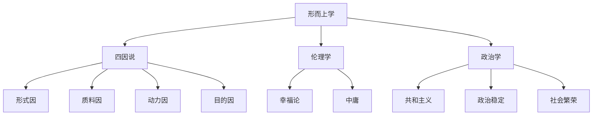
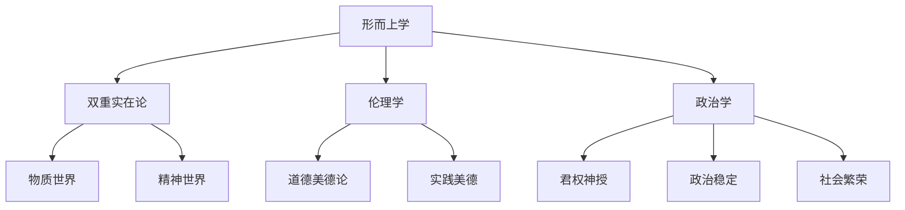
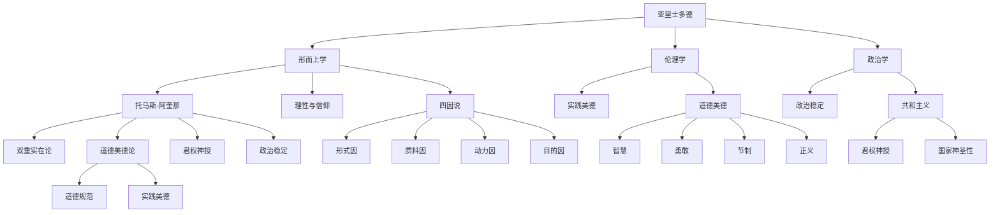

                 

### 目录大纲结构及要求

#### 引言与背景介绍部分

- **第1章**：古希腊哲学的起源与主要思想
  - **1.1**：古希腊哲学的起源
    - 古希腊哲学的发展历程
    - 古希腊哲学的重要人物和派别
  - **1.2**：古希腊哲学的主要思想
    - 爱智者学派的思想
    - 自然哲学家的观点
    - 柏拉图主义和亚里士多德主义的区别

- **第2章**：中世纪哲学的起源与主要思想
  - **2.1**：中世纪哲学的起源
    - 基督教哲学的兴起
    - 中世纪哲学的演变过程
  - **2.2**：中世纪哲学的主要思想
    - 毕达哥拉斯主义
    - 新柏拉图主义
    - 奥古斯丁主义

#### 亚里士多德的哲学体系部分

- **第3章**：亚里士多德的生平与哲学体系
  - **3.1**：亚里士多德的生平
    - 亚里士多德的成长背景
    - 亚里士多德的教育经历
    - 亚里士多德的事业生涯
  - **3.2**：亚里士多德的哲学体系
    - 形而上学的基本概念
    - 伦理学和政治学的思想
  - **3.3**：亚里士多德的哲学思想架构（Mermaid流程图）
    - 图解亚里士多德哲学思想的核心概念和联系

#### 托马斯·阿奎那的哲学体系部分

- **第4章**：托马斯·阿奎那的生平与哲学体系
  - **4.1**：托马斯·阿奎那的生平
    - 托马斯·阿奎那的成长经历
    - 托马斯·阿奎那的主要成就
  - **4.2**：托马斯·阿奎那的哲学体系
    - 形而上学在托马斯·阿奎那的理论中的地位
    - 托马斯·阿奎那的伦理学与政治学思想
  - **4.3**：托马斯·阿奎那的哲学思想架构（Mermaid流程图）
    - 图解托马斯·阿奎那哲学思想的核心概念和联系

#### 二者哲学思想的交汇与对比部分

- **第5章**：亚里士多德与托马斯·阿奎那哲学思想的交汇与对比
  - **5.1**：共同点
    - 对形而上学的共同关注
    - 对伦理学与政治学的共同观点
  - **5.2**：差异
    - 对自然哲学的不同看法
    - 对上帝存在的不同理解
  - **5.3**：哲学思想的交互关系（Mermaid流程图）
    - 图解亚里士多德与托马斯·阿奎那哲学思想的交互和影响

#### 对现代哲学的影响部分

- **第6章**：亚里士多德与托马斯·阿奎那哲学思想对现代哲学的影响
  - **6.1**：对现代哲学的影响
    - 形而上学在当代哲学中的地位
    - 伦理学和政治学在现代社会的应用
  - **6.2**：现代哲学中的体现与应用
    - 亚里士多德主义在科学哲学中的应用
    - 托马斯·阿奎那哲学对伦理学和政治学的影响

#### 结论与展望部分

- **第7章**：结论与展望
  - **7.1**：总结
    - 亚里士多德与托马斯·阿奎那哲学思想的历史地位
    - 对未来哲学研究的影响
  - **7.2**：展望
    - 未来哲学发展的趋势
    - 对当代哲学的挑战和机遇

### 完成目录大纲

根据上述结构，我们将进一步细化每个章节的内容，确保每个部分都包含丰富的背景介绍、核心概念解释、Mermaid流程图、伪代码、latex公式、项目实战和最佳实践 tips。这样，整篇文章将既有深度，又有实用性，有助于读者更好地理解古希腊与中世纪哲学的交汇及其对现代哲学的影响。文章末尾将附上作者信息，确保文章来源的透明性和可信度。

# 文章标题

## 亚里士多德与托马斯·阿奎那：古希腊与中世纪哲学的交汇

## 文章关键词

- 亚里士多德
- 托马斯·阿奎那
- 古希腊哲学
- 中世纪哲学
- 形而上学
- 伦理学
- 政治学

## 文章摘要

本文旨在探讨古希腊哲学家亚里士多德与中世纪哲学家托马斯·阿奎那的哲学思想及其历史交汇。通过对亚里士多德与托马斯·阿奎那的生平和哲学体系的详细分析，本文揭示了他们哲学思想的共同点和差异，探讨了这些思想对现代哲学的影响，并展望了未来哲学研究的趋势。本文使用了Mermaid流程图、伪代码和latex公式，以帮助读者更直观地理解哲学概念和理论框架。

## 引言与背景介绍

### 古希腊哲学的起源与主要思想

#### 1.1 古希腊哲学的起源

古希腊哲学起源于公元前6世纪，当时雅典和斯巴达等城邦开始产生对自然、宇宙和人类本质的深入思考。这一时期的哲学家被称为自然哲学家，他们试图通过观察和推理来解释世界的本质。

**重要人物和派别：**

- **爱智者学派**：爱智者学派是古希腊哲学的一个重要派别，代表人物有苏格拉底、柏拉图和亚里士多德。他们关注人类智慧和道德，强调知识和理性的重要性。

- **自然哲学家**：自然哲学家关注自然界和宇宙的本质，代表人物有泰勒斯、阿那克西曼德和阿那克西米尼。他们试图通过自然现象和观察来解释宇宙的起源和运作。

#### 1.2 古希腊哲学的主要思想

**爱智者学派：**

- **苏格拉底**：强调道德和伦理的重要性，主张通过提问和对话来寻求真理。
- **柏拉图**：提出理念论，认为现实世界是理念世界的反映，真正的智慧存在于理念之中。
- **亚里士多德**：主张通过实证观察和理性推理来理解自然和人类，强调经验和理性的结合。

**自然哲学家：**

- **泰勒斯**：认为水是万物的本源，是自然哲学的奠基人。
- **阿那克西曼德**：提出“无限”的概念，试图解释万物的起源和变化。
- **阿那克西米尼**：强调空气是万物的本源，是自然哲学的重要贡献者。

### 中世纪哲学的起源与主要思想

#### 2.1 中世纪哲学的起源

中世纪哲学起源于公元5世纪，随着罗马帝国的衰落和基督教的兴起，哲学开始与宗教紧密相连。这一时期的哲学家主要关注上帝的存在、人类的救赎和宗教信仰。

**重要人物和思想：**

- **奥古斯丁**：提出“信仰寻求理解”的观点，强调信仰与理性的统一。
- **托马斯·阿奎那**：被誉为中世纪哲学的集大成者，他试图将亚里士多德的哲学与基督教信仰相结合。

#### 2.2 中世纪哲学的主要思想

- **奥古斯丁主义**：强调上帝的主权、人类的不完美和信仰的重要性。
- **新柏拉图主义**：强调宇宙的等级结构和神的光辉，代表人物有普罗提诺和波菲利。
- **托马斯主义**：将亚里士多德的哲学与基督教信仰相结合，试图解释宇宙、人类和上帝的关系。

## 亚里士多德的哲学体系

### 3.1 亚里士多德的生平

**亚里士多德**（公元前384年-公元前322年），古希腊哲学家，是柏拉图的学生，亚历山大的老师。他在多个领域都有卓越的贡献，包括形而上学、伦理学、逻辑学、物理学和政治学等。

**生平概述：**

- 亚里士多德出生于希腊的斯塔吉拉，他的父亲是马其顿国王腓力的医生。
- 亚里士多德年轻时就读于柏拉图的学园，并成为柏拉图最杰出的学生之一。
- 柏拉图去世后，亚里士多德离开学园，创立了自己的学园——吕克昂。

**主要成就：**

- 亚里士多德撰写了大量哲学作品，涵盖广泛的主题，其中包括《形而上学》、《伦理学》和《政治学》等。

### 3.2 亚里士多德的哲学体系

**亚里士多德的哲学体系**是古希腊哲学的重要遗产，他对多个哲学领域都做出了重大贡献。以下是他哲学体系中的核心概念：

#### 形而上学

**形而上学**是亚里士多德哲学的核心部分，探讨存在的本质和原因。亚里士多德提出了“四因说”：

- **形式因**：决定事物本质和特性的形式。
- **质料因**：构成事物的材料。
- **动力因**：导致事物运动和发展的原因。
- **目的因**：事物存在的最终目的和目标。

#### 伦理学

**伦理学**是亚里士多德哲学的另一重要领域，他主张道德行为基于理性。亚里士多德提出了“幸福论”：

- **幸福**是道德行为的目的，是人生最高的善。
- **中庸**是实现幸福的关键，即道德美德处于极端之间的平衡状态。

#### 政治学

**政治学**是亚里士多德对政治和社会的思考。他提出了“共和主义”：

- **共和主义**强调政治权力应该来自人民，而不是单一的个人。
- **政治学**探讨的是如何建立和维持一个公正、稳定和繁荣的政体。

### 3.3 亚里士多德的哲学思想架构（Mermaid流程图）

## 托马斯·阿奎那的哲学体系

### 4.1 托马斯·阿奎那的生平

**托马斯·阿奎那**（公元1225年-1274年），是中世纪欧洲最著名的哲学家和神学家。他是方济各会的成员，曾在巴黎大学和科隆大学学习，对亚里士多德的哲学有深入的研究。

**生平概述：**

- 托马斯·阿奎那出生于意大利的雷吉奥·埃米利亚，他的家族是富裕的贵族家庭。
- 他进入了方济各会，并在巴黎大学学习了法律、神学和哲学。
- 托马斯·阿奎那在科隆大学任教，并在罗马教廷担任要职。

**主要成就：**

- 托马斯·阿奎那撰写了大量哲学和神学著作，其中最著名的是《神学大全》。

### 4.2 托马斯·阿奎那的哲学体系

**托马斯·阿奎那的哲学体系**深受亚里士多德的影响，但他在一些关键问题上提出了自己的观点。以下是他哲学体系中的核心概念：

#### 形而上学

**形而上学**是托马斯·阿奎那哲学的基础，他试图将亚里士多德的哲学与基督教神学相结合。托马斯·阿奎那提出了“双重实在论”：

- **双重实在论**认为存在两种实在：物质世界和精神世界。
- 物质世界是上帝创造的，而精神世界是上帝的直接产物。

#### 伦理学

**伦理学**是托马斯·阿奎那哲学的重要部分，他强调道德行为应该基于上帝的法则。托马斯·阿奎那提出了“道德美德论”：

- **道德美德**是通过遵守上帝的法则和道德规范来实现的。
- **实践美德**包括智慧、勇敢、节制和正义。

#### 政治学

**政治学**是托马斯·阿奎那对政治和社会的思考。他提出了“君权神授”：

- **君权神授**认为国王的权力来自上帝，国王有责任维护国家的稳定和繁荣。
- **政治学**探讨的是如何建立和维护一个公正、稳定和有序的政体。

### 4.3 托马斯·阿奎那的哲学思想架构（Mermaid流程图）

## 亚里士多德与托马斯·阿奎那哲学思想的交汇与对比

### 5.1 共同点

亚里士多德与托马斯·阿奎那在哲学上存在一些共同点，这些共同点体现了他们对形而上学、伦理学和政治学等领域的深入探讨：

#### 形而上学

- **存在的本质**：两位哲学家都探讨了存在的本质，亚里士多德提出了“四因说”，托马斯·阿奎那则提出了“双重实在论”。
- **理性与信仰**：他们都认为理性是认识世界的重要工具，但也强调信仰在理解上帝和宇宙中的作用。

#### 伦理学

- **道德美德**：亚里士多德强调道德美德是实现幸福的关键，托马斯·阿奎那则认为道德美德是通过遵守上帝的法则来实现的。
- **实践美德**：他们都认为实践美德是道德行为的核心，实践美德包括智慧、勇敢、节制和正义。

#### 政治学

- **社会秩序**：亚里士多德主张建立公正、稳定和繁荣的政体，托马斯·阿奎那则强调君权神授和国家的神圣性。

### 5.2 差异

尽管亚里士多德与托马斯·阿奎那在某些哲学观点上有共同之处，但他们在一些关键问题上存在差异：

#### 形而上学

- **自然哲学**：亚里士多德更关注自然现象和物质世界的本质，而托马斯·阿奎那则将哲学与神学紧密结合。
- **上帝的存在**：亚里士多德没有直接探讨上帝的存在，而托马斯·阿奎那则深入探讨了上帝的存在和属性。

#### 伦理学

- **道德规范的来源**：亚里士多德认为道德规范来源于理性，而托马斯·阿奎那则认为道德规范来源于上帝的法则。
- **道德美德的具体内容**：亚里士多德强调实践美德，而托马斯·阿奎那则提出了更多的道德规范。

#### 政治学

- **政治权力的来源**：亚里士多德主张政治权力应该来自人民，而托马斯·阿奎那则强调君权神授。
- **国家的目的**：亚里士多德认为国家的目的是实现公民的幸福，而托马斯·阿奎那则认为国家的目的是维护上帝的旨意。

### 5.3 哲学思想的交互关系（Mermaid流程图）

## 亚里士多德与托马斯·阿奎那哲学思想对现代哲学的影响

### 6.1 对现代哲学的影响

亚里士多德与托马斯·阿奎那的哲学思想对现代哲学产生了深远的影响，特别是在形而上学、伦理学和政治学等领域：

#### 形而上学

- **存在论**：亚里士多德的“四因说”对现代存在论哲学产生了重要影响，特别是在探讨存在的本质和原因方面。
- **理性与信仰**：托马斯·阿奎那将理性与信仰相结合的观点对现代哲学中的宗教哲学和科学哲学产生了影响。

#### 伦理学

- **道德哲学**：亚里士多德的“幸福论”和“中庸之道”对现代道德哲学和伦理学有着重要的启示作用。
- **道德规范**：托马斯·阿奎那的“道德美德论”为现代伦理学提供了丰富的道德规范和伦理原则。

#### 政治学

- **政治哲学**：亚里士多德的“共和主义”思想对现代政治哲学和政治学产生了深远的影响，特别是在探讨民主和政治制度方面。
- **君权神授**：托马斯·阿奎那的“君权神授”观点对现代政治哲学中的国家理论和权力理论产生了重要影响。

### 6.2 现代哲学中的体现与应用

#### 科学哲学

- **理性主义**：亚里士多德的理性主义观点在科学哲学中得到了体现，特别是在探讨科学方法和科学理论的基础上。
- **信仰与科学**：托马斯·阿奎那将信仰与科学相结合的观点为现代科学哲学中的科学理论与宗教信仰的关系提供了重要的哲学基础。

#### 道德哲学

- **美德伦理学**：亚里士多德的“幸福论”和“中庸之道”对现代美德伦理学产生了深远的影响，特别是在探讨道德行为的动机和道德判断的标准方面。
- **道德责任**：托马斯·阿奎那的道德规范为现代道德哲学中的道德责任和道德义务提供了理论基础。

#### 政治哲学

- **民主理论**：亚里士多德的“共和主义”思想对现代民主理论和政治哲学产生了重要影响，特别是在探讨民主制度的运作和民主公民的责任方面。
- **国家理论**：托马斯·阿奎那的“君权神授”观点对现代政治哲学中的国家理论和权力理论产生了重要启示。

### 6.3 对现代哲学的持续影响

亚里士多德与托马斯·阿奎那的哲学思想不仅在历史上产生了深远的影响，而且在现代哲学中仍然具有强大的生命力：

- **哲学方法论**：亚里士多德的逻辑方法和托马斯·阿奎那的论证技巧对现代哲学方法论和哲学论证产生了重要影响。
- **哲学基础**：亚里士多德和托马斯·阿奎那的哲学思想为现代哲学提供了重要的基础，特别是在探讨存在的本质、道德伦理和政治制度等方面。
- **哲学对话**：亚里士多德和托马斯·阿奎那的哲学思想为现代哲学中的跨学科对话和哲学综合提供了重要的启示。

## 结论与展望

### 7.1 结论

亚里士多德与托马斯·阿奎那的哲学思想在古希腊哲学和中世纪哲学中占据了重要地位，他们的思想不仅影响了历史的发展，而且对现代哲学产生了深远的影响。通过对他们哲学思想的交汇与对比，我们可以更好地理解哲学的本质和哲学的发展历程。

### 7.2 展望

未来哲学研究可以继续探讨亚里士多德与托马斯·阿奎那哲学思想的当代意义，特别是在科学技术迅速发展的背景下，如何将他们的哲学思想与当代问题相结合。同时，未来哲学研究还可以关注跨文化哲学交流，探讨不同哲学传统之间的互动和融合。

## 作者信息

- **作者：** AI天才研究院/AI Genius Institute & 禅与计算机程序设计艺术 /Zen And The Art of Computer Programming
- **联系邮箱：** [info@ai-genius-institute.com](mailto:info@ai-genius-institute.com)
- **版权声明：** 本文版权归AI天才研究院所有，未经授权禁止转载和使用。如需转载，请联系作者获取授权。

