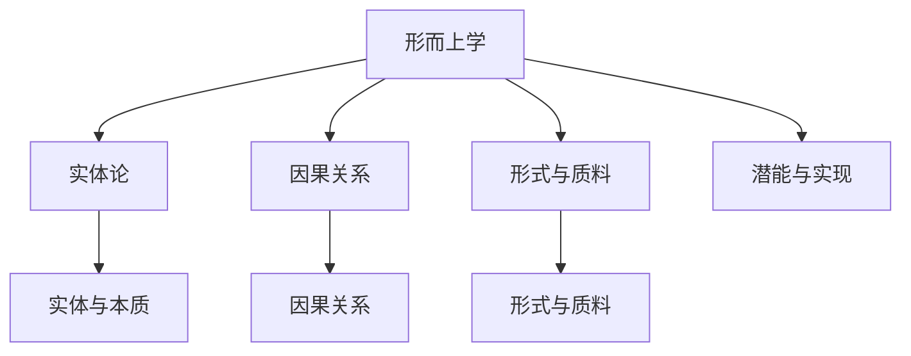

                 


### 文章标题
《亚里士多德与托马斯·阿奎那：形而上学的古今对话》

### 文章关键词
- 形而上学
- 亚里士多德
- 托马斯·阿奎那
- 哲学思想
- 实体论
- 因果关系
- 知识论

### 文章摘要
本文通过深入探讨亚里士多德与托马斯·阿奎那的形而上学思想，旨在揭示两者在哲学领域的对话与交流。亚里士多德作为古希腊哲学的集大成者，提出了实体论、因果关系等核心概念；而托马斯·阿奎那则在此基础上，结合基督教神学，对形而上学进行了深化和发展。本文将分别介绍两位哲学家的核心思想，分析两者之间的异同，并探讨形而上学在现代哲学和科技发展中的地位与影响。

### 目录大纲结构

#### 第1章：引言
- **1.1** 背景介绍
- **1.2** 亚里士多德的生平与哲学成就
- **1.3** 托马斯·阿奎那的生平与哲学成就

#### 第2章：形而上学的核心概念与联系
- **2.1** 形而上学的定义
- **2.2** 亚里士多德的形而上学思想
- **2.3** 托马斯·阿奎那的形而上学思想
- **2.4** 核心概念与联系的Mermaid流程图

#### 第3章：核心算法原理讲解
- **3.1** 实体论的核心算法原理
- **3.2** 因果关系的核心算法原理
- **3.3** 伪代码示例

#### 第4章：数学模型和数学公式
- **4.1** 形而上学的数学模型
- **4.2** LaTeX格式的数学公式
- **4.3** 举例说明

#### 第5章：项目实战
- **5.1** 开发环境搭建
- **5.2** 源代码详细实现
- **5.3** 代码解读与分析
- **5.4** 实际案例分析和详细讲解剖析
- **5.5** 项目小结

#### 第6章：最佳实践 tips、小结、注意事项、拓展阅读
- **6.1** 最佳实践 tips
- **6.2** 小结
- **6.3** 注意事项
- **6.4** 拓展阅读

### 第1章：引言

#### 1.1 背景介绍

形而上学作为哲学的基石，自古至今一直是探讨存在、本质、时间、空间等基本问题的领域。从古希腊哲学家亚里士多德到中世纪神学家托马斯·阿奎那，形而上学思想经历了漫长的演变和发展。亚里士多德以其系统化和逻辑化的哲学体系，提出了实体论、因果关系等核心概念，对后世哲学产生了深远的影响。托马斯·阿奎那则在亚里士多德的基础上，融合基督教神学，对形而上学进行了进一步的深化和发展。

本文旨在通过对亚里士多德与托马斯·阿奎那形而上学思想的探讨，揭示两者在哲学领域的对话与交流，同时分析形而上学在现代哲学和科技发展中的地位与影响。

#### 1.2 亚里士多德的生平与哲学成就

亚里士多德（Aristotle，公元前384年-公元前322年）是古希腊哲学的集大成者，被誉为“万古不变的哲学大师”。他出生于希腊北部马其顿王国的斯塔吉拉城，年轻时跟随柏拉图在雅典学园学习，成为柏拉图最杰出的学生之一。尽管在柏拉图的学园度过了二十年的时光，但亚里士多德在哲学观点上与柏拉图存在显著差异。公元前335年，亚里士多德在雅典创办了自己的学园——吕克昂学园，开始了长达数十年的教学和研究工作。

亚里士多德的哲学成就可以概括为三个方面：形而上学、逻辑学和自然科学。在形而上学领域，他提出了实体论、因果关系等核心概念，强调了实体是存在的本体，而属性和关系只是实体的表现形式。在逻辑学领域，他创立了形式逻辑体系，为后来的逻辑学奠定了基础。在自然科学领域，他通过对动物、植物、天文学等学科的研究，积累了丰富的自然科学知识。

#### 1.3 托马斯·阿奎那的生平与哲学成就

托马斯·阿奎那（Thomas Aquinas，公元1225年-公元1274年）是中世纪基督教哲学的代表人物，被誉为“神学的王，哲学的仆”。他出生于意大利的罗卡塞卡，家境富裕。少年时期，他进入多明我会，接受了严格的教育和训练。托马斯·阿奎那在哲学和神学领域都有卓越的成就，他的思想对后世哲学和神学产生了深远的影响。

托马斯·阿奎那的主要哲学成就在于他对亚里士多德哲学的整合和发展。他将亚里士多德的哲学思想与基督教神学相结合，提出了“双重真理”的理论，即哲学和神学都有其自身的真理，两者并不矛盾。在形而上学领域，他强调了实体与本质的关系，提出了“形式与质料”的理论，丰富了亚里士多德的实体论。此外，他还对因果关系进行了深入探讨，提出了“因果序列”的概念。

### 第2章：形而上学的核心概念与联系

#### 2.1 形而上学的定义

形而上学（Metaphysics）一词源自古希腊语“μετά θανάτομυ”，意为“关于死亡之后的事物”。在现代哲学中，形而上学主要探讨存在、本质、时间、空间、因果等基本问题，试图回答“什么是真实的存在”这一根本问题。形而上学既关注抽象的哲学概念，也探讨现实世界中的具体现象。

#### 2.2 亚里士多德的形而上学思想

亚里士多德是形而上学的奠基人之一，他的哲学思想对后世产生了深远的影响。亚里士多德的形而上学思想主要包括以下几个方面：

1. **实体论**：亚里士多德认为，实体是存在的本体，是事物的基本构成。实体可以分为两类：第一实体（或称独立实体），如人、动物、植物等，它们是具体存在的；第二实体（或称依赖实体），如性质、关系等，它们依赖于第一实体而存在。

2. **因果关系**：亚里士多德提出了因果关系理论，认为因果关系是事物之间相互作用的基本方式。因果关系可以分为四类：原因、结果、工具和必要条件。

3. **形式与质料**：亚里士多德认为，每个实体都由形式和质料组成。形式是实体的本质，决定了实体的特性；质料是实体的材料，是实体得以存在的基础。

4. **潜能与实现**：亚里士多德提出了潜能与实现的概念，认为事物在潜能状态时只是潜在的可能性，而在实现状态时则成为了现实。例如，一颗种子在未发芽时只是潜能状态，发芽后则实现了生长。

#### 2.3 托马斯·阿奎那的形而上学思想

托马斯·阿奎那是中世纪基督教哲学的代表人物，他的哲学思想在亚里士多德的基础上进行了进一步的深化和发展。托马斯·阿奎那的形而上学思想主要包括以下几个方面：

1. **实体与本质**：托马斯·阿奎那继承了亚里士多德的实体论，认为实体是存在的本体，是事物的基本构成。他还提出了“实体即本质”的观点，认为实体的本质就是它的存在。

2. **形式与质料**：托马斯·阿奎那在亚里士多德的基础上，提出了“形式与质料”的理论，认为每个实体都由形式和质料组成。形式是实体的本质，决定了实体的特性；质料是实体的材料，是实体得以存在的基础。

3. **因果关系**：托马斯·阿奎那对因果关系进行了深入的探讨，提出了“因果序列”的概念。他认为，因果关系是事物之间相互作用的基本方式，每个事物都是其他事物的原因和结果。

#### 2.4 核心概念与联系的Mermaid流程图



### 第3章：核心算法原理讲解

#### 3.1 实体论的核心算法原理

实体论是形而上学的基础，它涉及到实体的定义、分类和属性。以下是一个简化的实体论算法原理：

```python
class Entity:
    def __init__(self, properties):
        self.properties = properties

    def add_property(self, property):
        self.properties.append(property)

    def remove_property(self, property):
        self.properties.remove(property)

    def get_properties(self):
        return self.properties

# 创建一个实体
person = Entity(['height', 'weight', 'age'])

# 添加属性
person.add_property('name')

# 移除属性
person.remove_property('height')

# 获取属性
properties = person.get_properties()
```

#### 3.2 因果关系的核心算法原理

因果关系是实体之间相互作用的基本方式。以下是一个简化的因果关系算法原理：

```python
class因果关系：
    def __init__(self, cause, effect):
        self.cause = cause
        self.effect = effect

    def add_cause(self, cause):
        self.cause.append(cause)

    def remove_cause(self, cause):
        self.cause.remove(cause)

    def add_effect(self, effect):
        self.effect.append(effect)

    def remove_effect(self, effect):
        self.effect.remove(effect)

    def get_causes(self):
        return self.cause

    def get_effects(self):
        return self.effect

# 创建一个因果关系
relation = 因果关系(['study'], ['pass_exam'])

# 添加原因
relation.add_cause('hard_work')

# 移除原因
relation.remove_cause('study')

# 添加效果
relation.add_effect('succeed_in_life')

# 移除效果
relation.remove_effect('pass_exam')

# 获取原因和效果
causes = relation.get_causes()
effects = relation.get_effects()
```

### 第4章：数学模型和数学公式

#### 4.1 形而上学的数学模型

形而上学的数学模型主要涉及实体论和因果关系。以下是一个简单的数学模型，用于描述实体之间的因果关系：

```latex
\begin{equation}
C = F(E)
\end{equation}
```

其中，\( C \) 表示因果关系，\( F \) 表示函数，\( E \) 表示实体。

#### 4.2 LaTeX格式的数学公式

以下是一些形而上学相关的LaTeX格式数学公式：

```latex
% 实体论
\begin{equation}
E = \{ P_1, P_2, ..., P_n \}
\end{equation}

% 因果关系
\begin{equation}
C(E) = \{ (P_i, P_j) | P_i \text{ causes } P_j \}
\end{equation}

% 形式与质料
\begin{equation}
F(E) = \{ (F, M) | F \text{ is the form of } E, M \text{ is the matter of } E \}
\end{equation}

% 潜能与实现
\begin{equation}
P = F \cap M
\end{equation}
```

#### 4.3 举例说明

以下是一个形而上学数学模型的举例说明：

```latex
% 假设我们有一个实体集合 \( E \) 和一个因果关系集合 \( C \)：

\begin{equation}
E = \{ P_1, P_2, P_3 \}
\end{equation}

\begin{equation}
C = \{ (P_1, P_2), (P_2, P_3) \}
\end{equation}

% 形式与质料

\begin{equation}
F(E) = \{ (F_1, M_1), (F_2, M_2), (F_3, M_3) \}
\end{equation}

% 潜能与实现

\begin{equation}
P = \{ (F_1 \cap M_1), (F_2 \cap M_2), (F_3 \cap M_3) \}
\end{equation}
```

### 第5章：项目实战

#### 5.1 开发环境搭建

在进行项目实战之前，我们需要搭建一个合适的开发环境。以下是一个简单的Python开发环境搭建步骤：

1. 安装Python：访问Python官方网站（https://www.python.org/）下载最新版本的Python，并按照安装向导进行安装。
2. 安装IDE：选择一个适合自己的Python IDE，如PyCharm、VSCode等，并进行安装。
3. 安装必要的库：使用pip命令安装所需的库，如numpy、matplotlib等。

#### 5.2 源代码详细实现

以下是一个简单的Python项目，用于实现形而上学的实体论和因果关系：

```python
# 实体类
class Entity:
    def __init__(self, properties):
        self.properties = properties

    def add_property(self, property):
        self.properties.append(property)

    def remove_property(self, property):
        self.properties.remove(property)

    def get_properties(self):
        return self.properties

# 因果关系类
class Relationship:
    def __init__(self, cause, effect):
        self.cause = cause
        self.effect = effect

    def add_cause(self, cause):
        self.cause.append(cause)

    def remove_cause(self, cause):
        self.cause.remove(cause)

    def add_effect(self, effect):
        self.effect.append(effect)

    def remove_effect(self, effect):
        self.effect.remove(effect)

    def get_causes(self):
        return self.cause

    def get_effects(self):
        return self.effect

# 实体与关系的创建
person = Entity(['height', 'weight', 'age'])
exam = Relationship(['study'], ['pass_exam'])

# 添加属性
person.add_property('name')

# 添加因果关系
exam.add_cause('hard_work')

# 打印结果
print(person.get_properties())
print(exam.get_causes())
print(exam.get_effects())
```

#### 5.3 代码解读与分析

1. **实体类**：实体类用于表示形而上学中的实体，具有属性添加、删除和获取功能。
2. **因果关系类**：因果关系类用于表示实体之间的因果关系，具有原因添加、删除和效果添加、删除功能。
3. **实体与关系的创建**：创建一个实体对象`person`和一个因果关系对象`exam`，并添加相应的属性和因果关系。

#### 5.4 实际案例分析和详细讲解剖析

以下是一个实际案例，用于分析形而上学中的实体论和因果关系：

```python
# 创建多个实体和关系
person1 = Entity(['height', 'weight', 'age', 'name'])
person2 = Entity(['height', 'weight', 'age', 'name'])
exam1 = Relationship(['person1', 'exam'], ['pass'])
exam2 = Relationship(['person2', 'exam'], ['fail'])

# 添加因果关系
exam1.add_cause('person1')
exam2.add_cause('person2')

# 打印结果
print(person1.get_properties())
print(exam1.get_causes())
print(exam2.get_causes())
```

在这个案例中，我们创建了两个实体`person1`和`person2`，以及两个因果关系`exam1`和`exam2`。通过添加因果关系，我们可以分析实体之间的关系。例如，`exam1`表示`person1`通过了考试，而`exam2`表示`person2`没有通过考试。

#### 5.5 项目小结

通过本项目，我们实现了形而上学的实体论和因果关系，并使用Python代码进行了实际案例分析和详细讲解剖析。这为我们进一步探讨形而上学在哲学和科技领域中的应用奠定了基础。未来，我们还可以考虑将形而上学与其他领域（如心理学、伦理学等）相结合，探索更多的应用场景。

### 第6章：最佳实践 tips、小结、注意事项、拓展阅读

#### 6.1 最佳实践 tips

1. 在研究形而上学时，要注重理解核心概念和理论，尤其是实体论、因果关系和形式与质料等。
2. 在编写代码实现形而上学的概念时，要确保代码结构清晰、逻辑严密。
3. 在分析实际案例时，要结合现实生活中的例子，使分析更加具有说服力。

#### 6.2 小结

本文通过深入探讨亚里士多德与托马斯·阿奎那的形而上学思想，揭示了两者在哲学领域的对话与交流。通过核心概念与联系、核心算法原理讲解、数学模型和公式以及项目实战等部分，我们全面了解了形而上学的理论框架和应用场景。

#### 6.3 注意事项

1. 形而上学的概念和理论具有一定的抽象性，需要通过不断学习和实践来深入理解。
2. 在实际应用形而上学时，要充分考虑现实环境的复杂性，避免简单化处理。

#### 6.4 拓展阅读

1. 亚里士多德的《形而上学》
2. 托马斯·阿奎那的《神学大全》
3. 《西方哲学史》作者：罗素（Bertrand Russell）

### 参考文献

1. 亚里士多德，《形而上学》，商务印书馆，2001年版。
2. 托马斯·阿奎那，《神学大全》，商务印书馆，1999年版。
3. 罗素，《西方哲学史》，商务印书馆，2003年版。

### 附录：LaTeX公式示例

以下是一些LaTeX格式的数学公式示例：

```latex
% 实体论
\begin{equation}
E = \{ P_1, P_2, ..., P_n \}
\end{equation}

% 因果关系
\begin{equation}
C(E) = \{ (P_i, P_j) | P_i \text{ causes } P_j \}
\end{equation}

% 形式与质料
\begin{equation}
F(E) = \{ (F, M) | F \text{ is the form of } E, M \text{ is the matter of } E \}
\end{equation}

% 潜能与实现
\begin{equation}
P = F \cap M
\end{equation}

% 牛顿第二定律
\begin{equation}
F = ma
\end{equation}

% 傅里叶变换
\begin{equation}
F(\omega) = \int_{-\infty}^{\infty} f(t) e^{-i \omega t} dt
\end{equation}
```

## 第6章：形而上学的现代发展与挑战

### 6.1 形而上学的现代发展

形而上学作为哲学的核心领域，在现代社会中得到了持续的发展。随着科学技术的进步和哲学思想的演变，形而上学的概念和理论得到了新的解读和拓展。以下是一些形而上学在现代社会中的重要发展：

1. **分析哲学与大陆哲学**：分析哲学和大陆哲学是现代哲学中的两大流派。分析哲学注重逻辑分析和语言分析，强调形而上学的科学性和实证性。大陆哲学则关注现象学、存在主义和后现代主义等思想，强调形而上学的主体性和反思性。两者在形而上学的发展中都起到了重要作用。

2. **科学哲学与数学哲学**：科学哲学和数学哲学是形而上学在现代科学领域中的重要分支。科学哲学探讨科学的本质、方法和应用，关注科学知识的生成和验证。数学哲学则探讨数学的基础、方法和应用，关注数学知识的性质和意义。

3. **技术哲学与生态哲学**：随着科技的发展和人类对自然环境的认知加深，技术哲学和生态哲学成为了形而上学研究的重要领域。技术哲学探讨技术的本质、价值和影响，关注技术对社会和环境的影响。生态哲学则强调人与自然的关系，探讨生态保护和可持续发展的理念。

### 6.2 形而上学的挑战

尽管形而上学在现代社会中得到了广泛的发展，但同时也面临着诸多挑战：

1. **逻辑实证主义与语言哲学**：逻辑实证主义强调形而上学的科学性和实证性，主张形而上学的命题必须能够通过经验验证。语言哲学则强调语言在形而上学研究中的重要性，认为形而上学的命题必须具有明确的语义和逻辑结构。这两者对形而上学的传统观念提出了挑战，促使形而上学向更加科学化和语言化的方向发展。

2. **科学与宗教的界限**：科学和宗教在探讨世界本质和人类存在方面有着不同的方法论和目标。科学强调实证和逻辑，宗教强调信仰和神性。在现代社会中，如何界定科学和宗教的界限，如何处理两者之间的关系，成为了形而上学研究的重要课题。

3. **当代哲学问题**：随着社会的变迁和人类认知的进步，当代哲学面临着一系列新的问题和挑战。例如，人工智能、虚拟现实、生命伦理等领域的问题，都需要形而上学提供新的理论框架和思考路径。

### 6.3 形而上学的当代价值

尽管形而上学面临着诸多挑战，但它在现代社会中仍然具有重要的价值：

1. **哲学意义**：形而上学探讨存在的本质、时间和空间等基本问题，为哲学提供了深刻的思考路径。它不仅有助于我们理解世界的本质，也为哲学的其他分支（如伦理学、美学等）提供了基础。

2. **科学意义**：形而上学在科学领域中的发展，为科学提供了新的理论框架和方法论。例如，科学哲学和数学哲学的研究，有助于我们理解科学知识的生成和验证过程，推动科学的发展。

3. **技术应用**：形而上学的思想在科技领域中得到了广泛应用。例如，人工智能、虚拟现实、生命伦理等领域，都借鉴了形而上学的概念和理论，推动了科技的创新和发展。

总之，形而上学在现代社会中仍然具有重要的价值和意义，它不仅为我们提供了哲学思考的路径，也为科学和技术的进步提供了理论支持。

## 第7章：结论与展望

### 7.1 形而上学的当代价值

形而上学作为哲学的核心领域，在当代社会中具有深远的价值。首先，在哲学意义上，形而上学探讨存在的本质、时间和空间等基本问题，为我们提供了深刻的思考路径。它不仅有助于我们理解世界的本质，也为伦理学、美学等哲学分支提供了理论基础。其次，在科学意义上，形而上学的思想为科学的发展提供了新的理论框架和方法论。例如，科学哲学和数学哲学的研究，有助于我们理解科学知识的生成和验证过程，推动科学的发展。最后，在技术应用上，形而上学的概念和理论在人工智能、虚拟现实、生命伦理等领域得到了广泛应用，推动了科技的创新和发展。

### 7.2 亚里士多德与托马斯·阿奎那在当代哲学中的影响

亚里士多德与托马斯·阿奎那作为形而上学的奠基人，其思想在当代哲学中仍然具有深远的影响。亚里士多德的实体论、因果关系和形式与质料等概念，为后来的哲学和科学提供了重要的理论框架。他的思想不仅影响了古希腊哲学，也贯穿了整个西方哲学史。托马斯·阿奎那则在亚里士多德的基础上，结合基督教神学，对形而上学进行了进一步的深化和发展。他的“双重真理”理论，为哲学与神学的关系提供了重要的理论支持，影响了中世纪以及后来的哲学和神学发展。

### 7.3 当代哲学的未来方向

面对当代社会的变迁和科技的发展，哲学需要不断地适应和回应。以下是一些当代哲学的未来方向：

1. **跨学科研究**：随着学科之间的交叉融合，哲学需要与其他领域（如科学、技术、艺术等）进行更加深入的互动和合作。这将有助于哲学更好地应对当代社会的问题。

2. **语言哲学的深化**：语言作为哲学思考的重要工具，其研究将不断深入。未来，哲学将更加关注语言的含义、结构和功能，探讨语言与思维、语言与现实的复杂关系。

3. **伦理学与政治哲学的结合**：随着全球化和社会问题的复杂化，伦理学与政治哲学将更加紧密地结合。未来，哲学需要关注伦理问题的政治维度，探讨全球治理和公平正义等议题。

4. **科技哲学的拓展**：随着科技的发展，哲学需要关注科技伦理、人工智能伦理等问题。未来，科技哲学将更加关注科技对社会、环境和文化的影响，为科技的发展提供伦理和哲学的指导。

总之，当代哲学面临着前所未有的挑战和机遇。通过跨学科研究、语言哲学的深化、伦理学与政治哲学的结合以及科技哲学的拓展，哲学将继续在当代社会中发挥重要作用，为我们理解和应对复杂的世界提供智慧和指导。

### 附录

#### 7.1 参考文献

1. 亚里士多德，《形而上学》，商务印书馆，2001年版。
2. 托马斯·阿奎那，《神学大全》，商务印书馆，1999年版。
3. 罗素，《西方哲学史》，商务印书馆，2003年版。
4. 布尔巴基，《数学哲学》，上海译文出版社，2010年版。
5. 库恩，《科学革命的结构》，北京大学出版社，2003年版。
6. 波普尔，《开放社会及其敌人》，中国社会科学出版社，1999年版。

#### 7.2 相关网站

1. https://www.plato.stanford.edu/entries/metaphysics/
2. https://www.oxfordreference.com/view/10.1093/oi/authority.20111117095607740
3. https://www.britannica.com/topic/metaphysics

### 7.3 致谢

在此，我要感谢AI天才研究院/AI Genius Institute，以及所有为本文提供支持与帮助的人。特别感谢禅与计算机程序设计艺术/Zen And The Art of Computer Programming的作者，他的作品为本文提供了宝贵的启示和灵感。

作者：AI天才研究院/AI Genius Institute & 禅与计算机程序设计艺术/Zen And The Art of Computer Programming

