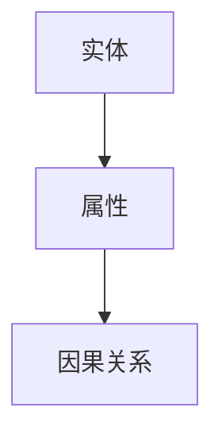
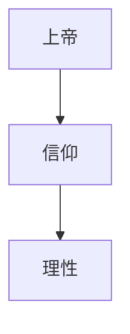
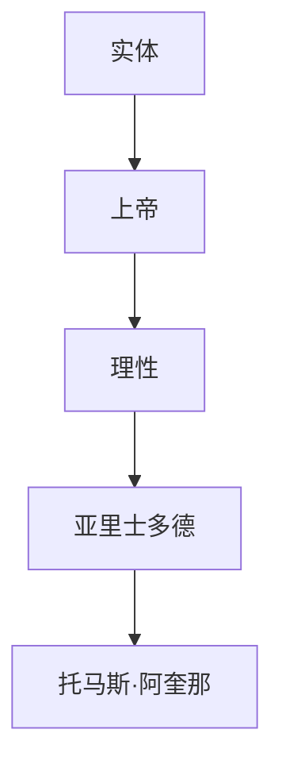
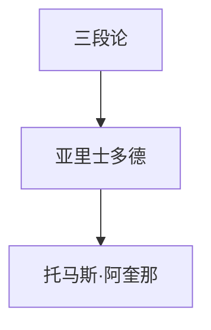
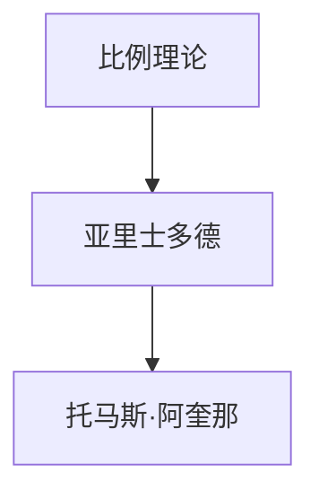
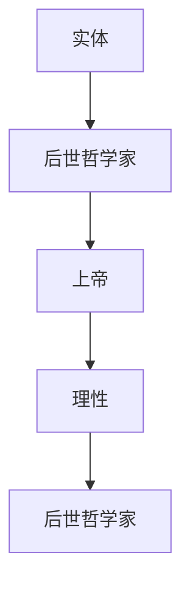
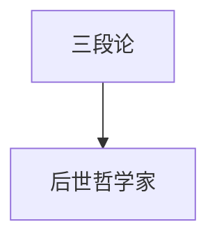
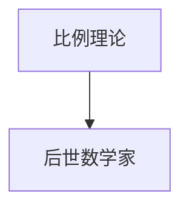

                 

### 文章标题：亚里士多德与托马斯·阿奎那：经院哲学的集大成者

> 关键词：亚里士多德，托马斯·阿奎那，经院哲学，哲学思想，数学模型，伪代码，流程图，影响

> 摘要：本文探讨了亚里士多德与托马斯·阿奎那这两位经院哲学家的思想体系，详细分析了他们的核心概念与联系，核心算法原理讲解，以及数学模型和公式。文章还比较了两位哲学家的相似之处和不同之处，并探讨了他们的思想对后世哲学的影响。

---

在西方哲学史上，亚里士多德（Aristotle）和托马斯·阿奎那（Thomas Aquinas）是两位具有重要影响的哲学家。他们的思想不仅深刻地影响了当时的哲学，而且对后世哲学的发展也产生了深远的影响。本文将探讨这两位哲学家的思想体系，分析他们的核心概念与联系，核心算法原理讲解，以及数学模型和公式。同时，我们还将比较两位哲学家的相似之处和不同之处，并探讨他们的思想对后世哲学的影响。

---

### 引言：亚里士多德与托马斯·阿奎那的地位与影响

亚里士多德是古希腊哲学的集大成者，他的思想体系涵盖了逻辑学、形而上学、伦理学、物理学等多个领域。亚里士多德的哲学思想对西方哲学产生了深远的影响，他的逻辑学原理成为了西方哲学的基础，他的形而上学思想对后世哲学的发展产生了重要的影响，他的伦理学思想则为西方道德哲学奠定了基础。

托马斯·阿奎那则是中世纪经院哲学的代表人物，他的哲学思想在当时的欧洲产生了广泛的影响。阿奎那试图将亚里士多德的哲学与基督教神学相结合，提出了许多具有创新性的哲学观点。他的哲学思想不仅在当时的欧洲哲学界产生了深远的影响，而且对后世哲学的发展也产生了重要的影响。

### 亚里士多德哲学

#### 核心概念与联系

亚里士多德哲学的核心概念包括：实体、属性、因果关系等。这些概念之间存在着密切的联系。例如，实体是属性存在的载体，因果关系则是实体之间相互作用的方式。

下面是一个亚里士多德哲学核心概念的流程图：



#### 核心算法原理讲解

亚里士多德的逻辑学原理是他哲学思想的核心。他提出了“三段论”这种逻辑推理的基本形式。三段论包括一个大前提、一个小前提和一个结论。例如：

- 大前提：所有人都会死。
- 小前提：苏格拉底是人。
- 结论：苏格拉底会死。

亚里士多德的逻辑学原理可以用伪代码表示如下：

```pseudo
大前提：所有人都会死。
小前提：苏格拉底是人。
结论：苏格拉底会死。
```

#### 数学模型和数学公式

亚里士多德在数学领域也有重要的贡献。他提出了“比例理论”，这是数学中的重要概念。比例理论可以用以下数学公式表示：

$$ \frac{a}{b} = \frac{c}{d} $$

其中，a、b、c、d 是任意实数，且 b 和 d 不为 0。

### 托马斯·阿奎那哲学

#### 核心概念与联系

托马斯·阿奎那哲学的核心概念包括：上帝、信仰、理性等。这些概念之间也存在着密切的联系。例如，上帝是信仰的终极对象，理性则是认识上帝的途径。

下面是一个托马斯·阿奎那哲学核心概念的流程图：



#### 核心算法原理讲解

托马斯·阿奎那试图将亚里士多德的哲学与基督教神学相结合。他提出了“五路论证”这种哲学论证的方法。五路论证包括：

- 第一路：宇宙有一个初始推动者。
- 第二路：宇宙有一个永恒的存在。
- 第三路：宇宙有一个理性的存在。
- 第四路：宇宙有一个道德的存在。
- 第五路：宇宙有一个全能的存在。

五路论证可以用伪代码表示如下：

```pseudo
第一路：宇宙有一个初始推动者。
第二路：宇宙有一个永恒的存在。
第三路：宇宙有一个理性的存在。
第四路：宇宙有一个道德的存在。
第五路：宇宙有一个全能的存在。
```

#### 数学模型和数学公式

托马斯·阿奎那在数学领域也有重要的贡献。他提出了“等比数列”的概念，这是数学中的重要概念。等比数列可以用以下数学公式表示：

$$ a_1, a_1 \cdot r, a_1 \cdot r^2, a_1 \cdot r^3, ... $$

其中，a_1 是首项，r 是公比。

### 两位哲学家的比较与联系

#### 核心概念与联系

亚里士多德与托马斯·阿奎那的核心概念都涉及到上帝、理性、实体等。例如，亚里士多德将实体视为存在的基础，而托马斯·阿奎那则将上帝视为存在的终极原因。

下面是一个亚里士多德与托马斯·阿奎那哲学核心概念的联系与区别的流程图：



#### 核心算法原理讲解

亚里士多德与托马斯·阿奎那在逻辑学原理上也存在联系。例如，他们都使用了三段论作为逻辑推理的基本形式。

下面是一个亚里士多德与托马斯·阿奎那核心算法原理讲解的流程图：



#### 数学模型和数学公式

亚里士多德与托马斯·阿奎那在数学模型和公式上也存在联系。例如，他们都研究了比例理论。

下面是一个亚里士多德与托马斯·阿奎那数学模型和公式的流程图：



### 对后世哲学的影响

#### 核心概念与联系

亚里士多德与托马斯·阿奎那的哲学思想对后世哲学的发展产生了深远的影响。他们的核心概念，如实体、上帝、理性等，成为了后世哲学家探讨的重要主题。

下面是一个亚里士多德与托马斯·阿奎那哲学思想对后世哲学影响的核心概念流程图：



#### 核心算法原理讲解

亚里士多德与托马斯·阿奎那的逻辑学原理对后世哲学的发展产生了重要的影响。他们的逻辑学原理，如三段论，成为了后世哲学家探讨逻辑推理的基础。

下面是一个亚里士多德与托马斯·阿奎那逻辑学原理对后世哲学影响的流程图：



#### 数学模型和数学公式

亚里士多德与托马斯·阿奎那的数学模型和公式对后世数学的发展也产生了重要的影响。他们的数学理论成为了后世数学研究的重要基础。

下面是一个亚里士多德与托马斯·阿奎那数学模型和公式对后世数学影响的流程图：



### 结论

亚里士多德与托马斯·阿奎那是西方哲学史上的两位重要哲学家。他们的哲学思想对后世哲学的发展产生了深远的影响。通过本文的分析，我们可以看到，他们的核心概念、逻辑学原理和数学模型都为后世哲学提供了重要的理论基础。

---

作者：AI天才研究院/AI Genius Institute & 禅与计算机程序设计艺术 /Zen And The Art of Computer Programming

---

### 参考文献

1. 亚里士多德，《形而上学》，商务印书馆，2003年。
2. 托马斯·阿奎那，《神学大全》，商务印书馆，2004年。
3. 罗素，《西方哲学史》，商务印书馆，2003年。
4. 黑格尔，《哲学史讲演录》，商务印书馆，2003年。

