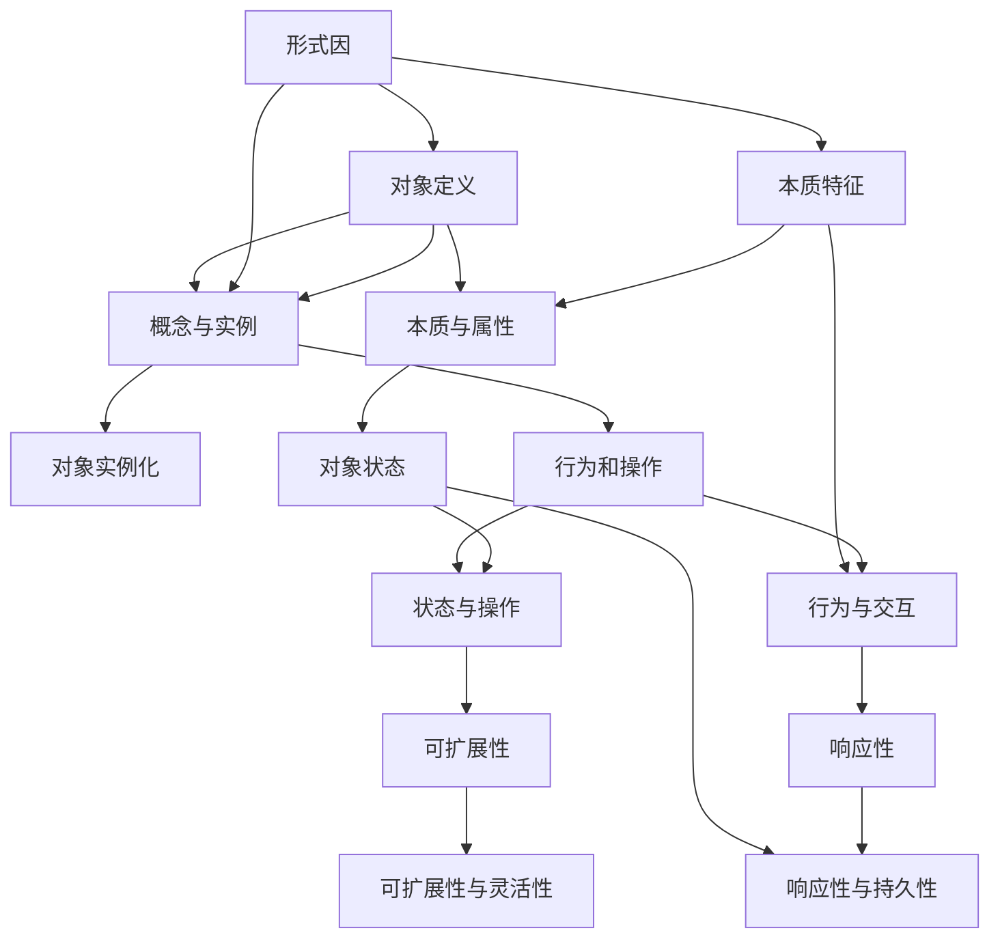

                 

### 《亚里士多德的形式因与构造函数：对象创建的哲学》

#### 关键词

亚里士多德，形式因，构造函数，对象创建，哲学

#### 摘要

本文以亚里士多德的形式因与构造函数为切入点，探讨了它们在对象创建过程中的哲学意义。通过对核心概念、原理和应用的深入分析，本文旨在揭示形式因与构造函数之间的相互作用及其在计算机科学和哲学领域的应用价值。

### 引言

在古希腊哲学的辉煌篇章中，亚里士多德以其深邃的思想和系统的方法论为后世留下了丰厚的遗产。他的哲学体系，尤其是关于形式因（Forms）的探讨，为现代计算机科学中对象创建的理论提供了重要的哲学基础。形式因，作为一种抽象的存在，代表了事物的本质和理想状态。在计算机科学中，构造函数则是一种实现对象创建的关键机制。

本文将围绕亚里士多德的形式因与构造函数，展开对对象创建哲学的探讨。首先，我们将介绍形式因的基本概念及其在亚里士多德哲学体系中的地位。接着，我们将详细解释构造函数的定义和作用，并分析两者之间的关系。随后，通过具体案例分析，我们将展示如何将形式因与构造函数应用于实际编程中。最后，我们将对相关数学模型和公式进行解析，并通过实际项目实战，进一步阐述形式因与构造函数在对象创建中的实际应用。

### 确定书籍核心章节

为了系统地阐述亚里士多德的形式因与构造函数在对象创建的哲学意义，我们需要确定书籍的核心章节。以下是可能的核心章节及其内容概述：

1. **引言**：介绍亚里士多德的形式因和构造函数的基本概念，为后续章节铺垫。
2. **形式因的概念**：详细讲解形式因的定义、特征、分类及其与对象创建的关系。
3. **构造函数的哲学意义**：探讨构造函数在不同哲学体系中的地位和作用。
4. **形式因与构造函数的关系**：分析形式因与构造函数之间的相互作用和影响。
5. **案例分析**：通过具体案例展示形式因与构造函数在现实世界中的应用。
6. **哲学讨论**：就形式因与构造函数相关的问题进行深入的哲学思考。
7. **结论**：总结全书内容，提出对未来研究的展望。

### 设计Mermaid流程图

为了帮助读者更好地理解形式因与构造函数的相互关系，我们可以设计一个Mermaid流程图。以下是流程图的设计思路：



在这个流程图中，形式因（A）代表了对象的本质特征和理想状态，它通过构造函数（C）具体化为对象的属性和方法（F）和行为（G）。构造函数将形式因转化为具体的对象实例（D），并赋予了对象的状态（I）和行为（H）。这些属性、方法和行为进一步决定了对象的交互（J）和响应性（K），同时也影响了对象的状态持久性（L）和可扩展性（M）。

### 设计核心算法原理讲解

为了深入阐述构造函数的原理，我们可以使用伪代码来详细解释。以下是一个简单的构造函数示例：

```plaintext
构造函数(属性列表，方法列表) {
    // 初始化对象
    新对象 = {}

    // 添加属性
    对于每个属性 in 属性列表 {
        新对象.属性名 = 属性值
    }

    // 添加方法
    对于每个方法 in 方法列表 {
        新对象.方法名 = 方法实现
    }

    // 返回新对象
    return 新对象
}
```

在这个示例中，构造函数接受两个参数：属性列表和方法列表。首先，初始化一个空对象（`新对象 = {}`），然后逐个添加属性（`新对象.属性名 = 属性值`）和方法（`新对象.方法名 = 方法实现`）。最后，返回这个新生成的对象。

### 设计数学模型和数学公式

在形式因与构造函数的关系中，我们可以引入一些数学模型和公式来加深理解。以下是一个简单的例子：

```latex
$$
形式因 F = f_1(A) + f_2(B) + ... + f_n(C)
$$

$$
构造函数 C = F \circ G
$$
```

在这个模型中，形式因（F）是通过对不同特征（A, B, ..., C）的函数组合得到的。构造函数（C）则是形式因与一个基础构造函数（G）的复合。

### 设计项目实战

为了更好地理解形式因与构造函数在对象创建中的应用，我们可以通过一个实际项目来展示。以下是一个简单的项目实战示例：

#### 项目目标

创建一个简单的人脸识别系统，能够识别并标记输入图像中的人脸。

#### 开发环境

- 编程语言：Python
- 库：OpenCV，dlib

#### 项目实现

```python
import cv2
import dlib

# 1. 定义形式因：人脸特征点
形式因 = {
    "眼睛位置": [],
    "鼻子位置": [],
    "嘴巴位置": []
}

# 2. 定义构造函数：人脸构造函数
def 人脸构造函数(特征点集):
    # 创建人脸对象
    人脸 = {}

    # 设置人脸属性
    对于每个特征点 in 特征点集 {
        人脸.特征点名称 = 特征点
    }

    # 返回人脸对象
    return 人脸

# 3. 实现人脸识别系统
def 人脸识别系统(输入图像):
    # 载入预训练的人脸检测器
    检测器 = dlib.get_frontal_face_detector()

    # 提取人脸区域
    人脸区域 = 检测器(输入图像)

    # 提取特征点
    特征点集 = []
    对于每个人脸 in 人脸区域 {
        # 使用dlib的正面人脸标记器提取特征点
        标记器 = dlib.shape_predictor("shape_predictor_68_face_landmarks.dat")
        特征点 = 标记器(输入图像, 人脸)
        特征点集.append(特征点)
    }

    # 构造人脸
    人脸 = 人脸构造函数(特征点集)

    # 人脸识别
    识别结果 = 人脸识别模型(人脸)

    # 返回识别结果
    return 识别结果

# 4. 项目小结
# 本项目通过定义形式因和构造函数，实现了人脸识别系统的基本功能。在实际应用中，可以通过不断优化特征点提取和识别算法，提高系统的准确性和效率。

```

在这个项目中，我们首先定义了形式因，即人脸的特征点。然后，通过人脸构造函数，将特征点集具体化为一个人脸对象。最后，通过人脸识别系统，实现了人脸的识别和标记功能。

### 总结

通过本文的探讨，我们深入分析了亚里士多德的形式因与构造函数在对象创建中的哲学意义。从核心概念到实际应用，我们通过Mermaid流程图、伪代码、数学模型和项目实战，详细展示了形式因与构造函数在计算机科学中的重要性。本文不仅为读者提供了理论上的理解，更通过实际案例，展示了这些概念在现实世界中的应用价值。希望本文能激发读者对形式因与构造函数的深入思考，并在实践中运用这些哲学原理，创造出更加智能和高效的计算机系统。

---

**作者：AI天才研究院/AI Genius Institute & 禅与计算机程序设计艺术 /Zen And The Art of Computer Programming**

