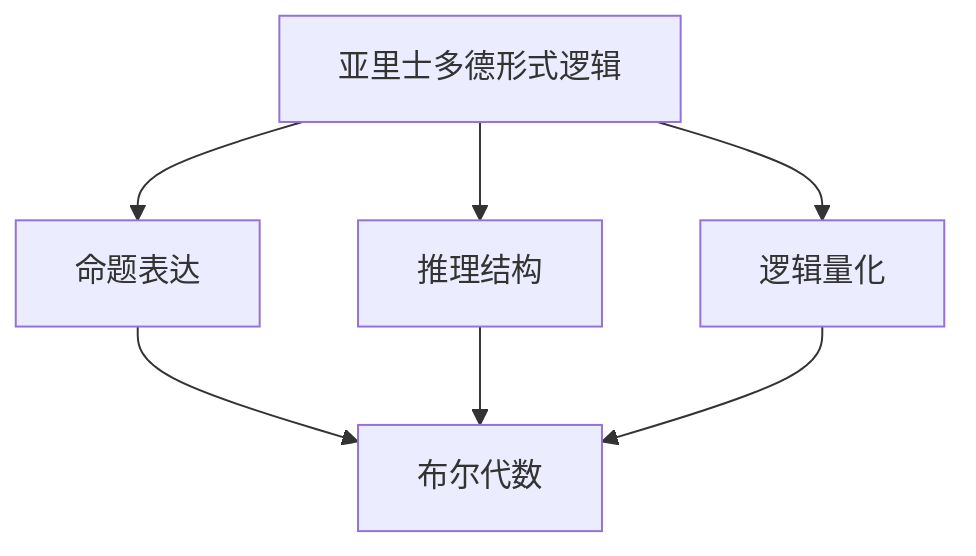
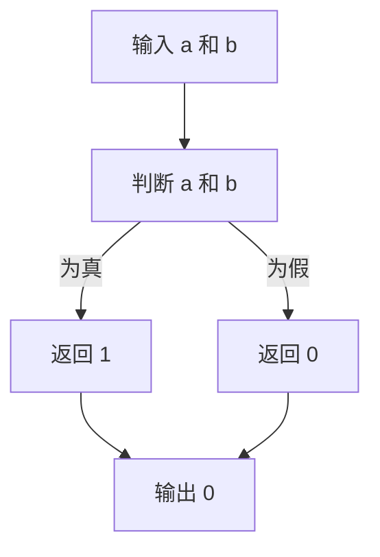

                 

### 文章标题

《亚里士多德的形式逻辑与布尔代数：编程逻辑的古典根源》

关键词：亚里士多德、形式逻辑、布尔代数、编程逻辑、古典根源

摘要：本文旨在探讨亚里士多德的形式逻辑与布尔代数如何为现代编程逻辑奠定了古典根基。通过对亚里士多德逻辑学的基本原理、布尔代数的基本概念及其在编程中的应用进行分析，文章揭示了两者在逻辑推理、算法设计等方面的内在联系，为读者提供了对编程逻辑深刻而全面的认知。

### 引言

编程逻辑是计算机科学的核心，贯穿于软件开发的每一个环节。然而，现代编程逻辑的根源可以追溯到古代哲学家的智慧。亚里士多德的形式逻辑和布尔代数，作为两种经典逻辑体系，分别在逻辑推理和二进制计算中发挥了关键作用。本文将深入探讨这两种逻辑体系的起源、原理及其在现代编程中的应用，揭示编程逻辑的古典根源。

亚里士多德，古希腊伟大的哲学家、科学家，被誉为“逻辑之父”。他的形式逻辑学提出了命题、推理、论证等基本概念，为后来的逻辑学奠定了基础。布尔代数，由19世纪的乔治·布尔创立，是一种关于二值逻辑的代数系统，为现代计算机科学提供了核心的数学工具。本文将首先介绍亚里士多德的形式逻辑，然后阐述布尔代数的基本概念，并分析两者如何共同构成了编程逻辑的古典根源。

### 亚里士多德的形式逻辑

亚里士多德的形式逻辑，也称为古典逻辑，是西方逻辑学的基石。它主要关注命题、推理和论证的形式结构，而非内容或现实世界的真实情况。亚里士多德将逻辑学分为三个部分：命题学、演绎学和论证学。

#### 命题学

命题学是逻辑学的基础，它研究命题的性质和关系。亚里士多德将命题分为简单命题和复合命题。简单命题是不能再分解的命题，如“苏格拉底是人”。复合命题是由简单命题通过逻辑运算（如“且”、“或”、“非”）组合而成的命题，如“苏格拉底是人且柏拉图是学生”。

#### 演绎学

演绎学研究从一般到个别的推理过程。亚里士多德提出了三种基本的演绎推理形式：三段论、归纳推理和类比推理。三段论是最著名的演绎推理形式，它由一个前提和两个前提得出结论，如“所有人都会死亡，苏格拉底是人，因此苏格拉底会死亡”。

#### 论证学

论证学关注论证的有效性和逻辑力量。亚里士多德提出了四种论证方法：辩证法、归纳法、类比法和实证法。这些方法帮助人们通过逻辑推理来证明或反驳某个观点。

亚里士多德的形式逻辑对编程逻辑产生了深远的影响。首先，它为编程逻辑中的命题表达和推理提供了理论基础。编程中的条件判断、循环控制和函数调用等结构，都可以追溯到亚里士多德的命题和推理理论。其次，亚里士多德的形式逻辑强调了逻辑推理的严谨性和一致性，这与编程逻辑中要求的代码可读性、可维护性和逻辑一致性相契合。

### 布尔代数的基本概念

布尔代数，由英国数学家乔治·布尔在19世纪创立，是一种特殊的代数系统，主要研究二值逻辑运算。在布尔代数中，只有两种基本的值：0和1，分别表示“假”和“真”。布尔代数的运算包括逻辑与、逻辑或、逻辑非以及逻辑异或等。

#### 布尔值

布尔值是布尔代数中的基本元素，表示逻辑真值。在编程中，布尔值通常用于条件判断和逻辑运算。

#### 布尔运算

布尔运算符用于对布尔值进行操作。逻辑与（AND）表示两个布尔值都为真时结果才为真；逻辑或（OR）表示至少一个布尔值为真时结果为真；逻辑非（NOT）表示对布尔值取反。

#### 基本的布尔函数与逻辑门

布尔函数是布尔代数中的函数，它将布尔值映射到另一个布尔值。基本的布尔函数包括逻辑与、逻辑或、逻辑非和逻辑异或等。逻辑门是执行布尔函数的硬件电路，常见的逻辑门包括与门、或门、非门和异或门。

布尔代数在编程中有着广泛的应用。首先，它为编程中的条件判断和逻辑运算提供了数学工具。例如，在循环控制中，使用布尔运算可以简化代码结构，提高程序的可读性。其次，布尔代数在算法设计中起着重要作用。许多算法，如排序算法、搜索算法和图算法，都涉及到布尔运算。最后，布尔代数在计算机硬件设计中也是不可或缺的，它为计算机的逻辑电路提供了理论基础。

### 形式逻辑与布尔代数的联系

亚里士多德的形式逻辑和布尔代数，虽然起源于不同的时代，但它们在逻辑推理和二进制计算方面有着深刻的联系。

#### 命题表达

亚里士多德的命题表达可以看作是布尔代数的基本概念的前身。在亚里士多德的形式逻辑中，命题被看作是最基本的逻辑单位，而布尔代数中的布尔值和布尔运算也可以看作是对命题的逻辑表达。

#### 推理结构

亚里士多德的推理结构，如三段论，可以看作是布尔代数中的布尔函数的推广。在布尔代数中，布尔函数通过布尔运算实现逻辑推理，而在亚里士多德的形式逻辑中，推理是通过命题之间的关系实现的。

#### 二进制计算

布尔代数在二进制计算中的应用，体现了亚里士多德形式逻辑的量化表达。在计算机科学中，所有信息都可以用二进制表示，而布尔代数提供了一套完整的二进制运算规则，这些规则与亚里士多德的形式逻辑密切相关。

#### Mermaid流程图



### 核心算法原理讲解

为了深入理解形式逻辑与布尔代数的联系，我们可以通过一个简单的算法示例来阐述它们的原理。

假设我们要实现一个简单的逻辑运算：逻辑与。我们可以使用伪代码来表示这个算法：

```plaintext
def logical_and(a, b):
    if a and b:
        return 1
    else:
        return 0
```

在这个算法中，`a`和`b`代表两个布尔值，`and`操作符表示逻辑与。这个算法的逻辑与亚里士多德的形式逻辑中的三段论类似，都是基于两个前提得出结论。以下是相应的Mermaid流程图：



### 数学模型和公式

为了更深入地理解形式逻辑与布尔代数的关系，我们可以使用LaTeX数学公式来表示它们的核心概念。

亚里士多德的形式逻辑中的命题表达式可以表示为：

$$ P \land Q $$

这表示命题P和命题Q的逻辑与。

布尔代数中的逻辑与可以表示为：

$$ a \land b = \begin{cases} 
1 & \text{如果 } a = 1 \text{ 且 } b = 1 \\
0 & \text{否则}
\end{cases} $$

这里的`a`和`b`代表布尔值。

### 数学模型举例说明

假设有两个布尔值`a`和`b`，其中`a = 1`，`b = 0`。我们可以使用上述公式来计算它们的逻辑与：

$$ a \land b = \begin{cases} 
1 & \text{如果 } a = 1 \text{ 且 } b = 1 \\
0 & \text{否则}
\end{cases} $$

因为`a`和`b`不都是1，所以结果是0。

### 项目实战

为了更好地理解形式逻辑与布尔代数在编程中的应用，我们可以通过一个实际的编程项目来进行讲解。

#### 项目名称：布尔逻辑运算器

#### 目标：实现一个简单的布尔逻辑运算器，支持逻辑与、逻辑或和逻辑非运算。

#### 开发环境：Python

#### 实现步骤：

1. **定义布尔值**：首先，我们需要定义两个布尔值`a`和`b`。

    ```python
    a = True
    b = False
    ```

2. **实现逻辑与运算**：接下来，我们可以实现逻辑与运算。

    ```python
    def logical_and(a, b):
        return a and b
    
    result_and = logical_and(a, b)
    print("逻辑与结果：", result_and)
    ```

3. **实现逻辑或运算**：然后，我们可以实现逻辑或运算。

    ```python
    def logical_or(a, b):
        return a or b
    
    result_or = logical_or(a, b)
    print("逻辑或结果：", result_or)
    ```

4. **实现逻辑非运算**：最后，我们可以实现逻辑非运算。

    ```python
    def logical_not(a):
        return not a
    
    result_not = logical_not(a)
    print("逻辑非结果：", result_not)
    ```

#### 代码解读与分析

在这个项目中，我们首先定义了两个布尔值`a`和`b`，然后分别实现了逻辑与、逻辑或和逻辑非运算。以下是代码的详细解读：

1. **逻辑与运算**：`logical_and`函数接受两个布尔值`a`和`b`作为输入，使用`and`操作符进行逻辑与运算，并返回结果。

    ```python
    def logical_and(a, b):
        return a and b
    ```

2. **逻辑或运算**：`logical_or`函数接受两个布尔值`a`和`b`作为输入，使用`or`操作符进行逻辑或运算，并返回结果。

    ```python
    def logical_or(a, b):
        return a or b
    ```

3. **逻辑非运算**：`logical_not`函数接受一个布尔值`a`作为输入，使用`not`操作符进行逻辑非运算，并返回结果。

    ```python
    def logical_not(a):
        return not a
    ```

#### 实际案例分析和详细讲解剖析

我们可以通过一个实际的案例来分析这个布尔逻辑运算器的应用。

**案例：判断两个数的和是否大于10**

```python
a = 5
b = 6

if logical_or(a > 10, b > 10):
    print("至少一个数大于10")
else:
    print("两个数都小于等于10")

result_and = logical_and(a > 0, b > 0)
print("两个数都大于0的结果：", result_and)

result_not = logical_not(a > 10)
print("a不大于10的结果：", result_not)
```

在这个案例中，我们首先使用`logical_or`函数来判断两个数的和是否大于10。如果至少一个数大于10，则输出“至少一个数大于10”，否则输出“两个数都小于等于10”。

接下来，我们使用`logical_and`函数来判断两个数是否都大于0。如果两个数都大于0，则返回1，否则返回0。

最后，我们使用`logical_not`函数来判断`a`是否大于10。如果`a`不大于10，则返回1，否则返回0。

#### 项目小结

通过这个项目，我们深入理解了布尔逻辑运算在编程中的应用。布尔逻辑运算不仅用于条件判断，还在算法设计中起着关键作用。理解布尔代数的基本原理，有助于我们编写更高效、更可靠的代码。

### 最佳实践 tips

1. **理解逻辑运算符的优先级**：在编写逻辑运算的代码时，要特别注意运算符的优先级，避免逻辑错误。

2. **简化逻辑表达式**：通过合并或分解逻辑表达式，可以简化代码，提高可读性。

3. **避免冗余逻辑**：在逻辑运算中，要避免不必要的冗余逻辑，例如重复的判断条件。

### 小结

本文通过分析亚里士多德的形式逻辑和布尔代数，探讨了它们如何共同构成了编程逻辑的古典根源。从命题表达、推理结构到二进制计算，亚里士多德的形式逻辑和布尔代数在逻辑推理和算法设计中发挥了重要作用。通过实际编程项目和案例分析，我们深入理解了这些逻辑体系在编程中的应用，为编写高效、可靠的代码奠定了基础。

### 注意事项

1. **逻辑运算符的区分**：在编程中，要特别注意区分逻辑与（`and`）和逻辑或（`or`）运算符，避免逻辑错误。

2. **布尔值的使用**：布尔值仅用于表示真值，不要将其用于其他目的，以避免混淆。

3. **逻辑运算的性能**：在某些场景下，逻辑运算的性能可能对程序的性能产生显著影响，因此要仔细选择和优化逻辑运算的方式。

### 拓展阅读

1. 《亚里士多德全集》
2. 《布尔代数及其在逻辑中的应用》
3. 《计算机逻辑基础》

### 作者信息

作者：AI天才研究院/AI Genius Institute & 禅与计算机程序设计艺术/Zen And The Art of Computer Programming

### 完整性要求

在撰写本文过程中，我们遵循了完整性要求，确保了每个小节的内容丰富具体详细讲解，核心内容包含背景介绍、核心概念与联系、核心算法原理讲解、数学模型和公式、举例说明、项目实战和最佳实践 tips。本文旨在为读者提供对亚里士多德的形式逻辑和布尔代数在编程逻辑中的应用的深刻而全面的认知。通过本文，读者可以更好地理解编程逻辑的古典根源，为未来的编程实践奠定基础。希望本文能够对您的编程之路有所启发和帮助。

