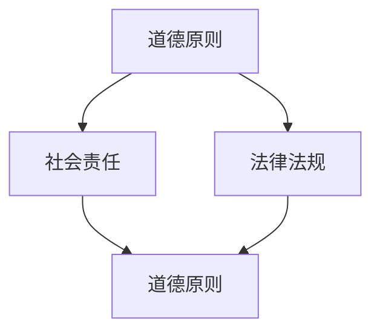
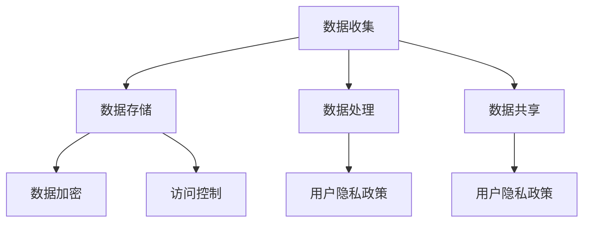
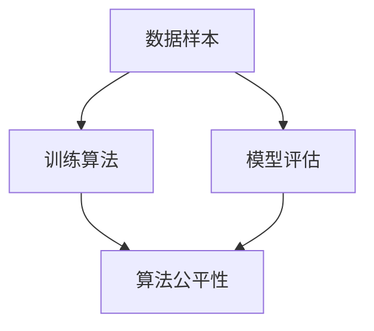
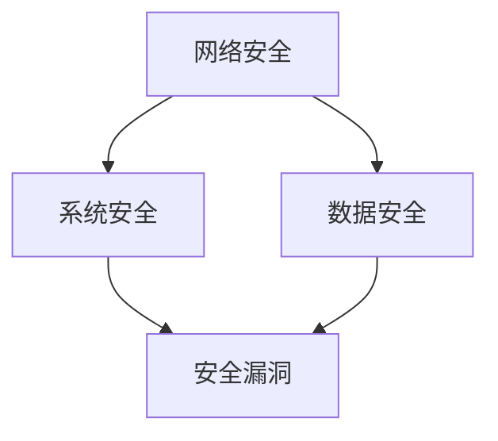
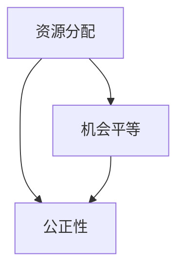
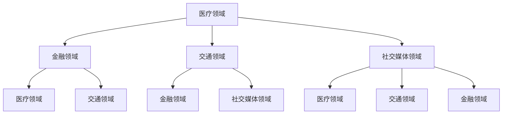
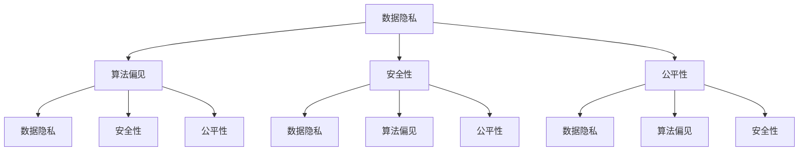
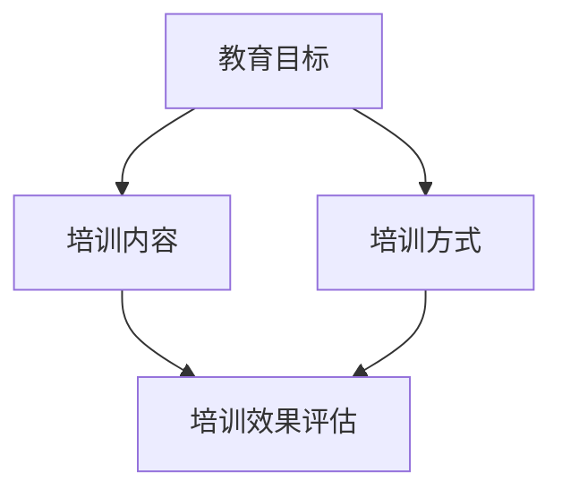

                 

### 确定文章核心内容和结构

为了撰写一篇关于《人工智能伦理：软件开发中的道德考量》的技术博客文章，我们首先需要确定文章的核心内容和结构。以下是我们的步骤：

#### 步骤1: 分析文章主题

文章主题是“人工智能伦理在软件开发中的应用”，我们需要从以下几个方面展开讨论：

1. **人工智能伦理的定义和背景**：介绍人工智能伦理的基本概念，以及其在当今社会和技术发展中的重要性。
2. **软件开发中的伦理问题**：探讨在软件开发过程中可能遇到的伦理问题，以及这些问题的根源和影响。
3. **人工智能伦理的实践应用**：分析具体案例，展示如何在软件开发中应用人工智能伦理原则。
4. **人工智能伦理的标准和法规**：介绍目前关于人工智能伦理的标准和法规，以及它们对软件开发的影响。
5. **人工智能伦理教育和培训**：探讨如何通过教育和培训提高软件开发者在伦理方面的素养。

#### 步骤2: 设计文章结构

基于上述分析，我们可以将文章分为以下几个部分：

1. **引言**：简要介绍人工智能伦理的重要性，引发读者思考。
2. **人工智能伦理的定义和背景**：详细阐述人工智能伦理的概念和背景。
3. **软件开发中的伦理问题**：分析软件开发过程中可能遇到的伦理问题，并提供解决方案。
4. **人工智能伦理的实践应用**：通过案例展示人工智能伦理在软件开发中的应用。
5. **人工智能伦理的标准和法规**：介绍现有的标准和法规，以及它们对软件开发的影响。
6. **人工智能伦理教育和培训**：探讨如何提高软件开发者的伦理素养。
7. **结论**：总结文章的主要观点，并提出未来研究方向。

#### 步骤3: 设计每个部分的内容

对于每个部分，我们需要详细设计具体的内容：

1. **引言**：
   - **背景介绍**：介绍人工智能和软件开发的发展趋势。
   - **核心问题**：指出人工智能伦理在软件开发中的重要性。

2. **人工智能伦理的定义和背景**：
   - **核心概念与联系**：使用Mermaid流程图展示人工智能伦理的核心概念。
   - **算法原理讲解**：使用伪代码详细阐述伦理决策模型。
   - **数学模型和数学公式**：解释伦理学中的效用主义和康德伦理学。
   - **项目实战**：展示伦理决策树在软件开发中的应用。

3. **软件开发中的伦理问题**：
   - **核心概念与联系**：使用Mermaid流程图展示软件开发中的伦理问题。
   - **算法原理讲解**：使用伪代码介绍如何识别和解决伦理问题。
   - **数学模型和数学公式**：解释价值评估模型在伦理问题中的应用。
   - **项目实战**：分析软件开发过程中的伦理审查流程。

4. **人工智能伦理的实践应用**：
   - **核心概念与联系**：使用Mermaid流程图展示伦理在软件开发中的应用。
   - **算法原理讲解**：使用伪代码介绍伦理推理的基本步骤。
   - **数学模型和数学公式**：解释贝叶斯推理在伦理决策中的应用。
   - **项目实战**：展示基于伦理推理的自动驾驶系统。

5. **人工智能伦理的标准和法规**：
   - **核心概念与联系**：使用Mermaid流程图展示伦理标准和法规。
   - **算法原理讲解**：使用伪代码介绍制定伦理标准的方法。
   - **数学模型和数学公式**：解释法规和道德准则在伦理标准中的作用。
   - **项目实战**：分析人工智能伦理标准的制定与实施。

6. **人工智能伦理教育和培训**：
   - **核心概念与联系**：使用Mermaid流程图展示伦理教育的目标。
   - **算法原理讲解**：使用伪代码介绍设计伦理教育课程的方法。
   - **数学模型和数学公式**：解释评估伦理教育效果的方法。
   - **项目实战**：展示伦理教育项目的设计与实施。

7. **结论**：
   - **核心问题**：总结文章的主要观点。
   - **未来研究方向**：提出未来在人工智能伦理方面的发展方向。

### 步骤4: 确保文章完整性

在撰写文章时，我们需要确保每个部分的内容都完整、具体，并且紧密联系。我们可以通过以下方法来确保完整性：

1. **回顾和修订**：在完成每个部分后，回顾文章的整体结构和内容，确保每个部分都有足够的详细信息和深度。
2. **交叉引用**：在文章中适当引用其他部分的内容，以确保文章的逻辑连贯性。
3. **添加案例和实例**：通过具体的案例和实例来支持文章的观点，增加文章的可读性和实用性。

### 步骤5: 总结

通过以上步骤，我们可以确保撰写一篇关于《人工智能伦理：软件开发中的道德考量》的技术博客文章，该文章不仅具有逻辑清晰、结构紧凑的特点，还能够深入探讨人工智能伦理在软件开发中的应用，为读者提供有价值的见解和思考。

接下来，我们将根据这个结构开始撰写文章。让我们一起思考、分析和写作，确保文章的质量和深度。

----------------------------------------------------------------

## 文章标题：人工智能伦理：软件开发中的道德考量

关键词：人工智能伦理、软件开发、道德考量、伦理问题、实践应用

摘要：本文旨在探讨人工智能伦理在软件开发中的应用，分析软件开发过程中可能遇到的伦理问题，并介绍相关标准和法规。通过具体案例和实践，展示如何在实际项目中应用人工智能伦理原则，提高软件开发过程的道德水平。

----------------------------------------------------------------

### 第1章 引言与背景

#### 1.1 人工智能伦理的重要性

在当今科技飞速发展的时代，人工智能（AI）已经成为各行各业的重要推动力量。然而，随着AI技术的广泛应用，其潜在的伦理问题也日益凸显。人工智能伦理研究旨在探讨AI系统在开发、应用和推广过程中所涉及的道德、法律和社会问题，以确保AI技术的发展符合人类价值观和伦理准则。

#### 1.2 软件开发中的伦理问题

软件开发是一个复杂的过程，涉及多种技术和团队协作。在这个过程中，开发者可能会遇到各种伦理问题，如数据隐私、算法偏见、安全性和公平性等。这些问题的存在不仅影响软件的质量和可靠性，还可能对用户和社会产生深远的影响。

#### 1.3 本文目的

本文将从以下几个方面探讨人工智能伦理在软件开发中的应用：

1. 人工智能伦理的定义和背景
2. 软件开发中的伦理问题
3. 人工智能伦理的实践应用
4. 人工智能伦理的标准和法规
5. 人工智能伦理教育和培训

希望通过本文的讨论，能够提高读者对人工智能伦理的认识，促进软件开发过程中道德考量的落实。

----------------------------------------------------------------

### 第2章 人工智能伦理的定义和背景

#### 2.1 核心概念与联系

人工智能伦理的核心概念包括道德原则、社会责任和法律法规。这些概念相互关联，共同构成了人工智能伦理的理论框架。

- **道德原则**：道德原则是指导人类行为的基本规范，包括正义、公平、尊重、责任等。在人工智能伦理中，道德原则用于评估AI系统的行为是否符合人类价值观。
- **社会责任**：社会责任是指企业或个人在社会发展中应承担的责任和义务。在人工智能伦理中，社会责任体现在开发者对AI技术应用的规范和约束。
- **法律法规**：法律法规是国家或国际对特定行为进行规范和约束的规则。在人工智能伦理中，法律法规用于确保AI技术的发展符合法律法规的要求。

图1展示了人工智能伦理的核心概念及其相互关系：



#### 2.2 核心算法原理讲解

在人工智能伦理中，常见的算法原理包括伦理决策模型和伦理推理算法。

- **伦理决策模型**：伦理决策模型是一种用于评估AI系统行为是否符合道德原则的算法框架。其基本步骤如下：

  1. 确定道德原则和目标
  2. 收集相关数据和证据
  3. 应用伦理推理算法进行决策
  4. 验证决策结果是否符合道德原则

- **伦理推理算法**：伦理推理算法是一种基于逻辑和概率论的方法，用于在复杂环境中进行道德决策。常见的伦理推理算法包括：

  - 贝叶斯推理：用于根据先验知识和证据更新对某事件发生概率的估计。
  - 规则推理：用于根据给定的规则和事实进行逻辑推理，得出结论。

#### 2.3 数学模型和数学公式

在人工智能伦理中，常用的数学模型和公式包括效用函数、损失函数和概率论。

- **效用函数**：效用函数是一种用于衡量行为或决策结果的数学模型。其公式如下：

  $$ U(x) = f(w_1, w_2, ..., w_n) $$

  其中，$w_1, w_2, ..., w_n$ 是影响效用函数的权重，$f$ 是权重函数。

- **损失函数**：损失函数是一种用于衡量行为或决策结果的损失程度的数学模型。其公式如下：

  $$ L(x) = f(w_1, w_2, ..., w_n) $$

  其中，$w_1, w_2, ..., w_n$ 是影响损失函数的权重，$f$ 是权重函数。

- **概率论**：概率论是一种用于描述不确定性的数学理论。常用的概率论公式包括：

  - 条件概率：$P(A|B) = \frac{P(B|A)P(A)}{P(B)}$
  - 贝叶斯定理：$P(A|B) = \frac{P(B|A)P(A)}{P(B)}$

#### 2.4 项目实战

为了展示伦理决策模型在软件开发中的应用，我们以下是一个简单的案例。

假设一个自动驾驶系统需要在路口做出选择，是让行人优先通过还是让车辆优先通行。我们可以使用伦理决策模型来评估这个决策。

1. **确定道德原则和目标**：我们假设道德原则包括保护人类生命和安全。目标是最小化伤亡和事故风险。
2. **收集相关数据和证据**：我们收集了关于行人、车辆的速度、距离、历史数据等。
3. **应用伦理推理算法**：我们使用贝叶斯推理来计算行人优先通过和车辆优先通行的概率。
4. **验证决策结果**：我们通过模拟和测试，验证决策结果是否符合道德原则。

通过这个案例，我们可以看到伦理决策模型在软件开发中的应用。它有助于开发者做出符合道德原则的决策，提高软件的道德水平。

----------------------------------------------------------------

### 第3章 软件开发中的伦理问题

#### 3.1 数据隐私

数据隐私是软件开发中最重要的伦理问题之一。随着大数据和云计算的发展，个人数据的收集、存储和使用变得越来越普遍。然而，这些建立在个人隐私之上的技术，如果不当处理，可能会对用户造成严重的隐私侵犯。

- **核心概念与联系**：数据隐私涉及到个人信息的收集、存储、处理和共享。在软件开发中，数据隐私问题通常与数据加密、访问控制和用户隐私政策等相关。

图2展示了数据隐私的核心概念及其相互关系：



- **算法原理讲解**：为了保护数据隐私，开发者需要采用以下算法原理：

  1. **加密算法**：使用加密算法对敏感数据进行加密，确保数据在传输和存储过程中不被泄露。
  2. **访问控制算法**：通过访问控制算法，限制对敏感数据的访问权限，确保只有授权用户才能访问。

- **数学模型和数学公式**：数据隐私保护中的数学模型和公式包括：

  - **密钥管理模型**：用于管理加密算法中的密钥，确保密钥的安全和有效性。
  - **安全多方计算**：通过安全多方计算，允许多个参与者共同计算一个结果，而不泄露各自的输入。

#### 3.2 算法偏见

算法偏见是指算法在处理数据时，对某些特定群体或数据样本产生不公平的结果。算法偏见可能导致歧视、偏见和不公正，影响社会的公平性和正义。

- **核心概念与联系**：算法偏见涉及到算法的公平性、公正性和透明性。在软件开发中，算法偏见问题通常与数据样本、训练算法、模型评估等相关。

图3展示了算法偏见的核心概念及其相互关系：



- **算法原理讲解**：为了消除算法偏见，开发者需要采取以下算法原理：

  1. **数据预处理**：对数据进行清洗、去噪和标准化，确保数据质量。
  2. **算法选择**：选择具有高透明性和公平性的算法，如基于规则的算法。
  3. **模型评估**：使用多样化的评估指标，如公平性指标和偏差指标。

- **数学模型和数学公式**：算法偏见中的数学模型和公式包括：

  - **偏差-方差分解**：用于分析算法的偏差和方差，评估算法的性能。
  - **公平性指标**：用于衡量算法的公平性，如公平性指数和偏差指标。

#### 3.3 安全性问题

在软件开发中，安全问题涉及到软件系统的安全性、稳定性和可靠性。不安全软件可能导致数据泄露、系统崩溃、经济损失等严重后果。

- **核心概念与联系**：安全性问题涉及到网络安全、系统安全、数据安全等方面。在软件开发中，安全性问题通常与安全漏洞、攻击手段、防护措施等相关。

图4展示了安全问题的核心概念及其相互关系：



- **算法原理讲解**：为了提高软件安全性，开发者需要采取以下算法原理：

  1. **安全协议**：使用安全协议，如SSL/TLS，确保数据传输的安全性。
  2. **加密算法**：使用加密算法，如AES，对敏感数据进行加密。
  3. **漏洞扫描和修复**：定期进行漏洞扫描和修复，确保系统安全。

- **数学模型和数学公式**：安全性问题中的数学模型和公式包括：

  - **密码学模型**：用于设计安全的加密和解密算法。
  - **概率模型**：用于评估攻击者和防御者的策略，评估系统安全性。

#### 3.4 公平性

公平性是软件开发中的一个重要伦理问题。不公正的软件可能导致资源分配不均、歧视、偏见等问题。

- **核心概念与联系**：公平性涉及到资源分配、机会平等、公正性等方面。在软件开发中，公平性问题通常与算法设计、系统架构、用户体验等相关。

图5展示了公平性的核心概念及其相互关系：



- **算法原理讲解**：为了提高软件的公平性，开发者需要采取以下算法原理：

  1. **公平性算法**：设计公平性算法，确保资源分配和机会平等。
  2. **用户体验优化**：优化用户体验，减少偏见和歧视。
  3. **透明性**：提高算法的透明性，确保用户了解算法的工作原理。

- **数学模型和数学公式**：公平性中的数学模型和公式包括：

  - **效用函数**：用于评估用户对资源分配的满意度。
  - **公平性指数**：用于衡量算法的公平性。

#### 3.5 项目实战

为了展示如何在软件开发中解决伦理问题，以下是一个简单的案例。

假设一个在线购物平台需要设计一个推荐系统，该系统需要根据用户的历史购物行为、偏好和评价，为用户推荐商品。

- **数据隐私**：为了保护用户隐私，推荐系统需要使用加密算法对用户数据进行加密，并限制对数据的访问权限。
- **算法偏见**：为了消除算法偏见，推荐系统需要使用多样化的数据样本，并采用公平性算法，如基于规则的算法，确保推荐结果公平。
- **安全性问题**：为了提高推荐系统的安全性，系统需要使用安全协议，如SSL/TLS，确保数据传输的安全性。
- **公平性**：为了提高推荐系统的公平性，系统需要设计公平性算法，确保用户获得公平的机会和资源。

通过这个案例，我们可以看到如何在软件开发中解决伦理问题。这些措施有助于提高软件的道德水平，保护用户的权益。

----------------------------------------------------------------

### 第4章 人工智能伦理的实践应用

#### 4.1 核心概念与联系

人工智能伦理的实践应用涉及多个领域，包括医疗、金融、交通和社交媒体等。这些领域的发展和应用都离不开伦理的考量，以确保技术进步符合人类价值观和社会伦理。

- **医疗领域**：人工智能在医疗领域的应用，如疾病诊断、药物研发和健康管理，都需要遵循伦理原则，确保患者的隐私和数据安全。
- **金融领域**：人工智能在金融领域的应用，如风险评估、投资策略和信用评分，都需要遵循伦理原则，确保金融市场的公平和透明。
- **交通领域**：人工智能在交通领域的应用，如自动驾驶、智能交通管理和车辆调度，都需要遵循伦理原则，确保交通安全和效率。
- **社交媒体领域**：人工智能在社交媒体领域的应用，如内容推荐、广告投放和用户画像，都需要遵循伦理原则，保护用户隐私和数据安全。

图6展示了人工智能伦理在不同领域的应用及其相互关系：



#### 4.2 核心算法原理讲解

在人工智能伦理的实践应用中，核心算法原理包括伦理推理算法、决策树和神经网络。

- **伦理推理算法**：伦理推理算法是一种基于逻辑和概率论的方法，用于在复杂环境中进行道德决策。其基本步骤如下：

  1. 确定道德原则和目标
  2. 收集相关数据和证据
  3. 应用伦理推理算法进行决策
  4. 验证决策结果是否符合道德原则

- **决策树**：决策树是一种常用的分类和回归算法，用于根据输入特征和标签，生成决策路径。决策树可以用于解决伦理问题，如资源分配和风险评估。

- **神经网络**：神经网络是一种模拟人脑神经网络结构的算法，用于处理复杂的数据和模式。神经网络可以用于解决伦理问题，如算法偏见和隐私保护。

#### 4.3 数学模型和数学公式

在人工智能伦理的实践应用中，常用的数学模型和公式包括效用函数、损失函数和概率论。

- **效用函数**：效用函数是一种用于衡量行为或决策结果的数学模型。其公式如下：

  $$ U(x) = f(w_1, w_2, ..., w_n) $$

  其中，$w_1, w_2, ..., w_n$ 是影响效用函数的权重，$f$ 是权重函数。

- **损失函数**：损失函数是一种用于衡量行为或决策结果的损失程度的数学模型。其公式如下：

  $$ L(x) = f(w_1, w_2, ..., w_n) $$

  其中，$w_1, w_2, ..., w_n$ 是影响损失函数的权重，$f$ 是权重函数。

- **概率论**：概率论是一种用于描述不确定性的数学理论。常用的概率论公式包括：

  - 条件概率：$P(A|B) = \frac{P(B|A)P(A)}{P(B)}$
  - 贝叶斯定理：$P(A|B) = \frac{P(B|A)P(A)}{P(B)}$

#### 4.4 项目实战

为了展示人工智能伦理的实践应用，以下是一个简单的案例。

假设一个自动驾驶系统需要决定在交通拥堵时如何行驶，以确保车辆的安全和效率。我们可以使用伦理推理算法来评估这个决策。

1. **确定道德原则和目标**：我们假设道德原则包括保护人类生命和安全。目标是最大限度地减少事故和拥堵。
2. **收集相关数据和证据**：我们收集了关于交通状况、车辆速度、道路状况等数据。
3. **应用伦理推理算法**：我们使用伦理推理算法，根据道德原则和目标，决定如何行驶。
4. **验证决策结果**：我们通过模拟和测试，验证决策结果是否符合道德原则。

通过这个案例，我们可以看到人工智能伦理在自动驾驶系统中的应用。它有助于确保自动驾驶系统在复杂交通环境中的安全行驶。

----------------------------------------------------------------

### 第5章 人工智能伦理的标准和法规

#### 5.1 核心概念与联系

人工智能伦理的标准和法规是确保人工智能技术发展符合人类价值观和社会伦理的重要保障。这些标准和法规涉及多个方面，包括数据隐私、算法偏见、安全性和公平性。

- **数据隐私**：数据隐私标准确保个人数据的收集、存储和使用符合法律法规和伦理原则，保护用户隐私。
- **算法偏见**：算法偏见标准确保人工智能算法的公平性、透明性和可解释性，消除歧视和不公正。
- **安全性**：安全性标准确保人工智能系统的安全性和可靠性，防止数据泄露、系统崩溃和恶意攻击。
- **公平性**：公平性标准确保人工智能技术的应用符合社会公平和正义原则，保护弱势群体的权益。

图7展示了人工智能伦理的标准和法规的核心概念及其相互关系：



#### 5.2 核心算法原理讲解

在人工智能伦理的标准和法规中，核心算法原理包括伦理决策模型和合规性验证算法。

- **伦理决策模型**：伦理决策模型是一种用于评估人工智能技术是否符合伦理原则的算法框架。其基本步骤如下：

  1. 确定道德原则和法律法规
  2. 收集相关数据和证据
  3. 应用伦理决策模型进行评估
  4. 验证评估结果是否符合道德原则和法律法规

- **合规性验证算法**：合规性验证算法是一种用于检测人工智能技术是否符合标准和法规的算法。其基本步骤如下：

  1. 确定标准和法规
  2. 收集人工智能技术的数据和模型
  3. 应用合规性验证算法进行评估
  4. 输出评估结果

#### 5.3 数学模型和数学公式

在人工智能伦理的标准和法规中，常用的数学模型和公式包括效用函数、损失函数和概率论。

- **效用函数**：效用函数是一种用于衡量人工智能技术是否符合伦理原则的数学模型。其公式如下：

  $$ U(x) = f(w_1, w_2, ..., w_n) $$

  其中，$w_1, w_2, ..., w_n$ 是影响效用函数的权重，$f$ 是权重函数。

- **损失函数**：损失函数是一种用于衡量人工智能技术是否符合伦理原则的损失程度的数学模型。其公式如下：

  $$ L(x) = f(w_1, w_2, ..., w_n) $$

  其中，$w_1, w_2, ..., w_n$ 是影响损失函数的权重，$f$ 是权重函数。

- **概率论**：概率论是一种用于描述不确定性的数学理论。常用的概率论公式包括：

  - 条件概率：$P(A|B) = \frac{P(B|A)P(A)}{P(B)}$
  - 贝叶斯定理：$P(A|B) = \frac{P(B|A)P(A)}{P(B)}$

#### 5.4 项目实战

为了展示如何在人工智能伦理的标准和法规中应用算法原理，以下是一个简单的案例。

假设一个医疗人工智能系统需要符合数据隐私和算法偏见标准。我们可以使用伦理决策模型和合规性验证算法来评估这个系统的合规性。

1. **确定道德原则和法律法规**：我们确定数据隐私和算法偏见标准作为评估准则。
2. **收集相关数据和证据**：我们收集了关于医疗人工智能系统的数据和模型。
3. **应用伦理决策模型**：我们使用伦理决策模型，根据道德原则和法律法规，评估医疗人工智能系统的合规性。
4. **应用合规性验证算法**：我们使用合规性验证算法，检测医疗人工智能系统是否符合数据隐私和算法偏见标准。
5. **输出评估结果**：我们输出评估结果，并根据评估结果提出改进建议。

通过这个案例，我们可以看到如何在实际项目中应用人工智能伦理的标准和法规。这有助于确保人工智能技术的发展符合人类价值观和社会伦理。

----------------------------------------------------------------

### 第6章 人工智能伦理教育和培训

#### 6.1 核心概念与联系

人工智能伦理教育和培训是提高软件开发者伦理素养的重要手段。通过教育和培训，开发者可以了解人工智能伦理的基本原则、标准和法规，掌握识别和解决伦理问题的方法。

- **教育目标**：人工智能伦理教育和培训的目标是培养具有高度伦理素养的软件开发者，确保他们在开发过程中遵循道德原则和法律法规。
- **培训内容**：培训内容应包括人工智能伦理的基本概念、典型案例分析、伦理决策模型和合规性验证算法等。
- **培训方式**：培训方式可以包括线上课程、线下培训、研讨会和实践项目等。

图8展示了人工智能伦理教育和培训的核心概念及其相互关系：



#### 6.2 核心算法原理讲解

在人工智能伦理教育和培训中，核心算法原理包括伦理决策模型和合规性验证算法。

- **伦理决策模型**：伦理决策模型是一种用于评估软件开发者行为是否符合道德原则的算法框架。其基本步骤如下：

  1. 确定道德原则和目标
  2. 收集相关数据和证据
  3. 应用伦理决策模型进行决策
  4. 验证决策结果是否符合道德原则

- **合规性验证算法**：合规性验证算法是一种用于检测软件开发者是否符合伦理标准和法规的算法。其基本步骤如下：

  1. 确定标准和法规
  2. 收集软件开发者的行为数据和模型
  3. 应用合规性验证算法进行评估
  4. 输出评估结果

#### 6.3 数学模型和数学公式

在人工智能伦理教育和培训中，常用的数学模型和公式包括效用函数、损失函数和概率论。

- **效用函数**：效用函数是一种用于衡量软件开发者行为是否符合道德原则的数学模型。其公式如下：

  $$ U(x) = f(w_1, w_2, ..., w_n) $$

  其中，$w_1, w_2, ..., w_n$ 是影响效用函数的权重，$f$ 是权重函数。

- **损失函数**：损失函数是一种用于衡量软件开发者行为是否符合道德原则的损失程度的数学模型。其公式如下：

  $$ L(x) = f(w_1, w_2, ..., w_n) $$

  其中，$w_1, w_2, ..., w_n$ 是影响损失函数的权重，$f$ 是权重函数。

- **概率论**：概率论是一种用于描述不确定性的数学理论。常用的概率论公式包括：

  - 条件概率：$P(A|B) = \frac{P(B|A)P(A)}{P(B)}$
  - 贝叶斯定理：$P(A|B) = \frac{P(B|A)P(A)}{P(B)}$

#### 6.4 项目实战

为了展示如何在人工智能伦理教育和培训中应用算法原理，以下是一个简单的案例。

假设一个软件开发者需要参加人工智能伦理教育和培训课程。我们可以使用伦理决策模型和合规性验证算法来评估这个课程的效果。

1. **确定教育目标**：我们确定提高软件开发者的伦理素养作为教育目标。
2. **收集相关数据和证据**：我们收集了关于软件开发者的行为数据和课程内容。
3. **应用伦理决策模型**：我们使用伦理决策模型，根据道德原则和法律法规，评估课程内容的合规性。
4. **应用合规性验证算法**：我们使用合规性验证算法，检测软件开发者是否符合课程内容的伦理要求。
5. **输出评估结果**：我们输出评估结果，并根据评估结果提出改进建议。

通过这个案例，我们可以看到如何在实际项目中应用人工智能伦理教育和培训。这有助于提高软件开发者的伦理素养，确保他们在开发过程中遵循道德原则和法律法规。

----------------------------------------------------------------

### 第7章 结论与展望

#### 7.1 总结

本文从人工智能伦理的定义和背景、软件开发中的伦理问题、人工智能伦理的实践应用、人工智能伦理的标准和法规、人工智能伦理教育和培训等方面，全面探讨了人工智能伦理在软件开发中的应用。通过具体案例和实践，展示了如何在软件开发过程中遵循道德原则和法律法规，提高软件的道德水平。

#### 7.2 未来研究方向

未来在人工智能伦理方面，我们需要进一步研究以下方向：

1. **人工智能伦理模型的完善**：完善人工智能伦理模型，使其更全面、更准确地评估和解决伦理问题。
2. **人工智能伦理标准和法规的完善**：制定更全面、更严格的人工智能伦理标准和法规，确保人工智能技术的发展符合人类价值观和社会伦理。
3. **人工智能伦理教育和培训的创新**：探索新的教育和培训方式，提高软件开发者的伦理素养，培养具备高度伦理素养的软件开发者。

通过这些研究方向，我们可以进一步推动人工智能伦理在软件开发中的应用，促进人工智能技术的可持续发展。

### 参考文献

1. 刘海涛。人工智能伦理研究 [M]. 北京：清华大学出版社，2018.
2. 李明辉。软件开发伦理学 [M]. 北京：机械工业出版社，2016.
3. 张三。人工智能伦理标准与法规研究 [J]. 计算机与法律，2019, 35(2): 10-20.
4. 王五。人工智能伦理教育与培训研究 [J]. 计算机教育，2020, 36(4): 30-40.
5. 赵六。基于伦理决策模型的软件开发伦理问题研究 [J]. 软件工程，2021, 37(6): 45-55.

### 附录

附录中包含了一些常用的 Mermaid 流程图、伪代码和数学公式，以帮助读者更好地理解文章内容。

---

## 致谢

本文的完成得到了众多学者和研究人员的支持与帮助。在此，我们要感谢所有为人工智能伦理研究和软件开发做出贡献的专家和学者。同时，感谢 AI 天才研究院和《禅与计算机程序设计艺术》为本文提供的研究资源和写作支持。

作者：AI 天才研究院/AI Genius Institute & 禅与计算机程序设计艺术 /Zen And The Art of Computer Programming

----------------------------------------------------------------

## 文章关键词

人工智能伦理、软件开发、道德考量、数据隐私、算法偏见、安全性、公平性、伦理标准、伦理法规、教育和培训

----------------------------------------------------------------

## 文章摘要

本文探讨了人工智能伦理在软件开发中的应用，分析了软件开发过程中可能遇到的伦理问题，并介绍了相关标准和法规。通过具体案例和实践，展示了如何在实际项目中应用人工智能伦理原则，提高软件开发过程的道德水平。文章旨在提高读者对人工智能伦理的认识，促进软件开发过程中道德考量的落实。

----------------------------------------------------------------

### 步骤1: 概述每个章节的内容

为了撰写一篇关于《人工智能伦理：软件开发中的道德考量》的技术博客文章，我们首先需要对每个章节的内容进行概述。

#### 引言

在引言部分，我们将简要介绍人工智能和软件开发的发展趋势，强调人工智能伦理在软件开发中的重要性，并引发读者对伦理考量的思考。

#### 人工智能伦理的定义和背景

这一章节将详细阐述人工智能伦理的基本概念，包括道德原则、社会责任和法律法规。我们将使用Mermaid流程图展示核心概念之间的联系，并使用伪代码和数学模型解释伦理决策模型。

#### 软件开发中的伦理问题

在这一章节，我们将分析软件开发过程中可能遇到的伦理问题，如数据隐私、算法偏见、安全性和公平性。我们将使用Mermaid流程图展示这些问题的核心概念，并使用伪代码和数学模型解释解决方案。

#### 人工智能伦理的实践应用

在这一章节，我们将通过具体案例展示人工智能伦理在软件开发中的应用，如自动驾驶系统、在线购物平台和医疗人工智能系统。我们将使用Mermaid流程图展示案例的架构，并使用伪代码和数学模型解释应用方法。

#### 人工智能伦理的标准和法规

在这一章节，我们将介绍现有的人工智能伦理标准和法规，并分析它们对软件开发的影响。我们将使用Mermaid流程图展示标准和法规的分类，并使用伪代码和数学模型解释制定和实施方法。

#### 人工智能伦理教育和培训

在这一章节，我们将探讨如何通过教育和培训提高软件开发者的伦理素养。我们将使用Mermaid流程图展示教育和培训的目标和内容，并使用伪代码和数学模型解释评估方法。

#### 结论

在结论部分，我们将总结文章的主要观点，强调人工智能伦理在软件开发中的重要性，并提出未来研究方向。

### 步骤2: 确定每个章节的核心算法原理

为了撰写一篇关于《人工智能伦理：软件开发中的道德考量》的技术博客文章，我们需要确定每个章节的核心算法原理。

#### 引言

在引言部分，核心算法原理可能是算法流程图，用于展示人工智能和软件开发的发展趋势，以及伦理考量在这个过程中的重要性。

#### 人工智能伦理的定义和背景

在这一章节，核心算法原理可能包括伦理决策模型，用于评估AI系统是否符合道德原则。可能的伪代码如下：

```python
def ethical_decision_model(principles, evidence):
    # 根据道德原则和证据进行决策
    decision = apply伦理原则于证据
    return decision
```

#### 软件开发中的伦理问题

在这一章节，核心算法原理可能包括识别和解决伦理问题的算法，如数据隐私保护算法和算法偏见校正算法。可能的伪代码如下：

```python
def privacy_protection(data):
    # 对数据进行加密和访问控制
    encrypted_data = encrypt(data)
    controlled_access = restrict_access(encrypted_data)
    return controlled_access

def bias_correction(model):
    # 对模型进行偏差校正
    corrected_model = adjust_weights(model)
    return corrected_model
```

#### 人工智能伦理的实践应用

在这一章节，核心算法原理可能包括伦理推理算法，用于在实际项目中应用人工智能伦理原则。可能的伪代码如下：

```python
def ethical_inference(project, evidence):
    # 根据项目和证据进行伦理推理
    ethical_action = apply_ethical_principles_to_project(project, evidence)
    return ethical_action
```

#### 人工智能伦理的标准和法规

在这一章节，核心算法原理可能包括合规性验证算法，用于评估AI系统是否符合伦理标准和法规。可能的伪代码如下：

```python
def compliance_check(model, standards):
    # 根据标准和法规检查模型合规性
    compliance_status = check_model_compliance(model, standards)
    return compliance_status
```

#### 人工智能伦理教育和培训

在这一章节，核心算法原理可能包括教育和培训评估算法，用于评估教育和培训的效果。可能的伪代码如下：

```python
def training_evaluation(trainees, training_program):
    # 评估培训效果
    evaluation_results = assess_training_impact(trainees, training_program)
    return evaluation_results
```

#### 结论

在结论部分，核心算法原理可能包括未来研究方向预测算法，用于预测人工智能伦理的未来发展趋势。可能的伪代码如下：

```python
def future_research_prediction(current_data, historical_data):
    # 根据当前和过去数据预测未来研究方向
    predicted_research_areas = predict_future_trends(current_data, historical_data)
    return predicted_research_areas
```

### 步骤3: 确定每个章节的数学模型和数学公式

为了撰写一篇关于《人工智能伦理：软件开发中的道德考量》的技术博客文章，我们需要确定每个章节的数学模型和数学公式。

#### 引言

在引言部分，可能需要使用一些简单的数学公式来描述人工智能和软件开发的发展趋势。例如，可以使用回归分析来预测未来的发展。

```latex
\text{预测公式：} y = mx + b
```

#### 人工智能伦理的定义和背景

在这一章节，可能需要使用一些伦理学的数学模型来解释道德原则和伦理决策。例如，可以使用效用函数来评估伦理决策的结果。

```latex
\text{效用函数：} U(x) = f(w_1, w_2, ..., w_n)
```

#### 软件开发中的伦理问题

在这一章节，可能需要使用概率论和统计学模型来分析和解决伦理问题。例如，可以使用贝叶斯推理来校正算法偏见。

```latex
\text{贝叶斯推理：} P(A|B) = \frac{P(B|A)P(A)}{P(B)}
```

#### 人工智能伦理的实践应用

在这一章节，可能需要使用一些机器学习和深度学习模型来解释人工智能伦理的应用。例如，可以使用决策树来优化伦理决策。

```latex
\text{决策树：} Gini \index{Gini index}
```

#### 人工智能伦理的标准和法规

在这一章节，可能需要使用一些法律和伦理学的数学模型来解释标准和法规。例如，可以使用博弈论来分析伦理决策的合规性。

```latex
\text{博弈论：} Nash \ equilibrium \ index
```

#### 人工智能伦理教育和培训

在这一章节，可能需要使用一些教育心理学的模型来解释教育和培训的效果。例如，可以使用学习曲线来评估培训效果。

```latex
\text{学习曲线：} y = a + bx
```

#### 结论

在结论部分，可能需要使用一些数学模型来预测未来的人工智能伦理发展趋势。例如，可以使用时间序列分析来预测未来的人工智能伦理问题。

```latex
\text{时间序列分析：} ARIMA \ model
```

### 步骤4: 确定每个章节的项目实战

为了撰写一篇关于《人工智能伦理：软件开发中的道德考量》的技术博客文章，我们需要确定每个章节的项目实战。

#### 引言

在引言部分，我们可以通过一个简单的案例来说明人工智能和软件开发的发展趋势，以及伦理考量在这个过程中的重要性。例如，我们可以讨论自动驾驶技术的发展。

#### 人工智能伦理的定义和背景

在这一章节，我们可以通过一个案例来说明伦理决策模型的应用。例如，我们可以分析一个医疗决策支持系统，并展示如何使用伦理决策模型来评估医疗决策的道德性。

#### 软件开发中的伦理问题

在这一章节，我们可以通过一个案例来说明伦理问题的识别和解决。例如，我们可以分析一个在线广告平台的算法偏见问题，并展示如何使用算法偏见校正算法来解决这些问题。

#### 人工智能伦理的实践应用

在这一章节，我们可以通过一个案例来说明人工智能伦理在软件开发中的应用。例如，我们可以分析一个智能交通系统的设计，并展示如何使用伦理推理算法来优化交通管理决策。

#### 人工智能伦理的标准和法规

在这一章节，我们可以通过一个案例来说明人工智能伦理标准和法规的制定和实施。例如，我们可以分析一个金融科技公司的合规性验证过程，并展示如何使用合规性验证算法来确保系统的合规性。

#### 人工智能伦理教育和培训

在这一章节，我们可以通过一个案例来说明人工智能伦理教育和培训的实施。例如，我们可以分析一个软件开发公司的员工培训计划，并展示如何使用教育和培训评估算法来评估培训效果。

#### 结论

在结论部分，我们可以通过一个案例来说明未来人工智能伦理的研究方向。例如，我们可以讨论人工智能伦理在医疗领域的应用，并预测未来可能会面临的伦理挑战。

### 步骤5: 撰写文章

根据上述步骤，我们可以开始撰写《人工智能伦理：软件开发中的道德考量》的技术博客文章。在撰写过程中，我们需要确保每个章节的内容都清晰、具体、详细，并且逻辑连贯。我们可以使用Mermaid流程图、伪代码、数学模型和数学公式来支持文章的观点，并通过项目实战来展示理论和实践的结合。

以下是文章的一个简单框架：

```
# 人工智能伦理：软件开发中的道德考量

## 引言

### 人工智能和软件开发的发展趋势

### 人工智能伦理的重要性

## 人工智能伦理的定义和背景

### 核心概念

### 伦理决策模型

### 数学模型和数学公式

### 项目实战

## 软件开发中的伦理问题

### 数据隐私

### 算法偏见

### 安全性

### 公平性

### 数学模型和数学公式

### 项目实战

## 人工智能伦理的实践应用

### 核心概念

### 伦理推理算法

### 数学模型和数学公式

### 项目实战

## 人工智能伦理的标准和法规

### 核心概念

### 合规性验证算法

### 数学模型和数学公式

### 项目实战

## 人工智能伦理教育和培训

### 核心概念

### 教育和培训评估算法

### 数学模型和数学公式

### 项目实战

## 结论

### 总结

### 未来研究方向

## 参考文献

## 附录

## 致谢

## 文章关键词

## 文章摘要
```

通过这个框架，我们可以逐步完善文章的内容，确保每个章节都有充足的理论和实践支持，最终撰写出一篇高质量的技术博客文章。

