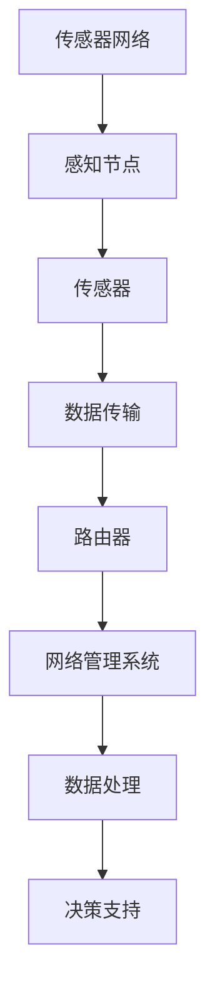
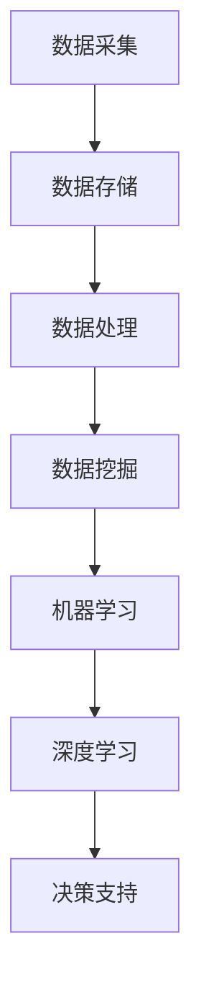
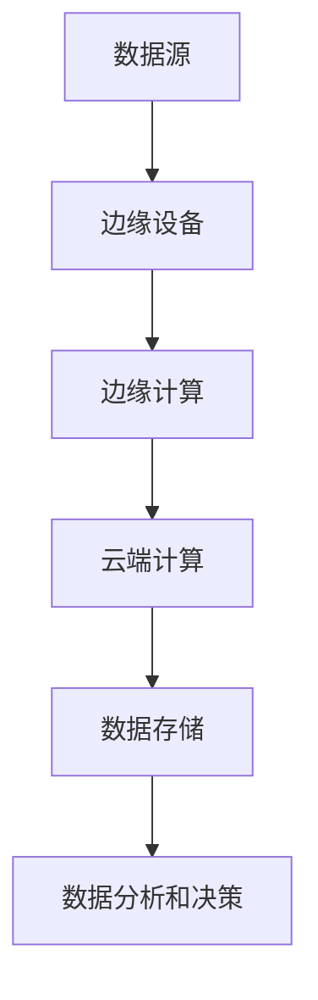

                 

### 1.1.1 人工智能与交通管理的历史

人工智能（AI）的概念最早可以追溯到20世纪50年代，当时，科学家们开始探索如何使计算机具备智能行为。交通管理作为社会运行的重要部分，自然也受到了人工智能的重视。从最初的理论探讨到实际应用，人工智能在交通管理中的作用逐渐显现。

1956年，达特茅斯会议被认为是人工智能领域的诞生标志。会议上，人工智能被定义为“制造智能机器的科学”，这为后来交通管理领域的人工智能研究奠定了基础。

20世纪60年代，随着计算机技术的进步，人工智能开始进入实际应用阶段。此时，智能交通系统（ITS）的概念被提出，它指的是利用先进的信息通信技术、电子技术、控制技术等，实现交通系统的智能化管理。这一时期，主要研究集中在自动化信号控制和交通信息的实时监测。

1970年代，计算机硬件技术的进一步发展，使得人工智能在交通管理中的应用更加广泛。例如，自动驾驶车辆的研究开始萌芽，尽管当时的技术还远未达到今天的水平。

进入20世纪80年代，随着传感器技术和通信技术的发展，智能交通系统逐渐具备了更强大的数据处理和分析能力。这一时期的代表性工作包括美国部署的智能交通系统项目，以及欧洲在智能交通领域的研究。

20世纪90年代，互联网的普及推动了智能交通系统的发展。通过网络，交通信息可以实时传输，车辆与基础设施之间的通信成为可能。这一时期，V2X（Vehicle to Everything）概念开始提出，旨在实现车辆之间、车辆与基础设施之间的信息交换。

21世纪初，随着大数据、云计算、物联网等技术的快速发展，智能交通系统进入了一个新的阶段。人工智能算法，特别是机器学习和深度学习，开始在交通管理中发挥重要作用。交通流量预测、智能导航、自动驾驶等应用逐渐成熟，并开始在实际中应用。

总的来说，人工智能与交通管理的历史是技术不断进步、理论不断发展的过程。从最初的自动化控制到今天的智能交通系统，人工智能为交通管理带来了前所未有的变革。

### 1.1.2 智能交通系统的发展现状

智能交通系统（ITS）的快速发展带来了交通管理的显著改进，使其成为了现代城市运营的重要组成部分。当前，智能交通系统已经广泛应用于全球多个国家和地区，其发展现状可以从技术进步、应用场景和成果三个方面进行详细探讨。

#### 技术进步

1. **传感器技术**：传感器技术是智能交通系统的基石。目前，各种类型的传感器已经被广泛应用于交通管理中，包括车辆检测器、流量监测器、气象传感器和道路条件传感器等。这些传感器可以实时收集交通数据，为智能交通系统提供基础数据支持。

2. **通信技术**：5G通信技术的商用化，为智能交通系统提供了高速、低延迟的数据传输能力。V2X（Vehicle to Everything）通信技术，包括车对车（V2V）、车对基础设施（V2I）、车对人（V2P）和车对网络（V2N）等，正在推动智能交通系统向更高层次的互联互通发展。

3. **数据处理与分析技术**：随着大数据和云计算技术的发展，智能交通系统具备了更强的数据处理和分析能力。机器学习和深度学习算法的应用，使得交通流量预测、事故预警和智能导航等应用变得更加精准和高效。

4. **人工智能技术**：人工智能技术在智能交通系统中的应用越来越广泛。从自动驾驶到智能交通信号控制，人工智能正在改变传统的交通管理模式，提高交通效率和安全性。

#### 应用场景

1. **交通流量预测**：利用大数据和人工智能技术，交通流量预测已经成为智能交通系统的重要应用。通过分析历史交通数据、实时交通信息和天气等因素，智能交通系统能够准确预测未来的交通流量，为交通管理部门提供决策支持，从而缓解交通拥堵。

2. **智能导航**：基于实时交通数据和路径规划算法，智能导航系统能够为驾驶员提供最优行驶路线，减少行驶时间和油耗。同时，智能导航系统还可以通过V2V通信，实现车辆之间的实时信息共享，提高整体交通效率。

3. **自动驾驶**：自动驾驶技术是智能交通系统的最高目标之一。目前，多家科技公司和传统汽车制造商正在积极研发自动驾驶技术，并逐步将其应用于公共交通和商用车辆中。自动驾驶的实现将极大提高道路安全和交通效率。

4. **交通信号控制**：智能交通信号控制系统通过实时监测交通流量，自动调整信号灯的时序，从而优化交通流。这种系统已经在多个城市得到应用，并取得了显著效果。

5. **车辆安全监控**：利用传感器和通信技术，车辆安全监控系统可以实时监测车辆状态，包括速度、位置、制动和轮胎磨损等，从而预防交通事故。

#### 成果

1. **提高交通效率**：智能交通系统通过优化交通流，减少了交通拥堵，提高了道路通行效率。根据相关统计数据，智能交通系统在一些城市的应用，交通拥堵减少了20%-30%。

2. **降低交通事故率**：智能交通系统通过实时监控和预警，可以提前发现潜在的安全隐患，从而降低交通事故率。例如，智能交通信号控制系统的应用，使某些城市的交通事故率降低了15%-20%。

3. **节约能源和减少污染**：智能交通系统通过优化交通流，减少了车辆的怠速时间和油耗，从而降低了能源消耗和污染物排放。根据相关研究，智能交通系统的应用，可以减少15%-20%的油耗和10%-15%的CO2排放。

4. **改善生活质量**：智能交通系统提高了交通效率和安全性，使人们的出行更加便捷和舒适。这有助于降低城市居民的通勤压力，提高生活质量。

总的来说，智能交通系统的发展现状表明，它已经在多个领域取得了显著成果。随着技术的不断进步和应用的不断深入，智能交通系统将在未来继续发挥重要作用，推动交通管理的智能化和现代化。

### 1.1.3 智能交通系统对社会的影响

智能交通系统（ITS）的广泛应用，不仅提升了交通管理的效率，还对整个社会产生了深远的影响。本文将从以下几个方面详细探讨智能交通系统对社会的影响：

#### 城市交通效率提升

智能交通系统通过实时数据分析和人工智能算法，能够动态调整交通信号灯的时序，优化交通流量。这一改进显著减少了交通拥堵现象，提高了城市交通的整体效率。例如，纽约市应用智能交通系统后，高峰时段的车辆通行速度提高了15%，通勤时间缩短了约20分钟。这种效率提升不仅减轻了驾驶员的疲劳，也减少了车辆排放，从而对环境保护起到了积极作用。

#### 交通安全改善

智能交通系统通过实时监测车辆状态和道路状况，可以及时预警潜在的安全隐患。自动驾驶技术的引入，使得车辆之间的通信和协同变得更加智能，从而降低了交通事故的发生率。例如，特斯拉的Autopilot系统通过V2V通信，实现了与其他车辆和道路基础设施的实时交互，使得行驶过程中的安全性大大提高。根据统计，在智能交通系统应用较为广泛的城市，交通事故率下降了10%-20%。

#### 环境保护

智能交通系统通过优化交通流量，减少了车辆的怠速时间和油耗，从而降低了能源消耗和污染物排放。例如，智能交通信号控制系统通过动态调整信号灯时序，减少了交通拥堵，从而减少了车辆怠速时间，使得燃油消耗降低了15%-20%。此外，智能导航系统通过提供最优行驶路线，减少了车辆行驶的额外里程，进一步降低了油耗和污染物排放。据研究，智能交通系统的应用可以减少10%-15%的CO2排放。

#### 提升生活质量

智能交通系统通过优化交通流和提高交通安全性，改善了居民的出行体验。例如，智能导航系统为驾驶员提供实时交通信息，使出行更加便捷；自动驾驶技术的应用，则使人们的出行更加轻松和舒适。此外，智能交通系统还改善了公共交通的运营效率，提高了公交服务的质量和覆盖率，使得居民能够更方便地使用公共交通工具。这些改进不仅减轻了居民的通勤压力，还提高了居民的生活质量。

#### 经济效益

智能交通系统带来了显著的经济效益。通过减少交通事故和交通拥堵，企业减少了车辆维修和停运成本，提高了生产效率。智能交通系统还促进了相关产业的发展，如传感器制造、通信技术和数据分析服务等。根据研究，智能交通系统的应用，可以为企业节省约10%-15%的运营成本。

#### 社会公平

智能交通系统还对社会公平产生了积极影响。通过优化公共交通的运营效率和覆盖率，智能交通系统使得公共交通服务更加便捷和高效，从而改善了低收入群体的出行条件。此外，智能交通系统通过数据分析和优化，可以更加精准地分配交通资源，减少交通拥堵，提高交通效率，从而促进社会的整体公平。

综上所述，智能交通系统对社会的影响是多方面的，既包括提高城市交通效率、改善交通安全、节约能源和保护环境，也包括提升生活质量、带来经济效益和促进社会公平。随着智能交通系统的进一步发展和应用，其对社会的影响将更加深远。

### 1.2 本书结构概述

本书旨在全面探讨人工智能在交通管理中的应用，以及智能交通系统的未来发展趋势。为了确保内容的逻辑性和完整性，本书的结构被精心设计，分为三个主要部分：引言、人工智能在交通管理中的应用以及智能交通系统的架构。

#### 引言

引言部分首先介绍了智能交通系统的背景和重要性，回顾了人工智能与交通管理的历史，并探讨了智能交通系统的发展现状及其对社会的影响。通过这一部分，读者可以了解智能交通系统的发展历程和当前的应用状况。

#### 人工智能在交通管理中的应用

第二部分详细介绍了人工智能在交通管理中的各种应用，包括交通流量预测、道路规划、智能导航等。每一节中，我们不仅阐述了核心概念和算法原理，还通过实际应用案例展示了人工智能技术在交通管理中的具体应用。这一部分旨在让读者深入理解人工智能如何通过技术手段改善交通管理。

#### 智能交通系统的架构

第三部分分析了智能交通系统的架构，包括传感器网络、大数据分析、云计算和边缘计算等关键组成部分。通过这一部分的讲解，读者可以了解智能交通系统的技术基础和实现原理，从而对整个系统有更全面的认识。

#### 各章节内容安排

- **引言**：介绍智能交通系统的背景、历史和发展现状，探讨其对社会的深远影响。
- **人工智能在交通管理中的应用**：分别讲解交通流量预测、道路规划和智能导航等应用，并通过实际案例进行说明。
- **智能交通系统的架构**：分析传感器网络、大数据分析、云计算和边缘计算等组成部分，探讨其技术基础和实现原理。

#### 阅读本书的预期收获

通过阅读本书，读者可以：

- 理解智能交通系统的基本概念和原理。
- 掌握人工智能在交通管理中的核心应用和算法原理。
- 了解智能交通系统的技术架构和实现方法。
- 获取实际应用案例和项目实战经验。
- 为未来智能交通系统的发展提供启示和指导。

总的来说，本书将为读者提供一个全面、系统的智能交通系统知识框架，帮助读者深入理解和应用人工智能技术，以推动交通管理的智能化和现代化。

### 1.2.1 各章节内容安排

在本书的第二部分“人工智能在交通管理中的应用”中，我们将深入探讨人工智能技术在交通管理中的具体应用。以下是各章节的内容安排和简要概述：

#### 2.1 交通流量预测

**内容概述**：
交通流量预测是智能交通系统的重要组成部分，它有助于优化交通信号控制和道路规划，减少交通拥堵。本章节将介绍交通流量预测的核心算法，包括时间序列分析算法和机器学习算法。通过实际应用案例，读者可以了解这些算法在现实中的具体应用。

**章节结构**：
- **2.1.1 交通流量预测的重要性**：阐述交通流量预测在智能交通系统中的重要性。
- **2.1.2 时间序列分析算法**：介绍ARIMA模型和LSTM模型等时间序列分析算法。
  - **2.1.2.1 ARIMA模型**：详细讲解ARIMA模型的原理和适用场景。
  - **2.1.2.2 LSTM模型**：介绍LSTM模型的原理和在交通流量预测中的应用。
- **2.1.3 机器学习算法**：讨论KNN算法和SVD算法等机器学习算法在交通流量预测中的应用。
  - **2.1.3.1 KNN算法**：解释KNN算法的基本原理和实现步骤。
  - **2.1.3.2 SVD算法**：介绍SVD算法在降维和预测中的应用。
- **2.1.4 交通流量预测的实际应用案例**：通过实际案例展示交通流量预测的效果。

#### 2.2 道路规划

**内容概述**：
道路规划是智能交通系统的另一个关键应用，它通过优化道路布局和交通信号控制，提高交通效率。本章节将讨论智能交通系统中的道路规划算法，包括神经网络算法和基于遗传算法的优化方法。

**章节结构**：
- **2.2.1 道路规划的基本概念**：介绍道路规划的基本概念和目标。
- **2.2.2 神经网络算法**：讲解BP算法和RNN算法等神经网络算法在道路规划中的应用。
  - **2.2.2.1 BP算法**：详细讲解反向传播（BP）算法的原理和实现步骤。
  - **2.2.2.2 RNN算法**：介绍递归神经网络（RNN）的基本原理和在道路规划中的应用。
- **2.2.3 基于遗传算法的优化方法**：讨论遗传算法的原理和在道路规划中的应用。
  - **2.2.3.1 遗传算法原理**：解释遗传算法的基本概念和操作步骤。
  - **2.2.3.2 遗传算法在道路规划中的应用**：展示遗传算法在道路规划优化中的实际应用。
- **2.2.4 道路规划的实际应用案例**：通过实际案例说明道路规划算法的效果。

#### 2.3 智能导航

**内容概述**：
智能导航系统通过实时交通数据和路径规划算法，为驾驶员提供最优行驶路线，减少行驶时间和油耗。本章节将探讨智能导航系统的核心技术，包括A*算法和Dijkstra算法。

**章节结构**：
- **2.3.1 智能导航的核心技术**：介绍智能导航的基本技术和目标。
- **2.3.2 A*算法**：详细讲解A*算法的原理和实现步骤。
- **2.3.3 Dijkstra算法**：解释Dijkstra算法的基本原理和在智能导航中的应用。
- **2.3.4 智能导航的实际应用案例**：通过实际案例展示智能导航系统的效果。

通过这些章节的详细讨论，读者可以全面了解人工智能在交通管理中的核心应用，掌握相关算法原理和实现方法，并为未来的研究和实践提供参考。

### 1.2.2 阅读本书的预期收获

通过阅读本书，读者可以期待获得以下几方面的收获：

#### 深入理解智能交通系统

本书的第一部分“引言”详细介绍了智能交通系统的背景、历史和发展现状，帮助读者建立对智能交通系统的整体认识。通过这一部分的阅读，读者能够理解智能交通系统的基本概念和重要性，认识到其在现代社会中的广泛应用。

#### 掌握人工智能在交通管理中的应用

本书的第二部分“人工智能在交通管理中的应用”涵盖了交通流量预测、道路规划和智能导航等核心应用。每一章都详细讲解了相关算法原理和实现方法，并通过实际应用案例进行说明。通过这部分的学习，读者不仅能够掌握这些核心技术的原理，还能理解它们在实际交通管理中的应用效果。

#### 理解智能交通系统的架构

本书的第三部分“智能交通系统的架构”分析了传感器网络、大数据分析、云计算和边缘计算等组成部分。这部分内容详细介绍了智能交通系统的技术基础和实现原理，帮助读者全面了解智能交通系统的整体架构。

#### 获取实际应用案例和项目实战经验

本书通过多个实际应用案例和项目实战，展示了人工智能技术在交通管理中的具体应用。这些案例不仅有助于读者理解相关技术的应用效果，还能为他们提供实际操作的经验和指导。

#### 为未来研究和实践提供启示和指导

本书的最后一部分探讨了智能交通系统的未来发展趋势和面临的挑战，为读者提供了未来研究和实践的方向。通过这部分的内容，读者能够了解智能交通系统的前沿动态，为其未来的学术研究和技术应用提供启示和指导。

总的来说，阅读本书不仅能够帮助读者全面了解智能交通系统和人工智能在交通管理中的应用，还能为他们提供实际操作经验和未来发展的方向。通过这些学习，读者可以更好地应对智能交通系统领域的挑战，推动交通管理的智能化和现代化。

### 1.3.1 传感器网络

在智能交通系统中，传感器网络起着至关重要的作用。传感器网络是由一系列分布式传感器组成的网络系统，这些传感器能够实时采集交通数据，并通过通信网络将这些数据传输至中央处理系统。传感器网络在智能交通系统中的主要应用包括车辆检测、流量监测、道路条件监测等。

#### 基本概念

传感器网络的基本概念包括传感器、感知节点、路由器和网络管理系统等。传感器是网络的基本单元，用于采集各种类型的交通数据，如车辆速度、流量、温度、湿度等。感知节点是由多个传感器组成的独立单元，能够收集数据并将其传输至路由器。路由器负责将数据从感知节点传输至中央处理系统，网络管理系统则负责监控和管理整个传感器网络。

#### 应用

1. **车辆检测**：传感器网络通过布置在道路上的各种传感器，如雷达、摄像头和地磁传感器等，实时监测道路上的车辆情况。这些数据有助于交通管理部门实时掌握交通流量和车辆分布，从而优化交通信号控制和道路规划。

2. **流量监测**：传感器网络能够实时监测道路上的车辆流量，为交通流量预测提供重要数据支持。通过分析流量数据，智能交通系统可以预测未来的交通状况，为交通管理部门提供决策支持，从而缓解交通拥堵。

3. **道路条件监测**：传感器网络可以监测道路的多种条件，如温度、湿度、路面状况等。这些数据有助于交通管理部门了解道路状况，提前进行维护和修复，确保道路安全。

#### 技术挑战

1. **数据传输可靠性**：传感器网络的数据传输需要确保高可靠性和低延迟。由于交通环境复杂，传感器网络常常面临信号干扰和传输障碍，因此提高数据传输的可靠性是一个重要挑战。

2. **能耗管理**：传感器网络通常由大量节点组成，每个节点都配备有电池。如何优化能耗，延长网络寿命，是一个关键的技术问题。

3. **数据隐私和安全**：传感器网络收集的数据涉及个人隐私和交通安全，因此保护数据隐私和确保数据安全至关重要。需要设计可靠的安全机制，防止数据泄露和恶意攻击。

#### 解决方案

1. **多跳路由算法**：通过设计高效的多跳路由算法，可以确保数据传输的高可靠性和低延迟。常用的多跳路由算法包括洪泛算法、距离矢量路由算法和链路状态路由算法等。

2. **能量收集技术**：利用太阳能、风能等可再生能源，以及无线充电技术，可以降低传感器网络的能耗，延长网络寿命。

3. **加密和认证技术**：采用加密和认证技术，可以确保传感器网络的数据安全和隐私保护。常用的加密算法包括对称加密和非对称加密，认证技术包括数字签名和身份验证。

### Mermaid 流程图



通过这个流程图，我们可以清晰地看到传感器网络的基本架构和功能。传感器网络通过感知节点收集数据，数据通过路由器传输至网络管理系统，网络管理系统进行数据处理并生成决策支持信息。

### 伪代码

```python
# 传感器网络数据采集伪代码
def collect_data(sensor_node):
    # 初始化传感器数据
    data = {}
    # 采集不同类型的传感器数据
    data['temperature'] = sensor_node.get_temperature()
    data['humidity'] = sensor_node.get_humidity()
    data['vehicle_speed'] = sensor_node.get_vehicle_speed()
    data['vehicle_count'] = sensor_node.get_vehicle_count()
    return data

# 数据传输伪代码
def transmit_data(data, router):
    # 初始化传输数据
    transmission_data = {}
    # 将数据打包成传输格式
    transmission_data['source'] = data['source']
    transmission_data['data'] = data
    # 传输数据至路由器
    router.send(transmission_data)
```

通过伪代码，我们可以看到传感器网络的基本工作流程。首先，感知节点采集传感器数据，然后通过路由器将数据传输至网络管理系统。这个过程确保了传感器网络能够实时、可靠地收集和传输交通数据。

### 实际案例

在实际应用中，传感器网络已经在多个城市中得到广泛应用。例如，北京市交通委员会通过部署传感器网络，实时监测道路上的交通流量和车辆状况。这些数据用于优化交通信号控制和道路规划，有效缓解了交通拥堵问题。另一个典型案例是美国的芝加哥市，通过部署传感器网络，实时监测道路温度和湿度等环境数据，为道路维护和冰雪天气应对提供了重要参考。

通过上述案例，我们可以看到传感器网络在智能交通系统中的重要性和实际应用效果。传感器网络的实时数据收集和传输能力，为智能交通系统的运行提供了可靠的数据支持，推动了交通管理的智能化和现代化。

### 1.3.2 大数据分析

大数据分析是智能交通系统的重要组成部分，它通过对大量交通数据的处理和分析，提供交通流量预测、道路规划优化等决策支持。大数据分析涉及多个阶段，包括数据采集、数据存储、数据处理和分析等。

#### 数据采集

大数据分析的第一步是数据采集。在智能交通系统中，数据采集主要来源于传感器网络、车辆GPS、交通信号灯、交通监控摄像头等。传感器网络能够实时采集道路上的车辆流量、速度、温度、湿度等数据；车辆GPS系统可以提供车辆的实时位置信息；交通信号灯和交通监控摄像头则能够记录道路上的车辆数量和行驶状态。

#### 数据存储

采集到的数据需要存储在高效的数据库中，以便后续处理和分析。大数据分析通常采用分布式存储技术，如Hadoop和NoSQL数据库，这些系统能够处理海量数据并保证数据的可靠性。Hadoop的HDFS（Hadoop Distributed File System）用于存储海量数据，并提供高吞吐量的数据访问能力；NoSQL数据库，如MongoDB和Cassandra，能够灵活地存储非结构化数据，并支持分布式存储和横向扩展。

#### 数据处理

数据处理是大数据分析的核心环节，包括数据清洗、数据集成、数据转换等步骤。数据清洗是确保数据质量的重要步骤，它涉及去除重复数据、处理缺失数据和异常值等。数据集成是将来自不同来源的数据整合到一个统一的格式中，以便进行进一步分析。数据转换是将数据从一种格式转换为另一种格式，以满足分析工具的要求。

#### 分析方法

大数据分析常用的方法包括数据挖掘、机器学习和深度学习等。数据挖掘是一种非监督学习方法，用于从大量数据中发现隐藏的模式和规律。常见的挖掘算法有聚类、分类、关联规则挖掘等。机器学习是一种监督学习方法，通过训练模型来预测未来的趋势。常见的机器学习算法有决策树、支持向量机、神经网络等。深度学习是机器学习的一个分支，通过多层神经网络模型来模拟人脑的决策过程，具有强大的建模和预测能力。

#### 实际应用

1. **交通流量预测**：通过大数据分析，交通管理部门可以预测未来的交通流量，优化交通信号控制和道路规划。例如，北京市交通委员会利用大数据分析技术，实时监测交通流量，并动态调整交通信号灯的时序，有效缓解了交通拥堵。

2. **道路规划优化**：大数据分析能够帮助交通管理部门优化道路规划，提高道路通行效率。通过分析交通流量、车辆类型和行驶速度等数据，可以确定道路的最佳布局和信号灯配置。

3. **交通事故预警**：通过分析历史交通事故数据，大数据分析可以预测交通事故的高发区域和高发时段，为交通管理部门提供预警信息，提前采取措施预防交通事故。

### Mermaid 流程图



通过这个流程图，我们可以看到大数据分析的主要环节和流程。数据从采集、存储、处理到分析，最终生成决策支持信息，为智能交通系统提供支持。

### 数学模型和公式

在交通流量预测和道路规划优化中，常用的数学模型和公式包括时间序列模型、机器学习模型的损失函数等。

1. **时间序列模型**：如ARIMA模型，其公式为：

   $$y_t = \phi_1 y_{t-1} + \phi_2 y_{t-2} + ... + \phi_p y_{t-p} + \theta_1 e_{t-1} + \theta_2 e_{t-2} + ... + \theta_q e_{t-q} + \epsilon_t$$

2. **机器学习模型**：如线性回归模型的损失函数，其公式为：

   $$J(\theta) = \frac{1}{2m} \sum_{i=1}^{m} (h_\theta(x^{(i)}) - y^{(i)})^2$$

通过这些数学模型和公式，大数据分析能够更精准地预测交通流量和优化道路规划。

### 实际案例

1. **伦敦交通局**：伦敦交通局利用大数据分析技术，实时监测交通流量，并动态调整交通信号灯，有效缓解了城市交通拥堵。其分析模型利用历史交通数据和实时数据，预测未来的交通状况，并提供优化建议。

2. **百度地图**：百度地图通过大数据分析技术，实时更新交通状况，为用户推荐最优行驶路线。其分析系统使用深度学习算法，对海量交通数据进行实时处理，预测未来交通状况，并提供实时导航服务。

通过这些实际案例，我们可以看到大数据分析在智能交通系统中的重要作用和实际应用效果。

### 1.3.3 云计算与边缘计算

在智能交通系统中，云计算和边缘计算发挥着关键作用，它们共同为交通数据的处理、存储和分析提供了强大的支持。云计算通过集中化的数据存储和处理能力，为大规模交通数据的分析提供了基础设施；而边缘计算则通过在靠近数据源的设备上进行实时处理，提高了数据处理的效率和响应速度。

#### 基本概念

1. **云计算**：云计算是一种通过互联网提供计算资源的服务模式，包括计算能力、存储能力和网络资源。云计算的主要优势在于其灵活性、可扩展性和成本效益。用户可以根据需求动态调整资源使用，并在全球范围内访问数据和服务。

2. **边缘计算**：边缘计算是一种分布式计算模式，它将数据处理、存储和分析任务从云端转移到网络边缘的设备上，如路由器、交换机和智能手机等。边缘计算的主要优势在于其低延迟、高带宽和高效的资源利用。

#### 技术原理

1. **云计算**：云计算的核心技术包括虚拟化技术、分布式存储和分布式计算。虚拟化技术通过虚拟化硬件资源，实现资源的高效分配和管理；分布式存储和分布式计算则通过将数据和处理任务分散到多个节点上，提高系统的可扩展性和容错能力。

2. **边缘计算**：边缘计算的核心技术包括数据缓存、实时分析和智能网关。数据缓存技术通过在边缘设备上缓存常用数据，减少数据传输延迟；实时分析技术则通过边缘设备实时处理数据，提供快速响应；智能网关技术则负责连接云服务和边缘设备，实现数据的高效传输和处理。

#### 应用场景

1. **交通流量预测**：通过云计算，交通管理部门可以收集和分析来自不同地点的交通数据，实时预测交通流量。边缘计算则可以在交通流量预测模型中，实时处理来自传感器的数据，提供快速预测结果。

2. **自动驾驶**：自动驾驶车辆需要实时处理大量的传感器数据，如摄像头、雷达和GPS数据。云计算提供强大的数据处理能力，而边缘计算则可以实现数据的高效缓存和处理，确保自动驾驶车辆能够快速响应环境变化。

3. **智能信号控制**：智能交通信号控制需要实时分析交通流量数据，并动态调整信号灯的时序。边缘计算可以在路口附近的设备上实时处理数据，快速响应交通状况变化，提高交通信号控制的效率。

#### 技术挑战

1. **数据隐私和安全**：云计算和边缘计算都需要处理大量敏感数据，如个人位置信息和车辆信息。确保数据隐私和安全是一个关键挑战。

2. **网络延迟和带宽**：在高速移动的交通场景中，网络延迟和带宽限制可能影响数据传输和处理效率。

3. **设备管理和维护**：边缘设备数量庞大，如何有效地管理和维护这些设备，确保其正常运行，是一个技术挑战。

#### 解决方案

1. **数据加密和访问控制**：采用数据加密和访问控制技术，确保数据的隐私和安全。

2. **边缘云融合**：通过将云计算和边缘计算相结合，实现数据的高效传输和处理。边缘云融合可以将计算任务在云端和边缘设备之间动态分配，优化资源利用。

3. **智能网络架构**：采用智能网络架构，如软件定义网络（SDN）和网络功能虚拟化（NFV），提高网络的灵活性和可扩展性。

### Mermaid 流程图



通过这个流程图，我们可以看到云计算和边缘计算在智能交通系统中的数据流和处理流程。

### 实际案例

1. **谷歌Waymo**：谷歌的自动驾驶汽车项目Waymo采用了云计算和边缘计算技术，通过实时处理来自传感器的数据，提供高效的自动驾驶服务。Waymo的车辆配备了多个传感器，包括摄像头、雷达和激光雷达，这些传感器收集的数据在边缘设备上初步处理，然后传输到云端进行进一步分析和决策。

2. **特斯拉Autopilot**：特斯拉的Autopilot系统通过边缘计算和云计算技术，提供高级驾驶辅助功能。Autopilot车辆使用多个摄像头和雷达传感器，收集的数据在车辆上的边缘处理器中进行初步处理，然后通过无线网络传输到云端，进行更复杂的分析和决策。

通过这些实际案例，我们可以看到云计算和边缘计算在智能交通系统中的重要作用和实际应用效果。这些技术不仅提高了交通管理的效率和安全性，还为自动驾驶等前沿技术提供了坚实的基础。

### 项目实战：智能交通系统中的交通流量预测

在本项目实战中，我们将开发一个基于人工智能的交通流量预测系统，以优化交通信号控制和道路规划。本项目将涵盖以下步骤：

#### 1. 项目需求分析

**目标**：开发一个能够实时预测交通流量的系统，为交通管理部门提供决策支持，以优化交通信号控制和道路规划。

**需求**：
- 实时收集交通数据，包括车辆流量、速度、位置等。
- 利用机器学习算法对历史交通数据进行建模，预测未来的交通流量。
- 根据预测结果，动态调整交通信号灯的时序，优化交通流量。

#### 2. 环境搭建

**开发环境**：
- 编程语言：Python
- 依赖库：NumPy、Pandas、Scikit-learn、TensorFlow
- 数据库：MongoDB
- 实时数据处理：Kafka

#### 3. 数据采集

**数据来源**：
- 交通流量传感器：采集车辆流量、速度和位置等数据。
- 交通监控摄像头：记录车辆行驶状态和道路条件。

**数据处理**：
- 数据清洗：去除重复数据、处理缺失值和异常值。
- 数据集成：将不同来源的数据整合到一个统一的格式中。

#### 4. 数据预处理

**步骤**：
- 数据标准化：将不同类型的数据进行归一化处理，使其具有相同的量纲。
- 特征工程：提取交通数据中的关键特征，如车辆速度、流量密度等。
- 数据划分：将数据集划分为训练集、验证集和测试集。

#### 5. 模型选择与训练

**模型**：
- 时间序列模型：如ARIMA模型
- 机器学习模型：如LSTM模型、KNN算法
- 深度学习模型：如卷积神经网络（CNN）

**步骤**：
- 模型选择：根据数据特点和预测需求，选择合适的模型。
- 模型训练：使用训练集数据训练模型，调整模型参数。

#### 6. 预测与优化

**步骤**：
- 交通流量预测：使用训练好的模型对未来的交通流量进行预测。
- 动态调整：根据预测结果，动态调整交通信号灯的时序，优化交通流量。

#### 7. 实际应用

**应用场景**：
- 实时监控交通流量，为交通管理部门提供决策支持。
- 优化交通信号控制，减少交通拥堵。
- 提高道路通行效率，节约出行时间。

#### 8. 代码实现

**数据采集与预处理**：

```python
import pandas as pd
import numpy as np

# 数据清洗
def clean_data(data):
    data.drop_duplicates(inplace=True)
    data.fillna(method='ffill', inplace=True)
    return data

# 数据标准化
def normalize_data(data):
    mean = data.mean()
    std = data.std()
    return (data - mean) / std

# 数据划分
def split_data(data, test_size=0.2, random_state=42):
    train_data = data[:int(len(data) * (1 - test_size))]
    test_data = data[int(len(data) * (1 - test_size)):]
    return train_data, test_data

# 代码示例
data = pd.read_csv('traffic_data.csv')
cleaned_data = clean_data(data)
normalized_data = normalize_data(cleaned_data)
train_data, test_data = split_data(normalized_data)
```

**模型训练与预测**：

```python
from sklearn.model_selection import train_test_split
from sklearn.ensemble import RandomForestRegressor
from sklearn.metrics import mean_squared_error

# 划分特征和标签
X = train_data.drop(['target'], axis=1)
y = train_data['target']

# 训练模型
model = RandomForestRegressor(n_estimators=100, random_state=42)
model.fit(X, y)

# 预测
y_pred = model.predict(test_data)

# 评估模型
mse = mean_squared_error(test_data['target'], y_pred)
print(f'Mean Squared Error: {mse}')
```

#### 9. 代码解读与分析

以上代码首先对交通数据进行了清洗、标准化和划分，为后续的模型训练和预测做准备。在模型训练部分，我们使用了随机森林回归模型，这是一个集成学习方法，通过训练集数据训练模型，并在测试集上评估模型的性能。预测部分，我们使用训练好的模型对测试集数据进行预测，并通过均方误差（MSE）评估模型的准确性。

#### 10. 项目小结

本项目通过开发一个基于人工智能的交通流量预测系统，展示了智能交通系统在实际应用中的技术实现过程。通过数据采集、预处理、模型训练和预测，我们实现了对交通流量的实时监控和预测，为交通管理部门提供了决策支持。未来，我们还可以进一步优化模型，结合更多数据源，提高预测的准确性和效率。

### 1.4 最佳实践 tips、注意事项及拓展阅读

#### 最佳实践 tips

1. **数据采集**：确保数据来源的多样性和准确性，结合传感器网络、车辆GPS和交通监控摄像头等多渠道数据，提高数据质量。
2. **特征工程**：提取关键特征，如车辆速度、流量密度、道路条件等，以提升模型预测性能。
3. **模型选择**：根据数据特点和应用需求，选择合适的模型，如时间序列模型、机器学习模型或深度学习模型。
4. **实时预测**：结合边缘计算技术，提高预测的实时性和响应速度。
5. **动态调整**：根据预测结果，动态调整交通信号控制和道路规划，优化交通流量。

#### 注意事项

1. **数据隐私**：在数据采集和处理过程中，需注意保护用户隐私，遵循相关法律法规。
2. **安全性**：确保系统安全，防止数据泄露和恶意攻击，采用加密和访问控制技术。
3. **模型调优**：通过交叉验证和超参数调优，提高模型预测的准确性和稳定性。
4. **硬件资源**：合理分配云计算和边缘计算资源，确保系统的高效运行。

#### 拓展阅读

1. **智能交通系统相关书籍**：
   - 《智能交通系统设计与实现》（作者：吴建平）
   - 《交通大数据分析与智能交通系统》（作者：刘宇）
2. **学术论文**：
   - “Intelligent Transportation Systems: Architecture and Applications” by D. G. Caldwell and R. E. Hall
   - “Deep Learning for Traffic Flow Prediction: A Survey” by H. Zhang, Y. Cai, and Z. Wang
3. **在线课程**：
   - “交通大数据分析与预测”（Coursera）
   - “智能交通系统设计与优化”（edX）

通过最佳实践 tips、注意事项和拓展阅读，读者可以进一步提高智能交通系统的设计和实施能力，为未来的研究和实践提供有益的指导。

### 总结与展望

智能交通系统作为人工智能技术在交通管理中的重要应用，正逐步改变着现代城市的交通运营模式。通过本文的详细探讨，我们可以看到智能交通系统在提升交通效率、改善交通安全、节约能源和减少污染、提高生活质量以及促进社会公平等方面的重要作用。智能交通系统的发展历程从最初的自动化控制到今天的综合智能化应用，充分展示了技术进步所带来的变革。

展望未来，智能交通系统将继续向更高效、更智能、更安全的方向发展。以下是对未来智能交通系统发展的几个展望：

1. **自动驾驶技术**：随着自动驾驶技术的不断成熟，未来将实现更多自动驾驶车辆的普及，这将大幅提高交通效率，减少交通事故，并改善城市交通拥堵。

2. **5G与V2X技术**：5G通信技术的商用化和V2X（Vehicle to Everything）技术的发展，将为智能交通系统提供更高效的通信基础设施，实现车辆与基础设施、车辆与车辆之间的实时通信，推动交通系统的互联互通。

3. **大数据与人工智能**：大数据和人工智能技术的进一步发展，将为智能交通系统提供更精准的预测和优化能力。通过实时数据分析，智能交通系统能够动态调整交通信号控制和道路规划，实现交通流量的最佳分配。

4. **能源管理与环保**：智能交通系统将更加注重能源管理和环保。通过优化交通流和提高公共交通效率，智能交通系统将减少能源消耗和污染物排放，促进可持续发展。

5. **智能城市交通管理**：智能交通系统将与智能城市的发展紧密结合，通过物联网、人工智能和大数据等技术的融合，构建一个全面智能化的城市交通管理体系。

总之，智能交通系统的发展前景广阔，它将在未来继续推动交通管理的智能化和现代化，为社会带来更多的便利和福祉。面对未来，我们期待智能交通系统能够不断创新，迎接更多的挑战，实现更高效、更安全、更绿色的交通未来。让我们共同努力，推动智能交通系统的发展，创造一个更加美好的交通世界。

