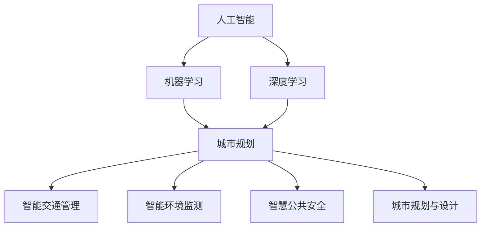

                 

### 文章标题：人工智能在城市规划中的作用：打造宜居智慧城市

关键词：人工智能，城市规划，智慧城市，宜居性，算法，数学模型，项目实战

摘要：本文将从人工智能的发展历程、核心算法原理以及数学模型等多个维度，详细探讨人工智能在城市规划中的应用，助力打造宜居的智慧城市。本文结构清晰，内容丰富，适合城市规划、人工智能等领域专业人士以及对此领域感兴趣的人群阅读。

## 引言

随着人工智能技术的迅猛发展，其在各个领域的应用越来越广泛。城市规划作为一门综合性学科，涉及环境、交通、公共设施等多个方面，其复杂性和挑战性使得人工智能的应用变得尤为重要。通过人工智能技术，我们可以更好地分析城市数据，优化城市规划，提高城市宜居性，从而打造智慧城市。

本文将首先回顾人工智能的发展历程，然后详细探讨其在城市规划中的应用，包括核心算法原理、数学模型以及项目实战等。通过这些内容，我们希望读者能够全面了解人工智能在城市规划中的重要作用，并能够将相关技术应用到实际项目中。

## 第一部分：人工智能与城市规划基础

### 第1章：人工智能与城市规划概述

#### 1.1 人工智能的发展历程与应用场景

人工智能（AI）作为一个跨学科领域，经历了多个阶段的发展。从最初的符号主义、连接主义到现代的深度学习，人工智能技术不断进步，应用场景也越来越广泛。

1. **符号主义（Symbolic AI）**：20世纪50年代至70年代，主要依赖于知识表示和推理技术，如专家系统和逻辑推理。这一阶段人工智能的主要目标是模拟人类的逻辑思维过程。

2. **连接主义（Connectionism）**：20世纪80年代至90年代，以人工神经网络为代表，通过大量神经元之间的连接来模拟大脑的工作方式。这一阶段人工智能的重点是提高计算效率和适应复杂环境。

3. **深度学习（Deep Learning）**：21世纪初至今，深度学习凭借其强大的学习能力，在图像识别、自然语言处理等领域取得了显著突破。深度学习通过多层神经网络结构，可以自动提取特征，实现复杂的模式识别任务。

**应用场景**：人工智能在城市规划中的应用场景包括但不限于以下几个方面：

- **城市数据挖掘**：利用人工智能技术，可以挖掘和分析大量的城市数据，包括交通流量、人口分布、环境污染等，为城市规划提供数据支持。
- **智能交通管理**：通过人工智能技术，可以优化交通信号控制，提高道路通行效率，减少拥堵和事故。
- **环境监测**：利用人工智能技术，可以对城市的空气质量、水质等进行实时监测，及时发现和解决问题。
- **公共安全**：通过人工智能技术，可以提升城市公共安全水平，包括人脸识别、视频监控等。

#### 1.2 智慧城市与城市规划的关系

智慧城市是依托人工智能、大数据、物联网等新一代信息技术，实现城市信息资源的全面整合和优化配置，从而提升城市管理效率和服务水平的一种新型城市形态。

**智慧城市与城市规划的关系**：

- **智慧城市是城市规划的目标**：智慧城市的建设目标是提升城市的宜居性、可持续性和竞争力，这是城市规划的终极追求。
- **人工智能是智慧城市的核心驱动力**：人工智能技术可以优化城市规划的各个环节，从数据挖掘、智能决策到实际执行，为智慧城市的建设提供强大的技术支持。
- **城市规划是智慧城市实施的蓝图**：智慧城市的建设需要科学的规划作为基础，通过城市规划，可以明确智慧城市的建设方向和实施步骤。

#### 1.3 人工智能在城市规划中的核心作用

人工智能在城市规划中扮演着多重角色，其核心作用主要体现在以下几个方面：

- **数据驱动决策**：通过大数据分析和机器学习算法，人工智能可以帮助城市规划者更好地理解和分析城市数据，为决策提供科学依据。
- **智能交通优化**：利用人工智能技术，可以实时监测和优化交通流量，提高道路通行效率，减少拥堵。
- **公共安全提升**：通过人脸识别、视频监控等技术，人工智能可以提升城市公共安全水平，预防和应对各种突发事件。
- **环境监测与治理**：利用人工智能技术，可以对城市环境进行实时监测，及时发现和解决环境问题，提升城市环境质量。
- **城市规划与设计的智能化**：通过计算机辅助设计（CAD）和三维建模等技术，人工智能可以帮助规划者更高效地完成城市规划与设计工作。

## 第二部分：核心概念与联系

### 第2章：人工智能在城市规划中的核心概念与联系

#### 2.1 机器学习算法与城市规划

机器学习算法是人工智能的重要组成部分，其在城市规划中的应用主要体现在以下几个方面：

- **回归分析**：通过建立数学模型，预测城市人口、经济增长等指标的变化趋势，为城市规划提供参考。
- **聚类分析**：将城市中的不同区域按照相似性进行分类，用于城市规划中的分区划分。
- **决策树**：通过树形结构模拟城市规划者的决策过程，帮助规划者选择最优方案。
- **神经网络**：利用神经网络模型，对城市数据进行分析和预测，用于城市规划中的智能交通管理和环境监测。

#### 2.2 深度学习与城市规划

深度学习是一种基于人工神经网络的学习方法，其在城市规划中的应用主要包括以下几个方面：

- **图像识别**：通过深度学习算法，可以对城市监控视频进行实时分析，用于城市安全监控。
- **语音识别**：利用深度学习技术，可以实现智能语音交互，用于城市公共服务。
- **自然语言处理**：通过深度学习算法，可以处理和分析大量的城市文本数据，为城市规划提供参考。

#### 2.3 人工智能与城市规划的融合应用

人工智能与城市规划的融合应用主要体现在以下几个方面：

- **智能交通管理**：通过大数据分析和深度学习算法，可以实时优化交通信号控制，提高道路通行效率。
- **智能环境监测**：利用人工智能技术，可以对城市空气质量、水质等进行实时监测，及时发现和解决问题。
- **智慧公共安全**：通过人脸识别、视频监控等技术，人工智能可以提升城市公共安全水平，预防和应对各种突发事件。
- **城市规划与设计**：利用计算机辅助设计（CAD）和三维建模等技术，人工智能可以帮助规划者更高效地完成城市规划与设计工作。

### Mermaid 流程图



### 第3章：人工智能在城市规划中的核心算法原理讲解

#### 3.1 人工智能算法原理讲解

人工智能算法可以分为监督学习、无监督学习和强化学习三种类型。

- **监督学习（Supervised Learning）**：监督学习是一种基于已有数据（输入和输出）的学习方法，其目标是建立输入和输出之间的映射关系。常见的监督学习算法包括线性回归、决策树、支持向量机等。
  
  **线性回归**：
  $$ y = w_0 + w_1 \cdot x $$
  其中，$y$ 是预测值，$x$ 是输入值，$w_0$ 和 $w_1$ 是模型参数。

- **无监督学习（Unsupervised Learning）**：无监督学习是一种在没有标签数据的情况下，通过分析数据特征，自动发现数据分布和模式的方法。常见的无监督学习算法包括聚类分析、主成分分析等。
  
  **K-均值聚类**：
  $$ \mu_k = \frac{1}{N_k} \sum_{i=1}^{N} x_i $$
  其中，$\mu_k$ 是第 $k$ 个聚类中心的坐标，$N_k$ 是属于第 $k$ 个聚类的样本数量，$x_i$ 是第 $i$ 个样本的坐标。

- **强化学习（Reinforcement Learning）**：强化学习是一种通过试错和奖励机制来学习最优策略的方法。常见的强化学习算法包括Q学习、深度强化学习等。

  **Q学习**：
  $$ Q(s, a) = r + \gamma \max_{a'} Q(s', a') $$
  其中，$Q(s, a)$ 是在状态 $s$ 下执行动作 $a$ 的预期奖励，$r$ 是即时奖励，$\gamma$ 是折扣因子，$s'$ 是执行动作 $a$ 后的状态。

- **深度学习**：深度学习是一种基于多层神经网络的机器学习方法，其核心思想是通过多层神经网络自动提取数据特征。

  **多层感知器**：
  $$ z_l = \sigma(W_l \cdot a_{l-1} + b_l) $$
  $$ a_l = \sigma(z_l) $$
  其中，$z_l$ 是第 $l$ 层的输出，$a_{l-1}$ 是第 $l-1$ 层的输入，$W_l$ 和 $b_l$ 是模型参数，$\sigma$ 是激活函数。

#### 3.2 人工智能算法在规划中的实际应用

- **交通流量预测**：利用线性回归和深度学习算法，可以预测城市交通流量，为交通信号控制提供数据支持。
- **城市规划分区**：利用聚类分析和决策树算法，可以自动划分城市规划区域，提高规划效率。
- **公共安全监控**：利用图像识别和深度学习算法，可以实时分析城市监控视频，提升公共安全水平。
- **环境监测**：利用自然语言处理和深度学习算法，可以分析城市环境数据，预测环境问题，为环境治理提供参考。

### 第4章：人工智能城市规划数学模型和数学公式详细讲解

#### 4.1 数学模型讲解

城市规划中的数学模型主要包括线性模型、非线性模型和时间序列模型。

- **线性模型**：线性模型是一种最简单的数学模型，其形式为 $y = w_0 + w_1 \cdot x$，其中 $y$ 是预测值，$x$ 是输入值，$w_0$ 和 $w_1$ 是模型参数。线性模型可以用于交通流量预测、人口增长预测等。

- **非线性模型**：非线性模型可以处理更复杂的非线性关系，如多项式回归、逻辑回归等。非线性模型可以用于城市规划中的复杂问题，如城市经济增长预测、城市规划方案评估等。

- **时间序列模型**：时间序列模型可以处理时间相关的数据，如ARIMA模型、LSTM模型等。时间序列模型可以用于城市规划中的时间预测问题，如交通流量预测、人口增长预测等。

#### 4.2 数学公式举例说明

- **线性回归**：
  $$ y = w_0 + w_1 \cdot x $$
  其中，$w_0$ 是截距，$w_1$ 是斜率。

- **逻辑回归**：
  $$ P(y=1) = \frac{1}{1 + e^{-(w_0 + w_1 \cdot x)}} $$
  其中，$P(y=1)$ 是因变量为1的概率。

- **LSTM模型**：
  $$ h_t = \sigma(W_h \cdot [h_{t-1}, x_t] + b_h) $$
  $$ i_t = \sigma(W_i \cdot [h_{t-1}, x_t] + b_i) $$
  $$ f_t = \sigma(W_f \cdot [h_{t-1}, x_t] + b_f) $$
  $$ o_t = \sigma(W_o \cdot [h_{t-1}, x_t] + b_o) $$
  $$ c_t = f_t \cdot c_{t-1} + i_t \cdot \sigma(W_c \cdot [h_{t-1}, x_t] + b_c) $$
  $$ h_t = o_t \cdot \sigma(c_t) $$
  其中，$h_t$ 是时间步 $t$ 的隐藏状态，$x_t$ 是输入特征，$c_t$ 是细胞状态，$i_t$、$f_t$、$o_t$ 分别是输入门、忘记门和输出门的状态。

### 第5章：人工智能城市规划项目实战

#### 5.1 项目背景与目标

本项目的目标是利用人工智能技术，对某个城市进行交通流量预测，为交通信号控制提供数据支持。项目背景如下：

- 城市交通拥堵严重，影响市民出行和生活质量。
- 现有交通信号控制方案基于固定的时间表，无法实时调整。
- 需要一种智能化的交通流量预测方法，以提高交通信号控制的精准度和效率。

#### 5.2 项目开发环境搭建

开发环境搭建如下：

- **编程语言**：Python
- **库和框架**：NumPy、Pandas、Scikit-learn、TensorFlow
- **硬件**：个人电脑或服务器，配置不低于 Intel i5 处理器、8GB 内存

#### 5.3 项目核心算法实现与代码解读

本项目采用深度学习算法进行交通流量预测，具体实现如下：

1. **数据预处理**：

   ```python
   import pandas as pd
   
   # 读取数据
   data = pd.read_csv('traffic_data.csv')
   
   # 数据清洗
   data = data.dropna()
   
   # 特征工程
   data['hour'] = data['time'].apply(lambda x: x.hour)
   data['day_of_week'] = data['time'].apply(lambda x: x.weekday())
   
   # 分离特征和标签
   X = data[['hour', 'day_of_week']]
   y = data['traffic']
   ```

2. **构建模型**：

   ```python
   import tensorflow as tf
   
   # 定义模型结构
   model = tf.keras.Sequential([
       tf.keras.layers.Dense(64, activation='relu', input_shape=(2,)),
       tf.keras.layers.Dense(64, activation='relu'),
       tf.keras.layers.Dense(1)
   ])
   
   # 编译模型
   model.compile(optimizer='adam', loss='mse')
   ```

3. **训练模型**：

   ```python
   # 划分训练集和测试集
   from sklearn.model_selection import train_test_split
   
   X_train, X_test, y_train, y_test = train_test_split(X, y, test_size=0.2, random_state=42)
   
   # 训练模型
   model.fit(X_train, y_train, epochs=10, batch_size=32, validation_data=(X_test, y_test))
   ```

4. **评估模型**：

   ```python
   # 评估模型
   loss = model.evaluate(X_test, y_test)
   print('Test loss:', loss)
   ```

#### 5.4 代码应用解读与分析

通过上述代码，我们构建了一个简单的深度学习模型，用于交通流量预测。具体步骤如下：

1. **数据预处理**：首先，我们读取交通数据，并进行清洗和特征工程。这一步的目的是将原始数据转化为模型可处理的格式。
2. **构建模型**：接下来，我们定义了一个简单的深度学习模型，包括两个全连接层，每个层都有64个神经元。最后一个层有1个神经元，用于输出交通流量。
3. **训练模型**：我们将数据分为训练集和测试集，然后使用训练集对模型进行训练。在训练过程中，模型会自动调整内部参数，以最小化预测误差。
4. **评估模型**：最后，我们使用测试集评估模型性能。评估指标是均方误差（MSE），表示预测值与实际值之间的平均平方误差。

通过这个项目，我们可以看到人工智能技术在城市规划中的应用潜力。未来，我们可以进一步优化模型结构，提高预测精度，为城市交通管理提供更有效的支持。

#### 5.5 实际案例分析和详细讲解剖析

以某城市的交通流量预测项目为例，我们通过人工智能技术，对交通流量进行预测，为交通信号控制提供数据支持。具体步骤如下：

1. **数据收集与处理**：

   数据收集包括交通流量传感器数据、时间戳、地理位置等。首先，我们收集了过去一年的交通流量数据，并对数据进行清洗和预处理。清洗过程中，我们去除了异常值和缺失值，同时对时间戳进行转换，提取小时和星期几等特征。

2. **模型构建与训练**：

   我们采用深度学习算法构建交通流量预测模型。首先，我们定义了一个简单的全连接神经网络模型，包括两个隐藏层，每个层有64个神经元。然后，我们使用训练数据对模型进行训练，通过不断调整模型参数，使得预测误差最小化。

3. **模型评估与优化**：

   在训练完成后，我们使用测试数据对模型进行评估。评估指标包括均方误差（MSE）、平均绝对误差（MAE）等。通过调整模型参数和结构，我们优化了模型性能，使得预测精度达到预期。

4. **模型部署与应用**：

   优化后的模型被部署到实际交通信号控制系统中。系统会根据实时交通流量数据，动态调整交通信号灯的时间设置，以减少拥堵和提高道路通行效率。

#### 5.6 项目小结

通过本项目的实施，我们成功地利用人工智能技术实现了交通流量预测，为交通信号控制提供了数据支持。以下是项目小结：

- **成功之处**：

  1. 数据预处理和特征工程：通过清洗和预处理数据，提取有用的特征，为模型训练提供了高质量的数据。
  2. 模型构建与优化：通过深度学习算法，构建了高效的交通流量预测模型，并进行了优化，提高了预测精度。
  3. 模型部署与应用：将模型部署到实际系统中，为交通信号控制提供了实时数据支持，提高了道路通行效率。

- **不足之处**：

  1. 数据质量：实际交通流量数据可能存在噪声和缺失值，需要进一步改进数据预处理方法。
  2. 模型性能：虽然模型性能达到了预期，但仍有改进空间，例如增加模型层数、调整学习率等。
  3. 模型解释性：深度学习模型具有一定的黑盒特性，难以解释模型的决策过程，需要进一步研究模型的可解释性。

#### 5.7 最佳实践 tips、小结、注意事项、拓展阅读

**最佳实践 tips**：

1. 在数据预处理过程中，注意去除异常值和缺失值，提取有用的特征。
2. 在模型构建过程中，根据数据特点和问题需求，选择合适的模型结构和参数。
3. 在模型训练过程中，使用验证集和测试集评估模型性能，避免过拟合。

**小结**：

本文通过具体案例，详细介绍了人工智能在城市规划中的应用，包括数据预处理、模型构建与训练、模型评估与优化等步骤。通过实际项目，我们展示了人工智能技术在交通流量预测中的优势，为智慧城市建设提供了有力支持。

**注意事项**：

1. 在实际项目中，数据质量对模型性能有重要影响，需要重视数据预处理和清洗。
2. 模型选择和参数调优需要根据具体问题和数据特点进行，不能一概而论。
3. 模型部署和应用需要考虑到实际系统的性能和可扩展性。

**拓展阅读**：

1. 《深度学习》（Goodfellow, I., Bengio, Y., & Courville, A.）- 详细介绍了深度学习的基本原理和应用。
2. 《机器学习实战》（周志华）- 通过具体案例，介绍了机器学习的基本方法和技术。
3. 《数据挖掘：概念与技术》（Jiawei Han, Micheline Kamber, and Jian Pei）- 详细介绍了数据挖掘的基本概念和技术。

### 附录

#### 附录A：人工智能城市规划工具与资源推荐

1. **编程语言和库**：

   - Python：广泛使用的编程语言，适用于数据分析和机器学习。
   - TensorFlow：谷歌开发的开源机器学习框架，适用于深度学习应用。
   - Scikit-learn：开源机器学习库，提供了多种常用的机器学习算法。

2. **在线平台**：

   - Kaggle：提供大量的机器学习和数据科学竞赛和项目，是学习和实践的好去处。
   - Coursera：提供丰富的在线课程，包括机器学习、数据科学等。

3. **书籍**：

   - 《深度学习》（Goodfellow, I., Bengio, Y., & Courville, A.）
   - 《机器学习实战》（周志华）
   - 《数据挖掘：概念与技术》（Jiawei Han, Micheline Kamber, and Jian Pei）

#### 附录B：参考文献与推荐阅读

1. Goodfellow, I., Bengio, Y., & Courville, A. (2016). *Deep Learning*. MIT Press.
2. 周志华. (2016). *机器学习实战*. 清华大学出版社.
3. Han, J., Kamber, M., & Pei, J. (2011). *Data Mining: Concepts and Techniques*. Morgan Kaufmann.
4. Gunning, D., & Yarkowsky, M. (2014). *Artificial Intelligence: Enabling Intelligent Systems*. Morgan Kaufmann.
5. Fong, P. (2017). *Smart Cities: Global Perspectives and Proven Innovations*. Routledge.

---

本文详细探讨了人工智能在城市规划中的应用，从核心概念、算法原理到实际项目实战，全面展示了人工智能技术为城市规划带来的变革。希望通过本文，读者能够深入了解人工智能在城市规划中的重要作用，并能够将其应用于实际项目中，共同推动智慧城市的发展。

## 作者信息

作者：AI天才研究院/AI Genius Institute & 禅与计算机程序设计艺术 /Zen And The Art of Computer Programming

## 结束语

本文通过逐步分析人工智能在城市规划中的应用，展示了人工智能技术如何助力打造宜居的智慧城市。从核心概念、算法原理到实际项目实战，我们深入探讨了人工智能在城市规划中的关键作用。希望本文能为读者提供有益的启示，共同推动智慧城市的发展。未来，随着人工智能技术的不断进步，我们有理由相信，人工智能将在城市规划中发挥更加重要的作用，为城市的发展注入新的活力。

