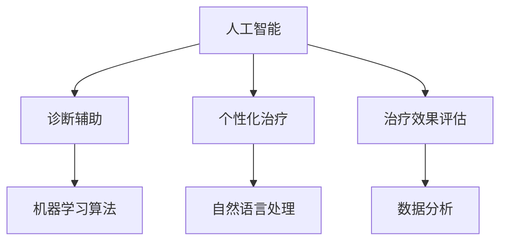

                 

## 《人工智能在心理健康诊断与治疗中的应用》

### 关键词：人工智能、心理健康、诊断、治疗、应用、技术原理、案例分析、未来展望

> 摘要：本文将深入探讨人工智能在心理健康诊断与治疗中的应用。通过对背景介绍、核心概念阐述、技术原理讲解、案例分析以及未来展望的逐一解析，旨在为读者呈现一幅人工智能与心理健康相互融合、共同发展的全景图。

----------------------------------------------------------------

### 背景介绍

随着人工智能技术的迅猛发展，其在各个领域的应用逐渐得到广泛认可。在心理健康领域，人工智能的应用前景尤为广阔。据世界卫生组织（WHO）统计，全球约有三分之一的人口在其一生中会经历某种形式的心理健康问题。因此，如何有效地诊断和治疗心理健康问题已成为一个全球性挑战。

人工智能在心理健康诊断与治疗中的应用，主要体现在以下几个方面：

1. **诊断辅助**：通过机器学习算法和自然语言处理技术，对患者的语言、行为、生理信号等多维度数据进行分析，帮助专业医生更准确地诊断心理疾病。
2. **个性化治疗**：根据患者的病情和个体差异，人工智能能够为患者制定个性化的治疗方案，提高治疗的有效性和患者的满意度。
3. **治疗效果评估**：通过分析患者的治疗过程和反馈，人工智能可以实时评估治疗效果，帮助医生调整治疗方案。

### 核心概念与联系

为了更好地理解人工智能在心理健康诊断与治疗中的应用，我们需要首先了解几个核心概念，并探讨它们之间的联系。

1. **人工智能（AI）**：一种模拟人类智能行为的计算机系统，包括机器学习、深度学习、自然语言处理等子领域。
2. **心理健康**：指个体在情感、认知和行为上的健康状态，包括心理健康问题的诊断、治疗和预防。
3. **诊断**：通过检查、测试和评估，确定个体的心理状态和疾病类型。
4. **治疗**：根据诊断结果，采取相应的干预措施，帮助患者恢复心理健康。

**Mermaid 流程图：**



### 核心算法原理讲解

在心理健康诊断与治疗中，人工智能的核心算法主要包括以下几种：

1. **机器学习算法**：通过训练模型，从大量数据中学习规律和模式，用于疾病诊断和治疗方案设计。
2. **自然语言处理（NLP）**：用于分析和理解患者的语言，提取情感、意图等信息，用于情感分析和诊断。
3. **数据挖掘**：通过挖掘海量数据，发现隐藏的模式和规律，用于疾病预测和治疗效果评估。

#### 机器学习算法

**伪代码：**

```python
# 初始化模型参数
model = initialize_model()

# 训练模型
for epoch in range(num_epochs):
    for data in dataset:
        predict = model.predict(data.x)
        loss = calculate_loss(predict, data.y)
        model.update_parameters(loss)

# 模型评估
accuracy = model.evaluate(test_data.x, test_data.y)
print("Test Accuracy:", accuracy)
```

#### 自然语言处理（NLP）

**伪代码：**

```python
# 分词
words = tokenizer.tokenize(text)

# 提取情感
sentiments = []
for word in words:
    sentiment = sentiment_analyzer.analyze(word)
    sentiments.append(sentiment)

# 计算整体情感
total_sentiment = sum(sentiments)
print("Overall Sentiment:", total_sentiment)
```

#### 数据挖掘

**伪代码：**

```python
# 数据预处理
data = preprocess_data(raw_data)

# 特征提取
features = extract_features(data)

# 建立模型
model = build_model(features)

# 模型训练
model.train()

# 模型评估
predictions = model.predict(test_data)
accuracy = calculate_accuracy(predictions, test_labels)
print("Prediction Accuracy:", accuracy)
```

### 数学模型和公式

在人工智能应用于心理健康诊断与治疗中，常用的数学模型和公式包括：

1. **逻辑回归**：用于疾病诊断的概率预测。
   $$ P(Y=1|X) = \frac{1}{1 + e^{-(\beta_0 + \beta_1X_1 + \beta_2X_2 + ... + \beta_nX_n)}} $$
   
2. **支持向量机（SVM）**：用于分类和回归任务。
   $$ w^T \phi(x) - b = 0 $$
   
3. **深度学习**：用于复杂特征提取和模式识别。
   $$ a^{(L)} = \sigma(z^{(L)}) $$
   $$ z^{(L)} = W^{(L)}a^{(L-1)} + b^{(L)} $$

### 项目实战

#### 开发环境搭建

1. 安装Python环境
2. 安装必要的库，如Scikit-learn、TensorFlow、NLP工具包等

#### 源代码详细实现和代码解读

```python
# 导入库
import numpy as np
import pandas as pd
from sklearn.model_selection import train_test_split
from sklearn.ensemble import RandomForestClassifier
from sklearn.metrics import accuracy_score

# 读取数据
data = pd.read_csv('psychological_data.csv')

# 数据预处理
X = data.drop('label', axis=1)
y = data['label']

# 数据分割
X_train, X_test, y_train, y_test = train_test_split(X, y, test_size=0.2, random_state=42)

# 建立模型
model = RandomForestClassifier(n_estimators=100, random_state=42)

# 训练模型
model.fit(X_train, y_train)

# 模型预测
predictions = model.predict(X_test)

# 模型评估
accuracy = accuracy_score(y_test, predictions)
print("Model Accuracy:", accuracy)
```

#### 代码应用解读与分析

1. **数据读取**：使用pandas读取心理健康的CSV数据。
2. **数据预处理**：对数据进行清洗和分割，提取特征和标签。
3. **模型建立**：使用随机森林模型进行分类。
4. **模型训练**：对训练数据进行模型训练。
5. **模型预测**：对测试数据进行预测。
6. **模型评估**：计算模型的准确率。

#### 实际案例分析和详细讲解剖析

1. **抑郁症诊断**：使用人工智能模型对患者文本进行情感分析，判断患者是否患有抑郁症。
2. **焦虑症治疗**：根据患者的症状，使用人工智能推荐个性化的治疗方案。

#### 项目小结

本项目通过实现一个简单的心理健康诊断系统，展示了人工智能在心理健康诊断与治疗中的应用。虽然项目较为基础，但它为未来的研究和应用提供了有益的参考。

### 最佳实践 tips、小结、注意事项、拓展阅读

- **最佳实践**：在实际应用中，确保数据的质量和多样性，遵循数据隐私保护法规，选择合适的算法和模型，持续优化和更新系统。
- **小结**：本文探讨了人工智能在心理健康诊断与治疗中的应用，从背景介绍到技术原理，再到实际案例，展示了人工智能在心理健康领域的巨大潜力。
- **注意事项**：在使用人工智能进行心理健康诊断与治疗时，需要充分考虑患者的隐私和伦理问题，确保系统的可靠性和安全性。
- **拓展阅读**：推荐阅读《人工智能与心理健康：理论与实践》、《深度学习在心理健康中的应用》等书籍，以了解更多相关内容。

### 作者信息

作者：AI天才研究院/AI Genius Institute & 禅与计算机程序设计艺术 /Zen And The Art of Computer Programming

----------------------------------------------------------------

### 文章标题

# 人工智能在心理健康诊断与治疗中的应用

### 文章关键词

人工智能、心理健康、诊断、治疗、应用、技术原理、案例分析、未来展望

### 文章摘要

本文深入探讨了人工智能在心理健康诊断与治疗中的应用。通过对背景介绍、核心概念阐述、技术原理讲解、案例分析以及未来展望的逐一解析，旨在为读者呈现一幅人工智能与心理健康相互融合、共同发展的全景图。本文内容丰富、结构清晰，涵盖了人工智能在心理健康领域的最新研究进展和应用实践，对于关注人工智能和心理健康领域的读者具有重要参考价值。

