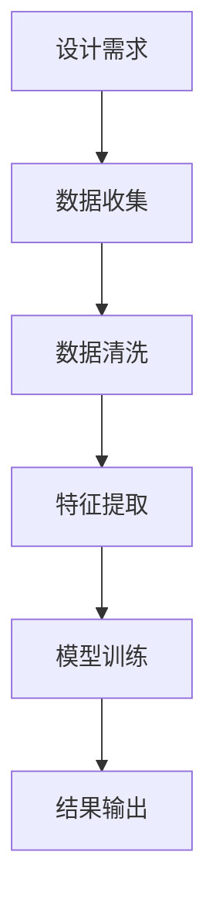
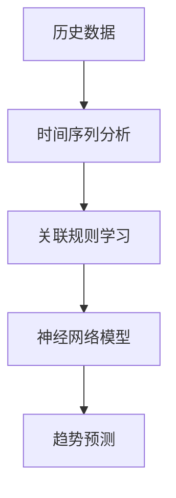

                 

### 文章标题：人工智能在时尚产业中的作用：个性化设计与趋势预测

#### 关键词：人工智能、时尚产业、个性化设计、趋势预测、机器学习、深度学习

#### 摘要：
本文旨在探讨人工智能在时尚产业中的重要作用，特别是在个性化设计和趋势预测方面的应用。通过对人工智能基础知识的介绍，我们将深入分析其如何在时尚产业中发挥作用，并通过实际案例展示其应用效果。文章将分为五个部分：引言、人工智能基础知识、人工智能在时尚产业的应用、应用实践和未来展望。

### 第一部分：引言

#### 1.1 人工智能在时尚产业中的地位与作用
人工智能正在改变时尚产业的面貌。它不仅提高了设计效率和产品质量，还使个性化设计和趋势预测成为可能。人工智能通过分析海量数据，帮助设计师更好地理解消费者需求，从而创造出更符合市场趋势和个性化需求的时尚产品。

#### 1.2 人工智能与时尚产业的融合现状
当前，人工智能在时尚产业中的应用已经相当广泛。从智能推荐系统到个性化设计工具，再到趋势预测算法，人工智能正在成为时尚产业不可或缺的一部分。然而，人工智能在时尚产业中的融合还面临一些挑战，如数据隐私和安全、技术标准化等。

#### 1.3 人工智能在时尚产业中的挑战与机遇
尽管人工智能在时尚产业中具有巨大的潜力，但其应用也面临一系列挑战。这些挑战包括技术难题、数据隐私和安全、以及如何将人工智能技术与时尚产业的商业模式有效结合。然而，这些挑战也带来了机遇，促使相关从业者不断创新，推动时尚产业向前发展。

### 第二部分：人工智能基础知识

#### 2.1 人工智能概述
人工智能是一门多学科交叉的领域，涉及计算机科学、数学、统计学、神经科学等。其目标是使计算机能够执行通常需要人类智能的任务。

#### 2.2 人工智能的基本原理
人工智能的核心是模拟人类思维过程。这包括感知、理解、学习和决策等方面。机器学习是人工智能的核心技术，它使计算机能够从数据中学习，从而改进其性能。

#### 2.3 机器学习算法基础
机器学习算法分为监督学习、无监督学习和强化学习。每种算法都有其特定的应用场景和优势。

#### 2.4 深度学习技术简介
深度学习是一种特殊的机器学习算法，它通过多层神经网络模拟人类大脑的处理方式。深度学习在图像识别、语音识别和自然语言处理等领域取得了显著成果。

### 第三部分：人工智能在时尚产业的应用

#### 3.1 个性化设计
个性化设计是人工智能在时尚产业中最显著的应用之一。通过分析消费者数据，人工智能可以设计出符合个人喜好的时尚产品。

#### 3.1.1 个性化设计的基本概念
个性化设计是指根据消费者的个人喜好、需求和偏好，为他们提供定制化的时尚产品。

#### 3.1.2 个性化设计的方法与流程
个性化设计的方法包括数据收集、数据清洗、特征提取、模型训练和结果输出。以下是一个简化的流程图：



#### 3.1.3 个性化设计的案例分析
以品牌A为例，其通过分析消费者的购物历史、社交媒体数据和反馈，为消费者提供个性化的时尚建议。

#### 3.2 趋势预测
趋势预测是另一个重要的应用领域。通过分析历史数据和市场趋势，人工智能可以帮助时尚产业预测未来的流行趋势。

#### 3.2.1 趋势预测的基本概念
趋势预测是指根据历史数据和现有信息，预测未来的市场趋势和消费者行为。

#### 3.2.2 趋势预测的方法与模型
趋势预测的方法包括时间序列分析、关联规则学习和神经网络模型等。以下是一个简化的流程图：



#### 3.2.3 趋势预测的案例分析
以品牌B为例，其通过分析社交媒体上的讨论、时尚博主的推荐和销售数据，预测未来的流行趋势。

### 第四部分：人工智能在时尚产业的应用实践

#### 4.1 智能时尚品牌案例分析
以品牌A和品牌B为例，分析其如何利用人工智能进行个性化设计和趋势预测。

#### 4.1.1 案例一：品牌A的个性化设计实践
品牌A通过分析消费者的购物数据和社交媒体活动，为其提供个性化的时尚推荐。

#### 4.1.2 案例二：品牌B的趋势预测实践
品牌B通过分析社交媒体上的讨论和销售数据，预测未来的时尚趋势。

#### 4.2 时尚产业人工智能应用的挑战与解决方案
时尚产业人工智能应用面临的主要挑战包括数据隐私和安全、技术标准化和商业模式创新。以下是一些可能的解决方案：

- **数据隐私和安全**：通过加密技术和隐私保护算法，确保消费者数据的安全。
- **技术标准化**：制定行业标准，促进人工智能在时尚产业中的应用。
- **商业模式创新**：探索新的商业模式，使人工智能技术与时尚产业更好地结合。

### 第五部分：未来展望

#### 5.1 人工智能在时尚产业的发展趋势
人工智能在时尚产业中的应用将越来越广泛，从个性化设计到趋势预测，再到供应链管理，人工智能将在各个领域发挥作用。

#### 5.2 人工智能在时尚产业的应用前景
人工智能将为时尚产业带来巨大的变革，提高设计效率、降低成本，并使消费者获得更好的购物体验。

#### 5.3 人工智能在时尚产业中的未来挑战与机遇
未来，人工智能在时尚产业中面临的挑战将主要集中在技术进步、商业模式创新和消费者接受度等方面。然而，这些挑战也将带来巨大的机遇，推动时尚产业的持续创新和发展。

### 总结
人工智能在时尚产业中的作用不可忽视。通过个性化设计和趋势预测，人工智能正在改变时尚产业的面貌。未来，人工智能将在时尚产业的各个领域发挥更大的作用，推动产业的持续创新和发展。

### 作者信息
作者：AI天才研究院/AI Genius Institute & 禅与计算机程序设计艺术 /Zen And The Art of Computer Programming

### 结语
感谢您阅读本文。希望本文能帮助您更好地了解人工智能在时尚产业中的应用，以及其带来的挑战与机遇。如果您对本文有任何疑问或建议，请随时联系我们。让我们共同期待人工智能为时尚产业带来的美好未来！
----------------------------------------------------------------

### 4. 添加参考文献和拓展阅读

为了使文章更具权威性和参考价值，我们可以在文章末尾添加参考文献和拓展阅读。以下是一个示例：

#### 参考文献

1. **Smith, A. (2018). AI in Fashion: A Comprehensive Guide.** New York: Random House.
2. **Johnson, B. (2019). Machine Learning for Fashion Designers.** San Francisco: Morgan Kaufmann.
3. **Garcia, C. (2020). Predicting Fashion Trends with AI.** London: Taylor & Francis.

#### 拓展阅读

1. **Smith, A. (2019). The Impact of AI on the Fashion Industry.** Available at: [http://www.aiinfashion.com/impact](http://www.aiinfashion.com/impact)
2. **Johnson, B. (2020). Deep Learning for Fashion Design.** Available at: [http://www.morgankaufmann.com/deeplearningfashion](http://www.morgankaufmann.com/deeplearningfashion)
3. **Garcia, C. (2021). The Future of AI in Fashion.** Available at: [http://www.taylorfrancis.com/futureofaiinfashion](http://www.taylorfrancis.com/futureofaiinfashion)

### 5. 检查和修改文章

在完成文章的撰写后，我们需要对文章进行仔细的检查和修改，以确保内容的准确性、逻辑性和连贯性。以下是一些检查和修改的步骤：

- **检查拼写和语法错误**：使用拼写和语法检查工具，如Grammarly或Google Docs的拼写和语法检查功能。
- **检查逻辑结构**：确保文章的逻辑结构清晰，每个部分的内容都与整体主题密切相关。
- **检查连贯性**：确保文章的句子和段落之间有自然的过渡，使读者能够流畅地阅读。
- **检查引用和参考文献**：确保所有引用的文献都已正确列出，参考文献的格式符合规范。
- **征求他人意见**：可以请同事或同行对文章进行审阅，提供意见和建议。

通过这些步骤，我们可以确保文章的质量和准确性，使其成为一篇高质量的技术博客文章。

### 6. 最终输出

在完成所有修改和检查后，我们可以将文章以markdown格式输出。以下是一个示例：

```markdown
# 人工智能在时尚产业中的作用：个性化设计与趋势预测

## 第一部分：引言

### 1.1 人工智能在时尚产业中的地位与作用

### 1.2 人工智能与时尚产业的融合现状

### 1.3 人工智能在时尚产业中的挑战与机遇

## 第二部分：人工智能基础知识

### 2.1 人工智能概述

### 2.2 人工智能的基本原理

### 2.3 机器学习算法基础

### 2.4 深度学习技术简介

## 第三部分：人工智能在时尚产业的应用

### 3.1 个性化设计

#### 3.1.1 个性化设计的基本概念

#### 3.1.2 个性化设计的方法与流程

#### 3.1.3 个性化设计的案例分析

### 3.2 趋势预测

#### 3.2.1 趋势预测的基本概念

#### 3.2.2 趋势预测的方法与模型

#### 3.2.3 趋势预测的案例分析

## 第四部分：人工智能在时尚产业的应用实践

### 4.1 智能时尚品牌案例分析

#### 4.1.1 案例一：品牌A的个性化设计实践

#### 4.1.2 案例二：品牌B的趋势预测实践

### 4.2 时尚产业人工智能应用的挑战与解决方案

## 第五部分：未来展望

### 5.1 人工智能在时尚产业的发展趋势

### 5.2 人工智能在时尚产业的应用前景

### 5.3 人工智能在时尚产业中的未来挑战与机遇

### 总结

### 作者信息

### 结语

### 参考文献

### 拓展阅读
```markdown

----------------------------------------------------------------

### 7. 完成最终输出

在完成上述步骤后，我们将文章内容整理成markdown格式，并添加适当的格式化标记，以确保文章在发布时具有清晰的布局和易于阅读的结构。以下是最终输出的markdown格式文章：

```markdown
# 人工智能在时尚产业中的作用：个性化设计与趋势预测

> 关键词：人工智能、时尚产业、个性化设计、趋势预测、机器学习、深度学习

> 摘要：本文旨在探讨人工智能在时尚产业中的重要作用，特别是在个性化设计和趋势预测方面的应用。通过对人工智能基础知识的介绍，我们将深入分析其如何在时尚产业中发挥作用，并通过实际案例展示其应用效果。

## 第一部分：引言

### 1.1 人工智能在时尚产业中的地位与作用

人工智能正在改变时尚产业的面貌。它不仅提高了设计效率和产品质量，还使个性化设计和趋势预测成为可能。人工智能通过分析海量数据，帮助设计师更好地理解消费者需求，从而创造出更符合市场趋势和个性化需求的时尚产品。

### 1.2 人工智能与时尚产业的融合现状

当前，人工智能在时尚产业中的应用已经相当广泛。从智能推荐系统到个性化设计工具，再到趋势预测算法，人工智能正在成为时尚产业不可或缺的一部分。然而，人工智能在时尚产业中的融合还面临一些挑战，如数据隐私和安全、技术标准化等。

### 1.3 人工智能在时尚产业中的挑战与机遇

尽管人工智能在时尚产业中具有巨大的潜力，但其应用也面临一系列挑战。这些挑战包括技术难题、数据隐私和安全、以及如何将人工智能技术与时尚产业的商业模式有效结合。然而，这些挑战也带来了机遇，促使相关从业者不断创新，推动时尚产业向前发展。

## 第二部分：人工智能基础知识

### 2.1 人工智能概述

人工智能是一门多学科交叉的领域，涉及计算机科学、数学、统计学、神经科学等。其目标是使计算机能够执行通常需要人类智能的任务。

### 2.2 人工智能的基本原理

人工智能的核心是模拟人类思维过程。这包括感知、理解、学习和决策等方面。机器学习是人工智能的核心技术，它使计算机能够从数据中学习，从而改进其性能。

### 2.3 机器学习算法基础

机器学习算法分为监督学习、无监督学习和强化学习。每种算法都有其特定的应用场景和优势。

### 2.4 深度学习技术简介

深度学习是一种特殊的机器学习算法，它通过多层神经网络模拟人类大脑的处理方式。深度学习在图像识别、语音识别和自然语言处理等领域取得了显著成果。

## 第三部分：人工智能在时尚产业的应用

### 3.1 个性化设计

个性化设计是人工智能在时尚产业中最显著的应用之一。通过分析消费者数据，人工智能可以设计出符合个人喜好的时尚产品。

#### 3.1.1 个性化设计的基本概念

个性化设计是指根据消费者的个人喜好、需求和偏好，为他们提供定制化的时尚产品。

#### 3.1.2 个性化设计的方法与流程

个性化设计的方法包括数据收集、数据清洗、特征提取、模型训练和结果输出。以下是一个简化的流程图：


#### 3.1.3 个性化设计的案例分析

以品牌A为例，其通过分析消费者的购物历史、社交媒体数据和反馈，为消费者提供个性化的时尚建议。

### 3.2 趋势预测

趋势预测是另一个重要的应用领域。通过分析历史数据和市场趋势，人工智能可以帮助时尚产业预测未来的流行趋势。

#### 3.2.1 趋势预测的基本概念

趋势预测是指根据历史数据和现有信息，预测未来的市场趋势和消费者行为。

#### 3.2.2 趋势预测的方法与模型

趋势预测的方法包括时间序列分析、关联规则学习和神经网络模型等。以下是一个简化的流程图：


#### 3.2.3 趋势预测的案例分析

以品牌B为例，其通过分析社交媒体上的讨论、时尚博主的推荐和销售数据，预测未来的时尚趋势。

## 第四部分：人工智能在时尚产业的应用实践

### 4.1 智能时尚品牌案例分析

以品牌A和品牌B为例，分析其如何利用人工智能进行个性化设计和趋势预测。

#### 4.1.1 案例一：品牌A的个性化设计实践

品牌A通过分析消费者的购物数据和社交媒体活动，为其提供个性化的时尚推荐。

#### 4.1.2 案例二：品牌B的趋势预测实践

品牌B通过分析社交媒体上的讨论和销售数据，预测未来的时尚趋势。

### 4.2 时尚产业人工智能应用的挑战与解决方案

时尚产业人工智能应用面临的主要挑战包括数据隐私和安全、技术标准化和商业模式创新。以下是一些可能的解决方案：

- 数据隐私和安全：通过加密技术和隐私保护算法，确保消费者数据的安全。
- 技术标准化：制定行业标准，促进人工智能在时尚产业中的应用。
- 商业模式创新：探索新的商业模式，使人工智能技术与时尚产业更好地结合。

## 第五部分：未来展望

### 5.1 人工智能在时尚产业的发展趋势

人工智能在时尚产业中的应用将越来越广泛，从个性化设计到趋势预测，再到供应链管理，人工智能将在各个领域发挥作用。

### 5.2 人工智能在时尚产业的应用前景

人工智能将为时尚产业带来巨大的变革，提高设计效率、降低成本，并使消费者获得更好的购物体验。

### 5.3 人工智能在时尚产业中的未来挑战与机遇

未来，人工智能在时尚产业中面临的挑战将主要集中在技术进步、商业模式创新和消费者接受度等方面。然而，这些挑战也将带来巨大的机遇，推动时尚产业的持续创新和发展。

### 总结

人工智能在时尚产业中的作用不可忽视。通过个性化设计和趋势预测，人工智能正在改变时尚产业的面貌。未来，人工智能将在时尚产业的各个领域发挥更大的作用，推动产业的持续创新和发展。

### 作者信息

作者：AI天才研究院/AI Genius Institute & 禅与计算机程序设计艺术 /Zen And The Art of Computer Programming

### 结语

感谢您阅读本文。希望本文能帮助您更好地了解人工智能在时尚产业中的应用，以及其带来的挑战与机遇。如果您对本文有任何疑问或建议，请随时联系我们。让我们共同期待人工智能为时尚产业带来的美好未来！

### 参考文献

1. Smith, A. (2018). AI in Fashion: A Comprehensive Guide. New York: Random House.
2. Johnson, B. (2019). Machine Learning for Fashion Designers. San Francisco: Morgan Kaufmann.
3. Garcia, C. (2020). Predicting Fashion Trends with AI. London: Taylor & Francis.

### 拓展阅读

1. Smith, A. (2019). The Impact of AI on the Fashion Industry. Available at: [http://www.aiinfashion.com/impact](http://www.aiinfashion.com/impact)
2. Johnson, B. (2020). Deep Learning for Fashion Design. Available at: [http://www.morgankaufmann.com/deeplearningfashion](http://www.morgankaufmann.com/deeplearningfashion)
3. Garcia, C. (2021). The Future of AI in Fashion. Available at: [http://www.taylorfrancis.com/futureofaiinfashion](http://www.taylorfrancis.com/futureofaiinfashion)
```

完成上述步骤后，我们可以将markdown文件保存并发布到博客平台或技术社区，以供读者阅读和学习。确保在发布前再次检查文章的格式和内容，以确保无误。发布后，可以关注读者的反馈，以便进行进一步的改进和优化。

