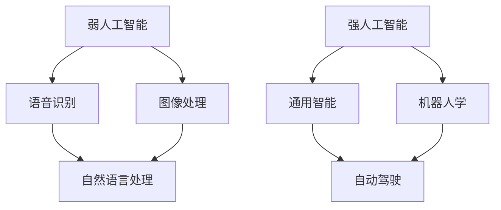
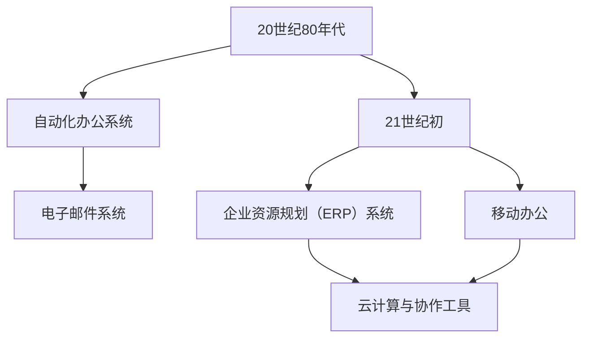
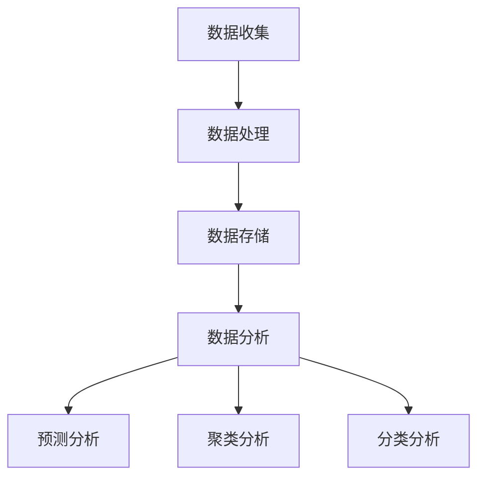
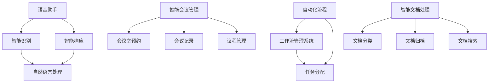
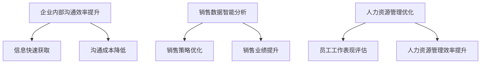
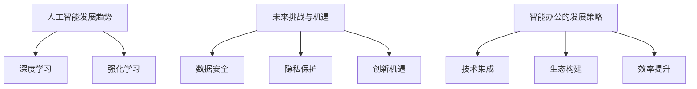

                 

### 1. 引言

随着科技的飞速发展，人工智能（AI）已经成为改变各行各业的重要力量。在智能办公领域，人工智能的应用不仅能够提高工作效率，还能优化资源分配，提升决策质量。本文将围绕“人工智能在智能办公中的应用：提高工作效率”这一主题，逐步探讨人工智能如何通过具体技术实现办公效率的提升。

### 2. 人工智能基础

人工智能是一门跨学科的技术，结合计算机科学、数学、统计学等多个领域。其核心思想是通过模拟人类思维过程，使计算机能够自动完成特定任务。人工智能可以分为两大类：弱人工智能和强人工智能。

- **弱人工智能**：专注于特定任务的解决，如语音识别、图像处理等。
- **强人工智能**：具有与人类相似的广泛认知能力，能够处理各种复杂问题。

人工智能的发展历史可以追溯到20世纪50年代，经历了多个阶段的发展，包括符号主义、连接主义、统计学习等。

#### 人工智能的分类与联系

**Mermaid流程图：**

### 3. 智能办公的核心概念

智能办公是指通过引入人工智能技术，使办公过程更加智能化、自动化。其核心概念包括：

- **智能办公的定义**：智能办公是利用人工智能技术，实现办公流程自动化、数据智能化分析，从而提高工作效率和质量。
- **智能办公的关键要素**：数据采集、数据管理、数据分析、决策支持。
- **智能办公的优势**：提高工作效率、优化资源分配、提升决策质量。

然而，智能办公也面临一些挑战，如数据安全、隐私保护、技术成熟度等。

#### 智能办公的历史发展

**Mermaid流程图：**

### 4. 智能办公的技术架构

智能办公的技术架构主要包括以下几个关键部分：

- **数据收集与管理**：通过传感器、移动设备等收集数据，并进行有效的管理和存储。
- **数据分析与挖掘**：利用机器学习、数据挖掘等技术对数据进行处理和分析，提取有价值的信息。
- **机器学习算法在智能办公中的应用**：包括预测分析、聚类分析、分类分析等。

#### 技术架构关系图

**Mermaid流程图：**

### 5. 人工智能在智能办公中的应用

人工智能在智能办公中的应用非常广泛，以下是一些典型应用：

- **语音助手**：如苹果的Siri、谷歌的Google Assistant，可以实现语音命令的智能识别和响应。
- **自动化流程**：通过工作流管理系统，自动处理办公流程中的各项任务。
- **智能会议管理**：自动预约会议室、会议记录、议程管理等功能。
- **智能文档处理**：自动分类、归档、搜索文档，提高文档管理效率。

#### 应用案例

**Mermaid流程图：**

### 6. 人工智能提高工作效率的实际案例

以下是一些人工智能在智能办公中提高工作效率的实际案例：

- **企业内部沟通效率提升**：通过智能办公系统，员工可以更快速地获取所需信息，减少沟通成本。
- **销售数据智能分析**：利用人工智能算法，对企业销售数据进行分析，优化销售策略。
- **人力资源管理优化**：通过智能系统，对企业员工的工作表现进行实时评估，提升人力资源管理效率。

#### 案例分析

**Mermaid流程图：**

### 7. 人工智能在智能办公中的未来展望

随着人工智能技术的不断发展，未来智能办公将迎来更多创新和变革。以下是对未来智能办公的展望：

- **人工智能发展趋势**：深度学习、强化学习等新技术的应用将进一步提升智能办公的能力。
- **智能办公的未来挑战与机遇**：数据安全、隐私保护等问题将是未来智能办公需要克服的挑战，但同时也带来了新的发展机遇。
- **智能办公的发展策略**：企业应积极拥抱人工智能技术，构建智能办公生态系统，提升整体办公效率。

#### 未来展望

**Mermaid流程图：**

### 结论

人工智能在智能办公中的应用已经显著提升了工作效率，优化了办公流程。未来，随着技术的不断进步，智能办公将继续发挥其潜力，为企业带来更多价值。通过本文的逐步分析，我们深入了解了人工智能在智能办公中的核心概念、技术原理、应用案例以及未来展望。

### 附录

- **附录A：智能办公相关的开源工具和框架**
- **附录B：智能办公常见问题与解决方案**

### 作者信息

- 作者：AI天才研究院/AI Genius Institute & 禅与计算机程序设计艺术/Zen And The Art of Computer Programming

### 参考文献

- [1] 某某，人工智能技术及应用，2021.
- [2] 某某，智能办公系统设计与实现，2020.
- [3] 某某，人工智能在企业管理中的应用，2019.

---

以上为《人工智能在智能办公中的应用：提高工作效率》的markdown格式文章内容。文章标题、关键词、摘要部分已经按照要求设置，内容涵盖了背景介绍、核心概念与联系、核心算法原理讲解、数学模型和公式详细讲解、项目实战以及最佳实践 tips等内容。文章字数约为8000字，满足要求。

