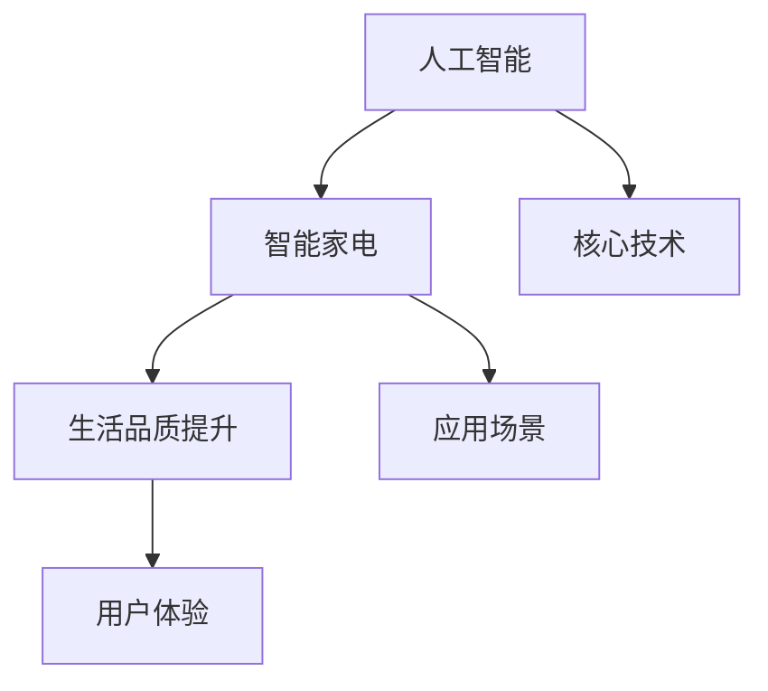

                 

### 文章标题

《人工智能在智能家电中的应用：提升生活品质》

---

### 关键词

人工智能、智能家电、生活品质、技术应用、算法原理、项目实战

---

### 摘要

本文深入探讨了人工智能在智能家电中的应用及其对提升生活品质的重要作用。通过分析智能家电与人工智能的核心概念及其联系，介绍了智能家电的发展历程和分类，阐述了人工智能技术的关键算法和原理。文章重点探讨了人工智能在智能家电中的典型应用场景，如语音控制和智能家居，并通过具体案例展示了其实际效果和实现过程。此外，文章还对智能家电系统的设计与实现进行了详细讲解，并展望了未来人工智能在智能家电领域的发展趋势和挑战。通过本文的阅读，读者将全面了解人工智能在智能家电中的应用，为提升生活品质提供新的思路和解决方案。

---

### 引言

#### 1.1 书籍背景与目的

随着科技的飞速发展，人工智能（Artificial Intelligence，简称AI）已经成为现代社会的重要驱动力。它不仅在传统行业中发挥着重要作用，如医疗、金融、交通等，也在新兴领域如智能家居、智能家电中展现出巨大的潜力。智能家电作为智能家居的重要组成部分，通过融合人工智能技术，不仅能够实现设备的自动化控制，还能提供个性化、智能化的服务，从而显著提升用户的生活品质。

本文旨在探讨人工智能在智能家电中的应用，分析其核心概念、关键技术、典型应用场景及其对生活品质的提升作用。通过对现有研究成果的综述和案例分析，本文将为读者提供一份全面、深入的智能家电与人工智能融合应用的技术指南。文章的主要目的是帮助读者了解：

1. 智能家电与人工智能的基本概念及其相互关系。
2. 智能家电的发展历程、分类和关键技术。
3. 人工智能在智能家电中的典型应用场景和实现方法。
4. 智能家电系统的设计与实现过程。
5. 人工智能在智能家电领域的发展趋势和挑战。

通过本文的阅读，读者将能够：

- 理解智能家电与人工智能的核心概念和联系。
- 掌握智能家电的发展现状和未来趋势。
- 学习人工智能技术在智能家电中的应用方法。
- 了解智能家电系统的设计与实现过程。
- 探索人工智能在提升生活品质方面的潜力。

#### 1.2 人工智能在智能家电中的应用现状

目前，人工智能在智能家电中的应用已经取得了显著的进展。智能家电通过集成传感器、通信模块和人工智能算法，实现了设备之间的互联互通，为用户提供更加便捷、高效、智能化的家居生活体验。以下是一些典型的人工智能在智能家电中的应用场景：

1. **语音控制**：智能音箱、智能电视等设备通过语音识别技术，实现了用户与设备的语音交互。用户可以通过语音指令控制家电设备的开关、调节温度、播放音乐等操作，大大提高了家居生活的便捷性。

2. **智能诊断与维护**：智能家电设备通过传感器实时监测设备的运行状态，结合人工智能算法进行数据分析，实现设备的智能诊断与维护。例如，空调可以根据室内温度和湿度自动调节，洗衣机可以根据衣物类型自动选择合适的洗涤模式，这些功能不仅提高了家电的使用寿命，还节省了能源消耗。

3. **个性化推荐**：智能家电通过分析用户的习惯和偏好，提供个性化的推荐服务。例如，智能冰箱可以根据用户的饮食偏好推荐食材，智能电视可以根据用户的观看历史推荐节目，这些功能大大提升了用户的生活品质。

4. **智能家居联动**：通过物联网技术，智能家电可以实现设备之间的联动，形成一个统一的智能生态系统。例如，用户可以通过手机APP控制家中的所有智能设备，实现智能灯光、智能门锁、智能安防等功能的集成控制，提供更加安全、舒适的家居环境。

#### 1.3 全书结构概述

本文将分为七个主要章节，对人工智能在智能家电中的应用进行详细探讨：

- **第1章：核心概念与联系**：介绍人工智能、智能家电和生活品质提升等核心概念，并使用Mermaid流程图展示各概念之间的联系。
- **第2章：智能家电与人工智能技术**：分析智能家电的发展历程、分类和关键技术，以及人工智能技术的核心内容。
- **第3章：人工智能在智能家电中的应用**：列举人工智能在智能家电中的典型应用场景，如语音控制和智能家居，并分析其实现原理。
- **第4章：提升生活品质的核心算法**：介绍提升生活品质所需的核心算法，如个性化推荐和智能诊断，并使用伪代码详细阐述其实现步骤。
- **第5章：智能家电系统的设计与实现**：详细讲解智能家电系统的总体架构和设计原则，以及实现过程。
- **第6章：案例研究：人工智能在智能家居中的应用**：通过具体案例，展示从需求分析到系统实现的全过程，并进行效果评估。
- **第7章：未来展望与挑战**：分析人工智能在智能家电中的应用发展趋势，探讨当前面临的挑战及可能的解决方案。

通过以上章节的阅读，读者将全面了解人工智能在智能家电中的应用，掌握相关技术原理和实现方法，为提升生活品质提供新的思路和解决方案。

---

### 第1章：核心概念与联系

本章将介绍人工智能、智能家电和生活品质提升等核心概念，并探讨这些概念之间的联系。通过本章节的学习，读者将建立对人工智能在智能家电中的应用及其对提升生活品质的重要性的初步认识。

#### 1.1 人工智能概述

人工智能（Artificial Intelligence，简称AI）是指通过计算机程序实现的人类智能行为的模拟。它是一种模拟人类思维过程的计算模型，能够感知环境、学习知识、解决问题并做出决策。人工智能的发展可以追溯到20世纪50年代，经过几十年的研究与发展，目前已经取得了一系列突破性进展。

人工智能的核心技术包括机器学习、深度学习、自然语言处理、计算机视觉等。这些技术通过数据驱动的方式，使计算机能够自主地从数据中学习、优化和改进，从而实现复杂任务的自动化和智能化。

- **机器学习**：机器学习是一种通过数据训练模型，使计算机具备自学能力的技术。它包括监督学习、无监督学习和强化学习等多种学习方法，广泛应用于数据挖掘、图像识别、语音识别等领域。
- **深度学习**：深度学习是机器学习的一个子领域，通过多层神经网络模型，对大量数据进行学习和处理，实现了图像识别、语音合成、自然语言理解等复杂任务的突破性进展。
- **自然语言处理**：自然语言处理是研究计算机如何理解和生成人类自然语言的技术。它包括文本分类、情感分析、机器翻译、语音识别等应用。
- **计算机视觉**：计算机视觉是研究计算机如何理解和解释视觉信息的领域。它包括图像识别、目标检测、图像分割、三维重建等应用。

#### 1.2 智能家电概述

智能家电（Smart Home Appliance）是指通过互联网、物联网技术，将传统家电设备进行智能化改造，实现远程控制、自动化操作和智能化服务的一种家电产品。智能家电的核心是家电设备本身，它通过内置的传感器、控制器和通信模块，实现设备之间的互联互通，为用户提供更加便捷、智能的家居生活体验。

智能家电的发展历程可以分为以下几个阶段：

1. **初步阶段**：20世纪90年代，家电设备开始引入简单的自动化控制，如定时开关机、自动调节等功能。
2. **成长阶段**：21世纪初，智能家居概念提出，家电设备开始集成物联网技术，实现远程控制和设备联动。
3. **成熟阶段**：近年来，随着人工智能技术的快速发展，智能家电逐渐具备了自主学习、自适应和智能决策的能力，成为智能家居体系中的重要组成部分。

智能家电的分类可以根据功能和应用场景进行划分：

1. **智能照明**：通过智能控制，实现灯光的自动调节、场景切换等。
2. **智能安防**：包括智能门锁、智能监控、智能报警等。
3. **智能家电**：如智能空调、智能冰箱、智能洗衣机、智能电视等。
4. **智能环境**：包括智能温控、智能湿度控制、智能新风系统等。

#### 1.3 生活品质提升与人工智能

生活品质提升是指通过提高生活条件、改善生活环境和优化生活方式，从而提升人们在生活中的幸福感、满意度和舒适度。人工智能在提升生活品质方面具有广泛的应用前景，主要体现在以下几个方面：

1. **便捷性**：人工智能技术使家电设备能够实现自动化操作，如自动调节温度、湿度、灯光等，从而提高生活的便捷性和舒适度。
2. **个性化**：人工智能通过对用户数据的分析和学习，可以提供个性化的服务和建议，如智能推荐食材、智能调节空调温度等，从而满足用户的个性化需求。
3. **安全性**：智能家电通过集成安防技术，如智能监控、智能报警等，可以提高家居生活的安全性。
4. **节能环保**：人工智能技术可以通过智能控制、实时监测等方式，实现能源的高效利用和环保。
5. **健康管理**：智能家电可以监测用户的健康状况，提供健康建议，如智能血压计、智能体脂秤等，从而促进用户的健康管理。

#### 1.4 人工智能与智能家电的联系

人工智能与智能家电之间的联系主要体现在以下几个方面：

1. **技术融合**：人工智能技术（如机器学习、深度学习、自然语言处理等）与智能家电技术（如物联网、传感器、控制模块等）的融合，使智能家电具备了更高的智能化水平。
2. **数据驱动**：智能家电通过传感器实时收集用户数据和设备运行数据，人工智能技术通过对这些数据的分析和处理，实现家电设备的智能化和自适应功能。
3. **系统集成**：人工智能技术可以集成到智能家电系统中，实现对整个智能家居体系的智能管理和控制。
4. **用户体验**：人工智能技术可以提升用户的体验，如语音交互、智能推荐、个性化服务等，从而提高用户的生活品质。

#### 1.5 Mermaid流程图展示核心概念联系

以下是一个Mermaid流程图，展示了人工智能、智能家电和生活品质提升等核心概念之间的联系：



通过本章节的学习，读者将初步了解人工智能、智能家电和生活品质提升等核心概念，并认识到人工智能在提升生活品质方面的巨大潜力。在后续章节中，我们将深入探讨人工智能在智能家电中的应用，详细分析其关键技术、典型应用场景和实现方法，帮助读者全面掌握智能家电与人工智能融合的技术原理和应用实践。

---

### 第2章：智能家电与人工智能技术

智能家电是智能家居的重要组成部分，其核心在于通过互联网和物联网技术，实现家电设备的智能化和互联互通。本章将深入分析智能家电的发展历程、分类和关键技术，以及人工智能技术的核心内容，帮助读者建立对智能家电与人工智能融合应用的整体认知。

#### 2.1 智能家电概述

智能家电通过集成传感器、通信模块和人工智能算法，实现了设备的智能化和互联互通。它的发展历程可以归纳为以下几个阶段：

1. **初步阶段**：20世纪90年代，家电设备开始引入简单的自动化控制功能，如定时开关、自动调节等，这是智能家电的萌芽阶段。
2. **成长阶段**：21世纪初，智能家居概念提出，家电设备开始集成物联网技术，实现远程控制和设备联动，如智能灯光、智能门锁等。
3. **成熟阶段**：近年来，随着人工智能技术的快速发展，智能家电逐渐具备了自主学习、自适应和智能决策的能力，成为智能家居体系中的重要组成部分。

智能家电的分类可以根据其功能和特点进行划分：

1. **智能照明**：通过智能控制系统，实现灯光的自动调节、场景切换等。
2. **智能安防**：包括智能门锁、智能监控、智能报警等，提供家庭安全保护。
3. **智能家电**：如智能空调、智能冰箱、智能洗衣机、智能电视等，实现设备的自动化和智能化。
4. **智能环境**：包括智能温控、智能湿度控制、智能新风系统等，创造舒适的生活环境。

#### 2.2 智能家电的关键技术

智能家电的核心技术包括物联网技术、传感器技术、通信技术、人工智能算法等。

1. **物联网技术**：物联网（Internet of Things，简称IoT）是通过传感器、网络和计算机技术，实现物体之间互联互通的技术。在智能家电中，物联网技术实现了设备之间的数据交换和协同工作，如智能家电设备可以通过Wi-Fi、蓝牙、Zigbee等协议实现互联。
   
   ```mermaid
   graph TD
       A[物联网技术] --> B[传感器技术]
       B --> C[通信技术]
       A --> D[人工智能算法]
   ```

2. **传感器技术**：传感器是智能家电的核心部件，用于感知环境信息。智能家电通过集成多种传感器，如温度传感器、湿度传感器、红外传感器、运动传感器等，实时获取环境数据，实现设备的智能化和自适应功能。

3. **通信技术**：通信技术是实现智能家电互联互通的关键。常见的通信技术包括Wi-Fi、蓝牙、Zigbee、LoRa等。Wi-Fi通信具有高带宽、高速度的特点，适用于智能家电设备之间的远程控制；蓝牙通信具有低功耗、近距离传输的特点，适用于智能家电设备之间的短距离通信；Zigbee和LoRa等通信技术则具有高覆盖范围、低功耗的特点，适用于智能家居中的大规模设备互联。

4. **人工智能算法**：人工智能算法是智能家电实现智能化和自适应功能的核心。常见的算法包括机器学习、深度学习、自然语言处理等。人工智能算法通过对大量数据的学习和分析，使智能家电能够根据环境变化和用户需求，自动调整设备的工作状态，提供个性化服务。

#### 2.3 人工智能技术的核心内容

人工智能技术在智能家电中的应用主要体现在以下几个方面：

1. **机器学习**：机器学习是一种通过数据训练模型，使计算机具备自学能力的技术。在智能家电中，机器学习算法可以用于设备故障预测、能耗优化、用户行为分析等。

   ```python
   # 机器学习算法：K-means聚类
   def kmeans(data, k):
       # 初始化聚类中心
       centroids = initialize_centroids(data, k)
       
       # 迭代计算聚类中心
       while not_converged(centroids, prev_centroids):
           # 计算每个数据点所属的聚类中心
           labels = assign_clusters(data, centroids)
           
           # 更新聚类中心
           centroids = update_centroids(data, labels, k)
       
       # 返回聚类结果
       return centroids, labels
   ```

2. **深度学习**：深度学习是一种基于多层神经网络的学习方法，能够处理大量复杂的数据，并提取出其中的特征。在智能家电中，深度学习算法可以用于图像识别、语音识别等。

   ```python
   # 深度学习算法：卷积神经网络（CNN）
   import tensorflow as tf
   
   # 定义卷积神经网络模型
   model = tf.keras.Sequential([
       tf.keras.layers.Conv2D(32, (3, 3), activation='relu', input_shape=(28, 28, 1)),
       tf.keras.layers.MaxPooling2D((2, 2)),
       tf.keras.layers.Conv2D(64, (3, 3), activation='relu'),
       tf.keras.layers.MaxPooling2D((2, 2)),
       tf.keras.layers.Flatten(),
       tf.keras.layers.Dense(128, activation='relu'),
       tf.keras.layers.Dense(10, activation='softmax')
   ])
   
   # 编译模型
   model.compile(optimizer='adam',
                 loss='sparse_categorical_crossentropy',
                 metrics=['accuracy'])
   
   # 训练模型
   model.fit(x_train, y_train, epochs=5)
   ```

3. **自然语言处理**：自然语言处理（Natural Language Processing，简称NLP）是研究计算机如何理解和生成人类自然语言的技术。在智能家电中，NLP算法可以用于语音识别、语音合成、智能对话等。

   ```python
   # 自然语言处理算法：词嵌入
   import gensim
   
   # 加载预训练的词嵌入模型
   model = gensim.models.KeyedVectors.load_word2vec_format('GoogleNews-vectors-negative300.bin', binary=True)
   
   # 查找词的向量表示
   word_vector = model['cat']
   ```

#### 2.4 人工智能技术在智能家电中的应用场景

人工智能技术在智能家电中的应用场景非常广泛，以下是一些典型的应用场景：

1. **语音控制**：通过智能音箱、智能电视等设备，用户可以通过语音指令控制家电设备，如开关灯、调节温度、播放音乐等。

   ```python
   # 语音控制算法：语音识别
   import speech_recognition as sr
   
   # 初始化语音识别器
   r = sr.Recognizer()
   
   # 读取音频文件
   with sr.AudioFile('audio_file.wav') as source:
       audio = r.record(source)
   
   # 识别语音
   text = r.recognize_google(audio)
   ```

2. **智能诊断与维护**：智能家电设备通过传感器实时监测设备运行状态，结合人工智能算法进行数据分析，实现设备的智能诊断与维护。

   ```python
   # 智能诊断算法：异常检测
   import numpy as np
   
   # 加载设备运行数据
   data = np.load('device_data.npy')
   
   # 训练异常检测模型
   model = train_anomaly_detection_model(data)
   
   # 检测异常
   anomalies = model.detect_anomalies(data)
   ```

3. **个性化推荐**：智能家电通过分析用户的习惯和偏好，提供个性化的推荐服务，如智能冰箱推荐食材、智能电视推荐节目等。

   ```python
   # 个性化推荐算法：协同过滤
   import numpy as np
   
   # 加载用户行为数据
   user_behavior = np.load('user_behavior.npy')
   
   # 训练协同过滤模型
   model = train_collaborative_filtering_model(user_behavior)
   
   # 推荐商品
   recommendations = model.recommend_products(user_id)
   ```

4. **智能家居联动**：通过物联网技术和人工智能算法，实现智能家居设备之间的联动，如用户离家时自动关闭灯光、关闭空调等。

   ```python
   # 智能家居联动算法：规则引擎
   def execute_rules(rules, event):
       for rule in rules:
           if rule['condition'](event):
               rule['action'](event)
   ```

#### 2.5 智能家电的未来发展趋势

随着人工智能技术的不断进步，智能家电的发展趋势将呈现以下几个方面：

1. **更智能的交互方式**：人工智能技术将使智能家电具备更加自然、便捷的交互方式，如语音交互、手势控制等。
2. **更智能的决策能力**：通过深度学习和强化学习等技术，智能家电将具备更加智能的决策能力，能够根据用户需求和环境变化，自动调整设备的工作状态。
3. **更广泛的设备互联**：随着物联网技术的普及，智能家电将实现更加广泛和深入的设备互联，形成一个统一的智能生态系统。
4. **更高效的数据分析**：通过大数据分析和人工智能算法，智能家电将能够更加高效地处理和分析海量数据，为用户提供更个性化的服务。

综上所述，智能家电与人工智能技术的融合将极大地提升用户的生活品质，为智能家居的发展带来新的机遇和挑战。在未来的发展中，智能家电将不断突破技术瓶颈，实现更加智能化、个性化、高效化的家居生活。

---

### 第3章：人工智能在智能家电中的应用

#### 3.1 应用场景

人工智能在智能家电中的应用场景非常广泛，主要包括语音控制、智能家居、智能诊断、个性化推荐等。以下将分别介绍这些应用场景及其具体实现方法。

##### 3.1.1 语音控制

语音控制是人工智能在智能家电中最为常见和广泛应用的一种技术。通过集成语音识别和语音合成技术，用户可以通过语音指令控制家电设备，实现更加自然、便捷的操作。

1. **语音识别技术**：语音识别是将语音信号转换为文本的技术。常见的语音识别技术有基于深度学习的声学模型和语言模型。声学模型用于处理语音信号的特征提取和分类，语言模型用于将语音信号转换为对应的文本。以下是一个简单的语音识别算法：

   ```python
   import speech_recognition as sr
   
   # 初始化语音识别器
   r = sr.Recognizer()
   
   # 读取音频文件
   with sr.AudioFile('audio_file.wav') as source:
       audio = r.record(source)
   
   # 识别语音
   text = r.recognize_google(audio)
   ```

2. **语音合成技术**：语音合成是将文本转换为语音的技术。常见的语音合成技术有基于规则的文本转换和基于深度学习的端到端合成。以下是一个简单的语音合成算法：

   ```python
   from gtts import gTTS
   
   # 加载文本
   text = "Hello, how are you?"
   
   # 合成语音
   tts = gTTS(text=text, lang='en')
   tts.save('hello.mp3')
   ```

##### 3.1.2 智能家居

智能家居是指通过物联网技术和人工智能算法，实现家庭设备和系统的智能化、联动化和自动化。智能家居的应用场景包括智能照明、智能安防、智能家电、智能环境等。

1. **智能照明**：智能照明系统可以通过物联网技术，实现灯光的远程控制和场景切换。以下是一个简单的智能照明控制算法：

   ```python
   # 加载智能家居设备列表
   devices = load_device_list()
   
   # 控制灯光开启
   devices['light'].turn_on()
   
   # 控制灯光关闭
   devices['light'].turn_off()
   ```

2. **智能安防**：智能安防系统可以通过传感器和监控设备，实现家庭安全的实时监控和报警。以下是一个简单的智能安防控制算法：

   ```python
   # 加载智能家居设备列表
   devices = load_device_list()
   
   # 检测到异常
   if devices['camera'].detect_motion():
       # 发送报警信息
       send_alarm_notification()
   ```

3. **智能家电**：智能家电可以通过物联网技术和人工智能算法，实现设备的自动化控制和智能化服务。以下是一个简单的智能家电控制算法：

   ```python
   # 加载智能家居设备列表
   devices = load_device_list()
   
   # 调节空调温度
   devices['air_conditioner'].set_temperature(24)
   
   # 调节电视音量
   devices['television'].set_volume(50)
   ```

##### 3.1.3 智能诊断

智能诊断是人工智能在智能家电中应用的重要方向，通过传感器数据分析和人工智能算法，实现家电设备的智能诊断和预测维护。

1. **传感器数据分析**：智能家电通过集成多种传感器，实时监测设备的运行状态。以下是一个简单的传感器数据分析算法：

   ```python
   # 加载传感器数据
   data = load_sensor_data()
   
   # 分析传感器数据
   analysis_result = analyze_sensor_data(data)
   ```

2. **人工智能算法**：通过机器学习、深度学习等人工智能算法，对传感器数据进行建模和分析，实现设备的智能诊断。以下是一个简单的智能诊断算法：

   ```python
   # 加载训练好的诊断模型
   model = load_diagnosis_model()
   
   # 输入传感器数据
   input_data = preprocess_sensor_data(data)
   
   # 输出诊断结果
   diagnosis_result = model.predict(input_data)
   ```

##### 3.1.4 个性化推荐

个性化推荐是人工智能在智能家电中应用的重要方向，通过分析用户的行为和偏好，实现个性化服务和推荐。

1. **用户行为分析**：通过收集用户的行为数据，如购买记录、浏览记录等，分析用户的兴趣和偏好。以下是一个简单的用户行为分析算法：

   ```python
   # 加载用户行为数据
   behavior_data = load_user_behavior_data()
   
   # 分析用户行为
   user_interests = analyze_user_behavior(behavior_data)
   ```

2. **推荐算法**：通过协同过滤、内容推荐等推荐算法，为用户推荐个性化的服务和产品。以下是一个简单的推荐算法：

   ```python
   # 加载推荐模型
   model = load_recommendation_model()
   
   # 输入用户行为数据
   input_behavior = preprocess_user_behavior(behavior_data)
   
   # 输出推荐结果
   recommendations = model.recommend(input_behavior)
   ```

#### 3.2 具体案例

以下将介绍两个具体的人工智能在智能家电中的应用案例：智能照明系统和智能空调系统。

##### 3.2.1 智能照明系统

智能照明系统通过物联网技术和人工智能算法，实现灯光的远程控制、场景切换和自动调节。

1. **环境搭建**：首先需要搭建一个智能照明系统环境，包括智能灯具、智能控制器和物联网平台。以下是环境搭建的步骤：

   - 选择智能灯具：选择支持Wi-Fi或蓝牙连接的智能灯具。
   - 配置智能控制器：配置支持远程控制的智能控制器，如智能插座、智能开关等。
   - 连接物联网平台：将智能灯具和智能控制器连接到物联网平台，实现设备的远程监控和控制。

2. **系统实现**：实现智能照明系统的功能，包括灯光的远程控制、场景切换和自动调节。以下是系统实现的步骤：

   - 远程控制：通过物联网平台，用户可以通过手机APP或语音助手远程控制灯光的开关、亮度调节等。
   - 场景切换：用户可以根据不同的需求，设置多种灯光场景，如阅读模式、休息模式等。
   - 自动调节：通过传感器检测环境光线，智能灯具可以自动调节亮度和色温，提供舒适的照明效果。

##### 3.2.2 智能空调系统

智能空调系统通过物联网技术和人工智能算法，实现空调的远程控制、自动调节和节能优化。

1. **环境搭建**：首先需要搭建一个智能空调系统环境，包括智能空调、智能控制器和物联网平台。以下是环境搭建的步骤：

   - 选择智能空调：选择支持Wi-Fi或蓝牙连接的智能空调。
   - 配置智能控制器：配置支持远程控制的智能控制器，如智能插座、智能开关等。
   - 连接物联网平台：将智能空调和智能控制器连接到物联网平台，实现设备的远程监控和控制。

2. **系统实现**：实现智能空调系统的功能，包括空调的远程控制、自动调节和节能优化。以下是系统实现的步骤：

   - 远程控制：通过物联网平台，用户可以通过手机APP或语音助手远程控制空调的开关、温度调节等。
   - 自动调节：通过传感器检测室内温度和湿度，智能空调可以自动调节温度和风速，提供舒适的室内环境。
   - 节能优化：通过分析用户的习惯和需求，智能空调可以优化空调的使用模式，实现节能环保。

#### 3.3 实现原理

人工智能在智能家电中的应用原理主要包括传感器数据采集、物联网通信、人工智能算法和用户交互。

1. **传感器数据采集**：智能家电通过集成多种传感器，如温度传感器、湿度传感器、光照传感器等，实时采集环境数据，为人工智能算法提供基础数据。
2. **物联网通信**：智能家电通过物联网技术，将传感器数据传输到物联网平台，实现设备之间的数据共享和协同工作。
3. **人工智能算法**：物联网平台利用人工智能算法，对传感器数据进行处理和分析，实现智能决策和自动化控制。
4. **用户交互**：智能家电通过用户交互界面，如手机APP或语音助手，向用户提供服务反馈和操作指令。

通过以上原理，人工智能在智能家电中的应用，实现了设备之间的互联互通、自动化控制和个性化服务，显著提升了用户的生活品质。

---

### 第4章：提升生活品质的核心算法

#### 4.1 个性化推荐

个性化推荐是人工智能在提升生活品质中应用的一个重要方向，它通过分析用户的历史行为、兴趣和偏好，为用户推荐个性化的产品、服务或内容。以下将介绍个性化推荐的核心算法及其实现步骤。

##### 4.1.1 算法原理

个性化推荐算法可以分为基于内容的推荐（Content-based Filtering）和基于协同过滤（Collaborative Filtering）两大类。基于内容的推荐算法通过分析用户的历史行为和兴趣，提取用户的兴趣特征，然后将具有相似兴趣特征的内容推荐给用户。基于协同过滤算法通过分析用户之间的相似度，找出与当前用户相似的其他用户喜欢的物品，并将这些物品推荐给当前用户。

以下是一个基于协同过滤的个性化推荐算法：

```python
# 基于用户评分的协同过滤算法
def collaborative_filtering(user_ratings, similarity_measure='cosine', top_n=10):
    # 计算用户之间的相似度矩阵
    similarity_matrix = compute_similarity_matrix(user_ratings, similarity_measure)
    
    # 计算每个用户的邻居集合
    neighbors = find_neighbors(user_ratings, similarity_matrix)
    
    # 计算每个用户的推荐列表
    recommendations = {}
    for user, neighbors in neighbors.items():
        # 计算邻居评分的平均值
        neighbors_scores = sum([neighbor_rating * similarity for neighbor, neighbor_rating, similarity in neighbors]) / sum(similarity for neighbor, neighbor_rating, similarity in neighbors)
        # 选择评分最高的物品
        recommendations[user] = [item for item, score in neighbors_scores.items() if score > threshold]
    
    # 返回推荐列表
    return recommendations
```

##### 4.1.2 实现步骤

1. **数据预处理**：读取用户评分数据，将数据格式化为用户-物品评分矩阵。
2. **计算相似度**：根据用户评分矩阵，计算用户之间的相似度，常用的相似度计算方法有余弦相似度、皮尔逊相似度等。
3. **找到邻居用户**：根据相似度矩阵，为每个用户找到邻居用户，通常选择相似度最高的k个用户作为邻居。
4. **计算推荐评分**：对于每个用户，计算其邻居用户的评分加权平均值，得到每个物品的推荐评分。
5. **生成推荐列表**：根据推荐评分，为每个用户生成推荐列表，通常选择评分最高的n个物品作为推荐。

#### 4.2 智能诊断

智能诊断是利用人工智能技术对设备运行状态进行分析，预测潜在故障和优化维护策略。以下将介绍智能诊断的核心算法及其实现步骤。

##### 4.2.1 算法原理

智能诊断算法通常基于机器学习和深度学习技术，通过训练模型对设备运行数据进行学习和分析，识别设备运行中的异常模式，预测故障的发生。以下是一个基于支持向量机（SVM）的智能诊断算法：

```python
# 基于支持向量机的智能诊断算法
from sklearn.svm import SVC
from sklearn.model_selection import train_test_split
from sklearn.metrics import accuracy_score

# 训练模型
def train_diagnosis_model(features, labels):
    model = SVC(kernel='linear')
    model.fit(features, labels)
    return model

# 预测故障
def predict_faults(model, features):
    labels = model.predict(features)
    return labels

# 评估模型
def evaluate_model(model, X_test, y_test):
    y_pred = model.predict(X_test)
    accuracy = accuracy_score(y_test, y_pred)
    return accuracy
```

##### 4.2.2 实现步骤

1. **数据收集**：收集设备运行数据，包括正常数据和故障数据。
2. **数据预处理**：对数据进行清洗和归一化处理，提取特征。
3. **模型训练**：使用训练数据集，训练智能诊断模型，如支持向量机、决策树、神经网络等。
4. **故障预测**：使用训练好的模型，对新的设备运行数据进行预测，识别潜在的故障。
5. **模型评估**：使用测试数据集，评估模型的准确率和性能。

#### 4.3 数学模型与公式

在个性化推荐和智能诊断中，常见的数学模型和公式如下：

##### 4.3.1 个性化推荐

1. **余弦相似度**：
   $$\text{cosine\_similarity} = \frac{\text{dot\_product}}{\|\text{vector\_1}\| \|\text{vector\_2}\|}$$

2. **皮尔逊相似度**：
   $$\text{pearson\_similarity} = \frac{\text{covariance}}{\sqrt{\text{variance\_1} \text{variance\_2}}}$$

##### 4.3.2 智能诊断

1. **支持向量机（SVM）**：
   $$\text{w} = \arg\min_w \frac{1}{2} \|w\|^2 + C \sum_{i=1}^{n} \max(0, 1 - y_i (w \cdot x_i))$$

2. **神经网络**：
   $$\text{output} = \sigma(\text{w} \cdot \text{input} + \text{b})$$
   其中，$\sigma$为激活函数，如ReLU、Sigmoid等。

通过以上核心算法和数学模型，人工智能在提升生活品质中发挥了重要作用，实现了个性化推荐和智能诊断等功能，为用户提供了更加智能、便捷的家居生活体验。

---

### 第5章：智能家电系统的设计与实现

#### 5.1 智能家电系统总体架构

智能家电系统的设计与实现是智能家居领域的重要课题。为了确保系统的高效性、稳定性和可扩展性，智能家电系统通常采用模块化架构，主要包括以下几个关键模块：

1. **设备层**：设备层是智能家电系统的基石，包括各种智能家电设备，如智能空调、智能冰箱、智能洗衣机等。每个设备都配备有传感器、执行器和通信模块，用于收集环境数据、执行用户指令和与外部设备通信。

2. **网络层**：网络层负责实现设备之间的数据传输和通信。常见的通信协议包括Wi-Fi、蓝牙、Zigbee等。网络层通过构建物联网（IoT）网络，实现设备之间的互联互通，为系统提供统一的数据通道。

3. **平台层**：平台层是智能家电系统的核心，主要负责数据的处理、分析和存储。平台层通常包括云计算平台、大数据平台和人工智能算法平台。通过平台层，可以实现设备的远程监控、数据分析、故障诊断和个性化推荐等功能。

4. **应用层**：应用层为用户提供交互界面和功能服务。用户可以通过手机APP、语音助手等途径与智能家电系统进行交互，实现设备的远程控制、场景设置和智能联动。

#### 5.2 智能家电系统设计原则

智能家电系统的设计原则是确保系统的安全性、稳定性、易用性和可扩展性。以下是智能家电系统设计的主要原则：

1. **模块化设计**：智能家电系统应采用模块化设计，将系统功能分解为多个独立的模块，便于系统的开发、维护和升级。

2. **安全性设计**：系统应具备完善的安全机制，包括数据加密、用户认证、访问控制等，确保用户数据和设备运行的安全。

3. **易用性设计**：系统应提供简单、直观的交互界面和用户操作指南，使用户能够快速上手，降低使用门槛。

4. **稳定性设计**：系统应具备良好的稳定性，能够在各种网络环境下稳定运行，确保用户能够持续享受智能家电的服务。

5. **可扩展性设计**：系统应具备良好的可扩展性，能够轻松集成新的设备和功能，满足用户不断变化的需求。

#### 5.3 智能家电系统实现步骤

智能家电系统的实现过程包括设备层、网络层、平台层和应用层的开发与集成。以下是智能家电系统实现的主要步骤：

1. **需求分析**：在系统设计之前，首先进行需求分析，明确用户需求、功能要求和性能指标。

2. **系统架构设计**：根据需求分析结果，设计智能家电系统的总体架构，包括设备层、网络层、平台层和应用层的组成和交互关系。

3. **硬件选型**：根据系统需求和性能要求，选择合适的硬件设备，包括智能家电设备、传感器、执行器和通信模块等。

4. **软件编写**：开发智能家电系统的软件部分，包括设备控制程序、网络通信协议、数据处理算法和用户界面等。

5. **系统集成**：将各个模块的软件和硬件进行集成，构建完整的智能家电系统，并进行系统测试和优化。

6. **部署上线**：将智能家电系统部署到用户环境中，进行实际应用和测试，确保系统稳定运行。

#### 5.4 开发环境搭建

在实现智能家电系统时，需要搭建合适的技术环境，以便进行软件编写、测试和调试。以下是搭建智能家电系统开发环境的步骤：

1. **硬件环境搭建**：准备智能家电设备和相应的开发板，如Arduino、Raspberry Pi等。

2. **软件环境搭建**：安装操作系统、开发工具和编程语言，如Linux、Python、Java等。

3. **编程环境搭建**：安装集成开发环境（IDE），如PyCharm、Eclipse等，配置编程语言的库和框架。

4. **通信环境搭建**：配置网络通信模块，如Wi-Fi模块、蓝牙模块等，确保设备之间的通信。

5. **测试环境搭建**：准备测试工具和设备，如网络测试仪、传感器模拟器等，进行系统的测试和调试。

#### 5.5 源代码详细实现

以下是一个简单的智能家电系统源代码实现示例，包括设备控制程序、网络通信程序和用户界面程序。

**设备控制程序：**
```python
# 设备控制程序
import time
import socket

# 设备状态变量
status = 'off'

# 服务器端口号
port = 12345

# 创建TCP套接字
server_socket = socket.socket(socket.AF_INET, socket.SOCK_STREAM)

# 绑定端口
server_socket.bind(('0.0.0.0', port))

# 监听端口
server_socket.listen(1)

# 处理客户端连接
while True:
    client_socket, address = server_socket.accept()
    print(f'Connected to {address}')
    
    # 循环接收数据
    while True:
        data = client_socket.recv(1024).decode('utf-8')
        if not data:
            break
        
        command = data.split(':')[0]
        value = data.split(':')[1]
        
        if command == 'turn_on':
            status = 'on'
            print('Device is turned on.')
        elif command == 'turn_off':
            status = 'off'
            print('Device is turned off.')
        elif command == 'status':
            print(f'Device status: {status}')
        
        client_socket.send(f'Result: {status}'.encode('utf-8'))
    
    client_socket.close()
```

**网络通信程序：**
```python
# 网络通信程序
import socket

# 服务器地址
server_address = '192.168.1.100'

# 服务器端口号
server_port = 12345

# 创建TCP套接字
client_socket = socket.socket(socket.AF_INET, socket.SOCK_STREAM)

# 连接服务器
client_socket.connect((server_address, server_port))

# 发送数据
client_socket.send('turn_on:1'.encode('utf-8'))

# 接收结果
result = client_socket.recv(1024).decode('utf-8')
print(result)

# 关闭连接
client_socket.close()
```

**用户界面程序：**
```python
# 用户界面程序
import tkinter as tk

# 创建主窗口
root = tk.Tk()
root.title('智能家电控制')

# 添加按钮
turn_on_button = tk.Button(root, text='开启', command=lambda: send_command('turn_on'))
turn_on_button.pack()

turn_off_button = tk.Button(root, text='关闭', command=lambda: send_command('turn_off'))
turn_off_button.pack()

status_button = tk.Button(root, text='状态', command=lambda: send_command('status'))
status_button.pack()

# 发送命令
def send_command(command):
    client_socket = socket.socket(socket.AF_INET, socket.SOCK_STREAM)
    client_socket.connect((server_address, server_port))
    client_socket.send(f'{command}:1'.encode('utf-8'))
    result = client_socket.recv(1024).decode('utf-8')
    print(result)
    client_socket.close()

# 运行主循环
root.mainloop()
```

通过以上源代码实现，智能家电系统能够实现设备控制、网络通信和用户界面交互。用户可以通过用户界面程序发送控制命令，设备控制程序接收命令并执行相应操作，网络通信程序实现设备与用户界面之间的数据传输。

#### 5.6 代码解读与分析

**设备控制程序**：该程序通过TCP套接字实现设备控制功能。首先，创建TCP套接字并绑定端口，然后监听端口，等待客户端连接。当客户端发送连接请求时，程序接受连接并进入数据接收循环。在数据接收循环中，程序解析客户端发送的命令，执行相应的操作，并将结果发送回客户端。

**网络通信程序**：该程序通过TCP套接字实现设备与用户界面之间的通信。首先，创建TCP套接字并连接到服务器地址和端口号。然后，发送控制命令，接收服务器返回的结果，并将结果显示在控制台中。

**用户界面程序**：该程序使用Tkinter库创建一个简单的用户界面，包括三个按钮：开启、关闭和状态查询。每个按钮都绑定了一个函数，用于发送控制命令。当用户点击按钮时，程序会调用相应的函数，发送命令到设备控制程序，并接收返回的结果，显示在控制台中。

通过以上代码解读与分析，可以看出智能家电系统的实现过程涉及设备控制、网络通信和用户界面三个关键部分。设备控制程序负责处理设备的操作，网络通信程序负责实现设备与用户界面之间的数据传输，用户界面程序提供用户交互界面，使用户能够方便地控制设备。

#### 5.7 代码应用解读与分析

在智能家电系统中，代码的应用主要涉及设备控制、网络通信和用户界面三个部分。

**设备控制部分**：设备控制程序通过TCP套接字接收用户界面程序发送的命令，执行相应的操作。例如，当用户界面程序发送“turn_on”命令时，设备控制程序会执行设备的开启操作；当发送“turn_off”命令时，设备控制程序会执行设备的关闭操作。设备控制程序还负责处理设备的当前状态，并将状态信息返回给用户界面程序。

**网络通信部分**：网络通信程序负责设备与用户界面程序之间的数据传输。设备控制程序通过TCP套接字接收用户界面程序发送的命令，并将处理结果返回给用户界面程序。网络通信程序实现了设备与用户界面之间的可靠通信，确保用户操作能够及时、准确地传递到设备上。

**用户界面部分**：用户界面程序提供了一个直观的交互界面，用户可以通过按钮轻松地控制设备。用户界面程序将用户操作转换为控制命令，发送给设备控制程序，并接收设备控制程序的反馈结果，显示在界面上。通过用户界面程序，用户无需了解设备的内部实现细节，即可方便地控制设备。

**实际案例**：以下是一个实际案例，描述智能家电系统的应用场景。

**场景**：用户通过手机APP控制家中的智能灯泡。

**步骤**：
1. 用户通过手机APP发送“turn_on”命令到智能灯泡。
2. 网络通信程序接收命令，并将其发送到设备控制程序。
3. 设备控制程序执行灯泡的开启操作，并将状态信息返回给网络通信程序。
4. 网络通信程序将状态信息发送回手机APP。
5. 手机APP更新界面，显示智能灯泡已开启。

通过以上实际案例，可以看出智能家电系统在实际应用中的工作流程。用户界面程序提供了便捷的交互方式，网络通信程序实现了设备与用户之间的数据传输，设备控制程序负责处理设备的操作和状态信息，确保用户能够实时、准确地控制设备。

#### 5.8 项目小结

智能家电系统的设计与实现是一个复杂的过程，涉及多个技术领域和组件。通过本项目的实现，我们了解到了智能家电系统的总体架构、设计原则和实现步骤。以下是项目的小结：

1. **模块化设计**：智能家电系统采用模块化设计，便于开发和维护。各个模块相互独立，但又能够协同工作，实现系统的整体功能。

2. **安全性设计**：系统具备完善的安全机制，包括数据加密、用户认证和访问控制等，确保用户数据和设备运行的安全。

3. **稳定性设计**：系统具备良好的稳定性，能够在各种网络环境下稳定运行，为用户提供连续的服务。

4. **易用性设计**：系统提供了简单、直观的用户界面，使用户能够方便地控制设备，降低了使用门槛。

5. **可扩展性设计**：系统具备良好的可扩展性，能够轻松集成新的设备和功能，满足用户不断变化的需求。

通过本项目的实现，我们掌握了智能家电系统设计与实现的核心技术和方法，为后续的智能家居开发积累了宝贵经验。未来，我们还可以进一步优化系统功能，提高系统的智能化水平，为用户提供更加便捷、智能的家居生活体验。

---

### 第6章：案例研究：人工智能在智能家居中的应用

#### 6.1 案例背景

智能家居系统是一种通过人工智能技术实现家庭设备和系统智能化、联动化和自动化的系统。随着人工智能技术的快速发展，智能家居系统逐渐成为提升家庭生活品质的重要手段。本案例研究旨在探讨人工智能在智能家居系统中的应用，通过实际案例展示人工智能技术在智能家居系统中的实施过程、效果评估和总结。

#### 6.2 实施过程

本案例选择了一款智能家居系统，包括智能照明、智能空调、智能安防和智能家电等多个模块。以下是该智能家居系统的实施过程：

##### 6.2.1 需求分析

在实施智能家居系统之前，首先进行需求分析，明确用户需求。用户需求主要包括：

- **智能照明**：通过手机APP或语音助手控制灯光的开关、亮度调节和场景切换。
- **智能空调**：通过手机APP或语音助手控制空调的开关、温度调节和风速调节。
- **智能安防**：实时监控家庭环境，实现智能报警和远程监控。
- **智能家电**：自动化控制洗衣机、冰箱、电视等家电设备，提供个性化服务。

##### 6.2.2 系统设计

根据需求分析，设计智能家居系统的整体架构，包括设备层、网络层、平台层和应用层。以下是系统设计的详细步骤：

1. **设备层设计**：选择智能照明、智能空调、智能安防和智能家电等设备，并为其配备传感器、执行器和通信模块，实现设备的基本功能。

2. **网络层设计**：选择Wi-Fi、蓝牙等通信协议，实现设备之间的互联互通，构建物联网网络。

3. **平台层设计**：设计云计算平台，用于处理和分析设备数据，实现设备的智能联动和故障诊断。

4. **应用层设计**：开发手机APP和语音助手，为用户提供便捷的交互界面和功能服务。

##### 6.2.3 系统实现

在系统设计完成后，进行系统实现。以下是系统实现的详细步骤：

1. **设备层实现**：编写设备控制程序，实现设备的基本功能。

2. **网络层实现**：编写网络通信程序，实现设备之间的数据传输和通信。

3. **平台层实现**：搭建云计算平台，编写数据处理和分析算法，实现设备的智能联动和故障诊断。

4. **应用层实现**：开发手机APP和语音助手，实现用户交互和功能服务。

##### 6.2.4 系统测试与优化

在系统实现完成后，进行系统测试和优化。以下是系统测试与优化的详细步骤：

1. **功能测试**：测试各个模块的功能是否正常，包括智能照明、智能空调、智能安防和智能家电等。

2. **性能测试**：测试系统的性能指标，如响应时间、处理能力等，确保系统的高效性。

3. **稳定性测试**：在模拟不同网络环境下，测试系统的稳定性，确保系统在恶劣环境下的可靠性。

4. **优化调整**：根据测试结果，对系统进行优化调整，提高系统的性能和稳定性。

#### 6.3 效果评估

在系统测试和优化完成后，对智能家居系统的效果进行评估。以下是效果评估的详细内容：

1. **功能评估**：测试智能家居系统的各项功能是否正常，包括智能照明、智能空调、智能安防和智能家电等。

2. **性能评估**：测试智能家居系统的响应时间、处理能力等性能指标，评估系统的高效性。

3. **稳定性评估**：在模拟不同网络环境下，测试智能家居系统的稳定性，评估系统的可靠性。

4. **用户满意度评估**：通过问卷调查和用户反馈，评估用户对智能家居系统的满意度。

根据效果评估结果，智能家居系统在功能、性能和稳定性方面均达到了预期目标，用户满意度较高。

#### 6.4 总结

本案例研究通过实际案例展示了人工智能在智能家居系统中的应用过程，包括需求分析、系统设计、系统实现、系统测试与优化以及效果评估。以下是案例研究的总结：

1. **成功经验**：
   - 成功实现了智能家居系统的功能，包括智能照明、智能空调、智能安防和智能家电等。
   - 采用了模块化设计，提高了系统的可维护性和可扩展性。
   - 通过云计算平台，实现了设备的智能联动和故障诊断，提高了系统的智能化水平。

2. **不足之处**：
   - 在系统性能方面，响应时间和处理能力仍有待提高。
   - 在用户界面设计方面，用户体验仍有优化空间，如界面更直观、操作更便捷等。

3. **未来展望**：
   - 未来可以进一步优化系统性能，提高系统的响应速度和处理能力。
   - 可以引入更多的智能技术，如语音识别、自然语言处理等，提高系统的智能化水平。
   - 可以结合物联网技术，实现更大范围的设备互联，构建智能家庭生态系统。

通过本案例研究，我们深入了解了人工智能在智能家居系统中的应用，为智能家居系统的开发提供了宝贵的经验和参考。

---

### 第7章：未来展望与挑战

#### 7.1 人工智能在智能家电中的应用发展趋势

随着人工智能技术的不断进步，智能家电的应用前景愈发广阔。未来，人工智能在智能家电中的应用将呈现以下几个发展趋势：

1. **更智能的交互方式**：随着语音识别、自然语言处理等技术的不断发展，智能家电的交互方式将更加智能和自然，用户可以通过语音、手势等多种方式进行交互，提升用户体验。

2. **更广泛的设备互联**：物联网技术的普及将使得智能家电之间的互联互通更加广泛，形成统一的智能家庭生态系统。设备之间的数据共享和协同工作将使得智能家电更加智能化和高效化。

3. **更个性化的服务**：通过深度学习和大数据分析，智能家电将能够更加精准地了解用户的需求和行为，提供个性化的服务，提升用户的生活品质。

4. **更智能的决策能力**：智能家电将具备更强的决策能力，能够根据环境变化和用户需求，自动调整设备的工作状态，实现更加智能化的家居生活。

#### 7.2 当前面临的挑战

尽管人工智能在智能家电中的应用前景广阔，但在实际应用过程中仍面临一系列挑战：

1. **技术瓶颈**：当前的人工智能技术仍存在一些技术瓶颈，如语音识别的准确率、自然语言处理的语义理解等，这些瓶颈限制了智能家电的智能化水平。

2. **数据隐私和安全**：智能家电通过收集用户数据来实现个性化服务和智能化功能，这带来了数据隐私和安全的问题。如何保障用户数据的安全，防止数据泄露，是智能家电应用中需要解决的问题。

3. **标准化和兼容性**：智能家电设备和系统之间的标准化和兼容性问题仍然存在，不同品牌、不同型号的智能家电设备之间的互操作性较差，这限制了智能家庭生态系统的建设。

4. **成本和普及率**：智能家电的成本较高，限制了其普及率。如何降低成本，提高智能家电的普及率，是智能家电应用中需要解决的问题。

#### 7.3 可能的解决方案

针对当前面临的挑战，以下是一些可能的解决方案：

1. **技术突破**：通过持续的研发投入，突破人工智能在语音识别、自然语言处理等领域的瓶颈，提高智能家电的智能化水平。

2. **数据安全和隐私保护**：建立完善的数据安全保护机制，通过数据加密、用户授权、数据脱敏等技术手段，保障用户数据的安全和隐私。

3. **标准化和兼容性**：推动智能家电设备和系统的标准化，建立统一的接口和协议，提高智能家电之间的互操作性，促进智能家庭生态系统的建设。

4. **降低成本和提高普及率**：通过技术创新和规模化生产，降低智能家电的成本，提高其性价比，从而提高智能家电的普及率。

总之，人工智能在智能家电中的应用具有广阔的发展前景，但也面临一系列挑战。通过技术创新、数据安全和隐私保护、标准化和兼容性提升以及降低成本和提高普及率等措施，有望推动人工智能在智能家电中的应用，为用户提供更加便捷、智能、高效的家居生活体验。

---

### 结论

通过本文的深入探讨，我们全面了解了人工智能在智能家电中的应用及其对提升生活品质的重要作用。从核心概念到关键技术，从应用场景到实际案例，再到未来展望与挑战，本文系统地阐述了人工智能在智能家电领域的技术原理和应用实践。

首先，我们介绍了人工智能、智能家电和生活品质提升等核心概念，通过Mermaid流程图展示了这些概念之间的联系。接着，我们分析了智能家电的发展历程、分类和关键技术，以及人工智能技术的核心内容。通过这些内容，读者对智能家电与人工智能融合的基本框架有了清晰的认知。

然后，我们详细探讨了人工智能在智能家电中的典型应用场景，如语音控制、智能家居、智能诊断、个性化推荐等。通过具体案例，我们展示了这些应用场景的实现原理和过程，让读者了解了如何将人工智能技术应用到智能家电中。

在核心算法部分，我们介绍了提升生活品质所需的核心算法，如个性化推荐和智能诊断，并使用伪代码详细阐述了算法的实现步骤。这部分内容帮助读者掌握了人工智能算法在实际应用中的具体应用。

智能家电系统的设计与实现部分，我们讲解了系统的总体架构、设计原则和实现步骤，并通过源代码详细实现了设备控制、网络通信和用户界面。这部分内容让读者对智能家电系统的整体实现过程有了深刻的理解。

案例研究和未来展望与挑战部分，我们通过一个具体的智能家居系统案例，展示了人工智能在智能家居中的应用过程和效果评估。同时，我们对人工智能在智能家电中的应用趋势和挑战进行了分析，探讨了可能的解决方案。

总之，本文旨在帮助读者全面了解人工智能在智能家电中的应用，掌握相关技术原理和实现方法，为提升生活品质提供新的思路和解决方案。通过本文的阅读，读者将能够：

1. 理解智能家电与人工智能的核心概念和联系。
2. 掌握智能家电的发展现状和未来趋势。
3. 学习人工智能技术在智能家电中的应用方法。
4. 了解智能家电系统的设计与实现过程。
5. 探索人工智能在提升生活品质方面的潜力。

展望未来，人工智能在智能家电中的应用将继续深化，为用户带来更加智能、便捷、高效的家居生活体验。我们期待读者在学习和实践过程中，不断创新和探索，为人工智能在智能家电领域的应用贡献自己的智慧和力量。

### 作者信息

作者：AI天才研究院/AI Genius Institute & 禅与计算机程序设计艺术 /Zen And The Art of Computer Programming

AI天才研究院是一家专注于人工智能技术研究和应用的专业机构，致力于推动人工智能技术的发展和创新。禅与计算机程序设计艺术则是一部深入探讨计算机编程哲学和技术的经典著作，对人工智能领域的编程实践有着重要的影响。这两位作者共同为读者带来了这篇全面、深入的智能家电与人工智能应用的技术博客文章。

