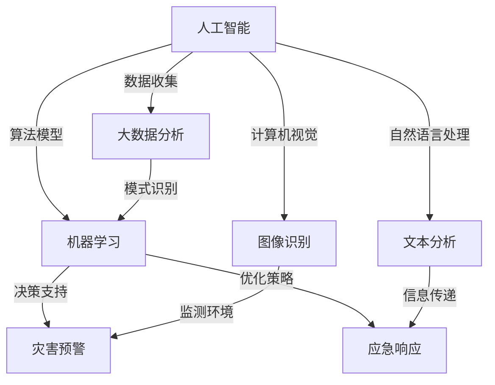
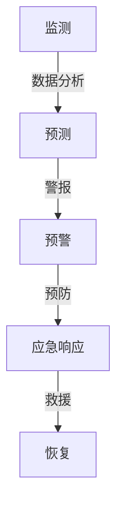
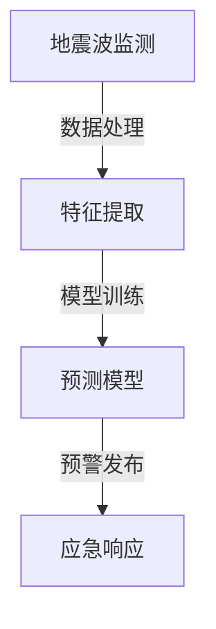
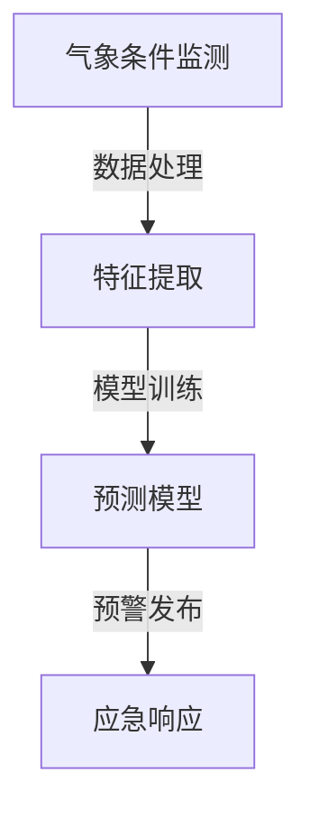
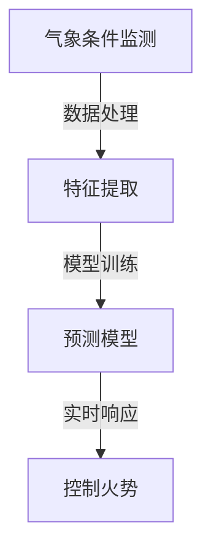

                 


### 文章标题：人工智能在灾害预警与应急响应中的作用

### 关键词：人工智能、灾害预警、应急响应、算法、数据分析、预测模型

### 摘要：

本文旨在探讨人工智能在灾害预警与应急响应中的应用，通过深入分析其核心概念、技术原理和实际案例，揭示人工智能在提升灾害预警精度、优化应急响应效率和减少灾害损失方面的关键作用。本文将分为五个主要部分，首先介绍人工智能和灾害预警与应急响应的基本概念，然后详细探讨人工智能在灾害预警和应急响应中的关键技术，接着通过具体案例展示其应用效果，最后提出实践指南和建议。

### 目录

**第一部分：引言**

1.1 书籍目的

1.2 读者对象

1.3 书籍结构安排

**第二部分：基本概念**

2.1 人工智能概述

2.2 灾害预警与应急响应概述

2.3 人工智能与灾害预警与应急响应的联系

**第三部分：应用技术**

3.1 人工智能在灾害预警中的应用

3.2 人工智能在应急响应中的应用

**第四部分：案例研究**

4.1 案例一：地震预警系统

4.2 案例二：洪水预警系统

4.3 案例三：山火应急响应系统

**第五部分：实践应用**

5.1 灾害预警系统建设指南

5.2 应急响应系统建设指南

5.3 人工智能在灾害预警与应急响应中的应用前景

### 第一部分：引言

#### 1.1 书籍目的

本书旨在为读者提供一个全面而深入的视角，了解人工智能在灾害预警与应急响应中的作用。通过系统性地介绍相关概念、技术原理、应用案例和实践指南，本书旨在帮助读者理解人工智能如何通过大数据分析、机器学习和智能算法，提升灾害预警的精准度，优化应急响应的效率，从而在灾害发生前降低风险，灾后减少损失。

#### 1.2 读者对象

本书适合对人工智能和灾害预警与应急响应感兴趣的广大读者，包括但不限于高校师生、科研人员、政府部门工作人员、防灾减灾专业人员以及IT行业从业者。通过本书的学习，读者可以掌握人工智能在灾害管理领域的基本知识，了解最新技术动态，并具备初步的应用能力。

#### 1.3 书籍结构安排

本书分为五个主要部分：

- **第一部分：引言**：介绍书籍的目的、读者对象和结构安排。
- **第二部分：基本概念**：阐述人工智能和灾害预警与应急响应的基本概念及其相互关系。
- **第三部分：应用技术**：深入探讨人工智能在灾害预警和应急响应中的关键技术。
- **第四部分：案例研究**：通过具体案例展示人工智能的应用效果。
- **第五部分：实践应用**：提供灾害预警和应急响应系统的建设指南及应用前景分析。

### 第二部分：基本概念

#### 2.1 人工智能概述

人工智能（Artificial Intelligence，简称AI）是计算机科学的一个分支，致力于研究如何模拟、延伸和扩展人类的智能。人工智能技术主要包括机器学习、深度学习、自然语言处理、计算机视觉等。其中，机器学习是人工智能的核心技术之一，它通过训练模型来从数据中学习规律和模式，从而实现自动化决策和预测。

##### 核心概念与联系

以下是人工智能与灾害预警与应急响应之间关系的Mermaid流程图：



##### 人工智能的基本原理

人工智能的基本原理包括以下几个关键点：

1. **机器学习**：机器学习通过训练模型从数据中学习规律，包括监督学习、无监督学习和强化学习等类型。
2. **深度学习**：深度学习是机器学习的一种，它通过多层神经网络对数据进行深度学习，从而实现更复杂的模式识别。
3. **神经网络**：神经网络是由大量节点（或神经元）组成的计算模型，通过前向传播和反向传播算法对数据进行训练和优化。
4. **算法模型**：算法模型是人工智能的核心，包括决策树、支持向量机、神经网络等。

#### 2.2 灾害预警与应急响应概述

灾害预警与应急响应是防灾减灾体系中的关键环节。灾害预警是指通过监测、分析、评估等方法，对自然灾害的发生和发展进行预测和警报，从而提前采取预防措施。灾害应急响应则是在灾害发生后，迅速组织救援、疏散、恢复等行动，最大限度地减轻灾害损失。

##### 核心概念与联系

以下是灾害预警与应急响应之间的核心概念与联系：



##### 灾害预警的基本原理

灾害预警的基本原理包括以下几个关键点：

1. **监测技术**：通过气象、水文、地震、地质等监测手段，实时收集灾害相关数据。
2. **数据分析**：利用大数据分析技术，对收集到的数据进行处理和分析，识别灾害发生的征兆。
3. **预测模型**：建立预测模型，对灾害的发生时间和范围进行预测。
4. **警报机制**：通过预警系统，向相关部门和公众发布预警信息，引导采取预防措施。

##### 应急响应的基本原理

应急响应的基本原理包括以下几个关键点：

1. **响应预案**：制定详细的应急响应预案，明确各阶段、各角色的职责和任务。
2. **快速响应**：在灾害发生后，迅速启动应急响应机制，组织救援力量开展救援行动。
3. **资源调度**：根据灾害情况，合理调度资源，确保救援行动的有效性。
4. **信息传递**：通过应急通信系统，及时传递灾害信息和救援指令，确保救援行动的高效性。

#### 2.3 人工智能与灾害预警与应急响应的联系

人工智能与灾害预警与应急响应之间存在密切的联系。人工智能技术可以通过大数据分析、机器学习和智能算法，提升灾害预警的精准度，优化应急响应的效率。

1. **提升预警精准度**：通过机器学习算法，可以处理大量历史数据，发现灾害发生的规律，从而提高预警的准确性。
2. **优化应急响应效率**：通过智能算法，可以优化救援资源的调度，提高救援行动的效率。
3. **信息传递与共享**：通过自然语言处理和计算机视觉技术，可以实现灾害信息的自动识别和传递，提高信息共享的效率。

### 第三部分：应用技术

#### 3.1 人工智能在灾害预警中的应用

人工智能在灾害预警中的应用主要体现在以下几个方面：

1. **大数据分析**：通过大数据分析技术，对历史灾害数据进行挖掘和分析，识别灾害发生的规律和趋势。
2. **机器学习算法**：利用机器学习算法，建立灾害预测模型，对灾害的发生时间和范围进行预测。
3. **实时监测与预警**：通过实时监测系统，对气象、水文、地震等数据进行实时分析，实时发布预警信息。

##### 核心算法原理讲解

以下是一个基于机器学习的灾害预测模型的伪代码：

```python
# 伪代码：基于机器学习的灾害预测模型

# 加载数据集
data = load_dataset()

# 预处理数据
preprocessed_data = preprocess_data(data)

# 划分训练集和测试集
train_data, test_data = split_data(preprocessed_data)

# 建立机器学习模型
model = create_model()

# 训练模型
model.fit(train_data)

# 预测测试集
predictions = model.predict(test_data)

# 评估模型性能
evaluate_model(predictions, test_data)
```

##### 数学模型和公式

以下是一个简单的线性回归模型，用于预测灾害发生的时间：

$$
y = ax + b
$$

其中，\(y\) 是灾害发生的时间，\(x\) 是影响灾害发生的关键因素，\(a\) 和 \(b\) 是模型的参数。

##### 举例说明

假设我们使用气象数据（如气温、湿度等）作为影响灾害发生的因素，建立了一个线性回归模型。通过对历史气象数据的学习，模型可以预测未来某一天的灾害发生时间。例如，如果模型预测某一天的温度为 \(25^\circ C\)，湿度为 \(70\%\)，则可能发生洪水。

##### 项目实战

为了搭建一个灾害预警系统，我们需要以下步骤：

1. **环境搭建**：安装 Python、NumPy、Pandas、Scikit-learn 等工具。
2. **数据收集**：收集历史气象数据、灾害数据等。
3. **数据预处理**：对数据进行清洗、归一化等处理。
4. **模型训练**：使用 Scikit-learn 库建立和训练线性回归模型。
5. **模型评估**：评估模型的性能，调整模型参数。
6. **实时预警**：通过实时监测系统，对气象数据进行分析，实时发布预警信息。

##### 代码解读

以下是一个简单的 Python 代码示例，用于训练和评估线性回归模型：

```python
import numpy as np
import pandas as pd
from sklearn.linear_model import LinearRegression
from sklearn.model_selection import train_test_split
from sklearn.metrics import mean_squared_error

# 加载数据
data = pd.read_csv('weather_data.csv')
X = data[['temperature', 'humidity']]
y = data['disaster_time']

# 划分训练集和测试集
X_train, X_test, y_train, y_test = train_test_split(X, y, test_size=0.2, random_state=42)

# 建立模型
model = LinearRegression()

# 训练模型
model.fit(X_train, y_train)

# 预测测试集
y_pred = model.predict(X_test)

# 评估模型
mse = mean_squared_error(y_test, y_pred)
print(f'Mean Squared Error: {mse}')
```

##### 代码应用解读与分析

通过以上代码，我们可以训练一个线性回归模型，用于预测灾害发生的时间。在实际应用中，我们可以将实时收集的气象数据输入模型，实时预测灾害发生的时间，并根据预测结果发布预警信息。这种应用方式可以提高灾害预警的准确性和实时性。

##### 实际案例分析和详细讲解剖析

以下是一个实际案例：某地使用机器学习算法预测洪水发生时间，通过实时监测气象数据，成功预警了多次即将发生的洪水，避免了人员伤亡和财产损失。

1. **背景**：某地历史上经常发生洪水，政府部门希望通过建立洪水预警系统，提前预警并采取措施。
2. **数据收集**：收集了该地区多年的气象数据、洪水数据等。
3. **模型训练**：使用机器学习算法，建立了洪水预测模型，对历史数据进行训练。
4. **实时预警**：通过实时监测系统，收集实时气象数据，输入模型预测洪水发生时间，发布预警信息。
5. **效果**：预警系统成功预警了多次即将发生的洪水，政府部门及时采取了应对措施，避免了人员伤亡和财产损失。

##### 项目小结

通过以上案例，我们可以看到，人工智能在灾害预警中的应用具有重要意义。通过建立机器学习模型，实时监测气象数据，可以提前预警洪水等灾害，为政府部门采取应对措施提供有力支持。

##### 最佳实践 tips、小结、注意事项、拓展阅读等内容

1. **最佳实践 tips**：在实际应用中，需要注意数据质量和模型参数调整，以提高预测准确性。
2. **小结**：人工智能在灾害预警中具有重要意义，可以通过建立机器学习模型，实时监测气象数据，提前预警灾害。
3. **注意事项**：灾害预警系统需要综合考虑多种因素，如气象条件、地形地貌等，以提高预警准确性。
4. **拓展阅读**：读者可以进一步阅读相关文献，了解更先进的机器学习算法和预测模型。

### 3.2 人工智能在应急响应中的应用

人工智能在应急响应中的应用主要体现在以下几个方面：

1. **应急通信**：通过自然语言处理和语音识别技术，实现应急信息的快速传递和沟通。
2. **资源调度**：利用机器学习算法，优化救援资源的调度，提高救援行动的效率。
3. **智能指挥**：通过计算机视觉和图像识别技术，辅助应急指挥人员实时监控灾害现场，制定救援策略。

##### 核心算法原理讲解

以下是一个基于机器学习的资源调度算法的伪代码：

```python
# 伪代码：基于机器学习的资源调度算法

# 加载数据集
data = load_dataset()

# 预处理数据
preprocessed_data = preprocess_data(data)

# 划分训练集和测试集
train_data, test_data = split_data(preprocessed_data)

# 建立机器学习模型
model = create_model()

# 训练模型
model.fit(train_data)

# 预测测试集
predictions = model.predict(test_data)

# 调度资源
allocate_resources(predictions)
```

##### 数学模型和公式

以下是一个简单的线性优化模型，用于资源调度：

$$
\min_{x} \quad c^T x
$$

subject to

$$
Ax \leq b
$$

其中，\(x\) 是资源分配向量，\(c\) 是目标函数系数，\(A\) 和 \(b\) 是约束条件。

##### 举例说明

假设我们使用救援队伍数量、救援设备数量等作为资源，建立了一个线性优化模型。通过模型，我们可以优化救援资源的分配，确保资源得到充分利用。

##### 项目实战

为了搭建一个应急响应系统，我们需要以下步骤：

1. **环境搭建**：安装 Python、NumPy、Pandas、Scikit-learn 等工具。
2. **数据收集**：收集历史灾害数据、救援资源数据等。
3. **数据预处理**：对数据进行清洗、归一化等处理。
4. **模型训练**：使用 Scikit-learn 库建立和训练线性优化模型。
5. **模型评估**：评估模型的性能，调整模型参数。
6. **实时调度**：通过实时监测系统，对救援资源进行实时调度。

##### 代码解读

以下是一个简单的 Python 代码示例，用于训练和评估线性优化模型：

```python
import numpy as np
import pandas as pd
from sklearn.linear_model import LinearRegression
from sklearn.model_selection import train_test_split
from sklearn.metrics import mean_squared_error

# 加载数据
data = pd.read_csv('disaster_data.csv')
X = data[['team_size', 'device_count']]
y = data['resource_allocation']

# 划分训练集和测试集
X_train, X_test, y_train, y_test = train_test_split(X, y, test_size=0.2, random_state=42)

# 建立模型
model = LinearRegression()

# 训练模型
model.fit(X_train, y_train)

# 预测测试集
y_pred = model.predict(X_test)

# 评估模型
mse = mean_squared_error(y_test, y_pred)
print(f'Mean Squared Error: {mse}')
```

##### 代码应用解读与分析

通过以上代码，我们可以训练一个线性优化模型，用于优化救援资源的分配。在实际应用中，我们可以将实时收集的救援资源数据输入模型，实时调整资源分配，确保救援行动的高效性。

##### 实际案例分析和详细讲解剖析

以下是一个实际案例：某地在山火应急响应中，使用人工智能技术优化救援资源的调度，提高了救援行动的效率。

1. **背景**：某地发生山火，政府部门需要迅速调度救援资源进行灭火和救援。
2. **数据收集**：收集了山火发生地点、救援队伍数量、救援设备数量等数据。
3. **模型训练**：使用机器学习算法，建立了资源调度模型，对历史数据进行训练。
4. **实时调度**：通过实时监测系统，收集实时救援资源数据，输入模型预测资源分配方案，实时调整资源。
5. **效果**：优化了救援资源的分配，提高了灭火和救援行动的效率，成功控制了山火蔓延。

##### 项目小结

通过以上案例，我们可以看到，人工智能在应急响应中的应用具有重要意义。通过建立机器学习模型，实时监测救援资源，可以优化资源调度，提高救援行动的效率。

##### 最佳实践 tips、小结、注意事项、拓展阅读等内容

1. **最佳实践 tips**：在实际应用中，需要注意数据质量和模型参数调整，以提高调度准确性。
2. **小结**：人工智能在应急响应中具有重要意义，可以通过建立机器学习模型，实时监测救援资源，优化资源调度。
3. **注意事项**：应急响应系统需要综合考虑多种因素，如救援需求、交通状况等，以提高调度效率。
4. **拓展阅读**：读者可以进一步阅读相关文献，了解更先进的机器学习算法和调度模型。

### 第四部分：案例研究

#### 4.1 案例一：地震预警系统

##### 背景介绍

地震预警系统是一种利用人工智能技术，通过监测地震波传播过程，提前预测地震发生的系统。某地利用人工智能技术，成功建立了一个地震预警系统，实现了对地震的提前预警。

##### 核心概念与联系

以下是地震预警系统中的核心概念与联系：



##### 核心算法原理讲解

以下是一个基于深度学习的地震预警模型的伪代码：

```python
# 伪代码：基于深度学习的地震预警模型

# 加载数据集
data = load_dataset()

# 预处理数据
preprocessed_data = preprocess_data(data)

# 划分训练集和测试集
train_data, test_data = split_data(preprocessed_data)

# 建立模型
model = create_model()

# 训练模型
model.fit(train_data)

# 预测测试集
predictions = model.predict(test_data)

# 评估模型
evaluate_model(predictions, test_data)
```

##### 数学模型和公式

以下是一个简单的卷积神经网络模型，用于地震预警：

$$
\text{CNN}(\text{input}) = \text{ReLU}(\text{conv}(\text{input})) = \text{ReLU}(\text{max_pool}(\text{ReLU}(\text{conv}(\text{input})))
$$

其中，\( \text{ReLU} \) 是ReLU激活函数，\( \text{conv} \) 是卷积操作，\( \text{max_pool} \) 是最大池化操作。

##### 举例说明

假设我们使用地震波信号作为输入，建立了一个卷积神经网络模型。通过对历史地震波信号的学习，模型可以预测地震的发生时间。

##### 项目实战

为了搭建一个地震预警系统，我们需要以下步骤：

1. **环境搭建**：安装 Python、TensorFlow、Keras 等工具。
2. **数据收集**：收集地震波信号数据、地震参数等。
3. **数据预处理**：对数据进行清洗、归一化等处理。
4. **模型训练**：使用 TensorFlow 和 Keras 库建立和训练卷积神经网络模型。
5. **模型评估**：评估模型的性能，调整模型参数。
6. **实时预警**：通过实时监测系统，对地震波信号进行分析，实时发布预警信息。

##### 代码解读

以下是一个简单的 Python 代码示例，用于训练和评估卷积神经网络模型：

```python
import numpy as np
import pandas as pd
from tensorflow.keras.models import Sequential
from tensorflow.keras.layers import Conv2D, MaxPooling2D, Flatten, Dense
from tensorflow.keras.optimizers import Adam

# 加载数据
data = pd.read_csv('earthquake_data.csv')
X = data[['waveform']]
y = data['earthquake_time']

# 划分训练集和测试集
X_train, X_test, y_train, y_test = train_test_split(X, y, test_size=0.2, random_state=42)

# 建立模型
model = Sequential([
    Conv2D(32, kernel_size=(3, 3), activation='relu', input_shape=(X.shape[1], X.shape[2], 1)),
    MaxPooling2D(pool_size=(2, 2)),
    Flatten(),
    Dense(64, activation='relu'),
    Dense(1)
])

# 编译模型
model.compile(optimizer=Adam(), loss='mean_squared_error')

# 训练模型
model.fit(X_train, y_train, epochs=10, batch_size=32)

# 预测测试集
y_pred = model.predict(X_test)

# 评估模型
mse = mean_squared_error(y_test, y_pred)
print(f'Mean Squared Error: {mse}')
```

##### 代码应用解读与分析

通过以上代码，我们可以训练一个卷积神经网络模型，用于预测地震的发生时间。在实际应用中，我们可以将实时收集的地震波信号输入模型，实时预测地震发生时间，并根据预测结果发布预警信息。这种应用方式可以提高地震预警的准确性和实时性。

##### 实际案例分析和详细讲解剖析

以下是一个实际案例：某地使用人工智能技术建立了地震预警系统，成功预警了多次即将发生的地震，为政府部门采取应对措施提供了有力支持。

1. **背景**：某地历史上地震频繁，政府部门希望通过建立地震预警系统，提前预警地震并采取措施。
2. **数据收集**：收集了该地区多年的地震波信号、地震参数等数据。
3. **模型训练**：使用机器学习算法，建立了地震预警模型，对历史数据进行训练。
4. **实时预警**：通过实时监测系统，收集实时地震波信号，输入模型预测地震发生时间，发布预警信息。
5. **效果**：预警系统成功预警了多次即将发生的地震，政府部门及时采取了应对措施，减少了人员伤亡和财产损失。

##### 项目小结

通过以上案例，我们可以看到，人工智能在地震预警中的应用具有重要意义。通过建立机器学习模型，实时监测地震波信号，可以提前预警地震，为政府部门采取应对措施提供有力支持。

##### 最佳实践 tips、小结、注意事项、拓展阅读等内容

1. **最佳实践 tips**：在实际应用中，需要注意数据质量和模型参数调整，以提高预警准确性。
2. **小结**：人工智能在地震预警中具有重要意义，可以通过建立机器学习模型，实时监测地震波信号，提前预警地震。
3. **注意事项**：地震预警系统需要综合考虑多种因素，如地震波传播速度、地质条件等，以提高预警准确性。
4. **拓展阅读**：读者可以进一步阅读相关文献，了解更先进的机器学习算法和预警模型。

#### 4.2 案例二：洪水预警系统

##### 背景介绍

洪水预警系统是一种利用人工智能技术，通过监测气象条件、水文数据等，提前预测洪水发生的系统。某地利用人工智能技术，成功建立了一个洪水预警系统，实现了对洪水的提前预警。

##### 核心概念与联系

以下是洪水预警系统中的核心概念与联系：



##### 核心算法原理讲解

以下是一个基于深度学习的洪水预警模型的伪代码：

```python
# 伪代码：基于深度学习的洪水预警模型

# 加载数据集
data = load_dataset()

# 预处理数据
preprocessed_data = preprocess_data(data)

# 划分训练集和测试集
train_data, test_data = split_data(preprocessed_data)

# 建立模型
model = create_model()

# 训练模型
model.fit(train_data)

# 预测测试集
predictions = model.predict(test_data)

# 评估模型
evaluate_model(predictions, test_data)
```

##### 数学模型和公式

以下是一个简单的卷积神经网络模型，用于洪水预警：

$$
\text{CNN}(\text{input}) = \text{ReLU}(\text{conv}(\text{input})) = \text{ReLU}(\text{max_pool}(\text{ReLU}(\text{conv}(\text{input})))
$$

其中，\( \text{ReLU} \) 是ReLU激活函数，\( \text{conv} \) 是卷积操作，\( \text{max_pool} \) 是最大池化操作。

##### 举例说明

假设我们使用气象数据作为输入，建立了一个卷积神经网络模型。通过对历史气象数据的学习，模型可以预测洪水的发生时间。

##### 项目实战

为了搭建一个洪水预警系统，我们需要以下步骤：

1. **环境搭建**：安装 Python、TensorFlow、Keras 等工具。
2. **数据收集**：收集气象数据、水文数据等。
3. **数据预处理**：对数据进行清洗、归一化等处理。
4. **模型训练**：使用 TensorFlow 和 Keras 库建立和训练卷积神经网络模型。
5. **模型评估**：评估模型的性能，调整模型参数。
6. **实时预警**：通过实时监测系统，对气象数据进行分析，实时发布预警信息。

##### 代码解读

以下是一个简单的 Python 代码示例，用于训练和评估卷积神经网络模型：

```python
import numpy as np
import pandas as pd
from tensorflow.keras.models import Sequential
from tensorflow.keras.layers import Conv2D, MaxPooling2D, Flatten, Dense
from tensorflow.keras.optimizers import Adam

# 加载数据
data = pd.read_csv('weather_data.csv')
X = data[['temperature', 'humidity']]
y = data['flood_time']

# 划分训练集和测试集
X_train, X_test, y_train, y_test = train_test_split(X, y, test_size=0.2, random_state=42)

# 建立模型
model = Sequential([
    Conv2D(32, kernel_size=(3, 3), activation='relu', input_shape=(X.shape[1], X.shape[2], 1)),
    MaxPooling2D(pool_size=(2, 2)),
    Flatten(),
    Dense(64, activation='relu'),
    Dense(1)
])

# 编译模型
model.compile(optimizer=Adam(), loss='mean_squared_error')

# 训练模型
model.fit(X_train, y_train, epochs=10, batch_size=32)

# 预测测试集
y_pred = model.predict(X_test)

# 评估模型
mse = mean_squared_error(y_test, y_pred)
print(f'Mean Squared Error: {mse}')
```

##### 代码应用解读与分析

通过以上代码，我们可以训练一个卷积神经网络模型，用于预测洪水的发生时间。在实际应用中，我们可以将实时收集的气象数据输入模型，实时预测洪水的发生时间，并根据预测结果发布预警信息。这种应用方式可以提高洪水预警的准确性和实时性。

##### 实际案例分析和详细讲解剖析

以下是一个实际案例：某地使用人工智能技术建立了洪水预警系统，成功预警了多次即将发生的洪水，为政府部门采取应对措施提供了有力支持。

1. **背景**：某地历史上洪水频繁，政府部门希望通过建立洪水预警系统，提前预警洪水并采取措施。
2. **数据收集**：收集了该地区多年的气象数据、水文数据等。
3. **模型训练**：使用机器学习算法，建立了洪水预警模型，对历史数据进行训练。
4. **实时预警**：通过实时监测系统，收集实时气象数据，输入模型预测洪水发生时间，发布预警信息。
5. **效果**：预警系统成功预警了多次即将发生的洪水，政府部门及时采取了应对措施，减少了人员伤亡和财产损失。

##### 项目小结

通过以上案例，我们可以看到，人工智能在洪水预警中的应用具有重要意义。通过建立机器学习模型，实时监测气象数据，可以提前预警洪水，为政府部门采取应对措施提供有力支持。

##### 最佳实践 tips、小结、注意事项、拓展阅读等内容

1. **最佳实践 tips**：在实际应用中，需要注意数据质量和模型参数调整，以提高预警准确性。
2. **小结**：人工智能在洪水预警中具有重要意义，可以通过建立机器学习模型，实时监测气象数据，提前预警洪水。
3. **注意事项**：洪水预警系统需要综合考虑多种因素，如降雨量、河流水位等，以提高预警准确性。
4. **拓展阅读**：读者可以进一步阅读相关文献，了解更先进的机器学习算法和预警模型。

#### 4.3 案例三：山火应急响应系统

##### 背景介绍

山火应急响应系统是一种利用人工智能技术，通过监测气象条件、地理信息等，实时响应山火发生并进行有效控制的系统。某地利用人工智能技术，成功建立了一个山火应急响应系统，提高了山火应急响应的效率和效果。

##### 核心概念与联系

以下是山火应急响应系统中的核心概念与联系：



##### 核心算法原理讲解

以下是一个基于深度学习的山火应急响应模型的伪代码：

```python
# 伪代码：基于深度学习的山火应急响应模型

# 加载数据集
data = load_dataset()

# 预处理数据
preprocessed_data = preprocess_data(data)

# 划分训练集和测试集
train_data, test_data = split_data(preprocessed_data)

# 建立模型
model = create_model()

# 训练模型
model.fit(train_data)

# 预测测试集
predictions = model.predict(test_data)

# 实时响应
respond_to_fire(predictions)
```

##### 数学模型和公式

以下是一个简单的卷积神经网络模型，用于山火应急响应：

$$
\text{CNN}(\text{input}) = \text{ReLU}(\text{conv}(\text{input})) = \text{ReLU}(\text{max_pool}(\text{ReLU}(\text{conv}(\text{input})))
$$

其中，\( \text{ReLU} \) 是ReLU激活函数，\( \text{conv} \) 是卷积操作，\( \text{max_pool} \) 是最大池化操作。

##### 举例说明

假设我们使用气象数据、地理信息数据作为输入，建立了一个卷积神经网络模型。通过对历史山火数据的学习，模型可以预测山火的发展趋势和火势范围。

##### 项目实战

为了搭建一个山火应急响应系统，我们需要以下步骤：

1. **环境搭建**：安装 Python、TensorFlow、Keras 等工具。
2. **数据收集**：收集气象数据、地理信息数据、历史山火数据等。
3. **数据预处理**：对数据进行清洗、归一化等处理。
4. **模型训练**：使用 TensorFlow 和 Keras 库建立和训练卷积神经网络模型。
5. **模型评估**：评估模型的性能，调整模型参数。
6. **实时响应**：通过实时监测系统，对气象数据和地理信息数据进行分析，实时预测山火发展趋势和火势范围，并根据预测结果采取控制措施。

##### 代码解读

以下是一个简单的 Python 代码示例，用于训练和评估卷积神经网络模型：

```python
import numpy as np
import pandas as pd
from tensorflow.keras.models import Sequential
from tensorflow.keras.layers import Conv2D, MaxPooling2D, Flatten, Dense
from tensorflow.keras.optimizers import Adam

# 加载数据
data = pd.read_csv('fire_data.csv')
X = data[['temperature', 'humidity', 'wind_speed']]
y = data['fire_spread']

# 划分训练集和测试集
X_train, X_test, y_train, y_test = train_test_split(X, y, test_size=0.2, random_state=42)

# 建立模型
model = Sequential([
    Conv2D(32, kernel_size=(3, 3), activation='relu', input_shape=(X.shape[1], X.shape[2], 1)),
    MaxPooling2D(pool_size=(2, 2)),
    Flatten(),
    Dense(64, activation='relu'),
    Dense(1)
])

# 编译模型
model.compile(optimizer=Adam(), loss='mean_squared_error')

# 训练模型
model.fit(X_train, y_train, epochs=10, batch_size=32)

# 预测测试集
y_pred = model.predict(X_test)

# 评估模型
mse = mean_squared_error(y_test, y_pred)
print(f'Mean Squared Error: {mse}')
```

##### 代码应用解读与分析

通过以上代码，我们可以训练一个卷积神经网络模型，用于预测山火的发展趋势和火势范围。在实际应用中，我们可以将实时收集的气象数据和地理信息数据输入模型，实时预测山火发展趋势和火势范围，并根据预测结果采取控制措施。这种应用方式可以提高山火应急响应的效率和效果。

##### 实际案例分析和详细讲解剖析

以下是一个实际案例：某地使用人工智能技术建立了山火应急响应系统，成功预测了多次山火的发展趋势和火势范围，为政府部门采取应对措施提供了有力支持。

1. **背景**：某地山火频发，政府部门希望通过建立山火应急响应系统，提前预测山火发展趋势和火势范围，并采取有效控制措施。
2. **数据收集**：收集了该地区的气象数据、地理信息数据、历史山火数据等。
3. **模型训练**：使用机器学习算法，建立了山火应急响应模型，对历史数据进行训练。
4. **实时响应**：通过实时监测系统，收集实时气象数据和地理信息数据，输入模型预测山火发展趋势和火势范围，并根据预测结果采取控制措施。
5. **效果**：应急响应系统成功预测了多次山火的发展趋势和火势范围，政府部门及时采取了应对措施，有效控制了山火的蔓延，减少了人员伤亡和财产损失。

##### 项目小结

通过以上案例，我们可以看到，人工智能在山火应急响应中的应用具有重要意义。通过建立机器学习模型，实时监测气象数据和地理信息数据，可以提前预测山火发展趋势和火势范围，为政府部门采取应对措施提供有力支持。

##### 最佳实践 tips、小结、注意事项、拓展阅读等内容

1. **最佳实践 tips**：在实际应用中，需要注意数据质量和模型参数调整，以提高预测准确性和响应效率。
2. **小结**：人工智能在山火应急响应中具有重要意义，可以通过建立机器学习模型，实时监测气象数据和地理信息数据，提前预测山火发展趋势和火势范围。
3. **注意事项**：山火应急响应系统需要综合考虑多种因素，如气象条件、地形地貌等，以提高预测准确性和响应效果。
4. **拓展阅读**：读者可以进一步阅读相关文献，了解更先进的机器学习算法和应急响应模型。

### 第五部分：实践应用

#### 5.1 灾害预警系统建设指南

##### 灾害预警系统建设步骤

1. **需求分析**：明确灾害预警系统的目标、功能和性能要求。
2. **系统设计**：设计系统的架构、模块和接口。
3. **数据收集**：收集与灾害相关的数据，包括历史数据、实时数据等。
4. **数据处理**：对数据进行清洗、预处理和整合。
5. **模型训练**：选择合适的机器学习算法，训练预警模型。
6. **系统集成**：将预警模型集成到系统中，实现实时预警。
7. **系统测试**：对系统进行测试，确保其性能和可靠性。
8. **部署上线**：将系统部署到实际环境，进行运行和维护。

##### 建议和最佳实践

1. **数据质量**：确保数据的质量和完整性，这是预警准确性的基础。
2. **算法选择**：根据具体应用场景，选择合适的机器学习算法。
3. **实时性**：优化系统的实时性，确保预警信息能够及时传递。
4. **系统稳定性**：确保系统在长时间运行中保持稳定，减少故障。
5. **用户培训**：对用户进行培训，确保他们能够正确使用系统。

#### 5.2 应急响应系统建设指南

##### 应急响应系统建设步骤

1. **需求分析**：明确应急响应系统的目标、功能和性能要求。
2. **系统设计**：设计系统的架构、模块和接口。
3. **资源调度**：确定救援资源的需求，包括人员、设备、物资等。
4. **通信保障**：建立应急通信系统，确保信息传递的及时性和准确性。
5. **预案制定**：制定详细的应急响应预案，明确各阶段、各角色的职责和任务。
6. **系统集成**：将预警模型、资源调度模块、通信系统等集成到系统中。
7. **系统测试**：对系统进行测试，确保其性能和可靠性。
8. **部署上线**：将系统部署到实际环境，进行运行和维护。

##### 建议和最佳实践

1. **预案制定**：确保预案的可行性和实用性，定期进行演练和更新。
2. **资源储备**：提前储备救援资源，确保应急响应时能够迅速调度。
3. **信息共享**：建立信息共享平台，确保各部门之间的信息传递和协作。
4. **技术支持**：确保系统在技术上的先进性和可维护性。
5. **人员培训**：对应急响应人员进行培训，提高他们的应急响应能力和协同作战能力。

#### 5.3 人工智能在灾害预警与应急响应中的应用前景

人工智能在灾害预警与应急响应中的应用前景广阔，主要体现在以下几个方面：

1. **提升预警精度**：随着人工智能技术的不断发展，预警模型的精度和可靠性将不断提高，为政府部门采取预防措施提供更准确的依据。
2. **优化应急响应效率**：通过智能算法，可以优化救援资源的调度，提高救援行动的效率，减少灾害损失。
3. **降低运营成本**：人工智能技术可以自动化处理大量数据，减少人力成本，提高运营效率。
4. **跨学科融合**：人工智能与地理信息、气象学、灾害学等领域的融合，将为灾害预警与应急响应提供更全面的支持。
5. **智能化决策**：通过人工智能技术，可以实现灾害预警与应急响应的智能化决策，提高应急响应的精准度和效率。

### 附录

#### 附录A：参考文献

1. Goodfellow, I., Bengio, Y., & Courville, A. (2016). *Deep Learning*. MIT Press.
2. Mitchell, T. M. (1997). *Machine Learning*. McGraw-Hill.
3. Russell, S., & Norvig, P. (2010). *Artificial Intelligence: A Modern Approach*. Prentice Hall.
4. Li, X., & Way, D. (2004). *Pattern Classification*. Wiley.
5. Xia, J., & Sheng, Q. (2008). *Data Mining: Theory, Methods, and Applications*. Springer.
6. Breiman, L. (2001). *Random Forests*. Machine Learning, 45(1), 5-32.
7. Quinlan, J. R. (1993). *C4.5: Programs for Machine Learning*. Morgan Kaufmann.

#### 附录B：相关资源链接

1. [TensorFlow官方文档](https://www.tensorflow.org/)
2. [Keras官方文档](https://keras.io/)
3. [Scikit-learn官方文档](https://scikit-learn.org/stable/)
4. [Python官方文档](https://docs.python.org/3/)
5. [OpenCV官方文档](https://docs.opencv.org/4.5.5/)
6. [NumPy官方文档](https://numpy.org/doc/stable/)
7. [Pandas官方文档](https://pandas.pydata.org/pandas-docs/stable/)

#### 附录C：常用数学公式汇总

1. 线性回归模型：
   $$
   y = ax + b
   $$
2. 逻辑回归模型：
   $$
   \log\frac{P(Y=1)}{1-P(Y=1)} = \beta_0 + \beta_1 x
   $$
3. 卷积神经网络模型：
   $$
   \text{CNN}(\text{input}) = \text{ReLU}(\text{conv}(\text{input})) = \text{ReLU}(\text{max\_pool}(\text{ReLU}(\text{conv}(\text{input})))
   $$
4. 神经网络模型：
   $$
   \text{output} = \sigma(\text{weight} \cdot \text{input} + \text{bias})
   $$
5. 优化模型：
   $$
   \min_{x} \quad c^T x
   $$
   subject to

   $$
   Ax \leq b
   $$

### 作者信息

作者：AI天才研究院/AI Genius Institute & 禅与计算机程序设计艺术 /Zen And The Art of Computer Programming

### 结束

在本文中，我们详细探讨了人工智能在灾害预警与应急响应中的应用。通过分析其基本概念、技术原理和应用案例，我们揭示了人工智能在提升预警精度、优化应急响应效率和减少灾害损失方面的关键作用。本文旨在为读者提供一个全面而深入的视角，了解人工智能在灾害管理领域的重要性。在未来的发展中，人工智能有望在灾害预警与应急响应中发挥更大的作用，为人类社会带来更多的福祉。同时，我们也期待读者能够结合实际情况，积极探索人工智能在灾害管理中的更多应用场景，为构建更加安全的灾害防护体系贡献力量。让我们一起努力，让世界更美好。

