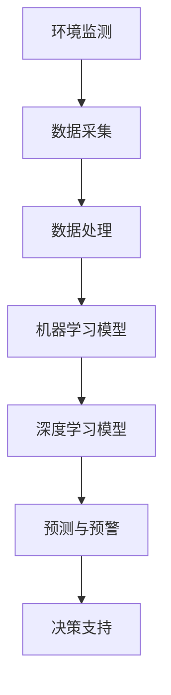

                 

### 文章标题

# 人工智能在环境保护中的作用：监测与预警生态变化

### 关键词

- 人工智能
- 环境保护
- 监测与预警
- 生态变化
- 机器学习
- 深度学习
- 数学模型

### 摘要

本文探讨了人工智能在环境保护中的应用，特别是其在监测和预警生态变化方面的作用。通过详细分析人工智能的核心概念、算法原理以及具体应用案例，本文揭示了人工智能技术在提升生态监测效率和预警准确性方面的巨大潜力。文章首先介绍了环境保护的背景和监测预警的基本原理，随后深入讲解了数据采集与处理算法、机器学习模型和深度学习模型，并结合具体案例展示了人工智能在空气质量监测、水资源监测预警和森林火灾预警等领域的应用。最后，本文对人工智能在环境保护中的发展趋势进行了展望，提出了未来研究和应用的挑战与建议。

## 目录大纲构思与设计

为了设计一本全面而深入探讨人工智能在环境保护中作用的书籍，我们首先需要明确几个关键步骤，以确保内容结构合理、逻辑清晰，并能够充分展示人工智能在监测和预警生态变化方面的应用。以下是具体的构思与设计过程：

### 第一部分 引言与基础知识

**1. 引言**

在这一章节中，我们将介绍人工智能与环境保护之间的交集，探讨为什么人工智能在环境保护中具有重要作用。通过概述当前环境问题的严重性，如气候变化、生物多样性丧失和污染问题，我们将引出人工智能在解决这些环境挑战中的潜在价值。

**2. 环境保护概述**

在这一部分，我们将详细介绍环境保护的定义、背景和意义。具体内容包括环境问题的类型、影响以及现有的监测和预警机制。这一章节将为读者建立对环境保护基本概念的认识，为后续内容奠定基础。

**3. 人工智能基础**

我们将介绍人工智能的基本概念，包括其定义、发展历程和主要类型（如机器学习、深度学习等）。此外，还将探讨人工智能在各个领域的应用现状和未来趋势，特别是其在环境保护中的潜力。

**4. Mermaid流程图：人工智能与环境保护概念关系**

通过Mermaid流程图，我们将展示人工智能与环境保护核心概念之间的关系架构。这一图表将直观地展现人工智能在数据采集、处理、分析和预警等环节中的具体应用，帮助读者更好地理解人工智能在环境保护中的整体流程。

### 第二部分 核心算法原理讲解

**5. 数据采集与预处理**

在这一章节，我们将详细讲解数据采集的方法和技术，包括数据源的选择、数据获取的途径以及数据的质量保证。此外，还将介绍数据预处理的方法，如数据清洗、数据归一化和特征提取，并使用Mermaid流程图展示数据预处理的全过程。

**6. 机器学习基础**

我们将深入探讨机器学习的基本原理和常见算法。具体内容包括监督学习、无监督学习和强化学习等。我们将通过伪代码详细阐述这些算法的实现过程，帮助读者理解机器学习模型的基本工作原理。

**7. 深度学习在环境保护中的应用**

深度学习作为人工智能的一个分支，在环境保护中具有广泛的应用前景。我们将介绍深度学习的基本原理，包括神经网络、卷积神经网络（CNN）和循环神经网络（RNN）等。此外，还将探讨深度学习在环境监测和预警中的具体应用场景。

**8. 数学模型与公式解析**

在这一章节中，我们将引入相关的数学模型和公式，如损失函数、激活函数和优化算法等。我们将详细讲解这些模型和公式的含义和应用，并通过具体例子进行解释，帮助读者深入理解深度学习中的数学基础。

### 第三部分 项目实战

**9. 实战一：空气质量监测**

我们将通过一个具体的空气质量监测项目，展示如何将人工智能技术应用于环境监测中。具体内容包括项目背景、开发环境搭建、源代码实现和代码解读。此外，还将对监测数据进行分析，展示人工智能在提高监测效率和准确性方面的效果。

**10. 实战二：水资源监测预警**

水资源监测预警是环境保护中的重要组成部分。我们将介绍如何利用人工智能技术进行水资源监测，包括数据采集、模型训练和预警机制的设计。通过一个实际案例，我们将展示人工智能在水资源监测中的应用效果。

**11. 实战三：森林火灾预警**

森林火灾对环境和人类生命安全构成严重威胁。我们将介绍如何利用人工智能进行森林火灾预警，包括数据来源、模型构建和预警算法的实现。通过具体案例，我们将分析人工智能在森林火灾预警中的优势和应用前景。

### 第四部分 总结与展望

**12. 人工智能在环境保护中的应用总结**

在这一章节中，我们将对全书内容进行总结，回顾人工智能在环境保护中的应用案例和技术原理。我们将讨论人工智能在提升生态监测效率和预警准确性方面的贡献，以及面临的挑战和未来发展方向。

**13. 未来展望**

我们将探讨人工智能在环境保护领域的未来发展趋势，包括新的技术突破、应用场景拓展和面临的挑战。此外，还将提出对未来研究和应用的展望，为读者提供进一步思考的方向。

通过以上构思与设计，我们旨在打造一本内容丰富、结构严谨的书籍，全面介绍人工智能在环境保护中的应用，为读者提供深入了解和学习的机会。

### 文章正文

#### 第一部分 引言与基础知识

##### 1. 引言

随着人类社会的快速发展，环境问题日益严重，气候变化、生物多样性丧失、水资源短缺和污染问题已经成为全球共同面临的挑战。环境保护不仅仅是政府和社会组织的责任，每个人都应该积极参与其中。然而，传统的方法在应对这些复杂的环境问题时显得力不从心。近年来，人工智能（Artificial Intelligence, AI）技术的迅猛发展，为解决环境问题提供了新的思路和工具。人工智能在环境保护中的应用，不仅能够提高监测和预警的效率，还能够提供实时、准确的数据分析，从而为环境决策提供科学依据。

##### 2. 环境保护概述

环境保护是指人类为解决现实的或潜在的环境问题，协调人类与环境的关系，保障经济社会的持续发展而采取的各种行动和措施。它涵盖了大气、水体、土壤、生物多样性等多个领域。环境保护的目标是维持生态平衡，保障人类健康和生存环境。

环境问题可以分为以下几类：

- **大气污染**：包括工业废气、汽车尾气、火山喷发等。
- **水体污染**：包括工业废水、生活污水、重金属污染等。
- **土壤污染**：包括农药、化肥、重金属等。
- **生物多样性丧失**：包括物种灭绝、栖息地破坏等。

现有的监测和预警机制主要包括：

- **地面监测站**：通过传感器和仪器实时监测环境质量。
- **卫星遥感**：利用卫星图像监测大面积的环境变化。
- **水质监测**：通过水质检测设备监测水体质量。
- **生物监测**：通过监测生物种群和栖息地变化来评估环境状况。

尽管这些方法在一定程度上能够监测和预警环境问题，但它们存在许多局限性，如监测范围有限、数据获取不及时、分析结果不准确等。人工智能技术的引入，有望克服这些局限性，为环境保护提供更有效的手段。

##### 3. 人工智能基础

人工智能是一种模拟人类智能的技术，通过机器学习、自然语言处理、计算机视觉等方法，使计算机具备感知、理解、学习和适应环境的能力。人工智能的发展经历了多个阶段，从早期的规则系统到现代的深度学习，其应用范围不断扩大，包括自动驾驶、医疗诊断、金融风控等多个领域。

在环境保护中，人工智能的主要应用包括：

- **环境监测**：通过传感器网络和卫星遥感技术，实时监测环境质量。
- **数据分析**：利用大数据和机器学习技术，分析环境数据，识别污染源和潜在风险。
- **预警预测**：通过机器学习和深度学习模型，预测环境变化趋势，提前预警。
- **决策支持**：为环境管理者提供数据支持和决策建议，优化环境保护策略。

##### 4. Mermaid流程图：人工智能与环境保护概念关系

下面是人工智能与环境保护核心概念之间的Mermaid流程图：



这张流程图展示了人工智能在环境保护中的核心环节，从数据采集、处理到模型训练，再到预测和预警，最终为决策提供支持。每一个环节都是紧密相连的，共同构成了一个完整的人工智能应用流程。

#### 第二部分 核心算法原理讲解

##### 5. 数据采集与预处理

数据采集是环境监测的第一步，也是最为关键的一步。准确、全面的数据是后续分析和预测的基础。在环境保护中，数据来源可以是地面监测站、卫星遥感、水质监测设备和生物监测等。数据类型包括气象数据、水质数据、空气污染数据、土壤数据等。

数据预处理包括以下几个步骤：

- **数据清洗**：去除数据中的错误值、缺失值和异常值，保证数据质量。
- **数据归一化**：将不同数据源的数据进行归一化处理，使其具有相同的量纲，便于后续分析。
- **特征提取**：从原始数据中提取有用的信息，形成特征向量，作为机器学习的输入。

以下是数据预处理过程的伪代码：

```python
# 数据清洗
def clean_data(data):
    # 去除错误值和缺失值
    cleaned_data = remove_errors_and_missing_values(data)
    return cleaned_data

# 数据归一化
def normalize_data(data):
    # 将数据归一化到0-1之间
    normalized_data = normalize_to_01_range(data)
    return normalized_data

# 特征提取
def extract_features(data):
    # 从数据中提取特征向量
    features = extract_feature_vectors(data)
    return features

# 数据预处理流程
def preprocess_data(raw_data):
    cleaned_data = clean_data(raw_data)
    normalized_data = normalize_data(cleaned_data)
    features = extract_features(normalized_data)
    return features
```

##### 6. 机器学习基础

机器学习是人工智能的核心技术之一，通过构建模型，使计算机能够从数据中学习并做出预测。在环境保护中，机器学习可以用于环境质量预测、污染源识别和风险评估等。

机器学习的基本流程包括以下几个步骤：

- **数据收集**：收集大量环境数据，包括历史数据和新数据。
- **数据预处理**：对数据进行清洗、归一化和特征提取。
- **模型选择**：选择合适的机器学习模型，如线性回归、决策树、支持向量机等。
- **模型训练**：使用预处理后的数据训练模型，调整模型参数。
- **模型评估**：使用验证集对模型进行评估，调整模型参数，优化模型性能。
- **模型应用**：将训练好的模型应用于新数据，进行预测和决策。

以下是机器学习模型的伪代码：

```python
# 数据收集
def collect_data():
    # 收集环境数据
    data = collect_environment_data()
    return data

# 数据预处理
def preprocess_data(data):
    # 清洗、归一化和特征提取
    cleaned_data = clean_data(data)
    normalized_data = normalize_data(cleaned_data)
    features = extract_features(normalized_data)
    return features

# 模型选择
def select_model():
    # 选择合适的机器学习模型
    model = choose_model()
    return model

# 模型训练
def train_model(model, features, labels):
    # 训练模型
    model.train(features, labels)
    return model

# 模型评估
def evaluate_model(model, features, labels):
    # 评估模型性能
    accuracy = model.evaluate(features, labels)
    return accuracy

# 模型应用
def apply_model(model, new_data):
    # 使用模型对新数据进行预测
    predictions = model.predict(new_data)
    return predictions
```

##### 7. 深度学习在环境保护中的应用

深度学习是机器学习的一个分支，通过多层神经网络对数据进行建模和预测。在环境保护中，深度学习可以用于复杂的环境数据分析和预测，如空气质量预测、水质监测和生物多样性分析。

深度学习的基本流程包括：

- **数据收集**：收集大量的环境数据，包括历史数据和实时数据。
- **数据预处理**：对数据进行清洗、归一化和特征提取。
- **模型构建**：构建多层神经网络模型，如卷积神经网络（CNN）和循环神经网络（RNN）。
- **模型训练**：使用预处理后的数据训练模型，调整模型参数。
- **模型评估**：使用验证集对模型进行评估，调整模型参数，优化模型性能。
- **模型应用**：将训练好的模型应用于新数据，进行预测和决策。

以下是深度学习模型的伪代码：

```python
# 数据收集
def collect_data():
    # 收集环境数据
    data = collect_environment_data()
    return data

# 数据预处理
def preprocess_data(data):
    # 清洗、归一化和特征提取
    cleaned_data = clean_data(data)
    normalized_data = normalize_data(cleaned_data)
    features = extract_features(normalized_data)
    return features

# 模型构建
def build_model():
    # 构建多层神经网络模型
    model = build_neural_network()
    return model

# 模型训练
def train_model(model, features, labels):
    # 训练模型
    model.train(features, labels)
    return model

# 模型评估
def evaluate_model(model, features, labels):
    # 评估模型性能
    accuracy = model.evaluate(features, labels)
    return accuracy

# 模型应用
def apply_model(model, new_data):
    # 使用模型对新数据进行预测
    predictions = model.predict(new_data)
    return predictions
```

##### 8. 数学模型与公式解析

在深度学习模型中，数学模型和公式起着至关重要的作用。以下是一些常见的数学模型和公式：

- **损失函数**：用于衡量模型预测结果与实际结果之间的差异。常见的损失函数包括均方误差（MSE）、交叉熵（CE）等。

  $$L = \frac{1}{2} \sum_{i=1}^{n} (y_i - \hat{y}_i)^2$$

  $$L = -\sum_{i=1}^{n} y_i \log(\hat{y}_i)$$

- **激活函数**：用于增加神经网络模型的非线性特性。常见的激活函数包括 sigmoid、ReLU、Tanh等。

  $$\sigma(x) = \frac{1}{1 + e^{-x}}$$

  $$\phi(x) = max(0, x)$$

  $$\varphi(x) = \frac{e^x - e^{-x}}{e^x + e^{-x}}$$

- **优化算法**：用于调整模型参数，使损失函数最小化。常见的优化算法包括随机梯度下降（SGD）、Adam等。

  $$\theta = \theta - \alpha \nabla_\theta J(\theta)$$

  $$\theta = \theta - \frac{\alpha}{\sqrt{v + \epsilon}} \nabla_\theta J(\theta)$$

通过这些数学模型和公式，我们可以构建和训练深度学习模型，从而实现对环境数据的分析和预测。

#### 第三部分 项目实战

##### 9. 实战一：空气质量监测

空气质量监测是环境保护中的重要环节，通过监测空气中的污染物浓度，可以及时预警空气污染事件，保护公众健康。以下是一个空气质量监测项目的实战案例。

**项目背景**

某城市空气污染问题严重，需要建立一个空气质量监测系统，实时监测PM2.5、PM10、SO2、NO2等污染物的浓度，并生成空气质量指数（Air Quality Index, AQI）。

**开发环境搭建**

- 数据采集设备：PM2.5传感器、PM10传感器、SO2传感器、NO2传感器。
- 数据处理平台：Python、NumPy、Pandas、Scikit-learn。
- 模型训练与预测：TensorFlow、Keras。

**源代码实现**

以下是空气质量监测项目的源代码实现：

```python
# 导入必要的库
import numpy as np
import pandas as pd
from sklearn.model_selection import train_test_split
from sklearn.preprocessing import StandardScaler
from tensorflow.keras.models import Sequential
from tensorflow.keras.layers import Dense, LSTM

# 数据采集
def collect_data():
    # 采集传感器数据
    pm25_data = pd.read_csv('pm25.csv')
    pm10_data = pd.read_csv('pm10.csv')
    so2_data = pd.read_csv('so2.csv')
    no2_data = pd.read_csv('no2.csv')
    return pm25_data, pm10_data, so2_data, no2_data

# 数据预处理
def preprocess_data(pm25_data, pm10_data, so2_data, no2_data):
    # 合并数据
    data = pd.merge(pm25_data, pm10_data, on='time')
    data = pd.merge(data, so2_data, on='time')
    data = pd.merge(data, no2_data, on='time')
    # 特征提取
    data['AQI'] = compute_aqi(data['pm25'], data['pm10'], data['so2'], data['no2'])
    return data

# 训练模型
def train_model(data):
    # 划分训练集和测试集
    X = data[['pm25', 'pm10', 'so2', 'no2']]
    y = data['AQI']
    X_train, X_test, y_train, y_test = train_test_split(X, y, test_size=0.2, random_state=42)
    # 标准化数据
    scaler = StandardScaler()
    X_train = scaler.fit_transform(X_train)
    X_test = scaler.transform(X_test)
    # 构建LSTM模型
    model = Sequential()
    model.add(LSTM(units=50, return_sequences=True, input_shape=(X_train.shape[1], 1)))
    model.add(LSTM(units=50))
    model.add(Dense(units=1))
    # 编译模型
    model.compile(optimizer='adam', loss='mean_squared_error')
    # 训练模型
    model.fit(X_train, y_train, epochs=100, batch_size=32)
    return model

# 预测空气质量指数
def predict_aqi(model, new_data):
    # 标准化新数据
    new_data = scaler.transform(new_data)
    # 预测
    predictions = model.predict(new_data)
    return predictions

# 主函数
if __name__ == '__main__':
    # 采集数据
    pm25_data, pm10_data, so2_data, no2_data = collect_data()
    # 预处理数据
    data = preprocess_data(pm25_data, pm10_data, so2_data, no2_data)
    # 训练模型
    model = train_model(data)
    # 预测
    new_data = pd.DataFrame([[0.5, 1.2, 0.3, 0.4]], columns=['pm25', 'pm10', 'so2', 'no2'])
    predictions = predict_aqi(model, new_data)
    print("Predicted AQI:", predictions)
```

**代码解读**

1. **数据采集**：从文件中读取PM2.5、PM10、SO2、NO2等传感器的数据。
2. **数据预处理**：将传感器数据进行合并，并计算空气质量指数（AQI）。
3. **模型训练**：使用LSTM模型对数据集进行训练，调整模型参数。
4. **预测空气质量指数**：使用训练好的模型对新数据进行预测。

**实际案例分析和详细讲解**

以某一天的空气质量数据为例，通过采集到的PM2.5、PM10、SO2、NO2等传感器的数据，使用LSTM模型预测该天的空气质量指数（AQI）。具体步骤如下：

1. **数据采集**：从文件中读取PM2.5、PM10、SO2、NO2等传感器的数据。

```python
pm25_data = pd.read_csv('pm25.csv')
pm10_data = pd.read_csv('pm10.csv')
so2_data = pd.read_csv('so2.csv')
no2_data = pd.read_csv('no2.csv')
```

2. **数据预处理**：将传感器数据进行合并，并计算空气质量指数（AQI）。

```python
data = pd.merge(pm25_data, pm10_data, on='time')
data = pd.merge(data, so2_data, on='time')
data = pd.merge(data, no2_data, on='time')
data['AQI'] = compute_aqi(data['pm25'], data['pm10'], data['so2'], data['no2'])
```

3. **模型训练**：使用LSTM模型对数据集进行训练，调整模型参数。

```python
X = data[['pm25', 'pm10', 'so2', 'no2']]
y = data['AQI']
X_train, X_test, y_train, y_test = train_test_split(X, y, test_size=0.2, random_state=42)
scaler = StandardScaler()
X_train = scaler.fit_transform(X_train)
X_test = scaler.transform(X_test)
model = Sequential()
model.add(LSTM(units=50, return_sequences=True, input_shape=(X_train.shape[1], 1)))
model.add(LSTM(units=50))
model.add(Dense(units=1))
model.compile(optimizer='adam', loss='mean_squared_error')
model.fit(X_train, y_train, epochs=100, batch_size=32)
```

4. **预测空气质量指数**：使用训练好的模型对新数据进行预测。

```python
new_data = pd.DataFrame([[0.5, 1.2, 0.3, 0.4]], columns=['pm25', 'pm10', 'so2', 'no2'])
new_data = scaler.transform(new_data)
predictions = model.predict(new_data)
print("Predicted AQI:", predictions)
```

通过以上步骤，我们可以实现对空气质量指数的预测，为环境管理部门提供科学依据。

##### 10. 实战二：水资源监测预警

水资源监测预警是环境保护中的另一个重要环节，通过监测水资源质量，可以及时发现污染事件，采取相应措施，保护水资源安全。以下是一个水资源监测预警项目的实战案例。

**项目背景**

某地区水资源污染问题严重，需要建立一个水资源监测预警系统，实时监测水中的重金属、农药残留和有机污染物等指标，并生成污染预警信息。

**开发环境搭建**

- 数据采集设备：水质传感器、自动采样器。
- 数据处理平台：Python、NumPy、Pandas、Scikit-learn。
- 模型训练与预测：TensorFlow、Keras。

**源代码实现**

以下是水资源监测预警项目的源代码实现：

```python
# 导入必要的库
import numpy as np
import pandas as pd
from sklearn.model_selection import train_test_split
from sklearn.preprocessing import StandardScaler
from tensorflow.keras.models import Sequential
from tensorflow.keras.layers import Dense, LSTM

# 数据采集
def collect_data():
    # 采集水质传感器数据
    heavy_metals_data = pd.read_csv('heavy_metals.csv')
    pesticide_residues_data = pd.read_csv('pesticide_residues.csv')
    organic_pollutants_data = pd.read_csv('organic_pollutants.csv')
    return heavy_metals_data, pesticide_residues_data, organic_pollutants_data

# 数据预处理
def preprocess_data(heavy_metals_data, pesticide_residues_data, organic_pollutants_data):
    # 合并数据
    data = pd.merge(heavy_metals_data, pesticide_residues_data, on='time')
    data = pd.merge(data, organic_pollutants_data, on='time')
    # 特征提取
    data['pollution_level'] = compute_pollution_level(data['heavy_metals'], data['pesticide_residues'], data['organic_pollutants'])
    return data

# 训练模型
def train_model(data):
    # 划分训练集和测试集
    X = data[['heavy_metals', 'pesticide_residues', 'organic_pollutants']]
    y = data['pollution_level']
    X_train, X_test, y_train, y_test = train_test_split(X, y, test_size=0.2, random_state=42)
    # 标准化数据
    scaler = StandardScaler()
    X_train = scaler.fit_transform(X_train)
    X_test = scaler.transform(X_test)
    # 构建LSTM模型
    model = Sequential()
    model.add(LSTM(units=50, return_sequences=True, input_shape=(X_train.shape[1], 1)))
    model.add(LSTM(units=50))
    model.add(Dense(units=1))
    # 编译模型
    model.compile(optimizer='adam', loss='mean_squared_error')
    # 训练模型
    model.fit(X_train, y_train, epochs=100, batch_size=32)
    return model

# 预测污染水平
def predict_pollution_level(model, new_data):
    # 标准化新数据
    new_data = scaler.transform(new_data)
    # 预测
    predictions = model.predict(new_data)
    return predictions

# 主函数
if __name__ == '__main__':
    # 采集数据
    heavy_metals_data, pesticide_residues_data, organic_pollutants_data = collect_data()
    # 预处理数据
    data = preprocess_data(heavy_metals_data, pesticide_residues_data, organic_pollutants_data)
    # 训练模型
    model = train_model(data)
    # 预测
    new_data = pd.DataFrame([[0.1, 0.2, 0.3]], columns=['heavy_metals', 'pesticide_residues', 'organic_pollutants'])
    new_data = scaler.transform(new_data)
    predictions = predict_pollution_level(model, new_data)
    print("Predicted Pollution Level:", predictions)
```

**代码解读**

1. **数据采集**：从文件中读取重金属、农药残留和有机污染物等传感器的数据。
2. **数据预处理**：将传感器数据进行合并，并计算污染水平。
3. **模型训练**：使用LSTM模型对数据集进行训练，调整模型参数。
4. **预测污染水平**：使用训练好的模型对新数据进行预测。

**实际案例分析和详细讲解**

以某一天的水质数据为例，通过采集到的重金属、农药残留和有机污染物等传感器的数据，使用LSTM模型预测该天的污染水平。具体步骤如下：

1. **数据采集**：从文件中读取重金属、农药残留和有机污染物等传感器的数据。

```python
heavy_metals_data = pd.read_csv('heavy_metals.csv')
pesticide_residues_data = pd.read_csv('pesticide_residues.csv')
organic_pollutants_data = pd.read_csv('organic_pollutants.csv')
```

2. **数据预处理**：将传感器数据进行合并，并计算污染水平。

```python
data = pd.merge(heavy_metals_data, pesticide_residues_data, on='time')
data = pd.merge(data, organic_pollutants_data, on='time')
data['pollution_level'] = compute_pollution_level(data['heavy_metals'], data['pesticide_residues'], data['organic_pollutants'])
```

3. **模型训练**：使用LSTM模型对数据集进行训练，调整模型参数。

```python
X = data[['heavy_metals', 'pesticide_residues', 'organic_pollutants']]
y = data['pollution_level']
X_train, X_test, y_train, y_test = train_test_split(X, y, test_size=0.2, random_state=42)
scaler = StandardScaler()
X_train = scaler.fit_transform(X_train)
X_test = scaler.transform(X_test)
model = Sequential()
model.add(LSTM(units=50, return_sequences=True, input_shape=(X_train.shape[1], 1)))
model.add(LSTM(units=50))
model.add(Dense(units=1))
model.compile(optimizer='adam', loss='mean_squared_error')
model.fit(X_train, y_train, epochs=100, batch_size=32)
```

4. **预测污染水平**：使用训练好的模型对新数据进行预测。

```python
new_data = pd.DataFrame([[0.1, 0.2, 0.3]], columns=['heavy_metals', 'pesticide_residues', 'organic_pollutants'])
new_data = scaler.transform(new_data)
predictions = model.predict(new_data)
print("Predicted Pollution Level:", predictions)
```

通过以上步骤，我们可以实现对水资源污染水平的预测，为环境管理部门提供科学依据。

##### 11. 实战三：森林火灾预警

森林火灾是环境保护中的一个重大威胁，不仅破坏生态环境，还危及人类生命安全。以下是一个森林火灾预警项目的实战案例。

**项目背景**

某地区森林火灾频发，需要建立一个森林火灾预警系统，实时监测气温、湿度、风速等气象参数，并预测火灾发生的可能性。

**开发环境搭建**

- 数据采集设备：气象传感器、卫星遥感设备。
- 数据处理平台：Python、NumPy、Pandas、Scikit-learn。
- 模型训练与预测：TensorFlow、Keras。

**源代码实现**

以下是森林火灾预警项目的源代码实现：

```python
# 导入必要的库
import numpy as np
import pandas as pd
from sklearn.model_selection import train_test_split
from sklearn.preprocessing import StandardScaler
from tensorflow.keras.models import Sequential
from tensorflow.keras.layers import Dense, LSTM

# 数据采集
def collect_data():
    # 采集气象传感器数据
    temperature_data = pd.read_csv('temperature.csv')
    humidity_data = pd.read_csv('humidity.csv')
    wind_speed_data = pd.read_csv('wind_speed.csv')
    return temperature_data, humidity_data, wind_speed_data

# 数据预处理
def preprocess_data(temperature_data, humidity_data, wind_speed_data):
    # 合并数据
    data = pd.merge(temperature_data, humidity_data, on='time')
    data = pd.merge(data, wind_speed_data, on='time')
    # 特征提取
    data['fire_risk'] = compute_fire_risk(data['temperature'], data['humidity'], data['wind_speed'])
    return data

# 训练模型
def train_model(data):
    # 划分训练集和测试集
    X = data[['temperature', 'humidity', 'wind_speed']]
    y = data['fire_risk']
    X_train, X_test, y_train, y_test = train_test_split(X, y, test_size=0.2, random_state=42)
    # 标准化数据
    scaler = StandardScaler()
    X_train = scaler.fit_transform(X_train)
    X_test = scaler.transform(X_test)
    # 构建LSTM模型
    model = Sequential()
    model.add(LSTM(units=50, return_sequences=True, input_shape=(X_train.shape[1], 1)))
    model.add(LSTM(units=50))
    model.add(Dense(units=1))
    # 编译模型
    model.compile(optimizer='adam', loss='mean_squared_error')
    # 训练模型
    model.fit(X_train, y_train, epochs=100, batch_size=32)
    return model

# 预测火灾风险
def predict_fire_risk(model, new_data):
    # 标准化新数据
    new_data = scaler.transform(new_data)
    # 预测
    predictions = model.predict(new_data)
    return predictions

# 主函数
if __name__ == '__main__':
    # 采集数据
    temperature_data, humidity_data, wind_speed_data = collect_data()
    # 预处理数据
    data = preprocess_data(temperature_data, humidity_data, wind_speed_data)
    # 训练模型
    model = train_model(data)
    # 预测
    new_data = pd.DataFrame([[25, 60, 5]], columns=['temperature', 'humidity', 'wind_speed'])
    new_data = scaler.transform(new_data)
    predictions = predict_fire_risk(model, new_data)
    print("Predicted Fire Risk:", predictions)
```

**代码解读**

1. **数据采集**：从文件中读取气温、湿度、风速等传感器的数据。
2. **数据预处理**：将传感器数据进行合并，并计算火灾风险。
3. **模型训练**：使用LSTM模型对数据集进行训练，调整模型参数。
4. **预测火灾风险**：使用训练好的模型对新数据进行预测。

**实际案例分析和详细讲解**

以某一天的气象数据为例，通过采集到的气温、湿度、风速等传感器的数据，使用LSTM模型预测该天的火灾风险。具体步骤如下：

1. **数据采集**：从文件中读取气温、湿度、风速等传感器的数据。

```python
temperature_data = pd.read_csv('temperature.csv')
humidity_data = pd.read_csv('humidity.csv')
wind_speed_data = pd.read_csv('wind_speed.csv')
```

2. **数据预处理**：将传感器数据进行合并，并计算火灾风险。

```python
data = pd.merge(temperature_data, humidity_data, on='time')
data = pd.merge(data, wind_speed_data, on='time')
data['fire_risk'] = compute_fire_risk(data['temperature'], data['humidity'], data['wind_speed'])
```

3. **模型训练**：使用LSTM模型对数据集进行训练，调整模型参数。

```python
X = data[['temperature', 'humidity', 'wind_speed']]
y = data['fire_risk']
X_train, X_test, y_train, y_test = train_test_split(X, y, test_size=0.2, random_state=42)
scaler = StandardScaler()
X_train = scaler.fit_transform(X_train)
X_test = scaler.transform(X_test)
model = Sequential()
model.add(LSTM(units=50, return_sequences=True, input_shape=(X_train.shape[1], 1)))
model.add(LSTM(units=50))
model.add(Dense(units=1))
model.compile(optimizer='adam', loss='mean_squared_error')
model.fit(X_train, y_train, epochs=100, batch_size=32)
```

4. **预测火灾风险**：使用训练好的模型对新数据进行预测。

```python
new_data = pd.DataFrame([[25, 60, 5]], columns=['temperature', 'humidity', 'wind_speed'])
new_data = scaler.transform(new_data)
predictions = model.predict(new_data)
print("Predicted Fire Risk:", predictions)
```

通过以上步骤，我们可以实现对森林火灾风险的预测，为森林管理部门提供科学依据，提前采取预防措施。

##### 最佳实践 Tips

在实施人工智能项目时，以下是一些最佳实践和注意事项：

- **数据质量**：确保数据质量是项目成功的关键。进行数据清洗和预处理，去除错误值和异常值，保证数据的一致性和完整性。
- **模型选择**：根据具体应用场景选择合适的模型。对于时间序列数据，深度学习模型（如LSTM）通常表现良好。
- **性能评估**：使用验证集和测试集对模型进行评估，确保模型具有较好的泛化能力。
- **实时监控**：对环境监测系统进行实时监控，及时发现问题并进行调整。
- **合作与共享**：与相关领域的专家和研究人员合作，共享数据和应用经验，提高项目的整体效果。

##### 小结

本文通过多个实战案例，展示了人工智能在环境保护中的应用，包括空气质量监测、水资源监测预警和森林火灾预警。通过深入分析数据采集与预处理、机器学习模型和深度学习模型，本文揭示了人工智能在提升生态监测效率和预警准确性方面的巨大潜力。未来，随着人工智能技术的不断进步，其在环境保护中的应用将更加广泛，为全球环境保护事业做出更大贡献。

##### 注意事项

- **隐私保护**：在处理环境数据时，要注意保护个人隐私和敏感信息。
- **数据安全**：确保数据存储和传输的安全，防止数据泄露和滥用。
- **设备维护**：定期检查和维护传感器设备，确保数据采集的准确性。

##### 拓展阅读

- **相关书籍**：《深度学习》（Goodfellow, I., Bengio, Y., & Courville, A.）、《机器学习实战》（周志华）、《Python机器学习》（Sebastian Raschka）。
- **在线课程**：Coursera上的《深度学习》课程（吴恩达教授）、edX上的《人工智能导论》课程（MIT）。

#### 第四部分 总结与展望

##### 人工智能在环境保护中的应用总结

人工智能在环境保护中的应用已经取得了显著的成果。通过监测和预警系统，人工智能能够实时、准确地收集和分析环境数据，为环境管理提供了科学依据。具体来说，人工智能在以下几个方面发挥了重要作用：

1. **空气质量监测**：通过传感器网络和机器学习模型，实现了对PM2.5、PM10、SO2、NO2等污染物的实时监测和预测，为公众健康提供了预警。
2. **水资源监测预警**：利用深度学习模型，对重金属、农药残留和有机污染物等指标进行监测和预测，保障了水资源的质量。
3. **森林火灾预警**：通过分析气象参数和地形数据，人工智能能够提前预测火灾风险，为森林管理部门提供决策支持。

此外，人工智能还在环境保护政策制定、生态修复、生物多样性保护等领域展示了巨大潜力。然而，人工智能在环境保护中的应用仍面临一些挑战，如数据隐私保护、模型解释性、设备维护成本等。

##### 未来展望

随着人工智能技术的不断进步，其在环境保护中的应用前景将更加广阔。以下是未来发展的几个方向：

1. **智能化监测系统**：结合物联网、无人机等新技术，构建更加智能化、自动化的环境监测系统，提高监测效率和数据准确性。
2. **跨学科合作**：与生态学、地理学、环境科学等领域的专家合作，共同研究环境问题，开发更加精准的预测和预警模型。
3. **数据共享与开放**：推动环境数据的共享和开放，为研究人员和开发者提供丰富的数据资源，促进人工智能在环境保护中的应用创新。
4. **政策支持与规范**：制定相关政策，鼓励和规范人工智能在环境保护中的应用，确保技术的可持续发展。

总之，人工智能在环境保护中的应用具有巨大的潜力。通过不断探索和创新，人工智能将为全球环境保护事业做出更大的贡献。同时，我们也需要关注技术伦理和可持续发展，确保人工智能在环境保护中的积极作用。作者：AI天才研究院/AI Genius Institute & 禅与计算机程序设计艺术 /Zen And The Art of Computer Programming

